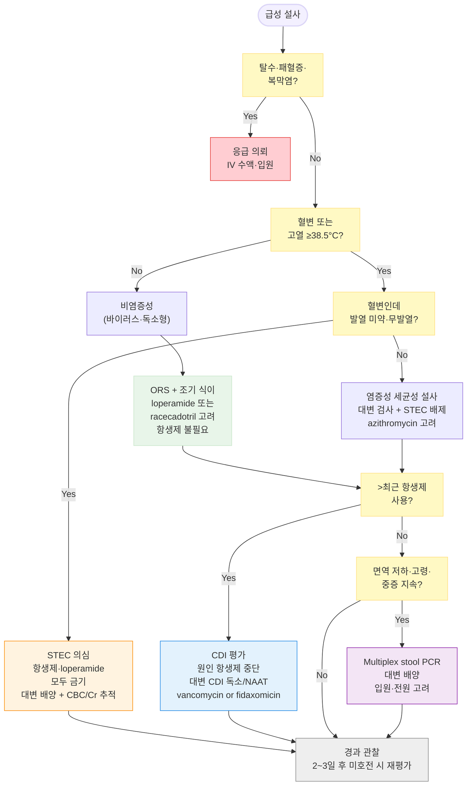

# 급성 설사 Acute Diarrhea

## <mark style="color:green;">일반 사항</mark>

* 정의 : 배변 횟수 ≥3회/일 또는 대변량 >200 g/일(성인 기준)의 액상·무른 변이 ≤14일 지속
  * 횟수보다 대변 형태(묽기)가 더 중요; 단단한 성형변(formed stool)의 단순 빈도 증가는 설사로 정의하지 않음
  * 전통적으로 ≤14일을 급성 설사로 정의하나, 최근 일부 문헌에서는 14\~30일을 prolonged/persistent diarrhea로 별도 분류하기도 함
* 부위와 대변량 : 소장 병변 → 대량, 수양성 설사; 대장 병변 → 소량, 혈액, 점액 혼재
* 경과 : 대부분 수일 내 자연 회복; ≥14일 지속 시 지속성·만성 설사 평가 (☞ [만성 설사](084_-chronic-diarrhea.md))

### <mark style="color:orange;">임상적 분류</mark>

<table><thead><tr><th width="210">분류</th><th width="230">기간·특징</th><th>주요 위험</th></tr></thead><tbody><tr><td>급성 물 설사</td><td>&#x3C;14일, 수양성</td><td>탈수</td></tr><tr><td>급성 혈성 설사</td><td>&#x3C;14일, 혈변·농변 동반</td><td>탈수, 패혈증</td></tr><tr><td>지속적 설사 (prolonged)</td><td>14~30일</td><td>탈수, 영양실조</td></tr><tr><td>영양실조 동반 설사</td><td>소모성 기저질환, 면역 저하</td><td>탈수, 심부전, 전신 감염</td></tr></tbody></table>

## <mark style="color:green;">원인</mark>

<table><thead><tr><th width="126">기전</th><th>주요 원인</th><th>임상 특징</th></tr></thead><tbody><tr><td><strong>삼투압 설사</strong></td><td>유당 불내성, 흡수불량 음식 성분, 삼투성 하제 과용</td><td>소량; 금식하면 감소</td></tr><tr><td><strong>분비 설사</strong></td><td>위장관 감염, <em>C. difficile</em>, 담즙산·지방산 자극</td><td>대량 수양성; 금식해도 지속; 정상 삼투압; 혈변(−)</td></tr><tr><td><strong>염증성 설사</strong></td><td><em>Salmonella, Shigella, Campylobacter, E. coli</em> (EIEC/STEC), <em>E. histolytica</em></td><td>소량; 혈변·농변; 발열</td></tr><tr><td><strong>운동 이상</strong></td><td>과민대장증후군, 세균 과증식, 갑상선 이상, 장 외 감염 (중이염·폐렴·요로 감염)</td><td>소량~중등량 무른 변</td></tr><tr><td><strong>비감염성</strong></td><td>약물 (항생제, Mg제제, PPI, metformin), 음식 알레르기, IBD</td><td>약물력·기저질환 확인이 핵심</td></tr></tbody></table>

* 감염성 설사의 주요 원인균 : 성인 - 노로바이러스(급성 위장관염의 약 50%). 영아 - 로타바이러스; 세균성 원인(중증)은 _Campylobacter_, _Salmonella_, _Shigella_, STEC 순

#### <mark style="color:$primary;">항생제 관련 설사 (Antibiotic-associated diarrhea, AAD)</mark>

* 기전 : 항생제 → 정상 장내 세균총 파괴 → 탄수화물 발효 이상 → 장관 내 삼투압·산도 변화
  * 항생제 투여 1일\~2개월 후 발생; 성인 항생제 사용자의 약 10\~25%에서 발생 (소아에서는 발생률이 상대적으로 낮음)
  * 약 20%는 _Clostridioides difficile_ infection(CDI)에 의함
  * PPI 병용 시 CDI 상대위험도(RR) 약 1.65배 증가
* 증상 : 경미한 설사, 복통·복부 산통, 발열
* 치료 : 원인 항생제 즉시 중단

**CDI 중증도별 치료**

<table><thead><tr><th width="86">중증도</th><th width="230">기준</th><th>치료</th></tr></thead><tbody><tr><td>비중증</td><td>WBC &#x3C;15,000/㎕ &#x26; <br>Cr 상승 &#x3C;1.5배</td><td>vancomycin 경구 125 ㎎ qid × 10일 <mark style="color:blue;">[반코마이신캡슐]</mark><br>또는 fidaxomicin 200 ㎎ bid × 10일 <mark style="color:blue;">[딥세시아정]</mark></td></tr><tr><td>중증</td><td>WBC ≥15,000/㎕ or <br>Cr ≥1.5배 상승</td><td>vancomycin 경구 125 ㎎ qid × 10일 (비중증과 동일 초기 용량)</td></tr><tr><td>전격성</td><td>저혈압, 쇼크, 장폐색, 복막염</td><td>vancomycin 경구/NG 500 ㎎ qid + IV metronidazole 500 ㎎ q8h; 입원 및 외과 협진</td></tr></tbody></table>

* metronidazole은 더 이상 CDI 1차 치료제로 권고되지 않음; 전격성 CDI에서 IV 보조 요법으로만 사용
* 치료 후 재발률 10\~20%; 재발 시 감염내과 협진


**CDI 치료 지침 개정** (ACG 2021 / IDSA·SHEA 2021) : 현재 지침에서는 비중증·중증 모두 vancomycin 또는 fidaxomicin을 1차 선택. Metronidazole은 치료 실패율이 높아 전격성 CDI의 보조 IV 요법 외에는 권고되지 않음

**CDI 진단 시 중요 원칙** : ⓵ NAAT(PCR) 단독 양성은 무증상 보균도 검출 가능 → 반드시 임상 증상과 함께 해석 (colonization vs. infection 구분); ⓶ 성형변(formed stool)은 CDI 검사 대상이 아님 → 설사가 있는 환자에서만 검사 시행


## <mark style="color:green;">임상 양상</mark>

* 비염증성 (수양성) : 발열·혈변 없음; 대부분 5일 내 회복; 바이러스·비침습성 세균 원인
* 염증성 (혈성·점액성) : 혈변·농변·발열; 침습성·독소 생성 세균 원인; 장 점막 파괴 동반

### <mark style="color:$danger;">🚩 Red Flags!</mark>

<mark style="color:$danger;">**즉각 조치 또는 응급 의뢰**</mark>

* 중등증\~중증 탈수 - 처짐·의식 변화·빈맥·저혈압·말초 청색증
* 지속적 구토로 경구 수액 요법 불가
* 면역 저하 환자 + 전신 독성 징후 (고열, 패혈증 의심 징후)
* 혈변 + 고열 + 전신 독성 동반 (세균혈증·독소 매개 장염 의심)

<mark style="color:$warning;">**당일 또는 조기 의뢰**</mark>

* 혈변 또는 농변 (발열 유무 불문)
* 심한 복통
* 발열 ≥38.5℃
* 6개월 미만 영아, 임신부 (발열 동반 시 _Listeria_ 감염 배제 필요)
* 집단 발생 또는 원내 발생 (입원 3일 이후)
* 최근 항생제 사용 + 설사 악화

<mark style="color:$info;">**외래 추적 / 추가 평가 계획**</mark> <mark style="color:$info;">- 즉각 위험 낮으나 호전 없으면 의뢰</mark>

* 2\~3일 후에도 호전되지 않는 경증 설사
* 고령(>65세), 만성 기저질환 (당뇨·심부전·만성 신질환 CKD - 탈수 시 AKI 위험 높음)
* 최근 항생제 사용력 (CDI 위험 모니터링)
* 설명할 수 없는 체중 감소
* 만성 설사(≥4주)로 진행 (☞ [만성 설사](084_-chronic-diarrhea.md))
* 가정에서 관리·추적이 어려운 경우

## <mark style="color:green;">진단</mark>

### <mark style="color:orange;">탈수 평가</mark>

* 경증 : 갈증, 구강 건조, 겨드랑이 땀 감소, 소변량 감소, 약간의 체중 감소
* 중등증 : 기립성 저혈압, 피부 장력 저하 (피부 텐트 현상), 함몰 안구, 모세혈관 재충혈 시간(CRT) >2초
* 중증 : 처짐, 둔한 반응, 약한 맥박, 저혈압, 말초 청색증, 쇼크

#### <mark style="color:$primary;">임상 탈수 척도 (Clinical Dehydration Scale, CDS)</mark>

<table><thead><tr><th width="128">평가 항목</th><th width="103">0점</th><th width="246">1점</th><th>2점</th></tr></thead><tbody><tr><td>전체적인 모습</td><td>정상</td><td>갈증·불안정·처짐 (자극 시 반응)</td><td>늘어짐·차가움·식은땀·혼수</td></tr><tr><td>눈</td><td>정상</td><td>약간 함몰</td><td>깊이 함몰</td></tr><tr><td>구강 점막</td><td>촉촉</td><td>끈적거림</td><td>건조</td></tr><tr><td>눈물</td><td>있음</td><td>감소</td><td>안 나옴</td></tr></tbody></table>

* 판정 : 0점=탈수 없음, 1\~4점=경증 탈수, 5\~8점=중등증\~중증 탈수
* 중등증 이상탈수 시 정맥 수액 요법(IV hydration) 시행

### <mark style="color:orange;">검사</mark>

* 경증 탈수, 급성 분비성 설사 : 검사 결과 대부분 정상; 별도 검사 불필요
  * 단, 고령이나 만성 신질환(CKD)·당뇨 등 기저질환자에서는 경증이라도 기본 혈액 검사 고려
* 중등증 이상 탈수 또는 >7일 지속 : 혈당, 전해질, BUN/Cr, U/A
* 경고 징후 (혈변·고열·전신 독성) : 대변 배양 검사, CBC, CRP 고려
  * CDI 의심 시 → 대변 _C. difficile_ 독소 검사 + NAAT(PCR); 단, 설사가 있는 환자에서만 시행(formal stool은 검사 대상 아님 ); NAAT 단독 양성 시 임상 증상과 함께 해석

**다중 분자 진단 검사 (Multiplex stool PCR panel)**

* 세균·바이러스·원충을 동시에 검출; 민감도 높고 결과 빠름 (배양보다 수 시간 내)
* 적응 : 중증 설사, 면역 저하 환자, 입원 환자, 집단 발생 조사
* 주의 : 민감도는 높으나 특이도가 낮아 과잉 진단 위험이 있음; 무증상 보균도 양성으로 나올 수 있어 임상 증상과 반드시 통합 해석
* 경증 자한성(자기 제한적, self-limiting) 설사에서는 routine 검사로 권고하지 않음

**분변 칼프로텍틴(Fecal calprotectin)**

* 장 점막 염증의 비침습적 마커; 급성 설사와 IBD(염증성 장질환)의 감별이 필요할 때 보조적으로 활용 가능
* 양성 시 대장내시경 등 추가 평가 고려

### <mark style="color:orange;">감별</mark>

#### <mark style="color:$primary;">설사와 감별해야 할 상태</mark>

* 가성 설사 (pseudodiarrhea) : 소량의 변을 자주 배출; 과민대장증후군, 직장염 관련
* 변실금 (fecal incontinence) : 직장 내용물의 불수의적 배출; 신경 근육 질환, 구조적 항문직장 문제
* 범람 설사 (overflow diarrhea) : 소량의 물 설사; 분변 매복(fecal impaction) 관련 → 직장 수지 검사(DRE) 로 진단
  * 범람 설사 - 노인 환자 주의 : 노인에서 갑자기 발생한 소량의 물 설사는 분변 매복을 원인으로 하는 범람 설사일 수 있음. 진단하지 못하면 불필요한 지사제 투여로 악화 가능. 직장 수지 검사(DRE)로 쉽게 진단 가능하며, 분변 제거 후 즉각 호전됨

#### <mark style="color:$primary;">증상·병력에 따른 원인 감별</mark>

<table><thead><tr><th width="242">역학·임상 단서</th><th>시사하는 원인</th></tr></thead><tbody><tr><td>최근 해외 여행력 (개발도상국)</td><td>여행자 설사 (ETEC, Campylobacter, Shigella, 원충) (☞ <a href="086_-travelers-diarrhea.md">여행자 설사</a>)</td></tr><tr><td>최근 항생제 사용</td><td>항생제 관련 설사, <em>C. difficile</em> 감염</td></tr><tr><td>날생선·어패류 섭취</td><td>Vibrio, 노로바이러스</td></tr><tr><td>집단 급식·뷔페 (수 시간 내 발병)</td><td>독소형 식중독 (S. aureus, B. cereus)</td></tr><tr><td>집단 급식·뷔페 (12~48시간 후 발병)</td><td>Salmonella, 노로바이러스</td></tr><tr><td>혈변 + 고열</td><td>침습성 세균 (Salmonella, Shigella, Campylobacter)</td></tr><tr><td>혈변 + 발열 미약·무발열</td><td>STEC 반드시 고려 - 항생제·loperamide 모두 금기 (HUS 위험)*</td></tr><tr><td>소아 + 혈변</td><td>STEC (O157:H7) → HUS 위험; 항생제·loperamide 모두 금기</td></tr><tr><td>임신부 + 발열 동반 설사</td><td><em>Listeria monocytogenes</em> - 대변 배양 + 혈액 배양 고려; 태아·모체 위험</td></tr><tr><td>입원 중 ≥3일 이후 발병</td><td><em>C. difficile</em> 감염</td></tr><tr><td>면역 저하 상태</td><td>기회감염 (Cryptosporidium, CMV, Isospora, MAC)</td></tr><tr><td>수양성 설사 + 구토 주증상 (단기 잠복기)</td><td>바이러스성 장염, 독소형 식중독</td></tr><tr><td>반복성·만성 경과 의심</td><td>IBD - 분변 칼프로텍틴(Fecal calprotectin) 검사 보조적 활용 가능</td></tr></tbody></table>

**\*STEC** (장관 출혈성 대장균) 유의 사항 : 혈변이 있는데 발열이 뚜렷하지 않은 경우 STEC를 반드시 고려; 항생제와 loperamide 모두 독소 방출 촉진 및 HUS(용혈성 요독 증후군) 위험을 증가시킬 수 있으므로 금기; 대변 배양 및 CBC/Cr 추적 필요

***



<p align="center"><strong>급성 설사 평가·치료 알고리듬</strong></p>

***

## <mark style="background-color:$warning;">Management</mark>

* **외래 치료 가능** : 다음 조건을 모두 충족 시 - 무혈변 / 발열 없음 / 경구 수분 가능 / 경증 탈수 → ORS + 조기 식이 + 증상 완화 치료
* **당일 재평가 필요** : 다음 중 하나 이상  해당 시 - 혈변 / 38.5℃ 이상 발열 / 심한 복통 / 고령·임신부·면역 저하·CKD / 72시간 이상 지속 → 대변 검사 ± 항생제 고려
* **응급 의뢰** : 다음 중 하나 이상 해당 시 - 쇼크 징후 / 의식 저하 / 지속적 구토로 수분 보충 불가 / CDS 5점 이상 (중증 탈수) / 패혈증 의심 / 심한 혈성 설사 → IV 수액 / 입원

### <mark style="color:orange;">표현형 기반 처방 방향 (Phenotype-driven approach)</mark>

<table><thead><tr><th width="210">표현형</th><th width="180">시사 원인</th><th width="220">치료 방향</th><th>주의</th></tr></thead><tbody><tr><td>수양성 + 무발열 + 무혈변</td><td>바이러스·비침습성 세균</td><td>ORS + 조기 식이<br>loperamide 또는 racecadotril 고려</td><td>항생제 불필요</td></tr><tr><td>수양성 + 구토 우세</td><td>바이러스·독소형 식중독</td><td>ORS + ondansetron 단회 고려<br>탈수 모니터링</td><td>항생제 불필요</td></tr><tr><td>혈변 + 발열 ≥38.5°C</td><td>침습성 세균</td><td>대변 검사 + STEC 배제<br>azithromycin 고려</td><td>loperamide 금기</td></tr><tr><td>혈변 + 발열 미약·무발열</td><td>⚠️ STEC 의심</td><td>대변 배양 + CBC/Cr 추적</td><td>항생제·loperamide 모두 금기 (HUS)</td></tr><tr><td>항생제 사용 후 설사</td><td>CDI</td><td>원인 항생제 중단<br>CDI 독소/NAAT (설사 있을 때만)<br>vancomycin or fidaxomicin</td><td>metronidazole 1차 사용 금지</td></tr><tr><td>고령·면역 저하·패혈증 의심</td><td>다양 (기회감염 포함)</td><td>Multiplex PCR/배양<br>입원 조기 고려</td><td>조기 에스컬레이션</td></tr></tbody></table>

### <mark style="color:orange;">치료 방침</mark>

* **수분 공급 (탈수 교정)** : 어린이와 쇠약한 노인, CKD 환자에서 특히 주의
* **식이 조절** : 과도한 음식 제한은 회복을 지연시킴; 탈수 교정 후 가능한 한 빨리 정상 식이로 복귀 권장
* **약물 치료** : 증상 완화 목적 (지사제, 흡착제, 항구토제)
* **항생제** : 대부분 불필요; 선택적으로만 적용 (☞ [감염성 설사](085_-acute-infectious-diarrhea.md))
* **예방** (☞ [여행자 설사](086_-travelers-diarrhea.md#undefined-11))

***

## <mark style="color:green;">비-약물 치료 및 예방</mark>

### <mark style="color:orange;">수분 공급</mark>

* **성인** : 갈증이 해소될 때까지 원하는 만큼 공급
* **소아 경증 탈수** : 설사 1회당 체중 ㎏당 10 ㎖; 중등증 탈수는 50~~100 ㎖/㎏을 3~~4시간에 걸쳐 공급

#### <mark style="color:$primary;">각 음료의 전해질 구성</mark>

<table><thead><tr><th width="210">종류</th><th width="130">Na (mEq/L)</th><th width="120">K (mEq/L)</th><th width="160">포도당 (mEq/L)</th><th>삼투압 (mOsm/L)</th></tr></thead><tbody><tr><td><strong>WHO ORS (저삼투압, 2002)</strong></td><td>75</td><td>20</td><td>75</td><td>245</td></tr><tr><td>Pedialyte®</td><td>45</td><td>20</td><td>140</td><td>250</td></tr><tr><td>게토레이®</td><td>20</td><td>3</td><td>255</td><td>360</td></tr><tr><td>사과 주스</td><td>2</td><td>30</td><td>690</td><td>730</td></tr><tr><td>탄산음료</td><td>3</td><td>0</td><td>700</td><td>750</td></tr></tbody></table>

_<mark style="color:$info;">Ref. Diagnosis and management of dehydration in children, Table 1. Am Fam Physician. 2009;80(7)</mark>_


**WHO ORS 2002 저삼투압 공식**: 삼투압 245 mOsm/L로 기존 고삼투압 ORS(311 mOsm/L)보다 구토 발생이 적고 정맥 수액 필요성을 줄임. 스포츠 음료·주스·탄산음료는 삼투압이 과도하게 높아 삼투압성 설사를 악화시킬 수 있으므로 ORS 대용으로 부적합.


#### <mark style="color:$primary;">자가 ORS 제조법</mark>

* **기본 ORS** : 물 1 L + **소금 3 g (평평하게 깎은 1/2 티스푼; 1 티스푼은 약 5\~6 g으로 과다)** + 설탕 18 g
  * ※ WHO 표준 : NaCl 2.6 g + 설탕 13.5 g/L; 가정에서는 3 g / 18 g 배합이 실용적
* **대체 ORS** : 다음 음료 1 L에 소금 3 g 첨가
  * 쌀미음, 닭 스프, 생수, 무가당 생과일주스, 플레인 요구르트, 무가당 묽은 차

### <mark style="color:orange;">식이</mark>

* **조기 정상 식이 복귀 권장** : 탈수 교정 후 가능한 한 빨리 평소 식사로 복귀 → 위장관 회복 촉진
  * 과도한 음식 제한은 회복을 지연시킴; 최신 소아·성인 가이드라인에서 공통적으로 조기 정상 식이를 강조
* **소량 자주** : 1일 5\~6회 소량씩 섭취; **금식은 금기**

#### <mark style="color:$primary;">권장 식품</mark>

* 흰 쌀밥, 흰 식빵, 토스트, 짭짤한 크래커
* 잘 삶은 싱거운 채소 (익힌 당근, 감자)
* **발효유(요구르트)** : 유제품이지만 유당 함량이 적고 유익균 포함; 급성기 일부 환자에서 소량 허용 가능 (단, 증상 악화 시 중단)
* **BRAT diet** (Banana, Rice, Applesauce, Toast) : 심한 구토 없는 설사 환자에서 단기간 보조적 사용 가능; 일반식보다 우월한지는 미입증

#### <mark style="color:$primary;">피해야 할 식품</mark>

* 맵거나 짜거나 단 자극적인 음식 (대부분의 외식, 찌개류, 인스턴트)
* 시판 음료 (스포츠 음료 포함) : 당분·삼투압 과다
* 불용성 섬유질·질긴 음식 : 잡곡밥, 뿌리채소, 브로콜리, 양배추
* 기름진 음식 : 고기, 튀김
* 면류 (라면, 자장면, 쫄면), 떡
* 유제품 (급성기 이차 유당 불내성 가능; 발효유 제외)
* 카페인 음료 (차, 커피, 탄산음료), 음주


**이차 유당 불내성 주의**: 급성 설사 후 소장 점막 손상 → 유당 분해효소(lactase) 일시적 감소 → 이차성 유당 불내성 발생 가능. 회복기 동안 일반 유제품(우유·아이스크림 등) 제한 권장; 발효유(요구르트)는 대부분 수 주 내 자연 회복 전에도 소량 허용 가능. 대부분 수 주 내 자연 회복.


#### <mark style="color:$primary;">식사에 따른 문제</mark>

* **단백질** : 손상된 장 점막을 통해 항원성 단백질 유입 → 음식 민감성 장병증 유발 가능
* **탄수화물** : 유당 분해효소 감소로 유당 흡수 장애 → 대장에서 발효 → 삼투압 설사 유발
  * 만성 설사 지속 시 2차성 유당 불내성 → 영양 결핍 → 장 점막 회복 지연 → 설사 지속의 악순환

### <mark style="color:orange;">음식 안전 수칙 (예방)</mark>

* 멸균되지 않은 우유 또는 함유 식품 섭취 금지
* 날 과일·채소는 식사 전 철저히 세척
* 냉장 **≤5℃ (국내 식품안전 기준) / ≤4.4℉ (국제 기준)**, 냉동 ≤−17.8℃ 유지
* 조리 즉석식품·부패하기 쉬운 음식은 신속히 섭취
* 생고기·생선·가금류는 다른 식품과 분리 보관; 취급 후 손·칼·도마 세척
* 가금류 조리 내부 온도 : 갈은 쇠고기 71℃, 닭 77℃, 돼지 63℃
* 생선회 등 날생선 섭취 주의 (냉동으로 일부 균 사멸 가능)
* 계란은 노른자가 굳을 때까지 완전히 익힘
* 조리된 음식을 실온에 2시간 이상 (실온 >32℃인 경우 1시간 이상) 방치 금지

***

## <mark style="color:green;">약물 치료</mark>

　☞ [소화기계 약제](073_.md#antidiarrheal-agent)

### <mark style="color:orange;">항생제 적응 판단</mark>


**경험적 항생제를 고려하는 경우**\
✔ 고열 + 혈성 설사 (침습성 세균 의심)\
✔ 중증 여행자 설사\
✔ 면역 저하 환자\
✔ 패혈증 의심\
✔ 중증 Campylobacter / Shigella 의심\
✔ 고령 + 중증 전신 증상



⚠️ **경험적 항생제를 피해야 하는 경우**\
✘ **STEC 의심** (혈변 + 발열 미약·무발열) - 항생제가 독소 방출을 촉진하여 HUS 위험 증가\
✘ 단순 바이러스성 수양성 설사\
✘ 경증 자한성(자기제한적, self-limiting) 설사


* **대부분의 급성 설사는 바이러스 원인**으로 항생제가 도움이 되지 않으며, 침습성 세균성 설사도 대부분 수일 내 자연 치유
* 세균성 감염성 설사 적응 시 (☞ [감염성 설사](085_-acute-infectious-diarrhea.md#undefined-12))
* **경험적 치료** (여행자 설사, 발열 동반 혈성 설사) : azithromycin 1 g 1회 또는 500 ㎎ qd × 3일 <mark style="color:blue;">\[지스로맥스]</mark>

### <mark style="color:orange;">장 운동 조절제 (Antimotility agents)</mark>

* **loperamide** : 장 μ-opioid receptor 자극 → 장 운동 억제·통과 시간 연장, 수분 흡수 증가; 설사 기간 단축
  * **OTC 기준 최대 8 ㎎/일**; 의사 처방하 최대 **16 ㎎/일**까지 사용 가능하나 일반 외래에서는 안전성을 위해 8 ㎎/일 보수적 사용 권장 <mark style="color:blue;">\[로프민]</mark>
  * ⚠️ **사용 제한 / 금기** : 혈변, 고열, 전신 독성, 침습성 세균 감염, _C. difficile_ 감염, **STEC 의심** (HUS 위험), **IBD(궤양성 대장염) 활성기** (독성 거대결장 유발 위험)


⚠️ **Loperamide 주요 위험**\
① **고용량 심독성 (FDA 경고)**: 권장 용량 초과 시 QT 연장·Torsades de Pointes 위험. 최대 용량 준수 및 환자 교육 필수.\
② **IBD 활성기 금기**: 궤양성 대장염(UC) 활성기에서 독성 거대결장(toxic megacolon) 유발 가능.


* **cimetropium** : 항콜린 작용, 장경련 완화; 50 ㎎ tid <mark style="color:blue;">\[알기론]</mark>
* **tiropramide** : 장 평활근 이완; 100 ㎎ bid\~tid <mark style="color:blue;">\[티로파]</mark>

### <mark style="color:orange;">분비 억제제</mark>

* **racecadotril** : **enkephalinase 억제** → 장 점막 과분비 억제; **장 운동에는 영향 없음** (loperamide와 달리 마비성 장폐색·복부 팽만 위험 없음)
  * 용법 : 1.5 ㎎/㎏ tid <mark style="color:blue;">\[하이드라섹]</mark> (국내 소아 <12세 정규 허가)
  * 성인 급성 수양성 설사에서 일부 연구 효과 보고 있으나, 국내에서 성인 사용은 **적응외(off-label)** 임을 고지 필요


**racecadotril vs. loperamide**: racecadotril은 장 운동을 억제하지 않아 소아 급성 바이러스성 설사에서 loperamide 대신 선호. 분비 억제 효과는 유사하면서 복부 팽만·변비·장폐색 부작용이 현저히 적음.


### <mark style="color:orange;">흡착제</mark>

* **bismuth** : 항염·항균 작용; 여행자 설사 증상 완화, 바이러스성 위장염 관련 구토 완화
  * 30 ㎖ 또는 2정 (262 ㎎/정) × 1\~4시간마다, 1일 최대 8회; ≥3세 적용
* **dioctahedral smectite** : 병원성 세균·독소·바이러스·담즙산 흡착 배설; 3 g tid <mark style="color:blue;">\[스타빅]</mark>
  * **24개월 미만 소아 사용 금기; 임부·수유부 사용 금기** (식약처 권고)
* **galactosidase** : 유당 불내성에 의한 설사에 적용 <mark style="color:blue;">\[갈타제]</mark>

### <mark style="color:orange;">항구토제</mark>

* 대부분 불필요; 구토로 경구 수액 보충이 어려운 경우에 한해 고려
* **ondansetron** : 심한 구토에 효과적; 소아 급성 위장관염에서 탈수 감소 및 입원율 감소 효과 입증 <mark style="color:blue;">\[조프란]</mark>
  * **단회(single dose) 투여를 원칙**으로 하며, 반복 사용 시 설사 증가 가능성 보고
  * ※ 소아에서 급성 위장관염 적응 보험 적용 제한 있음; 처방 전 보험 기준 확인 권장
* ※ 위장 운동 촉진제 (metoclopramide, domperidone)는 급성 설사에서 효과 입증 미흡

### <mark style="color:orange;">기타</mark>

#### <mark style="color:$primary;">Probiotics</mark>

* 대부분의 급성 자한성(자기제한적, self-limiting) 설사에서 **routine probiotics 사용은 권고하지 않음** (AGA 2020)
  * 급성 위장관염, IBS, IBD, CDI 등 대부분의 소화기 질환에 적용 비권고; **면역 저하자 금기**
* 다만 일부 균주는 다음에서 제한적 이득 가능성 보고:
  * _S. boulardii_, _L. rhamnosus_ GG : **항생제 관련 설사**
  * _L. rhamnosus_ GG : **소아 로타바이러스 설사** - 설사 기간 단축 효과 일부 메타분석에서 확인
* 표준화된 용량·치료법 없음; 균주 간 효과 차이 불명확
* **Saccharomyces boulardii** 500 ㎎/일 × ≥7일 또는 설사 소실 시까지 <mark style="color:blue;">\[비오플]</mark>
* **Lactobacillus rhamnosus GG** 1~~2 × 10¹⁰~~10¹¹ CFU/일 × ≥7일 <mark style="color:blue;">\[람노스]</mark>
  * [보험기준](https://www.hira.or.kr/rc/insu/insuadtcrtr/InsuAdtCrtrPopup.do?mtgHmeDd=20130901\&sno=1\&mtgMtrRegSno=0032) : <6세 급성 감염성 설사 / <6세 항생제 연관 설사 / 괴사성 장염

#### <mark style="color:$primary;">아연</mark>

* 아연 결핍 환자의 급성 설사에서 설사 기간·중증도 경감, 재발 방지 효과
  * 평소 적절한 영양 섭취자에서는 아연 결핍이 드물어 적응이 제한적
* 용법 : 20 ㎎/일 × 10\~14일

***

### <mark style="color:red;">질병코드</mark>

K52 기타 비감염성 위장염 및 결장염\
K59.1 기능성 설사\
E86 용적 고갈

***

## <mark style="color:purple;">처방례</mark>

> **처방례 1. 경증 급성 설사 (성인, 장경련 동반)**
>
> ```
> 티로파 100 ㎎/T　　3T  #3
> 스타빅 20 ㎖/포　　3포 #3  식간 복용
> 람노스 250 ㎎/C　　3C  #3  (보험 주의)
> ```
>
> _✽장경련·복통을 동반한 경증 설사의 기본 처방. smectite(스타빅)는 독소·바이러스 흡착 효과. 람노스는 보험기준(<6세) 외 적용 시 비급여._

> **처방례 2. 경증\~중등증 급성 설사 (성인, 혈변·발열 없는 수양성 설사)**
>
> ```
> 로프민 2 ㎎/C　　  1C  필요시  (최대 4회/일)
> 스타빅 20 ㎖/포　　3포 #3  식간 복용
> ```
>
> _✽혈변·고열·전신 독성·IBD 기저질환이 없는 수양성 설사에서 loperamide로 증상 완화. 혈변 또는 발열 38.5℃ 이상 발생 시 즉시 중단하고 내원하도록 지도._

> **처방례 3. 항생제 관련 C. difficile 설사 (비중증\~중증)**
>
> ```
> 반코마이신캡슐 125 ㎎/C　　4C  #4  ×10일
> ```
>
> _✽CDI 확진 또는 강한 임상적 의심 시 원인 항생제 즉시 중단 후 vancomycin 경구 투여 (비중증·중증 동일 초기 용량). 재발 시 fidaxomicin(딥세시아정 200 ㎎ bid × 10일) 또는 감염내과 협진. 전격성 CDI (저혈압·쇼크·장폐색)는 vancomycin 500 ㎎ qid + IV metronidazole 병용 후 입원._

***

### <mark style="color:$success;">핵심 복약 지도</mark>

1. **수분 보충이 치료의 핵심입니다.** 설사로 잃은 수분을 ORS(경구 수액제)나 묽은 쌀미음으로 충분히 보충하세요. 스포츠 음료·탄산음료는 삼투압이 높아 설사를 오히려 악화시킬 수 있으므로 수분 보충에 적합하지 않습니다.
2. **지사제(로프민)는 혈변·고열이 있을 때 절대 사용하지 마세요.** 세균성 설사에서는 증상이 악화되거나 장폐색이 생길 수 있습니다. 처방된 용량을 반드시 지키고, 초과 복용 시 심장 부정맥이 생길 수 있습니다. 대장염(궤양성 대장염 등) 기저질환이 있는 분은 반드시 의사와 상의 후 사용하세요.
3. **흡착제(스타빅)는 식간에, 다른 약과 2시간 간격을 두고 복용하세요.** 장 내 독소·세균을 흡착하는 작용이 있어 다른 약과 동시에 복용하면 다른 약의 흡수를 방해할 수 있습니다. **만 2세 미만 영아, 임산부·수유 중에는 사용을 삼가세요.**
4. **음식은 빨리 정상화하세요.** 금식은 오히려 회복을 늦춥니다. 흰 쌀밥, 잘 익힌 채소, 짭짤한 크래커 등 소화하기 쉬운 음식을 소량씩 자주 드세요. 급성기에는 유제품(요구르트는 소량 가능)·기름진 음식·커피·음주는 삼가세요.
5. **이런 증상이 생기면 즉시 내원하세요.** ① 혈변 또는 고름 같은 변 ② 발열 38.5℃ 이상 ③ 심한 복통 ④ 물도 삼키기 어려울 정도의 구토 ⑤ 2\~3일이 지나도 호전되지 않는 경우.

***

### <mark style="color:blue;">환자 안내서</mark>

**급성 설사 - 가정 관리 안내**

**설사란 무엇인가요?**\
하루에 3번 이상 묽고 물 같은 변이 나오는 상태입니다 (단단한 바나나 모양 변의 단순 빈도 증가는 설사가 아닙니다). 대부분은 바이러스 감염이 원인이며, 특별한 치료 없이도 3\~5일 내에 자연히 회복됩니다.

**가정에서 할 수 있는 것**

* **수분 보충** : 설사·구토로 잃은 수분을 보충하는 것이 가장 중요합니다. 약국에서 구입할 수 있는 경구 수액제나 직접 만든 ORS(물 1 L + 소금 평평하게 깎은 1/2 티스푼 + 설탕 2큰술), 묽은 쌀미음을 조금씩 자주 드세요.
* **음식** : 금식하지 마세요. 흰 쌀밥, 잘 익힌 채소, 토스트를 조금씩 자주 드세요. 기름진 음식, 커피, 술은 피하고, 요구르트는 소량 허용 가능합니다. 일반 우유·치즈 등의 유제품은 급성기에 삼가세요.
* **휴식** : 충분히 쉬세요.

**스포츠 음료·주스·탄산음료는 피하세요.** 당분이 많고 삼투압이 높아 설사를 오히려 악화시킵니다.

**주의하세요 - 아래 증상이 있으면 즉시 병원에 오세요**

* 변에 피가 섞이거나 고름 같은 변이 나올 때
* 38.5℃ 이상의 고열
* 물도 삼키기 어려울 정도의 심한 구토
* 입이 마르고, 소변이 거의 나오지 않고, 기운이 없어질 때 (탈수 증상)
* 심한 복통
* 2\~3일이 지나도 호전이 없을 때
* 6개월 미만 영아 또는 65세 이상 노인에서 발생한 경우
* 신장이 안 좋으신 분은 탈수가 신기능 악화로 이어질 수 있으므로 빨리 내원하세요

**설사 중 다른 사람에게 옮기지 않으려면**

* 외출 후, 식사 전, 화장실 사용 후 비누로 손을 20초 이상 씻으세요.
* 설사 중에는 음식 조리를 삼가고, 수건·식기를 다른 사람과 공유하지 마세요.
* 증상이 소실된 후 48\~72시간까지 전염성이 남을 수 있습니다.
