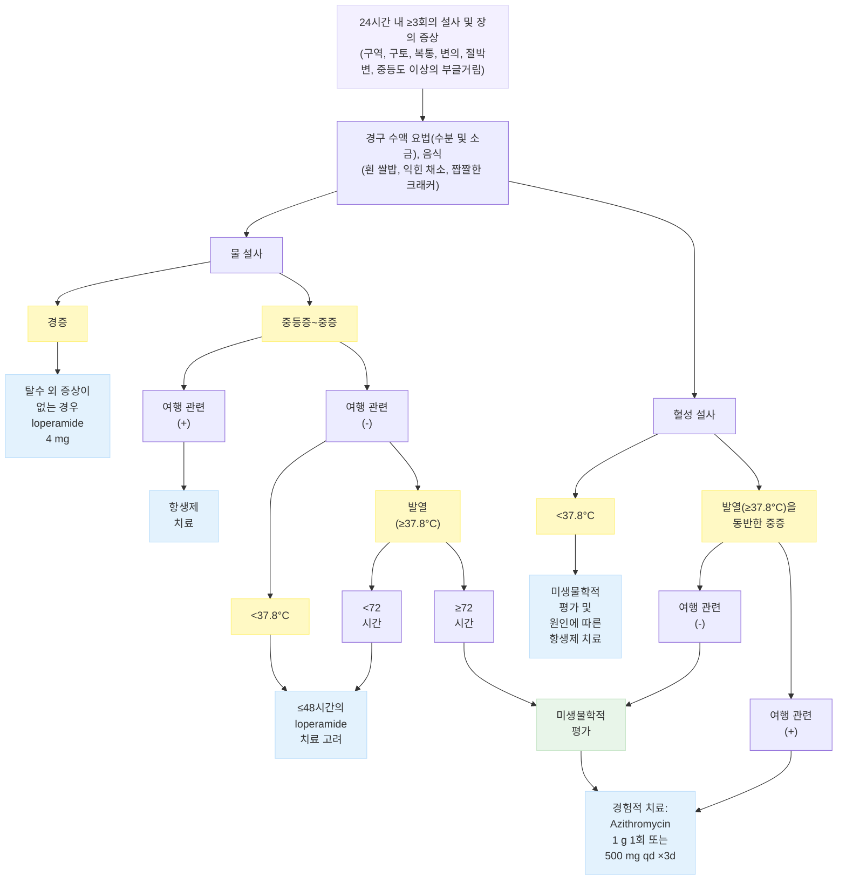

# 급성 설사 Acute Diarrhea

## 일반 사항

* 배변 횟수와 양이 증가된(≥3회/d, ＞200 g/d) 액상 또는 무른 변
  * 횟수보다 형태가 중요하며 묽지 않은 변의 단순한 배변 횟수 증가는 설사로 정의하지 않음
* 병변 부위와 대변량의 관계 : 소장 병변 시 많고, 대장 병변 시 적음
* 경과 : 대부분 자연 회복

#### 임상적 분류

* 급성 물 설사 : 수 시간\~수일 지속 (＜14d); 탈수 위험
* 급성 혈성 설사 : 장 점막 손상 관련; 탈수, 패혈증 위험
* 지속적 설사 : ≥14d 지속; 탈수, 영양실조 위험 (☞ [만성 설사](084_-chronic-diarrhea.md))
* 영양실조 동반 설사 : 탈수, 심부전, 전신 감염 위험

### Red Flags!

* 중등도 이상의 탈수
* 지속되는 구토
* 경구 rehydration 실패
* 혈변 또는 농변
* 2\~3일 후에도 호전되지 않음
* 심한 복통
* 발열(≥38.5℃)
* 최근 항생제 사용
* 6개월 미만아, 임신, 고령(＞65세)
* 집단적 발생, 입원 3일 이후 발생
* 만성 설사(≥4주)
* 설명할 수 없는 체중 감소
* 전신 질환, 면역 저하 상태
* 가정에서의 관리나 추적 관찰이 어려움

## 원인

* 비염증성 : (비혈성) 물 설사, 경증, 자연 치유
  * virus or non-invasive bacterium
* 염증성 : 혈변 or 농변, 발열
  * invasive or toxin-producing bacterium
* 비감염성 : 약물, 음식 알레르기, 다른 위장관 질환
* 감염성 : virus(대부분), bacteria(중증)
* 보통 여러 기전이 복합적으로 작용

#### 삼투압 설사 (Osmotic)

* 원인 : 흡수가 잘되지 않는 음식 성분, 유당 불내성,

#### 삼투성 하제 과용

* 기전 : 흡수 장애, 장관 내 삼투압 증가
* 특징 : 적은 양의 설사, 금식하면 감소

#### 운동 이상 설사 (Motility)

* 원인 : 과민대장증후군, 세균 과증식, 갑상선 이상, 장 외 감염(중이염, 폐렴, 요로 감염)
* 기전 : 음식물의 장관 통과 시간의 변화
* 특징 : 많지 않은 양의 무른 변

#### 분비 설사 (Secretory)

* 원인 : 위장관 감염(☞ p.427), 항생제 관련 대장염(C. difficile ), 담즙, 지방산
* 기전 : 전해질 흡수 장애, 분비 증가
* 특징 : 많은 양의 물 설사, 금식해도 설사, 수 시간\~수일 지속, 정상 삼투압; 혈변(-), WBC(-)

#### 염증성 설사 (Inflammatory)

* 원인 : 위장관 감염; Salmonella , Shigella , Campylobacter, E. coli , E. hystolytica
* 기전 : 장 점막 파괴 및 점막 아래 조직 손상
* 특징 : 적은 양, 혈변 또는 농변, 발열

#### 항생제 관련 설사 (Antibiotic-associated diarrhea)

* 기전 : 항생제 복용에 따른 정상 세균총 파괴 → 탄수화물 발효 이상 → 장관 내 삼투압 및 산도 변화; 항생제 투여 1주(2일)\~2개월 후 발생
* 20%는 C. difficile 감염에 의함; PPI 사용이 C. difficile 관련 설사를 65% 증가시킴
* 증상 : 경미한 설사, 복통, 복부 산통, 발열
* 치료 : 항생제 사용 중단
  * 경증\~중등증 C. difficile 설사 : metronidazole 500 ㎎ tid \[후라시닐]
* 10\~20%에서 치료 후 재발

## 진단

### 탈수 평가

* 경증 : 갈증, 입마름, 겨드랑이 땀 감소, 소변량 감소, 약간의 체중 감소
* 중등증 : 기립성 저혈압, 피부 장력 저하, 들어간 눈
* 중증 : 처짐, 둔해짐, 약한 맥박, 저혈압, 말초 청색증, 쇼크

#### CDS (Clinical dehydration scale)

| **배점 항목**          | **0점** | **1점**                 | **2점**             |
| ------------------ | ------ | ---------------------- | ------------------ |
| **전체적인 모습**        | 정상     | 갈증, 불안정, 처짐 (건드리면 반응함) | 늘어짐, 차가움, 식은 땀, 혼수 |
| **눈**              | 정상     | 약간 들어감                 | 깊이 함몰              |
| **구강 점막 (tongue)** | 촉촉     | 끈적거림                   | 건조                 |
| **눈물**             | 있음     | 감소                     | 안 나옴               |

* 판정 기준 : 0점=탈수 없음, 1\~4점=경증, 5\~8점=중등증\~중증

### 검사

* 경증 탈수 또는 급성 분비성 설사에서 검사 결과는 대부분 정상이며, 검사가 필요 없음
* 중등증 이상의 탈수 또는 ＞7일 지속 시 검사 : 당, 전해질, BUN/Cr, U/A
* 경고 징후가 있을 때 대변 배양 검사 고려

### 감별

#### 비염증성 설사 (Noninflammatory diarrhea)

* 대부분 5일 내 회복

#### 설사와 감별해야 하는 ＜200 g의 무른 배변 상태

* 가성 설사 (pseudodiarrhea) : 적은 양의 대변을 자주 배출. 급변; 과민대장증후군, 직장염 관련
* 변실금 (fecal incontinence) : 직장 내용물의 불수의적 배출; 신경 근육 질환, 구조적 항문직장 문제 관련
* 범람 설사 : 소량의 물 설사; 분변 매복 관련; 직장 수지검사로 진단

#### 증상/병력에 따른 감별

<figure><figcaption></figcaption></figure>

***

## Management

### 치료 방침

* 수분 공급 (탈수 교정) : 특히 어린이와 쇠약한 노인에서 주의를 요함
* 식이 조절 : 자극적이거나 질기거나 소화가 잘 안 되는 음식을 피함
* 약물 치료
* 예방 (☞ [여행자설사](086_-travelers-diarrhea.md#undefined-11))

## 비-약물 치료

### 수분 공급

* 성인에서는 스스로 원하는 만큼 공급, 소아 경증 탈수에서는 설사 1회에 체중 ㎏ 당 10 ㎖ 공급

#### 각 음료의 전해질 구성

| **종류**         | **Na (mEq/L)** | **K (mEq/L)** | **포도당 (mEq/L)** | **농도 (mOsm/L)** |
| -------------- | -------------- | ------------- | --------------- | --------------- |
| **WHO ORS**    | 75             | 20            | 75              | 245             |
| **Pedialyte®** | 45             | 20            | 140             | 250             |
| **게토레이®**      | 20             | 3             | 255             | 360             |
| **사판 주스**      | 2              | 30            | 690             | 730             |
| **탄산음료**       | 3              | 0             | 700             | 750             |

ORS = Oral rehydration solution\
&#xNAN;_<mark style="color:$info;">Ref. Diagnosis and management of dehydration in children, Table 1. AFP. 2009;1:80(7)</mark>_

#### 자가 음료 제조 (Oral rehydration solution, ORS)

* ORS 제조법 : 물 1 L, 소금 3 g(1 teaspoon), 설탕 18 g; 진한 것보다는 묽은 것을 선호
* 다음의 음료/식품에 소금 3 g/L 첨가 : 쌀미음, 닭 스프, 생수, 무가당 생과일주스, 플레인 요구르트, 무가당 묽은 차

### 식이

* 칼로리 및 미량 원소가 풍부한 혼합 음식 공급
* 탈수 교정 후 (필요시 ORS 공급을 지속하면서) 조기에 정상 식사 복귀; 가능한 한 평소와 같은 식사를 시행하는 것이 위장관염의 빠른 회복에 유리함
* 소량의 음식을 자주 섭취시킴 (1일 6회)

#### 식사에 따른 문제

* 단백질 : 손상된 장 점막을 통하여 항원성을 가진 단백질이 유입되고 이후 음식 민감성 장병증이 발생할 수 있음
*   탄수화물 : 유당 분해 효소가 부족해져 있으므로 유당 등의 흡수에 지장이 생기고(유당 불내성)

    대장에서 발효되어 삼투압 설사가 유발될 수 있음

    * 만성 설사에 의한 장 점막 손상 지속 시 2차성 유당 불내성 지속 → 영양 결핍 → 장 점막 회복 지연 → 설사 지속 악순환

#### 제공 음식

* 흰 쌀밥
* 섬유질이 약하거나 잘 삶아진 싱거운 반찬 (익힌 채소)
* 짭짤한 크래커, 토스트 (※ 짠 국물은 피함)
* BRAT diet (Banana, Rice, Applesauce, Toast) : 저단백질, 저지방의 저칼로리 식사로서 심한 구토가 없는 설사 환자에서 단기간 적용; 일반적인 식사보다 효과적인지는 입증되지 않음

#### 피해야 할 음식

* 맵거나 짜거나 단 자극적인 음식 : 대부분의 외식
* 여러 가지 재료가 섞인 음식 : 찌개류, 대부분의 인스턴트식품
* 생수 외 시판 음료 : 이온 음료를 포함하여 대부분의 시판 음료는 당분이 많고 농도가 높음
* 불용성 섬유질이 많은 음식, 질긴 음식 : 통곡류/잡곡밥(예: 보리밥, 현미밥), 뿌리채소(예: 더덕, 도라지), 브로콜리, 양배추
* 기름진 음식 : 고기, 튀김
* 압축된 음식, 점도가 높은 음식 : 면류(예: 라면, 자장면, 쫄면), 떡, gluten rich food(예: 빵)
* 유제품
* 카페인 함유 음료 : 차, 커피, soft drink
* 음주

## 약물 치료

　☞ [소화기계 약제](073_.md#antidiarrheal-agent)

### 장 운동 조절제 (항콜린제, Opiates)

* 일부 연구에서 설사 기간 단축&#x20;
* loperamide : 처음 4 ㎎, 이후 필요시 2 ㎎. 최대 8 ㎎/d \[로프민]
  * 주의 : 이질 및 침습성 병원균 감염에 의한 설사 시 증상을 악화시킬 수 있고 마비성 장폐색을 일으키거나 원인균 배출을 지연시킬 수 있음
  * 혈변, 고열, 전신 독성, 치료에도 악화되는 설사 환자에서는 제한
* racecadotril : 장 운동 감소 및 분비 억제; 급성 장염에 효과 \[하이드라섹] (＜12세 허가)
* cimetropium : 50 ㎎ tid \[알기론]
* tiropramide : 100 ㎎ bid\~tid \[티로파]

### 분비 억제제, 흡착제

* bismuth : 항염 항균 작용; 여행자 설사의 증상 완화, 바이러스성 장염 관련 구토 완화&#x20;
  * 30 ㎖ 또는 2T (262 ㎎/T) ×1\~4시간마다, 1일 최대 8회. ≥3세 적용
* galactosidase : 유당 불내성에 의한 설사에 적용 \[갈타제]
* dioctahedral smectite : 병원성 세균, 독소, 바이러스, 가스, 담즙산 등 흡착 및 배설; 3 g tid \[스타빅] (＞24개월 허가)

### 항생제

* 보통 해당 없음
* 대부분의 급성 설사는 바이러스 원인으로 항생제가 도움이 되지 않으며, 침습성 세균에 의한 염증성 설사도 대개 수일 내 자연 치유되며, 항생제 투여가 설사를 조장하는 경우가 많으므로 특별한 경우 외에는 선택하지 않음 (☞ [감염성 설사](085_-acute-infectious-diarrhea.md#undefined-12))

### 항구토제

* 대부분 필요하지 않으나 구토로 인하여 경구 수액 보충이 어려운 경우에 고려
* ondansetron : 심한 구토에 고려 \[조프란 주] (보험주의)
* 일반적인 위장 운동 촉진제(예: metoclopramide, domperidone)는 효과 입증 부족

### 기타

#### Probiotics

* 급성 설사에 대한 효과 논란; 항생제 관련 설사에서 일부 유효(10\~15%에서 효과)
* 유익성과 안전성에 대한 증거가 부족하므로 급성 위장관염, IBS, IBD, C. difficile 감염 등 대부분의 소화기 문제에 대하여 권고하지 않음 \[AGA]; 면역저하자에서는 금기
* 표준화된 용량 및 치료법은 없음; 균주 간의 효과 차이는 명확히 알려지지 않음
* Saccharomyces boulardii \[비오플] 500 ㎎/d ×≥7d or 설사가 멈출 때까지
* Lactobacillus rhamnosus \[람노스] 1\~2×10¹¹\~1×10¹¹ CFU/d ×≥7d or 설사가 멈출 때까지
  * [보험기준](https://www.hira.or.kr/rc/insu/insuadtcrtr/InsuAdtCrtrPopup.do?mtgHmeDd=20130901\&sno=1\&mtgMtrRegSno=0032) : ＜6세의 급성 감염성 설사, ＜6세의 항생제에 의한 설사(항생제 연관 설사), 괴사성 장염

#### 아연

* 아연 섭취가 부족한 경우의 급성 설사에서 설사 기간 및 중증도 경감, 재발 방지에 도움
  * 평소 적절한 영양 섭취를 하는 경우에 아연 부족 상태는 드묾
* 용법 : 20 ㎎/d ×10\~14d

설사가 지속되는(14\~30일) 경우 배양 검사 및 원인에 따른 항생제 치료

\*경증: 활동에 별 지장 없음. 중등증: 활동 할 수 있으나 지장을 받음. 중증: 활동하기 어려움
\
급성 설사의 경험적 치료
\
Ref. ACG Clinical Guideline: Diagnosis, Treatment, and Prevention of Acute Diarrheal
\
Infections in Adults. Am J Gastroenterol 2016;

## 예방

### 음식 안전 수칙

* 멸균되지 않은 우유 또는 그 함유 식품 섭취 금지
* 날 과일/채소는 식사 전 철저히 세척
* 냉장 온도는 ≤4.4℃, 냉동 온도는 ≤-17.8℃ 유지
* 조리되거나 즉석식품, 부패하기 쉬운 음식은 가능한 한 빨리 섭취
* 생고기, 생선, 가금류는 다른 식품과 분리하여 보관
* 생고기, 생선, 가금류를 취급한 후에는 손, 칼, 도마 등을 세척
* 생고기 조리 시 높은 온도에서 3분 이상 조리; 갈아 놓은 쇠고기- 71℃, 닭- 77℃, 돼지- 63℃
* 생선회 등 날생선 섭취 주의; 냉동을 통하여 일부 균들을 사멸시킬 수 있음
* 계란은 노른자가 단단해질 때까지 철저히 익힘
* 조리된 음식을 2시간 이상 실온에 두지 않음 (실온이 ＞32℃인 경우 1시간)

### **질병코드**&#x20;

K52 기타 비감염성 위장염 및 결장염

K59.1 기능성 설사

E86 용적고갈

처방례
\
티로파 100 ㎎/T 3T #3
\
람노스 250 ㎎/C 3C #3 (보험주의)
\
로프민 2 ㎎/C 1C 필요시
\
스타빅 20 ㎖/P 3P #3 식간 복용
