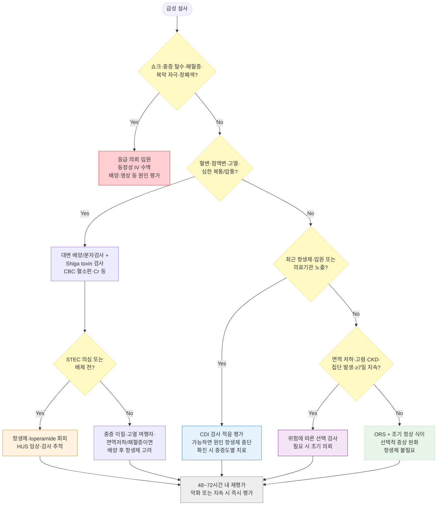

# 급성 설사 Acute Diarrhea

## <mark style="color:green;">일반 사항</mark>

* 정의 : 평소보다 잦은 액상·무른 변(대개 배변 횟수 ≥3회/일 또는 대변량 ＞200 g/일)이 ≤14일 지속하는 상태
  * 횟수보다 대변 형태(묽기)가 더 중요; 단단한 성형변(formed stool)의 단순 빈도 증가는 설사로 정의하지 않음
  * ≤14일은 급성(acute), 14\~29일은 지속성(persistent), ≥30일은 만성(chronic)으로 분류할 수 있음
* 부위와 대변량 : 소장 병변 → 대량, 수양성 설사; 대장 병변 → 소량, 혈액, 점액 혼재
* 경과 : 대부분 수일 내 자연 회복; ≥14일 지속 시 원충 감염·약물·염증성 장질환(IBD)·감염 후 과민대장증후군 등을 포함한 지속성·만성 설사 평가 (☞ [만성 설사](084_-chronic-diarrhea.md))

### <mark style="color:orange;">임상적 분류</mark>

<table><thead><tr><th width="210">분류</th><th width="230">기간·특징</th><th>주요 위험</th></tr></thead><tbody><tr><td>급성 수양성 설사</td><td>≤14일, 혈변 없음</td><td>탈수·전해질 이상</td></tr><tr><td>급성 혈성·염증성 설사</td><td>≤14일, 혈변·점액변·발열·tenesmus 가능</td><td>패혈증, HUS, 중증 대장염</td></tr><tr><td>지속성 설사<br>(persistent)</td><td>14~29일</td><td>원충 감염, 영양불량, 비감염성 원인</td></tr><tr><td>만성 설사<br>(chronic)</td><td>≥30일(통상 ≥4주)</td><td>IBD, 흡수장애, 약물, 기능성 질환 등</td></tr></tbody></table>

## <mark style="color:green;">원인</mark>

<table><thead><tr><th width="126">기전</th><th>주요 원인</th><th>임상 특징</th></tr></thead><tbody><tr><td><strong>삼투성 설사</strong></td><td>유당·과당·당알코올 흡수장애, Mg 제제·삼투성 하제</td><td>금식하면 감소</td></tr><tr><td><strong>분비성 설사</strong></td><td>바이러스·장독소 생성 세균, 일부 약물</td><td>대량 수양성; 금식해도 지속 가능; 혈변은 비전형적</td></tr><tr><td><strong>염증성 설사</strong></td><td><em>Salmonella, Shigella, Campylobacter, Yersinia, E. coli</em> (EIEC/STEC), <em>C. difficile, E. histolytica</em>, IBD</td><td>혈변·점액변·발열·복통·tenesmus 가능</td></tr><tr><td><strong>비감염성</strong></td><td>약물(항생제, Mg 제제, metformin, colchicine, GLP-1 수용체 작용제, 완하제 등), 허혈성 대장염, IBD</td><td>약물력·기저질환과 복부 진찰이 핵심</td></tr></tbody></table>

* 성인 급성 감염성 설사는 바이러스, 특히 노로바이러스가 흔함. 원인별 비율은 지역·연도·감시대상(산발 사례 또는 집단 발생)에 따라 달라지므로 특정 비율을 일반화하지 않음

#### <mark style="color:$primary;">항생제 관련 설사 (Antibiotic-associated diarrhea, AAD)</mark>

* 기전 : 항생제 → 정상 장내 세균총 파괴 → 탄수화물 발효 이상 → 장관 내 삼투압·산도 변화
  * 항생제 투여 중 또는 종료 후 수 주 이내 발생할 수 있음
  * 대부분은 비-CDI 항생제 관련 설사이나, 고령·최근 입원·중증 설사·발열·백혈구증가·복통이 있으면 _Clostridioides difficile_ infection(CDI) 평가
  * 불필요한 PPI 등 CDI 위험을 높일 수 있는 약물의 적응증도 재평가
* 증상 : 경미한 설사, 복통·복부 산통, 발열
* 치료 : 가능하면 원인 항생제를 중단; 계속 필요하면 적응증을 재평가하여 범위를 좁히거나 대체 약제를 선택

**CDI 중증도별 치료**

<table><thead><tr><th width="86">중증도</th><th width="230">기준</th><th>치료</th></tr></thead><tbody><tr><td>비중증</td><td>WBC ≤15,000/㎕ <strong>및</strong><br>혈청 Cr &#x3C;1.5 ㎎/dL</td><td>fidaxomicin 200 ㎎ bid × 10일 <mark style="color:blue;">[딥세시아정]</mark><br>또는 vancomycin 경구 125 ㎎ qid × 10일 <mark style="color:blue;">[반코마이신캡슐]</mark></td></tr><tr><td>중증</td><td>WBC ＞15,000/㎕ <strong>또는</strong><br>혈청 Cr ≥1.5 ㎎/dL</td><td>fidaxomicin 200 ㎎ bid × 10일<br>또는 vancomycin 경구 125 ㎎ qid × 10일</td></tr><tr><td>전격성</td><td>저혈압·쇼크, 장폐색(ileus), 거대결장</td><td>vancomycin 경구/NG 500 ㎎ qid + IV metronidazole 500 ㎎ q8h; 장폐색 시 직장 vancomycin 고려; 즉시 입원·외과 협진</td></tr></tbody></table>

* Fidaxomicin은 재발 감소 이점 때문에 IDSA·SHEA 2021에서 초발·재발 CDI에 우선 제안되나, 비용·접근성을 고려하면 vancomycin도 적절한 대안
* Metronidazole은 CDI의 routine 1차 치료제가 아님. 다만 비중증 초발에서 fidaxomicin·vancomycin을 사용할 수 없는 제한적 상황에는 경구 투여를 고려할 수 있으며, 전격성 CDI에서는 IV 보조 요법으로 사용
* 첫 재발 : fidaxomicin 표준/연장-간헐 요법 또는 vancomycin 감량·간헐(taper/pulse) 요법 고려; 반복 재발은 감염내과·소화기내과 협진


**CDI 치료 지침 개정** (ACG 2021 / IDSA·SHEA 2021) : 비중증·중증 초발에는 fidaxomicin 또는 vancomycin 사용. IDSA·SHEA는 재발 감소 이점 때문에 fidaxomicin을 우선 제안하지만 자원·비용을 고려하며, vancomycin도 적절한 대안임

**CDI 진단 시 중요 원칙** : ⓵ 설명되지 않는 새로 발생한 비성형변이 24시간 내 ≥3회인 환자에서 검사; ⓶ 완하제 사용 중이거나 성형변인 경우 routine 검사하지 않음; ⓷ 검사실 기준에 따라 GDH+toxin±NAAT 또는 NAAT+toxin 알고리듬을 사용하며, NAAT 단독 양성은 무증상 보균도 검출할 수 있으므로 임상 증상과 함께 해석; ⓸ 치료 반응 확인 목적의 반복검사(test of cure)는 시행하지 않음


## <mark style="color:green;">임상 양상</mark>

* 비염증성 (수양성) : 발열·혈변 없음; 대부분 5일 내 회복; 바이러스·비침습성 세균 원인
* 염증성 (혈성·점액성) : 혈변·농변·발열; 침습성·독소 생성 세균 원인; 장 점막 파괴 동반

### <mark style="color:$danger;">🚩 Red Flags!</mark>

<mark style="color:$danger;">**즉각 조치 또는 응급 의뢰**</mark>

* 중증 탈수·쇼크 - 의식 변화, 약한 맥박, 저혈압, 말초 관류 저하, 핍뇨
* 지속적 구토로 ORS의 경구·경관 투여가 불가능하거나 ORS 치료 실패
* 면역 저하 환자 + 전신 독성 징후 (고열, 패혈증 의심 징후)
* 혈변 + 고열 + 전신 독성 동반 (침습성 감염·패혈증 의심)
* 복막 자극 징후, 복부 강직·심한 팽만, 장폐색 또는 통증에 비해 진찰 소견이 경미한 심한 복통
* 혈성 설사 후 창백·멍·소변량 감소·의식 변화 (HUS 의심)

<mark style="color:$warning;">**당일 또는 조기 의뢰**</mark>

* 혈변 또는 농변 (발열 유무 불문)
* 국소적이거나 지속되는 심한 복통 (허혈성 대장염·IBD·외과적 복증 감별)
* 발열 ≥38.5℃
* 임신부·고령자·면역 저하자에서 관련 식품 노출 후 발열·근육통 등 전신 증상 (_Listeria_ 감염 고려)
* 집단 발생 또는 의료기관·장기요양시설 관련 발생 (검사·격리·신고 필요성 평가)
* 최근 항생제 사용 또는 의료기관 노출 + 중등증 이상 설사 (CDI 평가)

<mark style="color:$info;">**외래 추적 / 추가 평가 계획**</mark> <mark style="color:$info;">- 즉각 위험 낮으나 호전 없으면 의뢰</mark>

* 48\~72시간 후에도 호전되지 않거나 7일 이상 지속되는 설사
* 고령(＞65세), 만성 기저질환 (당뇨·심부전·만성 신질환 CKD - 탈수 시 AKI 위험 높음)
* 최근 항생제 사용력 (CDI 위험 모니터링)
* 설명할 수 없는 체중 감소
* 지속성(≥14일) 또는 만성 설사(≥4주)로 진행 (☞ [만성 설사](084_-chronic-diarrhea.md))
* 가정에서 관리·추적이 어려운 경우

## <mark style="color:green;">진단</mark>

### <mark style="color:orange;">탈수 평가</mark>

* 경증 : 갈증, 구강 건조, 겨드랑이 땀 감소, 소변량 감소, 약간의 체중 감소
* 중등증 : 기립성 저혈압, 피부 장력 저하 (피부 텐트 현상), 함몰 안구, 모세혈관 재충혈 시간(CRT) ＞2초
* 중증 : 처짐, 둔한 반응, 약한 맥박, 저혈압, 말초 청색증, 쇼크

#### <mark style="color:$primary;">소아 참고 - 임상 탈수 척도 (Clinical Dehydration Scale, CDS)</mark>

<table><thead><tr><th width="128">평가 항목</th><th width="103">0점</th><th width="246">1점</th><th>2점</th></tr></thead><tbody><tr><td>전체적인 모습</td><td>정상</td><td>갈증·불안정·처짐 (자극 시 반응)</td><td>늘어짐·차가움·식은땀·혼수</td></tr><tr><td>눈</td><td>정상</td><td>약간 함몰</td><td>깊이 함몰</td></tr><tr><td>구강 점막</td><td>촉촉</td><td>끈적거림</td><td>건조</td></tr><tr><td>눈물</td><td>있음</td><td>감소</td><td>안 나옴</td></tr></tbody></table>

* 판정 : 0점=탈수 없음, 1\~4점=경증 탈수, 5\~8점=중등증\~중증 탈수
* CDS는 영유아·소아에서 개발된 척도로 성인에게 적용하지 않음
* 경증\~중등증 탈수는 저삼투압 ORS가 1차 치료. 중증 탈수·쇼크·의식 변화·장폐색 또는 ORS 실패 시 등장성 정맥 수액 투여

### <mark style="color:orange;">검사</mark>

* 경증 탈수, 급성 분비성 설사 : 검사 결과 대부분 정상; 별도 검사 불필요
  * 단, 고령이나 만성 신질환(CKD)·당뇨 등 기저질환자에서는 경증이라도 기본 혈액 검사 고려
* 중등증 이상 탈수, 고령·CKD 등 고위험군 또는 7일 이상 지속 : 혈당, 전해질, BUN/Cr 등 고려
* 혈변·점액변, 발열, 심한 복통·압통 또는 패혈증 징후 : 대변 배양/분자검사(<em>Salmonella, Shigella, Campylobacter, Yersinia</em> 등)와 Shiga toxin 또는 독소 유전자 검사; CBC·CRP·신기능 등 고려
  * 패혈증·장티푸스 의심, 면역 저하 또는 전신 감염 소견이 있으면 혈액 배양
  * CDI 의심 시 → 비성형변으로 독소 검사±NAAT(PCR) 알고리듬 적용; NAAT 단독 양성은 임상 증상과 함께 해석

**다중 분자 진단 검사 (Multiplex stool PCR panel)**

* 세균·바이러스·원충을 동시에 검출; 민감도 높고 결과 빠름 (배양보다 수 시간 내)
* 적응 : 중증 설사, 면역 저하 환자, 입원 환자, 집단 발생 조사
* 주의 : 핵산을 검출하므로 생존 병원체와 사멸 병원체, 실제 원인균과 보균을 구분하지 못할 수 있고 복수 병원체가 동시에 검출될 수 있음. 임상 증상과 반드시 통합 해석
* 공중보건 신고·집단 발생 조사 또는 항균제 감수성 검사가 필요한 세균이 검출되면 추가 배양이 필요할 수 있음
* 경증 자한성(자기 제한적, self-limiting) 설사에서는 routine 검사로 권고하지 않음

**분변 칼프로텍틴(Fecal calprotectin)**

* 급성 감염성 설사에서도 상승할 수 있어 급성기 원인 감별이나 routine 검사로 권고하지 않음
* 감염이 배제된 뒤에도 증상이 지속·재발하여 IBD가 의심될 때 보조적으로 고려; 양성만으로 대장내시경 여부를 결정하지 않음

### <mark style="color:orange;">감별</mark>

#### <mark style="color:$primary;">설사와 감별해야 할 상태</mark>

* 가성 설사 (pseudodiarrhea) : 소량의 변을 자주 배출; 과민대장증후군, 직장염 관련
* 변실금 (fecal incontinence) : 직장 내용물의 불수의적 배출; 신경 근육 질환, 구조적 항문직장 문제
* 범람 설사 (overflow diarrhea) : 소량의 물 설사; 분변 매복(fecal impaction) 관련 → 직장 수지 검사(DRE)로 진단
  * 범람 설사 - 노인 환자 주의 : 노인에서 갑자기 발생한 소량의 물 설사는 분변 매복을 원인으로 하는 범람 설사일 수 있음. 진단하지 못하면 불필요한 지사제 투여로 악화 가능. 직장 수지 검사(DRE)로 쉽게 진단 가능하며, 분변 제거 후 즉각 호전됨

#### <mark style="color:$primary;">증상·병력에 따른 원인 감별</mark>

<figure><figcaption></figcaption></figure>

***

<table><thead><tr><th width="242">역학·임상 단서</th><th>시사하는 원인</th></tr></thead><tbody><tr><td>최근 해외 여행력</td><td>여행자 설사(ETEC, <em>Campylobacter, Shigella</em>, 원충 등) (☞ <a href="086_-travelers-diarrhea.md">여행자 설사</a>)</td></tr><tr><td>최근 항생제 또는 의료기관 노출</td><td>항생제 관련 설사, <em>C. difficile</em> 감염</td></tr><tr><td>날생선·어패류 섭취</td><td><em>Vibrio</em>, 노로바이러스</td></tr><tr><td>집단 급식·뷔페 후 1~6시간 내 발병</td><td>독소형 식중독(<em>S. aureus, B. cereus</em> 구토형)</td></tr><tr><td>8~16시간 후 복통·수양성 설사</td><td><em>C. perfringens, B. cereus</em> 설사형</td></tr><tr><td>12~48시간 후 구토·수양성 설사</td><td>노로바이러스 등</td></tr><tr><td>혈변 + 발열</td><td>침습성 세균(<em>Salmonella, Shigella, Campylobacter, Yersinia</em>)과 STEC 모두 고려</td></tr><tr><td>혈변 + 심한 복통 + 발열 미약·무발열</td><td>STEC 가능성 증가 - 항생제·loperamide 회피(HUS 위험)*</td></tr><tr><td>고령·죽상경화 위험 + 갑작스러운 복통·혈변</td><td>허혈성 대장염·장간막 허혈</td></tr><tr><td>임신부·고령자·면역 저하자 + 관련 식품 노출 후 발열·전신 증상</td><td><em>Listeria monocytogenes</em> - 혈액 배양 고려; 대변 배양은 권고하지 않음</td></tr><tr><td>의료기관 입원 중 새로 발생</td><td><em>C. difficile</em>, 약물, 경장영양 등</td></tr><tr><td>면역 저하 상태</td><td><em>Cryptosporidium, Cyclospora, Cystoisospora</em>, CMV, microsporidia, MAC 등</td></tr><tr><td>반복성·지속성 경과</td><td>원충 감염, IBD, 약물, 감염 후 IBS 등; 감염 배제 후 분변 칼프로텍틴을 선택적으로 고려</td></tr></tbody></table>

**\*STEC** (Shiga toxin 생성 대장균) 유의 사항 : 혈변·심한 복통이 있고 발열이 뚜렷하지 않으면 가능성이 증가하지만 발열만으로 배제할 수 없음. 항생제와 loperamide는 HUS 및 합병증 위험을 높일 수 있어 피함. O157 배양과 비-O157를 포함하는 Shiga toxin/독소 유전자 검사를 시행하고, Hb·혈소판·전해질·BUN/Cr·소변량을 반복 추적; HUS 의심 시 말초혈액도말·LDH·bilirubin·haptoglobin 평가

***


```mermaid
graph TD
    Start(["급성 설사"]) --> S1{"쇼크·중증 탈수·패혈증·<br/>복막 자극·장폐색?"}
    S1 -->|Yes| Emergency["응급 의뢰·입원<br/>등장성 IV 수액<br/>배양·영상 등 원인 평가"]
    S1 -->|No| S2{"혈변·점액변·고열·<br/>심한 복통/압통?"}

    S2 -->|Yes| Infl["대변 배양/분자검사 +<br/>Shiga toxin 검사<br/>CBC·혈소판·Cr 등"]
    Infl --> STECq{"STEC 의심 또는<br/>배제 전?"}
    STECq -->|Yes| STEC["항생제·loperamide 회피<br/>HUS 임상·검사 추적"]
    STECq -->|No| ABX["중증 이질·고열 여행자·<br/>면역저하/패혈증이면<br/>배양 후 항생제 고려"]

    S2 -->|No| S3{"최근 항생제·입원 또는<br/>의료기관 노출?"}
    S3 -->|Yes| CDI["CDI 검사 적응 평가<br/>가능하면 원인 항생제 중단<br/>확진 시 중증도별 치료"]
    S3 -->|No| HighRisk{"면역 저하·고령·CKD·<br/>집단 발생·≥7일 지속?"}
    HighRisk -->|Yes| Test["위험에 따른 선택 검사<br/>필요 시 조기 의뢰"]
    HighRisk -->|No| Support["ORS + 조기 정상 식이<br/>선택적 증상 완화<br/>항생제 불필요"]

    STEC --> FU["48~72시간 내 재평가<br/>악화 또는 지속 시 즉시 평가"]
    ABX --> FU
    CDI --> FU
    Test --> FU
    Support --> FU

    classDef yellow fill:#fff9c4,stroke:#ffe082
    class S1,S2,S3,STECq,HighRisk yellow
    style Emergency fill:#ffcdd2,stroke:#e53935
    style STEC fill:#fff3e0,stroke:#fb8c00
    style CDI fill:#e3f2fd,stroke:#1e88e5
    style Test fill:#f3e5f5,stroke:#8e24aa
    style Start fill:#f3f0ff,stroke:#dcd6f7
    style Support fill:#e8f5e9,stroke:#c8e6c9
    style FU fill:#eeeeee,stroke:#888888
```

<p align="center"><strong>급성 설사 평가·치료 알고리듬</strong></p>

***

## <mark style="background-color:$warning;">Management</mark>

### <mark style="color:orange;">치료 방침</mark>

* 수분 공급 (탈수 교정) : 어린이와 쇠약한 노인, CKD 환자에서 특히 주의
* 식이 조절 : 과도한 음식 제한은 회복을 지연시킴; 탈수 교정 후 가능한 한 빨리 정상 식이로 복귀 권장
* 약물 치료 : 증상 완화 목적 (지사제, 흡착제, 항구토제)
* 항생제 : 대부분 불필요; 선택적으로만 적용 (☞ [감염성 설사](085_-acute-infectious-diarrhea.md))
* 예방 (☞ [여행자 설사](086_-travelers-diarrhea.md#undefined-11))
* **외래 치료 가능** : 다음 조건을 모두 충족 시 - 무혈변 / 발열 없음 / 경구 수분 가능 / 경증 탈수 → ORS + 조기 식이 + 증상 완화 치료
* **당일 재평가 필요** : 다음 중 하나 이상 해당 시 - 혈변 / 38.5℃ 이상 발열 / 국소적·지속적 심한 복통 / 고령·임신부·면역 저하·CKD / 48\~72시간 내 호전 없음 → 원인과 위험도에 따라 선택적 검사; 항생제는 제한적 적응에서만 고려
* **응급 의뢰** : 다음 중 하나 이상 해당 시 - 쇼크·중증 탈수 / 의식 저하 / ORS의 경구·경관 투여 불가 또는 실패 / 패혈증 / 복막 자극·장폐색 / HUS 의심 → 등장성 IV 수액, 원인 평가 및 입원

### <mark style="color:orange;">표현형 기반 처방 방향 (Phenotype-driven approach)</mark>

<table><thead><tr><th width="134">표현형</th><th width="125">시사 원인</th><th width="162">치료 방향</th><th>주의</th></tr></thead><tbody><tr><td>수양성 + 무발열 + 무혈변</td><td>바이러스·비침습성 세균</td><td>ORS + 조기 정상 식이<br>필요 시 성인 loperamide 단기간</td><td>항생제 불필요</td></tr><tr><td>수양성 + 구토 우세</td><td>바이러스·독소형 식중독</td><td>ORS를 소량씩 반복<br>ORS가 어려운 심한 구토에서 항구토제 선택적 고려</td><td>항생제 불필요</td></tr><tr><td>혈변·점액변 ± 발열</td><td>침습성 세균, STEC, 허혈성 대장염, IBD 등</td><td>대변 배양/분자검사 + Shiga toxin 검사<br>필요 시 CBC·혈소판·Cr</td><td>STEC 배제 전 routine 항생제 금지<br>loperamide 회피</td></tr><tr><td>전형적 세균성이질·고열 여행자 설사·패혈증·중증 면역저하</td><td><em>Shigella, Campylobacter</em>, 장티푸스 등</td><td>가능하면 대변·혈액 배양 후 경험적 항생제 고려</td><td>지역 내성·여행지·STEC 가능성 반영</td></tr><tr><td>항생제·의료기관 노출 후 새 설사</td><td>AAD 또는 CDI</td><td>불필요한 원인 항생제 중단<br>CDI 검사 적응 평가<br>확진 시 중증도별 치료</td><td>NAAT 양성만으로 보균과 감염을 구분할 수 없음</td></tr><tr><td>고령·면역 저하·패혈증 의심</td><td>다양(기회감염·비감염성 원인 포함)</td><td>위험에 따른 선택 검사; 입원·전원 조기 고려</td><td>조기 에스컬레이션</td></tr></tbody></table>

## <mark style="color:green;">비-약물 치료 및 예방</mark>

### <mark style="color:orange;">수분 공급</mark>

* 성인 : 저삼투압 ORS를 소량씩 자주 투여하고, 탈수가 교정된 뒤에도 설사·구토로 인한 지속 손실을 추가 보충
* 소아 경증 탈수 : 설사 1회당 체중 ㎏당 10 ㎖; 중등증 탈수는 50\~100 ㎖/㎏을 3\~4시간에 걸쳐 공급

#### <mark style="color:$primary;">각 음료의 전해질 구성</mark>

<table><thead><tr><th>종류</th><th>Na<br>(mEq/L)</th><th>K<br>(mEq/L)</th><th>포도당<br>(mmol/L)</th><th>삼투압<br>(mOsm/L)</th></tr></thead><tbody><tr><td>WHO 저삼투압 ORS</td><td>75</td><td>20</td><td>75</td><td>245</td></tr><tr><td>일부 소아용 전해질 음료*</td><td>약 45</td><td>약 20</td><td>약 140</td><td>약 250</td></tr><tr><td>스포츠 음료*</td><td>약 20</td><td>약 3</td><td>약 255</td><td>약 360</td></tr><tr><td>사과 주스*</td><td>약 2</td><td>약 30</td><td>약 690</td><td>약 730</td></tr><tr><td>탄산음료*</td><td>약 3</td><td>0</td><td>약 700</td><td>약 750</td></tr></tbody></table>

\*제품별 조성이 다르므로 실제 표시사항 확인

_<mark style="color:$info;">Ref. Diagnosis and management of dehydration in children, Table 1. Am Fam Physician. 2009;80(7)</mark>_


**WHO ORS 2002 저삼투압 공식**: 삼투압 245 mOsm/L로 기존 고삼투압 ORS(311 mOsm/L)보다 구토 발생과 정맥 수액 필요성을 줄임. 스포츠 음료·주스·탄산음료는 ORS보다 당이 많고 Na가 적어 중등증 이상 탈수의 표준 치료나 ORS 대용으로 부적합


#### <mark style="color:$primary;">ORS 사용 원칙</mark>

* 약국의 ORS 제품을 표시된 정확한 양의 깨끗한 물에 녹여 사용하는 것이 가장 안전함. 임의로 물·설탕·소금을 추가하지 않음
* WHO 저삼투압 ORS 1 L 조성 : glucose 13.5 g + NaCl 2.6 g + KCl 1.5 g + trisodium citrate dihydrate 2.9 g
* 완제품을 구할 수 없는 응급 상황의 가정용 설탕-소금 용액 : 깨끗한 물 1 L + 평평하게 깎은 설탕 6티스푼 + 소금 1/2티스푼. 정확한 계량이 어렵거나 맛이 지나치게 짜면 사용하지 않으며, 24시간이 지나면 폐기
* 생수·주스·요구르트·차 등에 소금을 임의로 첨가하지 않음

### <mark style="color:orange;">식이</mark>

* 소아·성인 모두 조기 정상 식이 복귀 권장
  * 탈수 교정 중 또는 교정 후 가능한 한 빨리 연령과 상태에 맞는 평소 식사로 복귀; 과도한 음식 제한은 회복과 영양 섭취를 방해함
* 구토가 심하지 않으면 소량씩 자주 섭취; routine 금식은 권고하지 않음

#### <mark style="color:$primary;">권장 식품</mark>

* 흰 쌀밥·죽, 식빵·토스트, 감자, 익힌 채소, 기름기 적은 단백질 등 환자가 견딜 수 있는 평소 식사
* 발효유를 포함한 유제품은 반드시 제한할 필요가 없으나 복부팽만·설사가 악화되면 일시적으로 줄임
* BRAT diet (Banana, Rice, Applesauce, Toast)는 영양적으로 불완전하며 일반식보다 우월하지 않으므로 장기간 단독 사용하지 않음

#### <mark style="color:$primary;">피해야 할 식품</mark>

* 과량의 단순당·과당·당알코올이 든 음식과 음료
* 고지방·튀김·매우 매운 음식 등 증상을 악화시키는 음식
* 카페인 음료와 음주는 증상을 악화하면 제한
* 유제품은 복부팽만·설사 악화 또는 2차성 유당 불내성이 의심될 때만 일시 제한


**2차성 유당 불내성 주의** : 급성 장염 후 일시적인 lactase 감소가 생길 수 있으나 모든 환자에서 유제품을 routine 제한할 필요는 없음. 우유 섭취 후 복부팽만·가스·수양성 설사가 악화되면 일시적으로 제한하고, 대부분 회복 후 다시 섭취 가능


### <mark style="color:orange;">음식 안전 수칙 (예방)</mark>

* 멸균되지 않은 우유 또는 함유 식품 섭취 금지
* 날 과일·채소는 식사 전 철저히 세척
* 냉장 ≤5℃ (국내 기준) / ≤4.4℃ (국제 FDA 기준), 냉동 ≤−18℃ 유지
* 조리 즉석 식품·부패하기 쉬운 음식은 신속히 섭취
* 생고기·생선·가금류는 다른 식품과 분리 보관; 취급 후 손·칼·도마 세척
* 육류·가금류 조리 내부 온도 : 갈은 쇠고기 71℃, 닭 77℃; 돼지(통살·스테이크) 63℃(3분 이상 유지), 갈은 돼지고기 71℃(유지 불필요)
* 생선회 등 날생선 섭취 주의 (냉동으로 일부 균 사멸 가능)
* 계란은 노른자가 굳을 때까지 완전히 익힘
* 조리된 음식을 실온에 2시간 이상 (실온 ＞32℃인 경우 1시간 이상) 방치 금지

## <mark style="color:green;">약물 치료</mark>

　☞ [소화기계 약제](073_-gidrugs.md#antidiarrheal-agent)

### <mark style="color:orange;">항생제</mark>

* 대부분의 급성 설사는 바이러스 원인으로 항생제가 도움이 되지 않으며, 침습성 세균성 설사도 대부분 수일 내 자연 치유
* 세균성 감염성 설사 (☞ [감염성 설사](085_-acute-infectious-diarrhea.md#undefined-12))
* 경험적 치료가 필요한 성인 : 지역 내성·여행지·임상 양상에 따라 azithromycin 1 g 1회 또는 500 ㎎ qd × 3일 <mark style="color:blue;">\[지스로맥스]</mark> 등을 고려

**경험적 항생제를 고려하는 경우**

* 발열·복통·tenesmus를 동반한 전형적 세균성이질(특히 <em>Shigella</em>)
* 해외여행 후 38.5℃ 이상 발열 또는 패혈증 징후를 동반한 중증 설사
* 중증 혈성 설사를 보이는 면역 저하 환자
* 장티푸스성 패혈증 의심 - 혈액·대변 배양 채취 후 즉시 치료
* 배양으로 확인된 병원체에서 항생제 치료의 이득이 예상되는 경우

면역정상 성인의 혈성 설사에서는 위 예외를 제외하고 검사 결과 전 routine 경험적 항생제를 권고하지 않음. 경험적 치료 전 가능하면 대변 배양·Shiga toxin 검사 시행

**경험적 항생제를 피해야 하는 경우**

* STEC 의심 또는 확진 - 항생제가 HUS 위험을 높일 수 있음
* 단순 바이러스성 수양성 설사
* 경증 자한성(자기제한적, self-limiting) 설사

### <mark style="color:orange;">장 운동 조절제 (Antimotility agents)</mark>

* loperamide : 장 μ-opioid receptor 자극 → 장 운동 억제·통과 시간 연장, 수분 흡수 증가; 설사 기간 단축
  * 용법 : 처음 4 ㎎, 이후 묽은 변마다 2 ㎎; 일반 외래에서는 최대 8 ㎎/일로 보수적으로 단기간 사용하고 제품별 허가사항 확인 <mark style="color:blue;">\[로프민]</mark>
  * 주요 위험 **:** ⓵ 고용량 심독성 - 권장 용량 초과 시 QT 연장·Torsades de Pointes 위험, 최대 용량 준수 및 환자 교육 필수; ⓶ IBD 활성기 금기 - 궤양성 대장염(UC) 활성기에서 toxic megacolon 유발 가능
  * 사용 제한 / 금기 : 혈변, 고열, 전신 독성, 침습성 세균 감염, _C. difficile_ 감염, STEC 의심 (HUS 위험), IBD 활성기 (toxic megacolon 유발 위험). 48시간 이내 호전이 없으면 중단하고 재평가

### <mark style="color:orange;">진경제</mark>

* cimetropium : 항콜린 작용, 장경련 완화; 50 ㎎ tid <mark style="color:blue;">\[알기론]</mark>
* tiropramide : 장 평활근 이완; 100 ㎎ bid\~tid <mark style="color:blue;">\[티로파]</mark>
* 탈수·감염 치료를 대신하지 않으며, 복막 자극·장폐색·허혈성 장질환이 의심되는 심한 복통에는 투여하지 않음

### <mark style="color:orange;">분비 억제제</mark>

* racecadotril : enkephalinase 억제 → 장 점막 과분비 억제; 장 운동에는 영향이 적음
  * 용법 : 1.5 ㎎/㎏ tid <mark style="color:blue;">\[하이드라섹]</mark> (국내 소아 ＜12세 정규 허가)
  * 성인 급성 수양성 설사에서 일부 연구 효과 보고 있으나, 국내에서 성인 사용은 적응외(off-label) 임을 고지 필요


**Racecadotril 사용 원칙** : ORS를 대신하지 않는 선택적 보조요법. 소아 급성 수양성 설사에서 일부 지침이 고려하지만 근거와 권고는 일관되지 않음. 이 책의 성인 환자에게 국내 허가 외로 사용할 때에는 적응외 사용임을 설명


### <mark style="color:orange;">흡착제</mark>

* bismuth subsalicylate : 경증 급성 설사·여행자 설사의 증상 완화
  * 현탁액 525 ㎎ (30 ㎖) 또는 정제 524 ㎎ (2정), 30분\~1시간마다, 1일 최대 8회; 제품별 국내 허가사항 확인 <mark style="color:blue;">\[펩토무스현탁액]</mark>
  * 소아에서는 제품별 국내 허가연령·용량을 확인. Salicylate 함유 제제이므로 특히 인플루엔자·수두 등 바이러스 감염이 의심되는 소아·청소년은 Reye 증후군 위험 때문에 피하며, salicylate 알레르기, 출혈 위험·항응고제 병용, 중증 신질환에서도 사용하지 않음; 흑변·검은 혀가 생길 수 있음
* dioctahedral smectite : 장 점막 보호·흡착 작용을 통한 선택적 증상 완화; ORS를 대신하지 않음; 3 g tid <mark style="color:blue;">\[스타빅]</mark>
  * 24개월 미만 소아 사용 금기; 임부·수유부 사용 금기
* galactosidase : 유당 불내성에 의한 설사에 적용 <mark style="color:blue;">\[갈타제]</mark>

### <mark style="color:orange;">항구토제</mark>

* 대부분 불필요; 구토로 경구 수액 보충이 어려운 경우에 한해 고려
* ondansetron : 소아 급성 위장관염에서 구토를 줄이고 ORS 성공률을 높일 수 있음 <mark style="color:blue;">\[조프란]</mark>
  * ORS가 어려운 경우 단회(single dose) 투여를 우선 고려; 반복 사용 시 설사 증가 가능. QT 연장·저K/저Mg혈증·다른 QT 연장 약물 병용에 주의
  * 소아에서 급성 위장관염 적응 보험 적용 제한 있음; 처방 전 보험 기준 확인 권장
* 위장 운동 촉진제 (metoclopramide, domperidone)는 급성 설사에서 효과 입증 불충분

### <mark style="color:orange;">기타</mark>

#### <mark style="color:$primary;">Probiotics</mark>

* 국내 성인의 급성 자기제한적 설사에서 routine probiotics 사용을 권고할 근거는 부족하며, 효과는 균주·제품·대상에 특이적임
* 일부 균주는 다음 상황에서 제한적 이득 가능성이 보고됨
  * _S. boulardii_ : 항생제 관련 설사
  * _L. rhamnosus_ GG : 항생제 관련 설사, 소아 로타바이러스 설사 - 설사 기간 단축 효과 일부 메타분석에서 확인
* 용법 : 표준화된 용량·치료법 없음. 연구에 사용된 균주와 시판 제품을 동일하게 간주할 수 없음
  * _S. boulardii_ : ≥7일 또는 설사 소실 시까지; <mark style="color:blue;">\[비오플]</mark> 500 ㎎/일
  * _L. rhamnosus_ GG : ≥7일; <mark style="color:blue;">\[람노스]</mark> 1일 1\~4캡슐
* [보험기준](https://www.hira.or.kr/rc/insu/insuadtcrtr/InsuAdtCrtrPopup.do?mtgHmeDd=20130901\&sno=1\&mtgMtrRegSno=0032) : 급성 감염성 설사·항생제 관련 설사 등은 연령·진단·제제에 따른 제한이 있으므로 처방 시 최신 세부 급여기준 확인; 성인 급성 설사에는 통상 비급여
* 중증 면역저하, 중환자, 중심정맥관 보유 환자에서는 균혈증·진균혈증 위험 때문에 피함

#### <mark style="color:$primary;">아연</mark>

* 국내 성인에서 확인된 아연 결핍이나 영양불량이 없는 급성 설사에는 routine으로 권고하지 않음
* WHO의 10\~14일 아연 요법은 주로 아연 결핍 유병률이 높은 지역의 생후 6개월\~5세 소아를 대상으로 함(≥6개월 20 ㎎/일, ＜6개월 10 ㎎/일)

***

### <mark style="color:red;">질병코드</mark>

A09 감염성 및 상세불명 기원의 기타 위장염 및 결장염\
R19.7 상세불명의 설사\
K52.9 상세불명의 비감염성 위장염 및 결장염 - 비감염성으로 판단될 때\
E86 용적 고갈 - 임상적으로 탈수가 확인될 때


K59.1 기능성 설사는 급성 설사의 일반 코드로 사용하지 않음. 원인 병원체나 CDI가 확인되면 해당 원인별 세부 코드를 우선 적용하고 최신 KCD-9 분류를 확인


***

## <mark style="color:purple;">처방례</mark>

> **처방례 1. 경증 급성 수양성 설사 (성인, 장경련 동반)**
>
> ```
> 티로파 100 ㎎/T　　3T  #3
> ```
>
> _✽치료의 기본은 저삼투압 ORS와 조기 정상 식이. 진경제는 장경련이 불편할 때만 선택적으로 사용하며 복막 자극·장폐색·허혈성 장질환이 의심되는 통증에는 사용하지 않음. 성인 급성 설사에서 probiotics를 routine 기본 처방에 포함하지 않음._

> **처방례 2. 경증\~중등증 급성 설사 (성인, 혈변·발열 없는 수양성 설사)**
>
> ```
> 로프민 2 ㎎/C　　  처음 2C, 이후 묽은 변마다 1C
> 　　　　　　　　　(최대 4C/일, 최대 2일)
> ```
>
> _✽ORS로 충분히 수분을 보충한 뒤, 면역정상 성인의 혈변·발열·전신 독성·CDI 의심·IBD 활성기가 없는 수양성 설사에서만 단기간 사용. 혈변·발열·복부 팽만·심한 통증이 발생하거나 48시간 내 호전이 없으면 즉시 중단하고 재평가._

> **처방례 3. 확인된 초발 C. difficile 감염 (비전격성)**
>
> ```
> 딥세시아 200 ㎎/T　　　2T  #2  ×10일
> ```
>
> _✽Fidaxomicin 우선 제안의 예. 비용·접근성을 고려하면 반코마이신캡슐 125 ㎎ qid × 10일도 적절한 대안. 가능하면 원인 항생제를 중단하거나 범위를 축소. 첫 재발은 fidaxomicin 표준/연장-간헐 요법 또는 vancomycin 감량·간헐 요법을 고려. 전격성 CDI(저혈압·쇼크, 장폐색, 거대결장)는 즉시 입원하여 vancomycin 500 ㎎ qid 경구/NG + IV metronidazole을 투여하고, 장폐색 시 직장 vancomycin과 외과 협진 고려. 제품명·유통·급여는 처방 시점의 국내 허가사항 확인._

***

### <mark style="color:$success;">핵심 복약 지도</mark>

1. **수분 보충이 치료의 핵심입니다.** 약국의 ORS(경구 수액제)를 표시된 정확한 양의 물에 녹여 조금씩 자주 드세요. 스포츠 음료·주스·탄산음료는 ORS보다 당이 많고 전해질 조성이 불충분하여 중등증 이상 탈수의 표준 치료로 적합하지 않습니다.
2. **지사제(로프민)는 혈변·고열이 있을 때 절대 사용하지 마세요.** 세균성 설사에서는 증상이 악화되거나 장폐색이 생길 수 있습니다. 처방된 용량을 반드시 지키고, 초과 복용 시 심장 부정맥이 생길 수 있습니다. 대장염(궤양성 대장염 등) 기저질환이 있는 분은 반드시 의사와 상의 후 사용하세요.
3. **흡착제(스타빅)는 식간에, 다른 약과 2시간 간격을 두고 복용하세요.** 장 내 독소·세균을 흡착하는 작용이 있어 다른 약과 동시에 복용하면 다른 약의 흡수를 방해할 수 있습니다. **만 2세 미만 영아, 임산부·수유 중에는 사용을 삼가세요.**
4. **음식은 빨리 정상화하세요.** routine 금식은 회복과 영양 섭취를 방해합니다. 견딜 수 있는 평소 음식을 소량씩 자주 드세요. 과량의 단순당·고지방 음식·술·카페인은 증상을 악화하면 줄이고, 유제품도 복부팽만이나 설사가 악화될 때만 일시 제한하세요.
5. **이런 증상이 생기면 즉시 내원하세요.** ① 혈변 또는 고름 같은 변 ② 발열 38.5℃ 이상 ③ 심한 복통 ④ 물도 삼키기 어려울 정도의 구토 ⑤ 2\~3일이 지나도 호전되지 않는 경우.

***

### <mark style="color:blue;">환자 안내서</mark>

**급성 설사 - 가정 관리 안내**

**설사란 무엇인가요?**\
하루에 3번 이상 묽고 물 같은 변이 나오는 상태입니다 (단단한 바나나 모양 변의 단순 빈도 증가는 설사가 아닙니다). 대부분은 바이러스 감염이 원인이며, 특별한 치료 없이도 3\~5일 내에 자연히 회복됩니다.

**가정에서 할 수 있는 것**

* **수분 보충** : 약국의 경구 수액제(ORS)를 표시된 정확한 양의 물에 녹여 조금씩 자주 드세요. 완제품을 구할 수 없는 응급 상황에는 깨끗한 물 1 L에 평평하게 깎은 설탕 6티스푼과 소금 1/2티스푼을 정확히 섞어 사용할 수 있습니다. 지나치게 짜면 마시지 말고, 만든 지 24시간이 지나면 버리세요.
* **음식** : routine으로 금식하지 마세요. 견딜 수 있는 평소 음식을 조금씩 자주 드세요. 과량의 단 음식·기름진 음식·커피·술은 증상을 악화하면 피하고, 우유·유제품도 복부팽만이나 설사가 심해질 때만 일시적으로 줄이세요.
* **휴식** : 충분히 쉬세요.

**스포츠 음료·주스·탄산음료는 ORS를 대신할 수 없습니다.** 당분이 많고 Na가 적어 중등증 이상 탈수의 치료에는 적합하지 않습니다.

**주의하세요 - 아래 증상이 있으면 즉시 병원에 오세요**

* 변에 피가 섞이거나 고름 같은 변이 나올 때
* 38.5℃ 이상의 고열
* 물도 삼키기 어려울 정도의 심한 구토
* 입이 마르고, 소변이 거의 나오지 않고, 기운이 없어질 때 (탈수 증상)
* 심한 복통
* 2\~3일이 지나도 호전이 없을 때
* 고령자·임신부·면역이 저하된 분에게 발생했거나 기저질환이 악화되는 경우
* 신장이 안 좋으신 분은 탈수가 신기능 악화로 이어질 수 있으므로 빨리 내원하세요

**설사 중 다른 사람에게 옮기지 않으려면**

* 외출 후, 식사 전, 화장실 사용 후 비누로 손을 20초 이상 씻으세요.
* 설사 중에는 다른 사람의 음식 조리나 돌봄을 삼가고, 수건·식기를 공유하지 마세요.
* 증상이 멎은 뒤에도 병원체가 배출될 수 있습니다. 최소 48시간 동안 다른 사람의 음식 조리나 돌봄을 피하세요. 식품·의료·보육 종사자는 보건당국과 근무지 지침을 따르세요.
* 노로바이러스에는 알코올 손소독제만으로 충분하지 않을 수 있으므로 비누와 물로 손을 씻고, 구토물·대변으로 오염된 표면은 적절한 염소계 소독제 등으로 청소하세요.
