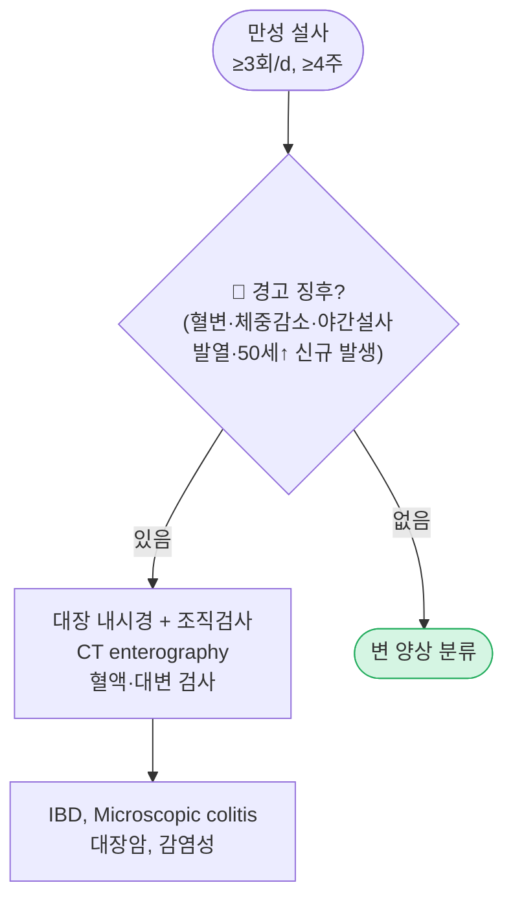
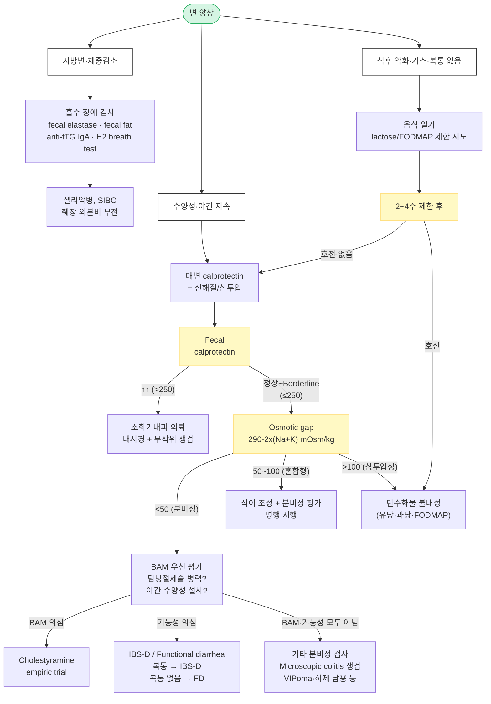

# 만성 설사 Chronic Diarrhea

## <mark style="color:green;">일반 사항</mark>

* 정의 : 묽은 변(Bristol stool scale 6\~7형) 또는 빈번한 배변(≥3회/d)이 **4주 이상** 지속되는 상태
* 급성 설사(≤2주)·지속성 설사(2\~4주)와 구분
* 대부분 장 점막의 수분·전해질 흡수-분비 불균형이 핵심 기전
* 기전상 삼투압성·분비성·염증성·흡수 장애·과운동성으로 분류되며 복합 기전이 흔함
* 진정한 식품 알레르기는 성인 만성 설사의 원인으로는 드묾

***

## <mark style="color:green;">원인</mark>

#### <mark style="color:$primary;">과운동성 설사 (Hypermotility)</mark>

* **IBS-D** (설사형 과민대장증후군) : 장-뇌 축(gut-brain axis) 이상, 장 과민성, 장내 미세 염증 및 microbiome dysbiosis 관여
  * **Post-infectious IBS** : 급성 장염 이후 장 투과성 변화·미세 염증 지속으로 수개월 이상 설사·팽만·urgency 지속; 외래에서 흔히 간과됨
* **기능성 설사** (functional diarrhea) : 복통이 핵심 증상이 아님; 복통이 주된 경우 IBS-D를 우선 고려
* 갑상선항진증, 당뇨병신경병증, 포스트-수술 (미주신경 절제술 후)

#### <mark style="color:$primary;">삼투압 설사 (Osmotic)</mark>

* 탄수화물 흡수 장애 : 당분(lactose, fructose, sorbitol, xylitol, sucralose), 사카린
* 삼투성 하제 (예: MgO, phosphate, sulfate)
* **금식 시 호전**이 특징

#### <mark style="color:$primary;">흡수 장애 (Malabsorption)</mark>

* Whipple disease, giardiasis, 셀리악병(celiac disease), short bowel syndrome
  * ✽셀리악병은 한국에서 유병률이 낮으나 원인 불명 흡수 장애·철 결핍 빈혈·만성 설사에서는 anti-tTG IgA 선별 고려
* 소장 세균 과증식 (SIBO)
* 췌장 외분비 기능 부전 (만성 췌장염, pancreatic cystic fibrosis)

#### <mark style="color:$primary;">분비성 설사 (Secretory) — BAM 포함</mark>

* **담즙산 흡수 장애 (bile acid malabsorption, BAM/BAD)** : 만성 수양성 설사의 주요 원인 중 하나; 과소 진단되는 경향
  * 담낭절제술 후 (간혹 6\~12개월 내 회복)
  * Terminal ileum 절제·질환 후
  * **특발성 BAD** : terminal ileal disease 없이도 발생; IBS-D로 오진되는 경우 많음
  * 야간 수양성 설사 + 담낭절제술 병력 → 적극 의심; empiric cholestyramine trial이 현실적 접근
* 자극성 하제 (예: senna, docusate)
* 종양 : VIPoma, gastrinoma, carcinoid syndrome, 갑상선 medullary carcinoma — 극히 드묾
* Systemic mastocytosis, protein-losing enteropathy
* **식사와 무관하게 다량의 물 설사**, 야간에도 지속이 특징

#### <mark style="color:$primary;">약물 유발 설사</mark>

* cholinesterase inhibitors, SSRI, **ARB (특히 olmesartan)**, PPI, NSAID, metformin, allopurinol, orlistat
  * ✽**Olmesartan-associated enteropathy** : olmesartan 복용 수개월\~수년 후 셀리악병과 유사한 중증 장병증 발생 가능; 심한 만성 설사·체중 감소·흡수 장애 → olmesartan 중단 후 호전
* **GLP-1 수용체 작용제 / GIP·GLP-1 이중 작용제** (semaglutide, liraglutide, **tirzepatide** 등) : 장 운동 변화 및 장 내 분비 변화로 오심·복부 팽만·설사 유발 가능
  * ✽설사보다 **변비가 더 흔함**; 설사는 일부 환자에서, 특히 초기 용량 증량 시 발생
* 항생제 관련 장염 (_C. difficile_ 포함; 장내 dysbiosis로 인한 비특이적 설사 포함)
* 허브 : St. John's wort, echinacea, 마늘, 인삼, saw palmetto, cranberry, 알로에

#### <mark style="color:$primary;">염증성·비감염성 설사 (Inflammatory)</mark>

* IBD (Crohn's disease, 궤양성 대장염)
* **Microscopic colitis** (collagenous colitis, lymphocytic colitis) : 내시경 정상, 조직검사로만 확진; NSAID·PPI·SSRI 유발 가능
* 혈관염, 방사선 장염, 호산구성 장염

#### <mark style="color:$primary;">감염성 설사 (Infection)</mark>

* 세균 : _Clostridioides difficile_, _Mycobacterium avium intracellulare_ (**면역저하자에서 주로 발생** — HIV, 장기이식, 고용량 스테로이드 복용자)
* 바이러스 : cytomegalovirus (**면역저하자에서 주로 발생**)
* 기생충 : _Giardia lamblia_, _Cryptosporidium_, _Isospora_, _Strongyloides_

#### <mark style="color:$primary;">만성 전신 질환</mark>

* 갑상선 질환, 당뇨병, 콜라겐 혈관 질환 → 장 운동 또는 흡수 변화

***

## <mark style="color:green;">임상 양상</mark>

### <mark style="color:orange;">기전별 임상 특징</mark>

<table><thead><tr><th width="140">기전 유형</th><th width="250">특징적 양상</th><th>감별 단서</th></tr></thead><tbody><tr><td>과운동성</td><td>하복부 통증, 소량 설사, 야간에 드묾</td><td>금식·스트레스와 연관; 장 소리↑</td></tr><tr><td>삼투압성</td><td>식사 후 설사, 복부 팽창/가스</td><td>금식 시 호전; 당류 제한 시 호전</td></tr><tr><td>흡수 장애</td><td>지방변, 체중 감소, 영양 결핍</td><td>설사 양 많고 악취; 지용성 비타민 결핍</td></tr><tr><td>분비성/BAM</td><td>다량 수양성 설사, 야간에도 지속</td><td>식사와 무관; 금식해도 지속; 담낭절제술 병력</td></tr><tr><td>염증성</td><td>혈변, 농변, 복통, 발열, 체중 감소</td><td>대변 calprotectin↑; 내시경 이상 소견</td></tr></tbody></table>

### <mark style="color:orange;">변 양상 기반 초고속 접근 (Stool Phenotype Approach)</mark>


**외래 실전 팁** — 상세 검사 전, 변의 성상·시간·연관 증상만으로도 상위 감별 진단을 빠르게 추릴 수 있다.


<table><thead><tr><th width="220">변 양상</th><th>가장 의심할 진단</th></tr></thead><tbody><tr><td>수양성 + 야간 지속</td><td>Secretory, BAM, Microscopic colitis</td></tr><tr><td>식후 즉시 악화</td><td>IBS-D, BAM (담낭절제술 후), 삼투압성</td></tr><tr><td>지방변 (기름지고 악취)</td><td>Malabsorption, 췌장 외분비 부전, SIBO, 셀리악병</td></tr><tr><td>혈변·농변</td><td>IBD, 감염성 (C. difficile), 종양</td></tr><tr><td>소량 빈번 + urgency 주증상</td><td>IBS-D, BAM, 직장 염증</td></tr><tr><td>복부 팽만·가스 동반</td><td>Carbohydrate intolerance, SIBO, IBS-D</td></tr><tr><td>금식 시 호전</td><td>Osmotic (유당·과당 불내성, 삼투성 하제)</td></tr><tr><td>금식해도 지속</td><td>Secretory (BAM, 종양, 하제 남용)</td></tr></tbody></table>

### <mark style="color:orange;">Functional diarrhea vs IBS-D 감별</mark>


기능성 설사는 **복통이 핵심 증상이 아니라는 점**에서 IBS-D와 구분된다. 반복적 복통이 배변과 연관되어 발생하면 IBS-D를 우선 고려한다.


<table><thead><tr><th width="190">특징</th><th width="200">Functional diarrhea</th><th>IBS-D</th></tr></thead><tbody><tr><td>핵심 증상</td><td>묽은 변 (설사)</td><td>복통 + 설사</td></tr><tr><td>복통</td><td>거의 없음</td><td>반복적으로 존재</td></tr><tr><td>배변 후 통증 변화</td><td>없음</td><td>흔함 (배변 후 호전)</td></tr><tr><td>스트레스 연관</td><td>일부</td><td>흔함</td></tr><tr><td>야간 증상</td><td>드묾</td><td>드묾</td></tr><tr><td>치료 핵심</td><td>Stool form control</td><td>Gut-brain modulation</td></tr></tbody></table>


**⚠️ Microscopic colitis — 놓치기 쉬운 핵심 진단**

고령(특히 60대 이상) 여성의 만성 수양성·야간 설사에서 **대장내시경이 정상이어도** microscopic colitis를 반드시 배제해야 한다.\
**무작위 조직검사 (random biopsy, 상행·횡행·하행결장)** 없이는 진단 불가. NSAID·PPI·SSRI 복용력 반드시 확인.


### <mark style="color:$danger;">🚩 Red Flags!</mark>

<mark style="color:$danger;">**즉각 조치 또는 의뢰**</mark> <mark style="color:$danger;">- 생명 위협 또는 즉각적 위해 가능성</mark>

* 중증 탈수 또는 전해질 불균형으로 인한 활력징후 불안정 (저혈압, 빈맥)
* 대량 혈변 또는 지속 혈변으로 순환 부전 징후
* Toxic megacolon 의심 (복부 팽창 + 발열 + 반발 압통 + 전신 독성 징후)
* _Clostridioides difficile_ 감염 의심 + 중증 전신 증상

<mark style="color:$warning;">**당일 또는 조기 의뢰**</mark>

* 직장 출혈 / 흑색변 (melena) / 혈변 (hematochezia)
* 원인 불명의 체중 감소 (6개월 내 ≥5%)
* **50세 이상 새로 발생한 만성 설사 → 대장내시경 시행** (대장암 선별)
* 결직장암 가족력 동반 새 증상
* 야간 설사 (수면 중 깨어날 정도; 기질적 원인 시사)
* 지속적 발열 + 복통

<mark style="color:$info;">**외래 추적 / 추가 평가 계획**</mark> <mark style="color:$info;">- 즉각 위험 낮으나 호전 없으면 의뢰</mark>

* 경고 징후 없이 4\~6주 치료에도 증상 지속 → 추가 검사 또는 소화기내과 의뢰
* IBS 진단 기준 충족 + 초기 대증치료 무반응
* 흡수 장애 의심 (지방변, 영양 결핍) → 소화기내과 의뢰
* 기능성 설사와 유기적 원인 감별이 불분명한 경우

***

## <mark style="color:green;">진단</mark>

### <mark style="color:orange;">기초 평가</mark>

* **병력** : 기저 질환, 약물(최근 항생제 포함), 식이(음식 일기), 정신사회적 스트레스, 여행력, 가족력, 수술력(담낭절제술)
* **기능성 설사 진단 기준 \[Rome Ⅳ]**
  * A. 최소 6개월 전 발생, 최근 3개월간 **통증이나 불편감 없는** 죽/물 같은 변이 배변의 >¼에서 발생
  * B. IBS-D 진단 기준에 해당되지 않음

### <mark style="color:orange;">검사</mark>


**경고 징후 없는 경우**: 검사 전 음식 일기(2\~4주) → 식이 유발 원인(lactose, fructose, sorbitol) 먼저 배제 → 단계적 검사.\
**경고 징후 있는 경우**: 즉시 혈액·대변·내시경 검사.


**혈액 검사**

* CBC, ESR, CRP → 염증 스크리닝
* 전해질(Mg, P, Ca, Na), LFT, 알부민, INR → 영양 상태·흡수 기능
* TSH → 갑상선 기능 이상
* Anti-tissue transglutaminase IgA (anti-tTG IgA) → 셀리악병 (한국에서 유병률 낮으나 원인 불명 흡수 장애·철 결핍 빈혈 동반 시 선별 고려)
* 빈혈 검사 (Fe/TIBC, B12, folate, Vit D) → 흡수 장애 동반 여부

**대변 검사**

* WBC, 배양, 기생충 + 잠혈 → 감염·염증
* 전해질(Na, K)·삼투압 → osmotic gap 계산 : **290 − 2×(Na + K)** mOsm/kg stool water

<table><thead><tr><th width="200">Osmotic gap (mOsm/kg)</th><th>임상 해석</th></tr></thead><tbody><tr><td>&#x3C; 50</td><td>분비성 설사 (secretory) — 식사와 무관, 금식해도 지속</td></tr><tr><td>50 – 100</td><td>혼합형/indeterminate — 두 기전 공존 가능; 추가 평가 필요</td></tr><tr><td>> 100</td><td>삼투압성 설사 (osmotic) — 금식 시 호전 기대</td></tr></tbody></table>

* **Fecal calprotectin** : 장 점막 염증 비침습 지표; IBD vs. 기능성 설사 감별에 실용적
  * ✽**국내 급여 기준**: IBD 의심 환자에서 시행 시 연 1\~2회 인정 (선별 급여); 단순 IBS 상병으로 청구 시 삭감 주의

<table><thead><tr><th width="180">Calprotectin 수치</th><th>임상 해석</th></tr></thead><tbody><tr><td>&#x3C; 50 ㎍/g</td><td>장 염증 가능성 낮음 → 기능성 원인 우선 평가</td></tr><tr><td>50 – 150 ㎍/g</td><td>Borderline → 임상 양상과 함께 판단; 추적 또는 내시경 고려</td></tr><tr><td>150 – 250 ㎍/g</td><td>기질적 염증 의심 → 내시경 적극 고려</td></tr><tr><td>> 250 ㎍/g</td><td>Active IBD 가능성 높음 → 소화기내과 의뢰</td></tr></tbody></table>

* **Fecal elastase-1** (대변 엘라스타제) : 췌장 외분비 기능 부전 비침습 평가; <200 ㎍/g → 췌장 기능 부전 의심
  * ✽72시간 대변 지방 검사보다 간편; 설사 중에는 희석에 의한 위음성 주의
* 대변 지방 (72시간, >7 g/d → 지방 흡수 장애)
* _C. difficile_ toxin PCR (항생제 복용력 있거나 중증 설사)

**호기 검사 (Hydrogen breath test)**

* 유당·과당 불내성, SIBO 진단에 유용
* **한계** : 위양성·위음성 모두 가능; 임상 양상과 함께 해석 필수
  * Methane 양성 → constipation-predominant phenotype과 연관
  * 장 통과 가속(rapid transit) → 수소 조기 상승 → false positive 가능
* Glucose hydrogen breath test가 SIBO 진단에 선호됨

**영상·내시경**

* 복부 X선, CT enterography (흡수 장애·염증 의심 시)
* 대장 내시경 + 조직검사 : 경고 징후·혈변·50세 이상 신규 발생
  * Microscopic colitis : 내시경 정상이어도 **무작위 조직검사 (상행·횡행·하행결장)** 필수
* 소장 영상 (CT/MR enterography) : 크론병·소장 종양 의심 시

**특수 검사 (2차 의뢰)**

* SeHCAT scan, 혈청 **FGF-19**, 혈청 **C4 (7α-hydroxy-4-cholesten-3-one)** : 담즙산 흡수 장애(BAM) 확진
  * ✽국내 시행 어려움 → empiric cholestyramine trial이 현실적 대안
* 소장 흡인액 배양 : SIBO 확진 (실제 시행 어려움)
* 조직검사 : 셀리악병(십이지장), Whipple disease(소장) 의심 시

***

***





<p align="center"><strong>만성 설사 진단 알고리듬</strong></p>

***


**외래 임상 핵심 포인트 (One-line Pearls)**

* "먹으면 바로 설사" → IBS-D / BAM 먼저 생각
* "밤에도 깨서 설사" → 기능성보다 기질성 가능성↑ → microscopic colitis / BAM 평가
* "정상 내시경인데 계속 물설사" → microscopic colitis 놓치기 쉬움; random biopsy 필수
* "담낭절제 후 지속 설사" → BAM 매우 흔함; cholestyramine trial 먼저
* "복통 없는 만성 묽은 변" → functional diarrhea 가능 (IBS-D와 구분)
* "반복 복통이 핵심" → IBS-D → gut-brain modulation 접근
* "노인 여성 + 수양성 야간 설사 + 정상 내시경" → microscopic colitis until proven otherwise
* "olmesartan 복용 중 + 심한 흡수 장애" → olmesartan enteropathy 의심; 즉시 중단


***

## <mark style="background-color:$warning;">Management</mark>


**치료 방침 요약**\
① 원인 질환 치료가 우선 — 기전을 규명하지 않은 채 대증 치료에만 의존하지 말 것\
② 경고 징후 없고 기능성 설사/IBS 진단 기준 충족 → 진단적 치료 시행\
③ 4\~6주 치료에 반응 없으면 추가 검사 또는 의뢰


### <mark style="color:orange;">치료 방침</mark>

* **원인 질환 치료** : 감염, IBD, 췌장 기능 부전, 갑상선 기능 항진 등 기저 원인 교정
* **탈수 관리·영양 공급** : 경구 수분 보충 (ORS 또는 전해질 음료); 균형 잡힌 식이
* **유발 식품 회피** (음식 일기 작성 권고)
  * 유당 불내성 → lactose-free 식이; lactase 보충제 고려
  * 식이 제한 : low-FODMAP 식이 (IBS-D), gluten 제거 (셀리악병), sorbitol·fructose 제한
* **약물 재검토** : PPI, NSAID, SSRI, GLP-1 RA, **olmesartan** 등 설사 유발 약물 확인 후 중단 또는 교체
* **항문 주위 피부 보호** : zinc oxide 연고 <mark style="color:blue;">\[보소미]</mark>, 피부 방수제 <mark style="color:blue;">\[카빌론]</mark> 고려
* **위생 관리** : 특히 감염성 원인 배제 전까지 손 위생 철저

***

## <mark style="color:green;">비-약물 치료 및 예방</mark>

* **저-FODMAP 식이** : IBS-D 및 기능성 설사에 효과적
  * 2\~6주 제한 후 단계적 재도입으로 개인 내성 식품 확인
* **유당 제한** : 유당 불내성 확인 후 lactose-free 제품으로 전환 또는 lactase 효소 보충
* **수분 보충** : 탈수 예방; 카페인·알코올·고당분 음료 제한
* **규칙적 운동** : 규칙적인 유산소 운동이 장 운동 조절에 도움 — IBS-D 증상 완화에 근거 있음
* **스트레스 관리** : IBS-D에서 gut-brain axis로 인해 심리적 스트레스가 유발 인자
  * 인지행동치료(CBT), 장 지향 최면요법(gut-directed hypnotherapy) — 근거 있음
* **규칙적 식사 습관** : 불규칙한 식사, 폭식 회피; 소량 빈식 고려

***

## <mark style="color:green;">약물 치료</mark>

### <mark style="color:orange;">Opiates (μ-opiate receptor 선택적)</mark>

* 작용 : 장 운동 지연, 장 분비 감소
* 대상 : 비특이적 만성 설사 대증 치료; 기능성 설사·IBS-D urgency 증상에 유용
* loperamide 2\~4 ㎎ bid\~qid <mark style="color:blue;">\[로프민]</mark>
  * ✽만성 기능성 설사에서는 식전 규칙적 복용(scheduled dosing, 예: 식전 30분)이 urgency 예방에 PRN보다 효과적
* diphenoxylate 2.5\~5 ㎎ tid\~qid <mark style="color:blue;">\[로모틸]</mark>


**⚠️ Opiates 주의사항**\
&#xNAN;_&#x43;. difficile_ 감염이나 염증성 설사에서는 장 운동 억제제 사용 금지 (독성 거대결장 유발 위험)


### <mark style="color:orange;">IBS-D 표적 치료제</mark>


IBS-D는 단순 설사 억제보다 **장-뇌 축 조절 및 복통 완화**에 초점을 맞춘 복합 접근이 필요하다.\
Loperamide 단독은 urgency·묽은 변에 효과적이나 복통 dominant phenotype에서는 효과 제한적.


* **ondansetron** (5-HT₃ 차단제) 4 ㎎ prn\~bid <mark style="color:blue;">\[조프란]</mark>
  * 장 통과시간 지연 → urgency·묽은 변 개선; IBS-D에서 RCT 근거 있음
  * ✽국내 IBS-D 허가 외 (오프라벨); **오심·구토 상병으로 청구** 가능 (전액 본인부담 또는 급여 외 처방 동의 필요)
* **저용량 TCA** : 복통 + urgency 동반 IBS-D에 유용; 진통·장 운동 억제·수면 개선 복합 효과
  * amitriptyline 10\~25 ㎎ hs <mark style="color:blue;">\[에트라빌]</mark>


**⚠️ QT 연장 주의 — ondansetron + TCA 병용 시**\
Ondansetron과 amitriptyline 모두 QT 간격 연장 가능성이 있으며, SSRI 병용 시 위험이 증가합니다.\
고령 환자, 전해질 이상(저칼륨·저마그네슘), 기존 QT 연장 병력이 있는 경우 심전도 모니터링을 고려하십시오.


* **Antispasmodics** : 식후 복통·cramping 동반 시
  * mebeverine 135 ㎎ tid (식전 20분) <mark style="color:blue;">\[두스파탈린]</mark>
  * trimebutine 100\~200 ㎎ tid <mark style="color:blue;">\[포리부틴]</mark>
* **rifaximin** 200 ㎎ 2T tid × 14일 : bloating prominent IBS-D, post-infectious IBS에 효과 (SIBO 동반 시 포함)

### <mark style="color:orange;">α-2 Adrenergic agonist</mark>

* 작용 : 장내 전해질 분비 억제, intestinal transit time 지연
* 대상 : 분비성 설사, 당뇨병성 설사, opiate 금단 설사
* 주의 : 혈압 강하
* clonidine 0.1\~0.3 ㎎ tid <mark style="color:blue;">\[켑베이]</mark> (보험 주의)

### <mark style="color:orange;">Somatostatin analogue</mark>

* 작용 : 장 내 fluid·전해질 흡수 자극, GI peptides 분비 억제
* 대상 : carcinoid syndrome, VIPoma, 화학요법 관련 설사, 위 절제술 후 덤핑증후군
* octreotide 50\~200 **㎍** tid SC <mark style="color:blue;">\[산도스타틴 라르 주]</mark> (보험 주의)

### <mark style="color:orange;">Bile acid-binding resin</mark>

* 대상 : 담즙산 흡수 장애(BAM) — 담낭절제술 후, terminal ileum 절제 후, 특발성 BAD
* Empiric trial이 SeHCAT 검사보다 현실적; 1\~2주 내 반응 확인 가능
* cholestyramine 4 g 1포 qd\~qid (식사와 함께) <mark style="color:blue;">\[퀘스트란 현탁용산]</mark>
  * ✽소량(1포 qd)에서 시작 → 증상에 따라 증량; 복부 팽만·변비 부작용 흔함
  * ✽다른 약물과 4\~6시간 간격 복용 필수 (약물 흡착 방해)
* colesevelam : cholestyramine 불내성 시 대체 (맛·내약성 우수; 국내 당뇨 적응증으로 허가)

### <mark style="color:orange;">항생제 (SIBO 치료)</mark>

* 대상 : 소장 세균 과증식 (보험 주의)
* **rifaximin 1차 권고** (비흡수성 항생제; 전신 부작용 적음)
  * **국내 제형** : 노르믹스정 200 ㎎; 550 ㎎ 정제(Xifaxan)는 국내 미유통
  * SIBO 치료 용량 : 200 ㎎ **2T tid** (1,200 ㎎/d) × 14일; 필요 시 3T tid (1,800 ㎎/d)
  * ✽국내에서 SIBO 오프라벨 사용; 간성 뇌증 적응증으로 허가됨
  * ✽재발 시 반복 치료; 원인(장 운동 장애, 해부학적 이상) 교정이 재발 방지의 핵심
* ciprofloxacin 500 ㎎ bid × 7\~10일 <mark style="color:blue;">\[씨프로바이]</mark> (대체)
* metronidazole 500 ㎎ tid\~qid × 7\~10일 <mark style="color:blue;">\[후라시닐]</mark> (대체; 내성 주의)

### <mark style="color:orange;">Microscopic colitis 치료제</mark>

* 대상 : 조직검사로 확진된 collagenous/lymphocytic colitis
* **유발 약물(NSAID, PPI, SSRI) 중단이 치료의 핵심**
* **budesonide** 9 ㎎ qd × 8주 → tapering : 1차 선택
  * 엔토코트 서방캡슐 3 ㎎ × 3캡 qd (아침 식전) <mark style="color:blue;">\[엔토코트]</mark>
  * 타미코트 서방정 9 ㎎ × 1T qd (아침 식전) <mark style="color:blue;">\[타미코트]</mark> (급여 기준 확인 필요)
  * 재발률이 높아 **장기 유지요법이 필요한 경우 많음** (저용량 3\~6 ㎎/d 유지 고려)
* bismuth subsalicylate : 경증 또는 budesonide 전 시도; 장기 사용 안전성 주의

### <mark style="color:orange;">Fiber supplement</mark>

* 대상 : 소량의 물 설사, 대변실금 동반 기능성 설사
* 작용 : 수용성 식이섬유 → 장 내용물 점도↑ → 대변 수분 흡수↑
* psyllium 10\~20 g/d (충분한 수분과 함께) <mark style="color:blue;">\[무타실]</mark>
* polycarbophil 5 g/d <mark style="color:blue;">\[웰콘]</mark>

### <mark style="color:orange;">Probiotics</mark>

* 효과는 \*\*균주 특이적(strain-specific)\*\*이며 전체 효과 크기는 크지 않음 (guideline 간 권고 불일치)
* IBS-D, 항생제 관련 설사 예방에 일부 근거
  * _**Saccharomyces boulardii**_ : 항생제 관련 설사 예방에 가장 근거가 강함 (메타분석)
  * _Lactobacillus rhamnosus_ GG : IBS-D 및 항생제 관련 설사에 근거 있음

***

### <mark style="color:red;">질병코드</mark>

K59.1 기능성 설사

K58.0 설사형 과민성 대장증후군 (IBS-D)

K52.9 비감염성 위장염 및 결장염, 상세불명

K52.3 Microscopic colitis

K90.0 셀리악병

K90.3 췌장 지방변증 (소장 외 흡수 장애)

***

## <mark style="color:purple;">처방례</mark>

> **처방례 1. 기능성 설사 / IBS-D (urgency 동반)**
>
> ```
> 조프란 4 ㎎/T   1T   bid (식사 전)
> 로프민 2 ㎎/캡  1캡  식전 30분 (scheduled dosing)
> ※ ondansetron은 IBS-D 오프라벨; 오심·구토 상병 병기 또는 전액 본인부담 처방
> ※ loperamide 식전 규칙 복용이 PRN보다 urgency 예방에 효과적
> ※ 고령·다제 병용 시 QT 연장 위험 모니터링
> ```
>
> _✽복통이 핵심이면 IBS-D로 접근; gut-brain modulation 병행 설명. ondansetron 무반응 시 low-dose amitriptyline 또는 antispasmodics 추가 고려._

> **처방례 2. IBS-D (반복 복통·cramping 동반)**
>
> ```
> 두스파탈린 135 ㎎/T  1T  tid (식전 20분)
> 에트라빌 10 ㎎/T      1T  hs
> ※ TCA는 진통·장 운동 억제·수면 개선 복합 효과
> ※ 항콜린 부작용(구강건조·변비) 주의; 10 ㎎에서 시작
> ※ SSRI 병용 시 QT 연장 및 세로토닌 증후군 위험 모니터링
> ```
>
> _✽low-FODMAP 식이와 병행; 스트레스-증상 연관성 설명. 4\~6주 후 반응 평가._

> **처방례 3. 담즙산 흡수 장애 / 담낭절제술 후 설사**
>
> ```
> 퀘스트란 현탁용산 4 g/포  1포  qd (식사와 함께)
> ※ 시작 시 소량(1포 qd); 증상에 따라 bid~tid 증량
> ※ 다른 약물과 4~6시간 간격 복용 필수
> ```
>
> _✽담낭절제술 후 6\~12개월 내 자연 호전 가능; 지속 시 cholestyramine empiric trial. 불내성 시 colesevelam으로 교체._

> **처방례 4. 소장 세균 과증식 (SIBO)**
>
> ```
> 노르믹스정 200 ㎎/T  2T  tid  × 14일 (총 1,200 ㎎/d)
> ※ 식사와 함께 복용
> ※ 재발 시 반복 치료 고려
> ※ 국내 550 mg 정제 없음; 노르믹스 200 mg 기준 처방
> ```
>
> _✽rifaximin은 비흡수성 항생제로 전신 부작용 적음. 원인(장 운동 장애, 해부학적 이상) 교정 없이는 재발률 높음._

> **처방례 5. Microscopic colitis (중등증)**
>
> ```
> 엔토코트 서방캡슐 3 ㎎/캡  3캡  qd (아침 식전)  × 8주
> 또는 타미코트 서방정 9 ㎎/T  1T  qd (아침 식전)  × 8주
> ※ 증상 호전 후 6주에 걸쳐 3 ㎎/d → 중단 (tapering)
> ※ NSAID·PPI·SSRI 동시 중단 필수
> ※ 재발률 높음 → 저용량(3 mg/d) 장기 유지요법 필요 가능
> ```
>
> _✽budesonide는 초회통과 효과가 크고 전신 스테로이드 부작용 적음. 재발 시 저용량 유지 요법 고려. 조직검사 확진 후 투여._

***

### <mark style="color:$success;">핵심 복약 지도</mark>

> **지사제(loperamide)에 대해**
>
> * 급성 설사 시에는 필요에 따라 복용하며, 1일 최대 4캡슐을 넘지 않도록 하십시오.
> * **만성 설사·긴박한 화장실 급박감(urgency)이 주 증상인 경우**: 식사 30분 전 규칙적으로 복용하면 갑작스러운 긴박감 예방에 더 효과적입니다.
> * **열이 나거나 혈변이 동반되면 복용을 즉시 중단하고 내원하십시오.** 감염성·염증성 설사에서는 오히려 위험할 수 있습니다.

> **섬유소 보충제(psyllium, polycarbophil)에 대해**
>
> * **반드시 충분한 물(250 ㎖ 이상)과 함께** 복용하십시오. 물 없이 복용하면 식도나 장에 막힐 수 있습니다.
> * 효과는 복용 시작 후 2\~3일 후부터 나타납니다. 꾸준히 복용하는 것이 중요합니다.
> * 설사뿐 아니라 변비에도 사용될 수 있는 약입니다 (대변 형태 안정화).

> **cholestyramine(퀘스트란)에 대해**
>
> * 식사와 함께 복용하십시오. 충분한 물에 녹여서 드십시오.
> * **다른 약물과 최소 4\~6시간 간격**을 두고 복용하십시오. 이 약은 다른 약물의 흡수를 방해할 수 있습니다(특히 갑상선약, 혈압약, 이뇨제).
> * 복부 팽만이나 가스가 생길 수 있습니다. 처음에 소량부터 시작하여 천천히 늘리십시오.

> **budesonide(엔토코트/타미코트)에 대해**
>
> * 이 약은 장에만 작용하는 스테로이드로 전신 부작용이 적습니다. 의사 지시 없이 임의로 중단하지 마십시오.
> * 처방받은 기간(8주)이 지나면 의사 지시에 따라 서서히 줄여야 합니다. 갑자기 끊으면 증상이 재발할 수 있습니다.
> * 재발률이 높은 질환이므로 호전 후에도 유지 처방이 필요할 수 있습니다.
> * 복용 중 감염 증상(발열, 오한)이 생기면 즉시 알려 주십시오.

> **언제 다시 병원을 방문해야 하나요?**
>
> * 4\~6주 치료 후에도 증상이 호전되지 않는 경우
> * 혈변, 흑색변(검고 끈적한 변)이 나타나는 경우 — **즉시 내원**
> * 발열과 함께 설사가 심해지는 경우 — **즉시 내원**
> * 체중이 눈에 띄게 줄거나 심한 피로감이 동반되는 경우

***

### <mark style="color:blue;">환자 안내서</mark>


**만성 설사, 원인을 찾아 치료해야 합니다**

4주 이상 지속되는 설사는 단순한 '예민한 장'이 아닐 수 있습니다. 음식, 약물, 장 염증, 흡수 장애 등 다양한 원인이 있으며, 원인에 따라 치료 방법이 달라집니다.


#### <mark style="color:$primary;">왜 만성 설사가 생기나요?</mark>

만성 설사의 원인은 매우 다양합니다.

* **음식 관련** : 우유(유당 불내성), 과당이 많은 과일·과일주스, 당 알코올(소르비톨·자일리톨)을 많이 드시면 장에서 소화되지 않아 설사가 생깁니다.
* **약물** : 메트포르민(당뇨약), 위산 억제제(PPI), 소염진통제(NSAID), 일부 혈압약(특히 olmesartan 계열), GLP-1 주사제(오젬픽·위고비·마운자로 등)가 설사를 유발할 수 있습니다.
* **장 질환** : 과민대장증후군(IBS), 염증성 장 질환(크론병·궤양성 대장염), 미세 대장염(내시경이 정상이어도 조직검사로 발견)
* **담즙산 문제** : 담낭이 없어지면 **담즙산이 소장에서 흡수되지 않고 대장으로 흘러들어** 설사를 유발합니다. 담낭 절제술 후 지속되는 설사의 흔한 원인입니다.
* **흡수 장애** : 장이 영양분을 제대로 흡수하지 못하는 경우 (지방 흡수 장애 시 악취 나는 기름진 변이 특징)

#### <mark style="color:$primary;">음식 일기를 써 보세요</mark>

무엇을 먹었을 때 설사가 생기는지 **2\~4주 음식 일기**를 작성하면 원인을 찾는 데 큰 도움이 됩니다.

* 📋 기록할 내용 : 식사 시간, 먹은 음식, 설사 발생 시간, 횟수, 변의 형태
* 유당(우유·치즈), 과당(꿀·과일주스), 소르비톨(무설탕 식품), 카페인, 알코올이 흔한 유발 원인입니다

#### <mark style="color:$primary;">일상에서 이렇게 관리하세요</mark>

* **규칙적인 식사** : 과식이나 불규칙 식사는 장 운동을 자극합니다. 소량씩 자주 드세요.
* **수분 보충** : 설사로 빠져나간 수분을 충분히 보충하십시오. 전해질 음료 또는 맑은 국물이 도움됩니다.
* **피해야 할 것** : 기름진 음식, 고당분 음료, 카페인, 알코올
* **규칙적인 운동** : 걷기나 수영 같은 가벼운 유산소 운동이 장 기능 안정화에 도움이 됩니다.
* **스트레스 관리** : 장과 뇌는 신경으로 연결되어 있습니다. 스트레스가 심하면 장 운동이 빨라질 수 있습니다. 충분한 수면과 명상, 규칙적인 운동이 도움됩니다.

#### <mark style="color:$primary;">이럴 때는 즉시 병원을 방문하세요 🚨</mark>

* 변에 **피가 섞이거나** 변이 검고 끈적한(흑색변) 경우
* **발열**과 함께 설사가 심해지는 경우
* **6개월 안에 체중이 5% 이상** 줄어드는 경우
* 밤에 자다가 깰 정도로 심한 설사가 지속되는 경우
* 심한 어지러움, 입 마름, 소변 감소 (탈수 증상)가 동반되는 경우
