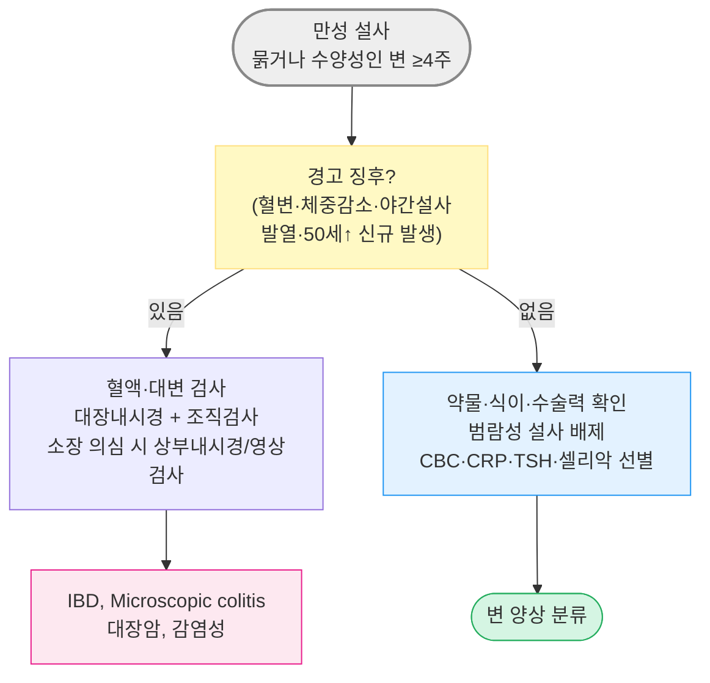
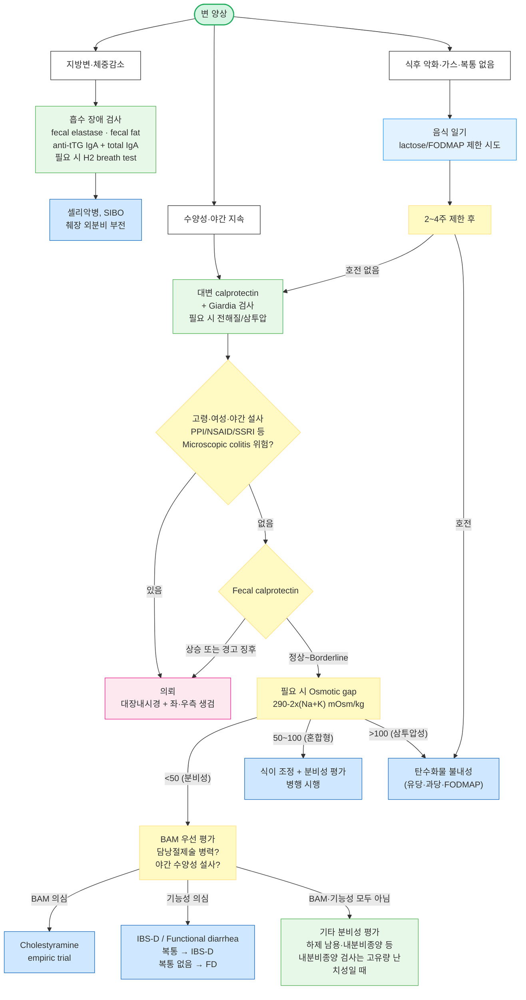

# 만성 설사 Chronic Diarrhea

## <mark style="color:green;">일반 사항</mark>

* 정의 : 묽거나 수양성인 변([Bristol stool scale](082_-constipation.md#undefined-3) 6\~7형)이 4주 이상 반복되는 상태로, 배변 횟수 증가·절박변 또는 변실금이 동반될 수 있음
* 급성 설사(≤2주)·지속성 설사(2\~4주)와 구분
* 대부분 장 점막의 수분·전해질 흡수-분비 불균형이 핵심 기전
* 기전상 삼투압성·분비성·염증성·흡수 장애·과운동성으로 분류되며 복합 기전이 흔함
* 진정한 식품 알레르기는 성인 만성 설사의 원인으로는 드묾

## <mark style="color:green;">원인</mark>

#### <mark style="color:$primary;">과운동성 설사 (Hypermotility)</mark>

* 기능성 설사 (functional diarrhea) : 복통이 핵심 증상이 아님; 복통이 주된 경우 IBS-D를 우선 고려
* IBS-D (설사형 과민대장증후군) : 장-뇌 축(gut-brain axis) 이상, 장 과민성, 장내 미세 염증 및 microbiome dysbiosis 관여
  * Post-infectious IBS : 급성 장염 이후 장 투과성 변화·미세 염증 지속으로 수개월 이상 설사·팽만·urgency 지속; 외래에서 흔히 간과됨
* 갑상선항진증, 당뇨병신경병증, 포스트-수술 (미주신경 절제술 후)

#### <mark style="color:$primary;">삼투압 설사 (Osmotic)</mark>

* 탄수화물 흡수 장애 : 당분(lactose, fructose), 당알코올(sorbitol, xylitol 등); sucralose·사카린 등 인공감미료도 일부 환자에서 증상을 유발할 수 있으나 전형적인 삼투압성 원인으로 단정하지 않음
* 삼투성 하제 (예: MgO, phosphate, sulfate)
* 금식 시 호전이 특징

#### <mark style="color:$primary;">흡수 장애 (Malabsorption)</mark>

* Whipple disease, giardiasis, 셀리악병(celiac disease), short bowel syndrome
  * 셀리악병은 한국에서 유병률이 낮으나 원인 불명 흡수 장애·철 결핍 빈혈·만성 설사에서는 anti-tTG IgA와 total IgA 선별 고려
* 소장 세균 과증식 (SIBO)
* 췌장 외분비 기능 부전 (만성 췌장염, 췌장 수술 후, cystic fibrosis 등)

#### <mark style="color:$primary;">분비성 설사 (Secretory) - BAM 포함</mark>

* 담즙산 흡수 장애 (bile acid malabsorption, BAM/BAD) : 만성 수양성 설사의 주요 원인 중 하나; 과소 진단되는 경향
  * 담낭절제술 후 : 담즙산의 저장·방출 양상이 바뀌고 대장으로 전달되는 담즙산이 증가하여 발생 가능; 일부는 자연 호전하지만 지속 기간은 다양함
  * Terminal ileum 절제·질환 후
  * 특발성 BAD : terminal ileal disease 없이도 발생; IBS-D로 오진되는 경우 많음
  * 야간 수양성 설사 + 담낭절제술 병력 → 적극 의심; empiric cholestyramine trial이 현실적 접근
* 하제 : 자극성 하제(senna, bisacodyl), 변연화제(docusate) 등
* 종양 : VIPoma, gastrinoma, carcinoid syndrome, 갑상선 medullary carcinoma - 극히 드묾
* Systemic mastocytosis; protein-losing enteropathy는 독립 원인이라기보다 여러 장 질환에서 발생하는 증후군으로 감별
* 식사와 무관하게 다량의 물 설사, 야간에도 지속이 특징

#### <mark style="color:$primary;">약물 유발 설사</mark>

* 마그네슘 함유 보충제·제산제, cholinesterase inhibitors, SSRI, ARB (특히 olmesartan), PPI, NSAID, metformin, colchicine, mycophenolate, 면역관문억제제, allopurinol, orlistat
  * olmesartan-associated enteropathy : olmesartan 복용 수개월\~수년 후 셀리악병과 유사한 중증 장병증 발생 가능; 심한 만성 설사·체중 감소·흡수 장애 → olmesartan 중단 후 호전
* GLP-1 수용체 작용제 / GIP·GLP-1 이중 작용제 (semaglutide, liraglutide, tirzepatide 등) : 장 운동 변화 및 장 내 분비 변화로 오심·복부 팽만·설사 또는 변비 유발 가능
  * 설사와 변비의 빈도는 제제·용량에 따라 다르며, 주로 치료 시작 또는 용량 증량기에 발생
* 항생제 관련 장염 : _C. difficile_ 포함; 장내 dysbiosis로 인한 비특이적 설사 포함
* 허브 : St. John's wort, echinacea, 마늘, 인삼, saw palmetto, cranberry, 알로에 및 senna·cascara 등이 든 완하성 허브차

#### <mark style="color:$primary;">염증성·비감염성 설사 (Inflammatory)</mark>

* IBD (Crohn's disease, 궤양성 대장염)
* Microscopic colitis (collagenous colitis, lymphocytic colitis) : 내시경 정상, 조직검사로만 확진; NSAID·PPI·SSRI 등과 연관되며 발병과의 시간적 관계 확인
* 혈관염, 방사선 장염, 호산구성 장염

#### <mark style="color:$primary;">감염성 설사 (Infection)</mark>

* 세균 : _Clostridioides difficile_, _Mycobacterium avium intracellulare_ (면역 저하자에서 주로 발생 - HIV, 장기이식, 고용량 스테로이드 복용자)
* 바이러스 : cytomegalovirus (면역 저하자에서 주로 발생)
* 기생충 : _Giardia duodenalis_ (_G. lamblia_), _Cryptosporidium_, _Cystoisospora belli_ (구 _Isospora belli_), _Strongyloides_

#### <mark style="color:$primary;">만성 전신 질환</mark>

* 갑상선 질환, 당뇨병, 콜라겐 혈관 질환 → 장 운동 또는 흡수 변화

## <mark style="color:green;">임상 양상</mark>

### <mark style="color:orange;">기전별 임상 특징</mark>

<table><thead><tr><th width="140">기전 유형</th><th width="265">특징적 양상</th><th>감별 단서</th></tr></thead><tbody><tr><td>과운동성</td><td>하복부 통증, 소량 설사, 야간에 드묾</td><td>금식·스트레스와 연관; 장 소리↑</td></tr><tr><td>삼투압성</td><td>식사 후 설사, 복부 팽창/가스</td><td>금식 시 호전; 당류 제한 시 호전</td></tr><tr><td>흡수장애</td><td>지방변, 체중 감소, 영양 결핍</td><td>설사 양 많고 악취; 지용성 비타민 결핍</td></tr><tr><td>분비성/BAM</td><td>다량 수양성 설사, 야간에도 지속</td><td>식사와 무관; 금식해도 지속; 담낭절제술 병력</td></tr><tr><td>염증성</td><td>혈변, 농변, 복통, 발열, 체중 감소</td><td>대변 calprotectin↑; 내시경 이상 소견</td></tr></tbody></table>

### <mark style="color:orange;">변 양상 기반 접근 (Stool Phenotype Approach)</mark>

<table><thead><tr><th width="220">변 양상</th><th>가장 의심할 진단</th></tr></thead><tbody><tr><td>수양성 + 야간 지속</td><td>Secretory, BAM, Microscopic colitis</td></tr><tr><td>식후 즉시 악화</td><td>IBS-D, BAM (담낭절제술 후), 삼투압성</td></tr><tr><td>지방변 (기름지고 악취)</td><td>Malabsorption, 췌장 외분비 부전, SIBO, 셀리악병</td></tr><tr><td>혈변·농변</td><td>IBD, 감염성 (C. difficile), 종양</td></tr><tr><td>소량 빈번 + urgency 주증상</td><td>IBS-D, BAM, 직장 염증</td></tr><tr><td>복부 팽만·가스 동반</td><td>Carbohydrate intolerance, SIBO, IBS-D</td></tr><tr><td>금식 시 호전</td><td>Osmotic (유당·과당 불내성, 삼투성 하제)</td></tr><tr><td>금식해도 지속</td><td>Secretory (BAM, 종양, 하제 남용)</td></tr></tbody></table>

### <mark style="color:orange;">Functional diarrhea vs IBS-D 감별</mark>

* 기능성 설사는 복통이 핵심 증상이 아니라는 점에서 IBS-D와 구분. 반복적 복통이 배변과 연관되어 발생하면 IBS-D를 우선 고려

<table><thead><tr><th width="190">특징</th><th width="200">Functional diarrhea</th><th>IBS-D</th></tr></thead><tbody><tr><td>핵심 증상</td><td>묽은 변 (설사)</td><td>복통 + 설사</td></tr><tr><td>복통</td><td>반복적이거나 주된 증상인 복통 없음</td><td>반복적으로 존재</td></tr><tr><td>배변과 통증의 관계</td><td>뚜렷하지 않음</td><td>배변과 관련되어 호전 또는 악화 가능</td></tr><tr><td>스트레스 연관</td><td>일부</td><td>흔함</td></tr><tr><td>야간 증상</td><td>드묾</td><td>드묾</td></tr><tr><td>치료 핵심</td><td>Stool form control</td><td>Gut-brain modulation</td></tr></tbody></table>


**Microscopic colitis :** 고령(특히 60대 이상) 여성의 만성 비혈성 수양성·야간 설사에서는 대장내시경이 정상이어도 microscopic colitis를 적극 고려해야 함; 좌·우측 결장의 무작위 조직검사(random biopsy) 없이는 진단 불가. NSAID·PPI·SSRI 복용력 반드시 확인


### <mark style="color:$danger;">🚩 Red Flags!</mark>

<mark style="color:$danger;">**즉각 조치 또는 의뢰**</mark>

* 중증 탈수 또는 전해질 불균형으로 인한 활력징후 불안정 (저혈압, 빈맥)
* 대량 혈변 또는 지속 혈변으로 순환 부전 징후
* Toxic megacolon 의심 (복부 팽창 + 발열 + 반발 압통 + 전신 독성 징후)
* _Clostridioides difficile_ 감염 의심 + 중증 전신 증상

<mark style="color:$warning;">**당일 또는 조기 의뢰**</mark>

* 직장 출혈 / 흑색변 (melena) / 혈변 (hematochezia)
* 원인 불명의 체중 감소 (6개월 내 ≥5%)
* 50세 이상 새로 발생한 만성 설사 → 대장암 등 기질적 질환 배제 필요
* 결직장암 가족력 동반 새 증상
* 야간 설사 (수면 중 깨어날 정도) → 기질적 원인
* 원인 불명의 철 결핍 빈혈 또는 저알부민혈증
* 지속적 발열 + 복통

<mark style="color:$info;">**외래 추적 / 추가 평가 계획**</mark> <mark style="color:$info;">- 즉각 위험 낮으나 호전 없으면 의뢰</mark>

* 경고 징후 없이 4\~6주 치료에도 증상 지속
* IBS 진단 기준 충족 + 초기 대증치료 무반응
* 흡수 장애 의심 (지방변, 영양 결핍)
* 기능성 설사와 유기적 원인 감별이 불분명한 경우

## <mark style="color:green;">진단</mark>

### <mark style="color:orange;">기초 평가</mark>

* 병력 : 기저 질환, 약물(최근 항생제 포함), 식이(음식 일기), 정신사회적 스트레스, 여행력, 가족력, 수술력(담낭절제술)
* 고령자·거동 저하자·오피오이드 복용자에서 변비 병력과 함께 소량의 묽은 변이나 변실금이 반복되면 분변 매복에 의한 범람성 설사(overflow diarrhea)를 고려하고 직장수지검사를 시행
* 기능성 설사 진단 기준 \[Rome Ⅳ]
  1. 최소 6개월 전 발생, 최근 3개월간 주된 복통이나 불편한 복부 팽만 없이 죽/물 같은 변이 배변의 ＞¼에서 발생
  2. IBS-D 진단 기준에 해당되지 않음

### <mark style="color:orange;">검사</mark>


**경고 징후 없는 경우** : 약물·식이 검토 및 음식 일기(2\~4주)와 기본 검사를 병행 → 식이 유발 원인(lactose, fructose, sorbitol) 평가 → 단계적 검사\
**경고 징후 있는 경우** : 즉시 혈액·대변·내시경 검사


**혈액 검사**

* CBC, CRP ← 빈혈·염증 평가; 경고 징후 없는 수양성 설사에서 ESR/CRP만으로 IBD를 선별하지 말고 fecal calprotectin 또는 lactoferrin을 우선
* 전해질(Mg, P, Ca, Na), LFT, 알부민, INR ← 영양 상태·흡수 기능
* TSH ← 갑상선 기능 이상
* Anti-tissue transglutaminase IgA (anti-tTG IgA) + total IgA ← 셀리악병 (국내 유병률은 낮지만 원인 불명 만성 설사, IBS-D/기능성 설사를 진단하려는 경우, 흡수 장애·철 결핍 빈혈 동반 시 선별 고려)
  * IgA 결핍이면 IgG deamidated gliadin peptide(DGP) 또는 IgG-tTG를 사용
  * 글루텐 함유 식사를 유지한 상태에서 검사하며, 검사 전에 gluten-free 식이를 시작하지 않음. 이미 제한 중이면 임의로 단기간 섭취시키지 말고 gluten challenge의 양·기간을 전문의와 결정
  * 성인에서 혈청검사 양성이면 상부위장관 내시경과 십이지장 조직검사로 확진
* 빈혈 검사 : Fe/TIBC, B12, folate, Vit D ← 흡수 장애 동반 여부

**대변 검사**

* _Giardia_ 항원 또는 PCR : 원인 불명 만성 수양성 설사에서 적극 고려
* 대변 배양 : 발열·혈변, 집단 발생, 면역저하 또는 역학적 위험이 있을 때 선택
* 기생충란충 검사 : 여행·이주·오염수 노출·면역저하 등 위험이 있을 때 선택; 특별한 위험이 없으면 광범위한 routine 검사를 권하지 않음
* 대변 WBC는 정확도가 낮아 routine 검사로 권하지 않으며, 장 염증 평가는 fecal calprotectin/lactoferrin을 우선
* 대장암 평가가 필요하면 일반 잠혈검사보다 정량적 FIT와 내시경 적응증을 구분하여 적용
* 대변 전해질(Na, K) : 원인 불명 다량 수양성 설사에서 선택적으로 시행
  * osmotic gap 계산 : 290 − 2×(Na + K) mOsm/kg stool water

<table><thead><tr><th width="146">Osmotic gap</th><th>임상 해석</th></tr></thead><tbody><tr><td>&#x3C; 50 mOsm/㎏</td><td>분비성 설사 (secretory) - 식사와 무관, 금식해도 지속</td></tr><tr><td>50~100</td><td>혼합형/indeterminate - 두 기전 공존 가능; 추가 평가 필요</td></tr><tr><td>＞ 100</td><td>삼투압성 설사 (osmotic) - 금식 시 호전 기대</td></tr></tbody></table>

* Fecal calprotectin : 장 점막 염증 비침습 지표; IBD vs. 기능성 설사 감별에 적용. 감염·NSAID 복용·대장 종양 등에서도 상승할 수 있으며 정상이어도 microscopic colitis·셀리악병·BAD는 배제되지 않음
  * [보험기준](https://www.hira.or.kr/rc/insu/insuadtcrtr/InsuAdtCrtrPopup.do?mtgHmeDd=20171229\&sno=3\&mtgMtrRegSno=91\&brdScnBltNo=4\&brdBltNo=\&isPopupYn=Y) : IBD 의심 환자에서 시행 시 연 1\~2회 인정 (선별 급여); 단순 IBS 상병으로 청구 시 삭감 주의

<table><thead><tr><th width="180">Calprotectin 수치</th><th>임상 해석</th></tr></thead><tbody><tr><td>&#x3C; 50 ㎍/g</td><td>유의한 장 염증 가능성 낮음 → 기능성 원인 우선 평가; microscopic colitis·셀리악병·BAD는 별도 판단</td></tr><tr><td>50 ~ 150 ㎍/g</td><td>borderline → 감염·NSAID 등 교란 요인 확인 후 임상 양상에 따라 추적 또는 내시경 고려</td></tr><tr><td>150 ~ 250 ㎍/g</td><td>기질적 염증 가능성↑ → 내시경 적극 고려</td></tr><tr><td>＞ 250 ㎍/g</td><td>유의한 장 염증 가능성 높음 → IBD 등을 위한 내시경 평가·의뢰</td></tr></tbody></table>

* 절단값은 검사법·검사실 및 임상 상황에 따라 다르므로 단일 수치만으로 IBD를 확진·배제하지 않음

* **Fecal elastase-1** (대변 엘라스타제) : 췌장 외분비 기능 부전 비침습 평가; ＜200 ㎍/g은 비정상이며 ＜100 ㎍/g은 췌장 외분비 기능 부전에 더 특이적
  * 72시간 대변 지방 검사보다 간편하며 가능하면 고형변에서 검사. 수양변에서는 희석으로 수치가 거짓으로 낮아져 췌장 외분비 기능 부전으로 오인하는 위양성이 발생할 수 있음
* 대변 지방 : 하루 약 100 g 지방을 섭취하면서 72시간 채변했을 때 ＞7 g/d이면 지방 흡수 장애 시사
* _C. difficile_ 검사 : 최근 항생제·의료기관 노출, 면역저하 또는 설명되지 않는 설사에서 고려하며 설사변만 검사
  * GDH + toxin EIA 다단계 알고리듬 또는 검사 대상이 엄격히 제한된 기관에서는 toxin-gene NAAT 사용. NAAT는 독소 자체가 아니라 독소 유전자를 검출하므로 단독 양성은 임상상과 함께 해석

**호기 검사 (Hydrogen breath test)**

* 유당·과당 불내성 평가에 사용할 수 있으며, SIBO에서는 해부학적 이상·수술력·운동장애 등 사전확률이 높은 증상 환자에서 선택적으로 고려
* 한계 : 위양성·위음성 모두 가능; 임상 양상과 함께 해석 필수
  * Methane 양성은 intestinal methanogen overgrowth (IMO)로 구분하며 constipation-predominant phenotype과 연관
  * 장 통과 가속(rapid transit) → 수소 조기 상승 → false positive 가능
* Glucose 또는 lactulose 수소·메탄 호기검사를 사용할 수 있으나 정확도가 제한적이므로 단독으로 진단하지 않음

**영상·내시경**

* 복부 X선, CT/MR enterography : 지속적 심한 복통·체중 감소·철 결핍 빈혈·fecal calprotectin 상승이 있거나 내시경으로 원인이 밝혀지지 않고 소장 병변이 의심될 때 선택
* 대장 내시경 + 조직검사 : 경고 징후·혈변·50세 이상 신규 발생
  * Microscopic colitis : 내시경 정상이어도 좌·우측 결장에서 무작위 조직검사 필수
* 상부위장관 내시경 + 십이지장 조직검사 : 지방변·대량 설사·체중 감소·영양 결핍 등 소장성 흡수 장애가 의심되거나 대장내시경으로 원인이 밝혀지지 않을 때 고려
* 소장 영상 (CT/MR enterography) : 크론병·소장 종양 의심 시

**특수 검사 (2차 의뢰)**

* SeHCAT scan, 혈청 C4 (7α-hydroxy-4-cholesten-3-one) : 담즙산 설사(BAD) 진단에 사용; 혈청 FGF-19는 표준화·접근성이 제한적인 보조 검사
  * 국내에서는 객관적 검사가 어려워 empiric cholestyramine trial이 현실적 대안이나, 불내성·복약 순응도 때문에 무반응만으로 BAD를 배제하지 않음
* 소장 흡인액 배양 : SIBO 확진 (실제 시행 어려움)
* 조직검사 : 셀리악병(십이지장), Whipple disease(소장) 의심 시

***


```mermaid
graph TD
    Start(["만성 설사<br/>묽거나 수양성인 변 ≥4주"])
    Start --> RF["경고 징후?<br/>(혈변·체중감소·야간설사<br/>발열·50세↑ 신규 발생)"]
    RF -- "있음" --> Scope["혈액·대변 검사<br/>대장내시경 + 조직검사<br/>소장 의심 시 상부내시경/영상검사"]
    RF -- "없음" --> Initial["약물·식이·수술력 확인<br/>범람성 설사 배제<br/>CBC·CRP·TSH·셀리악 선별"]
    Initial --> Phenotype(["변 양상 분류"])
    Scope --> OrgDx["IBD, Microscopic colitis<br/>대장암, 감염성"]

style Start fill:#eeeeee,stroke:#888888,stroke-width:2px
style RF fill:#fff9c4,stroke:#ffe082
style Initial fill:#e3f2ff,stroke:#2196f3
style OrgDx fill:#fde8f0,stroke:#e91e8c
style Phenotype fill:#d5f5e3,stroke:#27ae60

```

***


```mermaid
graph TD
    Phenotype(["변 양상"]) --> A["지방변·체중감소"] --> Malabs["흡수 장애 검사<br/>fecal elastase · fecal fat<br/>anti-tTG IgA + total IgA<br/>필요 시 H2 breath test"]
    Phenotype --> B["수양성·야간 지속"] --> WateryDD["대변 calprotectin<br/>+ Giardia 검사<br/>필요 시 전해질/삼투압"]
    Phenotype --> C["식후 악화·가스·복통 없음"] --> OsmoDD["음식 일기<br/>lactose/FODMAP 제한 시도"]
    OsmoDD --> OsmoResult["2~4주 제한 후"]
    OsmoResult -- "호전 없음" --> WateryDD
    Malabs --> MalabsDx["셀리악병, SIBO<br/>췌장 외분비 부전"]
    WateryDD --> MCRisk{"고령·여성·야간 설사<br/>PPI/NSAID/SSRI 등<br/>Microscopic colitis 위험?"}
    MCRisk -- "있음" --> IBDRef["의뢰<br/>대장내시경 + 좌·우측 생검"]
    MCRisk -- "없음" --> FCResult{"Fecal calprotectin"}
    FCResult -- "상승 또는 경고 징후" --> IBDRef
    FCResult -- "정상~Borderline" --> OsmoGap["필요 시 Osmotic gap<br/>290-2x(Na+K) mOsm/kg"]
    OsmoGap -- "<50 (분비성)" ---> BAMFirst["BAM 우선 평가<br/>담낭절제술 병력?<br/>야간 수양성 설사?"]
    BAMFirst -- "BAM 의심" --> CholTrial["Cholestyramine<br/>empiric trial"]
    BAMFirst -- "기능성 의심" --> Functional["IBS-D / Functional diarrhea<br/>복통 → IBS-D<br/>복통 없음 → FD"]
    BAMFirst -- "BAM·기능성 모두 아님" --> Secretory2["기타 분비성 평가<br/>하제 남용·내분비종양 등<br/>내분비종양 검사는 고유량 난치성일 때"]
    OsmoGap -- "50~100 (혼합형)" --> MixedEval["식이 조정 + 분비성 평가<br/>병행 시행"]
    OsmoResult -- "호전" --> OsmoDx["탄수화물 불내성<br/>(유당·과당·FODMAP)"]
    OsmoGap -- ">100 (삼투압성)" --> OsmoDx
classDef white fill:#fff,stroke:#333
class A,B,C white
style Phenotype fill:#d5f5e3,stroke:#27ae60,stroke-width:2px
classDef blue fill:#d0e8ff,stroke:#1a6abf
class MalabsDx,OsmoDx,MixedEval,CholTrial,Functional blue
classDef pink fill:#fde8f0,stroke:#e91e8c
class IBDRef pink
classDef lightGreen fill:#e8f8e8,stroke:#4caf50
class Secretory2,Malabs,WateryDD lightGreen
classDef sky fill:#e3f2ff,stroke:#2196f3
class OsmoDD sky
classDef yellow fill:#fff9c4,stroke:#ffe082
class OsmoResult,OsmoGap,BAMFirst,MCRisk,FCResult yellow
```

<p align="center"><strong>만성 설사 진단 알고리듬</strong></p>

***


**외래 임상 핵심 포인트 (One-line Pearls)**

* "먹으면 바로 설사" → IBS-D / BAM 먼저 생각
* "밤에도 깨서 설사" → 기능성보다 기질성 가능성↑ → microscopic colitis / BAM 평가
* "정상 내시경인데 계속 물설사" → microscopic colitis 놓치기 쉬움; random biopsy 필수
* "담낭절제 후 지속 설사" → BAD를 주요 원인으로 고려; 객관적 검사가 어려우면 cholestyramine trial 고려
* "복통 없는 만성 묽은 변" → functional diarrhea 가능 (IBS-D와 구분)
* "반복 복통이 핵심" → IBS-D → gut-brain modulation 접근
* "고령 여성 + 비혈성 수양성·야간 설사 + 정상 내시경" → microscopic colitis 적극 고려; 좌·우측 결장 조직검사
* "olmesartan 복용 중 + 심한 흡수 장애" → olmesartan enteropathy 의심; 대체 약제를 고려하며 중단


***

## <mark style="background-color:$warning;">Management</mark>

### <mark style="color:orange;">치료 방침</mark>

* 원인 질환 치료 : 감염, IBD, 췌장 기능 부전, 갑상선 기능 항진 등 기저 원인 교정 - 기전을 규명하지 않은 채 대증 치료에만 의존하지 말 것
* 경고 징후 없고 기능성 설사/IBS 진단 기준 충족 시 진단적 치료 시행
* 탈수 관리·영양 공급 : 경증은 물과 식사를 병행하고, 의미 있는 수분·전해질 소실에는 적절한 조성의 ORS 사용; 고당분 스포츠음료는 ORS를 대체하지 못함
* 유발 식품 회피 (음식 일기 작성 권고)
  * 유당 불내성 → lactose-free 식이; lactase 보충제 고려
  * 식이 제한 : low-FODMAP 식이 (IBS-D), gluten 제거 (확진된 셀리악병), sorbitol·fructose 제한
  * 셀리악병 검사를 계획한 환자에서는 혈청검사·조직검사 전에 gluten-free 식이를 시작하지 않음
* 약물 재검토 : PPI, NSAID, SSRI, GLP-1 RA, olmesartan 등 설사 유발 약물 확인 후 중단 또는 교체
* 항문 주위 피부 보호 : zinc oxide 연고 <mark style="color:blue;">\[보소미]</mark>, 피부 방수제 <mark style="color:blue;">\[카빌론]</mark> 고려
* 위생 관리 : 특히 감염성 원인 배제 전까지 손 위생 철저
* 4\~6주 치료에 반응 없으면 추가 검사 또는 의뢰

## <mark style="color:green;">비-약물 치료 및 예방</mark>

* 저-FODMAP 식이 : 주로 IBS-D에서 제한 기간 동안 시도하며, 기능성 설사에서의 근거는 상대적으로 제한적 (☞ [IBS](087_-irritable-bowel-syndrome.md#low-fodmap-3))
  * 2\~6주 식이제한 후 단계적 재도입으로 개인 내성 식품 확인
* 유당 제한 : 유당 불내성 확인 후 lactose-free 제품으로 전환 또는 lactase 효소 보충
* 수분 보충 : 탈수 예방; 카페인·알코올·고당분 음료 제한
* 규칙적 운동 : 규칙적인 유산소 운동이 장 운동 조절에 도움 - IBS-D 증상 완화에 근거 있음
* 스트레스 관리 : IBS-D에서 gut-brain axis로 인해 심리적 스트레스가 유발 인자
  * 인지행동치료(CBT), 장 지향 최면요법(gut-directed hypnotherapy)
* 규칙적 식사 습관 : 불규칙한 식사, 폭식 회피; 소량 빈식 고려

## <mark style="color:green;">약물 치료</mark>

　☞ [소화기계 약제](073_-gidrugs.md#antidiarrheal-agent)

### <mark style="color:orange;">Opiates (μ-opiate receptor 선택적)</mark>

* 작용 : 장 운동 지연, 장 분비 감소
* 대상 : 비특이적 만성 설사 대증 치료; 기능성 설사·IBS-D urgency 증상에 유용
* 발열·혈변을 동반한 급성 침습성 감염, 중증 _C. difficile_ 감염, 급성 중증 대장염 또는 toxic megacolon 위험이 있으면 사용하지 않음
* loperamide : 2 ㎎ qd\~qid로 시작하여 반응에 따라 조절 <mark style="color:blue;">\[로프민]</mark>; 국내 허가사항의 1일 최대용량 확인
  * 만성 기능성 설사에서는 식전 규칙 복용(scheduled dosing, 예: 식전 30분)이 urgency 예방에 도움이 될 수 있으나 변비가 발생하면 감량
* diphenoxylate : 2.5\~5 ㎎ tid\~qid <mark style="color:blue;">\[로모틸]</mark>

### <mark style="color:orange;">IBS-D 표적 치료제</mark>


IBS-D는 단순 설사 억제보다 장-뇌 축 조절 및 복통 완화에 초점을 맞춘 복합 접근이 필요 (☞ [IBS](087_-irritable-bowel-syndrome.md#undefined-12))\
Loperamide 단독은 urgency·묽은 변에 효과적이나 복통 dominant phenotype에서는 효과 제한적.


* ondansetron (5-HT₃ 차단제) : 4 ㎎ prn\~bid <mark style="color:blue;">\[조프란]</mark>
  * 장 통과시간 지연 → urgency·묽은 변 개선; IBS-D에서 RCT 근거 있음
* 저용량 TCA : 복통 + urgency 동반 IBS-D에 유용; 진통·장 운동 억제·수면 개선 복합 효과
  * amitriptyline : 10\~25 ㎎ hs <mark style="color:blue;">\[에트라빌]</mark>


**QT 연장 주의 - ondansetron + TCA 병용 시** : Ondansetron과 amitriptyline 모두 QT 간격 연장 가능성이 있으며, SSRI 병용 시 위험이 증가함. 고령 환자, 전해질 이상(저칼륨·저마그네슘), 기존 QT 연장 병력이 있는 경우 심전도 모니터링을 고려


* Antispasmodics : 식후 복통·cramping 동반 시
  * mebeverine 135 ㎎ tid (식전 20분) <mark style="color:blue;">\[두스파탈린]</mark>
  * trimebutine 100\~200 ㎎ tid <mark style="color:blue;">\[포리부틴]</mark>
* rifaximin : bloating prominent IBS-D에서 고려; IBS-D의 대표 임상시험 용법은 550 ㎎ tid × 14일이나 국내 550 ㎎ 정제가 없어 200 ㎎ 정제를 이용한 용법은 근거·허가·보험이 동일하지 않음 <mark style="color:blue;">\[노르믹스]</mark>
  * 국내 허가 외 사용 및 급여 제한을 설명하고, post-infectious IBS를 별도 확립 적응증으로 간주하지 않음

* ramosetron (5-HT₃ 차단제) : 국내 허가된 IBS-D 치료 옵션 <mark style="color:blue;">\[이리보]</mark>; 성별 허가 용량과 최신 허가사항을 확인하여 적용 (☞ [IBS](087_-irritable-bowel-syndrome.md))

### <mark style="color:orange;">α-2 Adrenergic agonist</mark>

* 작용 : 장내 전해질 분비 억제, intestinal transit time 지연
* 대상 : 일반적인 만성 설사의 routine 치료가 아니라 난치성 당뇨병성·분비성 설사 또는 opiate 금단 설사에서 전문의가 제한적으로 고려하는 허가 외 치료
* 주의 : 저혈압·서맥·진정; 갑작스러운 중단 시 반동성 고혈압
* clonidine 속방형 : 0.1 ㎎ bid로 시작하여 혈압·맥박과 반응에 따라 조절
  * <mark style="color:blue;">\[켑베이]</mark>는 ADHD 적응증의 clonidine 서방형으로, 속방형과 mg 대 mg로 대체할 수 없고 설사 치료에 routine 사용하지 않음

### <mark style="color:orange;">Somatostatin analogue</mark>

* 작용 : 장 내 fluid·전해질 흡수 자극, GI peptides 분비 억제
* 대상 : carcinoid syndrome, VIPoma 등 신경내분비종양 관련 설사; 화학요법 관련 난치성 설사·위 절제술 후 덤핑증후군에서는 전문의가 제한적으로 고려
* octreotide 속효성 주사 : 초기 50 ㎍ SC qd\~bid, 반응에 따라 최대 200 ㎍ tid까지 개별 조절 <mark style="color:blue;">\[산도스타틴 주]</mark> ([보험 주의](https://www.hira.or.kr/rc/insu/insuadtcrtr/InsuAdtCrtrPopup.do?mtgHmeDd=20190301\&sno=2\&mtgMtrRegSno=10\&brdScnBltNo=4\&brdBltNo=\&isPopupYn=Y))
  * <mark style="color:blue;">\[산도스타틴 라르 주]</mark>는 장기지속형 심부 IM 제제로 통상 4주 간격 투여하며 SC tid 용법과 혼용하지 않음

### <mark style="color:orange;">Bile acid-binding resin</mark>

* 대상 : 담즙산 흡수 장애(BAM) - 담낭절제술 후, terminal ileum 절제 후, 특발성 BAD
* 국내에서는 SeHCAT·혈청 C4 접근이 어려워 empiric trial이 현실적이며 1\~2주 내 반응을 확인할 수 있음; 무반응만으로 BAD를 배제하지 않음
* cholestyramine : 4 g 1포 qd\~qid (식사와 함께) <mark style="color:blue;">\[퀘스트란 현탁용산]</mark>
  * 소량(1포 qd)에서 시작 → 증상에 따라 증량
  * 다른 약물과 4\~6시간 간격 복용 필수 (약물 흡착 방해)
  * 부작용 : 복부 팽만, 변비
* colesevelam : cholestyramine 불내성 시 대체 가능하나 국내 허가·유통 여부를 최신 의약품 정보에서 확인

### <mark style="color:orange;">항생제 (SIBO 치료)</mark>

* 대상 : 소장 세균 과증식
* rifaximin : 흡수가 적어 흔히 우선 고려하지만 근거의 질이 높지 않고 연구마다 용량·기간이 다양함. 위험 인자와 진단 근거 없이 경험적으로 반복하지 않음
  * 200 ㎎ 2T tid (1,200 ㎎/d) × 14일 <mark style="color:blue;">\[노르믹스]</mark>
  * [보험주의](https://www.hira.or.kr/rc/insu/insuadtcrtr/InsuAdtCrtrPopup.do?mtgHmeDd=20130901\&sno=1\&mtgMtrRegSno=418\&brdScnBltNo=4\&brdBltNo=\&isPopupYn=Y) : 급성장염 혹은 장내세균상의 이상으로 인한 설사에 타 약제 투여로 증상이 호전되지 않는 환자
  * 재발 시 진단과 원인을 재평가한 뒤 반복 치료를 고려하며, 장 운동 장애·해부학적 이상 교정이 재발 방지의 핵심
* ciprofloxacin·metronidazole 등 전신 항생제는 내성, _C. difficile_ 감염, fluoroquinolone 중대 이상반응 및 metronidazole 누적 신경독성을 고려하여 routine 대체제로 사용하지 않음

### <mark style="color:orange;">Microscopic colitis 치료제</mark>

* 대상 : 조직검사로 확진된 collagenous/lymphocytic colitis
* 발병과 시간적 연관성이 의심되는 약물(NSAID, PPI, SSRI 등)을 확인하고 적응증·대체 가능성을 검토하여 중단 또는 교체; 모든 환자에서 일률적 동시 중단이 필수인 것은 아님
* budesonide : 1차 선택; 9 ㎎ qd × 6\~8주. 유도요법 후 일률적 감량은 필요하지 않으며, 재발 여부에 따라 유지요법을 결정
  * <mark style="color:blue;">\[엔토코트]</mark> 3 ㎎ × 3C qd (아침 식전)
  * <mark style="color:blue;">\[타미코트]</mark> 9 ㎎ × 1T qd (아침 식전) ([보험주의](https://www.hira.or.kr/rc/insu/insuadtcrtr/InsuAdtCrtrPopup.do?mtgHmeDd=20220701\&sno=3\&mtgMtrRegSno=5\&brdScnBltNo=4\&brdBltNo=\&isPopupYn=Y))
  * 중단 후 재발이 흔하며(최대 약 70% 보고), 재발 환자는 최저 유효용량(예: 3 ㎎/d 또는 격일) 유지 고려
* bismuth subsalicylate : budesonide를 사용할 수 없는 일부 환자에서 제한적으로 고려할 수 있으나 근거가 매우 부족하여 routine 치료로 권하지 않음
  * 소규모 연구 용법은 262 ㎎ 3정 tid 또는 하루 8\~9정 × 약 8주였으며, 급성 설사의 30분\~1시간 간격 용법과 혼동하지 않음
  * 고용량·장기 사용 시 salicylate 독성, 이명, 신기능 및 항응고제·항혈소판제 병용 주의 <mark style="color:blue;">\[펩토무스현탁액]</mark>

### <mark style="color:orange;">Fiber supplement</mark>

* 대상 : 소량의 물 설사, 대변실금 동반 기능성 설사
* 작용 : 수용성 식이섬유 → 장 내용물 점도↑ → 대변 수분 흡수↑
* psyllium 10\~20 g/d (충분한 수분과 함께) <mark style="color:blue;">\[무타실]</mark>
* polycarbophil 5 g/d <mark style="color:blue;">\[웰콘]</mark>

### <mark style="color:orange;">Probiotics</mark>

* 효과는 균주 특이적(strain-specific)이며 전체 효과 크기는 크지 않음 (guideline 간 권고 불일치)
* IBS-D 또는 기능성 만성 설사의 routine 치료로 권고하기에는 근거가 불충분하며, 항생제 관련 설사 예방 근거를 만성 설사 치료 근거로 확대하지 않음
  * _Saccharomyces boulardii_, _Lactobacillus rhamnosus_ GG 등은 일부 항생제 관련 설사 예방 연구가 있으나 효과는 대상군·균주·제품에 따라 다름

***

### <mark style="color:red;">질병코드</mark>

K59.1 기능성 설사

K58.0 설사형 과민성 대장증후군 (IBS-D)

K52.9 비감염성 위장염 및 결장염, 상세불명

K52.8 기타 명시된 비감염성 위장염 및 결장염 (microscopic colitis)

K90.0 셀리악병

K90.3 췌장 지방변증

R19.7 상세불명의 설사

***

## <mark style="color:purple;">처방례</mark>

> **처방례 1. 기능성 설사 / IBS-D (urgency 동반)**
>
> ```
> 조프란 4 ㎎/T   1T   bid (식사 전)
> 로프민 2 ㎎/캡  1캡  식전 30분 (scheduled dosing)
> ※ ondansetron은 국내 IBS-D 허가 외 사용; 비급여·전액본인부담 적용 여부 확인
> ※ loperamide 식전 규칙 복용은 urgency 예방에 도움이 될 수 있으며 변비 발생 시 감량
> ※ 고령·다제 병용 시 QT 연장 위험 모니터링
> ```
>
> _✽복통이 핵심이면 IBS-D로 접근; gut-brain modulation 병행 설명. ondansetron 무반응 시 low-dose amitriptyline 또는 antispasmodics 추가 고려._

> **처방례 2. IBS-D (반복 복통·cramping 동반)**
>
> ```
> 두스파탈린 135 ㎎/T  1T  tid (식전 20분)
> 에트라빌 10 ㎎/T      1T  hs
> ※ TCA는 진통·장 운동 억제·수면 개선 복합 효과
> ※ 항콜린 부작용(구강건조·변비) 주의; 10 ㎎에서 시작
> ※ SSRI 병용 시 QT 연장 및 세로토닌 증후군 위험 모니터링
> ```
>
> _✽low-FODMAP 식이와 병행; 스트레스-증상 연관성 설명. 4\~6주 후 반응 평가._

> **처방례 3. 담즙산 흡수 장애 / 담낭절제술 후 설사**
>
> ```
> 퀘스트란 현탁용산 4 g/포  1포  qd (식사와 함께)
> ※ 시작 시 소량(1포 qd); 증상에 따라 bid~tid 증량
> ※ 다른 약물과 4~6시간 간격 복용 필수
> ```
>
> _✽담낭절제술 후 설사는 일부에서 자연 호전하지만 지속 기간은 다양함. 지속 시 cholestyramine empiric trial을 고려하며, 불내성 시 국내 허가·유통 여부를 확인한 뒤 colesevelam 등 대안을 검토._

> **처방례 4. 소장 세균 과증식 (SIBO)**
>
> ```
> 노르믹스정 200 ㎎/T  2T  tid  × 14일 (총 1,200 ㎎/d)
> ※ 식사와 함께 복용
> ※ 재발 시 진단과 원인을 재평가한 뒤 반복 치료 고려
> ※ 국내 550 mg 정제 없음; 노르믹스 200 mg 기준 처방
> ```
>
> _✽rifaximin은 비흡수성 항생제로 전신 부작용 적음. 원인(장 운동 장애, 해부학적 이상) 교정 없이는 재발률 높음._

> **처방례 5. Microscopic colitis (중등증)**
>
> ```
> 엔토코트 서방캡슐 3 ㎎/캡  3캡  qd (아침 식전)  × 8주
> 또는 타미코트 서방정 9 ㎎/T  1T  qd (아침 식전)  × 8주
> ※ 6~8주 유도요법 후 일률적 감량은 필요하지 않음
> ※ 발병과 시간적 연관성이 의심되는 NSAID·PPI·SSRI는 적응증과 대체 가능성을 검토하여 중단 또는 교체
> ※ 중단 후 재발 시 최저 유효용량(예: 3 mg/d 또는 격일) 유지요법 고려
> ```
>
> _✽budesonide는 초회통과 효과가 크고 전신 스테로이드 부작용 적음. 재발 시 저용량 유지 요법 고려. 조직검사 확진 후 투여._

***

### <mark style="color:$success;">핵심 복약 지도</mark>

> **지사제(loperamide)에 대해**
>
> * 처방된 횟수와 1일 최대용량을 지키십시오. 제품과 치료 목적에 따라 최대용량이 다르므로 임의로 증량하지 마십시오.
> * **만성 설사·화장실 급박감(urgency)이 주 증상인 경우**: 식사 30분 전 규칙적으로 복용하면 갑작스러운 긴박감 예방에 도움이 될 수 있습니다.
> * **열이 나거나 혈변이 동반되면 복용을 즉시 중단하고 내원하십시오.** 감염성·염증성 설사에서는 오히려 위험할 수 있습니다.

> **섬유소 보충제(psyllium, polycarbophil)에 대해**
>
> * **반드시 충분한 물(250 ㎖ 이상)과 함께** 복용하십시오. 물 없이 복용하면 식도나 장에 막힐 수 있습니다.
> * 효과는 복용 시작 후 2\~3일 후부터 나타납니다. 꾸준히 복용하는 것이 중요합니다.
> * 설사뿐 아니라 변비에도 사용될 수 있는 약입니다 (대변 형태 안정화).

> **cholestyramine(퀘스트란)에 대해**
>
> * 식사와 함께 복용하십시오. 충분한 물에 녹여서 드십시오.
> * **다른 약물과 최소 4\~6시간 간격**을 두고 복용하십시오. 이 약은 다른 약물의 흡수를 방해할 수 있습니다(특히 갑상선약, 혈압약, 이뇨제).
> * 복부 팽만이나 가스가 생길 수 있습니다. 처음에 소량부터 시작하여 천천히 늘리십시오.

> **budesonide(엔토코트/타미코트)에 대해**
>
> * 이 약은 주로 장에서 작용하고 전신 노출이 비교적 적은 스테로이드이지만, 전신 부작용이 전혀 없는 것은 아닙니다. 의사 지시 없이 임의로 중단하지 마십시오.
> * 6\~8주 유도요법 후에는 의사의 지시에 따라 종료할 수 있으며, 모든 환자에서 반드시 서서히 감량하는 것은 아닙니다. 장기간 복용 중인 경우에는 임의로 중단하지 마십시오.
> * 재발률이 높은 질환이므로 호전 후에도 유지 처방이 필요할 수 있습니다.
> * 복용 중 감염 증상(발열, 오한)이 생기면 즉시 알려 주십시오.

> **언제 다시 병원을 방문해야 하나요?**
>
> * 4\~6주 치료 후에도 증상이 호전되지 않는 경우
> * 혈변, 흑색변(검고 끈적한 변)이 나타나는 경우 - **즉시 내원**
> * 발열과 함께 설사가 심해지는 경우 - **즉시 내원**
> * 체중이 눈에 띄게 줄거나 심한 피로감이 동반되는 경우

***

### <mark style="color:blue;">환자 안내서</mark>


**만성 설사, 원인을 찾아 치료해야 합니다**

4주 이상 지속되는 설사는 단순한 '예민한 장'이 아닐 수 있습니다. 음식, 약물, 장 염증, 흡수 장애 등 다양한 원인이 있으며, 원인에 따라 치료 방법이 달라집니다.


#### <mark style="color:$primary;">왜 만성 설사가 생기나요?</mark>

만성 설사의 원인은 매우 다양합니다.

* **음식 관련** : 우유(유당 불내성), 과당이 많은 과일·과일주스, 당 알코올(소르비톨·자일리톨)을 많이 드시면 장에서 소화되지 않아 설사가 생깁니다.
* **약물** : 메트포르민(당뇨약), 위산 억제제(PPI), 소염진통제(NSAID), 일부 혈압약(특히 olmesartan 계열), GLP-1 주사제(오젬픽·위고비·마운자로 등)가 설사를 유발할 수 있습니다.
* **장 질환** : 과민대장증후군(IBS), 염증성 장 질환(크론병·궤양성 대장염), 미세 대장염(내시경이 정상이어도 조직검사로 발견)
* **담즙산 문제** : 담낭 절제 후 담즙산의 저장·방출 양상이 달라져 대장으로 전달되는 담즙산이 증가하면 설사가 생길 수 있습니다. 담낭 절제술 후 지속되는 설사에서 고려해야 할 원인입니다.
* **흡수 장애** : 장이 영양분을 제대로 흡수하지 못하는 경우 (지방 흡수 장애 시 악취 나는 기름진 변이 특징)

#### <mark style="color:$primary;">음식 일기를 써 보세요</mark>

무엇을 먹었을 때 설사가 생기는지 **2\~4주 음식 일기**를 작성하면 원인을 찾는 데 큰 도움이 됩니다.

* 📋 기록할 내용 : 식사 시간, 먹은 음식, 설사 발생 시간, 횟수, 변의 형태
* 유당(우유·치즈), 과당(꿀·과일주스), 소르비톨(무설탕 식품), 카페인, 알코올이 흔한 유발 원인입니다

#### <mark style="color:$primary;">일상에서 이렇게 관리하세요</mark>

* **규칙적인 식사** : 과식이나 불규칙 식사는 장 운동을 자극합니다. 소량씩 자주 드세요.
* **수분 보충** : 설사로 빠져나간 수분을 충분히 보충하십시오. 설사가 많거나 탈수 증상이 있으면 고당분 스포츠음료보다 약국의 경구수분보충액(ORS)이 적절합니다.
* **피해야 할 것** : 기름진 음식, 고당분 음료, 카페인, 알코올
* **규칙적인 운동** : 걷기나 수영 같은 가벼운 유산소 운동이 장 기능 안정화에 도움이 됩니다.
* **스트레스 관리** : 장과 뇌는 신경으로 연결되어 있습니다. 스트레스가 심하면 장 운동이 빨라질 수 있습니다. 충분한 수면과 명상, 규칙적인 운동이 도움됩니다.

#### <mark style="color:$primary;">이럴 때는 즉시 병원을 방문하세요 🚨</mark>

* 변에 **피가 섞이거나** 변이 검고 끈적한(흑색변) 경우
* **발열**과 함께 설사가 심해지는 경우
* **6개월 안에 체중이 5% 이상** 줄어드는 경우
* 밤에 자다가 깰 정도로 심한 설사가 지속되는 경우
* 심한 어지러움, 입 마름, 소변 감소 (탈수 증상)가 동반되는 경우
