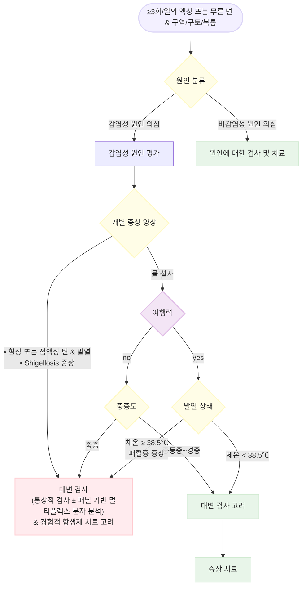

# 급성 감염성 설사 Acute Infectious Diarrhea

## 일반 사항

* 감염원에 의해 발생한, 그 기간이 14일 이내인 설사; 보통 구역, 구토, 복통 동반
* 이질 (dysentery) : 혈성 또는 점액성의 심한 설사, 발열, 복통
* 여행자설사 : 여행 시작 3\~7일 후에 갑자기 시작 (☞ p.433)

### 위험 인자

* 여행, 특히 저개발 국가 - 식품이나 물에 대한 주의 사항을 지키지 못함
* 쇠약, 면역 저하, 영양 상태 불량 - 보호/요양 시설 거주, 최근 입원
* 약물 : 항생제(최근 3개월 내 복용), PPI - 임신

## 원인에 따른 특징

* 원인균 : 바이러스(주로; 성인- norovirus, 소아- rotavirus), 세균(＜15%)
* 발열, 탈수, 심한 복통, 혈변 등의 증상이 동반된 설사 시 세균성 감염 의심
* 최근 항생제 사용 또는 입원한 경우 C. difficile 의심

#### 바이러스 및 세균성 설사

| **특징**      | **바이러스**                                    | **세균**                                                               |
| ----------- | ------------------------------------------- | -------------------------------------------------------------------- |
| **setting** | 지역 위생 수준과 보통 무관함                            | 위생 수준이 낮은 지역에서 보다 흔함                                                 |
| **계절**      | 온대 지역: 겨울 / 열대 지역: 연중                       | 여름, 우기                                                               |
| **전염 경로**   | 분변‑경구, 음식                                   | 음식                                                                   |
| **잠복기**     | 대부분 1–3일                                    | 1–7일 (6–24시간)                                                        |
| **숙주**      | 사람                                          | 사람, 동물, 물                                                            |
| **이환부**     | 주로 소장                                       | 주로 대장                                                                |
| **설사**      | 혼합형, 설사량 많음, 대부분 비염증성                       | 설사량 적고 염증성 설사로 점액·혈액 동반                                              |
| **발열**      | 보통 없음, rota/noro virus에서 상대적으로 흔함           | 염증성 설사 환자군에서 흔함 (예: _Salmonella_, _Shigella_)                        |
| **구토**      | 흔함 (특히 소아에서)                                | 독소 생성 세균에서 흔함                                                        |
| **기간**      | 보통 2–8일 (noro/sapo virus 1–3일)              | 보통 1–7일 (독소 생성 세균 1–2일)                                              |
| **진단**      | 임상적으로 다른 원인 배제로 진단, rota/adeno virus 실험실 검사 | 대변 WBC·혈액 검사, 배양 검사로 원인 진단                                           |
| **치료**      | 대증 치료(수분·영양 공급), 항생제·항균제 금기                 | 대증 치료(장운동억제제 금기), _Shigella_, _Vibrio_, _C. difficile_ 등에서 항생제 사용 가능 |

Ref. Harrison’s Principles of internal medicine 20th ed. 2020. Table 198-2.

#### Protozoa

* 오염 지역의 물/음식 노출 7일 후 발생하여 ＞7일 지속되는 물 설사 시 의심

### 균주에 따른 임상 양상

| **병원체**             | **발열** | **복통** | **구역·구토** | **혈변** | **Heme(+)변** | **염증성변** |
| ------------------- | ------ | ------ | --------- | ------ | ------------ | -------- |
| **Salmonella**      | ++     | ++     | +         | +      | ±            | ±        |
| **Shigella**        | ++     | ++     | ++        | ++     | +            | +        |
| **Campylobacter**   | ++     | ++     | ++        | +      | ±            | ±        |
| **STEC (O157:H7)**  | 0      | ++     | +         | ++     | ±            | 0        |
| **C. difficile**    | +      | +      | NC        | +      | +            | +        |
| **Yersinia**        | ++     | ++     | +         | +      | ±            | ±        |
| **E. histolytica**  | ±      | +      | +         | ±      | ±            | ±        |
| **Cryptosporidium** | ±      | ±      | ±         | NC     | NC           | mild     |
| **Cyclospora**      | ±      | ±      | ±         | NC     | NC           | NC       |
| **Vibrio**          | ±      | ++     | ++        | +      | ±            | ±        |
| **Giardia**         | NC     | +      | +         | NC     | NC           | NC       |
| **Norovirus**       | ±      | ++     | ++        | NC     | NC           | NC       |

++=common, +=occurs, ±=variable, NC=비특이적, 0=atypical/often not present.
\
STEC= Shiga toxin–producing E. coli.
\
Ref. Acute Infectious Diarrhea. NEJM 2004;350. Table 1.

### 잠복 기간별 감염성 장염의 특징 및 치료

| **잠복 기간**  | **증상 / 설사 특징**                     | **원인 음식 / 관련 인자**                   |
| ---------- | ---------------------------------- | ----------------------------------- |
| **1–6시간**  | **S. aureus**: 구역, 구토, 설사          | 햄, 가금류, 감자·계란 샐러드, 마요네즈, 크림 페스트리    |
|            | **Bacillus cereus**: 구역, 구토, 설사    | 볶은 밥                                |
| **8–16시간** | **C. perfringens**: 복통, 설사         | 소·가금류 고기, 콩류, gravy                 |
|            | **B. cereus (구토는 드물음)**            | meats, 채소, 밀립, 국, 시리얼               |
| **>16시간**  | **Vibrio cholerae**: 물 설사          | 어패류, 물                              |
|            | **ETEC**: 물 설사                     | 샐러드, 치즈, meats, 물, 여행               |
|            | **EHEC**: 혈성 설사                    | 소고기, 샐러리, 미살균 유제품, 사과 주스, 단체 생활, 고령 |
|            | **Salmonella**: 염증성 설사             | 소고기, 가금류, 계란, 유제품                   |
|            | **Campylobacter**                  | 가금류, 미살균 우유, 여행, 동물 접촉              |
|            | **Shigella**                       | 감자·계란 샐러드, 상추, 미살균 샐러드, 밀집 생활, 여행   |
|            | **V. parahaemolyticus**: dysentery | 연체동물, 갑각류                           |
|            | **Norovirus**: 발열, 복통, 구토, 물 설사    | 감염 분변·구토물 오염, 레스토랑, 단체 시설           |
|            | **Rotavirus**: 구토, 물 설사            | 감염 분변 오염, 단체 시설, 어린이 시설             |

ETEC=Enterotoxigenic E. coli, EHEC=Enterohemorrhagic E. coli.
\
Ref. Harrison’s Principles of internal medicine 20th ed. 2020. Table 128-4.

## 진단

### GI 증상에 따른 감별

| **주요 증상**                  | **균주**                    | **잠복기** | **원인 음식**                      |
| -------------------------- | ------------------------- | ------- | ------------------------------ |
| **구토**                     | _S. aureus_               | 1–6시간   | 샐러드, 유제품, meat                 |
|                            | _B. cereus_               | 1–6시간   | 쌀밥, meat                       |
|                            | Norwalk-like viruses      | 24–48시간 | 조개, 조리된 음식, 샐러드, 샌드위치, 주스      |
|                            | _C. perfringens_          | 8–16시간  | meat, 가금류, 고기 국물               |
| **물 설사**                   | ETEC                      | 1–3일    | 분변 오염(물/음식)                    |
|                            | Enteric viruses           | 10–72시간 | 분변 오염(물/음식)                    |
|                            | _C. parvum_               | 2–28일   | 채소, 과일, 비살균 유유, 물              |
|                            | _C. cayetanensis_         | 1–11일   | 수입 베리류, 바질                     |
| **염증성 설사 (발열, 혈성/점액성 설사)** | _Campylobacter_           | 2–5일    | 가금류, 비살균 유유, 물                 |
|                            | Nontyphoidal _Salmonella_ | 1–3일    | 계란, 가금류, meat, 비살균 유유/주스, 날 음식 |
|                            | STEC                      | 1–8일    | 갈아 놓은 쇠고기, 비살균 유유/주스, 날 채소, 물  |
|                            | _Shigella spp_            | 1–3일    | 분변 오염(물/음식)                    |
|                            | _V. parahaemolyticus_     | 2–48시간  | 익히지 않은 조개                      |

Ref. Approach to the adult with acute diarrhea in resource-rich settings. UpToDate. 2018.

### 섭취 음식에 따른 감별

* 일반적인 식품 : Salmonella , EHEC, Yersinia , Cyclospora
* 물 : Vibrio , Giardia intestinalis , Cryptosporidium
* 해산물 : Vibrio , Norovirus, Salmonella
* 가금류 : Campylobacter , Salmonella
* 소고기, 조리하지 않은 씨앗 : ETEC, EHEC
* 계란 : Salmonella
* 마요네즈, 크림 : Staphylococcus , Clostridium perfringens , Salmonella
* 파이 : Salmonella , Campylobacter jejuni , Cryptosporidium , Giardia intestinalis
* 항생제 : Clostridium difficile
* 사람 접촉 : Shigella , Rotavirus

### 검사

*   혈액 검사 : 중증(vital sign 이상, 심한 복통, 탈수, 패혈증) 시 고려;

    14\~30일 이상 지속되는 설사에 대한 혈청학적 검사는 보통 권하지 않음

    •CBC, CRP, 전해질, lactate(조직 관류 저하- 패혈증, 경색), LFT, lipase(췌장염)

    •C. difficile 검사 : PCR 검사, toxin test; 대상- 입원 3일 후 또는 외래에서 항생제 사용 3개월 내 발생,

    최근 입원 또는 요양 시설 거주

    •virus 검사 : PCR 검사; 집단 발생 시 역학 조사 목적으로 고려

    •항생제 선택을 위한 감수성 검사는 일반적으로 권하지 않음
*   혈액 배양 검사 : 대상- 패혈증 징후, 창자열 의심, 전신 감염 증상, 면역저하 환자, 고위험 상황(예: 용혈성 빈혈),

    창자열 토착지역 여행력 or 그런 여행자와의 접촉력이 있는 원인불명 발열

    •창자열 의심 상태 : ① 발열 & 설사, 또는 발열만 있으면서 ② 유행지역으로의 해외 여행력이 있거나

    ③ 유행지역에서 최근 균에 노출된 사람이 만든 음식 섭취
*   대변 검사 : 다음의 경우 고려

    •중등증 이상의 증상 : 심한 설사(예: 탈수), ≥6회/24시간, 심한 복통

    •염증성 설사 증상 : 혈성/점액성 설사, ≥38.5℃

    •고위험군 : ≥70세, 요양 시설 거주, 기저 질환(예: 심장 질환, IBD), 면역 저하, 임신

    •＞7일 지속, 집단 내 전염 우려, 항생제 투여 예정

※ 대변 검체를 이용한 전통적인 방법(배양 검사, 현미경검경, 항원검사)으로는 병원체를 규명하지 못하는 경우가 많기 때문에 보조적으로 분자 진단 검사를 고려

* 영상 검사 : upright abdominal plain X선, abdominal/pelvis CT, 복부 초음파
* 대장 내시경 검사 : 대변 검사에서 음성인, 지속되는 설사에 대해서는 보통 권하지 않음
* 기생충 검사 •대상 : ＞7일 지속, 동성애자, 면역저하자, 분변 백혈구가 거의 없는 혈성 설사
*   원인균 검사 : 다음의 경우 고려 \[대한감염학회]

    •혈변, 점액변, 심한 복통, 압통, 패혈증 징후 동반 : Salmonella , Shigella , Campylobacter , Yersinia , C. difficile, STEC에

    대한 대변 검사

    •콜레라 유행 지역 여행 후 3일 이내에 다량의 쌀뜨물 설사 발생 : 콜레라에 대한 대변 검사

    •집단 설사 질환 발생의 위험성이 있거나 의심 : 대변 검사

    •증상이나 역학적 연관성을 고려하여 Vibrio , Norovirus, Rotavirus에 대한 대변 검사

    •역학적 연관이 있고 임상적으로 Shiga toxin 생성균의 가능성(예: 발열 없이 혈성 설사나 복통 발생) : Shiga toxin 검사

    •여행자에서 14일 이상 설사 지속 : 기생충 검사

    •설사 시작 전 8\~12주 내에 항생제 복용력 있음 : C. difficile 검사

***

## Management

### 치료 방침

*   탈수 예방 및 치료 : 가능한 경우 물/주스/스포츠 음료/스프/짭짤한 크래커를 통하여 적절한 수분 및 소금 섭취,

    심한 설사 시 전해질 보충 고려, 중증 탈수 또는 경구 섭취를 할 수 없는 경우 IV 공급
* 식사 : oral rehydration solution(ORS) 공급, 가급적 정상 식이 조기 개시 (☞ p.417)
* 약물 치료 : 상황에 따라 선택; 결정적인 치료 약물은 없음

## 약물 치료

### 항생제

* 감염성 설사의 대부분은 바이러스 원인으로 항생제 투여는 효과가 없거나 해로움
* 세균 감염에 의한 설사의 경우에도 상당수에서 항생제가 이득이 없거나 해로움(예: STEC)
* 대상 : 세균 또는 기생충 감염 의심(여행자 설사), 중증/전신 증상(발열, 혈변), 면역저하자
* 경험적 항생제 : fluoroquinolone, azithromycin(지역 사회, 여행지역의 원인균 및 감수성 고려)
* Campylobacter : azithromycin
* Shigellosis : azithromycin, ciprofloxacin, ceftriaxone
* V. cholerae : doxycycline(선호), ciprofloxacin, azithromycin, ceftriaxone
* 기생충 : metronidazole 500 ㎎ tid ×10\~14d \[후라시닐]

1. 24시간 후에도 증상이 계속되면 3일 코스를 완료함
2. 동남아시아 및 인도에서는 fluoroquinolone-resistant Campylobacter에 대하여, 다른 지역에서는
   \
   Campylobacter 또는 resistant ETEC가 의심되는 경우에 1차 선택
3. 이질 또는 발열 동반 시 선호
4. Campylobacter, Salmonella, Shigella 등이 의심되는 경우(침습성 설사)에는 금기
   \
   Ref. ACG Clinical guideline: Diagnosis, treatment, and prevention of acute diarrheal infections
   \
   in adults. Am J Gastroenterol 2016.

### 장 운동 조절제

* .(☞ p.371, p.375).
* 약간의 설사 감소 효과
*   loperamide : 초회 4 ㎎, 이후 필요시 2 ㎎. 최대 16 ㎎/24시간 \[로프민]

    •적절한 항생제 치료와 병용하여 주의 사용

    •사용 제한 : 이질, 침습성 감염 의심; 발열, 혈성/점액성 설사
* cimetropium : 50 ㎎ tid \[알기론]
* tiropramide : 100 ㎎ bid\~tid \[티로파]

### 분비 억제제

* 약간의 배변 횟수 및 대변량 감소 효과
* 금기 : 구토 설사 호전, 면역저하자
* bismuth subsalicylate : 262 ㎎ 30분마다, 1일 최대 8회 ×1\~2d

### Probiotics/Prebiotics

(☞ p.372)

* 급성 설사 치료 또는 여행자 설사 예방에 대하여 권고하지 않음; 효과 입증 안 됨
* 항생제 관련 설사에서 고려

급성 감염성 설사 치료 알고리듬
\
Ref. 대한감염학회. 급성위장관계 감염 항생제 사용지침. 2019. Fig 2.

## 예방

(☞ p.436)

> **질병코드** A08 바이러스성 및 기타 명시된 장감염

A09 감염성 및 상세불명 기원의 기타 위장염 및 결장염

## 처방례

처방례 1. 비-혈성 설사, 발열(-)
\
로프민 2 ㎎/C 1C 필요시
\
알기론 50 ㎎/T 3T #3
\
비오플 산 250 ㎎/P 3P #3 (보험주의)


\
처방례 2. 세균성, 발열(+)
\
크라비트 500 ㎎/T 1T 1회
\
(증상 지속 시×3일)
\
티로파 100 ㎎/T 3T #3
\
스타빅 현탁액 20 ㎖/P 3P #3 식간 복용
\
람노스 250 ㎎/C 2C bid\~tid (보험주의)
\
맥시부펜 이알 300 ㎎/T 3T #3 필요시
