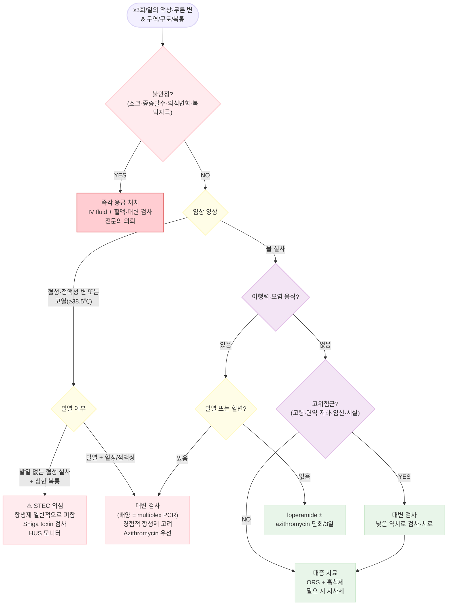

# 급성 감염성 설사 Acute Infectious Diarrhea

## <mark style="color:green;">일반 사항</mark>

* 감염원에 의해 발생한, 기간이 14일 이내인 설사; 보통 구역·구토·복통 동반
* 이질 (dysentery) : 혈성 또는 점액성의 심한 설사, 발열, 복통
* 여행자 설사 : 여행 시작 3–7일 후 갑자기 시작 (☞ [여행자 설사](086_-travelers-diarrhea.md))


**급성 설사의 정의의** : 하루 3회 이상 또는 평소보다 묽은 변이 14일 이내 지속되는 경우


## <mark style="color:green;">원인 및 위험 인자</mark>

* 원인균 : 바이러스(외래 급성 물 설사의 대부분), 세균, 기생충
  * 외래를 방문하는 급성 물 설사의 대부분은 바이러스성이며, 자연 호전됨. 성인에서 가장 흔한 원인은 norovirus, 소아는 rotavirus; 혈성 설사·고열·심한 복통·여행력·집단 발병이 있으면 세균성 원인의 가능성이 높아지며, 입원 환자·면역 저하자에서는 세균 비율이 훨씬 높음
* 발열·탈수·심한 복통·혈변이 동반되면 세균성 감염 의심
* 최근 항생제 사용 또는 입원력이 있으면 _C. difficile_ 의심

### <mark style="color:orange;">위험 인자</mark>

<table><thead><tr><th width="180">위험 인자</th><th>세부 내용</th></tr></thead><tbody><tr><td>여행</td><td>저개발 국가 방문; 식품·물 위생 주의 미흡</td></tr><tr><td>면역 저하</td><td>쇠약, 영양 불량, 면역억제제 사용, HIV</td></tr><tr><td>시설 생활</td><td>보호·요양 시설 거주, 최근 입원</td></tr><tr><td>약물</td><td>항생제(최근 3개월 내), PPI (위산 감소 → 방어 약화)</td></tr><tr><td>임신</td><td>면역 변화, <em>Listeria</em> 등 위험 증가</td></tr><tr><td>만성 간질환</td><td>생굴 등 날 해산물 섭취 후 <em>Vibrio vulnificus</em> 패혈증 위험 ↑↑</td></tr></tbody></table>


**만성 간질환 환자의 날 해산물 섭취 주의** : 간경변·만성 간염 등 만성 간질환 환자는 생굴 섭취 후 _Vibrio vulnificus_ 패혈증 위험이 건강인보다 수십 배 높으며 사망률이 매우 높음. 여름철 특히 주의하고 날 조개·생굴 섭취를 반드시 피해야 함


### <mark style="color:orange;">원인균별 임상 특징</mark>

#### <mark style="color:$primary;">바이러스 vs. 세균 비교</mark>

<table><thead><tr><th width="130">특징</th><th width="230">바이러스</th><th>세균</th></tr></thead><tbody><tr><td>계절</td><td>온대: 겨울 / 열대: 연중</td><td>여름, 우기</td></tr><tr><td>전염 경로</td><td>분변–경구, 음식</td><td>주로 음식</td></tr><tr><td>잠복기</td><td>1~3일</td><td>1~7일 (독소형: 6~24시간)</td></tr><tr><td>이환 부위</td><td>주로 소장</td><td>주로 대장</td></tr><tr><td>설사 양상</td><td>대량, 비염증성</td><td>소량, 염증성 (점액·혈액 동반)</td></tr><tr><td>발열</td><td>보통 없음 또는 경미</td><td>염증성 설사에서 흔함</td></tr><tr><td>구토</td><td>흔함 (특히 소아, norovirus)</td><td>독소 생성균에서 흔함</td></tr><tr><td>치료 원칙</td><td>대증 치료; 항생제 금기</td><td>대증 치료; 일부에서 항생제 고려</td></tr></tbody></table>

<p align="center"><em><mark style="color:$info;">Ref. Harrison's Principles of Internal Medicine 21st ed. 2022</mark></em></p>

#### <mark style="color:$primary;">균주별 임상 양상</mark>

<table><thead><tr><th width="170">병원체</th><th width="60">발열</th><th width="60">복통</th><th width="80">구역·구토</th><th width="60">혈변</th><th width="102">염증성변</th></tr></thead><tbody><tr><td><em>Salmonella</em></td><td>++</td><td>++</td><td>+</td><td>+</td><td>±</td></tr><tr><td><em>Shigella</em></td><td>++</td><td>++</td><td>++</td><td>++</td><td>+</td></tr><tr><td><em>Campylobacter</em></td><td>++</td><td>++</td><td>++</td><td>+</td><td>±</td></tr><tr><td>STEC (O157:H7)</td><td>0</td><td>++</td><td>+</td><td>++</td><td>0</td></tr><tr><td><em>C. difficile</em></td><td>+</td><td>+</td><td>NC</td><td>+</td><td>+</td></tr><tr><td><em>Yersinia</em></td><td>++</td><td>++</td><td>+</td><td>+</td><td>±</td></tr><tr><td><em>Vibrio</em></td><td>±</td><td>++</td><td>++</td><td>+</td><td>±</td></tr><tr><td><em>E. histolytica</em></td><td>±</td><td>+</td><td>+</td><td>±</td><td>±</td></tr><tr><td><em>Cryptosporidium</em></td><td>±</td><td>±</td><td>±</td><td>NC</td><td>mild</td></tr><tr><td><em>Giardia</em></td><td>NC</td><td>+</td><td>+</td><td>NC</td><td>NC</td></tr><tr><td><strong>Norovirus</strong></td><td>NC/경미</td><td>+</td><td><strong>++</strong></td><td>NC</td><td>NC</td></tr></tbody></table>

++=흔함, +=발생함, ±=변이, NC=비특이적, 0=드물거나 없음. STEC=Shiga toxin–producing _E. coli_.\
**Norovirus**: 구토 우세, 짧은 잠복기(12–48시간), 폭발적 집단 발생이 특징. 발열은 경미하거나 없음.\
&#xNAN;**\*STEC**: 대변 내 백혈구 검출은 드무나, 강력한 시가 독소(Shiga toxin)에 의해 심한 출혈성 결장염(hemorrhagic colitis)을 유발하므로 대량 혈변과 심한 복통이 특징임. '염증성 변 0'을 '경증'으로 오해하지 않도록 주의.

<p align="right"><em><mark style="color:$info;">Ref. NEJM 2004;350, Table 1</mark></em></p>

#### <mark style="color:$primary;">잠복 기간별 감염 특징</mark>

<table><thead><tr><th width="120">잠복 기간</th><th width="250">원인균 / 주요 증상</th><th>관련 음식·인자</th></tr></thead><tbody><tr><td>1–6시간</td><td><em>S. aureus</em>: 구역·구토·설사<br><em>B. cereus</em>: 구역·구토·설사</td><td>햄, 샐러드, 마요네즈, 크림 페스트리<br>볶은 밥</td></tr><tr><td>8–16시간</td><td><em>C. perfringens</em>: 복통·설사 (구토 드묾)</td><td>소·가금류, 콩류, gravy</td></tr><tr><td>>16시간</td><td><em>V. cholerae</em>: 쌀뜨물 대량 설사<br>ETEC: 물 설사<br>STEC/EHEC: 혈성 설사<br><em>Salmonella</em>: 염증성 설사<br><em>Campylobacter</em>: 발열·혈성 설사<br><em>Shigella</em>: 이질<br>Norovirus: 구토 우세, 물 설사, 집단 발생<br>Rotavirus: 구토·물 설사</td><td>어패류·물<br>분변 오염 음식<br>갈아놓은 쇠고기, 비살균 유제품<br>가금류·계란<br>가금류·비살균 우유<br>밀집 생활<br>레스토랑·단체 시설<br>단체·어린이 시설</td></tr></tbody></table>

ETEC=Enterotoxigenic _E. coli_, EHEC=Enterohemorrhagic _E. coli_.

<p align="right"><em><mark style="color:$info;">Ref. Harrison's Principles of Internal Medicine 21st ed. 2022</mark></em></p>

#### <mark style="color:$primary;">원충 (Protozoa)</mark>

* 오염 지역의 물·음식 노출 후 발생하여 **>7일 지속되는 물 설사** 시 의심
* _**Giardia**_: 복부 팽만·지방변·장기 지속 설사; 무증상 보균도 흔함
* _**Cryptosporidium**_: 자가 제한적이나 면역 저하자에서 만성화·중증화 위험
* _**E. histolytica**_: 아메바성 이질; 혈성 점액 설사, 우하복부 통증; 간 농양 합병 주의

## <mark style="color:green;">임상 양상</mark>

* 급성 발병의 묽은 변 (≥3회/일), 구역·구토, 복통·경련성 복통
* **발열·혈성·점액성 변** → 침습성 세균 감염 시사
* 대부분 2–5일 내 자연 호전; 탈수 여부·속도가 임상적 중증도를 결정

### <mark style="color:$danger;">🚩 Red Flags!</mark>

<mark style="color:$danger;">**즉각 조치 또는 응급 의뢰**</mark>

* 중증 탈수: 기립성 저혈압, 빈맥, 무뇨 또는 핍뇨, 의식 변화
* 패혈증 징후: 고열(>39℃), 지속 빈맥, 쇼크 (저혈압, 말초 순환 부전)
* 심한 복통 (복막 자극 징후, 복벽 강직) - 외과적 응급 (장 천공·허혈) 감별
* **혈성 설사 + 신기능 저하** → HUS 의심 (STEC, 특히 소아·고령)
* 면역 저하자 (HIV, 항암치료 중)의 심한 설사·발열
* 만성 간질환 환자의 생굴·해산물 섭취 후 발열·쇼크 (_V. vulnificus_ 패혈증)

<mark style="color:$warning;">**당일 또는 조기 의뢰**</mark>

* 고열(≥38.5℃) + 혈성·점액성 설사 (침습성 세균 감염 의심)
* ≥6회/24시간의 설사 지속 및 탈수 진행
* 고령(≥70세), 임산부, 영아의 중등도 이상 설사
* 요양 시설·단체 집단 발생 (공중 보건 신고 대상 여부 확인)
* 최근 3개월 내 항생제 사용 후 발생한 발열·복통 (_C. difficile_ 의심)

<mark style="color:$info;">**외래 추적 / 추가 평가 계획**</mark> <mark style="color:$info;">– 즉각 위험 낮으나 호전 없으면 의뢰</mark>

* > 7일 지속되는 설사 (만성화, 기생충 감염, IBD 감별 필요)
* 치료 중 증상 악화 또는 새로운 증상 출현
* 경증 설사에서도 체중 감소 동반 시 (악성 종양·흡수 불량 감별)

## <mark style="color:green;">진단</mark>

### <mark style="color:orange;">GI 증상에 따른 감별</mark>

<table><thead><tr><th width="170">주요 증상</th><th width="200">의심 병원체</th><th width="100">잠복기</th><th>주요 원인 음식</th></tr></thead><tbody><tr><td><strong>구토 중심</strong></td><td><em>S. aureus</em></td><td>1–6시간</td><td>샐러드, 유제품, 육류</td></tr><tr><td><em>B. cereus</em></td><td>1–6시간</td><td>볶은 밥, 육류</td><td></td></tr><tr><td>Norovirus</td><td>12–48시간</td><td>조개, 조리 음식, 샐러드, 단체 시설</td><td></td></tr><tr><td><em>C. perfringens</em></td><td>8–16시간</td><td>육류, 가금류, 고기 국물</td><td></td></tr><tr><td><strong>물 설사</strong></td><td>ETEC</td><td>1–3일</td><td>분변 오염 음식·물</td></tr><tr><td>장내 바이러스</td><td>10–72시간</td><td>분변 오염 음식·물</td><td></td></tr><tr><td><em>Cryptosporidium</em></td><td>2–28일</td><td>채소, 과일, 비살균 유제품, 물</td><td></td></tr><tr><td><em>Cyclospora</em></td><td>1–11일</td><td>수입 베리류, 바질</td><td></td></tr><tr><td><strong>염증성 설사</strong><br>(발열, 혈성·점액성)</td><td><em>Campylobacter</em></td><td>2–5일</td><td>가금류, 비살균 우유, 물</td></tr><tr><td>비티푸스 <em>Salmonella</em></td><td>1–3일</td><td>계란, 가금류, 육류, 비살균 유제품</td><td></td></tr><tr><td>STEC</td><td>1–8일</td><td>갈아놓은 쇠고기, 비살균 주스·우유</td><td></td></tr><tr><td><em>Shigella</em></td><td>1–3일</td><td>분변 오염 음식·물, 밀집 생활</td><td></td></tr><tr><td><em>V. parahaemolyticus</em></td><td>2–48시간</td><td>익히지 않은 조개·갑각류</td><td></td></tr></tbody></table>

<p align="right"><em><mark style="color:$info;">Ref. Approach to the adult with acute diarrhea in resource-rich settings. UpToDate 2024</mark></em></p>

### <mark style="color:orange;">혈성 설사의 주요 세균 감별</mark>

혈성 설사에서 세 균주의 감별이 항생제 결정에 결정적이다:

| 특징    | STEC         | _Shigella_    | _Campylobacter_ |
| ----- | ------------ | ------------- | --------------- |
| 발열    | 드물거나 없음      | 흔함 (++)       | 흔함 (++)         |
| 혈변    | 흔함, 대량       | 흔함, 점액 동반     | 가능 (중등도)        |
| 복통    | 매우 심함        | 중등도, tenesmus | 심한 경련성          |
| 항생제   | **일반적으로 피함** | **사용**        | 중증 시 사용         |
| 특기 사항 | HUS 위험       | tenesmus, 이질  | 가금류 노출력         |


⚠️ **STEC 감별 핵심**: "발열 없는 혈성 설사 + 심한 복통" → STEC를 먼저 의심하고 항생제 투여를 보류한다. 경험적 항생제 투여 후 HUS가 발생하는 사례가 보고되어 있다.


### <mark style="color:orange;">섭취 음식에 따른 감별</mark>

<table><thead><tr><th width="220">음식·노출</th><th>의심 병원체</th></tr></thead><tbody><tr><td>해산물 (생굴·조개류)</td><td><em>Vibrio</em>, Norovirus, <em>Salmonella</em></td></tr><tr><td>가금류</td><td><em>Campylobacter</em>, <em>Salmonella</em></td></tr><tr><td>계란</td><td><em>Salmonella</em></td></tr><tr><td>갈아놓은 쇠고기</td><td>STEC, EHEC</td></tr><tr><td>마요네즈·크림류</td><td><em>Staphylococcus</em>, <em>C. perfringens</em>, <em>Salmonella</em></td></tr><tr><td>물 (오염 지역)</td><td><em>Vibrio cholerae</em>, <em>Giardia</em>, <em>Cryptosporidium</em></td></tr><tr><td>항생제 복용 후</td><td><em>C. difficile</em></td></tr><tr><td>사람 간 접촉·단체 생활</td><td><em>Shigella</em>, Rotavirus, Norovirus</td></tr></tbody></table>

### <mark style="color:orange;">검사 적응증</mark>

#### <mark style="color:$primary;">혈액 검사</mark>

중증 (활력 징후 이상, 심한 복통, 탈수, 패혈증 의심) 시 고려:

* CBC, CRP, 전해질, creatinine
* Lactate (조직 관류 저하, 패혈증·장 경색 감별)
* LFT, lipase (췌장염 감별)
* _**C. difficile**_**&#x20;검사**: PCR 또는 GDH+toxin 조합 검사
  * 적응증: 입원 3일 후 발생, 최근 3개월 내 항생제 사용 후 발생, 최근 입원 또는 요양 시설 거주
* **혈액 배양**: 패혈증 징후, 창자열(장티푸스) 의심, 면역 저하자, 고위험(용혈성 빈혈 등), 유행 지역 여행력 + 원인불명 발열

#### <mark style="color:$primary;">대변 검사</mark>

다음의 경우 고려:

* 중등증 이상: 심한 설사(탈수), ≥6회/24시간, 심한 복통
* 염증성 설사: 혈성·점액성 변, 발열 ≥38.5℃
* 고위험군: ≥70세, 요양 시설 거주, 기저 질환(심장 질환·IBD), 면역 저하, 임신
* > 7일 지속, 집단 내 전염 우려, 항생제 투여 예정


**Multiplex PCR (GI Panel) 해석 시 주의**

패널 기반 분자 진단은 신속성이 큰 장점이나 다음을 반드시 고려한다:

* **PCR 양성 ≠ 반드시 병원성 원인**: 무증상 보균·잔존 핵산도 검출 가능
* _**C. difficile**_**&#x20;PCR 특히 주의**: 무증상 보균자에서도 양성이 나올 수 있으므로, 하루 3회 이상의 무른 변이 실제로 확인될 때만 검사 및 치료를 시행한다
* EPEC 등 일부 병원체는 성인에서 임상 의미가 불분명할 수 있음
* 결과는 반드시 **임상 양상·역학력과 함께 해석**해야 한다; 양성 결과가 반드시 치료 필요성을 의미하지 않는다
* 집단 발생·역학 조사 목적 또는 원인 불명 지속 설사에서 보조적으로 사용


#### <mark style="color:$primary;">대변 원인균 검사 \[대한감염학회 기준]</mark>

* 혈변·점액변·심한 복통·압통·패혈증 징후: _Salmonella_, _Shigella_, _Campylobacter_, _Yersinia_, _C. difficile_, STEC 대변 검사
* 콜레라 유행 지역 여행 후 3일 이내 다량의 쌀뜨물 설사: 콜레라 대변 검사
* 집단 설사 질환 발생 의심: 대변 검사 (역학 조사 포함)
* 역학적 연관 + Shiga toxin 생성균 가능성 (발열 없이 혈성 설사 또는 심한 복통): Shiga toxin 검사
* 여행자 14일 이상 설사 지속: 기생충 검사
* 설사 발생 전 8–12주 내 항생제 복용력: _C. difficile_ 검사

#### <mark style="color:$primary;">기타 검사</mark>

* **영상 검사**: 복부 단순 촬영(직립위), 복부·골반 CT, 복부 초음파 (외과적 원인 감별)
* **대장 내시경**: 대변 검사 음성의 지속성 설사에서 감별 진단 목적으로 고려
* **기생충 검사**: >7일 지속, 동성애자, 면역 저하자, 대변 WBC 거의 없는 혈성 설사

***



<p align="center"><strong>급성 감염성 설사 진단·치료 알고리듬</strong></p>

<p align="center"><em><mark style="color:$info;">Ref. 대한감염학회. 급성 위장관계 감염 항생제 사용지침. 2019; ACG Clinical Guideline. Am J Gastroenterol 2016</mark></em></p>

***

## <mark style="background-color:orange;">Management</mark>

* 대부분 자연 호전 - **수분·전해질 보충과 대증 치료**가 핵심
* 세균 또는 기생충 감염 의심, 중증·전신 증상, 면역 저하자에서만 항생제 고려
* 장 운동 억제제는 침습성 세균 감염(발열·혈성변) 시 사용하지 않음


**처방 결정 요약: 항생제가 필요한 상황 vs. 일반적으로 불필요한 상황**


<table><thead><tr><th width="280">항생제 적극 고려</th><th>일반적으로 불필요</th></tr></thead><tbody><tr><td>고열 + 혈성·점액성 설사</td><td>단순 물 설사 (바이러스 의심)</td></tr><tr><td>패혈증 소견</td><td>짧은 경과, 자연 호전 추세</td></tr><tr><td>여행자 설사 중등증 이상</td><td>Norovirus 의심 집단 발생</td></tr><tr><td>면역 저하자의 세균성 설사</td><td>발열 없는 혈성 설사 (STEC 의심)</td></tr><tr><td>기생충 감염 확인</td><td>비티푸스 Salmonella (면역 정상)</td></tr><tr><td><em>C. difficile</em> 확인</td><td>단순 바이러스 위장관염</td></tr></tbody></table>


⚠️ **항생제 사용의 흔한 오류**

* 발열 없는 혈성 설사에 경험적 quinolone 투여 (STEC 과놓침)
* 단순 바이러스 설사에 광범위 항생제 처방
* loperamide를 혈성 설사·고열 환자에 사용
* _C. difficile_ 의심 환자에 원인 항생제 지속 또는 불필요한 추가 항생제 사용
* 탈수 교정보다 약 처방을 먼저 시작


## <mark style="color:green;">비-약물 치료</mark>

### <mark style="color:orange;">수분 및 전해질 보충</mark>

<table><thead><tr><th width="180">상황</th><th>권장 수액</th></tr></thead><tbody><tr><td>경증 탈수</td><td>ORS (경구 수분 보충액) 우선</td></tr><tr><td>중등도 탈수</td><td>ORS 우선; 경구 불가 시 IV 병용</td></tr><tr><td>쇼크·패혈증</td><td>Lactated Ringer's 또는 NS IV bolus 우선</td></tr><tr><td>콜레라</td><td>공격적 Lactated Ringer's IV (Na 손실량 매우 큼)</td></tr></tbody></table>

* **경구 수분 보충(ORS)**: 경증\~중등증 탈수의 일차 치료
  * WHO 저삼투압 ORS(Na 75 mEq/L) 권장; 자가 제조: 물 1 L + 설탕 6 tsp + 소금 ½ tsp
  * **구토가 있을 때**: 한 번에 많이 마시지 말고 **1–2분마다 한두 모금씩** 반복 섭취 → 구토 감소, ORS 성공률 향상

### <mark style="color:orange;">식이</mark>

* **금식은 권장하지 않음** - 가능한 한 조기 정상 식이 재개
* 초기에는 소화 쉬운 식품 선택: 죽, 삶은 감자, 토스트, 바나나
* 유제품, 고지방식, 카페인, 알코올 일시적 제한
* BRAT 식이(바나나·쌀밥·사과소스·토스트)는 영양 불균형 우려로 현재 **권고하지 않음**

## <mark style="color:green;">약물 치료</mark>

### <mark style="color:orange;">항생제</mark>

**항생제 적응증**: 세균 또는 기생충 감염 의심, 중증·전신 증상(발열, 혈변), 면역 저하자, 여행자 설사 중등증 이상

#### <mark style="color:$primary;">병원체별 항생제 선택</mark>

<table><thead><tr><th width="200">병원체 / 상황</th><th width="290">선호 항생제 (용법)</th><th>비고</th></tr></thead><tbody><tr><td><strong>경험적 치료</strong><br>(침습성 설사 의심, 중증)</td><td>Azithromycin 500 mg qd × 3일<br>Ciprofloxacin 500 mg bid × 3–5일</td><td>동남아·인도: fluoroquinolone 내성 Campylobacter 흔함 → azithromycin 우선</td></tr><tr><td><strong>여행자 설사</strong><br>(비침습성, 발열·혈변 없음)</td><td>Azithromycin 1,000 mg 단회<br>또는 500 mg qd × 3일<br>Rifaximin 200 mg tid × 3일 (대안)</td><td>Rifaximin은 비침습성 설사에만 사용; 발열·혈변 있으면 전신 흡수 항생제 필요</td></tr><tr><td><em><strong>Shigella</strong></em></td><td>Azithromycin 500 mg qd × 3일 (1차 선호)<br>Ciprofloxacin 500 mg bid × 3–5일<br>Ceftriaxone 1–2 g IV qd (중증·내성)</td><td>국내외 fluoroquinolone 내성 증가 → azithromycin 우선</td></tr><tr><td><em><strong>Campylobacter</strong></em></td><td>Azithromycin 500 mg qd × 3일</td><td>fluoroquinolone 내성 매우 흔함; 자연 호전도 많으므로 중증에서만</td></tr><tr><td><em><strong>V. cholerae</strong></em></td><td>Doxycycline 300 mg 단회 (선호)<br>Ciprofloxacin 1 g 단회<br>Azithromycin 1 g 단회</td><td>수액 보충이 치료의 핵심; 항생제는 기간 단축 목적</td></tr><tr><td><strong>비티푸스 </strong><em><strong>Salmonella</strong></em></td><td><strong>일반적으로 항생제 불필요</strong></td><td>항생제 투여 시 균 배출 기간 연장 가능; 고위험군(면역 저하·혈관 질환·&#x3C;1세·고령)만 치료</td></tr><tr><td><strong>STEC (O157:H7)</strong></td><td><strong>항생제는 일반적으로 피한다</strong></td><td>특히 발열 없는 혈성 설사에서 경험적 항생제를 신중히 재검토; HUS 위험. 장 운동 억제제도 피함</td></tr><tr><td><em><strong>C. difficile</strong></em><br>(경증~중등증)</td><td>Vancomycin 125 mg qid × 10일 (1차 선호)<br>Fidaxomicin 200 mg bid × 10일 (재발 위험↑ 시)<br>Metronidazole 500 mg tid × 10–14일 (대안)</td><td>IDSA/SHEA 2021: vancomycin 또는 fidaxomicin 1차; metronidazole은 타 약제 불가 시만. 중증 기준: WBC ≥15,000/μL 또는 Cr >1.5 mg/dL (또는 기저치 대비 1.5배 이상 상승; CKD 환자는 기저치 대비 판단)</td></tr><tr><td><em><strong>Giardia</strong></em></td><td>Metronidazole 250–500 mg tid × 5–7일 <mark style="color:blue;">[후라시닐]</mark></td><td>대안: tinidazole 2 g 단회</td></tr><tr><td><em><strong>E. histolytica</strong></em></td><td>Metronidazole 500–750 mg tid × 10일 <mark style="color:blue;">[후라시닐]</mark></td><td>이후 paromomycin으로 장내 낭종 제거</td></tr></tbody></table>


**fluoroquinolone 내성 현황**: 국내외적으로 \_Campylobacter\_와 \_Shigella\_에서 fluoroquinolone 내성이 크게 증가하고 있다. \_Salmonella\_에서도 fluoroquinolone 내성이 증가 추세이며, 특히 아시아 유래 균주에서 주의가 필요하다. 동남아·인도 여행 후 발생한 설사에서는 azithromycin을 경험적 1차 치료로 우선 고려하며, 단회 요법(doxycycline, ciprofloxacin 등)은 지역 내 내성률에 따라 효과가 다를 수 있으므로 참고한다.


### <mark style="color:orange;">장 운동 조절제</mark>

* 일부 설사 횟수 감소 효과; **침습성 세균 감염(발열·혈성·점액성 변) 시 사용하지 않음**
* **loperamide**: 초회 4 mg, 이후 필요시 2 mg; 최대 16 mg/24시간 <mark style="color:blue;">\[로프민]</mark>
  * 경험적 항생제와 병용 시 여행자 설사에서 증상 기간 단축 가능
  * **사용하지 않는 경우**: 이질, 침습성 감염 의심, STEC 의심(발열 없는 혈성 설사)
* **cimetropium**: 50 mg tid <mark style="color:blue;">\[알기론]</mark> (장 경련·복통 완화)
* **tiropramide**: 100 mg bid–tid <mark style="color:blue;">\[티로파]</mark> (장 경련·복통 완화)

### <mark style="color:orange;">구토 조절제 (Antiemetics)</mark>

* 심한 구토로 ORS 섭취가 어려울 때 제한적으로 고려
* **ondansetron**: 4–8 mg PO (또는 ODT) <mark style="color:blue;">\[조프란]</mark>
  * 구토 조절 → ORS 성공률 향상 → IV 수액 필요성 감소; 소아·성인 모두 사용 가능
  * 중증 설사·발열이 있을 때 증상 은폐 가능성 주의; 대증 목적으로 제한 사용

### <mark style="color:orange;">분비 억제제 (Antisecretory)</mark>

* **bismuth subsalicylate**: 262 mg/30분마다, 1일 최대 8회 × 1–2일
  * 구역·설사·복통에 완만한 효과; 국내 처방 빈도는 낮음
  * 아스피린 과민, 소아, 임산부 주의
* **racecadotril (thiorphan)**: 100 mg tid (성인 기준) <mark style="color:blue;">\[리오나정]</mark>
  * Enkephalinase 억제제 → 장 분비 억제; **장 운동에 영향을 주지 않아 반동 변비·복부 팽만이 상대적으로 적음**
  * 침습성 설사 의심 또는 loperamide 사용이 어려운 상황의 대안; 소아 급성 설사에서도 일부 근거 있음 (소아용 현탁액·산제 제형 별도 존재)
  * **급여 주의**: 성인에서는 전액 본인부담(비급여)인 경우가 많음; 소아는 일부 급여 인정 - 처방 전 급여 기준 확인

### <mark style="color:orange;">흡착제</mark>

* **diosmectite**: 3 g (1포) tid, 식간 복용 <mark style="color:blue;">\[스타빅 현탁액]</mark>
  * 장 점막 보호, 독소·세균 흡착 효과
  * **금기**: 만 2세 미만 소아, 임부 및 수유부 (식약처 2019 안전성 조치 - 천연 광물 유래 중금속 잔류 우려)
  * 다른 약제(항생제·프로바이오틱스 포함)의 흡수를 방해하므로 반드시 **2시간 이상 간격** 복용

### <mark style="color:orange;">Probiotics</mark>

(☞ [Probiotics/Prebiotics](probiotic-prebiotics.md))

* 급성 감염성 설사 치료 또는 여행자 설사 예방에 대한 근거 불충분 → **일상적 권고 하지 않음**
* **항생제 연관 설사(AAD) 예방**: _Lactobacillus rhamnosus_ GG, _S. boulardii_ 일부 효과; 고위험군에서 고려 (보험 기준 확인 필요)
* **주의**: 중증 면역 저하자, 중심정맥관 보유 환자에서는 균혈증(bacteremia/fungemia) 위험 보고 → 사용에 주의한다

## <mark style="color:green;">예방</mark>

(☞ [여행자 설사 및 예방](086_-travelers-diarrhea.md))

* **손 위생**: 식전·배변 후 비누와 물로 20초 이상 손 씻기
  * 알코올 손소독제는 _C. difficile_ 포자에 효과 없음 - **반드시 비누 세척** 필요
* **식품 안전**: 고기·해산물 충분히 가열, 생채소·과일 세척, 비살균 유제품 회피
* **여행 시**: 병수(bottled water) 또는 끓인 물 사용; 길거리 음식·생선회 주의
* **백신**:
  * **로타바이러스 백신**: 영아 필수 예방접종 (2회 또는 3회); 중증 설사로 인한 입원을 약 70–85% 감소시키는 우수한 예방 효과 (WHO)
  * **경구 콜레라 백신**: 유행 지역 여행 전 고려

***

### <mark style="color:red;">질병코드</mark>

* **A08** 바이러스성 및 기타 명시된 장감염
  * A08.0 로타바이러스 장염
  * A08.1 급성 위장염 (Norwalk 인자)
* **A09** 감염성 및 상세불명 기원의 기타 위장염 및 결장염
* **A04** 기타 세균성 장감염
  * A04.5 장독소 대장균(ETEC) 장염
  * A04.7 _Clostridium difficile_ 장염 (ICD-10-CM에서는 A04.71 재발성 / A04.72 비재발성으로 세분; KCD 적용 시 확인 필요)

***

## <mark style="color:purple;">처방례</mark>

> **처방례 1. 바이러스성·비혈성 설사, 발열(–), 경증**
>
> ```
> 로프민 2 ㎎/C　　　　　1C　필요시
> 알기론 50 ㎎/T　　　　　3T　#3
> 스타빅 현탁액 20 ㎖/P　　3P　#3　식간 복용
> 비오플 산 250 ㎎/P　　　 3P　#3
> ```
>
> _✽ 비염증성 물 설사의 증상 완화 처방. loperamide는 혈변·발열 발생 시 즉시 중단. 구토 심하면 조프란 4 ㎎ ODT 추가 고려. 프로바이오틱스(비오플)는 항생제 연관 설사 예방 외 급성 감염성 설사 단독 처방 시 전액 본인부담으로 청구해야 삭감을 피할 수 있다._

> **처방례 2. 여행자 설사, 중등증 (발열 없음, 비혈성)**
>
> ```
> 씨프로바이 500 ㎎/T　　1T　bid × 3일
> 로프민 2 ㎎/C　　　　　1C　필요시
> 스타빅 현탁액 20 ㎖/P　3P　#3　식간 복용
> ```
>
> _✽ 비침습성 여행자 설사(발열·혈변 없음)에서 ciprofloxacin + loperamide 병용. 동남아·인도 여행력 있으면 지트로맥스 500 ㎎ qd × 3일로 대체 권고 (fluoroquinolone 내성). 구토가 심해 ORS 섭취가 어려우면 조프란 4 ㎎ ODT 추가 고려._

> **처방례 3. 침습성 세균성 설사, 발열(+), 혈성변**
>
> ```
> 지트로맥스 500 ㎎/T　　1T　qd × 3일
> 티로파 100 ㎎/T　　　　3T　#3
> 스타빅 현탁액 20 ㎖/P　3P　#3　식간 복용
> 맥시부펜 이알 300 ㎎/T　3T　#3　발열·통증 시
> ```
>
> _✽ Shigella·Campylobacter 등 침습성 세균 설사 의심 시. **loperamide 사용하지 않음**. STEC 의심(발열 없는 혈성 설사) 시 항생제 투여 전 반드시 재검토. 고열 지속·패혈증 징후 시 혈액 배양 및 전문의 의뢰._

> **처방례 4.&#x20;**_**C. difficile**_**&#x20;감염 (경증\~중등증)**
>
> ```
> 반코마이신 캡슐 125 ㎎/C　4C　#4 × 10일
> ```
>
> _✽ 최근 항생제 사용력 + 발열·설사(CDI 의심) 시 1차 치료. 원인 항생제는 즉시 중단. 중증(Severe: WBC ≥15,000/μL 또는 Cr >1.5 mg/dL)이면 vancomycin 500 mg qid로 증량 또는 전문의 의뢰. **중증 합병성(Fulminant CDI**: 저혈압·쇼크·장마비·독성거대결장)은 외과 협진 필요. 재발 고위험(고령·면역 저하·반복 CDI)은 fidaxomicin 200 mg bid × 10일 우선 고려._

***

### <mark style="color:$success;">핵심 복약 지도</mark>

1. **수분 보충이 가장 중요합니다** - 설사·구토가 있을 때는 매 배변 후 물 또는 ORS 한 컵(200–250 mL)을 추가로 마시세요. 구토가 있으면 **1–2분마다 한두 모금씩** 조금씩 반복해서 드세요.
2. **지사제(loperamide·로프민)**: 혈변이나 고열이 생기면 즉시 중단하고 내원하세요 - 세균성 설사에서 계속 복용하면 증상을 악화시킬 수 있습니다.
3. **항생제를 처방받으셨다면 증상이 좋아져도 끝까지 복용**하세요. 임의 중단 시 내성 발생 및 재발 위험이 높아집니다.
4. **흡착제(스타빅·diosmectite)**: **다른 모든 약과 2시간 이상 간격**을 두고 반드시 따로 복용하세요 - 항생제, 지사제, 프로바이오틱스 포함 모든 약물을 흡착하여 효과를 떨어뜨립니다. 만 2세 미만 어린이, 임산부, 수유 중인 분은 복용하지 마세요.
5. **프로바이오틱스(비오플 등)**: 항생제·흡착제와 함께 복용하지 말고 **각각 2시간 이상 간격**을 두면 효과가 더 좋습니다.
6. **식사**: 금식하지 말고 죽·삶은 감자·토스트 등 소화 쉬운 음식을 소량씩 드세요. 유제품·기름진 음식·커피·알코올은 회복될 때까지 피하세요.
7. **손 위생**: 화장실 이용 후 반드시 **비누와 물로 20초 이상** 손을 씻어 가족에게 옮기지 않도록 주의하세요.

***

### <mark style="color:blue;">환자 안내서</mark>

**급성 감염성 설사 (식중독·바이러스성 장염) 안내**

**어떤 병인가요?**\
세균·바이러스·기생충에 의해 장이 감염되어 생기는 급성 설사입니다. 외래 급성 설사의 대부분은 바이러스가 원인이며, 2–5일 내에 저절로 좋아집니다. 가장 중요한 치료는 탈수 예방을 위한 수분 보충입니다.

**이런 증상이 있으면 바로 병원에 오세요**

* 대변에 피가 섞이거나 심한 복통·복부 경직이 있을 때
* 하루 6회 이상 설사가 지속되거나, 물을 마셔도 구토가 반복될 때
* 입이 심하게 마르고 소변이 거의 나오지 않을 때 (탈수 위험)
* 어지러워서 일어서기 힘들 때
* 고열(38.5℃ 이상)이 지속될 때
* 설사가 7일 이상 계속될 때

**집에서 이렇게 관리하세요**

<table><thead><tr><th width="120">항목</th><th>방법</th></tr></thead><tbody><tr><td>수분 보충</td><td>설사할 때마다 물·ORS·스포츠 음료 한 컵씩 추가; 구토 시에는 1–2분마다 한두 모금씩</td></tr><tr><td>식사</td><td>죽, 밥, 삶은 감자, 토스트 등 소화 쉬운 음식을 소량씩; 금식은 하지 마세요</td></tr><tr><td>피할 것</td><td>유제품, 기름진 음식, 생과일주스, 카페인, 알코올</td></tr><tr><td>손 위생</td><td>화장실 이용 후·식사 전 반드시 비누로 20초 이상 손씻기</td></tr><tr><td>개인 물건</td><td>수건·컵·식기 등 가족과 분리 사용; 변기 뚜껑 닫고 물 내리기</td></tr></tbody></table>

**약은 언제 먹어야 하나요?**\
처방받은 항생제가 있다면 증상이 나아져도 끝까지 드세요. 지사제(loperamide)는 혈변이나 고열이 있으면 절대 드시면 안 됩니다. 흡착제(스타빅)는 다른 약과 **2시간 이상 간격**을 두고 따로 복용하세요 (항생제, 프로바이오틱스 모두 포함). 만 2세 미만 어린이, 임산부, 수유 중인 분은 스타빅(diosmectite)을 복용하지 마세요. 시판 지사제를 임의로 복용하기 전에 의사와 상담하세요.

**예방 수칙**

* 고기·해산물은 완전히 익혀 드세요 (특히 조개류·생선)
* 생채소·과일은 흐르는 물에 충분히 씻으세요
* 날 음식 조리 후 손과 도마·칼을 깨끗이 씻으세요
* 해외 여행 시 병수 또는 끓인 물을 사용하고 길거리 음식에 주의하세요
* **간 질환이 있으신 분은 생굴이나 날 조개를 드시지 마세요**
* 영아에게 로타바이러스 백신을 접종하세요
