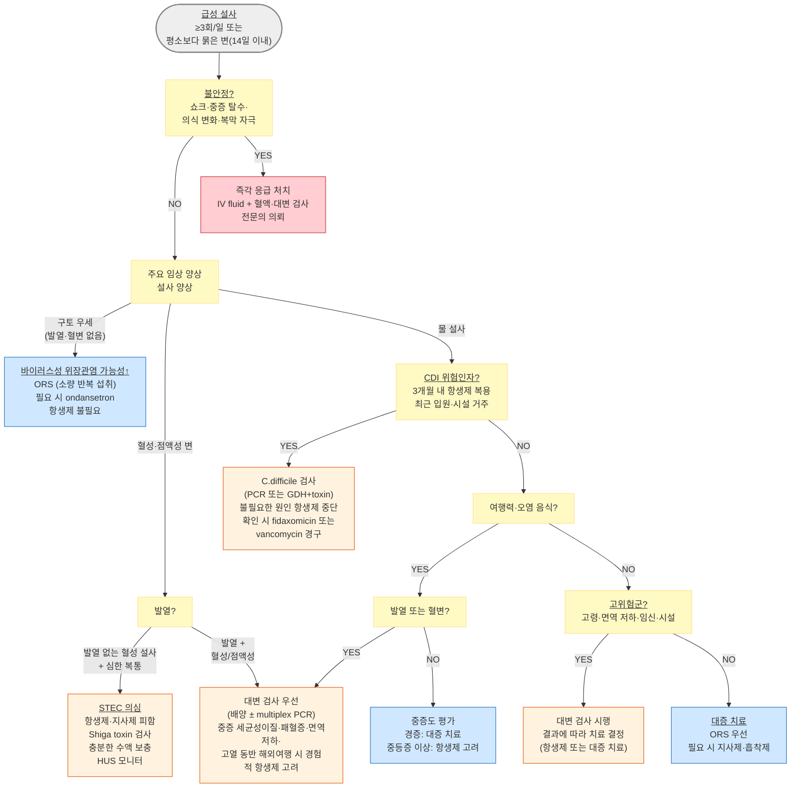

# 급성 감염성 설사 Acute Infectious Diarrhea

## <mark style="color:green;">일반 사항</mark>

* 감염원에 의해 발생한, 기간이 14일 이내인 설사; 보통 구역·구토·복통 동반
* 이질 (dysentery) : 혈성 또는 점액성의 심한 설사, 발열, 복통
* 여행자 설사 : 여행 시작 3\~7일 후 갑자기 시작 (☞ [여행자 설사](086_-travelers-diarrhea.md))


**급성 설사의 정의** : 하루 3회 이상 또는 평소보다 묽은 변이 14일 이내 지속되는 경우


## <mark style="color:green;">원인 및 위험 인자</mark>

* 원인균 : 바이러스(외래 급성 물 설사의 대부분), 세균, 기생충
  * 외래를 방문하는 급성 물 설사의 대부분은 바이러스성이며, 자연 호전됨. 성인에서 가장 흔한 원인은 norovirus, 소아는 rotavirus; 혈성 설사·고열·심한 복통·여행력·집단 발병이 있으면 세균성 원인의 가능성이 높아지며, 입원 환자·면역 저하자에서는 세균 비율이 훨씬 높음
* 발열·탈수·심한 복통·혈변이 동반되면 세균성 감염 의심
* 최근 항생제 사용 또는 입원력이 있으면 _C. difficile_ 의심

### <mark style="color:orange;">위험 인자</mark>

<table><thead><tr><th width="180">위험 인자</th><th>세부 내용</th></tr></thead><tbody><tr><td>여행</td><td>저개발 국가 방문; 식품·물 위생 주의 미흡</td></tr><tr><td>면역 저하</td><td>쇠약, 영양 불량, 면역억제제 사용, HIV</td></tr><tr><td>시설 생활</td><td>보호·요양 시설 거주, 최근 입원</td></tr><tr><td>약물</td><td>항생제(최근 3개월 내), PPI (위산 감소 → 방어 약화)</td></tr><tr><td>임신</td><td>면역 변화, <em>Listeria</em> 등 위험 증가</td></tr><tr><td>만성 간질환</td><td>생굴 등 날 해산물 섭취 후 <em>Vibrio vulnificus</em> 패혈증 위험 ↑↑</td></tr></tbody></table>


**만성 간질환 환자의 날 해산물 섭취 주의** : 간경변·만성 간염 등 만성 간질환 환자는 생굴 섭취 후 _Vibrio vulnificus_ 패혈증 위험이 건강인보다 수십 배 높으며 사망률이 매우 높음. 여름철 특히 주의하고 날 조개·생굴 섭취를 반드시 피해야 함


### <mark style="color:orange;">원인균별 임상 특징</mark>

#### <mark style="color:$primary;">바이러스 vs. 세균 비교</mark>

<table><thead><tr><th width="130">특징</th><th width="230">바이러스</th><th>세균</th></tr></thead><tbody><tr><td>계절</td><td>온대: 겨울 / 열대: 연중</td><td>여름, 우기</td></tr><tr><td>전염 경로</td><td>분변–경구, 음식</td><td>음식·물, 분변–경구</td></tr><tr><td>잠복기</td><td>대개 1~3일</td><td>수 시간~수일 (병원체별 차이)</td></tr><tr><td>이환 부위</td><td>주로 소장</td><td>소장 또는 대장</td></tr><tr><td>설사 양상</td><td>대개 물 설사, 비염증성</td><td>물 설사 또는 염증성 설사</td></tr><tr><td>발열</td><td>보통 없음 또는 경미</td><td>침습성 설사에서 흔함</td></tr><tr><td>구토</td><td>흔함 (특히 norovirus)</td><td>미리 형성된 독소형에서 흔함</td></tr><tr><td>치료 원칙</td><td>대증 치료; 항생제 불필요</td><td>대증 치료; 일부에서 항생제 고려</td></tr></tbody></table>

위 비교는 전형적인 경향이며 예외가 많다. ETEC·콜레라·독소형 식중독 등 세균 감염도 비염증성 물 설사를 흔히 일으킨다.

<p align="center"><em><mark style="color:$info;">Ref. Harrison's Principles of Internal Medicine 21st ed. 2022</mark></em></p>

#### <mark style="color:$primary;">균주별 임상 양상</mark>

<table><thead><tr><th width="170">병원체</th><th width="60">발열</th><th width="60">복통</th><th width="80">구역·구토</th><th width="60">혈변</th><th width="102">점액변</th></tr></thead><tbody><tr><td><em>Salmonella</em></td><td>++</td><td>++</td><td>+</td><td>+</td><td>±</td></tr><tr><td><em>Shigella</em></td><td>++</td><td>++</td><td>++</td><td>++</td><td>+</td></tr><tr><td><em>Campylobacter</em></td><td>++</td><td>++</td><td>++</td><td>+</td><td>±</td></tr><tr><td>STEC (O157:H7)</td><td>0/±</td><td>++</td><td>+</td><td>++</td><td>0/±</td></tr><tr><td><em>C. difficile</em></td><td>+</td><td>+</td><td>NC</td><td>0/±</td><td>+</td></tr><tr><td><em>Yersinia</em></td><td>++</td><td>++</td><td>+</td><td>+</td><td>±</td></tr><tr><td><em>Vibrio</em></td><td>±</td><td>++</td><td>++</td><td>+</td><td>±</td></tr><tr><td><em>E. histolytica</em></td><td>±</td><td>+</td><td>+</td><td>+</td><td>+</td></tr><tr><td><em>Cryptosporidium</em></td><td>±</td><td>±</td><td>±</td><td>NC</td><td>NC</td></tr><tr><td><em>Giardia</em></td><td>NC</td><td>+</td><td>+</td><td>NC</td><td>NC</td></tr><tr><td><strong>Norovirus</strong></td><td>NC/경미</td><td>+</td><td><strong>++</strong></td><td>NC</td><td>NC</td></tr></tbody></table>

++=흔함, +=발생함, ±=변이, NC=비특이적, 0=드물거나 없음. STEC=Shiga toxin–producing _E. coli_.\
Norovirus: 구토 우세, 짧은 잠복기(12\~48시간), 폭발적 집단 발생이 특징. 발열은 경미하거나 없음.\
\*STEC: 강력한 시가 독소(Shiga toxin)에 의해 심한 출혈성 결장염(hemorrhagic colitis)을 유발하므로 대량 혈변과 심한 복통이 특징이다. 대변 백혈구 검사는 원인 병원체를 판별하는 데 권고되지 않는다.

<p align="center"><em><mark style="color:$info;">Ref. NEJM 2004;350, Table 1</mark></em></p>

#### <mark style="color:$primary;">잠복 기간별 감염 특징</mark>

**1\~6시간**

<table data-header-hidden><thead><tr><th width="140"></th><th width="137"></th><th></th></tr></thead><tbody><tr><td><strong>원인균</strong></td><td><strong>증상 / 설사 특징</strong></td><td><strong>원인 음식 / 관련 인자</strong></td></tr><tr><td><em>S. aureus</em></td><td>구역, 구토, 설사</td><td>햄, 가금류, 감자/계란 샐러드, 마요네즈, 크림 패스트리</td></tr><tr><td><em>Bacillus cereus</em></td><td>구역, 구토, 설사</td><td>볶음 밥</td></tr></tbody></table>

**8\~16시간**

<table data-header-hidden><thead><tr><th width="134"></th><th width="195"></th><th></th></tr></thead><tbody><tr><td><strong>원인균</strong></td><td><strong>증상 / 설사 특징</strong></td><td><strong>원인 음식 / 관련 인자</strong></td></tr><tr><td><em>C. perfringens</em></td><td>복통, 설사 (구토는 드묾)</td><td>소/가금류 고기, 콩류, gravy</td></tr><tr><td><em>B. cereus</em></td><td>복통, 설사 (구토는 드묾)</td><td>meats, 채소, 말린 콩, 시리얼</td></tr></tbody></table>

**잠복기: ＞16시간**

<table data-header-hidden><thead><tr><th width="147"></th><th width="131"></th><th></th></tr></thead><tbody><tr><td><strong>원인균</strong></td><td><strong>증상 / 설사 특징</strong></td><td><strong>원인 음식 / 관련 인자</strong></td></tr><tr><td><em>Vibrio cholerae</em></td><td>물 설사</td><td>어패류, 물</td></tr><tr><td>ETEC</td><td>물 설사</td><td>샐러드, 치즈, meats, 물; 여행</td></tr><tr><td>STEC</td><td>혈성 설사</td><td>소고기, 살라미, 미-살균 우유/채소, 사과 주스; 단체 생활, 고령</td></tr><tr><td><em>Salmonella</em></td><td>염증성 설사</td><td>소고기, 가금류, 계란, 유제품</td></tr><tr><td><em>Campylobacter</em></td><td>염증성 설사</td><td>가금류, 미-살균 우유; 여행, 동물 접촉</td></tr><tr><td><em>Shigella</em></td><td>dysentery</td><td>감자/계란 샐러드, 상추, 미-살균 채소; 밀집 생활, 여행</td></tr><tr><td><em>V. parahaemolyticus</em></td><td>주로 물 설사; 때때로 혈변</td><td>연체동물, 갑각류</td></tr><tr><td>Norovirus</td><td>발열, 복통, 구토, 물 설사</td><td>감염 분변/구토물에 오염; 레스토랑, 단체 시설</td></tr><tr><td>Rotavirus</td><td>발열, 복통, 구토, 물 설사</td><td>감염 분변에 오염; 단체 시설, 어린이 시설</td></tr></tbody></table>

ETEC=Enterotoxigenic _E. coli_, EHEC=Enterohemorrhagic _E. coli_.

<p align="center"><em><mark style="color:$info;">Ref. Harrison's Principles of Internal Medicine 21st ed. 2022</mark></em></p>

#### <mark style="color:$primary;">원충 (Protozoa)</mark>

* 오염 지역의 물·음식 노출 후 발생하여 ＞7일 지속되는 물 설사 시 의심
* _Giardia_ : 복부 팽만·지방변·장기 지속 설사; 무증상 보균도 흔함
* _Cryptosporidium_ : 자가 제한적이나 면역 저하자에서 만성화·중증화 위험
* _E. histolytica_ : 아메바성 이질; 혈성 점액 설사, 우하복부 통증; 간 농양 합병 주의

## <mark style="color:green;">임상 양상</mark>

* 급성 발병의 묽은 변 (≥3회/일), 구역·구토, 복통·경련성 복통
* 발열·혈성·점액성 변 → 침습성 세균 감염 시사
* 대부분 2\~5일 내 자연 호전; 탈수 여부·속도가 임상적 중증도를 결정

### <mark style="color:orange;">주요 후기 합병증</mark>

* STEC 또는 드물게 _Shigella dysenteriae_ type 1 → HUS
* _Campylobacter_ → Guillain–Barré syndrome
* _Salmonella_, _Shigella_, _Campylobacter_, _Yersinia_ → 반응성 관절염
* 세균성 장염·Giardia 등 → 감염 후 IBS

### <mark style="color:$danger;">🚩 Red Flags!</mark>

<mark style="color:$danger;">**즉각 조치 또는 응급 의뢰**</mark>

* 기립성 저혈압, 빈맥, 무뇨 또는 핍뇨, 의식 변화 → 중증 탈수
* 고열(＞39℃), 지속 빈맥, 쇼크(저혈압, 말초 순환 부전) → 패혈증 징후
* 심한 복통 (복막 자극 징후, 복벽 강직) → 장 천공·허혈
* 혈성 설사 + 신기능 저하 → HUS (STEC, 특히 소아·고령)
* 면역 저하자(HIV, 항암 치료 중)의 심한 설사·발열
* 만성 간질환 환자의 생굴·해산물 섭취 후 발열·쇼크 → _V. vulnificus_ 패혈증

<mark style="color:$warning;">**당일 또는 조기 의뢰**</mark>

* 고열(≥38.5℃) + 혈성·점액성 설사 → 침습성 세균 감염
* ≥6회/24시간의 설사 지속 및 탈수 진행
* 고령(≥70세), 임산부, 영아의 중등도 이상 설사
* 요양 시설·단체 집단 발생 (공중 보건 신고 대상 여부 확인)
* 최근 3개월 내 항생제 사용 후 발생한 발열·복통 → _C. difficile_

<mark style="color:$info;">**외래 추적 / 추가 평가 계획**</mark> <mark style="color:$info;">– 즉각 위험 낮으나 호전 없으면 의뢰</mark>

* 7일 이상 호전되지 않는 설사 → 대변 검사 및 치료 순응도·약물성 등 재평가; 14일 이상이면 기생충 감염, IBD, 감염 후 IBS 등 지속성 설사의 원인 평가
* 치료 중 증상 악화 또는 새로운 증상 출현
* 설사 소실 후에도 체중 감소·복통이 지속되면 → 흡수 불량, IBD, 악성 종양 등 비감염성 원인 평가

## <mark style="color:green;">진단</mark>

### <mark style="color:orange;">GI 주요 증상에 따른 감별</mark>

**구토**

<table data-header-hidden><thead><tr><th width="130"></th><th width="123"></th><th></th></tr></thead><tbody><tr><td><strong>균주</strong></td><td><strong>잠복기</strong></td><td><strong>원인 음식</strong></td></tr><tr><td><em>S. aureus</em></td><td>1~6시간</td><td>샐러드, 유제품, meat</td></tr><tr><td><em>B. cereus</em></td><td>1~6시간</td><td>쌀밥, meat</td></tr><tr><td>Norwalk-like viruses</td><td>24~48시간</td><td>조개, 조리된 음식, 샐러드, 샌드위치, 주스</td></tr></tbody></table>

**물 설사**

<table data-header-hidden><thead><tr><th width="153"></th><th width="111"></th><th></th></tr></thead><tbody><tr><td><strong>균주</strong></td><td><strong>잠복기</strong></td><td><strong>원인 음식</strong></td></tr><tr><td><em>C. perfringens</em></td><td>8~16시간</td><td>meat, 가금류, 고기 국물</td></tr><tr><td>ETEC</td><td>1~3일</td><td>분변 오염(물/음식)</td></tr><tr><td>Enteric viruses</td><td>10~72시간</td><td>분변 오염(물/음식)</td></tr><tr><td><em>C. parvum</em></td><td>2~28일</td><td>채소, 과일, 비살균 우유, 물</td></tr><tr><td><em>C. cayetanensis</em></td><td>1~11일</td><td>수입 베리류, 바질</td></tr></tbody></table>

**염증성 설사 (발열, 혈성/점액성 설사)**

<table data-header-hidden><thead><tr><th width="146"></th><th width="92"></th><th></th></tr></thead><tbody><tr><td><strong>균주</strong></td><td><strong>잠복기</strong></td><td><strong>원인 음식</strong></td></tr><tr><td><em>Campylobacter</em></td><td>2~5일</td><td>가금류, 비살균 우유, 물</td></tr><tr><td>Nontyphoidal <em>Salmonella</em></td><td>1~3일</td><td>계란, 가금류, meat, 비살균 우유/주스, 날 음식</td></tr><tr><td>STEC</td><td>1~8일</td><td>갈아 놓은 쇠고기, 비살균 우유/주스, 날 채소, 물</td></tr><tr><td><em>Shigella</em> spp</td><td>1~3일</td><td>분변 오염(물/음식)</td></tr><tr><td><em>V. para-hemolyticus</em></td><td>2~48시간</td><td>익히지 않은 조개</td></tr></tbody></table>

<p align="center"><em><mark style="color:$info;">Ref. Approach to the adult with acute diarrhea in resource-rich settings. UpToDate 2024</mark></em></p>

### <mark style="color:orange;">혈성 설사의 주요 세균 감별</mark>

혈성 설사에서 실무적으로 특히 중요한 세 병원체를 우선 감별한다. 다만 Salmonella, Yersinia, 비콜레라 Vibrio, _E. histolytica_ 등도 원인이 될 수 있다.

<table data-header-hidden><thead><tr><th width="98"></th><th></th><th></th><th></th></tr></thead><tbody><tr><td>특징</td><td>STEC</td><td><em>Shigella</em></td><td><em>Campylobacter</em></td></tr><tr><td>발열</td><td>드물거나 없음</td><td>흔함 (++)</td><td>흔함 (++)</td></tr><tr><td>혈변</td><td>흔함, 대량</td><td>흔함, 점액 동반</td><td>가능 (중등도)</td></tr><tr><td>복통</td><td>매우 심함</td><td>중등도, tenesmus</td><td>심한 경련성</td></tr><tr><td>항생제</td><td>일반적으로 피함</td><td>사용</td><td>중증 시 사용</td></tr><tr><td>특기 사항</td><td>HUS 위험</td><td>tenesmus, 이질</td><td>가금류 노출력</td></tr></tbody></table>


**STEC 감별 핵심** : "발열이 없거나 경미한 혈성 설사 + 심한 복통"이면 STEC 가능성을 우선 고려하고 대변 Shiga toxin 검사 결과가 확인될 때까지 항생제 투여를 보류한다. 경험적 항생제 투여 후 HUS 위험이 증가할 수 있다.


### <mark style="color:orange;">섭취 음식에 따른 감별</mark>

<table><thead><tr><th width="194">음식·노출</th><th>의심 병원체</th></tr></thead><tbody><tr><td>해산물 (생굴·조개류)</td><td><em>Vibrio</em>, Norovirus, <em>Salmonella</em></td></tr><tr><td>가금류</td><td><em>Campylobacter</em>, <em>Salmonella</em></td></tr><tr><td>계란</td><td><em>Salmonella</em></td></tr><tr><td>갈아놓은 쇠고기</td><td>STEC</td></tr><tr><td>마요네즈·크림류</td><td><em>Staphylococcus</em>, <em>Salmonella</em> (특히 날계란 사용 시)</td></tr><tr><td>대량 조리 후 부적절하게 보관한 고기·가금류·gravy</td><td><em>C. perfringens</em></td></tr><tr><td>물 (오염 지역)</td><td><em>Vibrio cholerae</em>, <em>Giardia</em>, <em>Cryptosporidium</em></td></tr><tr><td>항생제 복용 후</td><td><em>C. difficile</em></td></tr><tr><td>사람 간 접촉·단체 생활</td><td><em>Shigella</em>, Rotavirus, Norovirus</td></tr><tr><td>구강–항문 성접촉</td><td><em>Shigella</em>, <em>Campylobacter</em>, <em>Giardia</em>, <em>E. histolytica</em></td></tr></tbody></table>

### <mark style="color:orange;">검사 적응증</mark>

#### <mark style="color:$primary;">혈액 검사</mark>

중증 (활력 징후 이상, 심한 복통, 탈수, 패혈증 의심) 시 고려:

* CBC, CRP, 전해질, creatinine
* Lactate (조직 관류 저하, 패혈증·장 경색 감별)
* LFT, lipase (췌장염 감별)
* 혈액 배양 : 패혈증 징후, 창자열(장티푸스) 의심, 면역 저하자, 고위험(용혈성 빈혈 등), 유행 지역 여행력 + 원인불명 발열

#### <mark style="color:$primary;">대변 검사</mark>

* 다음의 경우 고려
  * 중등증 이상 : 심한 설사(탈수), ≥6회/24시간, 심한 복통
  * 염증성 설사 : 혈성·점액성 변, 발열 ≥38.5℃
  * 고위험군 : ≥70세, 요양 시설 거주, 기저 질환(심장 질환·IBD), 면역 저하, 임신
  * 7일 지속, 집단 내 전염 우려, 항생제 투여 예정
* _C. difficile_ 검사: PCR 또는 GDH+toxin 조합 검사
  * 설명되지 않는 새로 발생한 하루 3회 이상의 무른 변에서 시행하며 최근 항생제 사용·입원·요양 시설 노출은 위험인자로 고려
  * 형태를 유지하지 못하는 대변만 검사하고 최근 완하제 투여 여부를 확인; 무증상 환자·형성변 검사 및 치료 후 test of cure는 시행하지 않음
* STEC 확진 또는 강력히 의심되는 경우: CBC(hemoglobin·platelet), 전해질, BUN/creatinine을 반복 추적하고 HUS 의심 시 말초혈액도말, LDH, bilirubin 추가


**Multiplex PCR (GI Panel) 해석 시 주의**

패널 기반 분자 진단은 신속성이 큰 장점이나 다음을 반드시 고려

* PCR 양성 ≠ 반드시 병원성 원인: 무증상 보균·잔존 핵산도 검출 가능
* _C. difficile_ PCR 특히 주의: 무증상 보균자에서도 양성이 나올 수 있으므로, 하루 3회 이상의 무른 변이 실제로 확인될 때만 검사 및 치료를 시행
* EPEC 등 일부 병원체는 성인에서 임상 의미가 불분명할 수 있음
* 결과는 반드시 임상 양상·역학력과 함께 해석해야 한다; 양성 결과가 반드시 치료 필요성을 의미하지 않음
* 집단 발생·역학 조사 목적 또는 원인 불명 지속 설사에서 보조적으로 사용
* 세균성 병원체가 검출되어 감수성 검사 또는 공중 보건 조사가 필요하면 대변 배양(reflex culture)을 추가


#### <mark style="color:$primary;">대변 원인균 검사 \[대한감염학회 기준]</mark>

* 혈변·점액변·심한 복통·압통·패혈증 징후 : _Salmonella_, _Shigella_, _Campylobacter_, _Yersinia_, _C. difficile_, STEC 대변 검사
* 콜레라 유행 지역 여행 후 3일 이내 다량의 쌀뜨물 설사 : 콜레라 대변 검사
* 집단 설사 질환 발생 의심 : 대변 검사 (역학 조사 포함)
* 역학적 연관 + Shiga toxin 생성균 가능성 (발열 없이 혈성 설사 또는 심한 복통): Shiga toxin 검사
* 여행자 14일 이상 설사 지속 : 기생충 검사
* 설사 발생 전 8\~12주 내 항생제 복용력 : _C. difficile_ 검사

#### <mark style="color:$primary;">기타 검사</mark>

* 영상 검사 : 복막염·장 천공·장 허혈·독성거대결장 등 외과적 원인이 의심될 때 임상 상황에 따라 복부·골반 CT, 단순 촬영 또는 초음파 선택
* 대장 내시경 : 대변 검사 음성의 지속성 설사에서 감별 진단 목적으로 고려
* 기생충 검사 : 14일 이상 지속되는 설사, 오염된 물·음식 노출, 구강–항문 성접촉, 면역 저하자에서 고려
* 성매개 직장염·장염이 의심되면 노출 부위에 따라 임질·클라미디아 검사와 매독·HIV 검사를 함께 고려

***


```mermaid
graph TD
    Start(["<u>급성 설사</u><br/>≥3회/일 또는<br/>평소보다 묽은 변(14일 이내)"])
    Start --> Unstable["<u>불안정?</u><br/>쇼크·중증 탈수·<br/>의식 변화·복막 자극"]
    Unstable -- "NO" ---> Symptom["주요 임상 양상<br/>설사 양상"]
    Unstable -- "YES" --> ER["즉각 응급 처치<br/>IV fluid + 혈액·대변 검사<br/>전문의 의뢰"]
    Symptom -- "구토 우세<br/>(발열·혈변 없음)" --> Viral["<u>바이러스성 위장관염 가능성↑</u><br/>ORS (소량 반복 섭취)<br/>필요 시 ondansetron<br/>항생제 불필요"]
    Symptom -- "혈성·점액성 변" --> BloodFever["발열?"]
    BloodFever -- "발열 없는 혈성 설사<br/>+ 심한 복통" --> 
    STEC["<u>STEC 의심</u><br/>항생제·지사제 피함<br/>Shiga toxin 검사<br/>충분한 수액 보충<br/>HUS 모니터"]
    BloodFever -- "발열 + <br/>혈성/점액성" --> EmpiricAtb["대변 검사 우선<br/>(배양 ± multiplex PCR)<br/>중증 세균성이질·패혈증·면역저하·<br/>고열 동반 해외여행 시 경험적 항생제 고려"]
    Symptom -- "물 설사" --> CDIRisk["<u>CDI 위험인자?</u><br/>3개월 내 항생제 복용<br/>최근 입원·시설 거주"]
    CDIRisk -- "YES" --> CDITx["C.difficile 검사<br/>(PCR 또는 GDH+toxin)<br/>불필요한 원인 항생제 중단<br/>확인 시 fidaxomicin 또는<br/>vancomycin 경구"]
    CDIRisk -- "NO" --> Travel["여행력·오염 음식?"]
    Travel -- "YES" --> TravelFever["발열 또는 혈변?"]
    TravelFever -- "YES" --> EmpiricAtb
    TravelFever -- "NO" --> TravelMild["중증도 평가<br/>경증: 대증 치료<br/>중등증 이상: 항생제 고려"]
    Travel -- "NO" --> Host["<u>고위험군?</u><br/>고령·면역 저하·임신·시설"]
    Host -- "YES" --> StoolExam["대변 검사 시행<br/>결과에 따라 치료 결정<br/>(항생제 또는 대증 치료)"]
    Host -- "NO" --> Watery["<u>대증 치료</u><br/>ORS 우선<br/>필요 시 지사제·흡착제"]
 
style Start fill:#eeeeee,stroke:#888888,stroke-width:2px
classDef yellow fill:#fff9c4,stroke:#ffe082
   class Unstable,Symptom,BloodFever,CDIRisk,Travel,Host,TravelFever yellow
style ER fill:#ffcdd2,stroke:#c62828
classDef orange50 fill:#fff3e0,stroke:#e65100
   class STEC,CDITx,EmpiricAtb,StoolExam orange50
classDef blue fill:#d0e8ff,stroke:#1a6abf
   class Viral,TravelMild,Watery blue
```

<p align="center"><strong>급성 감염성 설사 진단·치료 알고리듬</strong></p>

***

## <mark style="background-color:orange;">Management</mark>

* 대부분 자연 호전 - 수분·전해질 보충과 대증 치료가 핵심
* 항생제는 치료 이득이 기대되는 특정 세균·기생충 감염, 중증·전신 증상 또는 면역 저하자에서 선별적으로 고려
* 장 운동 억제제는 침습성 세균 감염(발열·혈성변) 시 사용하지 않음

**항생제가 필요한 상황 vs. 일반적으로 불필요한 상황**

<table><thead><tr><th width="280">항생제 적극 고려</th><th>일반적으로 불필요</th></tr></thead><tbody><tr><td>패혈증 또는 장티푸스성 발열 의심</td><td>단순 물 설사 (바이러스 의심)</td></tr><tr><td>전형적인 중증 세균성이질</td><td>짧은 경과, 자연 호전 추세</td></tr><tr><td>해외여행 후 고열(≥38.5℃) 또는 패혈증</td><td>Norovirus 의심 집단 발생</td></tr><tr><td>면역 저하자의 중증 혈성 설사</td><td>발열이 없거나 경미한 혈성 설사 (STEC 의심)</td></tr><tr><td>치료 적응증이 있는 병원체 확인</td><td>비티푸스 Salmonella (면역 정상, 합병증 위험 낮음)</td></tr><tr><td><em>C. difficile</em> 확인</td><td>단순 바이러스 위장관염</td></tr></tbody></table>

**항생제 사용의 흔한 오류**

* 발열 없는 혈성 설사에 경험적 quinolone 투여 (STEC 과놓침)
* 단순 바이러스 설사에 광범위 항생제 처방
* loperamide를 혈성 설사·고열 환자에 사용
* _C. difficile_ 의심 환자에 원인 항생제 지속 또는 불필요한 추가 항생제 사용
* 탈수 교정보다 약 처방을 먼저 시작

## <mark style="color:green;">비-약물 치료</mark>

### <mark style="color:orange;">수분 및 전해질 보충</mark>

<table><thead><tr><th width="156">상황</th><th>권장 수액</th></tr></thead><tbody><tr><td>경증 탈수</td><td>ORS (경구 수분 보충액) 우선</td></tr><tr><td>중등도 탈수</td><td>ORS 우선; 경구 불가 시 IV 병용</td></tr><tr><td>쇼크·패혈증</td><td>Lactated Ringer's 또는 NS IV bolus 우선</td></tr><tr><td>콜레라</td><td>공격적 Lactated Ringer's IV (Na 손실량 매우 큼)</td></tr></tbody></table>

* 경구 수분 보충(ORS): 경증\~중등증 탈수의 일차 치료
  * WHO 저삼투압 ORS(Na 75 mEq/L) 권장; 자가 제조 : 물 1 L + 설탕 6 tsp + 소금 ½ tsp
  * 구토가 있을 때 : 한 번에 많이 마시지 말고 1\~2분마다 한두 모금씩 반복 섭취 → 구토 감소, ORS 성공률 향상

### <mark style="color:orange;">식이</mark>

* 금식은 권장하지 않음 - 가능한 한 조기 정상 식이 재개
* 초기에는 소화 쉬운 식품 선택: 죽, 삶은 감자, 토스트, 바나나
* 유제품, 고지방식, 카페인, 알코올 일시적 제한
* BRAT 식이(바나나·쌀밥·사과소스·토스트)는 영양 불균형 우려로 현재 권고하지 않음

## <mark style="color:green;">약물 치료</mark>

　☞ [소화기계 약제](073_.md#antidiarrheal-agent)

### <mark style="color:orange;">항생제</mark>

* 항생제 적응증 : 패혈증·장티푸스성 발열, 전형적인 중증 세균성이질, 해외여행 후 고열 또는 패혈증, 면역 저하자의 중증 혈성 설사, 치료 이득이 확인된 특정 병원체 감염

#### <mark style="color:$primary;">병원체별 항생제 선택</mark>

<table><thead><tr><th width="135">병원체 / 상황</th><th width="276">선호 항생제 (용법)</th><th>비고</th></tr></thead><tbody><tr><td><strong>경험적 치료</strong><br>(적응증에 해당하는 중증 침습성 설사)</td><td>Azithromycin 500 ㎎ qd × 3일<br>Ciprofloxacin 500 ㎎ bid × 3일</td><td>면역 정상 성인의 혈성 설사에 일률적으로 투여하지 않음. 여행력·지역 내성·중증도에 따라 선택; 동남아·인도 등 fluoroquinolone 내성 Campylobacter 위험 지역에서는 azithromycin 우선</td></tr><tr><td><strong>여행자 설사</strong><br>(중등증 이상, 비침습성)</td><td>Azithromycin 1,000 ㎎ 단회<br>또는 500 ㎎ qd × 3일<br>Rifaximin 200 ㎎ tid × 3일 (대안)</td><td>경증에는 항생제 권고하지 않음. Rifaximin은 발열·혈변 없는 비침습성 설사에만 사용</td></tr><tr><td><em><strong>Shigella</strong></em></td><td>Azithromycin 500 ㎎ qd × 3일<br>Ciprofloxacin 500 ㎎ bid × 3일<br>Ceftriaxone 1~2 g IV qd × 3~5일 (중증)</td><td>경증은 수액 치료만으로 호전 가능. 다제·광범위 내성 증가 → 치료 필요 시 배양 및 감수성검사에 따라 선택</td></tr><tr><td><em><strong>Campylobacter</strong></em></td><td>Azithromycin 500 ㎎ qd × 3일</td><td>Fluoroquinolone 내성 매우 흔함; 자연 호전도 많으므로 중증·고위험군 또는 증상 초기에 선별 사용</td></tr><tr><td><em><strong>V. cholerae</strong></em></td><td>Doxycycline 300 ㎎ 단회 (선호)<br>Ciprofloxacin 1 g 단회<br>Azithromycin 1 g 단회</td><td>적극적 수액 보충이 치료의 핵심; 감수성·임신 여부를 고려하여 항생제 선택</td></tr><tr><td><strong>비티푸스 </strong><em><strong>Salmonella</strong></em></td><td><strong>일반적으로 항생제 불필요</strong></td><td>중증 감염, 면역 저하, 영아·고령, 죽상경화성·판막성·혈관내 질환 등 침습성 감염 고위험군에서 치료; 감수성에 따라 ceftriaxone, azithromycin 또는 ciprofloxacin 선택</td></tr><tr><td><strong>STEC (O157:H7 등)</strong></td><td><strong>항생제 피함</strong></td><td>발열이 없거나 경미한 혈성 설사와 심한 복통 시 특히 의심; HUS 위험 때문에 장 운동 억제제도 피함</td></tr><tr><td><em><strong>C. difficile</strong></em><br>(초발, non-fulminant)</td><td>Fidaxomicin 200 ㎎ bid × 10일<br>또는 vancomycin 125 ㎎ qid × 10일</td><td>Fidaxomicin 조건부 우선 권고이나 비용·접근성을 고려하면 vancomycin도 적절. Severe(WBC ≥15,000/μL 또는 Cr ≥1.5 ㎎/㎗)도 같은 용량; metronidazole은 두 약제를 사용할 수 없는 비중증 환자에서만 대안</td></tr><tr><td><em><strong>C. difficile</strong></em><br>(fulminant)</td><td>Vancomycin 500 ㎎ PO/NG qid<br>+ metronidazole 500 ㎎ IV q8h</td><td>저혈압·쇼크, 장마비 또는 독성거대결장. 즉시 입원·외과 협진; 장마비 시 직장 vancomycin 추가 고려</td></tr><tr><td><em><strong>Giardia</strong></em></td><td>Metronidazole 250 ㎎ tid 또는 500 ㎎ bid × 5~7일 <mark style="color:blue;">[후라시닐]</mark></td><td>대안: tinidazole 2 g 단회(국내 허가·유통 여부 확인)</td></tr><tr><td><em><strong>E. histolytica</strong></em></td><td>Metronidazole 500~750 ㎎ tid × 7~10일 <mark style="color:blue;">[후라시닐]</mark></td><td>이후 paromomycin 등 luminal agent로 장내 낭종 제거 필요; 국내 이용 가능 여부 확인</td></tr></tbody></table>


**fluoroquinolone 내성 현황**: 국내외적으로 \_Campylobacter\_와 \_Shigella\_에서 fluoroquinolone 내성이 크게 증가하고 있다. \_Salmonella\_에서도 fluoroquinolone 내성이 증가 추세이며, 특히 아시아 유래 균주에서 주의가 필요하다. 동남아·인도 여행 후 발생한 설사에서는 azithromycin을 경험적 1차 치료로 우선 고려하며, 단회 요법(doxycycline, ciprofloxacin 등)은 지역 내 내성률에 따라 효과가 다를 수 있으므로 참고한다.


### <mark style="color:orange;">장 운동 조절제</mark>

* 일부 설사 횟수 감소 효과; 침습성 세균 감염(발열·혈성·점액성 변) 시 사용하지 않음
* loperamide : 초회 4 ㎎, 이후 필요시 2 ㎎; 최대 16 ㎎/24시간 <mark style="color:blue;">\[로프민]</mark>
  * 경험적 항생제와 병용 시 여행자 설사에서 증상 기간 단축 가능
  * 사용하지 않는 경우: 이질, 침습성 감염 의심, STEC 의심(발열 없는 혈성 설사)

### <mark style="color:orange;">진경제</mark>

* 경련성 복통 완화를 위해 단기간 사용할 수 있으나 수분 보충과 원인 치료를 대신하지 않으며, 복막 자극 징후·장마비·독성거대결장이 의심되면 사용하지 않음
* cimetropium : 50 ㎎ tid <mark style="color:blue;">\[알기론]</mark>&#x20;
* tiropramide : 100 ㎎ bid\~tid <mark style="color:blue;">\[티로파]</mark>&#x20;

### <mark style="color:orange;">구토 조절제 (Antiemetics)</mark>

* 심한 구토로 ORS 섭취가 어려울 때 제한적으로 고려
* ondansetron : 4\~8 ㎎ PO (또는 ODT) <mark style="color:blue;">\[조프란]</mark> (급성 위장관염 구토에는 국내 허가 외 사용)
  * 구토 조절을 통해 ORS 섭취를 도울 수 있으나 수액 치료를 대신하지 않음
  * QT 연장 위험이 있으므로 선천성 long-QT, 서맥, 저칼륨혈증·저마그네슘혈증 또는 다른 QT 연장 약물 병용 시 주의; 설사가 증가할 수 있음

### <mark style="color:orange;">분비 억제제 (Antisecretory)</mark>

* bismuth subsalicylate : 524\~525 ㎎(현탁액 30 ㎖)을 30\~60분마다 필요시, 1일 최대 8회 × 최대 2일 <mark style="color:blue;">\[펩토무스현탁액]</mark> (제품별 허가사항·유통 여부 확인)&#x20;
  * 구역·설사·복통에 완만한 효과; 국내 처방 빈도는 낮음
  * Salicylate 과민, 소아·청소년의 바이러스 감염, 활동성 출혈·소화성 궤양, 항응고제 복용, 중증 신기능 저하 및 임신 중에는 피하거나 신중히 사용
* racecadotril : 100 ㎎ tid (성인 기준) <mark style="color:blue;">\[하이드라섹]</mark> (비급여)
  * Enkephalinase 억제 작용 → 장 분비 억제; 장 운동에 영향을 주지 않아 반동 변비·복부 팽만이 상대적으로 적음
  * 비혈성 급성 물 설사에서 ORS의 보조요법으로 제한적으로 고려; 고열·혈변·농성 변 또는 항생제 연관 설사에서는 원인 평가와 적절한 치료를 우선

### <mark style="color:orange;">흡착제</mark>

* diosmectite : 3 g (1포) tid, 식간 복용 <mark style="color:blue;">\[스타빅 현탁액]</mark>
  * 장 점막 보호, 독소·세균 흡착 효과
  * 금기 : 만 2세 미만 소아, 임부 및 수유부 (식약처 2019 안전성 조치 - 천연 광물 유래 중금속 잔류 우려)
  * 다른 약제(항생제·프로바이오틱스 포함)의 흡수를 방해하므로 반드시 2시간 이상 간격 복용

### <mark style="color:orange;">Probiotics</mark>

* 급성 감염성 설사 치료 또는 여행자 설사 예방에 대한 효과는 균주 특이적이고 이득이 제한적이므로 일상적으로 권고하지 않음
* 항생제 연관 설사(AAD) 예방: _Lactobacillus rhamnosus_ GG, _S. boulardii_ 일부 효과; 고위험군에서 고려 (보험 기준 확인 필요)
* **주의**: 중증 면역 저하자, 중심정맥관 보유 환자에서는 균혈증(bacteremia/fungemia) 위험 보고 → 사용에 주의한다

## <mark style="color:green;">예방</mark>

　☞ [여행자 설사 및 예방](086_-travelers-diarrhea.md)

* 손 위생: 식전·배변 후 비누와 물로 20초 이상 손 씻기
  * 알코올 손소독제는 _C. difficile_ 포자에 효과 없음 - 반드시 비누 세척 필요
  * Norovirus가 의심될 때도 비누와 물을 이용한 손 씻기를 우선
* 식품 안전: 고기·해산물 충분히 가열, 생채소·과일 세척, 비살균 유제품 회피
* 여행 시: 병수(bottled water) 또는 끓인 물 사용; 길거리 음식·생선회 주의
* 전파 예방: 증상이 있는 동안 음식 조리·수영·성접촉을 피하고, 식품 취급·의료·돌봄 종사자는 보건당국의 업무 복귀 기준을 따름
* 백신
  * [로타바이러스 백신](../231_/210_-vaccination.md#rotavirus) : 영아 필수 예방접종 (2회 또는 3회); 중증 설사로 인한 입원을 약 70\~85% 감소시키는 우수한 예방 효과 (WHO)
  * 경구 [콜레라 백신](../231_/210_-vaccination.md#cholera): 유행 지역 여행 전 고려

***

### <mark style="color:red;">질병코드</mark>

* A08 바이러스성 및 기타 명시된 장감염
  * A08.0 로타바이러스 장염
  * A08.1 Norwalk 인자에 의한 급성 위장병증
* A09 감염성 및 상세불명 기원의 기타 위장염 및 결장염
* A00 콜레라
* A02 기타 Salmonella 감염
* A03 Shigella증
* A04 기타 세균성 장감염
  * A04.1 장독소성 대장균 감염(ETEC)
  * A04.3 장출혈성 대장균 감염
  * A04.5 Campylobacter 장염
  * A04.7 _Clostridium difficile_ 장염 (ICD-10-CM에서는 A04.71 재발성 / A04.72 비재발성으로 세분; KCD 적용 시 확인 필요)
* A05 달리 분류되지 않은 기타 세균성 식중독

***

## <mark style="color:purple;">처방례</mark>

> **처방례 1. 바이러스성·비혈성 설사, 발열(–), 경증**
>
> ```
> 로프민 2 ㎎/C　　　　　1C　필요시
> 알기론 50 ㎎/T　　　　　3T　#3
> 스타빅 현탁액 20 ㎖/P　　3P　#3　식간 복용
> ```
>
> _✽ 비염증성 물 설사의 증상 완화 처방. ORS를 우선하며 loperamide는 혈변·발열 발생 시 즉시 중단. 구토가 심하면 QT 연장 위험 등을 확인한 후 조프란 4 ㎎ ODT 추가 고려. 프로바이오틱스는 일상적으로 권고하지 않으며 선택적으로 추가한다._

> **처방례 2. 여행자 설사, 중등증 (발열 없음, 비혈성)**
>
> ```
> 씨프로바이 500 ㎎/T　　1T　bid × 3일
> 로프민 2 ㎎/C　　　　　1C　필요시
> 스타빅 현탁액 20 ㎖/P　3P　#3　식간 복용
> ```
>
> _✽ 비침습성 여행자 설사(발열·혈변 없음)에서 ciprofloxacin + loperamide 병용. 동남아·인도 여행력 있으면 지트로맥스 500 ㎎ qd × 3일로 대체 권고 (fluoroquinolone 내성). 구토가 심해 ORS 섭취가 어려우면 조프란 4 ㎎ ODT 추가 고려._

> **처방례 3. 경험적 항생제 적응증에 해당하는 중증 침습성 설사**
>
> ```
> 지트로맥스 500 ㎎/T　　1T　qd × 3일
> 티로파 100 ㎎/T　　　　3T　#3
> 스타빅 현탁액 20 ㎖/P　3P　#3　식간 복용
> 타이레놀 500 ㎎/T　　　1T　tid　발열·통증 시
> ```
>
> _✽ 발열·복통·뒤무직을 동반한 전형적인 중증 세균성이질, 해외여행 후 고열·패혈증, 또는 면역 저하자의 중증 혈성 설사 등에서 고려한다. **loperamide는 사용하지 않는다**. STEC 의심(발열이 없거나 경미한 혈성 설사 + 심한 복통) 시 항생제 투여를 보류하고 Shiga toxin 검사를 시행한다. 고열 지속·패혈증 징후 시 혈액 배양 및 전문의 의뢰._

> **처방례 4.&#x20;**_**C. difficile**_**&#x20;감염 (초발, non-fulminant)**
>
> ```
> 반코마이신 캡슐 125 ㎎/C　4C　#4 × 10일
> ```
>
> _✽ 임상적으로 의미 있는 설사와 검사 결과가 일치하는 초발 CDI에서 사용한다. 불필요한 원인 항생제는 가능하면 중단한다. Severe CDI(WBC ≥15,000/μL 또는 Cr ≥1.5 ㎎/㎗)도 vancomycin 125 ㎎ qid를 사용하며, 500 ㎎ qid로 증량하지 않는다. **Fulminant CDI**(저혈압·쇼크, 장마비 또는 독성거대결장)는 입원하여 vancomycin 500 ㎎ PO/NG qid + metronidazole 500 ㎎ IV q8h 및 외과 협진이 필요하다. Fidaxomicin 200 ㎎ bid × 10일은 초발에서도 조건부 우선 권고되며 국내 비용·접근성을 함께 고려한다._

***

### <mark style="color:$success;">핵심 복약 지도</mark>

1. **수분 보충이 가장 중요합니다** - 설사·구토가 있을 때는 매 배변 후 물 또는 ORS 한 컵(200\~250 mL)을 추가로 마시세요. 구토가 있으면 **1\~2분마다 한두 모금씩** 조금씩 반복해서 드세요.
2. **지사제(loperamide·로프민)**: 혈변이나 고열이 생기면 즉시 중단하고 내원하세요 - 세균성 설사에서 계속 복용하면 증상을 악화시킬 수 있습니다.
3. **항생제는 처방된 용법과 기간대로 복용**하고 임의로 중단하거나 연장하지 마세요.
4. **흡착제(스타빅·diosmectite)**: **다른 모든 약과 2시간 이상 간격**을 두고 반드시 따로 복용하세요 - 항생제, 지사제, 프로바이오틱스 포함 모든 약물을 흡착하여 효과를 떨어뜨립니다. 만 2세 미만 어린이, 임산부, 수유 중인 분은 복용하지 마세요.
5. **프로바이오틱스(비오플 등)**: 급성 설사에 반드시 필요한 약은 아닙니다. 복용하는 경우 흡착제와 2시간 이상 간격을 두세요. _S. boulardii_ 제품은 항진균제와 함께 복용하지 마세요.
6. **식사**: 금식하지 말고 죽·삶은 감자·토스트 등 소화 쉬운 음식을 소량씩 드세요. 유제품·기름진 음식·커피·알코올은 회복될 때까지 피하세요.
7. **손 위생**: 화장실 이용 후 반드시 **비누와 물로 20초 이상** 손을 씻어 가족에게 옮기지 않도록 주의하세요.

***

### <mark style="color:blue;">환자 안내서</mark>

**급성 감염성 설사 (식중독·바이러스성 장염) 안내**

**어떤 병인가요?**\
세균·바이러스·기생충에 의해 장이 감염되어 생기는 급성 설사입니다. 외래 급성 설사의 대부분은 바이러스가 원인이며, 2\~5일 내에 저절로 좋아집니다. 가장 중요한 치료는 탈수 예방을 위한 수분 보충입니다.

**이런 증상이 있으면 바로 병원에 오세요**

* 대변에 피가 섞이거나 심한 복통·복부 경직이 있을 때
* 하루 6회 이상 설사가 지속되거나, 물을 마셔도 구토가 반복될 때
* 입이 심하게 마르고 소변이 거의 나오지 않을 때 (탈수 위험)
* 어지러워서 일어서기 힘들 때
* 고열(38.5℃ 이상)이 지속될 때
* 설사가 7일 이상 계속될 때

**집에서 이렇게 관리하세요**

<table><thead><tr><th width="120">항목</th><th>방법</th></tr></thead><tbody><tr><td>수분 보충</td><td>ORS를 우선하여 설사할 때마다 한 컵씩 추가; 구토 시에는 1~2분마다 한두 모금씩. 스포츠 음료는 ORS를 대신하지 못하며 당 함량이 높아 설사를 악화시킬 수 있습니다.</td></tr><tr><td>식사</td><td>죽, 밥, 삶은 감자, 토스트 등 소화 쉬운 음식을 소량씩; 금식은 하지 마세요</td></tr><tr><td>피할 것</td><td>기름진 음식, 생과일주스, 카페인, 알코올; 유제품은 섭취 후 증상이 심해질 때 일시 제한</td></tr><tr><td>손 위생</td><td>화장실 이용 후·식사 전 반드시 비누로 20초 이상 손씻기</td></tr><tr><td>전파 예방</td><td>증상이 있는 동안 다른 사람의 음식 조리·수영·성접촉을 피하고 수건·컵·식기를 가족과 분리 사용</td></tr></tbody></table>

**약은 언제 먹어야 하나요?**\
처방받은 항생제는 정해진 용법과 기간대로 복용하고 임의로 중단하거나 연장하지 마세요. 지사제(loperamide)는 혈변이나 고열이 있으면 절대 드시면 안 됩니다. 흡착제(스타빅)는 다른 약과 **2시간 이상 간격**을 두고 따로 복용하세요 (항생제, 프로바이오틱스 모두 포함). 만 2세 미만 어린이, 임산부, 수유 중인 분은 스타빅(diosmectite)을 복용하지 마세요. 시판 지사제를 임의로 복용하기 전에 의사와 상담하세요.

**예방 수칙**

* 고기·해산물은 완전히 익혀 드세요 (특히 조개류·생선)
* 생채소·과일은 흐르는 물에 충분히 씻으세요
* 날 음식 조리 후 손과 도마·칼을 깨끗이 씻으세요
* 해외 여행 시 병수 또는 끓인 물을 사용하고 길거리 음식에 주의하세요
* **간 질환이 있으신 분은 생굴이나 날 조개를 드시지 마세요**
* 영아에게 로타바이러스 백신을 접종하세요
