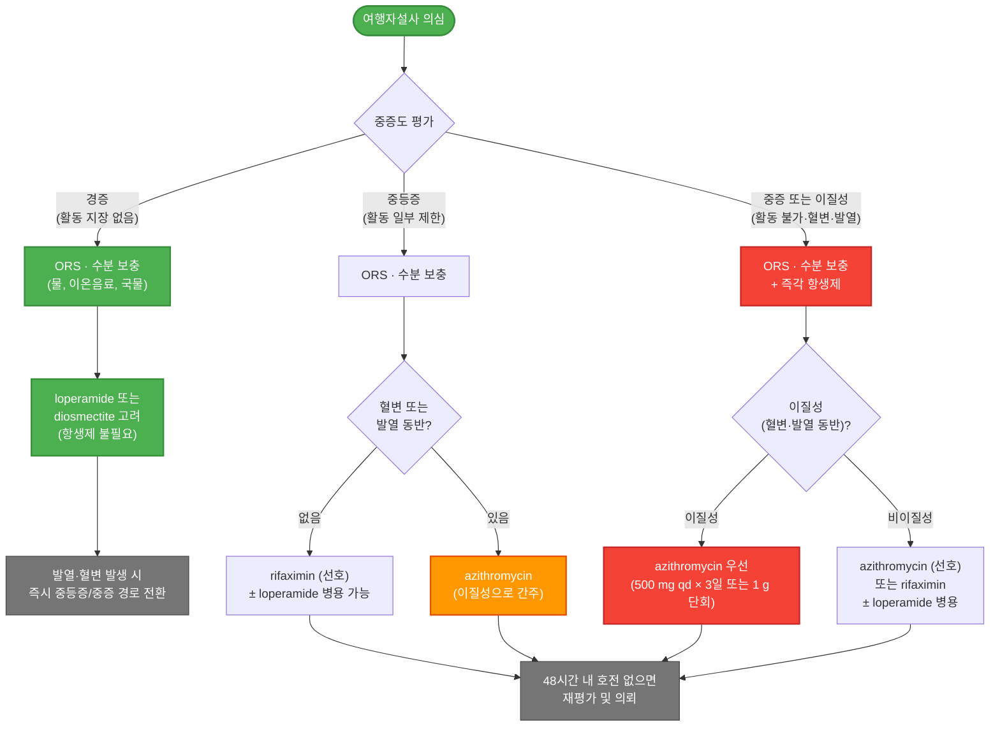

# 여행자설사 Traveler's Diarrhea

## <mark style="color:green;">일반 사항</mark>

여행자설사(TD)는 가장 흔한 여행 관련 질환으로, 개발도상국을 방문하는 여행자의 **20\~60%**에서 발생한다. 대부분은 오염된 음식이나 음료수를 통해 전파되며, 체류 초기(첫 1\~2주)에 집중적으로 발생한다. 치료하지 않아도 세균성은 대부분 3\~7일 내 자연 호전되나, EAEC 감염이나 바이러스 후 장 과민 상태 등에서는 1\~2주 이상 지속되거나 **post-infectious IBS(PI-IBS)**로 이행할 수 있다.

## <mark style="color:green;">원인 및 위험 인자</mark>

### <mark style="color:orange;">원인균</mark>

<table><thead><tr><th width="120">분류</th><th width="100">빈도</th><th>주요 원인균</th></tr></thead><tbody><tr><td>세균</td><td>80~90%</td><td>E. coli (ETEC, EAEC), Campylobacter, Shigella, Salmonella, Aeromonas spp.</td></tr><tr><td>바이러스</td><td>10~25%</td><td>Norovirus, Rotavirus, Astrovirus, Sapovirus</td></tr><tr><td>기생충</td><td>~10%</td><td>Giardia lamblia, Cryptosporidium, Cyclospora</td></tr></tbody></table>


바이러스 빈도는 과거 5\~15%로 기술되었으나, multiplex PCR 연구에 따르면 실제로는 **10\~25%**까지 기여할 수 있으며 구토 우세 증상과 관련된다.


### <mark style="color:orange;">위험 인자</mark>

* **숙주 요인** : 면역저하자, 제산성 약물 복용자(PPI, H₂-차단제), 위장관 수술력, 젊은 성인
* **지역 요인** : 더운 기후, 상하수도 및 위생 인프라 미비 지역(사하라이남 아프리카, 남아시아, 중남미)
* **시기** : 여행 초기(특히 첫 1주)에 위험도 최고

## <mark style="color:green;">임상 양상</mark>

### <mark style="color:orange;">병원체별 특징</mark>

<table><thead><tr><th width="210">원인균</th><th width="150">잠복기</th><th>임상 특징</th></tr></thead><tbody><tr><td>ETEC</td><td>6~72시간</td><td>Malaise, 식욕 부진, 복통에 이어지는 급격한 수양성 설사</td></tr><tr><td>EAEC</td><td>수일</td><td>수양성 설사가 지속적; 1~2주 이상 연장되는 경우 많음</td></tr><tr><td>Campylobacter, Shigella</td><td>1~3일</td><td>발열, 이질성 증상(뒤무직, 절박변, 경련성 복통, 혈변)</td></tr><tr><td>Salmonella</td><td>12~72시간</td><td>오한, 발열, 두통, 근육통 동반; 균혈증 가능</td></tr><tr><td>Aeromonas spp.</td><td>1~2일</td><td>수양성 또는 점혈변 설사; 담수 노출력. fluoroquinolone 또는 3세대 세팔로스포린 반응</td></tr><tr><td>Norovirus</td><td>12~48시간</td><td>오심·구토 predominance; 폭발적 집단 발생이 특징; 경과 짧음(1~3일)</td></tr><tr><td>Giardia lamblia</td><td>1~2주</td><td>악취성 지방성 설사, 복부 팽만, 잦은 트림; 수 주~수개월 지속 가능</td></tr><tr><td>Cyclospora cayetanensis</td><td>1~2주</td><td>수양성 설사가 장기간 지속되며 재발-완화 경과가 특징; TMP/SMX 반응. 위험 지역: 과테말라·아이티·네팔·페루 등</td></tr><tr><td><em>황색포도상구균 (S. aureus)·바실루스 세레우스 (B. cereus) (독소형)</em></td><td><em>1~6시간 (매우 짧음)</em></td><td><em>음식 섭취 직후 폭발적 구토·복통. 발열 대개 없음; 24시간 내 자연 호전. 항생제 불필요</em></td></tr></tbody></table>


**독소형 식중독 감별**: 잠복기가 1\~6시간으로 매우 짧고 구토가 주증상이며 발열이 없으면 세균성 TD보다 S. aureus 또는 B. cereus 독소형을 먼저 의심한다. 항생제는 불필요하며 수분 보충과 대증 치료로 충분하다.


### <mark style="color:orange;">중증도 분류</mark>

<table><thead><tr><th width="110">등급</th><th>기준</th></tr></thead><tbody><tr><td><strong>경증</strong></td><td>견딜 만하고 고통스럽지 않으며, 계획된 활동에 지장 없음</td></tr><tr><td><strong>중등증</strong></td><td>고통스럽거나 계획된 활동에 지장을 주는 설사</td></tr><tr><td><strong>중증</strong></td><td>계획된 활동이 불가능한 설사; 이질성 설사는 모두 중증으로 간주</td></tr><tr><td><strong>지속성</strong></td><td>2주 이상 지속 (기생충 감염·PI-IBS 평가 필요)</td></tr></tbody></table>


**이질성 설사(Dysentery)**: 혈변 또는 발열을 동반한 침습성 염증성 설사로, 뒤무직·절박변·경련성 복통·점액변이 동반될 수 있다. 점액변만 있는 경우는 viral colitis나 과민성 장염을 포함할 수 있으므로 혈변 또는 발열의 동반 여부로 이질성을 판단한다. 이질성 설사는 중증도에 관계없이 항생제 적응증이다.



**Post-infectious IBS (PI-IBS)**: 원인균 소멸 후에도 위장관 증상이 지속되는 상태. 감염 기간이 길고 중증일수록, 여성에서, 심리적 스트레스가 동반된 경우 위험이 높다.


### <mark style="color:$danger;">🚩 Red Flags!</mark>

<mark style="color:$danger;">**즉각 평가 또는 응급 이송**</mark>

* 심한 탈수 징후 : 의식 저하·혼돈, 빈맥(>120회/분), 저혈압, 무뇨 또는 핍뇨
* 고열(≥39°C) + 혈변 + 의식 변화의 동시 발생
* 영아·고령자·면역저하자에서의 급격한 임상 악화
* 복막 자극 징후 (판상 복부, 반동 압통)

<mark style="color:$warning;">**당일 의뢰 또는 긴급 평가**</mark>

* 이질성 설사(혈변 또는 발열을 동반한 침습성 염증성 설사) — 중증도에 관계없이
* 38.5°C 이상의 발열이 48시간 이상 지속
* 중등증 이상 + 면역저하자, 염증성 장질환자, 인슐린 의존성 당뇨병 환자
* 대증 치료 48시간 후에도 호전 없는 중등증 이상

<mark style="color:$info;">**외래 추적 / 추가 평가 계획**</mark> <mark style="color:$info;">— 즉각 위험 낮으나 호전 없으면 의뢰</mark>

* 귀국 후에도 설사가 2주 이상 지속 → 기생충 감염(Giardia, Cryptosporidium 등) 평가
* 설사 소실 후 IBS 유사 증상 지속 → PI-IBS 평가
* Norovirus 집단 발생이 의심되는 경우 (유람선, 단체 투어) → 역학 신고 고려

## <mark style="color:green;">진단</mark>

* **일반적으로 임상 진단으로 충분**하며 추가 검사는 불필요
* **미생물 검사 적응증** : 중증, 지속성(≥2주), 대증 치료 실패, 귀국 후 증상 지속
  * 대변 배양, 기생충란·낭포 검사
  * 지속성·만성 증상 : 대변 multiplex PCR 고려
* **혈액 검사** : CBC, 전해질, 신기능 (심한 탈수, 면역저하자, 중증)

### <mark style="color:orange;">귀국 후 지속 설사 접근법</mark>

<table><thead><tr><th width="260">상황</th><th width="210">우선 고려</th><th>검사</th></tr></thead><tbody><tr><td>설사 &lt;14일</td><td>일반 TD 경험적 치료 지속</td><td>임상 판단</td></tr><tr><td>설사 ≥14일 + 악취성·지방변·복부팽만</td><td>Giardia lamblia</td><td>대변 항원검사 / 기생충란·낭포 / PCR</td></tr><tr><td>재발성 수양성 설사</td><td>Cyclospora, Cryptosporidium</td><td>대변 PCR 또는 AFB 염색</td></tr><tr><td>혈변·체중 감소 지속</td><td>Entamoeba histolytica, IBD</td><td>대변 항원 / 대장내시경</td></tr><tr><td>검사 음성 + 만성 복통·설사</td><td>PI-IBS, SIBO, post-antibiotic dysbiosis</td><td>Rome IV 기준; SIBO 수소호기검사 고려</td></tr><tr><td>항생제 투여 후 악화</td><td>C. difficile 감염</td><td>대변 독소검사 / PCR</td></tr><tr><td>담수 노출 후 혈성·점액성 설사 지속</td><td>Aeromonas, Vibrio, Yersinia</td><td>대변 배양 (특수 배지); fluoroquinolone 또는 3세대 세팔로스포린 고려</td></tr></tbody></table>

***



<p align="center"><strong>여행자설사 중증도별 치료 알고리듬</strong></p>

<p align="center"><em><mark style="color:$info;">Ref. ISTM Guidelines 2017; CDC Yellow Book 2024</mark></em></p>

***

## <mark style="background-color:yellow;">Management</mark>

### <mark style="color:orange;">치료 원칙</mark>


⚠️ **수분 보충이 모든 단계의 1순위**: 경증 설사도 탈수로 악화될 수 있다. ORS(경구 수액), 물, 이온 음료, 국물, 짭짤한 크래커 등으로 즉시 시작한다. 고령자·소아·트레킹 중·고온 환경에서 특히 중요하다.


<table><thead><tr><th width="110">중증도</th><th width="230">지사제</th><th>항생제</th></tr></thead><tbody><tr><td><strong>경증</strong></td><td>loperamide 또는 diosmectite 고려</td><td>권고하지 않음</td></tr><tr><td><strong>중등증</strong></td><td>단독 또는 항생제 병용 고려</td><td>항생제 고려 (혈변·발열 없으면 rifaximin 선호)</td></tr><tr><td><strong>중증</strong></td><td>항생제와 병용으로 고려</td><td><strong>항생제 투여 권고</strong> (azithromycin 선호)</td></tr></tbody></table>

### <mark style="color:orange;">항생제 시작 기준</mark>


다음 상황 중 하나 이상에 해당하면 항생제 즉시 시작을 고려한다:

* 계획된 활동이 불가능한 수준의 설사 (중증)
* 발열 동반
* 혈변 동반 (이질성 설사)
* 하루 6회 이상의 수양성 설사
* 중요한 일정(출장·시험·장거리 비행) 예정
* 면역저하자 또는 중증 내과 기저질환자
* 심한 복통·경련 동반

→ **"기능 장애(functional impairment)"가 항생제 시작의 실용적 기준** (ISTM 현대적 접근)


### <mark style="color:orange;">단계별 자가 관리 (여행 중)</mark>

<table><thead><tr><th width="55">단계</th><th width="230">상황</th><th>조치</th></tr></thead><tbody><tr><td><strong>1</strong></td><td>경증 수양성 설사, 활동 가능, 열·혈변 없음</td><td>ORS 우선; loperamide 또는 diosmectite 고려; 항생제 불필요</td></tr><tr><td><strong>2</strong></td><td>중등증, 활동 제한, 열·혈변 없음</td><td>항생제 시작 (rifaximin 선호); loperamide 병용 가능</td></tr><tr><td><strong>3</strong></td><td>발열·혈변 동반 이질성 설사</td><td>azithromycin 즉시 시작; loperamide 단독 사용 금지</td></tr><tr><td><strong>4</strong></td><td>48시간 항생제 후 미호전, 심한 탈수·구토</td><td>즉시 의료기관 방문; 정맥 수액·대변 검사 고려</td></tr><tr><td><strong>5</strong></td><td>귀국 후 2주 이상 지속</td><td>기생충 검사, PI-IBS·C. diff 평가</td></tr></tbody></table>

### <mark style="color:orange;">지역별 추천 항생제</mark>

<table><thead><tr><th width="200">여행 지역</th><th width="240">특징 병원체</th><th>추천 항생제</th></tr></thead><tbody><tr><td>동남아시아 (태국 포함)</td><td>Campylobacter (FQ 내성 높음)</td><td>azithromycin <strong>우선</strong></td></tr><tr><td>남아시아 (인도, 파키스탄 등)</td><td>FQ-resistant ETEC, Shigella</td><td>azithromycin</td></tr><tr><td>중남미, 아프리카</td><td>ETEC predominance</td><td>rifaximin 또는 azithromycin</td></tr><tr><td>유람선·단체 투어</td><td>Norovirus (집단 발생)</td><td>항생제 불필요; 대증 치료</td></tr><tr><td>장기 배낭여행·담수 노출</td><td>Giardia, Cyclospora, Aeromonas</td><td>metronidazole / tinidazole (Giardia); TMP/SMX (Cyclospora)</td></tr></tbody></table>


**여행 중 2제 비상약 전략**: 여행 전 두 종류의 항생제를 처방받아 휴대하는 방법이 실용적이다.
* ① **rifaximin** — 열·혈변 없는 수양성 설사용 (비이질성)
* ② **azithromycin** — 발열·혈변 동반 이질성 설사, 또는 동남아 여행 시

단일 항생제만 가져간다면 **azithromycin**이 대부분의 상황에 대응 가능하다.


## <mark style="color:green;">비-약물 치료 및 예방</mark>

### <mark style="color:orange;">수분 및 영양 보충</mark>

* **모든 중증도에서 수분 보충이 1순위** : ORS가 가장 효과적; 물·이온음료·국물·짭짤한 크래커로 대체 가능
* 심한 탈수 : ORS를 소량씩 자주(200\~250 ㎖씩) 섭취; 구토가 심하면 정맥 수액 필요
* 식사는 제한 불필요; 소화 잘 되는 음식(바나나, 쌀, 토스트 등) 권장

### <mark style="color:orange;">예방 수칙 — 음식과 음료</mark>

* 반드시 끓인 물·병에 든 정수를 마신다; 양치질도 끓인 물 사용
* 밀봉 확인 후 음료수 섭취; 마개가 깨진 병은 마시지 않는다
* 위생 가공처리 안 된 우유·유제품 섭취 금지
* 껍질 벗기지 않은 과일·채소 금지; 가능한 한 직접 껍질을 벗긴다
* 익히지 않은 채소·샐러드 주의; 생고기·덜 익은 고기·어패류 금지
* 방금 조리된 뜨거운 음식 선택; 뷔페 음식 특히 주의
* 얼음은 정수된 물로 만든 것이 확인된 경우에만 사용
* 거리 노점 음식·음료수 피하기

### <mark style="color:orange;">예방 수칙 — 위생</mark>

* 식사 전·배변 후 충분한 손 씻기 또는 손 소독 (단, 효과는 제한적)
* 호수·강에서의 수영 자제

### <mark style="color:orange;">예방적 항생제</mark>


**최신 가이드라인 방향**: 예방적 항생제보다 **증상 발생 시 즉시 치료(Early self-treatment)** 전략이 강력히 선호된다. 기저질환자라도 철저한 위생 수칙 + 비상약 휴대를 1차로 권고하고, 예방적 항생제는 패혈증 위험이 있는 심각한 면역저하자 등 극단적 초고위험군으로 제한하는 추세이다.


* **일반 여행자에게 예방적 항생제 권고하지 않음**
* **고려 대상** : 심각한 면역저하자(예: 항암 치료 중, 고형장기 이식 후, 중증 면역결핍증), 설사 발생 시 패혈증 위험이 있는 환자의 고위험 지역 단기 여행
* **선택 약제** : rifaximin 또는 rifamycin SV (선호); azithromycin


⚠️ **Fluoroquinolone 예방적 사용은 권고하지 않음**: Campylobacter·Shigella의 내성률 상승, FDA Black Box Warning (건염·건 파열, 대동맥 파열, QT 연장, C. diff 감염 위험)으로 인해 현재 가이드라인에서 예방 목적 fluoroquinolone 사용을 권고하지 않는다 (CDC Yellow Book 2024).


* Prebiotics/Probiotics : 예방 및 치료 유용성 미입증 — 권고하지 않음


**경구 콜레라 백신(Dukoral)의 ETEC 교차 보호**: 콜레라 독소와 ETEC의 열민감성 독소(LT)는 구조적으로 유사하여, 경구 콜레라 백신 접종 시 **ETEC에 대해 약 50\~60%의 교차 예방 효과**를 기대할 수 있다. ETEC가 우세한 중남미·아프리카·남아시아 고위험 여행자에서 Pre-Travel 상담 시 언급할 수 있다.



**여행 전 비상약 키트 준비 (출국 전 처방 권고)**

| 품목 | 용도 |
|---|---|
| 휴대용 ORS 파우치 | 탈수 방지·치료 (1순위; 여행 내내 상시 휴대) |
| loperamide | 경증·비이질성 설사 조절 |
| rifaximin | 비이질성 수양성 설사 (열·혈변 없을 때) |
| azithromycin | 이질성·발열 동반 설사; 동남아 여행 시 |
| 항구토제 ODT (라모세트론 또는 온단세트론) | 구토가 심해 약을 삼키기 어려울 때 |
| 체온계 | 발열 여부 판단 (이질성 자가 판단 핵심) |
| 알코올 손 소독제 | 식전·화장실 후 위생 |
| diosmectite | 대증 흡착 치료 |


## <mark style="color:green;">약물 치료</mark>

### <mark style="color:orange;">항생제</mark>


⚠️ **STEC 주의**: Shiga toxin-producing E. coli (STEC/O157:H7) 감염이 의심되는 경우 항생제 투여는 **Hemolytic Uremic Syndrome(HUS)** 위험을 증가시킬 수 있으므로 투여 전 반드시 고려한다 (주로 소아에서 문제).


#### <mark style="color:$primary;">Macrolide — 1차 선택 (이질성·중증·동남아)</mark>

* azithromycin : 500 ㎎ qd × 3일, 또는 1 g 단회 <mark style="color:blue;">\[지스로맥스]</mark>
  * 태국 등 Campylobacter 고위험 지역에서 **1차 선택제**
  * 혈변·발열 동반 이질성 설사 및 중증에서 **전반적 선호 항생제**
  * 단회 1 g 복용 시 오심·구토가 흔함; **오심이 심한 경우 표준 3일 요법(500 ㎎ qd × 3일)으로 복용**

#### <mark style="color:$primary;">Rifamycin계 — 비이질성 수양성 설사 선호</mark>


⚠️ **rifaximin은 발열·혈변·이질성 설사에서 사용하지 않는다.** 전신 흡수가 거의 없어 Campylobacter, Shigella, Salmonella 등 침습성 병원체에 대한 효과가 제한적이다. 복용 중 발열·혈변이 생기면 즉시 azithromycin으로 전환한다.


* rifaximin : 200 ㎎ tid × 3일 <mark style="color:blue;">\[노르믹스]</mark>
  * 비침습적(비이질성) 수양성 설사에서 권장; 전신 흡수 거의 없어 안전성 우수
* rifamycin SV : 388 ㎎ bid × 3일 (**국내 미출시, 해외 가이드라인 옵션**; 성인 ≥18세)

#### <mark style="color:$primary;">Fluoroquinolone — 대체 옵션 (현재 사용 감소)</mark>


⚠️ 현재 azithromycin 또는 rifaximin이 우선 선택된다. Campylobacter·Shigella의 fluoroquinolone 내성이 전 세계적으로 증가 중이며, FDA Black Box Warning(건염·건 파열, QT 연장, 대동맥 파열, C. diff 위험)으로 인해 예방 목적 사용은 현재 가이드라인에서 권고하지 않는다. 이질성 설사에서의 단독 사용도 권고하지 않는다.


* ciprofloxacin : 750 ㎎ 단회, 또는 500 ㎎ bid × 3일 <mark style="color:blue;">\[씨프로바이]</mark>
* levofloxacin : 500 ㎎ qd × 1\~3일 <mark style="color:blue;">\[크라비트]</mark>
* ofloxacin : 400 ㎎ bid × 1\~3일 <mark style="color:blue;">\[타리비드]</mark>


TMP/SMX, doxycycline은 내성률이 높아 현재 권고하지 않음.


### <mark style="color:orange;">장 운동 조절제</mark>

* loperamide : 처음 4 ㎎, 이후 설사 시마다 2 ㎎, 최대 16 ㎎/일 <mark style="color:blue;">\[로프민]</mark>
  * 경증에서 단독 고려; 중증에서는 **항생제에 병용**하는 방식으로 고려
  * **발열·혈변 동반 이질성 설사에서는 단독 사용을 피한다**. 단, 적절한 항생제(특히 azithromycin)와의 병용은 증상 기간 단축 효과가 있어 일부 성인에서 고려 가능하다
  * 복용 후 복통 발생·증상 악화·1\~2일 내 반응 없으면 즉시 중단
  * **여행 중 자가 치료 상황에서는 안전을 위해 최대 8 ㎎/일(4캡슐)로 제한 권고**
* racecadotril : 100 ㎎ tid × 3\~5일 _(국내 상품명 확인 필요)_
  * 순수 항분비 작용(엔케팔린 분해 억제); 장 운동 억제 없음
  * 반동성 변비·복통이 적고 세균 배출을 지연시키지 않음
  * loperamide 부작용이 우려되는 환자, 소아·고령자에서 대안으로 고려
* cimetropium : 50 ㎎ tid <mark style="color:blue;">\[알기론]</mark>
* tiropramide : 100 ㎎ bid\~tid <mark style="color:blue;">\[티로파]</mark>
* phloroglucinol : 160 ㎎ tid <mark style="color:blue;">\[후로스판]</mark>

### <mark style="color:orange;">항구토제</mark>

구토가 심해 경구 약물을 삼키기 어려운 경우(노로바이러스, ETEC 초기) 구강붕해정(ODT) 형태의 항구토제가 유용하다.

* ramosetron ODT : 0.1 ㎎ prn (혀 위에 녹여 복용) <mark style="color:blue;">\[나제아 OD정]</mark>
* ondansetron ODT : 4\~8 ㎎ prn (혀 위에 녹여 복용) <mark style="color:blue;">\[조프란 구강붕해정]</mark>


항구토제 ODT는 여행 전 비상약 키트에 포함하여 "구토가 심해 알약을 못 삼킬 때 혀 위에 녹여 먹는 약"으로 안내하면 실용적이다. 사용 후 구토가 가라앉으면 항생제 등 다른 약물을 경구 복용한다.


### <mark style="color:orange;">흡착제</mark>

* bismuth subsalicylate (BSS) : 262 ㎎ 30분마다, 최대 8회/일 × 1\~2일
  * **국내 미유통** (처방 어려움); 여행 전 현지(미국 등) 구입 필요
  * 부작용 : 오심, 변비, 혀·변이 검게 변함
  * 주의 : aspirin 알레르기, 신 기능 저하, 통풍치료제·항응고제·probenecid·methotrexate 복용자
* diosmectite : 3 g tid, 식간 복용 <mark style="color:blue;">\[스타빅]</mark> (24개월 이상 허가)
  * 병원성 세균, 독소, 바이러스, 가스, 담즙산 흡착·배설; 예방적 투여도 가능

### <mark style="color:orange;">출국 전 의료 상담 — 단계별 안내</mark>


**① Pre-Travel (출국 전) — 여행지 건강 유의사항 설명 및 사전 준비**

1. 여행자설사 발생 가능성과 대처법 충분히 설명
2. 모든 설사에서 **경구 수액 보충(ORS)**과 소금 섭취의 중요성 설명
3. 여행지 위험도·일정에 따른 **비상약 처방** (비상약 키트 위 참조)
4. 이질성 설사 자가 판단 기준 안내: "발열 또는 혈변 → azithromycin 복용"
5. ETEC가 우세한 고위험 지역 여행자에서 **경구 콜레라 백신(Dukoral)** 교차 보호 효과 안내 (약 50\~60%)

**② During-Travel (여행 중) — 단계별 자가 관리**

단계별 자가 관리 표 및 알고리듬 참조; 항생제 48시간 후 미호전이면 즉시 의료기관 방문

**③ Post-Travel (귀국 후) — 지속 증상 처리**

* 급성 설사 지속 시 지침에 따른 경험적 치료
* 중증·지속성(≥2주)·치료 실패 : 대변 배양·기생충 검사·PCR
* 만성·지속성 증상 : 귀국 후 지속 설사 접근법 표 참조


***

### <mark style="color:red;">질병코드</mark>

* **A09** 상세불명의 위장염 및 결장염 (일반적으로 사용)
* **A04.1** 장독소성 대장균 장염 (확진된 ETEC)
* **A04.4** 기타 장대장균 장염 (EAEC)
* **A04.5** 캄필로박터 장염
* **A03** 세균성 이질 (Shigella)
* **A02.0** 살모넬라 장염
* **A07.1** 지아르디아증 (Giardiasis)

***

## <mark style="color:purple;">처방례</mark>

> **처방례 1. 경증 (비이질성, 바이러스성 또는 독소형 의심)**
>
> ```
> 로프민 2 ㎎/캡슐        처음 2캡슐, 이후 설사 시마다 1캡슐 (자가 치료 시 최대 4캡슐/일)
> 후로스판 디 120 ㎎/정   1정   tid
> 스타빅 현탁액 3 g/포    1포   tid   (식간)
>
> ✚ 구토가 심해 약을 삼키기 어려울 때:
> 나제아 OD정 0.1 ㎎/정   1정   prn   (혀 위에 녹여 복용)
> ```
>
> _✽ 경증에서는 항생제 불필요. 독소형(잠복기 1\~6시간, 발열 없음)은 대증 치료만으로 충분. 발열·혈변 발생 시 즉시 처방례 3으로 전환하도록 안내._

> **처방례 2. 중등증 (비이질성 세균성, 열·혈변 없음)**
>
> ```
> 노르믹스 200 ㎎/정      1정   tid   × 3일
> 티로파 100 ㎎/정        3정   #3
> 스타빅 현탁액 3 g/포    1포   tid   (식간)
> ```
>
> _✽ 발열·혈변 없는 세균성 중등증에서 rifaximin 우선. 동남아(태국 포함) 여행자는 처방례 3의 azithromycin을 선택. 복용 중 발열·혈변이 생기면 즉시 중단하고 azithromycin으로 전환._

> **처방례 3. 중증 또는 이질성 (혈변·발열 동반, 또는 동남아 여행)**
>
> ```
> 지스로맥스 500 ㎎/정    1정   qd   × 3일   (오심 심한 경우 표준 3일 요법 권장)
> 티로파 100 ㎎/정        3정   #3
> 스타빅 현탁액 3 g/포    1포   tid   (식간)
>
> ✚ 구토가 심해 약을 삼키기 어려울 때:
> 나제아 OD정 0.1 ㎎/정   1정   prn   (혀 위에 녹여 복용 후 항생제 복용)
> ```
>
> _✽ 1 g 단회 요법은 편리하나 오심·구토 가능; 오심이 심하면 표준 3일 요법(500 ㎎ qd × 3일)이 안전하다. 발열·혈변 동반 이질성 설사에서 loperamide 단독 사용 금지; azithromycin 병용 시에 한해 일부 성인에서 고려 가능. 48시간 내 호전 없으면 즉시 의료기관 방문._

> **처방례 4. 비상약 (출국 전 처방, 여행 중 자가 치료용)**
>
> ```
> ■ 비이질성 수양성 설사용 (발열·혈변 없을 때)
> 노르믹스 200 ㎎/정      1정   tid   × 3일   (필요시)
> 로프민 2 ㎎/캡슐        처음 2캡슐, 이후 1캡슐 (자가 치료 시 최대 4캡슐/일)
>
> ■ 이질성·발열 동반 설사용 (또는 동남아 여행 시 우선)
> 지스로맥스 500 ㎎/정    1정   qd   × 3일
>
> ■ 구토가 심해 약을 못 삼킬 때
> 나제아 OD정 0.1 ㎎/정   1정   prn   (혀 위에 녹여 복용)
> ```
>
> _✽ 자가 판단 기준: "발열 또는 혈변 → azithromycin". 자가 치료 환경에서 loperamide 최대 4캡슐/일 제한(장관 마비·이질성 질환 은폐 방지). rifaximin 복용 중 발열·혈변 발생 시 azithromycin으로 전환._

***

### <mark style="color:$success;">핵심 복약 지도</mark>

**loperamide (로프민)**

* 처음 4 ㎎(2캡슐), 이후 묽은 변이 있을 때마다 2 ㎎(1캡슐) 추가; 처방 시 하루 최대 8캡슐
* **여행 중 자가 치료 시에는 안전을 위해 하루 최대 4캡슐(8 ㎎)로 제한**하고, 복통이 심해지거나 호전이 없으면 즉시 중단
* **발열이 있거나 혈변이 나오면 단독 복용을 피한다**; 항생제(azithromycin)와 병용하는 경우에 한해 주의하며 사용 가능

**rifaximin (노르믹스)**

* 식사와 무관하게 하루 3번 복용; 3일 처방이 기본
* 전신 흡수가 거의 없어 전신 부작용이 드물다
* **발열·혈변이 생기면 즉시 복용 중단하고 azithromycin으로 전환**

**azithromycin (지스로맥스)**

* 500 ㎎씩 3일 복용(표준 요법) 또는 1 g(2정) 단회 복용; 오심 예방을 위해 식후 복용 권장
* **오심이 심한 경우 표준 3일 요법(500 ㎎ qd × 3일)이 더 안전하다**; "500 ㎎ × 2일"은 비표준 용량으로 권고하지 않음
* QT 연장 위험 약물(항부정맥제, 항정신병약 등) 복용 중인 환자는 복용 전 의사 확인

**ramosetron ODT (나제아 OD정)**

* 혀 위에 올려 침으로 녹여 삼킨다; 물 없이 복용 가능
* 구토가 가라앉으면 다른 경구 약물을 복용한다
* 심한 구토로 탈수가 우려되면 즉시 의료기관 방문

**diosmectite (스타빅 현탁액)**

* 물 120 ㎖에 녹여 식간(식사 30분 전 또는 2시간 후)에 복용
* 다른 약물 흡수를 방해할 수 있으므로 복용 간격을 1\~2시간 이상 두기
* 변비가 생길 수 있으며, 이 경우 복용 횟수를 줄인다

***

### <mark style="color:blue;">환자 안내서</mark>

**여행자설사 — 여행을 떠나기 전 꼭 알아두세요**

**여행자설사란?**\
개발도상국을 여행할 때 오염된 음식이나 물을 통해 세균·바이러스에 감염되어 설사가 생기는 것입니다. 여행자의 약 20\~60%에서 발생하는 가장 흔한 여행 관련 질병입니다. 대부분 3\~7일 안에 저절로 낫지만, 여행 중에 매우 불편하고 계획을 망칠 수 있으며, 일부에서는 1\~2주 이상 지속될 수 있습니다.

---

**이런 증상이 생기면 즉시 병원으로 가세요** 🚨

* 변에 **피**가 섞여 나온다
* **38.5°C 이상의 고열**과 설사가 함께 있다
* 물을 마셔도 소변이 8시간 이상 안 나온다 (탈수 위험)
* 의식이 흐릿하거나 심하게 어지럽다
* 48시간 이상 치료해도 좋아지지 않는다

---

**음식과 물 주의사항**

✅ 끓인 물이나 밀봉된 생수만 마시세요\
✅ 과일은 직접 껍질을 벗겨 드세요\
✅ 방금 조리된 뜨거운 음식을 드세요\
❌ 얼음·샐러드·길거리 음식·날 음식은 피하세요\
❌ 뷔페 음식은 특히 조심하세요

---

**설사가 생겼을 때**

1. **수분을 충분히** 보충하세요 — ORS(경구수액), 물, 이온 음료, 국, 짭짤한 크래커\
   _(고령자·소아·더운 날씨일수록 탈수가 빨리 진행됩니다)_
2. **발열도 없고 혈변도 없는 경증**이면 지사제(로프민)를 드셔도 됩니다\
   _(여행 중 자가 복용 시에는 하루 4캡슐까지만)_
3. **발열이나 혈변이 있으면** 지사제를 단독으로 드시지 마세요. 의사에게서 받은 **비상용 항생제(지스로맥스)**를 드세요
4. **구토가 심해 약을 삼킬 수 없으면** 구강붕해정(나제아 OD정 등)을 혀 위에 녹여 드세요
5. 귀국 후에도 2주 이상 설사가 계속되면 반드시 병원을 방문해 기생충 검사를 받으세요

---

**손 씻기 꼭 하세요!** 🧼 식사 전·화장실 후에는 비누로 30초 이상 손을 씻으세요. 손 세정제도 도움이 됩니다.
