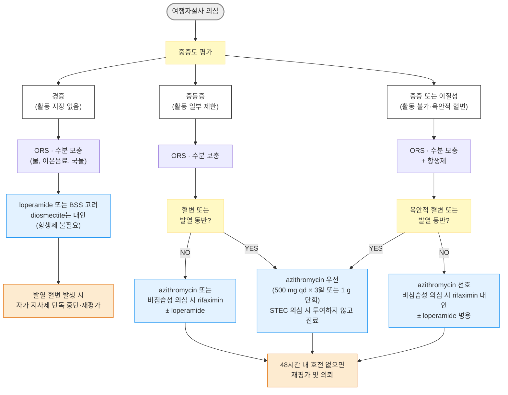

# 여행자설사 Traveler’s Diarrhea

## <mark style="color:green;">일반 사항</mark>

* 여행자설사(TD)는 가장 흔한 여행 관련 질환으로, 고위험 지역을 2주간 여행하는 사람의 약 30\~70%에서 발생할 수 있으며, 체류 초기(첫 1\~2주)에 집중적으로 발생
* 전파 경로 : 대부분 오염된 음식이나 음료수
* 경과 : 세균성은 대부분 3\~7일 내 자연 호전; EAEC 감염이나 바이러스 후 장 과민 상태 등에서는 1\~2주 이상 지속되거나 post-infectious IBS(PI-IBS)로 이행할 수 있음

## <mark style="color:green;">원인 및 위험 인자</mark>

### <mark style="color:orange;">원인균</mark>

<table><thead><tr><th width="105">분류</th><th width="94">빈도</th><th>주요 원인균</th></tr></thead><tbody><tr><td>세균</td><td>75~90%</td><td><em>E. coli</em> (ETEC, EAEC), <em>Campylobacter, Shigella, Salmonella, Aeromonas</em> spp.</td></tr><tr><td>바이러스</td><td>10~25%</td><td>Norovirus, Rotavirus, Astrovirus, Sapovirus</td></tr><tr><td>기생충</td><td>약 10%</td><td><em>Giardia duodenalis, Cryptosporidium, Cyclospora</em></td></tr></tbody></table>

* 바이러스는 10\~25%까지 기여할 수 있으며(multiplex PCR 연구), 구토 우세 증상과 관련. 혼합 감염 및 중복 검출이 가능하므로 위 비율을 단순 합산하지 않음

### <mark style="color:orange;">위험 인자</mark>

* 숙주 요인 : 면역 저하자, 제산성 약물 복용자(PPI, H₂-차단제), 위장관 수술력, 젊은 성인
* 지역 요인 : 더운 기후, 상하수도 및 위생 인프라 미비 지역(사하라이남 아프리카, 남아시아, 중남미)
* 시기 : 여행 초기(특히 첫 1주)에 위험도 최고

## <mark style="color:green;">임상 양상</mark>

### <mark style="color:orange;">병원체별 특징</mark>

<table><thead><tr><th width="153">원인균</th><th width="106">잠복기</th><th>임상 특징</th></tr></thead><tbody><tr><td>ETEC</td><td>6~72시간</td><td>권태감, 식욕 부진, 복통에 이어지는 급격한 수양성 설사</td></tr><tr><td>EAEC</td><td>수일</td><td>수양성 설사가 지속적; 1~2주 이상 연장되는 경우 많음</td></tr><tr><td><em>Campylobacter, Shigella</em></td><td>1~3일</td><td>발열, 이질성 증상(뒤무직, 절박변, 경련성 복통, 혈변)</td></tr><tr><td><em>Salmonella</em></td><td>12~72시간</td><td>오한, 발열, 두통, 근육통 동반; 균혈증 가능</td></tr><tr><td><em>Aeromonas</em> spp.</td><td>1~2일</td><td>수양성 또는 점혈변 설사; 담수 노출력. 중등도 이상이면 감수성 결과에 따라 fluoroquinolone 또는 3세대 cephalosporin 고려</td></tr><tr><td>Norovirus</td><td>12~48시간</td><td>오심·구토가 우세하며 폭발적 집단 발생이 특징; 경과가 짧음(1~3일)</td></tr><tr><td><em>Giardia duodenalis</em></td><td>1~2주</td><td>악취성 지방성 설사, 복부 팽만, 잦은 트림; 수 주~수개월 지속 가능</td></tr><tr><td><em>Cyclospora cayetanensis</em></td><td>2~14일</td><td>수양성 설사가 장기간 지속되며 재발-완화 경과가 특징; TMP/SMX 반응. 위험 지역: 과테말라·아이티·네팔·페루 등</td></tr><tr><td><em>S. aureus·B. cereus (독소형)</em></td><td><em>1~6시간</em> </td><td><em>음식 섭취 직후 폭발적 구토·복통. 발열 대개 없음; 12~24시간 내 자연 호전. 항생제 불필요</em></td></tr></tbody></table>

* 독소형 식중독 감별 : 잠복기가 1\~6시간으로 매우 짧고 구토가 주증상이며 발열이 없으면 세균성 TD보다 _S. aureus_ 또는 _B. cereus_ 독소형을 먼저 의심. 항생제는 불필요하며 수분 보충과 대증 치료로 충분

### <mark style="color:orange;">중증도 분류</mark>

* 경증 : 견딜 만하고 고통스럽지 않으며, 계획된 활동에 지장 없음
* 중등증 : 고통스럽거나 계획된 활동에 지장을 주는 설사
* 중증 : 계획된 활동이 불가능한 설사; 이질성 설사는 모두 중증으로 간주
* 지속성 : 2주 이상 지속 (기생충 감염·PI-IBS 평가 필요)


**이질성 설사(Dysentery)** : 육안적 혈변(grossly bloody stool)이 있는 설사를 말하며, 뒤무직·절박변·경련성 복통·점액변이 동반될 수 있음. 모든 이질성 설사는 중증으로 간주함. 발열성 설사(febrile diarrhea)는 침습성 감염을 시사하지만 이질과 동의어는 아니며, 경험적 항생제가 필요하면 azithromycin을 우선 고려



**Post-infectious IBS (PI-IBS)** : 원인균 소멸 후에도 위장관 증상이 지속되는 상태. 감염 기간이 길고 중증일수록, 여성에서, 심리적 스트레스가 동반된 경우 위험이 높음


### <mark style="color:$danger;">🚩 Red Flags!</mark>

<mark style="color:$danger;">**즉각 평가 또는 응급 이송**</mark>

* 심한 탈수 소견: 의식 저하·혼돈, 빈맥(＞120회/분), 저혈압, 무뇨 또는 핍뇨
* 고열(≥39°C) + 혈변 + 의식 변화의 동시 발생
* 영아·고령자·면역 저하자에서의 급격한 임상 악화
* 복막 자극 징후 : 판상 복부, 반동 압통

<mark style="color:$warning;">**당일 의뢰 또는 긴급 평가**</mark>

* 육안적 혈변 또는 중증 발열성 설사
* 38.5°C 이상의 발열이 48시간 이상 지속
* 중등증 이상 + 면역 저하자, 염증성 장질환자, 인슐린 의존성 당뇨병 환자
* 대증 치료 48시간 후에도 호전 없는 중등증 이상

<mark style="color:$info;">**외래 추적 / 추가 평가 계획**</mark> <mark style="color:$info;">- 즉각 위험 낮으나 호전 없으면 의뢰</mark>

* 귀국 후에도 설사가 2주 이상 지속 → 기생충 감염
* 설사 소실 후 IBS 유사 증상 지속 → PI-IBS
* Norovirus 집단 발생이 의심되는 경우 (유람선, 단체 투어)

## <mark style="color:green;">진단</mark>

* 일반적으로 임상 진단으로 충분하며 추가 검사는 불필요
* 미생물 검사 적응증 : 중증, 혈변 또는 발열성 설사, 면역 저하, 지속성(≥2주), 경험적 치료 실패, 집단 발생 의심
  * 대변 배양, 기생충란·낭포 검사
  * 지속성·만성 증상 : 대변 multiplex PCR 고려
* 혈액 검사 : CBC, 전해질, 신기능 (심한 탈수, 면역 저하자, 중증)

### <mark style="color:orange;">귀국 후 지속 설사 접근법</mark>

<table><thead><tr><th width="188">상황</th><th>우선 고려</th><th>검사</th></tr></thead><tbody><tr><td>설사 &#x3C;14일</td><td>대부분 급성 세균성·바이러스성 TD</td><td>경증은 임상 판단; 중증·혈변·발열·면역 저하·치료 실패 시 대변 검사</td></tr><tr><td>설사 ≥14일 + <br>악취성·지방변·복부팽만</td><td><em>Giardia duodenalis</em></td><td>대변 항원검사 / 기생충란·낭포 / PCR</td></tr><tr><td>재발성 수양성 설사</td><td><em>Cyclospora, Cryptosporidium</em></td><td>대변 PCR 또는 변형 항산성 염색</td></tr><tr><td>혈변·체중 감소 지속</td><td><em>Entamoeba histolytica</em>, IBD, 대장 질환</td><td>대변 PCR·항원검사; 적응 시 대장내시경</td></tr><tr><td>지속성 설사 초기 평가</td><td><em>C. difficile</em> 감염</td><td>항생제 사용 여부와 관계없이 대변 독소검사 / NAAT 포함</td></tr><tr><td>감염 검사 음성 + <br>만성 복통·설사</td><td>일시적 흡수장애, PI-IBS, SIBO, 유당불내증, celiac disease·IBD 등</td><td>증상 기간과 경고 증상에 따라 단계적으로 평가; SIBO 의심 시 수소호기검사 고려</td></tr><tr><td>수인성 노출 후 <br>혈성·점액성 설사 지속</td><td><em>Aeromonas, Vibrio, Yersinia</em></td><td>대변 배양; <em>Aeromonas</em>는 일반 배양에서 검출 가능하며 <em>Vibrio·Yersinia</em>는 검사실에 특수 배양 요청</td></tr></tbody></table>

<p align="center"></p>

***

## <mark style="background-color:yellow;">Management</mark>

### <mark style="color:orange;">치료 원칙</mark>

* 수분 보충이 모든 단계의 1순위 : 경증 설사도 탈수로 악화될 수 있음. ORS(경구 수액), 물, 이온 음료, 국물, 짭짤한 크래커 등으로 즉시 시작. 고령자·소아·트레킹 중·고온 환경에서 특히 중요

<table><thead><tr><th width="88">중증도</th><th width="220">지사제</th><th>항생제</th></tr></thead><tbody><tr><td>경증</td><td>loperamide 또는 bismuth subsalicylate 고려</td><td>권고하지 않음</td></tr><tr><td>중등증</td><td>단독 또는 항생제 병용 고려</td><td>선택적으로 고려; 비침습성 수양성 설사에서는 rifaximin도 대안</td></tr><tr><td>중증</td><td>항생제와 병용 고려; 혈변·발열 시 단독 사용 금지</td><td>항생제 투여 권고(azithromycin 선호)</td></tr></tbody></table>

### <mark style="color:orange;">여행 전후 의료 상담 - 단계별 안내</mark>

1. **Pre-Travel (출국 전) - 여행지 건강 유의사항 설명 및 사전 준비**
   * 여행자설사 발생 가능성과 대처법 충분히 설명
   * 모든 설사에서 안전한 물로 정확히 조제한 경구수액(ORS)의 중요성 설명
   * 여행지 위험도·일정에 따른 비상약 처방 (비상약 키트 위 참조)
   * 발열 또는 혈변 시 azithromycin 우선 원칙을 안내하되, 심한 복통과 혈변·무발열 등 STEC 의심 소견이면 항생제·지사제를 복용하지 말고 즉시 진료
2. **During-Travel (여행 중) - 단계별 자가 관리**
   * 단계별 자가 관리 표 및 알고리듬 참조; 48시간 내 호전되지 않으면 의료기관 방문
3. **Post-Travel (귀국 후) - 지속 증상 처리**
   * 급성 설사 지속 시 지침에 따른 경험적 치료
   * 중증·지속성(≥2주)·치료 실패 : 대변 배양·기생충 검사·PCR
   * 만성·지속성 증상 : 귀국 후 지속 설사 접근법 표 참조

## <mark style="color:green;">비-약물 치료</mark>&#x20;

### <mark style="color:orange;">수분 및 영양 보충</mark>

* 모든 중증도에서 수분 보충이 1순위. 심한 수분 손실에는 포장 ORS를 표시된 양(대개 1 L)의 끓이거나 정수한 물에 정확히 녹여 사용
* 경증에서는 물·이온음료·국물 등 선호 음료로 보충할 수 있으나, 당분이 지나치게 많은 음료는 삼투성 설사를 악화시킬 수 있음
* 심한 탈수, 의식 저하, 쇼크 또는 지속 구토가 있으면 즉시 의료기관에서 평가하고 정맥 수액 고려
* 식사를 불필요하게 제한하지 않으며 견딜 수 있는 규칙적인 식사를 계속

***


```mermaid
graph TD
    A([여행자설사 의심]) --> B[중증도 평가]
    B --> C0["경증<br>(활동 지장 없음)"]--> C["ORS · 수분 보충<br>(물, 이온음료, 국물)"]
    B --> D0["중등증<br>(활동 일부 제한)"]--> D["ORS · 수분 보충"]
    B --> E0["중증 또는 이질성<br>(활동 불가·육안적 혈변)"]--> E["ORS · 수분 보충<br>+ 항생제"]
    C --> C1["loperamide 또는 BSS 고려<br>diosmectite는 대안<br>(항생제 불필요)"]
    C1 --> G["발열·혈변 발생 시<br>자가 지사제 단독 중단·재평가"]
    D --> D1["혈변 또는<br>발열 동반?"]
    D1 -->|NO| D2["azithromycin 또는<br>비침습성 의심 시 rifaximin<br>± loperamide"]
    D1 -->|YES| D3["azithromycin 우선<br>(500 mg qd × 3일 또는 1 g 단회)<br>STEC 의심 시 투여하지 않고 진료"]
    E --> E1["육안적 혈변 또는<br>발열 동반?"]
    E1 -->|YES| D3
    E1 -->|NO| E3["azithromycin 선호<br>비침습성 의심 시 rifaximin 대안<br>± loperamide 병용"]
    D2 --> F["48시간 내 호전 없으면<br>재평가 및 의뢰"]
    D3 --> F
    E3 --> F

style A fill:#eeeeee,stroke:#888888,stroke-width:2px
classDef white fill:#fff,stroke:#333
class C0,D0,E0 white
classDef yellow fill:#fff9c4,stroke:#ffe082
class B,D1,E1 yellow
classDef sky fill:#e3f2ff,stroke:#2196f3
class C1,D2,D3,E3 sky
classDef orange fill:#fdebd0,stroke:#e67e22
class G,F orange
```

<p align="center"><strong>여행자설사 중증도별 치료 알고리듬</strong></p>

* 경증 : 견딜 만하고 고통스럽지 않으며 계획된 활동에 지장을 주지 않는
  &#x20;설사
* 중등증 : 고통이 있거나 계획된 활동에 지장을 주는 설사
* 중증 : 계획된 활동을 할 수 없는 수준의 설사

<p align="center"><em><mark style="color:$info;">Ref. ISTM Guidelines 2017; CDC Yellow Book 2026</mark></em></p>

***

## <mark style="color:green;">약물 치료</mark>

### <mark style="color:orange;">항생제</mark>

* 항생제 사용 여부는 배변 횟수보다 계획된 활동에 미치는 기능적 영향을 기준으로 결정
  * 경증 : 항생제 권고하지 않음
  * 중등증 : 이득과 위해를 고려하여 선택적으로 사용
  * 중증 또는 이질성 설사 : 항생제 권고; azithromycin 선호
  * 발열성 설사 또는 동남아시아 여행 : azithromycin 우선 고려
  * 면역 저하자 또는 중대한 내과 기저질환자 : 더 낮은 문턱으로 평가·치료 고려
* 항생제는 감수성 있는 세균성 TD의 증상 기간을 약 1\~2일 단축하지만, ESBL 생성 장내세균 보균, 장내 미생물 변화 및 <em>C. difficile</em> 감염 위험을 증가시킬 수 있으므로 경증에는 사용하지 않음


**STEC 주의** : 심한 복통과 육안적 혈변, 특히 발열이 없거나 미미한 경우 Shiga toxin-producing <em>E. coli</em> (STEC/O157:H7)를 고려. 소아뿐 아니라 성인에서도 항생제와 장운동억제제가 HUS 위험을 높일 수 있으므로 투여하지 말고 즉시 의료기관에서 평가


#### <mark style="color:$primary;">Macrolide</mark>&#x20;

* 1차 선택 (이질성·발열성·중증·동남아)
* azithromycin : 500 ㎎ qd × 3일, 또는 1 g 단회 <mark style="color:blue;">\[지스로맥스]</mark>
  * 태국 등 Campylobacter 고위험 지역에서 1차 선택제
  * 이질성 또는 발열성 설사 및 중증에서 전반적 선호 항생제
  * 단회 1 g 복용 시 오심이 흔함; 1 g을 같은 날 2회로 나누거나 500 ㎎ qd × 3일 요법을 사용하면 내약성을 높일 수 있음

#### <mark style="color:$primary;">Rifamycin계</mark>&#x20;

* 비침습적(비이질성·비발열성) 수양성 설사에서 제한적으로 고려
* 전신 흡수 거의 없어 안전성 우수
* 발열·혈변·이질성 설사에서 사용하지 않음. 전신 흡수가 거의 없어 <em>Campylobacter, Shigella, Salmonella</em> 등 침습성 병원체에 대한 효과가 제한적
* 여행자가 침습성 여부를 정확히 구분하기 어려워 경험적 단일 비상약으로서 유용성이 제한됨. 복용 중 발열·혈변이 생기면 중단하고 진료 또는 azithromycin 경로로 전환
* rifaximin : 200 ㎎ tid × 3일 <mark style="color:blue;">\[노르믹스]</mark>
* rifamycin SV : 388 ㎎ bid × 3일 (국내 미출시, 해외 가이드라인 옵션; 성인 ≥18세)

#### <mark style="color:$primary;">Fluoroquinolone</mark>&#x20;


현재 azithromycin이 우선 선택되며, rifaximin은 비침습성 설사에서 제한적으로 고려함. <em>Campylobacter·Shigella</em>의 fluoroquinolone 내성이 전 세계적으로 증가 중이며, FDA Black Box Warning(건염·건 파열, QT 연장, 대동맥 파열, 저혈당·정신신경계 이상 등)과 <em>C. difficile</em> 위험 때문에 예방 목적으로 권고하지 않음. 이질성 설사에서도 우선 선택하지 않음


* 대체 옵션 (현재 사용 감소)
* ciprofloxacin : 750 ㎎ 단회, 또는 500 ㎎ bid × 3일 <mark style="color:blue;">\[씨프로바이]</mark>
* levofloxacin : 500 ㎎ qd × 1\~3일 <mark style="color:blue;">\[크라비트]</mark>
* ofloxacin : 400 ㎎ bid × 1\~3일 <mark style="color:blue;">\[타리비드]</mark>


TMP/SMX, doxycycline은 내성률이 높아 현재 권고하지 않음.


#### <mark style="color:$primary;">지역별 추천 항생제</mark>

<table><thead><tr><th width="163">여행 지역·상황</th><th width="187">특징 병원체</th><th>치료 원칙</th></tr></thead><tbody><tr><td>동남아시아 <br>(태국 포함)</td><td><em>Campylobacter</em> (FQ 내성 높음)</td><td>azithromycin <strong>우선</strong></td></tr><tr><td>남아시아 <br>(인도, 파키스탄 등)</td><td>FQ 내성 <em>Campylobacter, Shigella</em> 등</td><td>azithromycin 우선 고려</td></tr><tr><td>중남미·아프리카</td><td>ETEC 등</td><td>중증도와 침습성 여부에 따라 azithromycin; 비침습성 수양성 설사에 rifaximin 대안</td></tr><tr><td>유람선·단체 투어</td><td>Norovirus (집단 발생)</td><td>항생제 불필요; 수분 보충·감염관리</td></tr><tr><td>장기 여행·<br>지속성 설사</td><td><em>Giardia, Cyclospora, Cryptosporidium</em> 등</td><td>검사 후 표적 치료; <em>Giardia</em>는 metronidazole/tinidazole, <em>Cyclospora</em>는 TMP/SMX</td></tr></tbody></table>

### <mark style="color:orange;">장 운동 조절제</mark>

* loperamide : 처음 4 ㎎, 이후 설사 시마다 2 ㎎, 최대 16 ㎎/일 <mark style="color:blue;">\[로프민]</mark>
  * 경증에서 단독 고려; 중증에서는 항생제에 병용하는 방식으로 고려
  * 혈변 또는 설사와 발열이 동반되면 단독 사용하지 않음. 적절한 항생제와 병용하는 경우에는 일부 성인에서 고려 가능하나, STEC 의심 시에는 병용도 피함
  * 복용 후 복통 발생·증상 악화·1\~2일 내 반응 없으면 즉시 중단
  * 처방 용량은 최대 16 ㎎/일. 여행 중 자가 치료 키트에서는 국내 일반의약품 용량에 맞춰 최대 8 ㎎/일(4캡슐)로 보수적으로 제한 가능
* racecadotril : 100 ㎎ tid × 3\~5일 <mark style="color:blue;">\[하이드라섹]</mark> (비급여; TD 표준 권고 약제는 아니며 선택적으로 사용)
  * 순수 항분비 작용(엔케팔린 분해 억제); 장 운동 억제 없음
  * loperamide보다 변비가 적을 수 있으나 세균 배출에 미치는 영향과 TD에서의 근거는 제한적
  * 소아는 연령·체중별 제형과 용량을 별도로 확인. ACE 억제제 병용 시 혈관부종 위험에 주의
* cimetropium : 50 ㎎ tid <mark style="color:blue;">\[알기론]</mark>
* tiropramide : 100 ㎎ bid\~tid <mark style="color:blue;">\[티로파]</mark>
* phloroglucinol : 160 ㎎ tid <mark style="color:blue;">\[후로스판]</mark>

### <mark style="color:orange;">항구토제</mark>

* 구토로 수분 섭취가 어려운 경우 구강붕해정(ODT) 형태의 항구토제를 제한적으로 고려할 수 있으나, 급성 감염성 설사·TD에는 허가 외 사용이며 QT 연장 위험과 병용 약물을 확인
* ramosetron ODT : 0.1 ㎎ prn <mark style="color:blue;">\[나제아오디정]</mark> (허가 외; 국내 허가 용법과 환자별 위험 확인)
* ondansetron ODT : 4\~8 ㎎ prn <mark style="color:blue;">\[조프란 구강붕해정]</mark> (허가 외)


ODT는 입에서 녹지만 삼킨 뒤 흡수되므로 지속 구토 시 투여가 보장되는 제형은 아님. 반복 구토, 탈수 또는 약물을 유지하지 못하면 반복 복용하지 말고 의료기관 방문


### <mark style="color:orange;">흡착제</mark>

* bismuth subsalicylate (BSS) : 525 ㎎(262 ㎎ 제형 2정 또는 현탁액 30 ㎖)을 30\~60분마다 필요 시 복용, 최대 8회/일 × 1\~2일 <mark style="color:blue;">\[펩토무스현탁액]</mark> (525 ㎎/30 ㎖)
  * 부작용 : 오심, 변비, 혀·변이 검게 변함
  * 주의 : aspirin 알레르기, 신 기능 저하, 통풍, 항응고제·salicylate·probenecid·methotrexate 복용자, 임신부. 바이러스 감염이 의심되는 18세 이하에서는 Reye 증후군 위험 때문에 피함
* diosmectite : 3 g tid, 식간 복용 <mark style="color:blue;">\[스타빅]</mark> (24개월 이상 허가)
  * 다른 약물의 흡수를 방해할 수 있으므로 2시간 이상 간격을 둠. TD 예방 목적으로는 권고하지 않음

## <mark style="color:green;">예방</mark>

### <mark style="color:orange;">음식 / 음료</mark>

* 수질이 불확실한 지역에서는 끓이거나 적절히 처리한 물, 밀봉된 생수를 마시고 양치질에도 안전한 물 사용
* 밀봉 확인 후 음료수 섭취; 마개가 깨진 병은 마시지 않는다
* 위생 가공처리 안 된 우유·유제품 섭취 금지
* 껍질 벗기지 않은 과일·채소 금지; 가능한 한 직접 껍질을 벗긴다
* 익히지 않은 채소·샐러드 주의; 생고기·덜 익은 고기·어패류 금지
* 방금 조리된 뜨거운 음식 선택; 뷔페 음식 특히 주의
* 얼음은 정수된 물로 만든 것이 확인된 경우에만 사용
* 거리 음식은 충분히 익혀 주문 즉시 뜨겁게 제공되는 경우에 한해 선택하고, 상온에 오래 둔 음식은 피함


음식·음료 선택과 손 위생은 위험을 줄이지만 식당의 조리 위생과 지역 기반시설 문제까지 통제할 수 없어 TD를 완전히 예방하지는 못함


### <mark style="color:orange;">위생</mark>

* 식사 전·배변 후 비누와 물로 20초 이상 손 씻기. 물과 비누가 없으면 알코올 60% 이상 손 소독제를 보조적으로 사용하되 norovirus에는 효과가 낮아 손 씻기를 대체하지 못함
* 수질이 불확실한 호수·강·수영장에서 물을 삼키지 않으며, 설사 중에는 공용 물놀이 시설 이용을 피함

### <mark style="color:orange;">예방적 항생제</mark>


**최신 가이드라인 방향** : 예방적 항생제보다 증상 발생 시 조기 자가치료 전략이 선호됨. 위생 수칙과 적절한 비상약 휴대를 우선하고, 예방적 항생제는 면역 저하자 또는 중대한 기저질환이 있는 고위험 지역 단기 여행자에서 이득과 위해를 개별 평가하여 드물게 고려


* 일반 여행자에게 예방적 항생제 권고하지 않음
* 고려 대상 : 면역 저하자 또는 중대한 내과 기저질환이 있는 고위험 지역 단기 여행자에서 이득과 위해를 개별 평가하여 드물게 고려
* 선택 약제 : rifaximin 또는 rifamycin SV 고려; 침습성 병원체에는 예방 효과가 없음을 설명
  * Fluoroquinolone 예방적 사용은 권고하지 않음 : <em>Campylobacter·Shigella</em>의 내성률 상승, 중대한 이상반응과 <em>C. difficile</em> 감염 위험 때문(CDC Yellow Book 2026)
* Prebiotics/Probiotics : 예방 효과에 대한 자료가 불충분하여 권고하지 않음


**경구 콜레라 백신과 TD** : CTB 함유 경구 콜레라 백신(Dukoral)은 LT-ETEC에 대한 단기간 교차 보호 가능성이 보고되었으나 전체 TD 예방효과는 제한적이며, TD 예방만을 목적으로 일률적으로 권고하지 않음. 콜레라 백신은 실제 콜레라 노출 위험과 국내 허가·공급 상태에 따라 판단


**여행 중 비상약 전략**&#x20;

* 항생제 비상약은 여행 지역·기간, 기저질환 및 의료 접근성을 고려하여 선별 처방. 두 종류를 휴대하는 경우 각각의 사용 기준을 명확히 교육
  * azithromycin : 중증, 발열성 또는 이질성 설사, 또는 동남아 여행 시
  * rifaximin : 열·혈변 없는 수양성 설사용 (비이질성)
* 한 가지 항생제만 휴대한다면 azithromycin이 대부분의 세균성 상황에 대응 가능하나, STEC 의심 소견에는 복용하지 않고 진료

#### <mark style="color:$primary;">단계별 자가 관리 (여행 중)</mark>

<table><thead><tr><th width="61">단계</th><th width="230">상황</th><th>조치</th></tr></thead><tbody><tr><td><strong>1</strong></td><td>경증 수양성 설사, 활동 가능</td><td>수분 보충 우선; loperamide 또는 bismuth subsalicylate 고려; 항생제 불필요</td></tr><tr><td><strong>2</strong></td><td>중등증, 활동 제한, 열·혈변 없음</td><td>항생제 선택적으로 고려; azithromycin 또는 비침습성으로 판단되면 rifaximin; loperamide 병용 가능</td></tr><tr><td><strong>3</strong></td><td>발열성 설사 또는 이질성 설사(육안적 혈변)</td><td>azithromycin 우선; loperamide 단독 사용 금지. 심한 복통+혈변·무발열이면 STEC 가능성 때문에 항생제·지사제 없이 즉시 진료</td></tr><tr><td><strong>4</strong></td><td>24~48시간 항생제 후 미호전, 심한 탈수·지속 구토</td><td>즉시 의료기관 방문; 정맥 수액·대변 검사 고려</td></tr><tr><td><strong>5</strong></td><td>귀국 후 2주 이상 지속</td><td>기생충·<em>C. difficile</em> 및 감염 후·기저 위장관질환 평가</td></tr></tbody></table>

### <mark style="color:orange;">여행 전 비상약 키트 준비 (출국 전 처방 준비)</mark>

<table><thead><tr><th width="186">품목</th><th>용도</th></tr></thead><tbody><tr><td>휴대용 ORS 파우치</td><td>탈수 방지·치료(1순위); 정확한 조제용 물의 양 확인</td></tr><tr><td>loperamide</td><td>경증·비이질성 설사 조절; 발열·혈변 시 단독 사용 금지</td></tr><tr><td>azithromycin</td><td>중증, 이질성 또는 발열성 설사; 동남아 여행 시 우선</td></tr><tr><td>rifaximin</td><td>선별된 여행자에서 비침습성 수양성 설사의 대안; 발열·혈변 시 사용 금지</td></tr><tr><td>항구토제 ODT</td><td>선별된 환자에서 제한적으로 고려(허가 외 사용과 QT 위험 설명)</td></tr><tr><td>체온계</td><td>발열 여부와 중증도 판단</td></tr><tr><td>알코올 손 소독제</td><td>비누·물이 없을 때 보조적으로 사용</td></tr><tr><td>diosmectite</td><td>선택적 대증 치료; 다른 약물과 2시간 이상 간격</td></tr></tbody></table>

***

### <mark style="color:red;">질병코드</mark>

* **A09.0** 기타 및 상세불명의 감염성 기원의 위장염 및 결장염 (감염성 여행자설사에서 일반적으로 고려)
* **A09.9** 상세불명 기원의 위장염 및 결장염 (감염성 기원이 불명확한 경우)
* **A04.1** 장독소성 대장균 장염 (확진된 ETEC)
* **A04.4** 기타 장대장균 장염 (확진된 EAEC)
* **A04.5** 캄필로박터 장염
* **A03** 세균성 이질 (Shigella)
* **A02.0** 살모넬라 장염
* **A07.1** 지아르디아증 (Giardiasis)

***

## <mark style="color:purple;">처방례</mark>

> **처방례 1. 경증 (비이질성, 바이러스성 또는 독소형 의심)**
>
> ```
> 로프민 2 ㎎/캡슐        처음 2캡슐, 이후 설사 시마다 1캡슐 (자가 치료 시 최대 4캡슐/일)
> 스타빅 현탁액 3 g/포    1포   tid   (식간; 다른 약과 2시간 이상 간격)
>
> ✚ 구토가 심해 약을 삼키기 어려울 때:
> 나제아 OD정 0.1 ㎎/정   1정   prn   (혀 위에 녹여 복용)
> ```
>
> _✽ 경증에서는 항생제 불필요. 독소형(잠복기 1\~6시간, 발열 없음)은 대증 치료만으로 충분. 진경제·흡착제는 증상에 따라 선택적으로 사용. 나제아 OD정은 이 적응증에 허가 외 사용. 발열·혈변 발생 시 지사제 단독 복용을 중단하고 처방례 3 또는 의료기관 평가로 전환._

> **처방례 2. 중등증 (비이질성 세균성, 열·혈변 없음)**
>
> ```
> 노르믹스 200 ㎎/정      1정   tid   × 3일
> 티로파 100 ㎎/정        3정   #3
> 스타빅 현탁액 3 g/포    1포   tid   (식간)
> ```
>
> _✽ 발열·혈변 없는 비침습성 중등증에서 rifaximin을 대안으로 고려. 침습성 여부를 확실히 구분하기 어려우므로 동남아(태국 포함) 여행자 또는 단일 비상약 전략에서는 처방례 3의 azithromycin을 우선 고려. 복용 중 발열·혈변이 생기면 즉시 중단하고 재평가._

> **처방례 3. 중증·이질성 또는 발열성 설사 (또는 동남아 여행)**
>
> ```
> 지스로맥스 500 ㎎/정    1정   qd   × 3일   (오심 심한 경우 표준 3일 요법 권장)
> 티로파 100 ㎎/정        3정   #3
> 스타빅 현탁액 3 g/포    1포   tid   (식간)
>
> ✚ 구토가 심해 약을 삼키기 어려울 때:
> 나제아 OD정 0.1 ㎎/정   1정   prn   (혀 위에 녹여 복용 후 항생제 복용)
> ```
>
> _✽ 1 g 단회 요법은 편리하나 오심이 흔하므로 1 g을 같은 날 2회로 나누거나 500 ㎎ qd × 3일 요법을 선택할 수 있음. 나제아 OD정은 이 적응증에 허가 외 사용. 혈변 또는 발열성 설사에서 loperamide 단독 사용 금지. 심한 복통과 혈변이 있으면서 발열이 없거나 미미하면 STEC 가능성 때문에 항생제·지사제를 복용하지 말고 즉시 진료. 24\~48시간 내 호전 없으면 의료기관 방문._

> **처방례 4. 비상약 (출국 전 처방, 여행 중 자가 치료용)**
>
> ```
> ■ 비이질성 수양성 설사용 (발열·혈변 없을 때)
> 노르믹스 200 ㎎/정      1정   tid   × 3일   (필요시)
> 로프민 2 ㎎/캡슐        처음 2캡슐, 이후 1캡슐 (자가 치료 시 최대 4캡슐/일)
>
> ■ 중증·이질성 또는 발열성 설사용 (또는 동남아 여행 시 우선)
> 지스로맥스 500 ㎎/정    1정   qd   × 3일
>
> ■ 구토가 심해 약을 못 삼킬 때
> 나제아 OD정 0.1 ㎎/정   1정   prn   (혀 위에 녹여 복용)
> ```
>
> _✽ 일반 자가 판단 기준은 “발열 또는 육안적 혈변 → azithromycin 우선”이나, 심한 복통+혈변·무발열 등 STEC 의심 소견이면 항생제와 loperamide를 복용하지 말고 즉시 진료. 나제아 OD정은 이 적응증에 허가 외 사용. 자가 치료 환경에서 loperamide는 최대 4캡슐/일로 제한. rifaximin 복용 중 발열·혈변 발생 시 중단하고 재평가._

***

### <mark style="color:$success;">핵심 복약 지도</mark>

**loperamide (로프민)**

* 처음 4 ㎎(2캡슐), 이후 묽은 변이 있을 때마다 2 ㎎(1캡슐) 추가; 처방 시 하루 최대 8캡슐
* **여행 중 자가 치료 시에는 안전을 위해 하루 최대 4캡슐(8 ㎎)로 제한**하고, 복통이 심해지거나 호전이 없으면 즉시 중단
* **발열이 있거나 혈변이 나오면 단독 복용을 피한다**; 항생제(azithromycin)와 병용하는 경우에 한해 주의하며 사용 가능

**rifaximin (노르믹스)**

* 식사와 무관하게 하루 3번 복용; 3일 처방이 기본
* 전신 흡수가 거의 없어 전신 부작용이 드물다
* **발열·혈변이 생기면 즉시 복용 중단하고 azithromycin으로 전환**

**azithromycin (지스로맥스)**

* 500 ㎎씩 3일 복용(표준 요법) 또는 1 g(2정) 단회 복용; 오심 예방을 위해 식후 복용 권장
* 1 g 단회 복용은 오심이 흔하므로 1 g을 같은 날 2회로 나누거나 500 ㎎ qd × 3일 요법을 선택할 수 있음
* QT 연장 위험 약물(항부정맥제, 항정신병약 등) 복용 중인 환자는 복용 전 의사 확인

**ramosetron ODT (나제아 OD정)**

* 혀 위에 올려 침으로 녹여 삼킨다; 물 없이 복용 가능
* 구토가 가라앉으면 다른 경구 약물을 복용한다
* 심한 구토로 탈수가 우려되면 즉시 의료기관 방문

**diosmectite (스타빅 현탁액)**

* 제품별 복용법에 따라 복용
* 다른 약물 흡수를 방해할 수 있으므로 복용 간격을 2시간 이상 두기
* 변비가 생길 수 있으며, 이 경우 복용 횟수를 줄인다

***

### <mark style="color:blue;">환자 안내서</mark>

**여행자설사 - 여행을 떠나기 전 꼭 알아두세요**

**여행자설사란?**\
위생 기반시설이 불충분한 고위험 지역을 여행할 때 오염된 음식이나 물을 통해 세균·바이러스 등에 감염되어 설사가 생기는 것입니다. 2주 여행 시 약 30\~70%에서 발생할 수 있는 흔한 여행 관련 질병입니다. 대부분 3\~7일 안에 저절로 낫지만, 일부에서는 1\~2주 이상 지속될 수 있습니다.

***

**이런 증상이 생기면 즉시 병원으로 가세요** 🚨

* 변에 **피**가 섞여 나온다
* **38.5°C 이상의 고열**과 설사가 함께 있다
* 물을 마셔도 소변이 8시간 이상 안 나온다 (탈수 위험)
* 의식이 흐릿하거나 심하게 어지럽다
* 48시간 이상 치료해도 좋아지지 않는다

***

**음식과 물 주의사항**

✅ 끓인 물이나 밀봉된 생수만 마시세요\
✅ 과일은 직접 껍질을 벗겨 드세요\
✅ 방금 조리된 뜨거운 음식을 드세요\
❌ 얼음·샐러드·길거리 음식·날 음식은 피하세요\
❌ 뷔페 음식은 특히 조심하세요

***

**설사가 생겼을 때**

1. **수분을 충분히** 보충하세요. 포장 ORS(경구수액)는 표시된 양의 안전한 물에 정확히 녹이세요. 경증에는 물·이온음료·국 등도 이용할 수 있지만 지나치게 단 음료는 많이 마시지 마세요\
   _(고령자·만성질환자·더운 날씨일수록 탈수가 빨리 진행됩니다)_
2. **발열도 없고 혈변도 없는 경증**이면 지사제(로프민)를 드셔도 됩니다\
   _(여행 중 자가 복용 시에는 하루 4캡슐까지만)_
3. **발열이나 육안적 혈변이 있으면** 지사제를 단독으로 드시지 마세요. 미리 처방받은 비상용 항생제의 사용 지침을 따르세요. 다만 심한 복통과 혈변이 있으면서 열이 없거나 약하면 항생제와 지사제를 먹지 말고 즉시 병원으로 가세요
4. 구토가 계속되어 물이나 약을 유지할 수 없으면 구강붕해정을 반복해서 복용하지 말고 의료기관을 방문하세요
5. 귀국 후에도 2주 이상 설사가 계속되면 기생충뿐 아니라 <em>C. difficile</em> 감염과 다른 위장관질환 평가를 위해 병원을 방문하세요

***

**손 씻기 꼭 하세요!** 🧼 식사 전·화장실 후에는 비누와 물로 20초 이상 손을 씻으세요. 물과 비누가 없으면 알코올 60% 이상 손 소독제를 사용할 수 있지만, norovirus에는 효과가 낮아 손 씻기를 대신하지 못합니다.
