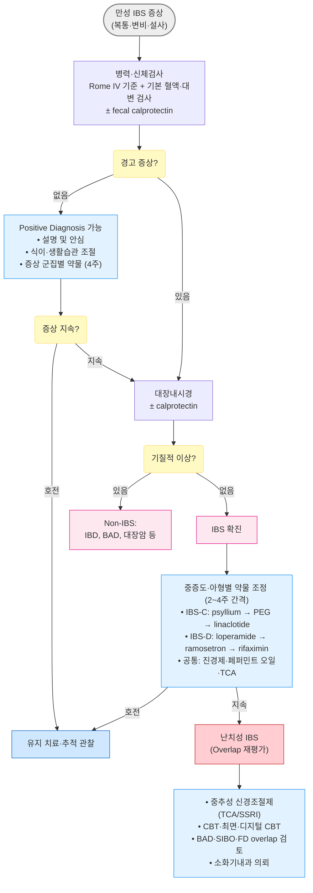
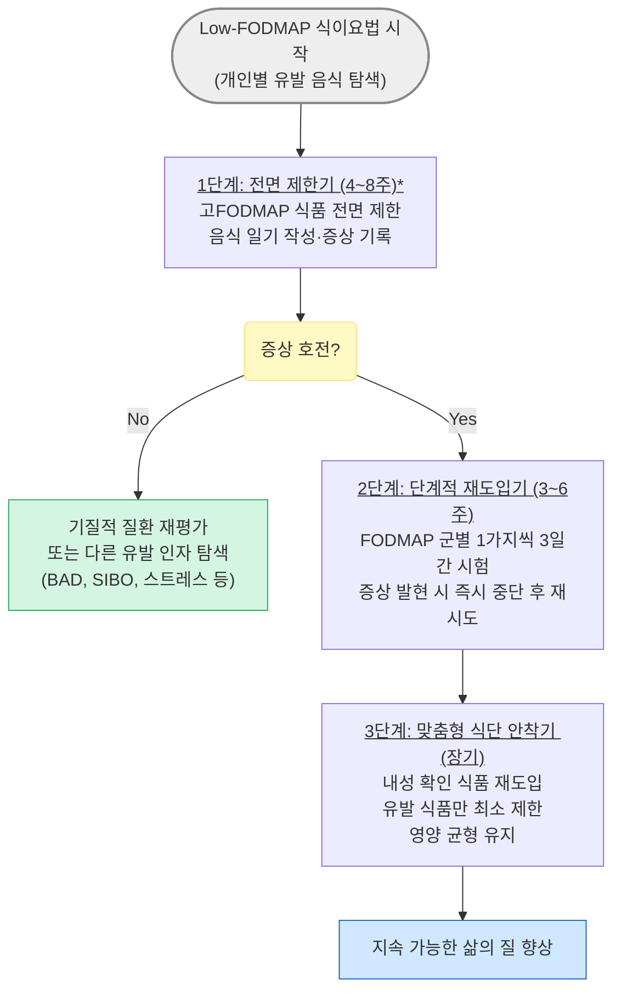

# 과민대장증후군 Irritable Bowel Syndrome

## <mark style="color:green;">일반 사항</mark>

* 구조적 또는 생화학적 이상 없이 복부 불편/통증, 복부 팽만, 변비 및/또는 설사를 포함한 다양한 하부 위장관 증상의 호전과 악화가 반복되는 장 기능의 만성 이상
* 흔히 다른 기능적/정신적 질환 동반&#x20;
  * 동반 증상: 소화불량, 가슴쓰림, 흉통, 피로, 근육통, 섬유근육통, 두통/편두통, 수면장애, 우울, 불안, 신체형장애, 요통, 비뇨기계 증상(빈뇨, 절박뇨, 성교통)
* 빈도 : \[미국] 7\~16%; 보통 10대 후반\~20대 초반에 시작; 여성에서 흔함(남성의 1.5\~2배)
* 병태생리 : 단일 인자가 아닌 복합 기전 - 내장 과민성, 대장 운동 이상, 장-뇌 축(gut-brain axis) 교란, 장내 미생물 불균형(gut dysbiosis), 점막 저등급 염증(mast cell 활성화), 중추 감작

### <mark style="color:orange;">분류 (Rome IV 기준)</mark>

* Bristol 변 형태 척도(BSFS) 기반으로 분류; 최소 2주 관찰 후 결정; 우세 아형은 시간 경과에 따라 바뀔 수 있음

<table><thead><tr><th width="118">아형</th><th width="231">정의 (비정상 배변 비율)</th><th>임상 특징</th></tr></thead><tbody><tr><td><strong>IBS-D</strong><br>(설사 우세형)</td><td>무른 변(BSFS 6~7) ＞¼ AND 굳은 변(BSFS 1~2) ＜¼</td><td>적은 양의 무른 변, 잔변감, 잦은 배변 시도; 야간 배변은 드묾; 남성에서 많음</td></tr><tr><td><strong>IBS-C</strong><br>(변비 우세형)</td><td>굳은 변(BSFS 1~2) ＞¼ AND 무른 변(BSFS 6~7) ＜¼</td><td>과도한 힘주기, 배변 후 잔변감; 여성에서 많음</td></tr><tr><td><strong>IBS-M</strong><br>(혼합형)</td><td>굳은 변 ＞¼ AND <br>무른 변 ＞¼ 모두 해당</td><td>설사와 변비가 교대; 예측 불가 양상</td></tr><tr><td><strong>IBS-U</strong><br>(미분류)</td><td>IBS 진단 기준을 충족하나 <br>특정 아형으로 분류 불가</td><td>변의 이상이 드물다고 호소; 기능성 복통이 주증상</td></tr></tbody></table>

<figure><figcaption><p><strong>Bristol stool form scale (BSFS)</strong></p></figcaption></figure>

### <mark style="color:orange;">동반 질환 및 Overlap Syndrome</mark>

* IBS는 다른 기능성 위장관 질환 및 전신 질환과 중복(overlap) 되는 경우가 매우 흔함; 동반 이환이 있을수록 증상 부담과 의료 이용률이 높음
  * Overlap 환자에서는 상부위장관 증상과 하부위장관 증상을 함께 평가하고 정신사회적 요인에 대한 통합 접근이 필요함
* 상부 GI 질환 : 기능성 소화불량(가장 흔함. IBS 환자의 약 30\~40%에서 동반), GERD
* 전신 기능성 질환 : 섬유근육통, 만성 피로 증후군, 두통/편두통, 간질성 방광염
* 자율신경 질환 : 기립성 빈맥 증후군, 과호흡 증후군
* 정신건강 질환 : 불안 장애·우울장애 (IBS 환자의 40\~60%에서 동반), 신체화 장애

## <mark style="color:green;">원인 및 위험 인자</mark>

* 원인 불명; gut-brain interaction 이상이 핵심 기전으로 추정
* 단일 인자가 아닌 복합 기전이 관여

### <mark style="color:orange;">추정 기전</mark>

* 유전적 소인
* 중추 신경계의 통증 처리 과정 교란 (central sensitization)
* 내장 과민성 (visceral hypersensitivity) : 정상 장 자극에 대한 과도한 통증 반응
* 대장 운동성 이상
* 장내 미생물 불균형 (gut dysbiosis) 및 장 투과성 증가
* 점막 저등급 염증 (mast cell 활성화, serotonin 과분비)
* 소장 세균 과증식 (SIBO) - 일부 IBS-D에서 관련성 보고 (논란)
* 담즙산 흡수 장애 (bile acid malabsorption, BAD) : IBS-D 환자의 상당수가 BAD phenotype에 해당할 수 있음; 식후 급박변·담낭절제술 병력·아침 설사가 두드러지면 의심
* 감염 후 IBS (post-infectious IBS, PI-IBS) : 급성 위장관 감염 후 약 5\~10%에서 발생; 설사 우세형(IBS-D)과 연관이 많으며 수년 이상 지속 가능
  * 원인균 : _Campylobacter_, _Salmonella_, _Shigella_, 노로바이러스 등
  * COVID-19 : 감염 환자의 약 10\~15%에서 장기적인 위장관 증상(post-COVID GI syndrome)이 보고됨; 저등급 점막 염증 및 장-뇌 축 교란이 PI-IBS와 유사한 기전을 공유

### <mark style="color:orange;">위험 인자</mark>

* 발효성 탄수화물(FODMAP) 식품, 지방식, 알코올, 카페인
* 급성 위장관 감염 이력
* 월경
* 정신적 스트레스, 불안, 우울
* 낮은 사회경제적 상태
* 항생제 사용 이력 (장내 미생물 불균형 유발)

## <mark style="color:green;">임상 양상</mark>

* 복통 : 하복부, 다양한 강도(때로 경련성); 간헐적·주기적; 깨어 있는 동안, 주로 아침이나 식후 발생; 배변 후 호전(일부에서는 배변 후 악화)
* 설사, 변비, 또는 설사-변비 교대; 설사 시 보통 양이 많지 않음
* 소화불량, 상복부 불편, 구역, 속쓰림, 복부 팽창, 방귀
* 배변 시 긴장(힘주기), 절박변, 불완전한 배변감
* 두통, 피로, 설명할 수 없는 근육통/관절통, 성교통

### <mark style="color:$danger;">🚩 Red Flags!</mark>

<mark style="color:$danger;">**즉각 조치 또는 응급 의뢰**</mark>

* 혈변 또는 직장 출혈 (육안적)
* 진행성 심한 복통 (장폐쇄·천공·장간막 허혈 의심)
* 발열·오한을 동반한 급성 심한 설사 (감염성 대장염, _C. difficile_ 의심)

<mark style="color:$warning;">**당일 또는 조기 의뢰**</mark>

* 야간 설사 또는 야간 복통으로 수면 장애 → 기질적 질환
* 공복 시(48시간 이상 금식 후) 지속되는 설사 → 분비성 설사·기질적 원인
* 지사제에 반응하지 않는 설사
* 설명할 수 없는 발열
* 복부 종괴 또는 림프절 종대

<mark style="color:$info;">**외래 추적 / 추가 평가 계획**</mark> <mark style="color:$info;">- 즉각 위험 낮으나 호전 없으면 의뢰</mark>

* ≥50세에서 처음 발생한 IBS 증상 → 대장암&#x20;
* 설명할 수 없는 체중 감소
* 원인 불명의 철결핍빈혈
* 대장암·IBD·폴립증·셀리악병의 개인력 또는 가족력
* 2\~4주 경험적 치료에 반응 없음
* 흡수 장애 또는 지방변

## <mark style="color:green;">진단</mark>


**"IBS는 적극적(positive) 진단이 가능한 질환이다."** IBS는 반드시 광범위한 검사로 모든 기질적 질환을 배제한 후에만 진단하는 '배제 진단'이 아니며, 'Rome IV 기준 충족 + alarm signs  없음 + 제한적 혈액·대변 검사 정상' 시 적극적으로 진단 가능 (2025 서울 컨센서스 포함 국제 지침에서 강조됨)


* 특이 진단 검사법 없음; 실험실 검사는 정상
* 환자의 불안감 해소를 위한 검사는 고려하되 과잉 검사 지양 - 불필요한 반복 영상·내시경 검사는 환자 불안을 강화하고 의료 이용을 증가시킬 수 있음
* 경고 징후 없이 기본 검사가 정상이면서 진단 기준에 부합하면 진단 가능
* 다음 상태 배제 : 복부 종괴, 장폐쇄 징후, Carnett sign 양성 (복부 근육 긴장 시 통증 증가 → 복벽 통증 시사)

### <mark style="color:orange;">진단 기준 \[Rome IV, 2016]</mark>

* 발생한 지 최소 6개월 되었고 최근 3개월간 다음 기준을 충족; 다음 중 ≥2개와 관련되는, 평균 ≥1일/주 발생하는 재발성 복통
  1. 배변과 관련
  2. 배변 빈도의 변화와 관련
  3. 대변 형태(모양)의 변화와 관련

### <mark style="color:orange;">검사</mark>

* CBC, ESR, CRP, TFT, 대변 검사(기생충·세균·잠혈), tissue transglutaminase IgA (셀리악병 배제)
* Fecal calprotectin : IBD vs IBS 감별을 위한 비침습적 1차 triage 검사
  * calprotectin : neutrophil에서 분비되는 단백질. 염증이 있을 때 장 점막으로 유출되어 대변에 존재하게 됨. 대변에서의 농도는 염증 정도를 반영

<table><thead><tr><th width="152">Calprotectin 수치</th><th>해석 및 처치</th></tr></thead><tbody><tr><td>&#x3C;50 μg/g</td><td>IBD 가능성 낮음; 임상 상황에 따라 추가검사 없이 관찰 가능</td></tr><tr><td>50~150 μg/g</td><td>IBD 배제 불충분; 2~4주 후 재검 또는 임상 상황에 따라 대장내시경 고려</td></tr><tr><td>>150 μg/g</td><td>IBD 강력 의심; 대장내시경 시행</td></tr></tbody></table>

* 대장내시경 : 연령별 국가 대장암 선별 권고에 따라 시행 고려 (한국 국가암검진: 만 50세부터 분변잠혈검사, 이상 시 대장내시경), 경고 징후 있거나 IBD 의심 시 시행.
  * 변비 우세형이 아닌 IBS 환자에서 대장암은 관찰되지 않고 <2%에서 IBD가 발견된다는 보고
* GI 기능 평가 (선택적 시행)
  * 변비 : colon transit time, anorectal manometry, balloon expulsion test
  * 설사 : 대변 배양, serial colonic biopsy, 48-h fecal bile acid excretion, serum 7α-C4 (BAD 선별; FGF19와 함께 활용 증가), fecal calprotectin/lactoferrin, lactose/glucose breath test (SIBO)

### <mark style="color:orange;">감별</mark>

#### <mark style="color:$primary;">IBS vs IBD vs 대장암 감별</mark>

<table><thead><tr><th width="165">감별 특징</th><th width="146" align="center">IBS</th><th width="146" align="center">IBD</th><th width="89" align="center">대장암</th></tr></thead><tbody><tr><td>야간 증상</td><td align="center">드묾</td><td align="center">흔함</td><td align="center">가능</td></tr><tr><td>체중 감소</td><td align="center">드묾</td><td align="center">흔함</td><td align="center">흔함</td></tr><tr><td>혈변</td><td align="center">없음</td><td align="center">흔함</td><td align="center">가능</td></tr><tr><td>CRP / ESR</td><td align="center">정상</td><td align="center">상승</td><td align="center">다양</td></tr><tr><td>Fecal calprotectin</td><td align="center">정상 (&#x3C;50 ㎍/g)</td><td align="center">상승 (>150 ㎍/g)</td><td align="center">다양</td></tr><tr><td>배변 후 통증</td><td align="center">호전</td><td align="center">다양</td><td align="center">다양</td></tr></tbody></table>

#### <mark style="color:$primary;">기타 감별 질환</mark>

<table><thead><tr><th width="190">질환</th><th>감별 단서</th></tr></thead><tbody><tr><td>셀리악병 (gluten enteropathy)</td><td>만성 설사, 성장 장애, 피로, 빈혈, 골 통증, 구내염; 글루텐(밀·보리) 섭취 후 설사; tTG-IgA 양성</td></tr><tr><td>Lactose intolerance</td><td>유제품 섭취와 관련한 복부 팽만, 설사</td></tr><tr><td>Bile acid diarrhea (BAD)</td><td>식후 급박변, 담낭절제술 병력, 아침 설사; serum 7α-C4 상승; cholestyramine 시험 치료 반응으로 확인</td></tr><tr><td>Microscopic colitis</td><td>고령에서 만성 수양성 설사; 자가면역 질환(관절통·갑상선질환·건선·쇼그렌) 동반 가능; 대장내시경 육안 정상 → 조직검사로 확진</td></tr><tr><td>SIBO (소장 세균 과증식)</td><td>소화 장애, 흡수 장애; glucose breath test 양성</td></tr><tr><td>Diverticulitis</td><td>좌측 복통, 발열, 좌하복부 압통/종괴</td></tr><tr><td>자궁내막증</td><td>주기적 하복부 통증 (월경 주기 연관)</td></tr><tr><td>난소암</td><td>≥40세 여성; 복부 팽만, 절박뇨, 골반통; CA-125 상승</td></tr><tr><td>정신사회적 문제</td><td>우울, 불안, 신체형장애 - IBS와 공존하거나 유발 인자로 작용</td></tr></tbody></table>

***

## <mark style="background-color:$warning;">Management</mark>

### <mark style="color:orange;">치료 원칙</mark>

* 모든 환자에게 효과적인 단일 요법은 없음 - 증상 아형 + 증상 군집 + 중증도에 따른 맞춤 치료 선택
* 안심 및 교육 : 치명적 질환이 아니며 증상 조절이 가능함을 설명; 의사-환자 신뢰 형성이 치료의 출발점
* 생활습관 중재 (1차) : 식이 조절, 규칙적 운동, 스트레스 관리
* 약물 치료 : 비-약물 치료로 해결되지 않는 경우 아형별 보조 치료
* 장-뇌 축 치료 : 인지행동 치료(CBT), 최면 치료, 심리 치료 - 중등도 이상에서 유효 (ACG 2021 강력 권고)
* 1차 치료에 반응하지 않으면 기질적 문제·overlap syndrome·정신사회적 요인 재평가


**외래 설명 요점 (진료 시 참고)**\
• _"검사상 큰 병은 아니지만, 장이 예민해진 상태입니다."_\
• _"스트레스 때문에 생긴 병이라는 뜻은 아닙니다. 증상은 실제이며 장-뇌 축의 과민 반응이 주된 기전입니다."_\
• _"완치보다는 증상을 조절하면서 삶의 질을 높이는 것이 목표입니다."_\
• _"반복 검사보다 생활 조절과 맞춤 치료가 더 중요합니다."_


### <mark style="color:orange;">중증도별 치료 접근</mark>

<table><thead><tr><th width="113">중증도</th><th>특징</th><th>치료 접근</th></tr></thead><tbody><tr><td>경증 <br>(Mild)</td><td>간헐적 증상; 일상생활 유지</td><td>식이·안심·음식 일기 / 필요 시 prn 진경제·loperamide</td></tr><tr><td>중등증 <br>(Moderate)</td><td>삶의 질 영향; 규칙적 증상; 직장·사회활동 지장</td><td>아형별 약물 치료 (지속 투여); 수용성 섬유·low-FODMAP</td></tr><tr><td>중증/난치성 <br>(Severe)</td><td>일상 기능 저하; 기존 치료 무반응; 정신사회적 동반</td><td>중추성 신경조절제(TCA/SSRI); CBT·최면·디지털 CBT; Overlap 재평가; 전문의 의뢰</td></tr></tbody></table>

### <mark style="color:orange;">증상 군집별 처방 (Symptom-cluster Prescribing)</mark>

* IBS 아형보다 지배적인 증상 군집에 따른 처방이 실제 외래에서 더 실용적

<table><thead><tr><th width="168">증상 군집</th><th>우선 고려 약물 / 치료</th></tr></thead><tbody><tr><td>복통·경련 우세</td><td>진경제(antispasmodic), 페퍼민트 오일, TCA 저용량</td></tr><tr><td>복부 팽만·가스 우세</td><td>low-FODMAP 식이, rifaximin (IBS-D), simethicone, probiotics 시험적</td></tr><tr><td>절박변·빈도 우세</td><td>loperamide prn, ondansetron, ramosetron</td></tr><tr><td>변비 우세</td><td>psyllium (수용성 섬유), PEG 하제, linaclotide, prucalopride</td></tr><tr><td>불안·과민 우세</td><td>TCA 저용량, CBT, gut-directed hypnotherapy, SSRI (공존 불안·우울 시)</td></tr></tbody></table>

***



<p align="center"><strong>과민대장증후군 진단 및 치료 알고리듬</strong></p>

***

## <mark style="color:green;">비-약물 치료 및 예방</mark>

### <mark style="color:orange;">식이 조절 - Low-FODMAP</mark>

* 일치된 단일 효과적 식단은 없음; 개인별 유발 음식 파악이 핵심 (음식 일기 작성 권고)
* 수용성 식이 섬유 ≤20\~25 g/d : 가스 불편을 줄이기 위해 서서히 증량 (psyllium 등)
  * 불용성 식이 섬유(밀기울·bran)는 증상을 악화시킬 수 있으므로 주의
* 증상 유발 음식 회피 (개인별 경험 기반) : 지방식, 알코올, 카페인, 매운 음식, 우유, 청량음료, 인공 감미료
* Gluten-free diet : 셀리악병이 배제된 경우 권고하지 않음 (효과 미입증, 실행 부담 큼)


**과도한 음식 제한 주의** : 장기간·광범위한 음식 제한은 영양 불균형, 체중 감소, 삶의 질 저하(orthorexia-like 양상)를 초래할 수 있음. 가능한 최소 제한 원칙으로 접근하며, 증상과 무관한 식품은 단계적 재도입으로 제한을 풀도록 안내


***



<p align="center"><strong>Low-FODMAP 3단계 식이 접근</strong> (ACG 2021 조건부 권고)</p>

\*전면 제한은 4\~8주로 제한; 이후 단계적 재도입으로 개인별 불내성 식품 특정. (☞ [저FODMAP 식품 목록](075_-indigestion-dyspepsia.md#undefined-19) )

### <mark style="color:orange;">운동 및 생활습관</mark>

* 규칙적 유산소 운동 : 주 3\~5회, 20\~60분 (걷기·수영 등); 위장 운동 개선 및 삶의 질 향상 효과

### <mark style="color:orange;">장-뇌 축 심리 치료 및 디지털 치료기기(DTx)</mark>

* 인지행동 치료(CBT), 장-직접 최면 치료(gut-directed hypnotherapy), 심리 역동 치료, 마음챙김 기반 인지 치료(MBCT)
* 중등도 이상 IBS, 정신사회적 동반 이환이 있는 환자에서 유효 - ACG 2021 강력 권고
* 디지털 치료기기(DTx) : 전통적 대면 CBT의 공간적·비용적 한계를 극복하기 위해, 최근 국내외에서 임상적 유효성이 입증된 앱 기반 기능성 위장관 질환 특화 디지털 치료기기의 처방 및 활용이 확대되는 추세임

## <mark style="color:green;">약물 치료</mark>

　☞ [소화기계약제](073_.md) (보험 주의)

* 약물은 보조 치료 수단; 증상 아형 및 지배적 증상 군집에 따라 선택
* 약물 조정은 2\~4주 간격으로 점진적으로 시행

**AGA 2022 / ACG 2021 주요 권고**

<table><thead><tr><th width="79">아형</th><th width="352">권고 약물</th><th>권고 반대</th></tr></thead><tbody><tr><td><strong>IBS-C</strong></td><td>linaclotide (AGA 강력, 고근거); tenapanor·plecanatide·lubiprostone·PEG·TCA·진경제 (조건부); 수용성 섬유·페퍼민트 오일·TCA (ACG 강력)</td><td>SSRI (저근거, 조건부 반대)</td></tr><tr><td><strong>IBS-D</strong></td><td>rifaximin·ramosetron·alosetron·eluxadoline* (조건부, 중등도); TCA·진경제·loperamide (조건부, 저근거); 페퍼민트 오일·TCA (ACG 강력)</td><td>SSRI (저근거, 조건부 반대)</td></tr><tr><td><strong>공통</strong></td><td>수용성 섬유·페퍼민트 오일·TCA·진경제·장-뇌 축 치료 (ACG 강력)</td><td>항불안제 만성 사용</td></tr></tbody></table>

\*eluxadoline : 담낭 절제 환자 또는 하루 3잔 초과 알코올 섭취자에서 금기 (급성 췌장염 위험); 국내 가용성 확인 필요

#### <mark style="color:$primary;">항콜린제 (진경제, Antispasmodics)</mark>

* 작용 : 자극에 의한 대장 운동 활성 감소 → 식후 복통·가스·복부 팽만·절박변 완화
* 대상 : 복통·경련이 주증상인 IBS - 아시아권에서 임상 경험이 풍부하며 국내 외래에서 광범위하게 사용; ACG 2021 조건부 권고 (미국 기준에서는 근거 수준이 낮게 평가됨)
* 부작용 : 입마름, 시각 장애, 어지럼, 소변 저류, 변비, 빈맥; 고령·변비·녹내장·전립선 비대 환자에서 주의
* 매 식전 또는 필요시 투여
* dicyclomine <mark style="color:blue;">\[스파토민]</mark>, trimebutine <mark style="color:blue;">\[포리부틴]</mark>, cimetropium <mark style="color:blue;">\[알기론]</mark>, pinaverium <mark style="color:blue;">\[디세텔]</mark>, scopolamine <mark style="color:blue;">\[부스코판]</mark>, tiropramide <mark style="color:blue;">\[티로파]</mark>

#### <mark style="color:$primary;">페퍼민트 오일 (Peppermint Oil)</mark>

* 작용 : Ca²⁺ 채널 차단을 통한 장 평활근 이완 → 복통 및 경련 완화
* 대상 : 복통·경련이 주증상인 IBS - ACG 2021 강력 권고 (메타분석에서 위약 대비 복통 및 전반적 증상 유의하게 감소)
* 부작용 : 위식도역류, 항문 작열감 - 장용 코팅 제제 사용으로 경감 가능
* 장용 코팅 캡슐 0.2\~0.4 ㎖ tid, 식간 복용

#### <mark style="color:$primary;">Opiate성 지사제</mark>

* 작용 : 변의 유동성 및 배변 긴급성·빈도 감소
* 대상 : IBS-D; 절박변·빈도 우세 시 설사가 예상되는 상황에서 예방적 투여 (AGA 2022 very low certainty 조건부 권고)
* 부작용 : 복통, 팽만감, 구역, 변비
* loperamide 2 ㎎, 최대 8 ㎎/d <mark style="color:blue;">\[로프민]</mark>

#### <mark style="color:$primary;">부피 형성 하제 (Bulk-forming Laxatives)</mark>

* 작용 및 대상 : 대변 부피 형성으로 대변 굳기·무른 변 완화; IBS-C, IBS-D 모두 효과
* 부작용 : 복부 팽만, 가스 (서서히 증량하여 경감)
* psyllium qd\~tid <mark style="color:blue;">\[무타실]</mark>, agiocur granules qd\~bid <mark style="color:blue;">\[아기오]</mark>

#### <mark style="color:$primary;">삼투성 하제 (Osmotic Laxatives)</mark>

* 작용 및 대상 : 배변 빈도 개선·굳기 완화; IBS-C (AGA 2022 조건부 권고, 저근거)
* polyethylene glycol 17 g qd\~bid <mark style="color:blue;">\[마이락스]</mark>
* lactulose·sorbitol : 복부 가스·팽만 증가 가능성으로 IBS에서 회피 권장

#### <mark style="color:$primary;">Probiotics</mark>

* 작용 : 장내 미생물 불균형 개선 → 가스 형성·염증 억제 (논란)
* 균주별 효과 차이가 크며, 특정 균주(_Bifidobacterium infantis_, _Lactobacillus plantarum_ 등)는 일부 환자에서 복통·팽만 개선 가능성이 보고됨
* \[AGA 2022] 전반적 유익성·안전성 근거 불충분으로 권고 안 함; \[BSG 2023·서울 컨센서스] 균주별 효과를 인정하며 최대 12주 조건부 시도 가능, 호전 없으면 중단
* Lactobacillus <mark style="color:blue;">\[람노스]</mark>, Bacillus subtilis <mark style="color:blue;">\[메디락]</mark>, Bifidobacterium

#### <mark style="color:$primary;">중추성 신경조절제 (Central Neuromodulators)</mark>


**'중추성 신경조절제' 명칭** : 최신 로마 재단(Rome Foundation) 지침 및 기능성 위장관 질환(DGBI) 트렌드는 환자의 낙인 효과를 줄이기 위해 '항우울제' 대신 '중추성 신경조절제' 라는 용어 사용을 강력히 권고. IBS에서의 사용 목적은 우울증 치료가 아닌 장-뇌 축 과민성 조절 및 내장 통각 억제임을 환자에게 명확히 설명


* 작용 : 중추성 통증 지각·visceral sensitivity 조절; motility에 작용; 우울증 치료보다 저용량 투여
* 대상 : 복통·팽만에 대한 2차 선택; 정신사회적 동반 이환 시 우선 고려
* 4주 이내 효과 없으면 중단 고려

#### <mark style="color:$primary;">TCA (삼환계 항우울제)</mark>

* 항콜린 작용으로 장 통과 시간 연장 → IBS-D 및 복통에 효과; ACG 2021 강력 권고 (내장 통각 과민·복통·설사 조절)
* 부작용 : 입마름, 시야 흐림, 변비, 요 정체, 빈맥, 혼돈; 녹내장·전립선 비대·고령에서 주의
* amitriptyline <mark style="color:blue;">\[에트라빌]</mark>, nortriptyline <mark style="color:blue;">\[센시발]</mark>, imipramine <mark style="color:blue;">\[이미프라민]</mark>
* 용량 : 5\~10 ㎎ hs 시작 → 1\~2주 간격으로 점진적 증량; 보통 10\~25 ㎎/d에서 유지
  * IBS 통증 조절 목적의 저용량 효과는 대개 25 ㎎ 이하에서 나타남; 30 ㎎ 이상은 항콜린 부작용(입마름·변비 악화·주간 졸림) 위험으로 외래에서 드물게 사용

#### <mark style="color:$primary;">SSRI</mark>

* 위장관 통과 시간 단축 효과 → IBS-C에서 일부 효과 보고
* \[AGA 2022] IBS-C / -D 모두에서 조건부 반대 (저근거); 전반적 삶의 질 개선은 일부 보고되나 복통 감소 근거는 약함
* sertraline 25\~100 ㎎ <mark style="color:blue;">\[졸로푸트]</mark>, citalopram 10\~20 ㎎, paroxetine 20\~50 ㎎ <mark style="color:blue;">\[세로자트]</mark>, fluoxetine 10\~20 ㎎ 아침 → 점차 증량 최대 40 ㎎/d <mark style="color:blue;">\[푸로작]</mark>
* 처방 시 의사-환자 공동 결정(shared decision-making) 필요


AGA 2022는 IBS에서 SSRI에 대해 조건부 권고 반대를 표명 (저근거 수준). 단, 다음의 경우 선택적으로 고려할 수 있음: ⓵ 불안·우울 등 정신과적 공존 질환이 있는 경우, ⓶ 난치성 IBS-C에서 장 통과 단축 효과를 기대하는 경우(중추성 통증 개선보다 운동 효과 목적)


#### <mark style="color:$primary;">비흡수성 항생제</mark>

* 작용 : 장내 세균 활동 억제 → 탄수화물 발효·복부 팽만 감소; 장기 사용 효과는 입증되지 않음
* 대상 : 복부 팽만이 동반된 난치성 IBS-D - AGA 2022 조건부 권고 (중등도 근거)
* rifaximin : 400 ㎎ tid × 14일 <mark style="color:blue;">\[노르믹스]</mark> (14일 단기 치료 후 재평가; 증상 재발 시 반복 투여 가능)

#### <mark style="color:$primary;">Serotonin 5-HT4 Receptor Agonist</mark>

* 작용 : GI motility 조절 (대장 통과 시간 단축)
* 대상 : 다른 하제에 반응 없는 IBS-C
* 부작용 : 두통, 복통
* 주의/금기 : 신장 기능 저하, 장폐쇄·천공 의심, 심한 IBD
* prucalopride : 1\~2 ㎎ qd <mark style="color:blue;">\[레졸로]</mark> ([만성변비 허가](https://www.hira.or.kr/rc/insu/insuadtcrtr/InsuAdtCrtrPopup.do?mtgHmeDd=20200501\&sno=3\&mtgMtrRegSno=0003))
* tegaserod : 6 ㎎ bid - 허혈성 혈관 질환 문제로 사용 제한

#### <mark style="color:$primary;">Serotonin 5-HT3 Receptor Antagonist</mark>

* 작용 : serotonin 작용 억제 → 대장 운동·분비 감소, 설사 개선
* 대상 : 절박변·빈도 우세 및 난치성 IBS-D - AGA 2022 조건부 권고 (중등도 근거)
* 부작용 : 변비, 급성 허혈성 대장염 (드묾; 복통 갑자기 악화 시 즉시 내원)
* ramosetron : 남성 5(2.5\~10) ㎍ qd, 여성 2.5(\~5) ㎍ qd <mark style="color:blue;">\[이리보]</mark>
* ondansetron : 4 ㎎ qd\~tid <mark style="color:blue;">\[조프란]</mark> (off-label)
  * 절박변(urgency) 감소 및 배변 빈도 감소 효과가 특히 우수; 저용량(4 ㎎ qd)부터 시작하여 변비 여부 모니터링

#### <mark style="color:$primary;">Bile Acid Sequestrant</mark>

* 작용 : 담즙산 흡수 장애(BAD) 조절


**IBS-D와 Bile Acid Diarrhea (BAD) Phenotype** : IBS-D 환자 중 상당수가 실제로 BAD phenotype에 해당할 수 있음. 특히 식후 급박변, 담낭절제술 병력, 아침 설사가 두드러지는 환자에서 BAD를 의심\
•확인 방법 : serum 7α-C4 또는 FGF19 측정, 48-h fecal bile acid excretion - 그러나 국내 일차의료 환경에서는 검사 접근성이 제한적인 경우가 많음\
•현실적 진단 팁 : 검사가 여의치 않은 경우 cholestyramine 2\~4 g/d × 3\~5일간 시험적 투여 후 설사 증상의 극적 호전 여부로 BAD를 추정 진단할 수 있음


* 대상 : IBS-D (BAD 의심 시)
* 부작용 : 변비, 복부 팽만, 복통, 담석증, 다른 약제 흡수 방해 (digitalis, warfarin, propranolol, thiazide, amiodarone, thyroxine, acetaminophen, NSAID, steroid, 엽산, Vit A/D/K, PcG)
* 금기 : TG ＞400 ㎎/㎗
* cholestyramine 4\~24 g/d, 식사와 함께 2\~3회 분복 <mark style="color:blue;">\[퀘스트란]</mark>

#### <mark style="color:$primary;">GC-C Agonist (Guanylate Cyclase-C 작용제)</mark>

* 작용 : cGMP 증가 → 장액 분비 촉진·대장 통과 시간 단축·내장 통각 억제
* 대상 : 난치성 IBS-C - AGA 2022 linaclotide 강력 권고 (고근거); plecanatide 조건부 권고
* 부작용 : 설사 (용량 의존적; 식사 30분 전 복용으로 경감)
* linaclotide : 145 ㎍ qd (식사 30분 전)
* plecanatide : 3 ㎎ qd

#### <mark style="color:$primary;">Chloride Channel Activator (Lubiprostone)</mark>

* 작용 : ClC-2 채널 활성화 → 장액 분비 촉진
* 대상 : 난치성 IBS-C - AGA 2022 조건부 권고 (중등도 근거)
* 부작용 : 오심 (식사와 함께 복용 시 경감)
* lubiprostone : 8 ㎍ bid (식사와 함께)
*

    ## <mark style="color:green;">일반 사항</mark>

    * 정의 : 희발 배변(≤2회/주), 단단한 대변, 불완전한 배변감, 배변 시 과도한 힘주기, 항문 폐쇄감, 배변 유도를 위한 수지조작이 필요한 경우; 대변의 굳기, 배변 빈도와 어려움 등을 종합적으로 평가
    * 일반적인 성인의 대변량 : 150\~200 g/d
    * 대장 통과 시간 (normal colonic transit) : cecum까지 4시간, distal colon까지 12\~36시간
    * 유병률 : 성인의 16%, >60세 인구의 ⅓; 고령에서는 동반 질환, 운동 능력 감소, 식사량 감소, 복용 약물 등의 요인에 의해 증가

    ## <mark style="color:green;">원인 및 위험 인자</mark>

    ### <mark style="color:orange;">1차성 (기능성)</mark>

    #### <mark style="color:$primary;">Functional constipation (Normal transit constipation)</mark>

    * 가장 흔한 형태 (전체의 약 ⅔)
    * 대장 통과 시간 및 항문직장 기능은 정상
    * 증상 : 복부 팽만, 복통; 생활 습관 교정과 하제에 비교적 잘 반응

    #### <mark style="color:$primary;">Slow-transit constipation</mark>

    * 기전 : myenteric plexus, cholinergic innervation, noradrenergic 근신경 전달 계통 이상
    * 대장 통과 시간 >72시간; 골반저 기능은 정상
    * 여성, 정신 질환(우울, 불안, 섭식 장애) 동반 시 더 흔함

    #### <mark style="color:$primary;">Pelvic floor (Anorectal) dysfunction</mark>

    * 기전 : 골반 근육의 조화운동부전(dyssynergia), 높은 basal sphincter pressure
    * 증상 : 지속되는 과도한 긴장감, 막힌 느낌, 불완전한 배출감; 부드러운 대변조차 배변 곤란
    * 바이오피드백 치료가 효과적; slow-transit constipation과 병존하는 경우 많음

    ### <mark style="color:orange;">2차성</mark>

    <table><thead><tr><th width="132">범주</th><th>원인 질환 및 약물</th></tr></thead><tbody><tr><td>내분비/대사</td><td>당뇨병, 고칼슘혈증, 저칼륨혈증, 갑상선저하증, 부갑상선항진증, 요독증</td></tr><tr><td>근병증</td><td>amyloidosis, scleroderma, 근육긴장퇴행위축</td></tr><tr><td>신경 질환</td><td>자율신경병증, 뇌혈관질환, 파킨슨병, 척수 질환</td></tr><tr><td>정신 질환</td><td>불안증, 우울증, 신체화장애, 치매</td></tr><tr><td>구조 이상</td><td>항문열상, 협착, 치핵, 결장협착증, IBD, 결장 종괴, 직장탈출증, 직장류</td></tr><tr><td>약물</td><td>Al 또는 Ca 함유 제산제, 항콜린제, 항우울제(TCA > SSRI), 항히스타민제, CCB, clonidine, 이뇨제, 철분제, levodopa, opioid, NSAID, 항정신병제, 교감신경 약제</td></tr><tr><td>기타</td><td>IBS-C, 임신</td></tr></tbody></table>

    ### <mark style="color:orange;">위험 인자</mark>

    * 소아, 고령, 여성, 스트레스, 신체 활동 부족, 낮은 사회경제적 상태, 다제약물 복용

    ## <mark style="color:green;">임상 양상</mark>

    * 희발 배변(주 ≤2회) 또는 단단하고 덩어리진 대변 (Bristol stool scale 1\~2)
    * 배변 시 과도한 힘 필요, 배변에 시간이 많이 소요됨
    * 불완전한 배출감, 항문 폐쇄감
    * 하복부 불편감/팽만감
    * 소아 : 복통, 식욕 부진, 변실금(가성 설사)이 나타날 수 있음

    <figure><figcaption></figcaption></figure>

    ### <mark style="color:$danger;">🚩 Red Flags!</mark>

    <mark style="color:$danger;">**즉각 조치 또는 응급 이송**</mark>

    * 급성 심한 복통 + 복막 자극 징후 (복근 강직, 반발통) → 복막염·장폐색
    * 급성 장폐색 소견 : 심한 복부 팽창, 구역·구토, 장음 소실
    * 대량 직장 출혈 (hemodynamically unstable)

    <mark style="color:$warning;">**당일 또는 조기 의뢰**</mark>

    * 설명할 수 없는 체중 감소 + 배변 습관 변화 → 대장암
    * 혈변, 흑색변, 철결핍빈혈 동반 → 대장암, 상하부 위장관 출혈
    * 직장 탈출, 반복적 직장 출혈
    * 설명되지 않는 진행성 배변 습관 변화 (특히 ≥50세, 체중 감소·빈혈·혈변·대장암 가족력 동반 시 )
    * 연령별 대장암 선별 검사(국가 암 검진 등) 미시행 상태에서 배변 습관 변화 발생

    <mark style="color:$info;">**외래 추적 / 추가 평가 계획**</mark> <mark style="color:$info;">- 즉각 위험 낮으나 호전 없으면 의뢰</mark>

    * 식이·하제 치료에 4\~8주 이상 반응 없음
    * 신생아 때부터 지속되는 변비 → Hirschsprung Dz. (특히소아에서 성장 지연·심한 복부 팽만 동반 시)
    * 불명열 동반 변비
    * 대장암 가족력

    ## <mark style="color:green;">진단</mark>

    ### <mark style="color:orange;">기능성 변비 진단기준 \[Rome IV]</mark>

    * 증상이 최소 6개월 이상 지속되고, 최근 3개월 동안 다음 기준 충족

    1. 다음 항목 중 ≥2개 해당
       1. 배변 횟수의 >¼에서 힘을 주어야 함
       2. 배변 횟수의 >¼에서 덩어리 또는 단단한 대변 (Bristol stool scale 1\~2)
       3. 배변 횟수의 >¼에서 불완전한 배출감
       4. 배변 횟수의 >¼에서 항문직장의 폐쇄 또는 막힌 느낌
       5. 배변 횟수의 >¼에서 손가락 배출, 골반저 지지 등 수기 조작이 필요
       6. 자발적인 배변이 주당 ≤2회
    2. 무른 변은 드묾 (하제 사용 시는 제외)
    3. 과민대장증후군 기준에 해당하지 않음

    ### <mark style="color:orange;">변비 아형 감별</mark>

    * 임상 양상만으로 아형을 구분하는 것은 어려우나, 다음 특징이 있으면 생리 검사로 확인하고 치료 전략 수립

    <table><thead><tr><th width="170">항목</th><th width="130">Normal transit</th><th width="140">Slow-transit</th><th width="155">Dyssynergic defecation</th><th>IBS-C overlap</th></tr></thead><tbody><tr><td>핵심 병태생리</td><td>정상 통과 시간; 배변 인지 과민</td><td>대장 연동 운동 저하</td><td>골반저·항문 괄약근 협응 장애</td><td>Visceral hypersensitivity + 장-뇌 축 이상</td></tr><tr><td>흔한 환자</td><td>가장 흔함 (전체 ⅔)</td><td>젊은 여성; 정신 질환 동반</td><td>출산력·골반저 이상 여성</td><td>스트레스·불안 동반</td></tr><tr><td>항문 폐쇄감·수기 배변</td><td>드묾</td><td>드묾</td><td><strong>매우 특징적</strong></td><td>가능</td></tr><tr><td>Soft stool인데 배변 곤란</td><td>드묾</td><td>드묾</td><td><strong>강력 시사</strong></td><td>드묾</td></tr><tr><td>복부 팽만</td><td>흔함</td><td>매우 흔함</td><td>중등도</td><td>매우 흔함</td></tr><tr><td>복통·배변 후 완화</td><td>드묾</td><td>드묾</td><td>드묾</td><td><strong>특징적</strong></td></tr><tr><td>Colonic transit time</td><td>정상</td><td>지연 (>72h)</td><td>정상 또는 경도 지연</td><td>다양</td></tr><tr><td>Anorectal manometry</td><td>정상</td><td>정상</td><td>비정상 (dyssynergia)</td><td>다양</td></tr><tr><td>핵심 치료</td><td>Fiber + PEG</td><td>PEG + prucalopride</td><td><strong>Biofeedback 우선</strong></td><td>통합 접근 (복통 포함)</td></tr><tr><td>흔한 함정</td><td>심한 병으로 오해</td><td>Refractory constipation</td><td>하제만 계속 증량</td><td>단순 변비로 간과</td></tr></tbody></table>

    ### <mark style="color:orange;">검사</mark>

    * 경고 징후가 없고 하제에 반응하는 경우 추가 검사는 대개 불필요
    * 경고 징후 존재, 식이 섬유 및 하제 치료에 반응하지 않음, 기질적 원인 의심 시 시행

    #### <mark style="color:$primary;">실험실 검사</mark>

    * CBC, glucose, 전해질, Cr, Ca, TSH
    * 대변 잠혈 검사

    #### <mark style="color:$primary;">영상 및 기타 검사</mark>

    <table><thead><tr><th width="200">검사</th><th>적응 및 특징</th></tr></thead><tbody><tr><td>직장 수지 검사<br>(모든 변비 환자에서 필수)</td><td>2차성 변비(괄약근 긴장, 직장항문 종괴, 직장탈출, 직장류) 감별; dyssynergia 조기 시사에 유용; 배변 시뮬레이션(힘주기) 시 치골직장근(puborectalis)의 역설적 수축 또는 괄약근 이완 부전 관찰 → pelvic floor dysfunction 강력 시사</td></tr><tr><td>대장내시경</td><td>조직 검사·폴립 제거 동시 시행 가능; 경고 징후 있을 때 1차 선택</td></tr><tr><td>Barium enema</td><td>현재는 사용 빈도 감소 (대장내시경·CT colonography로 대체 추세); 대장 확장·협착 파악에는 유리하나 대부분의 환경에서 1차 선택이 아님</td></tr><tr><td>CT colonography</td><td>해부학적 이상, 종양 등 평가</td></tr><tr><td>Defecography</td><td>배변 활동 중 직장·주위 구조 형태 및 움직임 관찰; 직장류·직장탈출 평가에 유용</td></tr><tr><td>Colonic transit time</td><td>Radiopaque marker 섭취 후 120시간 뒤 X선 촬영; marker >20% 정체 시 delayed transit 진단</td></tr><tr><td>Anorectal manometry</td><td>직장 및 항문 괄약근의 기능 측정; pelvic floor dysfunction 진단에 필수</td></tr></tbody></table>

    ```mermaid
    graph TD
        B[기저 원인 파악]
        B --> C[<u>기질적 원인 제외</u><br/>갑상선저하증·고칼슘혈증·<br/>변비 유발 약제 검토]
        C --> DYS[배변 장애형 의심?<br/>막힌 느낌·수기 배변·<br/>soft stool인데 배변 곤란]
        DYS -->|Yes| BF[<u>항문직장 기능 평가</u><br/>anorectal manometry·<br/>balloon expulsion test<br/>→ biofeedback 우선]
        DYS -->|No| D[<u>생활 습관 교정</u><br/>식이섬유 20~30 g/d<br/>수분 섭취·규칙적 운동]
        D --> E[호전?]
        E -->|No| F[<u>삼투성 하제</u><br/>PEG 또는 MgO]
        E -->|Yes| Z[치료 유지]
        F --> G[호전?]
        G -->|No| H[<u>자극성 하제</u><br/>bisacodyl·senna 추가]
        G -->|Yes| Z
        H --> I[호전?]
        I -->|No| J[prucalopride 또는<br/>분비촉진제 고려]
        I -->|Yes| Z
        J --> K[opioid 유발?]
        K -->|Yes| L[<u>PAMORA</u><br/>naloxegol·methylnaltrexone]
        K -->|No| M[<u>의뢰</u><br/>대장 통과 시간 검사·<br/>항문직장 기능 검사]
    classDef yellow fill:#fff9c4,stroke:#ffe082
    class E,G,I,K,DYS yellow
    classDef sky fill:#e3f2ff,stroke:#2196f3
    class D,F,H,J,L sky
        style C fill:#e8f8e8,stroke:#4caf50
        style BF fill:#f3e5f5,stroke:#7b1fa2
        style Z fill:#d0e8ff,stroke:#1a6abf
        style M fill:#ffcdd2,stroke:#c62828
    ```

    <p align="center"><strong>만성 변비 단계적 치료 알고리듬</strong></p>

    ## <mark style="background-color:$warning;">Management</mark>

    * 치료 목표 : 정상 배변 패턴 회복(≥3회/주), 증상 개선(soft stool, 힘주기 불필요)
    * 치료 단계

    1. 안심시킴 : 경증 변비인 경우 비정상이 아님을 설명
    2. Fecal impaction이 있는 경우 : 관장 또는 삼투성 하제로 먼저 해결
    3. 기저 원인 파악 및 관리 : 변비 유발 약물 복용 확인 및 회피, 정신사회적 문제 및 기저 질환 관리
    4. 생활습관 교정 : 식이 및 행동 개선
    5. 단계적 하제 치료
    6. 필요시 의뢰

    <div data-gb-custom-block data-tag="hint" data-style="warning" class="hint hint-warning"><p><strong>고령자 분변 매복(fecal impaction)</strong> - 비전형 양상 주의</p><ul><li>다음이 동반될 때 반드시 fecal impaction을 감별할 것 :<br>Overflow diarrhea (설사처럼 보이지만 실은 굳은 변 주위로 액상 변이 새어나오는 것),<br>요폐 (urinary retention),<br>급성 섬망 (특히 입원 고령 환자),<br>식욕 저하, 복부 팽창</li><li>치료 : 직장 수지 검사로 확인 → 수동 제거 ± glycerin 관장 / 온수 관장 → 이후 유지 하제 필수 시작; 고령에서는 인산 관장 대신 단순 온수 관장 우선 (전해질 불균형 위험)</li></ul></div>

    ## <mark style="color:green;">비-약물 치료 및 예방</mark>

    ### <mark style="color:orange;">식이 개선</mark>

    * 충분한 수분 섭취 : 탈수 상태인 경우 수분 섭취 증가가 효과적
      * 정상 수화 상태에서 수분 증가만으로 배변 호전 효과는 제한적
    *   식이 섬유 섭취 증가 : 20\~30 g/d 목표; normal transit constipation에서 가장 효과적

        * 수용성·불용성 섬유 모두 대변 덩이 형성에 도움 - 배변 개선과 복통 완화 모두 효과적; 단, IBS-C에서는 불용성 섬유(밀기울 등)가 복부 팽만·통증을 악화시킬 수 있으므로수용성·점성 섬유(psyllium)를 우선 섭취
        * 수용성 섬유 식품 : 가지, 귀리, 콩, 보리 (☞ [영양 지침](../231_/217_-nutritiondiet-guideline.md#undefined-14))
        * 불용성 섬유 식품 : 전곡류, 짙은 색 채소, 단단한 줄기, 밀기울, 사과/배의 껍질, 감자류
        * 복부 팽만·가스 유발 가능 - 7\~10일에 걸쳐 점진적으로 증량, 불편하면 일시 감량

        ✽효과가 연구로 입증된 식이 섬유 보충제는 psyllium (차전자피) 뿐임
    * 피할 음식 : 감, 바나나, 다량의 우유 (단, 우유는 설사를 유발할 수도 있음)
    * 복부 팽만 동반 변비 / IBS-C 중복 환자 식이 : 부드럽고 담백한 조리, 채소는 연한 것 선택, 식이 섬유를 과도하게 늘리지 않기 (10\~15 g/d로 제한; 과량 섬유는 팽만 악화), 자극성 강한 조미료·카페인 함유 음료 제한, FODMAP 식이 제한 고려

    ### <mark style="color:orange;">행동 개선</mark>

    * 배변 훈련 : 아침 식사 후 30분 뒤 편안한 상태에서 15분 이내 배변 시도 (gastrocolic reflex 이용); 변의가 생기면 즉시 시도
      * 변기에 오래 앉아 과도하게 힘주지 않기; 힘주기 → 치핵·항문열상 위험 증가
    * 배변 자세 : 양변기가 높은 경우 발판을 이용해 무릎 관절 및 고관절이 예각이 되도록(squat position 유사) → 항문직장각 개선
    * 규칙적 운동 : 걷기 등 유산소 운동이 장 통과 시간 단축에 도움

    ### <mark style="color:orange;">바이오피드백</mark>

    * 적응 : 골반저 기능 부전(pelvic floor dysfunction/dyssynergia)에 의한 배변 장애형 변비
    * 방법 : 항문 괄약근의 비정상적 수축 패턴을 실시간으로 인지하고 교정하는 훈련
    * 근거 : 배변 장애형 변비에서 하제 단독보다 우월한 효과; AGA 권고 (moderate evidence)
    * slow-transit constipation과 pelvic floor dysfunction이 병존하는 경우 바이오피드백 + 하제 병용

    ## <mark style="color:green;">약물 치료</mark>

    <div data-gb-custom-block data-tag="hint" data-style="info" class="hint hint-info"><p><strong>1차 선택</strong></p><ul><li>만성 변비 1차 : PEG 3350 <mark style="color:blue;">[마이락스]</mark> (내약성 우수, 안전성 높음) 또는 MgO <mark style="color:blue;">[마그밀]</mark> (국내 접근성 높음)</li><li>급성·단기 : bisacodyl 좌약 <mark style="color:blue;">[둘코락스]</mark> 또는 glycerin 관장</li><li>만성 변비 + 하제 실패 : prucalopride <mark style="color:blue;">[레졸로]</mark> (5-HT4 agonist)</li><li>OIC (opioid 유발 변비) : naloxegol <mark style="color:blue;">[모벤틱]</mark> 또는 methylnaltrexone <mark style="color:blue;">[릴리스터]</mark></li></ul></div>

    * 생활 습관 교정에 반응하지 않는 변비에 간헐적 또는 장기적 약물 투여 가능
    * 하제 장기 사용 : 의존이나 위해의 명백한 증거 없음 (자극성 하제 포함; '불량 결장(cathartic colon)' 이론은 현재 근거 불충분); 필요 시 장기 사용 가능하나 환자별 부작용 모니터링은 필수
    * ≥3회/주 배변 달성 시 tapering 고려
    * 만성 신부전 환자에서 Mg 제제 금기 (hypermagnesemia 위험)
    * 말기암 환자 : 부피 형성 하제보다 연화제 + 자극성 하제 병용 권장
    * 임신·수유부
      * 1차 (안전) : 식이 섬유 증량, PEG 3350 <mark style="color:blue;">\[마이락스]</mark>, lactulose <mark style="color:blue;">\[듀파락-이지]</mark> - 장내 흡수 거의 없어 임신·수유 중 안전하게 권고
      * 단기 가능 : bisacodyl 단기 사용 가능 (임신 중 장기 사용 시 이론적 자궁 수축 유발 가능성 - 주의)
      * 피할 약제 : Mg 제제 (대량 사용 시 태반 통과; 신기능 저하 산모 주의), castor oil (자궁 수축 유발 가능)
      * MgO는 임신 중에도 단기·저용량 사용 허용되나 전신 흡수 가능성 고려하여 PEG 우선

    ### <mark style="color:orange;">Probiotics 및 장내 미생물</mark>

    * 일부에서 배변 빈도 개선 보고되나 균주별 효과 차이가 크며 표준 치료 권고 없음
    * 장내 미생물과 변비의 연관성
      * 일부 만성 변비 환자에서 dysbiosis 관찰 (Bifidobacterium 감소, methane 생성 archaea 증가)
      * Methane-associated constipation : methanogen overgrowth (IMO) → 메탄 가스 생성 증가 → 장 통과 시간 지연; 심한 복부 팽만 + 불응성 변비에서 고려 가능 (lactulose breath test로 간접 평가)
      * 향후 microbiome-targeted therapy 연구 진행 중이나 현재는 임상 적용 단계가 아님
    * 유산균제, 특히 유산균 음료가 변비에 도움이 되는 경우 유산균 외 다른 함유물의 영향일 수 있음

    ### <mark style="color:orange;">부피 형성 하제 (Bulk-forming laxatives)</mark>

    <mark style="color:$primary;">**Psyllium (차전자피)**</mark>

    * 연구로 효과가 입증된 유일한 식이 섬유 보충제 (AGA 2023 conditional recommendation)
    * 200 ㎖ 이상의충분한 수분과 함께 복용; 충분한 수분 없이 복용 시 오히려 대변이 굳어지거나 식도 폐색 위험 증가
    * 부작용 : 복부 가스, 팽만 (보통 수일 내 감소)
    * <mark style="color:blue;">\[무타실 산]</mark> 1P qd\~bid 공복, <mark style="color:blue;">\[아기오 과립]</mark> 6 g/P 1\~2P 저녁 식후

    ### <mark style="color:orange;">삼투성 하제 (Osmotic laxatives)</mark>

    <mark style="color:$primary;">**Polyethylene glycol (PEG 3350)**</mark>

    * 만성 변비 약물 치료에서 가장 근거 수준이 높은 장기 유지 하제 (AGA 2023 strong recommendation)
    * 자극성 하제 대비 내약성 우수하며 장기 유지 치료에 적합
    * 장내 흡수가 거의 없어 전신 부작용 최소; 임산부·소아에서도 안전하게 사용 가능
    * 부작용 : 복부 팽만, 무른 변, 복부 가스, 구역 (용량 의존)
    * <mark style="color:blue;">\[마이락스]</mark> 17 g/P을 약 240 ㎖의 물, 주스, 소다, 커피, 차 등에 녹여서 가능한 한 아침에 복용; 장 운동을 일으키는데 24시간\~96시간 정도 소요됨 (비보험)

    <mark style="color:$primary;">**Magnesium oxide (MgO)**</mark>

    * 삼투압 기전으로 장내 수분 분비 증가
    * 저용량 (500\~1,000 ㎎/d)으로 시작, 필요 시 증량
    * 금기 : 신 장애 (hypermagnesemia 위험); 고령 환자에서 주의 (신기능 저하 가능성)
    * PPI 장기 복용자에서 마그네슘 흡수 감소로 저마그네슘혈증 가능성; 장기 병용 시 정기 혈중 Mg 모니터링 고려
    * <mark style="color:blue;">\[마그밀]</mark> 500 ㎎/T 2T #2

    <mark style="color:$primary;">**Lactulose**</mark>

    * 비흡수성 이당류; 결장 세균에 의해 발효되어 삼투압 증가
    * PEG에 반응하지 않거나 불내성이 있는 경우 대체 옵션
    * 보통 1\~3일 내 반응; 부작용 : 배부름, 복부 가스 (발효 산물)
    * <mark style="color:blue;">\[듀파락-이지 시럽]</mark> 15 ㎖/P 1P 아침 식전

    ### <mark style="color:orange;">자극성 하제 (Stimulant laxatives)</mark>

    <mark style="color:$primary;">**Bisacodyl**</mark>

    * 결장 점막에 직접 작용하여 연동 운동 촉진 + 수분 분비 증가 (AGA 2023 strong recommendation)
    * rescue therapy 또는 다른 하제와 간헐적 병용 우선
    * 단기(≤4주) 권고이나 필요 시 장기 사용도 가능하며 명확한 장 신경 독성 근거 없음
    * 부작용 : 복통(경련), 설사
    * <mark style="color:blue;">\[둘코락스 정]</mark> 경구 / <mark style="color:blue;">\[둘코락스 좌약]</mark> 10 ㎎ 직장 투여 (15\~60분 내 빠른 효과)

    <mark style="color:$primary;">**Sodium picosulfate**</mark>

    * 경구 투여 후 결장에서 활성형으로 전환; bisacodyl과 유사한 기전 및 효과
    * 부작용 : 복통(경련), 설사
    * <mark style="color:blue;">\[피코락]</mark> 7.5 ㎎/T 1T 취침 시 (비보험)

    <mark style="color:$primary;">**Senna (sennosides)**</mark>

    * 안트라퀴논 유도체; 결장 연동 운동 촉진
    * 저용량 시작, rescue therapy 또는 다른 하제와 병용, 필요 시 장기 사용 가능
      * 자극성 하제 장기 복용이 장 기능을 손상시킨다는 'cathartic colon' 가설은 현재 근거가 불충분하며, 독립적 질환 개념으로서의 타당성도 확립되지 않음
    * 부작용 : 고용량에서 복통(경련)
    * <mark style="color:blue;">\[포리락스]</mark>, <mark style="color:blue;">\[비코그린]</mark>

    ### <mark style="color:orange;">연화제 (Stool softener)</mark>

    <mark style="color:$primary;">**Docusate sodium**</mark>

    * 대변에 수분을 침투시켜 연화
    * 단독 효과는 근거가 매우 제한적; 만성 변비의 표준 치료로 권고되지 않음 (복합제로 유통됨)
    * 적응 : 수술·출산 후, 치핵, 항문열상 등에서 배변 시 힘주기를 줄이기 위한 목적으로 자극성 하제와 단기 병용 가능

    ### <mark style="color:orange;">분비 촉진제 (Secretagogues)</mark>

    <mark style="color:$primary;">**Lubiprostone**</mark>

    * 장 상피 ClC-2 chloride channel 활성화 → 장내 수분·전해질 분비 증가 → 연동 운동 촉진
    * OTC 약제에 반응하지 않는 경우; 4주 사용 후 재평가
    * 부작용 : 구역 (용량 의존; 음식과 함께 복용 시 감소)
    * <mark style="color:blue;">\[아미티자]</mark> 24 mcg bid (비보험)

#### <mark style="color:$primary;">NHE3 Inhibitor (Tenapanor)</mark>

* 작용 : 장 상피세포 Na⁺-H⁺ 교환체 억제 → 장액 분비 증가, 복통 감소
* 대상 : IBS-C - AGA 2022 조건부 권고 (중등도 근거)
* 부작용 : 설사
* tenapanor 50 ㎎ bid (국내 미출시)

#### <mark style="color:$primary;">췌장 효소</mark>

* 대상 : 고칼로리·고지방 식사 후 가스·식후 포만감
* pancreatin : <mark style="color:blue;">\[판부론]</mark>(복합제) 1\~2 T tid, 식후

#### <mark style="color:$primary;">기타</mark>

* **표면 활성제** : simethicone 40\~80 ㎎ tid <mark style="color:blue;">\[가소콜]</mark> - 효과 입증 불충분
* **α/β-galactosidase** : 일부에서 가스·팽만 감소 효과
* **항불안제** : 습관화 가능성 때문에 IBS에서 만성적으로 사용해서는 안 됨

### <mark style="color:orange;">IBS-D 표적 치료제</mark>


IBS-D는 단순 설사 억제보다 **장-뇌 축 조절 및 복통 완화**에 초점을 맞춘 복합 접근이 필요하다.\
Loperamide 단독은 urgency·묽은 변에 효과적이나 복통 dominant phenotype에서는 효과 제한적.


* **ondansetron** (5-HT₃ 차단제) 4 ㎎ prn\~bid <mark style="color:blue;">\[조프란]</mark>
  * 장 통과시간 지연 → urgency·묽은 변 개선; IBS-D에서 RCT 근거 있음
  * 국내 IBS-D 허가 외 (오프라벨); 오심·구토 상병으로 청구 가능 (전액 본인부담 또는 급여 외 처방 동의 필요)
* **저용량 TCA** : 복통 + urgency 동반 IBS-D에 유용; 진통·장 운동 억제·수면 개선 복합 효과
  * amitriptyline : 10\~25 ㎎ hs <mark style="color:blue;">\[에트라빌]</mark>


**QT 연장 주의 - ondansetron + TCA 병용 시** : Ondansetron과 amitriptyline 모두 QT 간격 연장 가능성이 있으며, SSRI 병용 시 위험이 증가; 고령 환자, 전해질 이상(저칼륨·저마그네슘), 기존 QT 연장 병력이 있는 경우 심전도 모니터링을 고려


* **Antispasmodics** : 식후 복통·cramping 동반 시
  * mebeverine : 135 ㎎ tid (식전 20분) <mark style="color:blue;">\[두스파탈린]</mark>
  * trimebutine : 100\~200 ㎎ tid <mark style="color:blue;">\[포리부틴]</mark>
* **rifaximin** :  bloating prominent IBS-D, post-infectious IBS에 효과 (SIBO 동반 시 포함); 200 ㎎ 2T tid × 14일

***

### <mark style="color:red;">질병코드</mark>

K58 과민대장증후군

***

## <mark style="color:purple;">처방례</mark>



> **처방례 1. IBS-C 경증 (변비·복부 팽만)**
>
> ```
> 무타실 산 (psyllium) 　　　2 P　　 #2
> 마이락스 산 17 g 　　　　  1 포　  qd
> ```
>
> _✽ 수용성 섬유(psyllium)와 삼투성 하제(PEG)를 병용; 복용 시 충분한 수분(1일 1.5\~2 L) 섭취 필수. Lactulose는 복부 가스·팽만 위험으로 회피. 2\~4주 후 반응 평가; 호전 없으면 prucalopride 또는 linaclotide 추가 고려._



> **처방례 2. IBS-D 경증\~중등증 (복통·잦은 설사)**
>
> ```
> 스파토민 정 10 ㎎ 　　　　3T　  #3　  식전
> 메디락 디에스 장용캅셀 250 ㎎  3C　  #3　  (보험 주의)
> ```
>
> _✽ 진경제(dicyclomine)는 식전 30분 또는 복통 예상 상황 전 복용; 입마름·변비 부작용 확인. Probiotics는 최대 12주 시도 후 호전 없으면 중단._

> **처방례 3. IBS-D 중등증 (복통 지속, 중추성 신경조절제 추가)**
>
> ```
> 티로파 정 　　　　　　　 3T　  #3　  식전
> 에트라빌 정 10 ㎎ 　　　1T　  취침 전
> ```
>
> _✽ Amitriptyline은 정신과적 목적이 아닌 내장 과민성·통증·설사 조절 목적의 중추성 신경조절제로서 저용량 사용임을 환자에게 설명. 4주 이내 효과 없으면 중단; 효과 있으면 5\~10 ㎎씩 점진적 증량 (유지 목표 10\~25 ㎎/d). 변비·입마름 부작용 모니터링 필요._



> **처방례 4. 난치성 IBS-D (ramosetron + rifaximin)**
>
> ```
> 이리보 정 5 ㎍ 　　　　　1T　  qd　　　　　　(남성)
>  ── 또는 ──
> 이리보 정 2.5 ㎍ 　　　　1T　  qd　　　　　　(여성)
> 노르믹스 정 400 ㎎ 　　  3T　  #3　  × 14일
> ```
>
> _✽ Rifaximin(노르믹스)은 14일 단기 치료 후 재평가; 복부 팽만·가스가 심한 IBS-D에 특히 유효하며 반복 투여 가능. Ramosetron(이리보)은 변비로 전환·허혈성 대장염(복통 갑작스러운 악화) 부작용 모니터링 필요._



***

### <mark style="color:$success;">핵심 복약 지도</mark>

* **진경제 (dicyclomine, tiropramide 등)** : 식사 30분 전 또는 복통이 예상되는 상황 전에 미리 복용; 입마름·변비는 흔한 부작용이나 일반적으로 경미함; 고령·전립선 비대·녹내장 환자에서 주의
* **Loperamide** : 설사가 예상될 때 예방적으로 복용 가능; 변비로 전환 시 감량·중단; 복통·팽만 부작용 모니터링
* **PEG 하제 (마이락스)** : 한 포당 물 250 ㎖ 이상과 함께 복용; 효과 발현까지 1\~3일 소요; 복부 팽만이 심하면 용량 감량
* **중추성 신경조절제 (amitriptyline 등)** : 이 약은 '항우울제'로 불리지만 **장의 민감성과 통증을 줄이기 위한 저용량 사용**임을 설명; 취침 전 저용량부터 시작; 갑자기 중단 금지; 기상 후 졸림이 있으면 복용 시간 앞당기거나 용량 감량 고려
* **Rifaximin (노르믹스)** : 14일 처방이 원칙; 거의 체내로 흡수되지 않아 전신 부작용이 적음; 완료 후 증상 재평가
* **Ramosetron / Ondansetron** : 대변이 딱딱해지거나 변비가 생기면 보고; 복통이 갑자기 심해지면 허혈성 대장염 가능성 - 즉시 내원
* **Probiotics** : 균주별 효과 차이가 있음; 효과 발현까지 4주 이상 소요될 수 있음; 12주 시도 후 호전 없으면 중단; 제품 지침에 따라 보관

***

### <mark style="color:blue;">환자 안내서</mark>

**🔍 과민대장증후군(IBS)이란?**

과민대장증후군은 장의 구조적 이상 없이 복통·복부 팽만·설사·변비 등이 반복되는 만성 소화기 질환입니다. **암이나 염증성 장질환과는 전혀 다릅니다.** 증상은 실제로 느껴지는 것이며, 장과 뇌 사이의 신호 전달이 예민해진 상태가 핵심 원인입니다. 스트레스 때문에 '꾀병'이 생긴 것이 아닙니다.

**🥦 식습관 관리 - Low-FODMAP 3단계**

* **1단계 (4\~8주)** : 장을 자극하는 고FODMAP 식품(마늘·양파·밀 제품·유제품·특정 과일 등)을 제한하며 음식 일기를 작성하세요.
* **2단계 (3\~6주)** : 증상이 나아졌다면 한 번에 딱 한 가지씩 식품을 재도입해 보세요. 3일 동안 조금씩 양을 늘려보고 증상이 생기면 그 식품이 '나만의 유발 식품'입니다.
* **3단계 (장기 유지)** : 내가 먹어도 괜찮은 음식은 다시 자유롭게 드세요. 문제가 되는 식품만 최소한으로 줄이세요.
* **주의** : 지나치게 많은 음식을 오래 제한하면 영양 부족과 삶의 질 저하가 생길 수 있습니다. 가능한 한 덜 제한하고 최대한 다양하게 먹는 것이 최종 목표입니다.
* 수용성 식이 섬유(psyllium, 귀리)를 서서히 늘려 보세요. 밀기울(bran)은 오히려 증상을 악화시킬 수 있습니다.
* 천천히 식사하고 과식을 피하세요.

**🚶 생활습관**

* **규칙적인 운동** (주 3\~5회, 20\~60분 걷기·수영 등)은 장 운동을 돕고 스트레스를 줄입니다.
* 충분한 수면과 규칙적인 생활 리듬을 유지하세요.
* **스트레스 관리** : IBS는 장과 뇌가 긴밀하게 연결된 질환입니다. 명상·호흡 훈련·이완 요법을 시도해 보세요.

**💊 약 복용 안내**

* 진경제는 식전 또는 증상이 예상되기 전에 미리 복용하면 더 효과적입니다.
* 변비형이라면 처방된 섬유 보충제나 하제를 복용하면서 물을 하루 1.5\~2 L 충분히 드세요.
* **장 민감성 조절제(신경조절제)를 처방받으신 경우** : 이 약은 장의 과민한 신경을 안정시키기 위한 **저용량 처방**이며, 정신과 치료가 아닙니다. 취침 전 소량으로 시작하며 주간 졸림이 있으면 담당 의사에게 말씀해 주세요.
* 완치보다는 증상을 조절하면서 삶의 질을 높이는 것이 목표입니다.

**🚨 이런 증상이 생기면 즉시 내원하세요**

* 혈변 또는 직장 출혈
* 갑자기 심해진 복통
* 설명할 수 없는 체중 감소
* 고열
