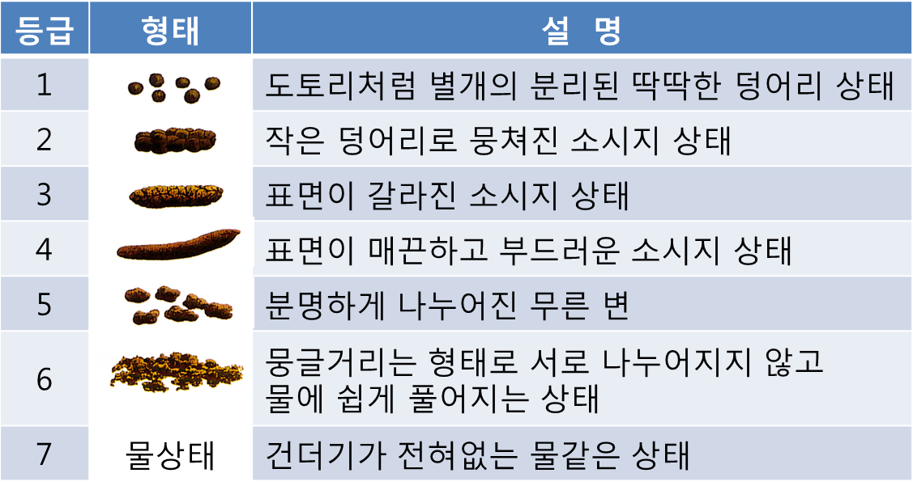
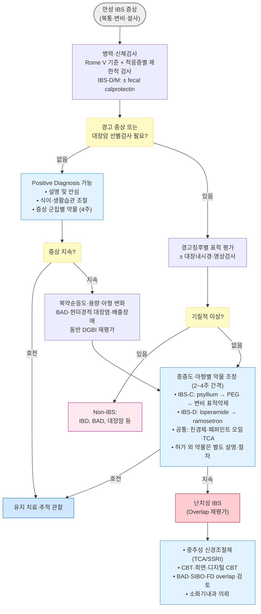
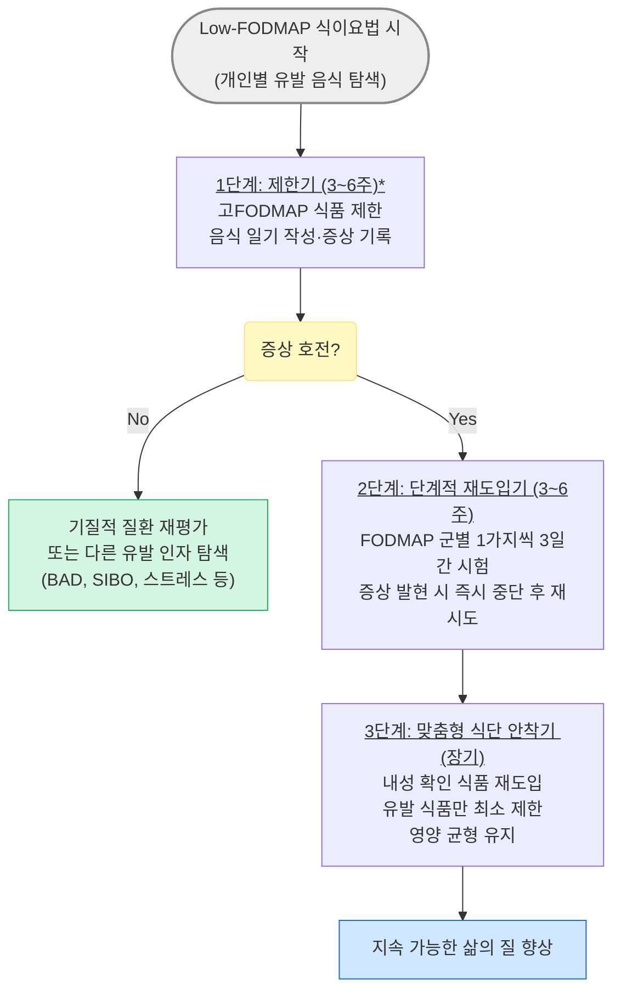

# 과민대장증후군 Irritable Bowel Syndrome

## <mark style="color:green;">일반 사항</mark>

* 반복되는 복통 또는 복부 불편감과 배변 빈도·대변 형태의 변화가 연관되어 나타나는 대표적인 장-뇌 상호작용장애(disorder of gut-brain interaction, DGBI)
* 흔히 다른 기능적/정신적 질환 동반&#x20;
  * 동반 증상: 소화불량, 가슴쓰림, 흉통, 피로, 근육통, 섬유근육통, 두통/편두통, 수면장애, 우울, 불안, 신체형장애, 요통, 비뇨기계 증상(빈뇨, 절박뇨, 성교통)
* 유병률은 적용한 진단기준과 조사 방법에 따라 크게 달라짐; Rome IV 기준의 전 세계 유병률은 약 4%였으나 Rome V의 완화된 증상 빈도 기준을 적용하면 증가할 것으로 예상됨. 대개 50세 이전에 시작하며 여성에서 더 흔함
* 병태생리 : 단일 인자가 아닌 복합 기전 - 내장 과민성, 대장 운동 이상, 장-뇌 축(gut-brain axis) 교란, 장내 미생물 불균형(gut dysbiosis), 점막 저등급 염증(mast cell 활성화), 중추 감작

### <mark style="color:orange;">분류 (Rome V 기준)</mark>

* Bristol 변 형태 척도(BSFS) 기반으로 분류; 최소 2주 관찰 후 결정; 우세 아형은 시간 경과에 따라 바뀔 수 있음

<table><thead><tr><th width="118">아형</th><th width="231">정의 (비정상 배변 비율)</th><th>임상 특징</th></tr></thead><tbody><tr><td><strong>IBS-D</strong><br>(설사 우세형)</td><td>무른 변(BSFS 6~7) ＞¼ AND 굳은 변(BSFS 1~2) ＜¼</td><td>적은 양의 무른 변, 잔변감, 잦은 배변 시도; 야간 배변은 드묾; 남성에서 상대적으로 많음</td></tr><tr><td><strong>IBS-C</strong><br>(변비 우세형)</td><td>굳은 변(BSFS 1~2) ＞¼ AND 무른 변(BSFS 6~7) ＜¼</td><td>과도한 힘주기, 배변 후 잔변감; 여성에서 상대적으로 많음</td></tr><tr><td><strong>IBS-M</strong><br>(혼합형)</td><td>굳은 변 ＞¼ AND <br>무른 변 ＞¼ 모두 해당</td><td>설사와 변비가 교대; 예측 불가 양상</td></tr><tr><td><strong>IBS-U</strong><br>(미분류)</td><td>IBS 진단 기준을 충족하나 <br>특정 아형으로 분류 불가</td><td>비정상 변 형태의 비율이 IBS-C·IBS-D·IBS-M 기준에 미달</td></tr></tbody></table>

<figure><figcaption><p><strong>Bristol stool form scale (BSFS)</strong></p></figcaption></figure>

### <mark style="color:orange;">동반 질환 및 Overlap Syndrome</mark>

* IBS는 다른 기능성 위장관 질환 및 전신 질환과 중복(overlap) 되는 경우가 매우 흔함; 동반 이환이 있을수록 증상 부담과 의료 이용률이 높음
  * Overlap 환자에서는 상부위장관 증상과 하부위장관 증상을 함께 평가하고 정신사회적 요인에 대한 통합 접근이 필요함
* 상부 GI 질환 : 기능성 소화불량(가장 흔함. IBS 환자의 약 30\~40%에서 동반), GERD
* 전신 기능성 질환 : 섬유근육통, 만성 피로 증후군, 두통/편두통, 간질성 방광염
* 자율신경 질환 : 기립성 빈맥 증후군, 과호흡 증후군
* 정신건강 질환 : 불안 장애·우울장애 (IBS 환자의 40\~60%에서 동반), 신체화 장애

## <mark style="color:green;">원인 및 위험 인자</mark>

* 원인 불명; gut-brain interaction 이상이 핵심 기전으로 추정
* 단일 인자가 아닌 복합 기전이 관여

### <mark style="color:orange;">추정 기전</mark>

* 유전적 소인
* 중추 신경계의 통증 처리 과정 교란 (central sensitization)
* 내장 과민성 (visceral hypersensitivity) : 정상 장 자극에 대한 과도한 통증 반응
* 대장 운동성 이상
* 장내 미생물 불균형 (gut dysbiosis) 및 장 투과성 증가
* 일부 환자에서 관찰되는 점막 면역 활성화·장 투과성 변화·세로토닌 신호 이상
* 소장 세균 과증식 (SIBO) - 일부 IBS-D에서 관련성 보고 (논란)
* 담즙산 흡수 장애 (bile acid malabsorption, BAD) : IBS-D 환자의 상당수가 BAD phenotype에 해당할 수 있음; 식후 급박변·담낭절제술 병력·아침 설사가 두드러지면 의심
* 감염 후 IBS (post-infectious IBS, PI-IBS) : 급성 위장관 감염 후 약 5\~10%에서 발생; 설사 우세형(IBS-D)과 연관이 많으며 수년 이상 지속 가능
  * 원인균 : _Campylobacter_, _Salmonella_, _Shigella_, 노로바이러스 등
  * COVID-19 후 새로 발생한 IBS가 보고되지만 발생률은 연구 설계와 진단기준에 따라 차이가 큼; 장기 위장관 증상 전체의 빈도를 PI-IBS 발생률로 해석하지 않음

### <mark style="color:orange;">위험 인자 및 증상 악화 요인</mark>

* 발병 위험 인자 : 급성 위장관 감염 이력, 여성, 젊은 연령, 유전·가족력, 심리사회적 스트레스·불안·우울
* 증상 유발·악화 요인 : 개인별 FODMAP 식품, 지방식, 알코올, 카페인, 월경, 수면 부족 및 스트레스
* 항생제 사용과 IBS의 연관성이 보고되지만 인과관계는 확정되지 않음

## <mark style="color:green;">임상 양상</mark>

* 복통 : 하복부, 다양한 강도(때로 경련성); 간헐적·주기적; 깨어 있는 동안, 주로 아침이나 식후 발생; 배변 후 호전(일부에서는 배변 후 악화)
* 설사, 변비, 또는 설사-변비 교대; 설사 시 보통 양이 많지 않음
* 소화불량, 상복부 불편, 구역, 속쓰림, 복부 팽창, 방귀
* 배변 시 긴장(힘주기), 절박변, 불완전한 배변감
* 두통, 피로, 설명할 수 없는 근육통/관절통, 성교통

### <mark style="color:$danger;">🚩 Red Flags!</mark>

<mark style="color:$danger;">**즉각 조치 또는 응급 의뢰**</mark>

* 대량·지속되는 혈변/직장 출혈 또는 실신·빈맥·저혈압 등 혈역학적 불안정
* 진행성 심한 복통 (장폐쇄·천공·장간막 허혈 의심)
* 발열·오한을 동반한 급성 심한 설사 (감염성 대장염, _C. difficile_ 의심)

<mark style="color:$warning;">**당일 또는 조기 의뢰**</mark>

* 야간 설사 또는 야간 복통으로 수면 장애 → 기질적 질환
* 설명할 수 없는 발열
* 복부 종괴 또는 림프절 종대
* 원인 불명의 육안적 혈변·직장 출혈(혈역학적으로 안정)
* 설명할 수 없는 체중 감소 또는 철결핍빈혈
* ≥50세에서 처음 발생한 IBS 유사 증상

<mark style="color:$info;">**외래 추적 / 추가 평가 계획**</mark> <mark style="color:$info;">- 즉각 위험 낮으나 호전 없으면 의뢰</mark>

* 대장암·IBD·폴립증·셀리악병의 개인력 또는 가족력
* 흡수 장애 또는 지방변
* 표준 치료를 충분히 시행했는데도 지속되거나 양상이 현저히 변한 증상 → 진단·아형·동반 질환 재평가

## <mark style="color:green;">진단</mark>


**"IBS는 적극적(positive) 진단이 가능한 질환이다."** IBS는 반드시 광범위한 검사로 모든 기질적 질환을 배제한 후에만 진단하는 '배제 진단'이 아니며, '증상 기반 진단기준 충족 + alarm signs 없음 + 임상 상황에 맞춘 제한적 검사'로 적극적으로 진단 가능 (2025 서울 컨센서스 포함 국제 지침에서 강조됨)


* IBS를 확진하는 특이 검사는 없으며, 검사 결과는 대개 정상이지만 동반 질환에 따라 이상이 있을 수 있음
* 환자의 불안감 해소를 위한 검사는 고려하되 과잉 검사 지양 - 불필요한 반복 영상·내시경 검사는 환자 불안을 강화하고 의료 이용을 증가시킬 수 있음
* 경고 징후 없이 기본 검사가 정상이면서 진단 기준에 부합하면 진단 가능
* 신체검사에서 복부 종괴·장폐쇄 징후를 확인하고, 국소 압통이 있으면 Carnett sign을 통해 복벽 통증 가능성을 평가

### <mark style="color:orange;">진단 기준 \[Rome V, 2026]</mark>

* 증상이 발생한 지 최소 6개월 되었고 최근 3개월간 다음 기준을 충족; 다음 중 ≥2개와 관련되는, 평균 월 ≥3일 발생하는 재발성 복통 또는 복부 불편감
  1. 배변과 관련
  2. 배변 빈도의 변화와 관련
  3. 대변 형태(모양)의 변화와 관련


**Rome IV와의 관계** : 2026년 Rome V에서는 복부 불편감이 다시 포함되고 증상 빈도 기준이 평균 주 1일 이상에서 월 3일 이상으로 완화되었다. 2025 서울 컨센서스와 기존 치료 연구는 대부분 Rome IV를 기반으로 하므로, 근거를 해석할 때 적용한 진단기준을 함께 확인한다.


### <mark style="color:orange;">검사</mark>

* 모든 환자에게 동일한 검사 패널을 시행하지 않고 증상 아형·연령·경고징후·노출력에 따라 선택
  * 기본 검사 : CBC ± CRP/ESR
  * IBS-D·IBS-M : fecal calprotectin 또는 lactoferrin을 고려하고, 셀리악병 배제가 필요하면 tissue transglutaminase IgA와 total IgA를 함께 측정
  * TFT : 갑상선질환을 시사하는 증상·징후가 있을 때
  * 대변 배양·기생충 검사 : 급성 발병, 여행·오염 노출, 면역저하 등 적응증이 있을 때; routine 시행하지 않음
  * 분변잠혈검사 : IBS 진단 목적이 아니라 연령별 대장암 선별 또는 출혈 평가 목적으로 시행
* Fecal calprotectin : 주로 설사 증상이 있는 환자에서 IBD vs IBS 감별을 위한 비침습적 triage 검사
  * calprotectin : neutrophil에서 분비되는 단백질. 염증이 있을 때 장 점막으로 유출되어 대변에 존재하게 됨. 대변에서의 농도는 염증 정도를 반영

<table><thead><tr><th width="152">Calprotectin 수치</th><th>해석 및 처치</th></tr></thead><tbody><tr><td>&#x3C;50 ㎍/g</td><td>IBD 가능성 낮음; 임상 상황에 따라 추가검사 없이 관찰 가능</td></tr><tr><td>50~150 ㎍/g</td><td>경계 범위; 감염, NSAID·PPI 사용 등 교란 요인을 확인하고 2~4주 후 재검 또는 임상 상황에 따라 대장내시경 고려</td></tr><tr><td>＞150 ㎍/g</td><td>장 염증 가능성 증가; 수치의 정도·지속 여부와 증상을 함께 평가하여 소화기내과 의뢰 및 대장내시경 고려</td></tr></tbody></table>

* 검사실·검사법과 진료 경로에 따라 절단값이 다를 수 있으므로 해당 기관의 참고범위를 우선 적용

* 대장내시경 : 연령별 국가 대장암 선별 권고에 따라 시행 고려 (한국 국가암검진: 만 50세부터 분변잠혈검사, 이상 시 대장내시경), 경고 징후 있거나 IBD 의심 시 시행.
  * 변비 우세형이 아닌 IBS 환자에서 대장암은 관찰되지 않고 ＜2%에서 IBD가 발견된다는 보고
* GI 기능 평가 (선택적 시행)
  * 변비 : colon transit time, anorectal manometry, balloon expulsion test
  * 설사 : 적응증이 있을 때 대변 배양; 현미경적 대장염 의심 시 정상으로 보이는 우측·좌측 대장에서 다부위 조직검사; 48-h fecal bile acid excretion 또는 serum 7α-C4(BAD 평가); fecal calprotectin/lactoferrin
  * 호흡검사 : lactose breath test는 유당흡수장애, glucose breath test는 SIBO가 의심될 때 선택적으로 시행

### <mark style="color:orange;">감별</mark>

#### <mark style="color:$primary;">IBS vs IBD vs 대장암 감별</mark>

<table><thead><tr><th width="165">감별 특징</th><th width="146" align="center">IBS</th><th width="146" align="center">IBD</th><th width="89" align="center">대장암</th></tr></thead><tbody><tr><td>야간 증상</td><td align="center">드묾</td><td align="center">흔함</td><td align="center">가능</td></tr><tr><td>체중 감소</td><td align="center">드묾</td><td align="center">흔함</td><td align="center">흔함</td></tr><tr><td>혈변</td><td align="center">없음</td><td align="center">흔함</td><td align="center">가능</td></tr><tr><td>CRP / ESR</td><td align="center">정상</td><td align="center">상승</td><td align="center">다양</td></tr><tr><td>Fecal calprotectin</td><td align="center">정상 (&#x3C;50 ㎍/g)</td><td align="center">상승 (＞150 ㎍/g)</td><td align="center">다양</td></tr><tr><td>배변 후 통증</td><td align="center">호전</td><td align="center">다양</td><td align="center">다양</td></tr></tbody></table>

#### <mark style="color:$primary;">기타 감별 질환</mark>

<table><thead><tr><th width="190">질환</th><th>감별 단서</th></tr></thead><tbody><tr><td>셀리악병 (gluten enteropathy)</td><td>만성 설사, 피로, 빈혈, 골 통증, 구내염; tTG-IgA와 total IgA로 선별</td></tr><tr><td>Lactose intolerance</td><td>유제품 섭취와 관련한 복부 팽만, 설사</td></tr><tr><td>Bile acid diarrhea (BAD)</td><td>식후 급박변, 담낭절제술 병력, 아침 설사; serum 7α-C4 상승 또는 대변 담즙산 증가; cholestyramine 반응은 진단을 뒷받침하지만 확진 검사는 아님</td></tr><tr><td>Microscopic colitis</td><td>고령에서 만성 수양성 설사; 자가면역 질환 동반 가능; 대장내시경 육안 정상이어도 우측·좌측 대장 다부위 조직검사로 확진</td></tr><tr><td>SIBO (소장 세균 과증식)</td><td>복부 팽만, 설사, 흡수 장애 및 위험 인자; glucose breath test를 선택적으로 시행</td></tr><tr><td>Diverticulitis</td><td>좌측 복통, 발열, 좌하복부 압통/종괴</td></tr><tr><td>자궁내막증</td><td>주기적 하복부 통증 (월경 주기 연관)</td></tr><tr><td>난소암</td><td>특히 중년 이후 여성에서 지속되는 복부 팽만·조기 포만·골반/복통·빈뇨/절박뇨; 임상적으로 의심되면 부인과 평가 ± CA-125/영상검사</td></tr><tr><td>정신사회적 문제</td><td>우울·불안·신체증상장애는 IBS와 공존하거나 증상 부담을 증폭할 수 있음</td></tr></tbody></table>

***

## <mark style="background-color:$warning;">Management</mark>

### <mark style="color:orange;">치료 원칙</mark>

* 모든 환자에게 효과적인 단일 요법은 없음 - 증상 아형 + 증상 군집 + 중증도에 따른 맞춤 치료 선택
* 안심 및 교육 : 치명적 질환이 아니며 증상 조절이 가능함을 설명; 의사-환자 신뢰 형성이 치료의 출발점
* 생활습관 중재 (1차) : 식이 조절, 규칙적 운동, 스트레스 관리
* 약물 치료 : 비-약물 치료로 해결되지 않는 경우 아형별 보조 치료
* 장-뇌 축 치료 : 인지행동 치료(CBT), 장-지향 최면치료(gut-directed hypnotherapy) 등은 특히 중등도 이상·난치성 IBS에서 고려 (ACG 2021 조건부 권고; 2025 서울 컨센서스 약한 권고)
* 1차 치료에 반응하지 않으면 기질적 문제·overlap syndrome·정신사회적 요인 재평가


**외래 설명 요점 (진료 시 참고)**\
• _"검사상 큰 병은 아니지만, 장이 예민해진 상태입니다."_\
• _"스트레스 때문에 생긴 병이라는 뜻은 아닙니다. 증상은 실제이며 장-뇌 축의 과민 반응이 주된 기전입니다."_\
• _"완치보다는 증상을 조절하면서 삶의 질을 높이는 것이 목표입니다."_\
• _"반복 검사보다 생활 조절과 맞춤 치료가 더 중요합니다."_


### <mark style="color:orange;">중증도별 치료 접근</mark>

<table><thead><tr><th width="113">중증도</th><th>특징</th><th>치료 접근</th></tr></thead><tbody><tr><td>경증 <br>(Mild)</td><td>간헐적 증상; 일상생활 유지</td><td>식이·안심·음식 일기 / 필요 시 prn 진경제·loperamide</td></tr><tr><td>중등증 <br>(Moderate)</td><td>삶의 질 영향; 규칙적 증상; 직장·사회활동 지장</td><td>아형별 약물 치료 (지속 투여); 수용성 섬유·low-FODMAP</td></tr><tr><td>중증/난치성 <br>(Severe)</td><td>일상 기능 저하; 기존 치료 무반응; 정신사회적 동반</td><td>중추성 신경조절제(TCA/SSRI); CBT·최면·디지털 CBT; Overlap 재평가; 전문의 의뢰</td></tr></tbody></table>

### <mark style="color:orange;">증상 군집별 처방 (Symptom-cluster Prescribing)</mark>

* IBS 아형보다 지배적인 증상 군집에 따른 처방이 실제 외래에서 더 실용적

<table><thead><tr><th width="168">증상 군집</th><th>우선 고려 약물 / 치료</th></tr></thead><tbody><tr><td>복통·경련 우세</td><td>진경제(antispasmodic), 페퍼민트 오일, TCA 저용량</td></tr><tr><td>복부 팽만·가스 우세</td><td>low-FODMAP 식이, probiotics 제한적 시험; IBS-D에서는 rifaximin 허가 외 사용을 선택적으로 검토</td></tr><tr><td>절박변·빈도 우세</td><td>loperamide prn, ramosetron; ondansetron은 허가 외 선택지</td></tr><tr><td>변비 우세</td><td>psyllium(수용성 섬유), PEG 하제; 불응 시 prucalopride 등 동반 변비 치료 검토</td></tr><tr><td>불안·과민 우세</td><td>TCA 저용량, CBT, gut-directed hypnotherapy, SSRI(공존 불안·우울 시)</td></tr></tbody></table>

***


```mermaid
graph TD
    Start(["만성 IBS 증상<br>(복통·변비·설사)"])
    Step1["병력·신체검사<br>Rome V 기준 + 적응증별 제한적 검사<br>IBS-D/M: ± fecal calprotectin"]
    Cond1("경고 증상 또는<br>대장암 선별검사 필요?")
    Sub1["Positive Diagnosis 가능<br>• 설명 및 안심<br>• 식이·생활습관 조절<br>• 증상 군집별 약물 (4주)"]
    Cond2("증상 지속?")
    Colonoscopy["경고징후별 표적 평가<br>± 대장내시경·영상검사"]
    Cond3("기질적 이상?")
    NonIBS["Non-IBS:<br>IBD, BAD, 대장암 등"]
    Reassess["복약순응도·용량·아형 변화<br>BAD·현미경적 대장염·배출장애<br>동반 DGBI 재평가"]
    End1["유지 치료·추적 관찰"]
    Treat1["중증도·아형별 약물 조정 (2~4주 간격)<br>• IBS-C: psyllium → PEG → 변비 표적약제<br>• IBS-D: loperamide → ramosetron<br>• 공통: 진경제·페퍼민트 오일·TCA<br>• 허가 외 약물은 별도 설명·절차"]
    Refractory["난치성 IBS<br>(Overlap 재평가)"]
    Treat2["• 중추성 신경조절제(TCA/SSRI)<br>• CBT·최면·디지털 CBT<br>• BAD·SIBO·FD overlap 검토<br>• 소화기내과 의뢰"]

    Start --> Step1
    Step1 --> Cond1
    Cond1 -- "없음" --> Sub1
    Cond1 -- "있음" --> Colonoscopy
    Sub1 --> Cond2
    Cond2 -- "호전" --> End1
    Cond2 -- "지속" --> Reassess
    Reassess --> Treat1
    Colonoscopy --> Cond3
    Cond3 -- "있음" --> NonIBS
    Cond3 -- "없음" --> Treat1
    Treat1 -- "호전" --> End1
    Treat1 -- "지속" --> Refractory
    Refractory --> Treat2

style Start fill:#eeeeee,stroke:#888888,stroke-width:2px
classDef yellow fill:#fff9c4,stroke:#ffe082
class Cond3,Cond1,Cond2 yellow
classDef sky fill:#e3f2ff,stroke:#2196f3
class Sub1,Treat1,Treat2 sky
classDef L_red fill:#ffcdd2,stroke:#c62828
class Refractory L_red
classDef blue fill:#d0e8ff,stroke:#1a6abf
class End1 blue
classDef pink fill:#fde8f0,stroke:#e91e8c
class NonIBS pink
```

<p align="center"><strong>과민대장증후군 진단 및 치료 알고리듬</strong></p>

***

## <mark style="color:green;">비-약물 치료 및 예방</mark>

### <mark style="color:orange;">식이 조절 - Low-FODMAP</mark>

* 일치된 단일 효과적 식단은 없음; 개인별 유발 음식 파악이 핵심 (음식 일기 작성 권고)
* 수용성 식이 섬유(psyllium 등)를 저용량부터 시작해 가스·복부 불편을 보며 서서히 증량; 총 식이 섬유 섭취량과 환자 내약성을 함께 고려
  * 불용성 식이 섬유(밀기울·bran)는 증상을 악화시킬 수 있으므로 주의
* 증상 유발 음식 회피 (개인별 경험 기반) : 지방식, 알코올, 카페인, 매운 음식, 우유, 청량음료, 인공 감미료
* Gluten-free diet : 셀리악병이 배제된 경우 권고하지 않음 (효과 미입증, 실행 부담 큼)


**과도한 음식 제한 주의** : 장기간·광범위한 음식 제한은 영양 불균형, 체중 감소, 삶의 질 저하(orthorexia-like 양상)를 초래할 수 있음. 가능한 최소 제한 원칙으로 접근하며, 증상과 무관한 식품은 단계적 재도입으로 제한을 풀도록 안내


***


```mermaid
graph TD
    Start(["Low-FODMAP 식이요법 시작<br>(개인별 유발 음식 탐색)"])
    P1["<u>1단계: 제한기 (3~6주)*</u><br>고FODMAP 식품 제한<br>음식 일기 작성·증상 기록"]
    Cond1("증상 호전?")
    P1_Fail["기질적 질환 재평가<br>또는 다른 유발 인자 탐색<br>(BAD, SIBO, 스트레스 등)"]
    P2["<u>2단계: 단계적 재도입기 (3~6주)</u><br>FODMAP 군별 1가지씩 3일간 시험<br>증상 발현 시 즉시 중단 후 재시도"]
    P3["<u>3단계: 맞춤형 식단 안착기 (장기)</u><br>내성 확인 식품 재도입<br>유발 식품만 최소 제한<br>영양 균형 유지"]
    End2["지속 가능한 삶의 질 향상"]

    Start --> P1
    P1 --> Cond1
    Cond1 -- "No" --> P1_Fail
    Cond1 -- "Yes" --> P2
    P2 --> P3
    P3 --> End2

style Start fill:#eeeeee,stroke:#888888,stroke-width:2px
classDef yellow fill:#fff9c4,stroke:#ffe082
class Cond1 yellow
classDef blue fill:#d0e8ff,stroke:#1a6abf
class End2 blue
style P1_Fail fill:#d5f5e3,stroke:#27ae60
```

<p align="center"><strong>Low-FODMAP 3단계 식이 접근</strong> (ACG 2021 조건부 권고)</p>

\*제한기는 3\~6주로 제한; 이후 단계적 재도입으로 개인별 불내성 식품 특정. 가능하면 숙련된 영양사의 지도를 받고, 장기간의 엄격한 제한식은 피한다. (☞ [저FODMAP 식품 목록](075_-indigestion-dyspepsia.md#undefined-19) )

### <mark style="color:orange;">운동 및 생활습관</mark>

* 규칙적 유산소 운동 : 주 3\~5회, 20\~60분 (걷기·수영 등); 위장 운동 개선 및 삶의 질 향상 효과

### <mark style="color:orange;">장-뇌 축 심리 치료 및 디지털 중재</mark>

* 인지행동 치료(CBT), 장-지향 최면치료(gut-directed hypnotherapy), 심리역동치료, 마음챙김 기반 인지치료(MBCT)
* 중등도 이상 또는 기존 치료에 반응하지 않는 IBS, 정신사회적 동반 이환이 있는 환자에서 고려 - ACG 2021 조건부 권고, 2025 서울 컨센서스 약한 권고
* 디지털 중재 : 일부 앱·웹 기반 CBT와 장-지향 최면 프로그램의 유효성이 보고되었으나, 국내 이용 가능성·허가 상태·비용은 제품별로 확인하며 대면 치료를 일률적으로 대체하지 않음

## <mark style="color:green;">약물 치료</mark>

　☞ [소화기계약제](073_-gidrugs.md) (보험 주의)

* 약물은 보조 치료 수단; 증상 아형 및 지배적 증상 군집에 따라 선택
* 약물 조정은 2\~4주 간격으로 점진적으로 시행

**2025 서울 컨센서스 중심 주요 권고**

<table><thead><tr><th width="96">대상</th><th>치료</th><th width="184">근거 수준 / 권고 강도</th></tr></thead><tbody><tr><td><strong>IBS-C</strong></td><td>수용성 섬유, PEG, 난치성 변비에서 prucalopride 고려, lubiprostone, GC-C 작용제</td><td>GC-C 작용제: 높음/강함<br>그 외: 낮음~중등도/약함</td></tr><tr><td><strong>IBS-D</strong></td><td>loperamide, 5-HT₃ 길항제(ramosetron), rifaximin</td><td>5-HT₃ 길항제: 높음/약함<br>그 외: 매우 낮음~중등도/약함</td></tr><tr><td><strong>공통</strong></td><td>진경제, TCA, 선택적 SSRI, probiotics, low-FODMAP 식이, 장-지향 심리치료</td><td>대부분 매우 낮음~중등도/약함</td></tr></tbody></table>


국내 가용성·허가 상태가 국제 지침과 다르다. Ramosetron은 국내 IBS-D에 사용할 수 있지만, rifaximin의 IBS-D 사용과 prucalopride·lubiprostone의 IBS-C 사용은 허가·급여 범위를 확인해야 한다. 2025 서울 컨센서스 당시 linaclotide·plecanatide 등 GC-C 작용제는 국내에서 이용할 수 없었다. Eluxadoline·alosetron·tegaserod 역시 국내 치료 선택지가 아니다.


#### <mark style="color:$primary;">진경제 (Antispasmodics)</mark>

* 작용 : 장 평활근 수축과 과도한 운동을 조절하여 식후 복통·경련을 완화; 약제별 기전은 서로 다름
* 대상 : 복통·경련이 주증상인 IBS - 2025 서울 컨센서스 약한 권고(낮은 근거)
* 항무스카린성 약물의 부작용 : 입마름, 시각 장애, 어지럼, 소변 저류, 변비, 빈맥; 고령·변비·녹내장·전립선 비대 환자에서 주의
* 매 식전 또는 필요시 투여
* 항무스카린성 : dicyclomine <mark style="color:blue;">\[스파토민]</mark>, cimetropium <mark style="color:blue;">\[알기론]</mark>, scopolamine butylbromide <mark style="color:blue;">\[부스코판]</mark>
* 기타 진경제 : trimebutine <mark style="color:blue;">\[포리부틴]</mark>, pinaverium <mark style="color:blue;">\[디세텔]</mark>, tiropramide <mark style="color:blue;">\[티로파]</mark>

#### <mark style="color:$primary;">페퍼민트 오일 (Peppermint Oil)</mark>

* 작용 : Ca²⁺ 채널 차단을 통한 장 평활근 이완 → 복통 및 경련 완화
* 대상 : 복통·경련이 주증상인 IBS - ACG 2021 조건부 권고(낮은 근거)
* 부작용 : 위식도역류, 항문 작열감 - 장용 코팅 제제 사용으로 경감 가능
* 장용 코팅 캡슐 0.2\~0.4 ㎖ tid, 식간 복용

#### <mark style="color:$primary;">Opiate성 지사제</mark>

* 작용 : 변의 유동성 및 배변 긴급성·빈도 감소
* 대상 : IBS-D; 절박변·빈도 우세 시 설사가 예상되는 상황에서 예방적 투여 (AGA 2022 very low certainty 조건부 권고)
* 부작용 : 복통, 팽만감, 구역, 변비
* loperamide 2 ㎎, 최대 8 ㎎/d <mark style="color:blue;">\[로프민]</mark>

#### <mark style="color:$primary;">부피 형성 하제 (Bulk-forming Laxatives)</mark>

* 작용 및 대상 : 대변 부피 형성으로 대변 굳기·무른 변 완화; IBS-C, IBS-D 모두 효과
* 부작용 : 복부 팽만, 가스 (서서히 증량하여 경감)
* psyllium qd\~tid <mark style="color:blue;">\[무타실]</mark>, agiocur granules qd\~bid <mark style="color:blue;">\[아기오]</mark>

#### <mark style="color:$primary;">삼투성 하제 (Osmotic Laxatives)</mark>

* 작용 및 대상 : 배변 빈도 개선·굳기 완화; IBS-C (AGA 2022 조건부 권고, 저근거)
* polyethylene glycol 17 g qd\~bid <mark style="color:blue;">\[마이락스]</mark>
* lactulose·sorbitol : 복부 가스·팽만 증가 가능성으로 IBS에서 회피 권장

#### <mark style="color:$primary;">Probiotics</mark>

* 작용 : 장내 미생물 불균형 개선 → 가스 형성·염증 억제 (논란)
* 연구 설계·균주·용량의 이질성이 커 특정 균주나 제품을 일률적으로 권고할 수 없으며, 연구 결과를 다른 제품에 그대로 적용할 수 없음
* \[AGA 2020] 임상시험 외 routine 사용에 반대; \[BSG 2021·2025 서울 컨센서스] 근거의 불확실성을 설명한 뒤 최대 12주 시험적으로 사용할 수 있으며 호전이 없으면 중단
* 고령·입원 환자 및 면역저하 환자에서는 드문 균혈증·진균혈증 위험을 고려

#### <mark style="color:$primary;">중추성 신경조절제 (Central Neuromodulators)</mark>


**'중추성 신경조절제' 명칭** : 최신 로마 재단(Rome Foundation) 지침 및 기능성 위장관 질환(DGBI) 트렌드는 환자의 낙인 효과를 줄이기 위해 '항우울제' 대신 '중추성 신경조절제' 라는 용어 사용을 강력히 권고. IBS에서의 사용 목적은 우울증 치료가 아닌 장-뇌 축 과민성 조절 및 내장 통각 억제임을 환자에게 명확히 설명


* 작용 : 중추성 통증 지각·visceral sensitivity 조절; motility에 작용; 우울증 치료보다 저용량 투여
* 대상 : 복통·팽만에 대한 2차 선택; 정신사회적 동반 이환 시 우선 고려
* 4주경 내약성·초기 반응을 평가하고, 견딜 수 있으면 저용량 적정 후 8\~12주까지 효과를 평가

#### <mark style="color:$primary;">TCA (삼환계 항우울제)</mark>

* 항콜린 작용으로 장 통과 시간 연장 → IBS-D 및 복통에 효과; ACG 2021 강력 권고 (내장 통각 과민·복통·설사 조절)
* 부작용 : 입마름, 시야 흐림, 변비, 요 정체, 빈맥, 혼돈; 녹내장·전립선 비대·고령에서 주의
* amitriptyline <mark style="color:blue;">\[에트라빌]</mark>, nortriptyline <mark style="color:blue;">\[센시발]</mark>, imipramine <mark style="color:blue;">\[이미프라민]</mark>
* 용량 : 5\~10 ㎎ hs 시작 → 1\~2주 간격으로 5\~10 ㎎씩 점진적 증량; 보통 10\~30 ㎎/d 범위에서 최소 유효용량 유지

#### <mark style="color:$primary;">SSRI</mark>

* 위장관 통과 시간 단축 효과 → IBS-C에서 일부 효과 보고
* \[AGA 2022] IBS-C / -D 모두에서 조건부 반대 (저근거); 전반적 삶의 질 개선은 일부 보고되나 복통 감소 근거는 약함
* sertraline 25\~100 ㎎ <mark style="color:blue;">\[졸로푸트]</mark>, citalopram 10\~20 ㎎, paroxetine 20\~50 ㎎ <mark style="color:blue;">\[세로자트]</mark>, fluoxetine 10\~20 ㎎ 아침 → 점차 증량 최대 40 ㎎/d <mark style="color:blue;">\[푸로작]</mark>
* 처방 시 의사-환자 공동 결정(shared decision-making) 필요


AGA 2022는 IBS에서 SSRI에 대해 조건부 권고 반대를 표명 (저근거 수준). 단, 다음의 경우 선택적으로 고려할 수 있음: ⓵ 불안·우울 등 정신과적 공존 질환이 있는 경우, ⓶ 난치성 IBS-C에서 장 통과 단축 효과를 기대하는 경우(중추성 통증 개선보다 운동 효과 목적)


#### <mark style="color:$primary;">비흡수성 항생제</mark>

* 작용 : 장내 세균 활동 억제 → 탄수화물 발효·복부 팽만 감소; 장기 사용 효과는 입증되지 않음
* 대상 : 복부 팽만이 동반된 난치성 IBS-D - AGA 2022 조건부 권고 (중등도 근거)
* rifaximin : 미국 허가 용법 550 ㎎ tid × 14일; 최초 반응 후 재발하면 동일 요법을 최대 2회 추가 가능
  * 국내 <mark style="color:blue;">\[노르믹스 200 ㎎정]</mark>은 IBS-D 적응증이 없고 미국 허가 용량과 일치하는 제형도 아니므로, 국내 허가·급여 범위와 허가 외 사용 절차를 확인
  * 주요 3상시험은 북미 환자 대상이어서 아시아 환자에 대한 일반화에는 제한이 있음

#### <mark style="color:$primary;">Serotonin 5-HT4 Receptor Agonist</mark>

* 작용 : GI motility 조절 (대장 통과 시간 단축)
* 대상 : 단순 하제에 반응하지 않는 IBS-C에서 동반 변비 조절 목적으로 선택적으로 고려
* 부작용 : 두통, 복통
* 주의/금기 : 신장 기능 저하, 장폐쇄·천공 의심, 심한 IBD
* prucalopride : 1\~2 ㎎ qd <mark style="color:blue;">\[레졸로]</mark> ([만성변비 허가](https://www.hira.or.kr/rc/insu/insuadtcrtr/InsuAdtCrtrPopup.do?mtgHmeDd=20200501\&sno=3\&mtgMtrRegSno=0003)); IBS-C 적응증 및 IBS-C 대상 RCT는 없음
* tegaserod : 6 ㎎ bid - 2007년 심혈관 안전성 문제로 철수 후 미국에서 제한적으로 재도입되었으나 2022년 다시 시장 철수; 아시아에서 이용 불가

#### <mark style="color:$primary;">Serotonin 5-HT3 Receptor Antagonist</mark>

* 작용 : serotonin 작용 억제 → 대장 운동·분비 감소, 설사 개선
* 대상 : 절박변·빈도 우세 및 난치성 IBS-D - 2025 서울 컨센서스 약한 권고(높은 근거)
* 부작용 : 변비, 급성 허혈성 대장염 (드묾; 복통 갑자기 악화 시 즉시 내원)
* ramosetron : 남성 5(2.5\~10) ㎍ qd, 여성 2.5(\~5) ㎍ qd <mark style="color:blue;">\[이리보]</mark>
* ondansetron : 4 ㎎ qd\~tid <mark style="color:blue;">\[조프란]</mark> (국내 IBS-D 허가 외)
  * 절박변·묽은 변과 배변 빈도 감소에는 도움이 될 수 있으나 복통 개선 근거는 불분명; 저용량(4 ㎎ qd)부터 시작하여 변비 여부 모니터링

#### <mark style="color:$primary;">Bile Acid Sequestrant</mark>

* 작용 : 담즙산 흡수 장애(BAD) 조절


**IBS-D와 Bile Acid Diarrhea (BAD) Phenotype** : IBS-D 환자 중 상당수가 실제로 BAD phenotype에 해당할 수 있음. 특히 식후 급박변, 담낭절제술 병력, 아침 설사가 두드러지는 환자에서 BAD를 의심\
•확인 방법 : serum 7α-C4 또는 FGF19 측정, 48-h fecal bile acid excretion - 그러나 국내 일차의료 환경에서는 검사 접근성이 제한적인 경우가 많음\
•현실적 진단 팁 : 검사가 여의치 않으면 임상적으로 BAD 가능성이 높은 환자에서 cholestyramine을 시험적으로 투여할 수 있으나, 치료 반응만으로 확진하거나 비반응만으로 BAD를 배제하지 않음


* 대상 : IBS-D (BAD 의심 시)
* 부작용 : 변비, 복부 팽만, 복통, 담석증, 다른 약제 흡수 방해 (digitalis, warfarin, propranolol, thiazide, amiodarone, thyroxine, acetaminophen, NSAID, steroid, 엽산, Vit A/D/K, PcG)
* 금기 : TG ＞400 ㎎/㎗
* cholestyramine 4\~24 g/d, 식사와 함께 2\~3회 분복 <mark style="color:blue;">\[퀘스트란]</mark>

#### <mark style="color:$primary;">GC-C Agonist (Guanylate Cyclase-C 작용제)</mark>

* 작용 : cGMP 증가 → 장액 분비 촉진·대장 통과 시간 단축·내장 통각 억제
* 대상 : 난치성 IBS-C - 2025 서울 컨센서스 강한 권고(높은 근거)
* 부작용 : 설사 (용량 의존적; 식사 30분 전 복용으로 경감)
* linaclotide : 성인 IBS-C 290 ㎍ qd (식사 30분 전); 145 ㎍은 성인 만성 특발성 변비 용량
* plecanatide : 3 ㎎ qd
* 2025 서울 컨센서스 발표 당시 두 약제 모두 국내에서 이용할 수 없었으므로 최신 식약처 허가·유통 상태 확인

#### <mark style="color:$primary;">Chloride Channel Activator</mark>

* 작용 : ClC-2 채널 활성화 → 장액 분비 촉진
* 대상 : 난치성 IBS-C - AGA 2022 조건부 권고 (중등도 근거)
* 부작용 : 오심 (식사와 함께 복용 시 경감)
* lubiprostone : 8 ㎍ bid (식사와 함께)&#x20;
  * Lubiprostone <mark style="color:blue;">\[아미티자]</mark>은 국내에서 '성인 만성 특발성 변비'에만 허가되어 있으며, IBS-C 적응증은 없음&#x20;

#### <mark style="color:$primary;">NHE3 Inhibitor (Tenapanor)</mark>

* 작용 : 장 상피세포 Na⁺-H⁺ 교환체 억제 → 장액 분비 증가, 복통 감소
* 대상 : IBS-C - AGA 2022 조건부 권고 (중등도 근거)
* 부작용 : 설사
* tenapanor 50 ㎎ bid (국내 미출시)

#### <mark style="color:$primary;">기타</mark>

* 표면 활성제 : simethicone 40\~80 ㎎ tid <mark style="color:blue;">\[가소콜]</mark> - 효과 입증 불충분
* α/β-galactosidase : 일부에서 가스·팽만 감소 효과
* 항불안제 : 습관화 가능성 때문에 IBS에서 만성적으로 사용해서는 안 됨

### <mark style="color:orange;">IBS-D 표적 치료제</mark>


IBS-D는 단순 설사 억제보다 **장-뇌 축 조절 및 복통 완화**에 초점을 맞춘 복합 접근이 필요하다.\
Loperamide 단독은 urgency·묽은 변에 효과적이나 복통 dominant phenotype에서는 효과 제한적.


* **ondansetron** (5-HT₃ 차단제) 4 ㎎ prn\~bid <mark style="color:blue;">\[조프란]</mark>
  * 장 통과시간 지연 → urgency·묽은 변 개선; 복통 개선 효과는 분명하지 않음
  * 국내 IBS-D 허가 외; 환자에게 설명하고 허가 외 사용 및 급여 관련 절차를 확인
* **저용량 TCA** : 복통 + urgency 동반 IBS-D에 유용; 진통·장 운동 억제·수면 개선 복합 효과
  * amitriptyline : 10\~25 ㎎ hs <mark style="color:blue;">\[에트라빌]</mark>


**QT 연장 주의 - ondansetron + TCA 병용 시** : Ondansetron과 amitriptyline 모두 QT 간격 연장 가능성이 있으며, SSRI 병용 시 위험이 증가; 고령 환자, 전해질 이상(저칼륨·저마그네슘), 기존 QT 연장 병력이 있는 경우 심전도 모니터링을 고려


* **Antispasmodics** : 식후 복통·cramping 동반 시
  * mebeverine : 135 ㎎ tid (식전 20분) <mark style="color:blue;">\[두스파탈린]</mark>
  * trimebutine : 100\~200 ㎎ tid <mark style="color:blue;">\[포리부틴]</mark>
* **rifaximin** : 복부 팽만이 두드러진 IBS-D에서 고려할 수 있으나 국내 IBS-D 허가·급여 대상이 아님. 미국 허가 용법은 550 ㎎ tid × 14일이며 국내 200 ㎎정으로 임의 환산한 용법을 표준요법처럼 제시하지 않음

***

### <mark style="color:red;">질병코드</mark>

K58 과민대장증후군

***

## <mark style="color:purple;">처방례</mark>

> **처방례 1. IBS-C 경증 (변비·복부 팽만)**
>
> ```
> 무타실 산 (psyllium) 　　　2 P　　 #2
> 마이락스 산 17 g 　　　　  1 포　  qd
> ```
>
> _✽ 증상 정도에 따라 수용성 섬유(psyllium)와 삼투성 하제(PEG)를 병용할 수 있으나, 경증에서는 한 약제부터 시작해 반응에 따라 추가할 수 있음. 심부전·신부전 등 수분 제한이 필요한 환자를 제외하고 충분한 수분을 섭취하도록 안내. Lactulose는 복부 가스·팽만을 악화시킬 수 있음. 2\~4주 후 반응을 평가하고, 호전이 없으면 배출장애·복약순응도를 재평가한 뒤 prucalopride 등 동반 변비 표적약제를 고려._

> **처방례 2. IBS-D 경증\~중등증 (복통·잦은 설사)**
>
> ```
> 스파토민 정 10 ㎎ 　　　　3T　  #3　  식전
> ```
>
> _✽ 진경제(dicyclomine)는 식전 30분 또는 복통 예상 상황 전 복용; 입마름·변비 부작용 확인. 묽은 변·절박변 조절이 필요하면 loperamide를 필요 시 추가하되 복통 자체의 개선 효과는 제한적임._

> **처방례 3. IBS-D 중등증 (복통 지속, 중추성 신경조절제 추가)**
>
> ```
> 티로파 정 　　　　　　　 3T　  #3　  식전
> 에트라빌 정 10 ㎎ 　　　1T　  취침 전
> ```
>
> _✽ Amitriptyline은 정신과적 목적이 아닌 내장 과민성·통증·설사 조절 목적의 중추성 신경조절제로서 저용량 사용임을 환자에게 설명. 약 4주에 내약성과 초기 반응을 확인하고, 견딜 수 있으면 5\~10 ㎎씩 점진적으로 증량하여 8\~12주까지 효과를 평가. 변비·입마름·주간 졸림을 모니터링._

> **처방례 4. 난치성 IBS-D (ramosetron)**
>
> ```
> 이리보 정 5 ㎍ 　　　　　1T　  qd　　　　　　(남성)
>  ── 또는 ──
> 이리보 정 2.5 ㎍ 　　　　1T　  qd　　　　　　(여성)
> ```
>
> _✽ Ramosetron(이리보)은 변비로 전환되는지 확인하고 용량을 조절. 갑자기 심해지는 복통·혈변이 있으면 즉시 중단하고 허혈성 대장염을 평가. Rifaximin은 국내 IBS-D 허가·급여 대상이 아니고 국내 제형이 미국 허가 용법과 일치하지 않아 routine 병용 처방례에서 제외._

***

### <mark style="color:$success;">핵심 복약 지도</mark>

* **진경제 (dicyclomine, tiropramide 등)** : 식사 30분 전 또는 복통이 예상되는 상황 전에 미리 복용; 입마름·변비는 흔한 부작용이나 일반적으로 경미함; 고령·전립선 비대·녹내장 환자에서 주의
* **Loperamide** : 설사가 예상될 때 예방적으로 복용 가능; 변비로 전환 시 감량·중단; 복통·팽만 부작용 모니터링
* **PEG 하제 (마이락스)** : 한 포당 물 250 ㎖ 이상과 함께 복용; 효과 발현까지 1\~3일 소요; 복부 팽만이 심하면 용량 감량
* **중추성 신경조절제 (amitriptyline 등)** : 이 약은 '항우울제'로 불리지만 **장의 민감성과 통증을 줄이기 위한 저용량 사용**임을 설명; 취침 전 저용량부터 시작; 갑자기 중단 금지; 기상 후 졸림이 있으면 복용 시간 앞당기거나 용량 감량 고려
* **Rifaximin (노르믹스)** : 국내 IBS-D 허가 외 사용임을 설명; 미국 허가 요법은 14일이며 최초 반응 후 재발 시 최대 2회 추가 치료 가능. 거의 체내로 흡수되지 않지만 약물이상반응과 항생제의 불필요한 반복 사용에 주의
* **Ramosetron** : 대변이 딱딱해지거나 변비가 생기면 보고; 갑작스러운 심한 복통이나 혈변이 생기면 복용을 중단하고 허혈성 대장염을 평가
* **Ondansetron** : 변비를 모니터링하고, QT 연장 위험인자나 QT 연장 약물 병용 여부를 확인
* **Probiotics** : 균주별 효과 차이가 있음; 4주 전후까지 반응을 관찰할 수 있으며 최대 12주 시도 후 호전이 없으면 중단; 제품 지침에 따라 보관

***

### <mark style="color:blue;">환자 안내서</mark>

**🔍 과민대장증후군(IBS)이란?**

과민대장증후군은 복통·복부 불편감·복부 팽만·설사·변비 등이 반복되는 장-뇌 상호작용장애입니다. **IBS 자체가 암으로 진행하는 질환은 아니며, 염증성 장질환과는 다른 질환입니다.** 증상은 실제로 느껴지는 것이며 장과 뇌 사이의 신호 전달이 예민해진 상태가 핵심 기전입니다. 스트레스 때문에 '꾀병'이 생긴 것이 아닙니다.

**🥦 식습관 관리 - Low-FODMAP 3단계**

* **1단계 (3\~6주)** : 증상을 유발할 수 있는 고FODMAP 식품(마늘·양파·밀 제품·유제품·특정 과일 등)을 제한하며 음식 일기를 작성하세요.
* **2단계 (3\~6주)** : 증상이 나아졌다면 한 번에 딱 한 가지씩 식품을 재도입해 보세요. 3일 동안 조금씩 양을 늘려보고 증상이 생기면 그 식품이 '나만의 유발 식품'입니다.
* **3단계 (장기 유지)** : 내가 먹어도 괜찮은 음식은 다시 자유롭게 드세요. 문제가 되는 식품만 최소한으로 줄이세요.
* **주의** : 지나치게 많은 음식을 오래 제한하면 영양 부족과 삶의 질 저하가 생길 수 있습니다. 가능한 한 덜 제한하고 최대한 다양하게 먹는 것이 최종 목표입니다.
* 수용성 식이 섬유(psyllium, 귀리)를 서서히 늘려 보세요. 밀기울(bran)은 오히려 증상을 악화시킬 수 있습니다.
* 천천히 식사하고 과식을 피하세요.

**🚶 생활습관**

* **규칙적인 운동** (주 3\~5회, 20\~60분 걷기·수영 등)은 장 운동을 돕고 스트레스를 줄입니다.
* 충분한 수면과 규칙적인 생활 리듬을 유지하세요.
* **스트레스 관리** : IBS는 장과 뇌가 긴밀하게 연결된 질환입니다. 명상·호흡 훈련·이완 요법을 시도해 보세요.

**💊 약 복용 안내**

* 진경제는 식전 또는 증상이 예상되기 전에 미리 복용하면 더 효과적입니다.
* 변비형이라면 처방된 섬유 보충제나 하제를 복용하면서 충분한 물을 드세요. 단, 심장·신장 질환으로 수분을 제한 중이라면 담당 의사의 지시를 따르세요.
* **장 민감성 조절제(신경조절제)를 처방받으신 경우** : 이 약은 장의 과민한 신경을 안정시키기 위한 **저용량 처방**이며, 정신과 치료가 아닙니다. 취침 전 소량으로 시작하며 주간 졸림이 있으면 담당 의사에게 말씀해 주세요.
* 완치보다는 증상을 조절하면서 삶의 질을 높이는 것이 목표입니다.

**🚨 이런 증상이 생기면 진료받으세요**

* **즉시 응급 진료** : 많은 양의 혈변이나 계속되는 출혈, 실신·식은땀·저혈압이 의심되는 증상, 갑자기 심해진 복통, 고열과 심한 탈수
* **빠른 시일 내 진료** : 소량이라도 반복되는 혈변·직장 출혈, 설명할 수 없는 체중 감소, 야간에 잠을 깨우는 증상, 빈혈을 의심할 만한 심한 피로·어지럼
