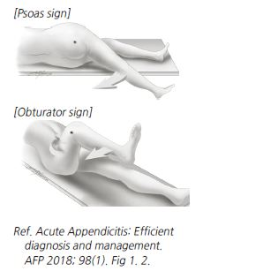
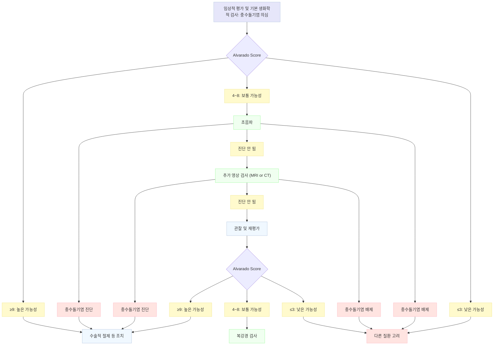

# 급성 충수염 Acute Appendicitis

## 일반 사항

* 호발 연령 : 10\~30세(특히 12\~18세)
* 평생 유병률 : 7\~8%
* 원인 : appendiceal lumen 폐쇄; 대변 덩이(가장 흔함), 림프조직 과증식(소아에서 흔함), 씨앗/이물, 기생충, 협착, 섬유증, 종양
* 사망률 : 합병증이 없는 젊은층 ＜1%, 천공된 고령층 ＞10%
* 전체 충수절제술 중 10\~20%, 사춘기 여아의 경우 30\~40%가 음성(정상 충수); 위양성을 줄이기 위하여 진단이 늦어질 경우에는 천공 등 합병증 발생 위험이 증가함

#### 임상 양상

#### 복통 양상

*   배꼽 주위의 막연한 통증, 간혹 배꼽 주위 또는 상복부의 심한 통증

    → 시간 경과(4\~48시간)에 따라 우하복부로 통증 부위 이동, 급격한 통증 악화
* 통증은 악화-완화 패턴을 보이지 않으며 지속됨, 배변으로 완화되지 않음
* 걷거나 기침, 차를 타고 있을 때 차의 흔들림 등 복부 움직임 시 심한 통증

#### 복통 외 증상

* malaise, 식욕 부진, 간혹 배고픔
* 발열 : 보통 미열(＜38℃). 고열은 천공이나 다른 질환 가능성; 소아에서는 발열이 중요한 징후
* 구역/구토 : 간혹 담즙성, 지속, 점차 악화; 보통 충수염 초기에는 구토 횟수가 많지 않음, 처음 24\~48시간 동안 1\~3회 정도 발생
* 변비 &/or 설사
* T12 level 피부의 hyperesthesia
* 두통, 오한, 근육통 등 전신 증상은 적음
* 요관 또는 방광 근처 염증 시 요로 증상 발생
* retrocecal appendicitis 시 복부 바깥쪽 및 뒤쪽에서 통증; 보다 천천히(4\~5일) 진행됨

### 합병증

* 감염, 복강 내 농양, 주위 인접 장기 누관 형성; 천공이 없는 경우 3\~7%, 천공 발생 시 15\~30%에서 발생
* 천공 : 보통 충수염 의심 후 36\~48시간 이내 발생; 천공율- 30\~40%, ＜5세에서는 ＞80%; WBC ＞20,000, 고열(＞38.9℃), ＞24시간 복통 지속(천공 시 일시적으로 복통이 줄어들 수 있음), 복부 종괴

## 진단

### 신체검사

* 특이 복통 양상. 단, 전형적인 양상은 환자의 50%에서만 나타남
*   특이 자세 : (통증을 줄이기 위해) 앞으로 구부리고 오른쪽으로 기울인 자세를 취함, 천천히 움직임,

    바로 누웠을 때 오른쪽 무릎을 구부려 배 쪽으로 당기고 있음
* 청진 : 정상 또는 약간 증가된 장음 → 진행되면 감소
* 복근 경직(voluntary & involuntary guarding)
* 우하복부(McBurney point) 압통 및 반동 압통 : 충수가 다른 위치에 있을 때는 적게 나타남
  * 소아에서는 반동 압통이 매우 심한 통증을 유발할 수 있으므로 부드럽게 손가락 타진 시행

#### 복막 자극 증상

<figure><figcaption></figcaption></figure>

* Rovsing’s sign : 좌하복부 압박 시 우하복부에서 통증 발생
* Psoas sign : 좌측으로 누운 자세에서 우측 고관절을 후방으로 과신전 시킬 때 통증 유발; 특히 retrocecal appendix에서 양성
* Obturator sign : 대퇴 굴곡 & 고관절 내회전시 통증 유발; 특히 pelvic appendix에서 양성
  * 방법 : 바로 누운 자세에서 오른쪽 무릎과 고관절을 90° 굴곡시키고 무릎 바깥쪽을 받쳐 잡고 아래 다리를 바깥쪽으로 움직임
* Dunphy sign : 기침 등 복벽을 움직이는 동작으로 통증 유발
* 소아에서는 진단적 의미가 적음

#### 비전형적 증상

* Retrocecal appendix : 통증이 덜함, 복부 압통이 덜함, 국소화가 덜함; Rt flank pain이 나타남, Psoas sign 양성
* Pelvic appendicitis : 복부 압통 없음; 하복부 통증, 요의/변의, 골반/직장 검사 시 압통, Obturator sign 양성
* 고령 : 증상이 약하고 모호함, 복부 압통 경미
* 임신 : RLQ, 배꼽 주위, Rt subcostal 통증

#### 충수염 진단 scoring system

다음은 이미지의 내용을 표로 정리한 것입니다.

<table data-header-hidden><thead><tr><th width="366"></th><th></th><th></th></tr></thead><tbody><tr><td><strong>Clinical Variable</strong></td><td><strong>Alvarado score</strong></td><td><strong>Pediatric Appendicitis score</strong></td></tr><tr><td>우하복부로의 통증 부위 이동</td><td>1</td><td>1</td></tr><tr><td>식욕 부진</td><td>1</td><td>1</td></tr><tr><td>구역/구토</td><td>1</td><td>1</td></tr><tr><td>우하복부 압통</td><td>2</td><td>2</td></tr><tr><td>우하복부 반동압통</td><td>1</td><td>2</td></tr><tr><td>체온 상승 (성인 >37.3℃, 소아 >38.0℃)</td><td>1</td><td>1</td></tr><tr><td>Leukocytosis (≥10,000/μℓ)</td><td>2</td><td>1</td></tr><tr><td>WBC Lt shift (≥75% neutrophilia)</td><td>1</td><td>1</td></tr><tr><td>기침, 타진, 또는 오른쪽 발끝 강충 덕으로 통증 유발</td><td>-</td><td>2</td></tr><tr><td><strong>Total</strong></td><td><strong>10</strong></td><td><strong>10</strong></td></tr></tbody></table>

* 판정 (충수염 가능성) : ≤3점 → 낮음 (성인/소아 3%), 4\~6점 → 관찰 또는 추가 평가, ≥7점 → 높음 (성인 84%, 소아 86%); _연구자에 따라 cutoff 점수가 다소 상이하게 보고됨_

Ref: _Ann Emerg Med._ 2014 Oct;64(4):365\~372, _J Pediatr Surg._ 2002:37

### 검사

* 민감도 또는 특이도가 높은 검사 방법은 없으며, 검사로 충수염을 배제할 수 없음
* 임상적 판단이 모호할 때 시행
* 실험실 검사 : CBC(WBC 1\~2만, neutrophilia), 전해질, 간 기능, CRP, 소변(¼에서 혈뇨/농뇨); 기타 감별을 위한 검사 시행. 특히 가임 여성에서 hcg 시행
* 영상 검사 : CT or MRI(민감도/특이도 95%), 초음파(민감도 75\~90%)

### 감별

* enteritis(세균, 바이러스) : 심한 구역, 구토, 설사; 소화불량, 북부 팽만; 보통 복통보다 구역/구토가 먼저 발생
* epiploic appendagitis : 이동이나 진행이 없는 국소 복통/압통; 다른 소화기 증상(예: 구역)은 없음; 실혐실 검사는 보통 정상
* mesenteric adenitis : 지속적 복통; 발열은 드묾; RLQ의 이학적 소견은 덜 현저함; WBC는 보통 정상
* pyelonephritis : 심한 옆구리 통증, 고열; 농뇨, 세균뇨, 기타 요로 증상; 복부 경직은 현저하지 않음
* renal colic(renal stone) : 심한 허리/하복부 통증, 서혜부로의 방사통; 혈뇨
* 급성 췌장염 : 심한 구토, 복통; 압통은 잘 국소화되지 않음; s-amylase & lipase↑
* Crohn Dz : 증상 반복; 설사가 흔함; 종종 종괴가 촉지됨; 관절염, 피부 증상, 안구 질환 등 장외 증상이 나타날 수 있음
* cholecystitis : 발생 병력이 있음; 우상복부 통증/압통, 발열, WBC↑; 구역, 우측 어깨로의 방사통; CRP, LFT, bilirubin 상승
* meckel diverticulitis : 무증상 출혈 후 복통 발생; 임상 징후로 충수염과 감별하기 어려움
* cecal diverticulitis : 증상이 더 약하고 오래 지속; 임상징후로 충수염과 감별하기 어려움
* sigmoid diverticulitis : 고령에서 흔함; bowel habit변화 (변비 또는 설사); 치골 상부로의 방사통; 발열, WBC↑
* small bowel obstruction : 복부 수술 병력; 심한 발작성 또는 경련성 복통; 현저한 구토(담즙성), 복부 팽만
* ectopic pregnancy : 불규칙 월경; 보통 진행성 증상은 없음, 구역/구토는 드묾; 임신 검사 양성
*   ruptured ovarian cyst : 월경 주기 중간에 갑자기 발생한 복통; 복부 이외의 다른 부위에서 통증을 느낄 수 있음;

    구역/구토는 드묾; WBC 정상
* ovarian torsion : 현저한 구토가 통증과 동시에 발생; 보통 진행성 증상은 없음; 복부 또는 골반에서 종괴 촉지
* acute salpingitis or tuboovarian absecss : 하복부에서 시작되고 지속되는 복통; 종종 성병 병력; 질 분비물, 현저한 자궁 경부 압통&#x20;

충수돌기염 진단 알고리듬
\
Ref. EAES Diagnosis and management of acute appendicitis. Surg Endosc 2016;30(11). Fig 2.

***

## Management

### 치료 원칙

* 발열 및 통증 관리 : 충수염 진단 전부터 시행 가능
  * 진통제 투여에 의한 통증 조절이 진단을 방해할 가능성은 매우 적음
* 충수절제술(복강경 수술 선호)
* 비수술적 치료 : 항생제, 배액술; 재발 및 천공 위험이 있음; 수술이 어려운 경우 고려

### 항생제 치료

* 합병증이 없는 소아 충수염 환자에서 수술이 아닌 IV 항생제 치료를 시행하였을 때 환자군의 ⅔에서 다음 해까지 수술 없이 지냈다는 보고가 있음
* 25년 관찰 연구에서 비수술적 치료가 실패 15%, 1년 내 수술 25% 및 60%에서 관찰 기간 중 합병증 없이 절제술을 받지 않았다는 보고가 있음
* 합의된 항생제 치료 지침은 없음(보고된 연구들은 대부분 8\~12일간 IV & PO 병용)
* 합병증이 없는 성인에서 항생제에 대한 일차적인 비반응 관련 요인 : appendicolith 존재, 영상에서의 충수 직경 ≥15 ㎜, ＞38 ℃

### 수술 후 활동 제한

* 합병증이 없는 경우 1\~2주 후 업무 복귀 가능
* 4\~6주간 활동 제한 : 무거운 물건(5 ㎏) 들기 제한, 힘든 신체 활동 제한

### **질병코드**&#x20;

K35 급성 충수염

K36 기타 충수염

K37 상세불명의 충수염
