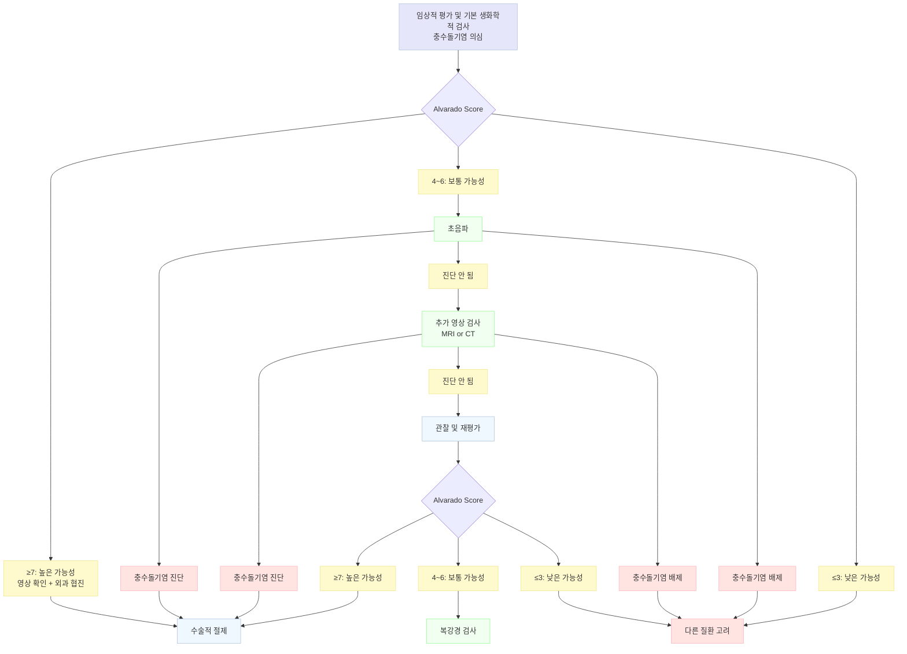

# 급성 충수염 Acute Appendicitis

## <mark style="color:green;">일반 사항</mark>

* 호발 연령 : 10\~30세 (특히 12\~18세)
* 평생 유병률 : 7\~8%
* 원인 : appendiceal lumen 폐쇄 — 대변 덩이(가장 흔함), 림프조직 과증식(소아에서 흔함), 씨앗·이물, 기생충, 협착, 섬유증, 종양
* 사망률 : 합병증이 없는 젊은층 ＜1%, 천공된 고령층 ＞10%
* 진단 정확도 : 전체 충수절제술 중 10\~20%가 음성(정상 충수); 사춘기 여아에서는 30\~40% — 위양성을 줄이려 진단을 늦추면 천공 위험이 증가

### <mark style="color:orange;">분류</mark>

* **비복잡성 (uncomplicated)** : 천공·농양·괴저 없는 단순 충수 염증
* **복잡성 (complicated)** : 천공, 복강 내 농양(국소 또는 광범위), 괴저성 충수, 범발성 복막염

### <mark style="color:orange;">합병증</mark>

* 복강 내 농양, 인접 장기 누관 형성 : 천공이 없는 경우 3\~7%, 천공 발생 시 15\~30%
* **천공** : 증상 발생 후 시간이 지연될수록 천공 위험이 증가하며, 특히 36\~48시간 이후 위험이 유의하게 상승함; 전체 천공률 30\~40%, ＜5세에서 ＞80%
  * 천공 의심 징후 : WBC ＞20,000, 고열 (＞38.9℃), 복통 지속 ＞24시간 (천공 시 일시적으로 복통이 경감될 수 있음), 복부 종괴

## <mark style="color:green;">임상 양상</mark>

### <mark style="color:orange;">복통 양상</mark>

* 배꼽 주위의 막연한 통증으로 시작
  → 4\~48시간 경과 후 **우하복부(McBurney point)로 이동·악화**
* 통증은 지속적 (악화-완화 패턴 없음, 배변으로 완화되지 않음)
* 걷기, 기침, 차량 진동 등 복부 움직임 시 현저하게 악화
* 전형적인 양상은 환자의 약 50%에서만 나타남

### <mark style="color:orange;">복통 외 증상</mark>

* 식욕 부진, 전신 불쾌감
* 구역·구토 : 복통 이후 발생 (복통보다 선행하면 다른 진단 고려); 초기 24\~48시간 동안 1\~3회 정도
* 발열 : 보통 미열 (＜38℃); 고열은 천공 또는 다른 질환 가능성 — 소아에서는 발열이 중요 징후
* 변비 또는 설사
* 요관·방광 근처 염증 시 빈뇨·배뇨 곤란 등 요로 증상

### <mark style="color:orange;">신체검사 소견</mark>

* 특이 자세 : 앞으로 구부리고 오른쪽으로 기울임, 천천히 움직임, 앙와위에서 오른쪽 무릎을 굴곡하여 배 쪽으로 당김
* 우하복부(McBurney point) 압통 및 반동 압통
  * 소아 : 반동 압통이 매우 심할 수 있으므로 부드러운 손가락 타진으로 대신
  * 성인·소아 공통 — **Heel drop test (Markle sign)** (발뒤꿈치를 들었다가 바닥에 쿵 떨어뜨리게 함) 또는 **Bed bump test** (검사자가 침대를 살짝 흔듦)가 반동 압통보다 환자 친화적이며 복막 자극 확인에 유용
* 복근 경직 (voluntary & involuntary guarding)
* 복막 자극 징후

<div align="right" data-with-frame="true"><figure><figcaption></figcaption></figure></div>

<table><thead><tr><th width="160">징후</th><th width="290">검사 방법</th><th>임상 의미</th></tr></thead><tbody><tr><td>Rovsing's sign</td><td>좌하복부를 하방에서 상방으로 쓸어 올리듯 압박 시 대장 내 가스가 역류하여 충수를 자극, 우하복부 통증 발생</td><td>복막 자극</td></tr><tr><td>Psoas sign</td><td>좌측 와위에서 우측 고관절을 후방 과신전 시 통증</td><td>Retrocecal appendix 의심</td></tr><tr><td>Obturator sign</td><td>앙와위에서 우측 고관절·슬관절 90° 굴곡 후 고관절 내회전 시 통증</td><td>Pelvic appendix 의심</td></tr><tr><td>Dunphy sign</td><td>기침 시 우하복부 통증 유발</td><td>복막 자극</td></tr></tbody></table>

### <mark style="color:orange;">비전형적 양상</mark>

<table><thead><tr><th width="170">아형·대상</th><th>특징</th></tr></thead><tbody><tr><td>Retrocecal appendix</td><td>복통·압통이 덜하고 국소화 어려움; 우측 옆구리 통증; Psoas sign 양성</td></tr><tr><td>Pelvic appendicitis</td><td>복부 압통 없음; 하복부 통증, 요의·변의; 골반·직장 검사 시 압통; Obturator sign 양성</td></tr><tr><td>고령</td><td>증상이 약하고 모호함, 복부 압통 경미; 천공·사망률 높음</td></tr><tr><td>임신</td><td>자궁 상방 전위로 압통 위치가 RLQ → 배꼽 주위 → Rt subcostal로 변화; 복막 징후 감소</td></tr><tr><td>소아 (＜5세)</td><td>오심·구토·발열이 두드러짐; 진단 지연으로 천공률 ＞80%; 복막 자극 징후의 진단적 의미 적음</td></tr></tbody></table>

### <mark style="color:$danger;">🚩 Red Flags!</mark>

<mark style="color:$danger;">**즉각 이송/응급 평가**</mark> <mark style="color:$danger;">— 천공·복막염 또는 패혈증 징후</mark>

* 복부 전반 경직 (board-like rigidity) 및 반동 압통 — 범발성 복막염 의심
* 고열 (＞38.9℃) + WBC ＞20,000/μL + 복통 ＞24시간 지속 — 천공 가능성 높음
* 복부 종괴 촉지 — 농양 형성 가능성
* 저혈압, 빈맥, 의식 변화 — 패혈성 쇼크
* **고령·임산부** : 증상이 경미·비전형적이어도 천공·패혈증 위험이 높으므로 임상 의심 시 적극적 평가

<mark style="color:$warning;">**당일 또는 조기 의뢰**</mark>

* 복막 자극 징후, 진행성 통증, 중등도 이상의 임상적 의심 (Alvarado ≥4) — 응급 평가 또는 외과 협진 고려
* 소아 (특히 ＜5세) 충수염 의심 — 천공 위험이 매우 높으므로 조기 의뢰
* 임신 중 우하복부 통증 — 충수염 배제를 위한 즉시 평가 필요
* Alvarado/PAS Score ≥7 — 강한 임상적 의심; 영상 확인 후 외과 협진

<mark style="color:$info;">**외래 추적 / 추가 평가 계획**</mark> <mark style="color:$info;">— 즉각 위험 낮으나 호전 없으면 의뢰</mark>

* Alvarado Score 4\~6 — 영상 검사 시행 또는 입원 관찰
* 증상이 경미·비전형적으로 다른 원인이 더 의심되나 충수염을 완전히 배제하기 어려운 경우

## <mark style="color:green;">진단</mark>

### <mark style="color:orange;">진단 원칙</mark>

* 단일 검사로 충수염을 확진하거나 완전히 배제하는 방법은 없음
* 병력·신체검사 → 임상 점수 산정 → 영상 검사의 순서로 단계적 평가
* **진통제 투여는 충수염 진단 전부터 가능** — opioid를 포함한 적절한 진통은 신체검사 정확도를 유의하게 저하시키지 않는 것으로 알려져 있음
* **CRP + WBC 조합** : 두 수치가 모두 정상이면 충수염 가능성이 매우 낮음; 단, 초기 충수염에서는 정상일 수 있으므로 임상 소견과 함께 판단

### <mark style="color:orange;">임상 점수 (Scoring System)</mark>


**Alvarado Score** (성인·소아 공통)와 **Pediatric Appendicitis Score (PAS)** (소아 우선 권장)를 병행 참고. 연구자에 따라 cutoff 기준이 다소 다르게 보고됨.\
두 점수 모두 **단독 확진 도구보다 저위험군 배제(rule-out)에 더 유용**하다. ≥7점이어도 영상 확인 후 치료 방침을 결정하는 것이 현대적 접근이며, PAS는 특이도가 낮아 중간 위험군에서는 영상 평가가 필요하다.\
✽성인에서 **AIR score (Appendicitis Inflammatory Response score)** 도 활용도가 높으며, WBC·CRP·체온·통증 이동·반동 압통·복근 경직 등 7개 항목으로 구성됨 (0\~12점; ≥9 → 수술 권장).


<table><thead><tr><th width="310">Clinical Variable</th><th width="130" align="center">Alvarado</th><th align="center">PAS (소아)</th></tr></thead><tbody><tr><td>우하복부로의 통증 부위 이동</td><td align="center">1</td><td align="center">1</td></tr><tr><td>식욕 부진</td><td align="center">1</td><td align="center">1</td></tr><tr><td>구역·구토</td><td align="center">1</td><td align="center">1</td></tr><tr><td>우하복부 압통</td><td align="center">2</td><td align="center">2</td></tr><tr><td>우하복부 반동 압통</td><td align="center">1</td><td align="center">—</td></tr><tr><td>체온 상승 (성인 ＞37.3℃, 소아 ＞38.0℃) <em>(미열 기준)</em></td><td align="center">1</td><td align="center">1</td></tr><tr><td>백혈구증가증 (≥10,000/μℓ)</td><td align="center">2</td><td align="center">1</td></tr><tr><td>핵 좌방 이동 (neutrophilia ≥75%)</td><td align="center">1</td><td align="center">1</td></tr><tr><td>기침·타진 또는 발뒤꿈치 낙하 시 통증 유발 (heel drop/Markle sign)</td><td align="center">—</td><td align="center">2</td></tr><tr><td><strong>합계</strong></td><td align="center"><strong>10</strong></td><td align="center"><strong>10</strong></td></tr></tbody></table>

* 판정 : ≤3점 → 가능성 낮음 (성인·소아 약 3%); 4\~6점 → 관찰 또는 추가 평가; ≥7점 → 가능성 높음 (성인 84%, 소아 86%)

Ref: _Ann Emerg Med._ 2014;64(4):365–372 / _J Pediatr Surg._ 2002;37

### <mark style="color:orange;">검사</mark>

* **실험실 검사** : CBC (WBC 1\~2만, neutrophilia), 전해질, 간기능, CRP, 소변검사 (¼에서 혈뇨·농뇨); 가임기 여성 **β-hCG 필수** (자궁외임신 감별)
* **영상 검사**

<table><thead><tr><th width="120">검사</th><th width="180">민감도/특이도</th><th>비고</th></tr></thead><tbody><tr><td>복부 CT (조영)</td><td>~95% / ~95%</td><td>표준 검사; 임신·소아에서는 방사선 피폭 고려</td></tr><tr><td>MRI</td><td>~95% / ~95%</td><td>특히 임신부·소아에서 높은 진단 정확도; CT의 유효한 대안. 비용·시간 높음, availability 제한</td></tr><tr><td>초음파</td><td>60~90% / ~95%</td><td>1차 영상 검사 가능; operator-dependent (숙련도에 따라 민감도 편차 큼), 비만·가스 장애 시 제한.<br/>핵심 소견 : 압박 불가능한 직경 ≥6 ㎜ 충수, 벽 두께 ≥3 ㎜, 충수 주위 지방층 음영 증가 (hyperechoic periappendiceal fat)</td></tr></tbody></table>


**소아·임신 충수염 영상 전략**\
소아와 임산부에서는 방사선 피폭을 최소화하기 위해 초음파를 1차 검사로 시행하고, 비진단적일 때 MRI로 진행한다. CT는 MRI가 불가하거나 응급 상황에서 차선으로 사용한다 (WSES Guidelines 2020).


### <mark style="color:orange;">감별 진단</mark>


**실전 감별 — 5분 안에 배제할 핵심 포인트**

<table><thead><tr><th width="185">질환</th><th width="220">결정적 감별 포인트</th><th>핵심 검사</th></tr></thead><tbody><tr><td>Renal colic</td><td>극심한 허리→서혜부 방사통; 가만히 못 있음(restless)</td><td>소변 혈뇨, CT</td></tr><tr><td>Gastroenteritis</td><td>구역·구토·설사가 복통보다 먼저; 광범위 통증</td><td>임상 진단</td></tr><tr><td>Ovarian torsion</td><td>갑작스럽고 심한 통증과 동시에 현저한 구토</td><td>골반 초음파</td></tr><tr><td>Ectopic pregnancy</td><td>무월경 또는 불규칙 월경 병력</td><td>β-hCG 즉시 시행</td></tr><tr><td>Ovarian cyst rupture</td><td>월경 주기 중간 갑작스러운 통증; WBC 정상</td><td>골반 초음파</td></tr></tbody></table>


<table><thead><tr><th width="210">질환</th><th>감별 포인트</th></tr></thead><tbody><tr><td>Enteritis (감염성)</td><td>복통보다 구역·구토·설사 먼저; 소화불량·복부 팽만</td></tr><tr><td>Epiploic appendagitis</td><td>이동 없는 국소 복통·압통; 소화기 증상 없음; 실험실 정상</td></tr><tr><td>Mesenteric adenitis</td><td>최근 상기도 감염(감기) 병력 흔함; 발열·WBC 상승 동반 가능; RLQ 압통 위치가 고정되지 않고 체위에 따라 변화 (Sharpen's sign)</td></tr><tr><td>Pyelonephritis</td><td>심한 옆구리 통증, 고열; 농뇨·세균뇨; 복부 경직 없음</td></tr><tr><td>Renal colic</td><td>심한 허리·하복부 통증, 서혜부 방사통; 혈뇨; 발작성</td></tr><tr><td>급성 췌장염</td><td>심한 구토; 압통 국소화 어려움; amylase·lipase 상승</td></tr><tr><td>Crohn disease</td><td>증상 반복; 설사 흔함; 관절·피부·안구 장외 증상</td></tr><tr><td>Cholecystitis</td><td>우상복부 통증·발열; 우측 어깨 방사통; LFT·bilirubin 상승</td></tr><tr><td>Meckel diverticulitis</td><td>무증상 출혈 후 복통; 임상 소견으로 충수염과 구별 어려움</td></tr><tr><td>Cecal diverticulitis</td><td>증상 더 경미하고 오래 지속; 임상 소견으로 구별 어려움</td></tr><tr><td>Sigmoid diverticulitis</td><td>고령 흔함; 배변 습관 변화; 치골 상부 방사통; 발열·WBC 상승</td></tr><tr><td>Small bowel obstruction</td><td>복부 수술 병력; 심한 발작성 복통; 담즙성 구토·복부 팽만</td></tr><tr><td>Ectopic pregnancy</td><td>불규칙 월경; 구역·구토 드묾; β-hCG 양성</td></tr><tr><td>Ruptured ovarian cyst</td><td>월경 주기 중간 갑작스러운 복통; WBC 정상</td></tr><tr><td>Ovarian torsion</td><td>심한 구토와 복통이 동시 발생; 복부·골반 종괴</td></tr><tr><td>Acute salpingitis/TOA</td><td>하복부에서 시작하는 지속 복통; 성병 병력; 질 분비물; 자궁경부 압통</td></tr></tbody></table>

***



<p align="center"><strong>충수돌기염 진단 알고리듬</strong></p>

<p align="center"><em><mark style="color:$info;">Ref. EAES Diagnosis and management of acute appendicitis. Surg Endosc 2016;30(11). Fig 2.</mark></em></p>

***

## <mark style="background-color:$warning;">Management</mark>

### <mark style="color:orange;">치료 원칙</mark>


**급성 충수염 — 외과적 응급 질환**\
충수염 가능성이 중등도 이상이거나 배제가 어려운 경우 응급 평가 또는 외과 협진을 고려한다. 1차 진료 의사의 역할은 조기 인지, 진통·해열 조절, 비수술적 치료 선택 시 항생제 처방 및 수술 후 외래 관리에 있다.


* **복잡성 vs. 비복잡성** 분류에 따라 치료 방침 결정
* 복강경 충수절제술이 표준 치료 (개복술 대비 회복 빠름, 합병증 적음)
* 비수술적 치료(항생제)는 비복잡성 충수염에서 선택적으로 고려 가능

### <mark style="color:orange;">수술 치료</mark>

* **즉각 수술 적응증** : 복잡성 충수염 (천공·괴저·범발성 복막염), Alvarado ≥7 + 영상 확진, 비수술적 치료 실패
* 복잡성 충수염 : 수술 전 IV 광범위 항생제 선투여
* 합병증이 없는 경우 수술 후 1\~2주 후 업무 복귀 가능

### <mark style="color:orange;">비수술적 치료 (항생제 치료)</mark>


**비수술적 치료 근거 — CODA Trial (NEJM 2020) · APPAC II (JAMA 2021)**\
비복잡성 성인 충수염에서 항생제 치료는 수술의 합리적 대안. 항생제 치료군의 약 71%가 90일 내 수술을 피함. 1년 내 재발·수술은 약 25\~30%, 장기(5년) 누적 수술률은 30\~40%까지 보고됨 — 환자 상담 시 충분히 설명 필요.



**⚠️ Appendicolith — 치료 방침의 분기점**\
Appendicolith(분석)가 존재하면 비수술적 치료 실패율이 약 41%로 상승 (vs. 없을 때 17%), 천공·재발 위험도 증가한다. **수술을 강력히 선호**하며, 비수술적 치료를 선택할 경우 환자에게 충분히 설명하고 면밀한 추적 관찰이 필요하다.


**수술 vs. 항생제 치료 비교 (Shared Decision Making)**

<table><thead><tr><th width="220">항목</th><th width="220">수술 (복강경 충수절제술)</th><th>항생제 단독</th></tr></thead><tbody><tr><td>재발 가능성</td><td>거의 없음 (근치적)</td><td>1년 내 약 25~30%</td></tr><tr><td>침습성</td><td>수술·마취 필요</td><td>비침습적</td></tr><tr><td>입원 기간</td><td>1~2일 (복강경)</td><td>2~4일 (IV 항생제)</td></tr><tr><td>회복 기간</td><td>1~2주</td><td>더 짧을 수 있음</td></tr><tr><td>Appendicolith 동반 시</td><td>권장</td><td>상대적 비권장 (실패율 높음)</td></tr><tr><td>적합 대상</td><td>복잡성·고위험군, 환자 선호</td><td>비복잡성, appendicolith 없음, 수술 위험 높은 환자</td></tr></tbody></table>

**비수술적 치료 적합 조건** (모두 충족 시 고려):

* 영상으로 비복잡성 충수염 확인 (천공·농양 없음)
* Appendicolith 부재 (있으면 상대적 비권장)
* 충수 직경 ＜15 ㎜
* 발열 ＜38.5℃, WBC ＜18,000
* 환자 충분한 동의 및 추적 관찰 가능 환경

**비수술적 치료 금기** : 천공·범발성 복막염·농양, 고열(＞38.9℃), 초기 항생제 무반응, 환자 거부

**복잡성 충수염 — 복강 내 농양 동반 시**\
국소 농양이 형성된 경우 **경피 배액술 + 항생제** 후 interval appendectomy (6\~8주 후)를 고려할 수 있다. 범발성 복막염은 즉각 수술.

**항생제 프로토콜** (합의된 단일 표준 없음; 총 치료 기간 8\~10일 권고)

<table><thead><tr><th width="150">단계</th><th width="200">약제</th><th>용량·용법</th></tr></thead><tbody><tr><td>IV 단계<br/>(입원 24~72시간)</td><td>ceftriaxone + metronidazole<br/>(비복잡성 1차 선택)</td><td>ceftriaxone 2 g qd IV<br/>metronidazole 500 ㎎ q8h IV</td></tr><tr><td></td><td>ampicillin-sulbactam<br/><mark style="color:blue;">\[유나신]</mark></td><td>3 g q6\~8h IV</td></tr><tr><td></td><td>piperacillin-tazobactam<br/>(복잡성·중증 1차 선택)</td><td>4.5 g q6~8h IV</td></tr><tr><td></td><td>ertapenem <mark style="color:blue;">\[인반즈]</mark><br/>(복잡성·ESBL 우려 시)</td><td>1 g qd IV</td></tr><tr><td>경구 전환<br/>(증상 호전 후)</td><td>amoxicillin-clavulanate<br/><mark style="color:blue;">\[오구멘틴]</mark></td><td>625 ㎎ tid pc × 7일</td></tr><tr><td></td><td>ciprofloxacin + metronidazole<br/>(penicillin 알레르기 시)</td><td>ciprofloxacin 500 ㎎ bid<br/>metronidazole 500 ㎎ tid × 7일</td></tr></tbody></table>

### <mark style="color:orange;">수술 후 외래 관리</mark>

* 합병증이 없는 경우 1\~2주 후 업무 복귀, 4\~6주간 활동 제한 (＞5 ㎏ 들기·격한 운동 제한)
* **통증 관리** : NSAIDs (ibuprofen, celecoxib) ± acetaminophen 교호 사용
* **수술 부위 관찰** : 발적, 삼출, 발열, 악취 — 감염 징후 시 즉시 내원 지시

***

### <mark style="color:red;">질병코드</mark>

K35 급성 충수염

K36 기타 충수염

K37 상세불명의 충수염

***

## <mark style="color:purple;">처방례</mark>

> **처방례 1. 비수술적 치료 — 경구 전환 단계 (퇴원 후)**
>
> ```
> 오구멘틴 625 ㎎/T  1T  tid  pc  × 7일
> ```
>
> _✽IV 항생제 (ceftriaxone + metronidazole 또는 ampicillin-sulbactam, 24\~72시간) 이후 증상 호전 시 경구로 전환. amoxicillin-clavulanate 알레르기 또는 불내성 시 ciprofloxacin 500 ㎎ bid + metronidazole <mark style="color:blue;">\[후라시닐]</mark> 500 ㎎ tid × 7일로 대체. 증상 악화 시 즉시 재내원 지시_

> **처방례 2. 수술 후 통증 관리 (경증-중등도)**
>
> ```
> 이부프로펜 400 ㎎/T  1T  tid  pc
> 타이레놀 500 ㎎/T  1~2T  tid~qid  pc  (4~6시간 간격, 1일 최대 4 g)
> ```
>
> _✽NSAIDs와 acetaminophen 교호 사용으로 진통 효과 극대화. NSAIDs 위장 자극 우려 시 celecoxib <mark style="color:blue;">\[세레브렉스]</mark> 200 ㎎ bid 또는 PPI 병용. 음주 환자에서 acetaminophen 4 g/일 미만 유지_
>
> _✽수술 직후 1주 내 통증이 날카로운 경우 tramadol/acetaminophen 복합제 <mark style="color:blue;">\[울트라셋]</mark> 37.5/325 ㎎ 1T prn (또는 bid\~tid × 2\~3일)를 옵션으로 추가 처방 가능. 변비·오심 부작용 주의_

> **처방례 3. 진통·해열 (의뢰 전 응급처치)**
>
> ```
> 타이레놀 500 ㎎/T  1~2T  prn  (4~6시간 간격, 1일 최대 4 g)
> ```
>
> _✽충수염 의심 시 의뢰 전 진통·해열 목적으로 투여. NSAIDs 사용 가능하나 위장 출혈·신기능 저하 고위험군에서는 acetaminophen 단독 선호_

***

### <mark style="color:$success;">핵심 복약 지도</mark>

> **항생제 복용 안내 (비수술적 치료 — 경구 단계)**
>
> 1. 처방된 항생제를 **정해진 기간(7\~10일) 동안 끝까지** 복용하십시오. 증상이 나아져도 임의 중단하면 재발·내성 위험이 있습니다.
> 2. **식사 직후에 복용**하십시오. 공복 복용 시 소화기 부작용(복통·구역)이 증가합니다.
> 3. 설사, 복통, 구역이 심해지거나 발열이 다시 오르면 즉시 내원하십시오.

> **소염진통제 복용 안내 (수술 후 통증 관리)**
>
> 1. **식사 직후에 복용**하십시오. 빈속 복용 시 위장 장애가 생길 수 있습니다.
> 2. ibuprofen과 타이레놀은 작용 기전이 달라 교대 사용이 가능합니다. 두 약을 동시에 복용하면 안 됩니다.
> 3. **음주 중에는 타이레놀을 과용하지 마십시오** (간독성 위험). 1일 최대 4 g (일반 성인), 음주 중에는 2 g을 넘기지 않는 것이 안전합니다.

> **언제 즉시 내원해야 하나요?**
>
> * 복통이 다시 심해지거나 새로운 부위로 퍼지는 경우
> * 발열 (38℃ 이상) 또는 오한이 생기는 경우
> * 수술 부위가 붉어지거나 붓고, 진물이 나거나 냄새가 나는 경우
> * 항생제 복용 중 48\~72시간 이내 증상이 호전되지 않는 경우

***

### <mark style="color:blue;">환자 안내서</mark>


**급성 충수염 — 빠른 진단과 적절한 치료가 가장 중요합니다**

일반적으로 **'맹장염'**이라고 부르는 질환입니다. 실제로는 맹장 끝에 달린 작은 돌기(충수돌기)에 염증이 생긴 상태입니다. 대부분 수술로 치료하지만, 단순 충수염은 항생제만으로 치료하기도 합니다. 의심 증상이 있으면 지체 없이 병원을 찾으십시오.


#### <mark style="color:$primary;">어떤 증상이 나타나나요?</mark>

* 배꼽 주위에서 시작하여 **오른쪽 아랫배로 이동하는 통증**이 가장 전형적인 증상입니다.
* 식욕 저하, 구역, 미열이 동반될 수 있습니다.
* 걸을 때, 기침할 때, 차가 흔들릴 때 통증이 심해집니다.
* 통증은 쉬어도 나아지지 않고 지속됩니다.

#### <mark style="color:$primary;">치료는 어떻게 받나요?</mark>

* **수술 치료 (표준)** : 대부분 복강경(작은 구멍 3개)으로 충수를 제거합니다. 회복이 빠르고 합병증이 적습니다.
* **항생제 치료 (선택적)** : 단순 충수염(천공 없음)에서 일부는 항생제만으로 치료하기도 합니다. 단, 약 25\~30%에서 1년 내 재발하여 수술이 필요할 수 있습니다.
* 어떤 치료를 선택하든 의사와 충분히 상의하십시오.

#### <mark style="color:$primary;">수술 후 생활 안내</mark>

* 가벼운 일상 복귀는 수술 후 **1\~2주**부터 가능합니다.
* **4\~6주간은 5 ㎏ 이상 드는 무거운 물건 들기와 격한 운동을 삼가십시오.** 수술 부위 봉합이 완전히 이루어지기 전에 무리하면 합병증이 생길 수 있습니다.
* 상처 주변이 붉어지거나 열감이 있으면, 분비물이 나오면 바로 병원에 오십시오.

#### <mark style="color:$primary;">이럴 때는 즉시 병원을 방문하세요 🚨</mark>

* 복통이 다시 심해지거나 배 전체로 퍼지는 경우
* 38℃ 이상 발열 또는 오한이 생기는 경우
* 배가 딱딱하게 굳거나 누르면 극심하게 아픈 경우
* 수술 후 상처 부위에 발적·삼출·악취가 나타나는 경우
* 항생제 치료 중 증상이 나아지지 않거나 악화되는 경우
