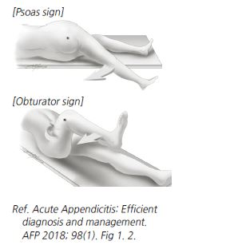
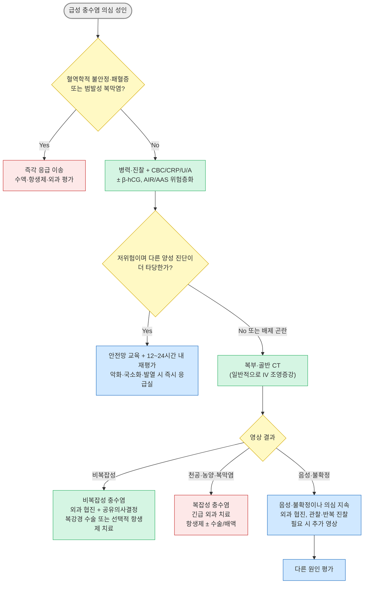

# 급성 충수염 Acute Appendicitis

## <mark style="color:green;">일반 사항</mark>

* 호발 연령 : 10\~30세 (특히 12\~18세)
* 평생 유병률 : 7\~8%
* 사망률 : 비괴저성·비천공 충수염은 ＜0.1%, 괴저성 약 0.6%, 천공성 약 5%; 고령·쇠약·패혈증 동반 시 증가
* 음성 충수절제율은 임상 양상, 성별·연령 및 영상검사 전략에 따라 달라지며, CT 등 영상검사의 보편화로 과거보다 감소

#### <mark style="color:$primary;">원인</mark>

* 정확한 발병 기전은 완전히 밝혀지지 않았으며, 충수강 폐쇄는 주요 병태생리 가설 중 하나
* 폐쇄 원인 : appendicolith, 림프조직 과증식(소아에서 흔함), 드물게 이물·기생충·협착·종양. 폐쇄 시 내압 상승 → 정맥·림프 배액 장애 → 허혈·세균 증식·염증 진행

#### <mark style="color:$primary;">분류</mark>

* 비복잡성 (uncomplicated) : 천공·농양·괴저 없는 단순 충수 염증
* 복잡성 (complicated) : 천공, 복강 내 농양(국소 또는 광범위), 괴저성 충수, 범발성 복막염

#### <mark style="color:$primary;">합병증</mark>

* 주요 합병증 : 천공, 국소 또는 범발성 복막염, 충수 주위 농양·염증성 종괴(phlegmon), 패혈증, 드물게 누관·장폐색
* 증상 지속시간이 길수록 천공·복잡성 충수염 가능성이 증가하지만, 모든 비복잡성 충수염이 시간 경과에 따라 필연적으로 천공되는 것은 아니며 36\~48시간을 절대적 분기점으로 사용하지 않음
  * 복잡성 충수염 의심 징후 : 고열, 현저한 백혈구증가·CRP 상승, 장기간 지속되는 통증, 복부 종괴, 복막 자극 징후, 패혈증 소견. 단독 소견이나 특정 조합만으로 천공을 확진할 수 없음

## <mark style="color:green;">임상 양상</mark>

### <mark style="color:orange;">복통 양상</mark>

* 배꼽 주위의 막연한 통증으로 시작 → 4\~48시간 경과 후 우하복부(McBurney point)로 이동·악화
* 통증은 지속적 : 악화-완화 패턴 없음, 배변으로 완화되지 않음
* 걷기, 기침, 차량 진동 등 복부 움직임 시 현저하게 악화
* 전형적인 양상은 환자의 약 50%에서만 나타남

### <mark style="color:orange;">복통 외 증상</mark>

* 식욕 부진, 전신 불쾌감
* 구역·구토 : 복통 이후 발생 (복통보다 선행하면 다른 진단 고려); 초기 24\~48시간 동안 1\~3회 정도
* 발열 : 보통 미열 (＜38℃); 고열은 천공 또는 다른 질환 가능성; 소아에서는 발열이 중요 징후
* 변비 또는 설사
* 요관·방광 근처 염증 시 빈뇨·배뇨 곤란 등 요로 증상

### <mark style="color:orange;">신체검사 소견</mark>

* 특이 자세 : 앞으로 구부리고 오른쪽으로 기울임, 천천히 움직임, 앙와위에서 오른쪽 무릎을 굴곡하여 배 쪽으로 당김
* 우하복부(McBurney point) 압통 및 반동 압통
  * 소아 : 반동 압통이 매우 심할 수 있으므로 부드러운 손가락 타진으로 대신
  * 성인·소아 공통 : Heel drop test(Markle sign, 발뒤꿈치를 들었다가 바닥에 쿵 떨어뜨리게 함) 또는 Bed bump test(검사자가 침대를 살짝 흔듦)가 반동 압통보다 환자 친화적이며 복막 자극 확인에 유용
* 복근 경직 (voluntary & involuntary guarding)
* 복막 자극 징후

<div align="center" data-with-frame="true"><figure><figcaption></figcaption></figure></div>

<table><thead><tr><th width="124">징후</th><th width="329">검사 방법</th><th>임상 의미</th></tr></thead><tbody><tr><td>Rovsing's sign</td><td>좌하복부를 깊게 압박할 때 우하복부 통증 발생</td><td>복막 자극</td></tr><tr><td>Psoas sign</td><td>좌측 와위에서 우측 고관절을 후방 과신전 시 통증</td><td>Retrocecal appendix 의심</td></tr><tr><td>Obturator sign</td><td>앙와위에서 우측 고관절·슬관절 90° 굴곡 후 고관절 내회전 시 통증</td><td>Pelvic appendix 의심</td></tr><tr><td>Dunphy sign</td><td>기침 시 우하복부 통증 유발</td><td>복막 자극</td></tr></tbody></table>

### <mark style="color:orange;">비전형적 양상</mark>

<table><thead><tr><th width="130">아형·대상</th><th>특징</th></tr></thead><tbody><tr><td>Retrocecal appendix</td><td>복통·압통이 덜하고 국소화 어려움; 우측 옆구리 통증, Psoas sign 양성</td></tr><tr><td>Pelvic appendicitis</td><td>전형적인 우하복부 압통이 약하거나 없을 수 있음; 하복부 통증, 요의·변의; 골반·직장 검사 시 압통, Obturator sign 양성</td></tr><tr><td>고령</td><td>증상이 약하고 모호함, 복부 압통 경미; 천공·사망률 높음</td></tr><tr><td>임신</td><td>압통 위치가 다소 상방·외측으로 이동할 수 있으나 임신 후기에도 우하복부 통증이 흔함; 복막 징후와 임상 점수의 진단 정확도가 낮아 검사실검사·영상검사를 적극적으로 시행</td></tr><tr><td>소아 (＜5세)</td><td>오심·구토·발열이 두드러짐; 진단 지연으로 천공률이 높음; 임상 점수가 낮게 나타날 수 있어 점수만으로 배제하지 않음</td></tr></tbody></table>

### <mark style="color:$danger;">🚩 Red Flags!</mark>

<mark style="color:$danger;">**즉각 이송/응급 평가**</mark> <mark style="color:$danger;">- 천공·복막염 또는 패혈증 징후</mark>

* 복부 전반 경직 (board-like rigidity) 및 반동 압통 → 범발성 복막염
* 고열, 현저한 백혈구증가·CRP 상승, 지속·악화되는 통증 → 복잡성 충수염 가능성 증가
* 복부 종괴 촉지 → 농양 또는 염증성 종괴 의심
* 저혈압, 빈맥, 의식 변화 → 패혈성 쇼크
* 고령·임산부 : 증상이 경미·비전형적이어도 천공·패혈증 위험이 높으므로 임상 의심 시 적극적 평가

<mark style="color:$warning;">**당일 또는 조기 의뢰**</mark>

* 국소 복막 자극 징후, 진행성·지속성 우하복부 통증 또는 충수염이 중등도 이상 의심되거나 배제되지 않는 경우
* 소아(특히 ＜5세)에서의 충수염 의심
* 임신 중 원인 불명의 우하복부 또는 우측 복통
* 임상 점수 고위험군(AIR ≥9, Alvarado ≥7 등) - 점수만으로 확진하지 않고 영상·외과 평가

<mark style="color:$info;">**외래 추적 / 추가 평가 계획**</mark> <mark style="color:$info;">- 즉각 위험 낮으나 호전 없으면 의뢰</mark>

* 임상 점수 저위험군이고 다른 양성 진단이 더 타당하며 활력징후가 안정적인 경우에 한함
* 12\~24시간 이내 재평가가 가능하고, 통증 악화·우하복부 국소화·발열·구토 발생 시 즉시 응급실을 방문하도록 안전망 교육
* 충수염을 배제하기 어려우면 점수와 관계없이 당일 의뢰

## <mark style="color:green;">진단</mark>

### <mark style="color:orange;">진단 원칙</mark>

* 단일 검사로 충수염을 확진하거나 완전히 배제하는 방법은 없음
* 병력·신체검사와 검사실검사 → 임상 위험층화 → 환자군에 맞는 영상검사 순서로 단계적 평가
* 진통제 투여는 충수염 진단 전부터 가능 - opioid를 포함한 적절한 진통은 신체검사 정확도를 유의하게 저하시키지 않는 것으로 알려져 있음
* CRP + WBC 조합 : 두 수치가 모두 정상이면 충수염 가능성이 낮아지지만 초기 충수염에서는 정상일 수 있으므로 단독 배제 기준으로 사용하지 않음

### <mark style="color:orange;">임상 점수 (Scoring System)</mark>

**Alvarado Score** (성인·소아 참고) & **PAS(Pediatric Appendicitis Score)** (소아)

* 두 점수 모두 단독 확진 도구보다 저위험군 배제(rule-out)에 더 유용
* ≥7점이어도 영상 확인 후 치료 방침을 결정하는 것이 현대적 접근이며, PAS는 특이도가 낮아 중간 위험군에서는 영상 평가가 필요
* 일반적 판정 : ≤3점 → 가능성 낮음; 4\~6점 → 추가 평가·관찰 또는 영상검사; ≥7점 → 가능성 높음. 유병률·성별·연령에 따라 성능이 달라 고정된 확률로 해석하지 않음
* 성인에서 Alvarado score는 양성 확진이나 비복잡성/복잡성 구분에 충분하지 않으며, AIR score 또는 AAS(Adult Appendicitis Score)가 위험층화에 더 적합

<table><thead><tr><th width="319">Clinical Variable</th><th width="111" align="center">Alvarado</th><th width="112" align="center">PAS (소아)</th></tr></thead><tbody><tr><td>우하복부로의 통증 부위 이동</td><td align="center">1</td><td align="center">1</td></tr><tr><td>식욕 부진</td><td align="center">1</td><td align="center">1</td></tr><tr><td>구역·구토</td><td align="center">1</td><td align="center">1</td></tr><tr><td>우하복부 압통</td><td align="center">2</td><td align="center">2</td></tr><tr><td>우하복부 반동 압통</td><td align="center">1</td><td align="center">-</td></tr><tr><td>체온 상승 (성인 ＞37.3℃, 소아 ＞38.0℃)</td><td align="center">1</td><td align="center">1</td></tr><tr><td>백혈구증가증 (≥10,000/㎕)</td><td align="center">2</td><td align="center">1</td></tr><tr><td>핵 좌방 이동 (neutrophilia ≥75%)</td><td align="center">1</td><td align="center">1</td></tr><tr><td>기침·타진 또는 발뒤꿈치 낙하 시 통증 유발 (heel drop/Markle sign)</td><td align="center">-</td><td align="center">2</td></tr><tr><td><strong>합계</strong></td><td align="center"><strong>10</strong></td><td align="center"><strong>10</strong></td></tr></tbody></table>

**AIR score (Appendicitis Inflammatory Response score)**&#x20;

* 판정 : 0\~4점 = 가능성 낮음 - 임상적으로 안정되고 다른 진단이 타당할 때 안전망을 갖춘 추적; 5\~8점 = 가능성 중간 - 관찰·영상 검사; 9\~12점 = 가능성 높음 - 신속한 영상·외과 평가
* 성인에서 적용

<table><thead><tr><th width="357">항목</th><th>점수</th></tr></thead><tbody><tr><td>구토 (vomiting)</td><td>1점</td></tr><tr><td>우하복부 통증 (pain in RIF)</td><td>1점</td></tr><tr><td>반동 압통 또는 복근 경직 (경증 / 중등증 / 중증)</td><td>1점 / 2점 / 3점</td></tr><tr><td>체온 ≥38.5℃</td><td>1점</td></tr><tr><td>PMN % (70~84% / ≥85%)</td><td>1점 / 2점</td></tr><tr><td>WBC (10~14.9 / ≥15 × 10⁹/L)</td><td>1점 / 2점</td></tr><tr><td>CRP (10~49 / ≥50 ㎎/L)</td><td>1점 / 2점</td></tr></tbody></table>

### <mark style="color:orange;">검사</mark>

#### <mark style="color:$primary;">실험실 검사</mark>

* CBC (WBC 1\~2만, neutrophilia), 전해질, 간기능, CRP, 소변검사 (¼에서 혈뇨·농뇨)
* 가임기 여성 β-hCG 필수 (자궁외임신 감별)

#### <mark style="color:$primary;">영상 검사</mark>

<table><thead><tr><th width="89">검사</th><th width="126">민감도/특이도</th><th>비고</th></tr></thead><tbody><tr><td>복부·골반 CT</td><td>~95% / ~95%</td><td>비임신 성인의 우선 영상검사. 일반적으로 IV 조영증강 CT가 적절하며, 비조영 CT도 조영제 금기 등 상황에 따라 고려. 저선량 CT 프로토콜 사용 가능</td></tr><tr><td>MRI</td><td>~95% / ~95%</td><td>특히 임신부·소아에서 높은 진단 정확도; 방사선 피폭이 없는 대안. 비용·시간 및 접근성 제한</td></tr><tr><td>초음파</td><td>60~90% / ~95%</td><td>소아·임신부의 1차 영상검사; 숙련도 의존성이 크고 비만·장내 가스 시 제한.<br>핵심 소견 : 압박되지 않는 직경 ＞6 ㎜ 충수, 벽 비후, 충수 주위 고에코 지방·액체, 충혈, appendicolith 등. 충수가 보이지 않았다는 사실만으로 배제하지 않음</td></tr></tbody></table>

* 소아 : 초음파 우선 → 비진단적이고 임상 의심이 지속되면 MRI 또는 CT
* 임신 : 초음파 우선 → 비진단적이면 MRI. MRI 접근성이 좋으면 처음부터 MRI도 합리적이며, MRI가 불가하고 진단 지연 위험이 크면 CT를 배제하지 않음

### <mark style="color:orange;">감별</mark>

<table><thead><tr><th width="122">질환</th><th width="446.8421630859375">주요 감별 포인트</th><th>핵심 검사</th></tr></thead><tbody><tr><td>Renal colic</td><td>심한 허리·하복부 통증, 서혜부 방사통; 혈뇨; 발작성</td><td>소변검사, CT</td></tr><tr><td>Gastro-enteritis</td><td>설사가 두드러지고 통증이 광범위함; 구토·설사가 복통보다 먼저 나타날 수 있음</td><td>임상 진단</td></tr><tr><td>Ectopic pregnancy</td><td>무월경·불규칙 출혈, 골반통; 임신 가능성이 있으면 증상 양상과 관계없이 배제</td><td>β-hCG, 골반 초음파</td></tr><tr><td>Ovarian torsion</td><td>갑작스럽고 심한 하복부(우측 또는 좌측) 통증과 동시에 현저한 구토; 복부·골반 종괴</td><td>골반 초음파</td></tr><tr><td>Ovarian cyst rupture</td><td>월경 주기 중간(여포낭종) 또는 후반부(황체낭종)에 갑작스러운 하복부 통증; 복강 내 출혈 시 어깨 방사통·혈역학적 불안정 가능</td><td>골반 초음파, β-hCG (자궁외임신 배제)</td></tr></tbody></table>

<table><thead><tr><th width="191">질환</th><th>감별 포인트</th></tr></thead><tbody><tr><td>Epiploic appendagitis</td><td>이동 없는 국소 복통·압통; 소화기 증상 없음; 실험실 정상</td></tr><tr><td>Mesenteric adenitis</td><td>최근 상기도 감염 병력 흔함; 발열·WBC 상승 동반 가능; 압통 위치가 체위에 따라 이동할 수 있음(Klein's sign)</td></tr><tr><td>Pyelonephritis</td><td>심한 옆구리 통증, 고열; 농뇨·세균뇨; 복부 경직 없음</td></tr><tr><td>급성 췌장염</td><td>심한 구토; 압통 국소화 어려움; amylase·lipase ↑</td></tr><tr><td>Crohn disease</td><td>증상 반복; 설사 흔함; 관절·피부·안구 장외 증상</td></tr><tr><td>Cholecystitis</td><td>우상복부 통증·발열; 우측 어깨 방사통; LFT·bilirubin ↑</td></tr><tr><td>Meckel diverticulitis</td><td>무증상 출혈 후 복통; 증상·징후로 충수염과 구별 어려움</td></tr><tr><td>Cecal diverticulitis</td><td>증상·징후만으로 구별하기 어려우며 CT로 감별</td></tr><tr><td>Sigmoid diverticulitis</td><td>고령; 배변 습관 변화; 치골 상부 방사통; 발열·WBC ↑</td></tr><tr><td>Small bowel obstruction</td><td>복부 수술 병력; 심한 발작성 복통; 담즙성 구토·복부 팽만</td></tr><tr><td>Acute salpingitis/TOA</td><td>하복부에서 시작하는 지속 복통; 성병 병력; 질 분비물; 자궁경부 압통</td></tr></tbody></table>

***


```mermaid
graph TD

A(["급성 충수염 의심 성인"])
B{"혈역학적 불안정·패혈증<br/>또는 범발성 복막염?"}
C["즉각 응급 이송<br/>수액·항생제·외과 평가"]
D["병력·진찰 + CBC/CRP/U/A<br/>± β-hCG, AIR/AAS 위험층화"]
E{"저위험이며 다른 양성 진단이<br/>더 타당한가?"}
F["안전망 교육 + 12~24시간 내 재평가<br/>악화·국소화·발열 시 즉시 응급실"]
G["복부·골반 CT<br/>(일반적으로 IV 조영증강)"]
H{"영상 결과"}
I["비복잡성 충수염<br/>외과 협진 + 공유의사결정<br/>복강경 수술 또는 선택적 항생제 치료"]
J["복잡성 충수염<br/>긴급 외과 치료<br/>항생제 ± 수술/배액"]
K["음성·불확정이나 의심 지속<br/>외과 협진, 관찰·반복 진찰<br/>필요 시 추가 영상"]
L["다른 원인 평가"]

A --> B
B -- "Yes" --> C
B -- "No" --> D --> E
E -- "Yes" --> F
E -- "No 또는 배제 곤란" --> G --> H
H -- "비복잡성" --> I
H -- "천공·농양·복막염" --> J
H -- "음성·불확정" --> K
K --> L

classDef gray fill:#eeeeee,stroke:#888888,stroke-width:2px
class A gray
classDef red fill:#fde8e8,stroke:#c62828
class C,J red
classDef green fill:#d5f5e3,stroke:#27ae60
class D,G,I green
classDef yellow fill:#fff9c4,stroke:#d4a900
class B,E,H yellow
classDef blue fill:#d0e8ff,stroke:#1a6abf
class F,K,L blue
```

<p align="center"><strong>성인 급성 충수염 진단·초기 치료 알고리듬</strong></p>

소아는 초음파 우선 후 MRI 또는 CT, 임신부는 초음파 후 MRI를 우선 고려. 임상 점수만으로 충수염을 확진하거나 배제하지 않음.

<p align="center"><em><mark style="color:$info;">Ref. WSES Jerusalem Guidelines 2020; IDSA Guideline Update 2024.</mark></em></p>

***

## <mark style="background-color:$warning;">Management</mark>

### <mark style="color:orange;">치료 원칙</mark>

* 복잡성 vs. 비복잡성 분류에 따라 치료 방침 결정
* 복강경 충수절제술이 근치적 표준 치료이며, 최신 SAGES 지침도 비복잡성 충수염에서 수술을 조건부 우선 제안
* 비수술적 치료(항생제)는 영상으로 확인된 비복잡성 충수염에서 실패·재발 가능성을 충분히 설명한 후 선택적으로 고려


**급성 충수염 - 외과적 응급 질환** : 충수염 가능성이 중등도 이상이거나 배제가 어려운 경우 당일 응급 평가·외과 협진. 1차 진료에서는 조기 인지, 금식, 적절한 진통·필요 시 수액 및 신속한 의뢰가 핵심. 항생제 단독 치료는 영상으로 비복잡성을 확인한 후 외과·응급의학과와 협의하여 병원 기반 프로토콜로 시행


### <mark style="color:orange;">수술 치료</mark>

* 긴급 수술·감염원 조절 대상 : 범발성 복막염, 혈역학적 불안정·패혈증, 자유 천공 또는 비수술적 치료 실패. 임상 점수 자체는 수술 적응증이 아님
* 안정적인 비복잡성 충수염에서 수술을 선택한 경우 불필요한 지연을 피하되, 입원 후 24시간 이내 시행은 일반적으로 안전

**복잡성 충수염 (복강 내 농양 동반)**

* 안정적인 국소 농양·염증성 종괴(phlegmon) : 항생제 치료 ± 기술적으로 접근 가능한 농양의 경피 배액을 고려. 경피 배액이 모든 농양에 필수적인 것은 아님
* 복강경 전문성이 충분한 기관에서는 조기 복강경 수술도 합리적인 선택
* 성공적인 비수술 치료 후 interval appendectomy는 일률적으로 시행하지 않음. WSES는 40세 미만 무증상 환자에서는 관찰하고 재발 시 수술을 권고하나, SAGES는 낮은 근거 수준으로 조건부 시행을 제안하므로 연령·재발 위험·추적 가능성·환자 선호에 따라 결정
* 40세 이상에서 농양·phlegmon을 비수술적으로 치료한 경우 충수·대장 종양 배제를 위해 대장내시경과 추적 조영 CT를 고려
* 범발성 복막염·패혈증은 즉각 수술 및 감염원 조절

### <mark style="color:orange;">비수술적 치료 (항생제 치료)</mark>

* 비수술적 치료 근거 : 선택된 비복잡성 성인 충수염에서 항생제 치료는 수술의 대안이 될 수 있음. CODA trial에서 항생제군의 90일 충수절제율은 29%(appendicolith 동반 41%, 미동반 25%), APPAC trial의 5년 누적 재발률은 39.1%였음. 연구마다 대상자·항생제·결과 정의가 달라 수치를 동일시하지 말고 실패·재발 및 추후 수술 가능성을 충분히 설명

**수술 vs. 항생제 치료 비교 (Shared Decision Making)**

<table><thead><tr><th width="134">항목</th><th width="220">수술 (복강경 충수절제술)</th><th>항생제 단독</th></tr></thead><tbody><tr><td>치료 결과</td><td>대부분 근치적</td><td>초기 실패·재발 및 추후 수술 가능</td></tr><tr><td>침습성</td><td>수술·마취 필요</td><td>수술을 피할 수 있으나 정맥·경구 항생제와 면밀한 추적 필요</td></tr><tr><td>입원 여부</td><td>기관·상태에 따라 당일 또는 단기 입원</td><td>선별된 환자는 조기 퇴원 가능하나 병원 프로토콜과 신속한 재평가 체계 필요</td></tr><tr><td>회복</td><td>수술 후 단기 활동 제한</td><td>초기 결근·활동 제한이 더 짧을 수 있음</td></tr><tr><td>Appendicolith 동반 시</td><td>수술 선호</td><td>실패·합병증 위험 증가로 일반적으로 권하지 않음</td></tr><tr><td>적합 대상</td><td>복잡성·appendicolith 동반, 근치 치료 선호</td><td>영상 확진 비복잡성, appendicolith 없음, 실패·재발 위험을 수용하고 추적 가능한 환자</td></tr></tbody></table>

**비수술적 치료 적합 조건**

* 영상으로 비복잡성 충수염 확인 (천공·농양 없음)
* Appendicolith 부재
* 혈역학적으로 안정적이며 범발성 복막염·패혈증이 없음
* 종양이 의심되지 않고, 면역저하 등 치료 실패 시 위험을 높이는 상태가 없음
* 실패·재발·추후 수술 가능성에 대한 충분한 동의 및 신속한 재평가·수술 전환이 가능한 환경
* 충수 직경·체온·WBC 기준은 연구별 선정 기준이 달라 단독 절대 기준으로 사용하지 않음


**Appendicolith - 치료 방침의 분기점** : CODA trial에서 90일 충수절제율은 appendicolith 동반 시 41%, 미동반 시 25%였고 합병증도 동반군에서 증가. 비수술적 치료보다 수술을 우선 고려


**비수술적 치료 금기**&#x20;

* 범발성 복막염, 자유 천공, 혈역학적 불안정·패혈증, 종양 의심, 초기 항생제 치료 실패, 신속한 추적·수술 전환 불가, 환자 거부
* 임신 중 비수술 치료는 근거가 부족하여 일반적으로 권하지 않음
* 농양·phlegmon은 비복잡성 충수염의 항생제 단독 근치 치료 대상에서는 제외되지만, 안정적인 복잡성 충수염의 별도 비수술 초기 관리 대상이 될 수 있음

#### <mark style="color:$primary;">**항생제 프로토콜**</mark>

* 영상 확진 후 외과·응급의학과에서 시행하는 병원 기반 치료. 경험적 항생제는 지역 내성률, 중증도, 최근 항생제·의료기관 노출, 알레르기 및 신기능에 따라 선택
* 기존 주요 임상시험은 초기 IV 후 경구 전환하여 총 7\~10일을 주로 사용했으나 최적 약제·기간에 단일 표준은 없음. 퇴원 처방은 입원 중 투여일을 포함한 총 치료기간으로 계산

<table><thead><tr><th width="150">상황</th><th width="272.6314697265625">예시 약제</th><th>용량·용법</th></tr></thead><tbody><tr><td>비복잡성<br>초기 IV</td><td>ceftriaxone + metronidazole</td><td>ceftriaxone 2 g qd IV +<br>metronidazole 500 ㎎ q8h IV</td></tr><tr><td>대안</td><td>ampicillin-sulbactam <mark style="color:blue;">[유나신]</mark></td><td>3 g q6h IV<br>단, 지역 <em>E. coli</em> 감수성이 뒷받침될 때 사용</td></tr><tr><td>복잡성·중증</td><td>piperacillin-tazobactam<br>또는 ertapenem <mark style="color:blue;">[인반즈]</mark></td><td>piperacillin-tazobactam 4.5 g q6~8h IV<br>ertapenem 1 g qd IV(ESBL 위험 시 선택적 사용)</td></tr><tr><td>경구 전환</td><td>amoxicillin-clavulanate <mark style="color:blue;">[오구멘틴]</mark></td><td>625 ㎎ tid pc<br>입원 중 투여기간을 포함하여 총 기간 결정</td></tr><tr><td>중증 β-lactam 알레르기</td><td>ciprofloxacin + metronidazole</td><td>ciprofloxacin 500 ㎎ bid + metronidazole 500 ㎎ tid<br>지역 fluoroquinolone 내성률·금기·이상반응 확인</td></tr></tbody></table>

### <mark style="color:orange;">수술 후 외래 관리</mark>

* 합병증이 없는 복강경 수술은 대개 수일 내 가벼운 일상생활이 가능하며 1\~2주 내 업무 복귀 가능. 무거운 물건 들기·격한 운동은 수술 범위와 외과 지시에 따라 단계적으로 재개
* 통증 관리 : acetaminophen ± NSAID를 정해진 용량으로 함께 또는 시간차를 두고 사용. 복합감기약·복합진통제의 성분 중복 주의
* 수술 부위 관찰 : 발적, 삼출, 발열, 악취 - 감염 징후 시 즉시 내원 지시

***

### <mark style="color:red;">질병코드</mark>

K35.2 범복막염을 동반한 급성 충수염

K35.3 국소복막염을 동반한 급성 충수염

K35.8 기타 및 상세불명의 급성 충수염

K36 기타 충수염 - 만성·재발성 충수염 등

K37 상세불명의 충수염 - 급성·만성 여부가 명시되지 않은 경우

***

## <mark style="color:purple;">처방례</mark>

> **처방례 1. 비수술적 치료 - 외과 퇴원 계획에 따른 경구 연속 처방 예**
>
> ```
> 오구멘틴 625 ㎎/T  1T  tid  pc  × 7일
> ```
>
> _✽영상으로 비복잡성 충수염을 확인하고 외과·응급의학과에서 비수술 치료를 결정한 환자의 연속 처방 예. 입원 중 항생제 투여기간을 포함하여 총 치료기간을 계산하고, 퇴원 시 지정한 약제·기간을 따름. 중증 β-lactam 알레르기 시 ciprofloxacin 500 ㎎ bid + metronidazole [후라시닐] 500 ㎎ tid를 고려할 수 있으나 지역 내성률·금기·이상반응을 확인. 증상 악화 시 즉시 재내원_

> **처방례 2. 수술 후 통증 관리 (경증-중등도)**
>
> ```
> 이부프로펜 400 ㎎/T  1T  tid  pc  × 3~5일
> 타이레놀 500 ㎎/T  1~2T  tid  prn  (4~6시간 간격, 통상 1일 최대 3 g)
> ```
>
> _✽NSAID와 acetaminophen은 필요 시 함께 또는 시간차를 두고 사용 가능. 고령·저체중·영양불량·간질환·과음 환자는 acetaminophen 최대용량을 더 낮추며, 다른 복합제에 포함된 동일 성분의 중복을 확인. NSAID는 위장관 출혈·신기능 저하·심혈관질환 위험과 금기를 확인_
>
> _✽예상보다 심하거나 증가하는 수술 후 통증은 진통제 추가보다 출혈·농양·상처 합병증 등을 먼저 평가. Opioid가 필요하면 수술기관의 퇴원 계획에 따르고 변비·오심·졸림·낙상 위험과 acetaminophen 중복을 확인_

> **처방례 3. 진통·해열 (의뢰 전 응급처치)**
>
> ```
> 타이레놀 500 ㎎/T  1~2T  prn  (4~6시간 간격, 통상 1일 최대 3 g)
> ```
>
> _✽충수염 의심 시 금식하고 신속히 의뢰하며 진통제 투여 때문에 평가·이송을 지연하지 않음. 구토·탈수 시 필요하면 정맥 수액을 시작_

***

### <mark style="color:$success;">핵심 복약 지도</mark>

> **항생제 복용 안내 (비수술적 치료 - 경구 단계)**
>
> 1. 항생제는 임의로 기간을 늘리거나 줄이지 말고 **퇴원 시 정해진 용량과 기간대로** 복용하십시오.
> 2. amoxicillin/clavulanate는 위장 불편을 줄이기 위해 **식사 시작 때 또는 식사 직후** 복용하십시오. 약제별 복용법은 퇴원 안내를 따르십시오.
> 3. 설사, 복통, 구역이 심해지거나 발열이 다시 오르면 즉시 내원하십시오.

> **소염진통제 복용 안내 (수술 후 통증 관리)**
>
> 1. ibuprofen은 음식과 함께 복용하면 위장 불편을 줄일 수 있습니다. Acetaminophen은 식사와 관계없이 복용할 수 있습니다.
> 2. ibuprofen과 acetaminophen은 의사의 지시에 따라 함께 또는 시간차를 두고 복용할 수 있습니다. 감기약·복합진통제에 포함된 acetaminophen이나 NSAID의 중복 복용에 주의하십시오.
> 3. Acetaminophen은 처방례 기준 1일 3 g을 넘지 마십시오. 간질환·과음·영양불량·저체중·고령에서는 더 낮은 한도가 필요하며 복용 중 음주는 피하십시오.

> **언제 즉시 내원해야 하나요?**
>
> * 복통이 다시 심해지거나 새로운 부위로 퍼지는 경우
> * 발열 (38℃ 이상) 또는 오한이 생기는 경우
> * 수술 부위가 붉어지거나 붓고, 진물이 나거나 냄새가 나는 경우
> * 항생제 복용 후 24\~48시간 내 뚜렷한 호전이 없거나 언제든 증상이 악화되는 경우

***

### <mark style="color:blue;">환자 안내서</mark>


**급성 충수염 - 빠른 진단과 적절한 치료가 가장 중요합니다**

일반적으로 \*\*'맹장염'\*\*이라고 부르는 질환입니다. 실제로는 맹장 끝에 달린 작은 돌기(충수돌기)에 염증이 생긴 상태입니다. 대부분 수술로 치료하지만, 단순 충수염은 항생제만으로 치료하기도 합니다. 의심 증상이 있으면 지체 없이 병원을 찾으십시오.


#### <mark style="color:$primary;">어떤 증상이 나타나나요?</mark>

* 배꼽 주위에서 시작하여 **오른쪽 아랫배로 이동하는 통증**이 가장 전형적인 증상입니다.
* 식욕 저하, 구역, 미열이 동반될 수 있습니다.
* 걸을 때, 기침할 때, 차가 흔들릴 때 통증이 심해집니다.
* 통증은 쉬어도 나아지지 않고 지속됩니다.

#### <mark style="color:$primary;">치료는 어떻게 받나요?</mark>

* **수술 치료 (표준)** : 대부분 복강경(작은 구멍 3개)으로 충수를 제거합니다. 회복이 빠르고 합병증이 적습니다.
* **항생제 치료 (선택적)** : CT 등으로 단순 충수염을 확인한 일부 환자는 항생제만으로 치료할 수 있습니다. 초기 치료가 실패하거나 나중에 재발하여 수술이 필요할 수 있으며, 충수결석(appendicolith)이 있으면 실패·합병증 위험이 더 높습니다.
* 어떤 치료를 선택하든 의사와 충분히 상의하십시오.

#### <mark style="color:$primary;">수술 후 생활 안내</mark>

* 가벼운 일상생활은 상태에 따라 수일 내 시작할 수 있으며, 업무 복귀는 흔히 수술 후 **1\~2주**에 가능합니다.
* 걷기와 가벼운 일상생활은 상태에 따라 일찍 시작할 수 있습니다. 무거운 물건 들기와 격한 운동의 재개 시점은 수술 방법·상처 상태에 따라 다르므로 수술한 의사의 지시를 따르십시오.
* 상처 주변이 붉어지거나 열감이 있으면, 분비물이 나오면 바로 병원에 오십시오.

#### <mark style="color:$primary;">이럴 때는 즉시 병원을 방문하세요 🚨</mark>

* 복통이 다시 심해지거나 배 전체로 퍼지는 경우
* 38℃ 이상 발열 또는 오한이 생기는 경우
* 배가 딱딱하게 굳거나 누르면 극심하게 아픈 경우
* 수술 후 상처 부위에 발적·삼출·악취가 나타나는 경우
* 항생제 치료 중 증상이 나아지지 않거나 악화되는 경우
