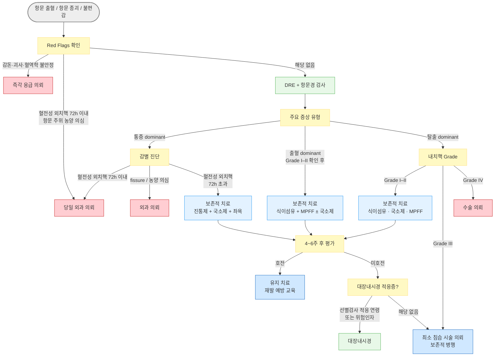

# 치핵 Hemorrhoid

## <mark style="color:green;">일반 사항</mark>

* 항문관 점막하층의 혈관 쿠션(hemorrhoidal plexus)이 비정상적으로 비대해지고 하방으로 이탈하면서 출혈·탈출·불편감을 일으키는 질환
* 유병률 : 인구의 5\~10%; 일생 동안 약 50%가 경험
* 청소년기 이하에서는 드물며, 이 연령대에 발생하면 기저 원인 감별 필요

### <mark style="color:orange;">분류</mark>

<table><thead><tr><th width="170.52630615234375">분류</th><th width="200">위치</th><th width="95.26318359375">통증</th><th>특징</th></tr></thead><tbody><tr><td>External H (외치핵)</td><td>Dentate line 아래 (squamous epithelium)</td><td>통증(+)</td><td>혈전 형성 시 급격한 통증</td></tr><tr><td>Internal H (내치핵)</td><td>Dentate line 위 (columnar epithelium)</td><td>통증(-)</td><td>Grade I~IV로 분류 (아래 참조)</td></tr><tr><td>Mixed H (혼합치핵)</td><td>Dentate line에 걸쳐 있거나 상하 모두 포함</td><td>혼재</td><td>외과적 치료 필요성 높음</td></tr></tbody></table>

#### <mark style="color:$primary;">내치핵 Grade 분류 (Goligher 분류)</mark>

<table><thead><tr><th width="110">Grade</th><th width="280">정의</th><th>1차 치료</th></tr></thead><tbody><tr><td>Grade I</td><td>탈출 없음; 출혈만 있음</td><td>보존적 치료</td></tr><tr><td>Grade II</td><td>배변 시 탈출 → 자연 환원</td><td>보존적 치료 (호전 없으면 최소 침습 시술)</td></tr><tr><td>Grade III</td><td>배변 시 탈출 → 손으로 환원 필요</td><td>최소 침습 시술 또는 수술 의뢰</td></tr><tr><td>Grade IV</td><td>탈출 지속 → 환원 불가</td><td>수술 의뢰</td></tr></tbody></table>

## <mark style="color:green;">원인 및 위험 인자</mark>

#### <mark style="color:$primary;">항문·직장 내압 증가</mark>

* 배변 시 과도한 힘 주기, 장시간 변기에 앉아 있기
* 만성 변비 또는 만성 설사
* 식이 섬유 섭취 부족, 수분 섭취 부족
* 비만, 임신(후반기), 오래 앉아 있는 직업
* 골반강 점유 병변 (종양, 자궁근종 등)
  * Portal hypertension은 직장정맥류(rectal varix)와 관련되나, 직장정맥류는 치핵과 별개의 병리(점막하 정맥 확장 ≠ 혈관 쿠션 이탈); 치핵의 직접 원인으로 보기 어려움

#### <mark style="color:$primary;">항문 지지 구조 약화</mark>

* 노화 (결합 조직 탄력 감소)
* 직장·항문 수술, 출산 외상
* 반복적 항문 외상 병력

## <mark style="color:green;">임상 양상</mark>

* 배변 시 무통성 선홍색 출혈 : 가장 흔한 증상; 휴지나 변기에 선홍색으로 묻음; 지속 시 빈혈 발생 가능
* 항문 가려움, 자극감, 불편감, 점액 분비
* 항문 종괴 또는 부종 (탈출 또는 혈전)
* 통증 : 외치핵의 혈전 형성, 항문 열상, 항문 주위 농양에 의해 발생; 단순 내치핵은 통증 없음
  * 단, 감돈(strangulation) 또는 혈전을 동반한 탈출 내치핵은 심한 통증 가능

### <mark style="color:$danger;">🚩 Red Flags!</mark>

<mark style="color:$danger;">**즉각 조치 또는 이송**</mark>

* 빈맥, 저혈압, 실신, 창백 - 대량 직장 출혈 + 혈역학적 불안정
* 환원 불가한 탈출 + 극심한 통증 + 괴사 징후 (자색 변색, 악취) → 감돈 치핵 (incarcerated hemorrhoid)

<mark style="color:$warning;">**당일 또는 조기 의뢰**</mark>

* 혈전성 외치핵 발병 72시간 이내
* Grade IV 내치핵 급성 탈출 (환원 시도 실패)
* 박동성 항문 통증 + 발열 + 국소 압통 → 항문 주위 농양
* 직장 출혈 + 빈혈 소견 (어지러움, 피로, Hb 저하)

<mark style="color:$info;">**외래 추적 / 추가 평가 계획**</mark> <mark style="color:$info;">- 즉각 위험 낮으나 호전 없으면 의뢰</mark>

* 4\~6주 보존적 치료 후에도 Grade I\~II 증상 지속
* Grade III 치핵 진단
* 직장 출혈이 전형적 치핵 양상과 다르거나, 대장암 선별 검사 대상 연령(≥45세)
* 직장 출혈 + 체중 감소, 배변 습관 변화, 대장암 가족력 → 악성 병변

## <mark style="color:green;">진단</mark>

### <mark style="color:orange;">검사</mark>

* Digital rectal exam (DRE), 항문경(anoscopy) : 1차 평가; 내치핵 Grade, 외치핵 여부, 혈전 확인
  * 심한 통증이 있으면(혈전성 외치핵, 항문 열창 의심) DRE를 무리하게 시행하지 않음
* S상결장경, 대장내시경 : 다음 경우에 적응
  * 대장암 선별 검사 대상(≥45세) 또는 CRC 위험 인자 보유 시
  * 출혈 양상이 전형적 치핵과 다를 때 (암적색, 점액 혼합, 배변 습관 변화 동반)
  * 악성 병변, IBD 등 감별이 필요한 경우
* 혈액 검사 : 빈혈 의심 시 CBC; 그 외에는 일상적으로 필요하지 않음

### <mark style="color:orange;">감별</mark>

<table><thead><tr><th width="131.05267333984375">감별 질환</th><th width="275.26318359375">시사하는 소견</th><th>특징적 진찰 소견</th></tr></thead><tbody><tr><td>항문 열창</td><td>배변 시 출혈 + 극심한 통증</td><td>항문 후벽 점막 열상; DRE 시 통증으로 시행 어려움</td></tr><tr><td>항문 주위 농양</td><td>서서히 진행하는 박동성 통증 + 발열</td><td>항문 주위 피부 압통, 발적, 파동</td></tr><tr><td>항문직장암 /<br>대장암</td><td>혈변, 체중 감소, 복통, 배변 습관 변화, 가족력</td><td>복부 종괴 또는 압통; 대장내시경 필수</td></tr><tr><td>IBD</td><td>전신 증상, 반복되는 복통·설사, IBD 가족력</td><td>항문 병변(누공, 피부꼬리) 동반 가능; 대장내시경 필수</td></tr><tr><td>항문 콘딜로마</td><td>비출혈성 항문 종괴, 항문 성교력</td><td>배추꽃(cauliflower) 모양 병소</td></tr><tr><td>직장 탈출증</td><td>탈출 병변이 전체 직장벽 포함</td><td>동심원 주름(concentric folds); 방사상 주름인 치핵 탈출과 구별</td></tr><tr><td>항문 skin tag</td><td>출혈 없음; 연성 피부 돌출</td><td>피부로 덮인 부드러운 돌기; 무증상</td></tr></tbody></table>



<p align="center"><strong>치핵 진단 및 치료 알고리듬 (1차 의료 관점)</strong></p>

***

## <mark style="background-color:$warning;">Management</mark>

### <mark style="color:orange;">치료 방침</mark>

* Grade I, II : 보존적 치료; 비약물요법(식이, 배변) + 국소제 + 필요시 diosmin) → 4\~6주 내 대부분 호전
  * 경증·배변 후 불편감 : 직장 연고제, 좌욕 (증상 경감 목적; RCT 근거 제한적)
* 보존적 치료 실패 또는 Grade III 이상 : 최소 침습 시술(rubber band ligation 등) 또는 수술
* Grade IV · 수술
* 모든치료 단계 및 예방에서 배변 환경 교정 : 변비 또는 설사 교정 (☞ [변비](085_-constipation.md)); 항문 긴장 감소가 핵심


**외래 Clinical Pearls**

* "통증 없는 선홍색 출혈" = 내치핵 전형 소견; 바로 치료 시작 가능
* "심한 통증" 동반 시 → 항문 열창, 혈전성 외치핵, 항문 주위 농양 우선 감별
* 치핵이 있어도 대장암이 배제되지 않음 - 선별 기준 충족 시 대장내시경 진행
* 스마트폰·화장실 장시간 사용 교정이 재발 예방의 실질적 핵심
* 변비와 설사를 동시에 교정해야 재발 감소 가능 - 하나만 치료하면 불충분
* 급여 주의 : diosmin/flavonoid 계열은 전액 본인부담(100/100) 또는 비급여로 처리되는 경우가 많음


## <mark style="color:green;">비-약물 치료 및 예방</mark>

* 배변 시 힘 줄이기, 식이 섬유 섭취 늘림
* 배변 환경 교정 : 변비 또는 설사 교정 (☞ 변비); 항문 긴장 감소가 핵심

### <mark style="color:orange;">좌욕 (Sitz Bath)</mark>

* 1일 2\~3회 (배변 후 포함), 매회 10\~15분간 따뜻한 물에 항문을 담금
* 비누 또는 거품 제품 추가는 권하지 않음 (점막 자극 위험)
* 좌욕 후 항문 부위는 비데 저온 기능 또는 헤어드라이어 저온풍으로 부드럽게 건조; 이후 보습제 도포


좌욕은 온열에 의한 항문 괄약근 이완 및 혈류 개선 기전으로 통증·불편감 완화에 경험적으로 권고되지만, 증상 완화나 치핵 자체의 치료 효과는 근거가 충분하지 않음. 부작용이 거의 없으므로 증상 조절 목적의 보조 요법으로 사용 가능


#### <mark style="color:$primary;">배변 습관 교정</mark>

* 변기에 오래 앉아 있지 않음; 배변 신호가 올 때 변기에 앉음
* 배변 중 숨을 참거나 힘을 주는 것 최소화
* 배변 후 마른 휴지 사용을 피함; 알코올·향수 성분 없는 물휴지 또는 비데 사용
* 항문 세척 : 따뜻한 물로 세척; 비누 사용은 필요한 경우만; 알코올·방향제 회피
* 장시간 앉아 있는 자세 회피; 규칙적 운동 (혈액 순환 및 배변 규칙성 개선)

#### <mark style="color:$primary;">식이 및 수분</mark>

* 식이 섬유 충분히 섭취 : 25\~30 g/일; 복부 가스 등 불편하면 감량 조절
  * 필요시 보충제 사용 (예: 차전자피 <mark style="color:blue;">\[아기오과립]</mark>)
* 수분 : 충분한 섭취 권장 (2 L/일 이상)
* 복부 가스 유발 식품(콩류, 탄산음료 등) 과다 섭취 자제

#### <mark style="color:$primary;">냉찜질</mark>

* 외치핵 혈전 형성 시 부종·통증 완화 목적으로 단기 사용 가능
* 짧은 시간(10분 이내) 사용; 동상 및 피부 손상 주의; 직접 접촉 금지(천으로 싸서 사용)

## <mark style="color:green;">약물 치료</mark>

### <mark style="color:orange;">국소제 (Topical Agents)</mark>

* 국소제는 통증·가려움의 일시적 완화 효과가 있으나, 치핵 자체가 치료되지는 않으며 Grade에 관계없이 증상 조절 목적으로 사용 가능

**성분 종류**

* Anesthetics : lidocaine 등 - 통증·가려움 완화
* Vasoconstrictor : phenylephrine (α-agonist) - 혈관 수축, 부종 감소
* Astringent : zinc oxide, witch hazel 등 - 삼출 감소, 점막 보호
* Anti-inflammatory / steroid : 1\~3% hydrocortisone - 염증·가려움 완화
* Glycerin, allantoin : 보습, 점막 보호

**주의**

* Steroid 함유 외용제 : 장기 사용 시 피부 위축성 변화 위험
* Anesthetics(lidocaine 등) : 장기 사용 시 알레르기성 접촉성 피부염 유발 가능 → 오히려 가려움·발적 악화
* 위 두 가지 이유로 국소제 전반을 2주 이내 사용하는 것을 권고함

**용법**

* 1일 2회 병소에 직접 적용
* 대부분 복합제로 시판 (대부분 비급여)
  * <mark style="color:blue;">\[푸레파인 좌제]</mark>, <mark style="color:blue;">\[푸레파 연고]</mark> (allantoin, chlorhexidine, lidocaine, phenylephrine, retinol palmitate oil, tocopherol acetate)

### <mark style="color:orange;">경구 Flavonoid (정맥순환개선제)</mark>

* 기전 : 정맥 긴장도 및 림프 순환 개선, 모세혈관 투과성 감소; 항염증 효과 - 급성 치핵에 적용
* 급성 치핵의 출혈 및 증상(통증·부종·가려움) 완화에 moderate-quality evidence; 만성 재발 예방에도 긍정적 자료 있음
* diosmin : 식물에서 추출되는 flavonoid 계열의 물질; FDA 미승인
  * diosmin 300 ㎎ : <mark style="color:blue;">\[치센]</mark> 1T bid, 재발 또는 악화 시에는 1일 4T\~6T까지 투여 가능
  * MPFF( micronized purified flavonoid fraction) 500 ㎎ (diosmin 450 ㎎ + hesperidin 50 ㎎); <mark style="color:blue;">\[베니톨]</mark> 3T bid × 4일 → 2T bid × 3일
* 임부 투여 금기 _️_\*

### <mark style="color:orange;">진통제</mark>

* acetaminophen <mark style="color:blue;">\[타이레놀]</mark> : 1차 선택; 치핵 관련 통증 및 발열에 안전하게 사용 가능
  * 출혈 경향이 있는 치핵에서는 NSAIDs보다 acetaminophen이 우선
* ibuprofen <mark style="color:blue;">\[부루펜]</mark>, <mark style="color:blue;">\[애니펜]</mark> : 항염증 효과 추가 필요 시; 혈소판 기능 억제로 출혈 악화 가능 - 급성 출혈 기간 중 주의

### <mark style="color:orange;">변비 치료 (동반 시)</mark>

* 1차 선택 : 식이 섬유 보충제 (Bulk-forming laxative) - 변의 부피 증가 + 연화 효과; 치핵 출혈 감소에 직접 근거 있음 <mark style="color:blue;">\[무타실], \[아기오]</mark> (☞ [변비](082_-constipation.md#undefined-13))
  * 복용 시 물 200 ㎖ 이상과 함께 복용
* Osmotic laxative : magnesium hydroxide <mark style="color:blue;">\[마그밀]</mark> - 급성기 단기 사용 가능; 장기 단독 사용보다 식이섬유와 병용 권장
  * Bulk-forming laxative와 Osmotic laxative 동시 복용 시 최소 1\~2시간 간격을 두고 복용 (장내 수분 균형 및 약물 흡수 지연 방지)

## <mark style="color:green;">시술 및 기타 처치</mark>

### <mark style="color:orange;">최소 침습 시술</mark>

* 적응증 : Grade I\~III 중 보존적 치료 실패 시
* Rubber band ligation : 1\~2개 고무링으로 치핵 기저를 결찰 → 1주 내 허혈성 괴사로 탈락; 가장 효과적인 외래 시술
  * 시술 2\~4일 후 불편감 또는 경미한 출혈 발생 가능; 심한 경우는 드묾
  * 항응고제 복용 환자 : 지연성 출혈 위험 증가 - 시술 전 항응고제 관리 필요
  * 면역저하 환자 : 드물게 골반 패혈증 등 중증 감염 보고 - 신중히 시행
* 주사 요법 (sclerotherapy) : 경화제 주사로 치핵 조직 섬유화; 시술 통증 적으나 rubber band ligation보다 재발률 높음
* 광응고 (infrared, laser, bipolar coagulation) : Grade I\~II에 적합; rubber band ligation보다 재발률 높음
* Doppler-guided hemorrhoidal artery ligation (HAL/HALO) : 통증이 적은 새로운 시술 옵션; 재발 가능성은 rubber band ligation보다 높음

### <mark style="color:orange;">수술</mark>

<table><thead><tr><th width="200">수술 적응증</th><th>내용</th></tr></thead><tbody><tr><td>Grade IV 내치핵</td><td>탈출 환원 불가</td></tr><tr><td>Grade III 최소 침습 실패</td><td>2회 이상 시술 후에도 미호전</td></tr><tr><td>큰 외치핵</td><td>증상 심한 외치핵, 피부꼬리 동반</td></tr><tr><td>항문직장 병리 동반</td><td>항문 열창, 누공 등 동반 수술 필요</td></tr><tr><td>혈전성 외치핵 (72h 이내)</td><td>발병 72시간 이내 절제술 시 즉각 통증 완화 효과적<br>✽통증 피크는 발병 후 24\~48시간; 72시간 이후부터 혈전이 자연 흡수(organization)되어 통증이 서서히 감소 → 수술 실익 감소<br>✽72시간 초과 시 보존적 치료(국소 steroid + 좌욕 + 진통제)로 2\~3주 내 호전 가능</td></tr></tbody></table>

***

### <mark style="color:red;">질병코드</mark>

K64 치핵 및 항문주위정맥혈전증

K64.0 1도 치핵

K64.1 2도 치핵

K64.2 3도 치핵

K64.3 4도 치핵

K64.4 항문의 피부꼬리

K64.5 항문주위정맥혈전증


✽ 보험 청구 실무: K64.5(항문주위정맥혈전증)는 혈전성 **외**치핵에 사용. 내치핵은 Grade에 따라 K64.0\~K64.3 구분 청구. 혼동 시 삭감 가능.


K64.8 기타 명시된 치핵

K64.9 상세불명의 치핵

***

## <mark style="color:purple;">처방례</mark>

> **처방례 1.** 급성 내치핵 (Grade I–II, 출혈·불편감)
>
> ```
> 치센 500 ㎎/T   6T   #2   × 4일  (3T bid)
>             → 4T   #2   × 3일  (2T bid)
> 푸레파인 좌제   1T   취침 시 항문 내 삽입   × 7일   (비급여)
> 타이레놀 500 ㎎/T   2T   #2   × 3~5일   (통증 시)
> 아기오과립   1포   tid   pc   (식이섬유 보충; 변비 동반 시)
> ```
>
> _✽치센(MPFF)은 급성 치핵 증상 완화 및 출혈 감소에 moderate evidence; 요양급여 적용 여부 확인 후 처방._\
> \&#xNAN;_✽국소제는 증상 조절 목적; 1\~2주 이내 사용. Steroid·lidocaine 함유 제품 장기 사용 금지._\
> \&#xNAN;_✽아기오과립(차전자피) 복용 시 반드시 물 200 ㎖ 이상과 함께 복용; 수분 부족 시 변비 악화 가능._

> **처방례 2.** 급성 내치핵 (변비 동반)
>
> ```
> 베니톨 500 ㎎/T   6T   #2   × 4일  (비급여)
>             → 4T   #2   × 3일
> 푸레파 연고   적량   항문 주위 도포   bid~tid   (비급여)
> 타이레놀 500 ㎎/T   2T   tid   pc   (통증 및 불편감)
> 마그밀 500 ㎎/T   3T   #3   (급성기 변비 조절; 단기)
> ```
>
> _✽변비가 주된 악화 인자인 경우 변비 치료 (☞_ [_변비_](085_-constipation.md)_)가 핵심; 식이섬유 보충제 병행 교육._\
> \&#xNAN;_✽ibuprofen(애니펜)은 항염 효과가 있으나 활동성 출혈 기간 중 사용 시 혈소판 억제 효과로 출혈 악화 가능 - acetaminophen 우선 선택._\
> \&#xNAN;_✽마그밀과 차전자피(아기오과립)를 동시에 처방하는 경우 **최소 1\~2시간 간격**을 두고 복용하도록 지도; 동시 복용 시 장내 수분 균형 교란 및 흡수 지연 가능._

> **처방례 3.** 혈전성 외치핵 (발병 72시간 초과, 보존적 관리)
>
> ```
> 타이레놀 500 ㎎/T   2T   tid   pc   × 5~7일
> 애니펜 400 ㎎/T     1T   tid   pc   × 3~5일   (통증 심한 경우 병용)
> 푸레파인 좌제   1T   취침 시 항문 내 삽입   × 7일   (비급여)
> 치센 500 ㎎/T   4T   #2   × 7일   (부종 감소 목적)
> ```
>
> _✽혈전성 외치핵은 발병 72시간 이내 → 외과 의뢰 (절제술이 즉각적 통증 완화에 효과적)._\
> \&#xNAN;_✽72시간 초과 시 보존적 치료(진통제 + 국소 steroid + 좌욕)로 2\~3주 내 대부분 자연 호전._

> **처방례 4.** 임산부 치핵 (후기 임신, Grade I–II)
>
> ```
> 타이레놀 500 ㎎/T   2T   tid   pc   (통증 시; 임신 전 기간 허용)
> 아기오과립   1포   tid   pc   (식이섬유 보충; 변비 동반 시)
>    ※ 물 200mL 이상과 함께 복용
> 푸레파인 좌제   1T   취침 시   × 7일   (비급여; 보습·마취 성분 주체)
> ```
>
> _✽임신 중 치핵은 주로 Grade I–II이며 분만 후 자연 호전이 흔함 - 보존적 관리 원칙._\
> \&#xNAN;_✽MPFF(치센), diosmin(베니톨) 등 경구 venotonic은 **국내 식약처 허가사항상 임부 투여 금기** - 처방하지 않음._\
> \&#xNAN;_✽ibuprofen 등 NSAIDs는 임신 중(특히 28주 이후) 동맥관 조기 폐쇄 위험 - 사용하지 않음._\
> \&#xNAN;_✽증상이 심하거나 Grade III 이상이면 산부인과 협진 후 처치 방향 결정._

***

### <mark style="color:$success;">핵심 복약 지도</mark>

> **플라보노이드 계열 약 (치센, 베니톨)**
>
> * 이 약은 항문 주변 정맥의 긴장도와 혈액 순환을 개선하여 치핵 증상(출혈, 부종, 통증)을 빠르게 완화합니다.
> * **급성기 복용법 :** 처음 4일은 하루 6알(아침 3알 + 저녁 3알), 이후 3일은 하루 4알(아침 2알 + 저녁 2알)로 줄입니다.
> * 식사와 함께 또는 식후에 복용하시면 위장 불편을 줄일 수 있습니다.
> * 치핵 자체를 치료하는 약이므로, 증상이 좋아져도 처방된 기간을 완료하는 것이 좋습니다.

> **식이섬유 보충제 (아기오과립 등 차전자피)**
>
> * 변을 부드럽게 만들어 배변 시 항문에 가해지는 압력을 줄이고, 치핵 출혈을 감소시킵니다.
> * **반드시 물 한 컵(200 ㎖) 이상과 함께 복용하십시오.** 물이 부족하면 장 속에서 굳어 오히려 변비가 심해지거나 장폐색이 생길 수 있습니다.
> * 마그밀(산화마그네슘)과 동시에 복용하는 경우, **1\~2시간 간격**을 두고 따로 복용하십시오.

> **항문 좌제 및 연고 (푸레파인 좌제, 푸레파 연고)**
>
> * 통증, 가려움, 불편감을 일시적으로 완화하는 국소 약물입니다; **치핵 자체를 없애지는 않습니다.**
> * **좌제 사용법 :** 배변 후 항문을 깨끗이 닦고, 취침 전 좌제를 항문 안으로 깊이 삽입합니다. 삽입 후 10\~15분간 누워 계시면 좋습니다.
> * **연고 사용법 :** 깨끗이 닦은 후 소량을 항문 주위에 하루 2\~3회 가볍게 도포합니다.
> * 일부 항문 좌제·연고에는 스테로이드(항염 성분)와 리도카인(마취 성분)이 포함되어 있습니다. 두 성분 모두 장기 사용 시 부작용(피부 위축, 알레르기성 피부염)이 생길 수 있으므로 **2주를 초과하여 장기 사용하지 마십시오.**
> * 눈, 상처 부위, 얼굴에 사용하지 마십시오.

> **진통제 (타이레놀 / 애니펜)**
>
> * 타이레놀(acetaminophen)은 치핵으로 인한 통증·불편감 완화에 사용합니다; 출혈이 있는 경우 가장 안전한 진통제입니다.
> * 하루 최대 8알(4,000 ㎎)을 초과하지 마십시오; 음주 중에는 하루 2알(1,000 ㎎) 이하로 줄이십시오.
> * 애니펜(ibuprofen)은 항염 효과가 추가되지만, 피가 날 때 함께 사용하면 출혈이 늘어날 수 있습니다. 출혈이 심한 기간에는 타이레놀만 사용하고, 출혈이 멈춘 뒤 필요 시 사용하십시오.
> * 속이 쓰릴 수 있으므로 식후에 복용하십시오.

> **언제 다시 병원을 방문해야 하나요?**
>
> * 4\~6주 보존적 치료 후에도 증상이 호전되지 않는 경우 - 시술(고무링 결찰 등) 필요 여부 평가
> * 출혈이 갑자기 늘거나, 어지럽거나, 피부가 창백해지는 경우 - 즉시 내원
> * 항문 주변이 심하게 붓고 박동성 통증 + 발열이 동반되는 경우 - 즉시 내원 (항문 주위 농양 가능성)
> * 탈출된 치핵이 손으로 밀어 넣어도 들어가지 않는 경우 - 즉시 내원
> * 연령 45세 이상(대장암 선별 검사 대상 연령)이거나 대장암 위험 인자가 있는 경우 - 대장내시경 검사 필요

***

### <mark style="color:blue;">환자 안내서</mark>


**치핵, 생활 습관 교정이 치료의 핵심입니다**

치핵은 항문 주변 혈관이 늘어나고 점막이 처지면서 출혈·탈출·불편감이 생기는 흔한 질환입니다. 평생 두 명 중 한 명이 경험하며, 초기에는 생활 습관을 바꾸는 것만으로도 대부분 호전됩니다.


#### <mark style="color:$primary;">왜 치핵이 생기나요? 🪑</mark>

* 변기에 오래 앉아 힘을 주거나, 변비·설사가 반복되면 항문 주변 혈관에 압력이 쌓입니다.
* 식이섬유·수분 섭취 부족, 운동 부족, 오래 앉아 있는 직업, 임신도 주요 원인입니다.
* 노화에 따라 항문을 지지하는 조직이 약해지면서 중년 이후 빈도가 증가합니다.

#### <mark style="color:$primary;">일상에서 이렇게 관리하세요 💧</mark>

* **식이섬유를 충분히 드십시오.** 하루 25\~30 g 목표 (채소, 과일, 통곡물, 차전자피 보충제). 변이 부드러워져 배변 시 힘 줄 필요가 없어집니다.
* **물을 충분히 마십시오.** 하루 1.5\~2 L 이상. 식이섬유의 효과를 높이고 변비를 예방합니다.
* **변기에 오래 앉아 있지 마십시오.** 배변 신호가 올 때 화장실에 가고, 5\~10분 이내에 마칩니다. 스마트폰 사용은 변기 장시간 사용의 주원인입니다.
* **배변 시 힘을 주지 마십시오.** 대변이 나올 때 숨을 참거나 힘을 주면 항문 압력이 크게 오릅니다.
* **배변 후 마른 휴지 대신 물휴지나 비데를 사용하십시오.** 마른 휴지는 자극을 줄 수 있습니다.
* **규칙적으로 운동하십시오.** 걷기, 수영 등 가벼운 유산소 운동이 장 운동을 돕습니다.
* **장시간 앉아 있지 마십시오.** 1시간마다 일어나 5분 걷기를 권장합니다.

#### <mark style="color:$primary;">좌욕은 어떻게 하나요? 🛁</mark>

* 하루 2\~3회(배변 후 포함), 한 번에 10\~15분, 따뜻한(뜨겁지 않은) 물에 항문을 담급니다.
* 비누나 입욕제는 넣지 마십시오 - 점막을 자극할 수 있습니다.
* 좌욕 후에는 항문 부위를 부드럽게 건조시키고 보습제를 발라 주십시오.
* 좌욕은 통증·가려움 완화에 도움이 되지만, 치핵 자체를 치료하지는 않습니다.

#### <mark style="color:$primary;">약은 어떻게 써야 하나요? 💊</mark>

* 처방받은 **플라보노이드 약**(치센·베니톨)은 혈관 순환을 도와 부종과 출혈을 줄입니다. 처방 기간 동안 꾸준히 드십시오.
* **항문 좌제·연고**는 가려움·통증 완화 목적입니다. 스테로이드 성분이 포함된 제품은 **2주 이상 계속 사용하지 마십시오.**
* 출혈이 있을 때 진통제가 필요하면 **타이레놀**을 드십시오. 이부프로펜 계열은 출혈을 악화시킬 수 있습니다.

#### <mark style="color:$primary;">이럴 때는 즉시 병원을 방문하세요 🚨</mark>

* 출혈량이 갑자기 늘거나, 어지럽거나 창백해지는 경우 - 빈혈 가능성; 혈액검사(CBC) 필요
* **대변 자체에 피가 섞여 나오거나 암적색(검붉은색) 출혈**인 경우 - 치핵보다 상부 장관 출혈 또는 대장암 가능성; 연령 불문 즉시 내원
* 항문 주변이 심하게 붓고, 박동하듯 아프고, 열이 나는 경우
* 탈출된 치핵이 손으로 밀어도 들어가지 않는 경우
* 혈변과 함께 체중 감소, 배변 습관 변화, 복통이 동반되는 경우
* 4\~6주 보존적 치료 후에도 증상이 호전되지 않는 경우
* **대장암 선별 검사 대상 연령(45세 이상)에서 처음 직장 출혈이 나타난 경우** - 대장암 배제를 위해 대장내시경이 필요합니다
