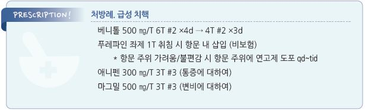

# 치핵 Hemorrhoid

## 일반 사항

*   정맥압의 지속적인 증가로 인해 발생하는 항문 및 직장 점막하층의 vascular bed(hemorrhoidal plexus) 정맥의 varicose dilatation;

    심해지면 혈관 돌출 및 출혈 발생
* 유병률 : 인구의 5\~10%, 일생 동안 50%가 경험
* 청소년기 이하에서는 드물며 이 시기에 발생하는 경우 기저 원인 감별을 요함

#### 분류

* External H : 병변이dentate(or pectinate) line 아래에서 발생(squamous epithelium); 통증(+)
*   Internal H : 병변이 dentate line 위에서 발생(columnar epithelium); 통증(-)

    grade Ⅰ: 탈출증 없음

    grade Ⅱ: Valsalva(배변) 시 탈출. 저절로 환원됨

    grade Ⅲ: Valsalva(배변) 시 탈출. 저절로 환원되지 않음, 손으로 환원시켜야함

    grade Ⅳ: 탈출된 상태 지속. 손으로 환원시킬 수 없음
* Mixed H : 병변이 dentate line에 걸쳐 있거나 상하 모두 포함

## 원인

#### 항문 주위 및 직장의 압력 증가

* 배변 시 힘을 많이 줌
* 화장실에 장시간 앉아 있음
* 만성 변비 또는 설사
* 적은 식이 섬유 섭취
* 비만, 임신(후반기), 오래 앉아 있는 직업
* portal hypertension, 골반 공간 차지 병변

지지 구조 약화

* 노화
* 직장 수술
* 출산 시 외상
* 항문 성교

## 임상 양상

* 배변 시 무통성 선홍색 출혈; 출혈이 심하거나 지속되면 빈혈 발생
* 항문 부위의 가려움, 자극감, 불편감, 부종, 종괴
* 통증 : 항문 열상, 농양, 외치질의 thrombosis에 의해 발생

## 진단

### 검사

* digital rectal exam, anoscopy
* sigmoidoscopy, colonoscopy : 암 의심 증상, 연령(≥45세) 등 대장암 선별 검사 기준 해당 시
* 혈액 검사 : 빈혈이 의심되지 않은 한 필요 없음

### 감별

* 항문 종양 : 항문 주위 통증, 체중 감소; 항문의 궤양성 병변
* 항문 콘딜로마 : 비출혈성 항문 종괴, 항문 성교력; 배추 모양 병소
* 항문열창 : 열상, 대변 시 출혈; 직장수지검사 시 통증 (☞ p.447)
* 직장결장암 : 혈변, 체중 감소, 복통, 배변 습관의 변화, 대장암 가족력; 복부 종괴 또는 압통
* IBD : 전신 증상, 복통, 설사, IBD 가족력; 정상 직장 소견
* 항문 주위 농양 : 서서히 진행되는 통증; 항문 주위 피부 압통
* skin tag : 출혈 없음, 피부로 덮인 병소

***

## Management

### 치료 방침

* 1,2 단계 환자는 보존적 치료
* 배변 시 긴장을 줄이기 위하여 식이 섬유 섭취, 필요시 변비 치료 (☞ p.414)
* 경증 또는 배변 후 불편감에 대하여 직장 연고제, 좌욕(효과 불분명)
* 보존적 치료로 호전되지 않거나 중증 시 의뢰(수술 등 고려)

## 비-약물 치료 및 예방

*   좌욕 : 1일 2~~3회(배변 후 포함), 매 10~~15분간 따듯한 물에 항문을 담금

    •비누 또는 거품 용제 추가는 권하지 않음

    •좌욕 후 항문 부위는 낮은 열기의 비데나 헤어드라이어 등으로 부드럽게 건조시키고 물에 잠겼던 피부는 보습제 도포

    등으로 관리
* 냉찜질 : 항문부 부종 감소 효과; 짧은 시간 사용, 동상 주의
* 변기에 오래 앉아 있지 않음, 배변 신호가 있을 때 변기에 앉음
* 항문 긴장을 줄임. 대변이 항문을 통과할 때 숨을 참거나 힘을 주는 것을 피함
* 배변 후 마른 휴지 사용을 피함. 알코올/향수 성분이 들어있지 않은 젖은 휴지 또는 비데 사용
* 항문 청결 : 따듯한 물로 세척. 비누 사용은 필요한 경우로 제한. 알코올 및 방향제 사용은 피함
* 일상생활 중 오랜 시간 동안 앉아 있지 않음
* 규칙적 운동
* 충분한 수분 섭취 : 2 L/d
* 충분한(25\~30 g/d) 식이 섬유 섭취, 복부 가스 등 불편하면 감량 (☞ p.1170)

## 약물 치료

### 국소제

* 종류 : anesthetics(예: lidocaine), astringent(예: phenylephrine), anti-inflammatory/steroid(예: 1\~3% hydrocortisone), glycerin
* 효과 : 통증과 가려움의 일시적 호전; 치핵 자체에 대한 치료 효과는 없는 것으로 보임
* 주의 : steroid 외용제는 위축성 변화를 일으킬 수 있으므로 장기 사용을 피함
* 용법 : 1일 2회, 병소에 직접 적용
*   대부분 복합제로 시판 (대부분 비보험) : \[푸레파인 좌제], \[푸레파 연고]\(allantoin, chlorhexidine, lidocaine, phenylephrine,

    retinol palmitate oil, tocopherol acetate)

### 경구제

* 진통제 : acetaminophen \[타이레놀], ibuprofen \[부루펜]
* flavonoid : 정맥압 및 림프 순환을 호전시킬 가능성이 있음 \[베니톨] (✽FDA 승인 안 됨)

> ✽\[치센] diosmin(bioflavonoid complex) (비보험)

## 수술

*   수술적 치료 대상 :

    ① grade Ⅳ, ② 비수술적 치료에 반응하지 않는 grade Ⅲ,

    ③ 큰 외치질, ④ 항문직장의 병리학적 이상, ⑤ 혈전성 외치질(발생 72시간 내 수술 시행)

### 최소 침습 치료

* 대상 : 보존적 치료로 실패한 gradeⅠ\~Ⅲ
*   rubber band ligation : 1\~2개의 rubber band로 치핵의 기저를 묶음. 1주 내 치핵이 말라 떨어짐;

    시술 2\~4일 정도에 hemorrhoid banding이 불편하거나 출혈을 유발할 수 있으나 심한 경우는 드묾
*   injection (sclerotherapy) : 병소에 주사하여 치핵 조직을 줄어들게 함; 주사 시 통증은 거의 없으나

    rubber band ligation보다 덜 효과적임
* coagulation (infrared, laser, bipolar) : rubber band ligation보다 재발률이 높음

> **질병코드** K64 치핵 및 항문주위정맥혈전증

