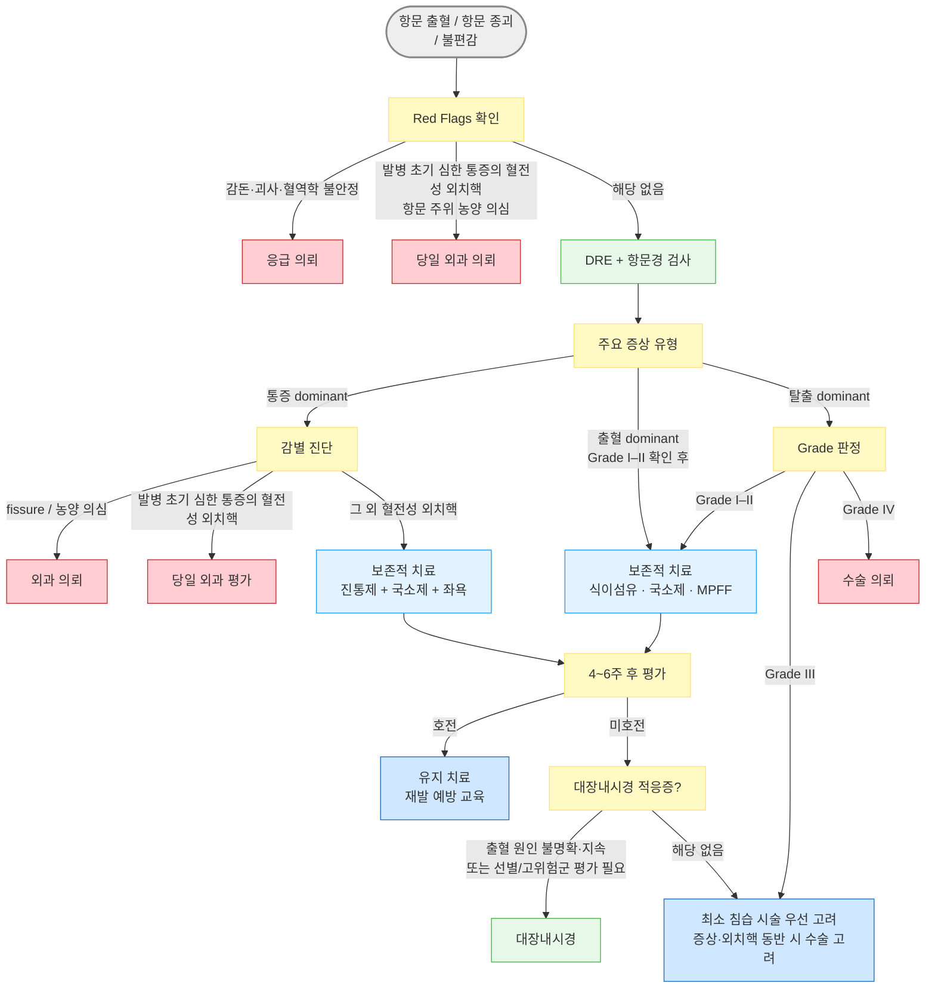

# 치핵 Hemorrhoid

## <mark style="color:green;">일반 사항</mark>

* 항문관 점막하층의 혈관 쿠션(hemorrhoidal plexus)이 비정상적으로 비대해지고 하방으로 이탈하면서 출혈·탈출·불편감을 일으키는 질환
* 유병률 : 인구의 5\~10%; 일생 동안 약 50%가 경험
* 청소년기 이하에서는 드물며, 이 연령대에 발생하면 기저 원인 감별 필요

### <mark style="color:orange;">분류</mark>

<table><thead><tr><th width="170.52630615234375">분류</th><th width="200">위치</th><th width="95.26318359375">통증</th><th>특징</th></tr></thead><tbody><tr><td>External H (외치핵)</td><td>Dentate line 아래 (squamous epithelium)</td><td>대개 통증(-)</td><td>혈전 형성 시 급격한 통증</td></tr><tr><td>Internal H (내치핵)</td><td>Dentate line 위 (columnar epithelium)</td><td>통증(-)</td><td>Grade I~IV로 분류 (아래 참조)</td></tr><tr><td>Mixed H (혼합치핵)</td><td>Dentate line에 걸쳐 있거나 상하 모두 포함</td><td>혼재</td><td>증상과 탈출 정도에 따라 치료 선택</td></tr></tbody></table>

#### <mark style="color:$primary;">내치핵 Grade 분류 (Goligher 분류)</mark>

<table><thead><tr><th width="110">Grade</th><th width="280">정의</th><th>1차 치료</th></tr></thead><tbody><tr><td>Grade I</td><td>탈출 없음 (출혈·가려움 등 증상은 있을 수 있음)</td><td>보존적 치료</td></tr><tr><td>Grade II</td><td>배변 시 탈출 → 자연 환원</td><td>보존적 치료 (호전 없으면 최소 침습 시술)</td></tr><tr><td>Grade III</td><td>배변 시 탈출 → 손으로 환원 필요</td><td>최소 침습 시술 또는 수술 의뢰</td></tr><tr><td>Grade IV</td><td>탈출 지속 → 환원 불가</td><td>수술 의뢰</td></tr></tbody></table>

## <mark style="color:green;">원인 및 위험 인자</mark>

#### <mark style="color:$primary;">항문·직장 내압 증가</mark>

* 배변 시 과도한 힘 주기, 장시간 변기에 앉아 있기
* 만성 변비 또는 만성 설사
* 식이 섬유 섭취 부족, 수분 섭취 부족
* 비만, 임신(후반기), 오래 앉아 있는 직업
* 골반강 점유 병변 (종양, 자궁근종 등)
  * Portal hypertension은 직장정맥류(rectal varix)와 관련되나, 직장정맥류는 치핵과 별개의 병리(점막하 정맥 확장 ≠ 혈관 쿠션 이탈); 치핵의 직접 원인으로 보기 어려움

#### <mark style="color:$primary;">항문 지지 구조 약화</mark>

* 노화 (결합 조직 탄력 감소)
* 직장·항문 수술, 출산 외상
* 반복적 항문 외상 병력

## <mark style="color:green;">임상 양상</mark>

* 배변 시 무통성 선홍색 출혈 : 가장 흔한 증상; 휴지나 변기에 선홍색으로 묻음; 지속 시 빈혈 발생 가능
* 항문 가려움, 자극감, 불편감, 점액 분비
* 항문 종괴 또는 부종 (탈출 또는 혈전)
* 통증 : 외치핵의 혈전 형성, 항문 열상, 항문 주위 농양에 의해 발생; 단순 내치핵은 통증 없음
  * 단, 감돈(strangulation) 또는 혈전을 동반한 탈출 내치핵은 심한 통증 가능

### <mark style="color:$danger;">🚩 Red Flags!</mark>

<mark style="color:$danger;">**즉각 조치 또는 이송**</mark>

* 빈맥, 저혈압, 실신, 창백 - 대량 직장 출혈 + 혈역학적 불안정
* 환원 불가한 탈출 + 극심한 통증 + 괴사 징후 (자색 변색, 악취) → 감돈 치핵 (incarcerated hemorrhoid)

<mark style="color:$warning;">**당일 또는 조기 의뢰**</mark>

* 발병 초기의 심한 통증을 동반한 혈전성 외치핵 → 조기 외과 평가
* Grade IV 내치핵 급성 탈출 (환원 시도 실패)
* 박동성 항문 통증 + 발열 + 국소 압통 → 항문 주위 농양
* 직장 출혈 + 빈혈 소견 (어지러움, 피로, Hb 저하)

<mark style="color:$info;">**외래 추적 / 추가 평가 계획**</mark> <mark style="color:$info;">- 즉각 위험 낮으나 호전 없으면 의뢰</mark>

* 4\~6주 보존적 치료 후에도 Grade I\~II 증상 지속
* Grade III 치핵 진단
* 직장 출혈이 전형적 치핵 양상과 다르거나, 대장암 선별검사가 필요하지만 아직 시행하지 않은 경우
* 직장 출혈 + 체중 감소, 배변 습관 변화, 대장암 가족력 → 악성 병변

## <mark style="color:green;">진단</mark>

### <mark style="color:orange;">검사</mark>

* Digital rectal exam(DRE), 항문경(anoscopy) : 1차 평가; 내치핵 Grade, 외치핵 여부, 혈전 및 다른 항문관 병변 확인
  * 심한 통증이 있으면(혈전성 외치핵, 항문 열창 의심) DRE를 무리하게 시행하지 않음
* S상결장경, 대장내시경 : 다음 경우에 적응
  * 출혈의 원인이 명확하지 않거나 치핵 치료 후에도 출혈이 지속되는 경우
  * 복통, 새로 발생하거나 진행하는 변비, 배변 습관 변화 등이 동반되는 경우
  * 대장암 가족력·IBD 등 위험 인자가 있거나 대장암 선별검사가 필요한 경우
* 혈액 검사 : 빈혈 의심 시 CBC; 그 외에는 일상적으로 필요하지 않음

### <mark style="color:orange;">감별</mark>

<table><thead><tr><th width="131.05267333984375">감별 질환</th><th width="275.26318359375">시사하는 소견</th><th>특징적 진찰 소견</th></tr></thead><tbody><tr><td>항문 열창</td><td>배변 시 출혈 + 극심한 통증</td><td>항문 후벽 점막 열상; DRE 시 통증으로 시행 어려움</td></tr><tr><td>항문 주위 농양</td><td>서서히 진행하는 박동성 통증 + 발열</td><td>항문 주위 피부 압통, 발적, 파동</td></tr><tr><td>항문직장암 /<br>대장암</td><td>혈변, 체중 감소, 복통, 배변 습관 변화, 가족력</td><td>직장수지검사 또는 내시경에서 병변 확인 가능; 의심 시 대장내시경</td></tr><tr><td>IBD</td><td>전신 증상, 반복되는 복통·설사, IBD 가족력</td><td>항문 병변(누공, 피부꼬리) 동반 가능; 필요 시 대장내시경</td></tr><tr><td>항문 콘딜로마</td><td>비출혈성 항문 종괴, 항문 성교력</td><td>배추꽃(cauliflower) 모양 병소</td></tr><tr><td>직장 탈출증</td><td>탈출 병변이 전체 직장벽 포함</td><td>동심원 주름(concentric folds); 방사상 주름인 치핵 탈출과 구별</td></tr><tr><td>항문 skin tag</td><td>출혈 없음; 연성 피부 돌출</td><td>피부로 덮인 부드러운 돌기; 무증상</td></tr></tbody></table>


```mermaid
graph TD
    A([항문 출혈 / 항문 종괴 <br/>/ 불편감]) --> B[Red Flags 확인]
    B -->|감돈·괴사·혈역학 불안정| C[응급 의뢰]
    B -->|발병 초기 심한 통증의 혈전성 외치핵<br/>항문 주위 농양 의심| X[당일 외과 의뢰]
    B -->|해당 없음| E[DRE + 항문경 검사]
    E --> P[주요 증상 유형]
    P -->|통증 dominant| Q[감별 진단]
    P -->|출혈 dominant<br/>Grade I–II 확인 후| H
    P -->|탈출 dominant| F[Grade 판정]
    Q -->|fissure / 농양 의심| S[외과 의뢰]
    Q -->|발병 초기 심한 통증의 혈전성 외치핵| D[당일 외과 평가]
    Q -->|그 외 혈전성 외치핵| G[보존적 치료<br/>진통제 + 국소제 + 좌욕]
    G --> K[4~6주 후 평가]
    F -->|Grade I–II| H[보존적 치료<br/>식이섬유 · 국소제 · MPFF]
    F -->|Grade III| I[최소 침습 시술 우선 고려<br/>증상·외치핵 동반 시 수술 고려]
    F -->|Grade IV| J[수술 의뢰]
    H --> K
    K -->|호전| L[유지 치료<br/>재발 예방 교육]
    K -->|미호전| M[대장내시경 적응증?]
    M -->|출혈 원인 불명확·지속<br/>또는 선별/고위험군 평가 필요| N[대장내시경]
    M -->|해당 없음| I
style A fill:#eeeeee,stroke:#888888,stroke-width:2px
classDef yellow fill:#fff9c4,stroke:#ffe082
class B,P,Q,F,K,M yellow
classDef L_red fill:#ffcdd2,stroke:#c62828
class C,D,S,J,X L_red
classDef sky fill:#e3f2ff,stroke:#2196f3
class G,H sky
classDef blue fill:#d0e8ff,stroke:#1a6abf
class L,I blue
classDef lightGreen fill:#e8f8e8,stroke:#4caf50
class E,N lightGreen
```

<p align="center"><strong>치핵 진단 및 치료 알고리듬</strong></p>

***

## <mark style="background-color:$warning;">Management</mark>

> **최신 지침:** 2024 ASCRS 지침은 식이·배변 습관 교정을 1차 치료로 권고하고, Grade I–II 및 일부 Grade III에서는 office-based procedure, 특히 rubber band ligation을 효과적인 치료로 제시한다. 혈전성 외치핵은 일부 환자에서 조기 절제를 고려할 수 있으나 특정 시간(예: 72시간)을 절대적인 수술 기준으로 제시하지 않는다.

### <mark style="color:orange;">치료 방침</mark>

* Grade I, II : 보존적 치료; 식이·배변 습관 교정이 1차이며, 필요시 국소제 또는 경구 flavonoid를 증상 완화 목적으로 사용
  * 경증·배변 후 불편감 : 직장 연고제, 좌욕 (증상 경감 목적; RCT 근거 제한적)
* 보존적 치료 실패 또는 증상이 지속되는 Grade I–II, 그리고 일부 Grade III : office-based procedure(특히 rubber band ligation) 고려
* Grade III–IV의 증상이 있는 혼합치핵/외치핵이 뚜렷한 경우 : 절제 치핵절제술(excisional hemorrhoidectomy) 고려
* Grade IV 내치핵 : 수술 의뢰
* 모든 치료 단계 및 예방에서 배변 환경 교정 : 변비 또는 설사 교정 (☞ [변비](082_-constipation.md)); 항문 긴장 감소가 핵심
* 혈전성 외치핵은 발병 초기의 심한 통증 등 일부 환자에서 조기 절제가 증상 호전을 빠르게 할 수 있다. 72시간은 실용적인 참고점일 뿐 절대적인 수술 기준은 아니다.


**외래 Clinical Pearls**

* "통증 없는 선홍색 출혈" = 내치핵의 전형적 소견이나, 다른 출혈 원인을 배제할 임상평가가 필요
* "심한 통증" 동반 시 → 항문 열창, 혈전성 외치핵, 항문 주위 농양 우선 감별
* 치핵이 있어도 대장암이 배제되지 않음 - 출혈 양상·위험인자·선별검사 여부에 따라 대장내시경 등 추가 평가
* 스마트폰·화장실 장시간 사용 교정이 재발 예방의 실질적 핵심
* 변비와 설사를 동시에 교정해야 재발 감소 가능 - 하나만 치료하면 불충분
* 급여 주의 : 제품별 보험 적용 여부와 청구 기준을 처방 시 확인


## <mark style="color:green;">비-약물 치료 및 예방</mark>

* 배변 시 힘 줄이기, 식이 섬유 섭취 늘림
* 배변 환경 교정 : 변비 또는 설사 교정 (☞ [변비](082_-constipation.md)); 항문 긴장 감소가 핵심

### <mark style="color:orange;">좌욕 (Sitz Bath)</mark>

* 1일 2\~3회 (배변 후 포함), 매회 10\~15분간 따뜻한 물에 항문을 담금
* 비누 또는 거품 제품 추가는 권하지 않음 (점막 자극 위험)
* 좌욕 후 항문 부위는 문지르지 말고 부드럽게 건조; 자극이 있으면 비누·향료·알코올 성분 제품을 피함


좌욕은 온열에 의한 항문 괄약근 이완 및 혈류 개선 기전으로 통증·불편감 완화에 경험적으로 권고되지만, 증상 완화나 치핵 자체의 치료 효과는 근거가 충분하지 않음. 부작용이 거의 없으므로 증상 조절 목적의 보조 요법으로 사용 가능


#### <mark style="color:$primary;">배변 습관 교정</mark>

* 변기에 오래 앉아 있지 않음; 배변 신호가 올 때 변기에 앉음
* 배변 중 숨을 참거나 힘을 주는 것 최소화
* 배변 후 마른 휴지 사용을 피함; 알코올·향수 성분 없는 물휴지 또는 비데 사용
* 항문 세척 : 따뜻한 물로 세척; 비누 사용은 필요한 경우만; 알코올·방향제 회피
* 장시간 앉아 있는 자세 회피; 규칙적 운동 (혈액 순환 및 배변 규칙성 개선)

#### <mark style="color:$primary;">식이 및 수분</mark>

* 식이 섬유 충분히 섭취 : 25\~30 g/일; 복부 가스 등 불편하면 서서히 증량 또는 감량 조절
  * 필요시 보충제 사용 (예: 차전자 <mark style="color:blue;">\[아기오과립]</mark>)
* 수분 : 갈증과 건강 상태를 고려하여 충분히 섭취; 심부전·신장질환 등으로 수분 제한이 필요한 경우 개별화
* 복부 가스 유발 식품(콩류, 탄산음료 등) 과다 섭취 자제

#### <mark style="color:$primary;">냉찜질</mark>

* 외치핵 혈전 형성 시 부종·통증 완화 목적으로 단기 사용 가능
* 짧은 시간(10분 이내) 사용; 동상 및 피부 손상 주의; 직접 접촉 금지(천으로 싸서 사용)

## <mark style="color:green;">약물 치료</mark>

### <mark style="color:orange;">국소제 (Topical Agents)</mark>

* 국소제는 통증·가려움의 일시적 완화 효과가 있으나, 치핵 자체가 치료되지는 않으며 Grade에 관계없이 증상 조절 목적으로 사용 가능

**성분 종류**

* Anesthetics : lidocaine 등 - 통증·가려움 완화
* Vasoconstrictor : phenylephrine (α-agonist) - 혈관 수축, 부종 감소
* Astringent : zinc oxide, witch hazel 등 - 삼출 감소, 점막 보호
* Anti-inflammatory / steroid : 1\~3% hydrocortisone - 염증·가려움 완화
* Glycerin, allantoin : 보습, 점막 보호

**주의**

* Steroid 함유 외용제 : 장기 사용 시 피부 위축성 변화 위험
* Anesthetics(lidocaine 등) : 장기 사용 시 알레르기성 접촉성 피부염 유발 가능 → 오히려 가려움·발적 악화
* 국소제는 일반적으로 단기간 사용하며, 스테로이드 함유 제품은 장기간 사용을 피하고 제품별 허가 용법을 따름

**용법**

* 제품별 허가 용법·용량에 따라 사용; 증상 완화 목적의 단기간 사용을 원칙으로 함
  * <mark style="color:blue;">\[푸레파인 좌제]</mark> : allantoin, chlorhexidine, lidocaine, L-menthol, tetrahydrozoline
    * 심장질환, 고혈압, 갑상선질환, 당뇨병, 전립샘비대증으로 인한 배뇨곤란 환자에는 사용하지 않으며, 임부는 사용 전 상담
  * <mark style="color:blue;">\[푸레파 연고]</mark> : allantoin, chlorhexidine, lidocaine, phenylephrine, retinol palmitate oil, tocopherol acetate

### <mark style="color:orange;">경구 Flavonoid (정맥순환개선제)</mark>

* 기전 : 정맥 긴장도 및 림프 순환 개선, 모세혈관 투과성 감소; 항염증 효과 - 급성 치핵에 적용
* 급성 치핵의 출혈 및 증상(통증·부종·가려움) 완화에 moderate-quality evidence; 만성 재발 예방에도 긍정적 자료 있음
* diosmin : flavonoid 계열의 정맥순환개선제; 급성 치핵의 출혈·통증 등 증상 완화에 사용할 수 있음
  * diosmin 300 ㎎ : <mark style="color:blue;">\[치센]</mark> 1T bid; 치질의 재발·악화 시 1일 4T\~6T까지 증량 가능
  * MPFF 500 ㎎ (diosmin 450 ㎎ + hesperidin 50 ㎎) : <mark style="color:blue;">\[베니톨]</mark> 급성치질에는 1회 3T bid × 4일 → 1회 2T bid × 3일
* 임부·수유부는 제품별 허가사항과 임상 상황을 확인하여 사용 여부 결정. 치센은 임신 초기 3개월 이내 투여하지 않으며, 베니톨은 임부·수유부가 전문가와 상의 후 사용하도록 안내

### <mark style="color:orange;">진통제</mark>

* acetaminophen <mark style="color:blue;">\[타이레놀]</mark> : 1차 선택; 치핵 관련 통증 및 발열에 안전하게 사용 가능
  * 출혈 경향이 있는 치핵에서는 NSAIDs보다 acetaminophen이 우선
* ibuprofen <mark style="color:blue;">\[부루펜]</mark>, <mark style="color:blue;">\[애니펜]</mark> : 항염증 효과 추가 필요 시; 혈소판 기능 억제로 출혈 악화 가능 - 급성 출혈 기간 중 주의

### <mark style="color:orange;">변비 치료 (동반 시)</mark>

* 1차 선택 : 식이 섬유 보충제 (Bulk-forming laxative) - 변의 부피와 수분을 늘려 배변 시 힘주기를 줄이며 치핵 출혈 감소에 근거가 있음 <mark style="color:blue;">\[무타실], \[아기오]</mark> (☞ [변비](082_-constipation.md#undefined-13))
  * 아기오과립 : 차전자 3.9 g + 차전자피 0.13 g/6 g; 성인 1회 1\~2포, 1일 1회 저녁 식후, 물 1\~2컵과 함께 복용
* Osmotic laxative : magnesium hydroxide <mark style="color:blue;">\[마그밀]</mark> - 변비 동반 시 사용 가능; 성인 1일 1\~2 g을 1\~2회 분할 투여
  * 신장애 환자에서는 고마그네슘혈증 위험 때문에 사용하지 않으며, 다른 경구약의 흡수에 영향을 줄 수 있으므로 제품 허가사항에 따라 복용 간격을 조정

## <mark style="color:green;">시술 및 기타 처치</mark>

### <mark style="color:orange;">최소 침습 시술</mark>

* 적응증 : 증상이 지속되는 Grade I–II 및 보존적 치료에 반응하지 않는 일부 Grade III
* Rubber band ligation : 치핵 기저를 결찰하여 허혈성 괴사 후 탈락시키는 방법; office-based procedure 중 가장 효과적인 방법으로 평가됨
  * 시술 후 통증·불편감이 있을 수 있으며, 지연성 출혈은 결찰 부위가 탈락하는 시기에 발생할 수 있음
  * 항응고제·항혈소판제 복용 환자는 혈전 위험과 출혈 위험을 함께 고려하여 약제 조정 여부를 결정
  * 심한 항문통증, 발열, 요폐 또는 다량 출혈이 발생하면 즉시 평가
* 주사 요법 (sclerotherapy) : 경화제를 주사하여 치핵 조직의 섬유화·고정 유도; 통증이 적어 출혈 중심의 Grade I–II에서 사용 가능
* 광응고 (infrared coagulation 등) : Grade I–II에 적합
* Doppler-guided hemorrhoidal artery ligation (HAL/HALO) : 내치핵에 사용할 수 있으며 절제 치핵절제술보다 통증은 적을 수 있으나 재발률이 높을 수 있음
* Stapled hemorrhoidopexy : marginal efficacy와 특이 합병증 위험 때문에 내치핵의 routine 1차 수술로 권하지 않음

### <mark style="color:orange;">수술</mark>

<table><thead><tr><th width="200">수술 적응증</th><th>내용</th></tr></thead><tbody><tr><td>증상이 있는 Grade III–IV 혼합치핵</td><td>외치핵 또는 탈출이 뚜렷한 경우 절제 치핵절제술 고려</td></tr><tr><td>증상이 심한 외치핵</td><td>보존적 치료에 반응하지 않는 큰 외치핵 등</td></tr><tr><td>office procedure 실패</td><td>적절한 외래 시술 후에도 증상이 지속되거나 재발하는 경우</td></tr><tr><td>혈전성 외치핵</td><td>발병 초기의 심한 통증 등 선택된 환자에서 조기 절제 고려; 72시간은 절대 기준이 아님</td></tr></tbody></table>


***

### <mark style="color:red;">질병코드</mark>

K64 치핵 및 항문주위정맥혈전증

K64.0 1도 치핵

K64.1 2도 치핵

K64.2 3도 치핵

K64.3 4도 치핵

K64.4 항문의 피부꼬리

K64.5 항문주위정맥혈전증


✽ 보험 청구 실무: K64.5는 항문주위정맥혈전증에 해당하므로 임상 진단에 맞는 코드를 선택한다. 내치핵은 Grade에 따라 K64.0\~K64.3으로 구분할 수 있으며, 진료기록에 위치와 Grade를 명확히 기재한다.


K64.8 기타 명시된 치핵

K64.9 상세불명의 치핵

***

## <mark style="color:purple;">처방례</mark>

> **처방례 1.** 급성 내치핵 (Grade I–II, 출혈·불편감)
>
> ```
> 베니톨 500 ㎎/T   6T   #2   × 4일  (3T bid)
>             → 4T   #2   × 3일  (2T bid)
> 타이레놀 500 ㎎/T   2T   #2   × 3~5일   (통증 시)
> 아기오과립   1포   #1   저녁 식후   (변비 동반 시)
> ```
>
> _✽베니톨은 급성 치핵의 증상 완화를 위한 경구 flavonoid 제제이며, 급성치질 허가 용법은 처음 4일간 1회 3정 bid, 이후 3일간 1회 2정 bid이다._\
> > _✽아기오과립은 차전자·차전자피 제제로 1회 1~2포, 1일 1회 저녁 식후에 물 1~2컵과 함께 복용한다._

> **처방례 2.** 급성 내치핵 (변비 동반)
>
> ```
> 치센캡슐 300 ㎎/C   1C   bid   × 7일   (증상 완화 목적)
> 푸레파 연고   적량   항문 주위 도포   bid~tid   (증상 완화 목적)
> 타이레놀 500 ㎎/T   2T   tid   pc   (통증 및 불편감)
> 마그밀 500 ㎎/T   2T   #2   (변비 조절)
> ```
>
> _✽변비가 주된 악화 인자인 경우 변비 치료 (☞_ [_변비_](082_-constipation.md)_)가 핵심이다. 식이섬유 보충제 또는 필요시 삼투성 하제를 병행한다._\
> _✽마그밀은 수산화마그네슘 500 ㎎ 정제로, 변비에는 성인 1일 1~2 g을 1~2회 분할 투여한다. 신장애 환자에서는 사용하지 않는다._\
> _✽다른 경구약과 병용하는 경우 마그밀이 약물 흡수에 영향을 줄 수 있으므로 필요한 경우 복용 간격을 둔다._

> **처방례 3.** 혈전성 외치핵 (보존적 관리)
>
> ```
> 타이레놀 500 ㎎/T   2T   tid   pc   × 5~7일
> 애니펜 400 ㎎/T     1T   tid   pc   × 3~5일   (통증 심한 경우 선택)
> 푸레파인 좌제   1T   #1~3   × 7일   (증상에 따라)
> 치센캡슐 300 ㎎/C   2C   bid   × 7일   (증상 완화 목적)
> ```
>
> _✽혈전성 외치핵은 발병 초기이고 통증이 심한 경우 조기 절제를 고려할 수 있다. 72시간은 절대적인 수술 기준이 아니다._\
> _✽보존적 치료를 선택하면 진통제, 국소제, 좌욕 및 배변 습관 교정으로 증상을 조절한다. 대부분 자연 호전하지만 호전 속도는 다양하다._

> **처방례 4.** 임산부 치핵 (후기 임신, Grade I–II)
>
> ```
> 타이레놀 500 ㎎/T   2T   tid   pc   (통증 시)
> 아기오과립   1포   #1   저녁 식후   (변비 동반 시)
>    ※ 물 1~2컵과 함께 복용
> ```
>
> _✽임신 중 치핵은 우선 식이섬유·수분·배변 습관 교정과 증상 조절을 시행하며, 분만 후 호전되는 경우가 많다._\
> _✽치센은 임신 초기 3개월 이내 투여하지 않으며, 베니톨은 임부·수유부가 전문가와 상의 후 사용하도록 안내된다. 임신 중 경구 venotonic은 일률적으로 처방하지 말고 제품별 허가사항과 임상 상황을 확인한다._\
> _✽NSAIDs는 임신 20주 이후 양수감소 및 태아 신기능 이상 위험 때문에 가급적 피하고, 특히 임신 30주 이후에는 동맥관 조기 폐쇄 위험 때문에 피한다._\
> _✽증상이 심하거나 Grade III 이상이면 산부인과·대장항문외과 협진 후 처치 방향을 결정한다._

***

### <mark style="color:$success;">핵심 복약 지도</mark>

> **플라보노이드 계열 약 (치센, 베니톨)**
>
> * 경구 flavonoid는 치핵의 출혈·통증·부종 등의 증상을 완화하는 보조치료제입니다.
> * **베니톨의 급성치질 허가 용법:** 처음 4일은 하루 6정(아침 3정 + 저녁 3정), 이후 3일은 하루 4정(아침 2정 + 저녁 2정)입니다.
> * **치센캡슐은 diosmin 300 ㎎ 제제로**, 기본 용법은 1회 1캡슐, 1일 2회이며 치질의 재발·악화 시 1일 4~6캡슐까지 증량할 수 있습니다.
> * 증상이 좋아져도 임의로 용량을 늘리거나 장기간 복용하지 말고 제품별 허가 용법을 따르십시오.

> **식이섬유 보충제 (아기오과립 등 차전자피)**
>
> * 식이섬유 제제는 변을 부드럽게 하고 배변 시 힘주기를 줄여 치핵 증상과 출혈을 감소시키는 데 도움이 됩니다.
> * **아기오과립은 물 1~2컵과 함께 복용하십시오.** 씹지 말고 복용하며 취침 직전이나 누워 있는 동안 복용하지 않습니다.
> * 마그밀은 수산화마그네슘 제제이며, 신장애 환자에서는 사용하지 않습니다. 다른 경구약의 흡수에 영향을 줄 수 있으므로 필요하면 복용 간격을 둡니다.

> **항문 좌제 및 연고 (푸레파인 좌제, 푸레파 연고)**
>
> * 국소제는 통증·가려움·부종 등의 증상을 일시적으로 완화하며 치핵 자체를 없애지는 않습니다.
> * **푸레파인좌제:** 성인·15세 이상에서 1회 1개, 1일 3회 이내로 직장 내 삽입합니다. 약 7일 사용해도 호전되지 않거나 출혈이 있으면 재평가합니다.
> * **푸레파연고:** 허가 용법에 따라 적량을 환부에 적용합니다.
> * 제품마다 성분이 다릅니다. 푸레파인좌제에는 lidocaine·tetrahydrozoline 등이, 푸레파연고에는 lidocaine·phenylephrine 등이 포함됩니다. 스테로이드 함유 여부도 제품별로 확인하여 장기 사용을 피합니다.

> **진통제 (타이레놀 / 애니펜)**
>
> * 타이레놀(acetaminophen)은 치핵 통증 완화에 사용할 수 있으며 활동성 출혈이 있는 경우 NSAID보다 우선 고려할 수 있습니다.
> * 다른 acetaminophen 함유 약과 중복하지 말고, 간질환·과도한 음주가 있으면 최대 용량을 일률적으로 적용하지 않습니다.
> * 애니펜(ibuprofen) 등 NSAID는 위장관 출혈 위험 등을 고려하여 활동성 출혈이 많은 경우 신중히 사용합니다.
> * NSAID를 사용할 경우 식후 복용하고, 항응고제·항혈소판제 복용 환자에서는 출혈 위험을 함께 평가합니다.

> **언제 다시 병원을 방문해야 하나요?**
>
> * 4\~6주 보존적 치료 후에도 증상이 호전되지 않는 경우 - 시술(고무링 결찰 등) 필요 여부 평가
> * 출혈이 갑자기 늘거나, 어지럽거나, 피부가 창백해지는 경우 - 즉시 내원
> * 항문 주변이 심하게 붓고 박동성 통증 + 발열이 동반되는 경우 - 즉시 내원 (항문 주위 농양 가능성)
> * 탈출된 치핵이 손으로 밀어도 들어가지 않는 경우 - 즉시 내원
> * 출혈의 원인이 불명확하거나, 체중 감소·배변 습관 변화·복통 등이 동반되거나, 대장암 선별검사가 필요한 경우 - 대장내시경 등 추가 평가

***

### <mark style="color:blue;">환자 안내서</mark>


**치핵, 생활 습관 교정이 치료의 핵심입니다**

치핵은 항문 주변 혈관이 늘어나고 점막이 처지면서 출혈·탈출·불편감이 생기는 흔한 질환입니다. 평생 두 명 중 한 명이 경험하며, 초기에는 생활 습관을 바꾸는 것만으로도 대부분 호전됩니다.


#### <mark style="color:$primary;">왜 치핵이 생기나요? 🪑</mark>

* 변기에 오래 앉아 힘을 주거나, 변비·설사가 반복되면 항문 주변 혈관에 압력이 쌓입니다.
* 식이섬유·수분 섭취 부족, 운동 부족, 오래 앉아 있는 직업, 임신도 주요 원인입니다.
* 노화에 따라 항문을 지지하는 조직이 약해지면서 중년 이후 빈도가 증가합니다.

#### <mark style="color:$primary;">일상에서 이렇게 관리하세요 💧</mark>

* **식이섬유를 충분히 드십시오.** 하루 25\~30 g 목표 (채소, 과일, 통곡물, 차전자 등). 변이 부드러워져 배변 시 힘 줄 필요가 없어집니다.
* **물을 충분히 마십시오.** 특별한 수분 제한이 없다면 충분히 섭취합니다. 심부전·신장질환 등으로 수분 제한이 필요한 경우 의료진의 지시에 따릅니다.
* **변기에 오래 앉아 있지 마십시오.** 배변 신호가 올 때 화장실에 가고, 5\~10분 이내에 마칩니다. 스마트폰 사용은 변기 장시간 사용의 주원인입니다.
* **배변 시 힘을 주지 마십시오.** 대변이 나올 때 숨을 참거나 힘을 주면 항문 압력이 크게 오릅니다.
* **배변 후 항문을 부드럽게 세척하십시오.** 물 또는 무향·무알코올 제품을 사용하고, 자극이나 접촉피부염이 생기면 해당 제품을 중단합니다.
* **규칙적으로 운동하십시오.** 걷기, 수영 등 가벼운 유산소 운동이 장 운동을 돕습니다.
* **장시간 앉아 있지 마십시오.** 1시간마다 일어나 5분 걷기를 권장합니다.

#### <mark style="color:$primary;">좌욕은 어떻게 하나요? 🛁</mark>

* 하루 2\~3회(배변 후 포함), 한 번에 10\~15분, 따뜻한(뜨겁지 않은) 물에 항문을 담급니다.
* 비누나 입욕제는 넣지 마십시오 - 점막을 자극할 수 있습니다.
* 좌욕 후에는 항문 부위를 문지르지 말고 부드럽게 건조하십시오.
* 좌욕은 통증·가려움 완화에 도움이 되지만, 치핵 자체를 치료하지는 않습니다.

#### <mark style="color:$primary;">약은 어떻게 써야 하나요? 💊</mark>

* 처방받은 **플라보노이드 약**(치센·베니톨)은 치핵의 출혈·통증·부종 등의 증상을 완화하는 보조치료제입니다. 제품별 허가 용법을 따르십시오.
* **항문 좌제·연고**는 가려움·통증 완화 목적입니다. 제품마다 성분이 다르므로 스테로이드가 포함된 제품은 장기간 사용하지 말고 허가 용법을 따르십시오.
* 출혈이 있을 때 진통제가 필요하면 **타이레놀**을 드십시오. 이부프로펜 계열은 출혈을 악화시킬 수 있습니다.

#### <mark style="color:$primary;">이럴 때는 즉시 병원을 방문하세요 🚨</mark>

* 출혈량이 갑자기 늘거나, 어지럽거나 창백해지는 경우 - 빈혈 가능성; 혈액검사(CBC) 필요
* **대변에 혈액이 섞이거나 검붉은색·흑색변, 반복 또는 지속되는 출혈**이 있는 경우 - 치핵으로 단정하지 말고 출혈 원인을 평가합니다.
* 항문 주변이 심하게 붓고, 박동하듯 아프고, 열이 나는 경우
* 탈출된 치핵이 손으로 밀어도 들어가지 않는 경우
* 혈변과 함께 체중 감소, 배변 습관 변화, 복통이 동반되는 경우
* 4\~6주 보존적 치료 후에도 증상이 호전되지 않는 경우
* **대장암 선별검사가 필요한 경우** - 국내 국가암검진은 만 50세 이상에서 매년 분변잠혈검사를 시행합니다. 2026년 국가암검진 권고안은 무증상 저위험군 45~80세에서 1~2년 간격 분변잠혈검사를 권고하고 대장내시경을 선택적으로 고려합니다. 그러나 직장 출혈이 있는 환자는 선별검사 연령만으로 판단하지 않고 임상 소견에 따라 대장내시경 등 진단적 평가를 고려합니다.
