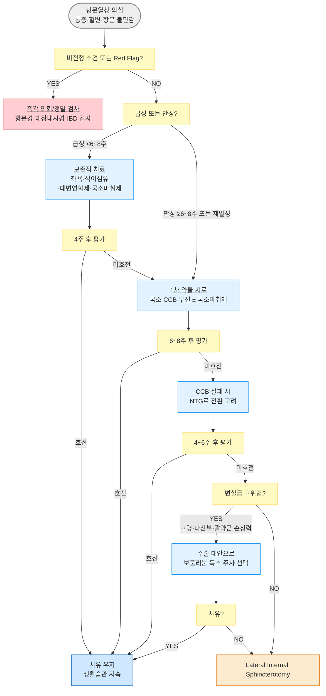

# 항문열창 Anal Fissure

## <mark style="color:green;">일반 사항</mark>

* Dentate line 원위부의 항문 피부(anoderm)에 발생하는 선상 찢어짐
* 발생 부위 : ⓵ 대부분 내항문괄약근(internal anal sphincter)의 후 정중선(posterior midline, 90%), ⓶ 전 정중선(\~10%, 여성에서 더 흔함)
* 발생률 : 평생 위험 약 8%; 항문 통증 및 직장 출혈 원인의 약 ⅓ 차지

**분류** (기간 및 형태학적 기준 병용)

* 급성 : 일반적으로 6\~8주 미만의 표재성 선상 열상(superficial longitudinal tear)
* 만성 : 일반적으로 6\~8주 이상 지속되거나, 아래 형태학적 소견이 동반된 경우
  * 감시 피부 꼬리(sentinel skin tag), 비후된 항문유두(hypertrophied papilla)
  * 노출된 내항문괄약근 섬유(exposed internal sphincter fiber) - 실제 임상에서 만성을 시사하는 중요 소견

**경과**

* 보존적 치료 : 치유율 \~50%
* 국소 약물 치료(CCB/NTG) : 치유율 약 50\~80%; CCB가 NTG보다 다소 높은 치유율과 낮은 부작용 빈도를 보임 (단, 연구마다 수치 차이가 크며 CCB의 순응도 우위가 임상적으로 중요)
* 보툴리눔 독소 주사 : 치유율 약 60\~80% (연구 간 편차 큼)
* 수술 치료(LIS) : 장기 치유율 >90%, 재발율 <10%
* 완전 치유까지 보통 6주 이상 소요
* 수술 요법이 가장 확실하나 변실금·감염 등 합병증 위험 존재
* 재발이 흔함 : CCB 치료 후 \~40%, NTG 치료 후 \~30%, LIS 후 <10%


**항문열창의 악순환 기전** : 열창 발생 → 내항문괄약근 경련 → 항문 내압 상승 → 혈류량 감소 → 치유 지연 → 추가 열창·통증 → 경련 반복; 치료의 핵심은 이 악순환의 고리를 끊는 것 - 괄약근 이완과 혈류 개선이 양대 목표


## <mark style="color:green;">원인 및 위험 인자</mark>

* 대변 이상 : 변비, 굵고 단단한 대변; 폭발적인 설사
* 생활 습관 : 비만, 장시간 착석
* 국소 요인 : 항문 외상, 항문 수술 후
* 전신 질환 : 염증창자질환(IBD; 크론병), 감염(HIV, 결핵, 매독), 혈액암(백혈병), 항문암


**측부(lateral) 또는 다발성 열상** : 전형적인 후 정중선이 아닌 위치에 발생 시 IBD·HIV·결핵·매독·백혈병·악성 종양 등의 이차 원인을 적극 감별. 단순 특발성 열창보다 이차성 질환 가능성이 유의하게 높음


## <mark style="color:green;">임상 양상</mark>

* 통증 : 배변 시 심한 날카로운 통증; 배변 후 수 분\~수 시간의 작열감 지속
* 혈변(hematochezia) : 소량의 선홍색 출혈; 화장지 또는 변기에 묻는 형태
* 가려움/자극 : 항문 주위 소양감·자극감
* 만성 시 형태학적 소견 : sentinel skin tag, hypertrophied papilla, 노출된 내항문괄약근 섬유

### <mark style="color:$danger;">🚩 Red Flags!</mark>

<mark style="color:$danger;">**즉각 조치 또는 의뢰**</mark>

* 배변과 무관하게 지속되는 심부 박동성 통증(throbbing pain) + 발열 → 항문주위 농양
* 발열·전신 증상 동반 항문 부종/발적 → 항문주위 농양
* 면역저하 환자(HIV, 혈액암 치료 중 등)의 급성 항문 병변 → 비전형 감염·악성
* 대량 직장 출혈 또는 지속·반복 혈변

<mark style="color:$warning;">**당일 또는 조기 의뢰**</mark>

* 측부(lateral) 또는 다발성 열상 → 이차 원인 (IBD, 결핵, 매독, 악성)
* 항문 주위 피부 누공 또는 농성 분비물 → 항문루, 항문주위 농양
* 임상 진단 불확실, 비전형 소견(압통 종괴, 점막 불규칙 변화)

<mark style="color:$info;">**외래 추적 / 추가 평가 계획**</mark> <mark style="color:$info;">- 즉각 위험 낮으나 호전 없으면 의뢰</mark>

* 4주 보존적 치료 후 호전 없음
* 8주 약물 치료 후에도 미호전 (만성·난치성)
* 재발성 항문열창 (연간 2회 이상)

## <mark style="color:green;">진단</mark>

* 진단은 주로 병력 청취와 시진, 촉진으로 이루어짐
  * 전형적 위치(후 정중선), 배변 시 통증, 소량 혈변의 조합
  * 통증·압통으로 인해 검사가 어려울 수 있음; 필요 시 국소마취하 시행
* 직장수지검사 : 진단 보조, 항문관 내 다른 병변 배제
* 항문경(anoscopy) / 대장내시경 : 비전형 소견, 직장 출혈, IBD 의심 시
* 크론병 감별 검사 : 비전형 열상, 복통·설사·체중 감소 동반 시

### <mark style="color:orange;">감별</mark>

**항문열창 vs 치핵**

<table><thead><tr><th width="153">소견</th><th width="241">항문열창</th><th>치핵 (Hemorrhoids)</th></tr></thead><tbody><tr><td>통증</td><td>매우 심함; 배변 후 수 시간 지속</td><td>대개 경미하거나 없음</td></tr><tr><td>출혈</td><td>소량 선홍색; 화장지에 묻음</td><td>선홍색; 변기에 뚝뚝 떨어지거나 묻음</td></tr><tr><td>배변 후 통증 지속</td><td>흔함 (작열감·경련)</td><td>드묾</td></tr><tr><td>병변 위치</td><td>후 정중선 (주로)</td><td>Lithotomy position 3·7·11시 방향 치핵 쿠션</td></tr><tr><td>피부 부속 소견</td><td>Sentinel skin tag (만성)</td><td>Skin tag (외치핵 혈전 후)</td></tr></tbody></table>

**기타 감별**

<table><thead><tr><th width="190">질환</th><th width="356">감별 핵심 소견</th><th>비고</th></tr></thead><tbody><tr><td>항문주위 농양 / 항문루</td><td>배변 무관 지속 박동성 통증, 발열, 발적·부종; 누공 농 배출</td><td>즉각 외과 의뢰</td></tr><tr><td>직장암 / 항문암</td><td>불규칙 종괴, 비전형 열상, 체중 감소, 만성 혈변</td><td>대장내시경 필수</td></tr><tr><td>크론병 관련 열상</td><td>측부·다발성·깊은 열상, 전신 염증 증상</td><td>IBD 검사 의뢰</td></tr><tr><td>성병 (매독·HIV)</td><td>비전형 궤양, 다발성, 위험 인자 확인</td><td>혈청 검사</td></tr></tbody></table>

***



<p align="center"><strong>항문열창 진단 및 단계적 치료 알고리듬</strong></p>

***

## <mark style="background-color:$warning;">Management</mark>

**단계적 치료 (Step-wise Approach)**

* 치료 목표는 내항문괄약근 긴장도 감소(혈류 개선·경련 완화) 및 배변 시 외상 최소화

<table><thead><tr><th width="80">단계</th><th width="278">대상</th><th>핵심 치료</th></tr></thead><tbody><tr><td>Step 1</td><td>급성 열창, 모든 환자</td><td>좌욕·식이섬유·대변연화제·국소마취제·생활 교정</td></tr><tr><td>Step 2</td><td>Step 1, 4주 미호전 / 만성·재발성</td><td>국소 CCB 우선 (NTG 대안) ± 국소마취제</td></tr><tr><td>Step 3</td><td>Step 2, 6~8주 미호전; 변실금 고위험</td><td>보툴리눔 독소 주사 (전문의 시술)</td></tr><tr><td>Step 4</td><td>난치성·재발성 (일반 환자)</td><td>Lateral Internal Sphincterotomy (외과 의뢰)</td></tr></tbody></table>

**증상·임상 유형별 초기 치료 선택**

<table><thead><tr><th width="230">임상 유형</th><th>1차 접근</th></tr></thead><tbody><tr><td>급성 + 변비 우세</td><td>좌욕 + 대변연화제 + 식이섬유</td></tr><tr><td>급성 + 심한 통증 우세</td><td>좌욕 + 국소마취제 ± CCB</td></tr><tr><td>만성 + sentinel tag</td><td>국소 CCB 우선</td></tr><tr><td>CCB 실패 또는 불내성</td><td>NTG 또는 보툴리눔 독소 고려</td></tr><tr><td>재발 반복 / 변실금 고위험</td><td>보툴리눔 독소 (수술 대안으로 선택)</td></tr><tr><td>난치성 / 일반 환자</td><td>LIS 외과 의뢰</td></tr></tbody></table>

## <mark style="color:green;">비-약물 치료 및 예방</mark>

* 좌욕(Sitz bath) : 증상이 심한 경우 1일 2\~3회(배변 후 포함), 경미한 경우 1일 1회로도 충분; 1회 10\~15분, 미지근하거나 체온보다 약간 따뜻한 물(37\~40°C)에 항문 담금
  * 비누·거품 용제 추가 불필요
  * 강한 수압의 비데 사용은 열창을 자극할 수 있으므로 피하고, 부드럽게 세정 후 충분히 건조
  * 좌욕·세정 후에는 수건으로 문질러 닦지 말고, 가볍게 톡톡 두드려 물기를 제거하거나 헤어드라이어의 찬 바람으로 완전히 건조; 이후 보습제 도포
* 식이섬유 : 25\~30 g/일 목표; 점진적으로 증량 (급격한 증량은 복부 팽만 유발) (☞ [영양](../231_/217_-nutritiondiet-guideline.md#undefined-14))
* 수분 섭취 : 1일 1.5\~2 L 이상
* 대변연화제 및 변비 관리 (☞ [변비](082_-constipation.md))
* 운동 : 매일 걷기·달리기 등 규칙적 신체 활동 → 장 운동 활성화
* 체중 관리 : 비만 시 체중 감량 권고
* 배변 습관 : 장시간 착석·과도한 힘주기 금지; 오래 앉아 힘주며 배변을 시도하지 않도록 지도; 변의를 지나치게 참지도, 과도하게 힘주지도 않도록 교육

## <mark style="color:green;">약물 치료</mark>

#### <mark style="color:$primary;">국소 Calcium Channel Blocker (CCB)</mark>

* 기전 : 내항문괄약근 평활근 이완 + 혈관확장 → 혈류 개선
* 효과 : 치유율 약 65\~85%; 재발율 \~40% (연구마다 수치 차이 있음)
* 현재 지견 : NTG 대비 두통 발생이 적어 실제 순응도가 더 높으며, 1차 선택제로 선호
* 부작용 : 두통·안면 홍조·어지럼(저혈압) \~5%
* 주의 : 뜨거운 목욕·좌욕 직후에는 두통·어지럼이 심해질 수 있으므로 잠시 쉰 뒤 사용; 도포 후 \~30분간 앉거나 누운 뒤 천천히 기립

**용법**

* nifedipine : 0.2\~0.3% 연고 bid\~tid, 항문 내 소량 도포 (조제)
* diltiazem : 2% 연고 bid\~tid, 항문 내 소량 도포 (조제)

#### <mark style="color:$primary;">국소 Nitric Oxide Donor (NTG)</mark>

* 기전 : Nitric oxide가 항문괄약근 이완의 신경전달물질로 작용 → 경련 완화·혈류 개선
* 효과 : 치유율 약 50\~70%; 재발율 \~30% (연구마다 수치 차이 있음)
* 부작용 : 두통·홍조·어지럼 \~40%에서 발생 (CCB보다 빈번; 실제 순응도 저하의 주요 원인)
* **주의** : 뜨거운 목욕·좌욕 직후에는 두통·어지럼이 심해질 수 있으므로 잠시 쉰 뒤 사용; 소량 자주 사용이 더 효과적; 도포 후 잠시 앉거나 누운 뒤 천천히 기립

**용법**

* glyceryl trinitrate(nitroglycerin) : 0.2\~0.4% 연고 bid\~tid, 항문 내(최소 1 ㎝ 깊이) 1\~1.5 ㎝ 도포 <mark style="color:blue;">\[파사렉트 연고]</mark>

#### <mark style="color:$primary;">국소 마취제</mark>

* lidocaine ± prilocaine 연고 :  통증 시 또는 배변 30분 전 도포; qd\~tid <mark style="color:blue;">\[푸레파 연고]</mark> (비급여)
* lidocaine 좌제 : 항문 내 삽입형; 배변 전 사용 <mark style="color:blue;">\[푸레파인 좌제]</mark> (비급여)

#### <mark style="color:$primary;">전신 진통제</mark>

* acetaminophen 또는 NSAIDs 경구 : 급성 통증 시 단기 사용
  * NSAIDs : 항문 출혈 환자, 위궤양·위장관 출혈 위험 환자에서 주의

## <mark style="color:green;">시술 및 기타 처치</mark>

#### <mark style="color:$primary;">보툴리눔 독소 주사</mark>

* 기전 : 내항문괄약근 지배 신경에서의 acetylcholine 방출 차단 → 괄약근 마비·이완
* 시술 : 내항문괄약근 양측에 주사; 표준화된 용량은 없으며 20\~40 IU 범위에서 사용됨
* 효과 : 치유율 약 60\~80% (연구 간 편차 큼); 장기 치유율은 저하 경향
* 적응 : 약물 치료 실패; 특히 변실금 위험이 높은 환자(고령, 다산부, 기존 괄약근 손상력)에서 LIS 대신 수술의 안전한 대안으로 선택 가능
* 부작용 : 일시적 변실금 (\~10%)

#### <mark style="color:$primary;">Lateral Internal Sphincterotomy (LIS)</mark>

* 방법 : 내항문괄약근 하부 1/3 절개 → 항문 내압 감소
* 효과 : 2\~4주 내 완치; 장기 치유율 >90%, 재발율 <10%
* 부작용 : 일시적인 가스 실금 또는 소량 변 누출이 일부에서 나타날 수 있으나 대부분 자연 호전됨; 일부 연구에서는 장기 변실금 위험이 5\~10%까지 보고되므로 사전 충분한 설명 필요
* 적응 : 보존적·약물 치료에 실패한 만성·난치성 열창 (변실금 위험이 낮은 환자)

#### <mark style="color:$primary;">Fissurectomy / Advancement Flap</mark>

* Fissurectomy : 열창 및 하부 섬유화 조직 절제; 상처를 이차 유합(secondary intention)으로 치유
* Advancement flap (피판 전진술) : 인접 점막·피부 피판을 전진시켜 결손 봉합 → 혈액 공급 개선
* 적응 : LIS의 변실금 위험이 높은 환자(고령, 다산부, 이전 항문 수술력), 만성 항문열창
* 임산부 주의 : 임신 중 발생한 항문열창은 분만 후 상당수 자연 치유되며, 임신 중 수술은 조산 위험 등으로 원칙적으로 피함. 분만 후에도 지속되는 난치성 열창에 한해 수술적 치료를 고려

***

### <mark style="color:red;">질병코드</mark>

K60.0 급성 항문열창

K60.1 만성 항문열창

K60.2 상세불명의 항문열창

***

## <mark style="color:purple;">처방례</mark>

> **처방례 1. 급성 항문열창 - 보존적 치료**
>
> ```
> 마그밀 500 mg   1T   tid
> 푸레파 연고        1 tube   통증 시 또는 배변 30분 전 도포 (비급여)
> ```
>
> _✽ 좌욕(배변 후 포함 1일 1_~~_3회, 10_~~_15분, 37_~~_40°C), 식이섬유 25_~~_30 g/일, 충분한 수분 섭취를 병행 지도. 4주 후 재평가하여 미호전 시 약물 치료(Step 2) 전환._
>
> _⚠️ 마그밀 : 신기능 저하 환자 및 고령자에서 장기 복용 시 고마그네슘혈증 위험이 있으므로 주의_

> **처방례 2. 4주 이상 지속 또는 만성·재발성 - 국소 CCB 병용**
>
> ```
> 마그밀 500 mg   1T   tid
> Nifedipine 0.2% ointment (조제)   소량   tid, 항문 내 도포
> 푸레파 연고        1 tube   통증 시 배변 전 도포 (비급여)
> ```
>
> _✽ CCB는 두통·어지럼 부작용이 NTG보다 적어 1차 선택. 핑거코트 또는 위생장갑 착용 후 약 1_~~_1.5 cm 짜서 항문 안쪽 1_~~_2 cm 깊이까지 부드럽게 밀어 넣어 도포하도록 안내. 뜨거운 목욕·좌욕 직후에는 잠시 쉰 뒤 도포; 도포 후 30분 앉아 있도록 지도. 6\~8주 후 재평가._
>
> _⚠️ 마그밀 : 신기능 저하 환자 및 고령자에서 장기 복용 시 고마그네슘혈증 위험이 있으므로 주의_

> **처방례 3. 국소 NTG 사용 (CCB 부재·불내성 시 대안)**
>
> ```
> 마그밀 500 mg   1T   tid
> 파사렉트 연고 30 g/tube   tid, 항문 내(최소 1 cm 깊이) 1~1.5 cm 도포 (비급여)
> ```
>
> _✽ 두통 부작용이&#x20;_~~_40%로 빈번 - 사전 충분히 안내. 핑거코트 착용 후 항문 안쪽 1_~~_2 cm 깊이까지 도포 안내. 뜨거운 목욕·좌욕 직후 도포 주의; 도포 후 30분 앉거나 누운 뒤 천천히 기립. 소량 자주 사용이 더 효과적. 8주 약물 치료 후 미호전 시 외과 의뢰._
>
> _⚠️ 마그밀 : 신기능 저하 환자 및 고령자에서 장기 복용 시 고마그네슘혈증 위험이 있으므로 주의_

***

### <mark style="color:$success;">핵심 복약 지도</mark>

> **좌욕은 어떻게 하나요?**
>
> * 증상이 심한 경우 **1일 2\~3회, 배변 후에는 반드시** 시행하십시오. 경미한 경우 1일 1회로도 충분합니다.
> * 미지근하거나 체온보다 약간 따뜻한 물(37~~40°C)에 10~~15분간 항문 부위를 담그십시오. 비누나 거품제는 넣지 않아도 됩니다.
> * 강한 수압의 비데는 오히려 항문을 자극할 수 있으므로 피하십시오.
> * 좌욕·세정 후에는 **수건으로 문질러 닦지 마시고, 가볍게 톡톡 두드려 물기를 제거하거나 헤어드라이어의 찬 바람으로 완전히 건조**하십시오. 이후 보습제를 발라 피부를 보호하십시오.

> **연고 도포 방법 (CCB 및 파사렉트 공통)**
>
> 1. **핑거코트(손가락 장갑) 또는 위생장갑을 착용하거나, 연고 주입기(applicator)가 있다면 이를 이용**하십시오.
> 2. 연고를 약 1~~1.5 cm 길이로 짜서, \*\*항문 안쪽 1~~2 cm 깊이까지 부드럽게 밀어 넣어\*\* 도포하십시오 - 항문 입구 피부에만 바르면 내항문괄약근까지 약물이 전달되지 않아 효과가 줄어듭니다.
> 3. **뜨거운 목욕이나 좌욕 직후에는 잠시 쉰 뒤 사용**하십시오 - 두통이나 어지럼이 심해질 수 있습니다.
> 4. 도포 후 약 30분간 앉거나 누워 계십시오. 갑자기 일어서면 어지러울 수 있습니다.
> 5. NTG(파사렉트)는 두통이 \~40%에서 흔함. CCB는 이보다 빈도가 낮아 순응도가 좋습니다. 두통이 심하면 의사와 상의하십시오.

> **대변연화제 복용법**
>
> * 마그밀(산화마그네슘)은 대변을 부드럽게 하여 배변 시 항문에 가해지는 자극을 줄여 줍니다.
> * 물을 충분히(1일 1.5\~2 L) 드시면서 복용하십시오.
> * 묽은 설사가 나타나면 용량을 줄이고 의사와 상의하십시오.
> * ⚠️ 신장 기능이 저하되어 있거나 고령이신 경우, 장기 복용 시 혈중 마그네슘이 과도하게 높아질 수 있으므로 의사에게 알려 주십시오.

> **언제 다시 병원을 방문해야 하나요?**
>
> * 4주 이상 치료해도 증상이 나아지지 않는 경우
> * 발열이 생기거나 항문 주변이 많이 붓고 빨개지는 경우 → **즉시 내원**
> * 배변과 무관하게 박동성 통증이 지속되는 경우 → **즉시 내원** (농양 의심)
> * 혈변이 많아지거나 고름 같은 분비물이 나오는 경우 → **즉시 내원**
> * 재발하거나 통증 없이 배변하기가 여전히 어려운 경우

***

### <mark style="color:blue;">환자 안내서</mark>


**항문열창, 이렇게 관리하세요**

항문열창은 항문 부위의 피부가 찢어진 상태입니다. 배변 시 극심한 통증과 소량의 선홍색 출혈이 특징입니다. 대부분 변비·설사 등 배변 이상이 원인이며, 올바른 생활 습관과 꾸준한 치료로 회복할 수 있습니다.


#### <mark style="color:$primary;">왜 항문열창이 생기나요?</mark>

* 딱딱하고 굵은 대변이나 폭발적인 설사가 항문 피부를 찢으면서 발생합니다.
* 한 번 찢어지면 항문 근육이 반사적으로 수축하고, 혈액 순환이 줄어 치유가 늦어지는 악순환이 생깁니다.
* 장시간 앉아 있는 생활, 비만, 섬유소 부족 식이가 위험을 높입니다.

#### <mark style="color:$primary;">일상생활에서 어떻게 관리하나요?</mark>

* **좌욕을 하루 1\~3번 하십시오** - 증상이 심할 때는 2~~3회, 경미하면 1회로도 충분합니다. 배변 후에는 반드시 시행하십시오. 미지근한 물(37~~40°C)에 10\~15분 담그면 근육이 이완되고 혈류가 개선됩니다.
* **좌욕 후에는 문질러 닦지 마시고**, 가볍게 톡톡 두드려 건조하거나 헤어드라이어 찬 바람을 이용하십시오. 강한 수압의 비데는 피하십시오.
* **식이섬유를 충분히 드십시오** - 채소, 과일, 통곡물을 통해 하루 25\~30 g을 목표로 하되, 갑자기 늘리면 복부 팽만이 생길 수 있으니 천천히 늘려 가십시오.
* **물을 하루 1.5\~2 L 이상 마십시오** - 대변이 부드러워집니다.
* **매일 가벼운 운동(걷기, 조깅)을 하십시오** - 장 운동을 도와 변비를 예방합니다.
* **오래 앉아 있거나 과도하게 힘을 주며 배변하지 마십시오.** 변의가 있을 때 편하게 배변하고, 힘주거나 오래 앉아 있는 습관을 피하십시오.

#### <mark style="color:$primary;">약은 어떻게 써야 하나요?</mark>

* 연고는 핑거코트(손가락 장갑)를 끼거나 연고 주입기를 이용해 **항문 안쪽 1\~2 cm 깊이까지 부드럽게 밀어 넣어** 바르십시오 - 항문 입구에만 바르면 효과가 줄어듭니다.
* **뜨거운 목욕 직후에는 잠시 쉰 뒤 바르십시오** - 두통이나 어지럼이 심해질 수 있습니다.
* 바른 후 30분은 앉거나 누워 있다가 천천히 일어나십시오.
* 대변연화제는 처방대로 복용하고, 물을 많이 드시면 더 효과적입니다.
* 두통이 심하거나 어지럼이 지속되면 담당 의사에게 알려 주십시오.

#### <mark style="color:$primary;">이럴 때는 즉시 병원을 방문하세요</mark>

* 항문 주위가 심하게 붓거나 빨개지고 **발열**이 생기는 경우
* 배변과 무관하게 **박동성 통증이 지속**되는 경우 - 농양일 수 있습니다
* 혈변이 갑자기 **많아지거나** 고름 같은 분비물이 나오는 경우
* 4주 이상 치료해도 나아지지 않거나 증상이 오히려 심해지는 경우
