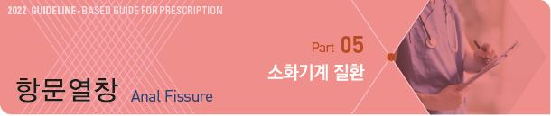
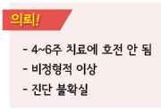
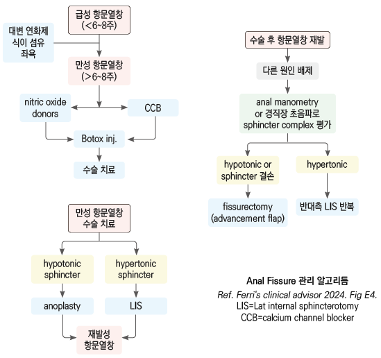
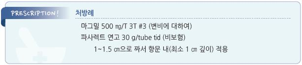

# 항문열창 Anal Fissure

## 일반 사항

* dentate line 원위 항문부 anoderm의 찢어짐
* 발생 부위 : 주로 internal anal sphincter의 post midline(90%)
* 발생률 : 평생 위험 약 8%; 항문 통증 및 출혈의 ⅓ 차지
*   경과 : 2개월 내 보존적 치료로 50%, 약물 치료로 60\~90%, 보톡스 주사로 \~90% 치유

    • 완전 치유까지 보통 6주 이상 소요

    • 수술 요법이 가장 확실하지만 변실금/감염 등 부작용 발생 위험이 있음
* 재발이 흔함(⅓에서 재발하는 것으로 추정)
* 악순환 경과 : 열창 발생 → 항문 괄약근 경련 → 추가 열창 발생, 통증, 혈류량↓ → 치유 지연
* 주의 : 측부 열상, 비전형적 열상, 만성(＞6주), 재발성, 압통, 종괴, 농성 분비물

## 원인 및 위험 인자

* 변비, 굵고 단단한 대변, 폭발적인 설사
* 비만, 오래 앉아 있는 생활
* 외상, 감염, IBD, 암

※ 특히 양 측부에 발생 시 염증장질환, HIV, 결핵, 매독, 백혈병 등의 감별을 요함

## 임상 양상

* 통증 : 배변 시 심한 날카로운 통증, 배변 후 수 분\~수 시간 동안 작열감 등 통증 지속
* hematochezia : 보통 소량의 선홍색 출혈
* 간혹 항문 주위 피부 가려움/자극
* 급성(＜8주) : superficial longitudinal tear
* 만성 : hypertrophy, skin tags, papillae

## 진단

### 검사

*   다른 질환 감별을 위해 제한적으로 시행

    • 통증/압통 때문에 검사가 쉽지 않음(필요시 마취하에 시행)
* 직장수지검사
* anoscopy, colonoscopy, sigmoidoscopy(특히 직장 출혈 환자)
* 크론병 감별 검사(특히 atypical fissure 환자)

### 감별

* Atypical fissures (예: 측부 발생, 다발성) : IBD, HIV, 결핵, 매독, 백혈병, 암
* 항문루 (anal fistula) : 누공으로부터 농 배출; 피부 누공에서 anorectum으로 소식자 진입 가능
* Perineal infection/perianal abscess : 심한 항문 통증, 부종, 발적; 발열, pain 지속(＞24시간)

***

## Management

### 치료 방침

*   힘들이지 않고 통증 없이 배변할 수 있도록 관리; 생활 요법으로 ½ 이상의 환자에서 호전

    • 좌욕 : 1일 2~~3회 (배변 후 포함), 매 10~~15분간 따듯한 물에 항문을 담금 (☞ p.450)

    • 충분한(25\~30 g/d) 식이 섬유 섭취 (☞ p.1170)

    • 대변 연화제 (☞ p.374)

    • 변비 관리 (☞ p.414)

    • 운동 : 매일 산책, 달리기

    • 비만인 경우 체중 감량
* 국소제, 보톡스 주사, 수술(만성/난치성)

## 약물 치료

#### Calcium channel blocker (CCB)

* smooth muscle relaxation & vasodilation
* nifedipine 치유율 : 6개월 70\~90%, 재발율 40%
*   부작용 : 5%에서 두통, 홍조, 어지럼(저혈압);

    사고 방지를 위하여 목욕 후 30분 이내에는 도포를 피함, 도포 후 잠시(\~30분) 앉거나 누운 후 천천히 일어남
* CCB : nifedipine 0.2~~0.3%, diltiazem 2%; 두통 부작용. 단기 유효. 장기 효과는 모름; tid(bid~~qid) 항문 내 도포

#### 국소 Nitric oxide donor

* nitric oxide가 항문 괄약근을 이완하는 신경 전달 물질로 작용; 근육 경련 완화, 혈액 순환 촉진
* 치유율 : 6개월 50\~70%, 재발율 30%
* 부작용 : CCB와 동일, \~40%에서 발생
*   nitroglycerin(glyceryl trinitrate) 0.2~~0.4% : bid~~tid(소량을 자주 사용하는 것이 더 효과적일 수 있음), 항문 내 도포

    [파사렉트 연고](../%EB%B9%84%EB%B3%B4%ED%97%98/)

#### 진통제/마취제

* 국소 : lidocaine &/or, prilocaine 연고 qd\~tid 통증 시 또는 배변 전 도포 \[푸레파 연고], [푸레파인 좌제](../%EB%B3%B5%ED%95%A9%EC%A0%9C/)(비보험)
* 경구 : NSAIDs

## 주사, 수술

#### Botulinum toxin

* 근육을 수축시키는 신경에서의 acetylcholine 방출을 차단하여 괄약근을 마비시킴
* internal anal sphincter에 주사. 용법은 표준화되어 있지 않음
* 치유율 : 6개월 \~90%(치유율의 차이가 큼). 장기 치유율을 떨어짐
* 부작용 : 변실금

#### Lateral internal sphincterotomy (LIS)

* 2\~4주 내 완치; 장기 치료율 ＞90%
* 부작용 : 대변실금(경미 \~30%; 중증 5%)

#### Fissurectomy (Advancement anal flaps)

* 신체 다른 조직을 채취하여 열창을 repair, 혈액 공급 개선
*   만성 항문열창, 임신, anal canal 손상 시 고려

    

> **질병코드** K60.0 급성 항문열창

K60.1 만성 항문열창

K60.2 상세불명의 항문열창

