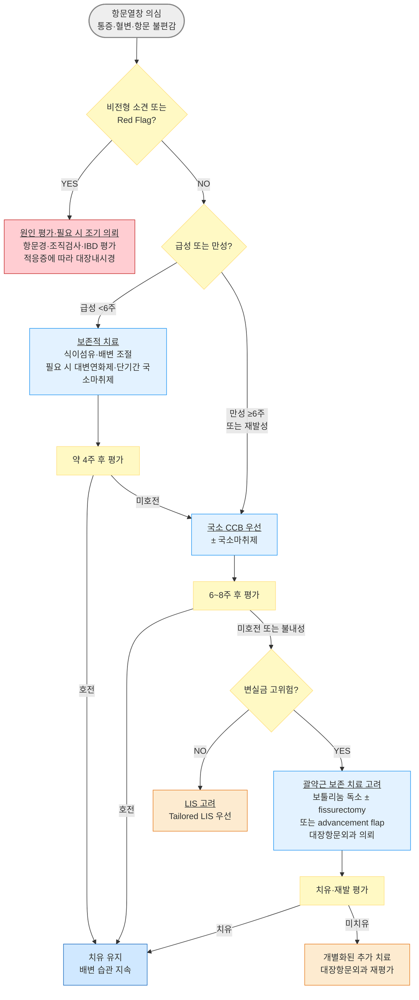

# 항문열창 Anal Fissure

## <mark style="color:green;">일반 사항</mark>

* Dentate line 원위부의 항문 피부(anoderm)에 발생하는 선상 찢어짐
* 발생 부위 : ⓵ 대부분 후 정중선(posterior midline, 약 90%), ⓶ 전 정중선(anterior midline, 여성에서 상대적으로 흔함)
* 역학 : 비교적 흔한 항문 질환으로, 성인에서 항문 통증과 선홍색 직장 출혈의 중요한 원인

**분류** (기간 및 형태학적 기준 병용)

* 급성 : 일반적으로 6주 미만의 표재성 선상 열상(superficial longitudinal tear)
* 만성 : 일반적으로 6주 이상 지속되거나, 아래 형태학적 소견이 동반된 경우
  * 감시 피부 꼬리(sentinel skin tag), 비후된 항문유두(hypertrophied papilla)
  * 노출된 내항문괄약근 섬유(exposed internal sphincter fiber) - 만성을 시사하는 중요한 소견

**경과**

* 급성 열창의 상당수는 식이섬유 보충, 배변 조절 등 보존적 치료로 호전
* 만성 열창의 국소 CCB와 국소 NTG는 치유 효과가 대체로 유사하며, CCB는 두통 등 부작용이 적어 순응도가 우수함
* 보툴리눔 독소 주사는 국소 치료와 비슷한 효과를 보이며, 국소 치료 실패 후 2차 치료로 사용할 때 치유율을 다소 높일 수 있음
* LIS는 만성 열창에서 가장 높은 치유율을 보이는 치료 중 하나이나, 변실금 위험을 고려하여 환자 선택이 중요
* Tailored LIS는 열창 길이에 맞추어 절개 범위를 제한하여 전통적 LIS와 유사한 치유율을 유지하면서 변실금 위험을 줄일 수 있음


**항문열창의 악순환 기전** : 열창 발생 → 내항문괄약근 경련 → 항문 내압 상승 → 혈류량 감소 → 치유 지연 → 추가 열창·통증 → 경련 반복; 치료의 핵심은 이 악순환의 고리를 끊는 것 - 괄약근 이완과 배변 시 외상 최소화가 양대 목표



## <mark style="color:green;">원인 및 위험 인자</mark>

* 대변 이상 : 변비, 굵고 단단한 대변; 폭발적인 설사
* 생활·배변 습관 : 배변 시 과도한 힘주기, 배변 이상; 장시간 앉아 있는 습관은 증상을 악화시킬 수 있음
* 국소 요인 : 항문 외상, 항문 수술 후
* 전신 질환 : 염증창자질환(IBD; 크론병), 감염(HIV, 결핵, 매독), 혈액암(백혈병), 항문암


**측부(lateral) 또는 다발성 열상** : 전형적인 후 정중선이 아닌 위치에 발생 시 IBD·HIV·결핵·매독·백혈병·악성 종양 등의 이차 원인을 적극 감별. 단순 특발성 열창보다 이차성 질환 가능성이 유의하게 높음


## <mark style="color:green;">임상 양상</mark>

* 통증 : 배변 시 심한 날카로운 통증; 배변 후 수 분\~수 시간의 작열감 지속
* 혈변(hematochezia) : 소량의 선홍색 출혈; 화장지 또는 변기에 묻는 형태
* 가려움/자극 : 항문 주위 소양감·자극감
* 만성 시 형태학적 소견 : sentinel skin tag, hypertrophied papilla, 노출된 내항문괄약근 섬유

### <mark style="color:$danger;">🚩 Red Flags!</mark>

<mark style="color:$danger;">**즉각 조치 또는 의뢰**</mark>

* 배변과 무관하게 지속되는 심부 박동성 통증(throbbing pain) + 발열 → 항문주위 농양
* 발열·전신 증상 동반 항문 주위의 진행성 부종/발적 → 항문주위 농양 또는 중증 감염
* 면역저하 환자에서 발열·심한 통증·괴사성 또는 비전형 항문 병변 → 중증 감염 또는 악성 질환 평가
* 대량 직장 출혈, 혈역학적 불안정, 실신 또는 급격한 빈혈 증상

<mark style="color:$warning;">**당일 또는 조기 의뢰**</mark>

* 측부(lateral) 또는 다발성 열상 → 이차 원인(IBD, HIV, 결핵, 매독, 악성 종양 등) 평가
* 항문 주위 피부 누공 또는 농성 분비물 → 항문루·항문주위 농양 평가
* 임상 진단이 불확실하거나 압통 종괴, 불규칙한 병변 등 비전형 소견이 있는 경우
* 지속·반복되는 혈변 또는 빈혈, 체중 감소, 배변 습관 변화 등 대장질환을 시사하는 소견

<mark style="color:$info;">**외래 추적 / 추가 평가 계획**</mark> <mark style="color:$info;">- 즉각 위험은 낮으나 호전이 없으면 의뢰</mark>

* 4주간 적절한 보존적 치료 후 호전 없음
* 6~8주간 적절한 국소 약물 치료 후에도 미치유
* 반복 재발하거나 적절한 치료에도 치유되지 않는 항문열창

## <mark style="color:green;">진단</mark>

* 전형적인 항문열창은 병력과 항문 주위 시진만으로 진단할 수 있음
  * 전형적 위치(후 정중선), 배변 시 통증, 배변 후 지속되는 작열통, 소량 선홍색 혈변의 조합
  * 급성 통증이 심한 경우 억지로 직장수지검사나 항문경검사를 시행하지 않으며, 필요하면 국소마취 또는 진정·마취하에 평가
* 직장수지검사 : 통증이 허용되고 진단이 불확실하거나 항문관 내 다른 병변을 배제할 필요가 있을 때 선택적으로 시행
* 항문경(anoscopy) : 비전형 병변, 다른 항문질환 의심, 원인 불명의 출혈이 있을 때 선택적으로 시행
* 대장내시경 : 항문열창 자체의 필수 검사가 아니며, 연령·대장암 선별검사 상태, 빈혈, 지속 또는 설명되지 않는 혈변, 배변 습관 변화, 체중 감소, 가족력 등 적응증에 따라 시행
* 크론병 감별 : 측부·다발성·깊은 열상 또는 복통·만성 설사·체중 감소 등 IBD를 시사하는 증상이 동반되면 추가 평가

### <mark style="color:orange;">감별</mark>

**항문열창 vs 치핵**

<table><thead><tr><th width="153">소견</th><th width="241">항문열창</th><th>치핵 (Hemorrhoids)</th></tr></thead><tbody><tr><td>통증</td><td>매우 심함; 배변 후 수 분~수 시간 지속 가능</td><td>대개 경미하거나 없음; 혈전성 외치핵은 심한 통증 가능</td></tr><tr><td>출혈</td><td>소량 선홍색; 화장지에 묻음</td><td>선홍색; 변기에 뚝뚝 떨어지거나 묻음</td></tr><tr><td>배변 후 통증 지속</td><td>흔함 (작열감·경련)</td><td>드묾</td></tr><tr><td>병변 위치</td><td>후 정중선 (주로)</td><td>내치핵은 3·7·11시 방향의 정상 혈관 쿠션 위치가 흔함</td></tr><tr><td>피부 부속 소견</td><td>Sentinel skin tag (만성)</td><td>Skin tag (외치핵 혈전 후 가능)</td></tr></tbody></table>

**기타 감별**

<table><thead><tr><th width="190">질환</th><th width="356">감별 핵심 소견</th><th>비고</th></tr></thead><tbody><tr><td>항문주위 농양 / 항문루</td><td>배변 무관 지속 박동성 통증, 발열, 발적·부종; 누공 농 배출</td><td>농양은 신속한 외과적 평가·배액 필요</td></tr><tr><td>직장암 / 항문암</td><td>불규칙 종괴, 비전형 열상, 체중 감소, 지속·반복 혈변, 빈혈</td><td>의심 병변은 직접 관찰 및 필요 시 조직검사; 대장내시경은 적응증에 따라 시행</td></tr><tr><td>크론병 관련 열상</td><td>측부·다발성·깊은 열상, 복통·만성 설사·체중 감소 등</td><td>IBD 평가</td></tr><tr><td>성매개감염(매독·HIV 등)</td><td>비전형 궤양, 다발성 병변, 관련 위험인자</td><td>임상 상황에 따라 혈청검사·감염평가</td></tr></tbody></table>

***


```mermaid
graph TD
    A([항문열창 의심<br/>통증·혈변·항문 불편감]) --> B{비전형 소견 또는<br/>Red Flag?}
    B -- YES --> C[<u>원인 평가·필요 시 조기 의뢰</u><br/>항문경·조직검사·IBD 평가<br/>적응증에 따라 대장내시경]
    B -- NO --> D{급성 또는 만성?}
    D -- "급성 <6주" --> E[<u>보존적 치료</u><br/>식이섬유·배변 조절<br/>필요 시 대변연화제·단기간 국소마취제]
    D -- "만성 ≥6주<br/>또는 재발성" --> G[<u>국소 CCB 우선</u><br/>± 국소마취제]
    E --> F[약 4주 후 평가]
    F -- 호전 --> Z[치유 유지<br/>배변 습관 지속]
    F -- 미호전 --> G
    G --> H[6~8주 후 평가]
    H -- 호전 --> Z
    H -- 미호전 또는 불내성 --> I{변실금 고위험?}
    I -- NO --> K[<u>LIS 고려</u><br/>Tailored LIS 우선]
    I -- YES --> J[<u>괄약근 보존 치료 고려</u><br/>보툴리눔 독소 ± fissurectomy<br/>또는 advancement flap<br/>대장항문외과 의뢰]
    J --> L[치유·재발 평가]
    L -- 치유 --> Z
    L -- 미치유 --> M[개별화된 추가 치료<br/>대장항문외과 재평가]
    style A fill:#eeeeee,stroke:#888888,stroke-width:2px
    classDef yellow fill:#fff9c4,stroke:#ffe082
    class B,D,F,H,I,L yellow
    style C fill:#ffcdd2,stroke:#c62828
    classDef sky fill:#e3f2ff,stroke:#2196f3
    class E,G,J sky
    style Z fill:#d0e8ff,stroke:#1a6abf
    style K fill:#fdebd0,stroke:#e67e22
    style M fill:#fdebd0,stroke:#e67e22
```

<p align="center"><strong>항문열창 진단 및 단계적 치료 알고리듬</strong></p>

***

## <mark style="background-color:$warning;">Management</mark>

**단계적 치료 (Step-wise Approach)**

* 치료 목표는 대변을 부드럽고 규칙적으로 유지하여 열창에 가해지는 외상을 줄이고, 만성 열창에서는 내항문괄약근 긴장도를 낮추어 치유를 촉진하는 것
* 급성 열창은 우선 보존적 치료를 시행한다.
* 만성 열창에서는 국소 CCB를 1차 약물치료로 사용할 수 있으며, NTG 또는 보툴리눔 독소를 환자별로 선택할 수 있다.
* 만성 열창에서 보툴리눔 독소는 국소 치료와 유사한 효과를 보이며, 국소 치료 실패 후 2차 치료로 사용할 때 치유율을 다소 높일 수 있다.
* LIS는 가장 높은 치유율을 기대할 수 있는 치료이지만, 기저 변실금 또는 괄약근 손상 위험이 있는 환자에서는 신중하게 선택한다.

<table><thead><tr><th width="80">단계</th><th width="278">대상</th><th>핵심 치료</th></tr></thead><tbody><tr><td>Step 1</td><td>급성 열창, 모든 환자</td><td>식이섬유·배변 조절·필요 시 대변연화제·단기간 국소마취제</td></tr><tr><td>Step 2</td><td>급성에서 4주 미호전 또는 만성·재발성</td><td>국소 CCB 우선; NTG 또는 보툴리눔 독소를 대안으로 고려</td></tr><tr><td>Step 3</td><td>국소 치료 실패 또는 불내성</td><td>보툴리눔 독소 또는 수술 치료를 환자 위험도에 따라 선택</td></tr><tr><td>Step 4</td><td>난치성·재발성</td><td>변실금 저위험군은 tailored LIS 고려; 고위험군은 괄약근 보존 수술 또는 보툴리눔 독소를 우선 고려</td></tr></table>

**증상·임상 유형별 초기 치료 선택**

<table><thead><tr><th width="230">임상 유형</th><th>1차 접근</th></tr></thead><tbody><tr><td>급성 + 변비 우세</td><td>식이섬유 + 배변 조절 ± 대변연화제</td></tr><tr><td>급성 + 심한 통증 우세</td><td>배변 조절 + 단기간 국소마취제; 필요 시 좌욕</td></tr><tr><td>만성 + sentinel tag</td><td>국소 CCB 우선</td></tr><tr><td>CCB 실패 또는 불내성</td><td>NTG 또는 보툴리눔 독소 고려</td></tr><tr><td>재발 반복 / 변실금 고위험</td><td>보툴리눔 독소 또는 fissurectomy ± advancement flap 등 괄약근 보존 치료</td></tr><tr><td>난치성 / 변실금 저위험</td><td>Tailored LIS 외과 의뢰</td></tr></tbody></table>

## <mark style="color:green;">비-약물 치료 및 예방</mark>

* 좌욕(Sitz bath) : 증상 완화에 도움이 될 수 있으며, 필요에 따라 배변 후 또는 하루 1~3회, 10~15분 시행
  * 미지근한 물을 사용하고 비누·거품 용제는 추가하지 않음
  * 강한 수압의 비데 사용은 열창을 자극할 수 있으므로 피하고, 부드럽게 세정 후 충분히 건조
  * 좌욕·세정 후에는 수건으로 문지르지 말고 가볍게 두드려 건조
* 식이섬유 : 25~30 g/일을 목표로 하되 환자의 평소 섭취량과 배변 상태에 따라 점진적으로 증량 (☞ [영양](../231_/217_-nutritiondiet-guideline.md#undefined-14))
* 수분 섭취 : 특별한 수분 제한이 없는 경우 충분히 섭취; 일률적인 목표량을 강제하지 않음
* 대변연화제 및 변비 관리 (☞ [변비](082_-constipation.md))
  * 목표는 힘주지 않고 배출되는 부드러운 성형변
  * 설사 또는 묽은 변이 생기면 완하제 용량을 줄이거나 중단
* 운동 : 규칙적인 신체 활동은 변비 예방에 도움이 될 수 있음
* 배변 습관 : 장시간 힘주며 배변하지 않도록 하고, 변의를 지나치게 참지 않도록 교육

## <mark style="color:green;">약물 치료</mark>

#### <mark style="color:$primary;">국소 Calcium Channel Blocker (CCB)</mark>

* 기전 : 내항문괄약근 평활근 이완 + 혈관확장 → 혈류 개선
* 효과 : 만성 항문열창에서 NTG와 치유 효과가 대체로 유사하며, 두통 등 부작용이 적어 1차 국소 치료제로 선호
* 부작용 : 국소 자극, 두통·어지럼 등이 나타날 수 있으나 NTG보다 전신 부작용이 적음
* 주의 : 저혈압 또는 다른 혈압강하제 사용 환자에서는 어지럼·저혈압 증상을 확인

**용법**

* nifedipine : 0.2~0.3% 연고 bid~tid, 항문 주위 또는 항문관 내 소량 도포 (조제)
* diltiazem : 2% 연고 bid~tid, 항문 주위 또는 항문관 내 소량 도포 (조제)

#### <mark style="color:$primary;">국소 Nitric Oxide Donor (NTG)</mark>

* 기전 : Nitric oxide가 내항문괄약근을 이완시켜 경련을 완화하고 혈류를 개선
* 효과 : CCB와 대체로 유사한 치유 효과
* 부작용 : 두통이 흔하며, 이로 인해 치료 중단이 증가할 수 있음
* 주의 : 저혈압·어지럼이 나타날 수 있으므로 고령자나 혈압강하제 병용 환자에서 주의. 소량을 자주 사용하는 것이 더 효과적이라는 근거는 부족하므로 허가된 용법을 따른다.
* **중요 상호작용/금기** : sildenafil, tadalafil, vardenafil, udenafil, mirodenafil 등 PDE5 억제제와 병용 금기. 다른 질산염 제제와 병용하지 않으며, riociguat 등 soluble guanylate cyclase stimulator와도 병용하지 않는다. 국내 파사렉트연고 허가사항상 심한 빈혈, 저혈압, 높은 뇌압, 녹내장, 임부·수유부·소아 등은 사용하지 않음.

**용법**

* glyceryl trinitrate(nitroglycerin) : 문헌상 0.2~0.4% 연고가 사용되지만, 국내 <mark style="color:blue;">[파사렉트연고]</mark>는 희석니트로글리세린 40 ㎎/g(니트로글리세린으로서 2 ㎎/g) 제제로, 성인 1일 3회 1~1.5 cm를 항문 내 최소 1 cm 깊이로 도포(허가사항)

#### <mark style="color:$primary;">국소 마취제</mark>

* lidocaine 함유 연고 : 통증 완화를 위한 단기간의 증상 치료로 사용; 열창 자체의 치유를 촉진하는 치료는 아님
* <mark style="color:blue;">[푸레파인 마일드 연고]</mark>는 lidocaine 30 ㎎/g 등을 함유한 일반의약품으로 치열의 통증·가려움·부종·출혈의 일시적 완화에 허가되어 있음. 제품 허가 용법을 따름.
* 국소마취제는 장기간 반복 사용하지 않으며, 자극감이나 접촉피부염이 의심되면 중단

#### <mark style="color:$primary;">전신 진통제</mark>

* acetaminophen 또는 NSAIDs 경구 : 급성 통증 시 단기 사용 (☞ [통증](../220_/001_-pain.md#undefined-8))
  * 항문 출혈 환자, 위궤양·위장관 출혈 위험 환자, 신기능 저하 환자에서 NSAIDs 사용 주의

## <mark style="color:green;">시술 및 기타 처치</mark>

#### <mark style="color:$primary;">보툴리눔 독소 주사</mark>

* 기전 : 내항문괄약근 또는 관련 부위에서 acetylcholine 방출을 차단하여 일시적으로 괄약근을 이완
* 시술 : 주사 위치와 용량은 술자와 병변 특성에 따라 달라지며, 표준화된 단일 용량은 없음
* 효과 : 국소 치료와 대체로 유사한 결과를 보이며, 국소 치료 실패 후 2차 치료로 사용할 때 치유율을 다소 높일 수 있음
* 적응 : 국소 치료 실패·불내성, 또는 LIS의 변실금 위험이 높은 환자에서 괄약근 보존 치료로 고려
* 부작용 : 일시적인 가스 또는 변실금이 발생할 수 있으나 대개 일시적

#### <mark style="color:$primary;">Lateral Internal Sphincterotomy (LIS)</mark>

* 방법 : **Tailored LIS는 열창의 길이에 맞추어 내항문괄약근 절개 범위를 제한**하는 방법으로, 전통적인 dentate line까지의 LIS와 유사한 치유율을 보이면서 변실금 위험을 줄일 수 있음
* 효과 : 만성 항문열창에서 가장 높은 치유율을 기대할 수 있는 치료 중 하나
* 부작용 : 가스 실금 또는 변 누출 등 변실금이 발생할 수 있으며, 일부 환자에서는 장기적으로 지속될 수 있음. 기존 변실금이나 괄약근 손상 위험이 있는 환자에서는 특히 주의
* 적응 : 적절한 보존·국소 약물 치료에 실패한 만성·난치성 열창에서 **기저 변실금이 없고 괄약근 손상 위험이 낮은 환자**를 중심으로 고려

#### <mark style="color:$primary;">Fissurectomy / Advancement Flap</mark>

* Fissurectomy : 만성 열창의 섬유화 조직과 sentinel tag 등 병변을 절제하는 방법. 단독 치료의 치유율이 LIS보다 낮을 수 있음
* Advancement flap (피판 전진술) : 주변 조직을 이용하여 열창 부위를 덮는 괄약근 보존 수술
* 적응 : 기존 변실금, 산과적 괄약근 손상, 이전 항문수술 등으로 LIS의 변실금 위험이 높은 환자에서 고려할 수 있으며, 대장항문외과에서 환자별로 선택
* 임신 : 임신 중에는 우선 보존적 치료를 시행하고, 난치성·복잡성 병변은 산부인과 및 대장항문외과와 협진하여 치료 방법을 결정. 분만 후에도 지속되는 경우 괄약근 상태와 증상을 재평가하여 수술을 고려

***

### <mark style="color:red;">질병코드</mark>

K60.0 급성 항문열창

K60.1 만성 항문열창

K60.2 상세불명의 항문열창

***

## <mark style="color:purple;">처방례</mark>

> **처방례 1. 급성 항문열창 - 보존적 치료**
>
> ```
> 산화마그네슘 500 ㎎   1T   tid
> 푸레파인 마일드 연고   1 tube   통증 시 또는 배변 전 도포 (비급여)
> ```
>
> _✽ 대변이 단단한 경우 식이섬유를 점진적으로 늘리고, 수분 제한이 없다면 충분히 섭취하도록 지도한다. 좌욕은 증상 완화를 위해 필요에 따라 시행한다. 산화마그네슘은 대변 상태에 따라 용량을 조절하며 묽은 변이 생기면 감량 또는 중단한다. 4주 후 재평가하여 미호전 시 국소 약물 치료를 고려._
>
> _⚠️ 산화마그네슘 : 신기능 저하 환자 및 고령자에서 장기 복용 시 고마그네슘혈증 위험이 있으므로 주의_

> **처방례 2. 4주 이상 지속 또는 만성·재발성 - 국소 CCB 병용**
>
> ```
> 산화마그네슘 500 ㎎   1T   tid
> Nifedipine 0.2% ointment (조제)   소량   tid, 항문 주위 또는 항문관 내 도포
> 푸레파인 마일드 연고   1 tube   통증 시 또는 배변 전 도포 (비급여)
> ```
>
> _✽ CCB는 NTG와 치유 효과가 대체로 유사하면서 두통 등 부작용이 적어 1차 국소 치료제로 선호된다. 도포 위치와 횟수는 조제 약사의 지시와 처방에 따른다. 통증 때문에 삽입이 어렵다면 억지로 깊게 넣지 않는다. 6~8주 후 치유 여부를 평가한다._
>
> _⚠️ 산화마그네슘 : 묽은 변이 생기면 용량을 감량하거나 중단한다. 신기능 저하 환자 및 고령자에서 주의_

> **처방례 3. 국소 NTG 사용 (CCB 부재·불내성 시 대안)**
>
> ```
> 산화마그네슘 500 ㎎   1T   tid
> 파사렉트 연고 30 g/tube   1~1.5 cm   tid, 항문 내 최소 1 cm 깊이 도포 (비급여)
> ```
>
> _✽ 파사렉트는 성인 1일 3회, 1~1.5 cm를 항문 내 최소 1 cm 깊이로 사용하는 국내 허가사항에 따른다. PDE5 억제제(sildenafil, tadalafil 등), 다른 질산염 제제를 사용하는 환자에게는 사용하지 않는다. 저혈압·심한 빈혈·높은 뇌압·녹내장 환자 및 임부·수유부·소아도 국내 허가사항상 사용하지 않는다. 두통·무력감·현기증이 나타날 수 있으며, 증상이 심하면 중단하고 상담한다. CCB 또는 NTG를 적절히 사용한 뒤에도 치유되지 않으면 보툴리눔 독소 또는 수술 치료를 위해 대장항문외과에 의뢰한다._
>
> _⚠️ 산화마그네슘 : 묽은 변이 생기면 용량을 감량하거나 중단한다. 신기능 저하 환자 및 고령자에서 주의_

### <mark style="color:$success;">핵심 복약 지도</mark>

> **좌욕은 어떻게 하나요?**
>
> * 좌욕은 통증과 불편감을 줄이기 위해 필요에 따라 시행할 수 있습니다. 배변 후 또는 하루 1~3회, 10~15분 정도가 일반적입니다.
> * 미지근한 물을 사용하고 비누나 거품제는 넣지 않아도 됩니다.
> * 강한 수압의 비데는 항문을 자극할 수 있으므로 피하십시오.
> * 좌욕·세정 후에는 수건으로 문지르지 말고 가볍게 두드려 건조하십시오.

> **연고는 어떻게 사용하나요?**
>
> * CCB 조제연고는 처방받은 도포 위치와 횟수를 따르십시오. 통증 때문에 삽입이 어렵다면 억지로 깊게 넣지 마십시오.
> * 파사렉트는 제품 허가사항에 따라 성인에서 1일 3회 1~1.5 cm를 항문 내 최소 1 cm 깊이로 도포합니다.
> * 파사렉트는 두통·어지럼·무력감이 나타날 수 있습니다. 사용 후 어지럽다면 갑자기 일어나지 마십시오.
> * **sildenafil, tadalafil 등 발기부전 치료제(PDE5 억제제)를 복용 중이면 파사렉트를 사용하면 안 됩니다.** 다른 질산염 제제와도 병용하지 마십시오.
> * 푸레파인 마일드 연고는 통증 등의 일시적 완화를 위한 국소제이며, 열창 자체의 치유를 촉진하는 치료제는 아닙니다. 제품 허가 용법을 따르십시오.

> **대변연화제는 어떻게 사용하나요?**
>
> * 산화마그네슘은 대변을 부드럽게 하여 배변 시 항문에 가해지는 자극을 줄이는 데 사용할 수 있습니다.
> * 목표는 힘주지 않고 배출되는 부드러운 성형변입니다.
> * 묽은 설사가 나타나면 용량을 줄이거나 중단하고 담당 의사와 상의하십시오.
> * 신장 기능이 저하되어 있거나 고령인 경우 장기 복용 전 담당 의사에게 알리십시오.

> **언제 다시 병원을 방문해야 하나요?**
>
> * 4주간 적절히 치료해도 호전되지 않거나, 6~8주간 국소 치료 후에도 치유되지 않는 경우
> * 항문 주위가 심하게 붓거나 빨개지고 **발열**이 생기는 경우 → **즉시 내원**
> * 배변과 무관하게 **박동성 통증이 지속**되는 경우 → **즉시 내원** (농양 의심)
> * 혈변이 갑자기 많아지거나 어지럼·실신 등 출혈 증상이 나타나는 경우 → **즉시 내원**
> * 고름 같은 분비물이 나오거나 항문 주위에 누공이 의심되는 경우 → **조기 내원**

***

### <mark style="color:blue;">환자 안내서</mark>


**항문열창, 이렇게 관리하세요**

항문열창은 항문 피부가 찢어진 상태입니다. 배변 시 심한 통증과 소량의 선홍색 출혈이 특징입니다. 변비나 설사 등 배변 이상이 악화 요인이 될 수 있으며, 대변을 부드럽게 유지하고 과도한 힘주기를 피하는 것이 중요합니다.


#### <mark style="color:$primary;">왜 항문열창이 생기나요?</mark>

* 딱딱하고 굵은 대변이나 심한 설사가 항문 피부를 손상시키면서 발생할 수 있습니다.
* 만성 열창에서는 내항문괄약근의 긴장 증가가 치유를 방해할 수 있습니다.

#### <mark style="color:$primary;">일상생활에서 어떻게 관리하나요?</mark>

* **좌욕은 필요에 따라 시행하십시오.** 배변 후 또는 하루 1~3회, 10~15분 정도 미지근한 물에 항문 부위를 담그면 통증과 불편감 완화에 도움이 될 수 있습니다.
* **좌욕 후에는 문지르지 말고** 가볍게 두드려 건조하십시오. 강한 수압의 비데는 피하십시오.
* **식이섬유를 충분히 드십시오.** 하루 25~30 g을 목표로 하되 갑자기 늘리지 말고 천천히 증량하십시오.
* **수분 제한이 없다면 충분히 드십시오.** 심부전·신장질환 등으로 수분 제한을 받고 있다면 담당 의사의 지시를 따르십시오.
* **규칙적으로 움직이고**, 오래 앉아 힘을 주며 배변하는 습관을 피하십시오.
* 변의를 지나치게 참지 말고, 배변 시 과도하게 힘주지 마십시오.

#### <mark style="color:$primary;">약은 어떻게 써야 하나요?</mark>

* CCB 조제연고는 처방받은 방법대로 사용하십시오. 통증 때문에 삽입이 어렵다면 억지로 깊게 넣지 마십시오.
* **파사렉트**는 성인에서 1일 3회 1~1.5 cm를 항문 내 최소 1 cm 깊이로 사용합니다.
* 파사렉트 사용 중 두통·어지럼·무력감이 생길 수 있습니다. **sildenafil, tadalafil 등 PDE5 억제제를 복용 중이면 사용하면 안 됩니다.**
* 대변을 부드럽게 유지하기 위해 처방받은 완하제를 사용하되, 설사가 생기면 용량을 조절하십시오.
* 국소마취제는 통증을 줄이는 데 사용할 수 있지만 열창 자체를 치료하는 약은 아닙니다.

#### <mark style="color:$primary;">이럴 때는 즉시 병원을 방문하세요</mark>

* 항문 주위가 심하게 붓거나 빨개지고 **발열**이 생기는 경우
* 배변과 무관하게 **박동성 통증이 지속**되는 경우 — 농양일 수 있습니다
* 혈변이 갑자기 많아지거나 어지럼·실신이 동반되는 경우
* 고름 같은 분비물이 나오는 경우
* 적절히 치료해도 호전되지 않거나 반복 재발하는 경우
