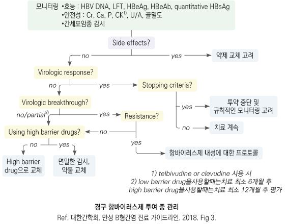
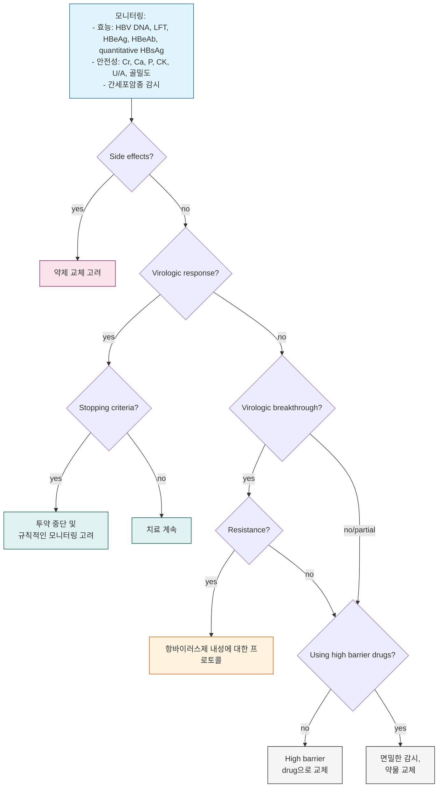

# B형간염 Hepatitis B Viral Infection

## 일반 사항

* B형간염 바이러스(Hepatitis B virus, HBV) 감염에 의한 급/만성 간질환
* 잠복기 : 45\~160일(평균 120일)
* 전염 경로 : HBsAg 양성인 사람의 혈액, 분비물(매우 드묾); 체외에서 최소 1주일간 생존
* 만성 간염 : 급성 감염 후 sAg이 ≥6개월 존재하는 상태
*   경과 : 보통 2\~3주 후 급성 질환 회복, 16주 후 임상 및 실험실 검사 회복; 95% 이상에서 자연 회복되며 일부에서 만성화

    •노출 후 만성 감염 발생률 : 성인- 5%, 소아- 25\~30%, eAg(+) 산모 출산 신생아- 90%

    •만성 간염 경과 : 자연 회복률- 0.5%/년, 간경변증 발생률- 5%/년, 간세포암종 발생률- 0.8%/년

    •악화 경과 위험 인자 : 가족력, 알코올 섭취, 흡연, 남성, ≥40세, aflatoxin, HBV DNA ≥2,000 IU/㎖, eAg(+),

    basal core promoter 바이러스 유전자 변이
*   우리나라 만성 B형간염 특징 : 대부분 C2 유전자형으로 eAg 혈청 전환이 늦고, 간경변증과 간세포암종으로의 진행이

    빠르며, 인터페론 치료 효과가 낮고, 항바이러스제 치료 후 재발률이 높음

#### 용어 정의

*   virologic response : \[경구제] HBV DNA가 RT-PCR에서 측정되지 않는 경우;

    \[Peg-IFN-α] 투여 6개월 이후 또는 치료 종료 시에 혈청 HBV DNA가 ＜2,000 IU/㎖으로 감소하는 경우
* serologic response : Ag 소실 또는 seroconversion
*   HBV reactivation

    ① 동반 질환 때문에 면역 억제 치료를 받는, sAg 관계없이 cAb(+)인 환자에서 HBV immune control의 상실

    ② baseline(또는 절대적 기준치) 대비 HBV DNA 상승

    ③ cAb(+)/sAg(-) 환자에서 sAg(+)로의 전환(reverse seroconversion)
* hepatitis flare : ALT가 baseline의 ＞3배 및 ＞100 U/L으로 증가
* HBV-associated hepatitis : HBV reactivation & hepatitis flare
* HBeAg seroconversion : eAg(+)/eAb(-) 환자의 eAg(-)/eAb(+)로의 전환
* HBeAg clearance : eAg(+) 환자의 eAg(-)로의 전환
* HBeAg seroreversion : eAg(-) 환자의 eAg(+)로의 전환
*   resolved CHB : sAg(+) 환자의 sAg(-)로의 전환 후 이 상태가 지속; HBV DNA가 검출되지 않으며 활동성 바이러스 감염의

    임상적 또는 조직학적 증거 없음
*   virological breakthrough : 초기 virological response가 있었던 환자에서 치료 중 혈청 HBV DNA가 저점으로부터

    ＞10배 증가

### Red Flags!

* 복수 발생
* PT 연장
* 자세 고정 불능
* 의식 변화 (간성뇌증

## 임상 양상

* 다양 : 무증상~~급성 간부전/사망; 잠행성~~급성 악화

### 급성

* 발열, 피로, malaise, 관절통, 근육통, 식욕 저하, 구역, 구토
* 황달, 거무스름한 소변, 흰색 대변
* 우상복부 통증 및 압통, 간 비대

### 만성

* 종종 무증상 또는 피로

### 만성 B형간염 Phase (자연 경과)

1. 만성 B형간염, 면역관용기 (CHB, immune tolerant phase)
   * eAg(+)·eAb(-). ALT 정상, HBV-DNA(IU/㎖) ≥10⁷, 간 조직 손상¹⁾ none/minimal; 수직 감염 관련, 바이러스에 대한 면역 반응이 거의 없음
2. HBeAg(+) 만성 B형간염, 면역활동기 (HBeAg(+) CHB, immune active phase)
   * eAg(+)·eAb(+)(추정), ALT ↑(지속 또는 간헐적), HBV-DNA(IU/㎖) ≥20,000, 간 조직 손상 moderate/severe; 바이러스에 대한 면역 반응 시작
3. 만성 B형간염, 면역비활동기 (CHB, immune inactive phase)
   * eAg(-)·eAb(+), ALT 정상, HBV-DNA(IU/㎖) ＜2,000, 간 조직 손상 minimal; 보통 장기간 지속되는 양호한 예후, 20%에서는 재활성화 및 비활성화를 반복하면서 간질환 진행
4. HBeAg(-) 만성 B형간염, 면역활동기 (HBeAg(-) CHB, immune active phase)
   * eAg(-)²⁾, eAb(±), ALT ↑(지속 또는 간헐적), HBV-DNA(IU/㎖) ≥2,000, 간 조직 손상 moderate/severe; 자연 관해율이 낮으며 보통 섬유화/간경변증으로 진행
5. HBsAg 소실기 (HBsAg loss phase)
   * sAg(-), sAb(±), cAb(+), ALT 정상, HBV-DNA(IU/㎖) 검출(-), 간 조직 손상 (-); 기능적 완치 상태³⁾; 면역비활동기 환자의 연 1\~2%가 소실기로 이행

_CHB=Chronic hepatitis B_\
_¹⁾ 자연 경과 중 경화기가 진행될 수 있음_\
_²⁾ eAg(-)의 원인은 HBV의 precore 또는 basal core promoter 유전자 부위의 변이로 eAg을 생성하지 못하기 때문_\
_³⁾ sAg이 50세 이후 소실, sAg 소실 때 이미 간경변증 동반, 남성에서는 간세포암종 발생의 위험도가 지속됨_

_<mark style="color:$info;">Ref. 대한간학회. 2018</mark>_

* AASLD (미국간학회) 분류 (2018) : ⓵ Chronic hepatitis B, ⓶ Immune tolerant CHB (면역관용기), ⓷ Immune active CHB (면역활동기), ⓸ Inactive CHB (비활동기)
* EASL (유럽간학회) 분류 (2017) : ⓵ eAg(+) chronic infection(Immune tolerant), ⓶ eAg(+) chronic hepatitis(Immune reactive eAg(+)), ⓷ eAg(-) chronic infection(Inactive carrier), ⓸ eAg(-) chronic hepatitis, ⓹ sAg(-) phase
* 각 임상 단계들의 지속 기간은 다양하며, 환자에서 항상 연속적으로 일어나지 않으며 어느 한 단계에 정확히 부합하지 않는 회색지대가 존재할 수 있으므로 1회의 ALT, HBV DNA 검사를 통하여 해당하는 임상 단계를 단정 짓거나 항바이러스 치료 시작을 결정하는 것은 곤란함

***

<figure><figcaption>
<strong>만성 B형간염의 자연 경과</strong>
 Ref. 대한간학회. 만성 B형간염 진료 가이드라인. 2018. Fig 1.
</figcaption></figure>

## 진단

* 병력 청취 : 다른 바이러스에 의한 중복 감염, 음주력, 약물 복용력; 간질환, 간세포암종 가족력

### 검사

* CBC, AST/ALT, ALP, GGT, Bil, Alb, Cr, PT
* sAg/sAb, eAg/eAb, HCV Ab, IgG HAV Ab(＜50세 환자), HBV DNA 정량(RT-PCR)
* 유전자형 검사 : 우리나라는 대부분 유전자형 C형으로 알려져 있어 검사 권고 안 함
* 필요시 염증 괴사 정도 및 섬유화 확인 : 간 생검, 혈청 표지자, liver stiffness(FIB-4, 초음파) (☞ p.468)
* 필요시 간세포암종 선별 검사 : 복부 초음파, α-fetoprotein

### Serologic marker 해석

다음은 업로드하신 B형간염 혈청학적 검사 결과 해석표를 깔끔하게 정리한 표입니다.

<table data-header-hidden><thead><tr><th width="80"></th><th width="80"></th><th width="80"></th><th width="80"></th><th width="80"></th><th></th></tr></thead><tbody><tr><td><strong>HBsAg</strong></td><td><strong>HBsAb</strong></td><td><strong>HBcAb</strong></td><td><strong>HBeAg</strong></td><td><strong>HBeAb</strong></td><td><strong>해석</strong></td></tr><tr><td>+</td><td>-</td><td>IgM</td><td>+</td><td>-</td><td>급성 B형간염, high infectivity*</td></tr><tr><td>+</td><td>-</td><td>IgG</td><td>+</td><td>-</td><td>만성 B형간염, high infectivity</td></tr><tr><td>+</td><td>-</td><td>IgG</td><td>-</td><td>+</td><td>지연 급성 또는 만성 B형간염, low infectivity; HBeAg(-)(precore-mutant) B형간염 (만성 또는 드물게 급성)</td></tr><tr><td>+</td><td>+</td><td>-</td><td>±</td><td>±</td><td>one subtype의 HBsAg &#x26; heterotypic HBsAb (혼합); HBsAg에서 HBsAb로의 seroconversion 과정 (드묾)</td></tr><tr><td>-</td><td>-</td><td>IgM</td><td>±</td><td>±</td><td>급성 B형간염*; HBcAb window period</td></tr><tr><td>-</td><td>-</td><td>IgG</td><td>-</td><td>-</td><td>낮은 수준의 B형간염 분균; 과거 B형간염</td></tr><tr><td>-</td><td>+</td><td>IgG</td><td>-</td><td>-</td><td>B형간염으로부터의 회복</td></tr><tr><td>-</td><td>+</td><td>-</td><td>-</td><td>-</td><td>백신 접종 후 상태; 과거 B형간염(?); 위양성</td></tr></tbody></table>

*IgM HBcAb는 만성 B형간염의 급성 재활성기에 출현할 수 있음 <em><mark style="color:$info;">Ref. Harrison’s Principles of Internal Medicine, 20th ed. (2020), fig 332-5.</mark></em>

### 선별 검사

* 항목 : HBsAg 및 HBsAb

#### 선별 검사 대상 (고위험군)

* 고위험 지역 출신 (미국간학회 지침에서는 거의 모든 국가가 해당)
* 고위험 지역 여행자\*
* 마약 주사 사용자\*, 남성 동성애자\*, STD 평가 또는 치료 대상자\*, 복수의 성 파트너\*
* 면역억제제 치료자, 혈액/장기/정액 기증자
* 원인 미상의 ALT 또는 AST 상승\*
* 말기 신질환자 또는 투석 환자\*, 만성 간질환자(예: HCV)_, HIV 감염자_
* 백신 접종을 하지 않은 19\~59세 당뇨병 환자; ≥60세 당뇨병 환자 중에서는 임상적으로 선별\*
* 모든 임신 여성
* HBsAg(+) 산모에서 출생한 영아\*
* HBsAg(+) 환자와 동거, 바늘 공동 사용, 성 접촉자\*
* 발달 장애인을 위한 시설 거주자 또는 관리자\*, 교정 시설 재소자\*
* 혈액 또는 혈액에 오염된 체액에 노출될 가능성이 있는 직업 종사자\*
* 노출된 사람에게 예방 조치가 요구되는 혈액 또는 체액의 원천인 사람

　\*seronegative인 사람은 백신 접종 대상임

***

## Management

## 급성 간염

* 대증 치료
* 증상이 있는 경우 침상 안정
* 식이 : 특별한 제한 없이, 과식을 하지 않는 수준에서 원하는 음식 섭취
* 심한 구역/구토, 경구 섭취가 어려운 경우 IV(예: 10% glucose)
* 알코올 금단 등 안정제가 필요한 경우 간 대사가 없는 oxazepam(15~~30 ㎎ tid~~qid) 선택
* 경구 항바이러스제 : 혈액응고장애, 심한 황달, 간부전 등이 발생한 중증 급성 B형간염에서 고려

## 만성 간염

* 치료 목표 : HBV DNA level의 장기 억제, 간경변증/간세포암 등 합병증 방지
* 혈청에서의 간 효소 회복보다 증상 호전이 먼저 나타남

### 치료 방침

* 만성 B형간염 환자 : 내성 발현의 유전자 장벽이 높은 경구 항바이러스제 단독요법 또는 Peg-IFN-α 단독 치료 권고
*   대상성 간경변증 환자 : 내성 발현의 유전자 장벽이 높은 경구 항바이러스제 단독요법 권고; 간 기능이 좋은 경우

    Peg-IFN-α-2를 고려 (간 기능 악화와 약물 부작용 등에 주의)
*   비대상성 간경변증 환자 : 내성 발현의 유전자 장벽이 높은 경구 항바이러스제 단독요법 권고;

    Peg-IFN-α-2는 간부전 위험 때문 금지

### 항바이러스제

#### 항바이러스제 치료 대상 \[대한간학회]

**면역관용기**

* 항바이러스제의 치료 대상이 되지 않음
* ALT가 지속적으로 정상이더라도 다음의 경우에는 간 생검을 시행하여 치료 여부를 결정 : ⓵ ≥30\~40세, ⓶ HBV DNA ＜107 IU/㎖, ⓷ 비침습적 검사에서 유의미한 간섬유화를 시사하는 소견이 있음, ⓸ ALT가 정상 상한치(ULN)의 경계에 있음

**HBeAg(+) 및 HBeAg(-) 면역활동기**

* HBV DNA ≥20,000 IU/㎖인 HBeAg (+) 또는 HBV DNA ≥2,000 IU/㎖인 HBeAg (-)
  * ALT ≥2×ULN 시 항바이러스제 치료 시작
  * ALT ≥1\~2×ULN 시 F/U 또는 간 생검 → 중등도 이상의 염증 괴사 또는 문맥주변부 섬유화 이상 단계 시 항바이러스제 치료 시작; 간 생검이 곤란한 경우 비침습적 검사로 간섬유화 평가
* ALT의 급격한 상승(≥5\~10×ULN), 황달, PT 연장, 복수, 간성 혼수 등 간부전의 소견을 보이는 급성 악화 : 즉시 경구 항바이러스제 치료 시작
* HBV DNA ≥2,000 IU/㎖인 HBeAg (-) : ALT ≤ULN 시 추적 관찰 또는 간 생검이나 비침습적 검사로 염증 및 섬유화 정도를 확인하여 치료 여부를 결정

**면역비활동기**

* 간 생검이나 비침습적 검사에서 의미있는 간섬유화 의심 소견이 있는 경우 치료 고려
* 다음의 경우는 치료 대상이 아님 : HBV DNA ＜2,000 IU/㎖, ALT ≤ULN, 진행성 간섬유화의 증거가 없는 경우

**대상성 간경변증 (Compensated cirrhosis)**

* HBV DNA ≥2,000 IU/㎖ 시 ALT 무관 항바이러스제 치료 시작
* 혈청 HBV DNA가 검출되는 대상성 간경변증은 HBV DNA가 ＜2,000 IU/㎖라도 ALT 무관 항바이러스제 치료 시작

**비대상성 간경변증 (Decompensated cirrhosis)**

* 간경변증 환자에서 복수, 정맥류 출혈, 간성뇌증, 황달 등 간경변증 합병증이 동반된 상태
* HBV DNA 검출 시 ALT 무관 경구 항바이러스제 치료 시작 및 간 이식 고려
* 인터페론 알파는 심한 부작용(예: 세균 감염, 간부전) 발생 우려로 금기

#### 항바이러스제

**주사제**

* Peg-IFN-α-2a \[페가시스 주] : 180 ㎍ qwk SC
  * 부작용 : 감기 증상, 피로, 감정 변동, 혈구 감소, 자가면역 이상
  * 치료 중 모니터링&#x20;
    : CBC (매달 ×3), TSH (3개월마다); 자가면역, 허혈, 신경정신병, 감염에 대한 임상적 관찰

**경구제**

High genetic barrier (선호; 투여 기간- HBsAg 소실까지)

<table><thead><tr><th width="112">성분명</th><th width="106">용량¹⁾</th><th width="144">부작용</th><th>치료 중 모니터링</th></tr></thead><tbody><tr><td>ETV  [바라크루드]</td><td>0.5 ㎎ qd²⁾</td><td>젖산증</td><td>필요 시 젖산 검사, HIV³⁾</td></tr><tr><td>TDF  [비리어드]</td><td>300 ㎎ qd</td><td>신장애, Fanconi syndrome, 골연화증, 젖산증</td><td>CrCl 기초 검사; 신장애 위험 시 최소 매년 
CrCl, P, u-Glc&#x26;Prot; 필요시 젖산;
 골절 병력/골다공증 위험시 골밀도 검사</td></tr><tr><td>TAF  [베믈리디]</td><td>25 ㎎ qd</td><td>젖산증, LDL 감소</td><td>필요 시 치료 전/중 Cr, P, CrCl, u-Glc&#x26;Prot 검사; 필요 시 젖산; HIV³⁾</td></tr><tr><td>Besifovir  [베시포]</td><td>150 ㎎ qd⁴⁾</td><td>Carnitine 결핍</td><td>L-carnitine 보충 필요</td></tr></tbody></table>

Low genetic barrier (비선호; 투여 기간- HBsAg 소실까지, resistant mutation 확인 전까지)

<table data-header-hidden><thead><tr><th width="112">성분명</th><th width="106">용량¹⁾</th><th width="144">부작용</th><th>치료 중 모니터링</th></tr></thead><tbody><tr><td>LAM  [제픽스]</td><td>100 ㎎ qd</td><td>췌장염, 젖산증</td><td>필요 시 amylase, 젖산; HIV³</td></tr><tr><td>TBV  [세비보]</td><td>600 ㎎ qd</td><td>Cr kinase↑, myopathy</td><td>필요 시 Cr kinase, 젖산</td></tr><tr><td>Clevudine  [레보비르]</td><td>30 ㎎ qd</td><td>말초신경병증, 젖산증</td><td>—</td></tr><tr><td>ADV  [헵세라]</td><td>10 ㎎ qd</td><td>ARF, Fanconi syndrome, 젖산증</td><td>CrCl 기초 검사; 신장애 위험 시 최소 매년 CrCl, P, u-Glc&#x26;Prot; 필요 시 젖산; 골절 병력/골다공증 위험 시 골밀도 검사</td></tr></tbody></table>

_ETV = entecavir, TDF = tenofovir disoproxil fumarate, TAF = tenofovir alafenamide fumarate, LAM = lamivudine, TBV = telbivudine, ADV = adefovir_

¹⁾ 신 기능 저하 시 용량 조절\
²⁾ lamivudine 치료 경험이 있거나 decompensated cirrhosis가 있으면 1 mg/d\
³⁾ 치료 전 HIV 검사\
⁴⁾ L-carnitine 660 mg 함께 복용

### 간장질환용제

*   milk thistle \[레가론] : 독성 간질환 및 만성 간염, 간경변의 보조 치료

    •용량 ; 초기 140 ㎎ tid, 유지 70 ㎎ tid or 140 ㎎ bid
*   ursodeoxycholic acid \[우루사] : 담즙 분비 부전으로 오는 간질환 및 담관/담낭 질환의 보조 치료,

    만성 간질환의 간 기능 개선, 소장 절제 후유증 및 염증성 소장 질환의 소화불량 개선

    •용량 : 50\~100 ㎎ tid
*   biphenyl-dimethyl-dicarboxylate \[디디비] : 지속적 ALT 상승 만성 간염에 적용

    •용량 : 7.5 ㎎ tid, 1\~2개월 투여에도 증상 개선이 없을 때 15 ㎎ tid 로 증량 가능, ALT 정상 회복 시 7.5 ㎎ bid 로 감량;

    투여 기간- 보통 6\~12개월

***

경구 항바이러스제 투여 중 관리
\
Ref. 대한간학회. 만성 B형간염 진료 가이드라인. 2018. Fig 3.

## 모니터링

### 치료 비대상자 모니터링

* ALT 및 HBV DNA를 3\~6개월마다, HBeAg/Ab를 6\~12개월마다 모니터링
* 치료 대상 여부가 불분명한 경우 : ALT 및 HBV DNA를 1\~3개월, HBeAg/Ab를 2\~6개월마다 F/U, 비침습적 검사로 간섬유화 정도를 판단, 또는 간 생검으로 치료 여부 결정

### 항바이러스제 치료 중 모니터링

* 경구 항바이러스제 : LFT 및 HBV DNA를 1\~6개월마다 검사, eAg/eAb를 3\~6개월마다 검사; 치료 중 반응 예측과 종료 시점 결정에 도움을 줄 수 있는 sAg 정량 검사 고려
* Peg-IFN-α : CBC/LFT를 매월, HBV DNA를 1\~3개월마다, eAg/eAb를 치료 시작 후 6개월, 1년 및 종료 6개월 후 검사; sAg 정량 검사를 치료 전, 치료 12주, 24주 및 종료 시 고려
* virologic response 확인 후 HBV DNA를 3\~6개월마다 지속적으로 측정할 수 있음
* 항바이러스 치료 시 각각의 약물 부작용에 대한 모니터링

### 치료 종료 및 종료 후 모니터링

* sAg 소실이 이루어진 후 경구 항바이러스제 치료를 종료하며, eAg(+) 환자는 virologic 또는 serologic response 달성 후 12개월 이상 경구 항바이러스제를 투여한 후 종료를 고려할 수 있음
* 간경변증 환자에서는 장기간의 치료를 고려; 비대상성 간경변증 환자에서는 경구 항바이러스제 치료를 중단하지 않음
* 치료 종료 후 1년간 LFT & HBV DNA를 1\~6개월마다, eAg/eAb를 3\~6개월마다 검사; 1년 후에 반응이 유지되면 LFT & HBV DNA를 3\~6개월마다, eAg/eAb를 6\~12개월마다 검사
* 항바이러스 치료 종료 후 바이러스 반응이 유지되면 sAg/sAb를 추적하여 sAg 소실, 유지, 재양전 여부를 확인

### 항바이러스 치료 중 반응에 따른 대처

* 경구 항바이러스제 치료 중 부분 바이러스 반응 환자는 약제 순응도를 확인
* 부분 바이러스 반응 환자에서 내성 장벽이 낮은 약제를 사용 중인 경우에는 교차내성이 없고 내성 장벽이 높은 약제로 전환
* 부분 바이러스 반응 환자에서 내성 장벽이 높은 약제를 사용하는 경우 3\~6개월 간격으로 바이러스 반응을 모니터링하면서 치료를 지속할 수 있음. 단, ETV를 사용하고 있는 경우에는 tenofovir로 전환을 고려할 수 있음
* Peg-IFN-α의 경우 eAg(+) 환자에서 치료 시작 24주째 sAg 정량치가 ＜20,000 IU/㎖로 감소하지 않을 때, eAg(-) 환자에서 12주째 sAg 정량치 감소가 없으면서 HBV DNA 감소가 ＜2 log10인 경우 치료 반응이 없을 것으로 예상하여 치료 중단을 고려

## 특수한 상황에서의 치료

### 약제 내성의 치료

* 경구 항바이러스 치료 중 바이러스 돌파 시 환자의 약물 순응도 확인 및 약제 내성 검사 시행
* 바이러스 돌파가 관찰되고 유전자형 내성이 확인되면 가급적 빨리 내성 치료 시작
* 뉴클레오시드 유사체(lamivudine, telbivudine, clevudine) 내성 시 tenofovir 단독 치료로 전환
* ETV 내성 시 tenofovir 단독 치료로 전환 또는 tenofovir 추가
* adefovir 내성 시 tenofovir 단독 치료로 전환 또는 tenofovir/ETV 병합 치료로 전환
* tenofovir 내성 시 ETV 추가
* 다약제 내성 시 tenofovir/ETV 병합 치료 또는 tenofovir 단독 치료로 전환

### 신 기능 감소, 골 대사 질환

* 선택 약제 : ETV, TAF, besifovir를 선호
* TDF 복용 중 신 기능↓ 또는 골밀도↓가 우려되는 경우 치료 기왕력에 따라 TAF, besifovir, ETV로 전환 고려
* 모든 약제는 CrCl에 따라 용량 조절을 요함
  * 신장 대체 요법을 시행하지 않는 환자에서 다음의 경우 투여 제한 : CrCl ＜50 시 besifovir, CrCl ＜15 시 TAF, CrCl ＜10 시 TDF

### 임신부

* 선택 약제 : TDF 선호 •Peg-IFN-α 금지
* HBV DNA ≥200,000 IU/㎖인 경우 임신 24~~32주부터 출산 후 2~~12주까지 TDF 투여 권고

## 예방

* sAg(-)/sAb(-)인 경우 B형간염 예방접종 시행
* 만성 HBV 감염자가 A형간염 항체가 없는 경우 A형간염 예방접종 시행
* 만성 HBV 감염자는 금주, 금연
* 만성 HBV 감염 산모 출생 신생아는 출생 즉시 B형간염 면역 글로불린 투여 및 예방접종 시행

### 환자에 대한 관리

* B형 간염 감염자는 신체 접촉이 있는 스포츠 포함하여 모든 활동에 참여할 수 있음
* 직장, 학교, 보육 시설, 또는 다른 사람들과의 활동에서 배제되어서는 안 됨
* 음식과 도구를 공동 사용할 수 있으며 키스도 가능함
* 백신 미-접종 또는 자연 면역이 없는 사람과의 성 접촉 시 보호 장구 사용
* 수혈, 장기, 정자 기증 금지
* 칫솔 또는 면도기, 당 검사 기구, 주사 도구 공동 사용 금지
* 노출된 절단면 또는 거친 표면에 의한 손상 주의
* 혈액이 묻은 곳은 표백제로 닦음
* 가족 및 성 접촉자 백신 접종

### **질병코드**&#x20;

B16 급성 B형간염

B18.0 델타-병원체가 있는 만성 바이러스B형간염

B18.1 델타-병원체가 없는 만성 바이러스B형간염
