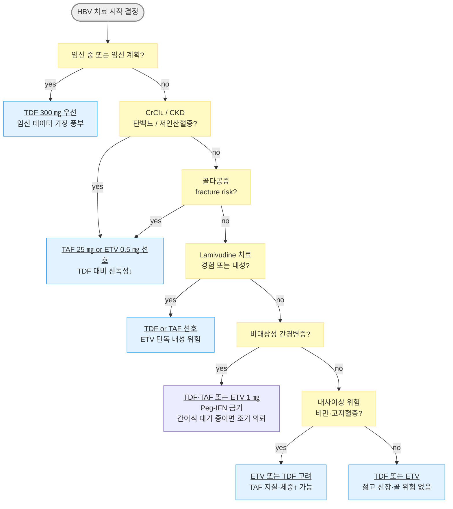
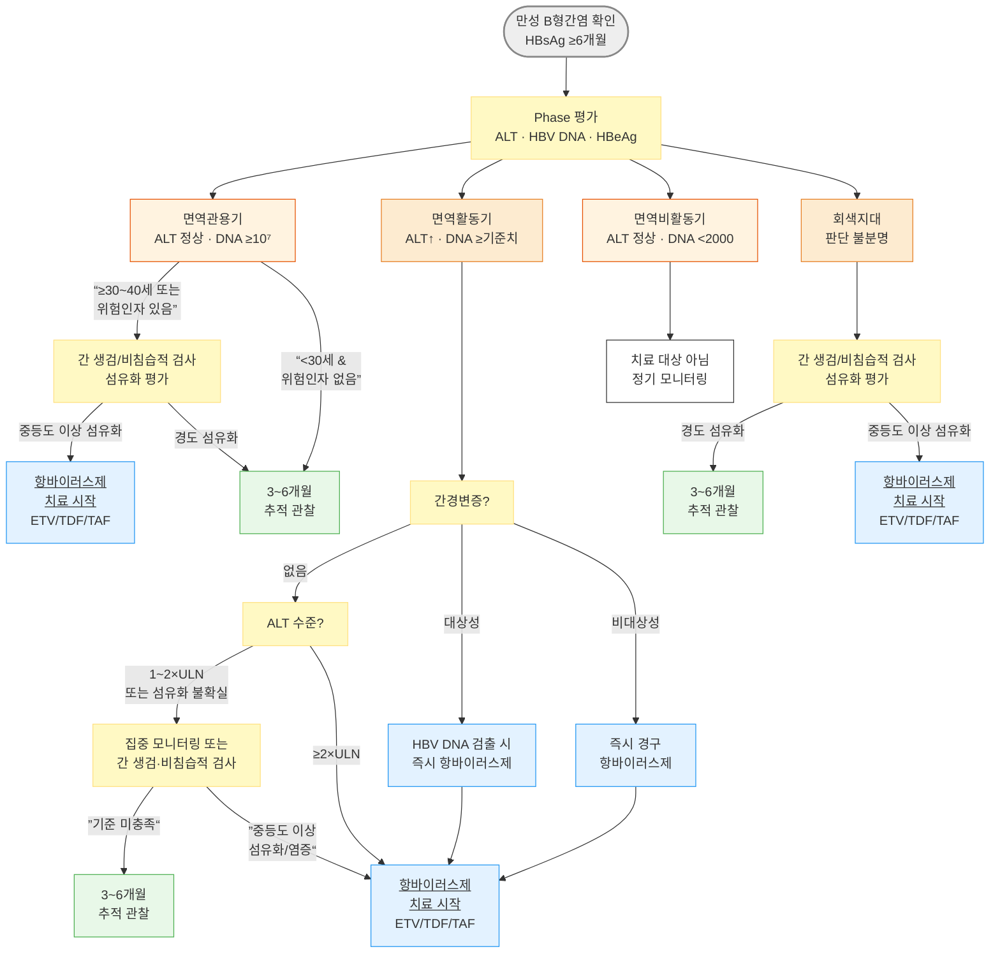
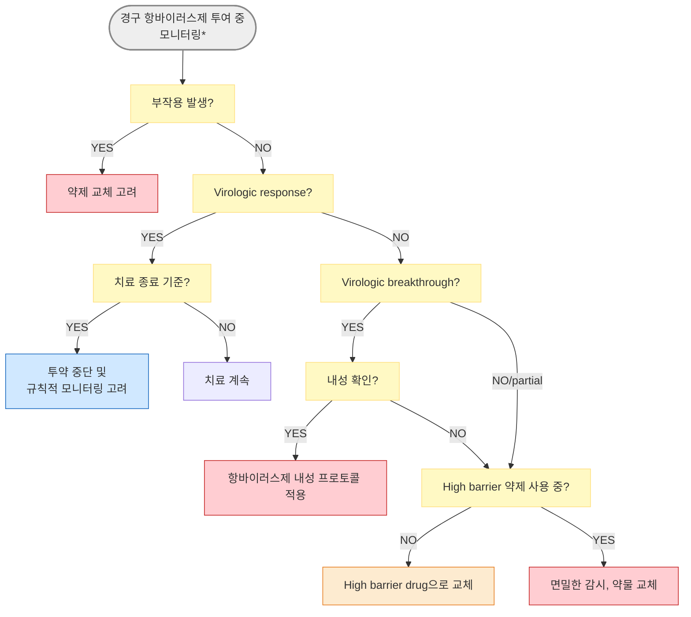
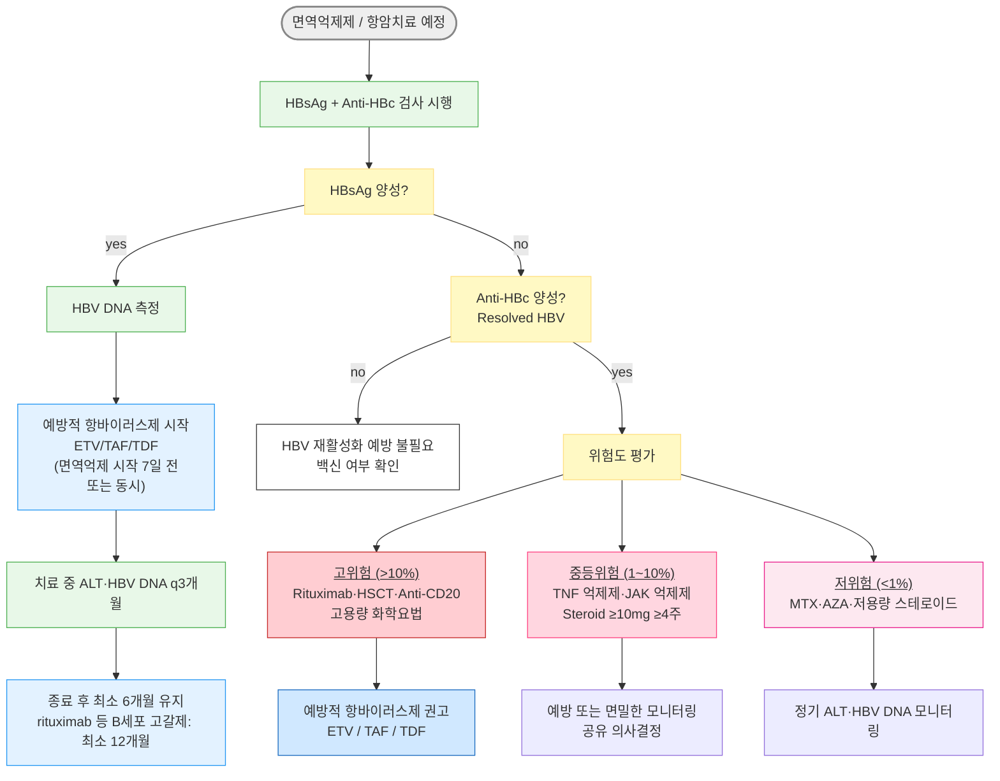

# B형간염 Hepatitis B Viral Infection

## <mark style="color:green;">일반 사항</mark>

* B형간염 바이러스(Hepatitis B virus, HBV) 감염에 의한 급/만성 간질환
* 잠복기 : 45\~160일(평균 120일)
* 전염 경로 : HBsAg 양성인 사람의 혈액, 분비물(타액·정액·질 분비물 등); 환경 표면에서 최소 7일간 감염력 유지 가능
* 만성 간염 : 급성 감염 후 HBsAg이 ≥6개월 존재하는 상태

**경과**

* 보통 2\~3주 후 급성 질환 회복, 16주 후 임상 및 실험실 검사 회복; 95% 이상에서 자연 회복되며 일부에서 만성화
* 노출 후 만성 감염 발생률 : 성인 5%, 소아 25\~30%; HBeAg(+) 산모 출산 신생아 90%
* 만성 간염 경과 : 자연 회복률 0.5%/년, 간경변증 발생률 5%/년, 간세포암종 발생률 0.8%/년
* 악화 경과 위험 인자 : 가족력, 알코올 섭취, 흡연, 남성, ≥40세, aflatoxin, HBV DNA ≥2,000 IU/㎖, HBeAg(+), basal core promoter 바이러스 유전자 변이

**우리나라 특징**

* 대부분 C2 유전자형으로 HBeAg 혈청 전환이 늦고, 간경변증과 간세포암종으로의 진행이 빠르며, 인터페론 치료 효과가 낮고, 항바이러스제 치료 후 재발률이 높음

### <mark style="color:orange;">용어 정의</mark>

* **virologic response** : \[경구제] HBV DNA가 RT-PCR에서 미검출인 경우; \[Peg-IFN-α] 투여 6개월 이후 또는 치료 종료 시에 혈청 HBV DNA ＜2,000 IU/㎖으로 감소하는 경우
* **serologic response** : Ag 소실 또는 seroconversion
* **HBV reactivation** : ⓵ 면역억제 치료를 받는 anti-HBc(+) 환자에서 HBV immune control의 상실; ⓶ baseline 대비 HBV DNA 상승; ⓷ anti-HBc(+)/HBsAg(-) 환자에서 HBsAg(+)로의 전환(reverse seroconversion)
* **hepatitis flare** : ALT가 baseline의 ＞3배 및 ＞100 U/L으로 증가
* **HBV-associated hepatitis** : HBV reactivation + hepatitis flare
* **HBeAg seroconversion** : HBeAg(+)/HBeAb(-) → HBeAg(-)/HBeAb(+)로의 전환
* **HBeAg clearance** : HBeAg(+) → HBeAg(-)로의 전환
* **HBeAg seroreversion** : HBeAg(-) → HBeAg(+)로의 전환
* **resolved HBV infection** : 과거 HBV 감염 후 HBsAg 소실 및 HBV DNA 미검출 상태; 활동성 바이러스 감염의 임상적·조직학적 증거 없음 (= resolved CHB)
* **virological breakthrough** : 초기 virological response 이후 치료 중 혈청 HBV DNA가 저점으로부터 ＞10배 증가
* **functional cure** : HBsAg 소실(± HBsAb seroconversion) + 혈청 HBV DNA 미검출 + 간질환 진행 억제; cccDNA(covalently closed circular DNA)가 간세포 핵 내에 잔존하여 완전 박멸은 아니지만 현재 HBV 치료의 이상적 목표
* **isolated anti-HBc positivity** : HBsAg(-), HBsAb(-), anti-HBc(+) 상태; 잠재 감염(occult HBV), 과거 감염 후 HBsAb 소실, 또는 위양성일 수 있음; 면역억제 시 재활성화(reverse seroconversion) 위험 존재

## <mark style="color:green;">임상 양상</mark>

* 다양 : 무증상 \~ 급성 간부전/사망; 잠행성 \~ 급성 악화

### <mark style="color:orange;">급성</mark>

* 발열, 피로, malaise, 관절통, 근육통, 식욕 저하, 구역, 구토
* 황달, 거무스름한 소변, 흰색 대변
* 우상복부 통증 및 압통, 간 비대

### <mark style="color:orange;">만성</mark>

* 종종 무증상 또는 피로

### <mark style="color:orange;">만성 B형간염 자연 경과 (Phase)</mark>

<table><thead><tr><th width="49">단계</th><th width="335">임상 분류</th><th width="108">ALT</th><th width="101">HBV DNA (IU/㎖)</th><th width="107">간 손상</th></tr></thead><tbody><tr><td>1</td><td>만성 B형 감염(CHB), 면역관용기<br><em>HBeAg(+) chronic infection; HBeAg(+), anti-HBe(-)</em></td><td>정상</td><td>대개 ≥10⁷</td><td>대체로 경미하나 일부에서 유의한 섬유화 가능</td></tr><tr><td>2</td><td>HBeAg(+) CHB, 면역활동기<br><em>HBeAg(+) chronic hepatitis; HBeAg(+), anti-HBe 발생 가능</em></td><td>↑(지속 또는 간헐적)</td><td>≥20,000</td><td>중등도 이상</td></tr><tr><td>3</td><td>CHB, 면역비활동기<br><em>HBeAg(-) chronic infection; HBeAg(-), anti-HBe(+)</em></td><td>정상</td><td>＜2,000</td><td>최소</td></tr><tr><td>4</td><td>HBeAg(-) CHB, 면역활동기<br><em>HBeAg(-) chronic hepatitis; HBeAg(-), anti-HBe(+/-)</em></td><td>↑(지속 또는 간헐적)</td><td>≥2,000</td><td>중등도 이상</td></tr><tr><td>5</td><td>HBsAg 소실기<br><em>HBsAg loss / functional cure; HBeAg(-), anti-HBc(+), anti-HBs(+/-)</em></td><td>정상</td><td>미검출</td><td>-</td></tr></tbody></table>

<p align="center"><em><mark style="color:$info;">Ref. 대한간학회. 만성 B형간염 진료 가이드라인. 2022. Table 2.</mark></em></p>


**Functional Cure - 치료의 이상적 목표**\
HBsAg 소실(± HBsAb seroconversion) + 혈청 HBV DNA 미검출 상태를 functional cure라 함. cccDNA는 간세포 핵 내에 잔존하므로 완전 박멸(sterilizing cure)은 아니지만, HCC·간경변 위험을 최소화하는 최선의 결과임. 최근에는 HBsAg의 완전 소실 없이 qHBsAg이 크게 감소한 상태를 'partial cure' 또는 'clinical cure' 개념으로 구분하기도 하나, HBsAg 소실이 가장 강력하고 명확한 치료 지표임. 정량 HBsAg(qHBsAg)은 치료 반응 예측, finite therapy 종료 시점, grey-zone 환자 계층화에 활용됨



각 임상 단계들의 지속 기간은 다양하며, 환자에서 항상 연속적으로 일어나지 않고 어느 한 단계에 정확히 부합하지 않는 회색지대(grey zone)가 존재. 1회의 ALT, HBV DNA 검사만으로 임상 단계를 단정 짓거나 항바이러스 치료 시작을 결정하는 것은 곤란함


<figure><figcaption><p><strong>만성 B형간염의 자연 경과</strong><br>Ref. 대한간학회. 만성 B형간염 진료 가이드라인. 2022. Fig 1.</p></figcaption></figure>

### <mark style="color:$danger;">🚩 Red Flags!</mark>

<mark style="color:$danger;">**즉각 이송 또는 응급 평가**</mark>

* 의식 변화, 지남력 장애, 수면각성 역전 → 간성뇌증
* 자세 고정 불능(asterixis), 심한 행동 변화
* 대량 토혈 또는 흑색변 → 식도정맥류 출혈
* 심한 PT 연장 + 황달 + 의식 변화 → 급성 간부전
* 간경변증 환자에서 갑작스러운 고열 + 복통 + 복수 악화 → 자발성 세균성 복막염(SBP), 간농양

<mark style="color:$warning;">**당일 또는 조기 의뢰**</mark>

* 복수의 급격한 증가 또는 신규 발생
* 황달의 현저한 악화, 진흙빛 소변·흰색 변
* ALT ≥5\~10 × ULN 이상 급격 상승 또는 PT 연장 (간부전 전구 징후)
* 심한 구역·구토로 경구 섭취 불가 → 탈수·저혈당 위험

<mark style="color:$info;">**외래 추적 / 추가 평가 계획**</mark> <mark style="color:$info;">- 즉각 위험 낮으나 호전 없으면 의뢰</mark>

* 치료 중 HBV DNA 재상승
* 피로 지속 또는 현저한 체중 감소
* 알 수 없는 하지 부종 또는 경미한 황달 출현

## <mark style="color:green;">진단</mark>

* 병력 청취 : 다른 바이러스에 의한 중복 감염(HCV, HDV, HAV), 음주력, 약물 복용력; 간질환·간세포암종 가족력

### <mark style="color:orange;">기본 검사</mark>

* CBC, AST/ALT, ALP, GGT, Bilirubin, Albumin, Cr, PT/INR
* HBsAg/HBsAb, HBeAg/HBeAb, anti-HBc, HCV Ab, IgG HAV Ab (＜50세), HBV DNA 정량(RT-PCR)
* 유전자형 검사 : 우리나라는 대부분 C형이므로 권고하지 않음
* 간섬유화 평가 (필요 시) : 간 생검, 혈청 표지자(FIB-4), 간 경직도(초음파 또는 MRE) (☞ 간섬유화 비침습적 검사)
* 간세포암종 감시 : 복부 초음파 ± AFP - 간경변증, 고위험 만성 B형간염(남성 ≥40세, 여성 ≥50세, 간암 가족력, 항바이러스 치료에도 HBV DNA 지속 검출 등)에서 6개월마다 시행
* 정량 HBsAg (qHBsAg) : Peg-IFN-α 치료 반응 예측, 치료 종료 시점 결정, grey-zone 환자 계층화에 활용 고려


**FIB-4 index** = \[나이(세) × AST(U/L)] ÷ \[혈소판(×10⁹/L) × √ALT(U/L)]\
＜1.30 → 낮은 섬유화 위험; ≥2.67 → 유의미한 섬유화 가능성 (대한간학회 2024 간섬유화 비침습적 검사 가이드라인 참조); **65세 이상 고령**에서는 나이 항이 커져 FIB-4가 실제보다 높게 산출되는 경향 → 이 연령군에서는 ≥2.0 전후를 기준으로 보거나, 반드시 탄성도 검사 등을 병행하여 연령별 보정을 고려



**ALT ULN 성별 기준** : ALT가 검사실 정상 범위 내에 있더라도 간섬유화나 염증이 존재할 수 있다.\
**대한간학회 2022 권고** : 한국인에서 간질환 관련 사망률이 증가하기 시작하는 기준치를 근거로 **남성 34 IU/L, 여성 30 IU/L**를 ALT 정상 상한치로 권고한다 (KASL 2022, p.33).\
AASLD는 남성 ＞35 U/L, 여성 ＞25 U/L을 제시하며, 우리나라 대부분의 검사실 ULN(보통 남성 40–45, 여성 35–40 U/L)보다 두 기준 모두 엄격하다. **"정상 ALT"라도 고위험군에서는 섬유화 평가**를 고려한다.


### <mark style="color:orange;">Serologic Marker 해석</mark>

<table data-header-hidden><thead><tr><th width="80"></th><th width="80"></th><th width="80"></th><th width="80"></th><th width="80"></th><th></th></tr></thead><tbody><tr><td><strong>HBsAg</strong></td><td><strong>HBsAb</strong></td><td><strong>anti-HBc</strong></td><td><strong>HBeAg</strong></td><td><strong>HBeAb</strong></td><td><strong>해석</strong></td></tr><tr><td>+</td><td>-</td><td>IgM</td><td>+</td><td>-</td><td>급성 B형간염, high infectivity¹⁾</td></tr><tr><td>+</td><td>-</td><td>IgG</td><td>+</td><td>-</td><td>만성 B형간염, high infectivity</td></tr><tr><td>+</td><td>-</td><td>IgG</td><td>-</td><td>+</td><td>지연 급성 또는 만성 B형간염, low infectivity; HBeAg(-)(precore-mutant) B형간염</td></tr><tr><td>+</td><td>+</td><td>-</td><td>±</td><td>±</td><td>one subtype의 HBsAg &#x26; heterotypic HBsAb 혼합; HBsAg→HBsAb seroconversion 과정 (드묾)</td></tr><tr><td>-</td><td>-</td><td>IgM</td><td>±</td><td>±</td><td>급성 B형간염¹⁾; anti-HBc window period</td></tr><tr><td>-</td><td>-</td><td>IgG</td><td>-</td><td>-</td><td>Isolated anti-HBc²⁾: occult HBV infection 가능; 과거 감염 후 HBsAb 소실; 위양성 가능</td></tr><tr><td>-</td><td>+</td><td>IgG</td><td>-</td><td>-</td><td>B형간염으로부터의 회복 (resolved infection)</td></tr><tr><td>-</td><td>+</td><td>-</td><td>-</td><td>-</td><td>백신 접종 후 상태; 과거 B형간염(?); 위양성</td></tr></tbody></table>

¹⁾ IgM anti-HBc는 만성 B형간염의 급성 재활성기에도 출현할 수 있음\
²⁾ Isolated anti-HBc(HBsAg(-)/HBsAb(-)/anti-HBc(+)): window period·resolved infection·occult HBV·위양성을 감별; 면역억제 치료 시 HBV 재활성화 위험 - 고위험 약제 투여 전 HBV DNA 확인 필요; 수혈·장기 기증 시에는 occult HBV 전파 가능성으로 인해 혈액원/이식 센터에 반드시 고지해야 하며, 기증 가능 여부는 기관 프로토콜에 따름

<p align="center"><em><mark style="color:$info;">Ref. Harrison's Principles of Internal Medicine, 21st ed., fig 332-5.</mark></em></p>

### <mark style="color:orange;">선별 검사</mark>

* 항목 : HBsAg 및 HBsAb

#### <mark style="color:$primary;">선별 검사 대상 (고위험군)</mark>

* HBV 고유병 지역 출생자 또는 장기 체류자\*
* 마약 주사 사용자\*, 남성 동성애자\*, STD 평가·치료 대상자\*, 복수의 성 파트너\*
* 면역억제제 치료자, 혈액/장기/정액 기증자
* 원인 미상의 ALT 또는 AST 상승\*
* 말기 신질환자/투석 환자\*, 만성 간질환자(HCV 등)\*, HIV 감염자
* 백신 미접종 19\~59세 당뇨병 환자; ≥60세 당뇨병 환자 중 임상적으로 선별\*
* 모든 임신 여성
* HBsAg(+) 산모에서 출생한 영아\*
* HBsAg(+) 환자와 동거, 바늘 공동 사용, 성 접촉자\*
* 발달 장애인 시설 거주자·관리자\*, 교정 시설 재소자\*
* 혈액·오염 체액에 노출될 가능성이 있는 직업 종사자\*

　_\* seronegative인 경우 백신 접종 대상_

***

## <mark style="background-color:$warning;">Management</mark>

## <mark style="color:green;">급성 B형간염</mark>

* 대증 치료; 증상이 있는 경우 충분한 휴식 및 수분 섭취 권장 (routine 침상 안정은 권장하지 않음)
* 식이 : 특별한 제한 없이, 과식을 하지 않는 수준에서 원하는 음식 섭취
* 심한 구역·구토, 경구 섭취 어려운 경우 IV (예: 10% glucose)
* 알코올 금단 등 안정제가 필요한 경우 oxazepam이 선호되나 현재 국내 시판 제품 없음; 대체제로 lorazepam <mark style="color:blue;">\[아티반]</mark> (1\~2 ㎎ q4\~8h 경구) - 간의 산화 대사(CYP)를 거의 거치지 않고 glucuronidation 위주로 대사되어 간기능 저하 환자에서 비교적 안전
* 경구 항바이러스제 : 혈액응고장애·심한 황달·간부전 등이 발생한 중증 급성 B형간염에서 고려


**스테로이드(부신피질호르몬)** : 일반적인 급성 B형간염에서 스테로이드 치료는 권장되지 않음. 바이러스 복제를 촉진하고 면역 조절 기전을 억제하여 만성화 또는 전격성 간염 위험을 증가시킬 수 있음


## <mark style="color:green;">만성 B형간염</mark>

* 치료 목표 : HBV DNA level의 장기 억제 → 간경변증/간세포암종 등 합병증 방지

### <mark style="color:orange;">치료 방침</mark>

<table><thead><tr><th width="130">대상</th><th>권고 치료</th></tr></thead><tbody><tr><td>만성 B형간염</td><td>내성 장벽이 높은 경구 항바이러스제 단독요법 또는 Peg-IFN-α 단독 치료</td></tr><tr><td>대상성<br>간경변증</td><td>내성 장벽이 높은 경구 항바이러스제 단독요법; 간 기능이 좋은 경우 Peg-IFN-α-2 고려 가능 (간 기능 악화·부작용에 주의)</td></tr><tr><td>비대상성<br>간경변증</td><td>내성 장벽이 높은 경구 항바이러스제 단독요법; Peg-IFN-α-2는 간부전 위험으로 금기</td></tr></tbody></table>

### <mark style="color:orange;">항바이러스제 치료 대상 (대한간학회 2022)</mark>

면역관용기

* 원칙적으로 항바이러스제 치료 대상이 아님
* 아래의 경우 간 생검 또는 비침습적 검사로 치료 여부 결정 : ⓵ ≥30\~40세, ⓶ HBV DNA ＜10⁷ IU/㎖, ⓷ 비침습적 검사에서 유의미한 간섬유화 시사 소견, ⓸ ALT가 ULN 경계


**AASLD 2025 업데이트** : 면역관용기 환자 중 ≥40세에 해당하면 치료 고려를 권장하는 방향으로 근거가 강화됨. '회색지대(grey zone)' 환자에 대한 공유 의사 결정(shared decision-making)이 강조됨


* Grey Zone 치료 결정 체크리스트
  * 나이 ≥30\~40세 → 섬유화 평가 후 치료 고려
  * 유의한 간섬유화 (FIB-4↑, 탄성도↑) → 치료 적극 권고
  * 간암·간경변 가족력 → 치료 적극 권고
  * ALT가 ULN 경계 (반복 확인) → 3\~6개월 추적 후 재평가
  * 환자 순응도·장기 복약 의향 → 치료 전 충분한 상담 필요
  * 치료 이득 vs 부작용·비용 부담 → 환자와 함께 결정

**HBeAg(+) 및 HBeAg(-) 면역활동기**

* HBV DNA ≥20,000 IU/㎖ \[HBeAg(+)] 또는 ≥2,000 IU/㎖ \[HBeAg(-)]
  * ALT ≥2×ULN → 항바이러스제 치료 시작
  * ALT 1\~2×ULN → 추적 관찰 또는 간 생검 → 중등도 이상 염증 괴사 또는 문맥주변부 섬유화 이상 시 치료 시작
* ALT 급격 상승(≥5\~10×ULN), 황달, PT 연장, 복수, 간성 혼수 등 간부전 징후 → 즉시 경구 항바이러스제 치료 시작

**면역비활동기**

* 다음의 경우 치료 대상이 아님 : HBV DNA ＜2,000 IU/㎖, ALT ≤ULN, 진행성 간섬유화 증거 없음
* 간 생검/비침습적 검사에서 의미 있는 간섬유화 의심 시 치료 고려

**대상성 간경변증**

* HBV DNA ≥2,000 IU/㎖ → ALT 수치 무관 항바이러스제 치료 시작
* HBV DNA가 검출되는 경우 → 2,000 IU/㎖ 미만이라도 ALT 무관 치료 시작

**비대상성 간경변증**

* 복수, 정맥류 출혈, 간성뇌증, 황달 등 합병증 동반 상태
* HBV DNA 검출 시 ALT 무관 즉시 경구 항바이러스제 치료 시작 및 간 이식 고려
* Peg-IFN-α : 금기 (☞ 항바이러스제 > 주사제 섹션 참조)


비대상성 간경변증 환자는 간신증후군(HRS) 위험이 높아 항바이러스제 시작 전 반드시 신기능(CrCl, BUN/Cr)을 평가함. 신기능에 따라 TDF, TAF, ETV의 용량 조절이 필요하며, TDF는 신독성 위험으로 주의하여 사용


### <mark style="color:orange;">항바이러스제</mark>

#### <mark style="color:$primary;">주사제</mark>

* Peg-IFN-α-2a <mark style="color:blue;">\[페가시스 주]</mark> : 180 ㎍ qwk SC
  * 부작용 : 감기 증상, 피로, 감정 변동, 혈구 감소, 자가면역 이상
  * 절대 금기 : 비대상성 간경변증, 자가면역 간염, 심한 정신질환 병력(우울증·자살 충동 등), 조절 안 되는 자가면역질환, 혈소판 ＜50,000/㎕, 호중구 ＜1,000/㎕, 임신
  * 치료 중 모니터링 : ☞ 항바이러스제 치료 중 모니터링 섹션 참조

#### <mark style="color:$primary;">경구제</mark>

**High genetic barrier (선호)**

* 투여 기간 : HBsAg 소실까지

<table><thead><tr><th width="120">성분명</th><th width="110">용량¹⁾</th><th width="154">부작용</th><th>치료 중 모니터링</th></tr></thead><tbody><tr><td>Entecavir (ETV)<br><mark style="color:blue;">[바라크루드]</mark></td><td>0.5 ㎎ qd²⁾</td><td>젖산증</td><td>필요 시 젖산 검사; HIV 검사³⁾</td></tr><tr><td>Tenofovir DF (TDF)<br><mark style="color:blue;">[비리어드]</mark></td><td>300 ㎎ qd</td><td>신장애, Fanconi syndrome, 골연화증, 젖산증</td><td>CrCl 기저 검사; 신장애 위험 시 매년 최소 CrCl · P · u-Glc&#x26;Prot; 필요 시 젖산; 골절 병력/골다공증 위험 시 골밀도 검사</td></tr><tr><td>Tenofovir AF (TAF)<br><mark style="color:blue;">[베믈리디]</mark></td><td>25 ㎎ qd</td><td>젖산증; 체중 증가·LDL 상승 보고 (TG 상승은 일관되지 않음)</td><td>치료 전/중 Cr · P · CrCl · u-Glc&#x26;Prot 필요 시; 필요 시 젖산; HIV 검사³⁾; 체중·지질 추적</td></tr><tr><td>Besifovir<br><mark style="color:blue;">[베시포]</mark></td><td>150 ㎎ qd⁴⁾</td><td>L-carnitine 결핍</td><td>L-carnitine 보충 병용 필수; 신기능·골밀도 추적 (TDF 대비 신장·골 안전성 유리 가능)</td></tr></tbody></table>

**Low genetic barrier (비선호)**

투여 기간 : 내성 발생 시 즉시 high barrier 약제로 교체; 내성 없이 반응 유지 중이면 HBsAg 소실까지 또는 치료 종료 기준 도달 시까지

<table data-header-hidden><thead><tr><th width="164">성분명</th><th width="79">용량¹⁾</th><th width="124">부작용</th><th>치료 중 모니터링</th></tr></thead><tbody><tr><td>Lamivudine (LAM)<br><mark style="color:blue;">[제픽스]</mark></td><td>100 ㎎ qd</td><td>췌장염, 젖산증</td><td>필요 시 amylase, 젖산; HIV 검사³⁾</td></tr><tr><td>Telbivudine (TBV)<br><mark style="color:blue;">[세비보]</mark></td><td>600 ㎎ qd</td><td>CK 상승, myopathy</td><td>필요 시 CK, 젖산</td></tr><tr><td>Clevudine<br><mark style="color:blue;">[레보비르]</mark></td><td>30 ㎎ qd</td><td>말초신경병증, 젖산증</td><td>-</td></tr><tr><td>Adefovir (ADV)<br><mark style="color:blue;">[헵세라]</mark></td><td>10 ㎎ qd</td><td>ARF, Fanconi syndrome, 젖산증</td><td>CrCl 기저 검사; 신장애 위험 시 매년 CrCl · P · u-Glc&#x26;Prot; 필요 시 젖산; 골절 병력/골다공증 위험 시 골밀도 검사</td></tr></tbody></table>

_ETV = entecavir, TDF = tenofovir disoproxil fumarate, TAF = tenofovir alafenamide fumarate, LAM = lamivudine, TBV = telbivudine, ADV = adefovir_

¹⁾ 신기능 저하 시 용량 조절 필요\
²⁾ Lamivudine 치료 경험자 또는 비대상성 간경변증 환자에서 1 ㎎/d\
³⁾ **HIV 검사 이유** : ETV·LAM·TAF는 HBV 단독 치료 목적으로 사용할 경우 HIV를 불충분하게 억제하여 HIV 내성 돌연변이를 유발할 수 있음. 치료 전 HIV 감염 여부 확인 필수; HIV 공감염 확인 시 HIV 전문의와 협진\
⁴⁾ L-carnitine 660 mg 함께 복용 (carnitine 결핍 예방; 장기 복용 시 TDF 대비 신기능·골 안전성 유리 가능성)


**Emerging therapies** : siRNA(HBV RNA 간섭), capsid assembly modulator(CAM), 치료 백신 등 functional cure를 목표로 한 새로운 치료제들이 임상시험 단계에 있다. 기존 뉴클레오타이드 유사체와의 병용 전략이 활발히 연구 중이다.


**경구 항바이러스제 비교**

<table data-header-hidden><thead><tr><th></th><th width="149"></th><th></th><th></th><th></th></tr></thead><tbody><tr><td>항목</td><td>TDF<br><mark style="color:blue;">[비리어드]</mark></td><td>TAF<br><mark style="color:blue;">[베믈리디]</mark></td><td>ETV<br><mark style="color:blue;">[바라크루드]</mark></td><td>Besifovir<br><mark style="color:blue;">[베시포]</mark></td></tr><tr><td>항바이러스 효능</td><td>매우 강함</td><td>매우 강함</td><td>매우 강함</td><td>강함</td></tr><tr><td>내성 장벽</td><td>높음</td><td>높음</td><td>높음</td><td>높음</td></tr><tr><td>신독성</td><td>상대적 ↑</td><td>낮음</td><td>낮음</td><td>낮음(TDF 대비)</td></tr><tr><td>골밀도 감소</td><td>가능</td><td>적음</td><td>적음</td><td>적음(TDF 대비)</td></tr><tr><td>임신 데이터</td><td>가장 풍부</td><td>제한적</td><td>제한적</td><td>제한적</td></tr><tr><td>LAM 내성 시</td><td>사용 가능</td><td>사용 가능</td><td>불리 (교차내성)</td><td>사용 가능</td></tr><tr><td>공복 복용</td><td>불필요</td><td>식사와 함께</td><td>필요 (공복)</td><td>불필요</td></tr><tr><td>체중·지질 증가</td><td>적음</td><td>가능성 보고</td><td>적음</td><td>정보 적음</td></tr><tr><td>특이 주의</td><td>신장·골 모니터링</td><td>대사 지표 추적</td><td>HIV 검사 필수</td><td>L-carnitine 병용</td></tr><tr><td>대표 적합 대상</td><td>젊고 건강, 임신부</td><td>CKD·골질환 위험</td><td>고령·renal concern</td><td>국내 신약·TDF 불가 시</td></tr></tbody></table>

**경구 항바이러스제 선택**



***



<p align="center"><strong>만성 B형간염 치료 결정 알고리듬</strong></p>

<p align="center"><em><mark style="color:$info;">Ref. 대한간학회. 만성 B형간염 진료 가이드라인. 2022. Fig 3.</mark></em></p>

### <mark style="color:orange;">간장질환용제 (보조 치료)</mark>

* 간장질환용제는 항바이러스 효과가 없으며, 항바이러스제 치료를 대체할 수 없음. ALT가 일시적으로 정상화되더라도 항바이러스제 치료 적응증 판단은 별도로 이루어져야 함
* Silymarin (milk thistle) : 독성 간질환 및 만성 간염, 간경변의 보조 치료; 초기 140 ㎎ tid, 유지 70 ㎎ tid 또는 140 ㎎ bid <mark style="color:blue;">\[레가론]</mark>
* Ursodeoxycholic acid (UDCA) : 담즙 분비 부전 간질환·담관/담낭 질환 보조 치료, 만성 간질환 간 기능 개선; 50\~100 ㎎ tid <mark style="color:blue;">\[우루사]</mark>
* Biphenyl-dimethyl-dicarboxylate (BDD) : 지속적 ALT 상승 만성 간염에 적용; 7.5 ㎎ tid, 1\~2개월에도 개선 없으면 15 ㎎ tid 증량, ALT 정상 회복 시 7.5 ㎎ bid 감량; 투여 기간 통상 6\~12개월 <mark style="color:blue;">\[디디비]</mark>

### <mark style="color:orange;">대사질환 동반 환자 평가</mark>

* 만성 B형간염 환자에서 대사이상 지방간질환(MASLD), 비만, 당뇨, 이상지질혈증, 고혈압 등 대사질환의 동반은 간경변증·간세포암종 발생 위험을 독립적으로 상승시킴
* MASLD 동반 시 HBV 단독 감염에 비해 간섬유화 진행이 빠르며, HCC 위험이 상가적으로 증가 → 비침습적 섬유화 평가 및 체중·혈당 관리를 병행
* 당뇨·비만 환자에서 TAF 복용 시 체중 증가 및 LDL 상승이 나타날 수 있으므로 체중·혈당·지질을 더 면밀히 모니터링 (3\~6개월마다); 대사 조절이 안 될 경우 ETV 또는 TDF 전환 고려
* 당뇨·MASLD는 HBV 치료 적응증의 독립 요인(고위험 comorbidity)이며, 이러한 동반 질환을 치료 시작 결정 시 반영 \[WHO 2024]

### <mark style="color:orange;">모니터링</mark>

#### <mark style="color:$primary;">치료 비대상자 모니터링</mark>

* ALT 및 HBV DNA를 3\~6개월마다, HBeAg/Ab를 6\~12개월마다 모니터링
* 치료 대상 여부가 불분명한 경우 : ALT·HBV DNA를 1\~3개월마다, HBeAg/Ab를 2\~6개월마다 추적; 비침습적 검사로 간섬유화 정도 판단 또는 간 생검으로 치료 여부 결정
* 간세포암종 감시 : 간경변증, 남성 ≥40세, 여성 ≥50세, 간암 가족력, 항바이러스 치료 후에도 HBV DNA 지속 검출되는 고위험 만성 B형간염 → 복부 초음파 ± AFP 6개월마다


**간경변증이 동반된 경우**, 항바이러스 치료로 HBV DNA가 미검출 수준으로 억제되더라도 HCC 감시는 평생 중단하지 않음. 바이러스 억제가 HCC 위험을 낮추더라도 완전히 없애지는 않으며, 특히 섬유화가 이미 진행된 환자에서는 지속 감시가 필수임


#### <mark style="color:$primary;">항바이러스제 치료 중 모니터링</mark>

* 경구 항바이러스제 : LFT·HBV DNA 1\~6개월마다, HBeAg/Ab 3\~6개월마다; 치료 반응 예측·종료 시점 결정을 위해 정량 HBsAg 검사 고려
* Peg-IFN-α : CBC·LFT 매월, TSH 3개월마다, HBV DNA 1\~3개월마다, HBeAg/Ab 치료 6개월·1년·종료 6개월 후; 정량 HBsAg 치료 전·12주·24주·종료 시 고려; 자가면역·허혈·신경정신·감염에 대한 임상 관찰
* Virologic response 확인 후 HBV DNA를 3\~6개월마다 지속 측정
* 각 약물별 부작용 모니터링

#### <mark style="color:$primary;">치료 종료 및 종료 후 모니터링</mark>

* 종료 기준 : HBsAg 소실 이후 경구 항바이러스제 종료 (A1); HBeAg(+) 환자는 HBV DNA 불검출 및 HBeAg 소실 또는 혈청전환이 이루어진 후 12개월 이상 투여한 후 종료 고려 (B2) - virologic·serologic response 둘 다 충족해야 함
* 주의 : 치료 종료 후 재활성화 위험이 높아 장기 추적이 필수이며, 실제 임상에서는 재발 위험·환자 상황에 따라 장기 유지 치료를 선택하는 경우가 많다
* 간경변증 환자에서는 장기간 치료 고려; 비대상성 간경변증 환자에서는 경구 항바이러스제 중단 불가
* 치료 종료 후 1년간 : LFT·HBV DNA 1\~6개월마다, HBeAg/Ab 3\~6개월마다
* 1년 후 반응 유지 시 : LFT·HBV DNA 3\~6개월마다, HBeAg/Ab 6\~12개월마다
* HBsAg/HBsAb 추적으로 HBsAg 소실·유지·재양전 여부 확인
* HBsAg 재양전(reverse seroconversion) 발생 시 즉시 항바이러스제 치료 재개

#### <mark style="color:$primary;">치료 반응에 따른 대처</mark>

* 치료 중 부분 바이러스 반응 → 우선 약제 순응도 확인
* Low barrier 약제 사용 중 부분 반응 → 교차내성이 없고 high barrier인 약제로 전환
* High barrier 약제 사용 중 부분 반응 → 3\~6개월 간격 모니터링 지속; ETV 사용 시 tenofovir로 전환 고려
* Peg-IFN-α
  * HBeAg(+) : 치료 24주째 정량 HBsAg ＜20,000 IU/㎖ 미달 시 중단 고려
  * HBeAg(-) : 치료 12주째 HBsAg 감소 없고 HBV DNA 감소 ＜2 log₁₀인 경우 중단 고려

***



<p align="center"><strong>경구 항바이러스제 투여 중 관리</strong></p>

_\*효능 - HBV DNA, LFT, HBeAg/Ab, 정량 HBsAg; 안전성 - Cr, Ca, P, CK, U/A, 골밀도; 간세포암종 감시_

***

## <mark style="color:green;">특수한 상황에서의 치료</mark>

### <mark style="color:orange;">약제 내성</mark>

* 바이러스 돌파 시 약물 순응도 확인 및 유전자형 내성 검사 시행
* 유전자형 내성 확인 시 가능한 빨리 내성 치료 시작

<table><thead><tr><th width="220">내성 약제</th><th>전환 전략</th></tr></thead><tbody><tr><td>Nucleoside 유사체 내성<br>(LAM · TBV · clevudine)</td><td>Tenofovir (TDF 또는 TAF) 단독 치료로 전환</td></tr><tr><td>ETV 내성</td><td>Tenofovir 단독 치료 전환 또는 tenofovir 추가</td></tr><tr><td>ADV 내성</td><td>Tenofovir 단독 전환 또는 tenofovir + ETV 병합</td></tr><tr><td>Tenofovir 내성</td><td>ETV 추가</td></tr><tr><td>다약제 내성</td><td>Tenofovir + ETV 병합 또는 tenofovir 단독 전환</td></tr></tbody></table>

### <mark style="color:orange;">신기능 감소 / 골대사 질환</mark>

* 선호 약제 : ETV, TAF, besifovir
* TDF 복용 중 신기능↓ 또는 골밀도↓ 우려 시 TAF, besifovir, ETV로 전환 고려
* 신기능별 투여 제한 및 용량 조절 (신장 대체 요법 미시행 환자)
  * CrCl ＜50 → ETV 용량 조절 필요 (투여 제한 아님)
  * CrCl ＜15 → TAF 투여 불가
  * CrCl ＜15 → Besifovir 투여 불가 (임상 자료 부족)
  * TDF : CrCl 기준에 따른 용량 조절

### <mark style="color:orange;">임신부</mark>

* 선호 약제 : TDF (Peg-IFN-α 금기)
* HBV DNA ≥200,000 IU/㎖인 경우 : 임신 24\~32주부터 출산 후 최대 12주까지 TDF 투여 권고 (수직감염 예방; HIRA 급여 인정 기준)
* 치료 종료 후 1\~3개월마다 최대 6개월까지 hepatitis flare 감시


**HIRA 급여 기준** : HBsAg(+) 임산부로 HBV DNA ≥200,000 IU/㎖인 경우, TDF 300 ㎎ 1일 1회, 임신 24\~32주 투여 시작 → 출산 후 최대 12주까지 인정 (2022년 기준)


### <mark style="color:orange;">D형간염(HDV) 중복감염</mark>

#### <mark style="color:$primary;">병태생리 및 역학</mark>

* HDV는 HBsAg을 피막으로 이용하는 결함성(defective) RNA 바이러스; HBsAg(+) 환자에서만 감염 성립
* 감염 양상
  * 동시감염(coinfection) : 급성 HBV + 급성 HDV 동시 감염; 간부전 위험 높으나 대부분 자연 회복
  * 중복감염(superinfection) : 만성 HBV 보유자에게 HDV 추가 감염; 만성 D형간염으로 진행 위험 매우 높음, 예후 불량
* HBsAg(+) 환자의 전 세계 유병률 약 2%; 우리나라는 저유병 지역이나 마약 주사, 성적 노출이 있는 고위험군에서 검사 필요
* 임상적으로 가장 중증의 바이러스 간염 형태; 간경변증·간세포암종 진행 위험이 HBV 단독 감염보다 현저히 높음

#### <mark style="color:$primary;">진단</mark>

* 1단계 : 항-HDV 항체(Anti-HDV IgG/IgM) 검사 - HBsAg(+) 고위험군에서 선별
* 2단계 : Anti-HDV 양성 시 HDV RNA 정량(RT-PCR) - 활성 감염 확인 및 치료 반응 평가
* KCD 코드: B18.0 (델타-병원체 동반 만성 바이러스B형간염)

#### <mark style="color:$primary;">치료</mark>

<table><thead><tr><th width="153.75">약제</th><th>비고</th></tr></thead><tbody><tr><td>Peg-IFN-α-2a<br><mark style="color:blue;">[페가시스 주]</mark></td><td>기존 표준 치료; 48주 투여. 바이러스 반응률 25~40%로 낮고 재발 흔함. 비대상성 간경변증에는 금기</td></tr><tr><td>Bulevirtide<br><mark style="color:blue;">[헵클루덱스]</mark></td><td>NTCP(hepatocyte entry receptor) 차단 기전의 first-in-class 진입억제제 (국내 미허가). 2 ㎎/d SC; 96주 치료에서 바이러스·생화학적 반응률 향상 확인 (MYR301 3상). Peg-IFN-α와 병용 시 반응률 추가 향상</td></tr></tbody></table>


**Bulevirtide 국내 미허가** (2025년 기준): 해외에서 처방받아 귀국한 환자이거나 임상시험 참여를 원하는 경우, 전문 간질환 센터로 의뢰. HBV 단독 항바이러스제(ETV/TDF/TAF)는 HDV 복제를 직접 억제하지 못하므로 HDV RNA 감소 목적으로는 권장되지 않음. 단, HBV DNA 억제를 위해 병용할 수 있음


#### <mark style="color:$primary;">예방</mark>

* HBV 예방접종이 곧 HDV 예방; HBsAg 음성화로 HDV 감염 불가
* HBsAg(+) 환자에서 기존에 없던 HDV 감염 예방 백신은 현재 없음

### <mark style="color:orange;">면역억제제 투여 환자의 HBV 재활성화 예방</mark>

* 면역억제 치료를 받는 HBsAg(+) 또는 anti-HBc(+) 환자에서 HBV 재활성화(HBV reactivation)는 간부전 및 사망까지 초래할 수 있는 중대한 합병증
* 면역억제제 투여 전 모든 환자에서 HBV 스크리닝 필수 : HBsAg, anti-HBc (total), HBsAb
* HBsAg(+) 또는 anti-HBc(+) 환자에서 면역억제 시작 전 HBV DNA baseline 측정 - 재활성화 발생 시 기저값 대비 비교에 필수적이며, 예방적 항바이러스제 시작 여부 결정의 근거가 됨; **baseline HBV DNA가 낮거나 미검출이더라도 면역억제 후 재활성화가 발생할 수 있으므로 수치에만 의존하지 않도록 주의**


**Isolated anti-HBc(+) 주의** : HBsAg(-)/HBsAb(-)/anti-HBc(+) - 즉 HBsAb가 없는 isolated anti-HBc 양성 환자는 occult HBV 상태일 수 있으며, rituximab·anti-CD20 등 고위험 면역억제 치료 시 reverse seroconversion(HBsAg 재양전)을 포함한 심각한 재활성화가 발생할 수 있음. 반드시 HBV DNA를 확인하고 위험도에 따라 예방 또는 면밀한 모니터링을 시행


***



<p align="center"><strong>HBV 재활성화 예방 알고리듬</strong></p>

***

#### <mark style="color:$primary;">위험도 분류 및 예방 전략</mark>

<table data-header-hidden><thead><tr><th width="98.25"></th><th width="346"></th><th width="159.75"></th><th></th></tr></thead><tbody><tr><td>위험도</td><td>해당 약제 / 상황</td><td>HBsAg(+)<br>또는 resolved HBV¹⁾</td><td>예방 기간²⁾</td></tr><tr><td><mark style="color:$danger;"><strong>고위험</strong></mark><br><mark style="color:$danger;">(≥10%)</mark></td><td><strong>HBsAg(+) 환자:</strong><br>• B세포 고갈제 (rituximab, ofatumumab, alemtuzumab 등 Anti-CD20/CD52)<br>• 조혈모세포이식(HSCT)<br>• 고용량 스테로이드 (prednisone ≥20 ㎎/d, ≥4주) - 단독 투여 시도 고위험<br>• 강력 TNFα 억제제 (infliximab, adalimumab, certolizumab, golimumab)<br>• 안트라사이클린 계열 (doxorubicin, daunorubicin, epirubicin)<br>• TACE<br>• CAR-T 세포 치료<br><strong>Resolved HBV 환자:</strong><br>• B세포 고갈제만 고위험</td><td><strong>HBsAg(+)</strong> → 항바이러스제 예방적 투여<br><strong>Resolved HBV</strong> (HBsAg(-)/anti-HBc(+)) → 예방적 투여 강력 권고 (B세포 고갈제); 기타 → 위험도에 따라 판단</td><td>면역억제 종료 후 <strong>최소 6개월</strong><br>rituximab 포함 B세포 고갈제: 종료 후 <strong>최소 12개월</strong></td></tr><tr><td><mark style="color:$warning;"><strong>중등위험</strong></mark><br><mark style="color:$warning;">(1~10%)</mark></td><td>• 세포독성 항암화학요법 (안트라사이클린 제외)<br>• 중등도 스테로이드 (prednisone 10–20 ㎎/d, ≥4주)<br>• 약한 TNFα 억제제 (etanercept)<br>• IL-6 억제제, JAK 억제제 (tofacitinib, baricitinib), abatacept, ustekinumab<br>• 면역관문억제제 ICI (pembrolizumab, nivolumab 등) - HBsAg(+)에서 중등위험<br>• 칼시뉴린 억제제 (cyclosporine), mTOR 억제제<br>• TKI (imatinib, nilotinib, ibrutinib 등), 프로테아좀 억제제</td><td><strong>HBsAg(+)</strong> → 예방적 투여 권고<br><strong>Resolved HBV</strong> → 예방 또는 면밀한 모니터링 (공유 의사결정)</td><td>면역억제 종료 후 <strong>최소 6개월</strong></td></tr><tr><td><mark style="color:$info;"><strong>저위험</strong></mark><br><mark style="color:$info;">(&#x3C;1%)</mark></td><td>• 저용량 스테로이드 (prednisone &#x3C;10 ㎎/d)<br>• MTX, azathioprine, hydroxychloroquine, mycophenolate, leflunomide<br>• 관절강 내 스테로이드 주사<br>• ICI - Resolved HBV에서 저위험</td><td><strong>HBsAg(+)</strong> → 개별 판단; 모니터링<br><strong>Resolved HBV</strong> → 통상적 모니터링</td><td>-</td></tr></tbody></table>

_¹⁾ Resolved HBV = HBsAg(-) / Anti-HBc(+) / HBsAb(±); cccDNA가 간세포에 잠복하여 재활성화 가능_\
\&#xNAN;_²⁾ 치료 기간 중 및 종료 후 예방 기간; 개별 약제 및 환자 상태에 따라 조정_\
\&#xNAN;_Ref. 대한간학회. 만성 B형간염 진료 가이드라인. 2022. Table 9._

#### <mark style="color:$primary;">예방적 항바이러스제 선택</mark>

* 선호 : ETV <mark style="color:blue;">\[바라크루드]</mark> 0.5 ㎎ qd, TDF <mark style="color:blue;">\[비리어드]</mark> 300 ㎎ qd, 또는 TAF <mark style="color:blue;">\[베믈리디]</mark> 25 ㎎ qd
* LAM(라미부딘)은 내성 위험 높아 비권고; 불가피한 경우에만 단기 사용
* 면역억제 시작과 동시 또는 시작 7일 전부터 항바이러스제 예방 투여 시작 (KASL 2022)

#### <mark style="color:$primary;">모니터링</mark>

* 항바이러스 예방 투여 중 : ALT, HBV DNA를 3개월마다
* 예방 종료 후 : ALT, HBV DNA를 3\~6개월마다 최소 12개월간 관찰; reactivation 의심 시 즉시 HBV DNA 검사 (KASL 2022)


**임상 실천 요점**: 류마티스 내과, 혈액종양내과, 종양내과 등에서 rituximab, 생물학적 제제, 고용량 스테로이드를 처방하기 전에 반드시 HBV 스크리닝을 시행. anti-HBc(+) 환자(resolved HBV)도 고위험 면역억제제 투여 시 재활성화 위험이 있으므로 예방 또는 면밀한 추적이 필요.\
단, anti-HBc(+)이면서 anti-HBs 역가 >100 IU/㎖인 경우에는 rituximab 투여 시에도 HBV DNA를 면밀히 관찰하며 재활성화 발생 시 즉각 치료를 시작하는 전략을 고려할 수 있음 (KASL 2022). 1차의료에서는 위험 약제 처방 전 검사 확인 및 전문과 협진을 권고


## <mark style="color:green;">비-약물 치료 및 예방</mark>

### <mark style="color:orange;">예방접종</mark>

* HBsAg(-)/HBsAb(-) → B형간염 예방접종 시행 (0, 1, 6개월 스케줄)
* 만성 HBV 감염자 중 HAV 항체 없는 경우 → A형간염 예방접종
* HBsAg(+) 산모 출생 신생아 : 출생 즉시 B형간염 면역글로불린(HBIG) 투여 + 예방접종 시행

### <mark style="color:orange;">생활 지도</mark>

* 만성 HBV 감염자 : 금주, 금연 (간경변·간암 진행 위험 인자)
* B형간염 감염자는 신체 접촉이 있는 스포츠를 포함하여 모든 활동 참여 가능
* 직장, 학교, 보육 시설에서 배제되어서는 안 됨
* 음식·도구 공동 사용 가능, 키스 가능 (단, 칫솔·면도기·주사기·혈당 검사 기구 공동 사용 금지)
* 백신 미접종 또는 자연 면역 없는 사람과의 성 접촉 시 보호 장구 사용
* 수혈·장기·정자 기증 금지
* 혈액이 묻은 곳은 표백제로 닦기
* 가족·성 접촉자 백신 접종 확인

***

### <mark style="color:red;">질병코드</mark>

B16.0 델타-병원체가 있는 급성 B형간염(간성혼수 동반)\
B16.1 델타-병원체가 있는 급성 B형간염(간성혼수 미동반)\
B16.2 델타-병원체가 없는 급성 B형간염(간성혼수 동반)\
B16.9 급성 B형간염(상세불명)\
B18.0 델타-병원체가 있는 만성 바이러스B형간염 (HDV 중복감염)\
B18.1 델타-병원체가 없는 만성 바이러스B형간염

***

## <mark style="color:purple;">처방례</mark>

> **처방례 1. 급성 B형간염 - 경증 대증치료**
>
> ```
> 포도당주사 10%/500mL  1병  qd IV (필요 시)
> 메토클로프라미드 10mg  1T  tid pc (구역 조절)
> ```
>
> _✽ 경증의 경우 경구 섭취 가능하면 특별한 치료 없이 충분한 수분 섭취와 안정을 권고한다. 심한 구역·구토 또는 경구 섭취가 어려운 경우 포도당 수액을 고려. 안정제가 필요한 경우 lorazepam \[아티반] 1_~~_2 ㎎ q4_~~_8h 고려_

> **처방례 2. 만성 B형간염 - 항바이러스 치료 (ETV; 초치료)**
>
> ```
> 바라크루드 0.5mg  1T  qd  (식전 2시간 또는 식후 2시간, 공복 복용)
> ```
>
> _✽ 1차 선택제; lamivudine 치료 경험 없는 초치료 환자 또는 HBV DNA 수치가 낮은 비대상성 간경변증이 아닌 경우 0.5 mg을 사용한다. 신기능 정상이고 골대사 이상 위험이 없는 경우 적합한 first-line 옵션. 공복 복용을 철저히 지도한다._

> **처방례 3. 만성 B형간염 - 항바이러스 치료 (TAF; 신기능 저하 위험)**
>
> ```
> 베믈리디 25mg  1T  qd  (식사와 함께)
> ```
>
> _✽ 신기능 저하 위험인자(GFR ＜60, 단백뇨, 당뇨·고혈압 미조절 등)가 있거나 골다공증 병력이 있는 경우 TAF를 선호한다. TDF에 비해 신독성 및 골밀도 감소가 현저히 적으며, 식사와 함께 복용한다. **단, 체중 증가 및 LDL 상승이 보고되므로 대사이상 위험이 있는 환자에서는 체중·지질 수치를 3\~6개월마다 모니터링**하고, 조절이 안 되면 ETV 전환을 고려한다._

> **처방례 4. 만성 B형간염 - 간장질환용제 보조 처방 (항바이러스 치료 비대상자)**
>
> ```
> 우루사 100mg   1T  tid  pc
> 레가론 70mg    1T  tid  pc
> ```
>
> _✽ 항바이러스 치료 비대상자(면역비활동기 또는 면역관용기 관찰 중) 중 ALT 경도 상승 또는 보조적 간 기능 개선이 필요한 경우 고려. 이 처방은 항바이러스 효과가 없으므로 치료 적응증 여부를 정기적으로 재평가해야 한다._

> **처방례 5. 만성 B형간염 - 수직감염 예방 (임신부, HBV DNA ≥200,000 IU/mL)**
>
> ```
> 비리어드 300mg  1T  qd  (임신 24~32주부터 출산 후 최대 12주까지)
> ```
>
> _✽ 신생아에게는 출생 즉시 HBIG + B형간염 백신 접종 필수. TDF는 임신 안전성 데이터가 축적되어 있어 선호; TAF는 임신 중 데이터가 TDF에 비해 적으므로 TDF를 우선 선택한다. 산후 중단 후 1\~3개월마다 최대 6개월간 hepatitis flare 감시._

> **처방례 6. 면역억제제(rituximab 등) 투여 전 HBV 재활성화 예방 - HBsAg(+) 또는 Resolved HBV**
>
> ```
> 바라크루드 0.5mg   1T   qd   (면역억제 시작 7일 전 또는 동시에 투여 시작)
> ```
>
> _✽ 면역억제 치료 시작 전 HBV 스크리닝(HBsAg, anti-HBc, HBsAb)을 반드시 시행한다. HBsAg(+) 또는 HBsAg(-)/anti-HBc(+)\[resolved HBV] 환자에서 rituximab·항암화학요법 등 고위험 면역억제제 사용 시 ETV 예방적 투여. Rituximab 사용 환자는 치료 종료 후 최소 12개월 이상 유지한다(지연 재활성화 위험). 신기능 저하 위험이 있으면 TAF로 대체 가능._

***

### <mark style="color:$success;">핵심 복약 지도</mark>

**항바이러스제 공통**

* **임의로 복용을 중단하지 마십시오.** 갑작스러운 중단은 간염이 급격히 악화되거나(hepatitis flare) 내성이 생길 수 있습니다.
* 약을 잊었을 경우 : 생각난 즉시 복용하되, 다음 복용 시간이 가까우면 건너뛰고 다음 일정에 맞게 복용합니다. 두 번치를 한꺼번에 복용하지 마십시오.
* 정기 혈액 검사(HBV DNA, 간기능, 신기능 등)를 반드시 받아야 합니다.

**Entecavir (바라크루드)**

* **공복**에 복용하십시오 (식전 2시간 또는 식후 2시간). 식사와 함께 복용 시 흡수가 감소합니다.

**Tenofovir DF/AF (비리어드, 베믈리디)**

* 비리어드는 공복 또는 식사와 함께 복용 가능; **베믈리디는 식사와 함께 복용**하십시오.
* 신장 기능과 뼈 건강에 영향을 줄 수 있으므로 정기 검사가 필요합니다.

**Besifovir (베시포)**

* 반드시 **L-carnitine 660 mg과 함께** 복용하십시오. L-carnitine 결핍을 예방합니다.

**생활 지도**

* **음주를 금하십시오.** 알코올은 B형간염 악화와 간암 위험을 크게 높입니다.
* **가족과 성 접촉자에게 B형간염 백신 접종**을 권장하십시오.
* 칫솔, 면도기, 혈당 측정기, 주사 기구는 절대 공유하지 마십시오.
* B형간염은 일상 접촉(식사, 포옹, 대화)으로는 전파되지 않습니다.

**면역억제제를 복용하는 환자**

* 류마티스약, 항암제, 스테로이드 등을 새로 처방받는 경우 반드시 담당의에게 **B형간염 보유 여부를 알려**야 합니다.
* 의사의 판단에 따라 예방적 항바이러스제를 처방받게 되면 **면역억제 치료 중 및 종료 후에도 지속 복용**해야 하며, 임의로 중단하지 마십시오.

***

### <mark style="color:blue;">환자 안내서</mark>

**B형간염이란?**\
B형간염 바이러스(HBV)가 간에 감염되어 생기는 질환입니다. 혈액, 정액, 질 분비물 등을 통해 전파되며, 성인에서 감염되면 95%는 자연 회복되지만, 5% 정도는 만성 B형간염으로 진행합니다. 신생아·소아에서는 만성화 위험이 훨씬 높습니다.

**만성 B형간염의 위험성**\
만성 B형간염이 계속되면 간경변증(간이 딱딱해지는 병)이나 간암(간세포암종)으로 진행할 수 있습니다. 정기 검진과 치료를 통해 이러한 합병증을 예방하는 것이 가장 중요합니다.

**치료와 관리**

* 항바이러스제를 복용하면 바이러스 증식을 억제하여 간 손상을 줄일 수 있습니다.
* 약은 **의사의 지시 없이 중단하면 안 됩니다.** 간염이 갑자기 나빠질 수 있습니다.
* 3\~6개월마다 혈액 검사와 초음파 검사를 꼭 받으십시오.

**일상생활에서 주의할 점**

* 술은 절대로 마시지 마십시오.
* 담배도 끊으시기 바랍니다.
* 일상적인 활동(직장, 학교, 운동 등)은 모두 가능합니다.
* 칫솔, 면도기, 혈당 측정기, 주사기는 혼자만 사용하십시오.
* 성 파트너가 예방접종을 받지 않았다면 보호 장구를 사용하십시오.

**가족 보호**\
함께 사는 가족과 성 파트너는 B형간염 항체 검사 후, 항체가 없으면 반드시 예방접종(3회)을 받으십시오.

**아래의 증상이 나타나면 즉시 병원을 찾아오십시오**

* 심한 피로, 황달(눈·피부가 노랗게 됨), 배가 많이 부음
* 정신이 혼미하거나 말이 이상해지는 경우
* 피를 토하거나 검은 변이 나오는 경우

**면역억제제를 처방받게 된다면**\
류마티스 질환, 암, 장기이식 등으로 면역억제제(rituximab, 스테로이드, 항암제 등)를 사용하게 될 경우, 몸속에 잠복해 있던 B형간염이 갑자기 악화될 수 있습니다. 반드시 처방 전에 의사에게 **B형간염 감염 이력**을 알리고, 필요하면 예방약을 함께 복용해야 합니다.
