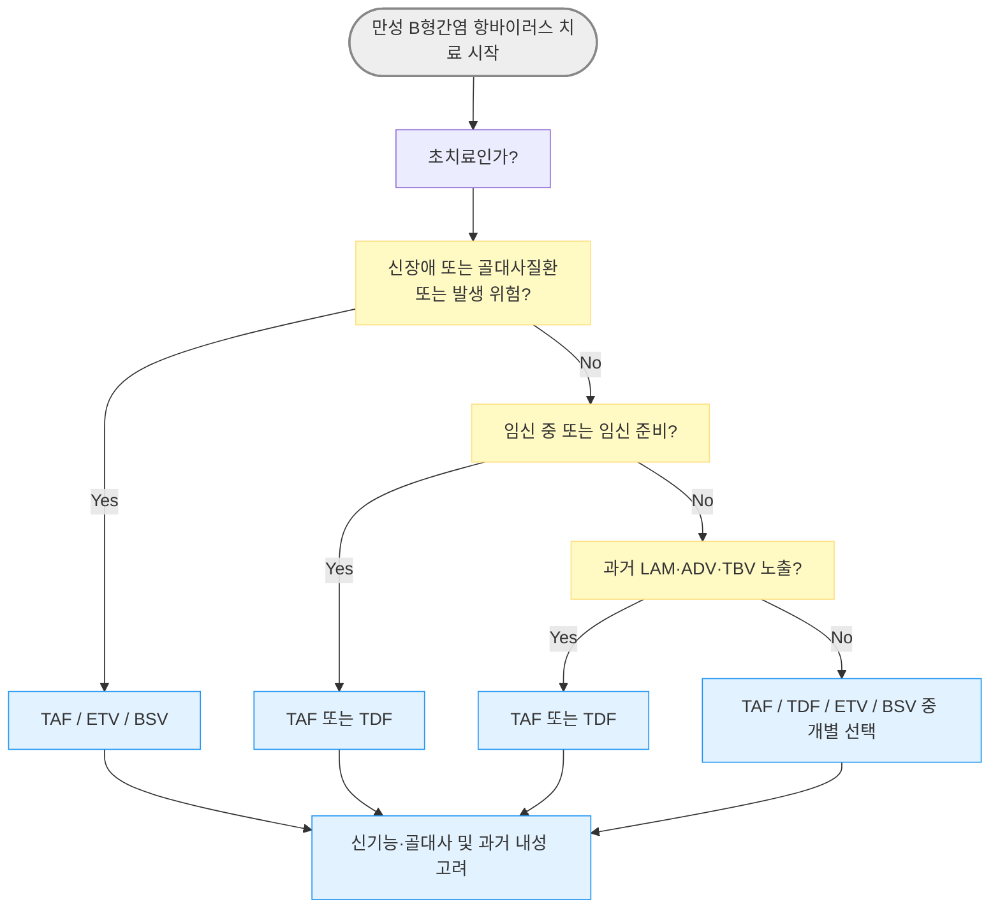
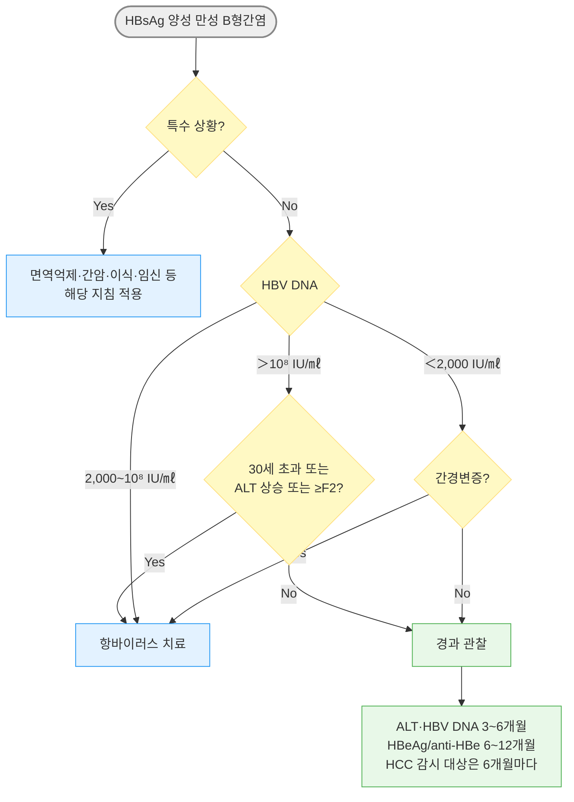
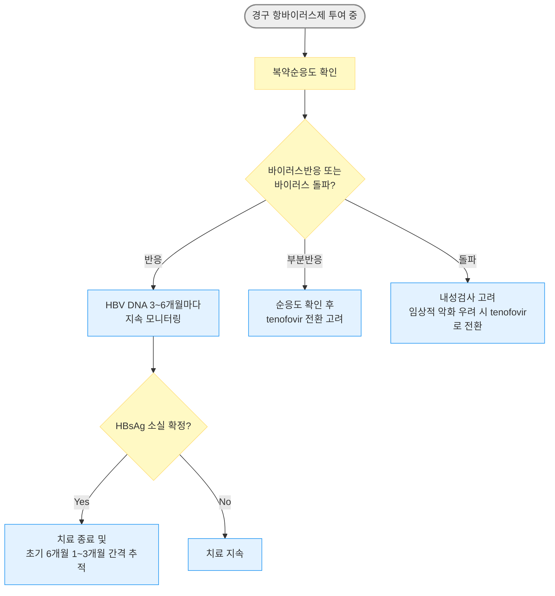

# B형간염 Hepatitis B Viral Infection

## <mark style="color:green;">일반 사항</mark>

* B형간염 바이러스(Hepatitis B virus, HBV) 감염에 의한 급/만성 간질환
* 잠복기 : 45\~160일(평균 120일)
* 전염 경로 : HBsAg 양성인 사람의 혈액, 분비물(타액·정액·질 분비물 등); 환경 표면에서 최소 7일간 감염력 유지 가능
* 만성 간염 : 급성 감염 후 HBsAg이 ≥6개월 존재하는 상태

**경과**

* 급성 B형간염의 증상은 노출 후 대개 3\~7주에 나타나며, 성인 감염의 95% 이상은 자연 회복하고 소수에서 만성화
* 감염 연령이 낮을수록 만성화 위험이 크게 증가하며, HBeAg(+) 산모에서 출생한 신생아는 약 90%에서 만성 감염으로 진행할 수 있음
* 만성 B형간염의 간경변증·간세포암종 진행 위험은 HBV DNA, ALT, 연령, 성별, 간섬유화, 가족력, 음주·대사질환 등 여러 요인의 영향을 받으므로 단일 연간 발생률로 일반화하지 않음
* 악화 경과 위험 인자 : 가족력, 알코올 섭취, 흡연, 남성, ≥40세, aflatoxin, HBV DNA ≥2,000 IU/㎖, HBeAg(+), basal core promoter 바이러스 유전자 변이

**우리나라 특징**

* 국내 만성 B형간염 환자는 대부분 유전자형 C형이며, 유전자형 B형보다 HBeAg 혈청전환이 늦고 간경변증·간세포암종 진행 위험이 높음. 유전자형 C형에서는 Peg-IFN-α의 치료반응도 상대적으로 낮음

### <mark style="color:orange;">용어 정의</mark>

* **virologic response** : \[경구제] HBV DNA가 RT-PCR에서 미검출인 경우; \[Peg-IFN-α] 투여 6개월 이후 또는 치료 종료 시에 혈청 HBV DNA ＜2,000 IU/㎖으로 감소하는 경우
* **serologic response** : Ag 소실 또는 seroconversion
* **HBV reactivation** : ⓵ 면역억제 치료를 받는 anti-HBc(+) 환자에서 HBV immune control의 상실; ⓶ baseline 대비 HBV DNA 상승; ⓷ anti-HBc(+)/HBsAg(-) 환자에서 HBsAg(+)로의 전환(reverse seroconversion)
* **hepatitis flare** : ALT가 baseline의 ＞3배 및 ＞100 U/L으로 증가
* **HBV-associated hepatitis** : HBV reactivation + hepatitis flare
* **HBeAg seroconversion** : HBeAg(+)/HBeAb(-) → HBeAg(-)/HBeAb(+)로의 전환
* **HBeAg clearance** : HBeAg(+) → HBeAg(-)로의 전환
* **HBeAg seroreversion** : HBeAg(-) → HBeAg(+)로의 전환
* **resolved HBV infection** : 과거 HBV 감염 후 HBsAg 소실 및 HBV DNA 미검출 상태; 활동성 바이러스 감염의 임상적·조직학적 증거 없음 (= resolved CHB)
* **virological breakthrough** : 항바이러스 치료 중 가장 낮게 측정된 혈청 HBV DNA보다 ≥1 log₁₀ IU/㎖ 증가하거나, 미검출 상태에서 다시 검출되는 경우
* **functional cure** : HBsAg 소실(± anti-HBs 혈청전환)과 혈청 HBV DNA 미검출을 기반으로 하는 현재 치료의 장기 목표; cccDNA와 integrated HBV DNA가 잔존할 수 있어 완전 박멸(sterilizing cure)과는 구별
* **isolated anti-HBc positivity** : HBsAg(-), anti-HBs(-), anti-HBc(+) 상태; 잠재 감염(occult HBV), 과거 감염 후 HBsAb 소실, 또는 위양성일 수 있음; 면역억제 시 재활성화(reverse seroconversion) 위험 존재

## <mark style="color:green;">임상 양상</mark>

* 다양 : 무증상 \~ 급성 간부전/사망; 잠행성 \~ 급성 악화

### <mark style="color:orange;">급성</mark>

* 발열, 피로, malaise, 관절통, 근육통, 식욕 저하, 구역, 구토
* 황달, 거무스름한 소변, 흰색 대변
* 우상복부 통증 및 압통, 간 비대

### <mark style="color:orange;">만성</mark>

* 종종 무증상 또는 피로

### <mark style="color:orange;">만성 B형간염 자연 경과 (바이러스 역가 기반 분류)</mark>

<table><thead><tr><th width="150">분류</th><th width="180">HBeAg</th><th width="170">HBV DNA (IU/㎖)</th><th width="120">ALT</th><th>간 손상</th></tr></thead><tbody><tr><td>고바이러스혈증<br><em>High viremic phase</em></td><td>+</td><td>＞10⁸</td><td>정상 또는 상승</td><td>대체로 경미하나 연령 증가·ALT 상승·유의한 섬유화가 동반되면 진행 위험 증가</td></tr><tr><td>중등도바이러스혈증<br><em>Moderate viremic phase</em></td><td>+ 또는 −</td><td>2,000\~10⁸</td><td>정상 또는 상승</td><td>간 염증·섬유화 및 간암 위험이 높음</td></tr><tr><td>저바이러스혈증<br><em>Low viremic phase</em></td><td>−</td><td>＜2,000</td><td>대개 정상</td><td>대체로 경미; 간경변증 여부 및 다른 간질환 원인 평가 필요</td></tr><tr><td>HBsAg 소실기<br><em>HBsAg seroclearance</em></td><td>−</td><td>미검출</td><td>대개 정상</td><td>없거나 최소; 기존 간경변증이 있으면 HCC 감시는 지속</td></tr></tbody></table>

<p align="center"><em><mark style="color:$info;">Ref. 대한간학회. 2026 만성 B형간염 진료 가이드라인. Figure 1.</mark></em></p>


**2026 대한간학회 분류**  
기존의 면역관용기·면역활동기·면역비활동기 중심 분류 대신 혈청 HBV DNA를 중심으로 자연경과를 단순화하였다. 고바이러스혈증은 HBV DNA ＞10⁸ IU/㎖, 중등도바이러스혈증은 2,000\~10⁸ IU/㎖, 저바이러스혈증은 ＜2,000 IU/㎖로 정의한다. 중등도바이러스혈증은 HBeAg 양성 또는 음성 모두 포함한다. 면역학적 단계와 바이러스 역가 기반 분류가 완전히 일치하지 않을 수 있으며, 장기간의 경과 중 분류가 변할 수 있다.


<figure><figcaption><p><strong>만성 B형간염의 자연 경과</strong><br>Ref. 대한간학회. 2026 만성 B형간염 진료 가이드라인. Figure 1을 반영하여 업데이트 필요.</p></figcaption></figure>

### <mark style="color:$danger;">🚩 Red Flags!</mark>

<mark style="color:$danger;">**즉각 이송 또는 응급 평가**</mark>

* 의식 변화, 지남력 장애, 수면각성 역전 → 간성뇌증
* 자세 고정 불능(asterixis), 심한 행동 변화
* 대량 토혈 또는 흑색변 → 식도정맥류 출혈
* 심한 PT 연장 + 황달 + 의식 변화 → 급성 간부전
* 간경변증 환자에서 갑작스러운 고열 + 복통 + 복수 악화 → 자발성 세균성 복막염(SBP), 간농양

<mark style="color:$warning;">**당일 또는 조기 의뢰**</mark>

* 복수의 급격한 증가 또는 신규 발생
* 황달의 현저한 악화, 진한 갈색 소변·회백색 변
* ALT ≥5\~10 × ULN 이상 급격 상승 또는 PT 연장 (간부전 전구 징후)
* 심한 구역·구토로 경구 섭취 불가 → 탈수·저혈당 위험

<mark style="color:$info;">**외래 추적 / 추가 평가 계획**</mark> <mark style="color:$info;">- 즉각 위험 낮으나 호전 없으면 의뢰</mark>

* 치료 중 HBV DNA 재상승
* 피로 지속 또는 현저한 체중 감소
* 알 수 없는 하지 부종 또는 경미한 황달 출현

## <mark style="color:green;">진단</mark>

* 병력 청취 : 다른 바이러스에 의한 중복 감염(HCV, HDV, HAV), 음주력, 약물 복용력; 간질환·간세포암종 가족력

### <mark style="color:orange;">기본 검사</mark>

* CBC, AST/ALT, ALP, GGT, Bilirubin, Albumin, Cr, PT/INR, AFP
* HBsAg, total anti-HBc, HBeAg/anti-HBe, HBV DNA 정량(RT-PCR), anti-HCV, IgG anti-HAV; HDV·HIV 중복감염 평가를 고려
* 예방접종·면역상태 평가가 필요한 경우 anti-HBs를 함께 검사
* 유전자형 검사 : 국내에서는 대부분 C형이므로 일반적인 치료 결정 목적으로는 권고하지 않음
* 간섬유화 평가 : 비침습적 간섬유화 검사를 시행하고, 필요 시 간 생검 또는 간경직도 검사를 추가 (☞ 간섬유화 비침습적 검사)
* 간세포암종 감시 : **40세 이상 또는 연령과 관계없이 간경변증 등 고위험군**에서 간 초음파와 AFP를 6개월마다 시행
* 정량 HBsAg (qHBsAg) : 질병 활성도·예후 평가, 치료 반응 예측 및 치료 종료 시점 판단에 활용 가능; 치료 중에는 1년 간격 검사를 고려


**FIB-4 index** = \[나이(세) × AST(U/L)] ÷ \[혈소판(×10⁹/L) × √ALT(U/L)]\
FIB-4는 간섬유화 평가에 사용할 수 있는 보조적 지표이지만, 만성 B형간염에서 단일 절단값만으로 유의한 섬유화를 확정하거나 치료 여부를 결정해서는 안 된다. 특히 고령에서는 나이의 영향으로 값이 높아질 수 있으므로 간경직도 등 다른 비침습적 검사와 종합하여 해석한다.



**ALT ULN 성별 기준** : ALT가 검사실 정상 범위 내에 있더라도 간섬유화나 염증이 존재할 수 있다.\
**대한간학회 2026 권고** : 한국인에서 간질환 관련 사망률이 증가하기 시작하는 기준치를 근거로 **남성 34 IU/L, 여성 30 IU/L**를 ALT 정상 상한치로 권고한다 (대한간학회 2026, p.33).\
AASLD는 남성 ＞35 U/L, 여성 ＞25 U/L을 제시하며, 실제 검사실 ULN과 차이가 있을 수 있으므로 임상적 맥락과 반복 측정을 함께 고려한다. **"정상 ALT"라도 고위험군에서는 섬유화 평가**를 고려한다.


### <mark style="color:orange;">Serologic Marker 해석</mark>

<table data-header-hidden><thead><tr><th width="80"></th><th width="80"></th><th width="80"></th><th width="80"></th><th width="80"></th><th></th></tr></thead><tbody><tr><td><strong>HBsAg</strong></td><td><strong>anti-HBs</strong></td><td><strong>anti-HBc</strong></td><td><strong>HBeAg</strong></td><td><strong>anti-HBe</strong></td><td><strong>해석</strong></td></tr><tr><td>+</td><td>-</td><td>IgM</td><td>+</td><td>-</td><td>급성 B형간염, high infectivity¹⁾</td></tr><tr><td>+</td><td>-</td><td>IgG</td><td>+</td><td>-</td><td>만성 B형간염, high infectivity</td></tr><tr><td>+</td><td>-</td><td>IgG</td><td>-</td><td>+</td><td>지연 급성 또는 만성 B형간염, low infectivity; HBeAg(-)(precore-mutant) B형간염</td></tr><tr><td>+</td><td>+</td><td>IgG</td><td>±</td><td>±</td><td>드문 경우로 재검 및 HBV DNA를 고려; HBsAg과 anti-HBs가 동시에 검출될 수 있음</td></tr><tr><td>-</td><td>-</td><td>IgM</td><td>±</td><td>±</td><td>급성 B형간염¹⁾; anti-HBc window period</td></tr><tr><td>-</td><td>-</td><td>IgG</td><td>-</td><td>-</td><td>Isolated anti-HBc²⁾: occult HBV infection 가능; 과거 감염 후 HBsAb 소실; 위양성 가능</td></tr><tr><td>-</td><td>+</td><td>IgG</td><td>-</td><td>-</td><td>B형간염으로부터의 회복 (resolved infection)</td></tr><tr><td>-</td><td>+</td><td>-</td><td>-</td><td>-</td><td>백신 접종 후 상태</td></tr></tbody></table>

¹⁾ IgM anti-HBc는 만성 B형간염의 급성 재활성기에도 출현할 수 있음\
²⁾ Isolated anti-HBc(HBsAg(-)/anti-HBs(-)/anti-HBc(+)): window period·resolved infection·occult HBV·위양성을 감별; 면역억제 치료 시 HBV 재활성화 위험 - 고위험 약제 투여 전 HBV DNA 확인 필요; 수혈·장기 기증 시에는 occult HBV 전파 가능성으로 인해 혈액원/이식 센터에 반드시 고지해야 하며, 기증 가능 여부는 기관 프로토콜에 따름

<p align="center"><em><mark style="color:$info;">Ref. Harrison's Principles of Internal Medicine, 21st ed., fig 332-5.</mark></em></p>

### <mark style="color:orange;">선별 검사</mark>

* **기본 선별검사 : HBsAg + total anti-HBc**
* 예방접종 및 면역상태까지 평가할 필요가 있으면 HBsAg + anti-HBs + total anti-HBc의 3종 검사를 시행
* HBsAg 양성이면 HBV DNA, HBeAg/anti-HBe 등으로 질환 상태를 평가

#### <mark style="color:$primary;">선별 검사 대상 (고위험군)</mark>

* HBV 고유병 지역 출생자 또는 장기 체류자\*
* 마약 주사 사용자\*, 남성 동성애자\*, STD 평가·치료 대상자\*, 복수의 성 파트너\*
* 면역억제제 치료자, 혈액/장기/정액 기증자
* 원인 미상의 ALT 또는 AST 상승\*
* 말기 신질환자/투석 환자\*, 만성 간질환자(HCV 등)\*, HIV 감염자
* 백신 미접종 19\~59세 당뇨병 환자; ≥60세 당뇨병 환자 중 임상적으로 선별\*
* 모든 임신 여성
* HBsAg(+) 산모에서 출생한 영아\*
* HBsAg(+) 환자와 동거, 바늘 공동 사용, 성 접촉자\*
* 발달 장애인 시설 거주자·관리자\*, 교정 시설 재소자\*
* 혈액·오염 체액에 노출될 가능성이 있는 직업 종사자\*

　_\* seronegative인 경우 백신 접종 대상_

***

## <mark style="background-color:$warning;">Management</mark>


**최신 지침 반영** : 본 장은 2026년 6월 발표된 대한간학회 만성 B형간염 진료 가이드라인을 기준으로 치료 대상, 약제 선택, 치료 종료 및 면역억제 관련 내용을 개정하였다. 실제 처방 시에는 최신 식약처 허가사항과 건강보험 급여기준을 별도로 확인한다.


## <mark style="color:green;">급성 B형간염</mark>

* 대증 치료; 충분한 수분 섭취와 적절한 영양을 유지하고 routine 침상 안정은 권장하지 않음
* 심한 구역·구토 또는 경구 섭취가 어려운 경우 탈수·전해질 이상을 교정
* 일반적인 급성 B형간염에는 항바이러스제를 투여하지 않음
* **중증 급성 B형간염**(혈액응고장애, 심한 황달 또는 간부전의 경과)에서는 즉시 경구 항바이러스제 치료를 시작하고, 임상 경과에 따라 간이식 가능 기관으로 의뢰


**스테로이드(부신피질호르몬)** : 일반적인 급성 B형간염에서 스테로이드 치료는 권장되지 않음. 바이러스 복제를 촉진하고 면역 조절 기전을 억제하여 만성화 또는 전격성 간염 위험을 증가시킬 수 있음


## <mark style="color:green;">만성 B형간염</mark>

* 치료 목표 : HBV DNA level의 장기 억제 → 간경변증/간세포암종 등 합병증 방지

### <mark style="color:orange;">치료 방침</mark>

<table><thead><tr><th width="170">대상</th><th>권고 치료</th></tr></thead><tbody><tr><td>고바이러스혈증<br>HBV DNA ＞10⁸ IU/㎖</td><td>30세 초과, ALT 상승 또는 의미 있는 간섬유화가 있으면 항바이러스 치료 고려; 이러한 위험인자가 없으면 경과 관찰</td></tr><tr><td>중등도바이러스혈증<br>HBV DNA 2,000\~10⁸ IU/㎖</td><td>ALT 및 기타 위험인자와 관계없이 항바이러스 치료 시작</td></tr><tr><td>저바이러스혈증<br>HBV DNA ＜2,000 IU/㎖</td><td>간경변증이 없으면 원칙적으로 치료 없이 경과 관찰; ALT 상승 시 다른 간질환 원인 감별</td></tr><tr><td>대상성 간경변증</td><td>혈청 HBV DNA가 검출되면 바이러스혈증 정도와 관계없이 항바이러스 치료</td></tr><tr><td>비대상성 간경변증</td><td>혈청 HBV DNA가 검출되면 즉시 경구 항바이러스제 치료 및 간이식 평가</td></tr></tbody></table>

### <mark style="color:orange;">항바이러스제 치료 대상 (대한간학회 2026)</mark>

* **고바이러스혈증(HBV DNA ＞10⁸ IU/㎖)** : 30세 초과, ALT 상승 또는 의미 있는 간섬유화(≥F2)가 있으면 항바이러스 치료를 고려한다. 위험인자가 없는 경우에는 경과 관찰한다.
* **중등도바이러스혈증(HBV DNA 2,000\~10⁸ IU/㎖)** : ALT나 다른 위험인자와 관계없이 항바이러스 치료를 시작한다(B1). 기존의 “ALT ≥2×ULN” 조건을 치료 시작의 필수 조건으로 적용하지 않는다.
* **저바이러스혈증(HBV DNA ＜2,000 IU/㎖)** : 간경변증이 없는 경우 항바이러스제 없이 경과 관찰하며, ALT 상승 시 다른 원인의 간질환을 감별한다.
* **대상성 간경변증** : 혈청 HBV DNA가 검출되면 바이러스혈증 정도와 관계없이 치료한다.
* **비대상성 간경변증** : 혈청 HBV DNA가 검출되면 즉시 경구 항바이러스제를 시작하고 간부전 진행 시 간이식을 고려한다.


**중요한 변경점** : 2026 대한간학회는 기존 면역관용기·면역활동기 중심의 치료 기준을 전면 개정하여, 특히 HBV DNA 2,000\~10⁸ IU/㎖의 **중등도바이러스혈증을 ALT와 무관하게 치료 대상**으로 확대하였다. 또한 현재 권고되는 표준 1차 치료는 유전자 장벽이 높은 경구용 항바이러스제이다. 다만 이 확대된 치료 기준은 현재 건강보험 급여 기준보다 넓을 수 있으므로 실제 처방에서는 최신 급여기준을 별도로 확인한다.


### <mark style="color:orange;">항바이러스제</mark>

#### <mark style="color:$primary;">주사제</mark>

* Peg-IFN-α는 정해진 치료기간 후 지속반응을 기대할 수 있으나 부작용이 많고 국내에서는 현재 시판되지 않아 일반적인 만성 B형간염의 1차 치료제로 권고하기 어렵다.
* 비대상성 간경변증에서는 간부전 위험 때문에 사용하지 않는다.
* 국내에서는 특히 유전자형 C형이 대부분이어서 Peg-IFN-α의 치료반응도 상대적으로 낮다.

#### <mark style="color:$primary;">경구제</mark>

**High genetic barrier (1차 치료제)**

* Tenofovir AF (TAF), Tenofovir DF (TDF), Entecavir (ETV), Besifovir (BSV)는 높은 유전자 장벽을 가지며 2026 대한간학회에서 만성 B형간염 초치료 약제로 권고한다.

<table><thead><tr><th width="120">성분명</th><th width="130">용량</th><th width="170">주요 특징</th><th>복용·모니터링</th></tr></thead><tbody><tr><td>Tenofovir AF (TAF)<br><mark style="color:blue;">[베믈리디]</mark></td><td>25 ㎎ qd</td><td>신장·골 안전성이 TDF보다 우수</td><td>식사와 관계없이 복용 가능; 정기적 신기능 모니터링</td></tr><tr><td>Tenofovir DF (TDF)<br><mark style="color:blue;">[비리어드]</mark></td><td>300 ㎎ qd</td><td>강력한 바이러스 억제; 임신 관련 자료 풍부</td><td>식사와 관계없이 복용 가능; 신기능·혈중 P·골밀도 모니터링</td></tr><tr><td>Entecavir (ETV)<br><mark style="color:blue;">[바라크루드]</mark></td><td>0.5 ㎎ qd¹⁾</td><td>신장·골 안전성 우수</td><td>공복 복용; 신기능에 따라 용량 조절</td></tr><tr><td>Besifovir (BSV)<br><mark style="color:blue;">[베시포]</mark></td><td>150 ㎎ qd</td><td>신장·골 안전성 유리</td><td>L-carnitine 550 ㎎ qd 병용; 식사와 관계없이 복용 가능</td></tr></tbody></table>

_¹⁾ Lamivudine 치료 경험이 있거나 일부 비대상성 간경변증에서는 1 ㎎ qd가 적용될 수 있으므로 허가사항에 따라 조절_

**약제 선택의 원칙**

* 신장애 또는 골대사질환이 있거나 발생 위험이 높은 경우 : **TAF, ETV 또는 BSV 우선**
* 과거 lamivudine·adefovir·telbivudine 노출이 있는 경우 : **TAF 또는 TDF 권고**; ETV 단독 사용은 피함
* 임신 중 또는 임신 준비 중 : **TAF 또는 TDF 권고**
* TDF 치료 중 eGFR 감소, 저인산혈증 또는 골다공증이 발생하면 TAF, ETV 또는 BSV로 변경 고려
* 모든 초치료에서 HIV 중복감염 여부를 확인하고, HIV/HBV 동시감염이면 HIV에 효과적인 완전한 항레트로바이러스 치료가 필요함

**Low genetic barrier (현재 1차 치료로 권고하지 않음)**

* Lamivudine (LAM), Telbivudine (TBV), Clevudine, Adefovir (ADV)는 내성 위험 때문에 만성 B형간염의 1차 치료제로 권고하지 않는다.
* 이미 이 약제를 사용 중인 환자에서는 내성 여부와 복약순응도를 평가하고, 필요한 경우 TDF 또는 TAF 등 높은 유전자 장벽 약제로 전환한다.

**경구 항바이러스제 비교**

<table data-header-hidden><thead><tr><th></th><th width="149"></th><th></th><th></th><th></th></tr></thead><tbody><tr><td>항목</td><td>TAF<br><mark style="color:blue;">[베믈리디]</mark></td><td>TDF<br><mark style="color:blue;">[비리어드]</mark></td><td>ETV<br><mark style="color:blue;">[바라크루드]</mark></td><td>BSV<br><mark style="color:blue;">[베시포]</mark></td></tr><tr><td>내성 장벽</td><td>높음</td><td>높음</td><td>높음</td><td>높음</td></tr><tr><td>신장·골 안전성</td><td>우수</td><td>상대적으로 불리</td><td>우수</td><td>우수</td></tr><tr><td>복용 방법</td><td>식사와 관계없이</td><td>식사와 관계없이</td><td>공복</td><td>식사와 관계없이</td></tr><tr><td>특이 주의</td><td>장기 치료에서 대사 위험 평가</td><td>신장·골 모니터링</td><td>과거 NA 노출 시 내성 고려</td><td>L-carnitine 550 ㎎ 병용</td></tr><tr><td>대표 적합 대상</td><td>CKD·골질환 위험</td><td>임신·신장/골 위험 낮은 환자</td><td>신장·골 안전성이 중요한 환자</td><td>신장·골 위험이 있는 환자</td></tr></tbody></table>


**Emerging therapies** : siRNA(HBV RNA 간섭), capsid assembly modulator(CAM), 치료 백신 등 functional cure를 목표로 한 새로운 치료제들이 임상시험 단계에 있다. 기존 뉴클레오타이드 유사체와의 병용 전략이 활발히 연구 중이다.


**경구 항바이러스제 선택**


```mermaid
flowchart TD
    A([만성 B형간염 항바이러스 치료 시작]) --> B[초치료인가?]
    B --> C[신장애 또는 골대사질환<br/>또는 발생 위험?]
    C -- Yes --> D[TAF / ETV / BSV]
    C -- No --> E[임신 중 또는 임신 준비?]
    E -- Yes --> F[TAF 또는 TDF]
    E -- No --> G[과거 LAM·ADV·TBV 노출?]
    G -- Yes --> H[TAF 또는 TDF]
    G -- No --> I[TAF / TDF / ETV / BSV 중 개별 선택]
    H --> J[신기능·골대사 및 과거 내성 고려]
    D --> J
    F --> J
    I --> J

style A fill:#eeeeee,stroke:#888888,stroke-width:2px
classDef yellow fill:#fff9c4,stroke:#ffe082
class C,E,G yellow
classDef sky fill:#e3f2ff,stroke:#2196f3
class D,F,H,I,J sky
```

***


```mermaid
flowchart TD
A([HBsAg 양성 만성 B형간염]) --> B{특수 상황?}
B -- Yes --> S[면역억제·간암·이식·임신 등<br/>해당 지침 적용]
B -- No --> C{HBV DNA}
C -- "＞10⁸ IU/㎖" --> D{30세 초과 또는<br/>ALT 상승 또는 ≥F2?}
D -- Yes --> T[항바이러스 치료]
D -- No --> M[경과 관찰]
C -- "2,000~10⁸ IU/㎖" --> T
C -- "＜2,000 IU/㎖" --> E{간경변증?}
E -- Yes --> T
E -- No --> M
M --> N[ALT·HBV DNA 3~6개월<br/>HBeAg/anti-HBe 6~12개월<br/>HCC 감시 대상은 6개월마다]

style A fill:#eeeeee,stroke:#888888,stroke-width:2px
classDef yellow fill:#fff9c4,stroke:#ffe082
class B,C,D,E yellow
classDef sky fill:#e3f2ff,stroke:#2196f3
class T,S sky
classDef green fill:#e8f8e8,stroke:#4caf50
class M,N green
```

<p align="center"><strong>만성 B형간염 치료 결정 알고리듬</strong></p>

<p align="center"><em><mark style="color:$info;">Ref. 대한간학회. 2026 만성 B형간염 진료 가이드라인. Figure 2를 반영.</mark></em></p>

### <mark style="color:orange;">간장질환용제 (보조 치료)</mark>

* 간장질환용제는 **HBV 증식을 억제하거나 간경변증·간세포암종을 예방하는 치료가 아니며**, 항바이러스제 치료를 대체하거나 지연시켜서는 안 됨
* Silymarin, UDCA, BDD 등은 각 성분의 국내 허가 적응증이 있는 경우에 한하여 동반 질환 또는 증상에 따라 보조적으로 사용할 수 있으나, 만성 B형간염의 routine 치료제로 권고할 근거는 부족함
* ALT가 일시적으로 정상화되더라도 항바이러스제 치료 적응증 판단은 별도로 이루어져야 함

### <mark style="color:orange;">대사질환 동반 환자 평가</mark>

* 만성 B형간염에서 비만, 당뇨, 이상지질혈증, 고혈압 및 MASLD 등의 대사질환은 간질환 진행과 간세포암종 위험에 영향을 줄 수 있으므로 함께 평가하고 적극적으로 관리
* 대사질환이 있다고 해서 그 자체만으로 HBV 항바이러스 치료 적응증이 되는 것은 아니며, **HBV DNA, ALT, 연령, 간섬유화 및 간경변증 여부**에 따라 치료 여부를 결정
* TAF는 장기 치료에서 체중·지질 변화가 보고되어 있으므로 대사 위험이 높은 환자에서는 체중·지질을 주기적으로 평가하되, 현재 근거만으로 심혈관 사건 위험이 증가한다고 단정하지 않음

### <mark style="color:orange;">모니터링</mark>

#### <mark style="color:$primary;">치료 비대상자 모니터링</mark>

* ALT 및 HBV DNA를 **3\~6개월마다**, HBeAg/anti-HBe를 **6\~12개월마다** 모니터링
* 정량 또는 정성 HBsAg은 임상 목적에 따라 **12개월마다** 고려
* 치료 대상 여부가 불분명한 경우 ALT·HBV DNA를 1\~3개월마다 추적하거나 간섬유화 평가를 시행
* 간세포암종 감시 : **40세 이상 또는 연령과 관계없이 간경변증 등 고위험군**에서 간 초음파 + AFP를 6개월마다 시행


**간경변증 환자의 HCC 감시** : 항바이러스 치료로 HBV DNA가 미검출되어도 간경변증이 있으면 간암 감시를 중단하지 않는다.


#### <mark style="color:$primary;">항바이러스제 치료 중 모니터링</mark>

* 간기능검사 및 HBV DNA를 **1\~6개월마다** 검사
* 바이러스반응 확인 후에도 HBV DNA를 **3\~6개월마다** 측정
* 정량 HBsAg은 치료 반응 예측과 종료 시점 판단을 위해 **1년 간격**으로 시행할 수 있음
* 비침습적 간섬유화검사는 필요에 따라 12\~24개월 간격으로 시행할 수 있음
* TDF : 신기능, 혈중 인, 골밀도를 정기적으로 모니터링
* TAF/ETV/BSV : 정기적인 신기능 평가; 각 약제의 허가사항에 따라 추가 모니터링

#### <mark style="color:$primary;">치료 종료 및 종료 후 모니터링</mark>

* **항바이러스 치료 종료는 HBsAg 소실이 확정된 경우 권장한다(A1).**
* HBsAg 소실은 최소 6개월 간격으로 2회 이상 유지되는 것을 확인한 후 종료하는 것이 바람직
* 간경변증 환자에서는 장기간 치료를 고려하고, **비대상성 간경변증에서는 경구 항바이러스제를 중단하지 않는다**
* 치료 종료 후 초기 6개월은 간기능검사와 HBV DNA를 **1\~3개월마다** 시행
* 이후 바이러스반응이 유지되면 추적 간격을 점진적으로 연장
* 치료 종료 후 HBV DNA가 **≥2,000 IU/㎖**로 상승하면 재치료를 고려

#### <mark style="color:$primary;">치료 반응에 따른 대처</mark>

* 바이러스 돌파 또는 부분 바이러스반응이 확인되면 먼저 **복약순응도**를 확인
* 바이러스 돌파가 확인되고 순응도가 양호하면서 임상적 악화가 우려되면 내성검사 결과를 기다리지 않고 **tenofovir 단독 치료로 변경**을 고려할 수 있음
* **내성이 확인된 경우 tenofovir 단독 치료로 전환(A1)**
* **부분 바이러스반응이 확인된 경우 tenofovir 단독 치료로 전환(A1)**. 다만 높은 유전자 장벽 약제를 사용 중이고 복약순응도가 양호하며 바이러스 돌파가 없으면 기존 약제를 유지할 수 있음(B1)
* Peg-IFN-α는 국내 시판되지 않아 일반적인 만성 B형간염의 치료 반응에 따른 실제 처방 알고리듬에서는 제외

***


```mermaid
flowchart TD
    A([경구 항바이러스제 투여 중]) --> B[복약순응도 확인]
    B --> C{바이러스반응 또는<br/>바이러스 돌파?}
    C -- 반응 --> D[HBV DNA 3~6개월마다<br/>지속 모니터링]
    C -- 부분반응 --> E[순응도 확인 후<br/>tenofovir 전환 고려]
    C -- 돌파 --> F[내성검사 고려<br/>임상적 악화 우려 시 tenofovir로 전환]
    D --> G{HBsAg 소실 확정?}
    G -- Yes --> H[치료 종료 및<br/>초기 6개월 1~3개월 간격 추적]
    G -- No --> I[치료 지속]

style A fill:#eeeeee,stroke:#888888,stroke-width:2px
classDef yellow fill:#fff9c4,stroke:#ffe082
class B,C,G yellow
classDef sky fill:#e3f2ff,stroke:#2196f3
class D,E,F,H,I sky
```

<p align="center"><strong>경구 항바이러스제 투여 중 관리</strong></p>

_\*효능 - HBV DNA, LFT, HBeAg/Ab, 정량 HBsAg; 안전성 - Cr, Ca, P, CK, U/A, 골밀도; 간세포암종 감시_

***

## <mark style="color:green;">특수한 상황에서의 치료</mark>

### <mark style="color:orange;">약제 내성</mark>

* 바이러스 돌파 시 약물 순응도 확인 및 유전자형 내성 검사 시행
* 유전자형 내성 확인 시 가능한 빨리 내성 치료 시작

<table><thead><tr><th width="220">상황</th><th>2026 대한간학회 권고</th></tr></thead><tbody><tr><td>내성 확인</td><td>Tenofovir 단독 치료로 전환 (A1)</td></tr><tr><td>부분 바이러스반응</td><td>Tenofovir 단독 치료로 전환 (A1); 단, 고유전자장벽 약제 사용 중이고 순응도 양호하며 바이러스 돌파가 없으면 기존 약제 유지 가능 (B1)</td></tr><tr><td>과거 LAM·ADV·TBV 노출</td><td>TAF 또는 TDF 권고; ETV 단독 치료는 피함</td></tr></tbody></table>

### <mark style="color:orange;">신기능 감소 / 골대사 질환</mark>

* 신기능 이상 또는 골대사질환이 있거나 발생 위험이 높은 경우 : **TAF, ETV 또는 BSV 우선**
* TDF 치료 중 eGFR 감소, 저인산혈증 또는 골다공증이 발생하면 TAF, ETV 또는 BSV로 변경 고려
* TAF는 eGFR <15 mL/min/1.73m²이며 혈액투석을 받지 않는 환자에서는 사용을 권고하지 않음
* BSV는 CrCl <15 mL/min/1.73m²에서 임상자료가 부족하여 권고하지 않음
* ETV, TDF, BSV는 신기능에 따른 용량 조절이 필요

### <mark style="color:orange;">임신부</mark>

* 임신 중 또는 임신 준비 중인 만성 B형간염의 치료 약제 : **TAF 또는 TDF 1차 권고**
* HBV DNA ≥200,000 IU/㎖인 임신부 : 수직감염 예방을 위해 임신 28주 이전 시작이 이상적이며, **임신 24\~32주에 시작하여 출산 후 2\~12주까지** 투여
* 수직감염 예방 목적으로만 투여한 경우 출산 후 중단할 수 있으나, 중단 후 간기능과 HBV DNA를 면밀히 추적
* 항바이러스 치료를 받고 있지 않은 만성 B형간염 임산부의 모유수유 자체를 제한할 필요는 없음
* 실제 처방 시 최신 건강보험 급여기준을 별도로 확인

### <mark style="color:orange;">D형간염(HDV) 중복감염</mark>

#### <mark style="color:$primary;">병태생리 및 역학</mark>

* HDV는 HBsAg을 피막으로 이용하는 결함성(defective) RNA 바이러스; HBsAg(+) 환자에서만 감염 성립
* 감염 양상
  * 동시감염(coinfection) : 급성 HBV + 급성 HDV 동시 감염; 간부전 위험 높으나 대부분 자연 회복
  * 중복감염(superinfection) : 만성 HBV 보유자에게 HDV 추가 감염; 만성 D형간염으로 진행 위험 매우 높음, 예후 불량
* HBsAg(+) 환자에서 HDV 중복감염을 고려해야 하며, 특히 HBV DNA가 낮은데 ALT가 상승하거나 고위험 노출이 있는 경우 anti-HDV 또는 HDV RNA 검사를 고려
* 임상적으로 가장 중증의 바이러스 간염 형태; 간경변증·간세포암종 진행 위험이 HBV 단독 감염보다 현저히 높음

#### <mark style="color:$primary;">진단</mark>

* 1단계 : anti-HDV 검사 - HBsAg(+) 환자에서 위험인자 또는 설명되지 않는 ALT 상승이 있을 때 선별
* 2단계 : anti-HDV 양성 시 HDV RNA 정량(RT-PCR) - 활성 감염 확인 및 치료 반응 평가
* KCD 코드: B18.0 (델타-병원체 동반 만성 바이러스B형간염)

#### <mark style="color:$primary;">치료</mark>

<table><thead><tr><th width="153.75">약제</th><th>비고</th></tr></thead><tbody><tr><td>Peg-IFN-α</td><td>대상성 간질환에서 제한적으로 고려할 수 있으나 치료반응이 제한적이며 비대상성 간경변증에는 금기. 국내에서는 현재 시판되지 않아 실제 접근성이 낮음</td></tr><tr><td>Bulevirtide<br><mark style="color:blue;">[헵클루덱스]</mark></td><td>NTCP 진입억제제. 유럽 및 미국에서 성인 만성 HDV 감염 치료에 허가되어 있으며, 실제 투여 용량·적응증은 해당 국가의 최신 허가사항에 따름. 국내 허가·유통 여부는 식약처 최신 허가사항 확인 필요</td></tr></tbody></table>


**Bulevirtide** : 국내 허가·유통 여부는 최신 식약처 허가사항을 확인하고, 실제 사용 시 간질환 전문의의 치료 계획에 따라야 함. HBV 단독 항바이러스제(ETV/TDF/TAF)는 HDV 복제를 직접 억제하지 못하므로 HDV RNA 감소 목적으로는 권장되지 않음. 단, HBV DNA 억제를 위해 병용할 수 있음


#### <mark style="color:$primary;">예방</mark>

* HBV 예방접종은 새로운 HBV 감염을 예방하여 결과적으로 새로운 HDV 감염을 예방함
* **이미 HBsAg 양성인 사람에게 HBV 예방접종은 HDV를 예방하지 못함**
* HBsAg(+) 환자에서 HDV 자체를 예방하는 백신은 현재 없음

### <mark style="color:orange;">면역억제제 투여 환자의 HBV 재활성화 예방</mark>

* 면역억제 치료 또는 항암화학요법 전 **HBsAg + anti-HBc**를 선별검사로 시행하고, 둘 중 하나라도 양성이면 HBV DNA를 추가 검사
* HBsAg 양성이거나 HBV DNA가 검출되는 경우, 재활성화 고위험군 또는 중등도 위험군 약제에서는 치료 시작 전 또는 동시에 예방적 항바이러스제 투여
* HBsAg 음성·anti-HBc 양성·HBV DNA 미검출 환자는 고위험 면역억제(특히 B-cell depleting agents)에서 예방적 항바이러스제 투여; 중등도 위험군에서는 예방 또는 면밀한 모니터링을 고려
* 저위험군에서는 HBsAg 및 HBV DNA를 1\~3개월 간격으로 모니터링하고 재활성화가 확인되면 선제적 치료
* 예방적 항바이러스제는 **TAF, TDF 또는 ETV**를 우선 선택
* 예방적 항바이러스 치료는 면역억제·항암화학요법 종료 후 최소 6개월, rituximab 등 B-cell depleting agents 사용 시 최소 12개월 유지
* 예방적 치료 종료 후에도 최소 12개월간 HBV DNA를 정기적으로 추적
* anti-HBs 역가만으로 예방적 치료 여부를 완화해서는 안 되며, 특히 고위험 면역억제에서는 anti-HBs 양성 여부와 관계없이 위험도에 따라 예방치료를 결정
* 고위험 면역억제의 대표적 예 : rituximab 등 B-cell depleting agents, 조혈모세포이식, 일부 고강도 항암치료
* 중등도 위험의 대표적 예 : 일부 TNF 억제제·JAK 억제제·IL-6 억제제 및 중등도 이상 전신 스테로이드; 약제와 환자 상태에 따라 위험도가 달라지므로 개별 평가

***

```mermaid
flowchart TD
    Start([면역억제제 / 항암치료 예정]) --> Screen[HBsAg + anti-HBc]
    Screen --> Pos{둘 중 하나 양성?}
    Pos -- No --> Vacc[면역상태 확인 및<br/>필요 시 예방접종]
    Pos -- Yes --> DNA[HBV DNA 측정]
    DNA --> Risk{재활성화 위험도}
    Risk -- 고위험 --> Pro[예방적 항바이러스제<br/>TAF / TDF / ETV]
    Risk -- 중등도 --> Mod[예방 또는<br/>HBsAg·HBV DNA 1~3개월 모니터링]
    Risk -- 저위험 --> Mon[HBsAg·HBV DNA<br/>1~3개월 모니터링]
    Pro --> End[종료 후 최소 6개월<br/>B-cell depleting agents는 최소 12개월]
    End --> Follow[종료 후 최소 12개월<br/>HBV DNA 추적]
    Mon --> Treat[재활성화 확인 시<br/>선제적 항바이러스 치료]

style Start fill:#eeeeee,stroke:#888888,stroke-width:2px
classDef yellow fill:#fff9c4,stroke:#ffe082
class Pos,Risk yellow
classDef sky fill:#e3f2ff,stroke:#2196f3
class Pro,End,Follow sky
classDef green fill:#e8f8e8,stroke:#4caf50
class Vacc,Mod,Mon, Treat green
```

<p align="center"><strong>HBV 재활성화 예방 알고리듬</strong></p>

#### <mark style="color:$primary;">간암 치료 중 HBV 재활성화</mark>

* HBV 관련 간세포암종에서 혈청 HBV DNA가 검출되면 간암 치료와 관계없이 항바이러스제를 투여
* HBsAg 양성이면서 HBV DNA가 미검출이어도 간암 치료 과정의 재활성화 위험을 고려하여 예방적 항바이러스제를 고려
* HBsAg 음성·anti-HBc 양성·HBV DNA 미검출 환자에서 TACE 등을 시행하는 경우에는 HBsAg/HBV DNA를 면밀히 추적하고 재활성화 시 즉시 치료

## <mark style="color:green;">비-약물 치료 및 예방</mark>

### <mark style="color:orange;">예방접종</mark>

* 성인에서 HBsAg(-)/anti-HBs(-)인 경우 2세대 재조합 백신 20 ㎍을 0, 1, 6개월에 총 3회 근주
* HBV 감염 위험군에서는 HBsAg, anti-HBs, total anti-HBc를 모두 확인하고 모두 음성이면 예방접종
* 만성 HBV 감염자는 IgG anti-HAV를 검사하고 음성이면 A형간염 예방접종
* HBsAg 음성 임산부에서 출생한 신생아 : 출생 후 24시간 이내 B형간염 백신
* HBsAg 양성 또는 상태 미확인 임산부에서 출생한 신생아 : 출생 후 가능한 빨리, 가급적 12시간 이내 HBIG + B형간염 백신을 서로 다른 부위에 투여하고 생후 1개월 및 6개월에 추가 접종

### <mark style="color:orange;">생활 지도</mark>

* 만성 HBV 감염자 : 금주, 금연 (간경변·간암 진행 위험 인자)
* B형간염 감염자는 신체 접촉이 있는 스포츠를 포함하여 모든 활동 참여 가능
* 직장, 학교, 보육 시설에서 배제되어서는 안 됨
* 음식·도구 공동 사용 가능, 키스 가능 (단, 칫솔·면도기·주사기·혈당 검사 기구 공동 사용 금지)
* 백신 미접종 또는 자연 면역 없는 사람과의 성 접촉 시 보호 장구 사용
* 수혈·장기·정자 기증 금지
* 혈액이 묻은 곳은 표백제로 닦기
* 가족·성 접촉자 백신 접종 확인

***

### <mark style="color:red;">질병코드</mark>

B16.0 델타-병원체가 있는 급성 B형간염(간성혼수 동반)\
B16.1 델타-병원체가 있는 급성 B형간염(간성혼수 미동반)\
B16.2 델타-병원체가 없는 급성 B형간염(간성혼수 동반)\
B16.9 델타-병원체가 없는 급성 B형간염(상세불명)\
B18.0 델타-병원체가 있는 만성 바이러스B형간염 (HDV 중복감염)\
B18.1 델타-병원체가 없는 만성 바이러스B형간염

***

## <mark style="color:purple;">처방례</mark>

> **처방례 1. 급성 B형간염 - 경증 대증치료**
>
> ```
> 특별한 정규 처방 없이 수분·영양 섭취 유지
> 필요 시 항구토제 등 증상에 따른 단기간 대증치료
> ```
>
> _✽ 대부분 자연 회복하므로 routine 항바이러스제 치료는 필요하지 않다. 중증 간염(혈액응고장애, 심한 황달 또는 간부전)이 진행하면 즉시 경구 항바이러스제를 시작하고 간이식 가능 기관으로 의뢰한다._

> **처방례 2. 만성 B형간염 - 항바이러스 치료 (ETV; 초치료)**
>
> ```
> 바라크루드 0.5 ㎎  1T  qd  (공복 복용)
> ```
>
> _✽ 신기능 정상이고 과거 lamivudine·adefovir·telbivudine 노출이 없는 초치료 환자에서 선택할 수 있다. 식사와 관계없이 복용할 수 있는 TAF/TDF/BSV와 달리 ETV는 공복 복용이 필요하다._

> **처방례 3. 만성 B형간염 - 항바이러스 치료 (TAF; 신장·골 위험)**
>
> ```
> 베믈리디 25 ㎎  1T  qd  (식사와 관계없이)
> ```
>
> _✽ 신장애 또는 골대사질환이 있거나 발생 위험이 높은 경우 TAF를 우선 선택할 수 있다. TDF에 비해 신장·골 안전성이 우수하다._

> **처방례 4. 만성 B형간염 - 보조 치료**
>
> _✽ 간장질환용제는 항바이러스 효과가 없으므로 항바이러스 치료 적응증을 대체하거나 치료를 지연시키는 목적으로 사용하지 않는다. 증상 및 동반 간질환에 따라 허가사항 범위 내에서 선택한다._

> **처방례 5. 만성 B형간염 - 수직감염 예방 (임신부, HBV DNA ≥200,000 IU/㎖)**
>
> ```
> 비리어드 300 ㎎  1T  qd  (임신 24~32주부터 출산 후 2~12주까지)
> ```
>
> _✽ TDF 또는 TAF를 1차 약제로 권고한다. 수직감염 예방 목적으로만 투여한 경우 출산 후 중단할 수 있으나, 중단 후 간기능과 HBV DNA를 면밀히 추적한다. 신생아는 출생 직후 HBIG와 백신을 투여한다._

> **처방례 6. 면역억제제(rituximab 등) 투여 전 HBV 재활성화 예방**
>
> ```
> 바라크루드 0.5 ㎎  1T  qd
> ```
>
> _✽ HBsAg 양성 또는 고위험 면역억제 치료를 받는 HBsAg 음성/anti-HBc 양성 환자에서 예방적 항바이러스제를 고려한다. TAF, TDF, ETV 중 환자의 HBV DNA, 신기능 및 골대사 위험을 고려하여 선택한다. Rituximab 등 B-cell depleting agents 사용 시 면역억제 종료 후 최소 12개월까지 유지하고, 종료 후에도 최소 12개월간 HBV DNA를 추적한다._

***

### <mark style="color:$success;">핵심 복약 지도</mark>

**항바이러스제 공통**

* **임의로 복용을 중단하지 마십시오.** 갑작스러운 중단은 간염이 급격히 악화되거나(hepatitis flare) 내성이 생길 수 있습니다.
* 약을 잊었을 경우 : 생각난 즉시 복용하되, 다음 복용 시간이 가까우면 건너뛰고 다음 일정에 맞게 복용합니다. 두 번치를 한꺼번에 복용하지 마십시오.
* 정기 혈액 검사(HBV DNA, 간기능, 신기능 등)를 반드시 받아야 합니다.

**Entecavir (바라크루드)**

* **공복**에 복용하십시오 (식전 2시간 또는 식후 2시간). 식사와 함께 복용 시 흡수가 감소합니다.

**Tenofovir DF/AF (비리어드, 베믈리디)**

* 비리어드와 베믈리디는 **식사와 관계없이** 복용할 수 있습니다.
* 신장 기능과 뼈 건강에 영향을 줄 수 있으므로 정기 검사가 필요합니다.

**Besifovir (베시포)**

* 반드시 **L-carnitine 550 ㎎과 함께** 복용하십시오.

**생활 지도**

* **음주를 금하십시오.** 알코올은 B형간염 악화와 간암 위험을 크게 높입니다.
* **가족과 성 접촉자에게 B형간염 백신 접종**을 권장하십시오.
* 칫솔, 면도기, 혈당 측정기, 주사 기구는 절대 공유하지 마십시오.
* B형간염은 일상 접촉(식사, 포옹, 대화)으로는 전파되지 않습니다.

**면역억제제를 복용하는 환자**

* 류마티스약, 항암제, 스테로이드 등을 새로 처방받는 경우 반드시 담당의에게 **B형간염 보유 여부를 알려**야 합니다.
* 의사의 판단에 따라 예방적 항바이러스제를 처방받게 되면 **면역억제 치료 중 및 종료 후에도 지속 복용**해야 하며, 임의로 중단하지 마십시오.

***

### <mark style="color:blue;">환자 안내서</mark>

**B형간염이란?**\
B형간염 바이러스(HBV)가 간에 감염되어 생기는 질환입니다. 혈액, 정액, 질 분비물 등을 통해 전파되며, 성인에서 감염되면 95%는 자연 회복되지만, 5% 정도는 만성 B형간염으로 진행합니다. 신생아·소아에서는 만성화 위험이 훨씬 높습니다.

**만성 B형간염의 위험성**\
만성 B형간염이 계속되면 간경변증(간이 딱딱해지는 병)이나 간암(간세포암종)으로 진행할 수 있습니다. 정기 검진과 치료를 통해 이러한 합병증을 예방하는 것이 가장 중요합니다.

**치료와 관리**

* 항바이러스제를 복용하면 바이러스 증식을 억제하여 간 손상을 줄일 수 있습니다.
* 약은 **의사의 지시 없이 중단하면 안 됩니다.** 간염이 갑자기 나빠질 수 있습니다.
* 치료 중에는 간기능과 HBV DNA를 정기적으로 검사하고, 간암 고위험군에서는 간 초음파와 AFP를 6개월마다 받으십시오.

**일상생활에서 주의할 점**

* 술은 절대로 마시지 마십시오.
* 담배도 끊으시기 바랍니다.
* 일상적인 활동(직장, 학교, 운동 등)은 모두 가능합니다.
* 칫솔, 면도기, 혈당 측정기, 주사기는 혼자만 사용하십시오.
* 성 파트너가 예방접종을 받지 않았다면 보호 장구를 사용하십시오.

**가족 보호**\
함께 사는 가족과 성 파트너는 HBsAg, anti-HBs, anti-HBc 검사를 고려하고, 감염도 면역도 없으면 예방접종을 받으십시오.

**아래의 증상이 나타나면 즉시 병원을 찾아오십시오**

* 심한 피로, 황달(눈·피부가 노랗게 됨), 배가 많이 부음
* 정신이 혼미하거나 말이 이상해지는 경우
* 피를 토하거나 검은 변이 나오는 경우

**면역억제제를 처방받게 된다면**\
류마티스 질환, 암, 장기이식 등으로 면역억제제(rituximab, 스테로이드, 항암제 등)를 사용하게 될 경우, 몸속에 잠복해 있던 B형간염이 갑자기 악화될 수 있습니다. 반드시 처방 전에 의사에게 **B형간염 감염 이력**을 알리고, 필요하면 예방약을 함께 복용해야 합니다.
