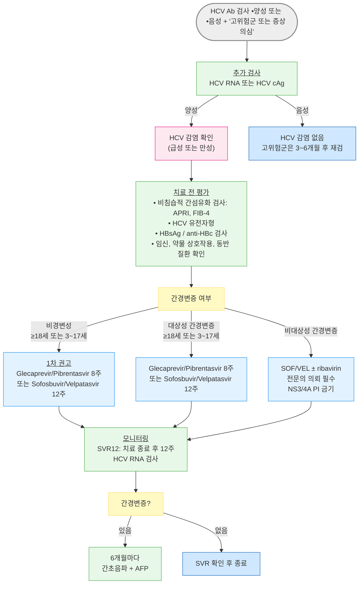

# C형간염 Hepatitis C Viral Infection

## <mark style="color:green;">일반 사항</mark>

* C형간염 바이러스(Hepatitis C virus, HCV) 감염에 의한 급·만성 간질환
* 제3급 법정 감염병 (우리나라)
* 잠복기 : 2주\~6개월 (평균 6\~10주)
* 바이러스유전자형 : 주요 유전자형(genotype 1\~6; 드물게 genotype 7 보고) 및 70개 이상의 아형(subtype)이 있음
  * 우리나라에서 흔한 HCV 유전자형 : 1b형 (45\~90%)과 2a형 (26\~51%)
  * 유전자형에 따라 치료 반응 및 약제 선택이 다를 수 있으나 pangenotypic DAA 도입 이후 임상적 중요성 감소
  * 단, GT3형은 예외 - NS5A RAS(Y93H) 여부가 치료 반응에 영향을 미침. 대상성 간경변증 동반 GT3 환자에서 RAS 검사 권고 (Y93H 존재 시 SOF/VEL/VOX로 전환 가능). 비대상성 간경변증에서는 SOF/VEL/VOX가 PI 함유로 금기이므로 RAS 검사의 약제 선택 영향이 제한적임
* 유병률 : 국내 건강 성인 및 공혈자 중 HCV Ab 양성률 약 1% (고령에서 더 높음)

#### <mark style="color:$primary;">경과</mark>

* 감염자의 약 25% : 치료 없이 6개월 내 자연 소멸
* 감염자의 54\~86% : 만성 간염으로 이행 (B형간염보다 만성화 경향이 높음)
  * 만성 감염자의 15\~56% : 20\~50년 경과 후 간경변증으로 진행
  * 간경변증 환자의 매년 1\~3% : 간세포암종(HCC)으로 진행
  * 간경변증·HCC 진행 위험 인자 : 고령, 알코올, HBV 또는 HIV 동반 감염, 면역 결핍, 미치료
* DAA 치료 시 SVR(지속적 바이러스 반응) 달성률 : 유전자형 무관 95% 이상
  * 과거 인터페론 기반 요법의 70\~90%와 대비됨
* 회복 시 : 감염 후 8\~9주부터 HCV Ab 양전 시작, 6개월 내 97% 이상에서 양전

#### <mark style="color:$primary;">전파 경로</mark>

* 혈액 매개 전파 (주된 경로)
  * 오염된 주사기 재사용, 비위생적인 문신·피어싱·침술
  * 혈액 제제 또는 장기 이식 (국내 : 1990년 EIA, 2005년 핵산증폭검사 도입 이후 위험 대폭 감소)
* 성 접촉 : 주로 HIV 동반 감염자 또는 다수 파트너에서 위험 증가
* 모자 수직 감염
* 일상생활 전파 (식기 공유, 포옹, 기침 등) : 전파 가능성 극히 낮음

#### <mark style="color:$primary;">고위험군</mark>

* 1990년 이전 혈액 제제 수혈 또는 장기 이식 수혜자
* 정맥 주사 약물 남용자 또는 그러한 과거력이 있는 사람
* 혈액 투석 환자, HIV 감염자, 혈우병 환자
* HCV 감염자와 성 접촉을 가진 사람
* HCV 감염 산모에서 태어난 어린이
* HCV 양성 혈액에 오염된 기구에 찔리거나 점막이 노출된 사람
* 비위생적인 침술, 문신, 피어싱 등에 노출된 사람

## <mark style="color:green;">임상 양상</mark>

#### <mark style="color:$primary;">급성 C형간염</mark>

* 초기 감염 후 약 70\~80%에서 무증상
* 증상 발생 시 감염 후 2\~12주 이내 : 피로, 구역, 구토, 식욕 부진, 우상복부 불쾌감, 근육통, 가려움증
* 황달(25%), 전격성 간염(매우 드묾)
* ALT : 감염 후 4\~12주 사이 상승

#### <mark style="color:$primary;">만성 C형간염</mark>

* 60\~80%에서 무증상 - 장기간 무증상 경과 가능
* 증상 : 복부 불편감, 피로, 구역, 근육통, 관절통, 체중 감소
* 간외 증상 : 우울, 당뇨병, 만성 신질환, 한랭글로불린혈증, 갑상선질환, 편평태선 등과 연관
  * 원인 미상의 신질환, 피부 혈관염, 관절통, 한랭글로불린혈증 환자에서 C형간염 선별 검사를 적극 고려
* 간경변 시 : 만성 피로, 황달, 복수, 간성 뇌증, 식도정맥류(문맥압 항진증)

### <mark style="color:$danger;">🚩 Red Flags!</mark>

<mark style="color:$danger;">**즉각 조치 또는 응급 의뢰**</mark>&#x20;

* 혼돈, 지남력 장애, 의식 저하 → 간성 뇌증, 비대상성 간경변, 간부전
* 토혈(hematemesis) 또는 흑색변(melena) → 식도정맥류 출혈&#x20;
* 황달 + 응고장애 + 뇌증 동반 → 전격성 간부전&#x20;
* 복수 + 발열 + 복통 → 자발성 세균성 복막염(SBP)

<mark style="color:$warning;">**당일 또는 조기 의뢰**</mark>

* 새로운 복수 발생 또는 급격한 복수 증가
* 간경변증 환자에서 급격한 신기능 저하 → 간신증후군
* 간경변증 환자에서 간초음파 결절 발견 또는 AFP 급격 상승 → HCC&#x20;
* 혈소판 ＜ 100,000/㎕ + 비장비대 → 간경변증 합병증
* DAA 치료 중 황달·심한 피로·발진 등 새로운 이상 증상 발생

<mark style="color:$info;">**외래 추적 / 추가 평가 계획**</mark> <mark style="color:$info;">- 즉각 위험 낮으나 호전 없으면 의뢰</mark>

* SVR12 달성 실패 (치료 종료 후 12주 HCV RNA 양성)
* 간경변증 없이 SVR 달성 후 간효소 수치 지속 상승
* 지속적 음주로 간질환 진행 위험이 있는 환자

## <mark style="color:green;">진단</mark>

#### <mark style="color:$primary;">진단 검사</mark>

* HCV Ab 검사 (선별 검사) : EIA, CLIA, ECLIA; rapid diagnostic test (타액 또는 혈액, 20분 이내) (☞  [C형간염항체 검사의 급여기준](https://www.hira.or.kr/rc/insu/insuadtcrtr/InsuAdtCrtrPopup.do?mtgHmeDd=20241201\&sno=2\&mtgMtrRegSno=0001), [일반면역검사-C형간염항체(간이검사](https://www.hira.or.kr/rc/insu/insuadtcrtr/InsuAdtCrtrPopup.do?mtgHmeDd=20241201\&sno=2\&mtgMtrRegSno=0002))
  * 회복 또는 만성 C형간염 환자 모두에서 HCV Ab가 지속 검출됨 (완치의 지표가 아님) → 현재 감염 여부 및 완치 판정은 CV RNA로 확인
* HCV RNA NAT (핵산 증폭 검사, RT-PCR) : 감염 1\~2주 후부터 검출; 확진 및 치료 반응 평가에 필수
* HCV 핵심 항원 (HCV core antigen, HCV cAg)
  * HCV RNA의 대안 검사; RNA 검사 이용이 어려운 상황에서 유용한 현재 감염 직접 표지자
  * 민감도는 HCV RNA보다 다소 낮으며, 저바이러스혈증(low-level viremia)에서는 위음성 가능 - cAg 음성이라도 임상적 의심이 있으면 HCV RNA 검사로 확인 필요
* HCV 유전자형 및 아형 검사 : 약제 선택 및 치료 기간 결정에 활용 (pangenotypic 약제 사용 시 필수 아님)

#### <mark style="color:$primary;">HCV Ab / RNA 판정</mark>

<table data-header-hidden><thead><tr><th width="80">HCV Ab</th><th width="80">HCV RNA</th><th>판정</th></tr></thead><tbody><tr><td>+</td><td>+</td><td>현재 감염 : 급성 또는 만성 C형간염</td></tr><tr><td>+</td><td>-</td><td>C형간염 회복 / 혈중 바이러스 낮은 급성기 / HCV RNA 위음성 / HCV Ab 위양성</td></tr><tr><td>-</td><td>+</td><td>급성 C형간염 초기 (window period) / 면역 억제 상태에서의 만성 C형간염 / HCV RNA 위양성</td></tr><tr><td>-</td><td>-</td><td>HCV 감염 없음 (단, 고위험군에서 노출 8\~12주 이전이면 4\~6주 후 재검 고려)</td></tr></tbody></table>

<p align="center"><em><mark style="color:$info;">Ref. C형간염 관리지침, 질병관리청, 2017; WHO, 2022.</mark></em></p>

**HCV RNA 검사 시점별 의미**

<table><thead><tr><th width="183">시점</th><th width="107.4444580078125">결과</th><th>의미</th></tr></thead><tbody><tr><td>치료 전</td><td>RNA(+)</td><td>활성 감염 확인; 바이러스량(IU/㎖) 측정</td></tr><tr><td>치료 종료 시</td><td>RNA(−)</td><td>EOT(End-of-Treatment) 반응</td></tr><tr><td>치료 종료 후 12주</td><td>RNA(−)</td><td>SVR12 = 임상적 완치</td></tr><tr><td>SVR 달성 후 RNA(+)</td><td>재출현</td><td>재발(relapse) vs 재감염(reinfection) 감별 필요</td></tr></tbody></table>


**치료 반응 평가 - SVR (Sustained Virological Response)**

SVR12 = 치료 종료 후 12주 시점에 혈중 HCV RNA가 검출되지 않는 상태 → 임상적 완치(functional cure)로 간주.\
간경변증이 없는 SVR 환자는 이후 HCC 위험이 현저히 감소하나, 간경변증이 있는 환자는 SVR 달성 후에도 HCC 감시를 지속해야 함


#### <mark style="color:$primary;">선별 검사 \[USPSTF 2020, CDC, 대한간학회 2022]</mark>

* 모든 18\~79세 성인에서 평생 최소 1회 이상 HCV Ab 검사
  * 국가건강검진 : 생애 1회 검진, 매해 56세가 되는 국민을 대상으로 함 (2026년 기준 1970년생)
* 매 임신마다 검사
* HCV 감염 위험이 지속되는 경우 : 3\~6개월마다 주기적 재검
* 검사 순서 : anti-HCV Ab 양성 → HCV RNA 검사 (활성 감염 감별)

***



<p align="center"><strong>C형간염 진단·치료·모니터링 알고리듬</strong></p>

***

## <mark style="background-color:$warning;">Management</mark>

### <mark style="color:orange;">치료 방침</mark>

* 치료 목표 : SVR12 - 치료 종료 후 12주에 혈중 HCV RNA 검출 불가(= 임상적 완치)
* 모든 만성 C형간염 환자에게 DAA 치료를 권고 - 간섬유화 단계·유전자형에 무관
* 급성 감염에서도 만성 감염과 동일하게 DAA 치료 시행 가능
* 치료 시작 전 평가
  * 간섬유화 단계 : 비침습적 검사(APRI, FIB-4, 간탄성도 검사) 또는 간생검
  * HBsAg, anti-HBs, anti-HBc 검사 : HBV 동반 감염 또는 과거 감염 확인 → 재활성화 위험 평가
  * 약물 상호작용 확인 : [www.hep-druginteractions.org](https://www.hep-druginteractions.org)
  * 임신 여부 : ribavirin 사용 시 기형 발생 위험 → 임신 중 ribavirin 금기 (치료 중 및 치료 후 6개월간 피임 필수)


**DAA 치료 시작 전 체크리스트**

☐ HCV RNA 정량 (확진 및 기저치 설정)\
☐ 간섬유화 단계 평가 (APRI / FIB-4 / 간탄성도)\
☐ 비대상성 간경변증 여부 (복수·정맥류 출혈·간성 뇌증·CTP class B/C) → 해당 시 전문의 의뢰\
☐ HBsAg / anti-HBc (HBV 재활성화 위험 평가)\
☐ HIV 감염 여부\
☐ 임신 여부 (ribavirin 계획 시)\
☐ eGFR (SOF 기반 요법 시 중증 CKD 여부)\
☐ 약물 상호작용 확인 (amiodarone, rifampin, 항경련제, 스타틴 등)\
☐ HCC 진단·의심 여부\
☐ 이전 DAA 치료 이력 → 해당 시 salvage 요법(SOF/VEL/VOX 등) 고려


## <mark style="color:green;">비-약물 치료 및 예방</mark>

* 금주 : 알코올은 간섬유화 진행을 가속 → DAA 치료 성공 여부와 무관하게 금주 필수
* 체중 조절 : 비만 동반 시 지방간염이 간경변증 진행을 촉진 → 정상 체중 유지 권고
* HAV·HBV 예방 접종 : C형간염 환자에서 HAV(항체 음성 시) 및 HBV(항체 음성 시) 예방 접종 권고
* 혈액 매개 전파 예방 : 면도기·칫솔·손톱깎이 등 개인위생 용품 공유 금지
* 주사 약물 남용자 : 일회용 주사기 사용 교육, 약물 남용 치료 프로그램 연계
* 영양 관리 : 고단백·충분한 칼로리 섭취; 간경변 환자는 영양사 상담 권고
* 예방 백신 : 현재 없음; 면역 글로불린도 효과 없음

## <mark style="color:green;">약물 치료</mark>


**국내 건강보험 급여 기준(고시)**&#x20;

이 챕터는 국제 가이드라인(AASLD/IDSA, WHO)을 기반으로 작성되었음. **국내 건강보험심사평가원(HIRA) 급여 기준은 약제 선택, 투여 기간, 대상 환자에서 가이드라인과 다를 수 있으며**, 보험 고시는 유동적이므로 **DAA 처방 전 심평원 고시(www.hira.or.kr) 최신 기준을 확인하십시오.**\
✽특히 G/P의 치료 기간(8주 vs 12주), 유전자형별 적용 범위, 비대상성 간경변증 환자 요법에서 급여 기준과 가이드라인 간 간극이 있을 수 있습니다.


### <mark style="color:orange;">DAA (Direct-Acting Antivirals) 종류</mark>

<table data-header-hidden><thead><tr><th width="391.5789794921875">성분명 \[상품명]</th><th>용법 (표시 외 식사 무관)</th></tr></thead><tbody><tr><td>Asunaprevir (ASV)¹⁾⁴⁾ <mark style="color:blue;">[순베프라]</mark></td><td>100 ㎎/캡슐 bid</td></tr><tr><td>Daclatasvir (DCV)²⁾⁴⁾ <mark style="color:blue;">[다클린자]</mark></td><td>60 ㎎/정 qd</td></tr><tr><td>Sofosbuvir (SOF)³⁾ <mark style="color:blue;">[소발디]</mark></td><td>400 ㎎/정 qd</td></tr><tr><td>Dasabuvir (DSV)³⁾ <mark style="color:blue;">[엑스비라]</mark></td><td>250 ㎎/정 bid</td></tr><tr><td>Ledipasvir²⁾/sofosbuvir (LED/SOF) <mark style="color:blue;">[</mark><a href="https://www.hira.or.kr/rc/insu/insuadtcrtr/InsuAdtCrtrPopup.do?mtgHmeDd=20251101&#x26;sno=1&#x26;mtgMtrRegSno=0003"><mark style="color:blue;">하보니</mark></a><mark style="color:blue;">]</mark></td><td>90/400 ㎎/정 qd</td></tr><tr><td>Ombitasvir²⁾/paritaprevir¹⁾/ritonavir (OPr) <mark style="color:blue;">[비키라]</mark></td><td>12.5/75/50 ㎎/정 qd (식사와 함께)</td></tr><tr><td>Elbasvir²⁾/grazoprevir¹⁾⁴⁾ (EBR/GZR) <mark style="color:blue;">[제파티어]</mark></td><td>50/100 ㎎/정 qd</td></tr><tr><td>Glecaprevir¹⁾/pibrentasvir²⁾ (G/P) <mark style="color:blue;">[마비렛]</mark></td><td>100/40 ㎎/정 × 3정 qd (반드시 식사와 함께)</td></tr><tr><td>Sofosbuvir/velpatasvir²⁾ (SOF/VEL) <mark style="color:blue;">[엡클루사]</mark></td><td>400/100 ㎎/정 qd</td></tr><tr><td>Sofosbuvir/velpatasvir²⁾/voxilaprevir¹⁾ (SOF/VEL/VOX) <mark style="color:blue;">[보세비]</mark></td><td>400/100/100 ㎎/정 qd (반드시 식사와 함께)</td></tr></tbody></table>

¹⁾ NS3/4A PI(protease inhibitor): HCV 단백질 분해 과정 차단. 비대상성 간경변증에서 금기(Child-Pugh B/C; 중증 간독성 위험)\
²⁾ NS5A 억제제: HCV 복제 및 조립 억제; 병합 시 효과 상승\
³⁾ NS5B 중합효소 억제제: 핵산 유사체(sofosbuvir) 또는 비핵산 계열(dasabuvir)\
⁴⁾ 특정 유전자형에서 치료 전 NS5A RAS(내성 관련 치환) 검사 필요: 1a형(EBR/GZR), 1b형·3형 대상성 간경변(SOF/VEL 등)

<p align="center"><em><mark style="color:$info;">Ref. 대한간학회 C형간염 진료 가이드라인, 2022; AASLD/IDSA, 2023.</mark></em></p>

### <mark style="color:orange;">초치료 요법 \[AASLD/IDSA 2023]</mark>

**1차 표준 치료 - Pangenotypic DAA**

* G/P <mark style="color:blue;">\[마비렛]</mark> (비경변성 8주, 대상성 간경변증 12주) 또는 SOF/VEL <mark style="color:blue;">\[</mark>[<mark style="color:blue;">엡클루사</mark>](https://www.hira.or.kr/rc/insu/insuadtcrtr/InsuAdtCrtrPopup.do?mtgHmeDd=20251101\&sno=1\&mtgMtrRegSno=0004)<mark style="color:blue;">]</mark> (12주)이 유전자형 무관 1차 표준 치료
* 구세대 요법(ASV/DCV, OPr/DSV)은 현재 임상 현장에서 거의 사용되지 않음 (내성 프로파일, 제한적 유전자형 적용 범위)

#### <mark style="color:$primary;">비경변성 또는 대상성 간경변증 - Treatment naive</mark>

<table><thead><tr><th width="133.6842041015625">약제</th><th width="73.15789794921875">유전형</th><th width="61.3157958984375">기간</th><th>유의사항</th></tr></thead><tbody><tr><td>G/P <br><mark style="color:blue;">[마비렛]</mark></td><td>1~6</td><td>8주</td><td>Treatment-naive 비경변성 및 대상성 간경변증 모두 8주 가능. 이전 치료 실패·특정 상황에서 12주 연장*</td></tr><tr><td>SOF/VEL <br><mark style="color:blue;">[엡클루사]</mark></td><td>1~6</td><td>12주</td><td>GT3 대상성 간경변증: NS5A RAS Y93H 검사 권고; Y93H 존재 시 체중 기준 ribavirin 추가 또는 다른 요법 선택</td></tr><tr><td>LED/SOF <br><mark style="color:blue;">[하보니]</mark></td><td>1, 4, 5, 6</td><td>12주</td><td>6e 아형은 권장 안 함; GT1 비경변성 + 비HIV + HCV RNA &#x3C;600만 IU/㎖: 8주 단축 가능</td></tr><tr><td>EBR/GZR <br><mark style="color:blue;">[제파티어]</mark></td><td>1b, 4</td><td>12주</td><td>GT1a: 치료 전 NS5A RAS 검사 권고; RAS 존재 시 다른 요법 선택</td></tr><tr><td>SOF/VEL <mark style="color:blue;">[엡클루사]</mark> + 체중 기준 ribavirin</td><td>3</td><td>12주</td><td>대상성 간경변증 + NS5A Y93 RAS 동반 시 적용 (ribavirin 불가 시: SOF/VEL/VOX 대안)</td></tr><tr><td>SOF/VEL/VOX <br><mark style="color:blue;">[보세비]</mark></td><td>1~6</td><td>12주</td><td>DAA 이전 치료 실패자; GT3 + 대상성 간경변증 + Y93 RAS 동반 시 대안</td></tr></tbody></table>


**\* G/P 치료 기간 - 8주와 12주의 차이**

AASLD/IDSA 2023에서는 **treatment-naive 대상성 간경변증** 환자에서도 G/P <mark style="color:blue;">\[마비렛]</mark> **8주 치료가 가능** (EXPEDITION-8 trial 근거).\
다만 다음 상황에서는 **12주 이상으로 연장**\
•이전 치료 실패 (인터페론·ribavirin·sofosbuvir 기반 치료 경험)\
•특정 유전자형·내성 상황\
•보험 급여 기준에 따른 지역별 차이\
•담당 전문의의 개별 판단

→ 실무적으로는 "대부분의 초치료 환자에서 8주 가능, 일부는 12주 연장"



**Simplified HCV Tx 비적용 대상** : 이전 HCV 치료 병력, HBsAg(+), 비대상성 간경변증, 임신, HCC 진단·의심, 간 이식 수혜자, 중증 신질환 동반 시; SOF 기반 요법 사용 주의 → G/P  권고


#### <mark style="color:$primary;">비대상성 간경변증 - Treatment naive</mark>

<table data-header-hidden><thead><tr><th width="180.52630615234375">약제</th><th width="88.68426513671875">유전형</th><th width="75">기간</th><th>유의사항</th></tr></thead><tbody><tr><td>SOF/VEL + 체중 기준 ribavirin</td><td>1~6</td><td>12주</td><td>CTP class C : 저용량 ribavirin 600 ㎎으로 시작, 점진적 증량</td></tr><tr><td>SOF/VEL <mark style="color:blue;">[엡클루사]</mark></td><td>1~6</td><td>24주</td><td>ribavirin 사용 불가 시</td></tr><tr><td>LED/SOF + 체중 기준 ribavirin</td><td>1, 4, 5, 6</td><td>12주</td><td>CTP class C : 저용량 ribavirin 600 ㎎으로 시작</td></tr><tr><td>LED/SOF <mark style="color:blue;">[하보니]</mark></td><td>1, 4, 5, 6</td><td>24주</td><td>ribavirin 사용 불가 시</td></tr></tbody></table>

**NS3/4A 단백분해효소 억제제 (PI) 금기 : 비대상성 간경변증 (Child-Pugh B/C)**

* G/P, EBR/GZR, SOF/VEL/VOX, OPr, ASV 등 PI 함유 모든 DAA는 비대상성 간경변증에서 금기. 중증 간독성·간부전 위험

**HBV 재활성화 (HBV Reactivation) \[FDA Boxed Warning]**

* DAA 치료 시 HBV 동반 감염(HBsAg+) 또는 과거 HBV 감염(HBsAg−/anti-HBc+)에서 HBV 재활성화 발생 가능 - 전격성 간부전 및 사망 사례 보고\
  → DAA 치료 전 반드시 HBsAg, anti-HBs, anti-HBc 검사\
  → HBsAg(+) : HBV 항바이러스 치료 병행\
  → HBsAg(−)/anti-HBc(+) : DAA 치료 중 HBV DNA 및 간기능 모니터링

**위산억제제·제산제와 SOF/VEL 병용 주의**

* Velpatasvir는 산성 환경에서 흡수가 증가하므로 위산을 억제하는 약물과 병용 시 약물 농도가 감소하여 치료 효과가 저하될 수 있음
* 약제별 영향 및 대처
  * PPI (omeprazole, esomeprazole, pantoprazole 등) - 영향 가장 큼. 가능하면 중단 또는 최소 용량으로 감량; 불가피한 경우 SOF/VEL을 반드시 식사와 함께 복용하고 PPI는 4시간 후 복용
  * H₂ 수용체 길항제 (famotidine, ranitidine 등) - PPI보다 영향이 적음. 병용 시 SOF/VEL과 동시 복용 또는 10시간 이상 간격 유지 권고
  * 제산제 (aluminum/magnesium hydroxide 등) - SOF/VEL 복용 전후 4시간 간격 유지 권고
  * G/P은 위산억제제의 영향이 상대적으로 적어 PPI 병용 환자에서 선호될 수 있음

**중증 신기능 저하 (eGFR ＜30 ㎖/min/1.73㎡) 및 투석 환자에서의 DAA 선택**

* 과거에는 sofosbuvir 대사체 축적 우려로 SOF 기반 요법 사용에 제한이 있었으나, 최근 연구 및 가이드라인에서는 중증 CKD 및 투석 환자에서도 SOF 기반 요법(SOF/VEL 등)의 안전성과 높은 SVR 달성률이 보고되고 있음. 다만 실제 임상에서는 경험 축적 및 사용 편의성 측면에서 G/P이 흔히 우선 선택

### <mark style="color:orange;">치료 중 모니터링 및 관리</mark>

#### <mark style="color:$primary;">모니터링</mark>

* DAA 치료 기간이 8\~12주로 짧아진 만큼 매일 빠짐없는 복용이 SVR에 매우 중요
* 치료 시작 후 1\~2주 차에 짧은 외래 방문 또는 전화 추적을 통해 부작용 여부(두통, 피로, 오심 등), 약물 상호작용 이슈, 복약 순응도를 확인하는 것을 권장

#### <mark style="color:$primary;">치료 중단자 관리</mark>

**투여 시작 28일 이전에 중단**

* ≤7일 중단 → 즉시 DAA 재개, 원래 계획대로 치료 기간 완료
* ≥8일 중단 → 즉시 DAA 재개 + 가급적 빨리 HCV RNA 검사
  * HCV RNA(−) → 치료 일정 완료 (GT3이면 4주 추가)
  * HCV RNA(+, ＞25 IU/㎖) 또는 검사 불가 → DAA 치료 4주 추가

**투여 시작 ≥28일 후 중단**

* ≤7일 중단 → 즉시 재개, 원래 계획대로 치료 기간 완료
* 8\~20일 연속 중단 → 즉시 재개 + HCV RNA 검사
  * HCV RNA(−) → 치료 일정 완료 (GT3이면 4주 추가)
  * HCV RNA(+) 또는 검사 불가 → 치료 중단 → 재치료
* ≥21일 연속 중단 → 치료 중단 + SVR12 평가; SVR12 미성취 시 재치료

#### <mark style="color:$primary;">환자 접촉 관리</mark>

* C형간염 환자의 별도 격리 불필요 (일상생활에서 사람 간 전파 가능성 극히 낮음)
* HCV Ab 양성자 → HCV RNA 검사로 현재 감염 여부 확인 및 정기 추적 권고
* SVR 달성 후에도 고위험 행동 지속 시 재감염 가능 - SVR 달성은 면역 획득을 의미하지 않음
  * 특히 정맥 주사 약물 사용자(PWID) 및 HIV 양성 남성 동성 간 성 접촉자(MSM)에서 재감염 위험 높음
  * 지속 위험 행동 환자는 6\~12개월마다 HCV RNA 추적 권고

#### <mark style="color:$primary;">노출자 관리</mark>

* 현재 예방 백신 없음; 면역 글로불린 효과 없음

**C형간염 환자 혈액에 직접 노출된 경우**

1. 노출 즉시 → HCV Ab + 혈청 ALT 검사
2. HCV Ab(−) → 4\~6주 후 HCV RNA 검사
3. 노출 후 4\~6개월 → HCV Ab + ALT 재검

**C형간염 혈액 노출이 의심되는 경우**

* 예) C형간염 유행 발생 의료기관 수진자
* HCV Ab 검사 → HCV Ab(+) 시 HCV RNA 등 추가 검사

#### <mark style="color:$primary;">C형간염 산모 출생 신생아</mark>

* 생후 18개월 이후 HCV Ab 검사 시행
* 조기 진단이 필요한 경우 : 생후 6개월 이후 HCV RNA 검사

***

### <mark style="color:red;">질병코드</mark>

B17.1 급성 C형간염

B18.2 만성 바이러스 C형간염

***

## <mark style="color:purple;">처방례</mark>


[**DAA 급여**](https://www.hira.or.kr/rc/insu/insuadtcrtr/InsuAdtCrtrList.do?pgmid=HIRAA030069000400) **적용 원칙** : 항바이러스제(DAA) 급여는 일반적으로 HCV RNA 양성이 확인된 현재 감염 환자에게 적용. 세부 급여 기준(대상 질환코드, 유전자형, 투여 기간, 중증도 기준)은 심평원 고시에 따르며 변경될 수 있으므로 처방 전 확인이 필요


> **처방례 1.** 비경변성·초치료·1차 표준 요법 (Pangenotypic)
>
> ```
> 마비렛정 (글레카프레비르 100㎎/피브렌타스비르 40㎎)   3정   qd   식사와 함께   8주
> ※ 매일 같은 시간, 반드시 음식과 함께 복용 (공복 복용 시 흡수 크게 저하)
> ※ 소량의 식사(크래커·요구르트 등)도 가능
> ※ 복용 중 타 약제 추가 시 반드시 의사·약사와 사전 확인 (약물 상호작용 다수)
> ※ PPI(위산억제제) 병용 중이라면 식사와 함께 복용 더욱 중요
> ※ 대상성 간경변증 초치료: 대부분 8주 가능 (이전 치료 실패 등 일부 상황에서 12주 연장)
> ```
>
> _✽비경변성 초치료 환자의 표준 요법. 유전자형 확인 없이 사용 가능(pangenotypic). SVR 달성률 97\~99%._

> **처방례 2.** 비경변성·초치료·대안 요법 (SOF/VEL)
>
> ```
> 엡클루사정 (소포스부비르 400㎎/벨파타스비르 100㎎)   1정   qd   12주
> ※ 식사 무관
> ※ GT3 + 대상성 간경변증: NS5A RAS(Y93H) 검사 후 존재 시 ribavirin 추가 고려
> ```
>
> _✽최근 연구에서 중증 CKD 및 투석 환자에서도 SOF 기반 요법의 안전성이 보고되고 있으나, 실무적으로는 G/P가 흔히 우선 선택된다. 임신 가능 여성에서 ribavirin 병용 시 반드시 이중 피임._

> **처방례 3.** 비대상성 간경변증 (반드시 소화기내과 전문의 협진 후 처방)
>
> ```
> 엡클루사정 (소포스부비르 400㎎/벨파타스비르 100㎎)   1정   qd   24주
> [ribavirin 사용 가능한 경우: 코페가스 200㎎ 식후, 체중 기준 용량으로 12주 단축 가능]
> ※ PI 함유 약제(마비렛·제파티어·보세비 등) 절대 금기
> ※ 간기능 및 HCV RNA 정기 모니터링 필수
> ※ CTP class C: ribavirin 600 ㎎부터 시작, 점진적 증량
> ```
>
> _✽비대상성 간경변증 = 간 기능이 상당히 저하되어 복수·황달·의식 저하 등 합병증이 발생한 단계(Child-Pugh B/C). **간이식 적응증 여부 동시 평가 필수**. NS3/4A PI는 이 군에서 절대 금기._

> **처방례 4.** SVR 달성 후 간경변증 환자 - 지속 모니터링 처방
>
> ```
> 복부 초음파 검사                6개월마다
> AFP (알파태아단백, 혈청)         6개월마다
> ※ SVR 달성 = HCV 완치이나, 간섬유화·간경변증 자체는 잔존 → HCC 감시 필수
> ※ 음주 등 추가 간독성 인자 여부 매 방문 시 확인
> ```
>
> _✽**DAA로 HCV가 완치되어도 간경변증이 있다면 HCC 위험은 계속 존재합니다. 6개월마다 HCC 감시(간초음파 + AFP)를 평생 지속해야 합니다.** 간경변 역전은 가능하지만 수년이 소요되므로 단기간 내 감시 중단은 금합니다._

***

### <mark style="color:$success;">핵심 복약 지도</mark>

> **복용 방법 - 특히 마비렛은 식사 필수**
>
> * **마비렛&#x20;**<mark style="color:blue;">**\[마비렛]**</mark> : 반드시 음식과 함께 복용. 공복 복용 시 흡수율이 크게 떨어져 치료 효과가 감소합니다. 매일 같은 시간에 복용하는 것이 중요합니다.
> * **엡클루사&#x20;**<mark style="color:blue;">**\[엡클루사]**</mark> : 식사와 무관하게 복용 가능합니다.
> * 복용을 잊은 경우 : 같은 날 생각났다면 즉시 복용; 다음 날 생각났다면 건너뛰고 원래 일정대로 복용 (절대로 두 배로 복용하지 마십시오).

> **약물 상호작용 - 매우 중요합니다**
>
> * DAA는 다른 여러 약물과 심각한 상호작용이 있습니다:
>   * **병용 금기** : 아미오다론(심장 부정맥 약), 리팜피신(항결핵약), 카르바마제핀·페니토인(항경련제), 일부 스타틴(로수바스타틴 등), 세인트존스워트(건강보조제)
>   * 복용 중인 **모든 약(한약, 건강기능식품 포함)을 반드시 의사·약사에게 알려주십시오.**
> * 약물 상호작용 온라인 확인 : [www.hep-druginteractions.org](https://www.hep-druginteractions.org)

> **치료 기간 및 완치 확인**
>
> * C형간염 DAA는 **완치를 목표로 하는 치료**입니다.
> * 치료 기간이 짧고(8\~12주) 부작용이 적어 대부분 잘 완료됩니다.
> * 치료 종료 후 12주 시점의 HCV RNA 검사(SVR12)가 완치 확인의 필수 단계입니다. 이 방문을 빠지지 않도록 강조하십시오.
> * 완치 후에도 **HCV 항체(HCV Ab)는 혈액 검사에서 계속 양성**으로 나옵니다 - 이것은 정상적인 면역 흔적이며 재감염을 의미하지 않습니다.

> **부작용 안내**
>
> * 일반적으로 내약성이 좋습니다. 주요 부작용 : 두통, 피로, 오심 (대부분 경미하고 치료 중단이 불필요한 수준)
> * 다음 증상 발생 시 즉시 내원하도록 안내하십시오 : 황달(눈이나 피부가 노란색으로 변함), 심한 피로, 짙은 갈색 소변, 심한 복통

> **생활 수칙**
>
> * 치료 중 **금주**를 권고합니다. 알코올은 간에 추가적인 손상을 줍니다.
> * 가족·타인과 면도기, 칫솔, 손톱깎이 등 개인위생 용품을 **공유하지 마십시오.**
> * 성 접촉 시 콘돔 사용을 권장합니다.

> **언제 다시 병원을 방문해야 하나요?**
>
> * 치료 중 황달, 심한 복통, 의식 변화 → **즉시 내원**
> * **치료 종료 후 12주** → HCV RNA 검사(SVR12 확인) **필수 방문**
> * 간경변증이 있는 경우 → SVR 달성 후에도 **6개월마다** 간초음파 + AFP 검사

***

### <mark style="color:blue;">환자 안내서</mark>


**C형간염, 이제는 완치할 수 있는 질환입니다**

C형간염은 C형간염 바이러스(HCV)가 혈액을 통해 전파되는 간질환입니다. 과거에는 치료가 어려웠지만, 지금은 먹는 약(DAA)으로 8\~12주 치료만으로 거의 대부분(95% 이상) 완치가 가능합니다.


#### <mark style="color:$primary;">C형간염은 왜 생기나요?</mark>

* C형간염 바이러스는 **혈액을 통해서만 전염**됩니다.
* 주된 경로 : 오염된 주사기 재사용, 비위생적인 문신·피어싱·침술, 1990년 이전 수혈
* 일상생활 - 같은 그릇 사용, 악수, 포옹, 기침, 재채기로는 **전염되지 않습니다.**
* 감염 후 수십 년간 아무런 증상이 없을 수 있어 "침묵의 질환"이라고도 합니다. 증상이 없어도 간 손상은 서서히 진행될 수 있습니다.

#### <mark style="color:$primary;">치료는 어떻게 하나요?</mark>

* 현재 표준 치료는 경구 DAA(먹는 항바이러스제)입니다. 과거 인터페론 주사와 달리 부작용이 훨씬 적습니다.
* 치료 기간은 8\~12주이며, **치료 종료 후 12주에 혈액 검사로 완치 여부를 확인**합니다.
* 치료 중 가장 중요한 것은 **매일 빠짐없이 약을 복용**하는 것입니다.
* **마비렛은 반드시 음식과 함께 드십시오** (공복에 복용하면 약이 제대로 흡수되지 않습니다).

#### <mark style="color:$primary;">일상생활에서 어떻게 관리하나요?</mark>

* 🚫 **금주하십시오** : 술은 간에 추가 손상을 주어 간경변증 진행을 빠르게 합니다.
* 🩸 **개인위생 용품을 따로 사용하십시오** : 면도기, 칫솔, 손톱깎이는 각자 사용하십시오.
* 💉 **예방 접종을 받으십시오** : A형간염과 B형간염 항체가 없다면 예방 접종을 권장합니다.
* ⚖️ **체중을 관리하십시오** : 비만은 간질환 진행을 악화시킵니다.

#### <mark style="color:$primary;">완치 후에도 주의할 점이 있나요?</mark>

* **완치 후에도 혈액 검사에서 C형간염 항체(HCV Ab)가 양성**으로 나올 수 있습니다 - 이것은 면역 흔적이며 재감염이 아닙니다.
* **간경변증이 있다면 완치 후에도 6개월마다 간초음파와 AFP 검사를 평생 지속해야 합니다.** C형간염이 완치되어도 간경변증 자체가 남아 있는 한 간암 위험은 계속 존재합니다.
* **완치는 면역을 의미하지 않습니다** - 오염된 주사기 재사용 등 위험한 행동을 반복하면 **다시 감염될 수 있습니다.** 완치 후에도 위험 행동을 피하십시오.

#### <mark style="color:$primary;">이럴 때는 즉시 병원을 방문하세요</mark>

* 눈이나 피부가 노랗게 변하는 경우 (황달)
* 갑자기 심한 복통 또는 배가 급격히 불러오는 경우
* 의식이 흐려지거나 말이 어눌해지는 경우
* 피를 토하거나 검은색 변이 나오는 경우
