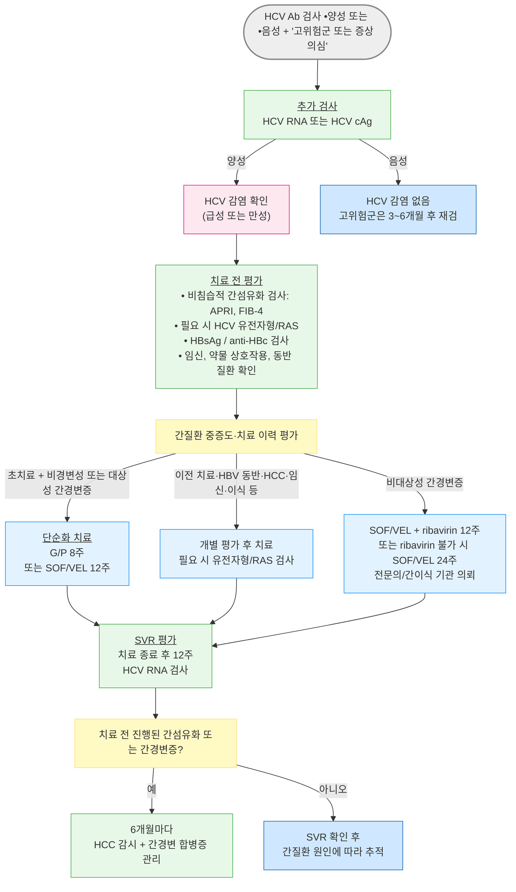

# C형간염 Hepatitis C Viral Infection

## <mark style="color:green;">일반 사항</mark>

* C형간염 바이러스(Hepatitis C virus, HCV) 감염에 의한 급·만성 간질환
* 제3급 법정 감염병 (우리나라)
* 잠복기 : 2주\~6개월 (평균 6\~10주)
* 바이러스유전자형 : 현재 8개의 유전자형(genotype)과 100개 이상의 유전자아형(subtype)이 있음
  * 우리나라에서 흔한 HCV 유전자형 : 1b형 (45\~58%)과 2a형 (32\~51%)
  * 2022년 국내 분자유전학 조사에서는 1b형 46.2%, 2형 50.0%가 주로 확인됨
  * 범유전자형(pangenotypic) DAA인 SOF/VEL 및 G/P 사용 시 대부분의 초치료 환자에서 유전자형 검사가 필수적이지 않음
  * 다만 드문 유전자아형, 치료 실패, 유전자형 3형 간경변증 등에서는 치료 전 유전자형·RAS 검사가 약제 선택에 도움될 수 있음. GT3에서 SOF/VEL 사용 시 Y93H, G/P 사용 시 A30K가 치료 반응에 영향을 줄 수 있음
* 유병률 : 2019\~2023년 국내 19세 이상 HCV Ab 양성률은 약 0.7%이며 연령 증가에 따라 높아짐

#### <mark style="color:$primary;">경과</mark>

* 감염자의 약 25% : 치료 없이 6개월 내 자연 소멸
* 감염자의 54\~86% : 만성 간염으로 이행 (B형간염보다 만성화 경향이 높음)
  * 만성 감염자의 15\~56% : 20\~50년 경과 후 간경변증으로 진행
  * 간경변증 환자의 매년 1\~3% : 간세포암종(HCC)으로 진행
  * 간경변증·HCC 진행 위험 인자 : 고령, 알코올, HBV 또는 HIV 동반 감염, 면역 결핍, 미치료
* DAA 치료 시 SVR(지속적 바이러스 반응) 달성률 : 유전자형 무관 95% 이상
  * 과거 인터페론 기반 요법의 70\~90%와 대비됨
* 회복 시 : 감염 후 8\~9주부터 HCV Ab 양전 시작, 6개월 내 97% 이상에서 양전

#### <mark style="color:$primary;">전파 경로</mark>

* 혈액 매개 전파 (주된 경로)
  * 오염된 주사기 재사용, 비위생적인 문신·피어싱·침술
  * 혈액 제제 또는 장기 이식 (국내 : 1991년 이후 헌혈 혈액 HCV 항체 선별검사, 2005년 핵산증폭검사 도입 이후 수혈 관련 위험이 매우 낮아짐)
* 성 접촉 : 일반적으로 전파 위험은 낮지만 HIV 동반 감염, 다수의 성 파트너, 점막 손상 가능 성행위 등에서 위험 증가
  * 성 상대가 한 명인 경우 감염자라는 이유만으로 콘돔 사용을 반드시 권고하지는 않으며, 성 상대가 다수인 경우 콘돔 사용을 권고
* 모자 수직 감염
* 일상생활 전파 (식기 공유, 포옹, 기침 등) : 전파 가능성 극히 낮음

#### <mark style="color:$primary;">고위험군</mark>

* 1990년 이전 혈액 제제 수혈 또는 장기 이식 수혜자
* 정맥 주사 약물 남용자 또는 그러한 과거력이 있는 사람
* 혈액 투석 환자, HIV 감염자, 혈우병 환자
* HCV 감염자와 성 접촉을 가진 사람
* HCV 감염 산모에서 태어난 어린이
* HCV 양성 혈액에 오염된 기구에 찔리거나 점막이 노출된 사람
* 비위생적인 침술, 문신, 피어싱 등에 노출된 사람

## <mark style="color:green;">임상 양상</mark>

#### <mark style="color:$primary;">급성 C형간염</mark>

* 초기 감염 후 약 70\~80%에서 무증상
* 증상 발생 시 감염 후 2\~12주 이내 : 피로, 구역, 구토, 식욕 부진, 우상복부 불쾌감, 근육통, 가려움증
* 황달(25%), 전격성 간염(매우 드묾)
* ALT : 감염 후 4\~12주 사이 상승

#### <mark style="color:$primary;">만성 C형간염</mark>

* 60\~80%에서 무증상 - 장기간 무증상 경과 가능
* 증상 : 복부 불편감, 피로, 구역, 근육통, 관절통, 체중 감소
* 간외 증상 : 우울, 당뇨병, 만성 신질환, 한랭글로불린혈증, 갑상선질환, 편평태선 등과 연관
  * 원인 미상의 신질환, 피부 혈관염, 관절통, 한랭글로불린혈증 환자에서 C형간염 선별 검사를 적극 고려
* 간경변 시 : 만성 피로, 황달, 복수, 간성 뇌증, 식도정맥류(문맥압 항진증)

### <mark style="color:$danger;">🚩 Red Flags!</mark>

<mark style="color:$danger;">**즉각 조치 또는 응급 의뢰**</mark>&#x20;

* 혼돈, 지남력 장애, 의식 저하 → 간성 뇌증, 비대상성 간경변, 간부전
* 토혈(hematemesis) 또는 흑색변(melena) → 식도정맥류 출혈&#x20;
* 황달 + 응고장애 + 뇌증 동반 → 전격성 간부전&#x20;
* 복수 + 발열 + 복통 → 자발성 세균성 복막염(SBP)

<mark style="color:$warning;">**당일 또는 조기 의뢰**</mark>

* 새로운 복수 발생 또는 급격한 복수 증가
* 간경변증 환자에서 급격한 신기능 저하 → 간신증후군
* 간경변증 환자에서 간초음파 결절 발견 또는 AFP 급격 상승 → HCC&#x20;
* 혈소판 ＜ 100,000/㎕ + 비장비대 → 진행된 문맥압항진증/간경변증 평가 필요
* DAA 치료 중 황달·심한 피로·발진 등 새로운 이상 증상 발생

<mark style="color:$info;">**외래 추적 / 추가 평가 계획**</mark> <mark style="color:$info;">- 즉각 위험 낮으나 호전 없으면 의뢰</mark>

* SVR12 달성 실패 (치료 종료 후 12주 HCV RNA 검출)
* 간경변증 없이 SVR 달성 후 간효소 수치 지속 상승
* 지속적 음주로 간질환 진행 위험이 있는 환자

## <mark style="color:green;">진단</mark>

#### <mark style="color:$primary;">진단 검사</mark>

* HCV Ab 검사 (선별 검사) : EIA, CLIA, ECLIA; rapid diagnostic test (타액 또는 혈액, 20분 이내) (☞  [C형간염항체 검사의 급여기준](https://www.hira.or.kr/rc/insu/insuadtcrtr/InsuAdtCrtrPopup.do?mtgHmeDd=20241201\&sno=2\&mtgMtrRegSno=0001), [일반면역검사-C형간염항체(간이검사)](https://www.hira.or.kr/rc/insu/insuadtcrtr/InsuAdtCrtrPopup.do?mtgHmeDd=20241201\&sno=2\&mtgMtrRegSno=0002))
  * 회복 또는 만성 C형간염 환자 모두에서 HCV Ab가 지속 검출됨 (완치의 지표가 아님) → 현재 감염 여부 및 완치 판정은 HCV RNA로 확인
* HCV RNA NAT (핵산 증폭 검사, RT-PCR) : 감염 1\~2주 후부터 검출; 확진 및 치료 반응 평가에 필수
* HCV 핵심 항원 (HCV core antigen, HCV cAg)
  * HCV RNA의 대안 검사; RNA 검사 이용이 어려운 상황에서 유용한 현재 감염 직접 표지자
  * 민감도는 HCV RNA보다 다소 낮으며, 저바이러스혈증(low-level viremia)에서는 위음성 가능 - cAg 음성이라도 임상적 의심이 있으면 HCV RNA 검사로 확인 필요
* HCV 유전자형 및 아형 검사 : 약제 선택 및 치료 기간 결정에 활용 (pangenotypic 약제 사용 시 필수 아님)

#### <mark style="color:$primary;">HCV Ab / RNA 판정</mark>

<table data-header-hidden><thead><tr><th width="80">HCV Ab</th><th width="80">HCV RNA</th><th>판정</th></tr></thead><tbody><tr><td>+</td><td>+</td><td>현재 감염 : 급성 또는 만성 C형간염</td></tr><tr><td>+</td><td>-</td><td>C형간염 회복 / 혈중 바이러스 낮은 급성기 / HCV RNA 위음성 / HCV Ab 위양성</td></tr><tr><td>-</td><td>+</td><td>급성 C형간염 초기 (window period) / 면역 억제 상태에서의 만성 C형간염 / HCV RNA 위양성</td></tr><tr><td>-</td><td>-</td><td>HCV 감염 없음 (단, 고위험군에서 노출 8\~12주 이전이면 4\~6주 후 재검 고려)</td></tr></tbody></table>

<p align="center"><em><mark style="color:$info;">Ref. C형간염 관리지침, 질병관리청, 2017; WHO, 2022.</mark></em></p>

**HCV RNA 검사 시점별 의미**

<table><thead><tr><th width="183">시점</th><th width="107.4444580078125">결과</th><th>의미</th></tr></thead><tbody><tr><td>치료 전</td><td>RNA(+)</td><td>활성 감염 확인; 바이러스량(IU/㎖) 측정</td></tr><tr><td>치료 종료 시</td><td>RNA(−)</td><td>EOT(End-of-Treatment) 반응</td></tr><tr><td>치료 종료 후 12주</td><td>RNA(−)</td><td>SVR12 = 임상적 완치</td></tr><tr><td>SVR 달성 후 HCV RNA(+)</td><td>재출현</td><td>재발(relapse) vs 재감염(reinfection) 감별 필요</td></tr></tbody></table>


**치료 반응 평가 - SVR (Sustained Virological Response)**

SVR12 = 치료 종료 후 12주 시점에 혈중 HCV RNA가 검출되지 않는 상태 → 지속바이러스반응(SVR)으로, 실질적인 바이러스 박멸로 간주.\
치료 전 간경변증 또는 진행된 간섬유화가 있었던 환자는 SVR 달성 후에도 HCC 감시와 간질환 합병증 관리를 지속해야 함


#### <mark style="color:$primary;">선별 검사 \[대한간학회 2025, 질병관리청 2026]</mark>

* 대한간학회 : C형간염 퇴치를 위해 국가적 수준의 대규모 선별검사를 권고
  * 국내 국가건강검진 : 56세에 C형간염 항체검사 생애 1회 시행 (2026년 기준 1970년생)
  * 2026년부터 국가건강검진 C형간염 항체 양성자의 HCV RNA 확진검사 관련 진찰료·검사비 본인부담금 지원 범위가 상급·종합병원까지 확대됨(최초 1회, 상한액 7만원)
* 미국 USPSTF/CDC : 18\~79세 성인 1회 선별검사를 권고하며, 미국 CDC는 임신마다 선별검사를 권고함. 이는 국내 국가검진·대한간학회 권고와 구분하여 적용
* 국내 임산부 : 일률적인 선별검사는 권고하지 않으며, 산전 진찰에서 HCV 감염 위험인자가 있으면 검사 고려
* 지속적인 재감염 위험이 있는 환자 : SVR 후에도 주기적인 HCV RNA 검사를 시행
* 검사 순서 : anti-HCV Ab 양성 → HCV RNA 검사 (현재 감염 여부 확인)

***


```mermaid
flowchart TD
    A([HCV Ab 검사 •양성 또는 <br/>•음성 + '고위험군 또는 증상 의심']) --> C[<u>추가 검사</u><br/>HCV RNA 또는 HCV cAg]
    C -- "양성" --> E["HCV 감염 확인<br/>(급성 또는 만성)"]
    C -- "음성" --> F["HCV 감염 없음<br/>고위험군은 3~6개월 후 재검"]
    E --> G["<u>치료 전 평가</u><br/>• 비침습적 간섬유화 검사: APRI, FIB-4<br/>• 필요 시 HCV 유전자형/RAS<br/>• HBsAg / anti-HBc 검사<br/>• 임신, 약물 상호작용, 동반 질환 확인"]
    G --> H[간질환 중증도·치료 이력 평가]
    H -- "초치료 + 비경변성 또는 대상성 간경변증" --> I["<u>단순화 치료</u><br/>G/P 8주<br/>또는 SOF/VEL 12주"]
    H -- "이전 치료·HBV 동반·HCC·임신·이식 등" --> J["개별 평가 후 치료<br/>필요 시 유전자형/RAS 검사"]
    H -- "비대상성 간경변증" --> K["SOF/VEL + ribavirin 12주<br/>또는 ribavirin 불가 시 SOF/VEL 24주<br/>전문의/간이식 기관 의뢰"]
    I --> L["<u>SVR 평가</u><br/>치료 종료 후 12주<br/>HCV RNA 검사"]
    J --> L
    K --> L
    L --> M[치료 전 진행된 간섬유화 또는 간경변증?]
    M -- "예" --> N["6개월마다<br/>HCC 감시 + 간경변 합병증 관리"]
    M -- "아니오" --> O["SVR 확인 후<br/>간질환 원인에 따라 추적"]

style A fill:#eeeeee,stroke:#888888,stroke-width:2px
classDef yellow fill:#fff9c4,stroke:#ffe082
class B,D,H,M yellow
classDef blue fill:#d0e8ff,stroke:#1a6abf
class F,O blue
classDef lightGreen fill:#e8f8e8,stroke:#4caf50
class N,L,G,C lightGreen
classDef sky fill:#e3f2ff,stroke:#2196f3
class I,J,K sky
style E fill:#fde8f0,stroke:#e91e8c
```

<p align="center"><strong>C형간염 진단·치료·모니터링 알고리듬</strong></p>

***

## <mark style="background-color:$warning;">Management</mark>

### <mark style="color:orange;">치료 방침</mark>

* 치료 목표 : SVR12 - 치료 종료 후 12주에 혈중 HCV RNA 검출 불가(= 임상적 완치)
* 모든 만성 C형간염 환자에게 DAA 치료를 권고 - 간섬유화 단계·유전자형에 무관
* 급성 감염에서도 만성 감염과 동일하게 DAA 치료 시행 가능
* 치료 시작 전 평가
  * 간섬유화 단계 : 비침습적 검사(APRI, FIB-4, 간탄성도 검사) 또는 간생검
  * HBsAg, anti-HBs, anti-HBc 검사 : HBV 동반 감염 또는 과거 감염 확인 → 재활성화 위험 평가
  * 약물 상호작용 확인 : [www.hep-druginteractions.org](https://www.hep-druginteractions.org)
  * 임신 여부 : 임신 중 DAA 치료는 근거가 제한되어 국내 지침상 가능하면 출산 후 치료를 권고. ribavirin은 임신 중 금기이며 치료 종료 후에도 제품 허가사항에 따른 피임 기간 준수


**DAA 치료 시작 전 체크리스트**

☐ HCV RNA 정량 (현재 감염 확인)\
☐ 간섬유화 단계 평가 (APRI / FIB-4 / 간탄성도)\
☐ 비대상성 간경변증 여부 (복수·정맥류 출혈·간성 뇌증·CTP class B/C) → 해당 시 전문의/간이식 기관 의뢰\
☐ HBsAg / anti-HBc / anti-HBs (HBV 동반 또는 과거 감염 평가)\
☐ HIV 감염 여부 및 재감염 위험 행동\
☐ 임신 여부 및 임신 계획\
☐ eGFR 및 신장질환 동반 여부\
☐ 약물 상호작용 확인 (특히 amiodarone, rifampin계, 항경련제, 일부 스타틴 등)\
☐ HCC 진단·의심 여부\
☐ 이전 DAA 치료 이력 → 해당 시 salvage 요법(SOF/VEL/VOX 등) 고려


## <mark style="color:green;">비-약물 치료 및 예방</mark>

* 금주 : 알코올은 간질환 진행 및 HCC 위험을 증가시키므로 가능한 금주를 권고
* 체중 조절 : 비만·대사이상지방간질환이 동반된 경우 간질환 진행 위험이 증가하므로 체중 및 대사질환 관리 권고
* HAV·HBV 예방 접종 : C형간염 환자에서 HAV(항체 음성 시) 및 HBV(항체 음성 시) 예방 접종 권고
* 혈액 매개 전파 예방 : 면도기·칫솔·손톱깎이 등 개인위생 용품 공유 금지
* 주사 약물 남용자 : 일회용 주사기 사용 교육, 약물 남용 치료 프로그램 연계
* 영양 관리 : 고단백·충분한 칼로리 섭취; 간경변 환자는 영양사 상담 권고
* 예방 백신 : 현재 없음; 면역 글로불린도 효과 없음

## <mark style="color:green;">약물 치료</mark>


**국내 건강보험 급여 기준(고시)**&#x20;

이 챕터는 국제 가이드라인(AASLD/IDSA, WHO)을 기반으로 작성되었음. **국내 건강보험심사평가원(HIRA) 급여 기준은 약제 선택, 투여 기간, 대상 환자에서 가이드라인과 다를 수 있으며**, 보험 고시는 유동적이므로 **DAA 처방 전 심평원 고시(www.hira.or.kr) 최신 기준을 확인하십시오.**\
✽특히 G/P의 치료 기간(8주 vs 12주), 유전자형별 적용 범위, 비대상성 간경변증 환자 요법에서 급여 기준과 가이드라인 간 간극이 있을 수 있습니다.


### <mark style="color:orange;">DAA (Direct-Acting Antivirals) 종류</mark>

2025년 12월 최종 수정된 대한간학회 가이드라인 기준으로 국내에서 승인·시판되는 주요 DAA는 다음 세 가지이다. 구세대 DAA는 현재 치료에 권고되지 않으며 상당수는 허가 취하 또는 시판되지 않는다.

<table data-header-hidden><thead><tr><th width="391">성분명 [상품명]</th><th>용법</th></tr></thead><tbody><tr><td>Sofosbuvir/velpatasvir (SOF/VEL) <mark style="color:blue;">[엡클루사]</mark></td><td>400/100 ㎎ 1정 qd, 식사 무관</td></tr><tr><td>Glecaprevir/pibrentasvir (G/P) <mark style="color:blue;">[마비렛]</mark></td><td>100/40 ㎎ 3정 qd, 반드시 식사와 함께</td></tr><tr><td>Sofosbuvir/velpatasvir/voxilaprevir (SOF/VEL/VOX) <mark style="color:blue;">[보세비]</mark></td><td>400/100/100 ㎎ 1정 qd, 식사와 함께</td></tr></tbody></table>

* SOF/VEL : NS5B 중합효소 억제제 sofosbuvir + NS5A 억제제 velpatasvir
* G/P : NS3/4A protease inhibitor glecaprevir + NS5A inhibitor pibrentasvir
* SOF/VEL/VOX : sofosbuvir + velpatasvir + NS3/4A protease inhibitor voxilaprevir
* G/P 및 SOF/VEL/VOX의 protease inhibitor 성분은 이전 비대상성 합병증 병력 또는 Child-Pugh B/C에서 사용하지 않는다.
* 범유전자형 DAA의 초치료에서는 치료 전 RAS 검사가 일반적으로 필요하지 않다. 다만 GT3에서 SOF/VEL의 Y93H, G/P의 A30K는 치료 반응을 낮출 수 있어 특정 환자에서 치료 전 RAS 검사를 고려한다.

<p align="center"><em><mark style="color:$info;">Ref. 2025 대한간학회 C형간염 진료 가이드라인; 국내 허가사항은 처방 시 최신 식품의약품안전처 허가사항 확인.</mark></em></p>

### <mark style="color:orange;">초치료 요법 \[2025 대한간학회]</mark>

**1차 표준 치료 - Pangenotypic DAA**

* 이전 치료력이 없고 비경변성 또는 대상성 간경변증(Child-Pugh A)인 환자는 유전자형에 관계없이
  * G/P <mark style="color:blue;">[마비렛]</mark> 3정 qd, 식사와 함께, **8주**
  * 또는 SOF/VEL <mark style="color:blue;">[엡클루사]</mark> 1정 qd, 식사 무관, **12주**
* 치료 실패, HBV 동반감염, 임신, HCC, 간이식 후, 대상성 간경변증+말기콩팥병 등은 단순화 치료 대상에서 제외하고 개별 평가한다.
* 이전 치료 경험이 있는 환자의 재치료는 과거 사용 약제와 간질환 상태에 따라 선택하며, 대부분 SOF/VEL/VOX를 포함한 구제요법을 고려한다.

#### <mark style="color:$primary;">비경변성 또는 대상성 간경변증 - Treatment naive</mark>

<table><thead><tr><th width="150">약제</th><th width="80">유전형</th><th width="70">기간</th><th>유의사항</th></tr></thead><tbody><tr><td>G/P <br><mark style="color:blue;">[마비렛]</mark></td><td>1~6</td><td>8주</td><td>비경변성 및 대상성 간경변증의 초치료에서 권고</td></tr><tr><td>SOF/VEL <br><mark style="color:blue;">[엡클루사]</mark></td><td>1~6</td><td>12주</td><td>비경변성 및 대상성 간경변증의 초치료에서 권고. GT3 간경변증에서는 치료 전 유전자형/RAS 평가를 고려</td></tr></tbody></table>


**Simplified HCV treatment 비적용 대상**

이전 HCV 치료 경험, HBV 동반감염, 대상성 간경변증+말기콩팥병(eGFR ＜30 ㎖/min/1.73㎡), 현재 또는 과거 비대상성 간경변증, 임신, HCC 동반·의심, 간이식 수혜자는 단순화 치료 전략을 적용하지 않는다. 이러한 환자는 치료 전 평가를 강화하고 개별 치료 전략을 선택한다.


#### <mark style="color:$primary;">비대상성 간경변증 - Treatment naive</mark>

<table data-header-hidden><thead><tr><th width="180">약제</th><th width="88">유전형</th><th width="75">기간</th><th>유의사항</th></tr></thead><tbody><tr><td>SOF/VEL <mark style="color:blue;">[엡클루사]</mark> + ribavirin</td><td>1~6</td><td>12주</td><td>ribavirin은 600 ㎎/일부터 시작하여 내약성에 따라 체중 기준 1,000 ㎎/일(&lt;75 kg) 또는 1,200 ㎎/일(≥75 kg)까지 증량</td></tr><tr><td>SOF/VEL <mark style="color:blue;">[엡클루사]</mark></td><td>1~6</td><td>24주</td><td>ribavirin을 사용할 수 없거나 불내성인 경우</td></tr></tbody></table>

**NS3/4A 단백분해효소 억제제(PI) 금기**

* 이전에 비대상성 합병증의 병력이 있거나 Child-Pugh B/C인 환자에서는 PI를 사용하지 않는다.
* 따라서 G/P 및 SOF/VEL/VOX는 비대상성 간경변증에서 사용하지 않는다.
* 모든 HCV RNA 양성 비대상성 간경변증 환자는 전문의 또는 간이식 기관에 의뢰하며, MELD 점수와 이식 가능성을 함께 평가한다.

**HBV 재활성화(HBV Reactivation)**

* DAA 치료 전 모든 환자에서 HBsAg, anti-HBc, anti-HBs를 확인한다.
* HBsAg 양성인 경우 HBV DNA를 측정하고, HBV 단독감염의 치료 기준에 따라 HBV 항바이러스 치료 여부를 결정한다.
* HBV DNA가 검출되는 HBV/HCV 동반감염 환자에서는 예방적 HBV 항바이러스 치료를 고려하며, DAA 치료 중 및 치료 후 HBV DNA와 ALT를 면밀히 모니터링한다.
* HBsAg 음성/anti-HBc 양성 환자에서도 HBV 재활성화가 드물게 발생할 수 있다. DAA 치료 중 또는 치료 후 ALT 상승이 나타나면 HBsAg와 HBV DNA를 검사하여 재활성화를 확인한다.
* HBV 항바이러스제로는 entecavir, tenofovir DF 또는 tenofovir AF를 사용하며, TDF와 SOF/VEL 병용 시 TDF 노출 증가 가능성을 고려하여 신기능을 모니터링한다.

**위산억제제·제산제와 SOF/VEL 병용 주의**

* Velpatasvir는 위산 억제제와 병용 시 흡수가 감소할 수 있다.
* 제산제 : SOF/VEL과 **4시간 이상 간격**을 둔다.
* H₂ 수용체 길항제 : 허용 용량 범위 내에서 SOF/VEL과 동시 복용하거나 제품 허가사항에 따른 간격을 적용한다.
* PPI : 가능하면 병용을 피한다. 불가피한 경우 SOF/VEL을 식사와 함께 복용하고, **omeprazole 20 ㎎ 상당량을 초과하지 않으며 SOF/VEL 복용 4시간 후** PPI를 투여하는 방법을 고려한다.

**중증 신기능 저하(eGFR ＜30 ㎖/min/1.73㎡) 및 투석 환자**

* 2025 대한간학회 지침은 만성콩팥병의 단계와 관계없이 SOF/VEL 및 G/P을 사용할 수 있으며, 치료 기간은 신기능이 정상인 환자와 동일하다고 권고한다.
* 따라서 중증 CKD 또는 투석 자체를 이유로 SOF 기반 요법을 회피할 필요는 없다.
* 다만 대상성 간경변증+말기콩팥병은 단순화 치료에서 제외되므로 개별 평가가 필요하다.
* 비대상성 간경변증+중증 신기능 저하에서는 SOF/VEL+저용량 ribavirin 12주 또는 ribavirin 사용 불가 시 SOF/VEL 24주를 고려할 수 있다.

### <mark style="color:orange;">임신 및 소아</mark>

#### <mark style="color:$primary;">임신 중 치료</mark>

* 임신 중 DAA 치료는 안전성·효과에 대한 근거가 아직 제한적이므로, 2025 대한간학회 지침은 가능하면 출산 후 치료를 권고한다.
* 임신을 계획하는 HCV 감염 여성은 가능하면 임신 전에 DAA 치료를 완료하는 것이 바람직하다.
* Ribavirin은 임신 중 금기이며, 사용한 경우에는 해당 제품 허가사항에 따른 피임 기간을 준수한다.
* HCV 감염 산모라고 해서 제왕절개를 통한 분만을 선택할 근거는 없으며, 모유수유도 원칙적으로 금지하지 않는다. 다만 유두에 출혈성 손상이 있거나 HIV 동반감염 등 혈액 노출 위험이 있는 경우에는 일시적으로 수유를 중단한다.

#### <mark style="color:$primary;">소아 치료</mark>

* 3세 이상 HCV 감염 소아는 DAA 치료 대상이며, 2025 대한간학회는 SOF/VEL 12주 또는 G/P 8주를 권고한다.
* 소아에서는 체중에 따라 용량을 조절한다.

<table><thead><tr><th>체중</th><th>SOF/VEL 1일 1회, 12주</th><th>G/P 1일 1회, 8주</th></tr></thead><tbody><tr><td>&lt;17 kg</td><td>150/37.5 ㎎</td><td>150/60 ㎎</td></tr><tr><td>17~30 kg</td><td>200/50 ㎎</td><td>200/80 ㎎</td></tr><tr><td>30~45 kg</td><td>400/100 ㎎</td><td>250/100 ㎎</td></tr><tr><td>&gt;45 kg 및 &gt;12세</td><td>400/100 ㎎</td><td>300/120 ㎎ (성인 용량)</td></tr></tbody></table>

* 소아 용량은 국내 허가 제형·공급 여부를 처방 시 확인한다.
* 소아의 진단 및 치료는 소아청소년과 또는 소아 간질환 진료 경험이 있는 전문의와 협진을 고려한다.

### <mark style="color:orange;">치료 중 모니터링 및 관리</mark>

#### <mark style="color:$primary;">모니터링</mark>

* 단순화 치료에서는 치료 중 routine HCV RNA 검사를 시행하지 않고, 치료 종료 후 SVR12를 평가하는 것이 기본이다.
* 국내에서는 치료 기간 중 약물 상호작용, 복약 순응도 및 이상반응을 확인하기 위한 외래 또는 전화 추적을 시행할 수 있다.
* 황달, 심한 피로, 복통, 의식 변화 등 새로운 증상이 발생하면 즉시 평가한다.

#### <mark style="color:$primary;">복약 순응도 및 치료 중단자 관리</mark>

* DAA를 임의로 중단하지 않도록 교육한다.
* 복약 중단이 발생한 경우 약제, 치료 시점, 중단 기간, 간경변증 및 유전자형 등을 고려하여 치료 지속 또는 재치료 여부를 결정한다.
* 특히 7일을 초과하는 중단, 치료 초기의 중단, 치료 종료에 가까운 중단은 HCV RNA 검사와 전문가 자문을 고려한다.
* 기존의 일률적인 “GT3이면 4주 추가”와 같은 단순화된 중단 알고리듬은 적용하지 않으며, **중단 기간과 치료 시점에 따른 AASLD/IDSA incomplete adherence 지침 또는 전문의 판단**에 따라 관리한다.

#### <mark style="color:$primary;">환자 접촉 관리</mark>

* C형간염 환자의 별도 격리는 필요하지 않다. 일상생활에서 악수, 포옹, 식기 공유, 기침·재채기 등으로 전파되지 않는다.
* HCV Ab 양성은 과거 감염 또는 현재 감염을 모두 포함할 수 있으므로, 현재 감염 여부는 HCV RNA로 확인한다.
* SVR은 면역 획득을 의미하지 않으므로 재감염될 수 있다.
  * 재감염 위험이 높은 주사용 마약 사용자, HIV/HCV 동반감염자 등은 SVR 후에도 주기적인 HCV RNA 검사를 시행한다.
* 성 상대가 한 명인 경우 성행위로 인한 전파 위험은 낮으므로 감염자라는 이유만으로 콘돔 사용을 반드시 요구하지는 않는다. 성 상대가 다수인 경우에는 콘돔 사용을 권고한다.

#### <mark style="color:$primary;">노출자 관리</mark>

* 현재 예방 백신이나 면역글로불린에 의한 예방법은 없다.

**C형간염 환자 혈액에 직접 노출된 경우**

1. 노출 즉시 → HCV Ab + 혈청 ALT 검사
2. HCV Ab(−) → 노출 후 4~6주에 HCV RNA 검사
3. 초기 검사에서 음성이어도 → 노출 후 4~6개월에 HCV Ab + ALT 추적검사

#### <mark style="color:$primary;">C형간염 산모 출생 신생아**

* 국내 2025 대한간학회 지침 : HCV Ab는 생후 18개월 이후 시행
* 조기 진단이 필요한 경우 : HCV RNA는 생후 6개월 이후 시행
* **최신 미국 CDC 2023 권고**는 주산기 노출 영아에서 생후 2~6개월 HCV RNA NAT를 권고하며, 이 시기 음성이면 임상적 이유가 없는 한 추가 추적이 필요하지 않다는 차이가 있다. 국내 진료에서는 대한간학회 지침과 검사 접근성을 고려하여 적용한다.

***

### <mark style="color:red;">질병코드</mark>

B17.1 급성 C형간염

B18.2 만성 바이러스 C형간염

***

## <mark style="color:purple;">처방례</mark>


[**DAA 급여**](https://www.hira.or.kr/rc/insu/insuadtcrtr/InsuAdtCrtrList.do?pgmid=HIRAA030069000400) **적용 원칙** : DAA 급여는 HCV RNA 양성이 확인된 현재 감염 환자를 대상으로 하며, 세부 급여 기준(대상 질환코드, 투여 기간, 간경변증 중증도 등)은 고시에 따라 달라질 수 있다. **처방 전 최신 심평원 급여기준과 국내 허가사항을 확인한다.**


> **처방례 1.** 비경변성·초치료·1차 표준 요법 (Pangenotypic)
>
> ```
> 마비렛정 (글레카프레비르 100㎎/피브렌타스비르 40㎎)   3정   qd   식사와 함께   8주
> ※ 매일 같은 시간, 반드시 음식과 함께 복용
> ※ 복용 중 타 약제 추가 시 약물상호작용 확인
> ※ 이전 HCV 치료력, HBV 동반감염, 임신, HCC, 간이식 후 등은 단순화 치료 대상이 아니므로 개별 평가
> ```
>
> _✽비경변성 및 대상성 간경변증의 초치료에서 유전자형에 관계없이 사용할 수 있는 표준 pangenotypic 요법. SVR 달성률은 대부분 95% 이상._

> **처방례 2.** 비경변성·초치료·대안 요법 (SOF/VEL)
>
> ```
> 엡클루사정 (소포스부비르 400㎎/벨파타스비르 100㎎)   1정   qd   식사 무관   12주
> ※ 위산억제제 병용 시 약물상호작용 확인
> ※ GT3 간경변증 등에서는 치료 전 유전자형/RAS 평가를 고려
> ```
>
> _✽비경변성 및 대상성 간경변증의 초치료에서 사용할 수 있는 pangenotypic 요법._

> **처방례 3.** 비대상성 간경변증
>
> ```
> 엡클루사정 (소포스부비르 400㎎/벨파타스비르 100㎎)   1정   qd   12주
> 리바비린                                   체중 기준 1일 1,000~1,200㎎ 분할 투여
> ※ 리바비린은 600㎎/일부터 시작하여 내약성에 따라 증량
> ※ 리바비린을 사용할 수 없으면 SOF/VEL 24주 고려
> ※ PI 함유 약제(마비렛·보세비 등) 사용하지 않음
> ※ 반드시 소화기내과 전문의/간이식 기관과 협진
> ```
>
> _✽HCV RNA 양성 비대상성 간경변증(Child-Pugh B/C)은 전문의 또는 간이식 기관에 의뢰한다. MELD 점수와 간이식 가능성을 함께 평가한다._

> **처방례 4.** SVR 달성 후 진행된 간섬유화·간경변증 환자
>
> ```
> 복부 초음파 검사                6개월마다
> AFP (알파태아단백, 혈청)         6개월마다
> ※ 치료 전 간경변증 또는 진행된 간섬유화가 있으면 SVR 후에도 HCC 감시 지속
> ```
>
> _✽SVR 달성 후에도 치료 전 진행된 간섬유화 또는 간경변증이 있었던 환자는 HCC 감시와 간경변증 합병증 관리를 지속한다._

***

### <mark style="color:$success;">핵심 복약 지도</mark>

> **복용 방법 - 특히 마비렛은 식사 필수**
>
> * **마비렛&#x20;**<mark style="color:blue;">**\[마비렛]**</mark> : 반드시 음식과 함께 복용. 공복 복용 시 흡수율이 크게 떨어져 치료 효과가 감소합니다. 매일 같은 시간에 복용하는 것이 중요합니다.
> * **엡클루사&#x20;**<mark style="color:blue;">**\[엡클루사]**</mark> : 식사와 무관하게 복용 가능합니다.
> * 복용을 잊은 경우 : **평소 복용 시각에서 18시간 이내**이면 가능한 한 빨리 복용하고 다음 용량을 예정대로 복용합니다. 18시간을 초과했다면 누락된 용량은 건너뛰고 다음 용량을 예정대로 복용합니다. 두 배로 복용하지 않습니다.

> **약물 상호작용 - 매우 중요합니다**
>
> * DAA는 약제별로 중요한 약물상호작용이 있습니다.
>   * 예: SOF/VEL과 amiodarone 병용은 심한 서맥 위험 때문에 금기이며, G/P은 rifampin계 약물·carbamazepine·phenytoin·St John’s wort 및 atorvastatin/lovastatin/simvastatin과 병용하지 않습니다.
>   * Rosuvastatin 등 일부 스타틴은 DAA별 허용 용량이 다르므로 일률적으로 금기라고 하지 않고 제품별 용량 제한을 확인합니다.
>   * 복용 중인 **모든 약(한약, 건강기능식품 포함)을 반드시 의사·약사에게 알려주십시오.**
> * 약물 상호작용 온라인 확인 : [www.hep-druginteractions.org](https://www.hep-druginteractions.org)

> **치료 기간 및 완치 확인**
>
> * C형간염 DAA는 **완치를 목표로 하는 치료**입니다.
> * 치료 기간이 짧고(8\~12주) 부작용이 적어 대부분 잘 완료됩니다.
> * 치료 종료 후 12주 시점의 HCV RNA 검사(SVR12)가 완치 확인의 필수 단계입니다. 이 방문을 빠지지 않도록 강조하십시오.
> * 완치 후에도 **HCV 항체(HCV Ab)는 혈액 검사에서 계속 양성**으로 남을 수 있습니다. 이는 과거 감염의 흔적이며, 현재 감염 또는 재감염 여부는 HCV RNA로 확인합니다.

> **부작용 안내**
>
> * 일반적으로 내약성이 좋습니다. 주요 부작용 : 두통, 피로, 오심 (대부분 경미하고 치료 중단이 불필요한 수준)
> * 다음 증상 발생 시 즉시 내원하도록 안내하십시오 : 황달(눈이나 피부가 노란색으로 변함), 심한 피로, 짙은 갈색 소변, 심한 복통

> **생활 수칙**
>
> * 치료 중 **금주**를 권고합니다. 알코올은 간에 추가적인 손상을 줍니다.
> * 가족·타인과 면도기, 칫솔, 손톱깎이 등 개인위생 용품을 **공유하지 마십시오.**
> * 성 상대가 한 명인 경우 성행위로 인한 전파 위험은 낮습니다. 성 상대가 다수인 경우 콘돔 사용을 권고합니다.

> **언제 다시 병원을 방문해야 하나요?**
>
> * 치료 중 황달, 심한 복통, 의식 변화 → **즉시 내원**
> * **치료 종료 후 12주** → HCV RNA 검사(SVR12 확인) **필수 방문**
> * 간경변증이 있는 경우 → SVR 달성 후에도 **6개월마다** 간초음파 + AFP 검사

***

### <mark style="color:$info;">최신 근거 및 참고</mark>

* 대한간학회. **2025 대한간학회 C형간염 진료 가이드라인**. 2025.12 최종 수정.
* 질병관리청. **2026년도 바이러스 간염 관리지침(A형·B형·C형·E형)**. 2026.5 수정.
* 질병관리청. 2026년 56세 C형간염 국가건강검진 확진검사비 지원사업 안내.
* CDC. Recommendations for Hepatitis C Testing Among Perinatally Exposed Infants and Children — United States, 2023.
* HCV 치료 중 약물상호작용은 University of Liverpool HEP Drug Interactions 및 각 제품 허가사항을 처방 시 확인한다.

### <mark style="color:blue;">환자 안내서</mark>


**C형간염, 이제는 완치할 수 있는 질환입니다**

C형간염은 C형간염 바이러스(HCV)가 혈액을 통해 전파되는 간질환입니다. 과거에는 치료가 어려웠지만, 지금은 먹는 약(DAA)으로 8\~12주 치료만으로 거의 대부분(95% 이상) 완치가 가능합니다.


#### <mark style="color:$primary;">C형간염은 왜 생기나요?</mark>

* C형간염 바이러스는 **주로 감염자의 혈액에 노출될 때 전파**됩니다.
* 주된 경로 : 오염된 주사기 재사용, 비위생적인 문신·피어싱·침술, 1992년 이전 수혈 또는 장기 이식
* 일상생활 - 같은 그릇 사용, 악수, 포옹, 기침, 재채기로는 **전염되지 않습니다.**
* 감염 후 수십 년간 아무런 증상이 없을 수 있어 "침묵의 질환"이라고도 합니다. 증상이 없어도 간 손상은 서서히 진행될 수 있습니다.

#### <mark style="color:$primary;">치료는 어떻게 하나요?</mark>

* 현재 표준 치료는 경구 DAA(먹는 항바이러스제)입니다. 과거 인터페론 주사와 달리 부작용이 훨씬 적습니다.
* 치료 기간은 8\~12주이며, **치료 종료 후 12주에 혈액 검사로 완치 여부를 확인**합니다.
* 치료 중 가장 중요한 것은 **매일 빠짐없이 약을 복용**하는 것입니다.
* **마비렛은 반드시 음식과 함께 드십시오** (공복에 복용하면 약이 제대로 흡수되지 않습니다).

#### <mark style="color:$primary;">일상생활에서 어떻게 관리하나요?</mark>

* 🚫 **금주하십시오** : 술은 간에 추가 손상을 주어 간경변증 진행을 빠르게 합니다.
* 🩸 **개인위생 용품을 따로 사용하십시오** : 면도기, 칫솔, 손톱깎이는 각자 사용하십시오.
* 💉 **예방 접종을 받으십시오** : A형간염과 B형간염 항체가 없다면 예방 접종을 권장합니다.
* ⚖️ **체중을 관리하십시오** : 비만은 간질환 진행을 악화시킵니다.

#### <mark style="color:$primary;">완치 후에도 주의할 점이 있나요?</mark>

* **완치 후에도 혈액 검사에서 C형간염 항체(HCV Ab)가 양성**으로 남을 수 있습니다 - 이는 과거 감염의 흔적이며, 현재 감염 여부는 HCV RNA로 확인합니다.
* **치료 전 간경변증 또는 진행된 간섬유화가 있었다면 완치 후에도 6개월마다 간암 감시를 지속합니다.** C형간염이 완치되어도 기존의 진행된 간질환이 남아 있으면 간암 위험이 지속될 수 있습니다.
* **완치는 면역을 의미하지 않습니다** - 오염된 주사기 재사용 등 위험한 행동을 반복하면 **다시 감염될 수 있습니다.** 완치 후에도 위험 행동을 피하십시오.

#### <mark style="color:$primary;">이럴 때는 즉시 병원을 방문하세요</mark>

* 눈이나 피부가 노랗게 변하는 경우 (황달)
* 갑자기 심한 복통 또는 배가 급격히 불러오는 경우
* 의식이 흐려지거나 말이 어눌해지는 경우
* 피를 토하거나 검은색 변이 나오는 경우
