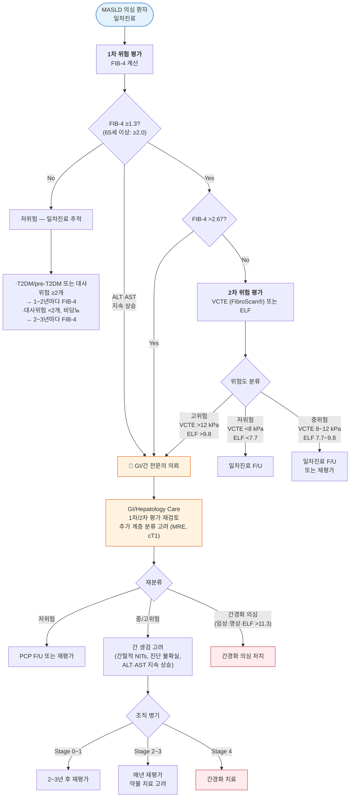

# 대사이상지방간질환 MASLD (구: 비알코올성 지방간질환 NAFLD)

## <mark style="color:green;">일반 사항</mark>


**용어 변경 안내** : 2023년 국제 다학회 델파이 합의에 따라 NAFLD → **MASLD**, NASH → **MASH**로 명칭이 변경되었다. 대한간학회도 2025년 **대사이상지방간질환(MASLD) 진료 가이드라인**을 발표하였다. 본 챕터는 신규 용어를 기준으로 기술하되, 구 용어를 병기한다.


* **MASLD** (Metabolic dysfunction-Associated Steatotic Liver Disease, 대사이상지방간질환) : 간 내 지방증(steatosis)이 존재하면서 아래 대사이상 위험 인자 중 **1개 이상**을 충족하고, 유의한 음주·약인성·바이러스 간염 등 이차 원인이 배제된 경우; 구(舊) NAFLD에 해당
* 기존 NAFLD는 음주 여부에 따른 **배제 진단**이었으나, MASLD는 대사 이상을 기반으로 한 **양성(positive) 진단 기준**으로 전환됨
* 만성 간질환의 가장 흔한 원인이며 심혈관 질환·당뇨병·대사증후군·만성 콩팥병·악성 종양의 독립적 위험 인자
* 유병률 \[우리나라] : 33%(21∼44%); non-obesity 인구 중 19%(12∼27%); 연간 45명/1000명 발생

### <mark style="color:orange;">MASLD 진단 기준 (대사이상 위험 인자)</mark>

다음 중 **1개 이상** 충족:

<table><thead><tr><th width="80">번호</th><th width="260">기준</th><th>세부 내용</th></tr></thead><tbody><tr><td>①</td><td>과체중 / 비만</td><td>BMI ≥25 kg/m² (아시아인 ≥23 kg/m²), 또는 허리둘레 ≥94 cm (남) / ≥80 cm (여)</td></tr><tr><td>②</td><td>당 대사 이상</td><td>공복혈당 ≥100 mg/dL, 또는 T2DM, 또는 HbA1c ≥5.7%</td></tr><tr><td>③</td><td>고혈압</td><td>BP ≥130/85 mmHg 또는 항고혈압제 복용 중</td></tr><tr><td>④</td><td>고중성지방혈증</td><td>TG ≥150 mg/dL 또는 지질 강하제 복용 중</td></tr><tr><td>⑤</td><td>저HDL혈증</td><td>HDL-C &lt;40 mg/dL (남) / &lt;50 mg/dL (여), 또는 지질 강하제 복용 중</td></tr></tbody></table>

### <mark style="color:orange;">관련 용어 및 새로운 분류 체계 (2023 다학회 합의)</mark>

<table><thead><tr><th width="190">명칭</th><th width="120">구 명칭</th><th>정의</th></tr></thead><tbody><tr><td><strong>SLD</strong> (Steatotic Liver Disease)</td><td>지방간질환</td><td>원인 불문 간 지방증을 포괄하는 상위 개념</td></tr><tr><td><strong>MASLD</strong></td><td>NAFLD</td><td>간 지방증 + 대사이상 위험 인자 ≥1개; 음주 없거나 경미한 경우</td></tr><tr><td><strong>MASH</strong></td><td>NASH</td><td>MASLD의 진행형; 간세포 손상·염증·섬유화 동반</td></tr><tr><td><strong>Met-ALD</strong></td><td>(신규)</td><td>MASLD 기준 충족 + 중등도 음주 (남 140∼350 g/주, 여 70∼140 g/주)</td></tr><tr><td><strong>ALD</strong></td><td>알코올간질환</td><td>유의한 음주가 주원인; 대사이상 기준 미충족 가능</td></tr></tbody></table>


**알코올 섭취 상한** \[AASLD]: 순수 알코올 기준 남 &lt;210 g/주(소주 약 4병), 여 &lt;140 g/주 (≈ 남 30 g/d, 여 20 g/d). 이 기준 이상은 ALD로 분류.


### <mark style="color:orange;">자연 경과</mark>

* 단순 지방증(MASL)의 대부분은 가역적이며 양호한 경과
* **MASH**에서 간섬유화가 빠르게 진행 (약 ⅓이 5년 내 간섬유화 진행)
* 일부에서 간경변증 → 간세포암종(HCC) 등 말기 간질환으로 진행
* 사망률 증가 : **심혈관 질환**(가장 흔한 사망 원인), 간질환 관련 사망, 비간성 악성 종양(대장암 등)


**MASLD의 장기 예후를 가장 잘 예측하는 인자는 ALT 수치가 아니라 간섬유화 정도(fibrosis stage)이다.**\
ALT가 정상이어도 진행성 섬유화가 존재할 수 있으며, 치료 결정은 ALT보다 fibrosis risk 중심으로 이루어져야 한다. (Management 섹션의 섬유화 단계별 전략 참고)


### <mark style="color:orange;">Lean MASLD (비비만형 MASLD)</mark>

* **BMI 정상**임에도 내장지방(visceral adiposity) 증가와 인슐린 저항성을 기반으로 발생하는 MASLD
* **아시아인에서 특히 흔함** — 국내 non-obesity 인구 중 유병률 약 19%
* 체중이 정상이므로 대사 위험이 낮아 보여 간과되기 쉬우나, 섬유화 진행 가능
* 허리둘레·체지방률·당 대사 이상 평가가 중요; 비만 지표보다 대사 위험 지표 중심으로 평가
* **근감소증(sarcopenia) 동반 빈도 높음** — 특히 아시아 고령 환자에서; lean MASLD + sarcopenia 동반 시 예후 더 불량
  * 일차진료에서 손쉬운 근감소증 선별 : **악력(handgrip strength)** 측정(남 &lt;28 kg, 여 &lt;18 kg 이하 시 의심) 또는 **SARC-F 설문** (5문항, ≥4점 시 근감소 가능성)
* 체중 감량 시 근육량 감소가 동반되지 않도록 **고단백 식단(1.2∼1.5 g/kg/d)과 저항운동(근력 운동)을 반드시 병행**; 단순 칼로리 제한만으로는 예후 악화 가능

***

## <mark style="color:green;">원인 및 위험 인자</mark>

* **대사 질환** : 비만(특히 복부 비만), 인슐린 저항성, 2형 당뇨병, 이상지질혈증(TG↑·HDL↓), 고혈압
* **기타 전신 질환** : 심혈관 질환, 만성 신질환, 갑상선기능저하증, 뇌하수체기능저하증, 성선기능저하증, **폐쇄수면무호흡증(OSA)**, 다낭성난소증후군(PCOS), 건선


**🔔 OSA 문진 팁**: MASLD 환자 진료 시 "코골이가 심한가요?" "낮에 자주 졸리거나 피로하신가요?"를 루틴으로 확인할 것. OSA는 간 내 산화 스트레스와 인슐린 저항성을 악화시켜 MASLD 진행에 기여한다. 의심 시 수면 검사(PSG) 의뢰.

* **식이·생활 습관** : 과당·청량음료 과다 섭취, 단백질 섭취 부족, 급격한 체중 감량, 완전 비경구영양(TPN), 흡연
* **약물** : 스테로이드, tamoxifen, methotrexate, valproic acid, 화학요법제, nucleos(t)ide analogue
* **수술 후** : 췌장-십이지장 절제, 비만대사수술 후 (일시적)

***

## <mark style="color:green;">임상 양상</mark>

* **~90%에서 무증상** ; 건강검진 시 간효소 상승 또는 초음파 지방간 소견으로 우연 발견
* 피로감, 우상복부 불쾌감/압통
* 비만, 대사증후군 소견 동반 빈번

### <mark style="color:$danger;">🚩 Red Flags!</mark>

<mark style="color:$danger;">**즉각 조치 또는 전문의 이송**</mark>

* 복수, 황달, 간성 뇌증(지남력 저하·혼돈) — 간부전 또는 간경변 비대상화 징후
* 토혈·혈변 (정맥류 출혈 의심)
* 빠른 ALT/AST 상승 (정상 상한의 10배 이상) 또는 프로트롬빈시간 연장

<mark style="color:$warning;">**당일 또는 조기 전문의 의뢰**</mark>

* FIB-4 &gt;2.67 — advanced fibrosis 고위험; **전문의 의뢰 고려** (즉각 의뢰는 임상 상황에 따라 판단)
* **비장비대(splenomegaly) 또는 혈소판 감소(&lt;150,000/μL) 동반 시 — FIB-4 수치와 무관하게 즉시 전문의 의뢰** (진행성 문맥 고혈압 시사)
* AFP 상승 + 영상검사에서 간내 결절
* 체중 감량 없이 지속적인 ALT 악화 (6개월 이상)

<mark style="color:$info;">**외래 추적 / 추가 평가 계획**</mark> <mark style="color:$info;">— 즉각 위험 낮으나 호전 없으면 의뢰</mark>

* FIB-4 1.3∼2.67 (중간 위험) — 2차 위험 평가(VCTE/ELF) 시행
* 간효소 지속 상승 6개월 이상에도 원인 불명확
* T2DM 환자에서 MASLD 동반, 정기 섬유화 평가 미시행
* 생활습관 중재 6개월 후 간효소 개선 없는 경우

***

## <mark style="color:green;">진단</mark>

### <mark style="color:orange;">실험실 검사</mark>

* **ALT↑, AST↑** (AST/ALT ratio &lt;1 이 전형적; 섬유화·경화 진행 시 &gt;1로 역전)
  * 간 효소 수치와 섬유화 중증도는 상관 없음 — MASH에서도 정상 가능
* ferritin↑(1.5배), ALP↑(2∼3배), bilirubin↑
* cholesterol/LDL/TG↑, HDL-C↓
* s-albumin, PLT : 진행된 섬유화·경화 시 감소

**지방증 예측 패널**

* [Fatty Liver Index (FLI)](https://www.mdapp.co/fatty-liver-index-fli-calculator-356/) · [NAFLD Liver Fat Score (NLFS)](https://www.mdapp.co/non-alcoholic-fatty-liver-disease-liver-fat-score-nafld-lfs-calculator-358/) · [Hepatic Steatosis Index (HSI)](https://www.mdapp.co/hepatic-steatosis-index-hsi-calculator-357/)

<table><thead><tr><th width="80">지표</th><th width="360">계산법</th><th width="110">Cut-off</th><th>기준 검사</th></tr></thead><tbody><tr><td><strong>FLI</strong></td><td>eˣ / (1 + eˣ) × 100</td><td>≥60 (양성), &lt;30 (음성)</td><td>복부 초음파</td></tr><tr><td><strong>NLFS</strong></td><td>-2.89 + 1.18 × MetS + 0.45 × DM + 0.15 × insulin + 0.04 × AST + 0.94 × AST/ALT</td><td>&gt; -0.64</td><td>MR spectroscopy</td></tr><tr><td><strong>HSI</strong></td><td>8 × ALT/AST ratio + BMI (+2 if DM; +2 if 여성)</td><td>≥36 (양성), &lt;30 (음성)</td><td>복부 초음파</td></tr></tbody></table>

χ = 0.953 × logₑ(TG) + 0.139 × BMI + 0.718 × logₑ(γ-GTP) + 0.053 × 허리둘레(cm) − 15.745\
*Ref. 대한간학회 비알코올지방간질환 진료 가이드라인 2021, 표 4.*

**MASH 시사 소견**

* 간 효소 수치 상승 (정상 상한의 3∼4배 미만); MASH resolution without worsening fibrosis가 치료 반응의 핵심 지표
* MASH 염증 지표 참고 : leptin↑, adiponectin↓, CRP↑, cytokeratin-18 fragment↑
* 감별 검사 (다른 만성 간질환 배제) : 셀리악병, α₁-antitrypsin, iron/ferritin, copper, HAV IgG, HBsAg, HCV Ab, smooth muscle Ab, ANA, gammaglobulin

### <mark style="color:orange;">섬유화 비침습적 평가 (Noninvasive Tests, NITs)</mark>

**FIB-4 (Fibrosis-4 index)** — 1차 선별 도구 \[AASLD, 대한간학회]

$$\text{FIB-4} = \frac{\text{연령(세)} \times \text{AST(U/L)}}{\text{혈소판(10}^9\text{/L)} \times \sqrt{\text{ALT(U/L)}}}$$

▶ [FIB-4 온라인 계산기](https://www.mdcalc.com/calc/2200/fibrosis-4-fib-4-index-liver-fibrosis)

<table><thead><tr><th width="190">FIB-4 값</th><th width="170">위험도</th><th>권고 조치</th></tr></thead><tbody><tr><td>&lt;1.3 (65세 이상: &lt;2.0)</td><td>저위험 (F0–F1)</td><td>일차진료에서 주기적 추적</td></tr><tr><td>1.3∼2.67</td><td>중간위험 (불확실)</td><td>2차 NITs (VCTE 또는 ELF) 시행</td></tr><tr><td>&gt;2.67</td><td>고위험 (F2–F4 의심)</td><td>전문의 의뢰 고려</td></tr></tbody></table>


**연령 보정** \[AASLD 2024]: 65세 이상에서는 연령에 따른 FIB-4 상승으로 위양성이 많으므로, 저위험 컷오프를 **&lt;2.0**으로 올려 적용한다.


**VCTE (Vibration-Controlled Transient Elastography, FibroScan®) · ELF · MRE**

<table><thead><tr><th width="100">위험도</th><th width="220">VCTE (간 경직도, kPa)</th><th width="200">ELF 점수</th><th>비고</th></tr></thead><tbody><tr><td>저위험</td><td>&lt;8.0 kPa</td><td>&lt;7.7</td><td>일차진료 F/U</td></tr><tr><td>중위험</td><td>8∼12 kPa</td><td>7.7∼9.8</td><td>추적 또는 의뢰</td></tr><tr><td>고위험</td><td>&gt;12 kPa</td><td>&gt;9.8</td><td>전문의 의뢰</td></tr><tr><td>간경화 의심</td><td>—</td><td>&gt;11.3</td><td>즉시 의뢰</td></tr></tbody></table>


**국내 접근성 참고**: 국내에서는 ELF 검사 접근성이 제한적이므로 **VCTE(FibroScan®)** 활용 빈도가 높다. MRE(MR elastography)는 advanced fibrosis 평가 정확도가 매우 높으나 비용·접근성의 제한이 있다. cT1(corrected T1 MRI)도 고위험 환자 계층 분류에 활용 가능하다.


### <mark style="color:orange;">영상 검사</mark>

* **복부 초음파** (1차 선택) — 지방증 선별에 적합; 섬유화 정도 평가 한계
* **CT** — 지방증 정량화 가능; 방사선 노출 제한
* **MRI/MR spectroscopy** — 지방증 정량화 가장 정확; MRI-PDFF ≥6.4% 시 지방증 진단 \[AASLD 2024]
* **MRE (MR elastography)** — 간 경직도 정량화; 비만 환자에서도 VCTE보다 정확도 우수; 비용·접근성 제한
* **FibroScan®** (VCTE) — 간 섬유화·경직도 측정의 1차 도구; BMI 높은 경우 XL probe 사용

### <mark style="color:orange;">간 조직 검사</mark>

* 비침습적 평가로 진단 불확실하거나 다른 원인 간질환 배제 필요 시 고려
* MASH 또는 진행성 간섬유화(≥F2)가 의심되는 환자
* MASLD 치료 약제(resmetirom) 적용 여부 결정에 활용 가능; 단, 처방 시 조직검사가 필수는 아님 \[AASLD 2024]

### <mark style="color:orange;">경미한 간효소 상승 감별</mark>

ALT·AST가 정상 상한의 &lt;5배로 상승된 경우:

#### <mark style="color:$primary;">원인 감별</mark>

* **간성 원인** : MASLD·ALD(가장 흔함), 약물/herb, B형·C형 간염, 유전성 혈색소증, alpha₁-antitrypsin 결핍, 자가면역 간염, Wilson disease
* **간외 원인** : 갑상선 이상, celiac sprue, 용혈, 근육 질환(AST 단독 상승 多)

#### <mark style="color:$primary;">감별 진단 검사</mark>

* HBsAg, HCV Ab
* CBC, PLT, s-albumin, iron·TIBC·ferritin
* 대사증후군/인슐린 저항성 : 허리둘레, BP, 지질, 혈당, HbA1c
* 복부 초음파


**ALD vs MASLD 감별 도구 — ANI (Alcoholic Liver Disease/NAFLD Index)**\
연령·BMI·AST/ALT ratio·MCV를 이용해 알코올간질환과 MASLD를 통계적으로 감별하는 도구.\
✽ [Mayo Clinic ANI 계산기](https://www.mayoclinic.org/medical-professionals/transplant-medicine/calculators/the-alcoholic-liver-disease-nonalcoholic-fatty-liver-disease-index-ani/itt-20434726) — 음주력이 불명확한 경우 유용.


**MASLD와 알코올간질환 비교**

<table><thead><tr><th width="160">항목</th><th width="200">MASLD</th><th>알코올간질환</th></tr></thead><tbody><tr><td><strong>체중</strong></td><td>증가</td><td>다양</td></tr><tr><td><strong>혈당/HbA1c</strong></td><td>증가</td><td>정상</td></tr><tr><td><strong>알코올 섭취량</strong></td><td>남 &lt;30 g/d, 여 &lt;20 g/d</td><td>남 &gt;30 g/d, 여 &gt;20 g/d</td></tr><tr><td><strong>AST</strong></td><td>정상~경미한 상승</td><td>증가</td></tr><tr><td><strong>ALT</strong></td><td>증가 또는 정상</td><td>증가 또는 정상</td></tr><tr><td><strong>AST/ALT ratio</strong></td><td>&lt;0.8 (섬유화 진행 시 &gt;0.8)</td><td>&gt;1.5</td></tr><tr><td><strong>GGT</strong></td><td>증가 또는 정상</td><td>상당히 증가</td></tr><tr><td><strong>TG</strong></td><td>증가</td><td>다양</td></tr><tr><td><strong>HDL-C</strong></td><td>감소</td><td>증가 (급성 음주 시)</td></tr></tbody></table>

*Ref. Non-alcoholic fatty liver disease. BMJ 2014;349.*

### <mark style="color:orange;">선별 검사</mark>

\[대한간학회 2025]

* **필수 대상** : 지속적 간효소 수치 상승, 또는 당뇨병 환자
* **고려 대상** : 대사증후군, 비만, MASLD 발생 위험 인자 보유자
* **방법** : 복부 초음파(1차) → MASLD 의심 시 FIB-4 계산 → 추가 평가 고려(CT, MRI, VCTE, ELF)

\[AASLD 2024]

* T2DM, 복잡한 비만, 간경화 가족력, 중등도 이상 음주자 : advanced fibrosis 선별 필수
* MASLD 확인 시 T2DM 선별 검사 시행
* 지방증 또는 임상적으로 MASLD 의심 시 **FIB-4로 1차 위험 평가** 시행
* MASLD 환자는 주요 사망 원인이 간외 악성 종양이므로 연령에 따른 암 검진 권고

***



<p align="center"><strong>지방간질환 의심 환자 위험 평가 알고리듬</strong></p>

<p align="center"><em><mark style="color:$info;">Ref. AASLD Practice Guidance on the Clinical Assessment and Management of NAFLD, 2023; 대한간학회 MASLD 진료 가이드라인, 2025.</mark></em></p>

***

## <mark style="background-color:yellow;">Management</mark>


**일차진료 초압축 임상 흐름**

지방간 발견 → FIB-4 계산\
→ **&lt;1.3 (65세 이상 &lt;2.0)** : 생활습관 중재 + 정기 추적\
→ **1.3∼2.67** : FibroScan® / ELF로 2차 평가\
→ **&gt;2.67** 또는 VCTE &gt;12 kPa : 간 전문의 의뢰


### <mark style="color:orange;">섬유화 단계별 치료 전략</mark>

<table><thead><tr><th width="140">섬유화 단계</th><th width="170">대표 상태</th><th width="230">핵심 치료 전략</th><th>우선 고려 약제 / 포인트</th></tr></thead><tbody><tr><td><strong>F0–F1</strong><br>(저위험)</td><td>단순 지방증(MASL)<br>초기 MASH</td><td>생활습관 중재 중심<br>심혈관 위험 감소</td><td>· 체중 감량(≥7%)<br>· 운동·지중해식 식단<br>· statin 적극 사용 가능<br>· 비만/T2DM 동반 시 GLP-1 RA 고려</td></tr><tr><td><strong>F2</strong><br>(significant fibrosis)</td><td>진행 위험 증가</td><td>질병 진행 억제 목표<br>적극적 약물 치료 고려</td><td>· <strong>Resmetirom</strong> 고려 (국내 미승인)<br>· GLP-1 RA / tirzepatide<br>· T2DM 동반 시 pioglitazone<br>· ≥10% 체중 감량 목표</td></tr><tr><td><strong>F3</strong><br>(advanced fibrosis)</td><td>간경변 전단계</td><td>간 관련 사건 예방<br>전문의 공동 관리</td><td>· Resmetirom 우선 고려 (국내 미승인)<br>· GLP-1 RA + 대사 위험 교정<br>· 금주<br>· 정기 VCTE/ELF 추적</td></tr><tr><td><strong>F4</strong><br>(간경변)</td><td>보상성/비보상성 간경변</td><td>합병증 예방 및 감시</td><td>· HCC 감시 (US ± AFP, 6개월마다)<br>· 정맥류 평가<br>· 간이식 평가 고려<br>· 간독성 약물 주의</td></tr></tbody></table>


**MASLD의 장기 예후를 가장 잘 예측하는 인자는 ALT 수치가 아니라 간섬유화 정도(fibrosis stage)이다.**


### <mark style="color:orange;">모든 환자 공통 적용</mark>

* 심장 대사 위험 감소 및 MASLD에 유익한 약물 치료 선택
* 지속적인 음주 평가
* 생활 습관 중재 (식이, 운동, 체중 감량)

***

## <mark style="color:green;">비-약물 치료 및 예방</mark>

### <mark style="color:orange;">체중 감량 목표와 기대 효과</mark>

<table><thead><tr><th width="160">체중 감량</th><th>기대 효과</th></tr></thead><tbody><tr><td><strong>3∼5%</strong></td><td>간 지방(steatosis) 감소, ALT·AST 경미한 개선</td></tr><tr><td><strong>≥7%</strong></td><td><strong>MASH 개선</strong> (MASH resolution without worsening fibrosis 가능)</td></tr><tr><td><strong>≥10%</strong></td><td><strong>간섬유화 개선 가능</strong>, MASH resolution 가능성 증가</td></tr><tr><td><strong>≥15%</strong></td><td>고도 비만 환자에서 대사 이상 현저한 개선, T2DM remission 가능성 증가</td></tr></tbody></table>


급격한 체중 감량(&gt;1.5∼1.6 kg/주)은 오히려 간 염증 및 섬유화를 악화시킬 수 있으므로 피한다. 점진적 감량(≤1 kg/주)을 권장.


* **식이 조절** : 총 칼로리 제한이 구성 비율보다 중요; 포화지방·트랜스지방·단순 탄수화물 제한; **지중해식 식단** 권고 (☞ 비만 챕터)
* **음주 제한** : 남 ≤2 SD/d, 여 ≤1 SD/d; 정기 음주량 평가; ≥F2 섬유화 시 **금주** 권고 (☞ 알코올 챕터)
* **운동** : 중등 강도 유산소 운동(빠른 걷기, 고정 자전거) + 근력 운동; 3∼5회/주, 20∼45분/회 (150∼200분/주)
* **간독성 약물 주의** : 다약제 복용·건강보조식품 확인; 처방 불필요한 간독성 약물 중단 고려


**☕ Coffee Pearl**: 커피 섭취(블랙 기준 약 2∼3잔/일)는 간섬유화 및 HCC 위험 감소와 일관되게 연관된다. 설탕·시럽 첨가 음료 대신 블랙커피를 권장할 수 있다.


***

## <mark style="color:green;">약물 치료</mark>

* **적응증** : 유의한 섬유화(≥F2 stage) 동반 MASH, 질병 진행 위험이 높은 환자 (T2DM·대사증후군·지속적 ALT 상승·고도 괴사염증)
  * ALT 정상이어도 섬유화(F2 이상)가 의심되면 추가 평가 및 약물 치료 고려; **치료 결정은 ALT보다 fibrosis risk를 기준으로 한다**
* **치료 반응 평가** : ALT 단독보다 **체중 변화·대사 지표·비침습적 섬유화 지표(FIB-4, VCTE)를 종합**하여 평가; 치료 효과 불충분 시 약제 변경 또는 중단 고려

### <mark style="color:orange;">Phenotype-based 치료 접근</mark>

MASLD는 다양한 대사 표현형(phenotype)이 겹쳐진 질환군이므로, "지방간 자체"보다 **우세 phenotype**을 기준으로 치료 접근하는 것이 효과적이다.

<table><thead><tr><th width="175">주요 Phenotype</th><th width="210">특징</th><th width="240">핵심 치료 전략</th><th>우선 고려 약제</th></tr></thead><tbody><tr><td><strong>비만형</strong><br>(Obesity-dominant)</td><td>복부비만, 과식·과당, 수면무호흡 동반</td><td>체중 감량 중심<br>visceral fat 감소</td><td>· GLP-1 RA / tirzepatide<br>· 지중해식 식단<br>· ≥10% 체중 감량 목표</td></tr><tr><td><strong>당뇨/인슐린 저항성형</strong></td><td>T2DM, 고인슐린혈증<br>TG↑ HDL↓</td><td>인슐린 저항성 개선<br>심혈관 위험 감소</td><td>· pioglitazone<br>· GLP-1 RA<br>· SGLT-2 억제제</td></tr><tr><td><strong>섬유화 진행형</strong><br>(F2–F3)</td><td>PLT 감소, AST/ALT ratio↑</td><td>간 관련 사건 예방<br>섬유화 억제</td><td>· resmetirom (국내 미승인)<br>· 전문의 공동 관리</td></tr><tr><td><strong>비비만형</strong><br>(Lean MASLD)</td><td>BMI 정상, visceral adiposity<br>아시아인에서 흔함<br>근감소증 동반 빈도 높음</td><td>체중보다 대사 위험 교정<br>근감소증 평가 필수</td><td>· 저항운동 + 고단백 식이 병행<br>· 악력 / SARC-F 로 근감소 선별<br>· fibrosis 적극 평가<br>· 단순 칼로리 제한만 금물</td></tr><tr><td><strong>심혈관 위험형</strong></td><td>ASCVD 위험 높음<br>고TG·저HDL·고혈압</td><td>심혈관 사건 예방 우선</td><td>· statin 적극 사용<br>· SGLT-2 억제제<br>· BP·lipid 강력 조절</td></tr><tr><td><strong>근감소형</strong><br>(Sarcopenic MASLD)</td><td>고령, 근육량 감소, frailty<br>악력↓ (남 &lt;28 kg, 여 &lt;18 kg)<br>SARC-F ≥4점</td><td>근육 보존 중심<br>과도한 칼로리 제한 피함</td><td>· 저항운동(resistance exercise) 우선<br>· 고단백 식이 (1.2∼1.5 g/kg/d)<br>· 악력 / SARC-F 정기 모니터링<br>· 필요 시 재활의학과 협진</td></tr></tbody></table>


동일한 MASLD라도 실제 임상 양상은 매우 이질적이다. **우세 phenotype 기반 접근**이 실제 예후 개선에 더 중요하다.


### <mark style="color:orange;">MASH 치료제 (섬유화 개선 목적)</mark>

#### <mark style="color:$primary;">Resmetirom (THR-β 작용제) — 최초 승인 MASH 치료제</mark>


**resmetirom** <mark style="color:blue;">\[Rezdiffra]</mark> : 2024년 3월 14일 FDA 가속 승인 — 비간경화 성인 MASH + **F2∼F3 섬유화**에 대한 세계 최초 승인 약제 (THR-β 선택적 작용제).\
**⚠️ F4 (간경변증)에서는 현재 적응증 없음** — 실제 임상에서 흔한 혼동 주의.\
**⚠️ 국내(식약처) 미승인** (2025년 기준); 국내 임상 도입 추이 지속 주시 필요.


* **작용 기전** : 간 선택적 THR-β 활성화 → 간 내 지질 산화 촉진, 지방 합성 억제 → 간 지방증·섬유화 개선
* **MAESTRO-NASH 3상 (NEJM 2024;390:497)** :
  * MASH resolution without worsening fibrosis : 위약 10% vs 80 mg 26%, 100 mg 30%
  * 섬유화 1단계 이상 개선 (MASH 악화 없이) : 위약 14% vs 80 mg 24%, 100 mg 26%
  * 주요 부작용 : 설사·오심(경증·일시적), LDL-C 감소(유익)
* **적용 조건** \[AASLD 2024] : 비침습적 평가(NITs)로 MASH + F2∼F3 확인 또는 강하게 의심되는 **비간경화(noncirrhotic) 성인**; 조직검사 필수 아님

### <mark style="color:orange;">인슐린 저항성 개선제 (Insulin Sensitizer)</mark>

#### <mark style="color:$primary;">Pioglitazone (TZD 계열)</mark>

* **T2DM 또는 비당뇨 MASH(≥F2) 환자**에서 간 조직 소견 개선 (ALT 감소, 지방증·염증 호전) \[AASLD, 대한간학회]
* 용량 : 30∼45 mg/d
* 주의사항 : 체중 증가, 부종, 심부전 악화 위험; 방광암 가족력·기왕력 시 주의; **골다공증 위험이 높은 고령 여성에서 골절 위험 증가 — 골밀도 평가 병행 고려**
* **비당뇨 MASH 환자에서도 사용 가능** (off-label); T2DM 동반 시 1차 고려 약제

#### <mark style="color:$primary;">Metformin</mark>

* ALT 또는 간 조직 개선 효과 없음 — **MASH 치료제로 권고하지 않음** \[AASLD, 대한간학회]
* 단, T2DM 동반 시 혈당 조절 목적으로 병용 가능

### <mark style="color:orange;">GLP-1 수용체 작용제 (GLP-1 RA)</mark>

#### <mark style="color:$primary;">Semaglutide</mark>

* **T2DM 또는 비만 동반 MASLD/MASH** 환자에서 권고 \[AASLD]
* NASH 4b상 (NEJM 2021) : MASH resolution without worsening fibrosis 59% vs 위약 17%; 단, 섬유화 개선은 통계적 유의성 미달
* SC 제제 <mark style="color:blue;">\[오젬픽]</mark> (0.25→0.5→1 mg/주 단계 증량) / 고용량 비만치료 <mark style="color:blue;">\[위고비]</mark> (최대 2.4 mg/주)
* 경구 제제 <mark style="color:blue;">\[리벨서스]</mark> (7, 14 mg): MASLD 간 조직 개선 데이터 제한적

#### <mark style="color:$primary;">Tirzepatide (GLP-1/GIP 이중 작용제)</mark>

* SYNERGY-NASH 3상 (2024) : MASH resolution tirzepatide 10 mg **62%** vs 위약 10% (통계적 유의)
* <mark style="color:blue;">\[마운자로]</mark> (T2DM), <mark style="color:blue;">\[젭바운드]</mark> (비만) — **현재 MASH 적응증 미승인(국내·미국 모두); 임상시험 단계로 적응증 허가 절차 진행 중**


GLP-1 RA는 T2DM·비만 동반 MASLD 환자에서 혈당 조절·체중 감량·간 조직 개선을 동시에 기대할 수 있어 가장 유망한 약제군으로 부상하고 있다.


### <mark style="color:orange;">SGLT-2 억제제</mark>

* 간 지방증·ALT 개선 효과 소규모 RCT에서 보고; 간 섬유화 개선 대규모 증거는 아직 부족
* T2DM + MASLD 환자에서 혈당 조절과 함께 간 보호 효과 기대; T2DM 가이드라인에서 MASLD 동반 시 선호 약제 \[ESC/EASD]
* (☞ 당뇨병 챕터)

### <mark style="color:orange;">고용량 Vitamin E</mark>

* **비당뇨, 비간경화 성인 MASH 환자**에서 간 조직 소견 개선 \[AASLD]
* 용량 : **800 IU/d** (dl-alpha-tocopherol)


⚠️ **T2DM 환자에게는 투여하지 않는다** \[AASLD] — 당뇨 환자에서 Vitamin E 사용은 MASH 치료 적응증 밖이며 오처방 위험에 주의.\
⚠️ 장기 투여 시 남성 **전립선암 위험 증가** 논란 — PSA 정기 모니터링 권고.\
⚠️ 항응고제 병용 시 **출혈 위험 증가** — INR 모니터링 필요.


### <mark style="color:orange;">지질 강하제</mark>

* **Statin** : 이상지질혈증 동반 시 CVD 위험 감소 목적으로 권고; MASH 자체 치료제로는 권고 안 함 (간 조직 개선 효과 없음); MASLD에서 간독성은 매우 드물며 **안전하게 사용 가능** \[AASLD]; 진행 간질환(간경변)에서는 간기능·용량 모니터링을 하며 신중 사용 (최근 portal hypertension 감소 가능성도 일부 보고됨)
* **Omega-3, icosapent ethyl, fibrate** : 고중성지방혈증 동반 시 생활습관 중재와 병용 가능

### <mark style="color:orange;">간장질환용제</mark>

* **UDCA, silymarin** : 간 조직의 유의미한 개선 없음 — **MASH 치료제로 사용하지 않음** \[AASLD, 대한간학회]; 국내에서는 관행적으로 사용되나 guideline-level evidence 부족

***

## <mark style="color:green;">추적 관리</mark>

* **간기능 검사(LFT)** : 매년
* **초음파 또는 CT** : 경과 관찰 목적으로 고려
* **FIB-4 재평가** \[AASLD]:
  * T2DM/pre-T2DM 또는 대사위험 ≥2개 → **1∼2년마다**
  * 대사위험 &lt;2개, 비당뇨 → **2∼3년마다**
* **조직 검사** : 섬유화 진행 의심 시 5년마다 고려
* **HCC 감시** :
  * **간경변증(F4) 동반 시** : AFP + 복부 초음파 **6개월마다** (필수)
  * **비간경화 MASH 고위험군** (≥F3 진행성 섬유화, 고령, HCC 가족력, 특정 유전 위험인자 등) : HCC 감시를 **고려** \[대한간학회 2025]; 주치의 판단 하에 개별화

***

### <mark style="color:red;">질병코드</mark>

* **K76.0** 지방간 (fatty liver, steatosis) — MASLD에 흔히 사용
* **K75.81** 지방간염 (MASH/NASH)

#### <mark style="color:$primary;">\[보험기준] 지방간 관련 약제</mark>

* **간장용제 (UDCA 등)** : 지방간에 대한 보험 급여 적응증 없음 (적응증 외 처방 시 자비 부담)
* **Pioglitazone** : T2DM 동반 시 혈당 조절 목적으로 급여; 비당뇨 MASH에 단독 사용 시 보험 인정 안 됨
* **GLP-1 RA(semaglutide 등)** : T2DM 급여 기준 또는 비만 급여 기준에 따라 적용 (MASH 단독은 적용 안 됨)
* **Vitamin E (고용량)** : 비급여

***

## <mark style="color:purple;">처방례</mark>

> **처방례 1. 비당뇨 MASH — 생활습관 중재 + Vitamin E (F2 이상, 비간경화)**
>
> ```
> Vitamin E 400 IU (dl-alpha-tocopherol) 2정　1일 1회 식후 (800 IU/d)
> ```
>
> *✽비당뇨·비간경화 성인 조직학적 MASH 환자에서 MASH resolution without worsening fibrosis 근거 있음. **⚠️ T2DM 환자에게는 투여하지 않는다 \[AASLD].** 남성 장기 투여 시 전립선암 위험 증가 논란 — PSA 모니터링 고려. 항응고제 병용 시 출혈 위험 주의.*

> **처방례 2. MASLD + T2DM — Pioglitazone 기반**
>
> ```
> pioglitazone HCl 15 mg [액토스] 1정　1일 1회 식후 (30 mg으로 증량 가능)
> ```
>
> *✽T2DM 동반 MASH에서 간 조직 개선 근거. 부종·체중 증가 주의; 심부전·방광암 기왕력 시 피함. **골다공증 위험이 높은 고령 여성에서는 골절 위험 증가 — 신중 사용 및 골밀도 평가 고려.** 간기능(ALT·AST), 체중, 부종 3개월마다 추적.*

> **처방례 3. MASLD + T2DM + 비만 — GLP-1 RA 기반**
>
> ```
> semaglutide 0.25 mg/dose [오젬픽] 주사　주 1회 피하 주사
> (4주 후 0.5 mg, 필요 시 1 mg으로 단계 증량)
> ```
>
> *✽T2DM·비만 동반 MASLD/MASH 환자에서 혈당 조절·체중 감량·간 조직 개선 효과(MASH resolution without worsening fibrosis 59%). 오심·구토 초기 흔함. 췌장염·갑상선 수질암 기왕력 주의.*

> **처방례 4. MASLD + 이상지질혈증 — CVD 위험 감소**
>
> ```
> rosuvastatin 10 mg [크레스토] 1정　1일 1회 저녁 식후
> ```
>
> *✽CVD 위험 감소 목적으로 MASLD + 이상지질혈증 환자에서 안전하게 사용 가능. MASH 자체 치료 효과는 없으나 간독성은 매우 드묾. 투여 4∼6주 후 LFT 확인; 정상 상한의 3배 이상 상승 시 감량 또는 중단.*

***

### <mark style="color:$success;">핵심 복약 지도</mark>

1. **생활습관 중재가 핵심입니다** — 체중의 7% 이상 감량 시 MASH 호전, 10% 이상 감량 시 섬유화 개선 가능. 어떤 약물도 생활습관 개선을 대체할 수 없습니다.
2. **Vitamin E 800 IU/d** : 매일 규칙적으로 복용하세요. 다른 Vitamin E 함유 건강보조식품과 중복 주의. 남성은 장기 복용 시 PSA(전립선 특이항원) 검사를 주기적으로 받으세요.
3. **Pioglitazone** : 서서히 체중 증가·발목 부종이 나타날 수 있습니다. 호흡 곤란이나 심한 부종이 발생하면 즉시 알려주세요. 식사와 무관하게 규칙적으로 복용합니다.
4. **GLP-1 RA (semaglutide 등)** : 처음에 오심·소화 불량이 생길 수 있습니다 — 소량씩 천천히 드시면 호전됩니다. 배꼽 주변 또는 허벅지에 자가 주사하며, 주사 부위를 매번 바꿔 주세요. 심한 복통이 지속되면 췌장염 가능성으로 즉시 내원하세요.
5. **Statin** : 저녁 식후 복용이 효과적입니다. 근육통 또는 진한 소변이 나타나면 중단 후 내원하세요. 지방간이 있다고 statin을 무조건 피할 필요는 없습니다.
6. **알코올은 엄격히 제한**하세요 — 간 섬유화가 있으면 금주가 필요합니다.
7. **정기적인 혈액 검사**(간기능, 혈당, 지질)와 영상 검사를 받으세요. 치료 중에는 임의로 약을 중단하지 마세요.

***

### <mark style="color:blue;">환자 안내서</mark>

#### <mark style="color:blue;">대사이상지방간질환(지방간)이란?</mark>

지방간은 간에 지방이 비정상적으로 쌓이는 상태입니다. 과체중, 당뇨병, 고중성지방혈증 등 대사 이상이 있을 때 잘 생깁니다. 대부분은 증상이 없어 검사에서 우연히 발견됩니다.

간에 염증까지 동반된 경우(대사이상지방간염, MASH)에는 간 섬유화(딱딱해지는 과정)로 진행될 수 있어 적극적인 관리가 필요합니다. 체형이 정상이어도 복부 지방이 많거나 혈당·지질 이상이 있으면 지방간이 생길 수 있습니다.

#### <mark style="color:blue;">왜 관리해야 하나요?</mark>

대부분의 단순 지방간은 생활습관 개선으로 좋아집니다. 그러나 방치하면 일부에서 간 섬유화 → 간경변 → 간암으로 진행할 수 있습니다. 또한 지방간 자체가 심혈관 질환(심근경색, 뇌졸중)의 위험을 높입니다.

#### <mark style="color:blue;">생활습관 개선 방법</mark>

**① 체중 감량이 가장 중요합니다**
* 현재 체중의 **7∼10%** 를 천천히 줄이는 것을 목표로 합니다.
* 극단적인 단식이나 급격한 다이어트는 오히려 간에 해롭습니다.
* 주 1 kg 이내의 점진적인 감량을 권장합니다.

**② 식이 요법**
* 총 칼로리를 줄이는 것이 핵심입니다.
* 과당이 많은 청량음료·과자·흰빵을 피하세요.
* 지중해식 식단(채소, 생선, 올리브오일, 통곡물)이 간 건강에 좋습니다.
* 포화지방(삼겹살, 버터 등)과 트랜스지방(쇼트닝, 패스트푸드)을 줄이세요.
* 블랙커피 2∼3잔/일은 간섬유화 위험을 낮추는 것과 연관이 있습니다.

**③ 규칙적인 운동**
* 빠르게 걷기·자전거 타기 같은 중등 강도 유산소 운동을 주 3∼5회, 하루 20∼45분 시행하세요.
* 근력 운동을 병행하면 더 효과적입니다.
* 앉아 있는 시간을 줄이는 것만으로도 도움이 됩니다.

**④ 알코올 제한**
* 간 손상이 진행된 경우(섬유화 F2 이상)에는 **금주**가 필요합니다.
* 그 외에도 음주량을 최소화하세요.

#### <mark style="color:blue;">정기 검진이 중요합니다</mark>

* 혈액 검사(간기능, 혈당, 지질): **매년**
* 복부 초음파: 의사 지시에 따라 시행
* 당뇨병이 있거나 위험 요인이 많은 경우에는 더 자주 검사가 필요합니다.

증상이 없다고 지방간을 방치하지 마세요. 꾸준한 관리가 합병증을 예방하는 가장 좋은 방법입니다.
