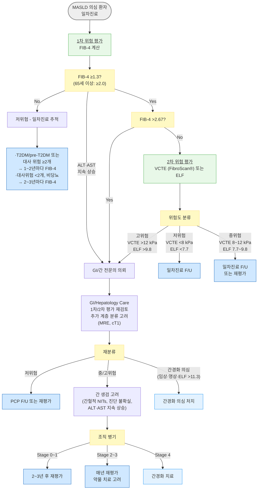

# 대사이상지방간질환 MASLD

## <mark style="color:green;">일반 사항</mark>

* MASLD (Metabolic dysfunction-Associated Steatotic Liver Disease, 대사이상지방간질환) : ⓵ 간 내 지방 침착(steatosis)이 있으면서 ⓶ 아래의 대사 이상 위험 인자 중 1개 이상이 있고, ⓷ 유의한 2차 원인-음주, 약물, 바이러스 간염 등-이 없음; 기존 NAFLD에 해당
  * 대사 이상 위험 인자&#x20;
    1. 과체중/비만 : BMI ≥25 ㎏/㎡ (아시안 ≥23 ㎏/㎡), 또는 허리둘레 ≥94 ㎝ (남) / ≥80 ㎝ (여)
    2. 당 대사 이상 : 공복혈당 ≥100 ㎎/㎗, 또는 T2DM, 또는 HbA1c ≥5.7%
    3. 고혈압 : BP ≥130/85 ㎜Hg 또는 항고혈압제 복용 중
    4. 고중성지방혈증 : TG ≥150 ㎎/㎗ 또는 지질 강하제 복용 중
    5. 저HDL 혈증 : HDL-C ＜40 ㎎/㎗ (남) / ＜50 ㎎/㎗ (여), 또는 지질 강하제 복용 중
  * 용어 변경 : 2023년 국제 다학회 델파이 합의에 따라 NAFLD → MASLD, NASH → MASH로 명칭이 변경됨. 대한간학회도 2025년 대사이상지방간질환(MASLD) 진료 가이드라인을 발표
* 기존 NAFLD는 음주 여부에 따른 배제 진단이었으나, MASLD는 대사 이상을 기반으로 한 양성(positive) 기준을 적용하는 진단으로 전환됨
* 만성 간질환의 가장 흔한 원인이며 심혈관 질환·당뇨병·대사증후군·만성 콩팥병·악성 종양의 독립적 위험 인자임
* 유병률 \[우리나라] : 33%(21∼44%); non-obesity 인구 중 19%(12∼27%); 연간 45명/1000명 발생

#### <mark style="color:$primary;">관련 용어 및 새로운 분류 체계</mark>

<table><thead><tr><th width="100.52630615234375">명칭</th><th width="120">이전 명칭</th><th>정의</th></tr></thead><tbody><tr><td><strong>SLD</strong></td><td>지방간질환</td><td>원인 불문 간 지방증을 포괄하는 상위 개념</td></tr><tr><td><strong>MASLD</strong></td><td>NAFLD</td><td>간 지방증 + 대사이상 위험 인자 ≥1개; 음주는 하지 않거나 경미</td></tr><tr><td><strong>MASH</strong></td><td>NASH</td><td>MASLD의 진행형; 간세포 손상·염증·섬유화 동반</td></tr><tr><td><strong>Met-ALD</strong></td><td>(신규)</td><td>MASLD 기준 충족 + 중등도 음주 (남 140∼350 g/주, 여 70∼140 g/주) (☞ <a href="../230_/189_-alcohol-use-disorder-aud.md">음주</a>)</td></tr><tr><td><strong>ALD</strong></td><td><a href="094_-alcoholic-liver-disease.md">알코올간질환</a></td><td>유의한 음주가 주원인; 대사이상 기준 미충족 가능</td></tr></tbody></table>

　SLD=Steatotic Liver Disease\
　MASLD=Metabolic dysfunction-Associated Steatotic Liver Disease\
　MASH=Metabolic dysfunction-associated steatohepatitis\
　Met-ALD=Metabolic dysfunction-associated and alcohol-related liver disease\
　NAFLD=Nonalcoholic Fatty Liver Disease\
　NASH=Metabolic dysfunction-Associated Steatohepatitis

#### <mark style="color:$primary;">자연 경과</mark>

1. **단순 지방간 (non-MASH MASLD)** : 대부분 가역적, 생활습관 개선으로 호전 가능, 일부에서 2. 로 진행 (비만·T2DM·고령 등 위험 인자 동반 시)
2. **MASH (대사이상지방간염)** : 약 ⅓에서 5년 내 간섬유화 1단계 이상 진행, 적극적 치료 시 역행(regression) 가능, 일부에서 3. 으로 진행
3. **간경변증 (F4)** : 문맥 고혈압 합병증 (정맥류 출혈·복수·간성뇌증), 간세포암종(HCC) 발생 위험; 6개월마다 감시, 간이식 평가 고려

* **사망 원인** : 초기 MASLD(F0∼F3)에서는 **심혈관 질환(1위)**이 가장 흔한 사망 원인; 간경변(F4) 이후에는 간 관련 사망 비중 증가; 비간성 악성 종양(대장암 등)은 전 병기에 걸쳐 위험; MASLD는 간 질환인 동시에 전신 심대사 질환으로 관리해야 함


**MASLD의 장기 예후를 가장 잘 예측하는 인자는** ALT 수치가 아니라 간섬유화 정도(fibrosis stage)임. ALT가 정상이어도 진행성 섬유화가 존재할 수 있으며, 치료 결정은 ALT보다 fibrosis risk 중심으로 이루어져야 함


#### <mark style="color:$primary;">Lean MASLD (비-비만형 MASLD)</mark>

* BMI가 정상임에도 내장지방 증가와 인슐린 저항성을 기반으로 발생한 MASLD
* 아시아인에서 특히 흔함; 국내 non-obesity 인구 중 유병률 약 19%
* 체중이 정상이므로 대사 위험이 낮아 보여 간과되기 쉬우나, 섬유화 진행 가능
* 허리둘레·체지방률·당 대사 이상 평가가 중요; 비만 지표보다 '대사 위험 지표' 중심으로 평가
* 근감소증(sarcopenia) 동반 빈도 높음 - 특히 아시아 고령 환자에서; lean MASLD + sarcopenia 동반 시 예후 더 불량
  * 근감소증 선별법 : 악력(handgrip strength) 측정(남 ＜28 ㎏, 여 ＜18 ㎏ 이하 시 의심) 또는 SARC-F 설문 (5문항, ≥4점 시 근감소 가능성) (☞ [고령 환자 진료](../231_/215_.md#undefined-9))
* 체중 감량 시 근육량 감소가 동반되지 않도록 고단백 식단(1.2∼1.5 g/㎏/d)과 저항운동(근력 운동)을 반드시 병행; 단순 칼로리 제한만으로는 예후 악화 가능

## <mark style="color:green;">원인 및 위험 인자</mark>

* 대사 질환 : 비만(특히 복부 비만), 인슐린 저항성, 2형 당뇨병, 이상지질혈증(TG↑·HDL↓), 고혈압
* 기타 전신 질환 : 심혈관 질환, 만성 신질환, 갑상선기능저하증, 뇌하수체기능저하증, 성선기능저하증, 폐쇄수면무호흡증(OSA), 다낭성난소증후군(PCOS), 건선


**OSA** : MASLD 환자 진료 시 "코골이가 심한가요?" "낮에 자주 졸리거나 피로하신가요?"를 루틴으로 확인할 것. OSA는 간 내 산화 스트레스와 인슐린 저항성을 악화시켜 MASLD 진행에 기여. 의심 시 수면 검사(PSG) 의뢰


* 식이·생활 습관 : 과당·청량음료 과다 섭취, 단백질 섭취 부족, 급격한 체중 감량, 완전 비경구영양(TPN), 흡연
* 약물 : 스테로이드, tamoxifen, methotrexate, valproic acid, 화학요법제, nucleos(t)ide analogue
* 수술 후 : 췌장-십이지장 절제, 비만대사수술 후 (일시적)

## <mark style="color:green;">임상 양상</mark>

* \~90%에서 무증상 ; 건강검진 시 간효소 상승 또는 초음파 지방간 소견으로 우연 발견
* 피로감, 우상복부 불쾌감/압통
* 비만, 대사증후군 소견 동반 빈번

### <mark style="color:$danger;">🚩 Red Flags!</mark>

<mark style="color:$danger;">**즉각 조치 또는 응급 의뢰**</mark>

* 복수, 황달, 간성 뇌증(지남력 저하·혼돈) → 간부전, 간경변 비대상화&#x20;
* 토혈, 혈변 → 정맥류 출혈
* 빠른 ALT/AST 상승 (정상 상한의 10배 이상) 또는 프로트롬빈시간 연장

<mark style="color:$warning;">**당일 또는 조기 의뢰**</mark>

* FIB-4 ＞2.67&#x20;
* 비장비대(splenomegaly) 또는 혈소판 감소(＜150,000/㎕) 동반 → 진행성 문맥 고혈압
* AFP 상승 + 영상검사에서 간내 결절
* 체중 감량 없이 지속적인 ALT 악화 (6개월 이상)

<mark style="color:$info;">**외래 추적 / 추가 평가 계획**</mark> <mark style="color:$info;">- 즉각 위험 낮으나 호전 없으면 의뢰</mark>

* FIB-4 1.3∼2.67&#x20;
* 간효소 지속 상승 6개월 이상에도 원인 불명확
* T2DM 환자에서 MASLD 동반, 정기 섬유화 평가 미시행
* 생활습관 중재 6개월 후 간효소 개선 없는 경우

## <mark style="color:green;">진단</mark>

### <mark style="color:orange;">실험실 검사</mark>

* ALT↑, AST↑ (AST/ALT ratio ＜1 이 전형적; 섬유화·경화 진행 시 ＞1로 역전)
  * 간 효소 수치와 섬유화 중증도는 상관 없음 - MASH에서도 정상 가능
* ferritin↑(1.5배), ALP↑(2∼3배), bilirubin↑
* cholesterol/LDL/TG↑, HDL-C↓
* s-albumin, PLT : 진행된 섬유화·경화 시 감소

#### <mark style="color:$primary;">지방증 예측 패널</mark>

<table><thead><tr><th width="74.73684692382812">지표</th><th width="340.00006103515625">계산법</th><th width="106.84210205078125">Cut-off</th><th>기준 검사</th></tr></thead><tbody><tr><td><a href="https://www.mdcalc.com/calc/10001/fatty-liver-index"><strong>FLI</strong></a></td><td>eˣ / (1 + eˣ) × 100</td><td>≥60 (양성), &#x3C;30 (음성)</td><td>복부 초음파</td></tr><tr><td><a href="https://www.mdcalc.com/calc/3081/nafld-non-alcoholic-fatty-liver-disease-fibrosis-score"><strong>NLFS</strong></a></td><td>-2.89 + 1.18 × MetS + 0.45 × DM + 0.15 × insulin + 0.04 × AST + 0.94 × AST/ALT</td><td>＞ -0.64</td><td>MR spectroscopy</td></tr><tr><td><a href="https://www.mdapp.co/hepatic-steatosis-index-hsi-calculator-357/"><strong>HSI</strong></a></td><td>8 × ALT/AST ratio + BMI (+2 if DM; +2 if 여성)</td><td>≥36 (양성), &#x3C;30 (음성)</td><td>복부 초음파</td></tr></tbody></table>

_χ = 0.953 × logₑ(TG) + 0.139 × BMI + 0.718 × logₑ(γ-GTP) + 0.053 × 허리둘레(cm) − 15.745_

#### <mark style="color:$primary;">MASH 시사 소견</mark>

* 간 효소 수치 상승 (정상 상한의 3∼4배 미만); MASH resolution without worsening fibrosis가 치료 반응의 핵심 지표
* MASH 염증 지표 참고 : leptin↑, adiponectin↓, CRP↑, cytokeratin-18 fragment↑
* 감별 검사 (다른 만성 간질환 배제) : 셀리악병, α₁-antitrypsin, iron/ferritin, copper, HAV IgG, HBsAg, HCV Ab, smooth muscle Ab, ANA, gammaglobulin

#### <mark style="color:$primary;">섬유화 비침습적 평가 (Noninvasive Tests, NITs)</mark>

[**FIB-4**](https://www.mdcalc.com/calc/2200/fibrosis-4-fib-4-index-liver-fibrosis) (Fibrosis-4 index)&#x20;

* 1차 선별 도구&#x20;
* $$\text{FIB-4} = \frac{\text{연령(세)} \times \text{AST(U/L)}}{\text{혈소판(10}^9\text{/L)} \times \sqrt{\text{ALT(U/L)}}}$$

<table><thead><tr><th width="190">FIB-4 값</th><th width="170">위험도</th><th>권고 조치</th></tr></thead><tbody><tr><td>&#x3C;1.3 (65세 이상: &#x3C;2.0)</td><td>저위험 (F0, F1)</td><td>일차진료에서 주기적 추적</td></tr><tr><td>1.3∼2.67</td><td>중간위험 (불확실)</td><td>2차 NITs (VCTE 또는 ELF) 시행</td></tr><tr><td>＞2.67</td><td>고위험 (F2~F4 의심)</td><td>전문의 의뢰 고려</td></tr></tbody></table>

* 연령 보정 : 65세 이상에서는 연령에 따른 FIB-4 상승으로 위양성이 많으므로, 저위험 컷오프를 ＜2.0으로 올려 적용


**지방간 발견 → FIB-4 계산**\
→ ＜1.3 (65세 이상 ＜2.0) : 생활습관 중재 + 정기 추적\
→ 1.3∼2.67 : FibroScan® / ELF로 2차 평가\
→ ＞2.67 또는 VCTE ＞12 kPa : 의뢰


**VCTE (Vibration-Controlled Transient Elastography, FibroScan®) · ELF · MRE**

<table><thead><tr><th width="136.52630615234375">위험도</th><th>VCTE (간 경직도, kPa)</th><th>ELF 점수</th><th>비고</th></tr></thead><tbody><tr><td>저위험</td><td>&#x3C;8.0 kPa</td><td>&#x3C;7.7</td><td>일차진료 F/U</td></tr><tr><td>중위험</td><td>8∼12 kPa</td><td>7.7∼9.8</td><td>추적 또는 의뢰</td></tr><tr><td>고위험</td><td>＞12 kPa</td><td>＞9.8</td><td>의뢰</td></tr><tr><td>간경화 의심</td><td>-</td><td>＞11.3</td><td>즉시 의뢰</td></tr></tbody></table>


**국내 접근성 참고**: 국내에서는 ELF 검사 접근성이 제한적이므로 VCTE(FibroScan®) 활용 빈도가 높음. MRE(MR elastography)는 advanced fibrosis 평가 정확도가 매우 높으나 비용·접근성의 제한이 있음. cT1(corrected T1 MRI)도 고위험 환자 계층 분류에 활용 가능함


### <mark style="color:orange;">영상 검사</mark>

* 복부 초음파 (1차 선택) : 지방증 선별에 적합; 섬유화 정도 평가 한계
* CT : 지방증 정량화 가능; 방사선 노출 제한
* MRI/MR spectroscopy : 지방증 정량화 가장 정확; MRI-PDFF ≥6.4% 시 지방간 진단
* MRE (MR elastography) : 간 경직도 정량화; 비만 환자에서도 VCTE보다 정확도 우수; 비용·접근성 제한
* FibroScan® (VCTE) : 간 섬유화·경직도 측정의 1차 도구; BMI 높은 경우 XL probe 사용

### <mark style="color:orange;">간 조직 검사</mark>

* 비침습적 평가로 진단 불확실하거나 다른 원인 간질환 배제 필요 시 고려
* MASH 또는 진행성 간섬유화(≥F2)가 의심되는 환자
* MASLD 치료 약제(resmetirom) 적용 여부 결정에 활용 가능; 단, 처방 시 조직검사가 필수는 아님&#x20;

### <mark style="color:orange;">경미한 간효소 상승 감별</mark>

* ALT·AST가 정상 상한의 ＜5배로 상승된 경우

#### <mark style="color:$primary;">원인 감별</mark>

* 간성 원인 : MASLD·ALD(가장 흔함), 약물·허브, B형·C형 간염, 유전성 혈색소증, alpha₁-antitrypsin 결핍, 자가면역 간염, Wilson disease
* 간외 원인 : 갑상선 이상, celiac sprue, 용혈, 근육 질환(AST 단독 상승 多)

#### <mark style="color:$primary;">감별 진단 검사</mark>

* HBsAg, HCV Ab
* CBC, PLT, s-albumin, iron·TIBC·ferritin
* 대사증후군/인슐린 저항성 : 허리둘레, BP, 지질, 혈당, HbA1c
* 복부 초음파


**ALD vs MASLD 감별 도구 - ANI (Alcoholic Liver Disease/NAFLD Index)**\
연령·BMI·AST/ALT ratio·MCV를 이용해 알코올간질환과 MASLD를 통계적으로 감별하는 도구.\
✽ [Mayo Clinic ANI 계산기](https://www.mayoclinic.org/medical-professionals/transplant-medicine/calculators/the-alcoholic-liver-disease-nonalcoholic-fatty-liver-disease-index-ani/itt-20434726) - 음주력이 불명확한 경우 유용


### <mark style="color:orange;">MASLD와 알코올간질환 비교</mark>

<table><thead><tr><th width="160">항목</th><th width="226.31573486328125">MASLD</th><th>알코올간질환</th></tr></thead><tbody><tr><td><strong>체중</strong></td><td>증가</td><td>다양</td></tr><tr><td><strong>혈당/HbA1c</strong></td><td>증가</td><td>정상</td></tr><tr><td><strong>알코올 섭취량</strong></td><td>남 &#x3C;30 g/d, 여 &#x3C;20 g/d</td><td>남 ＞30 g/d, 여 ＞20 g/d</td></tr><tr><td><strong>AST</strong></td><td>정상~경미한 상승</td><td>증가</td></tr><tr><td><strong>ALT</strong></td><td>증가 또는 정상</td><td>증가 또는 정상</td></tr><tr><td><strong>AST/ALT ratio</strong></td><td>&#x3C;0.8 (섬유화 진행 시 ＞0.8)</td><td>＞1.5</td></tr><tr><td><strong>GGT</strong></td><td>증가 또는 정상</td><td>상당히 증가</td></tr><tr><td><strong>TG</strong></td><td>증가</td><td>다양</td></tr><tr><td><strong>HDL-C</strong></td><td>감소</td><td>증가 (급성 음주 시)</td></tr></tbody></table>

_Ref. Non-alcoholic fatty liver disease. BMJ 2014;349._

### <mark style="color:orange;">선별 검사</mark>

\[대한간학회 2025]

* 필수 대상 : 지속적 간효소 수치 상승, 또는 당뇨병 환자
* 고려 대상 : 대사증후군, 비만, MASLD 발생 위험 인자 보유자
* 방법 : 복부 초음파(1차) → MASLD 의심 시 FIB-4 계산 → 추가 평가 고려(CT, MRI, VCTE, ELF)

\[AASLD 2024]

* T2DM, 복잡한 비만, 간경화 가족력, 중등도 이상 음주자 : advanced fibrosis 선별 필수
* MASLD 확인 시 T2DM 선별 검사 시행
* 지방증 또는 임상적으로 MASLD 의심 시 FIB-4로 1차 위험 평가 시행
* MASLD 환자는 주요 사망 원인이 간외 악성 종양이므로 연령에 따른 암 검진 권고

***



<p align="center"><strong>지방간질환 의심 환자 위험 평가 알고리듬</strong></p>

***

## <mark style="background-color:yellow;">Management</mark>

### <mark style="color:orange;">치료 원칙</mark>&#x20;

* 심장 대사 위험 감소 및 MASLD에 유익한 약물 치료 선택
* 지속적인 음주 평가
* 생활 습관 중재 (식이, 운동, 체중 감량)

### <mark style="color:orange;">섬유화 단계별 치료 전략</mark>

<table><thead><tr><th width="125.9473876953125">섬유화 단계</th><th width="140.68426513671875">대표 상태</th><th width="172.6314697265625">핵심 치료 전략</th><th>우선 고려 약제 / 포인트</th></tr></thead><tbody><tr><td><strong>F0–F1</strong><br>(저위험)</td><td>MASL,<br>초기 MASH</td><td>생활습관 중재 중심<br>심혈관 위험 감소</td><td>· 체중 감량(≥7%)<br>· 운동·지중해식 식단<br>· statin 적극 사용 가능<br>· 비만/T2DM 동반 시 GLP-1 RA 고려</td></tr><tr><td><strong>F2</strong><br>(significant fibrosis)</td><td>진행 위험 증가</td><td>질병 진행 억제 목표<br>적극적 약물 치료 고려</td><td>· Resmetirom — noncirrhotic MASH + F2∼F3에 한함 (국내 미승인)<br>· GLP-1 RA / tirzepatide<br>· pioglitazone (T2DM 또는 조직학적 MASH 확인 시)<br>· ≥10% 체중 감량 목표</td></tr><tr><td><strong>F3</strong><br>(advanced fibrosis)</td><td>간경변 전단계</td><td>간 관련 사건 예방<br>전문의 공동 관리</td><td>· Resmetirom 우선 고려 — noncirrhotic MASH + F2∼F3에 한함 (국내 미승인)<br>· GLP-1 RA + 대사 위험 교정<br>· 음주 최소화 또는 금주<br>· 정기 VCTE/ELF 추적</td></tr><tr><td><strong>F4</strong><br>(간경변)</td><td>보상성/비보상성 간경변</td><td>합병증 예방 및 감시</td><td>· HCC 감시 (US ± AFP, 6개월마다)<br>· 정맥류 평가<br>· 간이식 평가 고려<br>· 간독성 약물 주의</td></tr></tbody></table>


MASLD의 장기 예후를 가장 잘 예측하는 인자는 ALT 수치가 아니라 간섬유화 정도(fibrosis stage)임


## <mark style="color:green;">비-약물 치료 및 예방</mark>


**지속적인 체중 감량은 MASLD에서 가장 효과적인 비약물 치료이다.** 어떤 약물도 장기적인 생활습관 중재를 대체할 수 없다.


### <mark style="color:orange;">체중 감량 목표와 기대 효과</mark>

<table><thead><tr><th width="129.4736328125">체중 감량</th><th>기대 효과</th></tr></thead><tbody><tr><td><strong>3∼5%</strong></td><td>간 지방(steatosis) 감소, ALT·AST 경미한 개선</td></tr><tr><td><strong>≥7%</strong></td><td>MASH 개선 (MASH resolution without worsening fibrosis 가능)</td></tr><tr><td><strong>≥10%</strong></td><td>간섬유화 개선 가능, MASH resolution 가능성 증가</td></tr><tr><td><strong>≥15%</strong></td><td>고도 비만 환자에서 대사 이상 현저한 개선, T2DM remission 가능성 증가</td></tr></tbody></table>


급격한 체중 감량(＞1.5∼1.6 ㎏/주)은 오히려 간 염증 및 섬유화를 악화시킬 수 있음. 점진적 감량(≤1 ㎏/주)을 권장


* 식이 조절 : 총 칼로리 제한이 구성 비율보다 중요; 포화지방·트랜스지방·단순 탄수화물 제한; 지중해식 식단 권고 (☞ [영양](../231_/217_-nutritiondiet-guideline.md))
* 음주 제한 : 남 ≤2 SD/d, 여 ≤1 SD/d; 정기 음주량 평가; ≥F2 섬유화 시 **음주 최소화 또는 금주** 권고 (☞ [음주](../230_/189_-alcohol-use-disorder-aud.md))
* 운동 : 중등 강도 유산소 운동(빠른 걷기, 고정 자전거) + 근력 운동; 3∼5회/주, 20∼45분/회 (150∼200분/주) (☞ [운동](../231_/216_-physical-activity-guideline.md))
* 간독성 약물 주의 : 다약제 복용·건강보조식품 확인; 처방 불필요한 간독성 약물 중단 고려


**Coffee Pearl**: 커피 섭취(블랙 기준 약 2∼3잔/일)는 간섬유화 및 HCC 위험 감소와 관련이있음. 설탕·시럽 첨가 음료 대신 블랙커피를 선택할 수 있음


## <mark style="color:green;">약물 치료</mark>

* 적응증 : 유의한 섬유화(≥F2 stage) 동반 MASH, 질병 진행 위험이 높은 환자 (T2DM·대사증후군·지속적 ALT 상승·고도 괴사염증)
  * ALT 정상이어도 섬유화(F2 이상)가 의심되면 추가 평가 및 약물 치료 고려; 치료 결정은 ALT보다 fibrosis risk를 기준으로 함
* 치료 반응 평가 : ALT 단독보다 체중 변화·대사 지표·비침습적 섬유화 지표(FIB-4, VCTE)를 종합하여 평가; 치료 효과 불충분 시 약제 변경 또는 중단 고려

### <mark style="color:orange;">Phenotype-based 치료 접근</mark>

MASLD는 다양한 대사 표현형(phenotype)이 겹쳐진 질환군이므로, "지방간 자체"보다 우세 phenotype을 기준으로 치료 접근하는 것이 효과적이다.

<table><thead><tr><th width="139.63153076171875">주요 Phenotype</th><th width="194">특징</th><th width="172.5263671875">핵심 치료 전략</th><th>우선 고려 약제</th></tr></thead><tbody><tr><td><strong>비만형</strong></td><td>복부비만·내장지방 증가 중심<br>(BMI 정상이어도 발생 가능)<br>과식·과당, 수면무호흡 동반</td><td>내장지방 감소 중심<br>체중보다 허리둘레·체지방률 목표</td><td>· GLP-1 RA / tirzepatide<br>· 지중해식 식단<br>· ≥10% 체중 감량 목표</td></tr><tr><td><strong>당뇨/인슐린</strong> <br><strong>저항성형</strong></td><td>T2DM, 고인슐린혈증<br>TG↑ HDL↓</td><td>인슐린 저항성 개선<br>심혈관 위험 감소</td><td>· pioglitazone (T2DM 또는 조직학적 MASH 확인 시)<br>· GLP-1 RA<br>· SGLT-2 억제제</td></tr><tr><td><strong>섬유화 진행형</strong><br>(F2~F3)</td><td>FIB-4↑, VCTE stiffness↑<br>PLT 감소<br>(AST/ALT ratio↑ — 참고)</td><td>간 관련 사건 예방<br>섬유화 억제</td><td>· resmetirom (noncirrhotic MASH + F2∼F3, 국내 미승인)<br>· 전문의 공동 관리</td></tr><tr><td><strong>비-비만형</strong><br>(Lean MASLD)</td><td>BMI 정상, visceral adiposity<br>아시아인에서 흔함<br>근감소증 동반 빈도 높음</td><td>체중보다 대사 위험 교정<br>근감소증 평가 필수</td><td>· 저항운동 + 고단백 식이 병행<br>· 악력 / SARC-F 로 근감소 선별<br>· fibrosis 적극 평가<br>· 단순 칼로리 제한만 금물</td></tr><tr><td><strong>심혈관 위험형</strong></td><td>ASCVD 위험 높음<br>고TG·저HDL·고혈압</td><td>심혈관 사건 예방 우선</td><td>· statin 적극 사용<br>· SGLT-2 억제제<br>· BP·lipid 강력 조절</td></tr><tr><td><strong>근감소형</strong><br>(Sarcopenic MASLD)</td><td>고령, 근육량 감소, frailty<br>악력↓ (남 &#x3C;28 kg, 여 &#x3C;18 kg)<br>SARC-F ≥4점</td><td>근육 보존 중심<br>과도한 칼로리 제한 피함</td><td>· 저항운동(resistance exercise) 우선<br>· 고단백 식이 (1.2∼1.5 g/kg/d)<br>· 악력 / SARC-F 정기 모니터링<br>· 필요 시 재활의학과 협진</td></tr></tbody></table>


동일한 MASLD라도 실제 임상 양상은 매우 이질적이다. 우세 phenotype 기반 접근이 실제 예후 개선에 더 중요


### <mark style="color:orange;">MASH 치료제 (섬유화 개선 목적)</mark>

#### <mark style="color:$primary;">Resmetirom (THR-β 작용제)</mark>&#x20;


**resmetirom** <mark style="color:blue;">\[Rezdiffra]</mark> : 2024년 3월 14일 FDA 가속 승인 - 비간경화 성인 MASH + F2∼F3 섬유화에 대한 세계 최초 승인 약제 (THR-β 선택적 작용제). F4 (간경변증)에서는 현재 적응증 없음️; 국내 미승인 (2025년 기준)


* 작용 기전 : 간 선택적 THR-β 활성화 → 간 내 지질 산화 촉진, 지방 합성 억제 → 지방간·섬유화 개선
* MAESTRO-NASH 3상
  * MASH resolution without worsening fibrosis : 위약 10% vs 80 ㎎ 26%, 100 ㎎ 30%
  * 섬유화 1단계 이상 개선 (MASH 악화 없이) : 위약 14% vs 80 ㎎ 24%, 100 ㎎ 26%
  * 주요 부작용 : 설사·오심(경증·일시적), LDL-C 감소(유익)
* 적용 조건 : 비침습적 평가(NITs)로 MASH + F2∼F3 확인 또는 강하게 의심되는 비간경화(noncirrhotic) 성인; 조직검사 필수 아님

### <mark style="color:orange;">인슐린 저항성 개선제 (Insulin Sensitizer)</mark>

#### <mark style="color:$primary;">Pioglitazone (TZD 계열)</mark>

* T2DM 또는 비당뇨 MASH(≥F2) 환자에서 간 조직 소견 개선 (ALT 감소, 지방증·염증 호전)
* 용량 : 30∼45 ㎎/d <mark style="color:blue;">\[액토스]</mark>
* 주의사항 : 체중 증가, 부종, 심부전 악화 위험; 방광암 가족력·기왕력 시 주의; 골다공증 위험이 높은 고령 여성에서 골절 위험 증가 - 골밀도 평가 병행 고려
* 비당뇨 MASH 환자에서도 사용 가능 (off-label); T2DM 동반 시 1차 고려 약제

#### <mark style="color:$primary;">Metformin</mark>

* ALT 또는 간 조직 개선 효과 없음; MASH 치료제로 권고하지 않음
* 단, T2DM 동반 시 혈당 조절 목적으로 병용 가능 <mark style="color:blue;">\[글루코파지]</mark>

### <mark style="color:orange;">GLP-1 수용체 작용제 (GLP-1 RA)</mark>

#### <mark style="color:$primary;">Semaglutide</mark>

* T2DM 또는 비만 동반 MASLD/MASH 환자에서 권고 \[AASLD]
* NASH 4b상 (NEJM 2021) : MASH resolution without worsening fibrosis 59% vs 위약 17%; 단, 섬유화 개선은 통계적 유의성 미달
* SC 제제 <mark style="color:blue;">\[오젬픽]</mark> (0.25→0.5→1 ㎎/주 단계 증량) / 고용량 비만치료 <mark style="color:blue;">\[위고비]</mark> (최대 2.4 ㎎/주)
* 경구 제제 <mark style="color:blue;">\[리벨서스]</mark> (7, 14 ㎎): MASLD 간 조직 개선 데이터 제한적

#### <mark style="color:$primary;">Tirzepatide (GLP-1/GIP 이중 작용제)</mark>

* SYNERGY-NASH 3상 (2024) : MASH resolution tirzepatide 10 mg 62% vs 위약 10% (통계적 유의)
* <mark style="color:blue;">\[마운자로]</mark> (T2DM), <mark style="color:blue;">\[젭바운드]</mark> (비만) - 현재 MASH 적응증 미승인


GLP-1 RA는 T2DM·비만 동반 MASLD 환자에서 혈당 조절·체중 감량·간 조직 개선을 동시에 기대할 수 있어 가장 유망한 약제군으로 부상


### <mark style="color:orange;">SGLT-2 억제제</mark>

* 간 지방증·ALT 개선 효과 소규모 RCT에서 보고; 간 섬유화 개선 대규모 증거는 아직 부족
* T2DM + MASLD 환자에서 혈당 조절과 함께 간 보호 효과 기대; T2DM 가이드라인에서 MASLD 동반 시 선호 약제
* (☞ [당뇨병](../226_/101_.md))

### <mark style="color:orange;">고용량 Vitamin E</mark>

* 비당뇨, 비간경화 성인 MASH 환자에서 간 조직 소견 개선
* 용량 : 800 IU/d (dl-alpha-tocopherol)
* 주의&#x20;
  * T2DM 환자에게는 투여하지 않음 - 당뇨 환자에서 Vitamin E 사용은 MASH 치료 적응증 밖이며 오처방 위험에 주의
  * 장기 투여 시 남성 전립선암 위험 증가 논란 - PSA 정기 모니터링 권고
  * 항응고제 병용 시 출혈 위험 증가 - INR 모니터링 필요

### <mark style="color:orange;">지질 강하제</mark>

* Statin&#x20;
  * 이상지질혈증 동반 시 CVD 위험 감소 목적으로 권고
  * MASH 자체 치료제로는 권고 안 함 (간 조직 개선 효과 없음)
  * MASLD에서 간독성은 매우 드물며 안전하게 사용 가능
  * 진행 간질환(간경변)에서는 간기능·용량 모니터링을 하며 신중 사용 (최근 portal hypertension 감소 가능성도 일부 보고됨)
* Omega-3, icosapent ethyl, fibrate : 고중성지방혈증 동반 시 생활습관 중재와 병용 가능

### <mark style="color:orange;">간장질환용제</mark>

* UDCA, silymarin : 간 조직의 유의미한 개선 없음 - MASH 치료제로 사용하지 않음; 국내에서는 관행적으로 사용되나 guideline-level evidence 부족

## <mark style="color:green;">추적 관리</mark>

* 간기능 검사(LFT) : 매년
* 초음파 또는 CT : 경과 관찰 목적으로 고려
* FIB-4 재평가
  * T2DM/pre-T2DM 또는 대사위험 ≥2개 → 1∼2년마다
  * 대사위험 ＜2개, 비당뇨 → 2∼3년마다
* 조직 검사 : 섬유화 진행 의심 시 5년마다 고려
* HCC 감시
  * 간경변증(F4) 동반 시 : AFP + 복부 초음파 6개월마다 (필수)
  * 비간경화 MASH 고위험군 (≥F3 진행성 섬유화, 고령, HCC 가족력, 특정 유전 위험인자 등) : HCC 감시를 고려; 주치의 판단 하에 개별화

***

### <mark style="color:red;">질병코드</mark>

* **K76.0** 지방간 (fatty liver, steatosis) - MASLD에 흔히 사용
* **K75.81** 지방간염 (MASH/NASH)

#### <mark style="color:$primary;">\[보험기준] 지방간 관련 약제</mark>

* **간장용제 (UDCA 등)** : 지방간에 대한 보험 급여 적응증 없음 (적응증 외 처방 시 자비 부담)
* **Pioglitazone** : T2DM 동반 시 혈당 조절 목적으로 급여; 비당뇨 MASH에 단독 사용 시 보험 인정 안 됨
* **GLP-1 RA(semaglutide 등)** : T2DM 급여 기준 또는 비만 급여 기준에 따라 적용 (MASH 단독은 적용 안 됨)
* **Vitamin E (고용량)** : 비급여

***

## <mark style="color:purple;">처방례</mark>

> **처방례 1. 비당뇨 MASH - 생활습관 중재 + Vitamin E (F2 이상, 비간경화)**
>
> ```
> Vitamin E 400 IU (dl-alpha-tocopherol) 2정　1일 1회 식후 (800 IU/d)
> ```
>
> _✽비당뇨·비간경화 성인 조직학적 MASH 환자에서 MASH resolution without worsening fibrosis 근거 있음. **⚠️ T2DM 환자에게는 투여하지 않는다 \[AASLD].** 남성 장기 투여 시 전립선암 위험 증가 논란 - PSA 모니터링 고려. 항응고제 병용 시 출혈 위험 주의._

> **처방례 2. MASLD + T2DM - Pioglitazone 기반**
>
> ```
> pioglitazone HCl 15 mg [액토스] 1정　1일 1회 식후 (30 mg으로 증량 가능)
> ```
>
> _✽T2DM 동반 MASH에서 간 조직 개선 근거. 부종·체중 증가 주의; 심부전·방광암 기왕력 시 피함. **골다공증 위험이 높은 고령 여성에서는 골절 위험 증가 - 신중 사용 및 골밀도 평가 고려.** 간기능(ALT·AST), 체중, 부종 3개월마다 추적._

> **처방례 3. MASLD + T2DM + 비만 - GLP-1 RA 기반**
>
> ```
> semaglutide 0.25 mg/dose [오젬픽] 주사　주 1회 피하 주사
> (4주 후 0.5 mg, 필요 시 1 mg으로 단계 증량)
> ```
>
> _✽T2DM·비만 동반 MASLD/MASH 환자에서 혈당 조절·체중 감량·간 조직 개선 효과(MASH resolution without worsening fibrosis 59%). 오심·구토 초기 흔함. 췌장염·갑상선 수질암 기왕력 주의._

> **처방례 4. MASLD + 이상지질혈증 - CVD 위험 감소**
>
> ```
> rosuvastatin 10 mg [크레스토] 1정　1일 1회 저녁 식후
> ```
>
> _✽CVD 위험 감소 목적으로 MASLD + 이상지질혈증 환자에서 안전하게 사용 가능. MASH 자체 치료 효과는 없으나 간독성은 매우 드묾. 투여 4∼6주 후 LFT 확인; 정상 상한의 3배 이상 상승 시 감량 또는 중단._

***

### <mark style="color:$success;">핵심 복약 지도</mark>

1. **생활습관 중재가 핵심입니다** - 체중의 7% 이상 감량 시 MASH 호전, 10% 이상 감량 시 섬유화 개선 가능. 어떤 약물도 생활습관 개선을 대체할 수 없습니다.
2. **Vitamin E 800 IU/d** : 매일 규칙적으로 복용하세요. 다른 Vitamin E 함유 건강보조식품과 중복 주의. 남성은 장기 복용 시 PSA(전립선 특이항원) 검사를 주기적으로 받으세요.
3. **Pioglitazone** : 서서히 체중 증가·발목 부종이 나타날 수 있습니다. 호흡 곤란이나 심한 부종이 발생하면 즉시 알려주세요. 식사와 무관하게 규칙적으로 복용합니다.
4. **GLP-1 RA (semaglutide 등)** : 처음에 오심·소화 불량이 생길 수 있습니다 - 소량씩 천천히 드시면 호전됩니다. 배꼽 주변 또는 허벅지에 자가 주사하며, 주사 부위를 매번 바꿔 주세요. 심한 복통이 지속되면 췌장염 가능성으로 즉시 내원하세요.
5. **Statin** : 저녁 식후 복용이 효과적입니다. 근육통 또는 진한 소변이 나타나면 중단 후 내원하세요. 지방간이 있다고 statin을 무조건 피할 필요는 없습니다.
6. **알코올은 엄격히 제한**하세요 - 간 섬유화가 있으면 금주가 필요합니다.
7. **정기적인 혈액 검사**(간기능, 혈당, 지질)와 영상 검사를 받으세요. 치료 중에는 임의로 약을 중단하지 마세요.

***

### <mark style="color:blue;">환자 안내서</mark>

#### <mark style="color:blue;">대사이상지방간질환(지방간)이란?</mark>

지방간은 간에 지방이 비정상적으로 쌓이는 상태입니다. 과체중, 당뇨병, 고중성지방혈증 등 대사 이상이 있을 때 잘 생깁니다. 대부분은 증상이 없어 검사에서 우연히 발견됩니다.

간에 염증까지 동반된 경우(대사이상지방간염, MASH)에는 간 섬유화(딱딱해지는 과정)로 진행될 수 있어 적극적인 관리가 필요합니다. 체형이 정상이어도 복부 지방이 많거나 혈당·지질 이상이 있으면 지방간이 생길 수 있습니다.

#### <mark style="color:blue;">왜 관리해야 하나요?</mark>

대부분의 단순 지방간은 생활습관 개선으로 좋아집니다. 그러나 방치하면 일부에서 간 섬유화 → 간경변 → 간암으로 진행할 수 있습니다. 또한 지방간 자체가 심혈관 질환(심근경색, 뇌졸중)의 위험을 높입니다.

#### <mark style="color:blue;">생활습관 개선 방법</mark>

**① 체중 감량이 가장 중요합니다**

* 현재 체중의 **7∼10%** 를 천천히 줄이는 것을 목표로 합니다.
* 극단적인 단식이나 급격한 다이어트는 오히려 간에 해롭습니다.
* 주 1 kg 이내의 점진적인 감량을 권장합니다.

**② 식이 요법**

* 총 칼로리를 줄이는 것이 핵심입니다.
* 과당이 많은 청량음료·과자·흰빵을 피하세요.
* 지중해식 식단(채소, 생선, 올리브오일, 통곡물)이 간 건강에 좋습니다.
* 포화지방(삼겹살, 버터 등)과 트랜스지방(쇼트닝, 패스트푸드)을 줄이세요.
* 블랙커피 2∼3잔/일은 간섬유화 위험을 낮추는 것과 연관이 있습니다.

**③ 규칙적인 운동**

* 빠르게 걷기·자전거 타기 같은 중등 강도 유산소 운동을 주 3∼5회, 하루 20∼45분 시행하세요.
* 근력 운동을 병행하면 더 효과적입니다.
* 앉아 있는 시간을 줄이는 것만으로도 도움이 됩니다.

**④ 알코올 제한**

* 간 손상이 진행된 경우(섬유화 F2 이상)에는 **금주**가 필요합니다.
* 그 외에도 음주량을 최소화하세요.

#### <mark style="color:blue;">정기 검진이 중요합니다</mark>

* 혈액 검사(간기능, 혈당, 지질): **매년**
* 복부 초음파: 의사 지시에 따라 시행
* 당뇨병이 있거나 위험 요인이 많은 경우에는 더 자주 검사가 필요합니다.

증상이 없다고 지방간을 방치하지 마세요. 꾸준한 관리가 합병증을 예방하는 가장 좋은 방법입니다.
