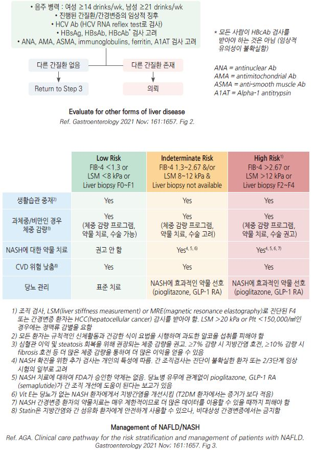

# 비-알코올성 지방간질환 NAFLD

## 일반 사항

* NAFLD (Non Alcoholic Fatty Liver Dz) : 유의한 음주, 약인성, 바이러스 간염 등과 같은 2차적 원인에 의한 간질환이 없으면서 임상적 소견이나 생화학적, 영상학적, 병리학적 검사에 합당한 소견이 있는 질환; 비-알코올 지방간, 비-알코올 지방간염, 비-알코올 지방간 연관 간경변증 등을 포괄하는 진단명 {대한간학회}
* 만성 간질환의 가장 흔한 원인이며 심혈관 질환, 당뇨, 대사증후군, 만성 콩팥병, 악성 종양의 독립적 위험 인자
* 비-알코올 및 알코올 지방간질환을 구별하는 알코올 섭취량의 상한 : 순수 알코올 양으로 최근 2년간 1주 당 남자 210 g(소주로 약 4병), 여자 140 g (☞ p.995); 남 30 g/d, 여 20 g/d \[AASLD]
* 유병률 \[우리나라] : 33%(21\~44%); non-obesity 인구 중 19%(12\~27%); 연간 45명/1000명 발생

#### 관련 용어

* 간 내 지방 침착 : 조직 검사에서 5% 이상의 간세포에 지방이 침착된 경우
* 비-알코올 지방간 (NAFL, non alcoholic fatty liver) : 간 내 지방 침착은 있으나 간세포 손상 및 섬유화 소견은 없는 단순 지방간 (macrovesicular hepatic steatosis, mild inflammation)
* 비-알코올 지방간염 (NASH, nonalcoholic steatohepatitis) : 비-알코올 지방간의 진행된 형태로서 간 내 지방 침착 및 염증 소견(간세포 손상)이 있는 상태. 섬유화를 동반하기도 함
* 비-알코올 지방간 연관 간경변증 : 조직학적으로 증명된 비-알코올 지방간이나 지방간염의 소견이 동반된 간경변증 또는 과거 그러한 소견이 있었던 환자에서 발생된 간경변증
* 대사 이상 관련 지방간질환(MAFLD, metabolic dysfunction associated fatty liver disease) : 지방증과 함께 과체중/비만, 당뇨병, 대사 이상이 있는 경우 진단; NAFLD 용어가 질환의 이질적인 특성 및 다양한 질병의 경과를 반영하지 못하며 음주를 완전히 배제하는 것이 어렵고 실제 음주가 NAFLD 환자에게 미치는 영향이 있으므로 제안된 용어

### 자연 경과

* 대부분 가역적 상태, 양호한 경과
* NASH에서는 간섬유화가 빠르게 진행됨(⅓이 5년 후 간섬유화)
* 일부 환자에서 간경변증이나 간세포암종 등 말기 간질환으로 진행
* 사망률 증가 ; 심혈관 질환(가장 흔함) 및 간질환 관련 사망률 증가, nonhepatic malignancy(예: 대장암) 위험 증가

## 원인 및 위험 인자

* 비만, 고혈압, 2형 당뇨(인슐린 저항성), 이상지질혈증(TG↑, HDL↓)
* 심혈관 질환, 만성 신질환, 갑상선저하증, hypopituitarism, hypogonadism, 폐쇄수면무호흡증, 췌장-십이지장 절제, 골다공증, 건선, 다낭성난소증후군
* 연령 증가
*   많은 과당 섭취, 단백 섭취 저하, 심한 다이어트, 완전 비경구 영양,

    청량음료 섭취, 흡연
*   약물 : steroid, tamoxifen, methotrexate, valproic acid, 화학요법,

    nucleos(t)ide analogue

## 임상 양상

* \~90%에서 무증상
* 피로, 복부 팽만감
* 우상복부 통증/압통

## 진단

### 실험실 검사

* AST↑, ALT↑, AST/ALT ratio ＜1
  * 간 효소 수치 수준과 섬유화의 중증도는 연관성이 없음. 종종 NASH 환자에서 정상
* ferritin↑(1.5배), ALP↑(2\~3배), bilirubin↑
* cholesterol/LDL/TG↑, HDL↓
* s-Alb, 단백질, Plt : 중증 또는 만성 시 감소

**지방증 예측 패널**

* [fatty liver index(FLI)](https://www.mdapp.co/fatty-liver-index-fli-calculator-356/), [NAFLD liver fat score(NLFS)](https://www.mdapp.co/non-alcoholic-fatty-liver-disease-liver-fat-score-nafld-lfs-calculator-358/), [Hepatic steatosis index(HSI)](https://www.mdapp.co/hepatic-steatosis-index-hsi-calculator-357/)

<table><thead><tr><th width="75.47366333007812">지표</th><th width="365.47369384765625">계산법</th><th width="99.5789794921875">Cut-off value</th><th width="122.86843872070312">지방증  진단 방법</th></tr></thead><tbody><tr><td><strong>FLI</strong></td><td>eˣ (1 + eˣ) x 100</td><td>≥60, &#x3C;30</td><td>복부 초음파</td></tr><tr><td><strong>NLFS</strong></td><td>-2.89 + 1.18 x 대사증후군(yes=1/no=0) + 0.45 x 당뇨병(yes=2/no=0) + 0.15 x (공복 인슐린, μU/L) + 0.04 x AST + 0.94 x AST/ALT ratio</td><td>> -0.64</td><td>MRS </td></tr><tr><td><strong>HSI</strong></td><td>8 x ALT/AST ratio + BMI + (if 당뇨병 +2; if 여성 +2)</td><td>≥36, &#x3C;30</td><td>복부 초음파</td></tr></tbody></table>

MRS = MR spectroscopy

χ = 0.953 x loge(중성지방) + 0.139 x BMI + 0.718 x loge( γ-glutamyl-transferase) + 0.053 x 허리둘레 (㎝) - 15.745\
Ref. 대한간학회, _비알코올지방간질환 진료 가이드라인_, 2021, 표 4.

**NASH**

* 간 효소 수치↑ (정상 상한값의 ＜3\~4배)
* NASH 염증 지표 : leptin, adiponectin, CRP, caspase, cytokeratin 18
* 감별 검사 : 셀리악병, α-1-antitrypsin, iron, copper, HAV IgG, HBsAg, HCV Ab, smooth muscle Ab, ANA, gammaglobulin
  * steatosis/fibrosis에 대하여 신뢰할 만한 noninvasive biomarker는 없음

### 영상 검사

* 초음파 검사(1차 선택 영상 검사), CT, MRI, 간 섬유화 스캔

### 조직 검사

* 진단 및 예후 판단의 기준
* 비-알코올 지방간염 또는 진행된 간 섬유화가 의심되는 경우 및 다른 만성 간질환의 동반을 배제할 수 없는 경우에 고려

### 경미한 간 효소 상승 감별

* ALT & AST가 upper limit of normal의 ＜5배으로 증가된 상태

#### 원인

* ALT : 간 손상에 보다 특이적
* AST : 간 외 이상에 의해서도 상승
* 간의 원인
  * 흔한 원인 : NAFLD, alcoholic liver disease
  * 덜 흔한 원인 : 약물(예: 다제약물, herb), B형/C형 간염, hereditary hemochromatosis
  * 드문 원인 : alpha1-antitrypsin deficiency, autoimmune hepatitis, Wilson disease
* 간 외 원인 : 갑상선 이상, celiac sprue, 용혈, 근육 이상

#### 감별 진단

* HBsAg, HCV Ab
* CBC, PLT, s-albumin, iron, TIBC, ferritin
* 대사증후군 및 인슐린 저항성 : 허리둘레, 혈압, 지질, 혈당, HbA1c
* ANI (alcoholic liver disease/nonalcoholic fatty liver disease index) : 알코올성 간질환과 비알코올성 구별 도구 (✽[알코올 간질환 확률 계산기](https://www.mayoclinic.org/medical-professionals/transplant-medicine/calculators/the-alcoholic-liver-disease-nonalcoholic-fatty-liver-disease-index-ani/itt-20434726))
* 초음파 검사

**NAFLD과 알코올 간질환의 비교**

<em><mark style="color:$info;">(Ref. Non-alcoholic fatty liver disease. BMJ 2014; 349.)</mark></em>

| 항목                | NAFLD          | Alcoholic      |
| ----------------- | -------------- | -------------- |
| **체중**            | 증가             | 다양             |
| **혈당 or HbA1c**   | 증가             | 정상             |
| **알코올섭취량 (g/d)**  | 남 < 30, 여 < 20 | 남 > 30, 여 > 20 |
| **AST**           | 정상             | 증가             |
| **ALT**           | 증가 또는 정상       | 증가 또는 정상       |
| **AST/ALT ratio** | < 0.8\*        | > 1.5          |
| **GGT**           | 증가 또는 정상       | 상당히 증가         |
| **TG**            | 증가             | 다양             |
| **HDL-C**         | 낮음             | 증가             |

\*섬유화나 경화증 진행 시 > 0.8

### 선별 검사

\[대한간학회]

* 대상 : 필수- 지속적 간효소 수치 상승, 또는 당뇨병 환자; 고려- 대사증후군, 비만, 비알코올 지방간질환 발생 위험 인자가 있는 경우
* 방법 : 복부초음파(1차) → NAFLD 의심 시 추가 검사 고려(CT, MRI, 혈청검사, 간섬유화 스캔)

\[AASLD]

* T2DM, complicated obesity, 간경화 가족력, 중등도 이상의 음주자는 NASH 및 advanced fibrosis의 고위험군이므로 advanced fibrosis 선별 검사를 받아야 함 •NAFLD 환자들은 T2DM 선별 검사를 받아야 함
* NAFLD 환자들의 주요 사망 원인이 간 외 악성 종양이므로 연령에 따른 암 검진을 권고
* 지방증 또는 임상적으로 의심되는 NAFLD를 가진 모든 환자는 FIB-4로 1차 위험 평가를 받아야 함

\[AGA]

* Step 1 : 위험 환자 확인; ① T2DM, ② ≥2개의 대사 위험 요소(예: 중심 비만, high TG, low HDL-C, 고혈압, 당뇨병전단계), ③ 영상 검사상 steatosis 또는 검사실 검사상 ALT or AST 증가
* Step 2 : 병력 및 검사실 검사; 알코올 과용 여부 확인, CBC, (시행하지 않았다면) ALT & AST; ALT or AST 증가 시 다른 간질환 선별(특히 B형 & C형 간염)
* Step 3 : fibrosis에 대한 비침습적 평가; FIB-4
  * FiB-4(Fibrosis-4) : 연령, AST, ALT, Plt을 기반으로 간경화 위험도를 계산( 온라인 계산기 ) = {연령(년)×AST(U/L)} ÷ {PLT(109/L)×√ALT(U/L)} &#x20;
  * 저위험 환자(FIB-4 ＜1.3)는 일차진료에서 F/U; 고위험 환자(FIB-4 ＞2.67)는 의뢰
* Step 4 : 중간위험 환자(FIB-4 1.3\~2.67)에 대하여 transient elastography(FibroScanⓇ)로 liver stiffness 측정 (초음파 검사로 대체 가능) → 저위험 liver stiffness(＜8 kPa)는 일차진료에서 F/U, 중간위험(8\~12 kPa) or 고위험(＞12 kPa) 환자는 의뢰

***

## Management

### 치료 방침

* 체중 감량, 식이 조절, 활발한 활동/운동, 음주 제
* 대사증후군 치료, 철저한 당 조절
* 약물 치료 : 입증된 치료 약물은 없으며 모든 지방간 환자가 적극적인 치료를 받을 필요는 없음

## 비-약물 치료

* 적정 체중 유지 : 과체중 또는 비만 시 감량; 7\~10%의 감량, 점진적 감량 (≤1 ㎏/wk)
  * 1.6 ㎏/wk 이상의 급격한 체중 감량은 간 내 염증 및 간 섬유화를 악화시킨다는 보고가 있음
* 식이 제한 : 칼로리 섭취 제한(구성 비율보다 총 칼로리가 중요); 포화 지방, 트랜스 지방, 단순 탄수화물 섭취 제한; 지중해식 식단 권고 (☞ p.1166)
* 음주 제한 : 남 ≤2 SD/d, 여 ≤1 SD/d, 정기적인 알코올 섭취량 평가, ≥F2 시 금주 (☞ p.995)
* 활발한 활동, 운동 : 중등 강도의 유산소 운동(예: 빠른 걸음, 고정 자전거) 및 근력 운동을 3\~5회/주, 20\~45분/회(150\~200 분/주) 시행
* 간 영향 약물 주의

## 약물 치료

* 약물 치료 대상 : NASH(특히 유의미한 섬유화가 있는 ≥F2 stage 환자), 질병 진행 위험이 높은 환자(예: 당뇨병, 대사증후군, 지속적 높은 ALT, high necroinflammation)
  * ALT가 정상인 환자는 약물 치료 대상이 아님
* 약물 치료 기간 : 확정된 규정은 없음; ALT 상승 환자에서 치료 6개월 후 간 효소 수치가 감소하지 않으면 중단할 것을 권고

#### 인슐린 저항성 개선 약물 (Insulin sensitizer)

* pioglitazone : ALT 및 간 내 지방 침착/염증 개선; 투여 기간/용량/안전성에 대한 연구 필요
* metformin : ALT 또는 간 조직의 개선 효과 없음; NASH의 치료제로 권고하지 않음.
*   GLP-1 RA : 일부 연구 NASH 개선 보고; exenatide 및 liraglutide는 부작용 문제로 적용 안 함;

    semaglutide는 T2DM/비만 환자에서 고려 \[ASSLD]
*   SGLT-2i : 일부 연구에서 지방증 개선 보고; 조직 개선 효과는 확인 안 됨

    (☞ p.556)

#### 고용량 Vit E

* 800 IU/d으로 간 조직 소견 개선, 지방간염 호전 효과
* 장기 투여에 따른 남성의 전립선암 위험 증가에 대한 논란이 있음

#### 지질 강하제

* statin : 이상지질혈증이 동반된 경우 고려; 간에 대한 부작용 주의 (☞ p.531); NAFLD 환자에서 CVD 위험 감소를 위하여 권고, high CVD risk 환자에서 주의 깊은 모니터링을 통한 사용을 고려; NASH 치료제로는 권고 안 함(간 조직 개선 없음) \[AASLD]
* 고중성지방혈증에서 생활 습관 중재와 함께 omega-3, icosapent ethyl, fibrate 투여 가능

#### 간장질환용제

*   ursodeoxycholic acid(UDCA) : silymarin : 간 조직의 유의미한 개선은 없음; NASH 치료제로는 사용하지 않음

    

    

| 구분                 | Low Risk                                         | Indeterminate Risk                                 | High Risk¹                                         |
| ------------------ | ------------------------------------------------ | -------------------------------------------------- | -------------------------------------------------- |
| **기준**             | FIB-4 < 1.3 또는 LSM < 8 kPa 또는 Liver biopsy F0–F1 | FIB-4 1.3–2.67 또는 LSM 8–12 kPa 또는 Liver biopsy 미실시 | FIB-4 > 2.67 또는 LSM > 12 kPa 또는 Liver biopsy F2–F4 |
| **생활습관 중재**        | Yes                                              | Yes                                                | Yes                                                |
| **과체중/비만 시 체중 감량** | 체중 감량 프로그램, 약물 치료, 수술 가능                         | 체중 감량 프로그램, 약물 치료, 수술 가능                           | 체중 감량 프로그램, 약물 치료, 수술 가능                           |
| **NASH 약물 치료**     | 권고 안 함                                           | Yes⁴,⁵,⁶                                           | Yes⁴,⁵,⁶                                           |
| **CVD 위험 낮춤**      | Yes                                              | Yes                                                | Yes                                                |
| **당뇨 관리**          | 표준 치료                                            | NASH에 효과적인 약물 선호 (pioglitazone, GLP-1 RA)          | NASH에 효과적인 약물 선호 (pioglitazone, GLP-1 RA)          |

***

**주석 요약**\
1️⃣ F4 또는 간경변증 진단 시 HCC 검사 필요. LSM > 20 kPa 또는 혈소판 <150,000/ml이면 정맥류 검사 권장.\
2️⃣ 모든 환자는 규칙적 신체활동과 건강한 식습관 유지, 과도한 음주 금지.\
3️⃣ 체중 7% 감량 시 지방간염 호전, ≥10% 감량 시 섬유화 개선 가능.\
4️⃣ NASH 확진을 위한 추가 검사는 개인 특성에 따라 시행.\
5️⃣ FDA 승인 약제는 없으나 pioglitazone, GLP-1 RA(semaglutide)가 간 조직 개선에 도움 가능.\
6️⃣ 비당뇨 NASH 환자에서 Vit E 사용 가능하나 T2DM 환자에서는 피해야 함.\
8️⃣ Statin은 안전하게 사용 가능하나 비대상성 간경변증에서는 금기.

**참고:**\
Ref. AGA. _Clinical care pathway for the risk stratification and management of patients with NAFLD._\
&#xNAN;_&#x47;astroenterology_ 2021 Nov; 161:1657. Fig. 3.

**지방간질환 의심 환자 평가 알고리듬**

<figure><figcaption></figcaption></figure>

## 추적 관리

* LFT 검사 : 매년
* 초음파 검사 또는 CT 검사 : 경과 관찰을 위하여 고려
* 조직 검사 : fibrosis 진행 의심 시 5년마다 고려
* pre-DM, T2DM, ≥2개의 대사 위험 또는 영상 검사에서 지방증이 있는 경우에는 1\~2년마다 FIB-4로 위험 평가 \[AASLD]&#x20;

### **질병코드**&#x20;

* K76.0 달리 분류되지 않은 지방(변화성)간

#### \[보험기준] 간장용제 (2018-06-01)

