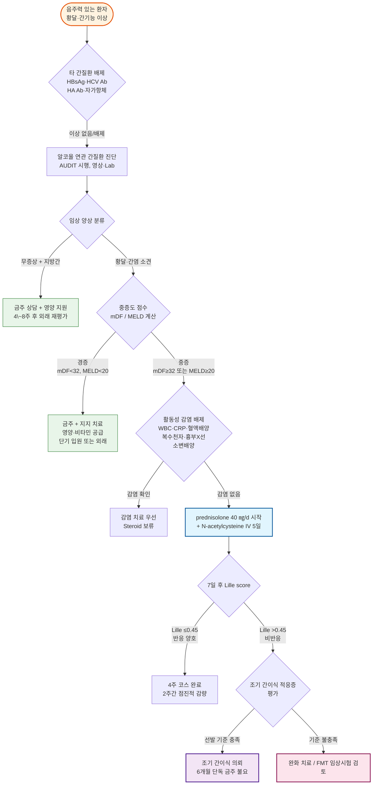

# 알코올 간질환 Alcohol-associated Liver Disease

## <mark style="color:green;">일반 사항</mark>

* 과다한 알코올 섭취에 의해 발생하는 간 손상의 연속된 스펙트럼 : 지방간 → 알코올 간염 → 간섬유화 → 간경변증
* 명칭 : 과거 'Alcoholic Liver Disease'에서 Alcohol-Associated Liver Disease (ALD)로 개칭; 알코올 사용 장애(AUD)와의 통합 관리를 반영
* 전 세계적으로 진행성 간질환의 가장 흔한 원인이자 간이식의 주요 적응증
* 유병률(미국) : 성인의 약 1%; 주로 40\~50대(대부분 60세 이전 발병); 전통적으로 남성이 다수이나 최근 여성·젊은 층 비율 증가 추세
* 하루 ≥50 g(소주 1병, 약 360 ㎖ × 17.5% ABV ≒ 50 g EtOH)의 알코올을 10년 이상 섭취하는 사람의 10\~15%에서 간경변증 발생
* COVID-19 팬데믹 이후 음주량 증가로 ALD 관련 의료 부담이 급격히 증가

## <mark style="color:green;">원인 및 위험 인자</mark>

* 음주량·기간 : 남성 하루 ≥60\~80 g, 여성 ≥20 g을 수년 이상 지속; 식사 외 공복 음주 시 위험 3배 증가
* 여성 : 동일 음주량에서 남성보다 간질환 진행이 빠름 (알코올 대사 속도 차이, 장투과성 증가)
* 유전 : PNPLA3 I148M, TM6SF2 등 유전 변이 - 지방간·간염·간경변증 위험 증가
* 비만 / 인슐린 저항성 : MASLD(대사 지방간질환)와 동반 시 상승 효과
* 만성 바이러스 간염 : HBV, HCV 동반 시 간경변증 및 HCC 위험 대폭 증가
* 영양 불량 : 단백질·비타민(thiamine, 엽산, 아연) 결핍
* 장내 미생물 불균형(Gut dysbiosis) : 장벽 손상 → LPS 유입 → 간 염증 촉진 (병태생리의 핵심)
* 흡연 : 섬유화 진행 가속

***

## <mark style="color:green;">임상 양상</mark>

* 지방간 : 대부분 무증상; 경미한 우상복부 불편감; 금주 시 가역적 회복
* 알코올 간염 : 급성 발현 - 피로, 식욕 부진, 구역, 미열, 우상복부 통증/팽만, 황달, 체중 감소, 빈맥, 저혈압, 말초 부종; 간혹 무증상
* 간경변증 : 여성형 유방, 근육 소실, 거미혈관종, 손발바닥 홍반, 복수, 식도 정맥류, 간성 뇌병증, 비장 비대

### <mark style="color:$danger;">🚩 Red Flags!</mark>

<mark style="color:$danger;">**즉각 조치 또는 응급 의뢰**</mark>

* 의식 혼탁, 지남력 장애, 행동 변화 → 간성 뇌병증
* GCS ≤8 또는 급격한 의식 저하
* 대량 상부 위장관 출혈 → 식도·위 정맥류 파열
* 급성 신부전 동반 → 간신증후군
* 고열 + 복수 + 복통 → 패혈증 또는 자발성 복막염

<mark style="color:$warning;">**당일 또는 조기 의뢰**</mark>

* 총 빌리루빈 ≥10 ㎎/㎗ 또는 INR ＞1.6 → 중증 알코올 간염
* MELD score ≥20 또는 mDF ≥32
* 심한 구역·구토 - 경구 수분 및 영양 섭취 불가
* 심한 금단 증상 - 진전, 섬망, 경련

<mark style="color:$info;">**외래 추적 / 추가 평가 계획**</mark> <mark style="color:$info;">- 즉각 위험 낮으나 호전 없으면 의뢰</mark>

* 지속적 음주 + AST/ALT 반복 상승
* 금주 후 4\~8주 내에 간기능 검사 미호전
* 간경변증 합병증(복수, 근육 감소, 황달) 발생

## <mark style="color:green;">진단</mark>

### <mark style="color:orange;">병력 청취</mark>

* 음주 시작 연령, 하루 음주량(표준 잔 환산), 정기적/매일 음주 지속 연수, 음주 종류, 가정 내 음주, 금주 시도력
* [알코올 사용 장애 선별](../230_/189_-alcohol-use-disorder-aud.md#undefined-3) : AUDIT(Alcohol Use Disorders Identification Test) 또는 AUDIT-C 사용 권장
* 최근 음주력 확인 바이오마커 활용 가능 : EtG(에틸글루쿠로나이드, 소변), EtS(에틸설페이트), CDT(탈탄수화물화 트랜스페린) - ACG 2024 권고

### <mark style="color:orange;">실험실 검사</mark>

<table><thead><tr><th width="144.21051025390625">검사 항목</th><th width="256.84210205078125">알코올 간염 특징</th><th>비고</th></tr></thead><tbody><tr><td>AST</td><td>↑, 보통 &#x3C;300 IU/L</td><td>알코올에 의한 미토콘드리아 손상</td></tr><tr><td>AST/ALT 비</td><td>≥2 (구기준 ≥1.5는 현재 사용 않음)</td><td>알코올 간염에 특징적</td></tr><tr><td>GGT</td><td>>100 U/㎖ (음주의 민감한 지표; 단, 특이도 낮음)</td><td>비만·약물·담즙정체에서도 상승; 금주 시 2~3주 내 감소</td></tr><tr><td>ALP</td><td>↑ (통상 정상치 3배 미만)</td><td>담즙정체성 표현형에서는 더 뚜렷하게 상승 가능</td></tr><tr><td>총 빌리루빈</td><td>↑ (>3~5 ㎎/㎗; 중증 시 ≥10)</td><td></td></tr><tr><td>Albumin</td><td>↓ (&#x3C;3.0 g/㎗)</td><td>간 합성 기능 저하</td></tr><tr><td>INR</td><td>>1.5 (중증 시 더 연장)</td><td></td></tr><tr><td>WBC</td><td>↑ (>12,000; 중증 시 left shift)</td><td>감염과 감별 필요</td></tr><tr><td>빈혈, 혈소판 감소</td><td>흔함</td><td>엽산↓, 비장 비대</td></tr></tbody></table>

* 타 간질환 감별 : HBsAg, HBcAb, HA Ab(IgM), HCV Ab/RNA, ANA(항핵항체), α-fetoprotein
* AST가 500 IU/L 이상이면 단순 알코올 간염보다 허혈성 간염·독성 간염·바이러스 간염을 우선 감별할 것

### <mark style="color:orange;">영상 검사</mark>

* 복부 초음파 (1차 선택), CT, MRI - 지방간, 간경변증, 복수, 비장 비대 평가
* 간 탄성도 검사(Transient elastography, FibroScan) - 비침습적 섬유화 정량 평가; 급성 간염 시기에는 과대 측정 가능

### <mark style="color:orange;">비침습적 섬유화 평가</mark>

* **FIB-4 score** (혈청 기반 섬유화 지수)\
  = \[나이(세) × AST(IU/L)] ÷ \[혈소판(×10⁹/L) × √ALT(IU/L)]\
  - \<1.30 : 진행성 섬유화 가능성 낮음 / ≥2.67 : 진행성 섬유화 가능성 높음


**⚠️ 급성 알코올 간염 시기에는 FIB-4 사용 주의**\
AST·ALT 급상승으로 FIB-4가 위양성으로 매우 높게 나올 수 있어 섬유화 평가 지표로 직접 사용하지 말 것. 염증 호전 후(4\~8주 뒤) 재평가 권장.


* ✽ MetALD(MASLD + 음주 동반) 환자는 섬유화 진행이 빠르므로 FIB-4 선별을 더 적극적으로 시행
* ✽ FIB-4 중간값(1.30\~2.67)에서는 추가 평가(탄성도 검사 또는 간 생검) 고려

### <mark style="color:orange;">중증도 평가 점수</mark>


**중증도 점수 실전 활용 요약**

mDF ≥32 또는 MELD ≥20 = **중증 알코올 간염** → 입원 치료 및 steroid 고려 적응증. ACG 2024는 MELD를 단기 사망률 예측에서 mDF보다 우수한 지표로 권고함.


* **modified Maddrey's Discriminant Function (mDF)**\
  mDF = {4.6 × (PT 환자 − PT 대조)} + 혈청 빌리루빈 (㎎/㎗)\
  ≥32점 시 중증 / 불량 예후 (1개월 사망률 35\~45%)
* **MELD score** (ACG 2024 우선 권고)\
  ≥20 = 중증; 25\~39 범위에서 corticosteroid 최대 이득; ≥50에서 steroid 신중 사용\
  ✽ [온라인 계산툴](https://www.mdcalc.com/meld-score-original)
* **Lille score** (steroid 반응 예측)\
  7일 투여 후 빌리루빈 변화를 바탕으로 계산; >0.45 = 비반응 → steroid 중단\
  ✽ 4일째 중간 평가도 가능 (ACG 2024)\
  ✽ [온라인 계산툴](http://gihep.com/calculators/hepatology/lille-model/)
* **간 생검** : 진단 불확실 또는 임상시험 선별 시 고려

***



<p align="center"><strong>알코올 연관 간질환 진단 및 치료 알고리듬</strong></p>

<p align="center"><em><mark style="color:$info;">Ref. ACG Clinical Guideline: Alcohol-Associated Liver Disease. Am J Gastroenterol 2024;119:30-54</mark></em></p>

***

## <mark style="background-color:$warning;">Management</mark>


**알코올 연관 간질환 치료의 3대 핵심 원칙**

1. **금주** - 모든 병기에서 가장 중요한 단일 치료; 지방간은 금주만으로 빠르게 회복
2. **영양 지원** - 영양 불량이 합병증·사망률 결정 인자
3. **AUD 통합 관리** - 금주 유지를 위한 행동 치료 및 약물 치료 병행 (ACG 2024 강조)


### <mark style="color:orange;">임상 표현형 분류 (Bedside Phenotype)</mark>


알코올 간질환은 단일 표현형이 아닌 다양한 phenotype으로 나타난다. 입원 시 우세한 표현형을 파악하면 초기 처치 우선순위를 정하는 데 도움이 된다.


<table><thead><tr><th width="175">표현형</th><th width="210">주요 임상 단서</th><th width="210">특징적 Lab/소견</th><th>우선 처치 방향</th></tr></thead><tbody><tr><td>염증성 (Inflammatory)</td><td>발열, WBC ↑, 황달, CRP ↑</td><td>bilirubin↑↑, AST/ALT ≥2</td><td>감염 배제 후 steroid 고려</td></tr><tr><td>담즙정체성 (Cholestatic)</td><td>황달 두드러짐, 회복 지연</td><td>direct bilirubin↑↑, ALP/GGT↑</td><td>장기 추적, 담도 질환 감별</td></tr><tr><td>비대상성 간경변증</td><td>복수, 간성 뇌병증, 정맥류 출혈</td><td>albumin↓, INR↑, Na↓</td><td>합병증 치료 + 간이식 평가</td></tr><tr><td>금단 증상 우세</td><td>진전, 불안, 발한, 빈맥</td><td>CIWA-Ar 상승</td><td>benzodiazepine + thiamine 우선</td></tr><tr><td>영양불량/Sarcopenia</td><td>근육 감소, 체중 감소, 쇠약</td><td>albumin↓, zinc↓</td><td>고단백·고칼로리 영양 집중</td></tr><tr><td>감염 동반</td><td>발열, 저혈압, 복통</td><td>procalcitonin↑, lactate↑</td><td>감염 치료 우선, steroid 보류</td></tr><tr><td>간신증후군 (HRS)</td><td>핍뇨, creatinine 상승</td><td>Cr↑, Na↓</td><td>AKI/HRS 교정, albumin·vasoconstrictor</td></tr><tr><td>Steroid 비반응 중증</td><td>Lille >0.45, 다장기 부전</td><td>MELD↑↑</td><td>조기 간이식 또는 완화 치료</td></tr></tbody></table>

### <mark style="color:orange;">기본 치료</mark>

* **금주 및 금단 증상 치료** (필요시 입원 치료) (☞ 알코올 사용 장애 챕터)
* **입원 기준** : mDF ≥32, MELD ≥20, Glasgow Coma Scale ≤8, 간성 뇌병증, 수분 공급 불가
* **알코올 사용 장애(AUD) 치료 통합** : 행동 치료(동기 강화 면담) + 약물 치료 병행; 금주 유지가 장기 예후 결정
  * naltrexone : 1차 선택제; 진행성 간질환에서는 간독성 모니터링(ALT/AST) 병행 권장 - ACG 2024는 간경변증 환자에서도 사용 가능으로 시사하나 신중히 적용
  * acamprosate : 신장 배설, 간 대사 부담 없음; 중등도 이상 신기능 저하 시 주의
  * baclofen : 신장 배설로 간 대사에 독립적 - 간경변증 환자의 음주 갈망 조절 대안으로 활용 가능 (국내 허가 외 사용, 처방 전 상의 필요)
* **약물 주의**
  * **NSAIDs : 사용 금기에 준하여 강력 회피** - 신기능 저하·위장관 출혈·HRS 위험 증가
  * acetaminophen : 완전 금주 상태에서 1일 총 2 g 이하로 제한적 사용 가능; 음주 중에는 복용 금지
  * **아미노글리코사이드계 항생제(겐타마이신, 아미카신 등) 가급적 회피** : 간신증후군(HRS) 위험이 높은 ALD 환자에서 신독성이 치명적일 수 있음; 불가피한 경우 혈중 농도 모니터링 및 최단 기간 사용
  * 간독성 약물·건강보조식품·한약 주의

### <mark style="color:orange;">영양 지원</mark>

<table><thead><tr><th width="160">항목</th><th width="200">권장 목표</th><th>임상 포인트</th></tr></thead><tbody><tr><td>총 열량</td><td>35\~40 ㎉/㎏/d</td><td>저영양 교정 핵심</td></tr><tr><td>단백질</td><td>1.2\~1.5 g/㎏/d</td><td>간성 뇌병증 있어도 제한 불요 - 오히려 근육 소실 악화</td></tr><tr><td>식사 패턴</td><td>소량씩 자주(4\~6회/d)</td><td>야간 공복 최소화; <strong>late evening snack 적극 권장</strong> (예: 두유 1컵, 삶은 달걀 1\~2개, 단백질 쉐이크, 통밀 크래커 + 치즈)</td></tr><tr><td>Thiamine</td><td>최소 100 ㎎/d</td><td>포도당 투여보다 먼저 투여; Wernicke 의심 시 200\~500 ㎎ IV tid</td></tr><tr><td>아연</td><td>zinc sulfate 220 ㎎ bid<br>(elemental zinc 50 ㎎ 해당)</td><td>간성 뇌병증·미각 저하 개선 가능</td></tr><tr><td>엽산/B 복합제</td><td>보충 권장</td><td>결핍 매우 흔함</td></tr><tr><td>경관 영양</td><td>경구 불가 시 조기 시행</td><td>TPN보다 장관 영양 선호</td></tr></tbody></table>

* ✽ ALD에서는 **비만 + sarcopenia 동반**이 흔함 - BMI만으로 영양 상태 판단 불가; 근육량 평가 병행 권장

### <mark style="color:orange;">동반 질환 관리</mark>

* 비만, 당뇨병, 인슐린 저항성, 영양 불량, 흡연, 철분 과부하, 바이러스 간염(B·C형) 동시 치료

***

## <mark style="color:green;">약물 치료</mark>

### <mark style="color:orange;">Corticosteroid (중증 알코올 간염)</mark>

* **적응증** : mDF ≥32 또는 MELD ≥20; ACG 2024 기준 MELD 25\~39 범위에서 최대 이득
* **상대적 금기** (절대 금기 아님 - 조절 후 재평가 가능) : 조절되지 않은 감염·패혈증, 활동성 위장관 출혈, 중증 AKI, 조절 어려운 당뇨병\
  ✽ 감염은 치료 후, 출혈은 지혈 후 steroid 재개 가능; 단, 위험-이득 신중 평가


**⚠️ Steroid 시작 전 Sepsis Screen 완결 필수**\
혈액배양 × 2세트 · 소변배양 · 흉부 X선 · 복수천자(SBP 배제) 시행 후 시작. 투여 중 격일 이상 감염 징후 모니터링.


<table><thead><tr><th width="260">임상 상황</th><th width="120" align="center">Prednisolone</th></tr></thead><tbody><tr><td>Severe AH (mDF ≥32 또는 MELD ≥20) + 감염 없음</td><td align="center">✅ 권장</td></tr><tr><td>감염 치료 완료 후 안정화</td><td align="center">⚠️ 신중 가능</td></tr><tr><td>조절되지 않는 패혈증</td><td align="center">❌ 보류</td></tr><tr><td>활동성 GI 출혈</td><td align="center">❌ 지혈 후 재평가</td></tr><tr><td>AKI / HRS 동반</td><td align="center">⚠️ 위험-이득 평가</td></tr><tr><td>MELD 25\~39</td><td align="center">✅ 최대 이득</td></tr><tr><td>MELD >50</td><td align="center">⚠️ 매우 신중</td></tr><tr><td>Lille ≤0.45 (7일 반응)</td><td align="center">✅ 4주 유지</td></tr><tr><td>Lille >0.45 (비반응)</td><td align="center">❌ 중단, 간이식 평가</td></tr></tbody></table>

* **prednisolone** 40 ㎎/d po × 4주, 이후 2주간 점진적 감량 <mark style="color:blue;">\[소론도]</mark>
* 또는 **methylprednisolone** 32 ㎎/d IV × 4주 (경구 불가 시) <mark style="color:blue;">\[메치론]</mark>
* **반응 평가** : 7일째 (또는 4일째) Lille score 계산 → Lille >0.45 시 steroid 즉시 중단\
  ✽ 비반응 환자는 **감염 및 AKI 발생 위험이 특히 높음** - 조기 완화 치료 및 간이식 평가 병행

### <mark style="color:orange;">N-Acetylcysteine (중증, Steroid 병용)</mark>

* 중증 알코올 간염에서 prednisolone에 **병용** 투여 시 감염 합병증 감소, 단기 생존율 개선 보고
* **5일 IV 표준 프로토콜** : Day 1 - 150 ㎎/㎏ over 1시간(부하용량), 이후 50 ㎎/㎏ over 4시간, 100 ㎎/㎏ over 16시간; Day 2\~5 - 100 ㎎/㎏/d (병원 프로토콜 및 신기능에 따라 조정)
* ✽국내 아세틸시스테인 주사제 가용 <mark style="color:blue;">\[아세탄주]</mark> 등

### <mark style="color:orange;">Pentoxifylline</mark>


**⚠️ Routine use 권고되지 않음**\
STOPAH 대규모 RCT에서 pentoxifylline 단독 투여는 알코올 간염 사망률을 개선하지 못함. ACG 2024는 corticosteroid 절대 금기 시에만 대체를 남겨두고 있으며, 현재 임상 현장에서의 실제 사용 빈도는 매우 낮음.


* Corticosteroid 완전 금기 시에만 제한적 고려 : pentoxifylline 400 ㎎ tid × 4주\
  ✽ 처방 시 사망률 개선 근거가 불충분함을 환자에게 설명

### <mark style="color:orange;">간이식 (Liver Transplantation)</mark>

* **기존 기준** : 6개월 금주 후 간이식 (전통적 기준)
* **ACG 2024 업데이트** : 중증 알코올 간염으로 steroid 비반응 시, **6개월 금주 기준 충족 없이도** 조기 간이식 고려 가능
* **조기 간이식 선발의 핵심 - 엄격한 다학제 평가** (정신건강의학과 + 중독의학과 + 사회사업팀 필수 협력)
  * 가족/사회적 지지 체계 확인 - 조기 이식 성패를 좌우하는 핵심 요소
  * 재발 위험성 평가 (AUD 중증도, 이전 금주 시도, 사회적 안정성)
  * 이식 후 지속적 금주 지원 계획 수립
* **이식 제외 기준** : Lille >0.45 + **4개 이상 장기 부전 동반 시 이식 대상에서 제외** (다장기 부전이 심할수록 이식 후 예후 불량) → 이 경우 완화 치료가 적절

### <mark style="color:orange;">신규·연구 단계 치료</mark>

* **FMT (대변 미생물 이식)** : 소규모 RCT에서 steroid 금기인 중증 알코올 간염 환자 대상 90일 생존율 향상 (75% vs 57%) 보고; 현재 국내 임상적 표준 치료 아님, 연구 단계
* **IL-1 억제제** (anakinra, canakinumab) : 다수 임상시험 진행; steroid와 비교한 대규모 RCT에서 아직 우월성 미입증 - 현재 표준 치료 아님
* **항산화제** : 독립적 효과 입증 부족

***

## <mark style="color:green;">비-약물 치료 및 예방</mark>

* **완전 금주** : 모든 병기에서 유일하게 입증된 질환 경과 개선 방법; 지방간은 2\~4주 내 호전
* **음주 절제 상담** : 동기 강화 면담(Motivational Interviewing), 정신건강의학과·중독의학과 협력
* **영양 재활** : 고칼로리·고단백 식사; 결핍 영양소(thiamine, 엽산, 아연) 보충
* **운동** : **sarcopenia는 BMI와 무관한 독립적 사망 예측 인자** - 저강도 유산소 + 근력 운동 권장; 심한 간경변증에서는 주치의 지도 아래 시행
* **NSAID·알코올·간독성 약물** 회피; acetaminophen은 금주 상태에서 제한 용량 내 사용 가능 (상기 참조)
* **HBV 예방 접종** : 항체 없는 환자에서 시행
* **정기 추적 검사** : 간경변증(F4) 시 6개월마다 간초음파 + AFP (HCC 감시); 진행성 섬유화(F3) 단계에서도 일부 전문가는 감시 검사 고려; 내시경으로 식도 정맥류 평가
* ✽ MASLD와 유의한 알코올 섭취(남 30\~60 g/d, 여 20\~50 g/d)가 동반된 경우 **MetALD** 개념으로 분류 가능 (AASLD/EASL 2023 신규 명칭; 실제 임상 적용은 아직 초기 단계)\
  - MetALD는 MASLD 단독보다 간섬유화 진행 속도가 훨씬 빠름; 대사질환(비만·당뇨)이 동반된 음주 환자는 FIB-4 등 선별 검사를 더욱 적극적으로 시행 권장

***

### <mark style="color:red;">질병코드</mark>

K70 알코올성 간질환

K70.0 알코올성 지방간

K70.1 알코올성 간염

K70.3 알코올성 간경변증

K70.4 알코올성 간부전

***

## <mark style="color:purple;">처방례</mark>

> **처방례 1. 알코올 간염 (경증, mDF <32)**
>
> ```
> 티아민(Vitamin B1) 100 ㎎/T  1T qd (식후)
> 비타민B 복합제               1T tid (식후)
> 엽산 1 ㎎/T                  1T qd (식후)
> ※ 금주 상담 병행 필수; 4~8주 후 간기능 재검사
> ※ 영양 불량 동반 시 고칼로리·고단백 경구 영양 보충제 추가
> ```
>
> _✽경증 알코올 간염의 외래 치료 기본: 금주 + 비타민 보충 + 영양 지원. 스테로이드 불필요._

> **처방례 2. 알코올 금단 증상 예방 (외래 가능한 경증)**
>
> ```
> 디아제팜 5 ㎎/T  2T  q6h (초기 24시간)  → 증상 따라 감량
> 티아민 100 ㎎/T  1T  tid  × 3~5일
> ※ CIWA-Ar 점수 10점 미만인 경우 외래 감량 가능
> ※ 중등도 이상 금단(CIWA ≥10), 경련 기왕력, 혼자 사는 환자 → 입원
> ※ 간경변증 동반 또는 고령·심한 간기능 저하 시 long-acting BZD(diazepam)
>    축적 위험 → lorazepam 1~2 ㎎ q4~6h 또는 oxazepam 10~30 ㎎ q6h 우선 선택
>    (산화 대사 불요 - 간 부담 최소화)
> ※ Wernicke 뇌증 의심(안진·보행 실조·의식 혼탁) → thiamine 200~500 ㎎ IV tid
> ```
>
> _✽알코올 금단 치료의 핵심은 benzodiazepine + thiamine 조기 투여. Wernicke 뇌증 예방을 위해 포도당 투여 전에 반드시 thiamine 먼저 투여._

> **처방례 3. 중증 알코올 간염 (mDF ≥32, 입원 치료, 감염 없음)**
>
> ```
> [입원 치료]
> Prednisolone 40 ㎎/T  1T  qd (아침 식후)  ×28일 → 2주간 감량
> 또는 Methylprednisolone 32 ㎎ IV qd  (경구 불가 시)
>
> N-acetylcysteine (NAC) IV  5일:
>   Day 1 - 부하 150 ㎎/㎏ over 1시간
>           → 50 ㎎/㎏ over 4시간
>           → 100 ㎎/㎏ over 16시간
>   Day 2~5 - 100 ㎎/㎏/d (신기능·프로토콜에 따라 조정)
> 티아민 100 ㎎ IV qd  × 3~5일 (이후 경구로 전환)
> 아연 (zinc sulfate 220 ㎎/T = elemental zinc 50 ㎎)  1T  bid  (식사 중)
>
> ※ [4일째 중간 평가] 빌리루빈이 전혀 감소하지 않거나 오히려 악화된 경우
>   → 7일을 기다리지 않고 조기 steroid 중단 및 간이식 평가 고려 (ACG 2024)
> ※ [7일째] Lille score 계산: >0.45 시 steroid 즉시 중단, 간이식 평가 의뢰
> ※ 투여 중 격일 WBC, CRP, 체온 모니터링 (감염 감시)
> ※ 혈당 상승 시 조절 병행
> ```
>
> _✽활동성 감염(자발성 세균성 복막염, 폐렴, 요로감염 등) 확인 후 스테로이드 시작. Steroid 비반응 환자는 감염·AKI 발생 위험이 특히 높으므로 조기 간이식 평가와 완화 치료를 동시에 검토._

> **처방례 4. Steroid 금기 시 (감염 동반 또는 활동성 위장관 출혈)**
>
> ```
> [원칙적으로 steroid 보류 - 감염 치료 병행]
> Pentoxifylline 400 ㎎/T  1T  tid (식후)  ×4주
> 티아민 100 ㎎/T  1T  qd
> 비타민B 복합제           1T  tid
> ※ Pentoxifylline의 사망률 개선 근거 부족함을 환자에게 설명
> ※ 감염 호전 후 스테로이드 재검토 가능
> ```

***

### <mark style="color:$success;">핵심 복약 지도</mark>

> **스테로이드(prednisolone)를 처방받으셨나요?**
>
> * **아침 식사 후 한 번** 복용합니다. 공복 복용 시 위장 장애가 생길 수 있습니다.
> * 임의로 중단하거나 용량을 줄이지 마세요. 의사가 단계적으로 줄이는 계획을 세워드립니다.
> * 복용 중 발열, 오한, 기침, 복통, 배에 물이 차는 느낌이 있으면 **즉시 병원에 연락**하세요 - 감염 합병증 신호일 수 있습니다.
> * 혈당이 오를 수 있으므로 당뇨 환자는 혈당 모니터링을 강화하세요.

> **티아민(Vitamin B1)을 처방받으셨나요?**
>
> * 알코올은 체내 티아민(비타민 B1)을 심하게 고갈시킵니다.
> * 티아민 부족 시 '베르니케 뇌증'(혼란, 눈떨림, 보행 장애)이 발생할 수 있어 복용이 매우 중요합니다.
> * 포도당 수액 투여 전에 반드시 티아민을 먼저 드셔야 합니다.

> **아연 보충제를 처방받으셨나요?**
>
> * 식사 중 또는 식사 직후 복용하면 흡수가 좋고 위장 자극이 줄어듭니다.
> * 장기 복용 시 구리 결핍이 생길 수 있으므로 의사 지시에 따라 기간을 지켜 드세요.

> **언제 즉시 병원을 방문해야 하나요?**
>
> * 갑작스런 의식 혼탁, 말이 어둔해지는 경우 (간성 뇌병증 가능성) - **즉시 응급실**
> * 검은 변, 선홍색 혈변 또는 피를 토하는 경우 (식도 정맥류 출혈) - **즉시 응급실**
> * 복부가 급격히 팽창하거나 고열이 동반된 경우 (자발성 세균성 복막염)
> * 스테로이드 복용 중 감염 증상이 나타나는 경우

***

### <mark style="color:blue;">환자 안내서</mark>


**알코올 연관 간질환 - 간은 회복될 수 있습니다. 금주가 치료의 시작입니다.**

알코올은 간에 직접 독성을 가집니다. 지방간 단계에서는 금주만으로 간이 빠르게 회복되지만, 알코올 간염이나 간경변증으로 진행되면 회복이 매우 어려워집니다. 지금 멈추는 것이 가장 효과적인 치료입니다.


#### <mark style="color:$primary;">왜 알코올이 간에 해로운가요?</mark>

* 알코올은 간에서 분해될 때 독성 물질(아세트알데히드)을 만들어 간세포를 손상시킵니다.
* 손상이 반복되면 간에 염증(알코올 간염)이 생기고, 결국 딱딱한 흉터 조직(간경변증)으로 변합니다.
* 간경변증이 되면 간암, 복수, 식도 출혈 등 심각한 합병증이 발생할 수 있습니다.

#### <mark style="color:$primary;">금주가 왜 그렇게 중요한가요?</mark>

* **지방간 단계**에서 금주하면 2\~4주 내에 간이 정상으로 돌아옵니다.
* **알코올 간염** 단계에서도 금주는 회복의 핵심이며, 약 치료의 효과를 높여줍니다.
* **간경변증**에서도 금주하면 더 이상의 진행을 막고 일부 기능 회복이 가능합니다.
* 혼자 금주하기 어려우신 분은 전문의에게 솔직히 말씀해 주세요. 금주를 돕는 약과 상담이 있습니다.

#### <mark style="color:$primary;">일상생활에서 어떻게 관리하나요?</mark>

* 🚫 **술은 한 모금도 마시지 마세요** - '조금은 괜찮겠지'라는 생각이 재발의 시작입니다.
* 🥗 **균형 잡힌 식사**를 규칙적으로 드세요. 단백질(살코기, 달걀, 두부)을 충분히 섭취하세요.
* 💊 \*\*처방된 비타민(티아민, 엽산)\*\*을 빠짐없이 복용하세요 - 알코올이 체내 비타민을 고갈시킵니다.
* 🚫 \*\*아세트아미노펜(타이레놀류)\*\*은 **음주 중 절대 복용하지 마세요.** 술을 마시는 상태에서 복용하면 소량이라도 간에 심각한 손상을 줄 수 있습니다. 금주 중에는 의료진과 상의 후 1일 2 g 이하로 제한적으로 사용하세요.
* 🚫 건강 보조 식품, 한약, 각종 간 건강 제품도 의사와 먼저 상의 후 드세요.
* ☀️ **가벼운 걷기 운동**을 매일 30분씩 실천하세요 - 근육을 유지하는 것이 회복에 도움이 됩니다.

#### <mark style="color:$primary;">이런 증상이 나타나면 즉시 병원으로 가세요</mark>

* 🧠 말이 어눌해지거나, 갑자기 멍해지거나, 방향감각을 잃는 경우 → **응급실**
* 🩸 검은 변 또는 피를 토하는 경우 → **응급실**
* 🤒 배가 급격히 부풀어 오르거나 열이 나는 경우 → **당일 진료**
* 💛 눈이나 피부가 노랗게 되는 경우 → **당일 진료**

#### <mark style="color:$primary;">변비를 조심하세요 - 간성 뇌병증의 숨은 유발 요인</mark>

* 간경변증이 있는 분은 변비가 생기면 장내 암모니아가 과다 흡수되어 \*\*간성 뇌병증(의식 혼탁)\*\*이 악화될 수 있습니다.
* 간성 뇌병증이 반드시 음주 때문에만 생기는 것이 아닙니다 - 변비, 감염, 탈수도 흔한 유발 요인입니다.
* 매일 규칙적인 배변을 하도록 노력하시고, 변비가 2\~3일 이상 지속되면 즉시 주치의와 상의하세요.

#### <mark style="color:$primary;">정기 추적 검사가 왜 필요한가요?</mark>

* 간경변증이 있으면 \*\*간암(간세포암)\*\*이 발생할 수 있습니다 - 초기에는 증상이 없어 정기 검사 없이는 발견이 어렵습니다.
* \*\*6개월마다 복부 초음파 + 혈액검사(AFP)\*\*를 받으시면 간암을 조기에 발견할 수 있습니다.
* 식도·위 정맥류 여부를 확인하기 위한 **내시경 검사**도 의사 지시에 따라 정기적으로 받으세요.
