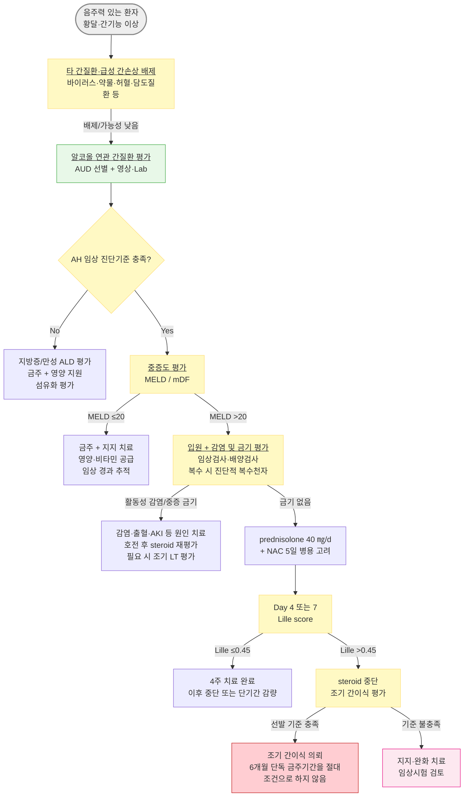

# 알코올 간질환 Alcohol-associated Liver Disease

## <mark style="color:green;">일반 사항</mark>

* 과다한 알코올 섭취와 관련된 간 손상의 스펙트럼 : 지방증, 알코올 연관 간염(AH), 간섬유화, 간경변증 등이 다양한 조합으로 나타나며 반드시 일정한 순서로 진행하는 것은 아님
* 명칭 : 과거 'Alcoholic Liver Disease'에서 Alcohol-Associated Liver Disease (ALD)로 개칭; 알코올 사용 장애(AUD)와의 통합 관리를 반영\
  ✽ 알코올 간염의 영문 표기도 'alcoholic hepatitis'에서 alcohol-associated hepatitis (AH) 로 통일 권고; KCD 코드(K70.1)는 유지
* 전 세계적으로 진행성 간질환의 가장 흔한 원인이자 간이식의 주요 적응증
* 유병률(미국) : 성인의 약 1%; 주로 40\~50대(대부분 60세 이전 발병); 전통적으로 남성이 다수이나 최근 여성·젊은 층 비율 증가 추세
* 진단 기준 알코올 섭취량(AASLD/EASL 2023 명명법 합의) : 장기간 하루 평균 남성 ＞30 g(2.1 표준잔/d), 여성 ＞20 g(1.4 표준잔/d); 표준잔 1잔 = 순수 알코올 14 g ≒ 맥주 약 340 ㎖, 와인 약 150 ㎖, 증류주 약 45 ㎖
* 하루 ＞60 g의 알코올을 섭취하는 사람의 90%에서 수 주 내 지방간 발생; 간경변증은 통상 수십 년의 만성 섭취 후에 발생 (10\~15%, 8\~12년 추적 시 7\~16%)
* 미국 ALD 관련 사망률 : 1999년 인구 10만 명당 6.7명 → 2022년 12.5명으로 증가(2018\~2022년 급가속); ALD가 유럽·미국에서 간이식의 가장 흔한 단일 적응증(2012년 17% → 2023년 41%)\
  ✽ JAMA Review(Krag et al., 2026)
* COVID-19 팬데믹 이후 음주량 증가로 ALD 관련 의료 부담이 급격히 증가; 알코올 섭취 과소보고(과거력 축소 보고)로 실제 유병률은 통계보다 높을 가능성

## <mark style="color:green;">원인 및 위험 인자</mark>

* 음주량·기간 : 남성 하루 ＞30 g, 여성 ＞20 g을 수년 이상 지속(위 일반 사항 참조); 음주량·기간이 증가할수록, 그리고 폭음(1회 남성 5잔·여성 4잔 이상)이 동반될수록 위험 상승; 식사 외 공복 음주 시 위험 3배 증가
* MetALD(대사이상 동반 알코올 관련 간질환) : **간 지방증 + 심대사 위험인자 ≥1개**가 있으면서 음주량이 여성 20\~50 g/d(140\~350 g/week), 남성 30\~60 g/d(210\~420 g/week)에 해당하는 경우. 여성 >50 g/d 또는 남성 >60 g/d의 규칙적 음주는 주로 ALD로 분류 - MASLD와 MetALD가 공존할 수 있으며 다른 간질환 원인도 배제해야 함
* 여성 : 동일 음주량에서 남성보다 간질환 진행이 빠름 (알코올 대사 속도 차이, 장투과성 증가)
* 유전 : PNPLA3 I148M, TM6SF2 등 유전 변이 - 지방간·간염·간경변증 위험 증가
* 비만 / 인슐린 저항성 : MASLD(대사 지방간질환)와 동반 시 상승 효과
* 만성 바이러스 간염 : HBV, HCV 동반 시 간경변증 및 HCC 위험 대폭 증가
* 영양 불량 : 단백질·비타민(thiamine, 엽산, 아연) 결핍
* 장내 미생물 불균형(Gut dysbiosis) : 장벽 손상 → LPS 유입 → 간 염증 촉진 (병태생리의 핵심)
* 흡연 : 섬유화 진행 가속

## <mark style="color:green;">임상 양상</mark>

* 지방간 : 대부분 무증상; 경미한 우상복부 불편감; 금주 시 가역적 회복
* 알코올 간염 : 급성 발현 - 피로, 식욕 부진, 구역, 미열, 우상복부 통증/팽만, 황달, 체중 감소, 빈맥, 저혈압, 말초 부종; 간혹 무증상
* 간경변증 : 여성형 유방, 근육 소실, 거미혈관종, 손발바닥 홍반, 복수, 식도 정맥류, 간성 뇌병증, 비장 비대
* ✽ 중증 알코올 간염은 acute-on-chronic liver failure (ACLF) 형태로 발현 가능 - 다장기 부전을 동반하며 단기 사망률이 매우 높아(1개월 20\~50%) 조기 인식과 신속한 중증도 평가가 중요

### <mark style="color:$danger;">🚩 Red Flags!</mark>

<mark style="color:$danger;">**즉각 조치 또는 응급 의뢰**</mark>

* 의식 혼탁, 지남력 장애, 행동 변화 → 간성 뇌병증
* GCS ≤8 또는 급격한 의식 저하
* 대량 상부 위장관 출혈 → 식도·위 정맥류 파열
* 급성 신손상(AKI) 또는 핍뇨 → 저혈량·패혈증·ATN·HRS-AKI 등 원인 평가
* 고열 + 복수 + 복통 → 패혈증 또는 자발성 세균성 복막염

<mark style="color:$warning;">**당일 또는 조기 의뢰**</mark>

* 황달 + AH 임상 진단기준 충족, 특히 총 빌리루빈 ＞3 ㎎/㎗ → 알코올 연관 간염 평가
* MELD score ＞20 또는 mDF ≥32 → 중증 알코올 간염
* 심한 구역·구토 - 경구 수분 및 영양 섭취 불가
* 심한 금단 증상 - 진전, 섬망, 경련

<mark style="color:$info;">**외래 추적 / 추가 평가 계획**</mark> <mark style="color:$info;">- 즉각 위험 낮으나 호전 없으면 의뢰</mark>

* 지속적 음주 + AST/ALT 반복 상승
* 금주 후 4\~8주 내에 간기능 검사 미호전
* 간경변증 합병증(복수, 근육 감소, 황달) 발생
* FIB-4 등 1차 선별 검사 저위험 판정 후에도 지속 음주 중이면 2\~3년 후 재선별

## <mark style="color:green;">진단</mark>

### <mark style="color:orange;">병력 청취</mark>

* 음주 시작 연령, 하루 음주량(표준 잔 환산), 정기적/매일 음주 지속 연수, 음주 종류, 가정 내 음주, 금주 시도력
* [알코올 사용 장애 선별](../230_/189_-alcohol-use-disorder-aud.md#undefined-3) : AUDIT(Alcohol Use Disorders Identification Test) 또는 AUDIT-C 사용 권장 - 구조화되고 비판단적인 방식으로 접근
  * AUDIT-C 고위험 컷오프 : 여성 ≥3점, 남성 ≥4점
  * 전체 AUDIT : ＜8점은 AUD 가능성이 낮지만 **ALD 환자에서는 음주 감소·금주 상담이 필요** / 8\~15점 1차 진료 수준의 단순 개입(brief intervention) / 16\~20점 전문의뢰 고려 / ≥20점 중독전문의 의뢰(AUD 확진을 위한 DSM-5 기준 평가)
* 알코올 섭취는 낙인·문화적 이유로 과소 보고가 매우 흔함 - 자가보고만으로는 부정확할 수 있어 바이오마커 병행 권장
* 최근 음주력 확인 바이오마커 : phosphatidylethanol(PEth, 혈액) - 최근 수주간 음주 노출을 반영하는 유용한 보조 바이오마커(단, 섭취량의 정밀 정량에는 한계); ethyl glucuronide(EtG, 소변)는 최근 5일 이내 음주 검출에 유용; 이 외 EtS, CDT도 활용 가능 - ACG 2024 권고\
  ✽ 검사 전 환자에게 "말하기 어려운 음주를 확인하는 데 도움이 되는 검사"임을 설명하고 치료 결정에 활용됨을 안내


**무증상 고위험군 선별(원발 스크리닝) 흐름 요약** (JAMA Review, Krag et al. 2026 Fig. 2 기반)

과도한 음주력·지속적 간효소 이상(6개월 이상)·영상 지방간 소견·당뇨/비만 중 하나 이상이 있으면 AUD 선별(AUDIT-C→AUDIT)과 섬유화 선별(FIB-4)을 **병렬로** 시행. FIB-4 ＜1.3(65세 초과는 ＜2.0) 저위험 시 지속 음주 환자는 **2\~3년 후 재선별**; FIB-4 ≥1.3(또는 ≥2.0)이면 VCTE(＜10 kPa 저위험) 또는 ELF(＜9.8 저위험) 2차 검사로 진행.


### <mark style="color:orange;">알코올 연관 간염(AH)의 임상 진단기준</mark>


**NIAAA 기준에 따른 probable AH**
- 최근 **8주 이내 황달 발생**
- 황달 발생 전 최소 6개월 동안 지속적인 과음: 여성 >40 g/d, 남성 >60 g/d이며 황달 발생 전 60일 이내에 금주 기간이 없거나 60일 미만
- 총 빌리루빈 **＞3.0 ㎎/㎗**
- AST **＞50 IU/L**, AST/ALT **＞1.5**, AST와 ALT 모두 **＜400 IU/L**
- 허혈성 간염, 약물유발 간손상, 급성 바이러스간염, 담도질환 등 다른 급성 간손상을 시사하는 교란 요인이 없음

위 기준은 조직학적 확진이 아닌 **임상적 probable AH 진단 기준**이다. 기준을 충족하면서 교란 요인이 없으면 간생검 없이 진단할 수 있다. 진단이 불확실하거나 다른 원인이 중복될 가능성이 높고 스테로이드 치료 여부가 진단에 크게 좌우되는 경우에는 경정맥 간생검을 고려한다.


### <mark style="color:orange;">실험실 검사</mark>

<table><thead><tr><th width="144.21051025390625">검사 항목</th><th width="256.84210205078125">알코올 간염 특징</th><th>비고</th></tr></thead><tbody><tr><td>AST</td><td>↑, 보통 &#x3C;400 IU/L</td><td>알코올에 의한 미토콘드리아 손상</td></tr><tr><td>AST/ALT 비</td><td>≥1.5~2가 특징적; ≥2이면 특이도 더 높음</td><td>알코올 간염에 시사적 (단독 진단 기준은 아님)</td></tr><tr><td>GGT</td><td>＞100 U/L (음주의 민감한 지표; 단, 특이도 낮음)</td><td>비만·약물·담즙정체에서도 상승; 금주 시 2~3주 내 감소</td></tr><tr><td>ALP</td><td>↑ (통상 정상치 3배 미만)</td><td>담즙정체성 표현형에서는 더 뚜렷하게 상승 가능</td></tr><tr><td>총 빌리루빈</td><td>↑ (＞3~5 ㎎/㎗; 중증 시 ≥10)</td><td></td></tr><tr><td>Albumin</td><td>↓ (&#x3C;3.0 g/㎗)</td><td>간 합성 기능 저하</td></tr><tr><td>INR</td><td>＞1.5 (중증 시 더 연장)</td><td></td></tr><tr><td>WBC</td><td>↑ (＞12,000; 중증 시 left shift)</td><td>감염과 감별 필요</td></tr><tr><td>빈혈, 혈소판 감소</td><td>흔함</td><td>엽산↓, 비장 비대</td></tr></tbody></table>

* 타 간질환 감별 : HBsAg, 필요 시 anti-HBc IgM, anti-HAV IgM, HCV Ab/RNA, 필요 시 anti-HEV IgM, ANA·ASMA·IgG, 철 대사검사 등을 임상 상황에 따라 시행. AFP는 AH의 감별진단 검사가 아니며 HCC가 의심될 때 별도로 평가
* AST가 500 IU/L 이상이면 단순 알코올 간염보다 허혈성 간염·독성 간염·바이러스 간염을 우선 감별할 것

### <mark style="color:orange;">영상 검사</mark>

* 복부 초음파 (1차 선택), CT, MRI - 지방간, 간경변증, 복수, 비장 비대 평가
* 간 탄성도 검사(Transient elastography, FibroScan) : 비침습적 섬유화 정량 평가; 급성 간염 시기에는 과대 측정 가능

### <mark style="color:orange;">비침습적 섬유화 평가</mark>

**FIB-4 score**

* (혈청 기반 섬유화 지수)
* $$\text{FIB-4} = \frac{\text{연령(세)} \times \text{AST(U/L)}}{\text{혈소판(10}^9\text{/L)} \times \sqrt{\text{ALT(U/L)}}}$$<br>
* ＜1.30 = 진행성 섬유화 가능성 낮음; ≥2.67 = 진행성 섬유화 가능성 높음
* MetALD(MASLD + 음주 동반) 환자는 섬유화 진행이 빠르므로 FIB-4 선별을 더 적극적으로 시행
* FIB-4 중간값(1.30\~2.67)에서는 추가 평가(탄성도 검사 또는 간 생검) 고려
* ⚠️ FIB-4의 한계 : 저유병률(일반 인구) 환경에서 민감도는 0.70에 불과 - 음성 예측도(0.83)는 높으나, FIB-4가 낮다고 해서 섬유화를 완전히 배제할 수는 없음; 임상적 의심이 강하면 정상 FIB-4라도 2차 검사(VCTE/ELF) 고려
* 급성 알코올 간염 시기에는 FIB-4 사용 주의 : AST·ALT 급상승으로 FIB-4가 위양성으로 매우 높게 나올 수 있어 섬유화 평가 지표로 직접 사용하지 않음. 염증 호전 후(4\~8주 뒤) 재평가 권장

### <mark style="color:orange;">중증도 평가 점수</mark>

* [modified Maddrey's Discriminant Function](https://www.mdcalc.com/calc/56/maddreys-discriminant-function-alcoholic-hepatitis) (mDF)
  * mDF = {4.6 × (PT 환자 − PT 대조)} + 혈청 빌리루빈 (㎎/㎗)
  * ≥32점 시 중증 / 불량 예후. 역사적으로 1개월 사망률이 약 20\~50% 범위로 보고되었으며, 현재는 MELD가 단기 예후와 치료 결정에 우선 사용됨
* [MELD score](https://www.konos.go.kr/popup/meldPeldPop.do) (ACG 2024 우선 권고)
  * **＞20 = 중증**; 25\~39 범위에서 corticosteroid 최대 이득; 40\~50에서는 이득이 제한적이고 **＞50에서는 일반적으로 이득이 기대되지 않음**
* [Lille score](https://www.mdcalc.com/calc/2024/lille-model-alcoholic-hepatitis) (steroid 반응 예측)
  * 7일 투여 후 빌리루빈 변화를 바탕으로 계산; ＞0.45 = 비반응 → steroid 중단
  * 4일째 Lille score도 7일째와 유사한 예측력을 보여 조기 중단 판단에 사용할 수 있음 (ACG 2024)
* 간 생검 : 진단 불확실 또는 임상시험 선별 시 고려


**중증도 점수 실전 활용 요약**

mDF ≥32 또는 **MELD ＞20** = 중증 알코올 간염 → 입원 치료 및 steroid 고려 적응증. ACG 2024는 MELD를 단기 사망률 예측과 corticosteroid 치료 결정에서 mDF보다 우선적인 지표로 권고함.


***


```mermaid
graph TD
    A([음주력 있는 환자<br/>황달·간기능 이상]) --> B[<u>타 간질환·급성 간손상 배제</u><br/>바이러스·약물·허혈·담도질환 등]
    B -->|배제/가능성 낮음| C[<u>알코올 연관 간질환 평가</u><br/>AUD 선별 + 영상·Lab]
    C --> D{AH 임상 진단기준 충족?}
    D -->|No| E[지방증/만성 ALD 평가<br/>금주 + 영양 지원<br/>섬유화 평가]
    D -->|Yes| F[<u>중증도 평가</u><br/>MELD / mDF]
    F -->|MELD ≤20| G[금주 + 지지 치료<br/>영양·비타민 공급<br/>임상 경과 추적]
    F -->|MELD >20| H[<u>입원 + 감염 및 금기 평가</u><br/>임상검사·배양검사<br/>복수 시 진단적 복수천자]
    H -->|활동성 감염/중증 금기| I[감염·출혈·AKI 등 원인 치료<br/>호전 후 steroid 재평가<br/>필요 시 조기 LT 평가]
    H -->|금기 없음| J[prednisolone 40 ㎎/d<br/>+ NAC 5일 병용 고려]
    J --> K[Day 4 또는 7<br/>Lille score]
    K -->|Lille ≤0.45| L[4주 치료 완료<br/>이후 중단 또는 단기간 감량]
    K -->|Lille >0.45| M[steroid 중단<br/>조기 간이식 평가]
    M -->|선발 기준 충족| N[조기 간이식 의뢰<br/>6개월 단독 금주기간을 절대조건으로 하지 않음]
    M -->|기준 불충족| O[지지·완화 치료<br/>임상시험 검토]

style A fill:#eeeeee,stroke:#888888,stroke-width:2px
classDef yellow fill:#fff9c4,stroke:#ffe082
class B,D,F,H,M,K yellow
style C fill:#e8f8e8,stroke:#4caf50
style N fill:#ffcdd2,stroke:#c62828
style O fill:#fde8f0,stroke:#e91e8c
```

<p align="center"><strong>알코올 연관 간질환 진단 및 치료 알고리듬</strong></p>

***

## <mark style="background-color:$warning;">Management</mark>

### <mark style="color:orange;">치료 원칙</mark>

1. 금주 - 모든 병기에서 가장 중요한 단일 치료; 지방간은 금주만으로 빠르게 회복
2. 영양 지원 - 영양 불량이 합병증·사망률 결정 인자
3. AUD 통합 관리 - 금주 유지를 위한 행동 치료 및 약물 치료 병행 (ACG 2024 강조)

### <mark style="color:orange;">임상 표현형 분류 (Bedside Phenotype)</mark>


알코올 간질환은 다양한 임상 양상과 합병증으로 나타난다. 아래 구분은 **공인된 상호배타적 분류체계가 아니라 입원 시 우세한 임상 문제를 정리하기 위한 실무적 구분**이다.


<table><thead><tr><th width="161.73681640625">표현형</th><th width="192.3157958984375">주요 임상 단서</th><th width="172.894775390625">특징적 Lab/소견</th><th>우선 처치 방향</th></tr></thead><tbody><tr><td>염증성 (Inflammatory)</td><td>발열, WBC ↑, 황달, CRP ↑</td><td>bilirubin↑↑, AST/ALT ≥2</td><td>감염 배제 후 steroid 고려</td></tr><tr><td>담즙정체성 (Cholestatic)</td><td>황달 두드러짐, 회복 지연</td><td>direct bilirubin↑↑, ALP/GGT↑</td><td>장기 추적, 담도 질환 감별</td></tr><tr><td>비대상성 간경변증</td><td>복수, 간성 뇌병증, 정맥류 출혈</td><td>albumin↓, INR↑, Na↓</td><td>합병증 치료 + 간이식 평가</td></tr><tr><td>금단 증상 우세</td><td>진전, 불안, 발한, 빈맥</td><td>CIWA-Ar 상승</td><td>benzodiazepine + thiamine 우선</td></tr><tr><td>영양불량/Sarcopenia</td><td>근육 감소, 체중 감소, 쇠약</td><td>albumin↓, zinc↓</td><td>고단백·고칼로리 영양 집중</td></tr><tr><td>감염 동반</td><td>발열, 저혈압, 복통</td><td>procalcitonin↑, lactate↑</td><td>감염 치료 우선, steroid 보류</td></tr><tr><td>간신증후군 (HRS)</td><td>핍뇨, creatinine 상승</td><td>Cr↑, Na↓</td><td>AKI 원인 교정; HRS-AKI이면 albumin + terlipressin(또는 norepinephrine) 고려</td></tr><tr><td>Steroid 비반응 중증</td><td>Lille ＞0.45, 다장기 부전</td><td>MELD↑↑</td><td>조기 간이식 또는 완화 치료</td></tr></tbody></table>

### <mark style="color:orange;">기본 치료</mark>

* 금주 및 금단 증상 치료 (필요시 입원 치료) (☞ [음주](../230_/189_-alcohol-use-disorder-aud.md))
* 입원 기준 : **MELD ＞20 또는 중증 AH**, 간성 뇌병증, AKI/순환부전, 중증 감염 의심, 위장관 출혈, 경구 수분·영양 섭취 불가 등
* 알코올 사용 장애(AUD) 치료 통합 : 행동 치료(동기 강화 면담) + 약물 치료 병행; 금주 유지가 장기 예후 결정 - 9,635명 코호트 연구에서 AUD 약물치료는 간경변 환자의 비대상성(decompensation) 위험을 유의하게 낮춤(보정 OR 0.35)
  * naltrexone : FDA 승인 AUD 치료제(일반적으로 1차 선택지 중 하나)(보정 OR 0.27); μ-opioid 수용체 길항제; 간독성 모니터링(ALT/AST) 병행 권장 - compensated cirrhosis에서는 신중 사용 가능하나, decompensated cirrhosis·알코올 간염에서는 일반적으로 피하거나 매우 신중히 사용
  * acamprosate : FDA 승인; 신장 배설, 간 대사 부담 없음 - CrCl ＜30 mL/min 금기; CrCl 30\~50 mL/min에서는 감량 필요
  * disulfiram : FDA 승인이나 간독성 위험으로 **ALD 환자에게는 권장하지 않음**
  * baclofen : 신장 배설로 간 대사에 독립적 - ALD·간경변증 환자를 대상으로 RCT가 시행된 유일한 AUD 약물; 중독 잠재성이 낮음. 대표 RCT에서 baclofen 10 ㎎ tid 투여군의 12주 금주율이 위약군 대비 유의하게 높았음(71% vs 29%); 다른 RCT에서는 30 ㎎/d와 75 ㎎/d 모두 위약보다 우수했으나 두 용량 간 유의차는 없었음. 급격한 중단 시 심각한 이탈 반응 위험 - 서서히 감량 (국내 허가 외 사용, 처방 전 상의 필요)
  * gabapentin : 오프라벨; 위 코호트에서 비대상성 위험 감소와 연관(보정 OR 0.36) - 신중한 대안으로 고려 가능
  * semaglutide(GLP-1 수용체 작용제) : 비만을 동반한 중등도~중증 AUD 환자 108명을 대상으로 한 2026년 RCT(Lancet)에서 26주 후 heavy drinking days가 위약 대비 13.7%p 더 감소. **AUD 적응증은 미승인**이며 ALD/AH 치료 효과를 입증한 연구가 아니므로 현재는 연구 단계
* 약물 주의
  * NSAIDs : 사용 금기에 준하여 강력 회피 - 신기능 저하·위장관 출혈·HRS 위험 증가
  * acetaminophen : 만성 과음·영양불량·간질환에서는 용량을 보수적으로 제한하고 의료진과 상의하여 사용; 급성 중증 AH 또는 지속 음주 중에는 자가 복용을 피함
  * 아미노글리코사이드계 항생제(겐타마이신, 아미카신 등) 가급적 회피 : 간신증후군(HRS) 위험이 높은 ALD 환자에서 신독성이 치명적일 수 있음; 불가피한 경우 혈중 농도 모니터링 및 최단 기간 사용
  * 간독성 약물·건강보조식품·한약 주의

### <mark style="color:orange;">영양 지원</mark>

<table><thead><tr><th width="127.9473876953125">항목</th><th width="198.421142578125">권장 목표</th><th>임상 포인트</th></tr></thead><tbody><tr><td>총 열량</td><td>35~40 ㎉/㎏/d</td><td>저영양 교정 핵심</td></tr><tr><td>단백질</td><td>1.2~1.5 g/㎏/d</td><td>간성 뇌병증 있어도 제한 불요 - 오히려 근육 소실 악화</td></tr><tr><td>식사 패턴</td><td>소량씩 자주(4~6회/d)</td><td>야간 공복 최소화; late evening snack 적극 권장 (예: 두유 1컵, 삶은 달걀 1\~2개, 단백질 쉐이크, 통밀 크래커 + 치즈)</td></tr><tr><td>Thiamine</td><td>결핍 위험이 높으면 보충</td><td>Wernicke 의심 시 고용량 IV thiamine; 저혈당 치료가 필요한 경우 포도당 투여를 지연하지 않음</td></tr><tr><td>아연</td><td>결핍 시 보충</td><td>결핍 여부·임상 상황에 따라 투여; 장기 고용량은 구리 결핍 주의</td></tr><tr><td>엽산/B 복합제</td><td>보충 권장</td><td>결핍 매우 흔함</td></tr><tr><td>경관 영양</td><td>경구 불가 시 조기 시행</td><td>TPN보다 장관 영양 선호</td></tr></tbody></table>

* ALD에서는 비만 + sarcopenia 동반이 흔함 - BMI만으로 영양 상태 판단 불가; 근육량 평가 병행 권장

### <mark style="color:orange;">동반 질환 관리</mark>

* 비만, 당뇨병, 인슐린 저항성, 영양 불량, 흡연, 철분 과부하, 바이러스 간염(B·C형) 동시 치료 - ALD 환자의 95% 이상이 심대사 위험인자를 1개 이상 동반
* 간경변 단계별 심대사 약물 사용 시 안전성 고려사항 :

<table><thead><tr><th width="110">약물군</th><th width="230">간질환에서의 참고 사항</th><th>실전 포인트</th></tr></thead><tbody><tr><td>Statin</td><td>대상성 간경변에서 안전; 관찰 연구에서 간질환 관련 사건 감소와 연관</td><td>Child-Pugh B\~C에서는 저용량으로 조정(예: simvastatin ≤20 ㎎/d); 근육·간독성 모니터링; 복수 동반 시 신중</td></tr><tr><td>GLP-1 RA (semaglutide 등)</td><td>MASH 조직학적 개선 근거(ESSENCE 시험); 알코올 갈망 감소 가능성도 보고</td><td>대상성 간경변까지 사용 가능(제한적 자료); 위장관 부작용 흔함, 서서히 적정</td></tr><tr><td>SGLT2 억제제</td><td>지방간 감소 근거 제한적</td><td>Child-Pugh B까지 자료 존재; 생식기 진균 감염·저혈량 주의</td></tr><tr><td>Pioglitazone</td><td>스테아토간염 조직학적 개선 근거</td><td>대상성 간경변 가능; 비대상성은 비권장; 부종·체중 증가·sarcopenia 환자에서 주의</td></tr><tr><td>Metformin</td><td>조직학 개선 근거 부족(중립)</td><td>eGFR ＜30에서 회피; 조영제·급성 질환 시 일시 중단</td></tr><tr><td>ACE 억제제/ARB</td><td>관찰 연구에서 간 관련 사건 감소와 연관</td><td>복수 동반 시 회피(저혈압·신기능 저하 위험); 신기능·칼륨 모니터링</td></tr></tbody></table>

* Nonselective β-blocker(propranolol, carvedilol 등) : 임상적으로 유의한 문맥압항진증을 동반한 대상성 간경변에서 정맥류 출혈 1차 예방 목적으로 고려 (자세한 용량·적응증은 간경변증 챕터 참조)

## <mark style="color:green;">약물 치료</mark>

### <mark style="color:orange;">Corticosteroid (중증 알코올 간염)</mark>

* 적응증 : **MELD ＞20**인 중증 AH; mDF ≥32는 보조적 기준으로 사용할 수 있음. ACG 2024 기준 MELD 25\~39 범위에서 최대 이득
* 주요 금기/보류 사유 : 조절되지 않은 감염·패혈증, 활동성 위장관 출혈, 중증 신부전/AKI, 조절되지 않는 당뇨병, 치료되지 않은 HBV 감염 등\
  ✽ 감염·출혈·신기능 이상은 원인 치료 후 steroid 재평가 가능하나, 재투여 여부는 위험-이득을 개별적으로 판단


**Steroid 시작 전 감염 평가 필수** : 병력·신체진찰과 혈액검사에 더해 임상적으로 의심되면 혈액·소변배양 및 흉부영상 등을 시행하고, 복수가 있으면 진단적 복수천자로 SBP를 평가한다. 모든 검사를 모든 환자에게 일률적으로 시행할 필요는 없다. 투여 중 감염 징후를 면밀히 모니터링


<table><thead><tr><th width="402.42108154296875">임상 상황</th><th align="center">Prednisolone</th></tr></thead><tbody><tr><td>Severe AH (MELD ＞20) + steroid 금기 없음</td><td align="center">✅ 고려/권장</td></tr><tr><td>감염 치료 완료 후 안정화</td><td align="center">⚠️ 신중 가능</td></tr><tr><td>조절되지 않는 패혈증</td><td align="center">❌ 보류</td></tr><tr><td>활동성 GI 출혈</td><td align="center">❌ 지혈 후 재평가</td></tr><tr><td>중증 AKI / HRS-AKI</td><td align="center">⚠️ 보류 후 원인 치료·재평가</td></tr><tr><td>MELD 25\~39</td><td align="center">✅ 최대 이득</td></tr><tr><td>MELD ＞50</td><td align="center">❌ 일반적으로 이득 기대 어려움</td></tr><tr><td>Lille ≤0.45 (7일 반응)</td><td align="center">✅ 4주 유지</td></tr><tr><td>Lille ＞0.45 (비반응)</td><td align="center">❌ 중단, 간이식 평가</td></tr></tbody></table>

* prednisolone : 40 ㎎/d po × 4주 <mark style="color:blue;">\[소론도]</mark>\
  ✽ 4주 후 감량이 필요한지에 대한 근거는 제한적이며, 빠른 감량과 느린 감량의 우월성도 입증되지 않음. 중단 또는 단기간 감량은 임상 상황과 기관 프로토콜에 따름
* methylprednisolone : 32 ㎎/d IV × 4주 (경구 불가 시) <mark style="color:blue;">\[메치론]</mark>
* 반응 평가 : **Day 4 또는 Day 7 Lille score** 계산 → Lille ＞0.45 시 지속 이득 가능성이 낮아 **steroid 중단 권고**
  * 비반응 환자는 감염 및 AKI 발생 위험이 특히 높음 - 조기 완화 치료 및 간이식 평가 병행

### <mark style="color:orange;">N-Acetylcysteine (중증, Steroid 병용)</mark>

* 중증 알코올 간염에서 prednisolone에 병용 투여하면 단기(주로 28일) 생존 개선 가능성이 보고되어 ACG 2024에서 병용을 고려할 수 있음. 장기 생존 이득은 확립되지 않음
* 5일 IV 투여 (AH 임상연구에서 사용된 modified infusion 방식; 병원 프로토콜에 따라 시행) : Day 1 - 150 ㎎/㎏ over 1시간(부하용량), 이후 50 ㎎/㎏ over 4시간, 100 ㎎/㎏ over 16시간; Day 2\~5 - 100 ㎎/㎏/d
* 국내 아세틸시스테인 주사제 가용 <mark style="color:blue;">\[아세탄주]</mark> 등. **알코올 간염은 국내 허가 적응증과 다를 수 있으므로 허가사항과 병원 프로토콜을 확인**

### <mark style="color:orange;">Steroid 금기 시의 치료 원칙</mark>

* **Pentoxifylline은 현재 중증 AH의 표준 대체치료로 권고하지 않는다.** STOPAH에서 28일 사망률 개선이 입증되지 않았고, steroid 비반응 환자의 구제치료로도 효과가 없었다.
* 감염·활동성 위장관 출혈·중증 AKI 등으로 steroid를 시작할 수 없는 경우에는 해당 원인을 우선 치료하고, 영양·금주·AUD 치료를 포함한 지지요법을 시행한다.
* 중증 AH이면서 steroid를 사용할 수 없거나 비반응인 경우에는 **조기 간이식 평가**를 적극적으로 고려한다.
* FMT, G-CSF 등은 현재 표준치료가 아니며 임상시험 또는 전문센터의 연구적 치료 범위에서 고려한다.

### <mark style="color:orange;">간이식 (Liver Transplantation)</mark>

* ALD는 유럽·미국에서 간이식의 가장 흔한 단일 적응증(미국 2023년 전체 간이식 중 41%, 2012년 17%에서 증가); 2023년 미국에서 알코올 관련 간경변 3,505건, 알코올 간염 658건 이식 시행
* MELD 3.0은 이식 우선순위와 예후 평가에 사용한다. **비대상성 사건(복수, 정맥류 출혈, 간성 뇌병증 등)이 발생하면 MELD와 관계없이 간이식 평가를 의뢰**하고, 비대상성 사건이 없는 경우에도 일반적으로 MELD 약 15 전후부터 평가를 고려한다.
* 기존 기준 : 6개월 금주 후 간이식 (전통적 기준)
* 중증 알코올 간염으로 steroid 비반응 시, 6개월 금주 기준 충족 없이도 **엄선된 환자에서 조기 간이식**을 고려할 수 있음. 미국 다기관 조사에서도 많은 이식센터가 6개월 금주기간을 절대적 조건으로 사용하지 않고 조기 이식을 평가하고 있음
  * 조기 이식 코호트 생존율 : 1년 94%, 3년 84% (전통적 기준 적용 시 예상 6개월 생존율 ＜20%와 대비)
  * 이식 후 재발 : 1년 10%, 3년 17%; 이식 후 사망의 가장 강력한 위험인자는 이식 후 지속 음주(HR 4.6)
* 조기 간이식 선발의 핵심 - 엄격한 다학제 평가 (정신건강의학과 + 중독의학과 + 사회사업팀 필수 협력)
  * 가족/사회적 지지 체계 확인 - 조기 이식 성패를 좌우하는 핵심 요소
  * 재발 위험성 평가 (AUD 중증도, 이전 금주 시도, 사회적 안정성)
  * 이식 후 지속적 금주 지원 계획 수립
* steroid 비반응 환자에서 **4개 이상의 장기 부전이 있고 조기 간이식 대상이 아닌 경우**에는 예후가 매우 불량하므로 완화의료가 적절할 수 있다. 4개 장기 부전 자체를 모든 환자에게 적용하는 절대적 '이식 제외 기준'으로 해석해서는 안 된다.

### <mark style="color:orange;">신규·연구 단계 치료</mark>

* FMT (대변 미생물 이식) : 초기 소규모 연구와 후속 단일지역 RCT에서 중증 AH 환자의 단기 생존 개선 가능성이 보고되었으나, 표본 규모와 일반화 가능성의 한계가 있음. 현재 국내 임상 표준 치료가 아니며 연구 단계
* IL-1 억제제 (anakinra, canakinumab) : 다수 임상시험 진행; steroid와 비교한 대규모 RCT에서 아직 우월성 미입증 - 현재 표준 치료 아님
* 항산화제 : 독립적 효과 입증 부족

## <mark style="color:green;">비-약물 치료 및 예방</mark>

* 완전 금주 : 모든 병기에서 유일하게 입증된 질환 경과 개선 방법; 지방간은 2\~4주 내 호전
* 음주 절제 상담 : 동기 강화 면담(Motivational Enhancement Therapy, MET) - 4회기 프로그램에서 6개월 금주율 유의 상승(73% vs 59% 대조군); 인지행동치료(CBT) 병행 시 2년 금주율 74% vs 48%(대조군); 정신건강의학과·중독의학과 협력\
  ✽ 섬유화 검사 결과를 환자에게 알리는 것 자체가 행동 변화의 동기가 됨 - 덴마크·스페인·영국의 전향적 연구에서 VCTE 결과 피드백을 받은 군의 금주·절주율이 대조군보다 유의하게 높았음(OR 1.8\~2.5); 검사 결과를 상담의 도구로 적극 활용할 것
* 영양 재활 : 고칼로리·고단백 식사; 결핍 영양소(thiamine, 엽산, 아연) 보충
* 운동 : sarcopenia는 BMI와 무관한 독립적 사망 예측 인자 - 저강도 유산소 + 근력 운동 권장; 심한 간경변증에서는 주치의 지도 아래 시행\
  ✽ **frailty(허약)** 평가도 고려 - handgrip strength 측정, chair stand test 등 간단한 도구로 기능 상태 파악 가능; sarcopenia와 함께 이식 전 평가 및 예후 예측에 활용
* NSAID·알코올·간독성 약물 회피; acetaminophen은 금주 상태에서 제한 용량 내 사용 가능 (상기 참조)
* HAV 및 HBV 예방 접종 : 면역이 없는 만성 간질환 환자에서 시행. 그 외 인플루엔자·폐렴구균·COVID-19·Tdap/파상풍·대상포진 등은 연령 및 위험도에 따른 일반 예방접종 일정에 따름
* 정기 추적 검사 : 간경변증(F4) 시 6개월마다 간초음파 + AFP(HCC 감시); F3에서는 모든 환자에게 일률적 감시를 권고하지 않고 개별 HCC 위험에 따라 전문의가 결정. 비대상성 간경변증에서는 정맥류 및 문맥압항진 합병증을 평가
* MetALD 환자(정의는 상기 원인·위험인자 참조)는 대사질환(비만·당뇨)이 동반된 음주자로, FIB-4 등 선별 검사를 더욱 적극적으로 시행 권장; 비만·당뇨 환자를 진료할 때도 반대로 음주력을 체계적으로 확인해야 함 - 그렇지 않으면 MASLD로 오분류되어 알코올 기여분이 간과될 수 있음

***

### <mark style="color:red;">질병코드</mark>

K70 알코올성 간질환

K70.0 알코올성 지방간

K70.1 알코올성 간염

K70.2 알코올성 간섬유증 및 경화증

K70.3 알코올성 간경변증

K70.4 알코올성 간부전

***

## <mark style="color:purple;">처방례</mark>

> **처방례 1. 알코올 연관 간염 (비중증, MELD ≤20)**
>
> ```
> 티아민(Vitamin B1) 100 ㎎/T  1T qd (식후)
> 비타민B 복합제               1T tid (식후)
> 엽산 1 ㎎/T                  1T qd (식후)
> ※ 금주 상담 병행 필수; 4~8주 후 간기능 재검사
> ※ 영양 불량 동반 시 고칼로리·고단백 경구 영양 보충제 추가
> ```
>
> _✽비중증 AH의 기본 치료: 금주 + 영양 지원 + 결핍 영양소 보충. MELD ≤20에서는 일반적으로 corticosteroid를 사용하지 않는다._

> **처방례 2. 알코올 금단 증상 예방·치료 (외래 가능한 경증)**
>
> ```
> [외래 치료는 경증이며 신뢰할 수 있는 보호자·추적관찰이 가능한 경우에 한함]
> Lorazepam 1~2 ㎎ q4~6h 필요 시, 증상에 따라 감량
> 또는 기관의 symptom-triggered protocol 적용
>
> 티아민 100 ㎎/d  × 3~5일 후 경구 전환
> ※ CIWA-Ar <10의 경증이라도 금단 악화 가능성을 설명하고 24시간 이내 재평가 권장
> ※ 중등도 이상 금단(CIWA-Ar ≥10), 경련 또는 섬망 기왕력,
>    중대한 내과질환, 불충분한 사회적 지지 → 입원 치료
> ※ 중증 간질환에서는 diazepam/chlordiazepoxide 등 장시간 작용 benzodiazepine의
>    축적 위험을 고려하여 lorazepam 또는 oxazepam을 우선 고려
> ※ Wernicke 뇌증 의심 → thiamine 200~500 ㎎ IV 2~3회/d 등 고용량 치료
> ```
>
> _✽금단 치료는 환자의 간기능, 금단 중증도, 과거 경련·섬망 여부를 고려하여 결정한다. 외래 고정용량 처방보다는 증상 기반 치료와 조기 재평가가 안전하다._

> **처방례 3. 중증 알코올 간염 (MELD ＞20, 입원 치료, steroid 금기 없음)**
>
> ```
> [입원 치료]
> Prednisolone 총 40 ㎎/d po  × 28일
> 또는 Methylprednisolone 32 ㎎ IV qd (경구 불가 시)
>
> N-acetylcysteine (NAC) IV  5일:
>   Day 1 - 부하 150 ㎎/㎏ over 1시간
>           → 50 ㎎/㎏ over 4시간
>           → 100 ㎎/㎏ over 16시간
>   Day 2~5 - 100 ㎎/㎏/d
>   ※ AH에서의 NAC 병용은 단기 생존 개선 가능성이 있어 고려할 수 있으나
>      장기 생존 이득은 확립되지 않았으며 병원 프로토콜에 따라 시행
>
> 티아민 100 ㎎/d  × 3~5일 등 영양결핍 교정
> ※ 아연은 결핍 또는 임상적 필요가 있는 경우 보충
>
> [Day 4 또는 7] Lille score 계산
>   → Lille >0.45 시 steroid 중단 및 조기 간이식 평가
> ※ Day 4에는 단순히 빌리루빈이 감소하지 않았다는 이유만으로 중단하지 않고
>    Lille score를 계산하여 판단
> ※ 감염·AKI·위장관 출혈 등 steroid 관련 위험을 투여 중 면밀히 감시
> ```
>
> _✽중증 AH에서는 감염을 평가하고, 활동성 감염·중증 AKI·활동성 위장관 출혈 등 주요 금기가 없을 때 prednisolone을 고려한다. 비반응 환자는 조기 간이식 평가와 완화 치료 가능성을 함께 검토한다._

### <mark style="color:$success;">핵심 복약 지도</mark>

> **스테로이드(prednisolone)를 처방받으셨나요?**
>
> * **아침 식사 후 한 번** 복용합니다. 공복 복용 시 위장 장애가 생길 수 있습니다.
> * 임의로 중단하거나 용량을 줄이지 마세요. 의사가 단계적으로 줄이는 계획을 세워드립니다.
> * 복용 중 발열, 오한, 기침, 복통, 배에 물이 차는 느낌이 있으면 **즉시 병원에 연락**하세요 - 감염 합병증 신호일 수 있습니다.
> * 혈당이 오를 수 있으므로 당뇨 환자는 혈당 모니터링을 강화하세요.

> **티아민(Vitamin B1)을 처방받으셨나요?**
>
> * 알코올은 체내 티아민(비타민 B1)을 심하게 고갈시킵니다.
> * 티아민 부족 시 '베르니케 뇌증'(혼란, 눈떨림, 보행 장애)이 발생할 수 있어 복용이 매우 중요합니다.
> * 티아민을 가능한 한 조기에 투여합니다. **저혈당을 교정해야 하는 경우 포도당 투여를 지연해서는 안 됩니다.**

> **아연 보충제를 처방받으셨나요?**
>
> * 공복 복용 시 위장 자극이 있으면 식사와 함께 복용할 수 있습니다. 장기 고용량 복용 시 구리 결핍에 주의합니다.

> **언제 즉시 병원을 방문해야 하나요?**
>
> * 갑작스런 의식 혼탁, 말이 어둔해지는 경우 (간성 뇌병증 가능성) - **즉시 응급실**
> * 검은 변, 선홍색 혈변 또는 피를 토하는 경우 (식도 정맥류 출혈) - **즉시 응급실**
> * 복부가 급격히 팽창하거나 고열이 동반된 경우 (자발성 세균성 복막염)
> * 스테로이드 복용 중 감염 증상이 나타나는 경우

***

### <mark style="color:blue;">환자 안내서</mark>


**알코올 연관 간질환 - 간은 회복될 수 있습니다. 금주가 치료의 시작입니다.**

알코올은 간에 직접 독성을 가집니다. 지방간 단계에서는 금주만으로 간이 빠르게 회복되지만, 알코올 간염이나 간경변증으로 진행되면 회복이 매우 어려워집니다. 지금 멈추는 것이 가장 효과적인 치료입니다.


#### <mark style="color:$primary;">왜 알코올이 간에 해로운가요?</mark>

* 알코올은 간에서 분해될 때 독성 물질(아세트알데히드)을 만들어 간세포를 손상시킵니다.
* 손상이 반복되면 간에 염증(알코올 간염)이 생기고, 결국 딱딱한 흉터 조직(간경변증)으로 변합니다.
* 간경변증이 되면 간암, 복수, 식도 출혈 등 심각한 합병증이 발생할 수 있습니다.

#### <mark style="color:$primary;">금주가 왜 그렇게 중요한가요?</mark>

* **지방간 단계**에서 금주하면 간 지방과 간수치가 수주 내 빠르게 호전될 수 있습니다.
* **알코올 간염** 단계에서도 금주는 회복의 핵심이며, 약 치료의 효과를 높여줍니다.
* **간경변증**에서도 금주하면 더 이상의 진행을 막고 일부 기능 회복이 가능합니다.
* 혼자 금주하기 어려우신 분은 전문의에게 솔직히 말씀해 주세요. 금주를 돕는 약과 상담이 있습니다.

#### <mark style="color:$primary;">일상생활에서 어떻게 관리하나요?</mark>

* 🚫 **술은 한 모금도 마시지 마세요** - '조금은 괜찮겠지'라는 생각이 재발의 시작입니다.
* 🥗 **균형 잡힌 식사**를 규칙적으로 드세요. 단백질(살코기, 달걀, 두부)을 충분히 섭취하세요.
* 💊 **처방된 비타민(티아민, 엽산)**을 빠짐없이 복용하세요 - 알코올이 체내 비타민을 고갈시킵니다.
* 🚫 **아세트아미노펜(타이레놀류)**은 **음주 중 절대 복용하지 마세요.** 술을 마시는 상태에서 복용하면 소량이라도 간에 심각한 손상을 줄 수 있습니다. 금주 중에는 의료진과 상의 후 1일 2 g 이하로 제한적으로 사용하세요.
* 🚫 건강 보조 식품, 한약, 각종 간 건강 제품도 의사와 먼저 상의 후 드세요.
* ☀️ **가벼운 걷기 운동**을 매일 30분씩 실천하세요 - 근육을 유지하는 것이 회복에 도움이 됩니다.

#### <mark style="color:$primary;">이런 증상이 나타나면 즉시 병원으로 가세요</mark>

* 🧠 말이 어눌해지거나, 갑자기 멍해지거나, 방향감각을 잃는 경우 → **응급실**
* 🩸 검은 변 또는 피를 토하는 경우 → **응급실**
* 🤒 배가 급격히 부풀어 오르거나 열이 나는 경우 → **당일 진료**
* 💛 눈이나 피부가 노랗게 되는 경우 → **당일 진료**

#### <mark style="color:$primary;">변비를 조심하세요 - 간성 뇌병증의 숨은 유발 요인</mark>

* 간경변증이 있는 분은 변비가 생기면 장내 암모니아가 과다 흡수되어 **간성 뇌병증(의식 혼탁)**이 악화될 수 있습니다.
* 간성 뇌병증이 반드시 음주 때문에만 생기는 것이 아닙니다 - 변비, 감염, 탈수도 흔한 유발 요인입니다.
* 매일 규칙적인 배변을 하도록 노력하시고, 변비가 2\~3일 이상 지속되면 즉시 주치의와 상의하세요.

#### <mark style="color:$primary;">정기 추적 검사가 왜 필요한가요?</mark>

* 간경변증이 있으면 **간암(간세포암)**이 발생할 수 있습니다 - 초기에는 증상이 없어 정기 검사 없이는 발견이 어렵습니다.
* **6개월마다 복부 초음파 + 혈액검사(AFP)**를 받으시면 간암을 조기에 발견할 수 있습니다.
* 식도·위 정맥류 여부를 확인하기 위한 **내시경 검사**도 의사 지시에 따라 정기적으로 받으세요.
