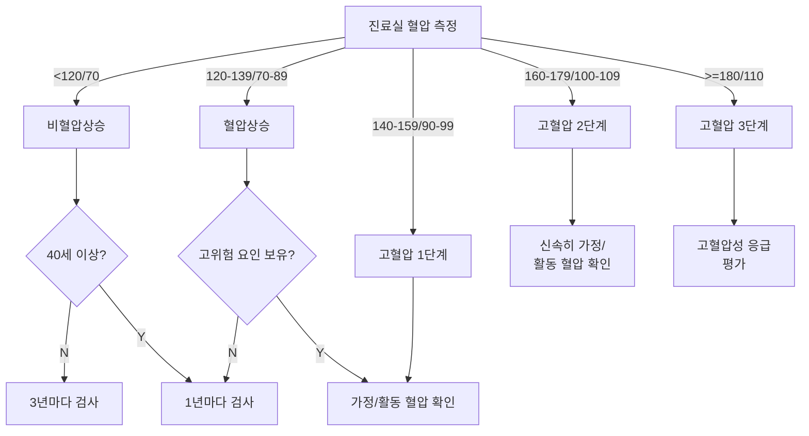
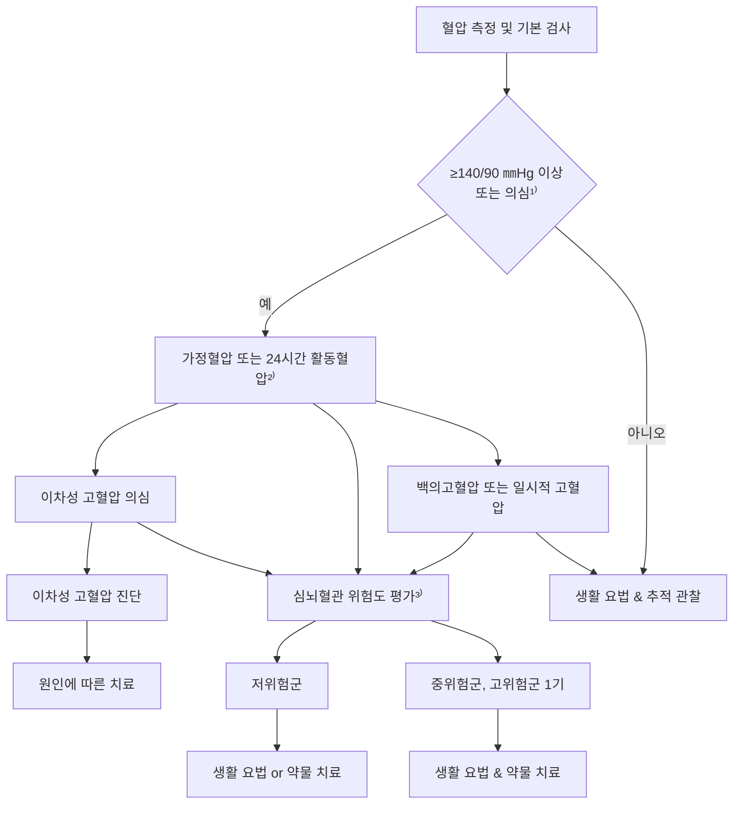
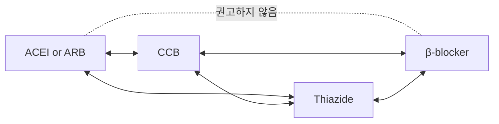
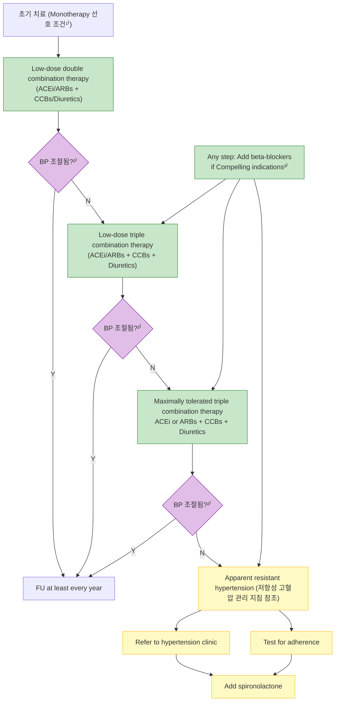
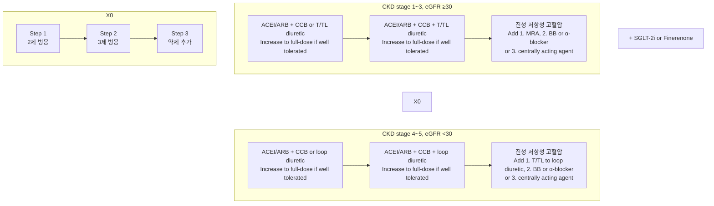
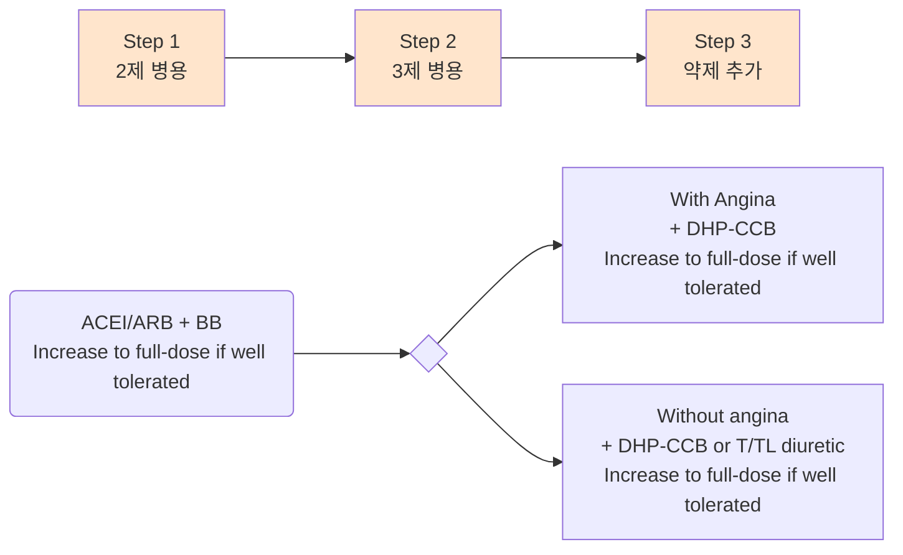
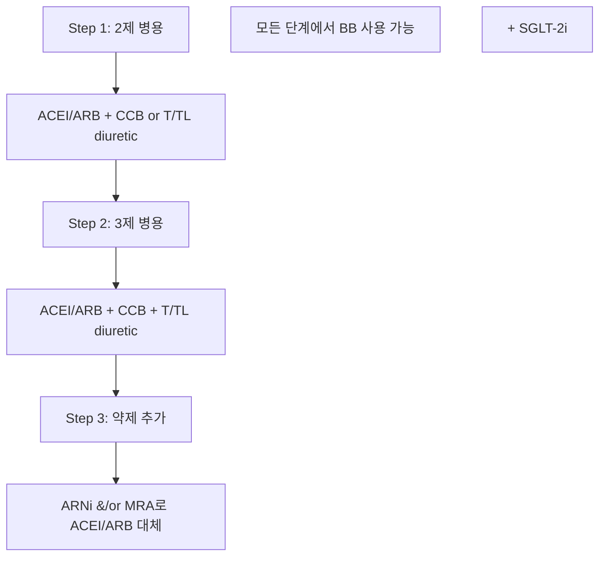
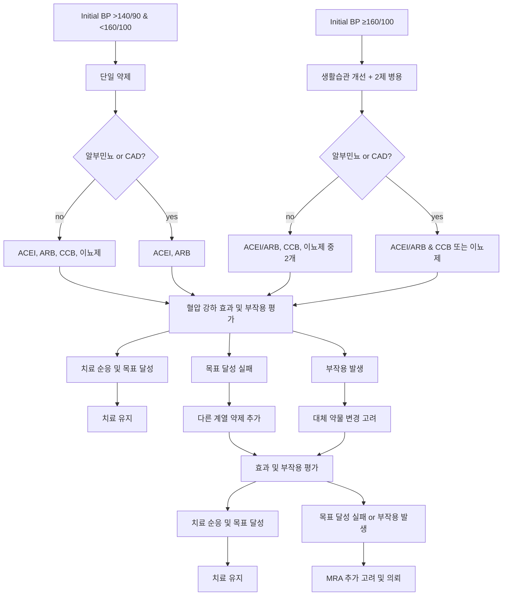
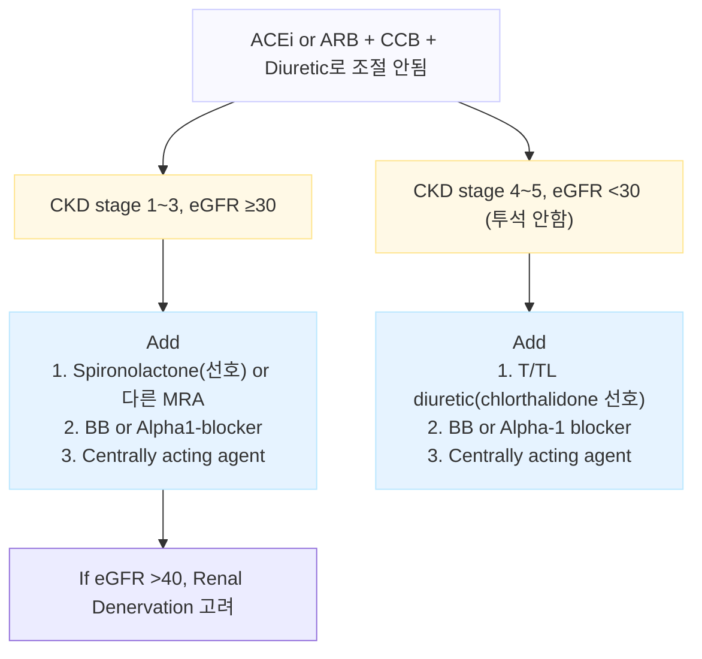
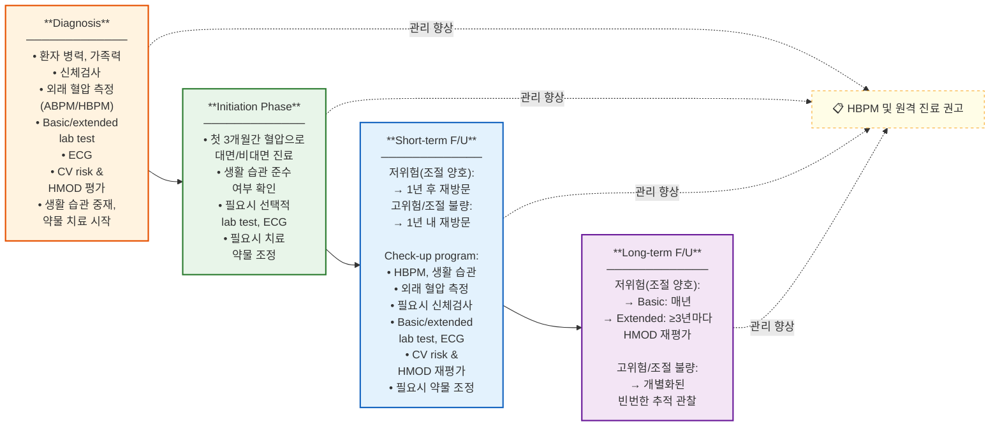

# 고혈압 Hypertension

## <mark style="color:green;">일반 사항</mark>

* 전 세계 질병 부담에서 가장 중요한 수정 가능한 위험 인자 중 하나
* 유병률 : 140/90 ㎜Hg 기준 시 ≥60세의 ＞60%; 130/80 ㎜Hg 기준 시 ≥75세의 ＞80%
  * 우리나라 ≥20세 (140/90 기준] : 유병률 30%, 인지율 77.2%, 치료율 74.1%, 조절률 58.6%
* 성별 : 남성에서 높다가, 폐경 이후 여성에서 증가하여 65세 이상에서는 여성에서 더 높음
* 연령 : SBP는 연령에 따라 상승; DBP는 50\~60세까지만 상승하고 이후 약간 감소
* 변동성 : 여름이 낮고 겨울이 높음; 야간에는 주간보다 10\~20% 낮음(dipper)
* 혈압과 위험
  * BP 115/75 ㎜Hg부터 20/10 ㎜Hg 증가마다 심혈관 질환 사망률이 2배씩 증가
  * SBP 10\~20 ㎜Hg, DBP 5\~10 ㎜Hg 하락 시 뇌졸중 30\~40%, 허혈성 심질환 15\~20% 감소
  * 고위험 환자에서의 3개월의 고혈압 치료 지연은 심혈관 사망률 2배 증가와 관련
  * 고령자에서의 지나친 혈압 하강 조절은 어지럼, 실신, 낙상 위험을 높일 수 있음
  * DBP ＜70 ㎜Hg 시 심혈관 합병증의 위험이 증가할 수 있음 (J-curve phenomenon)
    * DBP 70\~80 ㎜Hg에서 위험이 가장 낮았고, DBP ＜60 ㎜Hg에서는 심혈관 사고 위험이 증가되었다는 보고가 있음
  * 젊은 연령에서는 SBP와 DBP 상승 모두 CV event 위험 증가와 관련되고, ≥50세에서는 SBP와 맥압이 DBP보다 CV event에 대해 더 큰 예측력을 가짐
* 증상
  * 이차성 및 장기 손상 이외에는 보통 무증상
  * 두통 : 중증 고혈압에서 뒤통수 부위에 국한; 주로 이른 아침 발생, 수 시간 후 자연 회복
* 진단 시 활동 또는 가정혈압을 측정하여 '백의 고혈압' 및 '가면 고혈압'을 감별
* 진단 시 이차성 고혈압, 생활 습관, 심뇌혈관 질환 및위험 인자, 치료에 영향을 줄 수 있는 동반 질환, 무증상 장기 손상 유무 등 확인

**지속되는 고혈압의 영향**

<table><thead><tr><th width="136">영역</th><th width="400">병태생리 변화 → 구조적/기능적 결과</th><th>임상적 의미</th></tr></thead><tbody><tr><td>Brain</td><td>소혈관 손상, 내피기능장애  → 백질병변, 미세경색, 미세출혈, 뇌위축</td><td>인지저하, 혈관성 치매, 뇌졸중</td></tr><tr><td>Eye</td><td>미세혈관 재형성 → 고혈압망막병증</td><td>전신 미세혈관 손상의 지표</td></tr><tr><td>Heart</td><td>압력 과부하, 혈관경직 증가 → LVH, LA/LV 확장, CAD</td><td>AF, MI, HF 위험 증가</td></tr><tr><td>Kidney</td><td>사구체내압 상승, 세동맥 경화 → 알부민뇨, 사구체경화, GFR 감소</td><td>CKD 진행 및 CV risk 증가</td></tr><tr><td>Large/medium arteries</td><td>죽상경화, 혈관 석회화 → 동맥경직 증가</td><td>pulse pressure 상승, ASCVD 증가</td></tr><tr><td>Micro-circulation</td><td>내피기능장애, 혈관반응성 증가, 혈관 재형성, 섬유화/염증 → 말초혈관저항 증가</td><td>고혈압의 지속 및 장기 손상 악순환</td></tr></tbody></table>

### <mark style="color:$danger;">🚩 Red Flags!</mark>

<mark style="color:$danger;">**즉각 조치 또는 응급 의뢰**</mark>

* BP ＞180/120 ㎜Hg이면서 표적 장기 손상, 망막부종, 뇌압 증가, 대동맥박리증, 임신중독증, 심부전, 급성 신부전, MI, 불안정 협심증, 호흡 곤란 동반 → 고혈압성 응급(hypertensive emergency)

<mark style="color:$warning;">**당일 또는 조기 의뢰**</mark>

* 이뇨제를 포함하여 3제 이상 항고혈압제 투여에도 조절되지 않는 저항성 고혈압
* 이차성 고혈압 의심 (급격한 발생, 젊은 연령, 저칼륨혈증, 치료 저항)

<mark style="color:$info;">**외래 추적 / 추가 평가 계획**</mark> <mark style="color:$info;">- 즉각 위험 낮으나 악화되면 의뢰</mark>

* 중증 신장 이상 : eGFR ≤30, 단백뇨 ≥500 ㎎/d, 4개월간 eGFR ＞30% 급감, 고칼륨혈증
* 잘 조절되던 혈압이 뚜렷한 이유 없이 상승 → 이차성 고혈압 또는 약물 순응도 문제 평가

### <mark style="color:orange;">고혈압 유형</mark>

#### <mark style="color:$primary;">수축기 단독 고혈압 (Isolated systolic hypertension, ISH)</mark>

* 정의 : SBP ≥140 ㎜Hg & DBP ＜90 ㎜Hg
* 역학 : 고령자 고혈압의 60\~80% 해당
* 원인 : arterial compliance 감소 - 연령 증가에 따라 SBP↑·DBP↓; 심박출량 증가 - 예) 빈혈, 갑상선항진증, aortic insufficiency, arteriovenous fistula, Paget Dz
* 예후 : MI, LVH, 신부전, 뇌졸중, 심혈관 사망률 증가
* 조치 : 생활 습관 중재; 젊은 환자의 경우 원인 감별 필요
  * 약물 치료 : 일반 고혈압 환자와 동일; DBP ＜70 ㎜Hg 시 주의

#### <mark style="color:$primary;">확장기 단독 고혈압 (Isolated diastolic hypertension, IDH)</mark>

* 정의 : SBP ＜140 ㎜Hg & DBP ≥90 ㎜Hg (AHA 기준 DBP ≥80 ㎜Hg)
* 역학 : 젊은 성인에서 흔함
* 원인 : 말초혈관 저항 증가가 주된 기전; 비만, 과도한 음주, 흡연, 스트레스, 수면 무호흡증; 이차성 원인 - 신실질 질환, 신혈관성 고혈압, 원발성 알도스테론증, 갑상선 기능 저하증
* 예후 : DBP ≥90 ㎜Hg에서는 장기적으로 심혈관 위험이 증가할 수 있음; 단, DBP 80\~89 ㎜Hg 단독 상승의 임상적 중요성은 논란
* 조치 : 원인 감별, 생활 습관 중재
  * 약물 치료 : 혈압 수준 및 CV risk에 따라 결정; 원인 질환 동반 시 원인 치료 우선

#### <mark style="color:$primary;">백의 고혈압 (White coat hypertension)</mark>

* 정의 : 진료실 혈압은 ≥140/90 ㎜Hg이나 진료실 외 주간 활동 혈압은 ＜135/85 ㎜Hg
  * 고혈압 치료 상태에서는 HT with white coat effect 또는 white coat uncontrolled HT으로 표현
* 역학 : 진료실 진단 고혈압 환자의 17%, 조절되지 않는 고혈압 환자의 21%; 여성, 비만도가 낮은 인구에서 흔함
* 예후 : 5년 이내 단기적인 임상 경과는 비교적 양호; 장기적으로 고혈압으로 진행하거나 심/뇌혈관 질환이 발병할 위험이 있음
* 진단 : 진료실 1기 고혈압(140\~159/90\~99 ㎜Hg)인 경우 일시적 혈압 상승 감별 → 활동 or 가정혈압 측정
  * 외래의 의료진이 없는 빈 방에서 휴식하면서 전자 혈압계로 측정하면 백의 효과가 줄어든다는 보고가 있음
* 조치 : CV risk 및 표적 장기 손상(HMOD, Hypertension-mediated organ damage) 평가, 생활 습관 개선, 매년 또는 3\~6개월마다 혈압 측정
  * 약물 치료 : 일반적으로 권고하지 않으며, HMOD 또는 CV risk가 높은 환자에서 고려

#### <mark style="color:$primary;">가면 고혈압 (Masked hypertension)</mark>

* 정의 : 진료실 혈압 ＜140/90 ㎜Hg & 진료실 이외 혈압 ＞135/85 ㎜Hg
  * 고혈압 치료 상태에서는 HT with reverse white coat effect 또는 masked uncontrolled HT으로 표현
* 역학 : 조절되는 고혈압 환자의 35%; 고혈압 약제의 갯수, 높은 공복혈당에서 더 흔함
* 예후 : 일중 고혈압이 과소 평가되어 심혈관 질환의 발생 위험이 증가될 수 있음
* 의심 : 진료실 혈압은 정상이지만 표적 장기 미세 손상이 있거나 심혈관 위험도가 높은 경우, 또는 진료실 혈압이 고혈압 전단계인 경우 가면 고혈압 감별 필요
* 조치 : 생활 습관 개선
  * 약물 치료 : 혈압 수준에 따라, HMOD가 있거나 CV risk가 높은 경우 고려

#### <mark style="color:$primary;">가성 고혈압 (Pseudohypertension)</mark>

* 정의 : 동맥 경화, 석회화 등에 의해 말초혈관이 딱딱해져 혈압이 높게 측정됨; 고령에서 흔함
* 원인 : 고령, 동맥 경화·석회화로 인한 말초혈관 경결 (→ 커프 압박으로 혈관이 충분히 압박되지 않아 실제보다 높게 측정됨)
* 예후 : 실제 혈압은 낮으므로 오진 시 불필요한 약물 투여 → 저혈압·어지럼증·낙상 위험 (특히 고령)
* 의심 : 고령 환자에서 고혈압 약제 복용 중 어지럼증·실신·저혈압 증상이 있으면 의심
* 진단 : 커프를 수축기 혈압 이상으로 가압하여 맥박을 차단한 뒤에도 상완동맥 또는 요골동맥이 딱딱하게 촉진(= Osler sign 양성); 관혈적 방법으로 직접 요골동맥 내 혈압 측정으로 확진
* 조치 : 가성 고혈압으로 확인 시 항고혈압제 감량 또는 중단 고려

#### <mark style="color:$primary;">청소년 수축기 고혈압 (Adolescent/Juvenile ISH)</mark>

* 정의 : 청소년기(특히 키가 빠르게 자라는 남자 청소년)에서 대동맥 길이 증가에 비해 혈관 탄력성이 일시적으로 과도하게 증가하면서 맥압파 증폭(pulse wave amplification)이 커져 말초(상완동맥)에서 SBP가 높게 측정되는 현상
* 역학 : 우리나라 청소년 고혈압 유병률은 약 10%; 이 중 일부가 해당하나 정확한 유병률은 불명
* 예후 : 장기 추적 연구에서 대부분 성인이 되면 정상화
* 진단 : 진짜 고혈압 감별, 중심동맥압 측정 또는 ABI/맥파속도 검사
  * Juvenile ISH가 아닌 진짜 고혈압을 의심해야 하는 경우 : DBP도 함께 높음, 비만 동반, 고혈압 증상(두통, 시력 변화, 심계항진) 동반, 표적 장기 손상 의심 소견(좌심실비대, 단백뇨, 망막 변화), 가족력 없이 혈압이 매우 높은 경우(SBP ≥160 ㎜Hg), 키·체중 성장이 정체되거나 전신 증상 동반(신질환, 내분비 질환 시사)
* 조치 : 생활 습관 관리(비만 예방, 운동, 저염식), 6개월\~1년 간격으로 혈압 재측정; 비만 동반·DBP도 높은 경우·표적 장기 손상 의심 시 → 이차성 고혈압 감별 및 전문의 의뢰
  * 약물 치료 : 원칙적으로 불필요 (중심 대동맥압은 정상인 경우가 많아 실제 심혈관 부담은 크지 않음)

#### <mark style="color:$primary;">야간 혈압 강하 부재 (Non-dipper)</mark>

* 정의 : 주간 혈압 대비 야간 혈압의 감소가 ＜10%
* 원인 : 중증 HMOD, 심혈관계 질환 동반, 좌심실비대, 당뇨병, 신질환, 이차성 고혈압
  * 일반적으로 Non-dipper 발생은 항고혈압제 복용 시간과 직접적인 연관이 없는 것으로 알려짐; 단, 야간 혈압 조절을 위해 복용 시간 조정이 활용될 수 있음
* 예후 : 좌심실 비대, 심근경색, 뇌졸중 등의 심혈관계 질환 위험이 3배 더 높음
* 진단 : (재현성이 떨어지므로) 반복하여 24시간 활동혈압 측정(ABPM) 측정
* 조치 : 원인 질환(당뇨병, 신질환, 수면 무호흡증, 이차성 고혈압) 평가 및 치료; 야간 혈압이 지속적으로 높은 경우 항고혈압제 취침 전 복용으로 전환 고려

#### <mark style="color:$primary;">Reverse dipper</mark>

* 정의 : 야간 혈압이 주간 혈압에 비해 상승 (야간 강하율 ＜0%, 즉 야간 혈압 ≥ 주간 혈압)
* 원인 : 수면 무호흡증, 자율신경 이상, 만성 신질환, 당뇨병성 신경병증, 야간 고나트륨 섭취
* 예후 : 출혈성 뇌졸중 위험 증가; Non-dipper보다 심혈관 예후 불량; HMOD(좌심실비대, 단백뇨) 진행 위험
* 의심 : 진료실 혈압은 조절되나 HMOD가 진행하는 경우, 새벽 두통·기상 직후 혈압 상승, 수면 무호흡증 동반 고혈압, 당뇨병·만성 신질환 환자에서 혈압 조절 불량
* 진단 : ABPM으로 확인; 재현성 확인을 위해 반복 측정 권고
* 조치 : 수면 무호흡증·자율신경 이상 등 원인 질환 평가 및 치료
  * 약물 치료 : 야간 혈압 상승이 확인되면 항고혈압제 저녁 또는 취침 전 복용으로 전환 고려

#### <mark style="color:$primary;">Extreme dipper</mark>

* 정의 : 야간 혈압이 주간 혈압 대비 20% 이상 심하게 감소 (야간 강하율 ≥20%)
* 원인 : 자율신경 기능 이상, 과도한 항고혈압제 용량, 취침 전 복용
* 예후 : 허혈성 뇌졸중·TIA 위험 증가; 야간 과도한 혈압 강하로 인한 관상동맥·뇌혈관 관류 저하; 동맥경화증 환자에서 특히 위험
* 의심 : 항고혈압제 복용·노인·뇌혈관 질환자에서 야간 저혈압 증상(새벽 어지럼증·기립성 저혈압), 기상 직후 피로감·두통(뇌혈류 저하), 진료실 혈압은 잘 조절되나 허혈성 뇌졸중·TIA 발생
* 조치 : 항고혈압제 복용 시간·용량 재검토; 뇌혈류 저하 증상(새벽 두통, 어지럼증) 확인; 활동혈압 반복 측정
  * 약물 치료 : 취침 전 복용 중인 항고혈압제는 아침 복용으로 전환 고려; 용량 조정

#### <mark style="color:$primary;">아침 고혈압 (Morning hypertension)</mark>

* 정의 : 기상 후(early morning) 혈압이 취침 전 혈압보다 높으면서 ≥135/85 ㎜Hg
* 예후 : 뇌졸중 발생의 가장 강력한 독립 인자; 심비대, 경동맥 내중막 비후와 관련됨

**아침 고혈압 원인 및 대처**

* 약효 지속 부족 : 장시간 작용 약제로 변경 또는 취침 전 복용으로 전환
* 야간 고혈압 동반 : ABPM으로 야간 혈압 확인 - non-dipper 패턴 평가
* 수면무호흡증(OSA) : STOP-BANG 스크리닝 → 수면다원검사 의뢰; CPAP 치료
* 염분 과다 섭취 : 저염식 강화 (소금 6 g/ d 미만)
* 교감신경 과활성 : 운동, 체중 감량, 스트레스 관리; 필요 시 β-차단제 고려

#### [<mark style="color:$primary;">기립성 저혈압</mark>](096_-orthostatic-hypotension.md) <mark style="color:$primary;">(Orthostatic hypotension)</mark>

* 앉거나 누운 자세에서 일어선 후 1분 및 3분에 측정하여 SBP ≥20 ㎜Hg 또는 DBP ≥10 ㎜Hg 하락, 또는 SBP가 ＜90 ㎜Hg으로 저하되면서 관련 증상이 발생하는 상태&#x20;

## <mark style="color:green;">원인</mark>

#### <mark style="color:$primary;">1차성 (본태성) 고혈압 (Primary or Essential hypertension)</mark>

* 불명
* 관련 인자 : 연령, 비만, 가족력, 고염식이, 과음, 비활동

#### <mark style="color:$primary;">이차성 고혈압 (Secondary hypertension)</mark>

* 비율 : 전체 고혈압의 약 5% (저항성 고혈압에서는 더 높음)
* 원인 : 폐쇄수면무호흡증(가장 흔함), 콩팥 질환, 갑상선 질환, 부갑상선항진증, 원발성 aldosteronism, 쿠싱증후군, 갈색세포종, 대동맥 축착, 약물
  * 약물 : 경구 피임제 (특히 고에스트로겐제), 스테로이드, NSAID 장기 투여, 식욕 억제제, TCA, SSRI, pseudoephedrine, clozapine, olanzapine, cyclosporine, tacrolimus, erythropoietin
  * OSA 감별 : STOP-BANG 점수 ≥3점 시 수면다원검사 고려
* 감별 검사 대상
  1. 연령, 병력, 신체 진찰, 고혈압의 중증도나 기본 검사실 검사상 이차성 고혈압이 의심됨
  2. 혈압이 약물 치료에 잘 반응하지 않음
  3. 잘 조절되던 혈압이 뚜렷한 이유 없이 상승
  4. 갑자기 발생한 고혈압
* 저항성 고혈압이 있는 성인의 경우 저칼륨혈증 여부와 관계없이 원발성 aldosteronism을 선별


**\[2025 ACC/AHA]** 저항성 고혈압 환자에서 원발성 알도스테론증의 스크리닝을 강조; 모든 저항성 고혈압 환자에서 aldosterone-renin ratio 측정을 권고함.


**이차성 고혈압의 주요 원인과 진단 접근법**

<table><thead><tr><th width="134">원인</th><th>과거력</th><th width="133">신체 진찰</th><th width="149">생화학 검사</th><th>초기 검사 / 추가 검사</th></tr></thead><tbody><tr><td></td><td></td><td></td><td></td><td></td></tr><tr><td><strong>콩팥 실질병</strong></td><td>요로감염 또는 폐색 병력, 진통제 남용, 다낭콩팥병 가족력</td><td>복부 중앙 (다낭콩팥병)</td><td>소변 내 단백질, 적혈구 및 백혈구, eGFR 감소</td><td>•콩팥 초음파<br>•콩팥병에 대한 세부 검사</td></tr><tr><td><strong>콩팥 동맥 협착</strong></td><td>섬유근육 형성이상·고혈압 조기 발현(여성), 죽상동맥경화증·갑자기 발현, 악화 및 치료 저항성·반복적 폐부종</td><td>복부 잡음</td><td>양측 콩팥 크기 차이 >1.5cm, 콩팥 기능의 불균형 (ACEI/ARB 투여 후 eGFR 급감)</td><td>•Duplex 도플러 콩팥 초음파, CT<br>•MR Angiography, 동맥 내 혈관 조영</td></tr><tr><td><strong>원발성 알도스테론증</strong></td><td>근력 저하, 고혈압 조기 발병 ≤40세</td><td>부종맥 (매우 심한 저칼륨혈증)</td><td>저칼륨혈증 (자발적 또는 이뇨제 투여 후)</td><td>•aldosterone-to-renin ratio (ARR) 측정<br>•확진 검사: 부신 CT, 부신 정맥 혈액 채취</td></tr><tr><td><strong>갈색세포종</strong></td><td>발작 또는 지속적인 고혈압에 동반되는 두통, 발한, 심계항진; 가족력</td><td>신경섬유종증 징후 (café-au-lait 반점)</td><td>우연히 발견된 부신 종양</td><td>•24시간 소변 내 메타네프린 및 노르메타네프린<br>•복부·골반 CT 또는 MRI</td></tr><tr><td><strong>쿠싱증후군</strong></td><td>빠른 체중 증가, 다모, 다낭성 난소 병력</td><td>중심성 비만, 달 얼굴, 복부 선홍색 선조, 근력 저하</td><td>고혈당</td><td>•24시간 소변 내 코티솔<br>•덱사메타손 억제 검사</td></tr></tbody></table>

<p align="center"><em><mark style="color:$info;">Ref. 대한고혈압학회, 고혈압 진료지침, 2022.</mark></em></p>

**연령별 이차성 고혈압 원인 \[2023 ESH]**

<table data-header-hidden><thead><tr><th width="306"></th><th width="77"></th><th width="77"></th><th width="77"></th><th width="77"></th><th width="73"></th></tr></thead><tbody><tr><td><strong>질환명 / 연령 (yr)</strong></td><td><strong>1~12</strong></td><td><strong>13~18</strong></td><td><strong>19~40</strong></td><td><strong>41~65</strong></td><td><strong>>65세</strong></td></tr><tr><td>Mild aortic syndrome</td><td>●</td><td>●</td><td></td><td></td><td></td></tr><tr><td>Coarctation of aorta</td><td>●</td><td>●</td><td></td><td></td><td></td></tr><tr><td>Renal parenchymal disease</td><td>●</td><td>●</td><td>●</td><td>●</td><td>●</td></tr><tr><td>Renovascular HT - FMD</td><td>●</td><td>●</td><td>●</td><td>●</td><td></td></tr><tr><td>RV HT - Atherosclerotic Dz.</td><td></td><td></td><td></td><td>●</td><td>●</td></tr><tr><td>Monogenic disorders</td><td>●</td><td>●</td><td>●</td><td></td><td></td></tr><tr><td>Pheochromocytoma &#x26; paraganglioma</td><td></td><td>●</td><td>●</td><td>●</td><td></td></tr><tr><td>Primary aldosteronism</td><td></td><td></td><td>●</td><td>●</td><td></td></tr><tr><td>Cushing Syndrome</td><td></td><td></td><td></td><td>●</td><td></td></tr></tbody></table>

_● = 해당 연령대에서 이차성 고혈압의 주요 원인으로 고려해야 할 질환_

#### <mark style="color:$primary;">심뇌혈관 질환의 위험 인자 \[대한고혈압학회]</mark>

* 연령 : 남 ≥45세, 여 ≥55세; ≥65세는 2개의 위험 인자로 간주
* 조기 (남 ＜55세, 여 ＜65세) 심혈관 질환 부모/형제 가족력
* 흡연
* 비만 (BMI ≥25 ㎏/㎡) 또는 복부비만 (허리둘레 남 ≥90 ㎝, 여 ≥85 ㎝)
* 이상지질혈증 : total-C ≥220, LDL-C ≥150, HDL-C ＜40, TG ≥200 ㎎/㎗
* 당뇨병전단계 : 공복혈당장애 (공복 혈당 100\~125) 또는 내당능장애 (식후 혈당 140\~199 ㎎/㎗)
* 당뇨병 (2개의 위험 인자로 간주)

✽임상적 심뇌혈관 질환 및 콩팥 질환 : 뇌(뇌졸중, 일과성 허혈 발작, 혈관성 치매), 심장(협심증, 심부전, 심방세동), 콩팥(만성콩팥병 3·4·5기), 혈관(대동맥 확장증, 대동맥 박리증, 말초 혈관 질환)

## <mark style="color:green;">진단</mark>

<table><thead><tr><th>대한고혈압학회</th><th width="106">SBP</th><th width="51"></th><th>DBP</th><th>ESH/ISH (2023)</th><th>AHA (2025)</th></tr></thead><tbody><tr><td>정상 혈압¹⁾</td><td>&#x3C;120</td><td>&#x26;</td><td>&#x3C;80</td><td>Optimal</td><td>Normal</td></tr><tr><td>주의 혈압</td><td>120~129</td><td>&#x26;</td><td>&#x3C;80 / 80~84</td><td>Normal</td><td>Elevated</td></tr><tr><td>고혈압 전단계</td><td>130~139</td><td>or</td><td>80~89 / 85~89</td><td>High normal</td><td>Stage 1 HT</td></tr><tr><td>고혈압 1기</td><td>140~159</td><td>or</td><td>90~99</td><td>Grade 1 HT</td><td>Stage 2 HT</td></tr><tr><td>고혈압 2기</td><td>≥160</td><td>or</td><td>≥100</td><td>Grade 2 HT²⁾</td><td>Stage 2 HT</td></tr></tbody></table>

¹⁾ 심혈관 질환의 발병 위험이 가장 낮은 최적 혈압. ²⁾ ≥180/110 시 Grade 3 HT로 분류.


**\[2025 ACC/AHA]** 2025년 8월 JACC 게재. 2017 ACC/AHA Guideline을 공식 대체. 주요 변경 사항 : ① ASCVD 계산기 대신 **PREVENT (Predicting Risk of CVD Events)** 위험 계산기 사용 권고 — 심장·콩팥·대사 건강 지표를 통합하고 더 다양한 인종·민족 데이터 포함; ② 치료 시작 기준 위험도를 ≥10% → ≥7.5%로 낮춤; ③ 원발성 알도스테론증 스크리닝 강화; ④ atenolol 회피 권고.


* ≥1주 (ESH: 1\~4주) 간격으로 ≥2회 방문 측정하여 모두 고혈압 기준에 해당되면 진단
  * ≥180/110 ㎜Hg, 혈압 관련 증상, HMOD, CVD 등이 있는 경우에는 바로 진단 가능
* 고혈압 진단 전 진료실 이외 혈압(활동/가정혈압) 측정 권고
* ESH는 Grade 1·2·3으로 고혈압을 분류하는 한편 BP value에 기초하여 Stage를 분류
  * Stage 1 : 합병증 없는 고혈압; HMOD 또는 확인된 CVD 없음, CKD stage 1 또는 2
  * Stage 2 : HMOD 있음, CKD grade 3, 당뇨병 등이 있음
  * Stage 3 : 확인된 CVD, CKD stage 4 또는 5

### <mark style="color:orange;">측정 장소에 따른 대응 혈압</mark>

<table><thead><tr><th width="108">구분</th><th width="100">의료기관</th><th width="100">HBPM*</th><th width="114">주간 ABPM</th><th width="114">야간 ABPM</th><th>24시간 ABPM</th></tr></thead><tbody><tr><td><strong>정상 혈압</strong></td><td>120/80</td><td>120/80</td><td>120/80</td><td>100/65</td><td>115/75</td></tr><tr><td><strong>고혈압</strong></td><td>140/90</td><td>135/85</td><td>135/85</td><td>120/70</td><td>130/80</td></tr><tr><td><strong>중증 고혈압</strong></td><td>160/100</td><td>145/90</td><td>145/90</td><td>140/85</td><td>145/90</td></tr></tbody></table>

_HBPM/ABPM = Home/Ambulatory BP monitoring_\
&#xNAN;_\*HBPM은 진료실 측정 혈압보다 평균 12/7 ㎜Hg 낮음_

### <mark style="color:orange;">혈압 측정</mark>

#### <mark style="color:$primary;">선별 측정 (대한고혈압학회)</mark>

* ≥20세 모든 성인에 대하여 2년마다 진료실혈압 측정
  * 고혈압 또는 고혈압전단계 진단 시 가정혈압 또는 활동혈압 측정
* 다음의 경우에는 매년 진료실혈압 측정 : 고혈압전단계, ≥40세, 고혈압 가족력, 비만

***



<p align="center"><strong>고혈압 선별 검사 알고리즘</strong></p>

<p align="center"><em><mark style="color:$info;">Ref. 2023 ESH Guidelines</mark></em></p>

***

#### <mark style="color:$primary;">준비 단계</mark>

* 측정 30분 전에는 카페인 섭취/음주/흡연/운동/목욕을 삼가; 필요하면 배뇨 후 측정
* 측정 전 최소 3\~5분간 앉아서 (말을 하지 말고) 휴식
* 측정 중에는 대화나 문자 작성을 하지 않음
* 커프 선택 : 폭은 위팔 둘레의 40%(37\~50%), 길이는 위팔 둘레의 75\~100%인 bladder을 가진 커프를 선택 (✽팔에 비해 커프가 작은 경우에는 혈압이 높게 측정됨; 표준 cuff size- 12\~13 × 35 ㎝)

#### <mark style="color:$primary;">측정 방법</mark>

1. 측정 자세 : 등받이에 등을 기대고 다리를 꼬지 않은 상태에서 발이 바닥에 닿게 앉음
   * 등받이가 없는 의자에서 측정 시 DBP 6 ㎜Hg, 다리를 꼰 상태에서 측정 시 SBP 2\~8 ㎜Hg, 팔이 지지되지 않은 상태에서 측정 시 \~10% 상승됨
2. 커프 감기 : 맨팔 또는 얇은 옷 위에, cuff 하단이 위팔의 팔꿈치 주름(elbow crease) 2\~3 ㎝ 상부에 위치하도록 감음
3. 팔의 위치 : mid-arm이 심장 높이(흉골의 중간 부위)가 되고 팔을 힘이 들어가지 않게 약간 구부려 책상 위에 얹어 놓은 상태에서 측정 (✽팔이 심장 높이보다 아래에 위치하면 혈압이 높게 측정됨)
4. 측정 : 손목 맥박이 사라지고 나서 20\~30 ㎜Hg 더 올린 후 매 박동 또는 1초마다 2 ㎜Hg 정도로 서서히 감압하며 측정; 분명한 심박동음이 들리기 시작하는 Korotkoff 음 1기를 SBP로, 심박동음이 사라지는 Korotkoff 음 5기를 DBP로 정함 (2 ㎜Hg 단위로 기록)
   * 0 ㎜Hg까지 감압하였는데도 심박동음이 들리는 경우 (예: 임신, 동맥-정맥 단락, 만성 대동맥판 폐쇄부전)에는 심박동음이 갑자기 작아지는 시기를 DBP로 정함
5. 반복 측정 : 1\~2분 (또는 30초) 간격으로 2회 측정하여 평균을 냄 (✽\[ISH] 3회 측정하여 2nd & 3rd 측정치의 평균을 냄); 부정맥이 있으면 3회 이상 측정하여 평균을 냄
6. 양팔 측정 : 처음에는 양팔 모두 측정하고 높은 쪽 혈압을 기준으로 판정하며, 일관되게 ＞10 ㎜Hg 높은 쪽이 있으면 이후 측정은 높은 쪽 팔에서 시행
   * 양팔의 혈압 차이가 지속적으로 SBP ≥20 ㎜Hg 또는 DBP ≥10 ㎜Hg이면 대동맥 축착증과 상지동맥 질환의 가능성을 확인해야 함
7. 맥박 측정 : 맥박수를 함께 측정하여 기록하고, 심방세동 등 부정맥의 가능성을 확인함

#### <mark style="color:$primary;">측정 유의 사항</mark>

* 심박동음이 너무 약한 경우 커프를 풀고 팔을 위로 들고 주먹을 쥐었다 펴는 동작을 10회 정도 반복한 후 측정
* 누워서 측정하는 경우에는 상지에 베개를 받침 (✽누운 자세가 선 자세보다 SBP로 8 ㎜Hg 높음)
* 진료실자동혈압(Automatic office BP) 측정 : white coat effect를 제거하기 위한 방법으로, 의료진이 없는 별도의 방에서 5분간 휴식 후 1분 간격으로 연속 3회 측정하여 평균을 냄; ≥135/85 ㎜Hg 시 고혈압으로 진단
* 다음의 경우 기립성 저혈압 감별 필요 : 당뇨병, 고령 (≥80세), 기립 시 어지럼/두근거림/구역

#### <mark style="color:$primary;">가정혈압 측정</mark>

* 진료실혈압보다 심혈관 질환과의 연관성이 높음
* 대상 : 모든 고혈압 환자; 특히 백의/가면 고혈압 의심, 심한 진료실혈압 변동, 약제 반응 미흡 시
  * 심한 부정맥이나 임신 중에는 부정확할 수 있음
* 혈압계 : 위팔 혈압계를 권고; 위팔이 매우 굵은 경우에는 손목 혈압계를 고려; 손가락 혈압계는 측정 오차가 많아 권고하지 않음; 혈압계의 주기적 점검을 권고
* 측정 시각 : 아침 기상 후 1시간 이내, 배뇨 후, 식사 전, 혈압약 복용 전; 취침 1시간 이내에 안정한 상태에서 저녁 혈압 측정
* 측정 주기 : 적어도 5일 이상 측정; 처음 고혈압 진단 시에는 적어도 1주일 동안 측정 (처음 측정값은 버리고 평균값을 사용); 치료 결과 평가 시에는 가능한 오랜 기간 (외래 방문 직전 5\~7일) 측정; 혈압이 안정된 경우 3일/주

#### <mark style="color:$primary;">스마트 워치를 이용한 혈압 측정</mark>

* 안정 휴식 등 자가 혈압 측정의 일반적 방법을 적용 (※ 정확도 ±5\~8 ㎜Hg 수준이나 연구마다 차이가 크며 아직 표준화되지 않았음; 보조적 참고 수단으로만 활용 권고)
* 스마트 워치 스트랩은 손목을 너무 조이지 않으면서 충분히 손목과 밀착되도록 착용하고, 팔을 약간 구부린 상태로 심장 높이의 책상 등에 올려 놓고 측정
* 보정 : 스마트 워치 혈압 앱을 실행시킨 상태에서 위팔 혈압계를 착용하고 혈압을 측정하여 측정값을 혈압 측정 앱에 입력하여 보정 (3\~5회 반복); 주기적으로 재보정
* 다음의 경우 권하지 않음 : SBP ≥160 ㎜Hg or ≤80 ㎜Hg, 대동맥 판막 폐쇄 부전증, 심방세동, 혈류가 약한 말초 혈관 질환, 당뇨병, 심근병증, 말기 신부전, 손 떨림, 혈액 응고 장애, 항혈소판제/항응고제 복용, 임신

#### <mark style="color:$primary;">활동 혈압 측정</mark>

* 15\~30분 간격으로 반복 측정하여 평균치를 계산
* 대상 : 조절되지 않는 고혈압, 백의 또는 가면 고혈압 의심, 간헐적 고혈압, 자율 신경 장애, 혈압 변동성 평가, 심혈관 위험도 평가
* 의의 : 표적 장기 손상, 심혈관 질환 사망률 예측에 진료실혈압보다 연관성이 높음

### <mark style="color:orange;">병력 청취</mark>

1. 환자 병력 및 가족력
2. 이차성 고혈압 의심 병력
3. 무증상 장기 손상 의심 병력
4. 심혈관 질환 위험 인자 유무
5. 동반 질환 병력
6. 식이, 흡연, 음주, 신체 활동, 운동 및 수면 등의 생활 습관, 성격과 심리 상태
7. 과거 고혈압의 유병 기간, 치료 여부, 결과 및 부작용
8. 소염진통제, 경구 피임약, 한약 등 약물 사용력
9. 사회 경제적 상태

✽무증상 장기 손상 정의 : 뇌(뇌실 주위 백질 고강도 신호, 미세 출혈, 무증상 뇌경색), 심장(좌심실 비대), 콩팥(알부민뇨, eGFR 감소), 혈관(죽상경화반, 목 동맥-대퇴 동맥간 맥파 전달 속도 ＞10 m/sec, 위팔 동맥-발목 동맥 간 맥파 전달 속도 ＞18 m/sec), 관상 동맥 석회화 점수 400 이상 \[대한고혈압학회]

### <mark style="color:orange;">검사</mark>

#### <mark style="color:$primary;">신체검사</mark>

* 좌우 양팔의 혈압, 맥박수
* 키, 몸무게, BMI, 허리둘레
* 경동맥, 복부 및 대퇴부 잡음
* 갑상선 촉진
* 심장과 폐의 진찰
* 복부 진찰 : 콩팥/방광 비대, 비정상적 대동맥 박동
* 하지 부종 및 맥박 촉진
* 신경학적 검사

#### <mark style="color:$primary;">기본 검사</mark>

※ 적어도 진단 시점 및 매년 재검; K과 Cr은 1년에 최소 1\~2번 측정

* 12-유도 심전도
* 소변검사 : 단백뇨, 혈뇨, 당뇨병
* 혈색소(빈혈), 적혈구 용적률
* K, Na, Cr, eGFR, 요산
* 공복혈당, 지질 (총콜레스테롤, HDL-콜레스테롤, LDL-콜레스테롤, 중성지방)
* TSH
* 흉부 X선
* 미세알부민뇨 : 단회뇨 중 Alb/Cr ratio (✽eGFR ＜60 시 3\~6개월 간격으로 추적 관찰)
* [ASCVD 10년 위험도](https://tools.acc.org/cvd-risk-estimator-plus/#!/calculate/estimate/) (또는 [PREVENT 위험도 계산기](https://tools.acc.org/prevent/#!/baseline/1/2025))

#### <mark style="color:$primary;">권장 검사</mark>

* 75 g 경구 당부하 검사 또는 당화혈색소 (공복혈당 100 ㎎/㎗ 이상일 때)
* 심장 초음파 : 심전도 이상, 좌심실 기능 이상 또는 비대 의심
* 경동맥 초음파 : 동맥경화반 진단을 위해 고려; 내중막 두께 검사는 권고 안 함(근거 부족)
* 발목-위팔 혈압 지수 측정
* 맥파전달속도 측정
* 안저 검사 (당뇨병에서는 필수)
* 24시간 소변 단백뇨 : 소변 시험지봉 검사에서 단백뇨(+) 시 고려
* [cystatin C](../227_/109_.md#cystatin-c) : s-Cr으로 신 기능 평가가 어려운 경우; 임상적으로 근육양이 많은 젊은 환자 또는 근육양이 적은 노인 환자에서 유용

#### <mark style="color:$primary;">확대 검사</mark>

* 무증상 장기 손상에 대한 뇌, 심장, 콩팥, 혈관 검사
* 이차성 고혈압의 진단을 위한 검사
  * \[ACC/AHA] 권고 선택 검사 : 심초음파, 요산, 소변 Alb/Cr ratio
* 심혈관 사망률을 예측하는 무증상 표적 장기 손상 지표 : ⓵ (미세)알부민뇨, ⓶ 경동맥-대퇴 맥파 전달 속도 증가, ⓷ 좌심실비대, ⓸ 경동맥 플라크
* 단백뇨↑와 GFR↓가 모두 있는 경우에 어느 하나만 있는 경우보다 심혈관 및 신질환 위험이 크게 증가함

### <mark style="color:orange;">고혈압의 표적 장기 손상 (HMOD)</mark>

* Heart : LVH, angina/prior MI, prior coronary revascularization, heart failure
* Brain : stroke, transient ischemic attack, dementia
* CKD
* Blood vessel : peripheral arterial disease
* Eye : retinopathy


**HMOD 외래 초간단 체크리스트** — 아래 중 하나라도 있으면 심혈관 위험도가 크게 상승

□ ECG □ eGFR □ UACR □ 안저 검사 □ 경동맥 초음파 (고위험군) □ ABI (고령/흡연자)


| 장기     | 검사           | Red Flag 기준            |
| ------ | ------------ | ---------------------- |
| Heart  | ECG, Echo    | LVH                    |
| Brain  | 필요 시 MRI     | 무증상 뇌경색, 백질병변          |
| Kidney | eGFR, UACR   | eGFR ＜60, UACR ≥30 ㎎/g |
| Vessel | ABI, 경동맥 초음파 | ABI ＜0.9, 경동맥 플라크      |
| Eye    | 안저 검사        | 고혈압망막병증                |

***

## <mark style="background-color:yellow;">Management</mark>

### <mark style="color:orange;">치료 방침</mark>

* 목표 혈압 설정
* 고혈압의 문제 및 혈압 조절의 이익을 이해시킴
* 생활 습관 조절 : 금연, 체중 조절, 활발한 신체 활동, 건강 식이
* 고혈압 및 ASCVD 위험 인자와 표적 장기 손상 여부 평가 및 관리
* 약물 치료
  * 비약물 치료를 동시에 시행
  * 약물 치료 전 백의 고혈압 등 일시적 혈압 상승을 감별
  * 혈압 수준 및 심뇌혈관 질환의 위험 인자, 표적 장기 손상 유무를 고려하여 치료 방법 결정
  * 일반적인 고혈압전단계 (＜140/90 ㎜Hg)는 약물 치료 대상이 아님
  * 심한 야간 저혈압은 허혈성 시신경증을 유발할 수 있다는 보고가 있음

#### <mark style="color:$primary;">목표 혈압</mark>

**대한고혈압학회 (2022)**

<table><thead><tr><th width="330">대상</th><th width="150">목표 혈압</th><th>1차 선택제²⁾</th></tr></thead><tbody><tr><td>중위험도 HT, 고령, 중위험도 DM, 알부민뇨(↑), CKD, 뇌졸중</td><td>&#x3C;140/90</td><td>—</td></tr><tr><td>임신 (대학약학회)</td><td>&#x3C;150/80~100</td><td>methyldopa, labetalol</td></tr><tr><td>고위험도 HT, 고위험도 DM, 심혈관질환¹⁾, CKD with 알부민뇨 or DM, 열공성 뇌경색</td><td>&#x3C;130/80</td><td>알부민뇨 동반 시 ACEI/ARB</td></tr></tbody></table>

　_¹⁾ 심혈관질환: 관상동맥질환, 말초혈관질환, 복부대동맥류, 심부전, 좌심실비대_\
　_²⁾ 1차 선택제는 근거된 내용만 기재_

\*\*ESH (2023)\*\*³⁾

<table><thead><tr><th width="382">대상</th><th width="210">목표 혈압</th><th>1차 선택제</th></tr></thead><tbody><tr><td>General (18~64세)</td><td>&#x3C;130/80</td><td>—</td></tr><tr><td>65~79세 (치료에 잘 견디는 경우)</td><td>&#x3C;140/80 (130/80)</td><td>—</td></tr><tr><td>65~79세 수축기 단독 고혈압 (치료에 잘 견디는 경우)</td><td>SBP 140~150 (130~139)</td><td>—</td></tr><tr><td>≥80세 (치료에 잘 견디는 경우)</td><td>140~150/&#x3C;80 (130~139)</td><td>—</td></tr></tbody></table>

　_³⁾ ESH는 SBP <120 또는 DBP <70을 목표로 하지 않음_

**ACC/AHA (2025)**


2025 ACC/AHA 가이드라인은 2017년 버전을 대체하며, 치료 기준으로 ASCVD 위험 계산기 대신 **PREVENT** 계산기 사용을 권고. 기본 분류 기준은 동일(Stage 1: ≥130/80, Stage 2: ≥140/90).


<table><thead><tr><th width="282">대상</th><th width="120">목표 혈압</th><th>1차 선택제</th></tr></thead><tbody><tr><td>General ≥65세</td><td>&#x3C;130</td><td>—</td></tr><tr><td>CVD(또는 10년 위험도⁴⁾ ≥10%), 당뇨, CKD</td><td>&#x3C;130/80</td><td>thiazide diuretics, CCB, ACEI/ARB</td></tr><tr><td>Heart failure</td><td>&#x3C;130</td><td>diuretics</td></tr><tr><td>CKD</td><td>&#x3C;130/80</td><td>ACEI (알부민뇨 동반 시)</td></tr><tr><td>2차 stroke/TIA 예방</td><td>&#x3C;130/80⁵⁾</td><td>thiazide + (ACEI/ARB)</td></tr></tbody></table>

　_⁴⁾ PREVENT 위험도 계산기 사용 권고 (기존 ASCVD 계산기 대체)_\
　_⁵⁾ 이전에 고혈압이 없었던 경우 <140/90에서는 약물 치료 권고 안 함_

**ADA (2024/2025)**

<table><thead><tr><th width="273">대상</th><th width="140">목표 혈압</th><th>1차 선택제</th></tr></thead><tbody><tr><td>ASCVD(+) 또는 10년 위험도 ≥15%</td><td>&#x3C;130/80</td><td>알부민뇨 or 관상동맥질환이 있는 경우: ACEI/ARB</td></tr><tr><td>고혈압이 있는 건강한 당뇨 환자</td><td>&#x3C;130/80</td><td>—</td></tr><tr><td>임신부</td><td>&#x3C;110~135/85</td><td>—</td></tr></tbody></table>

***



<p align="center"><strong>고혈압 치료 계획</strong></p>

<p align="center"><em><mark style="color:$info;">Ref. 대한고혈압학회 고혈압 진료지침, 2022.</mark></em></p>

***

_¹⁾ 일부 환자는 목표 혈압에 따라 고혈압전단계부터 약물 치료를 고려함. ²⁾ 권장 검사._\
&#xNAN;_&#xB3;⁾ 심뇌혈관 위험도 평가 : 위험 인자, 무증상 장기 손상, 심혈관 질환 유무 평가_

**혈압의 정도와 심뇌혈관 위험도에 따른 단일 또는 병용 약제 선택** (대한고혈압학회. 2022)

<table><thead><tr><th width="197">구분</th><th width="150">고혈압전단계</th><th width="204">1기 고혈압</th><th>2기 고혈압</th></tr></thead><tbody><tr><td><strong>동반 위험 인자 0개</strong></td><td><mark style="background-color:blue;">생활 요법</mark></td><td><mark style="color:orange;background-color:yellow;">생활 요법 또는 약물 요법¹⁾</mark></td><td><mark style="background-color:$warning;">약물 &#x26; 생활 요법</mark></td></tr><tr><td><strong>동반 위험 인자 1~2개</strong></td><td><mark style="color:orange;background-color:yellow;">생활 요법</mark></td><td><mark style="background-color:$warning;">약물 &#x26; 생활 요법</mark></td><td><mark style="background-color:$danger;">약물 &#x26; 생활 요법</mark></td></tr><tr><td><strong>동반 위험 인자 ≥3개, DM &#x26; 동반 위험 인자 ≥1개, 무증상 장기 손상</strong></td><td><mark style="background-color:$warning;">생활 요법</mark></td><td><mark style="background-color:$danger;">약물 &#x26; 생활 요법</mark></td><td><mark style="background-color:$danger;">약물 &#x26; 생활 요법</mark></td></tr><tr><td><strong>심뇌혈관질환, 만성콩팥병</strong></td><td><mark style="background-color:$danger;">약물²⁾ &#x26; 생활 요법</mark></td><td><mark style="background-color:$danger;">약물 &#x26; 생활 요법</mark></td><td><mark style="background-color:$danger;">약물 &#x26; 생활 요법</mark></td></tr></tbody></table>

※ 10년간 CVD 발생률 기준 : <mark style="background-color:blue;">저위험: <5%</mark>, <mark style="color:orange;background-color:yellow;">중저위험: 5\~10%</mark>, <mark style="background-color:$warning;">중위험: 10\~15%</mark>, <mark style="background-color:$danger;">고위험: ≥15%</mark>

¹⁾ 수주\~3개월 간 생활 요법에 효과가 미미하거나 추가 위험 인자가 생기거나, 자주 추적 관리가 어려운 경우 조기 약물 치료 고려. ²⁾ 단백뇨 또는 당뇨병성 신질환이 있는 경우 치료 지연 금지

## <mark style="color:green;">비-약물 치료 및 예방</mark>

### <mark style="color:orange;">생활 요법 및 효과</mark>

<table data-header-hidden><thead><tr><th width="113"></th><th width="129"></th><th></th><th width="126"></th><th width="125"></th></tr></thead><tbody><tr><td><strong>권고 내용</strong></td><td><strong>중재</strong></td><td><strong>목표</strong></td><td><strong>SBP 강하 효과 - 고혈압 환자</strong></td><td><strong>SBP 강하 효과 - 정상 혈압자</strong></td></tr><tr><td><strong>체중 감량</strong></td><td>Weight/body fat</td><td>BMI 25; 허리둘레 남 90/여 85 ㎝</td><td>-5¹⁾</td><td>-2/3</td></tr><tr><td><strong>건강 식이</strong></td><td>DASH dietary pattern</td><td>권장: 식이섬유, 과일, 야채, 통곡물, 저지방 유제품, 생선; 제한: 포화 지방, 총지방</td><td>-11</td><td>-3</td></tr><tr><td><strong>Na 섭취 제한</strong></td><td>Dietary Na</td><td>소금 섭취 제한 6 g/d</td><td>-5~6</td><td>-2~3</td></tr><tr><td><strong>K 섭취 권장</strong></td><td>Dietary K</td><td>3.5~5 g/d; K 풍부 식이 권장</td><td>-4~5</td><td>-2</td></tr><tr><td><strong>금연/절주</strong></td><td>금연/음주 제한</td><td>남 ≤2 SD/d, 여 ≤1 SD/d</td><td>-4</td><td>-3</td></tr><tr><td><strong>유산소 운동</strong></td><td>Aerobic exercise</td><td>90~150분/주; 가급적 매일; 심박수 예비율²⁾ 65~75%</td><td>-5~8</td><td>-2~4</td></tr><tr><td><strong>동적 저항 운동</strong></td><td>Dynamic resistance</td><td>90~150분/주; 1RM³⁾의 50~80%; 6종목 × 3set × 10회 반복/set</td><td>-4</td><td>-2</td></tr><tr><td><strong>등척성 저항 운동</strong></td><td>Isometric resistance</td><td>4×2분(hand grip), 운동 사이 1분 휴식, 최대 수축력의 30~40%; 3sessions/주, 8~10주</td><td>-5</td><td>-4</td></tr></tbody></table>

　_¹⁾ 체중 1 kg 감량 시 SBP 1 mmHg 감소 효과_\
　_²⁾ Heart rate reserve = 최대 심박수(220 - 연령) - 휴식 시 심박수_\
　_³⁾ RM (repetition maximum): 정해진 횟수의 리프트를 할 수 있는 최대 무게_

　_Ref. ACC/AHA Guideline on the Primary Prevention of Cardiovascular Disease (2019), 대한고혈압학회 고혈압 진료지침 (2022)_


**\[2025 ACC/AHA]** 칼륨 기반 소금 대체제(예: 염화칼륨 혼합 저나트륨 소금) 사용이 고혈압 관리에 유익하다고 권고. 단, CKD 환자 또는 칼륨 배출을 억제하는 약제(ACEI/ARB/MRA) 복용 환자에서는 제외.


### <mark style="color:orange;">운동 요법</mark>

　☞ [운동 지침](../231_/216_-physical-activity-guideline.md)

* 작용 : 수축기 및 확장기 혈압 감소, 심혈관 질환 발병 위험 감소
* 유산소운동 : 걷기, 뛰기, 자전거 타기, 수영 등을 5\~7회/주, ≥30분/회 이상
* 등장성 또는 등척성 운동 : 2\~3회/주
* 심장병 등 위험 인자가 있는 경우는 허용 운동 강도에 대한 평가가 필요

### <mark style="color:orange;">식사 요법</mark>

* 칼로리/동물성 지방 섭취↓, 야채/과일/생선류/견과류/저지방유제품 섭취↑; DASH diet 권고

#### <mark style="color:$primary;">DASH(Dietary Approaches to Stop Hypertension) diet</mark>

　☞ [영양 지침](../231_/217_-nutritiondiet-guideline.md#dash-diet-the-dietary-approaches-to-stopping-hypertension)

* 권장 : 과일 및 채소 (8\~10 serv./d), 저지방 유제품 (2\~3 serv./d), 생선 (2회/wk)
* 제한 : 음주 (남 ≤2 SD/d, 여 ≤1 SD/d), 소금 (＜6 g/d), 단순 당 (예: 설탕), 포화지방, 붉은 고기
  * 카페인 : 일시적으로 혈압을 상승시킬 수 있음; 하루 2잔의 커피는 일반적으로 고혈압의 위험 인자는 아님

#### <mark style="color:$primary;">저염 식이</mark>

* 저염 식이 방법
  1. 국물은 싱겁게 만들고 적게 먹는다 (다 마시지 않는다)
  2. 김치는 덜 짜게 먹는다
  3. 음식을 먹을 때 추가로 소금이나 간장을 넣지 않는다 (칼륨 소금 대체제는 고혈압 예방과 치료에 유용할 수 있음; 단, CKD 환자나 칼륨 배출 저해 약제를 사용하는 경우는 제외)
  4. 피할 음식 : 라면, 햄, 소시지, 젓갈, 장아찌, 외식/패스트푸드
* 소금 1 g (Na 400 ㎎)에 해당하는 조미료의 양 : 진간장 5 g(1작은 술), 된장 10 g(½큰 술), 고추장 10 g(½큰 술), 토마토케첩 30 g(2큰 술), 마요네즈 40 g(2.5큰 술), 우스타 소스 40 g(2.5큰 술), 마가린 50 g(3큰 술), 버터 50 g(3큰 술)

**음식 속의 소금의 양**

<table><thead><tr><th width="180">식품명</th><th width="100">목측량</th><th width="110">총량(g)</th><th>소금량(g)</th></tr></thead><tbody><tr><td>풀무원 막국수</td><td>1인분</td><td>200</td><td>3.5</td></tr><tr><td>신라면</td><td>1봉지</td><td>120</td><td>5</td></tr><tr><td>PB 우유식빵</td><td>1봉지</td><td>400</td><td>0.8</td></tr><tr><td>PB 소보로빵</td><td>1개</td><td>85</td><td>0.6</td></tr><tr><td>리츠 크래커</td><td>10개</td><td>32</td><td>0.65</td></tr><tr><td>농심 새우깡</td><td>1개</td><td>90</td><td>0.37</td></tr><tr><td>동서 콘푸라이트</td><td>1회</td><td>40</td><td>0.7</td></tr><tr><td>서울슬라이스치즈</td><td>1장</td><td>20</td><td>0.5</td></tr><tr><td>스팸 클래식</td><td>1캔</td><td>340</td><td>12</td></tr><tr><td>콩자반</td><td>1접시</td><td>25</td><td>0.7</td></tr><tr><td>건멸치</td><td>½컵</td><td>20</td><td>0.4</td></tr><tr><td>명란젓</td><td>1종지</td><td>15</td><td>1.3</td></tr><tr><td>오이지</td><td>1접시</td><td>40</td><td>1.1</td></tr><tr><td>열무김치</td><td>1접시</td><td>60</td><td>1.3</td></tr><tr><td>배추김치</td><td>1접시</td><td>60</td><td>1.7</td></tr><tr><td>깍두기</td><td>1접시</td><td>50</td><td>0.7</td></tr><tr><td>단무지</td><td>1접시</td><td>50</td><td>1.4</td></tr><tr><td>마늘장아찌</td><td>1접시</td><td>30</td><td>0.8</td></tr><tr><td>빅맥 햄버거</td><td>1개</td><td>210</td><td>2.5</td></tr><tr><td>피자헛 팬피자(M)</td><td>1쪽</td><td>100</td><td>1.7</td></tr><tr><td>롯데리아 감자튀김</td><td>1봉</td><td>90</td><td>0.65</td></tr><tr><td>KFC 프라이드치킨</td><td>1조각</td><td>100</td><td>1.2</td></tr></tbody></table>

## <mark style="color:green;">약물 치료</mark>

### <mark style="color:orange;">약물 치료 대상</mark>

**대한의학회 (2019)**

* 모든 2기 고혈압 (≥160/100 ㎜Hg)
* 1기 고혈압 (≥140/90 ㎜Hg) 중 다음에 해당
  1. 심뇌혈관 질환, CKD, 무증상 장기 손상, 동반위험 인자 ≥3개, 당뇨병 with 동반 위험 인자 ≥1개 등의 고위험군
  2. 3개월간의 생활 습관 중재 효과 미약
  3. 지역 사회 거주 ≥65세의 건강한 고령
  4. 자주 추적 관리할 수 없는 상황
* 쇠약자 또는 ≥80세에서는 ≥160 ㎜Hg 시 고려

**ESH (2023)**

* 18\~79세 : 모든 grade 1 이상 (≥140/90 ㎜Hg)의 고혈압 환자에서 CV risk와 관계없이 생활 습관 중재와 약물 치료를 시작
  * HMOD가 없고 CV risk가 낮은 낮은 BP 범위에 있는 grade 1 환자에서는 생활 습관 중재만으로 시작할 수 있지만 수개월 (예: 6개월) 내 조절되지 않으면 약물 치료를 요함
* ≥80세 : SBP 160 ㎜Hg; SBP 140\~160 ㎜Hg에서도 고려할 수 있음
* CVD 병력이 있는 경우 : ≥130/80 ㎜Hg

**ACC/AHA (2025)**

* CVD 병력이 없는 환자
  1. ≥130/80 ㎜Hg & PREVENT 10년 위험도 ≥7.5%
  2. ≥140/90 ㎜Hg & PREVENT 10년 위험도 ＜7.5%
  3. ≥130/80 ㎜Hg & 당뇨병 또는 CKD 동반
  4. ≥130/80 ㎜Hg & PREVENT 10년 위험도 ＜7.5%로 3\~6개월간의 생활요법으로 ＜130/80 ㎜Hg 달성 실패
* CVD가 있는 환자 또는 당뇨병 동반 : ≥130/80 ㎜Hg
* 심혈관에 영향을 주는 동반 질환이 있는 ≥65세 : SBP ≥130 ㎜Hg


**\[2025 ACC/AHA]** ASCVD 계산기 대신 **PREVENT** 계산기 사용을 권고 (2025년 8월 JACC 게재, 2017 guideline 대체). 치료 시작 기준 위험도를 기존 ≥10%에서 ≥7.5%로 낮춤. PREVENT는 심장·콩팥·대사 건강 지표를 통합하고 더 다양한 인종·민족 집단을 포함함.


## <mark style="color:green;">항고혈압제 종류</mark>

### <mark style="color:orange;">고혈압 치료제들의 효과</mark>

* 주요 항고혈압제 분류 : ACEI/ARB, BB, CCB, Thiazide/Thiazide-like diuretic
* 동일 기전의 약제들 간의 강압 효과는 비슷; 단, 환자에 따른 효과 차이는 있음
* 강압 효과 : 표준 용량의 단일제(보통 1T)로 SBP 8\~10 ㎜Hg, DBP 4\~7 ㎜Hg 강하됨
  * 표준 용량의 50% 투여 시 표준 용량 투여 효과의 80%까지 나타남

### <mark style="color:orange;">이뇨제 (Diuretics)</mark>

#### <mark style="color:$primary;">Thiazide/Thiazide-like(T/TL) diuretic</mark>

* 효과 : plasma volume 감소, 말초혈관 저항 감소
* 대상 : 금기가 아닌 모든 고혈압에서의 1차 선택제; 고령 (특히 수축기 고혈압), 비만, 흡연자에서 보다 효과적이며 폐경기 여성에서의 골 미네랄 손실을 완화시킨다는 보고가 있음
* 부작용 : K↓, 내당능 저하, 부정맥, 지질대사장애, 요산↑, 통풍, 발기 저하
  * 대부분의 환자에서 공복 혈당에 대한 유의미한 영향은 없다는 보고가 있음
* chlorthalidone : 반감기가 HCTZ보다 길어 24시간 조절에 유리
  * HCTZ에 비하여 전해질, 신장 안전성이 떨어진다는 보고가 있음; 심혈관 사고나 사망률에는 차이가 없다는 보고가 있음
* indapamide : 장기 부작용이 보다 적음

<table><thead><tr><th width="220">성분명</th><th width="130">상품명</th><th>용량/일 (투여횟수)</th></tr></thead><tbody><tr><td>chlorthalidone</td><td><mark style="color:blue;">[하이그로톤]</mark></td><td>12.5~50 (1)</td></tr><tr><td>hydrochlorothiazide</td><td><mark style="color:blue;">[다이크로짇]</mark></td><td>6.25~50 (1)</td></tr><tr><td>indapamide</td><td><mark style="color:blue;">[후루덱스]</mark></td><td>1.25~5 (1)</td></tr><tr><td>metolazone</td><td><mark style="color:blue;">[메토라]</mark></td><td>2.5~10 (1)</td></tr></tbody></table>

#### <mark style="color:$primary;">Potassium-sparing agent</mark>

* 혈압 강하 효과는 적음
* 대상 : thiazide 사용 시 저칼륨혈증을 예방하기 위해 병용
* 주의/금기 : GFR ＜45, 고칼륨혈증

<table><thead><tr><th width="220">성분명</th><th width="130">상품명</th><th>용량/일 (투여횟수)</th></tr></thead><tbody><tr><td>amiloride</td><td><mark style="color:blue;">[아미로]</mark></td><td>2.5~10 (1~2)</td></tr><tr><td>triamterene</td><td>—</td><td>25~100 (1~2)</td></tr></tbody></table>

#### <mark style="color:$primary;">Loop diuretics</mark>

* 대상 : 수축기 기능 부전에 의한 CHF, sodium 저류, 부종
* 혈압 강하를 위한 단독 선택은 안 함
* furosemide : 작용 시간이 짧고 전해질/체액 고갈을 초래할 수 있음

<table><thead><tr><th width="220">성분명</th><th width="130">상품명</th><th>용량/일 (투여횟수)</th></tr></thead><tbody><tr><td>bumetanide</td><td>—</td><td>0.5~4 (2~3)</td></tr><tr><td>furosemide</td><td><mark style="color:blue;">[라식스]</mark></td><td>40~80 (2~3)</td></tr><tr><td>torsemide</td><td><mark style="color:blue;">[토르세미드]</mark></td><td>2.5~5 (1)</td></tr></tbody></table>

#### <mark style="color:$primary;">Mineralocorticoid receptor antagonist (MRA, Aldosterone antagonist)</mark>

* 대상 : 원발성 aldosteronism, 저항성 고혈압, 수축기 기능 부전에 의한 CHF, 저레닌형 고혈압
* 보통 다른 약제 (특히 thiazide 이뇨제)에 추가 투여
* 부작용 : K↑, 남성에서 여성형 유방, 발기 부전; 여성에서 월경불순
* 주의/금기 : 신부전, 고칼륨혈증

<table><thead><tr><th width="220">성분명</th><th width="130">상품명</th><th>용량/일 (투여횟수)</th></tr></thead><tbody><tr><td>spironolactone</td><td><mark style="color:blue;">[알닥톤]</mark></td><td>25~50 (1~2)</td></tr><tr><td>eplerenone</td><td>—</td><td>25~100 (1)</td></tr></tbody></table>


**Baxdrostat (Baxfendy)** — 2026년 5월 FDA 승인. 최초의 aldosterone synthase inhibitor (ASI). MRA가 수용체에서 알도스테론을 차단하는 것과 달리, 부신에서 알도스테론 합성 자체를 억제함. **적응 위치**: spironolactone을 포함한 4제 요법에도 조절되지 않는 저항성 또는 불응성 고혈압에서 추가 투여 고려. BaxHTN phase 3 trial: baxdrostat 2 mg 추가 시 SBP 15.7 ㎜Hg 감소 (위약 대비 9.8 ㎜Hg 추가 감소). 국내 도입 여부는 추후 확인 필요.


### <mark style="color:orange;">Renin-Angiotensin 시스템 차단제</mark>

* 효과 : 인슐린 작용 개선, 단백뇨 개선, 신부전 진행 억제, 심부전 환자 사망률 감소
* 주의/금기 : 임신, 고령, 탈수, 양측 신혈관 협착, 편측 신장 완전 위축, s-Cr ≥3.0 ㎎/㎗; 만성콩팥병에서 칼륨 증가 위험
  * 만성 콩팥병 환자에서 투여 전 및 투여 후 1\~2주/3개월/6개월에 칼륨 및 신 기능 검사 시행
  * 당뇨병 환자에서 투여 시 eGFR, s-K 모니터링
  * eGFR ＜30인 환자에서도 신질환의 추가 손상 없이 심혈관 이득을 얻을 수 있다는 보고가 있음
* ACEI와 ARB의 병용은 피함
* 당뇨병을 동반한 고혈압 환자에서 ACEI 또는 ARB는 eGFR <60 또는 알부민뇨 ≥30 ㎎/g로 확인된 CKD가 있는 경우 권고; 경미한 알부민뇨 (<30 ㎎/g)가 있는 경우에도 당뇨병성 신장 질환의 진행 지연을 위해 고려
* CKD를 동반한 고혈압 환자에서 eGFR <60 with 알부민뇨 ≥30 ㎎/g인 경우 ACEI 또는 ARB 사용을 권고

#### <mark style="color:$primary;">Angiotensin-Converting Enzyme Inhibitor (ACEI) / Angiotensin II Receptor Blocker (ARB)</mark>

* 대상 : 심근경색 후, 관상동맥병, 저박출에 의한 CHF, 신장병증
* 부작용 : 마른기침 (20%; 특히 여성, 고령), 혈관부종; ARB는 기침 부작용은 드묾


⚠️ **임신 금기** : ACEI, ARB, direct renin inhibitor는 임신 중 절대 금기. 태아 신독성·저혈압·사망 위험.


**ACEI**

<table><thead><tr><th width="180">성분명</th><th width="130">상품명</th><th>용량/일 (투여횟수)</th></tr></thead><tbody><tr><td>alacepril</td><td><mark style="color:blue;">[세타프릴]</mark></td><td>25~75 (1 or 2)</td></tr><tr><td>captopril</td><td><mark style="color:blue;">[카프릴]</mark></td><td>25~200 (2)</td></tr><tr><td>cilazapril</td><td><mark style="color:blue;">[실라자프릴]</mark></td><td>1.25~5 (1)</td></tr><tr><td>enalapril</td><td><mark style="color:blue;">[레니프릴]</mark></td><td>5~40 (1 or 2)</td></tr><tr><td>fosinopril</td><td><mark style="color:blue;">[포시릴]</mark></td><td>10~40 (1 or 2)</td></tr><tr><td>imidapril</td><td><mark style="color:blue;">[타나트릴]</mark></td><td>2.5~10 (1)</td></tr><tr><td>lisinopril</td><td><mark style="color:blue;">[제스트릴]</mark></td><td>5~40 (1)</td></tr><tr><td>perindopril</td><td><mark style="color:blue;">[아서틸]</mark></td><td>4~8 (1)</td></tr><tr><td>quinapril</td><td><mark style="color:blue;">[아큐프릴]</mark></td><td>5~80 (1 or 2)</td></tr><tr><td>ramipril</td><td><mark style="color:blue;">[트리테이스]</mark></td><td>2.5~20 (1 or 2)</td></tr></tbody></table>

**ARB**

<table><thead><tr><th width="180">성분명</th><th width="130">상품명</th><th>용량/일 (투여횟수)</th></tr></thead><tbody><tr><td>candesartan</td><td><mark style="color:blue;">[아타칸]</mark></td><td>8~32 (1 or 2)</td></tr><tr><td>eprosartan</td><td><mark style="color:blue;">[테베텐]</mark></td><td>600 (1)</td></tr><tr><td>fimasartan</td><td><mark style="color:blue;">[카나브]</mark></td><td>30~120 (1)</td></tr><tr><td>irbesartan</td><td><mark style="color:blue;">[아프로벨]</mark></td><td>150~300 (1)</td></tr><tr><td>losartan</td><td><mark style="color:blue;">[코자]</mark></td><td>25~100 (1 or 2)</td></tr><tr><td>olmesartan</td><td><mark style="color:blue;">[올메텍]</mark></td><td>20~40 (1)</td></tr><tr><td>telmisartan</td><td><mark style="color:blue;">[미카르디스]</mark></td><td>40~80 (1)</td></tr><tr><td>valsartan</td><td><mark style="color:blue;">[디오반]</mark></td><td>80~320 (1)</td></tr></tbody></table>

#### <mark style="color:$primary;">직접 레닌차단제 (Direct renin inhibitor)</mark>

* 효과 : 단독 사용으로 ARB, ACEI와 유사한 혈압 강하 효과
* 대상 : 당뇨병성 신장병증; 1차 선택제는 아니며 타 약제와 병합 사용
* **임신 금기**

<table><thead><tr><th width="180">성분명</th><th width="130">상품명</th><th>용량/일 (투여횟수)</th></tr></thead><tbody><tr><td>aliskiren</td><td>—</td><td>150~300 (1)</td></tr></tbody></table>

### <mark style="color:orange;">칼슘차단제 (Calcium channel blocker, CCB)</mark>

* 효과 : 말초혈관 확장
* 대상 : 수축기 고혈압, 협심증, 편두통; 허혈성 심질환, 비후성 심근증, post-MI, 심실위 빈맥증
* 속효성 차단제는 권하지 않음 (✽시판 제품은 대부분 장기 작용 약제임)
* non-DHP계 : 반사성 빈맥이 없고 심근경색 및 확장기 충만을 개선시켜 비후성 심근증에 적용; 2\~3도 전도 장애, 심부전증에 금기
* 부작용
  * non-DHP계 : 변비, 심장 전도 장애, 서맥성 부정맥
  * DHP계 : 안면 홍조, 두통, 말초 부종; thiazide 또는 ACEI 병용 시 말초 부종 감소

**DHP 계**

<table><thead><tr><th width="180">성분명</th><th width="130">상품명</th><th>용량/일 (투여횟수)</th></tr></thead><tbody><tr><td>amlodipine</td><td><mark style="color:blue;">[노바스크]</mark></td><td>2.5~10 (1)</td></tr><tr><td>barnidipine</td><td><mark style="color:blue;">[올메카]</mark></td><td>5~15 (1)</td></tr><tr><td>benidipine</td><td><mark style="color:blue;">[코디핀]</mark></td><td>2~8 (1)</td></tr><tr><td>cilnidipine</td><td><mark style="color:blue;">[시나롱]</mark></td><td>5~20 (1)</td></tr><tr><td>efonidipine</td><td><mark style="color:blue;">[핀디]</mark></td><td>20~60 (1)</td></tr><tr><td>felodipine</td><td><mark style="color:blue;">[무노발]</mark></td><td>2.5~10 (1)</td></tr><tr><td>lacidipine</td><td><mark style="color:blue;">[박사르]</mark></td><td>2~4 (1)</td></tr><tr><td>lercanidipine</td><td><mark style="color:blue;">[자니딘]</mark></td><td>5~20 (1)</td></tr><tr><td>manidipine</td><td><mark style="color:blue;">[마디핀]</mark></td><td>5~20 (1)</td></tr><tr><td>nicardipine</td><td><mark style="color:blue;">[페리디핀]</mark></td><td>60~90 (2)</td></tr><tr><td>nifedipine</td><td><mark style="color:blue;">[아달라트오로스]</mark></td><td>5~60 (1)</td></tr><tr><td>nisoldipine</td><td><mark style="color:blue;">[씨스코]</mark></td><td>10~60 (1)</td></tr></tbody></table>

**non-DHP 계**

<table><thead><tr><th width="180">성분명</th><th width="130">상품명</th><th>용량/일 (투여횟수)</th></tr></thead><tbody><tr><td>diltiazem</td><td><mark style="color:blue;">[헤르벤]</mark></td><td>180~420 (1)</td></tr><tr><td>verapamil</td><td><mark style="color:blue;">[이솦틴]</mark></td><td>120~360 (1 or 2)</td></tr></tbody></table>

### <mark style="color:orange;">β-차단제 (β-adrenergic receptor blocker, BB)</mark>

* 효과 : 심박동 감소, 심박출량 감소
* 뇌졸중, LVH, MI 예방 효과는 적음
* 대상 : 빈맥, 심부전, 관상동맥병, 젊은 환자
  * 심장 선택성 제제 : 협심증, CHF, post-MI, 빈맥, 편두통; 고용량에서는 선택적 효과가 감소
* 부작용 : 서맥, 전도 장애, 좌심실부전, 기관지 경련 악화, 레이노 현상, 파행 악화, 코 막힘, 발기부전, 피로, 우울, 악몽, 흥분; 지질/당 대사 영향
* 주의/금기 : 고령, 당뇨병, 대사증후군, 천식, COPD, 2\~3도 전도 장애, 말초혈관 질환, sick sinus syndrome, 레이노병, 우울증
  * 갑작스런 중단 시 급성 관상동맥 질환과 혈압의 상승을 유발하므로 tapering 필요
* ISA(+) 제제 : 낮은 교감 신경 활성 효과; β-차단제 치료 시 서맥증을 보이는 환자들에게 유용; 심근경색 환자에서는 금기


⚠️ **\[2025 ACC/AHA]** Atenolol은 뇌졸중, LVH, MI 예방에 다른 BB보다 열등하다는 근거로 **회피** 권고. 불가피한 경우 cardioselective BB 중 bisoprolol, metoprolol succinate, nebivolol 선호. 특히 고령자·당뇨병·대사증후군 환자에서는 혈관 확장 효과가 있는 **nebivolol** 또는 **carvedilol**이 대사적으로 더 유리함.


**Cardioselective**

<table><thead><tr><th width="160">성분명</th><th width="80">ISA</th><th width="130">상품명</th><th>용량/일 (투여횟수)</th></tr></thead><tbody><tr><td>atenolol</td><td>-</td><td><mark style="color:blue;">[테놀민]</mark></td><td>25~100 (1)</td></tr><tr><td>betaxolol</td><td>-</td><td><mark style="color:blue;">[켈론]</mark></td><td>5~20 (1)</td></tr><tr><td>bevantolol</td><td>-</td><td><mark style="color:blue;">[칼반]</mark></td><td>100~200 (2)</td></tr><tr><td>bisoprolol</td><td>-</td><td><mark style="color:blue;">[콩코르]</mark></td><td>2.5~10 (1)</td></tr><tr><td>celiprolol</td><td>+</td><td><mark style="color:blue;">[셀렉틸]</mark></td><td>200~600 (1)</td></tr><tr><td>metoprolol</td><td>-</td><td><mark style="color:blue;">[베타록]</mark></td><td>25~400 (1 or 2)</td></tr><tr><td>nebivolol¹⁾</td><td>-</td><td><mark style="color:blue;">[네비레트]</mark></td><td>2.5~5 (1)</td></tr></tbody></table>

**Non-cardioselective**

<table><thead><tr><th width="160">성분명</th><th width="80">ISA</th><th width="130">상품명</th><th>용량/일 (투여횟수)</th></tr></thead><tbody><tr><td>carteolol</td><td>+</td><td><mark style="color:blue;">[미케란]</mark></td><td>2.5~10 (1)</td></tr><tr><td>propranolol</td><td>-</td><td><mark style="color:blue;">[인데랄]</mark></td><td>40~160 (2)</td></tr></tbody></table>

**Combined α/β**²⁾

<table><thead><tr><th width="160">성분명</th><th width="80">ISA</th><th width="130">상품명</th><th>용량/일 (투여횟수)</th></tr></thead><tbody><tr><td>arotinolol</td><td>-</td><td><mark style="color:blue;">[알마]</mark></td><td>10~30 (1 or 2)</td></tr><tr><td>carvedilol</td><td>-</td><td><mark style="color:blue;">[딜라트렌]</mark></td><td>12.5~50 (1 or 2)</td></tr><tr><td>labetalol</td><td>-</td><td><mark style="color:blue;">[트라비]</mark></td><td>200~800 (2)</td></tr></tbody></table>

　_ISA: Intrinsic sympathomimetic activity_\
　_¹⁾ 파행 환자에서 적용 가능_\
　_²⁾ α/β 차단 작용으로 말초혈관 저항을 줄여줌_

### <mark style="color:orange;">α-차단제 (α-adrenergic receptor blocker)</mark>

* 효과 : 평활근 이완, 말초혈관 저항 감소; 당, 지질 대사 개선 (HDL↑)
* 대상 : BPH, 갈색세포종
* 부작용 : 기립성 저혈압 (✽부작용 방지를 위하여 초기에는 취침 시 투여), 심부전 악화, 두근거림, 두통, 신경과민

**Selective α-blockers**

<table><thead><tr><th width="180">성분명</th><th width="130">상품명</th><th>용량/일 (투여횟수)</th></tr></thead><tbody><tr><td>doxazosin</td><td><mark style="color:blue;">[카두라]</mark></td><td>1~16 (1)</td></tr><tr><td>prazosin</td><td><mark style="color:blue;">[프라조신]</mark></td><td>2~20 (2 or 3)</td></tr><tr><td>terazosin</td><td><mark style="color:blue;">[하이트린]</mark></td><td>1~10 (1 or 2)</td></tr></tbody></table>

**Nonselective α-blockers**

<table><thead><tr><th width="180">성분명</th><th width="130">상품명</th><th>용량/일 (투여횟수)</th></tr></thead><tbody><tr><td>phenoxybenzamine</td><td><mark style="color:blue;">[디베닐린]</mark></td><td>20~120 (2 or 3)</td></tr></tbody></table>

### <mark style="color:orange;">중추성 교감 신경 작용제 (Central sympatholytic agent)</mark>

* 효과 : CNS에서 efferent peripheral sympathetic outflow를 감소시킴
* 대상 : 변동성이 심한 고혈압, autonomic neuropathy, 임신부 (methyldopa)
* 부작용 : 졸음, 입마름, 반동성 혈압 상승, 기립성 저혈압, 성기능장애, 여러 약물 상호 작용
* clonidine : 0.1\~0.6 ㎎/d #2 \[켑베이]; weekly patch 0.1\~0.3 ㎎/d
* guanfacine 1\~3 ㎎ qd, methyldopa 250\~2,000 ㎎ bid

### <mark style="color:orange;">혈관 확장제 (Direct vasodilator)</mark>

* 대상 : 중등증\~중증 고혈압 환자에서 보조 요법으로 사용; 반드시 이뇨제나 β-차단제와 병용
* 부작용 : hydralazine — 빈맥, 루프스양증후군; minoxidil — 안면부 발모, 심장막성 삼출
* 주의/금기 : 심한 관상동맥병
* hydralazine : 임신 중독에 의한 고혈압; 25\~50 ㎎/d #3\~4 \[히드랄라진염산염]
* minoxidil : 다른 모든 강압제에 저항을 보이는 신 기능 저하 환자; 5\~40 ㎎/d #1\~2 \[미녹시딜]

## <mark style="color:green;">항고혈압제 선택 Tips</mark>

### <mark style="color:orange;">약물 선택의 원칙</mark>

* 1차 선택 : T/TL diuretic, CCB, ACEI, ARB
  * ESH에서는 BB도 1차 선택제에 포함시킴
* 저용량으로 시작 (특히 고령에서)
* 복용 방법 : 특별한 사유가 없는 한 가급적 single pill을 선택, 1일 1회 투여; 아침에 복용하는 것이 저녁보다 순응도가 높을 수 있음; 이뇨제 저녁 복용 시 야뇨 고려
  * ✽1일 1회 투여하는 경우 야간(취침 전)에 복용하면 실신이나 기상 시 낙상의 부작용 증가 없이 야간 및 주간 혈압이 낮으며 심혈관 관련 사망이 낮다는 보고가 있음

#### <mark style="color:$primary;">병용 요법</mark>

1. 단일제 : 표적 장기 손상이 없고 평균 혈압이 목표보다 20/10 ㎜Hg 이내로 높은 경우에 단일제로 시작 → 2\~3개월 후 목표 이하로 조절되지 않으면 증량 또는 약제 추가
2. 병용 요법 : HMOD이 있는 고혈압 또는 평균 혈압이 목표보다 ＞20/10 ㎜Hg 높은 경우에 저용량 2제 요법으로 시작 고려; 환자의 ＞70%에서 병용 요법 필요
   * \[ADA] ≥160/100 ㎜Hg 시 2제 요법으로 시작
   * \[ESC/ESH] ＜150/95 ㎜Hg의 저위험 grade 1, 높은 CV risk가 있는 high normal, 허약, 고령에서 단일제로 시작; 그 외 대부분의 고혈압 환자에서 2제 요법 (ACEI/ARB + {CCB 또는 T/TL diuretic})으로 시작하는 것을 권고
3. 3제 요법 : 2제 요법을 사용함에도 목표 이하로 조절이 되지 않는 경우; 예) 금기가 없으면 ARB + CCB + HCTZ
   * 저용량 HCTZ로 조절이 안 되는 경우 증량 또는 chlorthalidone이나 indapamide 사용을 고려; 2제 요법을 증량하는 것보다 3제 요법이 효과적이라는 보고가 있음

* 피해야 할 조합 : BB+thiazide (인슐린 저항성 증가, 이상지질혈증 발생 위험 증가), ACEI+ARB (효과 미약, 부작용 증가), ACEI/ARB+BB (혈압 강하 효과 미약), BB+non-DHP CCB (심장 전도 장애)

***



<p align="center"><strong>항고혈압제 병용 요법</strong></p>

***

**ARB + Thiazide**

* candesartan/HCTZ <mark style="color:blue;">\[아타칸 플러스]</mark>
* losartan/HCTZ <mark style="color:blue;">\[코자 플러스]</mark>
* telmisartan/HCTZ <mark style="color:blue;">\[미카르디스 플러스]</mark>
* fimasartan/HCTZ <mark style="color:blue;">\[카나브 플러스]</mark>
* olmesartan/HCTZ <mark style="color:blue;">\[올메텍 플러스]</mark>
* valsartan/HCTZ <mark style="color:blue;">\[코디오반]</mark>

**ARB + CCB**

* fimasartan/amlodipine <mark style="color:blue;">\[듀카브]</mark>
* losartan/amlodipine <mark style="color:blue;">\[아모잘탄]</mark>
* olmesartan/amlodipine <mark style="color:blue;">\[세비카]</mark>
* telmisartan/amlodipine <mark style="color:blue;">\[트윈스타]</mark>
* valsartan/amlodipine <mark style="color:blue;">\[엑스포지]</mark>
* valsartan/lercanidipine <mark style="color:blue;">\[레바캄]</mark>

**BB + Diuretics**

* 당뇨병 발생 위험이 높은 환자에서는 피함
* hydrochlorothiazide/metoprolol <mark style="color:blue;">\[베타자이드]</mark>

**BB + CCB**

* felodipine/metoprolol <mark style="color:blue;">\[로지맥스 서방]</mark>

**3제 복합제**

* losartan/amlodipine/HCTZ <mark style="color:blue;">\[아모잘탄 플러스]</mark>
* olmesartan/amlodipine/HCTZ <mark style="color:blue;">\[세비카 에이치씨티]</mark>
* telmisartan/amlodipine/chlorthalidone <mark style="color:blue;">\[트루셋]</mark>

***



<p align="center"><strong>항고혈압제 단계적 치료 알고리듬</strong></p>

<p align="center"><em><mark style="color:$info;">Ref. 2023 ESH Guidelines</mark></em></p>

¹⁾ BP 120/70\~139/89 ㎜Hg, 중등도 이상의 쇠약, 증상이 있는 기립성 저혈압, ≥85세\
²⁾ 1\~3개월 후 혈압 평가 (가급적 1개월에 평가)\
³⁾ angina, post-myocardial infarction, systolic heart failure, or heart rate control

#### <mark style="color:$primary;">상황별 약제 선택</mark>

<table><thead><tr><th width="180">상황</th><th width="130">ACEI/ARB</th><th width="110">베타차단제</th><th width="110">칼슘차단제</th><th>이뇨제</th></tr></thead><tbody><tr><td>심부전</td><td>○</td><td>○</td><td></td><td>○</td></tr><tr><td>좌심실비대</td><td>○</td><td></td><td>○</td><td></td></tr><tr><td>관상동맥질환</td><td>○</td><td>○</td><td>○</td><td></td></tr><tr><td>만성콩팥병</td><td>○</td><td></td><td></td><td></td></tr><tr><td>뇌졸중</td><td>○</td><td></td><td>○</td><td>○</td></tr><tr><td>노인 수축기 단독 고혈압</td><td>○</td><td></td><td>○</td><td>○</td></tr><tr><td>심근경색 후</td><td>○</td><td>○</td><td></td><td></td></tr><tr><td>심방세동 예방</td><td>○</td><td></td><td></td><td></td></tr><tr><td>당뇨병</td><td>○</td><td>○</td><td>○</td><td>○</td></tr></tbody></table>

#### <mark style="color:$primary;">고혈압 약제의 절대적/상대적 금기</mark>

<table><thead><tr><th width="120">약제</th><th width="220">적극적 적응</th><th width="130">적용 가능</th><th width="170">주의</th><th>금기</th></tr></thead><tbody><tr><td>ACEI/ARB</td><td>심부전, 당뇨병신장병증, CKD</td><td></td><td>양측성 신동맥협착, 고칼륨혈증</td><td>임신, 혈관부종</td></tr><tr><td>베타차단제</td><td>협심증, 심근경색증</td><td>빈맥성 부정맥</td><td>혈당 이상 증가, 말초혈관질환</td><td>천식, 심한 서맥</td></tr><tr><td>칼슘차단제</td><td>노인 고혈압, 수축기 단독고혈압, 협심증</td><td></td><td>심부전</td><td>서맥(non-DHP)</td></tr><tr><td>이뇨제</td><td>심부전, 수축기 단독고혈압</td><td></td><td>혈당 이상 증가</td><td>통풍, 저칼륨혈증</td></tr></tbody></table>

### <mark style="color:orange;">고혈압 약제의 대표적 부작용</mark>

<table data-header-hidden><thead><tr><th width="172"></th><th></th></tr></thead><tbody><tr><td><strong>약제</strong></td><td><strong>부작용</strong></td></tr><tr><td>Thiazide</td><td>통풍, 요산↑, Ca↑, K↓, Na↓, 이상지질혈증, 내당능장애, 발기 장애</td></tr><tr><td>베타차단제</td><td>천식, 방실 차단, 서맥, 이상지질혈증, 내당능장애, 발기 장애</td></tr><tr><td>칼슘차단제</td><td>말초 부종, 두통, 안면 홍조, 잇몸 비대</td></tr><tr><td>ACEI, ARB</td><td>K↑, 양측 신동맥 협착증에서 급성 신부전, 이상 미각, Plt↓, 혈관 부종, 발진</td></tr><tr><td>알도스테론차단제</td><td>급성 신부전, K↑, 여성형유방증(남성의 경우)</td></tr></tbody></table>

## <mark style="color:green;">기타 고혈압 관련 약제</mark>

### <mark style="color:orange;">당뇨병 치료제</mark>

* 2형 당뇨병 고혈압 환자 목표치 : 식전 혈당 ＜110 ㎎/㎗, HbA1c ＜6.5%
* \[ISH] 공복 혈당 ＜126 ㎎/㎗, HbA1c ＜7%

### <mark style="color:orange;">Aspirin</mark>

　☞ [항혈소판제](../231_/214_-anti-thrombotics-anti-coagulants.md#aspirin)

* 대상 : 신장 기능 저하, 당뇨병, 표적 장기 손상, 심혈관 질환의 주요 위험 요인 ≥3개
* 금기 : 높은 위장 출혈 위험 (예: 활동성 소화성 궤양), 국소 출혈, 출혈성 소인, aspirin 과민
* 용량 : 100 ㎎ (75\~162 ㎎)
* aspirin 과민 ASCVD 환자에서 clopidogrel (75 ㎎/d) <mark style="color:blue;">\[플라빅스]</mark> 고려

**대한고혈압학회**

* 심혈관 질환이 있는 고혈압 환자에서 2차 예방을 위해 aspirin 투여를 권고
* 심뇌혈관 질환이 없는 40\~70세의 고위험의 고혈압 환자에서 1차 예방 목적의 저용량 aspirin 투여는 심혈관 질환을 감소시킬 수 있으므로 고려할 수 있음
* 70세 이상의 심혈관 질환이 없는 중저위험도 고혈압 환자들은 1차 예방 목적으로 저용량 aspirin 투여를 시작하지 않음

**USPSTF**

* ≥60세에서의 CVD 일차 예방을 위한 저용량 aspirin 투여 개시는 권고하지 않음
* ASCVD 10년 위험도가 ≥10%인 40\~59세에서의 CVD 일차 예방을 위한 저용량 aspirin 투여 시작 결정은 개별적으로 결정되어야 함 (이득에 대한 증거가 적음; 출혈 위험이 높지 않고 매일 저용량 aspirin을 복용할 의사가 있는 사람들은 이득이 보다 많을 수 있음)
* 흡연, 비만, 고혈압, 고콜레스테롤, 당뇨병, 심혈관 질환 중 하나 이상 가진 사람에게서 아스피린 사용이 심부전 위험을 26%까지 높일 수 있다는 보고가 있음

### <mark style="color:orange;">항콜레스테롤제</mark>

* 대상 : 중등도 이상 위험도를 가진 고혈압 환자, 심혈관 질환이 있는 고혈압 환자
* LDL-C을 기준으로 치료 (☞ [이상지질혈증](099_-dyslipidemia.md))
  * 심혈관 질환이 없는 고혈압 환자에서의 목표 : LDL-C ＜130 ㎎/㎗
  * 심혈관 질환이 있는 고혈압 환자에서의 목표 : LDL-C ＜70 ㎎/㎗

## <mark style="color:green;">특별한 상황에서의 고혈압 관리</mark>

### <mark style="color:orange;">고령자</mark>

* 목표 혈압 : DBP가 지나치게 낮지 않은 수준 (≥60 ㎜Hg)에서 SBP ＜140 ㎜Hg
  * 초고령자나 노쇠한 고령자에 대해서는 추가 연구 필요
* 건강한 ≥65세는 SBP 140 ㎜Hg 시, 노쇠 또는 ≥80세는 SBP ≥160 ㎜Hg 시 약물 치료 권고

**고령자의 특징**

* 수축기 단독 고혈압이 많음, SBP와 DBP의 차이(=맥압)가 증가함
* 혈압의 변동이 현저할 수 있음
* 기립성 저혈압이 흔함
* 백의 고혈압 및 가성 고혈압으로 인하여 과잉 치료가 될 수 있음
* 적극적 강압은 다제약물 복용 및 약물 상호 작용과 관련되며 낙상과 신 기능 악화를 초래할 수 있음

**치료**

* 젊은 성인 용량의 ½로 시작하여 서서히 증량
* β-차단제는 특별한 경우 외에는 1차 약제에서 제외
* 기립 혈압을 주기적으로 측정; 이때 식후 혈압 저하를 피하기 위하여 식사 4시간 후 측정

### <mark style="color:orange;">임신</mark>

* 임신 중 만성 고혈압 : 임신 20주 이전에 이미 고혈압(SBP 140\~159 &/or DBP 90\~109)이 있거나 고혈압 약을 복용하고 있는 경우
* 임신성 고혈압 : 임신 20주 이후에 새로운 고혈압이 진단되었으나 단백뇨가 없는 경우
* 전자간증 : 임신 20주 이후 고혈압 진단 및 단백뇨 (≥300 ㎎/d 또는 u-Prot/Cr ≥300 ㎎/g) 동반
* 약물 치료 대상 혈압 : ≥160/110 ㎜Hg 시 권고; ≥150/100 ㎜Hg 시 고려
  * 15분 내 반복 측정에서 SBP ≥160 ㎜Hg 또는 DBP ≥110 ㎜Hg로 확인된 임산부는 30\~60분 이내에 <160/<110 ㎜Hg로 낮추는 항고혈압제를 복용해야 함
* 목표 혈압 : ＜150/80\~100 ㎜Hg (DBP는 ≥80 ㎜Hg으로 유지) (\[ESH] 140/90); 수유기 140/90 ㎜Hg
  * 만성 고혈압 임산부는 <140/90 ㎜Hg를 달성하기 위해 항고혈압 치료를 받아야 함
* 만성 고혈압 (전자간증 고위험)의 경우 임신 12\~28주에 시작하여 분만까지 aspirin 81 ㎎/d 투여
* 임신을 계획 중이거나 임신한 고혈압 환자는 자간전증 및 그 후유증의 위험을 줄이기 위해 저용량 아스피린의 이점에 대해 상담

#### <mark style="color:$primary;">약제 선택</mark>

* labetalol : 100 ㎎ bid → (필요시 2일마다 조절) 200\~2,400 ㎎/d #2 <mark style="color:blue;">\[라베신 주]</mark>
  * labetalol 만이 proteinuria, preeclampsia, perinatal death를 감소시키는데 유의미한 효과가 있다는 보고가 있음
* extended-release nifedipine : 빈맥이 없는 경우 적용; \~120 ㎎/d <mark style="color:blue;">\[아달라트 오로스]</mark>
* methyldopa : 제한적 효과; 250 ㎎ bid\~tid → (필요시 2일마다 조절) 250\~3,000 ㎎/d #2\~3
  * 필요시 labetalol, 서방형 nifedipine, methyldopa 병용
* hydrochlorothiazide : 신중 사용; 12.5\~25 ㎎/d <mark style="color:blue;">\[다이크로짇]</mark>
* **금기** : atenolol, ACEI/ARB, direct renin inhibitors, nitroprusside, MRA
  * β-차단제는 임신 후기에 사용 가능
* 수유기 : 임신성 고혈압과 동일하게 약제 선택


**\[2025 ACC/AHA]** 임신 중 atenolol, ARB, ACEI, MRA, direct renin inhibitor 및 nitroprusside 금기를 명시적으로 강조. Nifedipine extended-release와 labetalol이 1차 선택.


### <mark style="color:orange;">수술</mark>

* 수술이 예정되어 있는 고혈압 환자는 HMOD 및 CV risk 관련 검사를 권고
* 기존의 복용 약물은 지속; 심장 외 수술의 경우 ACEI/ARB, 이뇨제 등은 일시 중단을 고려할 수 있음; BB 또는 중추성 교감 신경 작용제는 갑자기 중단하지 않음 (교감 신경계 과활성, 반동성 혈압 상승, angina 위험)

### <mark style="color:orange;">만성콩팥병</mark>

* 목표 혈압 (☞ [만성콩팥병](../227_/112_-chronic-kidney-disease-ckd.md))
  * CKD & 단백뇨(-) 또는 혈액 투석 시 ＜140/90 ㎜Hg
  * CKD & 단백뇨(+) 시 ＜130/80 ㎜Hg


**\[KDIGO 2024]** 표준화된 진료실 혈압(자동 진료실 혈압, AOBP) 측정 시 SBP ＜120 ㎜Hg를 권고. 일반적인 청진법 혈압 측정에는 그대로 적용되지 않으므로 측정 방법 확인 필요.


#### <mark style="color:$primary;">약제 선택</mark>

* ACEI 또는 ARB : 1차 선택
  * 고칼륨혈증 발생 주의; 급성 신 손상 환자에서는 삼가
* 이뇨제 : ACEI 또는 ARB에 추가
  * 단백뇨가 없고 부종이 있는 CKD에서는 부종이 해소될 때까지 1차 선택제로 고려
  * thiazide는 eGFR ≥30, loop diuretics는 eGFR ＜30 시 권고
* non-DHP CCB (diltiazem, verapamil) : 혈압이 조절되지 않거나 s-Cr 상승이 지속되는 경우 고려

***



<p align="center"><strong>CKD 동반 고혈압 치료 알고리듬</strong></p>

<p align="center"><em><mark style="color:$info;">Ref. 2023 ESH Guidelines. Fig 20.</mark></em></p>


**CKD + 당뇨병 동반 고혈압** : SGLT-2 억제제 (empagliflozin, dapagliflozin, canagliflozin)는 심혈관 보호 및 신장 보호 효과가 입증되어 CKD 동반 고혈압에서 병용 치료로 권고 수준 상향됨. 부가적으로 평균 SBP 3\~5 ㎜Hg 강압 효과도 있음. Finerenone (nonsteroidal MRA)은 CKD + T2DM에서 심혈관 및 신장 사건을 감소시키는 것으로 입증.


### <mark style="color:orange;">관상동맥병</mark>

* ≥130/80 ㎜Hg에서 치료 시작, 목표 혈압은 일반 환자와 동일; 목표 맥박수 60\~80/분 \[ESH]
* 선택 약제 : ACEI/ARB, BB; angina가 있는 CAD 환자의 경우 BB, DHP/non-DHP CCB
  * BB와 non-DHP CCB (diltiazem, verapamil) 병용은 금기
  * 맥박수가 ＜50/분인 경우 BB 또는 non-DHP는 시작하지 않음

***



<p align="center"><strong>관상동맥병 동반 고혈압 치료 알고리듬</strong></p>

***

### <mark style="color:orange;">심부전</mark>

* 목표 혈압 : ＜130/80 ㎜Hg
* 고혈압 환자에서 심부전 예방을 위하여 α-차단제 ± {T/TL diuretic (액체 저류 예방), BB (빈맥 예방)} 고려
* 심부전 예방을 위하여 SGLT-2i 고려

**치료**

* ejection fraction 감소 시 : ACEI/ARB (선호), ARNI, BB, MRA, SGLT-2i; 대체 DHP-CCB
* 증상이 있는 hypervolemia (폐 &/또는 말초 부종) 시 : 이뇨제
* non-DHP CCB는 좌심실 수축 기능을 저하시킬 수 있으므로 주의; 알파차단제는 신경호르몬계 활성화, 수분 저류, 심부전의 악화를 야기할 수 있으므로 금기

***



<p align="center"><strong>심부전 동반 고혈압 치료 알고리듬</strong></p>

***

### <mark style="color:orange;">당뇨병</mark>

* 당뇨병 환자의 목표 혈압
  * \[대한의학회] 당뇨병 일반 — ＜140/85 ㎜Hg; CVD 동반 — ＜130/80 ㎜Hg
  * \[ADA] 당뇨병 일반 — ＜140/80 ㎜Hg; CVD 고위험군 (10년 위험도 ≥15%) — ＜130/80 ㎜Hg

#### <mark style="color:$primary;">ADA 권고안</mark>

***



<p align="center"><strong>당뇨병 동반 고혈압 치료 알고리듬 (ADA)</strong></p>

<p align="center"><em><mark style="color:$info;">Ref. ADA. Standards of Medical Care in Diabetes 2024. Fig 10.2</mark></em></p>

***

CAD = coronary artery disease

1. **ACEi 또는 ARB :** CAD 또는 u-Alb/Cr ratio 30\~299 ㎎/g 동반 환자에서 제안; u-Alb/Cr ratio ≥300 ㎎/g 환자에서 강력히 권고
2. **Thiazide-like diuretic :** 장기 작용제 (예: chlorthalidone, indapamide)가 심혈관 질환을 감소시키는 효과가 있어 선호
3. **Dihydropyridine calcium channel blocker**

#### <mark style="color:$primary;">AACE 권고안</mark>

* 1차 선택 : ACEI 또는 ARB (특히 알부민뇨 동반 시)
* ＞150/100 ㎜Hg 시 2제 요법 : ACEI 또는 ARB + CCB 또는 β-차단제 또는 thiazide
* 2\~3개월 후 목표에 도달하지 못하면 약제 추가 → 3제 요법 후 목표에 도달 못하면 α-차단제, central agent, 혈관 확장제, 또는 aldosterone 차단제 추가

### <mark style="color:orange;">저항성 고혈압 또는 조절되지 않는 고혈압</mark>

* 저항성 고혈압 : 3제 요법에도 불구하고 140/90 ㎜Hg 또는 목표 혈압 이하로 조절되지 않음; 종종 HMOD, CV 위험 증가와 연관됨
* 진성 저항성 고혈압 (true resistant hypertension) \[ESH] : 가성 저항성 고혈압 (예: 복약 순응도 문제)이나 이차성 고혈압이 아니면서 ACEI/ARB, 칼슘차단제, 이뇨제(thiazide) 등을 포함한 3제 요법의 최대 내약 용량 투여에도 불구하고 ≥140/90 ㎜Hg; 고혈압 환자의 \~5% 해당

#### <mark style="color:$primary;">원인</mark>

* 부적절한 측정/진단 : 백의 고혈압, 노년층의 가성 고혈압, 팔 굵기 대비 작은 커프 사용
* 부적절한 치료 : 순응도 부족, 적은 용량, 부적절한 병용 요법, 약 부작용
* 부적절한 생활 습관 : 음주, 비만
* 과잉 체액 : 소금 섭취 과다, 신장 질환에 의한 수분 저류, 부적절한 이뇨제 사용
* 약물 : 한약제 (예: 감초, 마황), NSAID, 피임약, 스테로이드, 혈관 수축제, 감기약/코 울혈 제거제, cyclosporine, tacrolimus, erythropoietin, MAOI, midodrine
* 이차성 고혈압 : 수면무호흡증, 신 실질 질환, 신동맥 협착, 원발성 aldosteronism

#### <mark style="color:$primary;">대처</mark>

* 순응도 점검, HBPM 또는 24시간 ABPM 측정 (백의 고혈압 배제), 생활 습관 교정
* 약물 조정 : 이뇨제 추가 (예: 저용량 spironolactone) 또는 교체 (예: 고용량 thiazide, amiloride, loop 이뇨제), 다른 기전의 약제 추가 (예: bisoprolol, doxazosin)
* 검사 : 전해질, 혈당, BUN, Cr, U/A; 모든 저항성 고혈압 환자에서 **aldosterone-to-renin ratio (ARR)** 측정 고려; 기타 이차성 고혈압 감별 검사
* 의뢰

***



<p align="center"><strong>저항성 고혈압 관리 알고리듬</strong></p>

<p align="center"><em><mark style="color:$info;">Ref. 2023 ESH Guidelines. Fig 14.</mark></em></p>

***

**진성 저항성 고혈압에서의 혈압 강화 전략**

1. eGFR ≥45, K ≤4.5인 경우 spironolactone 우선 추가
2. 상황에 따라 모든 단계에서 조기에 사용할 수 있음


**PATHWAY-2 연구** : 저항성 고혈압 환자에서 spironolactone이 bisoprolol, doxazosin, 위약보다 유의하게 우수한 혈압 강하 효과를 보임. 저항성 고혈압 4제 요법으로 spironolactone이 최우선 선택임을 지지.

**저항성 고혈압 단계별 치료 요약**\
① ACEI/ARB + CCB + Thiazide-like (최대 내약 용량) → 조절 불량 시\
② Spironolactone 25\~50 ㎎/d 추가 (ARR 측정, K/eGFR 주의) → 여전히 불량 시\
③ Eplerenone 또는 amiloride → 여전히 불량 시\
④ β-차단제 또는 α₁-차단제 또는 중추성 교감신경 차단제 추가\
⑤ 전문의 의뢰 + renal denervation 고려 (eGFR ≥40)


### <mark style="color:orange;">고혈압성 위기</mark>

* 현저한 혈압 상승 (DBP ＞130 ㎜Hg)과 표적 장기 손상과의 상관관계는 적음

#### <mark style="color:$primary;">고혈압성 응급 (Hypertensive emergency)</mark>

* 심한 고혈압 (＞180/120 ㎜Hg) 또는 매우 빠른 혈압 상승으로 표적 장기 손상이 진행되거나 증상이 나타난 상태; 뇌증 (두통, 흥분, 혼란), 신증 (혈뇨, 단백뇨, 급성 신부전), 뇌출혈, 대동맥박리, 자간증, 폐부종, 불안정 협심증, 심근경색

**조치**

* 초기 (첫 수 분\~1시간 이내)에 평균 동맥 혈압의 25% 이내의 강압을 목표로 입원 치료; 특히 뇌증이 있는 경우 비경구 치료
* 상태가 안정되면 2\~6시간 내에 SBP 160 ㎜Hg, DBP 100\~110 ㎜Hg를 목표로 조절
* 지나친 빠른 혈압 강하는 콩팥, 뇌 및 심근에 허혈을 유발할 수 있음

**임상 양상별 정맥내 강압제 선택**

<table><thead><tr><th width="280">임상 양상</th><th width="220">Timeline / Target BP</th><th width="200">1차 선택제</th><th>대체제</th></tr></thead><tbody><tr><td>악성 고혈압 TMA or ARF</td><td>수 시간 / MAP −20% to −25%</td><td>NP, urapidil</td><td>NP</td></tr><tr><td>고혈압성 뇌증</td><td>즉시 / MAP −20% to −25%</td><td>NP</td><td>NP</td></tr><tr><td>급성 뇌경색 ≥220/120 mmHg</td><td>1 h / MAP 15%</td><td>labetalol, nicardipine</td><td>NP</td></tr><tr><td>급성 뇌출혈(혈전 용해 적용증 해당) ≥185/110 mmHg</td><td>1 h / MAP 15%</td><td>labetalol, nicardipine</td><td>NP</td></tr><tr><td>급성 뇌출혈 &#x26; SBP ≥180 mmHg</td><td>즉시 / 130 &#x3C; SBP &#x3C; 180 mmHg</td><td>urapidil</td><td>urapidil</td></tr><tr><td>급성 관상동맥증후군</td><td>즉시 / SBP &#x3C; 140 mmHg</td><td>NTG, labetalol</td><td>urapidil</td></tr><tr><td>급성 심인성 폐부종</td><td>즉시 / SBP &#x3C; 140 mmHg</td><td>NP, NTG (+ loop diuretic)</td><td>urapidil (+ loop diuretic)</td></tr><tr><td>급성 대동맥 질환</td><td>즉시 / SBP &#x3C; 120 mmHg &#x26; HR &#x3C; 60/min</td><td>esmolol &#x26; NP or NTG or nicardipine</td><td>labetalol or metoprolol</td></tr><tr><td>Eclampsia &#x26; 중증 pre-eclampsia/HELLP</td><td>즉시 / &#x3C;160/105 mmHg</td><td>labetalol or nicardipine &#x26; Mg sulphate</td><td>—</td></tr></tbody></table>

* TMA = thrombotic micro-angiopathy; ARF = acute renal failure
* MAP = mean arterial pressure; NP = nitroprusside; NTG = Nitroglycerin

<p align="center"><em><mark style="color:$info;">Ref. 2020 ISH Global Hypertension Practice Guidelines, Table 12.</mark></em></p>

※ acute spontaneous ICH 환자에서 SBP가 150\~220 ㎜Hg인 경우 ICH 후 최소 7일 동안 SBP를 130\~<140 ㎜Hg로 낮추는 것이 유익할 수 있지만, SBP가 <130 ㎜Hg인 경우에는 항고혈압제를 중단

#### <mark style="color:$primary;">고혈압성 긴박 (Hypertensive urgency)</mark>

* 심한 고혈압 (＞180/120 ㎜Hg)이지만 표적 장기 손상 증상 진행 또는 증상이 나타나지 않은 상태

**조치**

* 속효성 경구 항고혈압제 투여
* 수 시간 내 강압 (또는 첫 24시간 내 25% 강압)을 목표로 조절
  * ＜160/90 ㎜Hg로의 급속한 강압은 피함
* 즉각적인 항고혈압제 투여 없이 안정시키고 반복적으로 혈압을 측정하며 관찰할 수 있음
* 비경구 약물은 적응증이 되지 않음
* short-acting nifedipine 설하 투여는 혈압 강하의 정도를 예측할 수 없고 심박수를 올려 심장에 부담을 줄 수 있으므로 권고하지 않음
* ※ 급성 표적 장기 손상의 증거 없이 비심장 질환으로 입원 중인 중증 고혈압 (>180/120) 환자에서 급성 혈압 감소를 위해 정맥 주사 또는 경구용 항고혈압제를 간헐적으로 사용하는 것은 권고하지 않음

<table><thead><tr><th width="160">성분명</th><th width="230">용량 (mg)</th><th width="220">작용시작 / 지속시간</th><th>주의 사항</th></tr></thead><tbody><tr><td>captopril</td><td>12.5 ~ 25 mg</td><td>15 ~ 30 분 / 6 ~ 8 hr</td><td>저혈압</td></tr><tr><td>clonidine</td><td>0.2 → 0.1 mg 매시간 반복 (최대 0.6)</td><td>30 ~ 60 분 / 8 ~ 16 hr</td><td>진정, 저혈압, 반동성 고혈압</td></tr><tr><td>prazosin</td><td>1 ~ 2 mg 매시간 반복</td><td>1 ~ 2 hr / 8 ~ 12 hr</td><td>폴도(처음 사용 시), 기립성 저혈압</td></tr></tbody></table>

### <mark style="color:orange;">모니터링 및 약제 조절</mark>

* 목표 혈압 도달 시까지 월 1회 방문, 2기 이상의 고혈압에서는 더 자주 방문
* 약물 투여 후 1개월 내 목표 혈압에 도달하지 못하면 증량 또는 다른 계열의 추가 약제 투여

***



<p align="center"><strong>고혈압 환자의 추적 관리</strong></p>

<p align="center"><em><mark style="color:$info;">Ref. 2023 ESH Guidelines. Fig 21.</mark></em></p>

***

#### <mark style="color:$primary;">목표 혈압 달성을 위한 팁</mark>

⓵ 생활 습관 교정

⓶ 고혈압이 일으키는 문제를 설명하고 혈압약의 이득이 부작용보다 더 많음을 강조

⓷ 최소한의 목표 혈압 설정; 목표보다 15/10 ㎜Hg 이상 높은 경우에는 병합 요법 고려

⓸ 특별한 경우를 제외하고는 약물 투여 1개월(4\~6주) 관찰 후 증량 고려

⓹ 당뇨병, 비만, 신 기능 저하, 단백뇨 등을 동반하는 경우에는 대부분 병합 요법이 필요

⓺ 잘 조절되지 않는 경우에는 DHP계 및 non-DHP계 CCB 병합 요법 고려

⓻ 병용 처방 시 신 기능 수준에 맞춰 이뇨제를 처방, 가능한 한 single pill 복합제 선택

⓼ 가능한 한 1일 1회 복용 약제를 선택하여 매일 규칙적으로 하는 활동과 연계하여 복용

⓽ 신 기능 저하 (eGFR ＜60) 시 NSAID 사용을 최소화함

⓾ 신 기능 저하 (eGFR ＜30) 시 이뇨제가 비교적 많은 용량으로 필요할 수 있음 (예: furosemide 160 ㎎/d, metolazone 10\~20 ㎎/d)

⑪ 환자에게 피드백 제공, IT 기반 모니터링

⑫ 가정 혈압 모니터링

⑬ 3가지 이상의 항고혈압제를 최대 용량으로 사용해도 목표 혈압 달성에 실패 시 의뢰 고려

#### <mark style="color:$primary;">고혈압 치료제의 감량 및 휴약</mark>

* 고려 대상 : 1년 이상 또는 4회 이상의 외래 방문에서 목표 혈압 이하로 조절되며, 고혈압의 위험 인자나 장기 손상이 없는 경우
* 방법 : 생활 습관 조절을 철저하게 하면서 서서히 감량 & 혈압 모니터링 — 자가 혈압 측정 및 최소 3개월 간격으로 병원 방문
* 주의 : 갑자기 혈압이 상승할 수 있으며, 중단 6개월\~1년 후 혈압이 다시 상승하는 경우가 많음

***

### <mark style="color:red;">질병코드</mark>

I10 본태성(원발성) 고혈압

I10.1 악성 고혈압

I15 이차성 고혈압

O13 임신\[임신-유발] 고혈압

R03.0 고혈압의 진단 없이 혈압수치 상승

***

## <mark style="color:purple;">처방례</mark>

> **처방례 1. 1기 고혈압, 단독 요법**
>
> ```
> amlodipine 5 mg  1T  qd (아침)
> ```
>
> _✽CCB 단독으로 시작; 2\~4주 후 혈압 재평가. 말초 부종 발생 시 ACEI/ARB로 전환 또는 병용 고려._

> **처방례 2. 1기 고혈압, 고위험군 (당뇨병 동반 + 미세알부민뇨)**
>
> ```
> telmisartan 40 mg  1T  qd (아침)
> ```
>
> _✽당뇨병 + 알부민뇨 동반 시 ARB 또는 ACEI 1차 선택. 4주 후 eGFR, K 재확인. 목표 달성 실패 시 amlodipine 추가._

> **처방례 3. 2기 고혈압, 2제 병용요법 (CCB + ARB)**
>
> ```
> valsartan/amlodipine (160/5 mg)  1T  qd (아침)
>     → 4주 후 혈압 미달 시 160/10 mg으로 증량 또는
>       valsartan/amlodipine/HCTZ 복합제로 교체 고려
> ```
>
> _✽단일 제형 복합제 선택으로 순응도 향상. 말초 부종 발생 시 HCTZ 또는 thiazide-like 추가 시 감소 효과 있음._

> **처방례 4. 2기 고혈압, 3제 병용요법 (조절 불량)**
>
> ```
> olmesartan/amlodipine/hydrochlorothiazide (40/5/12.5 mg)  1T  qd (아침)
> ```
>
> _✽3제 복합제로 순응도 유지. eGFR, K, Na 정기 모니터링 필요. 3제 요법에도 불량 시 저항성 고혈압 평가 및 의뢰 고려._

> **처방례 5. 고혈압 + 만성콩팥병 (eGFR 35\~59, 미세알부민뇨)**
>
> ```
> ramipril 5 mg  1T  qd (아침)
> amlodipine 5 mg  1T  qd (아침)
> furosemide 40 mg  1T  qd (아침)
> ```
>
> _✽CKD stage 3 + 알부민뇨: ACEI 또는 ARB 필수; eGFR <30에서는 loop diuretics 추가. 투여 2주 후 s-K, Cr 재확인._

> **처방례 6. 고령자 (75세) 수축기 단독 고혈압**
>
> ```
> indapamide 1.25 mg  1T  qd (아침)
> ```
>
> _✽고령자 저용량으로 시작, 기립성 저혈압 모니터링. DBP <70 ㎜Hg 시 용량 감소 또는 중단 고려._

***

### <mark style="color:$success;">핵심 복약 지도</mark>

* **규칙적 복용이 핵심** : 고혈압약은 혈압이 정상처럼 느껴져도 매일 같은 시간에 복용; 임의 중단 시 혈압이 급격히 상승하거나 심혈관 사고 위험이 있음
* **이뇨제 (thiazide, furosemide)** : 탈수·저칼륨혈증 증상 (근육 경련, 피로, 불규칙 맥박) 발생 시 알릴 것; 야간 배뇨 증가를 줄이려면 아침에 복용
* **ACEI (예: enalapril, ramipril)** : 마른기침이 생기면 ARB로 교체 가능; 임신 중에는 절대 복용하지 않음
* **ARB (예: losartan, telmisartan)** : 기침은 드물지만 안면 붓기·호흡 곤란이 생기면 즉시 응급실 방문 (혈관부종); 임신 중 금기
* **CCB (예: amlodipine)** : 발목 부종이 생길 수 있음; 일반적으로 위험하지 않으나 심하면 알릴 것; 자몽 주스와의 상호 작용 주의 (특히 felodipine, nifedipine)
* **β-차단제 (예: bisoprolol, carvedilol)** : 갑자기 중단하면 혈압이 반등하거나 협심증이 악화될 수 있으므로 반드시 의사와 상의하여 서서히 감량; 천식이 있는 환자는 복용 전 반드시 알릴 것
* **가정 혈압 모니터링** : 아침(기상 후 1시간 이내, 혈압약 복용 전)과 저녁(취침 1시간 전)에 측정하여 기록; 측정 전 5분 이상 안정 필요
* **생활 습관** : 저염식 (1일 소금 6 g 이하), 절주, 금연, 규칙적 운동 병행이 약물 효과를 높임

***

### <mark style="color:blue;">환자 안내서</mark>

**고혈압이란?**

혈관 벽을 압박하는 힘(혈압)이 지속적으로 높은 상태입니다. 대부분 증상이 없어 '침묵의 살인자'라고 불리지만, 치료하지 않으면 뇌졸중, 심근경색, 신부전 같은 심각한 합병증이 생길 수 있습니다.

**혈압 목표는?**

대부분의 경우 140/90 ㎜Hg 미만이 목표입니다. 당뇨병이나 심장·신장 질환이 있으면 130/80 ㎜Hg 미만을 목표로 합니다. 혈압약을 복용해도 가정 혈압이 135/85 ㎜Hg 이상이면 의사에게 알리세요.

**가정 혈압 측정 방법**

1. 측정 전 5분 이상 앉아서 안정
2. 커피, 담배, 운동은 30분 전에 삼가
3. 아침 기상 후 1시간 이내, 혈압약 복용 전에 측정
4. 저녁은 취침 1시간 전 측정
5. 하루 2번, 각 2회씩 측정하여 기록

**생활 속 혈압 관리**

| 실천 방법                       | 효과              |
| --------------------------- | --------------- |
| 소금 줄이기 (국물 줄이기, 가공식품 제한)    | SBP 5\~6 ㎜Hg 감소 |
| 체중 감량 (1 kg 감량마다)           | SBP 1 ㎜Hg 감소    |
| 유산소 운동 (주 5회 이상, 30분 이상)    | SBP 5\~8 ㎜Hg 감소 |
| 금주 (남성 2잔/일 이하, 여성 1잔/일 이하) | SBP 4 ㎜Hg 감소    |
| 금연                          | 심혈관 위험 현저히 감소   |

**즉시 병원에 오세요**

* 갑작스러운 심한 두통, 시야 흐림
* 호흡 곤란, 흉통
* 얼굴이나 팔다리 마비, 말이 어눌함 (뇌졸중 의심)
* 혈압이 갑자기 180/120 ㎜Hg 이상

**약 복용 시 주의사항**

* 혈압이 정상으로 느껴져도 처방된 약은 매일 빠짐없이 복용하세요
* 증상이 없다고 임의로 중단하면 혈압이 급격히 올라 위험할 수 있습니다
* 새로운 약(소염진통제, 한약, 건강기능식품 포함)을 시작하기 전에 반드시 의사에게 알려주세요
