# 고혈압 Hypertension


## 일반 사항

*   성인 사망 위험 요인 1위

    • BP 115/75 ㎜Hg로부터 20/10 ㎜Hg 증가마다 심혈관 질환 사망률이 2배씩 증가

    • SBP 10~~20 ㎜Hg, DBP 5~~10 ㎜Hg 하락 시 뇌졸중 30~~40%, 허혈성 심질환 15~~20% 감소
*   유병률 : ≥30세 인구 중 33%(1,200만 명), 조절률 ＜50% \[우리나라]

    • 140/90 ㎜Hg 기준 시 ≥60세의 ＞60%, 130/80 ㎜Hg 기준 시 ≥75세의 ＞80%

    • 성별 : 남성에서 높다가, 폐경이후 여성에서 증가하여 65세 이상에서는 여성에서 더 높음
* 변동성 : 여름이 낮고 겨울이 높음; 야간에는 주간보다 10\~20% 낮음(dipper)
* 증상

: • 2차성 및 장기 손상 이외에는 보통 무증상

• 두통 : 중증 고혈압에서 뒤통수 부위에 국한; 주로 이른 아침 발생, 수 시간 후 자연 회복

• 지속되는 고혈압의 영향

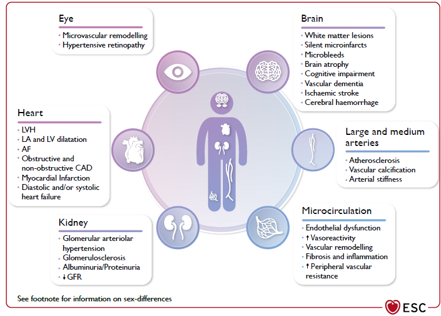

*   연령 관련 : SBP는 연령에 따라 상승; DBP는 50\~60세까지만 상승하고 이후 약간 감소

    • ≥50세에서는 SBP와 맥압이 DBP보다 CV event에 대해 더 큰 예측력을 가짐;

    젊은 연령에서는 SBP와 DBP 상승 모두 CV event 위험 증가와 관련됨
* 진단 시 활동 또는 가정혈압을 측정하여 ‘백의 고혈압’ 및 ‘가면 고혈압’을 감별
*   진단 시 2차성 고혈압, 생활 습관, 심뇌혈관 질환 유무/위험 인자, 치료에 영향을 줄 수 있는 동반 질환, 무증상 장기

    손상 유무 등 확인
* 고위험 환자에서의 3개월의 고혈압 치료 지연은 심혈관 사망률 2배 증가와 관련이 있음
* 고령자에서의 지나친 혈압 하강 조절은 어지럼, 뇌졸중 위험을 높일 수 있음
*   DBP ＜70 ㎜Hg 시 심혈관 합병증의 위험이 증가할 수 있음

    ✽DBP 70\~80 ㎜Hg에서 위험이 가장 낮았고, DBP ＜60 ㎜Hg에서는 심혈관 사고 위험이 증가되었다는 보고가 있음

### 고혈압의 유형

#### 수축기 단독 고혈압 (Isolated systolic hypertension)

* 정의 : SBP≥140 ㎜Hg & DBP＜90 ㎜Hg
*   원인 : arterial compliance 감소(연령 증가에 따라 SBP↑, DBP↓; 고령자 고혈압의 60\~80% 해당),

    심박출량 증가(예: 빈혈, 갑상선항진증, aortic insufficiency, arteriovenous fistula, Paget Dz)
* 예후 : MI, LVH, 신부전, stroke, 심혈관 사망률 증가
* 조치 : 젊은 환자의 경우 원인 감별을 요함, 생활 습관 중재
* 약물 치료 : 일반 고혈압 환자와 동일; DBP ＜70 ㎜Hg 시 주의

#### 확장기 단독 고혈압 (Isolated diastolic hypertension)

* 정의 : SBP＜140 ㎜Hg & DBP≥90 ㎜Hg (AHA 기준 DBP≥ 80 ㎜Hg)
* 젊은 성인에서 흔함
* 예후 : 수축기 단독 고혈압에 비해 비교적 양호

> ✽심혈관 질환, 심부전, 만성 신장병의 위험 증가와 유의미한 관련이 없다는 보고들이 있음

#### 백의 고혈압 (White coat hypertension)

* 정의 : 진료실 혈압 ≥140/90 ㎜Hg & 진료실 외 주간 활동 혈압 ＜135/85 ㎜Hg
*   유병률 : 진료실 진단 고혈압 환자의 17%; 조절되지 않는 고혈압 환자의 21%; 여성, 비만도가 낮은 인구에서 흔함

    \[대한고혈압학회]
*   예후 : 5년 이내 단기적인 임상 경과는 비교적 양호; 장기적으로 고혈압으로 진행하거나 심/뇌혈관 질환이 발병할

    위험이 있음
*   진료실에서 1기 고혈압(140~~159 ㎜Hg/90~~99 ㎜Hg)인 경우 일시적 혈압 상승의 감별을 요함; 활동 or 가정혈압 측정 권고

    ✽외래의 의료진이 없는 빈 방 등에서 휴식하면서 전자 혈압계로 측정하면 백의 효과가 줄어든다는 보고가 있음
*   조치 : CV risk, 표적 장기 손상(target organ damage. hypertension-mediated organ damage(HMOD)) 평가, 생활 습관 개선.

    매년 또는 자주(3\~6개월마다) 혈압 측정; 약물 치료는 하지 않음(HMOD or CV risk가 높은 환자에서 고려)

    ✽고혈압 치료 상태에서는 HT with white coat effect 또는 white coat uncontrolled HT으로 표현

#### 가면 고혈압 (Masked hypertension)

* 정의 : 진료실 혈압 ＜140/90 ㎜Hg & 진료실 이외 혈압 ＞135/85 ㎜Hg
* 유병률 : 조절되는 고혈압 환자의 35%; 고혈압 약제의 갯수, 높은 공복혈당에서 더 흔함 \[대한고혈압학회]
* 일중 고혈압이 과소평가되어 심혈관 질환의 발생 위험이 증가될 수 있으므로 주의
*   진료실 혈압은 정상이지만 표적 장기 미세 손상이 있거나 심혈관 위험도가 높은 경우, 또는 진료실 혈압이 고혈압

    전단계인 경우 가면 고혈압의 감별을 요함
* 조치 : 생활 습관 개선; 혈압 수준에 따라, HMOD or CV risk가 높은 경우 치료 고려

> ✽고혈압 치료 상태에서는 HT with reverse white coat effect 또는 masked uncontrolled HT으로 표현

#### 가성 고혈압 (Pseudohypertension)

* 정의 : 동맥 경화, 석회화 등에 의해 말초혈관이 딱딱해져 혈압이 높게 측정됨; 고령에서 흔함
* 커프로 충분히 압박해도 상완동맥 또는 요골동맥 맥박이 만져지면(= Osler sign 양성) 의심
* 확진 : 관혈적 방법으로 직접 요골동맥 내 혈압을 측정

#### 청소년 수축기 고혈압

*   청소년(특히 남자)에서 키가 갑자기 커지고 혈관의 탄력성이 좋아지면서 대동맥과 상완동맥 사이의 맥압파가 증가하여

    SBP가 독립적으로 상승

#### 야간 혈압 강하 부재 (Non-dipper)

* 정의 : 주간 혈압 대비 야간 혈압의 감소가 ＜10%
*   원인 : 중증 HMOD, 심혈관계 질환 동반, 좌심실비대, 당뇨병, 신질환, 2차성 고혈압

    ✽일반적으로 항고혈압제 아침 또는 저녁 복용과는 연관되지 않는 것으로 알려짐
* 진단 : (재현성이 떨어지므로) 반복하여 활동혈압 측정
* 예후 : 좌심실 비대, 심근경색, 뇌졸중 등의 심혈관계 질환 위험이 3배 더 높음
* 조치 : 야간 고혈압 시 약물 치료

#### Reverse dipper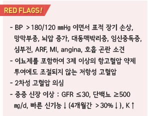

* 정의 : 야간 혈압이 주간 혈압에 비해 상승
* 원인 : 신경 이상
* 예후 : 출혈성 뇌졸중 위험

#### Eextreme dipper

* 정의 : 야간 혈압이 20% 이상 심하게 감소
* 예후 : 뇌졸중, 동맥경화증 위험 증가

#### 아침 고혈압 (Morning hypertension)

* 정의 : 기상 후(early morning) 혈압이 취침 전 혈압보다 높으면서 ≥135/85 ㎜Hg
* 예후 : 뇌졸중 발생의 가장 강력한 독립 인자; 심 비대, 경동맥 내중막 비후와 관련됨

#### 기립성 저혈압 또는 체위성 저혈압 (Orthostatic hypotension)

* 앉거나 누운 자세에서 일어선 후 3분 이내 SBP ≥20 ㎜Hg or DBP ≥10 ㎜Hg 하락, 또는 SBP가

＜90 ㎜Hg으로 저하되면서 관련 증상이 발생하는 상태 (☞ p.500)

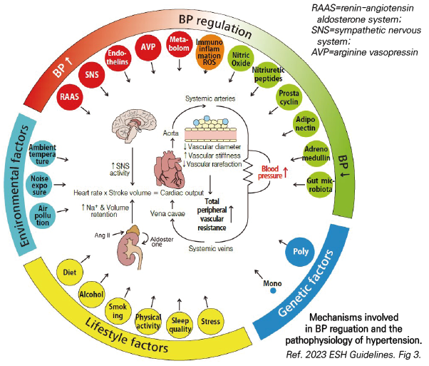

원인

### 1차성 (본태성) 고혈압 (Primary or Essential hypertension)

* 불명
* 관련 인자 : 연령, 비만, 가족력, 고염식이, 과음, 비활동

### 2차성 고혈압 (Secondary or Contributing causes of hypertension)

* 비율 : 전체 고혈압의 5%
*   원인 : 폐쇄수면무호흡증, 콩팥 질환, 갑상선 질환, 부갑상선항진증, 원발성 aldosteronism, 쿠싱증후군, 갈색세포종,

    대동맥 축착, 약물

    • 약물 : 경구 피임제(특히 고에스트로겐제), steroid, NSAID 장기 투여, 식욕 억제제, TCA, SSRI, pseudoephedrine,

    clozapine, olanzapine
*   감별 검사 대상 :

    ① 연령, 병력, 신체 진찰, 고혈압의 중증도나 기본 검사실 검사상 2차성 고혈압이 의심됨

    ② 혈압이 약물 치료에 잘 반응하지 않음,

    ③ 잘 조절되던 혈압이 뚜렷한 이유 없이 상승,

    ④ 갑자기 발생한 고혈압

※ 저항성 고혈압이 있는 성인의 경우 저칼륨혈증여부와 관계없이 원발성 aldosteronism을 선별(2025 AHA)

```


```

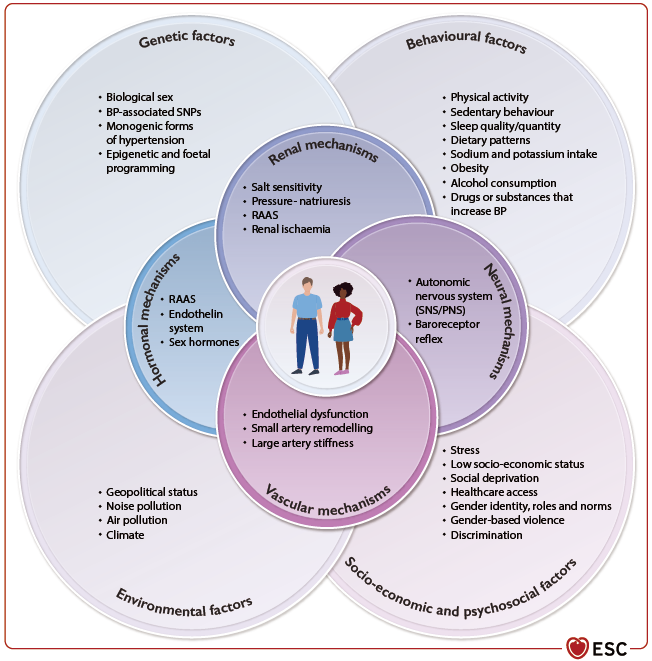

심뇌혈관 질환의 위험 인자 \[대한고혈압학회]

* 연령 : 남 ≥45세, 여 ≥55세; ≥65세은 2개의 위험 인자로 간주
* 조기 (남＜55세, 여＜65세) 심혈관 질환 부모/형제 가족력
* 흡연
* 비만(BMI ≥25 ㎏/㎡) 또는 복부비만(허리둘레 남 ≥90 ㎝, 여 ≥85 ㎝)
* 이상지질혈증 : total-C ≥220, LDL-C ≥150, HDL-C ＜40, TC ≥200 ㎎/㎗
* 당뇨병전단계 : 공복혈당장애(공복 혈당 100~~125) or 내당능장애(식후 혈당 140~~199 ㎎/㎗)
* 당뇨병(2개의 위험 인자로 간주)

✽임상적 심뇌혈관 질환 및 콩팥 질환 : 뇌(뇌졸중, 일과성 허혈 발작, 혈관성 치매), 심장(협심증, 심부전, 심방세동),

```
콩팥(만성콩팥병 3,4, 5기), 혈관(대동맥 확장증, 대동맥 박리증, 말초 혈관 질환)
```

## 진단

```

```

* ≥1주(\[ESH] 1\~4주) 간격으로 ≥2회 방문 측정하여 모두 고혈압 기준에 해당되면 진단

•≥180/110 ㎜Hg, 혈압 관련 증상, HMOD, CVD 등이 있는 경우에는 바로 진단 가능

* 고혈압 진단 전 진료실 이외 혈압(활동/가정혈압) 측정 권고
*   ESH는 Grade 1,2,3으로 고혈압을 분류하는 한편 BP value에 기초하여 Stage를 분류

    • Stage 1 : 합병증 없는 고혈압; 예: HMOD(hypertension mediated organ damage) 또는 확인된 CVD 없음, CKD stage 1 or 2

    • Stage 2 : HMOD 있음, CKD grade 3, 당뇨병 등이 있음

    • Stage 3 : 확인된 CVD, CKD stage 4 or 5

### 측정 장소에 따른 대응 혈압

```

```

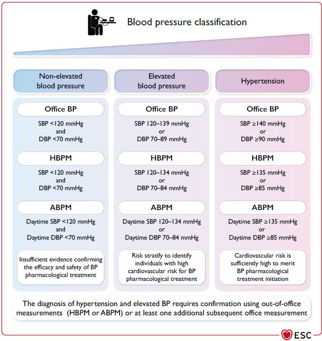

### 혈압 측정

#### 선별 측정 [대한고혈압학회](../2022/)

*   ≥20세 모든 성인에 대하여 2년마다 진료실혈압 측정

    •고혈압 또는 고혈압전단계 진단 시 가정혈압 또는 활동혈압 측정
* 다음의 경우에는 매년 진료실혈압 측정 : 고혈압전단계, ≥40세, 고혈압 가족력, 비만

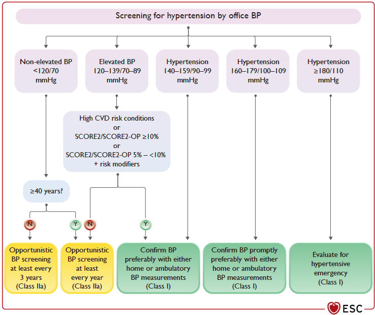

#### 준비 단계

* 측정 30분 전에는 카페인 섭취/음주/흡연/운동/목욕을 삼가; 필요하면 배뇨 후 측정
* 측정 전 최소 3\~5분간 앉아서 (말을 하지 말고) 휴식
* 측정 중에는 대화나 문자 작성을 하지 않음
*   커프 선택 : 폭은 위팔 둘레의 40%(37~~50%), 길이는 위팔 둘레의 75~~100%인 bladder을 가진 커프를 선택(✽팔에 비해

    커프가 작은 경우에는 혈압이 높게 측정되며 반대의경우에는 낮게 측정됨; 표준 cuff size- 12\~13 × 35 ㎝)

측정 방법

① 측정 자세 : 등받이에 등을 기대고 다리를 꼬지 않은 상태에서 발이 바닥에 닿게 앉음

```
✽등받이가 없는 의자에서 측정 시 DBP 6 ㎜Hg, 다리를 꼰 상태에서 측정 시 SBP 2~8 ㎜Hg, 팔이 지지되지 않은

상태에서 측정 시 ~10% 상승됨
```

② 커프 감기 : 맨팔 또는얇은 옷 위에, cuff 하단이 위팔의 팔꿈치 주름(elbow crease) 2\~3 ㎝ 상부에 위치하도록 감음

③ 팔의 위치 : mid-arm이 심장 높이(흉골의 중간 부위)가 되고 팔을 힘이 들어가지 않게 약간 구부려 책상 위에 얹어

```
놓은 상태에서 측정(✽팔이 심장 높이보다 아래에 위치하면 혈압이 높게 측정됨)
```

④ 측정 : 손목 맥박이 사라지고 나서 20\~30 ㎜Hg 더 올린 후 매 박동 또는 1초마다 2 ㎜Hg 정도로 서서히 감압하며 측정,

```
분명한 심박동음이 들리기 시작하는 Korotkoff 음 1기를 SBP로, 심박동음이 사라지는 Korotkoff 음 5기를 DBP로 정함

(2 ㎜Hg 단위로 기록)

•0 ㎜Hg까지 감압하였는데도 심박동음이 들리는 경우(예: 임신, 동맥-정맥 단락, 만성 대동맥판 폐쇄부전)에는

심박동음이 갑자기 작아지는 시기를 DBP으로 정함
```

⑤ 반복 측정 : 1\~2분(또는 30초) 간격으로 2회 측정하여 평균을 냄(또는 30초)(✽\[ISH] 3회 측정하여 2nd & 3rd 측정치의 평균을 냄); 부정맥이

```
있으면 3회 이상 측정하여 평균을 냄
```

⑥ 양팔 측정 : 처음에는 양팔 모두 측정하고 높은 쪽 혈압을 기준으로 판정하며, 일관되게 ＞10 ㎜Hg 높은 쪽이 있으면

```
이후 측정은 높은 쪽 팔에서 시행

•양팔의 혈압 차이가 지속적으로 SBP ≥20 ㎜Hg 또는 DBP ≥10 ㎜Hg이면 대동맥 축착증과 상지동맥 질환의 가능성을

확인해야 함
```

⑦ 맥박 측정 : 맥박수를 함께 측정하여 기록하고, 심방세동 등 부정맥의 가능성을 확인함

#### 측정 유의 사항

* 심박동음이 너무 약한 경우 커프를 풀고 팔을 위로 들고 주먹을 쥐었다 펴는 동작을 10회 정도 반복한 후 측정
* 누워서 측정하는 경우에는 상지에 베개를 받침 (✽누운 자세가 선 자세보다 SBP로 8 ㎜Hg 높음)
*   하지 혈압 측정 : 혈압 측정 시 맥박이 약하여 말초 혈관 질환이 의심되는 경우에는 발목 또는 정강이에 커프를 감고

    누운 상태에서 발목에서 측정(✽청진법 측정은 용이하지 않아 권고하지 않음)
*   진료실자동혈압(Automatic office BP) 측정 : white coat effect를 제거하기 위한 방법으로, 의료진이 없는 별도의 방에서

    5분간 휴식 후 1분 간격으로 연속 3회 측정하여 평균을 냄•≥135/85 ㎜Hg 시 고혈압으로 진단
* 다음의 경우 기립성 저혈압 감별을 요함 : 당뇨병, 고령(≥80세), 기립 시 어지럼/두근거림/구역

#### 가정혈압 측정

* 진료실혈압보다 심혈관 질환과의 연관성이 높음
*   대상 : 모든 고혈압 환자; 특히 백의/가면 고혈압 의심, 심한 진료실혈압 변동, 약제 반응 미흡 시

    •심한 부정맥이나 임신 중에는 부정확할 수 있음
*   혈압계 : 위팔 혈압계를 권고. 위팔이 매우 굵은 경우에는 손목 혈압계를 고려. 손가락 혈압계는 측정 오차가 많아

    권고하지 않음; 혈압계의 주기적 점검을 권고
* 측정 방법 : 안정 휴식 등 혈압 측정의 일반적 방법을 적용
*   측정 시각 : 아침 기상 후 1시간 이내, 배뇨 후, 식사 전, 혈압약 복용 전 아침 혈압 측정; 취침 1시간 이내에 안정한 상태에서

    저녁 혈압 측정
*   측정 주기 : 적어도 5일 이상 측정. 특히 처음 고혈압을 진단할 때는 적어도 1주일 동안 측정(처음 측정값은 버리고 평균값을

    사용). 치료 결과 평가 시에는 가능한 오랜 기간(적어도 외래 방문 직전 5\~7일 동안) 측정; 혈압이 안정된 경우 3일/주

    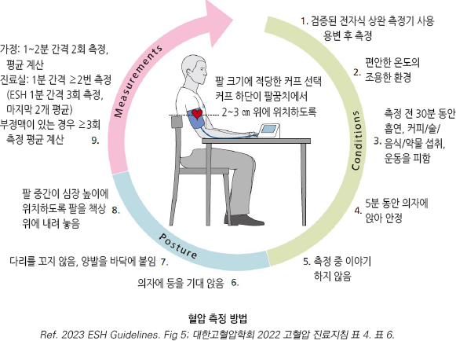

#### 스마트 워치를 이용한 혈압 측정

* 안정 휴식 등 자가 혈압 측정의 일반적 방법을 적용 (※정확도 5±8 ㎜Hg)
*   스마트 워치 스트랩은 손목을 너무 조이지 않으면서 충분히 손목과 밀착되도록 착용하고, 팔을 약간 구부린 상태로

    심장 높이의 책상 등에 올려 놓고 측정
*   보정 : 스마트 워치 혈압 앱을 실행시킨 상태에서 위팔 혈압계를 착용하고 혈압을 측정하여 측정값을 혈압 측정 앱에

    입력하여 보정(3\~5회 반복); 주기적으로 재보정
*   다음의 경우 권하지 않음 : SBP ≥160 ㎜Hg or ≤80 ㎜Hg , 대동맥 판막 폐쇄 부전증, 심방세동, 혈류가 약한 말초 혈관

    질환, 당뇨병, 심근병증, 말기 신부전, 손 떨림, 혈액 응고 장애, 항혈소판제/항응고제 복용, 임신

#### 활동 혈압 측정

* 15\~30분 간격으로 반복 측정하여 평균치를 계산
* 대상 : 조절되지 않는 고혈압, 백의 또는 가면 고혈압 의심, 간헐적 고혈압, 자율 신경 장애, 혈압 변동성 평가, 심혈관 위험도 평가
* 의의 : 표적 장기 손상, 심혈관 질환 사망률 예측에 진료실혈압보다 연관성이 높음

### 병력 청취

① 환자 병력 및 가족력,

② 2차성 고혈압 의심 병력,

③ 무증상 장기 손상\* 의심 병력,

④ 심혈관 질환 위험 인자 유무,

⑤ 동반 질환 병력,

⑥ 식이, 흡연, 음주, 신체 활동, 운동 및 수면 등의 생활 습관, 성격과 심리 상태,

⑦ 과거 고혈압의 유병 기간, 치료 여부, 결과 및 부작용,

⑧ 소염진통제, 경구 피임약, 한약 등 약물 사용력,

⑨ 사회 경제적 상태

```
*무증상 장기 손상 정의 : 뇌(뇌실 주위 백질 고강도 신호, 미세 출혈, 무증상 뇌경색), 심장(좌심실 비대), 콩팥(알부민뇨,

eGFR 감소), 혈관(죽상경화반, 목 동맥-대퇴 동맥간 맥파 전달 속도 ＞10 m/sec, 위팔 동맥-발목 동맥 간 맥파 전달 속도

＞18 m/sec), 관상 동맥 석회화 점수 400 이상 [대한고혈압학회]
```

### 검사

#### 신체검사

* 좌우 양팔의 혈압, 맥박수
* 키, 몸무게, BMI, 허리둘레
* 경동맥, 복부 및 대퇴부 잡음
* 갑상선 촉진
* 심장과 폐의 진찰
* 복부 진찰 : 콩팥/방광 비대, 비정상적 대동맥 박동
* 하지 부종 및 맥박 촉진
* 신경학적 검사

#### 기본 검사

※ 적어도 진단 시점 및 매년 재검; K과 Cr은 1년에 최소 1\~2번 측정

* 12-유도 심전도
* 소변검사 : 단백뇨, 혈뇨, 당뇨병
* 혈색소(빈혈), 적혈구 용적률
* K, Na, Cr, eGFR, 요산
* 공복혈당, 지질(총콜레스테롤, HDL-콜레스테롤, LDL-콜레스테롤, 중성지방)
* TSH
* 흉부 X선
* 미세알부민뇨 : 단회뇨 중 Alb/Cr ratio (✽eGFR ＜60 시 3\~6개월 간격으로 추적 관찰) (☞ p.612)
* ASCVD 10년 위험도 (http://tools.acc.org/ldl/ascvd\_risk\_estimator/index.html#!/calulate/estimator/)

#### 권장 검사

* 75 g 경구 당부하 검사 또는 당화혈색소(공복혈당 100 mg/dL 이상일 때)
* 심장 초음파 : 심전도 이상, 좌심실 기능 이상 또는 비대 의심
* 경동맥 초음파 : 동맥경화반진단을 위해 고려; 내중막 두께 검사는 권고 안함(근거 부족)
* 발목-위팔 혈압 지수 측정
* 맥파전달속도 측정
* 안저 검사(당뇨병에서는 필수)
* 24시간 소변 단백뇨 : 소변 시험지봉 검사에서 단백뇨(+) 시 고려
*   cystatin C : s-Cr으로 신 기능을 평가하는데 어려움이 있는 경우 측정하고 이를 이용한 eGFR을 함께 평가;

    임상적으로 근육양이 많은 젊은 환자에서 s-Cr이 높게 측정되는 경우 또는근육양이 적은 노인 환자에서 콩팥 기능

    장애를 진단할 때 유용 (☞ p.607)

#### 확대 검사

* 무증상 장기 손상에 대한 뇌, 심장, 콩팥, 혈관 검사
* 이차성 고혈압의 진단을 위한 검사

※ \[ACC/AHA] 권고 선택 검사 : 심초음파, 요산, 소변 Alb/Cr ratio

✽심혈관 사망률을 예측하는 무증상 표적 장기 손상 지표 : ① (미세)알부민뇨, ② 경동맥-대퇴 맥파 전달 속도 증가,

```
③ 좌심실비대, ④ 경동맥 플라크
```

✽단백뇨↑와 GFR↓가 모두 있는 경우에 어느 하나만 있는 경우보다 심혈관 및 신질환 위험이 크게 증가함

### 고혈압의 표적 장기 손상

*   Heart : LVH, angina/prior MI, prior coronary

    revascularization, heart failure
* Brain : stroke, transient ischemic attack, dementia
* CKD
* Blood vessel : peripheral arterial Dz
* Eye : retinopathy

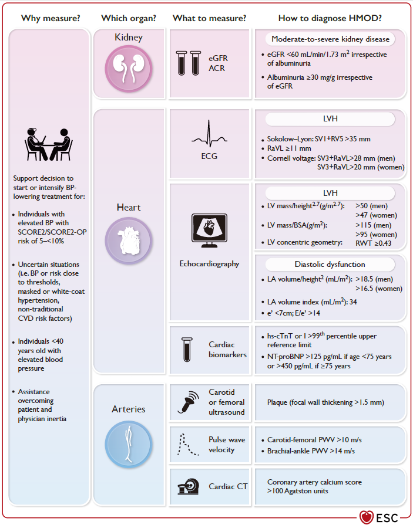

***

## Management

### 치료 방침

* 목표 혈압 설정
* 고혈압의 문제 및 혈압 조절의 이익을 이해시킴
* 생활 습관 조절 : 금연, 체중 조절, 활발한 신체 활동, 건강 식이
* 고혈압 및 ASCVD 위험 인자와 표적 장기 손상 여부 평가 및 관리
*   약물 치료

    • 비약물 치료를 동시에 시행

    • 약물 치료 전 백의 고혈압 등 일시적 혈압 상승을 감별

    • 혈압 수준 및 심뇌혈관 질환의 위험 인자, 목표 장기 손상 유무를 고려하여 치료 방법 결정

    ※ 일반적인 고혈압전단계(＜140/90 ㎜Hg)는 약물 치료 대상이 아님

    ✽심한 야간 저혈압은 허혈성 시신경증을 유발할 수 있다는 보고가 있음

#### 목표 혈압

```


```

비-약물 치료

### 생활 요법 및 효과

```

```

### 운동 요법

```
(☞ p.1160)
```

* 작용 : 수축기 및 확장기 혈압 감소, 심혈관 질환 발병 위험 감소
* 유산소운동 : 걷기, 뛰기, 자전거 타기, 수영 등을 5\~7회/주, ≥30분/회 이상
* 등장성 또는 등척성 운동 : 2\~3회/주
* 심장병 등 위험 인자가 있는 경우는 허용 운동 강도에 대한 평가가 필요

### 식사 요법

* 칼로리/동물성 지방 섭취↓, 야채/과일/생선류/견과류/저지방유제품 섭취↑; DASH diet 권고

#### DASH(Dietary Approaches to Stop Hypertension) diet (☞ p.1166)

* 권장 : 과일 및 채소(8~~10 serv./d), 저지방 유제품(2~~3 serv./d), 생선(2회/wk)
* 제한 : 음주(남 ≤2 SD/d, 여 ≤1 SD/d), 소금(＜6 g/d), 단순 당(예: 설탕), 포화지방, 붉은 고기

> ✽카페인 : 일시적으로 혈압을 상승시킬 수 있음. 하루 2잔의 커피는 일반적으로 고혈압의 위험 인자는 아님

#### 저염 식이

*   저염 식이 방법

    ① 국물은 싱겁게 만들고 적게 먹는다(다 마시지 않는다)

    ② 김치는 덜 짜게 먹는다

    ③ 음식을 먹을 때 추가로 소금이나 간장을 넣지 않는다.

    (칼륨 소금 대체제는 고혈압 예방과 치료에 유용할 수 있음. 단, CKD 환자나 칼륨 배출 저해 약제를 사용하는 경우는 제외)

    ④ 피할 음식- 라면, 햄, 소시지, 젓갈, 장아찌, 외식/패스트푸드
*   소금 1g(Na 400 ㎎)에 해당하는 조미료의 양 : 진간장 5 g(1작은 술), 된장 10 g(½큰 술), 고추장 10 g(½큰 술),

    토마토케첩 30 g(2큰 술), 마요네즈 40 g(2.5큰 술), 우스타 소스 40 g(2.5큰 술), 마가린 50 g(3큰 술), 버터 50 g(3큰 술)

\*\* 음식 속의 소금의 양\*\*

```

```

## 약물 치료

### 약물 치료 대상

#### 대한의학회 (2019)

* 모든 2기 고혈압(≥160/100 ㎜Hg)
*   1기 고혈압(≥140/90 ㎜Hg) 중 다음에 해당 : ① 심뇌혈관 질환, CKD, 무증상 장기 손상, 동반위험 인자 ≥3개,

    당뇨병 with 동반 위험 인자 ≥1개 등의 고위험군, ② 3개월간의 생활 습관 중재 효과 미약,

    ③ 지역 사회 거주 ≥65세의 건강한 고령, ④ 자주 추적 관리할 수 없는 상황
* 쇠약자 또는 ≥80세에서는 ≥160 ㎜Hg 시 고려

#### ESH (2023)

*   18\~79세 : 모든 grade 1 이상(≥140/90 ㎜Hg)의 고혈압 환자에서 CV risk와 관계없이 생활 습관 중재와 약물 치료를 시작

    • HMOD가 없고 CV risk가 낮은 낮은 BP 범위에 있는 grade 1 환자에서는 생활 습관 중재만으로 치료를 시작할 수 있지만

    수개월(예: 6개월) 내 조절되지 않으면 약물 치료를 요함
* ≥80세 : SBP 160 ㎜Hg; SBP 140\~160 ㎜Hg 에서도 고려할 수 있음
* CVD 병력이 있는 경우 : ≥130/80 ㎜Hg

#### ACC/AHA (2017/2021/2025)

*   CVD 병력이 없는 환자 : ① ≥130/80 ㎜Hg & CVD 10년 위험도 ≥10%, ② ≥140/90 ㎜Hg & CVD 10년 위험도 ＜10%,

    ③ ≥130/80 ㎜Hg & CVD 10년 위험도 ＜10%으로 6개월간의 생활요법으로 ＜130/80 ㎜Hg 달성 실패

    -> 임상적 CVD가 없고 10년 CVD 위험이 <7.5% 미만인 성인의 경우 3\~6개월간의 생활습관 중재 후에도

    SBP ≥130 ㎜Hg 또는 DBP ≥80 ㎜Hg 인 경우 항고혈압 약물 투여 시작을 권고
*   CVD가 있는 환자 또는 당뇨병 동반 : ≥130/80 ㎜Hg

    -> 임상적 CVD가 없더라도 당뇨병이나 CKD가 있거나 10년 CVD 위험이 증가한 성인(≥ 7.5%)의 경우

    SBP ≥130 ㎜Hg/ & DBP ≥80 ㎜Hg 시 항고혈압 약물 투여 시작을 권고
* 심혈관에 영향을 주는 동반 질환이 있는 ≥65세 : SBP ≥130 ㎜Hg

## 항고혈압제 종류

#### 고혈압 치료제들의 효과

* 주요 항고혈압제 분류 : ACEI/ARB, BB, CCB, Thiazide/Thiazide-like diuretic
* 동일 기전의 약제들 간의 강압 효과는 비슷. 단, 환자에 따른 효과 차이는 있음
*   강압 효과 : 표준 용량의 단일제(보통 1T)로 SBP 8~~10 ㎜Hg, DBP 4~~7 ㎜Hg 강하됨

    •표준 용량의 50% 투여 시 표준 용량 투여 효과의 80%까지 나타남

### 이뇨제 (Diuretics)

#### Thiazide/Thiazide-like(T/TL) diuretic

* 효과 : plasma volume 감소, 말초혈관 저항 감소
*   대상 : 금기가 아닌 모든 고혈압에서의 1차 선택제; 고령(특히 수축기 고혈압), 비만, 흡연자에서 보다 효과적이며 폐경기

    여성에서의 골 미네랄 손실을 완화시킨다는 보고가 있음
*   부작용 : K↓, 내당능 저하, 부정맥, 지질대사장애, 요산↑,

    통풍, 발기 저하

> ✽대부분의 환자에서 공복 혈당에 대한 유의미한 영향은 없다는

> ```
> 보고가 있음
> ```

* chlorthalidone : 반감기가 HCTZ보다 길어 24시간 조절에 유리

> ✽HCTZ에 비하여 전해질, 신장 안전성이 떨어진다는 보고가 있음;

> ```
> 심혈관 사고나 사망률에는 차이가 없다는 보고가 있음 
> ```

* indapamide : 장기 부작용이 보다 적음

#### Potassium-sparing agent

* 혈압 강하 효과는 적음
* 대상 : thiazide 사용 시 저칼륨혈증을 예방하기 위해 병용
* 주의/금기 : GFR ＜45, 고칼륨혈증

#### Loop diuretics

* 대상 : 수축기 기능 부전에 의한 CHF, sodium 저류, 부종
* 혈압 강하를 위한 단독 선택은 안 함
* furosemide : 작용 시간이 짧고 전해질/체액 고갈을 초래할 수 있음

#### Mineralocorticoid receptor antagonist(MRA, Aldosterone antagonist)

*   대상 : 원발성 aldosteronism, 저항성 고혈압, 수축기 기능 부전에 의한

    CHF, 저레닌형 고혈압
* 보통 다른 약제(특히 thiazide 이뇨제)에 추가 투여
* 부작용 : K↑, 남성에서 여성형 유방, 발기 부전. 여성에서 월경불순
* 주의/금기 : 신부전, 고칼륨혈증

### Renin-Angiotensin 시스템 차단제

* 효과 : 인슐린 작용 개선, 단백뇨 개선, 신부전 진행 억제. 심부전 환자 사망률 감소
*   주의/금기 : 임신, 고령, 탈수, 양측 신혈관 협착, 편측 신장 완전 위축, s-Cr ≥3.0 ㎎/㎗; 만성콩팥병에서 칼륨 증가 위험

    • 만성 콩팥병 환자에서 투여 전 및 투여 후 1\~2주/3개월/6개월에 칼륨 및 신 기능 검사 시행

    • 당뇨병 환자에서 투여 시 eGFR, s-K 모니터링

> ✽eGFR ＜30인 환자에서도 신질환의 추가 손상 없이 심혈관 이득을 얻을 수 있다는 보고가 있음

* ACEI와 ARB의 병용은 피함

※ 당뇨병을 동반한 고혈압 환자에서 ACEI or ARB는 eGFR <60 or 알부민뇨 ≥30 ㎎/g로 확인된 CKD가 있는 경우 권고.

```
또한 당뇨병성 신장 질환의 진행을 지연시키기 위해 경미한 알부민뇨(<30 ㎎/g)가 있는 경우 고려
```

※ CKD를 동반한 고혈압 환자에서 eGFR <60 with 알부민뇨 ≥30 ㎎/g인 경우 ACEi 또는 ARB를 사용을 권고

#### Angiotensin-Converting Enzyme Inhibitor(ACEI)/ Angiotensin II Receptor blocker(ARB)

* 대상 : 심근경색 후, 관상동맥병, 저박출에 의한 CHF, 신장병증
* 부작용 : 마른기침(20%. 특히 여성, 고령), 혈관부종; ARB는 기침 부작용은 드묾

#### 직접 레닌차단제 (Direct renin inhibitor)

* 효과 : 단독 사용으로 ARB, ACEI와 유사한 혈압 강하 효과
*   대상 : 당뇨병성 신장병증; 1차 선택제는 아니며 타 약제와 병합 사용

    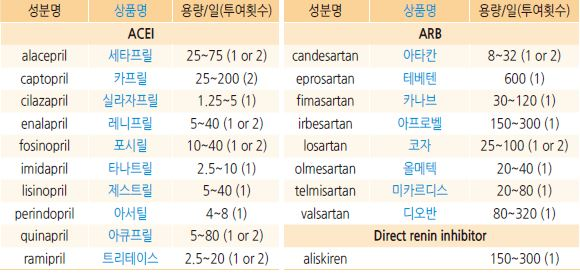

### 칼슘차단제 (Calcium Ca channel blocker, CCB)

* 효과 : 말초혈관 확장
* 대상 : 수축기 고혈압, 협심증, 편두통; 허혈성 심질환, 비후성 심근증, post-MI, 심실위 빈맥증
* 속효성 차단제는 권하지 않음 (✽시판 제품은 대부분 장기 작용 약제임)
*   non-DHP계 : 반사성 빈맥이 없고 심근경색 및 확장기 충만을 개선시켜 비후성 심근증에 적용;

    2\~3도 전도 장애, 심부전증에 금기
*   부작용

    •non-DHP계 : 변비, 심장 전도 장애, 서맥성 부정맥

    •DHP계 : 안면 홍조, 두통, 말초 부종; thiazide 또는 ACEI 병용 시 말초 부종 감소

    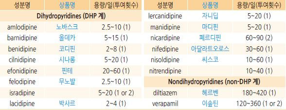

### β-차단제 (β-adrenergic receptor blocker, BB)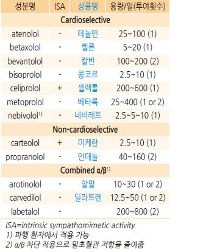

* 효과 : 심박동 감소, 심박출량 감소
* 뇌졸중, LVH, MI 예방 효과는 적음
*   대상 : 빈맥, 심부전, 관상동맥병, 젊은 환자

    •심장 선택성 제제 : 협심증, CHF, post-MI, 빈맥, 편두통;

    고용량에서는 선택적 효과가 감소
*   부작용 : 서맥, 전도 장애, 좌심실부전, 기관지 경련 악화,

    레이노 현상, 파행 악화, 코 막힘, 발기부전, 피로, 우울,

    악몽, 흥분; 지질/당 대사 영향
*   주의/금기 : 고령, 당뇨병, 대사증후군, 천식, COPD,

    2\~3도 전도 장애, 말초혈관 질환, sick sinus syndrome,

    레이노병, 우울증

    •갑작스런 중단 시 급성 관상동맥 질환과 혈압의 상승을

    유발하므로 tapering 필요
*   ISA(+) 제제 : 낮은 교감 신경 활성 효과;

    β-차단제 치료 시 서맥증을 보이는 환자들에게 유용.

    심근경색 환자에서는 금기

### α-차단제 (α-adrenergic receptor blocker)

### 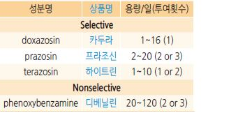

*   효과 : 평활근 이완, 말초혈관 저항 감소;

    당, 지질 대사 개선(HDL↑)
* 대상 : BPH, 갈색세포종
*   부작용 : 기립성 저혈압(✽부작용 방지를 위하여 초기에는

    취침 시 투여), 심부전 악화, 두근거림, 두통, 신경과민

### 중추성 교감 신경 작용제 (Central sympatholytic agent)

* 효과 : CNS에서 efferent peripheral sympathetic outflow를 감소시킴
* 대상 : 변동성이 심한 고혈압, autonomic neuropathy, 임신부(methyldopa)
* 부작용 : 졸음, 입마름, 반동성 혈압 상승, 기립성 저혈압, 성기능장애, 여러 약물 상호 작용
* clonidine : 0.1~~0.6 ㎎/d #2 \[켑베이]; weekly patch 0.1~~0.3 ㎎/d
* guanfacine 1~~3 ㎎ qd, methyldopa 250~~2,000 ㎎ bid

### 혈관 확장제 (Direct vasodilator)

* 대상 : 중등증\~중증 고혈압 환자에서 보조 요법으로 사용; 반드시 이뇨제나 β-차단제와 병용
* 부작용 : hydralazine- 빈맥, 루프스양증후군; minoxidil- 안면부 발모, 심장막성 삼출
* 주의/금기 : 심한 관상동맥병
* hydralazine : 임신 중독에 의한 고혈압; 25~~50 ㎎/d #3~~4 \[히드랄라진염산염]
* minoxidil : 다른 모든 강압제에 저항을 보이는 신 기능 저하 환자; 5~~40 ㎎/d #1~~2 \[미녹시딜]

## 항고혈압제 선택 Tips

### 약물 선택의 원칙

* 1차 선택 : T/TL diuretic, CCB, ACEI, ARB (보험기준 ☞ p.1189)

•ESH에서는 BB도 1차 선택제에 포함시킴

* 저용량으로 시작(특히 고령에서)
*   복용 방법 : 특별한 사유가 없는 한 가급적 single pill을 선택, 1일 1회 투여; 아침에 복용하는 것이 저녁보다 순응도가

    높을 수 있음; 이뇨제 저녁 복용 시 야뇨 고려

    ✽1일 1회 투여하는 경우 야간(취침 전)에 복용하면 실신이나 기상 시 낙상의 부작용 증가 없이 야간 및 주간 혈압이

    낮으며 심혈관 관련 사망이 낮다는 보고가 있음

1.  단일제 : 표적 장기 손상이 없고 평균 혈압이 목표보다 20/10 ㎜Hg 이내로 높은 경우에 단일제로 시작

    → 2\~3개월 후 목표 이하로 조절되지 않으면 증량 또는 약제 추가

2.병용 요법 : HMOD이 있는 고혈압 or 평균 혈압이 목표보다 ＞20/10 ㎜Hg 높은 경우에 저용량 2제 요법으로 시작 고려;

```
환자의 ＞70%에서 병용 요법 필요
```

• \[ADA] ≥160/100 ㎜Hg 시 2제 요법으로 시작

• \[ESC/ESH] ＜150/95 ㎜Hg의 저위험 grade 1, 높은 CV risk가 있는 high normal, 허약, 고령에서 단일제로 시작,

```
그 외 대부분의 고혈압 환자에서 2제 요법(ACEI/ARB +{CCB or T/TL diuretic})으로 시작하는 것을 권고
```

3\. 3제 요법 : 2제 요법을 사용함에도 목표 이하로 조절이 되지 않는 경우. 예) 금기가 없으면 ARB + CCB + HCTZ

> (✽저용량 HCTZ로 조절이 안 되는 경우 증량 또는 chlorthalidone이나 indapamide 사용을 고려; 2제 요법을 증량하는 것보다 3제 요법이 효과적이라는 보고가 있음)

*   피해야할 조합 : BB+thiazide(인슐린 저항성 증가, 이상지질혈증 발생 위험 증가), ACEI+ARB(효과 미약, 부작용 증가),

    ACEI/ARB+BB(혈압 강하 효과 미약), BB+non-DHP CCB(심장 전도 장애)

    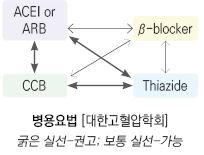

\*\* ARB + hydrochlorothiazide(HCTZ)\*\*

•candesartan/HCTZ \[아타칸 플러스]

•losartan/HCTZ \[코자 플러스]

•telmisartan/HCTZ \[미카르디스 플러스]

•fimasartan/HCTZ \[카나브 플러스]

•olmesartan/HCTZ \[올메텍 플러스]

•valsartan/HCTZ \[코디오반]

\*\* ARB + CCB\*\*

•fimasartan/amlodipine \[듀카브]

•losartan/amlodipine \[아모잘탄]

•olmesartan/amlodipine \[세비카]

•telmisartan/amlodipine \[트윈스타]

•valsartan/amlodipine \[엑스포지]

•valsartan/lercanidipine \[레바캄]

\*\* BB + Diuretics\*\*

*   당뇨병 발생 위험이 높은 환자에서는 피함

    •hydrochlorothiazide/metoprolol \[베타자이드]

\*\* BB + CCB\*\*

•felodipine/metoprolol \[로지맥스 서방]

\*\* 3제\*\*

•losart/amlod/HCTZ \[아모잘탄 플러스]

•olmesar/amlod/HCTZ \[세비카 에이치씨티]

•telmis/amlod/chlorthalidone \[트루셋]

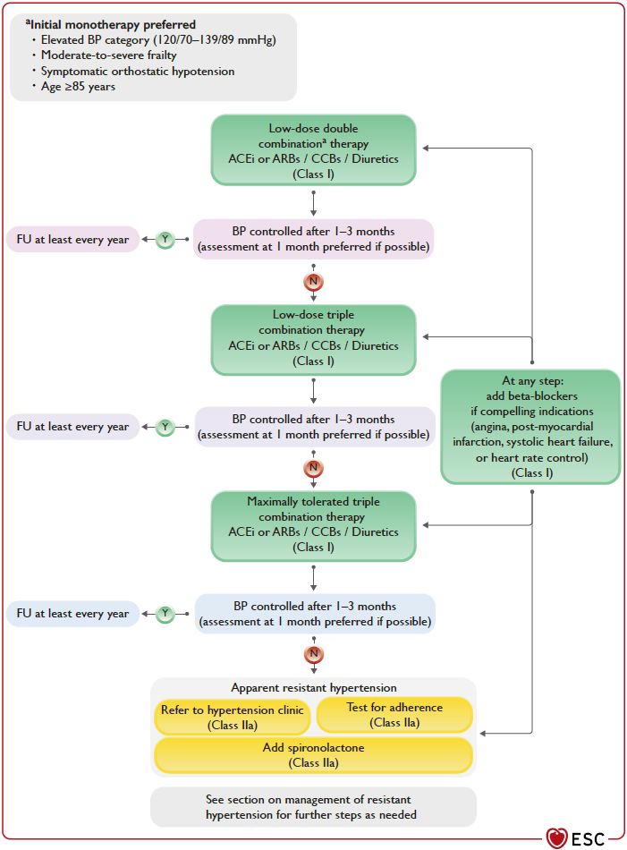

### 상황별 약제 선택

```


Ref. 대한고혈압학회. 고혈압진료지침. 2022. 표 16
```

### 고혈압 약제의 절대적/상대적 금기

```


Ref. 대한고혈압학회. 고혈압진료지침. 2022. 표 16
```

### 고혈압 약제의 대표적 부작용

```

```

Ref. 대한의학회. 일차의료용 근거기반 고혈압 임상진료지침. 2019

기타 고혈압 관련 약제

### 당뇨병 치료제

* 2형 당뇨병 고혈압 환자 목표치 : 식전 혈당 ＜110 ㎎/㎗, HbA1c ＜6.5%

> ✽\[ISH] 공복 혈당 ＜126 ㎎/㎗, HbA1c ＜7%

### Aspirin

```
(☞ p.1154)
```

* 대상 : 신장 기능 저하, 당뇨병, 표적 장기 손상, 심혈관 질환의 주요 위험 요인 ≥3개
* 금기 : 높은 위장 출혈 위험(예: 활동성 소화성 궤양), 국소 출혈, 출혈성 소인, aspirin 과민
* 용량 : 100 ㎎ (75\~162 ㎎)
* aspirin 과민 ASCVD 환자에서 clopidogrel (75 ㎎/d) \[플라빅스] 고려

\*\*[대한고혈압학회](../**2022/)

* 심혈관 질환이 있는 고혈압 환자에서 2차 예방을 위해 aspirin 투여를 권고
*   심뇌혈관 질환이 없는 40\~70세의 고위험의 고혈압 환자에서 1차 예방 목적의 저용량 aspirin 투여는 심혈관 질환을

    감소시킬 수 있으므로 고려할 수 있음
* 70세 이상의 심혈관 질환이 없는 중저위험도 고혈압 환자들은 1차 예방 목적으로 저용량 aspinrin 투여를 시작하지 않음

**\[USPSTF]**(2022)

* •≥60세에서의 CVD 일차 예방을 위한 저용량 aspirin 투여 개시는 권고하지 않음
*   •ASCVD 10년 위험도가 ≥10%인 40\~59세에서의 CVD 일차 예방을 위한 저용량 aspirin 투여 시작 결정은 개별적으로

    결정되어야 함(이득에 대한 증거가 적음. 출혈 위험이 높지 않고 매일 저용량 aspirin을 복용할 의사가 있는 사람들은

    이득이 보다 많을 수 있음)

    ✽흡연, 비만, 고혈압, 고콜레스테롤, 당뇨병, 심혈관 질환 중 하나 이상 가진 사람에게서 아스피린 사용이

    심부전 위험을 26%까지 높일 수 있다는 보고가 있음

### 항콜레스테롤제

* 대상 : 중등도 이상 위험도를 가진 고혈압 환자, 심혈관 질환이 있는 고혈압 환자
* LDL-C을 기준으로 치료 (☞ p.524)

•심혈관 질환이 없는 고혈압 환자에서의 목표 : LDL-C ＜130 ㎎/㎗

•심혈관 질환이 있는 고혈압 환자에서의 목표 : LDL-C ＜70 ㎎/㎗

특별한 상황에서의 고혈압 관리

### 고령자

*   목표 혈압 : DBP가 지나치게 낮지 않은 수준(≥60 ㎜Hg)에서 SBP ＜140 ㎜Hg

    • 초고령자나 노쇠한 고령자에 대해서는 추가 연구 필요
* 건강한 ≥65세은 SBP 140 ㎜Hg 시, 노쇠 or ≥80세은 SBP ≥160 ㎜Hg 시 약물 치료 권고

#### 고령자의 특징

* 수축기 단독 고혈압이 많음, SBP와 DBP의 차이(=맥압)가 증가함
* 혈압의 변동이 현저할 수 있음
* 기립성 저혈압이 흔함
* 백의 고혈압 및 가성 고혈압으로 인하여 과잉 치료가 될 수 있음
* 적극적 강압은 다제약물 복용 및 약물 상호 작용과 관련되며 낙상과 신 기능 악화를 초래할 수 있음

#### 치료

* 젊은 성인 용량의 ½로 시작하여 서서히 증량
* β-차단제는 특별한 경우 외에는 1차 약제에서 제외
* 기립 혈압을 주기적으로 측정, 이때 식후 혈압 저하를 피하기 위하여 식사 4시간 후 측정

### 임신

* 임신 중 만성 고혈압 : 임신 20주 이전에 이미 고혈압(SBP 140~~159 &/or DBP 90~~109)이 있거나 고혈압 약을 복용하고 있는 경우
* 임신성 고혈압 : 임신 20주 이후에 새로운 고혈압이 진단되었으나 단백뇨가 없는 경우
* 전자간증 : 임신 20주 이후 고혈압 진단 및 단백뇨(≥300 ㎎/d or u-Pror/Cr ≥300 ㎎/g) 동반
*   약물 치료 대상 혈압 : ≥160/110 ㎜Hg 시 권고; ≥150/100 ㎜Hg 시 고려

    ※ 15분 내 반복 측정에서 SBP ≥160 ㎜Hg or DBP ≥110 ㎜Hg로 확인된 임산부는 30\~60분 이내에 <160/<110 ㎜Hg로

    낮추는 항고혈압제를 복용해야 한다.
*   목표 혈압 : ＜150/80\~100 ㎜Hg (DBP는 ≥80 ㎜Hg으로 유지) (\[ESH] 140/90); 수유기 140/90 ㎜Hg

    ※ 만성 고혈압 임산부)는 <140/90 ㎜Hg를 달성하기 위해 항고혈압 치료를 받아야 한다.
* 만성 고혈압(전자간증 고위험)의 경우 임신 12\~28주에 시작하여 분만까지 aspirin 81 ㎎/d 투여

※ 임신을 계획 중이거나 임신한 고혈압 환자는 자간전증 및 그 후유증의 위험을 줄이기 위해 저용량 아스피린의 이점에 대해

```
상담을 받아야 한다.
```

* \[ESH] ≥160/110 ㎜Hg 시 입원 치료 권고

#### 약제 선택

* labetalol : 100 ㎎ bid → (필요시 2일마다 조절) 200\~2,400 ㎎/d #2 \[라베신 주]

> ```
> ✽labetalol 만이 proteinuria, preeclampsia, perinatal death를 감소시키는데 유의미한 효과가 있다는 보고가 있음
> ```

* extended-release nifedipine :빈맥이 없는 경우 적용; \~120 ㎎/d \[아달라트 오로스]
* methyldopa : 제한적 효과; 250 ㎎ bid~~tid → (필요시 2일마다 조절) 250~~3,000 ㎎/d #2\~3

※ 필요시 labetalol, 서방형 nifedipine, methyldopa 병용

* hydrochlorothiazide : 신중 사용; 12.5\~25 ㎎/d \[다이크로짇]
*   금기 :atenolol, ACEI/ARB, direct renin inhibitors, nitroprusside, MRA

    •β-차단제는 임신 후기에 사용 가능
* 수유기 : 임신성 고혈압과 동일하게 약제 선택

### 수술

* 수술이 예정되어 있는 고혈압 환자는 HMOD 및 CV risk 관련 검사를 권고
* 기존의 복용 약물은 지속; 심장 외 수술의 경우 ACEI/ARB, 이뇨제 등은 일시 중단을 고려할 수 있음;

BB or 중추성 교감 신경 작용제는 갑자기 중단하지 않음(교감 신경계 과활성, 반동성 혈압 상승, angina 위험)

### 만성콩팥병 (☞ p.481)

*   목표 혈압

    • CKD & 단백뇨(-) or 혈액 투석 시 ＜140/90 ㎜Hg

    • CKD & 단백뇨(+) 시 ＜130/80 ㎜Hg

#### 약제 선택

*   ACEI 또는 ARB : 1차 선택

    • 고칼륨혈증 발생 주의, 급성 신 손상 환자에서는 삼가
*   이뇨제 : ACEI or ARB에 추가

    • 단백뇨가 없고 부종이 있는 CKD에서는 부종이 해소될 때까지 1차 선택제로 고려

    • thiazide는 eGFR ≥30, loop diuretics는 eGFR ＜30 시 권고
*   non-DHP CCB (diltiazem, verapamil) : 혈압이 조절되지 않거나 s-Cr 상승이 지속되는 경우 고려

    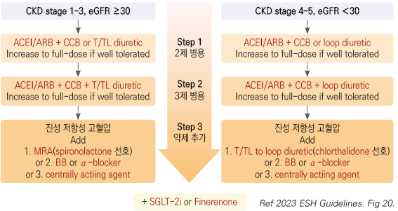

### 관상동맥병

* ≥130/80 ㎜Hg에서 치료 시작, 목표 혈압은 일반 환자와 동일; 목표 맥박수 60\~80/분 \[ESH]
* 선택 약제 : ACEI/ARB, BB; angina가 있는 CAD 환자의 경우 BB, DHP/non-DHP CCB

•BB와 non-DHP CCB(diltiazem, verapamil)병용은 금기

•맥박수가 ＜50/분인 경우 BB or non-DHP은 시작하지 않음

```

```

### 심부전

* 목표 혈압 : ＜130/80 ㎜Hg
* 고혈압 환자에서 심부전 예방을 위하여 α-차단제±{T/TL diuretic(액체 저류 예방), BB(빈맥 예방)} 고려
* 심부전 예방을 위하여 SGLT-2i 고려

#### 치료

* ejection fraction 감소 시 : ACEI/ARB(선호), ARNI, BB, MRA, SGLT-2i; 대체 DHP-CCB
* 증상이 있는 hypervolemia (폐 &/or 말초 부종) 시 : 이뇨제
*   non-DHP CCB는 좌심실 수축 기능을 저하시킬 수 있으므로 주의; 알파차단제는 신경호르몬계 활성화, 수분 저류,

    심부전의 악화를 야기할 수 있으므로 금지

    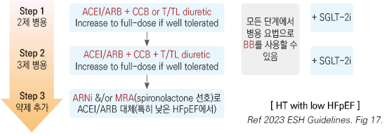

### 당뇨병

*   당뇨병 환자의 목표 혈압

    •\[대한의학회] 당뇨병 일반- ＜140/85 ㎜Hg ; CVD 동반- ＜130/80 ㎜Hg

    •\[ADA] 당뇨병 일반- ＜140/80 ㎜Hg; CVD 고위험군(10년 위험도 ≥15%)- ＜130/80 ㎜Hg

#### ADA 권고안

```

```

#### AACE 권고안

* 1차 선택 : ACEI 또는 ARB (특히 알부민뇨 동반 시)
* ＞150/100 ㎜Hg 시 2제 요법 : ACEI or ARB + CCB or β-차단제 or thiazide
*   2\~3개월 후 목표에 도달하지 못하면 약제 추가 → 3제 요법 후 목표에 도달 못하면 α-차단제, central agent, 혈관 확장제,

    or aldosterone 차단제 추가

### 저항성 고혈압 또는 조절되지 않는 고혈압

*   저항성 고혈압 : 3제 요법에도 불구하고 140/90 ㎜Hg 또는 목표 혈압 이하로 조절되지 않음;

    종종 HMOD, CV 위험 증가와 연관됨

※ 진성 저항성 고혈압(true resistant hypertension) \[ESH] : 가성 저항성 고혈압(예: 복약 순응도 문제)이나 2차성 고혈압이

```
아니면서 ACEI/ARB, 칼슘차단제, 이뇨제(thiazide) 등을 포함한 3제 요법의 최대 내약 용량 투여에도 불구하고

≥140/90 ㎜Hg; 고혈압 환자의 ~5% 해당
```

#### 원인

* 부적절한 측정/진단 : 백의 고혈압, 노년층의 가성 고혈압, 팔 굵기 대비 작은 커프 사용
* 부적절한 치료 : 순응도 부족, 적은 용량, 부적절한 병용 요법, 약 부작용
* 부적절한 생활 습관 : 음주, 비만
* 과잉 체액 : 소금 섭취 과다, 신장 질환에 의한 수분 저류, 부적절한 이뇨제 사용
*   약물 : 한약제(예: 감초, 마황), NSAID, 피임약, steroid, 혈관 수축제, 감기약/코 울혈 제거제, cyclosporine, tacrolimus,

    erythropoietin, MAOI, midodrine
* 2차성 고혈압 : 수면무호흡증, 신 실질 질환, 신동맥 협착, 원발성 aldosteronism

#### 대처

* 순응도 점검, HBPM 또는 24시간 ABPM 측정(백의 고혈압 배제), 생활 습관 교정
*   약물 조정 : 이뇨제 추가(예: 저용량 spironolactone) 또는 교체(예: 고용량 thiazide, amiloride, loop 이뇨제),

    다른 기전의 약제 추가(예: bisoprolol, doxazosin)
* 검사 : 전해질, 혈당, BUN, Cr, U/A; 기타 2차성 고혈압 감별 검사
*   의뢰

    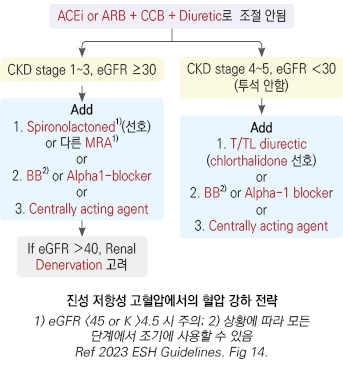

### 고혈압성 위기

* 현저한 혈압 상승(DBP ＞130 ㎜Hg)과 표적 장기 손상과의 상관관계는 적음

#### 고혈압성 응급 (Hypertensive emergency)

*   심한 고혈압(＞180/120 ㎜Hg) 또는 매우 빠른 혈압 상승으로 표적 장기 손상이 진행되거나 증상이 나타난 상태; 뇌증(두통,

    흥분, 혼란), 신증(혈뇨, 단백뇨, 급성 신부전), 뇌출혈, 대동맥박리, 자간증, 폐부종, 불안정 협심증, 심근경색

\*\* 조치\*\*

* 초기(첫 수 분\~1시간 이내)에 평균 동맥 혈압의 25% 이내의 강압을 목표로 입원 치료, 특히 뇌증이 있는 경우 비경구 치료
* 상태가 안정되면 2~~6시간 내에 SBP 160 ㎜Hg, DBP 100~~110 ㎜Hg를 목표로 조절
*   지나친 빠른 혈압 강하는 신장, 뇌 및 심근에 허혈을 유발할 수 있음

    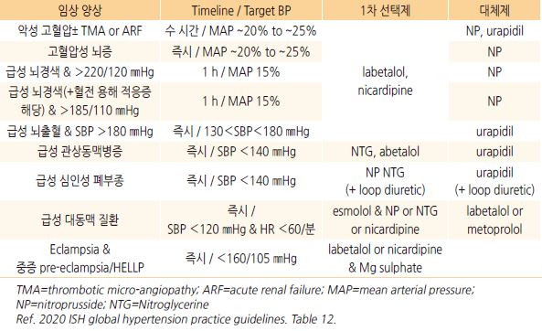

※ acute spontaneous ICH 환자에서 SBP가 150~~220 ㎜Hg인 경우 ICH 후 최소 7일 동안 SBP를 130~~<140 ㎜Hg로 낮추는

```
것이 유익할 수 있지만, SBP가 <130 ㎜Hg인 경우에는 항고혈압제를 중단
```

#### 고혈압성 긴박 (Hypertensive urgency)

* 심한 고혈압(＞180/120 ㎜Hg)이지만 표적 장기 손상 증상 진행 또는 증상이 나타나지 않은 상태

\*\* 조치\*\*

* 속효성 경구 항고혈압제 투여
*   수 시간 내 강압(또는 첫 24시간 내 25% 강압)을 목표로 조절

    •＜160/90 ㎜Hg로의 급속한 강압은 피함
* 즉각적인 항고혈압제 투여 없이 안정시키고 반복적으로 혈압을 측정하며 관찰할 수 있음
* 비-경구 약물은 적응증이 되지 않음
*   short-acting nifedipine 설하 투여는 혈압 강하의 정도를 예측할 수 없고 심박수를 올려 심장에 부담을 줄 수 있으므로

    권고하지 않음

    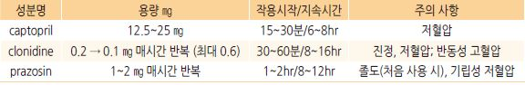

※ 급성 표적 장기 손상의 증거 없이 비심장 질환으로 입원 중인 중증 고혈압(>180/120) 환자에서 급성 혈압 감소를 위해

```
정맥 주사 또는 경구용 항고혈압제를 간헐적으로 사용하는 것은 권고하지 않음
```

### 모니터링 및 약제 조절

*   목표 혈압 도달 시까지 월 1회 방문, 2기 이상의 고혈압에서는

    더 자주 방문
*   약물 투여 후 1개월 내 목표 혈압에 도달하지 못하면 증량 또는

    다른 계열의 추가 약제 투여
* 검사 (☞ p.481)

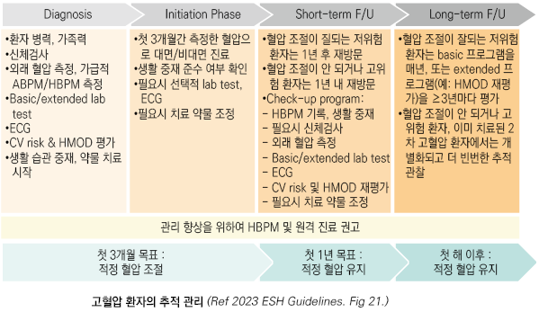

목표 혈압 달성을 위한 팁

```
① 생활 습관 교정

② 고혈압이 일으키는 문제를 설명하고 혈압약의 이득이 부작용보다 더 많음을 강조

③ 최소한의 목표 혈압 설정. 목표보다 15/10 ㎜Hg 이상 높은 경우에는 병합 요법 고려

④ 특별한 경우를 제외하고는 약물 투여 1개월(4주~6주) 관찰 후 증량 고려

⑤ 당뇨병, 비만, 신 기능 저하, 단백뇨 등을 동반하는 경우에는 대부분 병합 요법이 필요

⑥ 잘 조절되지 않는 경우에는 DHP계 및 non-DHP계 CCB 병합 요법 고려

⑦ 병용 처방 시 신 기능 수준에 맞춰 이뇨제를 처방, 가능한 한 single pill 복합제 선택

⑧ 가능한 한 1일 1회 복용 약제를 선택하여 매일 규칙적으로 하는 활동과 연계하여 복용

⑨ 신 기능 저하(eGFR＜60) 시 NSAID 사용을 최소화 함

⑩ 신 기능 저하(eGFR＜30) 시 이뇨제가 비교적 많은 용량으로 필요할 수 있음

    (예: furosemide 160 ㎎/d, metolazone 10~20 ㎎/d)

⑪ 환자에게 피드백 제공, IT 기반 모니터링

⑫ 가정 혈압 모니터링

⑬ 3가지 이상의 항고혈압제를 최대 용량으로 사용해도 목표 혈압 달성에 실패 시 의뢰 고려
```

### 고혈압 치료제의 감량 및 휴약

* 고려 대상 : 1년 이상 또는 4회 이상의 외래 방문에서 목표 혈압 이하로 조절되며, 고혈압의 위험 인자나 장기 손상이 없는 경우
* 방법 : 생활 습관 조절을 철저하게 하면서 서서히 감량 & 혈압 모니터링- 자가 혈압 측정 및 최소 3개월 간격으로 병원 방문
* 주의 : 갑자기 혈압이 상승할 수 있으며, 중단 6개월\~1년 후 혈압이 다시 상승하는 경우가 많음

> \*\*질병코드 \*\* I10 본태성(원발성) 고혈압

I10.1 악성 고혈압

I15 이차성 고혈압

O13 임신\[임신-유발]고혈압

R03.0 고혈압의 진단 없이 혈압수치 상승
