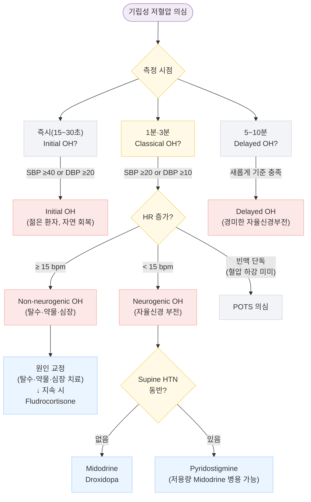

# 기립성 저혈압 Orthostatic Hypotension

## <mark style="color:green;">일반 사항</mark>

* 진단 기준 : 앙와위 또는 좌위에서 기립 후 3분 이내에 SBP ≥ 20 ㎜Hg 또는 DBP ≥ 10 ㎜Hg 감소; 증상 유무와 관계없이 진단 가능
* 어지럼·실신·시야 흐림 등의 증상이 동반될 수 있음
* 다른 이름 : 체위저혈압 (Postural hypotension)
* 유병률 : 지역사회·일차 의료 기관 17\~19%, 요양 시설 입소자 약 31%; 고령자(65세 이상)의 최대 1/4에서 발생
* 무증상인 경우가 흔함; 증상 유무와 무관하게 독립적인 심혈관 위험 인자로, MI·뇌졸중·심부전·심방세동 빈도 증가 및 사망률 상승과 연관

### <mark style="color:orange;">O아형</mark>

**Initial OH**

* 기립 후 15초 이내에 SBP ≥ 40 ㎜Hg or DBP ≥ 20 ㎜Hg 급감 후 30\~60초 내 자연 회복되는 형태; 기립 직후(15\~30초) 측정으로만 포착 가능
* 청소년·젊은 성인에서 흔하나 임상적 의미는 제한적인 경우가 많음(대부분 양성 경과)
* 진단 후 불필요한 추가 검사(자율신경 검사, 틸트 테이블 검사 등)로 이어지지 않도록 주의

**Classical OH**

* 기립 후 3분 이내에 OH 기준(SBP ≥ 20 or DBP ≥ 10 ㎜Hg 감소) 충족
  * ※ 앙와위 고혈압(SBP ≥ 160 ㎜Hg) 동반 환자에서는 SBP ≥ 30 ㎜Hg 감소를 진단 기준으로 적용 권고 (자율신경학회 공통 권고안; 과진단 방지 목적)

**Delayed OH**

* 기립 후 3분 이후 최대 10분 사이에 새롭게 SBP ≥ 20 ㎜Hg 또는 DBP ≥ 10 ㎜Hg 감소가 발생하는 형태
* sympathetic adrenergic dysfunction의 경미하거나 초기 형태
* 3분 측정 시 정상이지만 증상이 지속되는경우 5\~10분까지 연장 측정


**기립 시 맥박 반응으로 병인 추정**

* 혈압 하강 + **HR 증가 ≥ 15 bpm** → non-neurogenic OH (hypovolemia, 심장 pump 부전) 시사
* 혈압 하강 + **HR 증가 < 15 bpm** → neurogenic OH (자율신경 부전) 시사
* 혈압 하강 미미 + **기립성 빈맥 단독** (기립 후 10분 이내에 HR ≥ 30 bpm 상승이 **지속적으로** 유지) → POTS 의심


#### <mark style="color:$primary;">Neurogenic OH (nOH)</mark>

* 원발성 또는 이차성 자율신경 부전에 의한 기립성 저혈압
* 대표 원인 질환 : Parkinson병, 다발계통위축(MSA), 순수자율신경부전(PAF), Lewy소체 치매, 당뇨병성 신경병증
* 약 50%에서 **neurogenic supine hypertension** 동반 - 5분 이상 앙와위 후 SBP ≥ 140 ㎜Hg 또는 DBP ≥ 90 ㎜Hg (Autonomic Society 기준); 기립성 저혈압과 야간 고혈압이 공존하는 치료적 딜레마

***

## <mark style="color:green;">원인</mark>

#### <mark style="color:$primary;">혈액량 감소 (Hypovolemia)</mark>

* 수분 섭취 부족, 발열, 심한 설사·구토, 과도한 발한, 이뇨제 과다 사용
* 배뇨·배변 후 일시적 혈압 하락

#### <mark style="color:$primary;">정맥 저류 증가</mark>

* 음주, 식사(→ 식후 저혈압), 격렬한 운동, 기온 상승, 장기간 와상·기립, 패혈증, 임신

#### <mark style="color:$primary;">심장 기능 이상</mark>

* 서맥(동기능 부전, 방실 차단), 심장 판막 질환, 심부전, 심근경색

#### <mark style="color:$primary;">자율신경계 이상 (Neurogenic)</mark>

* 원발성 : 순수자율신경부전(PAF), 다발계통위축(MSA), Parkinson병 등 Lewy소체 질환
* 이차성 : 당뇨병성 신경병증, 아밀로이드증, 자가면역 신경병증

#### <mark style="color:$primary;">약물</mark>

* 항고혈압제(특히 α-차단제, 이뇨제), 알코올, 발기부전치료제(PDE-5 억제제)
* 진정제·수면제, 항우울제(TCA, MAOI), 인슐린, 항파킨슨병제(levodopa, dopamine agonist)
* 항정신병제, 마약성 진통제

#### <mark style="color:$primary;">기타</mark>

* 노화 (압수용체 반사 감소, 혈관 탄성 저하)
* 긴장, 무거운 것 들기, 탈수 상태에서의 운동

### <mark style="color:orange;">식후 저혈압 (Postprandial Hypotension)</mark>

* 식후 **15\~90분** 이내에 SBP **20 ㎜Hg 이상** 하락
* 추정 기전 : 식후 내장 순환에 따른 blood pooling에 대한 부적절한 sympathetic compensation; insulin 또는 vasoactive gastrointestinal peptide에 의한 혈관 확장
* 고령자, nOH 환자, 탄수화물 고함량 식사 후에 특히 흔함

***

## <mark style="color:green;">임상 양상</mark>

* **전형적 증상** : 기립 시 어지럼·현기증, 힘없음, 불안정감, 두근거림, 떨림, 구역
* **자율신경 증상** : 축축한 느낌(냉한), 창백, 흐려 보임(시야 흐림), 이명
* **중증 증상** : 인지 장애(일시적 혼돈), 실신 (fall risk↑, 골절 위험)
* 증상은 **기상 직후 아침**에 가장 심하고, 식후·더운 환경·운동 후에 악화됨

### <mark style="color:$danger;">🚩 Red Flags!</mark>

<mark style="color:$danger;">**즉각 조치 또는 응급 이송**</mark> <mark style="color:$danger;">- 생명 위협 또는 즉각적 위해 가능성</mark>

* 실신과 함께 **흉통·호흡 곤란·심전도 이상** 동반 → 급성 관상동맥 증후군 또는 폐색전증 의심
* 실신 후 **의식 회복 지연** 또는 **경련 동반** → 뇌졸중·경련성 질환과의 감별
* **급성 출혈** 또는 **심각한 탈수** (패혈증, 급성 구토·설사)로 인한 쇼크 전 상태

<mark style="color:$warning;">**당일 또는 조기 의뢰**</mark>

* 새로 시작한 항고혈압제 투여 후 **반복 실신** 또는 낙상 발생
* 기립성 저혈압과 함께 **파킨슨 증상**(보행 장애, 정지 떨림, 경직) 동반 → 신경과 의뢰
* **ECG 이상** (서맥, 심블록, QT 연장) 동반

<mark style="color:$info;">**외래 추적 / 추가 평가 계획**</mark> <mark style="color:$info;">- 즉각 위험 낮으나 호전 없으면 의뢰</mark>

* 비약물 치료 및 약물 조정에도 **4주 이상 증상 지속**되거나 낙상 반복
* **젊은 환자** (< 40세)에서 원인 불명의 기립성 저혈압 → Initial OH 포함 드문 이차 원인 배제
* 당뇨병 환자에서 nOH 의심 시 → 자율신경 기능 검사 및 당뇨 관리 재평가

***

## <mark style="color:green;">진단</mark>

### <mark style="color:orange;">Active Standing Test (기본 진단 방법)</mark>

1. **앙와위 또는 좌위**에서 5분 이상 안정 후 혈압·맥박 측정 (필요시 배뇨 후 시행)
2. 기립 후 아래 시점에서 혈압·맥박 반복 측정

<table><thead><tr><th width="160">측정 시점</th><th width="200">임상적 의미</th><th>비고</th></tr></thead><tbody><tr><td>기립 즉시 (15~30초)</td><td>Initial OH 감지</td><td>SBP ≥40 또는 DBP ≥20 ㎜Hg 감소</td></tr><tr><td>1분</td><td>초기 혈압 적응 평가</td><td>Classical OH 조기 발견</td></tr><tr><td>3분</td><td>Classical OH 확인</td><td>SBP ≥20 또는 DBP ≥10 ㎜Hg 감소 시 진단</td></tr><tr><td>5~10분</td><td>Delayed OH 확인</td><td>3분 측정 정상이나 증상 지속 시 연장 측정</td></tr></tbody></table>


**진단 시 주의** : 고혈압 환자에서 기립성 저혈압은 강압 치료 강도와 독립적으로 평가해야 함. 증상성 OH가 있는 고혈압 환자의 경우 목표 SBP를 완화(< 140 ㎜Hg 고려)하여 강압 치료 강도를 조정 (2025 AHA/ACC 가이드라인; 2024 ESC 가이드라인).


### <mark style="color:orange;">Neurogenic vs. Non-neurogenic OH 감별</mark>

<table><thead><tr><th width="170">특징</th><th width="210">Neurogenic OH</th><th>Non-neurogenic OH</th></tr></thead><tbody><tr><td>기립 시 HR 증가</td><td>&#x3C; 15 bpm (미미)</td><td>≥ 15 bpm (뚜렷)</td></tr><tr><td>주요 원인</td><td>자율신경 부전(파킨슨병, MSA, PAF, 당뇨 신경병증)</td><td>탈수, 약물, 심장 질환</td></tr><tr><td>발한</td><td>감소 또는 소실</td><td>정상</td></tr><tr><td>Supine hypertension</td><td>흔함 (약 50%)</td><td>드묾</td></tr><tr><td>1차 약물</td><td>Midodrine, Droxidopa</td><td>원인 교정 후 Fludrocortisone</td></tr></tbody></table>

### <mark style="color:orange;">검사</mark>

* **기본 혈액 검사** : CBC (빈혈), 혈당, 전해질, BUN/Cr, TSH
* **ECG** : 서맥, 심블록, QT 연장 확인; Holter monitor (간헐적 부정맥)
* **심초음파** : 구조적 심장 질환 배제
* **자율신경 반응 검사** (신경과 의뢰 시)
  * Heart rate variability (HRV)
  * Sudomotor function test (발한 기능)
  * Tilt-table test
  * Valsalva response
* 스트레스 검사 : 식사·온수 목욕·운동 등에 의한 증상 악화 또는 유발 관찰

### <mark style="color:orange;">감별 진단</mark>

<table><thead><tr><th width="180">감별 질환</th><th width="220">감별 포인트</th><th>조치</th></tr></thead><tbody><tr><td>반사성 실신 (미주신경성)</td><td>유발 자세 불특정; 전구증상(오심·발한) 동반; 기립 외 자극(통증·공포)에서도 발생</td><td>(☞ <a href="../221_/022_-reflex-syncope-neurally-mediated-syncope.md">반사성 실신</a>)</td></tr><tr><td>POTS</td><td>기립 10분 내 HR ≥ 30 bpm 상승이 <strong>지속적으로(sustained)</strong> 유지; 혈압 하강 미미; 주로 젊은 여성</td><td>신경과 협진</td></tr><tr><td>Initial OH</td><td>기립 15초 이내 급감 후 자연 회복; 일반 측정으로 놓칠 수 있음</td><td>즉시 측정 추가</td></tr><tr><td>심인성 어지럼·실신</td><td>서맥/빈맥, ECG 이상 동반</td><td>심장내과 의뢰</td></tr><tr><td>전정계 어지럼 (BPPV 등)</td><td>회전성 어지럼, 체위 변환 시 유발; 혈압 변화 없음</td><td>(☞ <a href="097_-dizziness.md">어지럼</a>)</td></tr><tr><td>저혈당</td><td>공복 또는 인슐린 사용 중; 혈당 측정으로 감별</td><td>혈당 측정</td></tr></tbody></table>

***



<p align="center"><strong>기립성 저혈압 진단 및 관리 알고리듬</strong></p>

<p align="center"><em><mark style="color:$info;">Ref. ACC/AHA/HRS Syncope Guideline 2017; AHA Scientific Statement on OH in Hypertension 2024; Consensus Panel for Neurogenic OH, J Neurol 2017</mark></em></p>

***

## <mark style="background-color:$warning;">Management</mark>

### <mark style="color:orange;">치료 방침</mark>


**치료 목표** : 혈압 정상화가 아닌 **증상 완화 및 낙상·장기 손상 예방**. 비약물 치료를 우선하고, 조절되지 않는 경우에만 약물을 추가. nOH에서는 Midodrine 또는 Droxidopa가 근거 수준이 가장 높은 1차 약물.


* 급성 증상 발생 시 : **즉시 앉거나 눕고**, 음료 500 ㎖ 섭취, 다리를 올린 자세로 5분 안정
* 기저 질환 치료 : 당뇨병(혈당 조절), 파킨슨병, 심장 질환, 빈혈
* **복용 중인 모든 약물 검토** - 유발 또는 악화 약물을 최소화하거나 대체
* 혈압 모니터링 : 앙와위·좌위·기립 자세, 식전 및 식후 1시간, 취침 전 등 다양한 상황에서 측정
* **동반 고혈압 환자** : 증상성 OH가 있을 경우 목표 SBP를 < 130 ㎜Hg보다 완화(< 140 ㎜Hg 고려)하여 강압 치료 강도를 조정 (2025 AHA/ACC 가이드라인; 2024 ESC 가이드라인)

### <mark style="color:orange;">Supine Hypertension 관리 (nOH 환자)</mark>

nOH 환자의 약 50%에서 동반. OH 치료와 상충되므로 개별화된 접근 필요. \*\*24시간 활동혈압 모니터링(ABPM)\*\*으로 야간 혈압 패턴을 평가하면 치료 조정에 유용.

<table><thead><tr><th width="210">앙와위 SBP</th><th>조치</th></tr></thead><tbody><tr><td>140~160 ㎜Hg</td><td>침상 머리 올림(20~30 ㎝), 경과 관찰</td></tr><tr><td>> 160 ㎜Hg</td><td>침상 머리 올림 강화; 저녁 약물 용량 재검토</td></tr><tr><td>> 180 ㎜Hg 또는 야간 증상</td><td>단기 항고혈압제 추가(취침 전 소량) 고려; 자율신경 전문의 의뢰</td></tr></tbody></table>

***

## <mark style="color:green;">비-약물 치료 및 예방</mark>

### <mark style="color:orange;">자세·행동 교정</mark>

* **천천히 일어남** (특히 아침 기상 시) : 수 분간 앉아 있은 후 기립; 지지가 될 가구·벽체를 잡고 일어남; 누운 상태에서 가벼운 운동 후 기립
* **Counter-pressure maneuver** (기립 직전·직후 시행) - 하지 정맥 환류를 증가시켜 즉각적 혈압 유지에 효과적 (☞ [반사성 실신 - counter-pressure maneuver](../221_/022_-reflex-syncope-neurally-mediated-syncope.md#counter-pressure-maneuver))
  * 하지 등척성 수축 (isometric leg contraction)
  * 발목 배굴 (feet dorsiflexion)
  * 다리 꼬기·쪼그려 앉기 (leg crossing / squatting)
  * 다리 올리기 (leg elevation)
  * 악력 등척성 운동 (hand grip isometric)
* 취침 시 **머리 부위를 20**~~**30 ㎝ (10**~~**20°) 상승** - 야간 앙와위 고혈압 완화에도 기여

### <mark style="color:orange;">환경·식이 관리</mark>

* 더운 환경 회피 (목욕탕, 찜질방, 더운 날씨의 야외 운동)
* 충분한 수분 섭취 **2 L/d** - 기립 30분 전 **물 500 ㎖** 급속 음용 시 즉각적 혈압 상승 효과
* 염분 섭취 증량 (**8 g/d**) - 고혈압·심부전·CKD 등의 제한이 없는 경우
* 과음 회피; **커피는 오전 이른 시간**에만 섭취
* **압박 스타킹 / 복부 밴드** (abdominal binder) 착용 - 정맥 저류 감소, 하지 부종 방지

### <mark style="color:orange;">운동</mark>

* 종아리 근육 강화 운동 (발목 펌핑)
* **비기립 유산소 운동 우선 권고** : 수중 운동(수영, 아쿠아로빅), recumbent bicycle, rowing - 기립 자세를 최소화하여 OH 증상 악화 위험 감소
* 지상 운동(달리기, 빠른 걷기)은 증상이 충분히 조절된 후 단계적으로 도입

### <mark style="color:orange;">식후 저혈압 예방</mark>

* 식전 **물 350\~500 ㎖** 섭취
* **저탄수화물**로 소량씩 자주 식사; 과식 회피
* 음주 회피
* 식후 **30\~60분은 앉아 있기** - 갑작스러운 기립 금지
* 필요 시 소량의 **카페인** (오전 한정)
* 중증 시 **octreotide** (식전 SC)

***

## <mark style="color:green;">약물 치료</mark>

비약물 치료로 교정되지 않는 경우에 한하여 고려. **nOH에서는 Midodrine·Droxidopa가 1차 선택이며, Fludrocortisone은 특히 비신경성 OH 또는 병용 목적으로 사용.**

#### <mark style="color:$primary;">Midodrine</mark> `LOE A`

* **nOH 1차 선택제** (비신경성 OH에도 사용)
* 기전 : 말초 선택적 **α-1-adrenergic agonist** → 혈관 저항↑; BBB 통과 안 함
* 부작용 : supine hypertension, 소름(piloerection), 가려움, 요저류, 위장 장애
* 금기 : 조절되지 않는 고혈압, 심한 심질환, 신부전, **요저류 (예: 심한 전립선 비대증)** - 방광 출구 저항을 높여 급성 요폐 유발 가능, 갑상선 중독증, 갈색세포종
* 용법 : 시작 **2.5 ㎎ bid\~tid** → 주당 2.5 ㎎/d 증량 → 유지 **5\~10 ㎎ tid** <mark style="color:blue;">\[미드론]</mark>
  * supine hypertension 예방 : **오후 6시 이후 및 취침 4시간 전** 복용 금지

#### <mark style="color:$primary;">Droxidopa</mark> `LOE A`

* **nOH 1차 선택제** - 파킨슨병, MSA, PAF 등 신경퇴행성 질환에 동반된 OH
* 기전 : norepinephrine prodrug → 교감신경계 혈압 상승 작용
* 주의 : 심질환, supine hypertension
* 용법 : **최대 1,800 ㎎/d #3** (tid); **취침 3시간 전** 마지막 투여

#### <mark style="color:$primary;">Fludrocortisone</mark> `LOE B`

* **비신경성 OH 1차 선택** 또는 nOH에서 Midodrine·Droxidopa와 병용
* 장기 근거 제한적; 부종·supine hypertension·심부전 악화 우려로 nOH 단독 1차제로서는 후순위
* 기전 : 합성 mineralocorticoid → 신장 Na 재흡수 증가 → 혈장 용량 확장
* 부작용 : supine hypertension, 저칼륨혈증, 부종, 두통, 심부전 악화
  * 저칼륨혈증 보정 : 과일·채소·육류 섭취 증량 또는 KCl 보충
  * **체중 모니터링** : 1주 이내 2 kg 이상 급격한 체중 증가 시 심부전·부종 신호 - 용량 감량 또는 중단 검토
* 금기 : 전신적 진균 감염, 심부전, CKD (eGFR 감소 시 주의)
* 용법 : 시작 **0.1 ㎎ qd** → 1주 후 0.1 ㎎/d 증량 → 유지 **0.1\~0.2 ㎎ qd** (**0.2 ㎎ 초과는 부작용 증가로 권장되지 않음**) <mark style="color:blue;">\[플로리네프]</mark>

#### <mark style="color:$primary;">Pyridostigmine</mark> `LOE B`

* 기전 : acetylcholinesterase 억제 → postganglionic sympathetic 신경 norepinephrine 분비↑ → OH 개선
* 특징 : **supine hypertension 유발 없음** - nOH + 앙와위 고혈압 동반 환자에서 특히 유용
* 부작용 : 콜린 증상(과다 침 분비, 발한, 설사, 다발 수축, 복통)
* 금기 : 기계적 장·요 폐쇄
* 용법 : 시작 **30 ㎎ bid\~tid** → 유지 **60 ㎎ tid** <mark style="color:blue;">\[메스티논]</mark>

#### <mark style="color:$primary;">Octreotide</mark> `LOE B`

* 기전 : somatostatin analogue → gastrointestinal peptide 분비 억제 → 내장 혈관 확장 억제
* **식후 저혈압에 특히 유용**
* 부작용 : 구역, 복통, 서맥, 흉통, 고혈당, 관절병증
* 용법 : 시작 **25\~50 ㎍** → 유지 **25\~150 ㎍**; 식전 30분 피하 투여 <mark style="color:blue;">\[산도스타틴]</mark>

### <mark style="color:orange;">기타 약물</mark> `LOE C`

* **NSAID** : prostaglandin 혈관 확장 억제; 일부 난치성 환자; fludrocortisone 또는 sympathomimetic agent 병용
* **Desmopressin (dDAVP)** : vasopressin receptor agonist → 야간 다뇨로 인한 아침 저혈량 환자에 제한적 사용; **저나트륨혈증 위험으로 routine use 권장되지 않음** <mark style="color:blue;">\[미니린]</mark>
* **Caffeine** : 식후 저혈압 예방 보조; 오전에 한정
* **Ephedrine / Pseudoephedrine** <mark style="color:blue;">\[슈다페드]</mark>
* **Yohimbine** (α-2 차단제)
* **Domperidone / Metoclopramide** : 식후 저혈압 동반 시 <mark style="color:blue;">\[모티리움 엠]</mark> <mark style="color:blue;">\[맥페란]</mark>
* **Fluoxetine** : 일부 신경성 OH에서 보고 <mark style="color:blue;">\[푸로작]</mark>

***

### <mark style="color:red;">질병코드</mark>

I95.1 기립성 저혈압

***

## <mark style="color:purple;">처방례</mark>

> **처방례 1. 비신경성 OH (탈수·약물 유발 - Midodrine 단독)**
>
> ```
> 미드론 2.5 ㎎/T　　2T　#2 (아침, 점심)
> ```
>
> _✽ 기립 시 증상이 뚜렷한 비신경성 중등도 OH. 오후 6시 이후 복용 금지(supine hypertension 예방). 주당 2.5 ㎎/d 증량 가능(최대 10 ㎎ tid). 혈압·맥박은 앙와위와 기립 자세 모두 추적._

> **처방례 2. 비신경성 OH (병용 - 혈장 용량 확장 추가)**
>
> ```
> 미드론 2.5 ㎎/T　　　　2T　#2 (아침, 점심)
> 플로리네프 0.1 ㎎/T　　1T　qd
> ```
>
> _✽ Midodrine 단독으로 불충분한 경우 Fludrocortisone 추가. 부종·저칼륨혈증·앙와위 혈압 상승 여부를 주기적으로 확인. 심부전 또는 CKD 환자에서는 Fludrocortisone 신중 사용._

> **처방례 3. Neurogenic OH (Supine HTN 없음 - Midodrine)**
>
> ```
> 미드론 5 ㎎/T　　2T　#2 (아침, 점심)
> ```
>
> _✽ 파킨슨병·MSA 등 nOH에서 앙와위 고혈압 미동반 시. 취침 전 혈압을 반드시 확인하여 supine hypertension 발생 여부 모니터링. 오후 6시 이후 복용 금지._

> **처방례 4. Neurogenic OH + Supine Hypertension 동반 - Pyridostigmine**
>
> ```
> 메스티논 30 ㎎/T　　2T　#2 (아침, 점심)
> ```
>
> _✽ nOH에서 앙와위 고혈압이 동반된 경우의 1차 선택. Pyridostigmine은 supine hypertension을 악화시키지 않는 장점이 있음. 증상 불충분 시 60 ㎎ tid까지 증량 가능. 콜린 부작용(복통, 설사, 발한) 주의._

> **처방례 5. 식후 저혈압 (Postprandial Hypotension)**
>
> ```
> 산도스타틴 50 ㎍/앰플　　1앰플　식전 30분 SC
> ```
>
> _✽ 식후 저혈압이 현저한 고령 nOH 환자. 주 식사 전 피하 주사. 혈당 상승 및 서맥 모니터링 필요. 식전 수분 350\~500 ㎖ 섭취 및 저탄수화물 소량 식사를 반드시 병행._

***

### <mark style="color:$success;">핵심 복약 지도</mark>

> **Midodrine (미드론)**
>
> * 혈관을 수축시켜 일어설 때 혈압이 떨어지지 않도록 도와주는 약입니다.
> * **오후 6시 이후에는 반드시 복용하지 마십시오** - 누워 있을 때 혈압이 과도하게 오를 수 있습니다.
> * 복용 후 \*\*소름(피부 따끔거림)\*\*은 흔한 반응이며 대개 일시적입니다.
> * **소변이 잘 나오지 않거나 심한 두통**이 생기면 즉시 알려 주세요.
> * 취침 전 혈압을 측정하여 **누운 자세 혈압이 높아지지 않는지** 확인하십시오.

> **Fludrocortisone (플로리네프)**
>
> * 혈액 내 수분량을 늘려 기립 시 혈압을 유지하는 약입니다.
> * **매일 같은 시간**에 복용하고, 임의로 중단하지 마십시오.
> * 복용 중 **발목·다리 붓기, 두통, 과도한 갈증**이 생기면 알려 주세요.
> * **체중을 주 1회 측정**하십시오 - 일주일 내 2 kg 이상 급격히 늘면 부종·심부전 신호일 수 있습니다.
> * 칼륨이 부족해질 수 있으므로 **바나나·오렌지·아보카도** 등을 충분히 드십시오.
> * 취침 전 혈압을 측정하여 **앙와위 혈압이 지나치게 높아지지 않는지** 확인하십시오.

> **공통 - 일상 주의사항**
>
> * 아침에 일어날 때 **천천히**, 30초 이상 앉아 있은 뒤 기립하십시오.
> * **기립 직전** 물 500 ㎖를 마시면 혈압 유지에 도움이 됩니다.
> * 더운 환경(찜질방, 뜨거운 욕조)은 혈압을 더 떨어뜨리므로 피하십시오.
> * **압박 스타킹**을 착용하면 다리 혈액이 심장으로 잘 올라와 증상이 줄어듭니다.

> **언제 다시 병원을 방문해야 하나요?**
>
> * 치료 중에도 **반복 실신 또는 낙상**이 발생하는 경우
> * 약 복용 후 **앙와위(누운 자세) 혈압이 160 ㎜Hg 이상**으로 높아지는 경우
> * **발목·다리 부종이 심해지거나 숨이 찬 경우** - 즉시 내원

***

### <mark style="color:blue;">환자 안내서</mark>


**기립성 저혈압, 일어설 때 어지러운 이유가 있습니다**

앉거나 누운 상태에서 갑자기 일어설 때 혈압이 잠시 떨어지면서 어지럼증이나 눈앞이 캄캄해지는 증상이 생기는 상태입니다. 대부분 생활 습관 교정만으로도 크게 좋아질 수 있습니다.


#### <mark style="color:$primary;">왜 이런 증상이 생기나요?</mark>

* 사람이 일어설 때 중력에 의해 혈액이 다리 쪽으로 쏠립니다. 정상적으로는 자율신경이 이를 즉시 감지하고 혈압을 유지해 주는데, 이 반응이 느리거나 약하면 뇌로 가는 혈류가 순간적으로 부족해져 어지럼증이 나타납니다.
* **노화, 탈수, 당뇨, 파킨슨병**, 또는 **혈압약·이뇨제 등의 약물**이 원인이 되는 경우가 많습니다.

#### <mark style="color:$primary;">일상생활에서 어떻게 관리하나요?</mark>

* **천천히 일어나십시오.** 아침에 일어날 때는 먼저 침대에서 30초\~1분 앉아 있다가 기립하세요.
* 일어서기 직전 \*\*물 한 컵(350\~500 ㎖)\*\*을 마시면 혈압 유지에 도움이 됩니다.
* **다리를 꼬거나, 쪼그려 앉거나, 발목을 위아래로 움직이는 동작**을 기립 직전에 하면 혈액 순환에 도움이 됩니다.
* **압박 스타킹**을 착용하면 다리 혈액이 심장으로 잘 올라갑니다.
* 더운 목욕, 찜질방은 혈압을 더 낮추므로 피하십시오.
* **식사는 소량씩 자주** 드시고, 식사 직후 30\~60분은 앉아 계시다가 일어나십시오.
* 하루 **물 2리터** 이상 마시고, 염분을 적절히 섭취하십시오 (의사가 제한을 두지 않은 경우).
* **낙상 예방을 위해 집안 환경을 점검**하십시오 - 미끄러운 욕실 바닥(미끄럼 방지 매트 설치), 어두운 복도 조명(야간 보조등 설치), 침대 옆 손잡이 등을 확인하십시오.

#### <mark style="color:$primary;">약은 어떻게 복용하나요?</mark>

* 처방받은 약은 **지정된 시간**에 복용하고, 특히 저녁 늦게는 복용하지 마십시오 (누운 자세에서 혈압이 오를 수 있습니다).
* **어지럼 증상이 없다고 임의로 중단하지 마십시오** - 담당 의사와 상의 후 조정해야 합니다.

#### <mark style="color:$primary;">이럴 때는 즉시 병원을 방문하세요</mark>

* 일어서다가 \*\*실신(의식 소실)\*\*이 발생하거나, **넘어져 다쳤을 때**
* **가슴 통증이나 호흡 곤란**이 함께 생길 때
* 치료를 받는데도 어지럼증이 **4주 이상 계속되거나 심해질 때**
