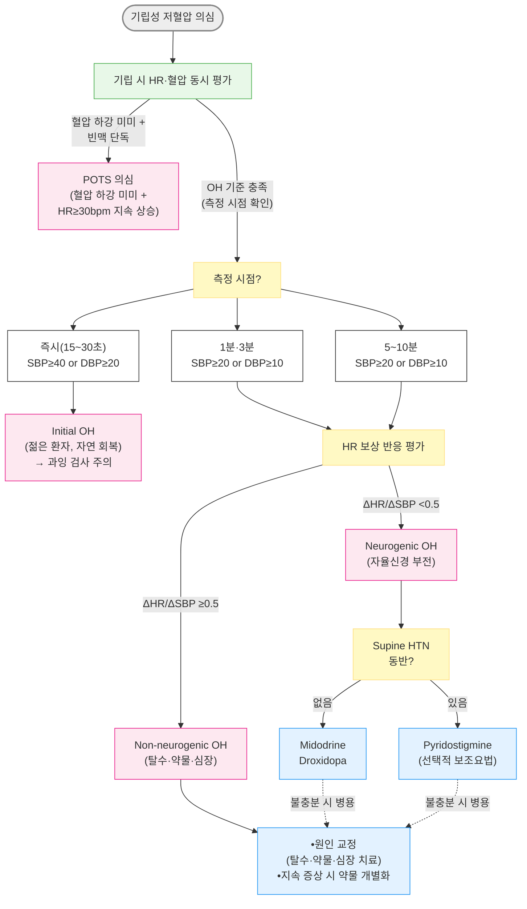

# 기립성 저혈압 Orthostatic Hypotension

## <mark style="color:green;">일반 사항</mark>

* 진단 기준 : 앙와위 또는 좌위에서 기립 후 3분 이내에 SBP ≥20 ㎜Hg 또는 DBP ≥10 ㎜Hg 감소; 증상 유무와 관계없이 진단 가능
* 어지럼·실신·시야 흐림 등의 증상이 동반될 수 있음
* 다른 이름 : 체위저혈압 (Postural hypotension)
* 유병률 : 지역사회·일차 의료 기관 17\~19%, 요양 시설 입소자 약 31%; 고령자(65세 이상)의 최대 1/4에서 발생
* 무증상인 경우가 흔함; OH는 MI·뇌졸중·심부전·심방세동 및 사망 위험 증가와 연관되지만, 이러한 연관성은 인과관계를 의미하지 않음

### <mark style="color:orange;">발생 시점에 따른 분류</mark>

<mark style="color:cyan;">**Initial OH**</mark>

* 기립 후 15초 이내에 SBP ≥40 ㎜Hg or DBP ≥20 ㎜Hg 급감 후 30\~60초 내 자연 회복되는 형태; 기립 직후(15\~30초) 측정으로만 포착 가능
* 청소년·젊은 성인에서 흔하나 임상적 의미는 제한적인 경우가 많음(대부분 양성 경과)
* 진단 후 불필요한 추가 검사(자율신경 검사, 틸트 테이블 검사 등)로 이어지지 않도록 주의

<mark style="color:cyan;">**Classical OH**</mark>

* 기립 후 3분 이내에 OH 기준(SBP ≥20 or DBP ≥10 ㎜Hg 감소) 충족
* 앙와위 고혈압이 있는 환자에서는 기립성 혈압 저하가 과소평가되지 않도록 SBP ≥30 ㎜Hg 감소를 보정 기준으로 고려; 일부 합의문에서는 DBP ≥15 ㎜Hg 감소도 함께 사용

<mark style="color:cyan;">**Delayed OH**</mark>

* 기립 후 3분\~10분 사이에 새롭게 SBP ≥20 ㎜Hg 또는 DBP ≥10 ㎜Hg 감소가 발생하는 형태
* sympathetic adrenergic dysfunction의 경미하거나 초기 형태
* 기립 3분 후 측정 시 정상이지만 증상이 지속되는 경우 5\~10분까지 연장 측정하여 진단


**기립 시 맥박 반응으로 병인 추정**

• 혈압 하강 + HR 증가가 뚜렷함 → non-neurogenic OH 가능성이 높음. 단, β차단제·서맥성 부정맥·심박동기 등 HR 반응을 제한하는 요인을 확인\
• **ΔHR/ΔSBP <0.5 bpm/㎜Hg** → neurogenic OH를 강하게 시사; 단독 진단 기준은 아님\
• 단순한 경험적 기준으로 ΔHR <15 bpm은 neurogenic, ≥15 bpm은 non-neurogenic을 시사할 수 있으나 ΔHR/ΔSBP 비율이 더 유용함\
• 혈압 하강이 OH 기준에 미치지 않으면서 기립 후 10분 이내 HR ≥30 bpm의 지속적 상승과 기립불내증 증상이 있으면 [POTS](../221_/030_-autonomic-dysfunction.md#undefined-1)(Postural orthostatic tachycardia syndrome) 의심


### <mark style="color:orange;">병인에 따른 분류</mark>

<mark style="color:cyan;">**Neurogenic OH (nOH)**</mark>

* 원발성 또는 이차성 자율신경 부전에 의한 기립성 저혈압 - Baroreceptor reflex arc의 efferent sympathetic pathway가 손상되어 기립 시 보상성 혈관 수축이 일어나지 않음
* 원인
  * 원발성 : 순수자율신경부전(PAF), 다발계통위축(MSA), Parkinson병 등 Lewy소체 질환
  * 이차성 : 당뇨병성 신경병증, 아밀로이드증, 자가면역 신경병증
* 약 50%에서 neurogenic supine hypertension 동반 - 5분 이상 앙와위 후 SBP ≥140 ㎜Hg 또는 DBP ≥90 ㎜Hg (Autonomic Society 기준); 기립성 저혈압과 야간 고혈압이 공존하는 치료적 딜레마 상태

<mark style="color:cyan;">**Non-neurogenic OH**</mark>

* 자율신경 반사궁 자체는 정상이나, 혈량·심박출량 부족 또는 정맥 저류 과다로 인해 정상적인 보상성 혈관 수축이 따라가지 못해 발생
* 원인
  * 혈액량 감소 (Hypovolemia) : 수분 섭취 부족, 발열, 심한 설사·구토, 과도한 발한, 이뇨제 과다 사용; 배뇨·배변 후 일시적 혈압 하락
  * 정맥 저류 증가 : 음주, 식사(→ 식후 저혈압), 격렬한 운동, 기온 상승, 장기간 와상·기립, 패혈증, 임신
  * 심장 기능 이상 : 서맥(동기능 부전, 방실 차단), 심장 판막 질환, 심부전, 심근경색
  * 약물 : 항고혈압제(특히 α1-차단제·이뇨제), β차단제, nitrate, 일부 CCB·ACEi·ARB, PDE-5 억제제, 진정제·수면제, 항우울제·항정신병제, opioid, 항파킨슨병제(levodopa, dopamine agonist), 알코올
  * 기타 : 노화 (Baroreceptor 반사 감소, 혈관 탄성 저하); 긴장, 무거운 것 들기, 탈수 상태에서의 운동
* 임상에서 가장 흔한 유형이며, 원인 교정만으로 호전되는 경우가 많음
* nOH와의 감별에는 기립 시 HR 보상 반응이 유용하나, 약물·부정맥 등으로 HR 반응이 제한될 수 있어 단독 기준으로 사용하지 않음

### <mark style="color:orange;">식후 저혈압 (Postprandial Hypotension)</mark>

* 정의가 완전히 표준화되지는 않았으나, 식후 2시간 이내에 SBP가 식전보다 ≥20 ㎜Hg 감소하는 경우가 흔히 사용되는 기준. 식전 SBP ≥100 ㎜Hg인 환자에서 식후 SBP ＜90 ㎜Hg로 떨어지는 경우도 임상적으로 중요
* 흔히 식후 30\~90분에 가장 뚜렷하지만 2시간까지 발생할 수 있음
* 추정 기전 : 식후 내장 혈류 증가와 정맥 저류에 대한 교감신경 보상이 불충분하고, insulin 또는 vasoactive gastrointestinal peptide 등에 의한 혈관 확장이 더해져 발생
* 고령자, 고혈압, 당뇨병, Parkinson병·MSA·PAF 등 자율신경기능장애, 고탄수화물 식사 후에 흔함
* 임상 양상 : 식후 어지럼, 졸림, 쇠약, 전실신·실신, 낙상 또는 협심증·일과성 신경학적 증상 악화
* 삼킴·식도 자극과 동시에 발생하는 상황성 반사 실신과 달리, 식후 일정 시간이 지나면서 혈압 감소가 확인됨(☞ [반사성 실신](../221_/022_-reflex-syncope-neurally-mediated-syncope.md))

## <mark style="color:green;">임상 양상</mark>

* 전형적 증상 : 기립 시 어지럼·현기증, 힘없음, 불안정감, 두근거림, 떨림, 구역
* 자율신경 증상 : 축축한 느낌(냉한), 창백, 흐려 보임(시야 흐림), 이명
* 중증 증상 : 인지 장애(일시적 혼돈), 실신(fall risk↑, 골절 위험)
* 증상은 기상 직후 아침에 가장 심하고, 식후·더운 환경·운동 후에 악화됨

### <mark style="color:$danger;">🚩 Red Flags!</mark>

<mark style="color:$danger;">**즉각 조치 또는 응급 이송**</mark>

* 실신과 함께 흉통·호흡 곤란·심전도 이상 동반 → 급성 관상동맥 증후군, 폐색전증
* 실신 후 의식 회복 지연, 지속적인 국소 신경학적 이상 또는 지속적 경련 → 뇌졸중·경련성 질환 등 감별
* 급성 출혈 또는 심각한 탈수(패혈증, 급성 구토·설사)와 저혈압·빈맥·말초관류 저하 등 쇼크 소견

<mark style="color:$warning;">**당일 또는 조기 의뢰**</mark>

* 새로 시작하거나 증량한 항고혈압제·α1-차단제·이뇨제 후 반복 실신 또는 낙상 발생
* 기립성 저혈압과 함께 파킨슨 증상(보행 장애, 정지 떨림, 경직) 동반
* ECG 이상 (서맥, 심블록, QT 연장) 동반

<mark style="color:$info;">외래 추적 / 추가 평가 계획</mark> <mark style="color:$info;">- 즉각 위험 낮으나 호전 없으면 의뢰</mark>

* 비약물 치료 및 약물 조정에도 4주 이상 증상 지속되거나 낙상 반복
* 젊은 환자 (＜40세)에서 원인 불명의 기립성 저혈압 → Initial OH 포함 드문 이차 원인 배제
* 당뇨병 환자에서 nOH 의심 시 → 자율신경 기능 검사 및 당뇨 관리 재평가

## <mark style="color:green;">진단</mark>

### <mark style="color:orange;">Active Standing Test (기본 진단 방법)</mark>

1. 앙와위 또는 좌위에서 5분 이상 안정 후 혈압·맥박 측정 (필요시 배뇨 후 시행)
2. 기립 후 아래 시점에서 혈압·맥박 반복 측정

<table><thead><tr><th width="167.6190185546875">측정 시점</th><th width="170.47625732421875">임상적 의미</th><th>비고</th></tr></thead><tbody><tr><td>기립 직후(≤15초)</td><td>Initial OH 감지</td><td>SBP ≥40 또는 DBP ≥20 감소 후 빠른 회복</td></tr><tr><td>1분</td><td>초기 혈압 적응 평가</td><td>Classical OH 조기 발견</td></tr><tr><td>3분</td><td>Classical OH 확인</td><td>SBP ≥20 또는 DBP ≥10 감소 시 진단</td></tr><tr><td>5~10분 이상</td><td>Delayed OH 평가</td><td>3분 정상이나 증상 지속 시 연장; 필요 시 기립경사검사로 더 오래 관찰</td></tr></tbody></table>


**진단 시 주의** : 고혈압 환자에서 OH가 발견되었다고 강압제를 자동으로 감량·중단하지 않는다. 2025 AHA/ACC 가이드라인은 집중적 혈압강하 자체가 OH를 일관되게 증가시키지는 않았다고 보며, 증상성 OH 또는 약물 시작·증량 후 증상이 발생한 경우 개별적으로 평가한다. 2024 ESC 가이드라인은 증상성 OH에서 더 완화된 혈압 목표를 고려할 수 있다고 권고한다.


### <mark style="color:orange;">Neurogenic vs. Non-neurogenic OH 감별</mark>

<table><thead><tr><th width="187.142822265625">특징</th><th width="210">Neurogenic OH</th><th>Non-neurogenic OH</th></tr></thead><tbody><tr><td>기립 시 HR 증가</td><td>감소 또는 부적절하게 작음</td><td>대체로 뚜렷함</td></tr><tr><td>ΔHR/ΔSBP</td><td>&lt;0.5 bpm/㎜Hg가 강하게 시사</td><td>≥0.5 bpm/㎜Hg가 시사</td></tr><tr><td>주요 원인</td><td>자율신경 부전(파킨슨병, MSA, PAF, 당뇨 신경병증)</td><td>탈수, 약물, 심장 질환</td></tr><tr><td>발한</td><td>감소 또는 소실</td><td>정상</td></tr><tr><td>Supine hypertension</td><td>흔함 (약 50%)</td><td>드묾</td></tr><tr><td>약물 원칙</td><td>비약물 치료 후 Midodrine/Droxidopa 등 개별화</td><td>원인 교정이 우선; 필요 시 약물 고려</td></tr></tbody></table>

### <mark style="color:orange;">검사</mark>

* 기본 혈액 검사 : CBC(빈혈), 혈당, 전해질, BUN/Cr, TSH
* ECG : 서맥, 심블록, QT 연장 확인; Holter monitor (간헐적 부정맥)
* 심초음파 : 심잡음, 구조적 심질환 병력·소견, 심장성 실신 의심 등 임상적 적응증이 있는 경우 선택적으로 시행
* 자율신경 기능검사 : nOH가 의심되거나 진단이 불명확하고 치료 결정에 도움이 될 때 선택적으로 시행
  * Heart rate variability(HRV)
  * Sudomotor function(발한 기능)
  * Tilt-table test
  * Valsalva response
* 모든 환자에게 자율신경검사를 일률적으로 시행하지 않으며, 식사·온수 목욕·운동은 병력상 유발 상황을 확인하는 데 활용

### <mark style="color:orange;">식후 저혈압 평가</mark>

* 식사와 증상의 시간적 관계, 식사량·탄수화물 비중·음주, 식후 자세·활동 및 복용약 시간을 확인
* 증상이 반복되면 5분 이상 안정한 상태에서 식전 혈압·맥박을 측정하고, 동일한 식사 후 30·60·90·120분에 반복 측정
* 측정 중 어지럼·졸림·전실신 등 증상과 자세를 함께 기록하여 혈압 감소와 증상의 연관성을 확인
* 진료실 검사로 포착되지 않거나 야간·기립 혈압 변동이 함께 의심되면 식사·증상 일지를 병행한 24시간 활동혈압 모니터링(ABPM) 고려
* 식후 증상만으로 진단하지 말고 저혈당, 부정맥, 약물 부작용 및 삼킴 실신 등 반사성 실신을 감별

### <mark style="color:orange;">감별</mark>

<table><thead><tr><th width="196.19049072265625">감별 질환</th><th width="404.761962890625">감별 포인트</th><th>조치</th></tr></thead><tbody><tr><td>반사성 실신 (미주신경성)</td><td>유발 자세 불특정; 전구증상(오심·발한) 동반; 기립 외 자극(통증·공포)에서도 발생</td><td>(☞ <a href="../221_/022_-reflex-syncope-neurally-mediated-syncope.md">반사성 실신</a>)</td></tr><tr><td>POTS</td><td>기립 10분 내 HR ≥30 bpm 상승이 지속적으로 유지; 혈압 하강 미미; 주로 젊은 여성</td><td>신경과 협진</td></tr><tr><td>Initial OH</td><td>기립 15초 이내 급감 후 자연 회복; 일반적인 측정으로 놓칠 수 있음</td><td>즉시 측정 추가</td></tr><tr><td>심인성 어지럼·실신</td><td>서맥/빈맥, ECG 이상 동반</td><td>의뢰</td></tr><tr><td>전정계 어지럼 (BPPV 등)</td><td>회전성 어지럼, 체위 변환 시 유발; 혈압 변화 없음</td><td>(☞ <a href="097_-dizziness.md">어지럼</a>)</td></tr><tr><td>저혈당</td><td>공복 또는 인슐린 사용 중; 혈당 측정으로 감별</td><td>혈당 측정</td></tr></tbody></table>

***


```mermaid
graph TD

    Start([기립성 저혈압 의심])
style Start fill:#eeeeee,stroke:#888888,stroke-width:2px
    HR0["기립 시 HR·혈압 동시 평가"]
style HR0 fill:#e8f8e8,stroke:#4caf50
    POTS["POTS 의심<br/>(혈압 하강 미미 +<br/>HR≥30bpm 지속 상승)"]
    T0["측정 시점?"]
    T1["즉시(15~30초)<br/>SBP≥40 or DBP≥20"]
    T2["1분·3분<br/>SBP≥20 or DBP≥10"]
    T3["5~10분<br/>SBP≥20 or DBP≥10"]
    InitOH["Initial OH<br/>(젊은 환자, 자연 회복)<br/>→ 과잉 검사 주의"]
    HR["HR 보상 반응 평가"]
    NonNeuro["Non-neurogenic OH<br/>(탈수·약물·심장)"]
    Neuro["Neurogenic OH<br/>(자율신경 부전)"]
classDef pink fill:#fde8f0,stroke:#e91e8c
class InitOH,Neuro,POTS,NonNeuro pink
    NonTx["•원인 교정<br/>(탈수·약물·심장 치료)<br/>•지속 증상 시 약물 개별화"]
    SupineHTN["Supine HTN<br/>동반?"]
classDef yellow fill:#fff9c4,stroke:#ffe082
class T0,HR,SupineHTN yellow
classDef white fill:#fff,stroke:#333
class T1,T2,T3 white
    NTx1["Midodrine<br/>Droxidopa"]
    NTx2["Pyridostigmine<br/>(선택적 보조요법)"]
classDef sky fill:#e3f2ff,stroke:#2196f3
class NTx1,NTx2,NonTx sky
    Start --> HR0
    HR0 -- "혈압 하강 미미 +<br/>빈맥 단독" --> POTS
    HR0 -- "OH 기준 충족<br/>(측정 시점 확인)" ---> T0
    T0 --> T1
    T0 --> T2
    T0 --> T3
    T1 --> InitOH
    T2 --> HR
    T3 --> HR
    HR -- "ΔHR/ΔSBP ≥0.5" --> NonNeuro
    HR -- "ΔHR/ΔSBP <0.5" --> Neuro
    NonNeuro --> NonTx
    Neuro --> SupineHTN
    SupineHTN -- "없음" --> NTx1
    SupineHTN -- "있음" --> NTx2
    NTx1 -. "불충분 시 병용" .-> NonTx
    NTx2 -. "불충분 시 병용" .-> NonTx
```

<p align="center"><strong>기립성 저혈압 진단 및 관리 알고리듬</strong></p>

***

## <mark style="background-color:$warning;">Management</mark>

### <mark style="color:orange;">치료 방침</mark>

* 치료 목표 : 혈압 정상화가 아닌 증상 완화 및 낙상·장기 손상 예방. 비약물 치료를 우선하고, 조절되지 않는 경우에만 약물을 추가. nOH에서는 Midodrine 또는 Droxidopa가 근거 수준이 가장 높은 1차 약물.
* 급성 증상 발생 시 : **즉시 앉거나 눕고** 가능하면 다리를 올려 낙상을 예방한다. 안전하게 앉거나 누운 뒤 수분 섭취가 가능한 경우 물 350~500 ㎖를 빠르게 마시는 방법을 고려할 수 있다.
* 기저 질환 치료 : 당뇨병(혈당 조절), 파킨슨병, 심장 질환, 빈혈
* 복용 중인 모든 약물 검토 - 유발 또는 악화 약물을 최소화하거나 대체
* 혈압 모니터링 : 앙와위·좌위·기립 자세와 취침 전 등 다양한 상황에서 측정. 식후 증상이 의심되면 식전 및 식후 30·60·90·120분에 측정
* 고혈압 치료 환자 : OH가 있다고 해서 강압제를 일률적으로 감량하지 않는다. 증상·낙상 위험·기립 혈압 및 좌위/앙와위 혈압을 함께 보아 개별화한다. 2024 ESC는 증상성 OH에서 더 완화된 목표를 고려할 수 있다고 권고한다.

### <mark style="color:orange;">Supine Hypertension 관리 (nOH 환자)</mark>

* nOH 환자의 약 50%에서 동반
* OH 치료와 상충되므로 개별화된 접근 필요
* 24시간 활동혈압 모니터링(ABPM)으로 야간 혈압 패턴을 평가하면 치료 조정에 유용

<table><thead><tr><th width="210">앙와위 BP</th><th>조치</th></tr></thead><tbody><tr><td>SBP 140~159 ㎜Hg</td><td>침상 머리 올림(약 10~20°), pressor 약물의 늦은 시간 복용 회피, 경과 관찰</td></tr><tr><td>SBP 160~179 ㎜Hg</td><td>침상 머리 올림, 야간 BP·ABPM 확인; 증상과 nOH 중증도에 따라 개별화</td></tr><tr><td>SBP ≥180 또는 DBP ≥110 ㎜Hg</td><td>자율신경 전문 진료를 고려하고, 필요 시 취침 전 단시간 작용 항고혈압제를 선택적으로 사용. 장시간 작용 약물로 아침 OH를 악화시키지 않도록 주의</td></tr></tbody></table>

## <mark style="color:green;">비-약물 치료 및 예방</mark>

### <mark style="color:orange;">자세·행동 교정</mark>

* 천천히 일어남 (특히 아침 기상 시) : 수 분간 앉아 있은 후 기립; 지지가 될 가구·벽체를 잡고 일어남; 누운 상태에서 가벼운 운동 후 기립
* Counter-pressure maneuver (기립 직전·직후 시행) - 하지 정맥 환류를 증가시켜 즉각적 혈압 유지에 효과적 : 하지 등척성 수축 (isometric leg contraction), 발목 배굴 (feet dorsiflexion), 다리 꼬기·쪼그려 앉기 (leg crossing / squatting), 다리 올리기 (leg elevation), 악력 등척성 운동 (hand grip isometric) (☞ [반사성 실신](../221_/022_-reflex-syncope-neurally-mediated-syncope.md#counter-pressure-maneuver))
* 취침 시 머리 부위를 약 10~20° 상승 - 야간 앙와위 고혈압 완화에도 기여

### <mark style="color:orange;">환경·식이 관리</mark>

* 더운 환경 회피 (목욕탕, 찜질방, 더운 날씨의 야외 운동)
* 수분 제한이 없는 경우 하루 약 2.0~2.5 L의 수분 섭취를 고려. 물 480~500 ㎖를 짧은 시간 내에 마시면 약 30~90분 동안 일시적인 pressor effect를 기대할 수 있음
* 염분 증량은 모든 환자에게 일률적으로 권하지 않으며, 혈압이 낮고 체액·염분 제한이 없는 환자에서 하루 6~10 g 정도의 식염을 고려. 고혈압·심부전·CKD에서는 개별화
* 과음 회피. 카페인은 효과가 일관되지 않아 routine 권고하지 않음
* 복대(abdominal binder)를 우선 고려하고, 필요 시 허벅지까지 올라오는 압박 스타킹을 병용. 압박의 목적은 정맥 저류 감소이며 하지 부종 자체의 치료 목적은 아님

### <mark style="color:orange;">운동</mark>

* 종아리 근육 강화 운동 (발목 펌핑)
* 비기립 유산소 운동 우선 권고 : 수중 운동(수영, 아쿠아로빅), recumbent bicycle, rowing - 기립 자세를 최소화하여 OH 증상 악화 위험 감소
* 지상 운동(달리기, 빠른 걷기)은 증상이 충분히 조절된 후 단계적으로 도입

### <mark style="color:orange;">식후 저혈압 예방</mark>

* 한 번에 많이 먹지 않고 소량씩 자주 식사하며, 고탄수화물·고혈당지수 식사와 과식을 피함
* 심부전·CKD 등 수분 제한이 없으면 식전 350\~500 ㎖의 물을 빠르게 마시는 방법을 고려
* 식사 중·식후 음주를 피하고, 식후 혈압이 떨어지는 시간에는 갑자기 일어서지 않음
* 증상이 발생하는 시간 동안 앉거나 반쯤 누운 자세로 쉬고, 일어날 때는 단계적으로 천천히 기립
* 카페인의 효과는 일관되지 않으므로 routine 권고하지 않으며, 수면·부정맥·혈압을 고려하여 오전에 제한적으로 고려
* 비약물 치료에도 실신·낙상이 반복되는 중증 자율신경부전 환자에서는 전문 진료하에 약물 치료를 고려

## <mark style="color:green;">약물 치료</mark>

* 비약물 치료로 교정되지 않는 경우에 한하여 고려
* nOH에서는 Midodrine 또는 Droxidopa가 근거가 가장 많은 1차 약제이며, Fludrocortisone은 체액 감소가 주된 환자 또는 선택적 보조요법으로 고려. 국내 허가 적응증과 off-label 사용을 구분

#### <mark style="color:$primary;">Midodrine</mark>

* nOH 1차 선택제 (비신경성 OH에도 사용)
* 기전 : 말초 선택적 α-1-adrenergic agonist → 혈관 저항↑; BBB 통과 안 함
* 부작용 : supine hypertension, 소름(piloerection), 가려움, 요저류, 위장 장애
* 금기 : 조절되지 않는 고혈압, 심한 심질환, 신부전, 요저류 (예: 심한 전립선 비대증) - 방광 출구 저항을 높여 급성 요폐 유발 가능, 갑상선 중독증, 갈색세포종
* 국내 허가사항 용법 : 성인 1회 2.5 ㎎, 1일 2~3회 경구투여. 장기치료 시 최소 유효량 사용. 누운자세 고혈압 위험을 줄이기 위해 늦어도 취침 4시간 전 복용 <mark style="color:blue;">[미드론]</mark>

#### <mark style="color:$primary;">Droxidopa</mark>

* nOH 1차 선택제 - 파킨슨병, MSA, PAF 등 신경퇴행성 질환에 동반된 OH
* 기전 : norepinephrine prodrug → 교감신경계 혈압 상승 작용
* 주의 : 심질환, supine hypertension
* 미국 허가 용법 : 100 ㎎ tid에서 시작하여 반응에 따라 증량, 최대 600 ㎎ tid(1,800 ㎎/d); 취침 최소 3시간 전 마지막 투여
* **국내 허가·시판 여부를 별도로 확인해야 하며**, 국내 일반 외래 처방례에서는 국내 허가약인 것처럼 제시하지 않는다.

#### <mark style="color:$primary;">Fludrocortisone</mark>

* 체액 감소가 주된 환자 또는 선택적 nOH에서 고려할 수 있으나, **장기 근거가 제한적**이고 부종·supine hypertension·저칼륨혈증·심부전 악화 위험이 있어 nOH의 routine 1차제로는 후순위
* 기전 : 합성 mineralocorticoid → 신장 Na 재흡수 증가 → 혈장 용량 확장
* 부작용 : supine hypertension, 저칼륨혈증, 부종, 두통, 심부전 악화
  * 혈중 K와 체중을 정기적으로 확인; 저칼륨혈증은 식이 또는 K 보충을 임의로 시행하지 말고 검사 결과에 따라 조정
  * 급격한 체중 증가, 부종, 호흡곤란은 체액 과다·심부전 악화 가능성이 있으므로 감량 또는 중단을 검토
* 주의 : 심부전, CKD, 저칼륨혈증, supine hypertension 등에서는 특히 주의. 국내 허가 적응증은 부신피질 기능부전 관련 질환이며 **OH 치료는 허가 적응증 외 사용**
* 용법 : 일반적으로 0.05~0.2 ㎎ qd 범위에서 개별화하되 국내 허가사항 및 off-label 사용을 확인 <mark style="color:blue;">[플로리네프]</mark>

#### <mark style="color:$primary;">Pyridostigmine</mark>

* 기전 : acetylcholinesterase 억제 → postganglionic sympathetic 신경 norepinephrine 분비↑ → OH 개선
* 특징 : supine hypertension을 상대적으로 덜 악화시키는 것으로 알려져 있어 nOH + 앙와위 고혈압에서 선택적 보조요법으로 고려
* 부작용 : 콜린 증상(과다 침 분비, 발한, 설사, 다발 수축, 복통)
* 금기 : 기계적 장·요 폐쇄
* 국내 허가 적응증은 중증근무력증이며 **OH 치료는 허가 적응증 외 사용**. 연구에서는 30~60 ㎎ bid~tid 범위가 사용됨 <mark style="color:blue;">[메스티논]</mark>

#### <mark style="color:$primary;">Octreotide</mark>

* 기전 : somatostatin analogue → gastrointestinal peptide 분비 억제 → 내장 혈관 확장 억제
* 생활요법에도 중증 식후 저혈압이 반복되는 자율신경부전 환자에서 전문적으로 고려하며 routine 외래 치료로 사용하지 않음
* 부작용 : 구역, 복통, 설사, 서맥, 고혈당·저혈당, 담석 및 앙와위 고혈압 악화 가능
* 국내 허가 적응증은 식후 저혈압이 아니므로 **허가 적응증 외 사용**. 전문 진료하에 주 식사 전 저용량 피하 투여를 고려할 수 있으나, 국내 제제의 허가사항·제형을 확인하여 사용 <mark style="color:blue;">[산도스타틴 주]</mark>
* 혈당·맥박·앙와위 혈압을 모니터링하고 장기 사용 시 담낭 이상을 확인

### <mark style="color:orange;">기타 약물</mark>

* Desmopressin (dDAVP) : 야간 다뇨가 아침 저혈량의 주요 원인인 일부 nOH에서 제한적으로 고려할 수 있으나 저나트륨혈증 위험 때문에 routine use를 권하지 않음 <mark style="color:blue;">[미니린]</mark>
* Atomoxetine : 일부 nOH에서 대안으로 연구되었으나 국내 일차진료에서 routine 처방할 근거가 부족
* NSAID, ephedrine/pseudoephedrine, yohimbine, fluoxetine 등은 제한된 연구 또는 부작용 문제로 **routine OH 치료약으로 권하지 않음**

***

### <mark style="color:red;">질병코드</mark>

I95.1 기립성 저혈압

***

## <mark style="color:purple;">처방례</mark>

> **처방례 1. 증상이 뚜렷한 기립성 저혈압 - Midodrine**
>
> ```
> 미드론 2.5 ㎎/T　　2T　#2 (아침, 점심)
> ```
>
> _✽ 원인 교정 및 비약물 치료에도 증상이 지속되는 경우 고려. 국내 허가 용량으로 시작하며, 늦어도 취침 4시간 전 복용을 종료한다. 앙와위·기립 혈압과 요저류 여부를 추적._

> **처방례 2. 체액 감소가 주된 원인 - Fludrocortisone 선택적 사용**
>
> ```
> 플로리네프 0.1 ㎎/T　　1T　qd
> ```
>
> _✽ 수분·염분 보충이 가능한 환자에서 체액 감소가 지속되고 다른 원인 교정만으로 불충분한 경우 전문적으로 고려. 국내에서는 OH가 허가 적응증 외 사용이므로 적응증·급여 및 부작용을 확인한다. 부종·저칼륨혈증·앙와위 혈압 상승·심부전 악화를 모니터링._

> **처방례 3. Neurogenic OH - Midodrine**
>
> ```
> 미드론 5 ㎎/T　　2T　#2 (아침, 점심)
> ```
>
> _✽ nOH에서 증상이 지속되는 경우 고려. 국내 허가 용량 범위와 환자 내약성을 확인하고, 취침 4시간 전 이후에는 복용하지 않는다. nSH 여부를 함께 추적._

> **처방례 4. Neurogenic OH + Supine Hypertension - Pyridostigmine 선택적 사용**
>
> ```
> 메스티논 30 ㎎/T　　2T　#2 (아침, 점심)
> ```
>
> _✽ nOH에서 nSH가 문제이고 비약물 치료 및 원인 교정만으로 불충분한 경우 보조적으로 고려. 국내에서는 OH가 허가 적응증 외 사용이다. 복통·설사·발한 등 콜린성 부작용을 관찰._

> **처방례 5. 중증 식후 저혈압 - Octreotide 전문치료**
>
> ```
> 산도스타틴 50 ㎍/앰플　　1앰플　식전 30분 SC
> ```
>
> _✽ 생활요법에도 반복적인 실신·낙상이 발생하는 중증 자율신경부전의 식후 저혈압에서 전문 진료하에 고려. 국내 허가 적응증 외 사용이므로 제제 허가사항과 급여 여부를 확인하고, 혈당·맥박·앙와위 혈압을 모니터링한다._

### <mark style="color:$success;">핵심 복약 지도</mark>

> **Midodrine (미드론)**
>
> * 혈관을 수축시켜 일어설 때 혈압이 떨어지는 것을 줄이는 약입니다.
> * **늦어도 취침 4시간 전에는 복용을 마치십시오.** 누워 있을 때 혈압이 과도하게 오를 수 있습니다.
> * 소름(입모), 가려움·두피 이상감각이 나타날 수 있습니다.
> * 소변이 잘 나오지 않거나 심한 두통·두근거림이 생기면 알려 주세요.
> * 누운 자세와 기립 자세의 혈압을 함께 확인하십시오.

> **Fludrocortisone (플로리네프)**
>
> * 혈액 내 수분과 염분을 늘려 기립 시 혈압을 유지하는 데 도움을 줄 수 있습니다.
> * 복용 중 **발목·다리 부종, 체중 증가, 두통, 숨참**이 생기면 알려 주세요.
> * 혈압과 혈중 칼륨을 정기적으로 확인하십시오.
> * 칼륨 보충제나 고칼륨 식품을 임의로 늘리기보다 혈액검사 결과에 따라 의사의 지시에 따르십시오.

> **공통 - 일상 주의사항**
>
> * 아침에 일어날 때 **천천히**, 침대 가장자리에 잠시 앉았다가 기립하십시오.
> * 증상이 생기면 즉시 앉거나 누워 낙상을 피하십시오.
> * 물 350~500 ㎖를 짧은 시간 내에 마시는 방법은 일시적으로 혈압을 올리는 데 도움이 될 수 있습니다. 단, 심부전·신장질환 등으로 수분 제한을 받는 경우에는 의사의 지시를 따르십시오.
> * 더운 환경(찜질방, 뜨거운 욕조)은 피하고, 오래 서 있는 것을 줄이십시오.
> * 복대나 허벅지까지 올라오는 압박 스타킹을 적절히 사용하십시오.

> **식후 저혈압이 있는 경우**
>
> * 한 번에 많이 먹지 말고 탄수화물이 많은 식사와 과식을 피하여 소량씩 나누어 드십시오.
> * 수분 제한이 없다면 식사 전에 물 350~500 ㎖를 빠르게 마시는 방법을 고려하십시오.
> * 식후 혈압이 떨어지는 시간에는 갑자기 일어서지 말고 앉거나 반쯤 누워 쉬십시오.
> * 식사 전과 식후 30·60·90·120분 혈압 및 증상을 기록하면 치료 조정에 도움이 됩니다.

> **언제 다시 병원을 방문해야 하나요?**
>
> * 치료 중에도 **반복 실신 또는 낙상**이 발생하는 경우
> * 약 복용 후 **누운 자세에서 혈압이 반복적으로 매우 높아지는 경우**, 특히 SBP ≥180 ㎜Hg
> * **심한 두통, 흉통, 호흡곤란, 심한 두근거림**이 새로 발생하는 경우
> * 다리 부종이 심해지거나 체중이 급격히 증가하는 경우

### <mark style="color:blue;">환자 안내서</mark>


**기립성 저혈압, 일어설 때 어지러운 이유가 있습니다**

앉거나 누운 상태에서 일어설 때 혈압이 떨어지면서 어지럼증, 눈앞이 흐려지거나 캄캄해지는 증상이 생기는 상태입니다. 원인에 따라 생활습관 조절만으로 좋아지기도 하지만, 반복적인 실신이나 낙상을 예방하기 위해 원인과 약물을 확인하는 것이 중요합니다.


#### <mark style="color:$primary;">왜 이런 증상이 생기나요?</mark>

* 사람이 일어설 때 중력에 의해 혈액이 다리와 배 쪽으로 이동합니다. 정상적으로는 자율신경이 혈관을 수축시키고 심박수를 조절하여 혈압을 유지하지만, 이 반응이 충분하지 않으면 어지럼증이나 실신이 생길 수 있습니다.
* **노화, 탈수, 당뇨, 파킨슨병**, 또는 **혈압약·이뇨제·전립선 치료에 사용하는 α1-차단제 등의 약물**이 원인이 되거나 악화 요인이 될 수 있습니다.

#### <mark style="color:$primary;">일상생활에서 어떻게 관리하나요?</mark>

* **천천히 일어나십시오.** 아침에는 침대 가장자리에 잠시 앉아 있다가 천천히 기립하세요.
* 증상이 생기면 즉시 앉거나 누워서 넘어지는 것을 피하십시오.
* 기립 직전에 다리를 꼬거나, 발목을 위아래로 움직이거나, 허벅지·엉덩이 근육에 힘을 주는 동작을 하면 도움이 될 수 있습니다.
* 수분 제한이 없다면 하루 **2.0~2.5 L 정도의 물**을 충분히 마시고, 의사의 지시가 있다면 염분 섭취를 늘릴 수 있습니다.
* 아침이나 활동 전에 **물 약 480~500 ㎖를 짧은 시간 내에** 마시면 일시적으로 혈압을 올리는 데 도움이 될 수 있습니다.
* **복대나 허벅지까지 올라오는 압박 스타킹**을 사용하면 다리와 배에 혈액이 고이는 것을 줄이는 데 도움이 될 수 있습니다.
* 더운 목욕, 찜질방은 피하고 오래 서 있는 시간을 줄이십시오.
* 식후 어지럼·졸림·실신이 반복되면 한 번에 많이 먹지 말고 탄수화물이 많은 식사와 과식을 피하십시오.
* 낙상 예방을 위해 욕실 미끄럼 방지, 야간 조명, 침대 주변 정리 등 집안 환경을 점검하십시오.

#### <mark style="color:$primary;">식후에 어지럽거나 쓰러진다면</mark>

* 식후저혈압은 식사 후 내장으로 혈액이 많이 이동하면서 혈압을 충분히 유지하지 못해 발생할 수 있으며, 고령자·당뇨병·파킨슨병 등에서 흔합니다.
* 증상이 반복되면 식사 전과 식후 30·60·90·120분 혈압을 재고, 먹은 음식과 증상을 함께 기록하여 진료 시 보여주십시오.
* **삼키는 순간 바로 실신하는 경우**는 식후저혈압과 다른 상황성 반사 실신일 수 있으므로 진료받으십시오.
* 실신, 낙상, 흉통, 호흡곤란, 말이 어눌해지거나 한쪽 힘이 빠지는 증상이 동반되면 즉시 진료받으십시오.

#### <mark style="color:$primary;">약은 어떻게 복용하나요?</mark>

* 처방받은 약은 **지정된 시간**에 복용하십시오.
* 특히 Midodrine은 누운 자세에서 혈압을 높일 수 있으므로 **취침 4시간 전 이후에는 복용하지 마십시오.**
* 어지럼 증상이 좋아졌다고 임의로 중단하거나 용량을 변경하지 말고 담당 의사와 상의하십시오.

#### <mark style="color:$primary;">이럴 때는 즉시 병원을 방문하세요</mark>

* 일어서다가 **실신(의식 소실)**이 발생하거나 넘어져 다쳤을 때
* **가슴 통증이나 호흡 곤란**이 함께 생길 때
* 실신이 운동 중 또는 누워 있는 상태에서 발생했을 때
* 말이 어눌해지거나 한쪽 팔다리에 힘이 빠지는 등 새로운 신경학적 증상이 있을 때
* 치료 중에도 반복 실신·낙상이 계속되거나 증상이 빠르게 악화될 때
