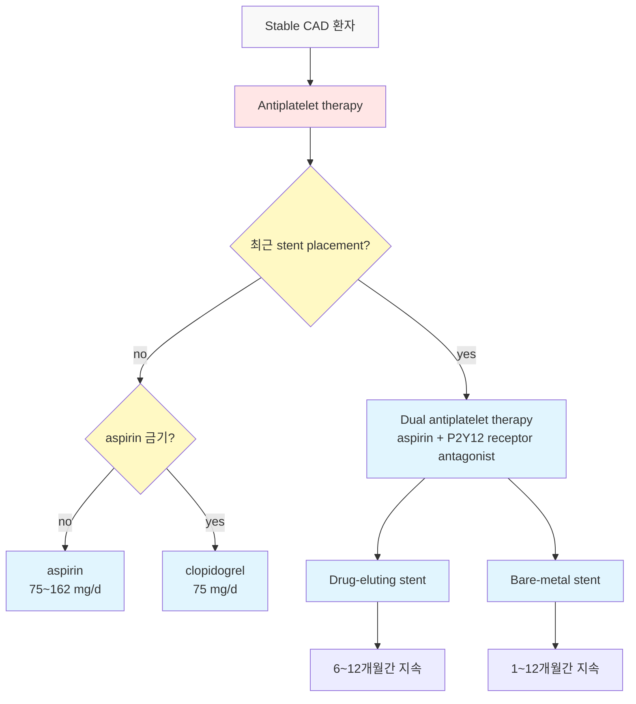
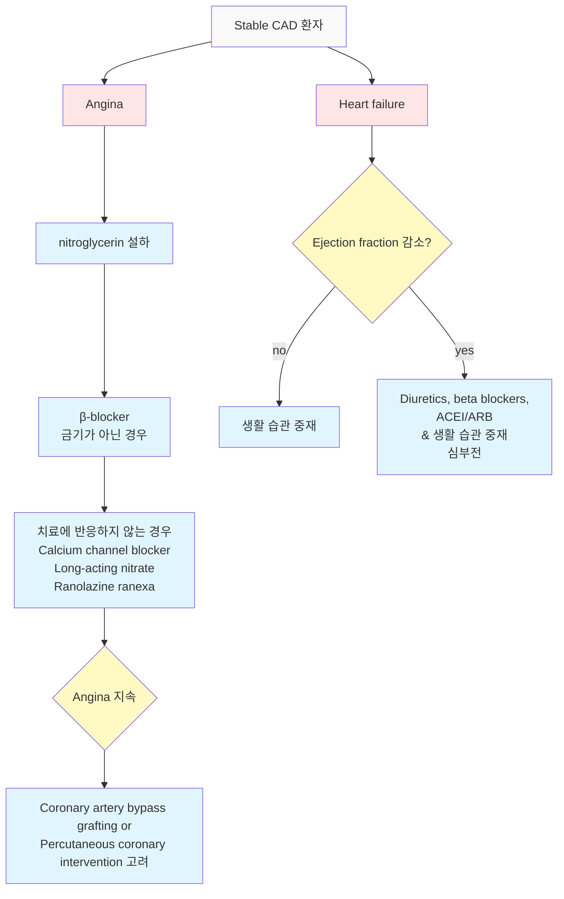

# 협심증 Angina Pectoris

## 일반 사항

* 관상동맥병(coronary artery disease, CAD) : 관상동맥의 죽상 경화성 협소에 기인하는 심근 허혈 질환; stable angina, acute coronary syndrome
* 협심증(angina pectoris) : 심근 허혈로 야기되는 흉부 불편감 또는 통증 등의 임상 증후군
* 안정 협심증(stable angina) : 특정 수준의 활동(예: 계단 오르기, 성 관계) 또는 감정적 스트레스, 추운 날씨, 과식 등의 상황에서 발생하는 협심증. 보통 이전 attack과 비슷한 수준의 증상 발생; 죽상경화증에 2차적인 관상동맥의 폐쇄에 의해 발생(보통 ＞70%의 stenosis). 안정 또는 nitroglycerin 투여로 호전
* 불안정 협심증(unstable angina) : 휴식 시 발생, 새롭게 발생, 또는 빈도/중증도/기간 등이 악화되는 협심증; MI 및 cardiac death 위험 증가 상태
* Prinzmetal angina(= variant angina, vasospastic angina) : 휴식(흔히 추위 노출, 밤) 시 발생, 종종 순환적(몇 초간의 흉통과 무증상 기간이 교대로 반복); coronary artery spasm에 기인; ECG상 ST-segment elevation; 심실 부정맥 위험
* 미세혈관 협심증(microvascular angina=syndrome X) : 협심증 증상(+), exercise test(+), coronary spasm(-), coronary angiogram 정상; 관상동맥 미세 순환에서 endothelium 의존 확장의 결함과 연관된 심근 관류 조절의 변화와 허혈; MI 및 cardiac death 위험 증가 상태(2%)
* Acute coronary syndrome : 심근의 산소 요구량에 비하여 심근에 대한 혈액 공급이 부족하여 발생하는 증상군; MI, unstable angina
* 전형적 협심증 (typical angina) : 임상 양상에서 전형적 특징 3가지를 모두 지님
* 비전형 협심증 (atypical angina) : 전형적 특징 중 2가지 해당
* 비심장성 흉통 (non-cardiac chest pain) : 전형적 특징이 없거나 1가지만 해당
* 협심증 유사 증상 (angina equivalent) : 힘든 활동 또는 스트레스와 관련하여 흉부 불편감이나 통증은 없이 호흡 곤란, 발한, 피로감, 트림, 어지럼, 구역, 소화불량, 복통 등의 비특이적 증상이 발생;; 여성, 고령, 당뇨병 환자에서 더 흔히 발생 (☞ p.19)
* 유병률\[우리나라] : 27.9%(남 44.7%, 여 55.3%); 사망 순위 2위- 심장 질환(1위- 암)

#### Angina 분류 \[Canadian Cardiovascular Society]

<table data-header-hidden><thead><tr><th width="96.78948974609375"></th><th width="428.21051025390625"></th><th></th></tr></thead><tbody><tr><td><strong>Class</strong></td><td><strong>증상 유발 활동 강도</strong></td><td><strong>일상생활 제한</strong></td></tr><tr><td><strong>I</strong></td><td>7~8 METS의 힘든 활동 (조깅, 힘든 집안일)</td><td>제한 없음</td></tr><tr><td><strong>II</strong></td><td>5~6 METS의 활동 (>2블록(340 m) 걷기, 한 층 올라가기)</td><td>약간 제한</td></tr><tr><td><strong>III</strong></td><td>3~4 METS의 활동 (1~2블록 걷기, 한 층 올라가기)</td><td>상당한 제한</td></tr><tr><td><strong>IV</strong></td><td>1~2 METS의 활동(휴식 중)에도 증상 발생</td><td>모든 활동 제한</td></tr></tbody></table>

## 원인

* 관상동맥 죽상경화증, 대동맥판 협착증, 폐고혈압, 비대심근병증, 관상동맥연축, 판막심장병, 미세 혈관 질환, endothelial dysfunction, volume overload

### 위험 인자

* 흡연, 과음, 스트레스, 비활동
* 비만, 조절되지 않는 고혈압/당뇨병, 이상지질혈증(HDL↓, LDL↑)
* 중년 남성, 노년 여성
* 1대 내 조기(남 ＜55세, 여 ＜65세) CAD 발생 가족력
*   뇌졸중, Lupus, Takayasu Dz, Kawasaki Dz, 말초 혈관 질환, RA, CKD,

    갑상선항진증, 발열, 심한 빈혈, 적혈구증가증, 심한 폐질환(저산소증),
* vasospasm 유발 약물 : cocaine, amphetamine

※ 우리나라: \[여성] 결혼 상태, 교육, 주관적 건강 상태, 비만도, 총 콜레스테롤, LDL-C, , 고혈압, 우울증, RA; \[남성] 흡연, 음주, 스트레스, 공복 혈당, TG, WBC, 낮은 HDL-C, 심근경색, DM

## 임상 양상

#### 전형적 특징&#x20;

(☞ 흉통)

1. 흉부 증상 : 흉골 뒤 조임감, 압박감, 무게감, 작열감; 2\~15분 정도 지속¹⁾; 턱/등/팔로 방사²⁾
2. 어떤 수준 이상의 힘든 작업이나 운동, 정서적 스트레스에 의해 유발
3. 휴식 또는 nitroglycerin 설하 투여로 30초\~수 분 이내 호전

_¹⁾ 20분 이상 지속될 수 있음. ²⁾ Positive likelihood ratio : 왼쪽 2.3, 오른쪽 2.9, 양쪽 7.1_

* sharp or stabbling pain은 드묾, 보통 자세나 호흡에 따라 달라지지 않음&#x20;
* 20분 이상 지속되는 경우 acute coronary syndrome 가능성이 높음

#### 기타 증상

* 호흡 곤란, 구역, 구토, 땀 흘림, 추운 느낌, 어지럼

※ 당뇨병 환자, 고령에서는 흉통 등 전형적 증상 없이 호흡 곤란, 피로, 식은땀 등만 있을 수 있음; 여성은 비전형적 흉통/불편감 호소가 남성보다 많음(65%에서 보고됨)

#### 고령에서의 특징

* 비전형적 증상을 보임; 호흡 곤란 및 비특이적 증상만 나타날 수 있음
* 육체 활동이 저하되어 있어 발견이 지연될 수 있음
* 치료 약제에 대한 부작용이 민감하게 발생할 수 있음

### 홍통의 Red flags

* 협심증 병력이 있는 사람에서 발생한 원인 불명의 흉통
* 통증으로 인하여 잠에서 깨어남
* 휴식 또는 이전에 비해 적은 활동 중에 증상 발생
* 잿빛 피부색, 발한
* 호흡 곤란, 비대칭적 호흡음 또는 박동
* 정신 상태 변화, 혼돈, shock
* nitroglycerin 2\~3회 설하 투여 또는 휴식으로 호전 안 됨
* 새로 발견된 심잡음
* vital sign 이상: 빠른 맥 또는 느린 맥, 빠른 호흡, 저혈압
* pulsus paradoxus (흡기 시 SBP > 10 mmHg ↓)

## 진단

### 검사

* 평가 단계 : ⓵ CAD 위험 요소 평가, ⓶ functional capacity 및 stress test 결, ⓷ 양 심실 기능, ⓸ coronary anatomy
* &#x20;임상 또는 기능 상태의 변화가 없는 경우 일률적인 해부학적 또는 허혈성 검사는 위험 계층화 또는 CCD 환자의 치료적 의사 결정을 위한 목적으로는 권고 않음 \[AHA/ACC(2023)]

#### 신체검사

* 고혈압, arcus senilis, xanthelasma, carotid or peripheral bruit, prominent S4, murmur
* 많은 환자들이 정상 이학적 소견을 보임

#### 실험실 검사

* cardiac enzyme(예: troponin) : 증상 발생 후 즉시 및 3\~6시간 후 검사
* CBC, lipid profile, HbA1c, RFT, 전해질
* 선택 : TFT, CRP, fibrinogen, homocysteine, prothrombin, brain natriuretic peptide

#### 심전도

* 증상 발생 후 즉시 & 10\~30분 후 검사 (✽협심증 환자의 ＞50%에서 안정 시 정상 ECG를 보임)
* 선택 : stress test(예: treadmill test)

#### 영상 검사

* 흉부 X선
* 선택 : CT, 심초음파, nuclear heart scanning, 심근 관류 영상

### 급성 심근경색의 가능성 추정 인자

#### 가능성 증가

* 압박감, Levine’s sign(✽증상을 묘사할 때 가슴 위에 주먹을 얹고 있음)
* 활동 또는 운동과 관련; 활동 시 호흡 곤란
* 같은 자리에 같은 증상이 발생함
* 심근경색 병력자에서 과거 앓았던 심근경색 증상과 유사하거나 그 보다 심함
* 심호흡 또는 자세에 영향을 받지 않음
* 발한, 구역, 구토, (우측 &/or 좌측) 어깨/팔 방사통 동반

#### 가능성 감소

* localization : 환자가 증상 위치를 국소적으로 지적할 수 있음
* 날카로운 통증, 짧은 흉통, 늑막성 흉통
* 왼쪽 유방 아래에 느껴지는 둔하고 지속되는 통증
* 증상 부위에 염증이 있음
* 체위 변화에 영향을 받음
* 압박으로 증상이 재현됨
* ＞20분 지속

### 흉통의 비-심장성 원인

(☞ [흉통](../220_/002_-chest-pain.md))

***

## Management

### 치료 방침 \[ACC/AHA/ACP-ASIM 권고안]

* Aspirin & Antianginal therapy (nitrate)&#x20;
* B-blocker & Blood pressure (Hypertension)&#x20;
* Cigarette smoking & Cholesterol
* Diet & Diabetes
* Education & Exercise

#### Approach to Diagnosis and Management of Stable Angina

_Ref. Diagnosis and management of stable angina: A Review. JAMA. 2021;325(17). Fig 2_

**1. Acute coronary syndrome 및 비심장성 흉통 배제**

* 환자의 상세 병력 및 신체검사 : 증상이 삶의 질에 미치는 영향, 심부전 or 판막 질환 징후 여부, CAD 가능성 평가

**2. CAD의 objective risk marker 평가**

* ECG : LBBB 및 major ST- or T-wave 이상, 과거 경색 or LVH 확인
* 심초음파 고려 : LV systolic dysfunction, 판막 이상 확인
* 기타 위험성 결정을 위한 실험실 검사 고려 : 신 기능, 당뇨, 이상지질혈증, 심장 손상(hs-cTnT, NT-proBNP)

**3. CVA 해부학 or 기능 검사 고려**

* coronary CT angiography : CAD 관찰, left main or 3-vessel disease 배제
* stress testing : 기능 평가를 원하는 경우, 알려진 CAD가 있는 경우
* invasive angiography : 비침습적 검사에서 모호한 결과에 대한 추가 평가, coronary revascularization 적합 여부 확인
*   검사 보류 대상 : 증상이 드물고 삶의 질에 큰 영향이 없으며 ECG, 심초음파, hs-cTnT or NT-proBNP 검사 상

    고위험 소견 없음

**4. Stable angina 관리**

* optimal medical therapy 시작
  * 2차 예방 약물 : 심혈관 사고 위험 감소를 위하여 고강도 statin, 저용량 aspirin
  * 항협심증 약물 : 삶의 질 향상을 위하여 β-blocker, CCB, nitrates
  * 당뇨병 환자 : SGLT2i or GLP-1 RA 고려
* 항협심증 치료 조정 : 증상, 부작용, 심박수, 혈압에 기초하여 결정
* coronary artery bypass graft&#x20;
  * 대상 : left main or triple vessel disease가 있는 당뇨병 환자 or LV systolic dysfunction
* percutaneous coronary intervention : 지속되는 삶의 질을 해치는 협심증에서 고려

## 약물 치료

* ≤1회/주 발생 시 → 운동 등 증상 유발 활동 전 및 증상 발생 시 nitroglycerin 설하 투여 및 규칙적 약물 복용 고려
* ≥2회/주 발생 시 → 장기 작용 항협심증제 투여 고려 (예: 지속형 nitrate, β-차단제)
* 한 가지 약물 복용 중 증상 지속 시 → 약물 추가 고려
* 두 가지 약물 복용 중 증상 지속 시 → 약물 추가 또는 수술 치료 고려
* 1차 선택제 : β-차단제, 칼슘 통로 차단제, Nitrate

### [β-차단제](095_-hypertension.md#v-v-adrenergic-receptor-blocker-bb)

* 작용 : β-receptor에 대한 catecholamine의 결합 방해 → negative inotropic effect(심박수/혈압/심장수축력↓) → 심근 산소 요구량↓, 좌심실벽 스트레스↓
* 대상 : 운동 또는 활동 중 증상 발생, 심근 손상 또는 심부전이 있는 환자, 최근에 심장 발작을 겪은 환자
* MI 후 최소 2\~3년간 권고
* 지난 1년간 MI 병력, LV ejection fraction(LVEF) ≤50%, 또는 β-차단제 치료의 다른 적응증이 없는 CCD 환자에 대한 β-차단제 장기 치료를 권고하지 않음
* 휴식 시 맥박이 55\~60/분이 되도록 용량 조절
* 부작용 : 피로, 발기 부전, 수족냉증, 파행 악화, 서맥, 방실 전도 장애, 좌심실 부전, 천식
* 금기 : 2\~3도 전도 장애, 중증 심부전, 말초혈관 질환, 기관지 천식, COPD, sick sinus syndrome, 레이노병, 심한 우울증
* cardio-selective β1-차단제 선호
  * intrinsic sympathomimetic activity가 있는 약제는 심박수를 줄이는 작용이나 휴식 시 혈압 강하 작용이 없기 때문에 피함. 예) celiprolol
  * 심장 선택성 제제도 과량 사용 시 모든 β-수용체에 작용 함
* 약물 중단 시 2주 동안 tapering : β-차단제는 β-수용체 밀도를 증가시키므로 갑작스런 사용 중단 시 catecholamine에 대한 일시적인 과민 상태를 만들어 허혈성 심질환을 유발할 수 있음
* atenolol : 신장 기능 저하자에서 주의; 25\~200 ㎎/d \[테놀민]
* metoprolol : 25\~400 ㎎/d \[푸로롤 서방]
* carvedilol : α-차단 작용도 있어 혈관 확장에 유리; 6.25\~50 ㎎/d \[딜라트렌 에스알]

### 칼슘차단제

* 작용 : 동맥 확장, 관상동맥 혈류 개선, 심근의 산소 요구량↓
* 대상 : Prinzmetal’s angina, 증상이 있는 말초혈관 질환
* β-차단제 대체 또는 추가 용도로 투여
* long-acting 제제만 사용

#### DHP계 CCB

* β-차단제 + nitrate로 효과가 부족한 경우 β-차단제 + DHP계 CCB로 대체 고려
* 부작용 : 안면 홍조, 두통, 말초 부종
* amlodipine : 5\~10 ㎎/d \[노바스크]
* felodipine : 5\~10 ㎎/d \[무노발]
* nifedipine : angina 치료 목적 사용 시 MI 유발 가능성이 보고됨; 30\~90 ㎎/d \[아달라트]

#### non-DHP계 CCB

* 작용 : negative chronotropic & negative inotropic effect가 있어 심근 산소 요구량을 보다 낮춤
* 부작용 : 전도 장애, 서맥성 부정맥, 변비, 말초 부종
* 금기 : 방실 전도 장애, 울혈성 심부전, EF ＜40%; β-차단제와 병용 금지
* diltiazem : 120\~480 ㎎/d \[헤르벤 서방]
* verapamil : 120\~480 ㎎/d \[이솦틴 서방]

### 상태에 따른 β-차단제 또는 CCB 권고

**의학적 상태**

<table data-header-hidden><thead><tr><th width="249.4210205078125"></th><th></th><th></th></tr></thead><tbody><tr><td><strong>상태</strong></td><td><strong>추천 (대체)</strong></td><td><strong>금기</strong></td></tr><tr><td>전신성 고혈압</td><td>BB (CCB)</td><td></td></tr><tr><td>편두통 또는 혈관성 두통</td><td>BB (n-CCB)</td><td></td></tr><tr><td>천식, 기관지수축성 COPD</td><td>n-CCB</td><td>BB</td></tr><tr><td>갑상선항진증</td><td>BB</td><td></td></tr><tr><td>레이노병</td><td>L-CCB</td><td>BB</td></tr><tr><td>인슐린 의존성 당뇨</td><td>BB¹⁾, L-CCB</td><td></td></tr><tr><td>인슐린 비의존성 당뇨</td><td>BB, L-CCB</td><td></td></tr><tr><td>우울증</td><td>L-CCB</td><td>BB</td></tr><tr><td>경도 말초혈관 질환</td><td>BB, CCB</td><td></td></tr><tr><td>중증 말초혈관 질환</td><td>CCB</td><td>BB</td></tr></tbody></table>

**심장 부정맥 및 전도 장애**

<table data-header-hidden><thead><tr><th width="266.26312255859375"></th><th></th><th></th></tr></thead><tbody><tr><td><strong>상태</strong></td><td><strong>추천 (대체)</strong></td><td><strong>금기</strong></td></tr><tr><td>동성 서맥</td><td>L-CCB</td><td>BB, n-CCB</td></tr><tr><td>심부전과 무관한 동성빈맥</td><td>BB</td><td></td></tr><tr><td>상심실성 빈맥</td><td>n-CCB, BB</td><td></td></tr><tr><td>방실차단</td><td>L-CCB</td><td>n-CCB</td></tr><tr><td>심방세동 (디지털리스 복용 중)</td><td>n-CCB, BB</td><td></td></tr><tr><td>심실 부정맥</td><td>BB</td><td></td></tr></tbody></table>

**좌심실부전 (울혈성 심부전)**

<table data-header-hidden><thead><tr><th width="267.3157958984375"></th><th></th><th></th></tr></thead><tbody><tr><td><strong>상태</strong></td><td><strong>추천 (대체)</strong></td><td><strong>금기</strong></td></tr><tr><td>경도 (심박출율 > 40%)</td><td>BB</td><td></td></tr><tr><td>심박출율 &#x3C; 40%</td><td>D-CCB²⁾ (nitrate)</td><td>n-CCB</td></tr></tbody></table>

**좌측 심장판막 질환**

| **상태**      | **추천 (대체)** | **금기**         |
| ----------- | ----------- | -------------- |
| 경도 대동맥 판막협착 | BB          |                |
| 대동맥 판막부전증   | L-CCB       |                |
| 승모 판막부전증    | L-CCB       |                |
| 승모 판막협착증    | BB          |                |
| 비대 심근병증     | BB, n-CCB   | nitrate, D-CCB |

_BB=β-차단제, n-CCB=non-DHP CCB (verapamil, diltiazem),_ \
_D-CCB=DHP CCB, L-CCB=long acting CCB_

_¹⁾ 반응성 병력이 있는 경우. ²⁾ amlodipine, felodipine 사용 가능_

_<mark style="color:$info;">Ref. 대한순환기학회, 허혈성심질환 표준진료권고안 (2007)</mark>_

### ACE 차단제

* 작용 : 혈압↓, afterload↓, MI 후 cardiac remodeling
* 대상 : 당뇨병이 있으면서 좌심실 수축기 기능 저하가 동반된 환자
* 부작용 : 기침, 고칼륨혈증, 혈관부종; 기침 등 부작용 있는 경우 ARB 선택
* enalapril : 5\~40 ㎎/d \[레니프릴]
* lisinopril : 5\~40 ㎎/d \[제스트릴]
* ramipril : 2.5\~10 ㎎/d \[트리테이스]

### Nitrate

* 작용 : smooth muscle 이완, 혈소판 응집 방해 → 동맥/정맥 혈관 확장, preload↓, 혈압↓, 심근 산소 요구량↓ → 협심증 응급 증상 완화 및 예방
* 부작용 : 두통, 어지럼, 저혈압 (특히 고령), 홍조
  * 지속 복용하면 완화됨; 부작용 예방을 위하여 충분한 수분 섭취를 권고
* 주의/금기 : hypertrophic obstructive cardiomyopathy, PDE5i 복용

#### 속효성 제제

* 작용 : 증상 치료 또는 예방; 스트레스 발생 예상 5분 전 투여. 30\~40분간 유효
* nitroglycerin : 0.3\~0.6 ㎎ 설하(입이 마른 경우 투여 전 물로 입을 축임) → 흉통이 완화되지 않을 경우 5분 간격으로 추가 투여. 단 15분 이내에 1.2 ㎎을 넘지 않도록 함 \[니트로글리세린] (✽개봉된 상태에서의 유효 기간 : 3개월)
  * 만성 안정형 협심증 환자에서 1회 투약으로 유의하게 호전될 경우에는 5분 간격으로 최대 3회까지 반복 복용하고 증상이 완전히 없어지지 않을 경우 119 호출

#### 지속성 제제

* 장기 사용 시 약제 내성 발생
  * 내성 발생 예방법 : 최소 유효 용량 사용, 1일 8시간 이상의 nitrate-free interval 유지
* isosorbide dinitrate : 40\~80 ㎎/d \[이소켓 서방]
* isosorbide-5-mononitrate : 30\~240 ㎎/d \[임듈 지속]

### 콜레스테롤 저하제

* 작용 : plaque 예방 및 plaque 주위에 blood clot이 형성되는 것을 예방
* 대상 : 지질 수준에 관계없이 CAD 환자에서 고강도 statin 권고
* 선별된 환자에 대하여 statin에 보조제(예: esetimibe, PCSK9i, inclisiran, bempedoic acid)를 사용할 수 있음
* 지질 관리 : CAD 고위험 환자에서는 LDL-C ＜70 ㎎/㎗을 목표로 관리 (☞ [이상지질혈증](099_-dyslipidemia.md))
* statin + ezetimibe : CVD 예방에 대하여 임상적 증거는 불충분함
* statin + PCSK9 억제제(예: evolocumab) : 고위험군에서 CV event를 감소시킬 가능성이 있음

### 항혈소판제

#### Aspirin

* 작용 : 혈액 응고 예방
* 금기 : 활동성 소화성 궤양, 국소 출혈, 출혈성 소인, aspirin 과민 반응
* 용량 : 100(75\~162) ㎎/d \[아스피린 프로텍트] (☞ p.1154)

#### Thienopyridine

* 작용 : ADP 수용체 억제, 혈소판 기능 억제 → 혈소판 활성 및 응집 방해
* 대상 : aspirin을 사용할 수 없는 환자 (✽안정 협심증에서 aspirin보다 우월하다는 증거 없음)
* MI 또는 percutaneous coronary intervention 후 aspirin과의 병용 고려
* clopidogrel : 75 ㎎/d \[플라빅스]
* prasugrel : 5\~10 ㎎/d \[에피언트]
* ticagrelor : 90\~180 ㎎/d \[브릴린타]
* 단기간의 dual antiplatelet therapy는 여러 상황, 특히 출혈 위험이 높고 허혈 위험이 낮거나 중간 정도일 때 안전하고 유효함; CI(경피적 관상동맥 중재술)로 치료한 CCD 환자의 경우  단일 항혈소판 치료 후 6개월 동안 aspirin과 clopidogrel 병용이 주요 출혈 및 CV event를 줄임

***

**Stable CAD 환자에서의 항혈소판제 알고리듬**&#x20;

Ref. _Stable Coronary Artery Disease: Treatment AFP 2018;97(6) Fig 1._

### Ranolazine

* 2차 선택제
* 작용 : fatty acid oxidation↓, myocyte에서 Ca overload를 줄임 → 협심증 증상↓, 운동 능력↑
  * 혈압/맥박에 영향 없음
* 대상 : 타 약제의 표준 치료에도 불구하고 증상이 지속되는 환자에서 추가 약제로 고려
* 부작용 : 어지럼, 변비, 구역, 두통, QT 연장
* 금기 : 간 기능 장애, 심장 전도 장애, CYP3A 억제 약물
* 용법 : 500\~1,000 ㎎ bid \[라넥사] (비급여)

### 기타

#### GLP-1RA 및 SGLT2i

* 당뇨병이 있는 CCD 환자에서 GLP-1RA 및 SGLT2i의 사용을 권고(주요 CV event 감소)
* LVEF ≤40%인 CCD 환자에서 SGLT2i의 사용을 권고(CV 사망, 심부전 입원 감소)
* 당뇨병이 없는 LVEF ＞40%인 CCD 환자에서 SGLT2i을 추가하는 것은 유효할 것으로 사료됨

#### Aldosterone 차단제

* 대상 : 신부전이나 고칼륨혈증이 없는 심근경색 후 환자에서 이미 치료 용량의 ACE 차단제나 β-차단제 복용에도 불구하고 좌심실 ejection fraction ＜40%, 당뇨/심부전 동반
* spironolactone : 25\~50 ㎎/d #2 \[알닥톤]

#### 오메가-3

* 대상 : 모든 허혈성 심질환 환자
* 용법 : 1 g/d. TG 상승 시 증량 \[오마코] (☞ p.534)
* 생선 기름, ω-3 지방산, 또는 비타민을 포함한 보충제는 CV event를 줄이는데 도움이 되지 않으므로 CCD 환자에게 권고하지 않음; ω-3는 심방세동 발생 증가와 관련이 있음. 다만 Icosapent ethyl(purified EPA only) 4g/d 투여는 심혈관 사망을 20% 감소시켰음 \[AHA/ACC(2023)]

#### Molsidomine

* 작용 : 질산염과 비슷한 약리 작용; 질산염에서 보이는 내성이 없음
* 용법 : 2~~4 ㎎ bid~~tid \[몰시톤]

#### Trimetazidine

* 작용 : 당 대사 활성도를 높여 항협심증 효과; 예후에 관한 연구가 부족함
* 대상 : 단독 또는 칼슘차단제나 β-차단제와 병용
* 용법 : 20 ㎎ tid \[바스티난]

#### Nicorandil

* 작용 : 관동맥 확장 효과
* 치료 효과에 대하여 논란. 사용 근거 미흡
* 용법 : 10~~30 ㎎/d #2~~3 \[시그마트]

#### 항-호모시스테인제

* 호모시스테인 증가가 관동맥, 말초혈관 및 경동맥 질환의 위험 증가와 관련됨
* Vit B6, B12, folate : 필요시 보충

#### NSAID 제한

* 가능한 한 최소 용량으로 최소 기간 사용 또는 aspirin과 함께 투여

#### 효과가 검증되지 않은 치료들

* 마늘, 항산화제(예: Vit C/E, 베타 카로틴), 항염증 약물, HRT, chelation

### 무증상 환자에서의 예방 약물 치료 허혈성 심질환 표준 진료

**권고수준 Class I (유용성, 효과 등 입증)**

* aspirin : 심근경색의 과거력이 있는 환자에서 절대적 금기가 없는 경우
* β-차단제 : 심근경색의 과거력이 있는 환자에서 절대적 금기가 없는 경우
* 지질 강하제 : 증명된 관상동맥병이 있으면서 LDL-C ≥130 ㎎/㎗인 경우

**권고수준 Class IIa (유용하다는 증거나 의견이 우세)**

* aspirin : 심근경색의 과거력이 없는 환자에서 절대적 금기가 없는 경우
* β-차단제 : 이전 심근경색의 과거력이 없는 환자에서 절대적 금기가 없는 경우
* 지질 강하제 : LDL-C 100\~129 ㎎/㎗로 목표치가 ＜100 ㎎/㎗인 관상동맥병이 확인되는 경우
* ACEI : 당뇨가 있으나 심각한 신질환으로 인한 절대적 금기는 없는 모든 환자

## 비-약물 치료 및 예방

* 모든 CCD(chronic coronary Dz) 환자에게 건강한 식습관과 운동 등 비약물 치료를 권고

#### 기저 질환 관리

* 고혈압(☞ p.476), 당뇨병(☞ p.540), 이상지질혈증(☞ p.524) 관리

#### 금연, 음주 제한

* 전자담배는 장기적인 안전성 자료가 부족하고 지속 사용 시의 위험성 때문에 금연의 1차 방법으로는 권고하지 않음
* 음주 제한 (☞ p.995)

#### 체중 관리, 비만 치료

* 목표 : 현재 체중에서 10% 감량; 최종 목표- BMI ＜25 ㎏/㎡ (☞ p.1010)

#### 식이 조절

* 저칼로리 영양식 권고
* Choose : 과일/채소, 콩류/견과류, 통곡류, 살코기 단백질, 복합 탄수화물, 식이 섬유, 단일 불포화지방(1일 열량의 ≤20%; 예: 올리브유), 다가 불포화지방(1일 열량의 ≤10%; 예: 연어)
* Instead : 포화지방(1일 열량의 ≤6%), 소금(4\~6 g/d), 가공육(예: 핫도그), 정제 탄수화물(예: 흰쌀), 설탕 첨가 음료, 알코올 음료
* Avoid : 트랜스지방(예: 쇼트닝/hydrogenated oil에 튀긴 음식)

#### 운동

* 일상생활에서의 활동을 늘림 (☞ p.1160)
* 유산소 운동 : 중등 강도(예: 빠르게 걷기)로 1일 30분\~60분씩 매일(주 5일 이상)
* 저항 훈련 (resistance training) : 주 2회
* 최대 심박수의 70%를 넘지 않거나 운동 능력 검사로 확인한 자신의 한계 내의 강도로 운동

#### 스트레스 관리

* 스트레스를 피하기 위하여 직업 또는 주거 환경 변화를 포함한 가능한 조치를 함
* 명상, 정신 상담 등 스트레스 관리 방법을 강구

#### 협심증을 유발할 수 있는 활동을 피함

* 능력 및 신체 상태에 따라 활동 강도를 조절함
* 급하게 서두르는 행동을 하지 않음, 일의 속도를 낮춤
* 오전, 식사 직후, 춥거나 날씨가 좋지 않을 때는 활동을 줄이는 것을 권고

**Stable CAD 환자의 관리 알고리듬**&#x20;

_Ref. Stable Coronary Artery Disease: Treatment AFP 2018;97(6). Fig 2._

## 수술 치료

* stenting
* coronary artery bypass graft surgery(CABG)

## 추적 관찰

* 증상이 없이 성공적으로 치료되고 있는 환자에서 4\~6개월에 한 번 이상 외래 관찰
* 외래 방문 시 다음 사항 확인
  1. 환자가 치료와 지시를 잘 따르고 있는가
  2. 증상의 빈도 및 강도가 마지막 방문 때보다 호전되었는가
  3. 마지막 방문 때보다 신체 활동이 줄어들지 않았는가
  4. 환자가 성공적으로 위험 인자를 관리하고 있으며 허혈성 심질환에 대한 지식을 가지고 있는가
  5. 새로이 발생한 다른 질환이 있는가, 이들의 치료가 심질환에 어떤 영향을 줄 수 있는가
* 임상 또는 기능 상태의 변화가 없는 CCD 환자의 경우 일률적인 관상동맥 CT 촬영이나 stress test, 치료 결정을 위한 LV 기능의 일률적인 재평가, 침습적 관상동맥 조영술은 권하지 않음 \[AHA/ACC(2023)]

### **질병코드**&#x20;

I20 협심증

I20.9 상세불명의 협심증

I25 만성 허혈심장병

I25.1 죽상경화성 심장병

## 처방례

처방례 1. 협심증 증상이 있는 경우
\
니트로글리세린 설하 0.6 ㎎/T 1T,
\
필요시 0.3 ㎎/T 1T 5분 간격 반복 ×2


\
처방례 2. 안정 협심증
\
딜라트렌 에스알 16 ㎎/C 1C qd
\
　이소켓 서방정 40 ㎎/T 2T #2


\
처방례 3. β-차단제 금기
\
헤르벤 서방캡슐 180 ㎎/C 1C qd
\
임듈 지속 60 ㎎/C 1C qd
