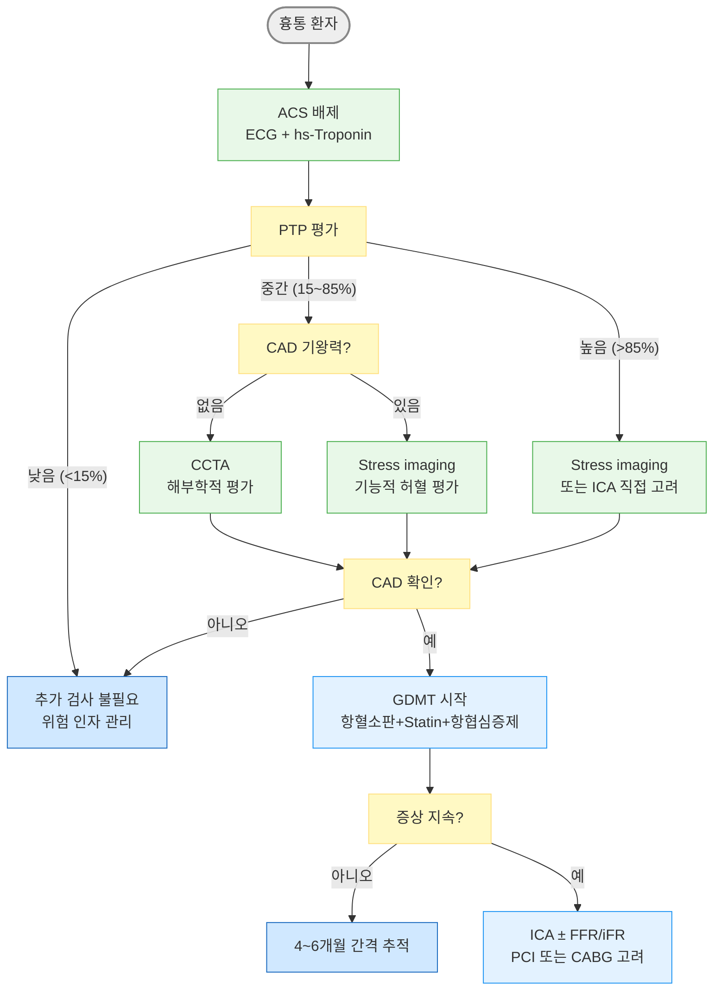
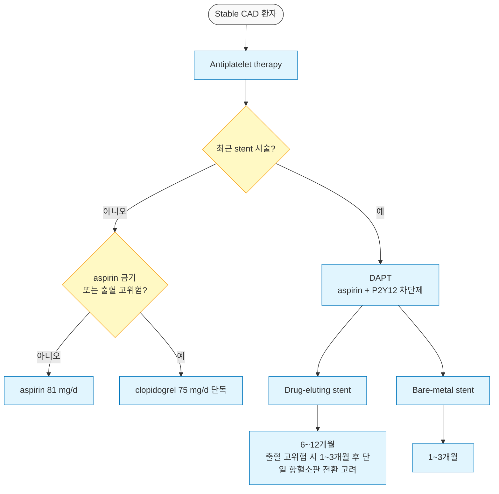
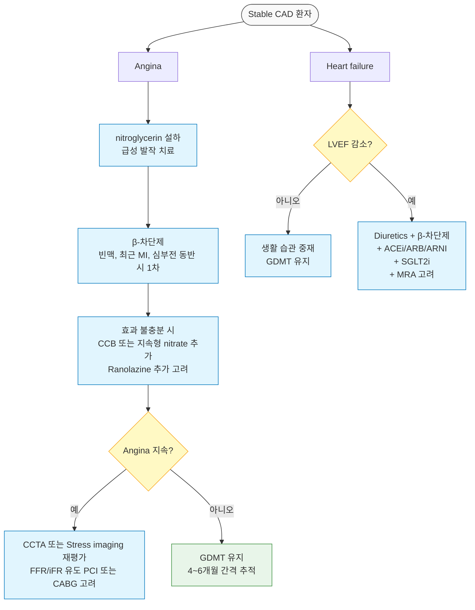

# 협심증 Angina Pectoris

## <mark style="color:green;">일반 사항</mark>

* **관상동맥병 (coronary artery disease, CAD)** : 관상동맥의 죽상경화성 협소에 기인하는 심근 허혈 질환
  * stable angina, acute coronary syndrome 포함
  * **폐쇄성 CAD** : 직경 협착(diameter stenosis) ≥50%; 임상적으로는  non-LM 혈관 ≥70%를 기능적 유의 협착으로 보며, 40\~70% 경계 협착은 FFR/iFR로 판단 (\*비좌주관상동맥(non-left main)에서는 대략 70% 이상 협착부터 운동 시 혈류 제한이 발생할 가능성이 크게 증가)
  * **비폐쇄성 CAD** : 협착 <50%; 동맥경화 플라크는 있으나 혈류 제한 없음
* **만성 관상동맥병 (chronic coronary disease, CCD)** : 이전의 stable ischemic heart disease(SIHD) 개념을 대체하는 광의의 용어 \[AHA/ACC]
  * CAD, 이전 MI/재관류술, 비침습적 검사로 진단된 허혈성 심장병, 만성 협심 증후군 등 포함
  * ESC는 동일한 개념 범위를 만성 관상동맥증후군(chronic coronary syndromes, CCS)으로 명명
* **안정 협심증 (stable angina)** : 계단 오르기, 성관계 등 특정 수준 이상의 활동 또는 감정적 스트레스, 추운 날씨, 과식 등의 상황에서 반복 발생하는 협심증; 이전 attack과 비슷한 강도로 발생
  * 관상동맥의 해부학적 협착 또는 기능적 허혈(FFR ≤0.80, iFR ≤0.89)에 의해 발생하며, 반드시 ＞70%의고도 협착이 존재하는 것은 아님
  * 안정 또는 nitroglycerin 투여로 호전
* **불안정 협심증 (unstable angina)** : 휴식 시 발생, 새롭게 발생, 또는 빈도/중증도/기간이 악화되는 협심증
  * MI 및 cardiac death 위험 증가 상태
* **Prinzmetal angina(= variant angina, vasospastic angina)** : ECG상 ST-segment elevation
  * 휴식(흔히 추위 노출, 야간) 시 발생; 관상동맥 연축(coronary artery spasm)에 기인
  * 심실 부정맥 위험
  * 흔히 순환적 - 흉통과 무증상 기간이 교대로 반복
* **ANOCA/INOCA** (Angina/Ischemia with No Obstructive Coronary Arteries) : 유의한(≥50%) 관상동맥 협착이 없음에도 협심증 증상(ANOCA) 또는 객관적 허혈 소견(INOCA)이 있는 상태
  * MACE(major adverse cardiovascular events, 주요 심혈관계 사건), HFpEF 위험 증가
  * 반복 입원, 삶의 질 저하와 연관됨
  * 여성에서 상대적으로 흔함


**ANOCA/INOCA 구조**

ANOCA\
├ **Vasospastic angina (Prinzmetal angina)** : 심외막 관상동맥의 연축에 의한 허혈; CCB 1차 선택, β-차단제 금기\
├ **INOCA** : 미세혈관 기능장애\
│ └─ **미세혈관 협심증(microvascular angina)** : 관상동맥 미세 순환의 endothelium 의존 확장 결함; \
│                 coronary angiogram 정상; ACEi/statin 조기 치료 권고\
└ **비허혈성 협심증** : endothelial dysfunction, 내장 감각 과민 등

* Vasospastic angina는 심외막 관상동맥의 연축이 기전으로, 미세혈관 기능장애를 주축으로 하는 INOCA와는 별개의 기전; 치료 접근이 다름\
  · Vasospastic angina 1차 치료 : CCB(DHP/non-DHP); β-차단제는금기(연축 악화 가능)\
  · Microvascular angina 1차 치료 : β-차단제, ACEi/ARB, statin; 증상 지속 시 ranolazine 추가 고려(근거 축적 중, 효과는 일관되지 않음)\
  · 혼합형/비허혈성 1차 치료 : 병태생리에 따라 병합 치료; 통증 클리닉·심리적 접근 병행 고려
* 혼동 주의 : 두 표현형의 β-차단제 권고는 정반대임 - vasospastic angina에는 금기, microvascular angina에는 1차 치료. 진단을 확정하지 못한 ANOCA/INOCA 환자에 무조건 β-차단제를 피하거나 무조건 투여하지 않도록 기전 감별이 먼저 필요


* **Acute coronary syndrome (ACS)** : 심근 산소 공급 부족으로 발생하는 증후군
  * STEMI, NSTEMI, unstable angina 포함
* **전형적 협심증 (typical angina)** : 전형적 특징 3가지를 모두 충족
* **Possibly cardiac angina (구 atypical angina)** : 전형적 특징 중 2가지 해당 - \[2021 AHA/ACC] 권고에 따라 "atypical" 대신 "possibly cardiac" 사용(☞ [흉통](../220_/002_-chest-pain.md))
* **비심장성 흉통 (non-cardiac chest pain)** : 전형적 특징이 없거나 1가지만 해당
* **협심증 유사 증상 (angina equivalent)** : 힘든 활동/스트레스와 관련하여 흉통 없이 호흡 곤란, 발한, 피로감, 구역, 소화불량, 복통 등의 비특이적 증상 발생; 여성, 고령, 당뇨병 환자에서 더 흔함 (☞ [흉통](../220_/002_-chest-pain.md))
* **진료 현황** \[우리나라] : 2020년 협심증(I20) 진료 환자 약 66.9만 명(2016년 대비 7.0% 증가); 60대가 전체 환자의 32.9%로 가장 많음; 심장 질환은 우리나라 사망 원인 2위(1위 - 암)

### <mark style="color:orange;">Angina 분류 및 활동 제한 \[Canadian Cardiovascular Society, CCS]</mark>

<table><thead><tr><th width="75.71429443359375">Class</th><th width="525.238037109375">증상 유발 활동 강도</th><th>일상생활 제한</th></tr></thead><tbody><tr><td><strong>I</strong></td><td>일상 활동(걷기, 계단 오르기)에서는 증상 없음; 힘들거나 빠르거나 오래 지속되는 작업·운동에서만 발생</td><td>제한 없음</td></tr><tr><td><strong>II</strong></td><td>빠르게 걷기/계단 오르기, 오르막길, 식후·추위·바람·정서적 스트레스 상황, 또는 기상 후 몇 시간 이내; 평지에서 2블록(약 340 m) 이상 걷거나 1개 층 이상 계단을 보통 속도로 오를 때 발생</td><td>약간 제한</td></tr><tr><td><strong>III</strong></td><td>평지에서 1~2블록 걷기 또는 1개 층 계단을 보통 속도·조건에서 오를 때 발생</td><td>상당한 제한</td></tr><tr><td><strong>IV</strong></td><td>어떤 신체 활동에도 불편감 없이 수행 불가능; 휴식 시에도 증상 발생 가능</td><td>모든 활동 제한</td></tr></tbody></table>

## <mark style="color:green;">원인 및 위험 인자</mark>

### <mark style="color:orange;">직접 원인</mark>

* 관상동맥 죽상경화증 (가장 흔함), 관상동맥 연축, 미세혈관 질환, endothelial dysfunction
* 기타 : 대동맥판 협착증, 비대 심근병증, 폐고혈압, 판막심장병, volume overload

### <mark style="color:orange;">위험 인자</mark>

* 생활 습관 : 흡연, 과음, 스트레스, 신체 활동 부족
* 대사 인자 : 비만, 조절되지 않는 고혈압/당뇨병, 이상지질혈증(HDL↓, LDL↑), 고 Lipoprotein(a)
* 인구학적 : 중년 남성, 노년 여성
* 가족력 : 1대 내 조기 CAD 발생 (남 ＜55세, 여 ＜65세)
* 동반 질환 : 뇌졸중, 말초혈관 질환, CKD, RA, SLE, Takayasu동맥염, Kawasaki병, 갑상선항진증, 중증 빈혈, 적혈구증가증, 중증 폐질환(저산소증)
* vasospasm 유발 약물 : cocaine, amphetamine


우리나라 특이 위험 인자: \[여성] 결혼 상태, 교육 수준, 주관적 건강 상태, 비만, 총 콜레스테롤, LDL-C, 고혈압, 우울증, RA; \[남성] 흡연, 음주, 스트레스, 공복 혈당, TG, 낮은 HDL-C, 심근경색, DM


## <mark style="color:green;">임상 양상</mark>

### <mark style="color:orange;">전형적 특징</mark>

(☞ [흉통](../220_/002_-chest-pain.md))

1. **흉부 증상** : 흉골 뒤 조임감, 압박감, 무게감, 작열감; 2\~15분 정도 지속¹⁾; 턱/등/팔로 방사²⁾
   * _¹⁾ 20분 이상 지속될 수 있음. ²⁾ Positive likelihood ratio : 왼쪽 2.3, 오른쪽 2.9, 양쪽 7.1_
   * Sharp or stabbing pain은 드묾&#x20;
2. **유발 요인** : 어떤 수준 이상의 힘든 작업이나 운동, 정서적 스트레스
3. **완화 요인** : 휴식 또는 nitroglycerin 설하 투여로 30초\~수 분 이내 호전
   * 보통 자세나 호흡에 따라 달라지지 않음

* 20분 이상 지속되는 경우 불안정 협심증 이상의 ACS 가능성 증가(전형적 MI는 흔히 30분 이상 지속 - ☞ [흉통](../220_/002_-chest-pain.md))

### <mark style="color:orange;">기타 증상</mark>

* 호흡 곤란, 구역, 구토, 발한, 추운 느낌, 어지럼

### <mark style="color:orange;">고령에서의 특징</mark>

* 비전형적 증상을 보임; 호흡 곤란 및 비특이적 증상만 나타날 수 있음
* 육체 활동이 저하되어 있어 발견이 지연될 수 있음
* 치료 약제에 대한 부작용이 민감하게 발생할 수 있음


**"흉통이 없다고 해서 협심증을 배제할 수 없다"** - 고령, 당뇨병, 여성 환자에서는 전형적 흉통 없이 호흡 곤란, 피로, 식은땀, 소화불량 등 angina equivalent만 나타날 수 있음; 비전형 증상도 협심증으로서 적극 평가 필요.\
여성은 비전형적 흉통/불편감 호소가 남성보다 많음(65%에서 보고됨)


### <mark style="color:$danger;">🚩 Red Flags!</mark>

<mark style="color:$danger;">**즉각 조치 또는 응급 이송**</mark>

* Nitroglycerin 2\~3회 설하 투여 또는 휴식으로도 흉통이 호전되지 않음
* 잿빛 피부색, 급격한 발한, 청색증
* 활력징후 이상 : 저혈압, 빈맥 또는 서맥, 빈호흡
* 정신 상태 변화, 혼돈, 쇼크 징후
* Pulsus paradoxus (흡기 시 SBP ＞10 ㎜Hg 감소 특히 ≥12\~15 ㎜Hg 감소)  → 심낭 압전
* 협심증 병력이 있는 환자에서 휴식 시 또는 이전보다 적은 활동 중에 증상 발생&#x20;
* 협심증 병력이 있는 당뇨병·고령·여성 환자에서 흉통 없이 평소와 다른 호흡 곤란, 피로감, 식은땀
* 새로 발견된 심잡음

<mark style="color:$warning;">**당일 또는 조기 의뢰**</mark>

* 협심증 병력이 있는 환자에서 발생한 원인 불명의 흉통
* 통증으로 인하여 잠에서 깨어남
* 비대칭적 호흡음 또는 맥박
* 새로운 호흡 곤란이 동반된 흉통
* 혈압이 조절되지 않거나 처음으로 심전도 이상이 발견된 경우

<mark style="color:$info;">**외래 추적 / 추가 평가 계획**</mark> <mark style="color:$info;">- 즉각 위험 낮으나 호전 없으면 의뢰</mark>

* 협심증 위험 인자가 복수인 비전형 흉통
* 운동 시 유발되는 흉통이 생활 습관 개선 후에도 지속
* 여성 또는 고령 환자에서 반복되는 비특이적 증상

## <mark style="color:green;">진단</mark>

### <mark style="color:orange;">Pre-test Probability (PTP) 평가</mark>

* 흉통 환자에서 CAD 사전 검사 확률(PTP)을 먼저 추정하여 검사 전략을 결정
* **연령, 성별, 흉통 유형**(전형적/비전형/비심장성)을 조합하여 추정; **위험 인자**(예: 당뇨, 흡연, 이상지질혈증)가 있으면 상향 보정 (☞ [계산기](https://www.cvdapp.com/calculator/pre-test_probability_of_cad))

<table><thead><tr><th width="98">PTP</th><th width="126">CAD 가능성</th><th>권장 전략</th></tr></thead><tbody><tr><td><strong>＜15%</strong></td><td>낮음</td><td>추가 검사 없이 임상 추적 가능; 위험 인자 관리에 집중</td></tr><tr><td><strong>15~85%</strong></td><td>중간</td><td>CAD 미확진 시 "CCTA"  /  기존 CAD 있을 때 "기능 검사"</td></tr><tr><td><strong>＞85%</strong></td><td>매우 높음</td><td>Stress imaging 또는 invasive coronary angiography 직접 고려</td></tr></tbody></table>

_CCTA=Coronary CT angiography_


ESC 2024 CCS 가이드라인은 **위험 인자 갯수**까지 반영하는 Risk Factor-weighted Clinical Likelihood(RF-CL) 모델을 권고하며, 이를 통해 ≤5%의 "매우 낮음" 군으로 더 많은 환자를 재분류하여 불필요한 검사를 줄임(추가 재분류가 필요하면 coronary artery calcium score 고려)


### <mark style="color:orange;">검사 전략 - CCTA or Stress Test</mark>

1. CAD 병력이 있는가? → 아래 표로 판단
2. 흉통을 처음 호소하는 환자에서 어떤 검사를 먼저 시행하는가? → [흉통 챕터 표참조](../220_/002_-chest-pain.md#undefined-5)

* 같은 환자에서 순서대로 적용될 수 있음

<table><thead><tr><th width="346">상황</th><th>우선 고려 검사</th></tr></thead><tbody><tr><td>CAD 미확진, CAD 가능성 중간 (PTP 15~85%)</td><td>CCTA 선호 (음성 예측도 높음)</td></tr><tr><td>CAD 미확진, 비교적 젊은 성인 (40~60세)</td><td>CCTA (해부학적 확인에 유리)</td></tr><tr><td>기존 CAD 존재</td><td>Stress imaging (기능적 허혈 평가)</td></tr><tr><td>재협착 또는 이식 혈관 평가</td><td>Stress imaging</td></tr><tr><td>허혈 정도 정량화 필요</td><td>Stress imaging (MPI, stress echo)</td></tr><tr><td>비침습 검사 모호 → revascularization 고려</td><td>Invasive angiography ± FFR/iFR</td></tr></tbody></table>


**Stress imaging 종류** : ⓵ 운동부하 심전도(단순 선별; 기저 ECG 이상 시 판독 제한), ⓶ 심근 관류 영상 MPI - SPECT/PET(방사성 추적자; 허혈 범위·생존능 평가; 운동 불가 시 약물 부하 가능), ⓷ 부하 심초음파(벽운동 평가; 방사선 無; 음향창 불량 시 제한), ⓸ 부하 심장 MRI(해상도 최우수; 생존능 평가; 접근성 제한) - 국내 1차 진료에서는 주로 ⓵⓶⓷ 활용


### <mark style="color:orange;">신체 검사</mark>

* 고혈압, arcus senilis, xanthelasma, carotid or peripheral bruit, prominent S4, murmur
* 많은 환자들이 정상 이학적 소견을 보임

### <mark style="color:orange;">실험실 검사</mark>

* hs-Troponin : 증상 발생 후 즉시 및 1\~3시간 후 재검사 (고감도 프로토콜); 불안정 협심증에서는 정상일 수 있음 - 음성이라도 ACS를 완전히 배제하지 못함
* CBC, lipid profile, HbA1c, 신기능(eGFR), 전해질
* Lipoprotein(a) : 모든 CAD 환자에서 평생 1회 측정 권고 - 독립적 심혈관 위험 인자; Lp(a) ≥125 nmol/L(≈50 ㎎/㎗) 이상이면 위험 증가로 간주; 상승 시 PCSK9i 치료 근거 강화. ✽ 국내에서는 Lp(a) 검사에 대한 별도 급여 기준이 없어 사례별로 인정 여부가 결정됨 - 처방 전 확인 필요
* 선택 : TFT, hs-CRP, fibrinogen, homocysteine, NT-proBNP / BNP


**잔여 염증 위험(Residual Inflammatory Risk)** : LDL-C 목표 달성 후에도 hs-CRP ≥2 ㎎/L이면 잔여 염증 위험이 지속되는 것으로 판단; colchicine 추가 또는 생활 습관 집중 관리 고려


### <mark style="color:orange;">심전도</mark>

* 증상 발생 후 즉시 및 10\~30분 후 재검사 - 초기 ECG 정상이라도 반복 검사 필수
* 협심증 환자의 ＞50%에서 안정 시 정상 ECG를 보임
* 선택 : 부하 심전도 검사 (treadmill test)

### <mark style="color:orange;">영상 검사</mark>

* 흉부 X선
* 선택 : Coronary CT angiography(CCTA), 심초음파, nuclear heart scanning(심근 관류 영상), 심장 MRI

### <mark style="color:orange;">급성 심근경색 가능성 추정 인자</mark>

* **가능성 증가** : Levine's sign(증상을 묘사할 때 가슴 위에 주먹을 얹음), 같은 자리에 같은 증상 반복 발생, 과거 MI와 동일하거나 더 심한 증상 (☞ [흉통](../220_/002_-chest-pain.md#undefined-8))
* **가능성 감소** : 왼쪽 유방 아래의 둔하고 지속되는 통증, 체위 변화에 영향을받는 통증

<mark style="color:cyan;">**흉통의 비심장성 원인**</mark>

&#x20;   ☞ [흉통](../220_/002_-chest-pain.md#noncardiac)

***



<p align="center"><strong>Stable Chest Pain 진단 및 치료 알고리듬</strong></p>

***

## <mark style="background-color:$warning;">Management</mark>

### <mark style="color:orange;">치료 목표</mark>

1. 심혈관 사건(MI, 심장 사망) 예방 - 생존율 향상
2. 협심증 증상 완화 - 삶의 질 향상
3. 심혈관 위험 인자의 최적 관리

### <mark style="color:orange;">치료 방침 \[AHA/ACC 2023 - ABCDEF 프레임워크]</mark>

<table><thead><tr><th width="73">항목</th><th width="186">핵심 내용</th><th>주요 치료</th></tr></thead><tbody><tr><td><strong>A</strong></td><td>Antiplatelet / Anticoagulation</td><td>Aspirin 81 ㎎ 또는 clopidogrel 75 ㎎ 단독(둘 다 합리적 선택; 출혈 고위험·PCI 후 장기 단독요법 시 clopidogrel 선호 근거 축적 중)</td></tr><tr><td><strong>B</strong></td><td>Blood pressure / <br>Beta-blocker</td><td>목표 BP ＜130/80 ㎜Hg; β-차단제 (MI 후 1년 이내, 심부전, AF 등 적응증 있을 때)</td></tr><tr><td><strong>C</strong></td><td>Cholesterol / <br>Cigarette smoking</td><td>고강도 statin; LDL-C ＜70 ㎎/㎗ (초고위험 ＜55); 금연</td></tr><tr><td><strong>D</strong></td><td>Diet / Diabetes</td><td>지중해식 식이; SGLT2i or GLP-1RA (DM 동반; DM 없어도 LVEF ≤40% 시 SGLT2i)</td></tr><tr><td><strong>E</strong></td><td>Exercise / Education</td><td>심장재활(CR) 프로그램 참여 강력 권고</td></tr><tr><td><strong>F</strong></td><td>Follow-up / <br>Flu vaccination</td><td>정기 외래 추적; 인플루엔자 예방 접종 매년</td></tr></tbody></table>

### <mark style="color:orange;">CCD 이차 예방 목표 요약</mark>

<table data-search="false"><thead><tr><th width="200">항목</th><th>목표</th></tr></thead><tbody><tr><td>LDL-C</td><td>＜70 ㎎/㎗ (초고위험 ＜55 ㎎/㎗)</td></tr><tr><td>혈압</td><td>＜130/80 ㎜Hg</td></tr><tr><td>HbA1c</td><td>개별화 (일반적으로 ＜7%)</td></tr><tr><td>운동</td><td>≥150분/주 (중등 강도 유산소)</td></tr><tr><td>금연</td><td>필수</td></tr><tr><td>Statin</td><td>고강도 (atorvastatin 40~80 ㎎ 또는 rosuvastatin 20~40 ㎎)</td></tr><tr><td>항혈소판</td><td>Aspirin 81 mg 또는 clopidogrel 75 ㎎</td></tr><tr><td>예방 접종</td><td>Influenza 매년; Pneumococcal 적응증 확인</td></tr></tbody></table>


재발성 동맥혈전 사건이 있는 환자에서 더 엄격한 LDL-C ＜40 ㎎/㎗(1.0 mmol/L) 목표도 고려할 수 있음 \[ESC]


### <mark style="color:orange;">Stable Angina 접근 \[AHA/ACC 2023]</mark>

**1단계 - ACS 및 비심장성 흉통 배제**

* 상세 병력 및 신체검사 : 증상이 삶의 질에 미치는 영향, 심부전/판막 질환 징후, PTP 기반 CAD 가능성 평가

**2단계 - CAD의 객관적 위험 평가**

* ECG : LBBB, major ST-/T-wave 이상, 과거 경색, LVH
* 심초음파 고려 : LV systolic dysfunction, 판막 이상
* 실험실 검사 : 신기능, 당뇨, 이상지질혈증, hs-cTnT, NT-proBNP, Lipoprotein(a)

**3단계 - 해부학적 or 기능 검사 고려** (PTP 기반 선택)

* CAD 미확진 → CCTA 선호 / 기존 CAD 있음 → Stress imaging 선호 (상세 기준 → 검사 전략 표 참조)
* 검사 보류 가능 조건 : 다음 세 가지를 모두 충족할 때
  * 증상이 드물고 삶의 질 영향이 없음
  * ECG, 심초음파, hs-cTnT, NT-proBNP에서 고위험 소견 없음
  * 이미 GDMT를 받고 있으며 검사 결과가 치료 방침을 바꾸지 않을 것으로 판단됨

**4단계 - 최적 약물 치료 시작**

* 2차 예방 : 고강도 statin, 저용량 aspirin (또는 clopidogrel 75 ㎎)
* 항협심증 : β-차단제, CCB, 지속형 nitrate
* ACEi/ARB : LVEF ≤40%, 고혈압, 당뇨, CKD 동반 시 권고&#x20;
* 당뇨병 동반 : SGLT2i 또는 GLP-1RA; LVEF ≤40% 시 당뇨 유무 무관하게 SGLT2i
* 잔여 염증 위험 : Low-dose colchicine 0.5 ㎎ qd 고려&#x20;
* 심장재활(Cardiac Rehabilitation) 프로그램 참여 권고&#x20;

**5단계 - 혈관 재관류 고려**

* PCI : 최적 약물 치료에도 삶의 질을 해치는 협심증이 지속되는 경우 고려; 증상 완화 목적이며 예후(생존) 개선 목적의 조기 시술은 권고되지 않음 (ISCHEMIA trial)
* 관상동맥우회술(CABG) : Left main 또는 triple-vessel disease + DM  or LV systolic dysfunction(LVEF ≤50%) 시 고려; 복잡한 다혈관 질환(SYNTAX score 높음) 시 선호

## <mark style="color:green;">비-약물 치료 및 예방</mark>

#### <mark style="color:$primary;">기저 질환 관리</mark>

* [고혈압](095_-hypertension.md), [당뇨병](../226_/100_-diabetes-mellitus.md), [이상지질혈증](099_-dyslipidemia.md) 관리

#### <mark style="color:$primary;">금연 및 음주 제한</mark>

* [금연](../230_/190_-smoking.md) : 전자담배는 장기 안전성 자료 부족; 금연의 1차 방법으로 권고하지 않음
* [음주](../230_/189_-alcohol-use-disorder-aud.md) 제한

#### <mark style="color:$primary;">체중 관리</mark>

* 목표 : 현재 체중에서 5\~10% 감량; 최종 목표 - BMI ＜25 ㎏/㎡ (☞ [비만](../230_/191_-obesity.md))

#### <mark style="color:$primary;">식이 조절</mark>

* 권장 : [지중해식 식이](../231_/217_-nutritiondiet-guideline.md#undefined-6) (과일/채소, 콩류/견과류, 통곡류, 살코기, 복합 탄수화물, 식이섬유, 올리브유, 생선)
* 제한 : 포화지방 (1일 열량의 ≤6%), 소금 (4\~6 g/d), 가공육, 정제 탄수화물, 설탕 첨가 음료, 알코올
* 금지 : 트랜스지방 (쇼트닝/hydrogenated oil)

#### <mark style="color:$primary;">운동</mark>

* 모든 CCD 환자에게 심장 재활(cardiac rehabilitation, CR) 프로그램 참여를 강력 권고; 실제 임상에서 환자 참여율이 낮으므로 처방 시 적극적 안내와 동기 부여 필요
* 유산소 운동 : 중등 강도(예: 빠르게 걷기)로 1일 30\~60분씩, 주 5일 이상 (총 ≥150분/주)
* 저항 훈련 : 주 2회
* 최대 심박수의 70%를 넘지 않는 강도가 일반적 기준이지만, ESC 2024 CCS 가이드라인은 일률적 기준보다 운동 부하 검사 결과 기반 개별화를 강조함; 가능하면 운동 부하 검사로 개인별 한계를 확인 후 처방

#### <mark style="color:$primary;">스트레스 관리</mark>

* 직업/주거 환경 변화를 포함한 스트레스 감소 조치
* 명상, 정신 상담 등 스트레스 관리

#### <mark style="color:$primary;">협심증 유발 활동 제한</mark>

* 활동 강도를 능력에 맞게 조절; 급하게 서두르지 않음
* 오전, 식사 직후, 추운 날씨에는 활동 강도를 줄임

#### <mark style="color:$primary;">인플루엔자 예방 접종</mark>

* 모든 CCD 환자에게 매년 인플루엔자 백신 접종 권고

## <mark style="color:green;">약물 치료</mark>

* ≤1회/주 발생 → 증상 유발 활동 전 및 증상 발생 시 nitroglycerin 설하 투여; 규칙적 약물 복용 고려
* ≥2회/주 발생 → 장기 작용 항협심증제 투여 고려 (예: 지속형 nitrate, β-차단제)
* 한 가지 약물 복용 중 증상 지속 → 약물 추가 고려
* 두 가지 약물 복용 중 증상 지속 → 약물 추가 또는 시술 치료 고려
* 1차 선택제 : β-차단제, 칼슘통로차단제(CCB), Nitrate

### <mark style="color:orange;">항협심증제 상황별 선택</mark>

<table data-search="false"><thead><tr><th width="220">상황</th><th>우선 선택</th></tr></thead><tbody><tr><td>빈맥 동반</td><td>β-차단제</td></tr><tr><td>서맥 동반</td><td>DHP-CCB (amlodipine 등)</td></tr><tr><td>고혈압 동반</td><td>β-차단제 또는 CCB</td></tr><tr><td>Vasospastic angina (Prinzmetal)</td><td>CCB (non-DHP 또는 DHP); β-차단제 금기</td></tr><tr><td>HFrEF (LVEF ↓)</td><td>β-차단제 (carvedilol, bisoprolol, metoprolol)</td></tr><tr><td>저혈압 경향, β-차단제 금기</td><td>Ranolazine (혈압/맥박 영향 없음)</td></tr><tr><td>활동성/중증 천식</td><td>Diltiazem (non-DHP CCB); 비선택적 β-차단제 회피</td></tr><tr><td>COPD (심혈관 적응증 있음)</td><td>심선택적 β-차단제 또는 Diltiazem 모두 가능</td></tr></tbody></table>

✽ Ivabradine은 정상 LV 기능의 일반 협심증에 추가하는 용도로는 권장하지 않음

### <mark style="color:orange;">β-차단제</mark>

* 작용 : β-수용체에 대한 catecholamine 결합 방해 → negative inotropic effect (심박수/혈압/심장수축력↓) → 심근 산소 요구량↓
* 적응증 : 운동/활동 중 증상 발생, 최근 MI 후, 심부전 동반, 심방세동
* β-차단제 장기 사용 : 과거에는 MI 후 광범위하게 권고되었으나, AHA/ACC 2023에서는 최근 1년 이내 MI, LVEF ≤50%, 심부전/AF 등 다른 적응증이 없는 CCD 환자에서는 장기 지속 사용을 권고하지 않음(선택적 사용); 심박수 조절 및 증상 완화 정도를 기반으로 환자와 함께 지속 여부를 결정 권장 - 논의 요소 : ⓵ 협심증 증상이 실제로 조절되고 있는가, ⓶ 피로·성기능 장애 등 부작용으로 삶의 질이 저하되는가, ⓷ 서맥·기립성 저혈압 등 부작용 발생 여부, ⓸ 환자의 선호
* 휴식 시 맥박이 55\~60회/분이 되도록 용량 조절
* 부작용 : 피로, 발기 부전, 수족냉증, 파행 악화, 서맥, 방실 전도 장애, 기관지 수축
* 금기 : 2\~3도 전도 장애, 중증 심부전, 말초혈관 질환, 기관지 천식(특히 활동성/중증), 중증 기관지경련성 질환, sick sinus syndrome, 레이노병, 심한 우울증
* β-차단제 갑작스런 중단 금지 : β-수용체 밀도 증가로 catecholamine에 대한 일시적 과민 상태 발생 → 허혈성 심질환 유발 위험. 중단 시 2주에 걸쳐 tapering
* cardioselective β₁-차단제 선호 (ISA 있는 약제 피함 - 예: celiprolol) (☞ [β-차단제](095_-hypertension.md#v-v-adrenergic-receptor-blocker-bb))
* atenolol : 신기능 저하자 주의; 25\~200 ㎎/d <mark style="color:blue;">\[테놀민]</mark>
* bisoprolol : 2.5\~10 ㎎/d <mark style="color:blue;">\[콩코르]</mark>
* carvedilol : α-차단 작용도 있어 혈관 확장에 유리; 6.25\~50 ㎎/d <mark style="color:blue;">\[딜라트렌 에스알]</mark>
* metoprolol succinate : 25\~400 ㎎/d <mark style="color:blue;">\[푸로롤 서방]</mark>


**COPD는 β-차단제의 절대 금기가 아님** - bisoprolol, metoprolol succinate, nebivolol 등 심선택적(cardioselective) β₁-차단제는 COPD 환자에서도 비교적 안전하게 사용 가능하며, 심혈관 적응증이 있는 경우 오히려 사용이 권고됨(일부 연구에서는 COPD 급성 악화 감소와도 연관); 실제 주의가 필요한 대상은 활동성 기관지 천식이며, 이 경우에도 비선택적 제제만 확실히 피하면 전문의 감독 하에 저용량 심선택적 제제 사용을 고려할 수 있음. 저용량으로 시작하여 호흡 증상을 모니터링하며 천천히 증량


### <mark style="color:orange;">칼슘통로차단제 (CCB)</mark>

* 작용 : 동맥 확장, 관상동맥 혈류 개선, 심근 산소 요구량↓
* 적응증 : Prinzmetal/vasospastic angina, 증상이 있는 말초혈관 질환; β-차단제의 대체 또는 추가
  * Prinzmetal angina(vasospastic angina)에서는 CCB가 1차 선택제; β-차단제는 관상동맥 연축을 악화시킬 수 있어음용 금기
* Long-acting 제제만 사용

#### <mark style="color:$primary;">DHP계 CCB</mark>

* β-차단제 + nitrate로 효과 부족 시 β-차단제 + DHP계 CCB로 대체 고려
* 부작용 : 안면 홍조, 두통, 말초 부종
* amlodipine : 5\~10 ㎎/d <mark style="color:blue;">\[노바스크]</mark>
* felodipine : 5\~10 ㎎/d <mark style="color:blue;">\[무노발]</mark>
* nifedipine : 안정 협심증 치료 시 단독 사용 주의(MI 유발 가능); 30\~90 ㎎/d <mark style="color:blue;">\[아달라트]</mark>

#### <mark style="color:$primary;">Non-DHP계 CCB</mark>

* 작용 : negative chronotropic & negative inotropic effect → 심근 산소 요구량 보다 낮춤
* 부작용 : 전도 장애, 서맥성 부정맥, 변비, 말초 부종
* 금기 : 방실 전도 장애, 울혈성 심부전, EF ＜40%
* diltiazem : 120\~480 ㎎/d <mark style="color:blue;">\[헤르벤 서방]</mark>
* verapamil : 120\~480 ㎎/d <mark style="color:blue;">\[이솦틴 서방]</mark>


**β-차단제와의 병용 회피** : 두 약제 모두 negative chronotropic/dromotropic 효과가 있어 병용 시 심한 서맥·방실차단 위험이 더해짐. 일반적으로 일차의료에서는 **병용을 피하는 것이 원칙**이나, 순환기 전문의는 면밀한 모니터링 하에 제한적으로 병용하기도 함(예: metoprolol+diltiazem); 1차 진료에서는 병용을 시작하지 말고, 이미 병용 중인 환자를 처음 진료할 때는 서맥·전도 장애 여부를 확인


### <mark style="color:orange;">동반 상태에 따른 β-차단제/CCB 선택</mark>

<mark style="color:cyan;">**의학적 상태별**</mark>

<table data-search="false"><thead><tr><th width="228">상태</th><th width="282">추천 (대체)</th><th>금기</th></tr></thead><tbody><tr><td>전신성 고혈압</td><td>BB (CCB)</td><td></td></tr><tr><td>편두통 또는 혈관성 두통</td><td>BB (n-CCB)</td><td></td></tr><tr><td>활동성/중증 기관지 천식</td><td>n-CCB</td><td>BB(비선택적)</td></tr><tr><td>COPD (심혈관 적응증 동반)</td><td>심선택적 BB(bisoprolol 등), n-CCB</td><td></td></tr><tr><td>갑상선항진증</td><td>BB</td><td></td></tr><tr><td>레이노병</td><td>L-CCB</td><td>BB</td></tr><tr><td>인슐린 의존성 당뇨</td><td>BB¹⁾, L-CCB</td><td></td></tr><tr><td>인슐린 비의존성 당뇨</td><td>BB, L-CCB</td><td></td></tr><tr><td>우울증</td><td>L-CCB</td><td>BB</td></tr><tr><td>경도 말초혈관 질환</td><td>BB, CCB</td><td></td></tr><tr><td>중증 말초혈관 질환</td><td>CCB</td><td>BB</td></tr></tbody></table>

<mark style="color:cyan;">**심장 부정맥 및 전도 장애별**</mark>

<table><thead><tr><th width="240">상태</th><th width="200">추천 (대체)</th><th>금기</th></tr></thead><tbody><tr><td>동성 서맥</td><td>L-CCB</td><td>BB, n-CCB</td></tr><tr><td>심부전과 무관한 동성빈맥</td><td>BB</td><td></td></tr><tr><td>상심실성 빈맥</td><td>n-CCB, BB</td><td></td></tr><tr><td>방실차단</td><td>L-CCB</td><td>n-CCB</td></tr><tr><td>심방세동 (디지탈리스 복용 중)</td><td>n-CCB, BB</td><td></td></tr><tr><td>심실 부정맥</td><td>BB</td><td></td></tr></tbody></table>

<mark style="color:cyan;">**좌심실 기능 및 판막 질환별**</mark>

<table data-search="false"><thead><tr><th width="240">상태</th><th width="200">추천 (대체)</th><th>금기</th></tr></thead><tbody><tr><td>경도 심부전 (EF ＞40%)</td><td>BB</td><td></td></tr><tr><td>EF ＜40%</td><td>D-CCB²⁾ (nitrate)</td><td>n-CCB</td></tr><tr><td>경도 대동맥 판막 협착</td><td>BB</td><td></td></tr><tr><td>대동맥 판막 부전증</td><td>L-CCB</td><td></td></tr><tr><td>승모 판막 부전증</td><td>L-CCB</td><td></td></tr><tr><td>승모 판막 협착증</td><td>BB</td><td></td></tr><tr><td>비대 심근병증</td><td>BB, n-CCB</td><td>nitrate, D-CCB</td></tr></tbody></table>

_BB=β-차단제, n-CCB=non-DHP CCB (verapamil, diltiazem), D-CCB=DHP CCB, L-CCB=long-acting CCB_\
&#xNAN;_&#xB9;⁾ 반응성 저혈당 병력이 있는 경우. ²⁾ amlodipine, felodipine 사용 가능_

_<mark style="color:$info;">Ref. 대한순환기학회, 허혈성심질환 표준진료권고안 (2007); AHA/ACC 2023 반영 수정</mark>_

### <mark style="color:orange;">ACE 차단제 / ARB</mark>

* 작용 : 혈압↓, afterload↓, MI 후 cardiac remodeling 억제
* 적응증 : 좌심실 수축기 기능 저하 동반, 당뇨병, 고혈압, CKD; CCD+고혈압에서 1차 선택&#x20;
* 부작용 : 기침(ACEi), 고칼륨혈증, 혈관부종; 기침 등 부작용 시 ARB 전환
* enalapril : 5\~40 ㎎/d <mark style="color:blue;">\[레니프릴]</mark>
* lisinopril : 5\~40 ㎎/d <mark style="color:blue;">\[제스트릴]</mark>
* ramipril : 2.5\~10 ㎎/d <mark style="color:blue;">\[트리테이스]</mark>

### <mark style="color:orange;">Nitrate</mark>

* 작용 : smooth muscle 이완 → 동맥/정맥 혈관 확장, preload↓, 혈압↓, 심근 산소 요구량↓ → 협심증 완화 및 예방
* 부작용 : 두통, 어지럼, 저혈압(특히 고령), 홍조 - 지속 복용 시 완화; 충분한 수분 섭취 권고
* 금기 : 비대 폐쇄성 심근병증, PDE5 억제제(sildenafil 등) 복용 환자 - 중증 저혈압 위험

#### <mark style="color:$primary;">속효성 제제 (급성 발작 치료)</mark>

* 증상 치료 또는 예방 (스트레스 발생 예상 5분 전 투여); 30\~40분간 유효
* nitroglycerin : 0.3\~0.6 ㎎ 설하 (입이 마른 경우 투여 전 물로 입을 축임); 흉통이 완화되지 않을 경우 5분 간격으로 추가 투여; 15분 이내 1.2 ㎎을 넘지 않음 <mark style="color:blue;">\[니트로글리세린]</mark>
  * 증상이 1회 투약으로 호전될 경우 5분 간격 최대 3회; 완전히 소실되지 않으면 즉시 119 연락
  * 개봉 후 수개월 내 교체 권장 (제조사 권고 보관 기간 준수); 빛과 열에 민감 - 차광 보관

#### <mark style="color:$primary;">지속성 제제 (예방 목적)</mark>

* 장기 사용 시 약제 내성 발생 - 예방법 : 최소 유효 용량, 1일 8시간 이상 nitrate-free interval 유지
* isosorbide dinitrate : 40\~80 ㎎/d <mark style="color:blue;">\[이소켓 서방]</mark>
* isosorbide-5-mononitrate : 30\~240 ㎎/d <mark style="color:blue;">\[임듈 지속]</mark>

### <mark style="color:orange;">콜레스테롤 저하제</mark>

* 적응증 : 지질 수준에 관계없이 CAD 환자에서 고강도 statin 권고
* 목표 : LDL-C ＜70 mg/dL (CAD 고위험; 초고위험군 ＜55 mg/dL)
* Statin 보조제 (add-on) : 목표 미달성 시 ezetimibe 추가; 추가 미달성 시 PCSK9 억제제(evolocumab, alirocumab) 또는 inclisiran, bempedoic acid 순차 추가
* Lipoprotein(a) 상승 : PCSK9 억제제가 Lp(a)도 함께 낮추므로 복합 고위험군에 유리
* 약물 상호작용 : Atorvastatin, simvastatin 등 CYP3A4 대사 statin은 자몽주스(grapefruit juice)와 병용 금지 - statin 혈중 농도 상승으로 근병증 위험 증가

#### <mark style="color:$primary;">고강도 Statin</mark>

* atorvastatin : 40\~80 mg/d <mark style="color:blue;">\[리피토]</mark>
* rosuvastatin : 20\~40 mg/d <mark style="color:blue;">\[크레스토]</mark>

#### <mark style="color:$primary;">Ezetimibe 및 복합제</mark>

* ezetimibe : 10 mg/d <mark style="color:blue;">\[이지트롤]</mark>
* statin/ezetimibe 복합제 : <mark style="color:blue;">\[로수젯]</mark>(rosuvastatin/ezetimibe), <mark style="color:blue;">\[아토젯]</mark>(atorvastatin/ezetimibe) - 복약 순응도 향상

#### <mark style="color:$primary;">PCSK9 억제제 / siRNA 제제</mark>

* evolocumab : 140 mg q2wk 또는 420 mg q4wk SC <mark style="color:blue;">\[레파타]</mark>
* alirocumab : 75\~150 mg q2wk SC <mark style="color:blue;">\[프랄런트]</mark>
* inclisiran (siRNA, PCSK9 mRNA 표적; 연 2회 투여) - 국내 출시; 정확한 품목명·보험 기준은 처방 전 확인
* bempedoic acid : 국내 미허가 (2026년 기준)


**PCSK9 억제제 HIRA 급여 기준 (요지)** : 초고위험군 ASCVD(최근 1년 이내 ACS, MI/허혈성 뇌졸중 과거력, 증상성 말초동맥질환 중 2개 이상, 또는 1개+고위험요인 2개 이상) 환자에서 최대 내약 용량의 statin+ezetimibe 병용에도 반응 불충분(LDL-C 기저치 대비 50% 미만 감소 또는 LDL-C ≥100 mg/dL)인 경우 급여 인정; 이형접합 가족성 고콜레스테롤혈증(HeFH) 등에도 별도 기준 적용. ✽ 급여 기준은 변경될 수 있으므로 처방 전 HIRA 고시 확인 필요


✽ Lp(a) 자체를 표적으로 하는 신약(pelacarsen, olpasiran 등 antisense/siRNA 제제)은 대규모 심혈관 결과 임상(Lp(a)HORIZON, OCEAN(a) 등)이 진행 중이며 아직 승인된 약제는 없음(2026년 기준)

(☞ [이상지질혈증](099_-dyslipidemia.md))

### <mark style="color:orange;">항혈소판제</mark>

#### <mark style="color:$primary;">Aspirin</mark>

* **작용** : 혈소판 COX-1 불가역 억제 → 혈소판 응집 방해
* **금기** : 활동성 소화성 궤양, 출혈 소인, aspirin 과민 반응
* **용량** : 81(75\~100) mg/d <mark style="color:blue;">\[아스피린 프로텍트]</mark>
* 출혈 고위험 또는 aspirin 불내성 시 clopidogrel 75 mg/d 단독으로 대체 가능


✽ **HOST-EXAM trial**(국내 다기관 연구, Lancet 2021) - PCI 후 장기 단독 항혈소판요법으로 clopidogrel이 aspirin보다 허혈성 사건·출혈을 모두 더 줄임. 이를 반영하여 ESC 2024 CCS 가이드라인은 MI/PCI 병력이 있는 환자의 장기 단독요법으로 **clopidogrel을 Class I, LOE A로 aspirin보다 우선** 권고함. AHA/ACC 2023은 aspirin을 기본으로 하되 clopidogrel을 합리적 대안으로 인정하는 수준 - 두 약제 모두 합당한 선택이며, 특히 PCI/MI 병력이 있는 환자에서는 clopidogrel 단독을 우선 고려할 수 있음


#### <mark style="color:$primary;">P2Y12 수용체 차단제</mark>

* **작용** : ADP 수용체(P2Y12) 억제 → 혈소판 활성 및 응집 방해
* **적응증** : aspirin 사용 불가 환자; MI 또는 PCI 후 aspirin과 병용 (DAPT)
* **DAPT 기간** (임상 상황에 따라 개별화):

<table><thead><tr><th width="220">상황</th><th>DAPT 기간 기준</th></tr></thead><tbody><tr><td>Stable CAD에서 선택적 PCI (DES)</td><td>기본 6개월; 출혈 저위험 시 12개월까지 연장 가능</td></tr><tr><td>Stable CAD에서 선택적 PCI (DES), 출혈 고위험</td><td>1~3개월 후 단일 항혈소판으로 전환 고려</td></tr><tr><td>ACS 후 PCI (DES)</td><td>원칙적으로 12개월; 출혈 고위험 시 단축 가능</td></tr><tr><td>MI 후, 출혈 저위험 + 허혈 고위험</td><td>1년 이후 DAPT 연장 최대 3년 고려 (COR 2b; ticagrelor 60 mg bid)</td></tr></tbody></table>


✽ **Stable CAD에서의 elective PCI**와 **ACS 후 PCI**는 DAPT 기간의 표준이 다름 - Stable PCI는 기본 6개월, ACS 후는 기본 12개월이 원칙


* clopidogrel : 75 mg/d <mark style="color:blue;">\[플라빅스]</mark>
* prasugrel : 5\~10 mg/d <mark style="color:blue;">\[에피언트]</mark>
* ticagrelor : 90\~180 mg/d <mark style="color:blue;">\[브릴린타]</mark>

***



<p align="center"><strong>Stable CAD 환자에서의 항혈소판제 알고리듬</strong></p>

<p align="center"><em><mark style="color:$info;">Ref. AFP 2018;97(6) Fig 1; AHA/ACC 2023 CCD Guideline 반영 수정</mark></em></p>

***

### <mark style="color:orange;">Ranolazine</mark>

* **적응증** : β-차단제, CCB, 지속형 nitrate에도 증상이 지속되는 환자에서 추가 - \[AHA/ACC 2023 **Class I, LOE B-R**] (단순 "2차 선택제"가 아니라 가이드라인상 명확한 권고 약제)
* **작용** : late sodium channel 차단 → myocyte Ca overload 감소 → 협심증 증상↓, 운동 능력↑; **혈압/맥박에 영향 없음** - 저혈압 경향 또는 서맥 환자에서 특히 유용
* **부작용** : 어지럼, 변비, 구역, 두통, QT 연장
* **금기** : 간기능 장애, 심장 전도 장애, CYP3A 억제 약물 병용
* 500\~1,000 mg bid <mark style="color:blue;">\[라넥사]</mark> (비급여)

### <mark style="color:orange;">Ivabradine</mark>

* **작용** : SA node의 funny current(If) 억제 → 심박수↓ (혈압/심수축력에 영향 없음)
* **승인된 적응증** : LVEF ≤35% + HR ≥70인 **심부전** 환자에서 β-차단제 병용 또는 금기 시 (SHIFT trial) - 이 적응증은 근거가 확립됨
* **금기** : 심방세동, 서맥(안정 시 HR ＜60회/분), sick sinus syndrome, **verapamil 또는 diltiazem과의 병용**(SIGNIFY 분석에서 위해 신호와 연관되어 EMA가 금기로 지정)
* 5\~7.5 mg bid <mark style="color:blue;">\[프로코라란]</mark>


⚠️ **정상 LV 기능을 가진 협심증 환자에서 Ivabradine 추가는 권고되지 않음** - SIGNIFY trial(NEJM, 2014)에서 임상적 심부전이 없는 안정 CAD 환자(LVEF >40%)에 ivabradine을 추가했을 때 전체적으로 예후 개선이 없었고, 활동제한성 협심증(CCS ≥II) 하위군에서는 오히려 1차 종료점이 증가하는 위해 신호가 관찰됨. 이를 반영해 \[AHA/ACC 2023]은 **정상 LV 기능 CCD 환자에서 표준 항협심증 치료에 ivabradine을 추가하는 것을 "potentially harmful"(Class III harm, LOE B-R)로 명시**함. 즉 이 약은 **HFrEF + 빈맥 적응증에서만** 확립된 근거를 가지며, 단순히 "β-차단제 금기 + 동리듬 + HR ≥70"인 일반 협심증 환자에게 증상 완화 목적으로 추가하는 용도로는 권장되지 않음


### <mark style="color:orange;">GLP-1RA 및 SGLT2i</mark>

* 당뇨병이 있는 CCD 환자에서 SGLT2i 또는 GLP-1RA 사용 권고 (주요 CV event 감소; **Class I**) \[AHA/ACC 2023]
* LVEF ≤40%인 CCD 환자에서 SGLT2i 사용 권고 (CV 사망, 심부전 입원 감소; **당뇨병 유무 무관**)
* 당뇨병이 없고 LVEF ＞40%인 CCD 환자에서 SGLT2i 추가는 고려할 수 있음 (COR 2b)


✽ SELECT trial(NEJM, 2023) - 당뇨병이 없는 과체중/비만(BMI ≥27) + 기존 심혈관질환 환자에서 semaglutide 2.4 mg/주 투여 시 MACE 20% 감소(HR 0.80). 당뇨병 동반 여부와 무관하게 **과체중/비만을 동반한 CCD 환자**에서 GLP-1RA 고려 근거가 확장되고 있음; 국내 허가 사항·보험 기준(체중 감량 적응증과 심혈관 위험 감소 적응증이 다를 수 있음)은 처방 전 확인 필요



비폐쇄성 CAD(INOCA/ANOCA) 환자에서도 미세혈관 기능 개선 및 심혈관 사건 예방을 위해 고강도 statin과 ACEi/ARB의 조기 적극 치료가 권고됨


### <mark style="color:orange;">Aldosterone 차단제 (MRA)</mark>

* **적응증** : 신부전 또는 고칼륨혈증이 없는 MI 후 환자; ACEi 또는 β-차단제 치료 용량에도 불구하고 LVEF ＜40% + DM/심부전 동반
* spironolactone : 25\~50 mg/d #2 <mark style="color:blue;">\[알닥톤]</mark>

### <mark style="color:orange;">Low-dose Colchicine</mark>

* **적응증** : 잔여 염증 위험이 있는 이차 예방 환자 (LDL-C 목표 달성 후에도 hs-CRP ≥2 mg/L 지속)
* **근거** : LoDoCo2 trial - **만성** stable CAD 환자에서 MI 및 허혈성 재혈관화 위험 감소; COLCOT trial - MI 후 **30일 경과 후** 투여 시작, MACE 23% 감소
* **주의** : 비심혈관 사망 증가 신호 존재 (감염/폐렴 발생률은 유사); 감염 위험 환자에서 신중 사용
* 0.5 mg qd - AHA/ACC 2023은 **COR 2b**(LOE B-R)로 다소 신중한 입장이나, ESC 2024 CCS 가이드라인은 **COR 2a**(LOE A)로 한 단계 상향하여 동맥경화성 CAD 전반에 더 폭넓게 권고; 2023년 미국 FDA는 저용량 colchicine(\[Lodoco]) 자체를 심혈관 위험 감소 적응증으로 승인함(국내 동일 적응증 허가 여부는 별도 확인 필요)


✽ CLEAR-SYNERGY(OASIS 9) trial(NEJM, 2024)에서는 **PCI 직후(평균 1.6시간 이내) 조기 투여**한 colchicine이 MACE 1차 종료점에서 위약과 차이가 없었음(중립적 결과); LoDoCo2·COLCOT과 달리 **초급성기 투여**라는 점이 차이로 추정됨. 따라서 colchicine의 심혈관 이득에 대한 근거는 **만성 안정 CAD의 이차 예방**(LoDoCo2)에서 더 확립되어 있으며, 급성기 조기 투여의 효용은 현재로서는 불확실함 - 처방 시 이 점을 고려하여 환자를 선별


### <mark style="color:orange;">기타 약물</mark>

#### <mark style="color:$primary;">Molsidomine</mark>

* **작용** : nitrate와 유사한 약리 작용; nitrate 내성 없음
* 2~~4 mg bid~~tid <mark style="color:blue;">\[몰시톤]</mark>

#### <mark style="color:$primary;">Trimetazidine</mark>

* **작용** : 당 대사 활성도 증가 → 항협심증 효과; 예후에 관한 근거 부족
* **적응증** : β-차단제/CCB로 충분히 조절되지 않거나 내약성이 없는 환자에서 **2차 추가(add-on) 요법**으로 사용


**⚠️ 운동 장애 부작용 경고 (EMA/식약처 안전성 서한)**\
파킨슨 증후군, 진전(떨림), 보행 장애, 하지불안증후군 등 운동 장애 보고에 따라 **1차 선택제 또는 단독 요법으로는 사용하지 않음** - 다른 항협심증제에 대한 반응이 불충분하거나 내약성이 없는 환자의 추가 요법으로만 제한적으로 사용. 파킨슨병·기존 운동 장애 환자에는 투여하지 않음; 고령자·중등도 이상 신장애 환자는 감량. 급성 협심증 통증의 치료제가 아니며 불안정 협심증·심근경색의 1차 치료제로 사용 금지


* 20 mg tid <mark style="color:blue;">\[바스티난]</mark>

#### <mark style="color:$primary;">Nicorandil</mark>

* **작용** : 관동맥 확장 효과
* 치료 효과에 대한 근거 미흡; 일부 국가에서 2차 선택제로 사용
* 10~~30 mg/d #2~~3 <mark style="color:blue;">\[시그마트]</mark>

#### <mark style="color:$primary;">오메가-3 (ω-3 지방산)</mark>

* 일반 보충제(생선 기름) : CV event 감소 효과 없음; 심방세동 발생 증가와 연관 → CCD 환자에게 권고하지 않음 \[AHA/ACC 2023]
* **Icosapent ethyl** (purified EPA only) 4 g/d : 심혈관 사망 20% 감소 (REDUCE-IT trial) - 고TG혈증 동반 시 고려

#### <mark style="color:$primary;">항-호모시스테인제</mark>

* Vit B6, B12, folate : 호모시스테인 상승 시 보충; CV event 직접 감소 증거는 불충분

#### <mark style="color:$primary;">NSAID 사용 제한</mark>

* CCD 환자에서 NSAID는 가능한 최소 용량, 최단 기간 사용

#### <mark style="color:$primary;">효과가 검증되지 않은 치료</mark>

* 마늘, 항산화제 (Vit C/E, 베타 카로틴), HRT, chelation

### <mark style="color:orange;">무증상 환자에서의 예방 약물 치료</mark>

**Class I (유용성 입증)**

* Aspirin : 심근경색 병력이 있는 환자에서 절대적 금기가 없는 경우
* β-차단제 : 심근경색 병력(최근 1년 이내)이 있거나 LVEF ≤50%, 심부전 등 적응증이 있는 경우
* 고강도 statin : 증명된 CAD가 있고 LDL-C ≥130 mg/dL인 경우

**Class IIa (유용하다는 증거/의견이 우세)**

* ACEI : 당뇨병이 있으나 심각한 신질환 금기가 없는 모든 환자
* 지질 강하제 : LDL-C 100\~129 mg/dL로 목표치 ＜100 mg/dL인 확인된 CAD

## <mark style="color:green;">시술 및 기타 처치</mark>

### <mark style="color:orange;">Percutaneous Coronary Intervention (PCI)</mark>

* **적응증** : 최적 약물 치료에도 삶의 질을 해치는 협심증이 지속; 적절한 해부학적 조건
* **스텐트 종류** : Drug-eluting stent(DES) 선호; DAPT 기간 : DES 6~~12개월 (출혈 고위험 시 단축 가능), BMS 1~~3개월
* FFR/iFR 유도 하 PCI : 해부학적으로 경계 협착(40\~70%)에서 기능적 의미 확인 후 시술 결정 권고
* ISCHEMIA trial(NEJM, 2020) 이후 관점 - 안정 CAD에서 초기 침습적 전략(PCI/CABG)은 보존적 GDMT 전략에 비해 사망·MI를 줄이지 못함; PCI는 주로 **증상 개선** 목적이며, **예후(생존) 개선**을 목적으로 한 무분별한 조기 시술은 권고되지 않음(left main, 좌심실 기능저하 등 고위험군은 예외)


✽ ORBITA-2 trial(NEJM, 2023) - 항협심증제를 거의 사용하지 않는 안정 협심증 환자에서 PCI가 위약(가짜) 시술 대비 협심증 증상 점수를 유의하게 개선시킴(증상 발생 빈도 감소, 운동 시간 증가). 이는 "약물 치료 → 반응 불충분 시 PCI"라는 전통적 순서 외에도, 약물 부작용·복약 비순응 등으로 약물 치료가 어려운 환자에서 **PCI를 초기 치료로 고려**할 수 있는 근거가 됨(증상 완화 목적; ISCHEMIA가 보여준 "예후 개선 목적은 아님"이라는 원칙과 상충되지 않음)


### <mark style="color:orange;">Coronary Artery Bypass Graft Surgery (CABG)</mark>

* **적응증** : Left main disease, triple-vessel disease + DM or LV systolic dysfunction (EF ＜50%)
* 복잡한 다혈관 질환(SYNTAX score 높음)에서 CABG가 PCI보다 우월한 장기 성적
* 당뇨병 환자의 multi-vessel disease에서 CABG 선호

<table><thead><tr><th width="220">상황</th><th width="150" align="center">PCI</th><th width="150" align="center">CABG</th></tr></thead><tbody><tr><td>증상 조절(단일/단순 병변)</td><td align="center">선호</td><td align="center">가능</td></tr><tr><td>Left main disease</td><td align="center">선택적(저위험 해부학적 조건)</td><td align="center">선호</td></tr><tr><td>Triple-vessel disease + DM</td><td align="center">대안</td><td align="center">선호</td></tr><tr><td>SYNTAX score 높음(복잡 다혈관)</td><td align="center">대안</td><td align="center">선호</td></tr><tr><td>EF ＜50% + 다혈관 질환</td><td align="center">대안</td><td align="center">선호</td></tr></tbody></table>

## <mark style="color:green;">추적 관찰</mark>

* 성공적으로 치료되고 있는 환자에서 4\~6개월에 1회 이상 외래 관찰
* 외래 방문 시 확인 사항
  1. 환자가 치료와 지시를 잘 따르고 있는가
  2. 증상 빈도 및 강도가 이전 방문 대비 호전되었는가
  3. 이전 방문 대비 신체 활동이 줄어들지 않았는가
  4. 위험 인자 관리 및 허혈성 심질환에 대한 지식을 갖추고 있는가
  5. 새로이 발생한 다른 질환이 있는가; 이들의 치료가 심질환에 어떤 영향을 주는가


임상 또는 기능 상태의 변화가 없는 CCD 환자에서 일률적인 관상동맥 CT, stress test, LV 기능 재평가, 침습적 관상동맥 조영술은 권고하지 않음 \[AHA/ACC 2023]


***



<p align="center"><strong>Stable CAD 환자의 관리 알고리듬</strong></p>

<p align="center"><em><mark style="color:$info;">Ref. AFP 2018;97(6) Fig 2; AHA/ACC 2023 CCD Guideline 반영 수정</mark></em></p>

***

### <mark style="color:red;">질병코드</mark>

I20 협심증\
I20.0 불안정 협심증\
I20.1 입증된 연축을 동반한 협심증 (Prinzmetal angina)\
I20.8 기타 형태의 협심증\
I20.9 상세불명의 협심증\
I25 만성 허혈심장병\
I25.1 죽상경화성 심장병\
I25.2 구 심근경색증\
I25.5 허혈성 심근병증

***

## <mark style="color:purple;">처방례</mark>

> **처방례 1. 급성 협심증 발작 - 설하 nitroglycerin**
>
> ```
> 니트로글리세린 설하 0.6 mg/T  1T  즉시
> (흉통 지속 시 5분 간격 반복, 15분 이내 최대 3회)
> ```
>
> _✽15분 이내 3회 투여 후 흉통이 완전히 소실되지 않으면 즉시 119 호출. 개봉 후 제조사 권고 기간 내 사용; 빛·열 차광 보관 교육 필수._

> **처방례 2. 안정 협심증 - β-차단제 + 지속형 nitrate**
>
> ```
> 딜라트렌 에스알 16 mg/C   1C   qd
> 임듈 지속 60 mg/C          1C   qd  (12시간 이상 nitrate-free interval 유지)
> ```
>
> _✽β-차단제를 기반으로 지속형 nitrate 병용; 복용 시간을 고정하여 nitrate-free interval 확보._\
> \&#xNAN;_※ 모니터링 : 복용 초기 기립성 저혈압·서맥 증상(어지럼, 실신성 전조) 확인; 휴식 시 맥박 55\~60회/분 목표로 용량 조절_

> **처방례 3. β-차단제 금기(활동성 천식, 중증 서맥 등) - Non-DHP CCB + 지속형 nitrate**
>
> ```
> 헤르벤 서방캡슐 180 mg/C   1C   qd
> 임듈 지속 60 mg/C           1C   qd
> ```
>
> _✽활동성 천식, 중증 서맥 등 β-차단제 금기 시 diltiazem 선택(단순 COPD는 더 이상 금기로 보지 않음 - 심선택적 β-차단제 사용 가능). Non-DHP CCB + nitrate 병용 가능._\
> \&#xNAN;_※ 모니터링 : 서맥·방실차단 징후(맥박, 실신) 확인; β-차단제와의 중복 병용 시작하지 않음_

> **처방례 4. β-차단제 금기 + 서맥 경향 (저혈압/서맥) - Ranolazine 추가**
>
> ```
> 노바스크 5 mg/T              1T   qd
> 라넥사 서방정 500 mg/T       1T   bid
> ```
>
> _✽Ranolazine은 혈압·맥박에 영향 없어 저혈압 경향 또는 서맥 환자에서 DHP-CCB와 병용 시 유용. QT 연장 약제 병용 여부 확인._\
> \&#xNAN;_※ 모니터링 : 어지럼·변비 등 부작용, QTc 연장 여부(특히 CYP3A 억제제 병용 시)_

> **처방례 5. 이차 예방 - 표준 약물 조합**
>
> ```
> 아스피린 프로텍트 100 mg/T   1T   qd  (아침, 식후)
> 아토르바스타틴 40 mg/T        1T   qd  (취침 전)
> 딜라트렌 에스알 16 mg/C       1C   qd
> 트리테이스 5 mg/T             1T   qd
> ```
>
> _✽CAD 이차 예방 표준 요법: 항혈소판 + 고강도 스타틴 + β-차단제 + ACEi. LDL-C 목표 미달성 시 ezetimibe 추가._\
> \&#xNAN;_※ 모니터링 : 간기능·CK(statin), 기침/고칼륨혈증(ACEi), 위장 출혈 징후(aspirin); 3\~6개월 후 LDL-C 재평가_

> **처방례 6. 이차 예방 + 당뇨병 동반 - SGLT2i 병용**
>
> ```
> 아스피린 프로텍트 100 mg/T   1T   qd  (아침, 식후)
> 로수바스타틴 20 mg/T          1T   qd  (취침 전)
> 콩코르 5 mg/T                 1T   qd
> 트리테이스 5 mg/T             1T   qd
> 자디앙 10 mg/T                1T   qd  (아침 식사와 함께)
> ```
>
> _✽당뇨병 동반 CCD에서 SGLT2i(empagliflozin) 추가: 심혈관 사망 및 심부전 입원 감소 (Class I). LVEF ≤40%이면 당뇨병 유무와 관계없이 SGLT2i 추가 권고. 신기능(eGFR) 확인 후 처방(eGFR ≥20 mL/min 이상에서 사용 가능)._\
> \&#xNAN;_※ 모니터링 : 생식기 진균감염·요로감염(SGLT2i), 탈수/체위성 저혈압 위험(이뇨제 병용 시), eGFR 추적_

***

### <mark style="color:$success;">핵심 복약 지도</mark>

* **Nitroglycerin 설하정** : 흉통 발생 즉시 앉거나 누운 후 설하에 놓음; 5분 간격 최대 3회; 15분 후에도 흉통 지속 시 즉시 119 연락; 제조사 권고 기간 내 사용, 차광 보관 (일반적으로 개봉 후 수개월 이내 교체). **발기부전 치료제 병용 절대 금지** - 실데나필(비아그라 등) 복용 후 24시간 이내, 타다라필(시알리스 등) 복용 후 48시간 이내에는 NTG 사용 시 치명적 저혈압 위험
* **β-차단제** : 임의로 중단하지 않도록 교육; 갑자기 끊으면 심근 허혈 유발 가능; 맥박이 50회/분 미만이면 의사와 상담
* **지속형 Nitrate** : 두통이 흔히 발생하나 계속 복용하면 호전됨; 12시간 이상의 nitrate-free interval 유지 (내성 예방)
* **Aspirin** : 식후 복용 권장; 위장 증상 발생 시 보고; 임의 중단 금지 (혈전 위험 증가)
* **Statin** : 취침 전 복용 권장; 근육통/소변색 변화 발생 시 즉시 보고; 자몽주스와 병용 금지 (일부 statin에서 CYP3A4 상호 작용)
* **ACEi/ARB** : 기침(ACEi), 어지럼 발생 시 의사와 상담; 임의 중단 금지

***

### <mark style="color:blue;">환자 안내서</mark>

**협심증이란?**\
협심증은 심장에 혈액을 공급하는 관상동맥이 좁아지거나 경련을 일으켜 심장 근육에 산소가 부족해질 때 나타나는 흉통입니다.

**주요 증상**

* 가슴 중앙의 조임감, 압박감, 무게감 (2\~15분 지속)
* 팔, 어깨, 턱, 등으로 퍼지는 불편감
* 계단 오르기, 급하게 걷기, 스트레스 상황에서 주로 발생

**응급 상황 - 즉시 119에 연락하세요**

* 휴식 중에도 흉통 발생
* 니트로글리세린 3회(15분) 투여 후에도 흉통이 지속 → 심근경색 가능성, **아스피린 알레르기가 없다면 일반 아스피린(장용정 아님) 300\~325 mg을 씹어서 삼키고** 119를 기다리세요
* 식은땀, 구역, 호흡 곤란이 동반
* 기운이 없고 의식이 흐릿해지는 느낌


⚠️ 발기부전 치료제(비아그라·시알리스 등)를 복용 중이면 니트로글리세린을 절대 사용하지 마세요 - 실데나필 복용 후 24시간 이내, 타다라필 복용 후 48시간 이내에는 병용 시 위험한 저혈압이 발생할 수 있습니다. 이 경우 약물 없이 즉시 119에 신고하세요


**생활 수칙**

1. 금연 - 흡연은 관상동맥 협착을 악화시키는 가장 중요한 위험 인자입니다.
2. 규칙적인 운동 - 의사와 상담 후 적절한 강도로 매일 걷기 운동을 실천하세요.
3. 식이 관리 - 짠 음식, 기름진 음식을 줄이고 채소, 생선, 견과류를 늘리세요.
4. 스트레스 관리 - 무리한 활동, 급하게 서두르는 행동을 피하세요.
5. 체중 관리 - 과체중이라면 체중 감량이 증상 개선에 도움이 됩니다.
6. 고혈압, 당뇨, 고지혈증 관리 - 처방된 약을 빠짐없이 복용하세요.
7. 오전 이른 시간, 식사 직후, 추운 날씨에는 과격한 활동을 삼가세요.

**약 복용에 관하여**\
처방된 모든 약은 임의로 중단하지 마세요. 특히 니트로글리세린은 항상 지참하고, 제조사 권고에 따라 정기적으로 새 약으로 교체하세요.
