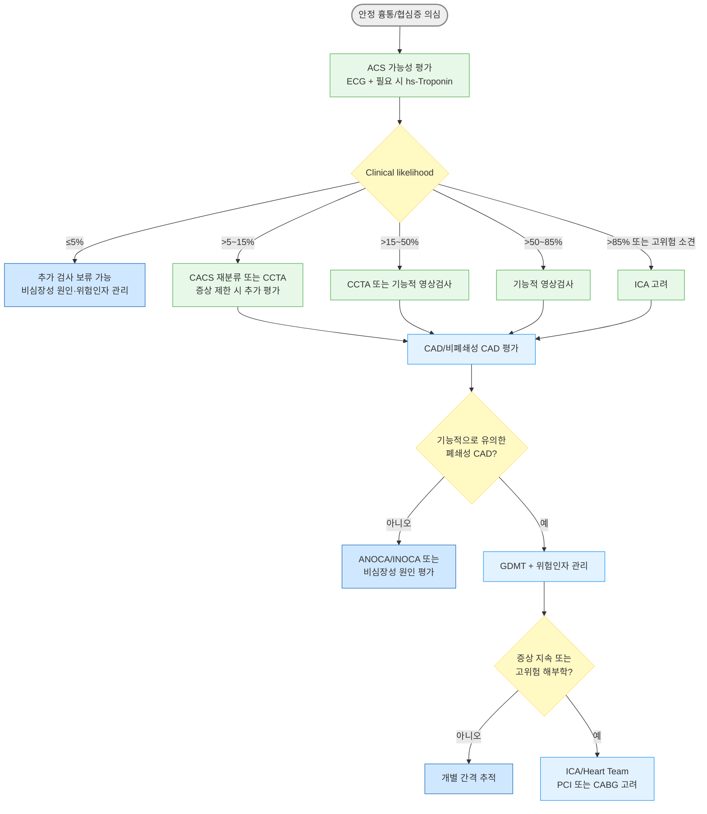
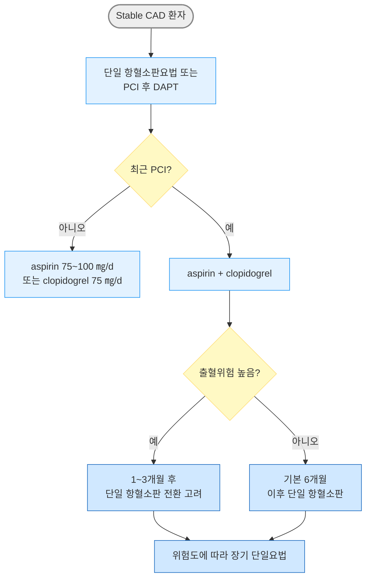
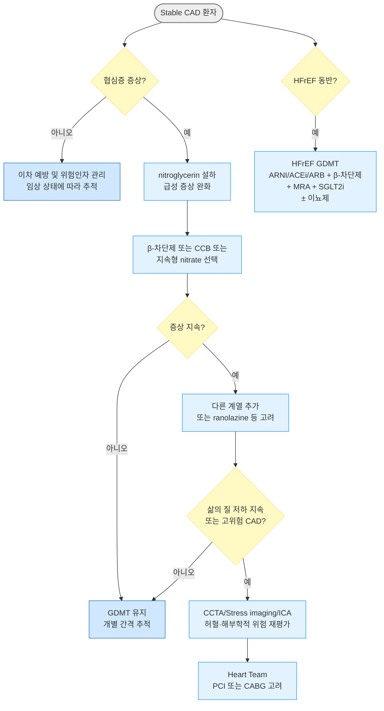

# 협심증 Angina Pectoris

## <mark style="color:green;">일반 사항</mark>

* **관상동맥병 (coronary artery disease, CAD)** : 관상동맥의 구조적 또는 기능적 이상으로 발생하는 심근 허혈/관상동맥 질환의 총칭; 죽상경화성 CAD가 가장 흔함
  * stable/chronic coronary syndrome 및 acute coronary syndrome을 포함
  * **폐쇄성 CAD** : 일반적으로 관상동맥 직경 협착 ≥50%를 의미하며, 병변의 기능적 유의성은 FFR/iFR 등으로 별도 평가할 수 있음
  * **비폐쇄성 CAD** : 주요 관상동맥에 ≥50% 협착이 없으나 죽상경화 플라크가 존재할 수 있는 상태; 미세혈관 기능장애나 관상동맥 연축에 의한 허혈이 동반될 수 있음
* **만성 관상동맥병 (chronic coronary disease, CCD)** : 이전의 stable ischemic heart disease(SIHD) 개념을 대체하는 광의의 용어 \[AHA/ACC]
  * CAD, 이전 MI/재관류술, 비침습적 검사로 진단된 허혈성 심장병, 만성 협심 증후군 등 포함
  * ESC는 동일한 개념 범위를 만성 관상동맥증후군(chronic coronary syndromes, CCS)으로 명명
* **안정 협심증 (stable angina)** : 계단 오르기, 성관계 등 일정 수준 이상의 활동 또는 감정적 스트레스, 추위, 과식 등에서 반복되는 협심증; 이전 증상과 대체로 유사한 양상
  * 폐쇄성 CAD뿐 아니라 관상동맥 미세혈관 기능장애나 연축 등으로도 발생할 수 있으며, 해부학적 협착 정도와 기능적 허혈의 정도가 항상 일치하지는 않음
  * 휴식 또는 nitroglycerin으로 호전되는 것이 전형적임
* **불안정 협심증 (unstable angina)** : 휴식 시 발생, 새롭게 발생, 또는 빈도/중증도/기간이 악화되는 협심증
  * MI 및 cardiac death 위험 증가 상태
* **Prinzmetal angina(= variant angina, vasospastic angina)** : 관상동맥 연축에 의해 발생하는 협심증
  * 휴식 시, 특히 야간이나 이른 아침에 발생하는 경우가 많으며, 일시적인 ST-segment elevation 또는 depression이 나타날 수 있음
  * 심실 부정맥 및 급성 심장사의 위험이 있어 진단과 치료가 중요함
  * 반복적인 발작과 무증상 기간이 교대로 나타날 수 있음
* **ANOCA/INOCA** : 주요 관상동맥에 유의한(≥50%) 폐쇄성 협착이 없으면서 심근 허혈과 관련된 증상 또는 소견이 있는 상태
  * **ANOCA (angina with no obstructive coronary arteries)** : 폐쇄성 CAD가 없으면서 협심증이 의심되는 증상
  * **INOCA (ischaemia with no obstructive coronary arteries)** : 폐쇄성 CAD가 없으면서 객관적으로 심근 허혈이 확인된 상태
  * 미세혈관 기능장애(CMD)와 vasospastic angina가 대표적인 기전이며, 두 기전이 함께 존재할 수 있음
  * 여성에서 상대적으로 흔하며, 반복적인 증상과 삶의 질 저하가 흔함


**ANOCA/INOCA의 기전별 접근**

ANOCA/INOCA\
├ **Vasospastic angina** : 심외막 관상동맥 연축 → CCB 1차 선택, 필요 시 nitrate 추가\
├ **Coronary microvascular dysfunction(CMD)** : 미세혈관의 구조적/기능적 이상 → β-차단제, CCB, ranolazine 등을 증상 및 혈역학에 따라 선택; endothelial dysfunction이 확인되면 ACEi 고려\
└ **Overlap endotype** : 연축과 CMD가 함께 존재할 수 있어 기전에 따른 병합 치료 고려

* 2024 ESC CCS 가이드라인은 지속적인 ANOCA/INOCA 증상이 있는 경우 관상동맥 기능검사(CFR, IMR, acetylcholine provocation 등)를 통해 endotype을 규명하고 치료를 개별화하는 접근을 강조함
* Vasospastic angina에서는 β-차단제를 일률적인 1차 치료로 사용하지 않으며, 연축을 악화시킬 가능성이 있어 피하는 것이 일반적임. 반면 CMD에서는 β-차단제가 증상 조절에 유용할 수 있음


* **Acute coronary syndrome (ACS)** : 관상동맥의 급성 폐쇄 또는 불안정한 죽상경화성 병변으로 발생하는 급성 허혈성 증후군
  * STEMI, NSTEMI, unstable angina 포함
* **전형적 협심증 (typical angina)** : 전형적 특징 3가지를 모두 충족
* **Possibly cardiac angina (구 atypical angina)** : 전형적 특징 중 2가지 해당 - [2021 AHA/ACC] 권고에 따라 "atypical" 대신 "possibly cardiac" 사용(☞ [흉통](../220_/002_-chest-pain.md))
* **비심장성 흉통 (non-cardiac chest pain)** : 전형적 협심증의 특징이 없거나 1가지만 해당
* **협심증 유사 증상 (angina equivalent)** : 힘든 활동/스트레스와 관련하여 흉통 없이 호흡 곤란, 발한, 피로감, 구역, 소화불량, 복통 등의 비특이적 증상 발생; 여성, 고령, 당뇨병 환자에서 더 흔함 (☞ [흉통](../220_/002_-chest-pain.md))
* **진료 현황** \[우리나라] : 2020년 협심증(I20) 진료 환자 약 66.9만 명(2016년 대비 7.0% 증가); 60대가 전체 환자의 32.9%로 가장 많음; 심장 질환은 우리나라 사망 원인 2위(1위 - 암)

### <mark style="color:orange;">Angina 분류 및 활동 제한 \[Canadian Cardiovascular Society, CCS]</mark>

<table><thead><tr><th width="75.71429443359375">Class</th><th width="525.238037109375">증상 유발 활동 강도</th><th>일상생활 제한</th></tr></thead><tbody><tr><td><strong>I</strong></td><td>일상 활동(걷기, 계단 오르기)에서는 증상 없음; 힘들거나 빠르거나 오래 지속되는 작업·운동에서만 발생</td><td>제한 없음</td></tr><tr><td><strong>II</strong></td><td>빠르게 걷기/계단 오르기, 오르막길, 식후·추위·바람·정서적 스트레스 상황, 또는 기상 후 몇 시간 이내; 평지에서 2블록(약 340 m) 이상 걷거나 1개 층 이상 계단을 보통 속도로 오를 때 발생</td><td>약간 제한</td></tr><tr><td><strong>III</strong></td><td>평지에서 1~2블록 걷기 또는 1개 층 계단을 보통 속도·조건에서 오를 때 발생</td><td>상당한 제한</td></tr><tr><td><strong>IV</strong></td><td>어떤 신체 활동에도 불편감 없이 수행 불가능; 휴식 시에도 증상 발생 가능</td><td>모든 활동 제한</td></tr></tbody></table>

## <mark style="color:green;">원인 및 위험 인자</mark>

### <mark style="color:orange;">직접 원인</mark>

* 관상동맥 죽상경화증 (가장 흔함), 관상동맥 연축, 미세혈관 질환, endothelial dysfunction
* 기타 : 대동맥판 협착증, 비대 심근병증, 폐고혈압, 판막심장병, volume overload

### <mark style="color:orange;">위험 인자</mark>

* 생활 습관 : 흡연, 과음, 스트레스, 신체 활동 부족
* 대사 인자 : 비만, 조절되지 않는 고혈압/당뇨병, 이상지질혈증(HDL↓, LDL↑), 고 Lipoprotein(a)
* 인구학적 : 중년 남성, 노년 여성
* 가족력 : 1대 내 조기 CAD 발생 (남 ＜55세, 여 ＜65세)
* 동반 질환 : 뇌졸중, 말초혈관 질환, CKD, RA, SLE, Takayasu동맥염, Kawasaki병, 갑상선항진증, 중증 빈혈, 적혈구증가증, 중증 폐질환(저산소증)
* vasospasm 유발 약물 : cocaine, amphetamine


우리나라 특이 위험 인자: \[여성] 결혼 상태, 교육 수준, 주관적 건강 상태, 비만, 총 콜레스테롤, LDL-C, 고혈압, 우울증, RA; \[남성] 흡연, 음주, 스트레스, 공복 혈당, TG, 낮은 HDL-C, 심근경색, DM


## <mark style="color:green;">임상 양상</mark>

### <mark style="color:orange;">전형적 특징</mark>

(☞ [흉통](../220_/002_-chest-pain.md))

1. **흉부 증상** : 흉골 뒤 조임감, 압박감, 무게감, 작열감; 2\~15분 정도 지속¹⁾; 턱/등/팔로 방사²⁾
   * _¹⁾ 20분 이상 지속될 수 있음. ²⁾ Positive likelihood ratio : 왼쪽 2.3, 오른쪽 2.9, 양쪽 7.1_
   * Sharp or stabbing pain은 드묾
2. **유발 요인** : 어떤 수준 이상의 힘든 작업이나 운동, 정서적 스트레스
3. **완화 요인** : 휴식 또는 nitroglycerin 설하 투여로 30초\~수 분 이내 호전
   * 보통 자세나 호흡에 따라 달라지지 않음

* 20분 이상 지속되는 경우 불안정 협심증 이상의 ACS 가능성 증가(전형적 MI는 흔히 30분 이상 지속 - ☞ [흉통](../220_/002_-chest-pain.md))

### <mark style="color:orange;">기타 증상</mark>

* 호흡 곤란, 구역, 구토, 발한, 추운 느낌, 어지럼

### <mark style="color:orange;">고령에서의 특징</mark>

* 비전형적 증상을 보임; 호흡 곤란 및 비특이적 증상만 나타날 수 있음
* 육체 활동이 저하되어 있어 발견이 지연될 수 있음
* 치료 약제에 대한 부작용이 민감하게 발생할 수 있음


**"흉통이 없다고 해서 협심증을 배제할 수 없다"** - 고령, 당뇨병, 여성 환자에서는 전형적 흉통 없이 호흡 곤란, 피로, 식은땀, 소화불량 등 angina equivalent만 나타날 수 있음; 비전형 증상도 협심증으로서 적극 평가 필요.\
여성은 흉통과 함께 호흡 곤란, 피로, 구역 등 동반 증상을 호소하는 경우가 남성보다 많을 수 있음


### <mark style="color:$danger;">🚩 Red Flags!</mark>

<mark style="color:$danger;">**즉각 조치 또는 응급 이송**</mark>

* 휴식 또는 첫 번째 nitroglycerin 설하 투여 후 5분 이내에도 흉통이 호전되지 않거나 악화됨 → 즉시 119 연락; 이후 추가 nitroglycerin 투여 여부는 응급의료 지시에 따름
* 잿빛 피부색, 급격한 발한, 청색증
* 활력징후 이상 : 저혈압, 빈맥 또는 서맥, 빈호흡
* 정신 상태 변화, 혼돈, 쇼크 징후
* Pulsus paradoxus (흡기 시 SBP ＞10 ㎜Hg 감소 특히 ≥12\~15 ㎜Hg 감소) → 심낭 압전
* 협심증 병력이 있는 환자에서 휴식 시 또는 이전보다 적은 활동 중에 증상 발생
* 협심증 병력이 있는 당뇨병·고령·여성 환자에서 흉통 없이 평소와 다른 호흡 곤란, 피로감, 식은땀
* 새로 발견된 심잡음

<mark style="color:$warning;">**당일 또는 조기 의뢰**</mark>

* 협심증 병력이 있는 환자에서 발생한 원인 불명의 흉통
* 통증으로 인하여 잠에서 깨어남
* 비대칭적 호흡음 또는 맥박
* 새로운 호흡 곤란이 동반된 흉통
* 혈압이 조절되지 않거나 처음으로 심전도 이상이 발견된 경우

<mark style="color:$info;">**외래 추적 / 추가 평가 계획**</mark> <mark style="color:$info;">- 즉각 위험 낮으나 호전 없으면 의뢰</mark>

* 협심증 위험 인자가 복수인 비전형 흉통
* 운동 시 유발되는 흉통이 생활 습관 개선 후에도 지속
* 여성 또는 고령 환자에서 반복되는 비특이적 증상

## <mark style="color:green;">진단</mark>

### <mark style="color:orange;">Clinical Likelihood 평가</mark>

* 2024 ESC CCS 가이드라인은 기존의 단순 PTP 대신 **Risk Factor-weighted Clinical Likelihood(RF-CL)** 모델을 사용하여 폐쇄성 CAD 가능성을 추정하도록 권고함
* 연령, 성별, 협심증 증상에 더하여 흡연, 고혈압, 이상지질혈증, 당뇨병, 조기 CAD 가족력 등의 위험 인자를 반영하며, ECG·심초음파·말초혈관 소견·기존 CT의 관상동맥 석회화 등으로 임상 가능성을 추가 조정할 수 있음
* RF-CL 자체는 최대 약 45%까지만 산출되므로, 50% 이상 고가능성은 추가 임상 자료로 조정된 경우에 해당할 수 있음

<table><thead><tr><th width="98">Clinical likelihood</th><th width="126">CAD 가능성</th><th>권장 전략</th></tr></thead><tbody><tr><td><strong>≤5%</strong></td><td>매우 낮음</td><td>비심장성 원인 평가 후 추가 검사 보류 가능; 위험 인자 관리</td></tr><tr><td><strong>＞5~15%</strong></td><td>낮음</td><td>필요 시 CACS로 재분류; 증상이 제한적이면 CCTA 고려</td></tr><tr><td><strong>＞15~50%</strong></td><td>중간</td><td>CCTA 또는 기능적 영상검사(CMR, PET/SPECT, stress echo)</td></tr><tr><td><strong>＞50~85%</strong></td><td>높음</td><td>기능적 영상검사 우선</td></tr><tr><td><strong>＞85%</strong></td><td>매우 높음</td><td>고위험 소견 또는 치료 불응 증상이 있으면 invasive coronary angiography(ICA) 직접 고려</td></tr></tbody></table>

_CCTA=Coronary CT angiography, CACS=coronary artery calcium score, ICA=invasive coronary angiography_


ESC 2024는 **≤5%를 매우 낮은 가능성**으로 정의하여 증상이 지속되지 않는 한 추가 검사를 보류할 수 있도록 하고, **＞5~15%**에서는 CACS를 이용한 재분류를 고려함. **＞15~50%**에서는 CCTA가 선호되며, **＞15~85%**에서는 CCTA 또는 기능적 영상검사를 사용함. **＞85%** 또는 저강도 운동에서도 발생하는 협심증·고위험 소견이 있으면 ICA를 직접 고려할 수 있음.


### <mark style="color:orange;">검사 전략 - CCTA or 기능적 영상검사</mark>

1. CAD가 의심되는 증상 환자에서는 임상 가능성과 기존 CAD 여부를 함께 고려하여 검사를 선택
2. CCTA는 폐쇄성 CAD를 배제하고 비폐쇄성 plaque도 확인하는 데 유리하며, 기능적 영상검사는 유발 허혈의 존재와 정도 및 사건 위험 평가에 유리함

<table><thead><tr><th width="346">상황</th><th>우선 고려 검사</th></tr></thead><tbody><tr><td>CAD 미확진, clinical likelihood ＞5~50%</td><td>CCTA 우선 고려; 기능적 영상검사도 가능</td></tr><tr><td>CAD 미확진, clinical likelihood ＞15~85%</td><td>CCTA 또는 stress echo/PET/SPECT/CMR</td></tr><tr><td>기존 obstructive CAD에서 증상 재발 또는 허혈 평가 필요</td><td>Stress imaging 등 기능적 검사</td></tr><tr><td>CCTA에서 40~90% 중간 정도 협착의 기능적 의미가 불확실</td><td>기능적 영상검사 또는 적절한 경우 FFR-CT; 재관류를 고려하면 ICA ± FFR/iFR</td></tr><tr><td>고가능성·저강도 활동에서도 발생하는 협심증 또는 고위험 해부학적 소견</td><td>ICA 및 필요 시 revascularization 평가</td></tr></tbody></table>


**기능적 영상검사** : stress echocardiography, PET/SPECT myocardial perfusion imaging, stress CMR. 운동부하 심전도는 별도의 검사이며, CCTA 또는 기능적 영상검사가 가능한 경우 저~중간 가능성 환자에서 CAD 배제를 위한 1차 검사로는 권장되지 않음.


### <mark style="color:orange;">신체 검사</mark>

* 고혈압, arcus senilis, xanthelasma, carotid or peripheral bruit, prominent S4, murmur
* 많은 환자들이 정상 이학적 소견을 보임

### <mark style="color:orange;">실험실 검사</mark>

* 기본 : CBC, lipid profile, HbA1c 또는 공복혈당, 신기능(eGFR), 전해질
* **hs-Troponin** : 급성 흉통/ACS가 의심될 때 0/1시간 또는 0/2시간 등 **검증된 serial protocol**에 따라 측정; 안정 협심증의 일상적인 외래 평가에서 반복 측정하는 검사는 아님
* **Lipoprotein(a)** : 성인에서 평생 1회 측정을 고려/권고; 약 50 ㎎/㎗(≈125 nmol/L) 이상은 심혈관 위험 증가와 관련되지만 두 단위의 환산은 assay에 따라 달라질 수 있음
  * Lp(a) 상승만으로 PCSK9 억제제 치료를 결정하지 않으며, LDL-C 및 전체 ASCVD 위험을 기준으로 지질강하치료를 결정
* 선택 : TFT(갑상선질환 의심), BNP/NT-proBNP(심부전 의심), 기타 검사는 임상 상황에 따라 시행
* hs-CRP 등 염증표지자는 협심증의 일상적인 진단검사로 권고되지 않음

### <mark style="color:orange;">심전도</mark>

* 안정 협심증이 의심되면 **12-lead resting ECG를 기본 검사**로 시행
* 급성 흉통 또는 ACS가 의심되면 ECG를 가능한 한 신속히 시행하고, 초기 ECG가 비진단적이면서 증상이 지속되면 반복 검사
* 안정 시 ECG가 정상이라고 CAD를 배제할 수 없음
* 운동부하 ECG는 선택적으로 사용할 수 있으나, CCTA 또는 기능적 영상검사가 가능한 경우 CAD 배제를 위한 일반적인 1차 검사로는 선호되지 않음

### <mark style="color:orange;">영상 검사</mark>

* **경흉부 심초음파** : 좌심실 수축기 기능, 국소 벽운동, 판막질환 및 다른 구조적 심질환 평가에 유용; 특히 새로 진단된 CCS에서 고려
* **CCTA** : 폐쇄성/비폐쇄성 CAD의 해부학적 평가
* **Stress imaging** : stress echo, PET/SPECT MPI, stress CMR
* **흉부 X선** : 심부전, 폐질환, 대동맥질환 등 다른 진단이 의심될 때 선택적으로 시행
* **ICA** : 매우 높은 임상 가능성, 고위험 해부학적/기능적 소견, 저강도에서도 발생하는 증상, 또는 revascularization이 예상되는 경우 고려

### <mark style="color:orange;">급성 심근경색 가능성 추정 인자</mark>

* **가능성 증가** : Levine's sign(증상을 묘사할 때 가슴 위에 주먹을 얹음), 같은 자리에 같은 증상 반복 발생, 과거 MI와 동일하거나 더 심한 증상 (☞ [흉통](../220_/002_-chest-pain.md#undefined-8))
* **가능성 감소** : 왼쪽 유방 아래의 둔하고 지속되는 통증, 체위 변화에 영향을받는 통증

<mark style="color:cyan;">**흉통의 비심장성 원인**</mark>

☞ [흉통](../220_/002_-chest-pain.md#noncardiac)

***


```mermaid
graph TD
    A([안정 흉통/협심증 의심]) --> B[ACS 가능성 평가\nECG + 필요 시 hs-Troponin]
    B --> C{Clinical likelihood}
    C -- "≤5%" --> D[추가 검사 보류 가능\n비심장성 원인·위험인자 관리]
    C -- ">5~15%" --> E[CACS 재분류 또는 CCTA\n증상 제한 시 추가 평가]
    C -- ">15~50%" --> F[CCTA 또는 기능적 영상검사]
    C -- ">50~85%" --> G[기능적 영상검사]
    C -- ">85% 또는 고위험 소견" --> H[ICA 고려]
    E --> I[CAD/비폐쇄성 CAD 평가]
    F --> I
    G --> I
    H --> I
    I --> J{기능적으로 유의한\n폐쇄성 CAD?}
    J -- 아니오 --> K[ANOCA/INOCA 또는\n비심장성 원인 평가]
    J -- 예 --> L[GDMT + 위험인자 관리]
    L --> M{증상 지속 또는\n고위험 해부학?}
    M -- 아니오 --> N[개별 간격 추적]
    M -- 예 --> O[ICA/Heart Team\nPCI 또는 CABG 고려]

style A fill:#eeeeee,stroke:#888888,stroke-width:2px
classDef lightGreen fill:#e8f8e8,stroke:#4caf50
class B,E,F,G,H lightGreen
classDef yellow fill:#fff9c4,stroke:#ffe082
class C,J,M yellow
classDef sky fill:#e3f2ff,stroke:#2196f3
class I,L,O sky
classDef blue fill:#d0e8ff,stroke:#1a6abf
class D,K,N blue
```

<p align="center"><strong>Stable Chest Pain 진단 및 치료 알고리듬</strong></p>

_PCI=Percutaneous Coronary Intervention, CABG=Coronary Artery Bypass Grafting_

***

## <mark style="background-color:$warning;">Management</mark>

### <mark style="color:orange;">치료 목표</mark>

1. 심혈관 사건(MI, 심장 사망) 예방 - 생존율 향상
2. 협심증 증상 완화 - 삶의 질 향상
3. 심혈관 위험 인자의 최적 관리

### <mark style="color:orange;">치료 방침 [AHA/ACC 2023; ESC 2024]</mark>

<table><thead><tr><th width="73">항목</th><th width="186">핵심 내용</th><th>주요 치료</th></tr></thead><tbody><tr><td><strong>A</strong></td><td>Antiplatelet</td><td>폐쇄성 CAD에서는 장기 단일 항혈소판요법이 기본: aspirin 75~100 ㎎/d 또는 clopidogrel 75 ㎎/d; PCI 후에는 초기 DAPT 필요</td></tr><tr><td><strong>B</strong></td><td>Blood pressure / Beta-blocker</td><td>혈압은 동반 고혈압 진료지침에 따라 개별화; β-차단제는 협심증 증상, 최근 MI, LVEF 저하, 부정맥 등 적응증에 따라 사용</td></tr><tr><td><strong>C</strong></td><td>Cholesterol / Cigarette smoking</td><td>고강도 statin을 기본으로 LDL-C를 적극적으로 낮추고 금연</td></tr><tr><td><strong>D</strong></td><td>Diet / Diabetes</td><td>지중해식 등 심혈관 보호 식이; 당뇨병 동반 시 심혈관 이득이 입증된 SGLT2i 또는 GLP-1RA 고려</td></tr><tr><td><strong>E</strong></td><td>Exercise / Education</td><td>규칙적 유산소·저항운동 및 적절한 환자 교육; 적격 환자는 심장재활 참여</td></tr><tr><td><strong>F</strong></td><td>Follow-up / Flu vaccination</td><td>증상·복약·위험인자에 따른 개별 추적; 매년 인플루엔자 예방접종, COVID-19 예방접종은 공중보건 권고에 따름</td></tr></tbody></table>

### <mark style="color:orange;">CCD 이차 예방 목표 요약</mark>

<table data-search="false"><thead><tr><th width="200">항목</th><th>목표</th></tr></thead><tbody><tr><td>LDL-C</td><td><strong>＜55 ㎎/㎗ 및 기저치 대비 ≥50% 감소</strong> (관상동맥질환: 2022 KSoLA/ESC 2024 기준)</td></tr><tr><td>혈압</td><td>＜130/80 ㎜Hg</td></tr><tr><td>HbA1c</td><td>개별화 (일반적으로 ＜7%)</td></tr><tr><td>운동</td><td>≥150분/주 (중등 강도 유산소)</td></tr><tr><td>금연</td><td>필수</td></tr><tr><td>Statin</td><td>고강도 (atorvastatin 40~80 ㎎ 또는 rosuvastatin 20~40 ㎎); 목표 미달성 시 ezetimibe 등 추가</td></tr><tr><td>항혈소판</td><td>Aspirin 81 ㎎ 또는 clopidogrel 75 ㎎</td></tr><tr><td>예방 접종</td><td>Influenza 매년; Pneumococcal 적응증 확인</td></tr></tbody></table>


재발성 ASCVD 사건이 있는 매우 고위험 환자에서는 더 낮은 LDL-C 목표를 개별적으로 고려할 수 있으나, 국내 진료에서는 [이상지질혈증](099_-dyslipidemia.md) 장의 최신 목표를 우선 적용


### <mark style="color:orange;">Stable Angina 접근 [AHA/ACC 2023; ESC 2024]</mark>

**1단계 - ACS 및 비심장성 흉통 배제**

* 급성 흉통, 휴식 시 새로 발생한 통증, 점점 악화되는 증상 또는 불안정한 활력징후가 있으면 ACS 등 응급질환을 우선 평가
* 안정 환자에서는 병력, 신체검사, resting ECG를 시행하고 clinical likelihood를 추정

**2단계 - 기저 위험 및 구조적 심질환 평가**

* CBC, HbA1c/혈당, lipid profile, eGFR 등 위험인자 평가
* 심초음파 : LV systolic dysfunction, 국소 벽운동 이상, 판막질환 등이 의심되거나 새로 진단된 CCS에서 고려
* Lipoprotein(a)는 성인에서 평생 1회 측정을 고려

**3단계 - CCTA 또는 기능적 영상검사 선택**

* CAD 미확진 : clinical likelihood에 따라 CCTA 또는 기능적 영상검사를 선택
* 기존 obstructive CAD : 증상과 위험도에 따라 기능적 영상검사를 우선 고려
* CCTA에서 중간 정도 협착의 기능적 의미가 불확실하면 FFR-CT 또는 기능적 영상검사를 고려
* 매우 높은 가능성, 저강도 활동에서도 발생하는 협심증, 고위험 해부학적 소견 또는 revascularization 가능성이 높은 경우 ICA를 고려
* 매우 낮은(≤5%) 가능성에서는 증상이 지속되지 않는 한 추가 검사를 보류할 수 있음

**4단계 - 최적 약물 치료**

* 증상 완화 : β-차단제, CCB 또는 지속형 nitrate 중 환자의 심박수·혈압·좌심실 기능·동반질환에 맞춰 선택
* 증상 지속 시 다른 계열 약제를 추가하거나 ranolazine 등 추가 항협심증제를 고려
* 2차 예방 : aspirin 또는 clopidogrel, 고강도 statin 및 적응증에 따른 ACEi/ARB, SGLT2i/GLP-1RA 등
* 저용량 colchicine 0.5 ㎎/d는 2024 ESC에서 죽상경화성 CAD가 있는 CCS 환자의 이차 예방에 고려할 수 있음(미국 2023 가이드라인은 선택적 사용을 권고)

**5단계 - 혈관 재관류 고려**

* 지속적인 협심증/anginal equivalent가 GDMT에도 삶의 질을 저해하고 기능적으로 유의한 폐쇄성 CAD가 있으면 revascularization을 고려
* 좌주간부, 기능적으로 유의한 3혈관 질환, proximal LAD 병변 및 LVEF 저하가 동반된 고위험 CAD에서는 예후 개선을 위한 revascularization이 중요하며 Heart Team 평가가 권장됨
* ISCHEMIA trial은 left main disease와 LVEF <35%를 제외한 안정 CAD에서 일률적인 초기 침습전략이 모든 환자의 사망·MI를 감소시키지 못함을 보여주었으므로, 해부학적·기능적 위험도와 환자 선호를 함께 고려함

## <mark style="color:green;">비-약물 치료 및 예방</mark>

#### <mark style="color:$primary;">기저 질환 관리</mark>

* [고혈압](095_-hypertension.md), [당뇨병](../226_/100_-diabetes-mellitus.md), [이상지질혈증](099_-dyslipidemia.md) 관리

#### <mark style="color:$primary;">금연 및 음주 제한</mark>

* [금연](../230_/190_-smoking.md) : 전자담배는 장기 안전성 자료 부족; 금연의 1차 방법으로 권고하지 않음
* [음주](../230_/189_-alcohol-use-disorder-aud.md) 제한

#### <mark style="color:$primary;">체중 관리</mark>

* 과체중/비만에서는 초기 체중의 약 5~10% 감량을 목표로 개별화 (☞ [비만](../230_/191_-obesity.md))

#### <mark style="color:$primary;">식이 조절</mark>

* 권장 : [지중해식 식이](../231_/217_-nutritiondiet-guideline.md#undefined-6) (과일/채소, 콩류/견과류, 통곡류, 살코기, 복합 탄수화물, 식이섬유, 올리브유, 생선)
* 제한 : 포화지방, 가공육, 정제 탄수화물, 설탕 첨가 음료, 과도한 알코올; 소금은 가능하면 <5 g/d 수준으로 제한
* 금지 : 트랜스지방 (쇼트닝/hydrogenated oil)

#### <mark style="color:$primary;">운동</mark>

* 모든 CCD 환자에게 심장 재활(cardiac rehabilitation, CR) 프로그램 참여를 강력 권고; 실제 임상에서 환자 참여율이 낮으므로 처방 시 적극적 안내와 동기 부여 필요
* 유산소 운동 : 중등 강도(예: 빠르게 걷기)로 1일 30\~60분씩, 주 5일 이상 (총 ≥150분/주)
* 저항 훈련 : 주 2회
* 운동 강도는 협심증 증상, 기능능력, LV 기능 및 동반질환에 따라 개별화; 안정된 환자는 중등도 유산소 운동을 기본으로 하되 증상 발생 시 강도를 낮추고 평가

#### <mark style="color:$primary;">스트레스 관리</mark>

* 직업/주거 환경 변화를 포함한 스트레스 감소 조치
* 명상, 정신 상담 등 스트레스 관리

#### <mark style="color:$primary;">협심증 유발 활동 제한</mark>

* 활동 강도를 능력에 맞게 조절; 급하게 서두르지 않음
* 오전, 식사 직후, 추운 날씨에는 활동 강도를 줄임

#### <mark style="color:$primary;">인플루엔자 예방 접종</mark>

* 모든 CCD 환자에게 매년 인플루엔자 백신 접종 권고

## <mark style="color:green;">약물 치료</mark>

* 항협심증제 선택은 증상의 빈도와 중증도뿐 아니라 심박수, 혈압, LVEF, 신기능, 천식/COPD, vasospastic angina 여부 및 약물 상호작용을 함께 고려하여 개별화
* 1차 항협심증 치료 : **β-차단제 또는 CCB**를 기본으로 하며, **지속형 nitrate**도 적절한 환자에서 선택 가능
* 초기 치료에도 증상이 지속되면 다른 계열을 추가하거나 ranolazine 등 추가 치료를 고려
* 약물치료에도 삶의 질을 해치는 협심증이 지속되면 허혈 및 해부학적 위험도를 재평가하여 revascularization을 고려

### <mark style="color:orange;">항협심증제 상황별 선택</mark>

<table data-search="false"><thead><tr><th width="220">상황</th><th>우선 고려</th></tr></thead><tbody><tr><td>빈맥/고혈압 동반</td><td>β-차단제</td></tr><tr><td>서맥 또는 저혈압 경향</td><td>DHP-CCB 또는 ranolazine 등 심박수·혈압 영향이 적은 약제</td></tr><tr><td>Vasospastic angina</td><td>CCB 1차; 필요 시 nitrate 추가. β-차단제는 일반적으로 피함</td></tr><tr><td>HFrEF</td><td>예후 개선 근거가 있는 β-차단제(carvedilol, bisoprolol, metoprolol succinate); CCB는 약제별 주의</td></tr><tr><td>활동성/중증 천식</td><td>β-차단제를 피하고 CCB 또는 다른 항협심증제 고려</td></tr><tr><td>COPD (심혈관 적응증 있음)</td><td>필요 시 심선택적 β₁-차단제를 우선 고려; 호흡기 증상 모니터링</td></tr></tbody></table>

✽ 2024 ESC는 항협심증제를 고정된 1·2차 순서보다 환자의 혈압·심박수·좌심실 기능·동반질환과 허혈 기전에 맞추어 조합하는 'diamond' 접근을 강조함.

### <mark style="color:orange;">β-차단제</mark>

* 작용 : 심박수·심근 수축력 및 혈압을 감소시켜 심근 산소 요구량↓
* 적응증 : 협심증 증상, 최근 MI, LVEF 저하/HFrEF, 심방세동 등
* 장기 사용에 따른 예후 개선 효과는 **최근 MI, LVEF ≤50% 또는 다른 명확한 적응증이 없는 CCD에서는 제한적**이므로, 증상·동반질환·부작용을 재평가하여 지속 여부를 결정
* HFrEF 또는 LVEF <50%에서 예후 개선 목적으로는 carvedilol, bisoprolol, metoprolol succinate가 근거가 확립된 약제
* 부작용 : 피로, 운동능 저하, 성기능 장애, 서맥, 저혈압, 방실전도 장애, 기관지경련
* 금기/주의 : 고도 방실차단, sick sinus syndrome(박동기 없는 경우), 심한 서맥, 급성 비보상성 심부전 등; 활동성/중증 기관지경련성 천식에서는 피하는 것이 일반적
  * COPD와 안정된 PAD는 절대적 금기가 아니며, 심혈관 적응증이 있으면 심선택적 β₁-차단제를 신중히 사용할 수 있음
  * 당뇨병에서는 저혈당 증상을 가릴 수 있어 주의
* 용량은 고정된 맥박 목표보다 증상, 혈압, 심박수 및 내약성을 기준으로 조절
* β-차단제 갑작스런 중단은 rebound tachycardia/ischemia를 유발할 수 있으므로 필요 시 보통 1~2주 이상에 걸쳐 감량
* cardioselective β₁-차단제를 선호할 수 있으며, ISA가 있는 약제는 허혈성 심질환의 장기 치료에는 일반적으로 선호하지 않음 (☞ [β-차단제](095_-hypertension.md#v-v-adrenergic-receptor-blocker-bb))
* atenolol : 신기능 저하자 주의; 25~200 ㎎/d <mark style="color:blue;">[테놀민]</mark>
* bisoprolol : 2.5~10 ㎎/d <mark style="color:blue;">[콩코르]</mark>
* carvedilol : 6.25~50 ㎎/d <mark style="color:blue;">[딜라트렌 에스알]</mark>
* metoprolol succinate : 25~400 ㎎/d <mark style="color:blue;">[푸로롤 서방]</mark>


**COPD는 β-차단제의 절대 금기가 아님** - 심혈관 적응증이 있으면 심선택적 β₁-차단제를 저용량에서 시작하여 호흡기 증상을 관찰하면서 사용할 수 있음. 반면 활동성/중증 기관지경련성 천식에서는 β-차단제를 피하는 것이 일반적이며, 꼭 필요한 경우 전문적인 감독하에 개별적으로 판단.


### <mark style="color:orange;">칼슘통로차단제 (CCB)</mark>

* 작용 : 혈관 확장 및 심박수/심근 수축력 감소를 통해 심근 산소 요구량을 낮추고 관상동맥 혈류를 개선
* 적응증 : β-차단제의 대체 또는 추가, 고혈압 동반, vasospastic angina 등
* **Vasospastic angina에서는 CCB가 1차 치료**이며 필요 시 nitrate를 추가
* Long-acting 제제를 사용하며, 급격한 혈압 저하나 서맥이 발생하지 않도록 개별화

#### <mark style="color:$primary;">DHP계 CCB</mark>

* amlodipine : 5~10 ㎎/d <mark style="color:blue;">[노바스크]</mark>
* felodipine : 5~10 ㎎/d <mark style="color:blue;">[무노발]</mark>
* nifedipine : 안정 협심증에서는 단시간 작용 제제를 피하고 서방형 제제를 사용; 30~90 ㎎/d <mark style="color:blue;">[아달라트]</mark>
* 부작용 : 안면 홍조, 두통, 말초 부종

#### <mark style="color:$primary;">Non-DHP계 CCB</mark>

* diltiazem : 120~480 ㎎/d <mark style="color:blue;">[헤르벤 서방]</mark>
* verapamil : 120~480 ㎎/d <mark style="color:blue;">[이솦틴 서방]</mark>
* 작용 : negative chronotropic/dromotropic 및 negative inotropic effect
* 부작용 : 서맥, 방실전도 장애, 변비, 말초 부종
* 금기/주의 : 고도 방실전도 장애, sick sinus syndrome, 심한 서맥, HFrEF에서는 피하는 것이 일반적


**β-차단제와 non-DHP CCB 병용** : 둘 다 심박수와 AV conduction을 억제하므로 서맥·방실차단 위험이 증가함. 일반적인 일차의료에서는 병용을 피하고, 꼭 필요한 경우 ECG·맥박·혈압을 면밀히 모니터링.


### <mark style="color:orange;">ACE 억제제 / ARB</mark>

* 작용 : 혈압↓, afterload↓, MI 후 cardiac remodeling 억제
* 적응증 : 고혈압, 당뇨병, CKD, 심부전 또는 좌심실 수축기 기능 저하 동반 시; 동반질환이 없더라도 심혈관 위험이 매우 높은 CCS에서 ACEi를 고려할 수 있음
* 부작용 : 기침(ACEi), 고칼륨혈증, 혈관부종; 기침 등 부작용 시 ARB 전환
* enalapril : 5\~40 ㎎/d <mark style="color:blue;">\[레니프릴]</mark>
* lisinopril : 5\~40 ㎎/d <mark style="color:blue;">\[제스트릴]</mark>
* ramipril : 2.5\~10 ㎎/d <mark style="color:blue;">\[트리테이스]</mark>

### <mark style="color:orange;">Nitrate</mark>

* 작용 : smooth muscle 이완 → 동맥/정맥 혈관 확장, preload↓, 혈압↓, 심근 산소 요구량↓ → 협심증 완화 및 예방
* 부작용 : 두통, 어지럼, 저혈압(특히 고령), 홍조 - 지속 복용 시 완화; 충분한 수분 섭취 권고
* 금기/주의 : PDE5 억제제(sildenafil, tadalafil 등)와 병용 금기; 저혈압 및 비후성 폐쇄성 심근병증에서는 주의

#### <mark style="color:$primary;">속효성 제제 (급성 발작 치료)</mark>

* 증상 치료 또는 예방 (스트레스 발생 예상 5분 전 투여); 30\~40분간 유효
* nitroglycerin : 제품 허가용량에 따라 보통 0.3~0.6 ㎎ 설하; 앉은 자세에서 투여하고 5분 후에도 흉통이 호전되지 않거나 악화되면 즉시 119 연락. 이후 추가 투여는 응급의료 지시에 따르며, 안정 협심증에서 증상이 호전되는 경우에도 총 3회 이내로 투여 <mark style="color:blue;">[니트로글리세린]</mark>
  * 증상 발생 전 유발 활동을 예상할 수 있는 경우 예방적으로 사용할 수 있음
  * 개봉 후 수개월 내 교체 권장 (제조사 권고 보관 기간 준수); 빛과 열에 민감 - 차광 보관

#### <mark style="color:$primary;">지속성 제제 (예방 목적)</mark>

* 장기 사용 시 약제 내성 발생 - 예방법 : 최소 유효 용량, 1일 8시간 이상 nitrate-free interval 유지
* isosorbide dinitrate : 40\~80 ㎎/d <mark style="color:blue;">\[이소켓 서방]</mark>
* isosorbide-5-mononitrate : 30\~240 ㎎/d <mark style="color:blue;">\[임듈 지속]</mark>

### <mark style="color:orange;">콜레스테롤 저하제</mark>

* 적응증 : 지질 수준에 관계없이 CAD 환자에서 고강도 statin 권고 (☞ [이상지질혈증](099_-dyslipidemia.md#undefined-17))
* 목표 : **LDL-C ＜55 ㎎/㎗ 및 기저치 대비 ≥50% 감소** (관상동맥질환; 2022 KSoLA/ESC 2024)
* Statin 보조제 (add-on) : 목표 미달성 시 ezetimibe 추가; 추가 미달성 시 PCSK9 억제제(evolocumab, alirocumab) 또는 inclisiran, bempedoic acid 순차 추가
* Lipoprotein(a) 상승 : PCSK9 억제제가 Lp(a)를 일부 낮출 수 있으나, **Lp(a) 자체만으로 PCSK9 억제제를 시작하는 적응증은 아님**
* 약물 상호작용 : 자몽주스는 simvastatin/atorvastatin 등의 농도를 높일 수 있으므로 과량 섭취를 피하고 약제별 상호작용을 확인
* 비폐쇄성 CAD(INOCA/ANOCA) 환자에서도 미세혈관 기능 개선 및 심혈관 사건 예방을 위해 고강도 statin과 ACEi/ARB의 조기 적극 치료가 권고됨

#### <mark style="color:$primary;">고강도 Statin</mark>

* atorvastatin : 40\~80 ㎎/d <mark style="color:blue;">\[리피토]</mark>
* rosuvastatin : 20\~40 ㎎/d <mark style="color:blue;">\[크레스토]</mark>

#### <mark style="color:$primary;">Ezetimibe 및 복합제</mark>

* ezetimibe : 10 ㎎/d <mark style="color:blue;">\[이지트롤]</mark>
* statin/ezetimibe 복합제 : <mark style="color:blue;">\[로수젯]</mark>(rosuvastatin/ezetimibe), <mark style="color:blue;">\[아토젯]</mark>(atorvastatin/ezetimibe) - 복약 순응도 향상

#### <mark style="color:$primary;">PCSK9 억제제 / siRNA 제제</mark>

* evolocumab : 140 ㎎ q2wk 또는 420 ㎎ q4wk SC <mark style="color:blue;">\[레파타]</mark>
* alirocumab : 75\~150 ㎎ q2wk SC <mark style="color:blue;">\[프랄런트]</mark>
* inclisiran (siRNA, PCSK9 mRNA 표적; 초기 투여 후 3개월, 이후 6개월마다) <mark style="color:blue;">[렉비오프리필드시린지]</mark> (국내 급여 여부는 최신 기준 확인)
* bempedoic acid : 국내 미허가 (2026년 기준)


**PCSK9 억제제 HIRA 급여 기준** : 초고위험 ASCVD에서는 최대내약용량의 statin+ezetimibe에도 불충분한 경우(LDL-C 기저치 대비 ≥50% 감소에 미달하거나 LDL-C ≥70 ㎎/㎗) 급여가 인정되며, HeFH 등 별도 기준이 있음. 세부 인정기준은 변경될 수 있으므로 처방 전 최신 HIRA 고시를 확인

**Lp(a) 자체를 표적**으로 하는 신약(pelacarsen, olpasiran 등 antisense/siRNA 제제)은 대규모 심혈관 결과 임상(Lp(a)HORIZON, OCEAN(a) 등)이 진행 중이며 아직 승인된 약제는 없음(2026년 기준)


### <mark style="color:orange;">항혈소판제</mark>

#### <mark style="color:$primary;">Aspirin</mark>

* 작용 : 혈소판 COX-1 불가역 억제 → 혈소판 응집 방해
* 금기/주의 : 활동성 출혈, 중대한 출혈 위험, aspirin 과민 반응 등
* 용량 : 81 (75\~100) ㎎/d <mark style="color:blue;">\[아스피린 프로텍트]</mark>
* aspirin 불내성 또는 특정 임상 상황에서는 clopidogrel 75 ㎎/d 단독을 대안으로 사용할 수 있음


**장기 단일 항혈소판요법** : ESC 2024는 prior MI/PCI 환자에서 초기 DAPT 이후 aspirin 75~100 ㎎/d 또는 clopidogrel 75 ㎎/d를 장기 단독요법으로 권고. HOST-EXAM은 PCI 후 안정된 환자에서 clopidogrel이 aspirin보다 순복합임상결과가 우수했지만, 이를 모든 CCS 환자에서 clopidogrel이 aspirin보다 우선이라는 의미로 해석해서는 안 됨.


#### <mark style="color:$primary;">P2Y12 수용체 차단제</mark>

* 적응증 : aspirin 사용이 어려운 경우 clopidogrel 단독; PCI 후 DAPT의 P2Y12 억제제로는 CCS에서는 보통 clopidogrel 사용
* clopidogrel : 75 ㎎/d <mark style="color:blue;">[플라빅스]</mark>
* prasugrel, ticagrelor는 주로 ACS 후 DAPT에서 사용하므로 급성관상동맥증후군 치료 원칙에 따름
* DAPT 기간은 허혈위험·출혈위험·PCI 상황에 따라 개별화

<table><thead><tr><th width="248">상황</th><th>DAPT 기간 기준</th></tr></thead><tbody><tr><td>CCS에서 elective PCI</td><td>aspirin + clopidogrel을 기본으로 <strong>6개월</strong>; 고출혈위험에서는 1~3개월로 단축 고려</td></tr><tr><td>ACS 후 PCI</td><td>기본적으로 12개월; 출혈위험이 높으면 단축 고려</td></tr><tr><td>MI/PCI 후 장기 허혈위험이 높고 출혈위험이 낮음</td><td>1년 이후 추가 항혈전요법을 개별적으로 고려; aspirin + ticagrelor 60 ㎎ bid 또는 다른 전략을 위험도에 따라 선택</td></tr></tbody></table>


**BMS(bare-metal stent)를 기준으로 DAPT 기간을 별도 제시하는 방식은 현재 실무에서 더 이상 적절하지 않음.** 최신 DES가 표준이며, 2024 ESC는 CCS elective PCI 후 DAPT 기본 6개월, 고출혈위험에서는 1~3개월 단축을 권고함.


***


```mermaid
graph TD
    A([Stable CAD 환자]) --> B[단일 항혈소판요법 또는<br/>PCI 후 DAPT]
    B --> C{최근 PCI?}
    C -- 아니오 --> D[aspirin 75~100 ㎎/d<br/>또는 clopidogrel 75 ㎎/d]
    C -- 예 --> E[aspirin + clopidogrel]
    E --> F{출혈위험 높음?}
    F -- 예 --> G[1~3개월 후<br/>단일 항혈소판 전환 고려]
    F -- 아니오 --> H[기본 6개월<br/>이후 단일 항혈소판]
    G --> I[위험도에 따라 장기 단일요법]
    H --> I

style A fill:#eeeeee,stroke:#888888,stroke-width:2px
classDef yellow fill:#fff9c4,stroke:#ffe082
class C,F yellow
classDef sky fill:#e3f2ff,stroke:#2196f3
class B,E,D sky
classDef blue fill:#d0e8ff,stroke:#1a6abf
class G,H,I blue
```

<p align="center"><strong>Stable CAD 환자의 항혈소판제 알고리듬</strong></p>

***

### <mark style="color:orange;">Ranolazine</mark>

* 작용 : late sodium channel 차단 → myocyte Ca overload 감소 → 협심증 증상↓, 운동 능력↑; 혈압/맥박에 영향 없음 - 저혈압 경향 또는 서맥 환자에서 특히 유용
* 적응증 : β-차단제, CCB, 지속형 nitrate에도 증상이 지속되는 환자에서 추가&#x20;
* 부작용 : 어지럼, 변비, 구역, 두통, QT 연장
* 금기/주의 : 중증 간기능 장애, 강력한 CYP3A 억제제와 병용 금기; QT 연장 위험 및 신기능 저하를 고려
* 500~1,000 ㎎ bid <mark style="color:blue;">[라넥사]</mark> (국내 비급여; 실제 처방 시 허가용량·상호작용 확인)

### <mark style="color:orange;">Ivabradine</mark>

* 작용 : SA node의 funny current(If) 억제 → 심박수↓ (혈압/심수축력에 영향 없음)
* 적응증 : LVEF ≤35% + HR ≥70인 심부전 환자에서 β-차단제 병용 또는 금기 시
* 금기 : 심방세동, 서맥(안정 시 HR ＜60회/분), sick sinus syndrome, verapamil 또는 diltiazem과의 병용(SIGNIFY 분석에서 위해 신호와 연관되어 EMA가 금기로 지정)
* 5\~7.5 ㎎ bid <mark style="color:blue;">\[프로코라란]</mark>


**정상 LV 기능을 가진 협심증 환자에서 Ivabradine 추가는 권고되지 않음** - SIGNIFY trial(NEJM, 2014)에서 임상적 심부전이 없는 안정 CAD 환자(LVEF ＞40%)에 ivabradine을 추가했을 때 전체적으로 예후 개선이 없었고, 활동제한성 협심증(CCS ≥II) 하위군에서는 오히려 1차 종료점이 증가하는 위해 신호가 관찰됨. 이를 반영해 \[AHA/ACC 2023]은 정상 LV 기능 CCD 환자에서 표준 항협심증 치료에 ivabradine을 추가하는 것을 "potentially harmful"로 명시함. 즉 이 약은 HFrEF + 빈맥 적응증에서만 확립된 근거를 가지며, 단순히 "β-차단제 금기 + 동리듬 + HR ≥70"인 일반 협심증 환자에게 증상 완화 목적으로 추가하는 용도로는 권장되지 않음


### <mark style="color:orange;">GLP-1RA 및 SGLT2i</mark>

* 당뇨병이 있는 CCD 환자에서 SGLT2i 또는 GLP-1RA 사용 권고 (주요 CV event 감소)
* LVEF ≤40%인 CCD 환자에서 SGLT2i 사용 권고 (CV 사망, 심부전 입원 감소; 당뇨병 유무 무관)
* 당뇨병이 없더라도 **심부전이 동반된 CCD**에서는 LVEF에 따라 SGLT2i가 권고/고려됨. 단순히 LVEF >40%인 CCD라는 이유만으로 SGLT2i를 추가하는 것은 권고되지 않음

### <mark style="color:orange;">Aldosterone 차단제 (MRA)</mark>

* 적응증 : CCD에 HFrEF가 동반된 경우의 표준 심부전 치료 또는 적절한 환자의 MI 후 LVEF 저하/심부전에서 사용; 신기능과 혈청 K⁺를 확인
* spironolactone : 보통 25~50 ㎎/d <mark style="color:blue;">[알닥톤]</mark>; 세부 용량은 심부전 상태와 신기능에 따라 조절

### <mark style="color:orange;">Low-dose Colchicine</mark>

* 0.5 ㎎ qd
* 2024 ESC CCS : 죽상경화성 CAD가 있는 CCS 환자에서 MI, stroke 및 revascularization 위험 감소를 위해 고려할 수 있음(Class IIa, Level A)
* 2023 AHA/ACC : CCD 이차 예방에서 재발성 ASCVD 위험을 낮추기 위해 선택적으로 고려(Class IIb)
* hs-CRP ≥2 ㎎/L을 투여 시작의 필수 기준으로 보지는 않음
* 주의 : narrow therapeutic index, CYP3A4/P-gp 상호작용, 신·간기능 저하, 근병증/골수억제 및 위장관 부작용
* CLEAR-SYNERGY trial에서는 급성 MI 직후 시작한 colchicine이 1차 복합 심혈관 결과를 감소시키지 못했으므로, 급성 MI 직후의 일률적인 추가요법으로 해석하지 않음

### <mark style="color:orange;">기타 약물</mark>

#### <mark style="color:$primary;">Molsidomine</mark>

* 작용 : nitrate와 유사한 약리 작용; nitrate 내성 없음
* 2\~4 ㎎ bid\~tid <mark style="color:blue;">\[몰시톤]</mark>

#### <mark style="color:$primary;">Trimetazidine</mark>

* 작용 : 당 대사 활성도 증가 → 항협심증 효과; 예후에 관한 근거 부족
* 적응증 : β-차단제/CCB로 충분히 조절되지 않거나 내약성이 없는 환자에서 2차 추가(add-on) 요법으로 사용
* 20 ㎎ tid <mark style="color:blue;">\[바스티난]</mark>


**운동 장애 부작용 경고 (EMA/식약처 안전성 서한) :** 파킨슨 증후군, 진전(떨림), 보행 장애, 하지불안증후군 등 운동 장애 보고에 따라 **1차 선택제 또는 단독 요법으로는 사용하지 않음** - 다른 항협심증제에 대한 반응이 불충분하거나 내약성이 없는 환자의 추가 요법으로만 제한적으로 사용. 파킨슨병·기존 운동 장애 환자에는 투여하지 않음; 고령자·중등도 이상 신장애 환자는 감량. 급성 협심증 통증의 치료제가 아니며 불안정 협심증·심근경색의 1차 치료제로 사용 금지


#### <mark style="color:$primary;">Nicorandil</mark>

* 작용 : 관동맥 확장 효과
* 치료 효과에 대한 근거 미흡; 일부 국가에서 2차 선택제로 사용
* 10\~30 ㎎/d #2\~3 <mark style="color:blue;">\[시그마트]</mark>

#### <mark style="color:$primary;">오메가-3 (ω-3 지방산)</mark>

* 일반 보충제(생선 기름) : CV event 감소 효과 없음; 심방세동 발생 증가와 연관 → CCD 환자에게 권고하지 않음
* Icosapent ethyl (purified EPA only) 4 g/d : 심혈관 사망 20% 감소 - 고TG혈증 동반 시 고려

#### <mark style="color:$primary;">항-호모시스테인제</mark>

* Vit B6, B12, folate : 호모시스테인 상승 시 보충; CV event 직접 감소 증거는 불충분

#### <mark style="color:$primary;">NSAID 사용 제한</mark>

* CCD 환자에서 NSAID는 가능한 최소 용량, 최단 기간 사용

#### <mark style="color:$primary;">효과가 검증되지 않은 치료</mark>

* 마늘, 항산화제 (Vit C/E, 베타 카로틴), HRT, chelation

### <mark style="color:orange;">무증상 또는 안정 상태의 CAD 환자에서 이차 예방</mark>

* **확인된 CAD는 증상이 없더라도 이차 예방 원칙을 적용** : 고강도 statin을 기본으로 LDL-C 목표에 맞춰 ezetimibe/PCSK9 억제제 등을 추가
* 폐쇄성 CAD가 있으면 aspirin 75~100 ㎎/d 또는 적절한 경우 clopidogrel 75 ㎎/d를 장기 단일요법으로 사용
* β-차단제는 최근 MI, LVEF ≤50%, 협심증, 부정맥, 조절되지 않는 고혈압 등 명확한 적응증이 있을 때 사용
* ACEi/ARB는 고혈압, 당뇨병, CKD, 심부전/LV dysfunction 등 동반질환에 따라 사용
* SGLT2i/GLP-1RA는 당뇨병 또는 심부전 등 해당 적응증이 있을 때 사용
* 증상이나 임상·기능 상태의 변화가 없는 안정 CAD에서 일률적인 반복 CCTA, stress test 또는 ICA는 권고하지 않음

## <mark style="color:green;">시술 및 기타 처치</mark>

### <mark style="color:orange;">Percutaneous Coronary Intervention (PCI)</mark>

* 적응증 : 기능적으로 유의한 폐쇄성 CAD에서 GDMT에도 삶의 질을 해치는 협심증/anginal equivalent가 지속되는 경우
* PCI는 증상 개선에 효과적이며, 일부 고위험 해부학적 상황에서는 예후 개선 목적의 revascularization 전략에 포함될 수 있음
* FFR/iFR 또는 FFR-CT : 중간 정도 협착의 기능적 의미가 불확실할 때 병변 선택에 활용
* 최신 DES가 표준이며, elective CCS PCI 후 DAPT 기간은 일반적으로 6개월, 고출혈위험에서는 1~3개월 단축을 고려
* ISCHEMIA trial은 left main disease와 LVEF <35%를 제외한 안정 CAD에서 모든 환자에게 일률적인 초기 침습전략을 적용해도 사망·MI가 유의하게 감소하지 않음을 보여줌
* **ORBITA-2** : 항협심증제를 거의 사용하지 않은 안정 협심증 환자에서 PCI가 가짜 시술보다 협심증 증상을 유의하게 개선함. 약물 부작용·내약성 문제 또는 환자 선호가 큰 경우에도 revascularization의 선택지를 개별적으로 논의할 수 있음

### <mark style="color:orange;">Coronary Artery Bypass Graft Surgery (CABG)</mark>

* Heart Team을 통해 관상동맥 해부학, LVEF, 당뇨병, 수술 위험, 완전 재관류 가능성 및 환자 선호를 종합하여 PCI와 비교
* 예후 개선이 중요한 대표적 상황 : 유의한 left main disease, 기능적으로 유의한 3혈관 질환, proximal LAD를 포함한 고위험 다혈관 질환, LVEF 저하를 동반한 다혈관 질환
* **당뇨병 + 다혈관 CAD**, 높은 SYNTAX score 또는 복잡한 해부학에서는 CABG가 PCI보다 장기 성적에서 우월한 경우가 많아 선호
* LVEF ≤35%의 다혈관 CAD에서는 수술 가능하면 CABG가 의학적 치료보다 생존 개선에 유리하며, PCI는 수술 고위험 또는 수술 불가능한 선택적 환자에서 대안으로 고려

<table><thead><tr><th width="260">상황</th><th width="150" align="center">PCI</th><th width="150" align="center">CABG</th></tr></thead><tbody><tr><td>단일/단순 병변의 증상 조절</td><td align="center">선호 가능</td><td align="center">선택적</td></tr><tr><td>Left main disease</td><td align="center">저복잡도·적절한 해부학에서 대안</td><td align="center">대부분 선호</td></tr><tr><td>다혈관 질환 + DM</td><td align="center">선택적</td><td align="center">선호</td></tr><tr><td>높은 SYNTAX score/복잡 다혈관</td><td align="center">선택적</td><td align="center">선호</td></tr><tr><td>LVEF ≤35% + 다혈관 질환</td><td align="center">수술 고위험/불가능 시 고려</td><td align="center">수술 가능하면 선호</td></tr></tbody></table>

## <mark style="color:green;">추적 관찰</mark>

* 추적 간격은 증상, 기능 상태, 위험인자 조절, 약물 부작용 및 순응도에 따라 개별화
* 외래 방문 시 확인 사항
  1. 협심증/anginal equivalent의 빈도·중증도·유발 역치 변화
  2. 약물 순응도, 부작용 및 상호작용
  3. 혈압, 심박수, 체중 및 위험인자 관리
  4. LDL-C, 당뇨병, 신기능 등 치료 목표의 달성 여부
  5. 심부전, 부정맥 또는 다른 심혈관질환의 새 발생 여부
* 증상 또는 임상/기능 상태가 변화하면 CCTA, stress imaging 또는 ICA 등을 재평가
* **임상 또는 기능 상태의 변화가 없는 안정 CCD 환자에서 일률적인 반복 CCTA, stress test, LV 기능 재평가 또는 ICA는 권고하지 않음** [AHA/ACC 2023]

***


```mermaid
graph TD
    A([Stable CAD 환자]) --> B{협심증 증상?}
    B -- 아니오 --> C[이차 예방 및 위험인자 관리\n임상 상태에 따라 추적]
    B -- 예 --> D[nitroglycerin 설하\n급성 증상 완화]
    D --> E[β-차단제 또는 CCB 또는\n지속형 nitrate 선택]
    E --> F{증상 지속?}
    F -- 아니오 --> G[GDMT 유지\n개별 간격 추적]
    F -- 예 --> H[다른 계열 추가\n또는 ranolazine 등 고려]
    H --> I{삶의 질 저하 지속\n또는 고위험 CAD?}
    I -- 아니오 --> G
    I -- 예 --> J[CCTA/Stress imaging/ICA\n허혈·해부학적 위험 재평가]
    J --> K[Heart Team\nPCI 또는 CABG 고려]
    A --> L{HFrEF 동반?}
    L -- 예 --> M[HFrEF GDMT\nARNI/ACEi/ARB + β-차단제\n+ MRA + SGLT2i\n± 이뇨제]

style A fill:#eeeeee,stroke:#888888,stroke-width:2px
classDef yellow fill:#fff9c4,stroke:#ffe082
class B,F,I,L yellow
classDef sky fill:#e3f2ff,stroke:#2196f3
class D,E,H,J,K,M sky
classDef blue fill:#d0e8ff,stroke:#1a6abf
class C,G blue
```

<p align="center"><strong>Stable CAD 환자의 관리 알고리듬</strong></p>

***

### <mark style="color:red;">질병코드</mark>

I20 협심증\
I20.0 불안정 협심증\
I20.1 입증된 연축을 동반한 협심증 (Prinzmetal angina)\
I20.8 기타 형태의 협심증\
I20.9 상세불명의 협심증\
I25 만성 허혈심장병\
I25.1 죽상경화성 심장병\
I25.2 구 심근경색증\
I25.5 허혈성 심근병증

***

## <mark style="color:purple;">처방례</mark>

> **처방례 1. 급성 협심증 발작 - 설하 nitroglycerin**
>
> ```
> 니트로글리세린 설하 0.6 ㎎/T  1T  즉시
> (5분 후에도 호전되지 않거나 악화되면 즉시 119; 이후 추가 투여는 응급의료 지시에 따름)
> ```
>
> _✽첫 번째 투여 후 5분이 지나도 호전되지 않거나 악화되면 즉시 119에 연락하여 도움을 요청한다. 약물은 제조사 보관·교체 지침을 따른다._

> **처방례 2. 안정 협심증 - β-차단제 + 지속형 nitrate**
>
> ```
> 딜라트렌 에스알 16 ㎎/C   1C   qd
> 임듈 지속 60 ㎎/C          1C   qd  (12시간 이상 nitrate-free interval 유지)
> ```
>
> _✽β-차단제를 기반으로 지속형 nitrate 병용; 복용 시간을 고정하여 nitrate-free interval 확보._\
> \&#xNAN;_※ 모니터링 : 복용 초기 기립성 저혈압·서맥 증상(어지럼, 실신성 전조) 확인; 고정된 맥박 목표보다는 증상과 혈압·심박수에 따라 용량 조절_

> **처방례 3. β-차단제 금기(활동성 천식, 중증 서맥 등) - Non-DHP CCB + 지속형 nitrate**
>
> ```
> 헤르벤 서방캡슐 180 ㎎/C   1C   qd
> 임듈 지속 60 ㎎/C           1C   qd
> ```
>
> _✽활동성 천식, 중증 서맥 등 β-차단제 금기 시 diltiazem 선택(단순 COPD는 더 이상 금기로 보지 않음 - 심선택적 β-차단제 사용 가능). Non-DHP CCB + nitrate 병용 가능._\
> \&#xNAN;_※ 모니터링 : 서맥·방실차단 징후(맥박, 실신) 확인; β-차단제와의 중복 병용 시작하지 않음_

> **처방례 4. β-차단제 금기 + 서맥/저혈압 경향 - Ranolazine**
>
> ```
> 라넥사 서방정 500 ㎎/T       1T   bid
> ```
>
> _✽Ranolazine은 심박수와 혈압을 크게 낮추지 않아 서맥 또는 저혈압 경향에서 고려할 수 있음. 강력한 CYP3A 억제제 병용 및 QT 연장 위험을 확인._
>
> **처방례 5. 이차 예방 - 기본 약물**
>
> ```
> 아스피린 프로텍트 100 ㎎/T   1T   qd
> 아토르바스타틴 40 ㎎/T        1T   qd
> ```
>
> _✽확인된 CAD의 기본 이차 예방 예시. LDL-C 목표 미달성 시 ezetimibe 등 추가. β-차단제는 최근 MI, LVEF 저하, 협심증, 부정맥 등 적응증이 있을 때 추가하고, ACEi/ARB도 고혈압·당뇨병·CKD·심부전/LV dysfunction 등의 적응증에 따라 추가._
>
> \\&#xNAN;_※ 모니터링 : 위장관 출혈 징후, statin 관련 근육 증상 및 LDL-C 추적_
>
> **처방례 6. 이차 예방 + 당뇨병 동반 - SGLT2i 병용**
>
> ```
> 아스피린 프로텍트 100 ㎎/T   1T   qd
> 로수바스타틴 20 ㎎/T          1T   qd
> 자디앙 10 ㎎/T                1T   qd
> ```
>
> _✽당뇨병이 동반된 CCD에서는 심혈관 이득이 입증된 SGLT2i 또는 GLP-1RA를 고려. SGLT2i는 심부전이 동반되면 당뇨병 유무와 관계없이 적응증에 따라 사용. ACEi/ARB와 β-차단제는 별도 적응증에 따라 추가._
>
> \\&#xNAN;_※ 모니터링 : 생식기 진균감염·탈수·체위성 저혈압, 신기능 및 혈당 추적_
>
### <mark style="color:$success;">핵심 복약 지도</mark>

* **Nitroglycerin 설하정** : 흉통 발생 시 앉아서 설하에 투여; 5분 후에도 호전되지 않거나 악화되면 즉시 119 연락. 안정 협심증에서 증상이 호전되는 경우에도 총 3회 이내 원칙. **PDE5 억제제와 병용 금지** - 실데나필 복용 후 24시간, 타다라필 복용 후 48시간 이내에는 nitroglycerin을 사용하지 않음
* **β-차단제** : 임의로 중단하지 않도록 교육; 갑자기 끊으면 심근 허혈 유발 가능; 맥박이 50회/분 미만이면 의사와 상담
* **지속형 Nitrate** : 두통이 흔히 발생하나 계속 복용하면 호전됨; 12시간 이상의 nitrate-free interval 유지 (내성 예방)
* **Aspirin** : 식후 복용 권장; 위장 증상 발생 시 보고; 임의 중단 금지 (혈전 위험 증가)
* **Statin** : 처방된 시간에 규칙적으로 복용; 근육통/근력저하/짙은 소변이 나타나면 상담. 자몽주스는 일부 statin(simvastatin, atorvastatin 등)과 상호작용할 수 있으므로 과량 섭취를 피함
* **ACEi/ARB** : 기침(ACEi), 어지럼 발생 시 의사와 상담; 임의 중단 금지

***

### <mark style="color:blue;">환자 안내서</mark>

**협심증이란?**\
협심증은 심장에 혈액을 공급하는 관상동맥이 좁아지거나 경련을 일으켜 심장 근육에 산소가 부족해질 때 나타나는 흉통입니다.

**주요 증상**

* 가슴 중앙의 조임감, 압박감, 무게감 (대개 수분간 지속)
* 팔, 어깨, 턱, 등으로 퍼지는 불편감
* 계단 오르기, 급하게 걷기, 스트레스 상황에서 주로 발생

**응급 상황 - 즉시 119에 연락하세요**

* 휴식 중에도 흉통 발생
* 휴식 또는 첫 번째 니트로글리세린 투여 후 5분이 지나도 흉통이 호전되지 않거나 악화 → 즉시 119에 연락하세요. 이후 니트로글리세린 추가 투여와 아스피린 복용은 응급의료 지시에 따르세요
* 식은땀, 구역, 호흡 곤란이 동반
* 기운이 없고 의식이 흐릿해지는 느낌


⚠️ 발기부전 치료제(비아그라·시알리스 등)를 복용 중이면 니트로글리세린을 절대 사용하지 마세요 - 실데나필 복용 후 24시간 이내, 타다라필 복용 후 48시간 이내에는 병용 시 위험한 저혈압이 발생할 수 있습니다. 이 경우 약물 없이 즉시 119에 신고하세요


**생활 수칙**

1. 금연 - 흡연은 관상동맥 협착을 악화시키는 가장 중요한 위험 인자입니다.
2. 규칙적인 운동 - 의사와 상담 후 적절한 강도로 매일 걷기 운동을 실천하세요.
3. 식이 관리 - 짠 음식, 기름진 음식을 줄이고 채소, 생선, 견과류를 늘리세요.
4. 스트레스 관리 - 무리한 활동, 급하게 서두르는 행동을 피하세요.
5. 체중 관리 - 과체중이라면 체중 감량이 증상 개선에 도움이 됩니다.
6. 고혈압, 당뇨, 고지혈증 관리 - 처방된 약을 빠짐없이 복용하세요.
7. 오전 이른 시간, 식사 직후, 추운 날씨에는 과격한 활동을 삼가세요.

**약 복용에 관하여**\
처방된 모든 약은 임의로 중단하지 마세요. 특히 니트로글리세린은 항상 지참하고, 제조사 권고에 따라 정기적으로 새 약으로 교체하세요.
