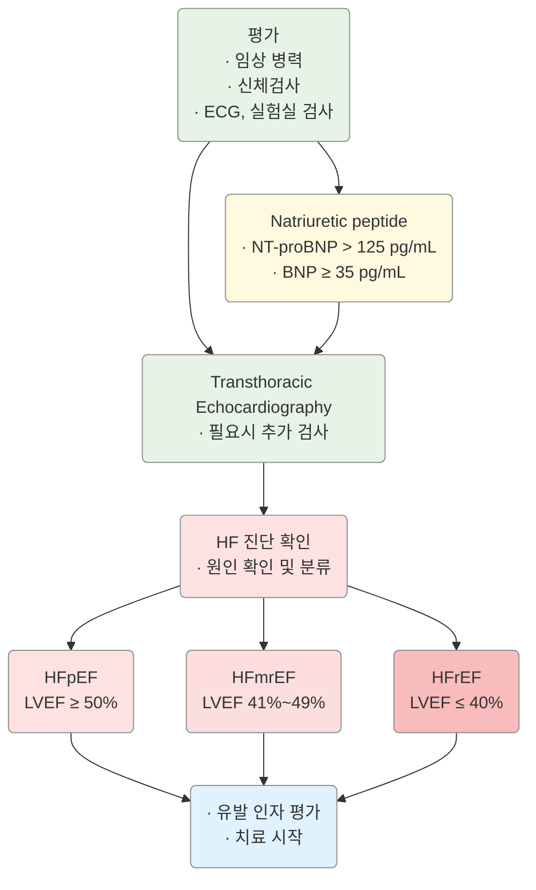

# 심부전 Heart Failure (HF)

## <mark style="color:green;">일반 사항</mark>

* 심실의 혈액 충만 또는 심실의 혈액 박출의 구조적·기능적 장애로 인한 증상 및 징후가 있는 복합적 임상 증후군
* **HFrEF** (HF with reduced ejection fraction) : LVEF ≤40%
* **HFimpEF** (HF with improved EF) : 이전 LVEF ≤40% → 추적 측정 LVEF >40%
* **HFmrEF** (HF with mildly reduced EF) : LVEF 41\~49%
* **HFpEF** (HF with preserved EF) : LVEF ≥50%

### <mark style="color:orange;">기전</mark>

* **수축 기능 이상 (inotropic abnormality)** : systolic emptying 감소 (EF <45%); 원인 — MI, dilated/ischemic cardiomyopathy
* **확장 기능 이상 (compliance abnormality)** : ventricular relaxation 제한 (EF >45%); 원인 — hypertensive cardiomyopathy

### <mark style="color:orange;">NYHA 기능 분류</mark>

<table><thead><tr><th width="120">Class</th><th width="320">증상 유발 활동 강도</th><th>신체 활동 제한</th></tr></thead><tbody><tr><td><strong>Class I</strong></td><td>일상적인 활동으로는 심부전 증상이 발생하지 않음</td><td>제한 없음</td></tr><tr><td><strong>Class II A/B</strong></td><td>휴식 시 편안하지만 일상적인 활동으로 심부전 증상이 유발됨</td><td>약간 제한</td></tr><tr><td><strong>Class III A/B</strong></td><td>휴식 시 편안하지만 일상적인 것보다 작은 활동으로도 증상 유발</td><td>상당한 제한</td></tr><tr><td><strong>Class IV</strong></td><td>휴식 시에도 증상 발생. 어떤 신체 활동도 불편함을 증가시킴</td><td>모든 활동 제한</td></tr></tbody></table>

A=early stage, B=late stage; ✽심부전 증상: 피로, 두근거림, 호흡 곤란

***

## <mark style="color:green;">원인 및 위험 인자</mark>

* **주요 원인** : 허혈성 심질환, 심근경색, 판막성 심질환
* **비허혈성 원인** : 죽상경화성 CVD, (조절되지 않는) 고혈압, cardiotoxin 노출(예: 항암제, 알코올), 류마티스/자가면역 질환, 내분비/대사 질환(갑상선 질환·당뇨·비만·대사증후군·철분 과다), 가족성 심근병증, 유전성 심질환, 빈맥/PVC, 침윤성 심질환(amyloid·sarcoid), 심근염, 산후 심근병증, 스트레스 심근병증

***

## <mark style="color:green;">임상 양상</mark>

* 활동 시 호흡 곤란, 운동 능력 저하(피로·전신 약화), 말초 부종(양측 발목 부종)
* 야간 기침(nonproductive 또는 거품/분홍색 가래), orthopnea, 발작성 야간 호흡 곤란(PND)
* Wheezing(특히 야간; cardiac asthma), Cheyne-Stokes respiration, rale, heart murmur, 경정맥 확장
* **Advanced HF** : 식욕 부진, 우상복부 팽만(hepatic congestion), 복수, 구역, 저혈압, pulsus alternans, 빈맥, narrow pulse pressure, 사지 냉증, 청색증

### <mark style="color:red;">🚩 Red Flags!</mark>

<mark style="color:red;">**즉각 이송 또는 응급 평가**</mark>

* 급성 호흡 곤란(산소포화도 <90%, 호흡수 >25회/분)
* 심인성 쇼크 의심 : SBP <90 mmHg + 말초 냉증 + 의식 변화
* 급성 폐부종 (좌위 호흡, 거품 가래, 청색증)
* 원인 불명의 심각한 발한 + 흉통 + 실신

<mark style="color:orange;">**당일 또는 긴급 평가**</mark>

* SBP <100 mmHg (증상 동반)
* s-Cr 급격한 악화 또는 s-Cr >1.73 mg/dL
* s-Na <135 mEq/L (저나트륨혈증)
* 판막성 심장 질환 의심 (새로운 심잡음)
* 1~2주 내 급격한 체중 증가 ≥2 kg/d

<mark style="color:blue;">**외래 추적 / 추가 평가 계획** — 즉각 위험 낮으나 호전 없으면 의뢰</mark>

* NYHA 기능 분류 악화 (I→II, II→III 등)
* 원인 불명의 심부전 (비허혈성 심근병증 의심)
* 유전성 심근병증이 있는 환자의 1대 가족
* 심장재동기화치료(CRT) 또는 ICD 삽입 여부 평가 필요

***

## <mark style="color:green;">진단</mark>

### <mark style="color:orange;">Framingham 진단 기준</mark>

<table><thead><tr><th width="280">Major criteria</th><th>Minor criteria</th></tr></thead><tbody><tr><td>발작성 야간 호흡 곤란</td><td>양측 발목 부종</td></tr><tr><td>경정맥 팽창</td><td>야간 기침</td></tr><tr><td>폐수포음</td><td>보통의 활동 중 호흡 곤란</td></tr><tr><td>심 비대 (흉부 X선상)</td><td>흉막 삼출</td></tr><tr><td>급성 폐부종</td><td>간 비대</td></tr><tr><td>S3 gallop</td><td>빈맥 (HR >120회/분)</td></tr><tr><td>Hepatojugular reflux</td><td>—</td></tr><tr><td>치료 반응으로 5일간 >4.5 kg 체중 감소</td><td>—</td></tr></tbody></table>

**판정** : 2 Major 또는 1 Major + 2 Minor criteria / **민감도** >95%, **특이도** 75\~80%

_Ref. The natural history of congestive heart failure: the Framingham study. NEJM 1971;285(26)_

### <mark style="color:orange;">환자 초기 평가</mark>

* 문진, 진찰, 신장/체중(BMI), 기립성 혈압 변화
  * 심근병증 환자에서 3대 가족력 청취
* **혈액검사** : CBC, 전해질(Ca, Mg), BUN/Cr, FBS/HbA1c, 지질, LFT, 철분(혈청 철·페리틴·TSAT), TSH
* **Biomarkers** : BNP, NT-proBNP — 심부전 진단 보조 및 위험도 계층화
  * NT-proBNP >125 pg/mL 또는 BNP ≥35 pg/mL : 심부전 가능성 높음
  * 연령·성별·신부전·비만·약물에 영향 받음 (비만 시 위음성 가능)
* **12-Lead 심전도**, 흉부 X선
* **심초음파 (최우선)** : 구조·기능 평가, LVEF 측정
* **선택적 검사** : 심도자검사, 경식도초음파, 심장 MRI(심근염·침윤성 질환 의심 시), 유전자 검사
* **6분보행검사** : 기능 제한 평가(≥350 m : 제한 없음, <150 m : 심한 제한)

***



<p align="center"><strong>HF 및 EF 기반 분류를 위한 진단 알고리듬</strong></p>

<p align="center"><em><mark style="color:blue;">NT-proBNP=N-terminal pro-B type natriuretic peptide; BNP=B-type natriuretic peptide; HFpEF=HF with preserved EF; HFmrEF=HF with mildly reduced EF; HFrEF=HF with reduced EF; LVEF=left ventricular EF</mark></em></p>

<p align="center"><em><mark style="color:blue;">Ref. AHA/ACC/HFSA Guideline for the Management of Heart Failure. 2022. Fig 4.</mark></em></p>

***

## <mark style="background-color:yellow;">Management</mark>

### <mark style="color:orange;">급성 심부전 초기 관리</mark>


<p align="center"><em>Acute mechanical cause: myocardial rupture complicating acute coronary syndrome (free wall rupture, ventricular septal defect, acute mitral regurgitation), chest trauma or cardiac intervention, acute native or prosthetic valve incompetence secondary to endocarditis, aortic dissection or thrombosis</em></p>

<p align="center"><strong>급성 심부전 환자의 초기 관리 알고리듬</strong><br><em><mark style="color:blue;">Ref. ESC Guidelines for the diagnosis and treatment of acute and chronic heart failure. 2016. Fig 12-2.</mark></em></p>


⚠️ **급성 심부전 응급 처치 원칙**
- **Urgent phase** (첫 번째 진료/평가): ① Cardiogenic shock → circulatory support(약물·기계적 장치), ② Respiratory failure → ventilatory support(산소·CPAP/BiPAP·기계 환기) → 즉각 안정화 및 ICU/CCU 이동
- **Immediate phase** (첫 평가 후 60\~120분 이내): 급성 원인 평가 — **CHAMP** : acute **C**oronary syndrome / **H**ypertension emergency / **A**rrhythmia / acute **M**echanical cause / **P**ulmonary embolism


### <mark style="color:orange;">ACCF/AHA 분류 및 치료 전략 (AHA/ACC/HFSA 2022)</mark>

#### <mark style="color:$primary;">Stage A : HF 위험군 (Pre-HF 이전)</mark>

* HF 위험 인자가 있으나 증상·구조적 심질환·비정상 biomarker 없음
* **관리**
  1. 고혈압 환자에서 적절한 혈압 조절
  2. **SGLT2i** : T2DM 환자에서 CVD 또는 심혈관 질환 고위험군 시 사용 (Class I)
  3. 규칙적인 신체 활동, 정상 체중 유지, 건강한 식습관, 흡연 회피
  4. HF 발병 위험이 있는 환자에서 natriuretic peptide biomarker 선별 검사 고려
  5. 다변수 Risk score 평가 고려 (예: Framingham HF risk score, PCP-HF)

#### <mark style="color:$primary;">Stage B : Pre-HF</mark>

* 현재/이전에 HF 증상·징후 없으나 다음 중 하나 존재: 구조적 심질환, filling pressure 증가 증거, 위험 인자 + natriuretic peptide 상승 또는 cardiac troponin 지속 상승
* **관리**
  1. **ACEi** : LVEF ≤40% 환자 (Class I)
  2. **ARB** : ACEi 불내성 + recent MI & LVEF ≤40% 환자 (Class I)
  3. **Beta-blocker** : MI/ACS 병력 & LVEF ≤40% 환자 (Class I); LVEF ≤40%인 모든 환자 (Class I)
  4. **ICD** : LVEF ≤30%, post-MI 최소 40일 & NYHA class I, 기대 여명 >1년인 환자 (Class I)
  5. **Statin** : MI/ACS 병력 있는 환자 (심혈관계 이벤트 방지)
  6. **회피** : LVEF <50%인 환자에서 TZD(HF 위험 증가), non-DHP CCB(verapamil·diltiazem) 회피


<p align="center"><strong>HF 위험(Stage A) 및 Pre-HF(Stage B) 환자를 위한 권고 (Class I & IIa)</strong><br><em><mark style="color:blue;">Ref. AHA/ACC/HFSA Guideline for the Management of Heart Failure. 2022. Fig 5.</mark></em></p>

#### <mark style="color:$primary;">Stage C : 증상성 HF</mark>

* 현재/이전에 HF 증상을 가진 구조적 심질환
* 다학제 팀 관리 권고

**비약물적 중재**

1. 호흡기 질환 예방을 위한 백신 접종 권고 (인플루엔자, 폐렴구균, COVID-19)
2. 우울증·사회적 고립·허약·낮은 건강 관리 능력에 대한 선별
3. 과도한 소금 섭취 회피; 가능한 수준에서 규칙적 운동 권고
4. 심장 재활 프로그램 고려

**약물적 중재 (HFrEF)**


**HFrEF 4대 기본 치료 (Quadruple Therapy)** — AHA/ACC/HFSA 2022, ESC 2023 Update 기반

1. **ARNi** (또는 ACEi/ARB) — RAAS 억제
2. **Beta-blocker** — 신경호르몬 억제
3. **MRA** — 알도스테론 억제
4. **SGLT2i** — 심혈관·신장 보호

위 4가지 약제를 조기에 동시 개시하고 목표 용량까지 신속히 titration하는 것이 권고됨 (ESC 2023 Focused Update).


1. **이뇨제** : 체액 저류 HF 환자에서 권고; loop diuretics에 thiazide(예: metolazone) 추가 가능(울혈 지속 시)
2. **ARNi / ACEi / ARB**
   * HFrEF + NYHA class II\~III : ARNi 우선 권고 (Class I)
   * ARNi 불가 시 ACEi, ACEi/ARNi 불가 시 ARB 순으로 사용
   * ⚠️ ARNi는 ACEi의 마지막 투약 후 36시간 이내 투여 금지; 혈관부종 병력 시 ARNi·ACEi 모두 금기
3. **Beta-blocker** : 사망률 감소 입증된 3가지(bisoprolol, carvedilol, 서방형 metoprolol succinate) 중 1개 사용 (Class I)
4. **MRA** : HFrEF + NYHA class II\~IV + eGFR >30 & K <5.0 mEq/L인 경우 권고 (Class I); K ≤5.5 mEq/L 유지 불가 시 회피
5. **SGLT2i** : 증상성 만성 HFrEF 환자에서 T2DM 여부와 무관하게 권고 (Class I)

**HFmrEF 및 HFpEF 치료**


**2023 ESC Focused Update 주요 개정 내용**

* **SGLT2i (dapagliflozin 또는 empagliflozin)** : HFpEF 환자에서 HF 입원 또는 심혈관 사망 위험 감소를 위해 권고 (Class I, LOE A) — 기존 HFrEF 한정에서 **전체 LVEF 스펙트럼**으로 확대
* **HFpEF + 비만** : 체중 감량(식이·운동·항비만 약물 고려)이 기능 향상에 유효
* **철결핍 동반 HFrEF/HFmrEF** : 정맥 내 철분 보충(intravenous iron) 권고 — HF 증상 완화 및 삶의 질 개선 (Class I)
* **T2DM + CKD** : SGLT2i 및 finerenone(비스테로이드 MRA) 모두 HF 입원 감소에 Class I 권고



1. Symptomatic = NYHA Class II–IV.
2. HFrEF = LVEF ≤ 40%.
3. ACE inhibitor 불내성/금기 시 ARB 사용.
4. MR antagonist 불내성/금기 시 ARB 사용.
5. 최근 6개월 내 HF 입원 또는 natriuretic peptide 상승(BNP >250 pg/mL 또는 NT-proBNP >500 pg/mL in men and 750 pg/mL in women).
6. Natriuretic peptide 상승(BNP ≥150 pg/mL 또는 NT-proBNP ≥600 pg/mL), 또는 최근 12개월 내 HF 입원(BNP ≥100 pg/mL 또는 NT-proBNP ≥400 pg/mL).
7. Enalapril 10 mg bid에 해당하는 용량.
8. 최근 1년 내 HF 입원력.
9. QRS ≥130 msec + LBBB(동성 리듬)인 경우 CRT 권고.
10. QRS ≥130 msec + non-LBBB(동성 리듬) 또는 AF 환자에서 CRT 고려(개별화된 결정).

<p align="center"><strong>Ejection fraction이 감소된 증상성 심부전 환자의 치료 알고리듬</strong><br><em><mark style="color:blue;">Ref. ESC Guidelines for the diagnosis and treatment of acute and chronic heart failure. 2016. Fig 7-1.</mark></em></p>

#### <mark style="color:$primary;">Stage D : Advanced HF</mark>

* 적절한 치료에도 불구하고 일상생활을 방해하고 반복적인 입원이 요구되는 현저한 HF 증상


<p align="center"><strong>HFrEF Stage C & D 환자 치료 알고리듬</strong><br><em><mark style="color:blue;">Ref. AHA/ACC/HFSA Guideline for the Management of Heart Failure. 2022. Fig 6.</mark></em></p>

<p align="center"><em>MRA=mineralocorticoid receptor antagonist; HFimpEF=HF with improved EF; ICD=implantable cardioverter defibrillator; MCS=mechanical circulatory support; CRT-D=cardiac resynchronization therapy with defibrillation</em></p>

***

## <mark style="color:green;">약물 치료</mark>

### <mark style="color:orange;">EF 감소 HF(또는 급성 심근경색)에서의 Disease-modifying Drugs</mark>

<table><thead><tr><th width="240">Drug</th><th width="160">시작 용량 (mg)</th><th>목표 용량 (mg)</th></tr></thead><tbody><tr><td><strong>ACEi</strong></td><td></td><td></td></tr><tr><td>captopril <mark style="color:blue;">[카프릴]</mark></td><td>6.25 tid</td><td>50 tid</td></tr><tr><td>enalapril <mark style="color:blue;">[레니프릴]</mark></td><td>2.5 bid</td><td>10–20 bid</td></tr><tr><td>lisinopril <mark style="color:blue;">[제스트릴]</mark></td><td>2.5–5 qd</td><td>20–40 qd</td></tr><tr><td>perindopril <mark style="color:blue;">[아세틸]</mark></td><td>2 qd</td><td>8–16 qd</td></tr><tr><td>ramipril <mark style="color:blue;">[트리테이스]</mark></td><td>1.25–2.5 qd</td><td>10 qd</td></tr><tr><td>trandolapril</td><td>1 qd</td><td>4 qd</td></tr><tr><td><strong>ARB</strong></td><td></td><td></td></tr><tr><td>candesartan <mark style="color:blue;">[아타칸]</mark></td><td>4–8 qd</td><td>32 qd</td></tr><tr><td>losartan <mark style="color:blue;">[코자]</mark></td><td>25–50 qd</td><td>50–150 qd</td></tr><tr><td>valsartan <mark style="color:blue;">[디오반]</mark></td><td>20–40 qd</td><td>160 bid</td></tr><tr><td><strong>ARNi</strong></td><td></td><td></td></tr><tr><td>sacubitril/valsartan <mark style="color:blue;">[엔트레스토]</mark></td><td>49/51 bid (또는 24/26 bid로 시작 가능)</td><td>97/103 bid</td></tr><tr><td><strong>I<sub>f</sub> Channel inhibitor</strong></td><td></td><td></td></tr><tr><td>ivabradine <mark style="color:blue;">[프로코라란]</mark></td><td>5 bid</td><td>7.5 bid</td></tr><tr><td><strong>Beta-blockers</strong></td><td></td><td></td></tr><tr><td>bisoprolol <mark style="color:blue;">[콩코르]</mark></td><td>1.25 qd</td><td>10 qd</td></tr><tr><td>carvedilol <mark style="color:blue;">[딜라트렌]</mark></td><td>3.125 bid</td><td>25–50 bid</td></tr><tr><td>carvedilol CR</td><td>10 qd</td><td>80 qd</td></tr><tr><td>metoprolol succinate <mark style="color:blue;">[푸로롤서방]</mark></td><td>12.5–25 qd</td><td>200 qd</td></tr><tr><td><strong>MRA (Mineralocorticoid receptor antagonists)</strong></td><td></td><td></td></tr><tr><td>spironolactone <mark style="color:blue;">[알닥톤]</mark></td><td>12.5–25 qd</td><td>25–50 qd</td></tr><tr><td>eplerenone</td><td>25 qd</td><td>50 qd</td></tr><tr><td><strong>SGLT2i</strong></td><td></td><td></td></tr><tr><td>dapagliflozin <mark style="color:blue;">[포시가]</mark></td><td>10 qd</td><td>10 qd</td></tr><tr><td>empagliflozin <mark style="color:blue;">[자디앙]</mark></td><td>10 qd</td><td>10 qd</td></tr><tr><td><strong>Soluble guanylate cyclase stimulator</strong></td><td></td><td></td></tr><tr><td>vericiguat <mark style="color:blue;">[베르쿠보]</mark></td><td>2.5 qd</td><td>10 qd</td></tr><tr><td>digoxin <mark style="color:blue;">[디곡신]</mark></td><td>0.125–0.25 qd</td><td>목표 혈중 농도 0.5–0.9 ng/mL</td></tr><tr><td><strong>Isosorbide dinitrate & Hydralazine</strong></td><td></td><td></td></tr><tr><td>isosorbide dinitrate <mark style="color:blue;">[이소켓]</mark></td><td>20–30</td><td>120–300 mg/d 분할 투여</td></tr><tr><td>hydralazine <mark style="color:blue;">[히드랄라진]</mark></td><td>25–50 tid</td><td>분할 투여</td></tr></tbody></table>

_✽단기 제제 제외; serum digoxin 농도 유지_\
_Ref. AHA/ACC/HFSA Guideline for the Management of Heart Failure. 2022. Table 14._

#### <mark style="color:$primary;">ACEi</mark>

* **작용** : afterload 감소
* **대상** : 모든 단계의 심부전
* **용법** : 저용량 시작 → 2주 후 2배 증량 → 1\~3개월에 걸쳐 titration
* β-차단제 병용 시 추가 효과 (보험 주의)
* **금기** : 혈관부종, 무뇨성 신부전, 임신
* **주의** : SBP <80 mmHg, 양측 신동맥 협착, s-Cr >3 mg/dL, K >5.5 mEq/L, loop 이뇨제 고용량(furosemide 80 mg/d); 정기적 혈압·K·BUN·Cr 모니터링

#### <mark style="color:$primary;">ARB</mark>

* ACEi보다 효과 적음; **대상** : ACEi 사용에 의한 혈관부종 발생 시 대체
* **주의** : ACEi와 동일 (✽ARB도 혈관부종 유발 가능)

#### <mark style="color:$primary;">β-차단제</mark>

* **대상** : Stage B 이상; 심근경색(특히 Q파 MI)에서 필수
  * 울혈이 없는 안정 상태 또는 NYHA-Ⅳ 환자는 이뇨가 충분한 상태에서 사용
* **용법** : 저용량 시작 → 1\~4주 간격으로 증량
* 치료 초기 일시적 울혈·무력감·피로 악화 가능
* 부종/체중 증가/호흡 곤란 악화 시 → 염분/수분 섭취 제한 및 이뇨제 증량 후 β-차단제 감량
* 증상 동반 저혈압 발생 시 : ① 다른 혈관 확장제와 2시간 간격 투여, ② 혈관 확장제·이뇨제 감량, ③ 호전 없으면 β-차단제 감량
* 증상 동반 서맥 발생 시 : ① digoxin 혈중 농도 확인/감량, ② amiodarone 등 관련 약제 감량, ③ diltiazem·verapamil 중단, ④ 호전 없으면 β-차단제 감량

#### <mark style="color:$primary;">Mineralocorticoid receptor antagonist (MRA)</mark>

* **대상** : NYHA class ≥Ⅱ, 초기 s-Cr <2.0 mg/dL & s-K <5.0 mEq/L인 경우
* **부작용** : K↑(투여 1주·4주 후 모니터링; 신장애·ACEi 병용 시 특히 주의), 여성형유방증(spironolactone)
* **신규 옵션** : T2DM + CKD 환자에서 **finerenone**(비스테로이드 선택적 MRA) — HF 입원 감소 효과 (ESC 2023 Focused Update, Class I, LOE A) — 국내 적응증 확인 필요

#### <mark style="color:$primary;">SGLT2i</mark>

(☞ 당뇨병 챕터 참조)

* **작용** : 혈압↓, 체중↓, ASCVD 위험↓, 심부전 입원↓, eGFR 저하 지연
* **대상** (2023 ESC Focused Update로 확대)
  * Stage A: T2DM + CVD 또는 심혈관 고위험군 (Class I)
  * Stage C: 증상성 만성 HFrEF (T2DM 무관) (Class I)
  * **HFmrEF 및 HFpEF** (Class I, LOE A) — 2023 ESC Focused Update 신규 권고
  * T2DM + CKD (Class I)
* **부작용** : 요로/생식기 감염, 케톤산증, LDL-C↑
* **주의** : 신장애(eGFR <20 금기), 중증 간장애, 고령, 저혈압

#### <mark style="color:$primary;">ARNi (Angiotensin Receptor Neprilysin Inhibitor)</mark>

* sacubitril(neprilysin inhibitor) + valsartan(ARB) 복합제 <mark style="color:blue;">[엔트레스토]</mark>
* **대상** : ① NYHA class Ⅱ or Ⅲ의 증상성 HFrEF 환자, ② 급성 비대상성 HF로 입원 후 혈역학적 안정 시 개시 고려
* enalapril 단일 요법보다 유효하나 저혈압 부작용 빈도 높음
* ⚠️ ACEi의 마지막 투약 36시간 이내 투여 금지 (혈관부종 위험)

### <mark style="color:orange;">기타 / 증상 개선 약제</mark>

#### <mark style="color:$primary;">이뇨제</mark>

* **적용** : fluid overload 및 급성 HF 초기 울혈 증상의 신속한 개선
* 최소 유효 용량에서 시작; 고령자는 필요량 적음
* 경증 체액 저류 시 thiazide, 보다 심한 경우 loop diuretics
* 병용 시 추가 효과 가능: thiazide + loop diuretics
* **부작용** : Na↓, K↓(또는 K↑), Mg↓, Ca↓, 요산↑, 대사성알칼리혈증
* **금기** : Mg <1.8 mg/dL, K >5.0 또는 <3.5 mEq/L, Na <135 mEq/L, Cr >3.0 mg/dL, 산증
* metolazone : GFR 20\~30까지 효과 유지; thiazide : GFR <30 시 유효하지 않음
* torsemide : furosemide보다 흡수력·반감기 우수, 보다 안정적인 이뇨 효과

<table><thead><tr><th width="220">Drug</th><th width="200">시작 용량 (mg)</th><th>최대 용량 (mg)</th></tr></thead><tbody><tr><td><strong>Loop diuretics</strong></td><td></td><td></td></tr><tr><td>furosemide <mark style="color:blue;">[라식스]</mark></td><td>20–40 qd/bid</td><td>600</td></tr><tr><td>bumetanide</td><td>0.5–1.0 qd/bid</td><td>10</td></tr><tr><td>torsemide <mark style="color:blue;">[토르세미드]</mark></td><td>10–20 qd</td><td>200</td></tr><tr><td><strong>Thiazide diuretics</strong></td><td></td><td></td></tr><tr><td>chlorthalidone <mark style="color:blue;">[하이그로톤]</mark></td><td>12.5–25 qd</td><td>100</td></tr><tr><td>hydrochlorothiazide <mark style="color:blue;">[다이크로짇]</mark></td><td>25 qd</td><td>200</td></tr><tr><td>indapamide <mark style="color:blue;">[후루덱스]</mark></td><td>2.5 qd</td><td>5</td></tr><tr><td>metolazone</td><td>2.5 qd</td><td>20</td></tr></tbody></table>

#### <mark style="color:$primary;">Digoxin</mark>

* **대상** : 이뇨제/ACEi 복용에도 증상 잔존, 심방세동 동반 심박수 조절 필요 시
* **용법** : 최소 용량(0.125 mg/d)으로 시작; 신기능 장애·고령·낮은 lean body mass 환자는 용량 감량 <mark style="color:blue;">[디고신]</mark>
* amiodarone, quinidine, propafenone, verapamil 등 병용 시 digoxin 농도 증가
* **부작용** : 구역, 식욕 부진, 혼란, 시각 이상, 부정맥
* 저칼륨혈증·심근허혈·신기능 장애 시 독성 증가 → 적절한 Mg, K 농도 유지 필수
* **모니터링** : 마지막 투여 6시간 이후 측정; 독성 의심 시 혈중 농도 측정

#### <mark style="color:$primary;">항응고제</mark>

* 새로 시작 시 VKA(warfarin)보다 **NOAC** 우선 권고
  * apixaban <mark style="color:blue;">[엘리퀴스]</mark>, dabigatran <mark style="color:blue;">[프라닥사]</mark>, edoxaban <mark style="color:blue;">[릭시아나]</mark>, rivaroxaban <mark style="color:blue;">[자렐토]</mark>
* 심방세동 동반 HF 환자에서 추가적 혈전 위험 인자 없는 경우 개별화된 판단 (☞ 심방세동 챕터 참조)

#### <mark style="color:$primary;">기타 약물</mark>

* **Ivabradine** <mark style="color:blue;">[프로코라란]</mark> : 최대 허용 beta-blocker 포함 약물 치료 중 휴식 HR ≥70 bpm인 NYHA class II\~III stable chronic HFrEF (LVEF ≤35%) 환자에서 HF 입원 및 심혈관 사망 감소
* **Vericiguat** <mark style="color:blue;">[베르쿠보]</mark> : 적절한 치료 중 최근 악화된 고위험 HFrEF 환자에서 HF 입원 및 심혈관 사망 감소
* **오메가-3 보충제** : NYHA class II\~IV 환자에서 보조 요법으로 고려
* **정맥 내 철분 보충** : HFrEF/HFmrEF + 철결핍(TSAT <20% 또는 혈청 페리틴 <100 μg/L) 환자에서 권고 (ESC 2023 Focused Update, Class I)


**GLP-1 수용체 작용제 (GLP-1 RA) — 신흥 치료 옵션 (2024 근거)**

**비만 동반 HFpEF**에서 semaglutide(STEP-HFpEF 시험) 및 tirzepatide 투여 시 HF 관련 증상, 신체 기능, 6분보행거리, 삶의 질이 유의하게 개선되고 체중이 감소함. Tirzepatide는 심혈관 사망 및 HF 악화 이벤트를 유의하게 감소시킴.

단, **HFrEF**에서의 효과는 불확실(일부 데이터에서 심박수 증가·부정맥 위험 가능). 현재 가이드라인 공식 권고 이전이나, 비만 동반 HFpEF에서 SGLT2i와 함께 고려할 수 있음.


**권고하지 않음 또는 회피**

* **K-결합제** (patiromer, sodium zirconium cyclosilicate) : RAASi 사용 중 K 관리 목적 사용의 효과 불확실
* **항응고제** : 특정 징후(VTE·AF·혈전색전증) 없는 만성 HFrEF에서 권고하지 않음
* **DHP CCB / non-DHP CCB** : HFrEF 환자에서 권고하지 않음 (사망 위험 증가 가능)
* **Class IC 항부정맥제** : HFrEF에서 사망 위험 증가
* **TZD** : HFrEF 환자에서 HF 증상 악화 및 입원 위험 증가
* **DPP-4i (saxagliptin, alogliptin)** : T2DM + 심혈관 고위험에서 HF 입원 위험 증가
* **NSAID** : HFrEF에서 HF 증상 악화 가능
* **비타민·영양제·호르몬 치료** : 특정 결핍 교정 외에는 권고하지 않음

### <mark style="color:orange;">Device and Interventional Therapies</mark>

* **ICD** : 급사 예방 (적응증: LVEF ≤35% + NYHA II\~III; LVEF ≤30% + post-MI)
* **CRT-D** : NYHA II\~III(또는 보행 가능 IV) + LVEF ≤35% + 동성 리듬 + QRS ≥150 ms with LBBB
* **LVAD (좌심실 보조 장치)** : Stage D 환자에서 이식 대기 중(bridge to transplantation) 또는 영구적 치료(destination therapy)
* **심장 이식** : Stage D, 적절한 치료에도 불구하고 말기 HF; 금기 없고 적절한 후보자

***

## <mark style="color:green;">비-약물 치료 및 예방</mark>

* **금연, 금주**
* **소금 섭취 제한** : 경증 HF(NYHA I/II) 시 <7.5 g/d, 중증 HF(NYHA III/IV) 시 <5 g/d
  * ✽엄격한 소금 제한은 이득 불분명하고 잠재적으로 해로울 수 있음 (개별화 접근)
* **수분 섭취 제한** : 울혈 시 <2 L/d; s-Na <135 mEq/L 시 <1.5 L/d
* **체중 관리** : 비만 시 체중 감량; 매일 체중 측정 → 2\~3일 내 ≥2 kg 증가 시 신속 진료
* **심장 재활 및 유산소 운동** : 걷기, 자전거, 수영 등; 천천히 시작 후 점차 증량
  * 5분으로 시작 → 매일 1\~2분씩 증량 → 최종 목표: 1회 또는 분할하여 총 30분/일, 주 5\~6일
  * 운동 전·중·후 맥박 측정; 휴식 시 대비 20회 이상 증가하지 않도록 강도 조절
* **동반 질환 치료** : 고혈압, 부정맥, 수면무호흡증, 당뇨병, 이상지질혈증
* **스트레스 관리, 우울증 치료** (우울증은 HF 예후를 악화시키므로 적극적 선별·치료)
* **백신 접종** : 인플루엔자, 폐렴구균, COVID-19 (Stage C 이상에서 권고)
* **자가 모니터링 교육** : 증상 악화 시 신속 의료 접촉, 약물 순응도 강화

***

### <mark style="color:red;">질병코드</mark>

I50 심부전\
I50.0 울혈성 심부전\
I50.1 좌심실 부전\
I50.9 상세불명의 심부전

***

## <mark style="color:purple;">처방례</mark>

> **처방례 1. Stage A — T2DM + 심혈관 고위험군**
>
> ```
> 포시가 10 mg/T  1T  qd
> (또는 자디앙 10 mg/T  1T  qd)
> ```
>
> _✽T2DM + CVD 또는 심혈관 고위험군의 HF 예방 목적으로 SGLT2i 투여. HbA1c 및 신기능(eGFR) 확인 후 처방._

> **처방례 2. Stage B — LVEF ≤40%, 최근 MI**
>
> ```
> 제스트릴 5 mg/T   1T  qd  (2주 후 10 mg으로 증량 목표)
> 콩코르 2.5 mg/T   1T  qd  (4주 후 5 mg으로 증량 목표)
> 포시가 10 mg/T    1T  qd
> ```
>
> _✽저용량으로 시작하여 2\~4주 간격으로 목표 용량까지 titration. 혈압·맥박·신기능·전해질 모니터링 필수._

> **처방례 3. Stage C — HFrEF (NYHA II\~III), Quadruple therapy**
>
> ```
> 엔트레스토 49/51 mg/T  1T  bid  (→ 97/103 mg bid 목표)
> 콩코르 1.25 mg/T       1T  qd   (→ 10 mg qd 목표)
> 알닥톤 25 mg/T         1T  qd
> 포시가 10 mg/T         1T  qd
> 라식스 20 mg/T         1T  qd   (체액 과부하 시)
> ```
>
> _✽엔트레스토는 ACEi 마지막 투약 36시간 후 개시. 신기능·전해질(특히 K) 정기 모니터링 필수. 체중 매일 측정 교육._

> **처방례 4. Stage C — HFrEF + 심방세동 + HR 조절 필요**
>
> ```
> 엔트레스토 49/51 mg/T  1T  bid
> 콩코르 5 mg/T          1T  qd
> 알닥톤 25 mg/T         1T  qd
> 포시가 10 mg/T         1T  qd
> 디고신 0.125 mg/T      1T  qd  (AF 심박수 조절)
> 엘리퀴스 5 mg/T        1T  bid  (AF 동반 항응고)
> 라식스 20 mg/T         1T  qd
> ```
>
> _✽AF 동반 시 digoxin 혈중 농도 모니터링 (0.5\~0.9 ng/mL). NOAC 사용 시 신기능·체중에 따른 감량 기준 확인._

***

### <mark style="color:green;">핵심 복약 지도</mark>

1. **이뇨제(라식스 등)** : 아침에 복용하여 야간 빈뇨를 줄이세요. 체중이 2\~3일 내에 2 kg 이상 늘면 바로 연락하세요.
2. **β-차단제(콩코르 등)** : 처음에 어지럼·피로가 생길 수 있으나 보통 수주 내에 적응됩니다. 임의로 중단하지 마세요.
3. **ACEi/ARNi(제스트릴·엔트레스토 등)** : 마른 기침이 생기면 ARB로 교체 가능합니다. 혈압 저하·부종·어지럼 발생 시 알려주세요.
4. **MRA(알닥톤 등)** : 칼륨이 높아질 수 있어 정기 혈액 검사가 필요합니다. 칼륨이 풍부한 음식(바나나·오렌지·토마토)을 과다 섭취하지 마세요.
5. **SGLT2i(포시가·자디앙)** : 생식기·요로 감염에 주의하고 위생을 철저히 하세요. 수술·금식 시 48시간 전에 중단하세요.
6. **엔트레스토** : 이전에 ACEi를 복용했다면 마지막 복용 후 36시간 뒤에 복용을 시작하세요.
7. **Digoxin** : 복용 전 맥박을 재어 50회/분 미만이면 복용하지 말고 연락하세요. 구역, 시야 흐림, 황녹색 시야 발생 시 즉시 알려주세요.

***

### <mark style="color:blue;">환자 안내서</mark>

**심부전이란 무엇인가요?**\
심장이 몸에 필요한 혈액을 충분히 공급하지 못하는 상태입니다. 완치는 어렵지만, 약물 치료와 생활 습관 관리로 증상을 크게 줄이고 건강하게 생활할 수 있습니다.

**이런 증상이 생기면 즉시 병원에 오세요**

* 갑작스런 심한 호흡 곤란 또는 눕기 어려울 만큼 숨이 찰 때
* 2\~3일 내에 체중이 2 kg 이상 갑자기 증가할 때
* 발목이나 다리가 갑자기 많이 부을 때
* 가슴 통증, 심한 어지럼, 실신할 것 같은 느낌이 들 때

**매일 지켜야 할 것들**

1. **체중 측정** : 매일 아침 같은 시간, 비슷한 옷 차림으로 측정하고 기록하세요
2. **소금 제한** : 국·찌개·절인 음식을 줄이고 나트륨이 적은 식품을 선택하세요
3. **수분 제한** : 하루 음료 섭취를 1.5\~2 L 이내로 유지하세요 (물·음료·국 포함)
4. **약 빠짐없이 복용** : 임의로 약을 끊거나 줄이지 마세요
5. **운동** : 의사와 상의하여 걷기 등 가벼운 유산소 운동을 규칙적으로 하세요
6. **금연·금주** : 흡연과 음주는 심장 기능을 크게 악화시킵니다

**정기 검진이 중요합니다**\
혈압, 혈액 검사(신기능·전해질), 심전도, 심초음파 추적 검사가 필요합니다. 증상 변화가 없더라도 꾸준히 외래를 방문해 주세요.
