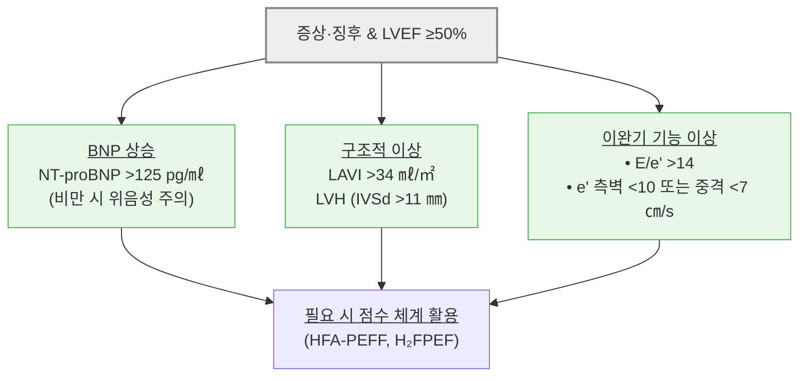
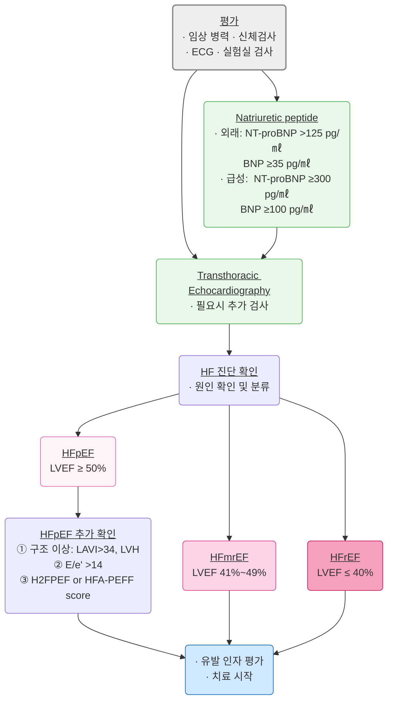
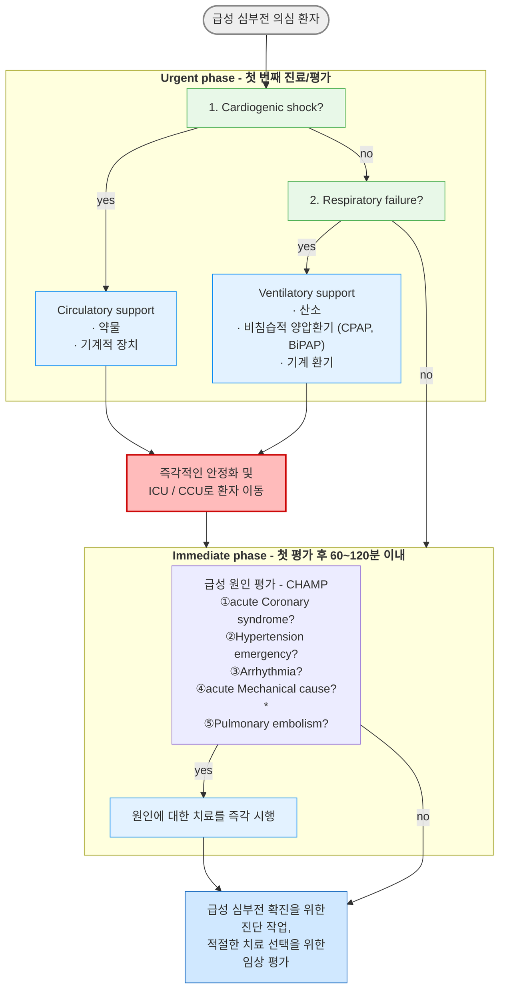
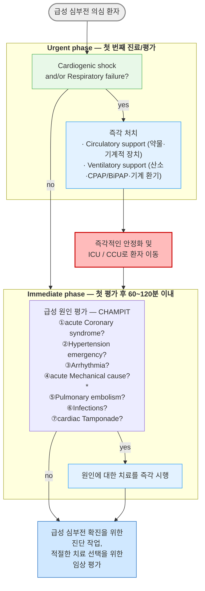
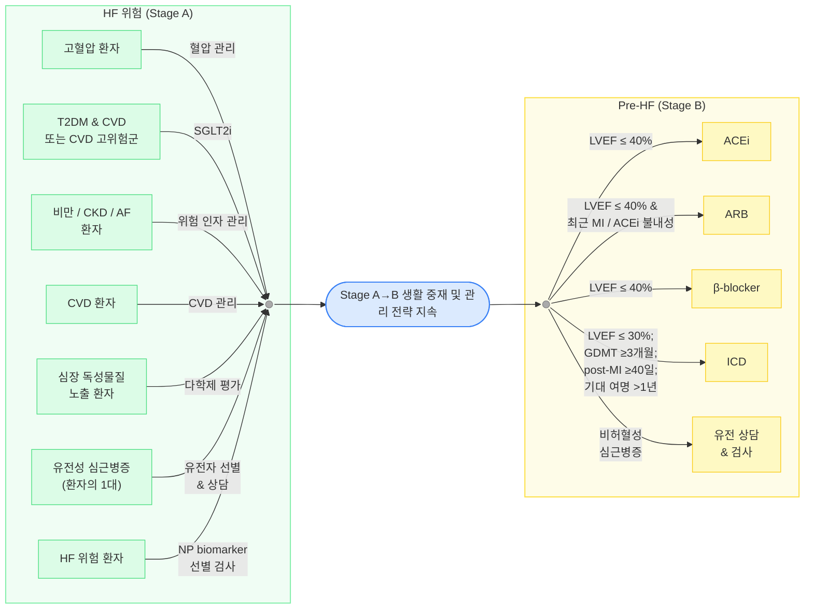
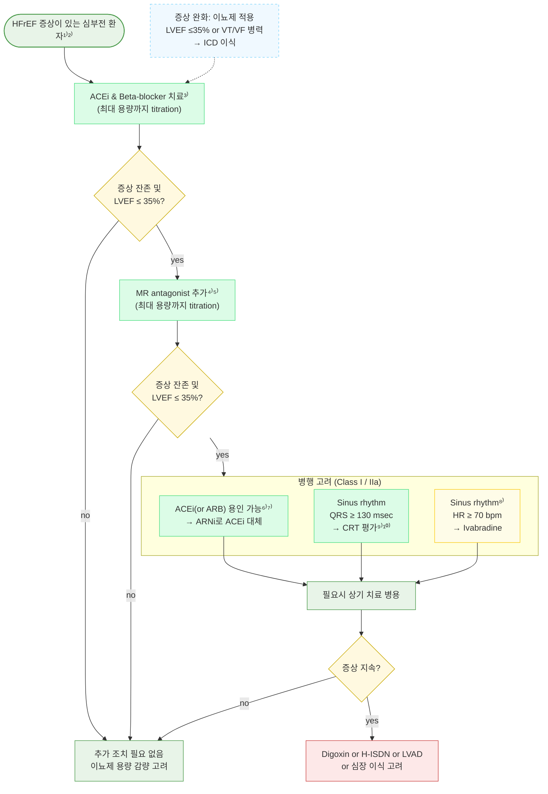
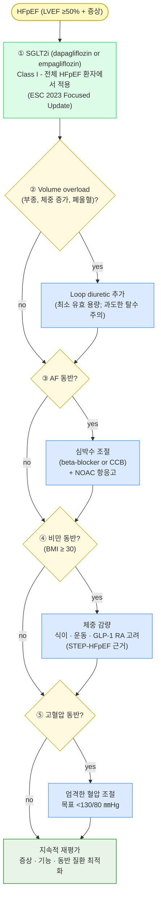
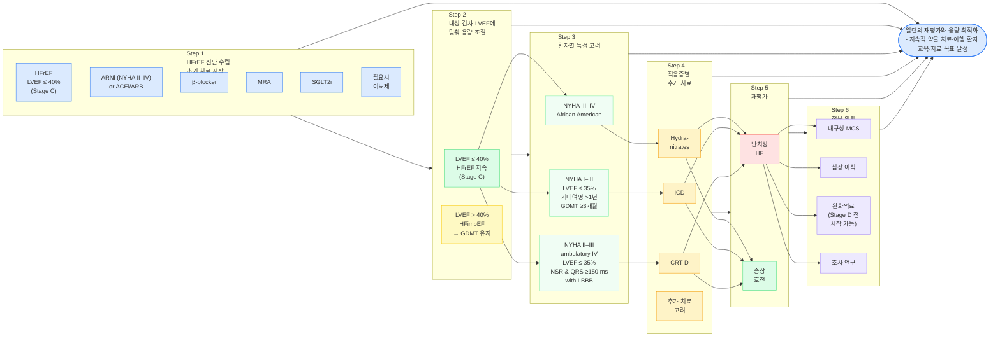

# 심부전 Heart Failure

## <mark style="color:green;">일반 사항</mark>

* 심실의 혈액 충만 또는 심실의 혈액 박출의 구조적·기능적 장애로 인한 증상 및 징후가 있는 복합적 임상 증후군
* 모든 HF 환자에서 GDMT(guideline-directed medical therapy)는 증상 호전·EF 회복 여부와 무관하게 임의 중단하지 않음

### <mark style="color:orange;">분류</mark>

#### <mark style="color:$primary;">EF 기반 분류</mark>

* HFpEF (HF with preserved EF) : LVEF ≥50%
  * 심실 이완 장애·충만압 증가(고혈압·비만·당뇨·노화) → 운동 내성 저하 및 폐정맥 울혈; 수축력은 보존되나 충만 이상
* HFmrEF (HF with mildly reduced EF) : LVEF 41\~49%
* HFrEF (HF with reduced ejection fraction) : LVEF ≤40%
  * 심근 수축력 저하(MI, 확장성·허혈성 심근병증) → CO 감소 → 신경호르몬 과활성화(RAAS, 교감신경) → 심실 리모델링 악화
* HFimpEF (HF with improved EF) : 이전 LVEF ≤40% → 추적 측정 LVEF >40%

#### <mark style="color:$primary;">기능적 분류 (NYHA Functional Classification)</mark>

<table><thead><tr><th width="80">Class</th><th width="393">증상 유발 활동 강도</th><th>신체 활동 제한</th></tr></thead><tbody><tr><td><strong>I</strong></td><td>일상적인 활동으로는 심부전 증상*이 발생하지 않음</td><td>제한 없음</td></tr><tr><td><strong>II</strong></td><td>휴식 시 편안하지만 일상적인 활동으로 심부전 증상이 유발됨</td><td>약간 제한</td></tr><tr><td><strong>III</strong></td><td>휴식 시 편안하지만 일상적인 것보다 작은 활동으로도 증상 유발</td><td>상당한 제한</td></tr><tr><td><strong>IV</strong></td><td>휴식 시에도 증상 발생. 어떤 신체 활동도 불편함 증가</td><td>모든 활동 제한</td></tr></tbody></table>

_✽심부전 증상 : 피로, 두근거림, 호흡 곤란_

## <mark style="color:green;">원인</mark>

* 주요 원인 : 허혈성 심질환, 심근경색, 판막성 심질환
* 비허혈성 원인 : 죽상경화성 CVD, 고혈압(조절 안 됨), cardiotoxin 노출(항암제·알코올), 류마티스/자가면역 질환, 내분비/대사 질환(갑상선·당뇨·비만·대사증후군·철분 과다), 가족성 심근병증, 유전성 심질환, 빈맥/PVC, 침윤성 심질환(amyloid·sarcoid), 심근염, 산후 심근병증, 스트레스 심근병증

### <mark style="color:orange;">위험 인자</mark>

* 비만, CKD, 심방세동(AF)

## <mark style="color:green;">임상 양상</mark>

* 활동 시 호흡 곤란, 운동 능력 저하(피로·전신 약화), 말초 부종(양측 발목 부종)
* 야간 기침(nonproductive 또는 거품/분홍색 가래), orthopnea, 발작성 야간 호흡 곤란(PND)
* Wheezing(특히 야간; cardiac asthma), Cheyne-Stokes respiration, rale, heart murmur, 경정맥 확장
* Advanced HF : 식욕 부진, 우상복부 팽만(hepatic congestion), 복수, 구역, 저혈압, pulsus alternans, 빈맥, narrow pulse pressure, 사지 냉증, 청색증

### <mark style="color:red;">🚩 Red Flags!</mark>

<mark style="color:red;">**즉각 이송 또는 응급 평가**</mark>

* 급성 호흡 곤란 (산소포화도 <90%, 호흡수 >25회/분)
* SBP <90 ㎜Hg + 말초 냉증 + 의식 변화 → 심인성 쇼크
* 좌위 호흡, 거품 가래, 청색증 → 급성 폐부종
* 원인 불명의 심각한 발한 + 흉통 + 실신

<mark style="color:orange;">**당일 또는 긴급 평가**</mark>

* SBP <100 ㎜Hg (증상 동반)
* 기저치 대비 s-Cr 급격한 상승
* s-Na <135 mEq/L
* 새로운 심잡음
* 2\~3일 내 체중 ≥2 ㎏ 급증

<mark style="color:$info;">**외래 추적 / 추가 평가 계획**</mark> <mark style="color:$info;"></mark><mark style="color:$info;">- 즉각 위험 낮으나 호전 없으면 의뢰</mark>

* NYHA 기능 분류 악화 (I→II, II→III 등)
* 원인 불명의 심부전
* 유전성 심근병증이 있는 환자의 1대 가족
* CRT 또는 ICD 삽입 여부 평가 필요

## <mark style="color:green;">진단</mark>

### <mark style="color:orange;">환자 초기 평가</mark>

* 문진, 진찰, 신장/체중(BMI), 기립성 혈압 변화; 심근병증 환자에서 3대 가족력 청취
* 혈액검사 : CBC, 전해질(Ca, Mg), BUN/Cr, FBS/HbA1c, 지질, LFT, 철분(혈청 철·페리틴·TSAT), TSH
* Biomarkers : BNP, NT-proBNP
  * 연령·성별·신부전·비만·약물에 영향; 비만 시 BNP 위음성 가능

<table><thead><tr><th width="178">상황</th><th width="200">BNP</th><th>NT-proBNP</th></tr></thead><tbody><tr><td>외래 / 만성 HF 의심</td><td>≥35 pg/㎖</td><td>>125 pg/㎖</td></tr><tr><td>급성 HF 의심</td><td>≥100 pg/㎖</td><td>≥300 pg/㎖</td></tr></tbody></table>

* 12-Lead 심전도, 흉부 X선
* 심초음파 (최우선) : 구조·기능 평가, LVEF 측정
* 선택적 검사 : 심도자검사, 경식도초음파, 심장 MRI(심근염·침윤성 질환 의심 시), 유전자 검사
* 6분보행검사 : ≥350 m 기능 제한 없음, <150 m 심한 제한

### <mark style="color:orange;">Framingham 진단 기준</mark>

* 심부전 진단은 임상적 판단이 우선이며, Framingham 기준은 보조적 도구로 활용; 증상·징후·검사 소견을 종합하여 판단하고, 단일 기준에 의존하지 않음

<table data-search="false"><thead><tr><th width="319">Major criteria</th><th>Minor criteria</th></tr></thead><tbody><tr><td>발작성 야간 호흡 곤란</td><td>양측 발목 부종</td></tr><tr><td>경정맥 팽창</td><td>야간 기침</td></tr><tr><td>폐수포음</td><td>보통의 활동 중 호흡 곤란</td></tr><tr><td>심 비대 (흉부 X선상)</td><td>흉막 삼출</td></tr><tr><td>급성 폐부종</td><td>간 비대</td></tr><tr><td>S3 gallop</td><td>빈맥 (HR >120회/분)</td></tr><tr><td>Hepatojugular reflux</td><td>-</td></tr><tr><td>치료 반응으로 5일간 >4.5 ㎏ 체중 감소</td><td>-</td></tr></tbody></table>

* 판정 : '2 Major' 또는 '1 Major + 2 Minor' / 민감도 >95%, 특이도 75\~80%

_Ref. The natural history of congestive heart failure: the Framingham study. NEJM 1971;285(26)_

### <mark style="color:orange;">HFpEF 진단</mark>


**HFpEF는 LVEF ≥50%와 증상만으로 진단하지 않음;** EF 보존 자체가 심부전 증거가 아니므로 충만압 상승 또는 구조적 이상의 객관적 증거가 필요. ESC HFA-PEFF 및 H2FPEF 점수가 보조 진단으로 권고됨


<mark style="color:cyan;">**진단 단계**</mark>



<mark style="color:cyan;">H2FPEF / HFA-PEFF Score</mark>

<table><thead><tr><th width="160">Score</th><th width="300">구성 요소</th><th>해석</th></tr></thead><tbody><tr><td><a href="https://www.cvdapp.com/calculator/hfa-peff_and_h2fpef_score"><strong>H2FPEF score</strong></a></td><td>BMI >30 kg/m² (2점), 항고혈압제 ≥2종 복용 (1점), paroxysmal 또는 persistent AF (3점), PASP >35 mmHg (1점), 연령 >60세 (1점), E/e' >9 (1점)</td><td>0~1점: HFpEF 낮음; 6~9점: 높음; 중간은 부하 검사 고려</td></tr><tr><td><a href="https://www.cvdapp.com/calculator/hfa-peff_and_h2fpef_score"><strong>HFA-PEFF score</strong></a></td><td>기능적(E/e'·GLS), 형태적(LAVI·LVH), 바이오마커(BNP/NT-proBNP), 운동부하 기준</td><td>≥5점: HFpEF 확진; 2~4점: 운동부하 검사; 0~1점: 비가능성</td></tr></tbody></table>

***



<p align="center"><strong>HF 및 EF 기반 분류를 위한 진단 알고리듬</strong></p>

***

## <mark style="background-color:yellow;">Management</mark>

### <mark style="color:orange;">HF phenotype별 약물 치료 요약</mark>


<table><thead><tr><th width="114">HF phenotype</th><th width="114">LVEF</th><th>우선 권고 약제</th></tr></thead><tbody><tr><td><strong>HFpEF</strong></td><td>≥50%</td><td>SGLT2i 우선 (ESC 2023); 원인 질환(고혈압·AF·비만) 집중 관리; 체액 과부하 시 이뇨제</td></tr><tr><td><strong>HFmrEF</strong></td><td>41~49%</td><td>SGLT2i 우선; ACEi/ARB/ARNi · β-차단제 · MRA - 증상 있는 경우 HFrEF에 준하여 적극 적용 권고 (ESC 2023)</td></tr><tr><td><strong>HFrEF</strong></td><td>≤40%</td><td>ARNi/ACEi + β-차단제 + MRA + SGLT2i 4제 병용</td></tr><tr><td><strong>HFimpEF</strong></td><td>이전 ≤40% <br>→ >40%</td><td>GDMT 전면 유지 — 절대 중단 금지; EF 회복 후에도 재악화 위험 높음 → 추적 심초음파 및 장기 관리 필수</td></tr></tbody></table>

### <mark style="color:orange;">급성 심부전 초기 관리</mark>

***



<p align="center"><strong>급성 심부전 환자의 초기 관리 알고리듬</strong></p>

<p align="center"><em><mark style="color:$info;">*Acute mechanical cause: myocardial rupture (free wall rupture, VSD, acute MR), chest trauma, acute valve incompetence (endocarditis), aortic dissection</mark></em></p>

<p align="center"><em><mark style="color:$info;">Ref. ESC Guidelines for the diagnosis and treatment of acute and chronic heart failure. 2016. Fig 12-2.</mark></em></p>



_\*Acute mechanical cause: myocardial rupture (free wall rupture, VSD, acute MR),_\
_chest trauma, acute valve incompetence (endocarditis), aortic dissection_

***


⚠️ **급성 심부전 응급 처치 - CHAMP 감별 + 임상 프로파일**

**CHAMP 원인 감별** (초기 60\~120분 내 배제)

**임상 프로파일별 초기 치료 (Warm/Cold-Wet/Dry 분류)**


<table><thead><tr><th width="130">Profile</th><th width="160">특징</th><th>초기 치료 방향</th></tr></thead><tbody><tr><td><strong>Warm &#x26; Wet</strong></td><td>충분한 관류 + 울혈</td><td>Loop diuretic ± vasodilator (가장 흔한 형태)</td></tr><tr><td><strong>Cold &#x26; Wet</strong></td><td>저관류 + 울혈</td><td>Inotrope ± vasopressor → 안정 후 이뇨제; 기계적 보조 고려</td></tr><tr><td><strong>Cold &#x26; Dry</strong></td><td>저관류 + 울혈 없음</td><td>Fluid challenge 신중히 고려; 기저 원인(tamponade 등) 감별</td></tr><tr><td><strong>Warm &#x26; Dry</strong></td><td>충분한 관류 + 울혈 없음</td><td>유지 치료; 약물 최적화</td></tr></tbody></table>

<table><thead><tr><th width="230">원인</th><th>주요 감별 방법</th></tr></thead><tbody><tr><td>acute <strong>C</strong>oronary syndrome</td><td>심전도, 트로포닌</td></tr><tr><td><strong>H</strong>ypertension emergency</td><td>혈압 측정</td></tr><tr><td><strong>A</strong>rrhythmia</td><td>심전도, 맥박</td></tr><tr><td>⚠️ acute <strong>M</strong>echanical cause</td><td><strong>즉각 심초음파 필수</strong> - 드물지만 치명적 (심근 파열·VSD·급성 MR·급성 판막 부전·대동맥 박리); 진단 지연 시 사망률 급등</td></tr><tr><td><strong>P</strong>ulmonary embolism</td><td>D-dimer, CT-PA</td></tr></tbody></table>

### <mark style="color:orange;">ACCF/AHA 분류 및 치료 전략 (AHA/ACC/HFSA 2022)</mark>

#### <mark style="color:$primary;">Stage A : HF 위험군 (Pre-HF 이전)</mark>

* HF 위험 인자가 있으나 증상·구조적 심질환·비정상 biomarker 없음
* **주요 위험 인자** : 고혈압, T2DM, CVD, 비만 **(BMI >30)**, **CKD**, **AF**, cardiotoxin 노출, 유전성 심근병증 가족력
* **관리**
  1. 고혈압 : 적절한 혈압 조절 (Class I)
  2. **SGLT2i** : T2DM + CVD 또는 심혈관 고위험군 (Class I); T2DM + CKD (Class I)
  3. 규칙적인 신체 활동, 정상 체중 유지, 건강한 식습관, 흡연 회피
  4. HF 발병 위험 환자에서 natriuretic peptide 선별 검사 고려
  5. 다변수 Risk score 평가 고려 (예: Framingham HF risk score, PCP-HF)

#### <mark style="color:$primary;">Stage B : Pre-HF</mark>

* HF 증상·징후 없으나 구조적 심질환, filling pressure 증가 증거, 또는 위험 인자 + NP 상승·troponin 지속 상승 중 하나 존재
* **관리**
  1. **ACEi** : LVEF ≤40% (Class I)
  2. **ARB** : ACEi 불내성 + recent MI & LVEF ≤40% (Class I)
  3. **Beta-blocker** : MI/ACS 병력 + LVEF ≤40%; 또는 LVEF ≤40%인 모든 환자 (Class I)
  4. **ICD** : LVEF ≤30%, post-MI ≥40일, NYHA class I, 기대 여명 >1년, **GDMT 최소 3개월 후에도 LVEF ≤35% 지속 시** (Class I)
  5. **Statin** : MI/ACS 병력 (Class I)
  6. **회피** : LVEF <50%에서 TZD, non-DHP CCB(verapamil·diltiazem)

***



<p align="center"><strong>HF 위험(Stage A) 및 Pre-HF(Stage B) 환자를 위한 권고 (Class I &#x26; IIa)</strong></p>

<p align="center"><em><mark style="color:blue;">Ref. AHA/ACC/HFSA Guideline for the Management of Heart Failure. 2022. Fig 5.</mark></em></p>

***

#### <mark style="color:$primary;">Stage C : 증상성 HF</mark>

* 현재/이전에 HF 증상을 가진 구조적 심질환; 다학제 팀 관리 권고

**비약물적 중재**

1. 호흡기 질환 예방 백신 (인플루엔자, 폐렴구균, COVID-19)
2. 우울증·사회적 고립·허약·낮은 건강 관리 능력 선별
3. 과도한 소금 섭취 회피; 규칙적 운동; 심장 재활 고려

**약물적 중재 (HFrEF) - Quadruple Therapy**


**HFrEF 4대 기본 치료 (Quadruple Therapy)** - AHA/ACC/HFSA 2022, ESC 2023 Update

1. **ARNi** (또는 ACEi/ARB) - RAAS 억제
2. **Beta-blocker** - 신경호르몬 억제
3. **MRA** - 알도스테론 억제
4. **SGLT2i** - 심혈관·신장 보호

4가지를 **조기에 동시 개시**, 목표 용량까지 신속히 titration 권고 (ESC 2023 Focused Update).

**HFrEF 초기 약물 시작 및 titration 일정 (권고 흐름)**


<table><thead><tr><th width="160">시기</th><th>조치</th></tr></thead><tbody><tr><td>진단 즉시</td><td>ARNi/ACEi + β-차단제 + SGLT2i 동시 시작 (저용량)</td></tr><tr><td>1~2주</td><td>Cr · K · BP 확인; ARNi/ACEi 2배 증량</td></tr><tr><td>2~4주</td><td>β-차단제 증량; MRA 추가 (K &#x3C;5.0, eGFR >30 확인)</td></tr><tr><td>4~8주</td><td>전체 약제 용량 재평가; 목표 용량 도달 목표</td></tr><tr><td>3개월</td><td>심초음파 재평가; LVEF 호전 여부 확인 (HFimpEF 전환 여부)</td></tr><tr><td>6~12개월</td><td>심초음파 추적; CRT·ICD 적응증 재평가</td></tr></tbody></table>

***



<p align="center"><strong>Ejection fraction이 감소된 증상성 심부전 환자의 치료 알고리듬</strong></p>

<p align="center"><em><mark style="color:blue;">① NYHA II–IV. ② LVEF ≤40%. ③ ACEi 불내성 시 ARB. ④ MR antagonist 불내성 시 ARB. ⑤ 최근 6개월 HF 입원 또는 BNP >250/NT-proBNP >500·750 pg/</mark></em>㎖<em><mark style="color:blue;">. ⑥ BNP ≥150/NT-proBNP ≥600 pg/</mark></em>㎖ <em><mark style="color:blue;">또는 최근 12개월 HF 입원. ⑦ Enalapril 10 ㎎ bid 등가 용량. ⑧ 최근 1년 HF 입원력. ⑨ QRS ≥130 msec + LBBB(동성 리듬) → CRT 권고. ⑩ QRS ≥130 msec + non-LBBB 또는 AF → CRT 고려.</mark></em></p>

<p align="center"><em><mark style="color:blue;">Ref. ESC Guidelines for the diagnosis and treatment of acute and chronic heart failure. 2016. Fig 7-1.</mark></em></p>

***

**HFpEF 치료 알고리듬**



<p align="center"><strong>HFpEF 치료 알고리듬</strong></p>

<p align="center"><em><mark style="color:blue;">Ref. ESC 2023 Focused Update; AHA/ACC/HFSA 2022; STEP-HFpEF 2023.</mark></em></p>

***

#### <mark style="color:$primary;">Stage D : Advanced HF</mark>

* 적절한 치료에도 불구하고 일상생활을 방해하고 반복적인 입원이 요구되는 현저한 HF 증상
* **전문센터 의뢰 기준** : ① 최근 12개월 내 HF 관련 입원 ≥2회, ② NYHA IV (최적 GDMT에도 불응), ③ GDMT 불내성으로 표준 치료 불가, ④ 지속적 이뇨제 의존·저나트륨혈증·저혈압 동반, ⑤ 심장 이식/LVAD/임상시험 적합성 평가 필요

***



<p align="center"><strong>HFrEF Stage C &#x26; D 환자 치료 알고리듬</strong></p>

<p align="center"><em><mark style="color:blue;">MRA=mineralocorticoid receptor antagonist; HFimpEF=HF with improved EF; ICD=implantable cardioverter defibrillator; MCS=mechanical circulatory support; CRT-D=cardiac resynchronization therapy with defibrillation; NSR=normal sinus rhythm; LBBB=left bundle branch block</mark></em></p>

<p align="center"><em><mark style="color:blue;">Ref. AHA/ACC/HFSA Guideline for the Management of Heart Failure. 2022. Fig 6.</mark></em></p>

***

## <mark style="color:green;">약물 치료</mark>

### <mark style="color:orange;">EF 감소 HF(또는 급성 심근경색)에서의 Disease-modifying Drugs</mark>

<table><thead><tr><th width="240">Drug</th><th width="160">시작 용량 (㎎)</th><th>목표 용량 (㎎)</th></tr></thead><tbody><tr><td><strong>ACEi</strong></td><td></td><td></td></tr><tr><td>captopril <mark style="color:blue;">[카프릴]</mark></td><td>6.25 tid</td><td>50 tid</td></tr><tr><td>enalapril <mark style="color:blue;">[레니프릴]</mark></td><td>2.5 bid</td><td>10–20 bid</td></tr><tr><td>lisinopril <mark style="color:blue;">[제스트릴]</mark></td><td>2.5–5 qd</td><td>20–40 qd</td></tr><tr><td>perindopril <mark style="color:blue;">[아세틸]</mark></td><td>2 qd</td><td>8–16 qd</td></tr><tr><td>ramipril <mark style="color:blue;">[트리테이스]</mark></td><td>1.25–2.5 qd</td><td>10 qd</td></tr><tr><td>trandolapril</td><td>1 qd</td><td>4 qd</td></tr><tr><td><strong>ARB</strong></td><td></td><td></td></tr><tr><td>candesartan <mark style="color:blue;">[아타칸]</mark></td><td>4–8 qd</td><td>32 qd</td></tr><tr><td>losartan <mark style="color:blue;">[코자]</mark></td><td>25–50 qd</td><td>50–150 qd</td></tr><tr><td>valsartan <mark style="color:blue;">[디오반]</mark></td><td>20–40 bid</td><td>160 bid</td></tr><tr><td><strong>ARNi</strong></td><td></td><td></td></tr><tr><td>sacubitril/valsartan <mark style="color:blue;">[엔트레스토]</mark></td><td>24/26 bid 또는 49/51 bid</td><td>97/103 bid</td></tr><tr><td><strong>I</strong><sub><strong>f</strong></sub><strong> Channel inhibitor</strong></td><td></td><td></td></tr><tr><td>ivabradine <mark style="color:blue;">[프로코라란]</mark></td><td>5 bid</td><td>7.5 bid</td></tr><tr><td><strong>Beta-blockers</strong></td><td></td><td></td></tr><tr><td>bisoprolol <mark style="color:blue;">[콩코르]</mark></td><td>1.25 qd</td><td>10 qd</td></tr><tr><td>carvedilol <mark style="color:blue;">[딜라트렌]</mark></td><td>3.125 bid</td><td>25–50 bid</td></tr><tr><td>carvedilol CR</td><td>10 qd</td><td>80 qd</td></tr><tr><td>metoprolol succinate <mark style="color:blue;">[푸로롤서방]</mark></td><td>12.5–25 qd</td><td>200 qd</td></tr><tr><td>nebivolol</td><td>1.25 qd</td><td>10 qd</td></tr><tr><td><strong>MRA</strong></td><td></td><td></td></tr><tr><td>spironolactone <mark style="color:blue;">[알닥톤]</mark></td><td>12.5–25 qd</td><td>25–50 qd</td></tr><tr><td>eplerenone</td><td>25 qd</td><td>50 qd</td></tr><tr><td><strong>SGLT2i</strong></td><td></td><td></td></tr><tr><td>dapagliflozin <mark style="color:blue;">[포시가]</mark></td><td>10 qd</td><td>10 qd</td></tr><tr><td>empagliflozin <mark style="color:blue;">[자디앙]</mark></td><td>10 qd</td><td>10 qd</td></tr><tr><td><strong>Soluble guanylate cyclase stimulator</strong></td><td></td><td></td></tr><tr><td>vericiguat <mark style="color:blue;">[베르쿠보]</mark></td><td>2.5 qd</td><td>10 qd</td></tr><tr><td>digoxin <mark style="color:blue;">[디곡신]</mark></td><td>0.125–0.25 qd</td><td>목표 혈중 농도 0.5–0.9 ng/㎖</td></tr><tr><td><strong>Isosorbide dinitrate &#x26; Hydralazine</strong></td><td></td><td></td></tr><tr><td>isosorbide dinitrate <mark style="color:blue;">[이소켓]</mark></td><td>20 tid</td><td>40 tid (120 ㎎/d)</td></tr><tr><td>hydralazine <mark style="color:blue;">[히드랄라진]</mark></td><td>25 tid</td><td>75 tid (225 ㎎/d)</td></tr></tbody></table>

_✽단기 제제 제외; serum digoxin 농도 유지_\
\&#xNAN;_Ref. AHA/ACC/HFSA Guideline for the Management of Heart Failure. 2022. Table 14._

### <mark style="color:orange;">약제별 titration 체크리스트</mark>

<table><thead><tr><th width="160">약제</th><th>증량 전 확인 항목</th><th width="200">목표 / 주의 기준</th></tr></thead><tbody><tr><td><strong>ACEi / ARNi</strong></td><td>BP · Cr · K</td><td>SBP >90; Cr 상승 &#x3C;30%; K &#x3C;5.5</td></tr><tr><td><strong>Beta-blocker</strong></td><td>HR · BP · 울혈 여부</td><td>HR >50; SBP >90; 체액 과부하 없음</td></tr><tr><td><strong>MRA</strong></td><td>Cr · K · eGFR</td><td>eGFR >30; K &#x3C;5.0 시작; K &#x3C;5.5 유지</td></tr><tr><td><strong>SGLT2i</strong></td><td>eGFR · 감염 여부</td><td>개별 약제 허가사항 참고 (약제마다 eGFR 기준 상이); 수술·금식 48h 전 중단</td></tr></tbody></table>

#### <mark style="color:$primary;">ACEi</mark>

* **작용** : afterload 감소
* **용법** : 저용량 시작 → 2주 후 2배 증량 → 1\~3개월에 걸쳐 titration; β-차단제 병용 시 추가 효과
* **금기** : 혈관부종, 무뇨성 신부전, 임신
* **주의** : SBP <80 ㎜Hg, 양측 신동맥 협착, s-Cr >3 ㎎/㎗, K >5.5 mEq/L

#### <mark style="color:$primary;">ARB</mark>

* ACEi보다 효과 적음; **대상** : ACEi에 의한 혈관부종 발생 시 대체
* **주의** : ACEi와 동일 (✽ARB도 혈관부종 유발 가능)

#### <mark style="color:$primary;">β-차단제</mark>

* **대상** : Stage B 이상; Q파 MI에서 필수; 울혈이 없는 안정 상태에서 시작
* **용법** : 저용량 시작 → 1\~4주 간격으로 증량; 초기 일시적 울혈·무력감·피로 악화 가능
* 증상 동반 저혈압 : ① 혈관 확장제와 2시간 간격, ② 혈관 확장제·이뇨제 감량, ③ β-차단제 감량
* 증상 동반 서맥 : ① digoxin 농도 확인, ② 관련 약제(amiodarone 등) 감량, ③ diltiazem·verapamil 중단

#### <mark style="color:$primary;">Mineralocorticoid receptor antagonist (MRA)</mark>


**MRA 계열 구분**

* **Spironolactone, Eplerenone** : HFrEF Quadruple Therapy의 표준 구성 약제 - NYHA II\~IV + LVEF ≤35\~40%에서 사망률·입원율 감소 (RALES, EMPHASIS-HF 근거)
* **Finerenone** (비스테로이드성 선택적 MRA) : **T2DM + CKD 환자의 심혈관 사고 및 HF 입원 예방** 목적 - HFrEF의 표준 MRA를 대체하지 않음; 두 가지를 구분하여 처방 고려


* **대상 (Spironolactone/Eplerenone)** : NYHA class ≥Ⅱ; s-Cr <2.0 ㎎/㎗ & s-K <5.0 mEq/L
* **부작용** : K↑(1주·4주 후 모니터링), 여성형유방증(spironolactone)
* **Finerenone** : T2DM + CKD에서 ESC 2023 Class I, LOE A - 국내 적응증 확인 필요

#### <mark style="color:$primary;">SGLT2i</mark>

(☞ 당뇨병 챕터 참조)

* **작용** : 혈압↓, 체중↓, ASCVD 위험↓, HF 입원↓, eGFR 저하 지연
* **대상** : HFrEF (Class I), HFmrEF·HFpEF (Class I, ESC 2023), T2DM+CVD 고위험 (Class I), T2DM+CKD (Class I)
* **eGFR 기준** : **⚠️ 개별 약제 허가사항을 반드시 최신 버전으로 재확인할 것** (empagliflozin과 dapagliflozin의 eGFR 하한선이 다르며, 허가 기준이 지속 업데이트됨)
* **부작용** : 요로/생식기 감염, 케톤산증, LDL-C↑

#### <mark style="color:$primary;">ARNi (Angiotensin Receptor Neprilysin Inhibitor)</mark>

* sacubitril + valsartan 복합제 <mark style="color:blue;">\[엔트레스토]</mark>
* **대상** : 증상성 HFrEF **NYHA class II\~IV** 전체 (최신 권고; 기존 II\~III에서 확대)
* enalapril보다 유효하나 저혈압 부작용 빈도 높음
* ⚠️ ACEi의 마지막 투약 **36시간 이내 투여 금지** (혈관부종 위험)

### <mark style="color:orange;">기타 / 증상 개선 약제</mark>

#### <mark style="color:$primary;">이뇨제</mark>

* **적용** : fluid overload, 급성 HF 초기 울혈의 신속한 개선
* 최소 유효 용량 시작; 고령자 용량 적음; thiazide + loop diuretics 병용 시 추가 효과
* **부작용** : Na↓, K↓(또는 K↑), Mg↓, 요산↑; **금기** : Na <135, K <3.5 또는 >5.0, Cr >3.0, Mg <1.8, 산증
* torsemide : furosemide보다 흡수·반감기 우수

<table><thead><tr><th width="220">Drug</th><th width="200">시작 용량 (㎎)</th><th>최대 용량 (㎎)</th></tr></thead><tbody><tr><td><strong>Loop diuretics</strong></td><td></td><td></td></tr><tr><td>furosemide <mark style="color:blue;">[라식스]</mark></td><td>20–40 qd/bid</td><td>600</td></tr><tr><td>bumetanide</td><td>0.5–1.0 qd/bid</td><td>10</td></tr><tr><td>torsemide <mark style="color:blue;">[토르세미드]</mark></td><td>10–20 qd</td><td>200</td></tr><tr><td><strong>Thiazide diuretics</strong></td><td></td><td></td></tr><tr><td>chlorthalidone <mark style="color:blue;">[하이그로톤]</mark></td><td>12.5–25 qd</td><td>100</td></tr><tr><td>hydrochlorothiazide <mark style="color:blue;">[다이크로짇]</mark></td><td>25 qd</td><td>200</td></tr><tr><td>indapamide <mark style="color:blue;">[후루덱스]</mark></td><td>2.5 qd</td><td>5</td></tr><tr><td>metolazone</td><td>2.5 qd</td><td>20</td></tr></tbody></table>

#### <mark style="color:$primary;">Digoxin</mark>

* **대상** : 이뇨제/ACEi에도 증상 잔존; 심방세동 심박수 조절 필요 시 <mark style="color:blue;">\[디고신]</mark>
* **용법** : 0.125 ㎎/d으로 시작; 신기능 장애·고령·낮은 lean body mass 시 감량; amiodarone·quinidine·verapamil 병용 시 농도 증가
* **부작용** : 구역, 식욕 부진, 혼란, 시각 이상, 부정맥; 저칼륨혈증·신기능 장애 시 독성 증가
* ✽**여성에서 독성 위험이 더 높음** - 혈중 농도를 낮은 범위(0.5\~0.8 ng/㎖)로 유지하는 것이 바람직함
* **모니터링** : 마지막 투여 6시간 이후 측정

#### <mark style="color:$primary;">항응고제</mark>

* 새로 시작 시 VKA보다 **NOAC** 우선
  * apixaban <mark style="color:blue;">\[엘리퀴스]</mark>, dabigatran <mark style="color:blue;">\[프라닥사]</mark>, edoxaban <mark style="color:blue;">\[릭시아나]</mark>, rivaroxaban <mark style="color:blue;">\[자렐토]</mark>
* AF 동반 HF : 추가 혈전 위험 인자 없는 경우 개별화 판단 (☞ 심방세동 챕터 참조)

#### <mark style="color:$primary;">기타 약물</mark>

* **Ivabradine** <mark style="color:blue;">\[프로코라란]</mark> : 최대 허용 β-blocker 포함 약물 치료 중 휴식 HR ≥70 bpm인 NYHA II\~III stable HFrEF (LVEF ≤35%)
* **Vericiguat** <mark style="color:blue;">\[베르쿠보]</mark> : 적절한 치료 중 최근 악화된 고위험 HFrEF 환자
* **정맥 내 철분 보충** : HFrEF/HFmrEF + 철결핍 시 권고 (ESC 2023, Class I)
  * **철결핍 정의 (ESC 2023)** : 혈청 페리틴 <100 μg/L, **또는** 페리틴 100\~299 μg/L + **TSAT <20%**
* **오메가-3 보충제** : NYHA II\~IV에서 보조 요법으로 고려


**GLP-1 수용체 작용제 (GLP-1 RA) - 신흥 치료 옵션 (2024 근거)**

**비만 동반 HFpEF** 에서 semaglutide 2.4 ㎎/주 sc (STEP-HFpEF, STEP-HFpEF DM 통합 분석, Lancet 2024): 위약 대비 KCCQ 점수 +7.5점, 6분보행거리 +20 m, 체중 −9.8% 유의 개선. 체중 감량 자체가 심장 기계적 부하·심낭지방·좌심실 이완 기능 개선에 기여하는 것으로 해석됨.

Tirzepatide(GIP/GLP-1 이중 작용제) : SUMMIT 시험에서 비만 동반 HFpEF에서 CV 사망 및 HF 악화 이벤트 유의 감소 - **GLP-1 RA 중 최초의 HF 하드 엔드포인트 감소 증거**.

단, **HFrEF**에서의 효과는 불확실(일부 데이터에서 심박수 증가·부정맥 위험 가능). 현재 가이드라인 공식 권고 이전이나, 비만 동반 HFpEF에서 SGLT2i와 병용 고려 가능; 두 약제의 상가 효과는 추가 연구 진행 중.


**권고하지 않음 또는 회피**

* **DHP CCB / non-DHP CCB** : HFrEF에서 권고하지 않음
* **Class IC 항부정맥제** : HFrEF에서 사망 위험 증가
* **TZD** : HFrEF에서 HF 증상 악화 및 입원 위험 증가
* **DPP-4i (saxagliptin, alogliptin)** : T2DM + 심혈관 고위험에서 HF 입원 위험 증가
* **NSAID** : HFrEF에서 HF 증상 악화 가능
* **항응고제** : 특정 징후 없는 만성 HFrEF에서 권고하지 않음
* **비타민·영양제·호르몬 치료** : 특정 결핍 교정 외 권고하지 않음

### <mark style="color:orange;">Device and Interventional Therapies</mark>

* **ICD** : LVEF ≤35% + NYHA II\~III; 또는 LVEF ≤30% + post-MI - **단, GDMT 최소 3개월 후에도 LVEF ≤35% 지속 시 적용** (Class I)
* **CRT-D** : NYHA II\~III(또는 보행 가능 IV) + LVEF ≤35% + 동성 리듬 + QRS ≥150 ms with LBBB
* **LVAD** : Stage D에서 이식 대기(bridge) 또는 영구 치료(destination)
* **심장 이식** : Stage D, 말기 HF, 금기 없는 적절한 후보자

***

## <mark style="color:green;">비-약물 치료 및 예방</mark>

* **금연, 금주**
* **소금 섭취** : 과도한 나트륨 제한은 권고하지 않음 (개별화 접근 우선). 필요 시 일반적으로 <6 g/d 목표; 중증(NYHA III/IV)에서 <5 g/d
* **수분 섭취 제한** : 울혈 시 <2 L/d; s-Na <135 mEq/L 시 <1.5 L/d
* **체중 관리** : 비만 시 체중 감량; 매일 체중 측정 → 2\~3일 내 ≥2 ㎏ 증가 시 신속 진료
* **심장 재활 및 유산소 운동** : 걷기·자전거·수영 등; 5분으로 시작 → 총 30분/일, 주 5\~6일 목표
  * 운동 전·중·후 맥박 측정; 휴식 시 대비 20회 이상 증가하지 않도록 강도 조절
* **동반 질환 치료** : 고혈압, 부정맥, 수면무호흡증, 당뇨병, 이상지질혈증
* **스트레스 관리, 우울증 치료** (우울증은 HF 예후 악화; 적극적 선별·치료)
* **백신 접종** : 인플루엔자, 폐렴구균, COVID-19 (Stage C 이상)
* **자가 모니터링 교육** : 증상 악화 시 신속 의료 접촉, 약물 순응도 강화

***

## <mark style="color:green;">Stage별 관리 요약</mark>

<table><thead><tr><th width="120">Stage</th><th width="230">특징</th><th>주요 관리 전략</th></tr></thead><tbody><tr><td><strong>Stage A</strong><br>(HF 위험군)</td><td>증상 없음<br>구조적 심질환 없음<br>위험 인자 존재</td><td>· 고혈압·당뇨·비만·CKD·AF·CVD·cardiotoxin 등 위험 인자 적극 관리<br>· SGLT2i : T2DM + CVD/CKD 환자에서 권고 (Class I)<br>· 생활습관 교정 (운동·체중·식습관·금연)<br>· NP biomarker 선별 검사 고려</td></tr><tr><td><strong>Stage B</strong><br>(Pre-HF)</td><td>증상 없음<br>구조적 심질환 또는<br>filling pressure 증가</td><td>· ACEi (LVEF ≤40%) / ARB (ACEi 불내성 + recent MI)<br>· β-blocker (MI 병력 또는 LVEF ≤40%)<br>· ICD : post-MI, LVEF ≤30%, GDMT ≥3개월에도 EF ≤35%<br>· Statin (MI/ACS 병력)<br>· TZD · non-DHP CCB 회피</td></tr><tr><td><strong>Stage C</strong><br>(증상성 HF)</td><td>구조적 심질환<br>+ 현재/과거 증상</td><td>· 다학제 팀 관리; 백신 접종; 우울증·사회적 고립 선별<br>· HFrEF : Quadruple therapy (ARNi/ACEi + β-blocker + MRA + SGLT2i)<br>· HFmrEF : SGLT2i Class I; 나머지 GDMT 적극 고려 (ESC 2023)<br>· HFpEF : SGLT2i + AF·비만·고혈압 동반 질환 집중 관리<br>· CRT/ICD 평가; 심장 재활; 생활습관 교정</td></tr><tr><td><strong>Stage D</strong><br>(Advanced HF)</td><td>반복 입원<br>GDMT 불응<br>일상생활 제한</td><td>· LVAD, 심장 이식 고려<br>· 완화의료 조기 병행 (Stage D 이전부터 시작 가능)<br>· <strong>전문센터 의뢰 기준</strong> : ① 최근 12개월 내 입원 ≥2회, ② NYHA IV 지속, ③ GDMT 불내성, ④ 이뇨제 의존·저나트륨혈증·저혈압, ⑤ 이식/LVAD/임상시험 적합성 평가 필요<br>· 임상시험 참여 가능성 검토</td></tr></tbody></table>

***

### <mark style="color:red;">질병코드</mark>

I50 심부전\
I50.0 울혈성 심부전\
I50.1 좌심실 부전\
I50.9 상세불명의 심부전

***

## <mark style="color:purple;">처방례</mark>

> **처방례 1. Stage A - T2DM + 심혈관 고위험군**
>
> ```
> 포시가 10 ㎎/T  1T  qd
> (또는 자디앙 10 ㎎/T  1T  qd)
> ```
>
> _✽HF 예방 목적 SGLT2i. HbA1c 및 eGFR 확인 후 처방._

> **처방례 2. Stage B - LVEF ≤40%, 최근 MI**
>
> ```
> 제스트릴  5 ㎎/T   1T  qd   (2주 후 10 ㎎ 목표)
> 콩코르    2.5 ㎎/T  1T  qd   (4주 후 5 ㎎ 목표)
> 포시가   10 ㎎/T   1T  qd
> ```
>
> _✽저용량 시작 후 2\~4주 간격으로 titration. 혈압·맥박·신기능·전해질 모니터링 필수._

> **처방례 3. Stage C - HFrEF (NYHA II\~III), Quadruple therapy**
>
> ```
> ⚠️ ACEi 마지막 복용 후 반드시 36시간 경과 후 엔트레스토 개시
> 엔트레스토  49/51 ㎎/T  1T  bid   (→ 97/103 ㎎ bid 목표)
> 콩코르       1.25 ㎎/T  1T  qd    (→ 10 ㎎ qd 목표)
> 알닥톤         25 ㎎/T  1T  qd
> 포시가         10 ㎎/T  1T  qd
> 라식스         20 ㎎/T  1T  qd    (체액 과부하 시)
> ```
>
> _✽K·신기능 정기 모니터링. 체중 매일 측정 교육._

> **처방례 4. Stage C - HFrEF + AF + HR 조절 필요**
>
> ```
> 엔트레스토  49/51 ㎎/T  1T  bid
> 콩코르           5 ㎎/T  1T  qd
> 알닥톤           25 ㎎/T  1T  qd
> 포시가           10 ㎎/T  1T  qd
> 디고신        0.125 ㎎/T  1T  qd   (AF 심박수 조절)
> 엘리퀴스          5 ㎎/T  1T  bid  (AF 항응고)
> 라식스           20 ㎎/T  1T  qd
> ```
>
> _✽AF 동반 시 digoxin 혈중 농도 모니터링 (0.5\~0.9 ng/_㎖_; 여성은 0.5\~0.8 ng/_㎖ _권장). NOAC은 신기능·체중 기준 감량 확인._

***


**퇴원 전 체크리스트 (Discharge Checklist)**

✓ Quadruple therapy 시작 확인 (ARNi/ACEi + β-blocker + MRA + SGLT2i)\
✓ 이뇨제 최적화 및 울혈 해소 확인\
✓ 체중 자가 모니터링 교육 (≥2 ㎏/2\~3일 → 신속 내원)\
✓ BNP 또는 NT-proBNP 추적 기준치 확보\
✓ 심초음파 추적 일정 계획 (3개월 후)\
✓ Follow-up 외래 예약 (퇴원 후 1\~2주 이내)\
✓ 예방접종 상태 확인 (인플루엔자, 폐렴구균, COVID-19)\
✓ ICD/CRT 적응증 재평가 일정 확인 (GDMT 3개월 후)


***

### <mark style="color:green;">핵심 복약 지도</mark>

1. **이뇨제(라식스 등)** : 아침에 복용하여 야간 빈뇨를 줄이세요. 체중이 2\~3일 내에 2 ㎏ 이상 늘면 바로 연락하세요.
2. **β-차단제(콩코르 등)** : 처음에 어지럼·피로가 생길 수 있으나 수주 내에 적응됩니다. 임의로 중단하지 마세요.
3. **ACEi/ARNi(제스트릴·엔트레스토 등)** : 마른 기침이 생기면 ARB로 교체 가능합니다. 혈압 저하·어지럼 발생 시 알려주세요.
4. **MRA(알닥톤 등)** : 칼륨이 높아질 수 있어 정기 혈액 검사가 필요합니다. 바나나·오렌지·토마토 등 고칼륨 식품을 과다 섭취하지 마세요.
5. **SGLT2i(포시가·자디앙)** : 생식기·요로 감염에 주의하고 위생을 철저히 하세요. 수술·금식 48시간 전에 중단하세요.
6. **엔트레스토** : 이전 ACEi 마지막 복용 후 36시간 뒤부터 복용하세요.
7. **Digoxin** : 복용 전 맥박을 재어 50회/분 미만이면 복용하지 말고 연락하세요. 구역·시야 흐림·황녹색 시야 발생 시 즉시 알려주세요.
8. **심부전 약물 전반** : EF가 좋아져도 절대로 임의로 약을 끊지 마세요. 약을 멈추면 심장이 다시 나빠질 수 있습니다.

***

### <mark style="color:blue;">환자 안내서</mark>

**심부전이란 무엇인가요?**\
심장이 몸에 필요한 혈액을 충분히 공급하지 못하는 상태입니다. 완치는 어렵지만, 약물 치료와 생활 습관 관리로 증상을 크게 줄이고 건강하게 생활할 수 있습니다.

**이런 증상이 생기면 즉시 병원에 오세요**

* 갑작스런 심한 호흡 곤란 또는 눕기 어려울 만큼 숨이 찰 때
* 2\~3일 내에 체중이 2 ㎏ 이상 갑자기 증가할 때
* 발목이나 다리가 갑자기 많이 부을 때
* 가슴 통증, 심한 어지럼, 실신할 것 같은 느낌이 들 때

**매일 지켜야 할 것들**

1. **체중 측정** : 매일 아침 같은 시간, 비슷한 옷차림으로 측정하고 기록하세요
2. **소금 제한** : 국·찌개·절인 음식을 줄이되, 극단적인 제한은 오히려 해로울 수 있으므로 의사와 상의하세요
3. **수분 제한** : 하루 음료를 1.5\~2 L 이내로 유지하세요 (물·음료·국 포함)
4. **약 빠짐없이 복용** : 심장 기능이 좋아져도 절대 임의로 약을 끊지 마세요
5. **운동** : 의사와 상의하여 걷기 등 가벼운 유산소 운동을 규칙적으로 하세요
6. **금연·금주** : 흡연과 음주는 심장 기능을 크게 악화시킵니다

**정기 검진이 중요합니다**\
혈압, 혈액 검사(신기능·전해질), 심전도, 심초음파 추적 검사가 필요합니다. 증상 변화가 없더라도 꾸준히 외래를 방문해 주세요.
