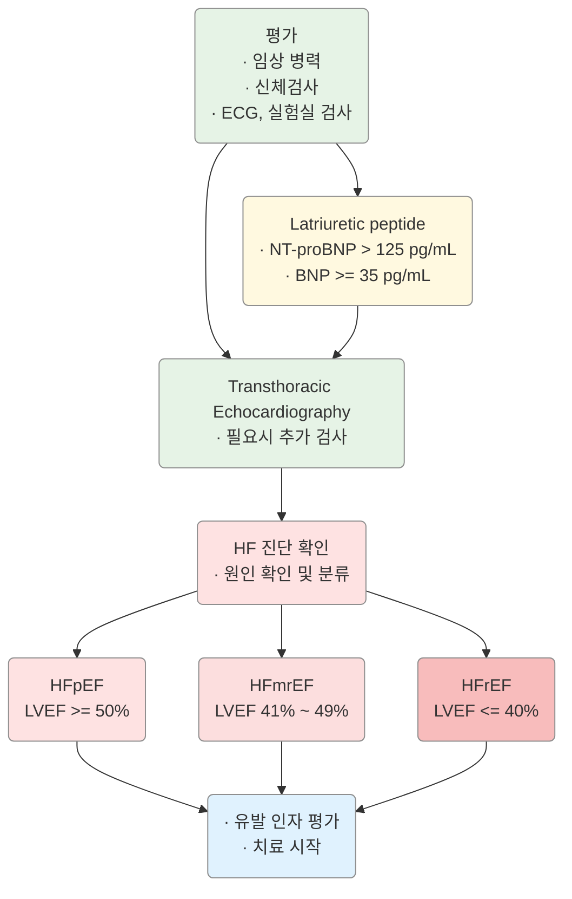

# 심부전 Heart Failure

## 일반 사항

* 심실의 혈액 충만 또는 심실의 혈액 박출의 구조적 또는 기능적 장애로 인한 증상 및 징후가 있는 복합적 임상 증후군
* HFrEF (HF with reduced ejection fraction) : LVEF(좌심실 박출률) ≤40%
* HFimpEF (HF with improved EF) : Previous LVEF ≤40% & F/U 측정 LVEF >40%
* HFmrEF (HF with mildly reduced EF) : LVEF 41%\~49%
* HFpEF (HF with preserved EF) : LVEF ≥50%

### 기전

* 수축 기능 이상 (inotropic abnormality) : systolic emptying 감소(EF ＜45%); 원인- MI, dilated/ischemic cardiomyopathy
* 확장 기능 이상 (compliance abnormality) : ventricular relaxation 제한(EF ＞45%); 원인- hypertensive cardiomyopathy

### NYHA functional classification of Heart failure

| **Class**         | **증상 유발 활동 강도**                      | **신체 활동 제한** |
| ----------------- | ------------------------------------ | ------------ |
| **Class I**       | 일상적인 활동으로는 심부전 증상\*이 발생하지 않음         | 제한 없음        |
| **Class II A/B**  | 휴식 시 편안하지만 일상적인 활동으로 심부전 증상이 유발됨     | 약간 제한        |
| **Class III A/B** | 휴식 시 편안하지만 일상적인 것보다 작은 활동으로도 증상이 유발됨 | 상당한 제한       |
| **Class IV**      | 휴식 시에도 증상 발생. 어떤 신체 활동도 불편함을 증가시킴    | 모든 활동 제한     |

A=early stage, B=late stage \*심부전 증상: 피로, 두근거림, 또는 호흡 곤란

## 원인 및 위험 인자

* 주요 원인 : 허혈성 심질환, 심근경색, 판막성 심질환
* 비허혈성 원인 : 죽상경화성 CVD, (조절되지 않는) 고혈압, cardiotoxin 노출(예: chemotherapy, 알코올, 약물), 류마티스/자가 면역 질환, 내분비/대사 질환(예: 갑상선 질환, 당뇨, 비만, 대사 증후군, 철분 과다), 가족성 심근병증, 유전성 심질환, 심장 박동 관련(예: 빈맥, PVC), 침윤성 심질환(예: amyloid, sarcoid), 심근염(예: 감염, 독소, 면역, 과민), 산후 심근병증, 스트레스 심근병증

## 임상 양상

* 활동 시 호흡 곤란
* 운동 능력 저하(쉽게 피로, 전신 약화), 말초 부종(양측 발목 부종)
* 야간 기침(nonproductive 또는 간혹 거품/분홍색 가래 동반), orthopnea, 발작성 야간 호흡 곤란
* wheezing(특히 야간; cardiac asthma), Cheyne-Stokes respiration rale, heart murmur, jugular venous dilatation
* advanced HF : 식욕 부진, 우상복부 팽만(hepatic congestion), 복수, 구역, 저혈압, pulsus alternans, 빈맥, narrow pulse pressure, 사지 냉증, 청색증

### Red Flags!

* 심한 증상 : 심한 발한, 어지럼, 갑작스런 호흡 곤란
* 원인 불명의 심부전
* 판막성 심장 질환 의심
* SBP < 100 mmHg
* s-Cr > 1.73 mg/dL
* s-Na < 135 mEq/mL

## 진단

### Framingham diagnostic criteria for Heart failure

<table data-header-hidden data-search="false"><thead><tr><th></th><th></th></tr></thead><tbody><tr><td><strong>Major criteria</strong></td><td><strong>Minor criteria</strong></td></tr><tr><td>발작성 야간 호흡 곤란</td><td>양측 발목 부종</td></tr><tr><td>경정맥 팽창</td><td>야간 기침</td></tr><tr><td>폐수종</td><td>보통의 활동 중 호흡 곤란</td></tr><tr><td>심 비대 (흉부 X선상)</td><td>pleural effusion</td></tr><tr><td>급성 폐부종</td><td>간 비대</td></tr><tr><td>S3 gallop</td><td>흉막 삼출</td></tr><tr><td>Hepatojugular reflux</td><td>빈맥 (HR >120회/분)</td></tr><tr><td>치료 반응으로 5일간 >4.5kg의 체중 감소</td><td>—</td></tr></tbody></table>

**판정 :** 2 Major 또는 1 Major + 2 Minor criteria **민감도:** >95% **특이도:** 75\~80%

_Ref. The natural history of congestive heart failure: the Framingham study. NEJM 1971:285(26)_

### 환자 초기 평가

* 문진, 진찰, 신장/체중(BMI 계산), 기립성 혈압 변화
  * 심근병증이 있는 환자에서 3대 가족력 청취
* CBC, 소변, 전해질(Ca, Mg 등), BUN, Cr, FBS/HbA1c, 지질, LFT, 철분, TSH
* 12-Lead 심전도
* 흉부 X선, 심초음파
* 선택 : 심도자검사, 경식도내시경, 관혈적인 동맥압/폐동맥압 측정
* Biomarkers (BNP, NT-proBNP) : 심부전의 보조 진단법. 심부전 진단 및 정도 파악에 활용
  * 심실 용적 증가 및 압력 과부하 등 혈역학적 자극이 있는 경우 proBNP가 BNP 및 NT-proBNP로 분절되어 혈중에 순환함
  * 호흡 곤란이 있는 환자에서 HF 진단/배제에 도움; CHF 환자에서 위험도 계층화를 위해 측정 권고; HF 입원 환자에서 예후 판정을 위하여 권고
  * 임상 양상과 일치하지 않는 경우가 있으며 연령, 성별, 다른 질환(예: 신부전, 수면무호흡증, 빈혈), 비만, 약물 등에 영향을 받음
* 6분보행검사 : 만성 심부전 환자에서 현재의 삶의 질, 치료 후 평가 및 사망률 예측 도구; 6분간 걸을 수 있는 최대 거리가 ≥350 m이면 기능적으로 제한이 없는 상태, ＜150 m이면 심한 기능 제한 상태
  * 유전적 심근병증이 있는 환자의 1대 가족에서 유전적 선별 검사 권고
  * 비허혈성 심근병증 환자와 가족에 대하여 유전 문제 상담 고려

NT=proBNP=N-terminal pro-B type natriuretic peptide; BNP=B-type natriuretic peptide; HFpEF=HF with preserved ejection fraction; HFmrEF=heart failure with mildly reduced EF; HFrEF=HF with reduced EF; LVEF=left ventricular EF

<em><strong>HF &#x26; EF based Classification을 위한 진단 알고리듬</strong></em> <em>Ref. AHA/ACC/HFSA. Guideline for the management of heart failure. 2022. Fig 4.</em> 

***

## Management

이미지1

Acute mechanical cause: myocardial rupture complicating acute coronary syndrome (free wall rupture, ventricular septal defect, acute mitral regurgitation), chest trauma or cardiac intervention, acute native or prosthetic valve incompetence secondary to endocarditis, aortic dissection or thrombosis

<strong>급성 심부전 환자의 초기 관리 알고리듬</strong> <em>Ref. ESC. Guidelines for the diagnosis and treatment of acute and chronic heart failure. 2016. Fig 12-2.</em>

이미지2

1. Symptomatic = NYHA Class II–IV.
2. HFrEF = LVEF ≤ 40%.
3. If ACE inhibitor not tolerated/contraindicated, use ARB.
4. If MR antagonist not tolerated/contraindicated, use ARB.
5. With a hospital admission for HF within the last 6 months or with elevated natriuretic peptides (BNP > 250 pg/ml or NTproBNP > 500 pg/ml in men and 750 pg/ml in women).
6. With an elevated natriuretic peptide level (BNP ≥ 150 pg/ml or plasma NT-proBNP ≥ 600 pg/ml), or if HF hospitalization within recent 12 months plasma BNP ≥ 100 pg/ml or plasma NT-proBNP ≥ 400 pg/ml.
7. In doses equivalent to enalapril 10 mg b.i.d.
8. With a hospital admission for HF within the previous year.
9. CRT is recommended if QRS ≥ 130 msec and LBBB (in sinus rhythm).
10. CRT should/may be considered if QRS ≥ 130 msec with non-LBBB (in a sinus rhythm) or for patients in AF provided a strategy to ensure biventricular capture in place (individualized decision).

ARNI = angiotensin receptor neprilysin inhibitor\
CRT = cardiac resynchronization therapy\
HFrEF = heart failure with reduced ejection fraction\
H-ISDN = hydralazine & isosorbide dinitrate\
ICD = implantable cardioverter defibrillator\
LVAD = left ventricular assist device\
LVEF = left ventricular ejection fraction\
MR = mineralocorticoid receptor\
VF = ventricular fibrillation\
VT = ventricular tachycardia

Ejection fraction이 감소된 증상이 있는 심부전 환자의 치료 알고리듬\
Ref. ESC. Guidelines for the diagnosis and treatment of acute and chronic heart failure. 2016. Fig 7–1.

### ACCF/AHA 분류 및 치료 지침 (2022)

•Stage A & B : 위험군

•Stage C & D : 심부전 증상 발생군

#### Stage A : Patients at risk for HF

* HF 위험 인자가 있지만 증상, 현재 또는 이전에 증상/징후, 구조적/기능적 심질환, 비정상적 biomarker가 없음
* 관리
  1. 고혈압 환자에서 혈압 조절
  2. SGLT2i : T2DM 환자에서 CVD or 심혈관 질환 고위험군은 사용
  3. 규칙적인 신체 활동, 정상 체중 유지, 건강한 식생활 패턴, 흡연 회피
  4. HF 발병 위험이 있는 환자에서 natriuretic peptide biomarker 검사 고려
  5. 일반 인구에서 HF 발생 예측 Risk score 평가를 고려(예: Framingham HF risk score, Health ABC HF score, ARIC Risk Score, PCP-HF)

#### Stage B : Patients with Pre-HF

* 현재 또는 이전에 HF의 증상/징후가 없는 다음 중\* 하나의 증거가 있음
  * \*구조적 심질환; filling pressure 증가의 증거; 위험 인자 & {natriuretic peptide 증가, 다른 진단이 없는 cardiac troponin 지속 상승}
* 관리
  1. ACEi : LVEF ≤40%의 환자에서 투여
  2. Statin : MI 또는 ACS(acute Coronary syndrome) 병력이 있는 환자에서 투여(HF와 심혈관계 이벤트 방지)
  3. ARB : ACEi에 불내성이 있는 recent MI & LVEF ≤40% 환자에서 투여
  4. beta-blocker : MI or ACS 병력, & LVEF ≤40% 환자에서 투여; LVEF ≤40%인 환자에서 투여
  5. ICD(implanted electronic device) : LVEF ≤30%인 post-MI 최소 40일 & 치료 중 NYHA class I 증상을 보이고, ＞1년 의미 있는 생존을 기대할 수 있는 환자에서 권고
  6. 회피 : LVEF <50%인 환자에서 TZD(HF 위험 증가) 및 negative inotropic effect가 있는 non-DHP CCB(verapamil, diltiazem) 회피
  7. LVEF <50%인 환자에서 TZD 회피(HF 위험 증가), negative inotropic effect가 있는 non-DHP CCB(verapamil, diltiazem) 회피

이미지3

**HF 위험(Stage A) & Pre-HF(Stage B) 환자(Class 1 & 2a)를 위한 권고**\
Ref. AHA/ACC/HFSA. Guideline for the management of heart failure. 2022. Fig 5.

#### Stage C : Symptomatic HF

* 현재 또는 이전에 HF 증상을 가진 구조적 심질환
* 다학제 팀 관리

**Nonpharmacological Intervention**

1. 호흡기 질환 예방을 위한 백신 접종 권고
2. 우울증, 사회적 고립, 허약성, 낮은 건강 관리 능력에 대하여 파악(선별) 권고
3. 과도한 소금 섭취 회피 권고
4. 가능한 수준에서 운동 or 정기적인 신체 활동 권고
5. 심장 재활 프로그램 고려

**Pharmacological Intervention**

1. 이뇨제
   1. 체액 저류 HF 환자에서 이뇨제 권고
   2. HF & 울혈 증상이 있는 환자에서, 중간/고용량 이뇨제에 반응하지 않는 경우 전해질 이상을 최소화하기 위하여 loop diuretics에 thiazide(예: metolazone) 추가 투여
2. ARNi, ACEi, ARB
   1. HFrEF & NYHA class II\~III 증상이 있는 환자에서 ARNi(angiotensin receptor neprilysin inhibior)투여 권고
   2. 만성 HFrEF 병력 환자에서 ARNi의 사용이 가능하지 않은 경우 ACEi 권고
   3. 만성 HFrEF 병력 환자에서 ARNi/ACEi 사용이 가능하지 않은 경우 ARB 권고
   4. ACEi나 ARB가 tolerable한 만성 증상성 HFrEF NYHA class II\~III 환자에서 ARNi로 대체하는 것을 권고
      * ARNi는 ACEi와 동시 투여 또는 ACEi의 마지막 투약 후 36시간 이내에 투여해서는 안 됨
      * ARNi 또는 ACEi는 혈관 부종 이력이 있는 환자에게 투여해서는 안 됨
3. Beta-blocker
   * HFreEF 병력 환자에서 사망률 감소 효과가 입증된 3가지 beta-blocker(예: bisoprolol, carvedilol, 서방형 metoprolol succinate) 중 중 1개 사용을 권고
4. Mineralocorticoid receptor antagonist (MRA)
   * HFrEF & NYHA class II\~IV 증상이 있는 환자에서 eGFR이 ＞30 & Na ＜5.0 mEq/L 인 경우 MRA(예: spironolactone or eplerenone) 투여 권고
   * K, 신기능, 이뇨제 용량에 대한 세심한 모니터링을 요함.
   * K을 <5.5 mEq/L로 유지할 수 없는 환자에서는 회피 (K↑, 신부전 위험이 있음)
5. SGLT2i
   * 증상성 만성 HFrEF 환자에서, T2DM 존재에 관계없이 투여 권고(입원 및 심혈관 사망률 감소 효과)
6. Hydralazine and Isosorbide Dinitrate

* HFrEF 병력 환자에서 약물 과민성 또는 신부전증 때문에 ARNi, ACEi/ARB을 투여할 수 없는 경우 Hydralazine & Isosorbide dinitrate 병용 권고(이환율과 사망률을 감소에 유용함)

7. 기타
   * HF NYHA class II\~IV 증상이 있는 환자에서 오메가-3 보충제를 보조 요법으로 고려
   * HFrEF 환자에서 환자의 증상, 활력 징후 및 실험실 소견에 따라 1\~2주마다 약물을 titration & optimization시키는 것이 유용할 수 있음
   * Ivabradine : 최대 허용 용량의 beta-blocker를 포함하여 약물 치료를 받고 있는 휴식 시 심박수 ≥70 bpm인 NYHA class II\~III stable chronic HFrEF (LVEF ≤35%) 환자에서 이 HF 입원 및 심혈관 사망을 줄이는 데 도움이 될 수 있음
   * Digoxin : 적절한 치료에도 불구하고 증상성 HFrEF가 있는 환자에서 HF의 입원율을 감소시킬 수 있음
   * Vericiguat(oral soluble guanylate cyclase stimulator) : 특정한 HFrEF 고위험 환자 및 적절한 약물 치료 중에 최근 악화된 HF 환자에서 HF 입원 및 심혈관 사망 감소에 유용할 수 있음 \[베르쿠보]

**권고하지 않음 또는 회피**

* K-결합제 : renin-angiotensin-aldosterone system inhibitor(RAASi) 사용 중 K ≤ 5.5 mEq/L를 경험한 환자에서 K-결합제 (patiromer, sodium zirconium cyclosilicate)의 효과는 불확실
* 항응고제 : 특정 징후가 없는 만성 HFrEF 환자(예: VTE, AF, 혈전색전증, 심혈전 source)의 경우 권고하지 않음
* DHP CCB : HFrEF 환자에서 HF 치료로 권고하지 않음
* non-DHP CCB : HFrEF 환자에서 권고하지 않음
* class IC급 항부정맥제, CCB : HFrEF 환자에서 사망 위험을 증가시킬 수 있음
* TZD : HFrEF 환자에서 HF 증상 악화와 입원 위험을 증가시킴
* DPP-4i(saxagliptin, alogliptin) : T2DM 및 심혈관 질환 고위험 환자에서 입원 위험을 증가시킴
* NSAID : HFrEF 환자에서 HF 증상을 악화시킬 수 있음
* 비타민, 영양제, 호르몬 치료 : HFrEF 환자에서 특정한 결핍을 교정하는 것 외에는 권고하지 않음

**Device and Interventional Therapies**

#### Stage D : Advanced HF

* 적절한 치료에도 불구하고 일상생활을 방해하고 반복적인 입원이 요구되는 현저한 HF 증상

이미지4

**HFrEF Stage C & D 환자 치료**\
Ref. AHA/ACC/HFSA. Guideline for the management of heart failure. 2022. Fig 6.\
MRA = mineralocorticoid receptor antagonist; HFimpEF = HF with improved EF\
ICD = implantable cardioverter defibrillator; MCS = mechanical circulatory support;\
CRT-D = cardiac resynchronization therapy with defibrillation

## 약물

(☞ p.485)

### Ejection fraction이 감소된 HF (or 급성 심근경색)에서의 Disease modifying drugs

<table data-header-hidden data-search="false"><thead><tr><th></th><th></th><th></th></tr></thead><tbody><tr><td><strong>Drug</strong></td><td><strong>시작 (mg)</strong></td><td><strong>목표 (mg)</strong></td></tr><tr><td><strong>ACEi</strong></td><td></td><td></td></tr><tr><td>captopril [카프릴]</td><td>6.25 tid</td><td>50 tid</td></tr><tr><td>enalapril [레니프릴]</td><td>2.5 bid</td><td>10–20 bid</td></tr><tr><td>fosinopril</td><td>5–10 qd</td><td>40 qd</td></tr><tr><td>lisinopril [제스트릴]</td><td>2.5–5 qd</td><td>20–40 qd</td></tr><tr><td>perindopril [아세틸]</td><td>2 qd</td><td>8–16 qd</td></tr><tr><td>quinapril</td><td>—</td><td>—</td></tr><tr><td>ramipril [트리테이스]</td><td>1.25–2.5 qd</td><td>10 qd</td></tr><tr><td>trandolapril</td><td>1 qd</td><td>4 qd</td></tr><tr><td><strong>ARB</strong></td><td></td><td></td></tr><tr><td>candesartan [아타칸]</td><td>4–8 qd</td><td>32 qd</td></tr><tr><td>losartan [코자]</td><td>25–50 qd</td><td>50–150 qd</td></tr><tr><td>valsartan [디오반]</td><td>20–40 qd</td><td>160 bid</td></tr><tr><td><strong>ARNi</strong></td><td></td><td></td></tr><tr><td>sacubitril/valsartan [엔트레스토]</td><td>49/51 bid</td><td>97/103 bid</td></tr><tr><td><strong>I&#x3C;sub>f&#x3C;/sub> Channel inhibitor</strong></td><td></td><td></td></tr><tr><td>ivabradine [프로코라란]</td><td>5 bid</td><td>7.5 bid</td></tr><tr><td><strong>Beta blockers</strong></td><td></td><td></td></tr><tr><td>bisoprolol [콩코르]</td><td>1.25 qd</td><td>10 qd</td></tr><tr><td>carvedilol [딜라트렌]</td><td>3.125 bid</td><td>25–50 bid</td></tr><tr><td>carvedilol CR</td><td>10 qd</td><td>80 qd</td></tr><tr><td>metoprolol [푸로롤서방]</td><td>12.5–25 qd</td><td>200 qd</td></tr><tr><td><strong>Mineralocorticoid receptor antagonists</strong></td><td></td><td></td></tr><tr><td>spironolactone [알닥톤]</td><td>12.5–25 qd</td><td>25–50 qd</td></tr><tr><td>eplerenone</td><td>25 qd</td><td>50 qd</td></tr><tr><td><strong>SGLT2i</strong></td><td></td><td></td></tr><tr><td>dapagliflozin [포시가]</td><td>10 qd</td><td>10 qd</td></tr><tr><td>empagliflozin [자디앙]</td><td>10 qd</td><td>10 qd</td></tr><tr><td><strong>Soluble guanylate cyclase stimulator</strong></td><td></td><td></td></tr><tr><td>vericiguat</td><td>2.5 qd</td><td>10 qd</td></tr><tr><td>digoxin [디곡신]</td><td>0.125–0.25 qd</td><td>0.5–0.9 ng/mL</td></tr><tr><td><strong>Isosorbide dinitrate &#x26; Hydralazine</strong></td><td></td><td></td></tr><tr><td>isosorbide dinitrate [이소켓]</td><td>20–30</td><td>120/300/d</td></tr><tr><td>hydralazine [히드랄라진]</td><td>25–50 tid</td><td>분할 투여</td></tr></tbody></table>

1. short-acting 제제는 제외.
2. serum digoxin 농도 유지.
3. 24/26 mg bid로 시작할 수 있음.\
   Ref. 2022 AHA/ACC/HFSA Guideline for the Management of Heart Failure. Table 14.

#### ACEI

* 작용 : afterload 감소
* 대상 : 모든 단계의 심부전
* 용법 : 저용량으로 시작 → 2주 후 (2배로) 증량 → 1\~3개월에 걸쳐 조정
* β-차단제 병용 시 추가 효과 기대 (보험주의)
* 금기 : 혈관부종, 무뇨성 신부전, 임신
* 주의 : SBP ＜80 ㎜Hg, 양측 신동맥 협착, s-Cr ＞3 ㎎/㎗, K ＞5.5 mEq/㎖, loop 이뇨제 고용량 투여(furosemide 80 ㎎/d); 이러한 경우에는 주기적으로 혈압, K, BUN, Cr 검사
  * 무증상 저혈압 발생 : 약물 치료 조절 필요 없음
  * 증상(어지러움, 혼돈)을 동반한 저혈압 발생 : nitrate, CCB 및 다른 혈관 확장제 병용 시 사용 중단 고려

#### ARB

* ACEI보다 효과 적음
* 대상 : ACEI 사용에 의한 혈관부종 발생 시 대체 약물
* 주의 : ACEI와 동일 (✽ARB도 혈관부종을 유발할 수 있음)

#### β-차단제

* 대상 : Stage B 이상; 심근경색, 특히 Q파 MI의 경우는 반드시 사용
  * 울혈이 없는 안정 상태 또는 NYHA-Ⅳ 환자는 이뇨가 충분히 되고 있는 상태에서 사용
* 용법 : 저용량으로 시작 → 1\~4주 간격으로 증량
* 치료 초기 일시적으로 울혈, 무력감, 피로 등의 증상이 악화될 수 있음
* 부종/체중 증가/호흡 곤란 악화 시 염분/수분 섭취 제한 및 이뇨제 증량 후 β-차단제 감량
* 증상을 동반한 저혈압 발생 시 대처 : ① 증량 도중 발생 시 다른 혈관 확장제와 2시간 정도 간격을 두고 투여, ② 다른 혈관 확장제 및 이뇨제 감량, ③ 호전되지 않으면 β-차단제 감량
* 증상을 동반한 서맥 발생 시 대처 : ① digoxin 혈중 농도 확인/감량, ② amiodarone 등 다른 약제 관련성 확인 및 감량, ③ diltiazem 또는 verapamil 중단, ④ 호전되지 않으면 β-차단제 감량

#### Mineralocorticoid receptor antagonist (MRA)

* 대상 : NYHA class ≥Ⅱ 환자, 최근에 심근경색 직후 좌심실부전이 악화된 환자
  * 초기 s-Cr ＜2.0 ㎎/㎗, s-K ＜5.0 mEq/㎗ 인 경우 사용
* 부작용 : K↑(투여 1주 및 4주 후 모니터링; 특히 신장애, ACEI 병용 시), 여성형유방증

#### SGLT2i (Sodium–glucose cotransporter-2 Inhibitor) (☞ p.556)

* 작용 : 혈압↓, 체중↓, ASCVD↓, 심부전↓(eGFR의 저하를 늦춤)
  * 심장과 신장의 상호 작용에 따라 SGLT2 억제제가 심장과 신장을 같이 보호
  * dapagliflozin : 심혈관 사망 또는 심부전 입원을 25% 감소시킴
* 대상 : Stage A T2DM 환자에서 CVD or 심혈관 질환 고위험군; Stage C 증상성 만성 HFrEF 환자(당뇨 무관)
* 부작용 : 요로 감염, 생식기 감염, 케톤산증, LDL-C↑
* 주의 : 신장애, 중증 간장애, 유당 불내성, 고령, 저혈압
* 용법 : 식사와 관계없이 복용

#### Angiotensin receptor neprilysin inhibitor (ARNi)

* sacubitril(neprilysin inhibitor) & valsartan(ARB) 병용
*   대상 : ① NYHA class Ⅱ or Ⅲ의 증상이 있으며 ARB에 안정적인 환자,

    ② 급성 비-대상성 심부전으로 입원한 환자에서 혈역학적 안정 후 치료로서 고려
* enalapril 단일 요법보다 유효하지만 저혈압 부작용이 보다 흔함

### 기타/증상 개선 약제

#### 이뇨제

* 적용 : fluid overload acute HF 초기에 사용; 울혈 증상의 신속한 개선
* 최소 유효 용량에서 시작, 고령자는 필요량이 적음
* 경증 체액 저류 시 thiazide, 보다 심한 경우는 loop diuretics 적용
*   다른 계열의 이뇨제를 병용하면 추가 효과를 얻을 수 있음.

    예) thiazide + loop diuretics
*   부작용 : Na↓, K↓(칼륨 보존 이뇨제 사용 시 K↑), Mg↓, Ca↓, 요산↑,

    대사성알칼리혈증
*   금기 : Mg ＜1.8 ㎎/㎗, K ＞5.0/＜3.5 mEq/㎗, Na ＜135 mEq/㎗,

    Cr ＞3.0 ㎎/㎗, 산증
*   metolazone는 GFR 20\~30까지 효과가 유지되며,

    thiazide는 GFR ＜30에서는 유효하지 않음
*   loop diuretics는 효과 발현이 빠르고 작용 기간이 짧음(분할 투여함);

    torsemide가 흡수력과 긴 반감기로 furosemide보다 효과적일 수 있음
*   potassium-sparing diuretics는 효과가 적으나 칼륨 보존 효과를 위하여

    병용할 수 있음

<table data-header-hidden data-search="false"><thead><tr><th></th><th></th><th></th></tr></thead><tbody><tr><td><strong>Drug</strong></td><td><strong>시작 (mg)</strong></td><td><strong>최대 (mg)</strong></td></tr><tr><td><strong>Loop diuretics</strong></td><td></td><td></td></tr><tr><td>furosemide [라식스]</td><td>20–40 qd/bid</td><td>600</td></tr><tr><td>bumetanide</td><td>0.5–1.0 qd/bid</td><td>10</td></tr><tr><td>torsemide [토르세미드]</td><td>10–20 qd</td><td>200</td></tr><tr><td><strong>Thiazide diuretics</strong></td><td></td><td></td></tr><tr><td>chlorothiazide</td><td>250–500 qd/bid</td><td>1000</td></tr><tr><td>chlorthalidone [하이그로톤]</td><td>12.5–25 qd</td><td>100</td></tr><tr><td>hydrochlorothiazide [다이크로짇]</td><td>25 qd</td><td>200</td></tr><tr><td>indapamide [후루덱스]</td><td>2.5 qd</td><td>5</td></tr><tr><td>metolazone</td><td>2.5 qd</td><td>20</td></tr></tbody></table>

#### Digoxin

* 대상 : 이뇨제/ACEI 복용에도 증상이 남아 있음, 심방세동, 심박 속도 조절을 요함
*   용법 : 최소 용량(0.125 ㎎/d)으로 시작; 반감기가 길어 격일로 복용할 수도 있음 \[디고신]

    •신 기능 장애, 고령, 작은 lean body mass 환자는 필요 용량이 보다 낮음
* amiodarone, quinidine, propafenone, and verapamil 등 투여 시 약물 농도가 증가함
* 부작용 : 구역, 식욕 부진, 혼란, 시각 이상, 부정맥
* 저칼륨혈증, 심근허혈, 신 기능 장애 시 부작용이 증가하므로 적절한 Mg, K 농도 유지가 필요
*   모니터링 : 7\~14일 후(마지막 투여 6시간 이후) 측정; 독성 반응이 의심되는 경우에 혈중 digoxin 농도 측정(연속적인

    측정은 필요 없음)

#### 항응고제

*   경구용 항응고제를 새로 시작하는 경우 Vit K 대항제(warfarin)보다는, 금기가 아니라면 NOAC 권고; :

    apixaban \[엘리퀴스], dabigatran \[프라닥사], edoxaban \[릭시아나], rivaroxaban \[자렐토]) (☞ p.1157)
*   심방세동을 동반한 심부전 환자에서 추가적인 혈전의 위험 인자들이 없는 경우 개개인의 특성 및 환자의 선호도 등을

    종합적으로 고려하여 항응고 치료 여부를 결정 (☞ p.109)

## 비-약물 치료 및 예방

* 금연, 금주
* 소금 섭취 제한 : 경증 HF(NYHA I/II) 시 7.5 g/d, 중증 HF(NYHA III/IV) 시 5 g/d

\*심부전 환자에서 엄격한 소금 섭취 제한은 이득이 없고 잠재적으로 해로울 수도 있다는 보고들이 있음

* 수분 섭취 제한 : 울혈이 있을 때 ＜2 L/d, s-Na ＜135 mEq/㎖ 시 ＜1.5 L/d
* 비만 시 체중 감량; 매일 체중을 측정하여 ≥2 ㎏/d 증가 시 신속히 진료
*   심장 재활 및 규칙적인 유산소 운동 : 걷기, 달리기, 춤, 자전거, 수영 등. 천천히 시작, 점차 증량

    •예) 5분으로 시작 → 매일 1\~2분씩 증량, 천천히 걷기 → 점차 빨리 걷기

    → 1회 또는 분할하여 매일 총 30분씩 주 5\~6일 시행; 시작 전 준비 운동, 종료 후 마무리 운동

    •운동 전/중/후 맥박 측정, 휴식 시 대비 20회 이상 증가되지 않도록 운동 강도 조절
* 동반 질환 치료 : 고혈압, 부정맥, 수면무호흡증, 당뇨병, 이상지질혈증
* 스트레스 관리, 우울증 치료
*

### **질병코드**&#x20;

I50 심부전

## 처방례

처방례 1. Stage A\
트리테이스 2.5 mg/T 1T qd

처방례 2. Stage B\
제스트릴 2.5 mg/T 1T qd\
콩코르 2.5 mg/T 1T qd
