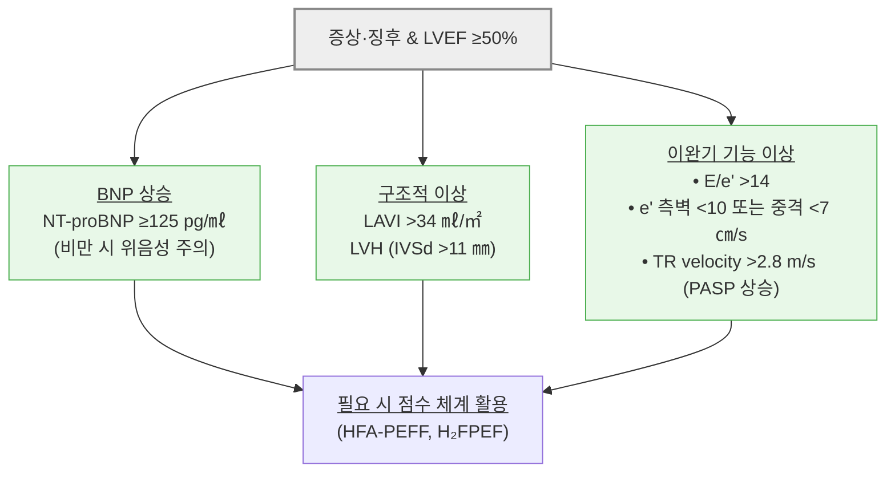
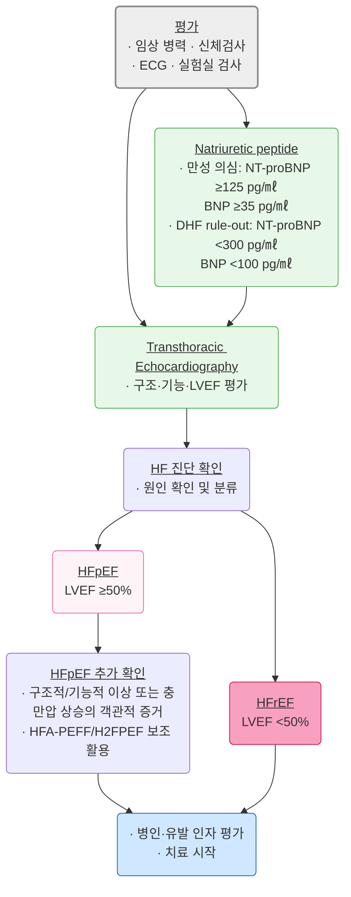
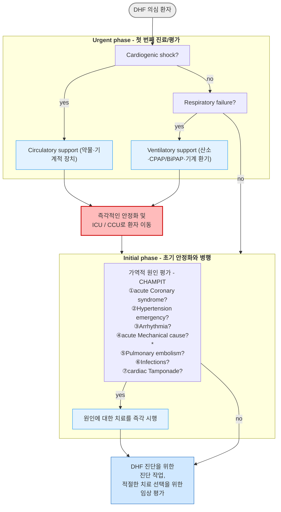

# 심부전 Heart Failure

## <mark style="color:green;">일반 사항</mark>

* 심부전은 다양한 원인에 의해 발생하는 임상 증후군으로, 전형적인 증상 또는 징후와 함께 기저 구조적·기능적 심장 이상에 기인한 폐·전신 울혈 또는 심박출량 변화의 검사실·영상학적 증거가 존재하는 상태이다. 단일 검사로 진단하지 않고 임상 소견, 바이오마커, 영상을 종합하여 판단하며, 나트륨이뇨펩타이드(natriuretic peptide, NP) 상승이 진단의 필수조건은 아님 - 특히 HFpEF에서는 침습적 혈역학 이상이 명확해도 NP가 정상일 수 있음
* HFrEF에서 효과적인 FMT(guideline-directed medical therapy)는 LVEF와 증상이 호전되어 HFimpEF 또는 remission 상태가 되더라도 원칙적으로 유지하며, 장기 추적함

### <mark style="color:orange;">분류</mark>

#### <mark style="color:$primary;">2026 보편적 정의와 ESC 실무 분류</mark>

* 2026 Second Universal Definition of HF는 LVEF의 고정된 단일 절단값만으로 심부전을 기계적으로 분류하는 한계를 강조하면서 **reduced EF, preserved EF, improved EF**의 임상적으로 활용 가능한 개념을 제시함. HF 진단은 증상·징후와 구조적·기능적 심장 이상, 울혈 또는 심박출량 변화의 객관적 증거를 종합하여 판단함
* **2026 ESC 실무 분류**
  * **HFrEF (HF with reduced EF)** : **LVEF <50%**
  * **HFpEF (HF with preserved EF)** : **LVEF ≥50%**
  * **HFmrEF (LVEF 41~49%)는 독립 phenotype에서 삭제**되어 HFrEF에 포함됨
* 기존 문헌·임상시험·일부 급여 기준에서는 **HFmrEF**라는 용어가 계속 사용될 수 있으므로 문헌 해석 시 주의함
* **HFimpEF (HF with improved EF)**는 별도의 고정된 EF phenotype이라기보다 **이전 HFrEF에서 LVEF가 호전된 trajectory**를 나타냄. 2026 보편적 정의에서는 antecedent HFrEF 후 LVEF가 **절대 10%p 이상 증가하여 >40%**가 된 경우를 HFimpEF로 기술함
* LVEF는 측정법·검사자·시점에 따른 변동성이 있으므로 **50%를 절대적인 진단 경계로 기계적으로 적용하지 않음**. 특히 치료 선택에서는 개별 치료의 근거가 되는 별도 EF 기준(예: ICD/CRT ≤35%, ivabradine ≤35%, digoxin/digitoxin ≤40%)을 함께 적용함

#### <mark style="color:$primary;">HF의 동적 경과</mark>

<table><thead><tr><th width="130">경과</th><th>정의</th></tr></thead><tbody><tr><td><strong>Improvement</strong></td><td>LVEF가 호전되었지만 구조적 이상, 바이오마커 상승 또는 임상적 이상이 남아 있는 상태</td></tr><tr><td><strong>Remission</strong></td><td>LVEF가 정상화되고 증상이 거의 없으며 바이오마커도 안정적이지만 재발 가능성이 남아 있는 상태</td></tr><tr><td><strong>Recovery</strong></td><td>심장 구조·기능·바이오마커·증상이 장기간 정상화된 상태로, 소수의 환자만 도달</td></tr></tbody></table>

_✽Improvement, remission, recovery는 HFimpEF뿐 아니라 모든 HF 표현형에 적용 가능한 경과 개념임. LVEF 호전만으로 질환이 소실되었다고 판단하지 않으며, 지속적인 임상 감시와 개별화된 치료가 필요함_

#### <mark style="color:$primary;">기능적 분류 (NYHA Functional Classification)</mark>

<table><thead><tr><th width="80">Class</th><th width="393">증상 유발 활동 강도</th><th>신체 활동 제한</th></tr></thead><tbody><tr><td><strong>I</strong></td><td>일상적인 활동으로는 심부전 증상*이 발생하지 않음</td><td>제한 없음</td></tr><tr><td><strong>II</strong></td><td>휴식 시 편안하지만 일상적인 활동으로 심부전 증상이 유발됨</td><td>약간 제한</td></tr><tr><td><strong>III</strong></td><td>휴식 시 편안하지만 일상적인 것보다 작은 활동으로도 증상 유발</td><td>상당한 제한</td></tr><tr><td><strong>IV</strong></td><td>휴식 시에도 증상 발생. 어떤 신체 활동도 불편함 증가</td><td>모든 활동 제한</td></tr></tbody></table>

_✽심부전 증상 : 호흡 곤란(dyspnea), 피로(fatigue), 운동 내성 저하(reduced exercise tolerance)_

## <mark style="color:green;">원인</mark>

심부전의 원인을 단순히 허혈성·비허혈성으로만 구분하지 않고, 교정 가능하거나 표적 치료가 가능한 구체적 병인을 확인함.

<table><thead><tr><th width="180">병인군</th><th>대표 질환·상태</th></tr></thead><tbody><tr><td><strong>허혈성 심근병증</strong></td><td>허혈성 심질환, 심근경색, 관상동맥질환</td></tr><tr><td><strong>고혈압성 심근병증</strong></td><td>고혈압성 심장질환</td></tr><tr><td><strong>판막성 심근병증</strong></td><td>석회화 대동맥판질환, 퇴행성 승모판질환, 류마티스성·선천성 판막질환</td></tr><tr><td><strong>부정맥 관련 심근병증</strong></td><td>조절되지 않는 AF, 빈맥·PVC·심실비동기·우심실 조율 유발 심근병증</td></tr><tr><td><strong>침윤성 심근병증</strong></td><td>심장 아밀로이드증, 혈색소침착증, Fabry병, 당원축적병, 종양 침윤</td></tr><tr><td><strong>감염성 심근병증</strong></td><td>바이러스성 심근염, Chagas병, HIV, Lyme병</td></tr><tr><td><strong>염증성 심근병증</strong></td><td>자가면역질환, sarcoidosis, 과민반응</td></tr><tr><td><strong>독성 심근병증</strong></td><td>약제 유발 심장독성, 알코올·코카인·암페타민 등 물질 사용</td></tr><tr><td><strong>유전성 심근병증</strong></td><td>비대성·확장성·제한성·부정맥유발성 심근병증, 비확장성 좌심실 심근병증</td></tr><tr><td><strong>심낭질환</strong></td><td>수축성·제한성 심낭염</td></tr><tr><td><strong>대사·영양결핍 관련</strong></td><td>비만, 당뇨병, 갑상선질환, thiamine·selenium 결핍, 선천성 대사 이상</td></tr><tr><td><strong>임신 관련 심근병증</strong></td><td>주산기 심근병증</td></tr><tr><td><strong>스트레스 유발 심근병증</strong></td><td>Takotsubo 심근병증</td></tr><tr><td><strong>폐질환·우심부전 관련</strong></td><td>COPD, 간질성 폐질환, 진폐증, 폐동맥고혈압</td></tr><tr><td><strong>선천성 심근병증</strong></td><td>체순환 우심실 부전, Fontan 순환, 교정된 Fallot 4징</td></tr><tr><td><strong>고박출성 심근병증</strong></td><td>혈색소병증·용혈성 빈혈, 동정맥기형, pheochromocytoma 등 내분비 원인</td></tr><tr><td><strong>기타</strong></td><td>신경근육질환, 심내막심근섬유증, Löffler 심내막염 등</td></tr><tr><td><strong>특발성</strong></td><td>원인을 확인하지 못한 심근병증</td></tr></tbody></table>

* 심부전의 원인과 유병 양상은 지역·이주·의료 접근성·사회경제적 환경에 따라 달라질 수 있으므로 환자의 출신 지역과 노출력도 함께 고려함

### <mark style="color:orange;">위험 인자</mark>

* 고혈압, 관상동맥질환/ASCVD, 당뇨병, 비만, CKD, AF, 판막질환, 선천성 심질환, cardiotoxin 노출, 심근병증 가족력·유전적 위험

## <mark style="color:green;">임상 양상</mark>

* 활동 시 호흡 곤란, 운동 능력 저하(피로·전신 약화), 말초 부종(양측 발목 부종)
* 야간 기침(nonproductive 또는 거품/분홍색 가래), orthopnea, 발작성 야간 호흡 곤란(PND)
* Wheezing(특히 야간; cardiac asthma), Cheyne-Stokes respiration, rale, heart murmur, 경정맥 확장
* Advanced HF : 식욕 부진, 우상복부 팽만(hepatic congestion), 복수, 구역, 저혈압, pulsus alternans, 빈맥, narrow pulse pressure, 사지 냉증, 청색증

### <mark style="color:$danger;">🚩 Red Flags!</mark>

<mark style="color:$danger;">**즉각 이송 또는 응급 평가**</mark>

* 급성 호흡 곤란 또는 저산소혈증 (SpO₂ ＜90%); 호흡수 ＞25회/분이면서 호흡곤란이 심한 경우 호흡부전 평가
* 저혈압 여부와 관계없이 지속적인 말초·장기 저관류(사지 냉증, 의식 변화, 소변량 감소, lactate 상승 등) → 심인성 쇼크 의심
* 급성 폐부종 의심(심한 호흡곤란, 기좌호흡, 저산소혈증, diffuse crackle/거품성 가래 등)
* 원인 불명의 심각한 발한 + 흉통 + 실신

<mark style="color:$warning;">**당일 또는 긴급 평가**</mark>

* 증상성 저혈압 또는 관류 저하
* 기저치 대비 s-Cr 급격한 상승
* 새로 발생하거나 악화된 저나트륨혈증
* 새로운 심잡음
* 단기간의 뚜렷한 체중 증가 또는 부종·호흡곤란 악화

<mark style="color:$info;">**외래 추적 / 추가 평가 계획**</mark> <mark style="color:$info;">- 즉각 위험 낮으나 호전 없으면 의뢰</mark>

* NYHA 기능 분류 악화 (I→II, II→III 등)
* 원인 불명의 심부전
* 유전성 심근병증 환자의 1촌 가족: 심장초음파·ECG 및 필요 시 유전상담/검사 평가
* CRT 또는 ICD 삽입 여부 평가 필요

## <mark style="color:green;">진단</mark>

### <mark style="color:orange;">환자 초기 평가</mark>

* 문진, 진찰, 신장/체중(BMI), 기립성 혈압 변화; 심근병증 환자에서 3대 가족력 청취
* 혈액검사 : CBC, 전해질(Ca, Mg), BUN/Cr/eGFR, FBS/HbA1c, 지질, LFT, 철분(혈청 철·페리틴·TSAT), TSH; 위험도 평가에 urine albumin/creatinine ratio(UACR)도 고려
* Biomarkers : BNP, NT-proBNP
  * 연령·성별·신부전·비만·심방세동·약물 등에 영향을 받음. 비만에서는 NP가 낮게 측정될 수 있어 정상치만으로 HF를 배제하지 않음
  * 급성 DHF에서 비특이적 rule-out 기준은 BNP <100 pg/mL 또는 NT-proBNP <300 pg/mL이며, NT-proBNP의 rule-in은 연령에 따라 달라질 수 있음

<table><thead><tr><th width="178">상황</th><th width="200">BNP</th><th>NT-proBNP</th></tr></thead><tbody><tr><td>외래 / 만성 HF 의심</td><td>≥35 pg/㎖</td><td>≥125 pg/㎖</td></tr><tr><td>DHF 의심</td><td>≥100 pg/㎖</td><td>≥300 pg/㎖</td></tr></tbody></table>

* 12-Lead 심전도, 흉부 X선; 혈역학적 불안정 또는 저관류가 의심되면 lactate 측정
* 심초음파 : 구조·기능, LVEF 및 충만압 관련 소견 평가; NP와 함께 임상 상황에 따라 신속히 시행
* 선택적 검사 : 심도자검사, 경식도초음파, 심장 MRI(심근염·침윤성 질환 의심 시), 유전자 검사
* 6분보행검사 : 기능적 능력·치료 반응 평가에 유용하며, 단일 거리 절단값으로 심부전 중증도를 진단하지 않음

### <mark style="color:orange;">Framingham 진단 기준</mark>

* 심부전 진단은 임상적 판단이 우선이며, Framingham 기준은 보조적 도구로 활용; 증상·징후·검사 소견을 종합하여 판단하고, 단일 기준에 의존하지 않음

<table data-search="false"><thead><tr><th width="319">Major criteria</th><th>Minor criteria</th></tr></thead><tbody><tr><td>발작성 야간 호흡 곤란</td><td>양측 발목 부종</td></tr><tr><td>경정맥 팽창</td><td>야간 기침</td></tr><tr><td>폐수포음</td><td>보통의 활동 중 호흡 곤란</td></tr><tr><td>심 비대 (흉부 X선상)</td><td>흉막 삼출</td></tr><tr><td>급성 폐부종</td><td>간 비대</td></tr><tr><td>S3 gallop</td><td>빈맥 (HR ＞120회/분)</td></tr><tr><td>Hepatojugular reflux</td><td>-</td></tr><tr><td>치료 반응으로 5일간 ＞4.5 ㎏ 체중 감소</td><td>-</td></tr></tbody></table>

* 판정 : '2 Major' 또는 '1 Major + 2 Minor'. 현재는 NP·심초음파 등 객관적 평가가 우선이며 Framingham 기준은 보조적·역사적 기준으로 활용

_Ref. The natural history of congestive heart failure: the Framingham study. NEJM 1971;285(26)_

### <mark style="color:orange;">HFpEF 진단</mark>


**HFpEF는 LVEF ≥50%와 증상만으로 진단하지 않음.** 심부전 증상·징후와 함께 구조적 심장 이상, 이완기 기능 이상 또는 좌심실 충만압 상승 등의 객관적 증거가 필요하며, NP는 지지적 소견이나 정상이라고 HFpEF를 배제할 수 없음. HFA-PEFF 및 H2FPEF는 불확실한 경우의 보조 도구로 활용함


<mark style="color:cyan;">**진단 단계**</mark>


```mermaid
flowchart TD
    A["증상·징후 & LVEF ≥50%"] --> B["<u>BNP 상승</u>\nNT-proBNP ≥125 pg/㎖\n(비만 시 위음성 주의)"]
    A --> C["<u>구조적 이상</u>\nLAVI >34 ㎖/㎡\nLVH (IVSd >11 ㎜)"]
    A --> D["<u>이완기 기능 이상</u>\n• E/e' >14\n• e' 측벽 <10 또는 중격 <7 ㎝/s\n• TR velocity >2.8 m/s (PASP 상승)"]
    B --> E["<u>필요 시 점수 체계 활용</u>\n(HFA-PEFF, H₂FPEF)"]
    C --> E
    D --> E

style A fill:#eeeeee,stroke:#888888,stroke-width:2px
classDef lightGreen fill:#e8f8e8,stroke:#4caf50
class B,C,D lightGreen
```

<mark style="color:cyan;">H2FPEF / HFA-PEFF Score</mark>

<table><thead><tr><th width="160">Score</th><th width="300">구성 요소</th><th>해석</th></tr></thead><tbody><tr><td><a href="https://www.cvdapp.com/calculator/hfa-peff_and_h2fpef_score"><strong>H2FPEF score</strong></a></td><td>BMI ＞30 kg/m² (2점), 항고혈압제 ≥2종 복용 (1점), paroxysmal 또는 persistent AF (3점), PASP ＞35 mmHg (1점), 연령 ＞60세 (1점), E/e' ＞9 (1점)</td><td>0~1점: HFpEF 낮음; 6~9점: 높음; 중간은 부하 검사 고려</td></tr><tr><td><a href="https://www.cvdapp.com/calculator/hfa-peff_and_h2fpef_score"><strong>HFA-PEFF score</strong></a></td><td>기능적(E/e'·GLS), 형태적(LAVI·LVH), 바이오마커(BNP/NT-proBNP), 운동부하 기준</td><td>≥5점: HFpEF 확진; 2~4점: 운동부하 검사; 0~1점: 비가능성</td></tr></tbody></table>

***


```mermaid
graph TD
    A("<u>평가</u>\n· 임상 병력 · 신체검사\n· ECG · 실험실 검사")
style A fill:#eeeeee,stroke:#888888,stroke-width:2px
    B("<u>Natriuretic peptide</u>\n· 만성 의심: NT-proBNP ≥125 pg/㎖\nBNP ≥35 pg/㎖\n· DHF rule-out: NT-proBNP <300 pg/㎖\nBNP <100 pg/㎖")
    C("<u>Transthoracic Echocardiography</u>\n· 구조·기능·LVEF 평가")
classDef lightGreen fill:#e8f8e8,stroke:#4caf50
class B,C lightGreen
    D("<u>HF 진단 확인</u>\n· 원인 확인 및 분류")
    G("<u>HFrEF</u>\nLVEF <50%")
    E("<u>HFpEF</u>\nLVEF ≥50%")
style E fill:#fef4f8,stroke:#f06baf
style G fill:#f8a0c0,stroke:#d01f5a
    HFPEF_DIAG("<u>HFpEF 추가 확인</u>\n· 구조적/기능적 이상 또는 충만압 상승의 객관적 증거\n· HFA-PEFF/H2FPEF 보조 활용")
    H("· 병인·유발 인자 평가\n· 치료 시작")
style H fill:#d0e8ff,stroke:#1a6abf
    A --> B
    A --> C
    B --> C
    C --> D
    D --> G
    D --> E
    E --> HFPEF_DIAG
    HFPEF_DIAG --> H
    G --> H
```

<p align="center"><strong>HF 및 EF 기반 분류를 위한 진단 알고리듬(2026 ESC)</strong></p>

<p align="center"><em><mark style="color:$info;">Ref. 2026 ESC Guidelines for the management of heart failure.</mark></em></p>

### <mark style="color:orange;">감별 진단</mark>

<table><thead><tr><th width="125">질환</th><th width="250">HF와의 차이점</th><th>핵심 감별 포인트</th></tr></thead><tbody><tr><td>COPD·천식</td><td>호흡곤란·야간 wheezing으로 HF와 혼동(cardiac asthma)</td><td>폐기능 검사, NP가 진단에 도움이 되나 정상치만으로 HF 배제 불가, 흉부 X선상 심비대·폐부종 소견 없음</td></tr><tr><td>폐색전증</td><td>급성 호흡곤란·저산소증 공존 가능</td><td>D-dimer, CT-PA; 급성 발생·흉통·위험 인자(부동·수술 등) 확인</td></tr><tr><td>만성 신질환 (체액 과부하)</td><td>부종·호흡곤란 유사</td><td>BUN/Cr·단백뇨, 심초음파상 EF·충만압 정상 여부</td></tr><tr><td>간경변·저알부민혈증</td><td>하지 부종·복수 유사</td><td>LFT·알부민, 경정맥 확장 없음, NP 및 임상 소견을 종합</td></tr><tr><td>정맥부전·림프부종</td><td>양측 또는 편측 하지 부종</td><td>호흡곤란·기좌호흡 없음, NP 및 임상 소견을 종합, 필요 시 하지 정맥 초음파</td></tr><tr><td>비만·탈조건화</td><td>운동 시 호흡곤란·피로</td><td>NP 및 심초음파 소견을 종합, 운동부하 검사로 감별</td></tr></tbody></table>

***

## <mark style="background-color:$warning;">Management</mark>

### <mark style="color:orange;">HF phenotype별 약물 치료 요약</mark>

<table><thead><tr><th width="114">HF phenotype</th><th width="114">LVEF</th><th>우선 권고 약제</th></tr></thead><tbody><tr><td><strong>HFrEF</strong></td><td>&lt;50%</td><td><strong>FMT</strong> : SGLT2i + MRA + β-blocker + ACEi/ARNI/ARB; 증상성 울혈에는 loop diuretic. LVEF 41~49%는 별도 HFmrEF로 분류하지 않으며 HFrEF 치료 원칙을 적용하되 근거 수준을 고려함</td></tr><tr><td><strong>HFpEF</strong></td><td>≥50%</td><td><strong>FMT</strong> : SGLT2i + MRA; 울혈 시 loop diuretic. ACEi/ARB/ARNI는 고혈압·특정 phenotype에서 HF 입원 감소 목적으로 고려. 비만(BMI ≥30) + 증상성 HF에서는 semaglutide 또는 tirzepatide 고려</td></tr><tr><td><strong>HFimpEF</strong></td><td>이전 HFrEF<br>→ LVEF 호전</td><td>원칙적으로 FMT를 최고 내약 용량으로 유지하고 장기 추적. 매우 선택적인 무증상 환자에서 가역 원인 교정 및 LV 기능·용적·NP가 완전히 정상화된 경우에만 면밀한 감시하에 단계적 감량을 고려</td></tr></tbody></table>

_✽2026 ESC에서는 기존의 FMT라는 포괄적 용어 대신 **foundational medical therapy (FMT)**, **additional medical therapy (AMT)**, **guideline-directed interventional therapy (GDIT)**를 사용함. FMT는 심부전 환자 전반에서 입원/사망 감소 근거가 확립된 치료를 의미함._

### <mark style="color:orange;">비대상성 심부전(Decompensated Heart Failure, DHF) 초기 관리</mark>

* 2026 ESC에서는 'acute heart failure'보다 **decompensated heart failure (DHF)**라는 용어를 사용함. 초기에는 혈역학·호흡 안정화와 함께 CHAMPIT 가역적 원인을 병행 평가·치료

<mark style="color:cyan;">**CHAMPIT 감별**</mark>

<table><thead><tr><th width="230">원인</th><th>주요 감별 방법</th></tr></thead><tbody><tr><td>acute <strong>C</strong>oronary syndrome</td><td>심전도, 고감도 troponin, 필요 시 관상동맥 평가</td></tr><tr><td><strong>H</strong>ypertensive emergency</td><td>혈압 측정 및 급성 장기손상 평가</td></tr><tr><td><strong>A</strong>rrhythmia</td><td>심전도, 지속 심전도 모니터링</td></tr><tr><td>acute <strong>M</strong>echanical cause</td><td>즉각 심초음파(급성 MR, VSD, 판막성 합병증, 대동맥 박리 등)</td></tr><tr><td><strong>P</strong>ulmonary embolism</td><td>임상 확률에 따른 D-dimer/CTPA 등</td></tr><tr><td><strong>I</strong>nfection / Inflammation</td><td>병력·진찰, CBC/CRP 및 원인별 검사; 심근염 등 고려</td></tr><tr><td><strong>T</strong>amponade</td><td>심초음파 중심 평가</td></tr></tbody></table>

<mark style="color:cyan;">**DHF 임상 표현형별 초기 치료**</mark>

<table><thead><tr><th>임상 표현형</th><th>주요 특징</th><th>초기 치료 방향</th></tr></thead><tbody><tr><td><strong>비대상성 좌심부전</strong></td><td>좌측 울혈 중심</td><td>울혈 시 정맥 loop diuretic; SBP가 충분히 높으면 혈관확장제 고려</td></tr><tr><td><strong>비대상성 우심부전</strong></td><td>우측 울혈·저충만 또는 RV 기능저하</td><td>원인(PE, RV infarction 등) 평가와 함께 체액 상태를 개별화하여 조절</td></tr><tr><td><strong>급성 폐부종</strong></td><td>급격한 호흡부전·저산소혈증</td><td>저산소혈증 시 산소, 호흡곤란/호흡부전 시 NIV; 고혈압이면 혈관확장제 고려</td></tr><tr><td><strong>심인성 쇼크</strong></td><td>지속적인 조직·장기 저관류</td><td>원인 치료, Shock Team 평가, 필요 시 vasopressor/inotrope 및 기계적 순환보조</td></tr></tbody></table>

**DHF 울혈 치료의 실무 포인트 (2026 ESC)**

* 체액 과부하가 있는 환자는 정맥 loop diuretic을 사용함. 이뇨제 미사용자는 일반적으로 furosemide 40 ㎎ IV로 시작하고, 만성 loop diuretic 사용자는 기존 1일 경구 용량의 약 2배를 IV로 고려함(신기능·울혈 정도에 따라 개별화)
* 투여 후 약 2시간에 spot urine Na **≥70 mmol/L** 또는 6시간 urine output **≥100 mL/h**이면 적절한 초기 반응으로 판단할 수 있음
* 반응이 불충분하면 loop diuretic 용량을 증량하고, 지속적인 체액 과부하에서는 acetazolamide 500 ㎎ IV 1일 1회 또는 신기능에 따른 hydrochlorothiazide 병용을 고려
* 저산소혈증(SpO₂ ＜90% 또는 PaO₂ ＜60 mmHg)에서는 산소를 투여하고, 호흡수 ＞25회/분이면서 SpO₂ ＜90%인 호흡곤란에서는 NIV를 조기에 고려함. 산소/NIV에도 진행성 호흡부전이면 삽관을 고려
* 혈역학적 불안정이나 심인성 쇼크가 의심되면 lactate를 포함한 저관류 평가와 Shock Team 평가를 병행함


```mermaid
flowchart TD
    START(["DHF 의심 환자"])
    style START fill:#eeeeee,stroke:#888888,stroke-width:2px

    subgraph URGENT["<b>Urgent phase - 첫 번째 진료/평가"]
        direction TB
        Q1["Cardiogenic shock?"]
        Q2["Respiratory failure?"]
        Q1S["Circulatory support (약물·기계적 장치)"]
        Q2S["Ventilatory support (산소·CPAP/BiPAP·기계 환기)"]
        classDef sky fill:#e3f2ff,stroke:#2196f3
        class Q1S,Q2S sky

    end

    ICU["즉각적인 안정화 및\nICU / CCU로 환자 이동"]
    style ICU fill:#fbb,stroke:#c00,stroke-width:2px

    subgraph IMMEDIATE["<b>Initial phase - 초기 안정화와 병행"]
        direction TB
        CAUSE["가역적 원인 평가 - CHAMPIT\n①acute Coronary syndrome?\n②Hypertension emergency?\n③Arrhythmia?\n④acute Mechanical cause?*\n⑤Pulmonary embolism?\n⑥Infections?\n⑦cardiac Tamponade?"]
        TREAT["원인에 대한 치료를 즉각 시행"]
        style TREAT fill:#e3f2ff,stroke:#2196f3
    end

    WORKUP["DHF 진단을 위한\n진단 작업,\n적절한 치료 선택을 위한\n임상 평가"]
    style WORKUP fill:#d0e8ff,stroke:#1a6abf

    START --> Q1
    Q1 -->|yes| Q1S
    Q1 -->|no| Q2
    Q2 -->|yes| Q2S
    Q1S --> ICU
    Q2S --> ICU
    Q2 -->|no| IMMEDIATE
    ICU --> IMMEDIATE
    CAUSE -->|yes| TREAT
    CAUSE -->|no| WORKUP
    TREAT --> WORKUP

```

<p align="center"><strong>비대상성 심부전(DHF) 환자의 초기 관리 알고리듬</strong></p>

<p align="center"><em><mark style="color:$info;">Ref. 2026 ESC Guidelines for the management of heart failure. Figure 13.</mark></em></p>

***

### <mark style="color:orange;">Stage A~D 분류 및 치료 전략 (2026 ESC / 2026 Second Universal Definition)</mark>

#### <mark style="color:$primary;">Stage A : HF 위험군</mark>

* 현재 또는 과거의 HF 증상·징후와 구조적 심장 변화, 심장질환을 시사하는 바이오마커 상승이 없는 상태에서 HF 위험 인자가 존재하는 단계
* 주요 위험 인자 : 고혈압, ASCVD, 선천성 심질환, T2DM, 비만, CKD, AF, cardiotoxin 노출, 심근병증 가족력 또는 유전적 위험

**관리**

1. 건강한 체중·식사, 규칙적 신체활동, 금연 및 과도한 음주 회피
2. 고혈압 : 수축기 혈압 **<130 ㎜Hg**를 목표로 개별화된 치료
3. T2DM + 심혈관 위험 : SGLT2i; 비만/대사 위험이 있는 경우 GLP-1 RA도 적응증에 따라 고려
4. T2DM + CKD : SGLT2i 및 적응증에 따른 finerenone
5. 고위험군에서 NP 및 다변수 risk score를 이용한 위험 평가를 개별화하여 고려

#### <mark style="color:$primary;">Stage B : Pre-HF</mark>

* HF 증상·징후가 현재 또는 과거에 없으면서 구조적·기능적 이상 또는 NP/cardiac troponin 상승 등 심장 이상에 대한 객관적 증거가 있는 상태

**관리**

1. **LVEF ≤40%** : ACEi(또는 불내성 시 ARB) 권고
2. **LVEF <50%의 무증상 LV 수축기 기능저하** : β-blocker 권고
3. 심근경색 후 **LVEF ≤40% + HF 징후 또는 당뇨병** : eplerenone 고려/권고
4. MI/ASCVD 등 동반 질환은 해당 가이드라인에 따라 적극 치료
5. LVEF가 감소된 환자에서 TZD 및 non-DHP CCB(verapamil·diltiazem) 등 HF를 악화시킬 수 있는 약제는 회피

***
#### <mark style="color:$primary;">Stage C : 증상성 HF</mark>

* 구조적 또는 기능적 심장 이상과 현재 또는 과거의 HF 증상·징후가 있는 상태

**비약물적 중재**

1. 예방접종(인플루엔자, 폐렴구균, COVID-19, RSV 등)은 연령·국가 권고 및 개인 위험도에 따라 시행
2. 우울증·불안·사회적 고립·허약 및 자기관리 능력 선별
3. 규칙적인 신체활동과 심장 재활; 과도한 나트륨 섭취를 피하고 식사·체중을 개별화하여 관리

**약물적 중재**

* **HFrEF (LVEF <50%)** : FMT로 SGLT2i + MRA + β-blocker + ACEi/ARNI/ARB를 가능한 한 조기에 시작하고 1~2주 간격으로 내약성에 따라 증량. 이뇨제는 울혈이 있는 경우 사용
* **HFpEF (LVEF ≥50%)** : SGLT2i + MRA를 기본 치료로 고려하고, 울혈 시 loop diuretic. ACEi/ARB/ARNI는 고혈압 또는 특정 phenotype에서 HF 입원 감소 목적으로 고려. β-blocker는 HFpEF 자체의 예후 개선 목적으로 일률적으로 사용하지 않고 AF 심박수 조절·협심증 등 별도 적응증이 있을 때 사용
* **비만(BMI ≥30) + 증상성 HF, LVEF ≥45%** : semaglutide 또는 tirzepatide를 체중 감소와 운동능력·삶의 질 개선 목적으로 고려
* 증상 지속 시 AMT를 환자 특성에 따라 추가하고, 적응증이 되면 ICD/CRT 등 GDIT 평가

**HFrEF 초기 약물 시작 및 titration**

<table><thead><tr><th width="160">시기</th><th>조치</th></tr></thead><tbody><tr><td>진단 후 가능한 한 조기에</td><td>FMT 4개 약제군을 가능한 한 병행 시작하고 혈압·신기능·전해질·울혈 상태에 따라 개별화</td></tr><tr><td>1~2주 간격</td><td>증상·혈압·맥박·Cr/eGFR·K 등을 확인하며 내약 가능한 범위에서 각 약제를 증량</td></tr><tr><td>약제 최적화 후 약 3개월</td><td>LVEF·증상·기능 상태 재평가; ICD/CRT 등 GDIT 적응증 평가</td></tr></tbody></table>

#### <mark style="color:$primary;">Stage D : Advanced HF</mark>

* 최적 치료에도 휴식 또는 최소 활동에서 중증 증상, 반복적인 HF 입원/악화, 난치성 울혈·저관류, FMT/AMT 불응·불내성 등이 지속되어 advanced HF 치료가 필요한 상태
* **전문센터 의뢰** : 반복 입원, 지속적 저혈압·저나트륨혈증·신기능 악화, 이뇨제 저항성, 강심제 의존, 장기 저관류, LVAD/심장이식/MCS 평가 필요 등이 있으면 조기에 의뢰
* INTERMACS profile, CPET, 장기 기능 및 frailty 등을 종합하여 기계적 순환보조·심장이식·완화의료의 시기를 결정

### <mark style="color:orange;">Stage별 관리 요약</mark>

<table><thead><tr><th width="120">Stage</th><th width="158">특징</th><th>주요 관리 전략</th></tr></thead><tbody><tr><td><strong>Stage A</strong><br>(HF 위험군)</td><td>증상/징후 없음<br>구조적 이상·심장 바이오마커 상승 없음<br>위험 인자 존재</td><td>· 생활습관·혈압·당뇨·비만·CKD·ASCVD 등 위험 인자 관리<br>· T2DM + 심혈관 위험에서는 SGLT2i 등 적응증 기반 예방 치료</td></tr><tr><td><strong>Stage B</strong><br>(Pre-HF)</td><td>증상/징후 없음<br>구조적·기능적 이상 또는 심장 바이오마커 이상</td><td>· LVEF ≤40%에서 ACEi/ARB<br>· LVEF <50% 무증상 LV 수축기 기능저하에서 β-blocker<br>· 선택된 post-MI 환자에서 eplerenone<br>· 원인·위험 인자 적극 치료</td></tr><tr><td><strong>Stage C</strong><br>(증상성 HF)</td><td>구조적/기능적 심장 이상<br>+ 현재/과거 증상·징후</td><td>· HFrEF: SGLT2i + MRA + β-blocker + ACEi/ARNI/ARB<br>· HFpEF: SGLT2i + MRA; 울혈 시 loop diuretic<br>· 비만 HF(LVEF ≥45%)에서는 semaglutide/tirzepatide 고려<br>· ICD/CRT 등 GDIT 평가</td></tr><tr><td><strong>Stage D</strong><br>(Advanced HF)</td><td>난치성 증상·반복 악화<br>FMT/AMT 불응·불내성</td><td>· Advanced HF 전문센터 조기 의뢰<br>· LVAD/MCS, 심장이식, 완화의료 및 임상시험 고려</td></tr></tbody></table>

***


## <mark style="color:green;">비-약물 치료 및 예방</mark>

* 금연, 금주
* 소금 섭취 : 모든 환자에게 획일적인 극단적 나트륨 제한을 적용하지 않으며, 과도한 염분 섭취를 피하고 울혈·동반질환에 따라 개별화
* 수분 섭취 제한 : 모든 환자에게 일률적으로 필요하지 않으며, 중증 울혈·저나트륨혈증 등 선택된 환자에서 개별화
* 체중 관리 : 비만 시 체중 감량; 매일 체중 측정 → 2\~3일 내 ≥2 ㎏ 증가 시 신속 진료
* 심장 재활 및 규칙적 운동 : 걷기·자전거 등 유산소 운동과 근력운동을 환자의 기능 상태에 맞춰 점진적으로 시행. 운동 중 증상·혈압·맥박을 고려하여 강도를 개별화
* 동반 질환 치료 : 고혈압, 부정맥, 수면무호흡증, 당뇨병, 이상지질혈증
* 스트레스 관리, 우울증 치료 (우울증은 HF 예후 악화; 적극적 선별·치료)
* 예방접종 : 인플루엔자, 폐렴구균, COVID-19, RSV 등은 연령·국가 권고 및 개인 위험도에 따라 시행
* 자가 모니터링 교육 : 체중·부종·호흡곤란 변화, 약물 순응도, 악화 시 의료기관 접촉 시점을 교육

***

## <mark style="color:green;">약물 치료</mark>

### <mark style="color:orange;">심부전의 주요 약제 및 용량</mark>

<table data-search="false"><thead><tr><th width="272">Drug</th><th width="212">시작 용량 (㎎)</th><th>목표 용량 (㎎)</th></tr></thead><tbody><tr><td><strong>ACEi</strong></td><td></td><td></td></tr><tr><td>captopril <mark style="color:blue;">[카프릴]</mark></td><td>6.25 tid</td><td>50 tid</td></tr><tr><td>enalapril <mark style="color:blue;">[레니프릴]</mark></td><td>2.5 bid</td><td>10–20 bid</td></tr><tr><td>lisinopril <mark style="color:blue;">[제스트릴]</mark></td><td>2.5–5 qd</td><td>20–40 qd</td></tr><tr><td>perindopril <mark style="color:blue;">[아서틸]</mark></td><td>2 qd</td><td>8–16 qd</td></tr><tr><td>ramipril <mark style="color:blue;">[트리테이스]</mark></td><td>1.25–2.5 qd</td><td>10 qd</td></tr><tr><td>trandolapril <em>(국내 유통 확인 필요)</em></td><td>1 qd</td><td>4 qd</td></tr><tr><td><strong>ARB</strong></td><td></td><td></td></tr><tr><td>candesartan <mark style="color:blue;">[아타칸]</mark></td><td>4–8 qd</td><td>32 qd</td></tr><tr><td>losartan <mark style="color:blue;">[코자]</mark></td><td>25–50 qd</td><td>50–150 qd</td></tr><tr><td>valsartan <mark style="color:blue;">[디오반]</mark></td><td>20–40 bid</td><td>160 bid</td></tr><tr><td><strong>ARNi</strong></td><td></td><td></td></tr><tr><td>sacubitril/valsartan <mark style="color:blue;">[엔트레스토]</mark></td><td>24/26 bid 또는 49/51 bid</td><td>97/103 bid</td></tr><tr><td><strong>I</strong><sub><strong>f</strong></sub><strong> Channel inhibitor</strong></td><td></td><td></td></tr><tr><td>ivabradine <mark style="color:blue;">[프로코라란]</mark></td><td>5 bid</td><td>7.5 bid</td></tr><tr><td><strong>Beta-blockers</strong></td><td></td><td></td></tr><tr><td>bisoprolol <mark style="color:blue;">[콩코르]</mark></td><td>1.25 qd</td><td>10 qd</td></tr><tr><td>carvedilol <mark style="color:blue;">[딜라트렌]</mark></td><td>3.125 bid</td><td>25–50 bid</td></tr><tr><td>carvedilol CR</td><td>10 qd</td><td>80 qd</td></tr><tr><td>metoprolol succinate <mark style="color:blue;">[푸로롤서방]</mark></td><td>12.5–25 qd</td><td>200 qd</td></tr><tr><td>nebivolol <mark style="color:blue;">[네비레트]</mark></td><td>1.25 qd</td><td>10 qd</td></tr><tr><td><strong>MRA</strong></td><td></td><td></td></tr><tr><td>spironolactone <mark style="color:blue;">[알닥톤]</mark></td><td>12.5–25 qd</td><td>25–50 qd</td></tr><tr><td>eplerenone <mark style="color:blue;">[인스프라]</mark></td><td>25 qd</td><td>50 qd</td></tr><tr><td><strong>SGLT2i</strong></td><td></td><td></td></tr><tr><td>dapagliflozin <mark style="color:blue;">[포시가]</mark></td><td>10 qd</td><td>10 qd</td></tr><tr><td>empagliflozin <mark style="color:blue;">[자디앙]</mark></td><td>10 qd</td><td>10 qd</td></tr><tr><td><strong>Soluble guanylate cyclase stimulator</strong></td><td></td><td></td></tr><tr><td>vericiguat <mark style="color:blue;">[베르쿠보]</mark></td><td>2.5 qd</td><td>10 qd</td></tr><tr><td>digoxin <mark style="color:blue;">[디곡신]</mark></td><td>0.125–0.25 qd</td><td>목표 혈중 농도 0.5–0.9 ng/㎖</td></tr><tr><td><strong>Isosorbide dinitrate &#x26; Hydralazine</strong></td><td></td><td></td></tr><tr><td>isosorbide dinitrate <mark style="color:blue;">[이소켓]</mark></td><td>20 tid</td><td>40 tid (120 ㎎/d)</td></tr><tr><td>hydralazine <mark style="color:blue;">[히드랄라진]</mark></td><td>25 tid</td><td>75 tid (225 ㎎/d)</td></tr></tbody></table>

_✽단기 제제 제외; serum digoxin 농도 유지_\
\&#x20;_Ref. AHA/ACC/HFSA Guideline for the Management of Heart Failure. 2022. Table 14; doses retained for practical reference._

### <mark style="color:orange;">약제별 titration 체크리스트</mark>

<table><thead><tr><th width="149">약제</th><th width="176">증량 전 확인 항목</th><th width="304">목표 / 주의 기준</th></tr></thead><tbody><tr><td><strong>ACEi / ARNi</strong></td><td>BP · Cr · K</td><td>SBP ＞90; Cr 상승 &#x3C;30%; K &#x3C;5.5</td></tr><tr><td><strong>Beta-blocker</strong></td><td>HR · BP · 울혈 여부</td><td>HR ＞50; SBP ＞90; 체액 과부하 없음</td></tr><tr><td><strong>MRA</strong></td><td>Cr · K · eGFR</td><td>eGFR ≥30; K <5.0 시작; 이후 K/eGFR에 따라 모니터링</td></tr><tr><td><strong>SGLT2i</strong></td><td>eGFR · 감염 여부</td><td>개별 약제 허가사항 참고 (약제마다 eGFR 기준 상이); 수술·금식 48h 전 중단</td></tr></tbody></table>

#### <mark style="color:$primary;">ACEi</mark>

* 작용 : afterload 감소
* 용법 : 저용량 시작 → 2주 후 2배 증량 → 1\~3개월에 걸쳐 titration; β-차단제 병용 시 추가 효과
* 금기/회피 : 임신, ACEi 관련 혈관부종 병력 등
* 주의 : 저혈압, 고칼륨혈증, 급격한 신기능 악화, 양측 신동맥 협착 등

#### <mark style="color:$primary;">ARB</mark>

* ACEi 또는 ARNI를 사용할 수 없는 경우 대체 선택지; 특히 ACEi/ARNI 불내성에서 사용
* **주의** : ACEi와 동일 (✽ARB도 혈관부종 유발 가능)

#### <mark style="color:$primary;">β-차단제</mark>

* 대상 : 안정된 증상성 HFrEF에서 권고. 무증상 LV 수축기 기능저하(Stage B)에서도 LVEF <50%이면 β-blocker를 고려/권고
* 용법 : 저용량 시작 → 1\~4주 간격으로 증량; 초기 일시적 울혈·무력감·피로 악화 가능
* 증상성 저혈압·서맥 또는 울혈 악화 시 다른 혈관작용 약제·이뇨제·심박수 조절 약제를 함께 검토하고 β-blocker 감량 여부를 개별화

#### <mark style="color:$primary;">Mineralocorticoid receptor antagonist (MRA)</mark>


**MRA 계열 구분**

* **Spironolactone, Eplerenone** : HFrEF의 FMT 구성 약제. Spironolactone/Eplerenone은 HFrEF에서 사망률·입원율 감소 근거가 있으며, HFpEF에서는 finerenone 등 nsMRA의 근거가 반영됨
* **Finerenone** <mark style="color:blue;">\[케렌디아]</mark> (비 steroidal MRA) : 2026 ESC에서는 HFpEF를 포함한 증상성 HF의 MRA 치료 선택지로 근거가 반영됨. 국내 허가사항·급여 기준과 eGFR/K 조건을 확인


* 대상 : 증상성 HF에서 MRA 적응증을 확인하고 eGFR ≥30 mL/min/1.73 m² 및 K <5.0 mEq/L 등을 확인하여 시작; 시작 후 조기에 K/eGFR 재평가. HFrEF에서는 spironolactone/eplerenone, HFpEF에서는 finerenone을 포함한 nsMRA 근거를 고려
* 부작용 : K↑(1주·4주 후 모니터링), 여성형유방증(spironolactone)
* Finerenone : 2026 ESC에서는 증상성 HF 전반에서 MRA 선택지로 포함되며, 특히 HFpEF에서는 nsMRA(finerenone)의 근거가 반영됨. 실제 처방은 국내 허가사항·급여 기준을 확인

#### <mark style="color:$primary;">SGLT2i</mark>

(☞ 당뇨병 챕터 참조)

* 작용 : 혈압↓, 체중↓, ASCVD 위험↓, HF 입원↓, eGFR 저하 지연
* 대상 : 증상성 HF에서 LVEF와 무관하게 dapagliflozin 또는 empagliflozin 권고(Class I, 2026 ESC); T2DM·CKD 등에서는 해당 질환의 적응증도 함께 고려
* eGFR 기준 : 개별 약제 허가사항을 반드시 최신 버전으로 재확인할 것 (empagliflozin과 dapagliflozin의 eGFR 하한선이 다르며, 허가 기준이 지속 업데이트됨)
* 부작용 : 요로/생식기 감염, 케톤산증, LDL-C↑


**SGLT2i 심부전 적응증 급여**\
비당뇨 HF 환자에서도 dapagliflozin·empagliflozin의 HF 적응증 급여가 인정되나, LVEF 구간(HFrEF/HF with LVEF <50%/HFpEF)별 급여 기준 및 병용 조건이 약제·시기에 따라 다를 수 있음\
✽정확한 급여 기준은 HIRA 고시를 반드시 확인할 것 (기준 변경 가능)


#### <mark style="color:$primary;">ARNi (Angiotensin Receptor Neprilysin Inhibitor)</mark>

* sacubitril + valsartan 복합제 <mark style="color:blue;">\[엔트레스토]</mark>
* 대상 : 증상성 HFrEF에서 ACEi/ARNI가 적절한 환자에게 사용. 2026 ESC는 ACEi 또는 ARNI를 Class I로 권고하며, ACEi/ARB에서 ARNI로의 전환도 권고
* enalapril보다 유효하나 저혈압 부작용 빈도 높음
* ACEi의 마지막 투약 36시간 이내 투여 금지 (혈관부종 위험)


**엔트레스토 급여 기준**\
국내 급여는 허가사항과 HIRA 고시에 따른 세부 요건이 적용되므로 처방 전 최신 기준 확인 필요\
✽정확한 급여 기준은 HIRA 고시를 반드시 확인할 것 (기준 변경 가능)


### <mark style="color:orange;">기타 / 증상 개선 약제</mark>

#### <mark style="color:$primary;">이뇨제</mark>

* 적용 : fluid overload, DHF 초기 울혈의 신속한 개선
* 최소 유효 용량 시작; 고령자 용량 적음; thiazide + loop diuretics 병용 시 추가 효과
* 부작용 : Na↓, K↓(또는 K↑), Mg↓, 요산↑; 사용 시 주의 : Na ＜135, K ＜3.5 또는 ＞5.0, Cr ＞3.0, Mg ＜1.8, 산증 - 중증 HF에서는 더 심한 저나트륨혈증·신기능 저하에서도 필요 시 loop diuretic을 사용하며, 절대 금기는 아님
* torsemide : furosemide보다 흡수·반감기 우수

<table data-search="false"><thead><tr><th width="280">Drug</th><th width="200">시작 용량 (㎎)</th><th>최대 용량 (㎎)</th></tr></thead><tbody><tr><td><strong>Loop diuretics</strong></td><td></td><td></td></tr><tr><td>furosemide <mark style="color:blue;">[라식스]</mark></td><td>20–40 qd/bid</td><td>600</td></tr><tr><td>bumetanide </td><td>0.5–1.0 qd/bid</td><td>10</td></tr><tr><td>torsemide <mark style="color:blue;">[토르세미드]</mark></td><td>10–20 qd</td><td>200</td></tr><tr><td><strong>Thiazide diuretics</strong></td><td></td><td></td></tr><tr><td>chlorthalidone <mark style="color:blue;">[하이그로톤]</mark></td><td>12.5–25 qd</td><td>100</td></tr><tr><td>hydrochlorothiazide <mark style="color:blue;">[다이크로짇]</mark></td><td>25 qd</td><td>200</td></tr><tr><td>indapamide <mark style="color:blue;">[후루덱스]</mark></td><td>2.5 qd</td><td>5</td></tr><tr><td>metolazone </td><td>2.5 qd</td><td>20</td></tr></tbody></table>

#### <mark style="color:$primary;">Digoxin / Digitoxin</mark>

* 2026 ESC : 최적 FMT에도 증상이 지속되는 **LVEF ≤40%의 증상성 HFrEF**에서 HF 입원 감소 목적으로 cardiac glycoside(digoxin 또는 digitoxin)를 고려할 수 있음(Class IIa). AF 심박수 조절에서도 개별적으로 사용
* Digoxin <mark style="color:blue;">\[디고신]</mark> : 이뇨제 등 기존 치료에도 증상 잔존 또는 AF 심박수 조절이 필요한 경우
* 용법 : 0.125 ㎎/d으로 시작; 신기능 장애·고령·낮은 lean body mass 시 감량; amiodarone·quinidine·verapamil 병용 시 농도 증가
* 부작용 : 구역, 식욕 부진, 혼란, 시각 이상, 부정맥; 저칼륨혈증·신기능 장애 시 독성 증가
* ✽혈중 농도는 낮은 치료 범위를 목표로 하며, 일반적으로 0.5\~0.9 ng/㎖를 사용. 신기능·연령·약물상호작용에 따라 개별화
* 모니터링 : 마지막 투여 후 최소 6~8시간 이후(가능하면 trough에 가깝게) 측정하며 신기능·전해질과 함께 해석

#### <mark style="color:$primary;">항응고제</mark>

* 새로 시작 시 VKA보다 NOAC 우선
  * apixaban <mark style="color:blue;">\[엘리퀴스]</mark>, dabigatran <mark style="color:blue;">\[프라닥사]</mark>, edoxaban <mark style="color:blue;">\[릭시아나]</mark>, rivaroxaban <mark style="color:blue;">\[자렐토]</mark>
* AF 동반 HF : 추가 혈전 위험 인자 없는 경우 개별화 판단 (☞ 심방세동 챕터 참조)

#### <mark style="color:$primary;">기타 약물</mark>

* Ivabradine <mark style="color:blue;">\[프로코라란]</mark> : 증상성 HFrEF, LVEF ≤35%, 동성리듬, 안정 시 HR >70 bpm에서 최대 내약 ACEi/ARNI·MRA·SGLT2i·β-blocker 치료 후 HF 입원/사망 위험 감소 목적으로 고려
* Vericiguat <mark style="color:blue;">\[베르쿠보]</mark> : 최적 FMT에도 증상이 있는 HFrEF, LVEF <45%에서 최근 악화 위험이 높은 환자에게 고려
  * 급여 기준 : 최근 악화(입원 또는 정맥 이뇨제 치료) 병력이 있는 증상성 HFrEF에서 인정; 세부 요건은 HIRA 고시 확인 필요
* 정맥 내 철분 보충 : 증상성 HFrEF 및 철결핍에서 증상·삶의 질 개선 목적으로 권고. 최근 DHF 입원 후 LVEF <50%인 철결핍 환자에서도 재입원 감소 근거를 고려
  * 철결핍 정의 (2026 ESC) : 혈청 페리틴 ＜100 μg/L, 또는 페리틴 100\~299 μg/L + TSAT ＜20%


**Semaglutide / Tirzepatide - 비만 동반 HF에서의 치료 옵션**

* 2026 ESC는 **증상성 HF, LVEF ≥45%, BMI ≥30 kg/m²**에서 당뇨병 유무와 관계없이 semaglutide 또는 tirzepatide를 고려(Class IIa)할 수 있다고 권고함. 목적은 체중 감소와 운동능력·삶의 질 개선이며, HF 악화 사건 감소 가능성도 있으나 장기 심혈관 사망 효과의 확정적 근거로 해석하지 않음
* STEP-HFpEF 프로그램에서는 semaglutide가 KCCQ와 6분보행거리 및 체중을 개선했고, SUMMIT에서는 tirzepatide가 HF 악화 또는 심혈관 사망 복합결과를 감소시켰음. 다만 사건 수가 적어 HF 하드 엔드포인트의 확정적 해석에는 주의가 필요함
* HFrEF에서 비만 치료 목적의 incretin-based therapy는 별도의 근거와 안전성 평가가 필요함. 식사·운동 및 근육량 보존을 함께 관리함
* 실제 처방은 국내 허가사항·급여 기준을 확인함


**권고하지 않음 또는 회피**

* Non-DHP CCB(verapamil·diltiazem) : HFrEF에서 피함(음성 변력작용 및 HF 악화 가능); DHP CCB(amlodipine·felodipine)는 HF 치료 목적은 아니나 병존 고혈압·협심증 등에 필요 시 사용 가능(mortality benefit 없음)
* Class IC 항부정맥제 : HFrEF에서 사망 위험 증가
* TZD : HFrEF에서 HF 증상 악화 및 입원 위험 증가
* DPP-4i 중 saxagliptin은 HF 입원 위험 증가 신호가 있어 HF 고위험 환자에서 주의; alogliptin은 위험 신호가 일관되지 않음
* NSAID : HFrEF에서 HF 증상 악화 가능
* 항응고제 : AF, LV thrombus, VTE 등 별도 적응증이 없는 HF 자체만으로 일률적으로 사용하지 않음
* 비타민·영양제·호르몬 치료 : 특정 결핍 교정 외 권고하지 않음

## <mark style="color:green;">시술 및 기타 처치</mark>

* ICD : 적절한 FMT 후에도 LVEF ≤35%가 지속되는 증상성 HFrEF에서 1차 예방을 고려하며, post-MI·NYHA class·기대여명 등 세부 적응증을 함께 평가
* CRT : LVEF ≤35%인 적절한 HFrEF 환자에서 QRS 폭·LBBB 여부·동성리듬·NYHA class를 종합하여 적응증 평가; 특히 LBBB + QRS ≥150 ms에서 근거가 가장 강함
* Mitral TEER : 최적 FMT/CRT에도 중증 secondary MR이 지속되는 적절한 HFrEF 환자에서 평가
* LVAD/MCS : Stage D 또는 cardiogenic shock 등에서 전문센터와 적응증 평가
* 심장 이식 : advanced HF의 적절한 후보에서 평가

***

### <mark style="color:orange;">주요 참고문헌 및 최신 지침</mark>

- 2026 ESC Guidelines for the management of heart failure. Eur Heart J. 2026; doi:10.1093/eurheartj/ehag100.
- AHA/ACC/ESC/WHF Expert Consensus Document: Second Universal Definition of Heart Failure (2026). Eur Heart J. 2026;47:4357-4374. doi:10.1093/eurheartj/ehag500.
- 2026 ACC Expert Consensus Decision Pathway for Management of HFpEF. JACC. 2026. doi:10.1016/j.jacc.2026.06.018.
- AHA/ACC/HFSA Guideline for the Management of Heart Failure. Circulation. 2022;145:e895-e1032.

***

### <mark style="color:red;">질병코드</mark>

I50 심부전\
I50.0 울혈성 심부전\
I50.1 좌심실 부전\
I50.9 상세불명의 심부전

***

## <mark style="color:purple;">처방례</mark>

> **처방례 1. Stage A - T2DM + 심혈관 고위험군**
>
> ```
> 포시가 10 ㎎/T  1T  qd
> (또는 자디앙 10 ㎎/T  1T  qd)
> ```
>
> _✽심부전 예방 목적만으로가 아니라 T2DM의 심혈관 위험 감소 적응증에 따라 사용. HbA1c·eGFR 및 국내 허가/급여 기준 확인._

> **처방례 2. Stage B - LVEF ≤40%, 최근 MI**
>
> ```
> 제스트릴  5 ㎎/T   1T  qd   (내약성에 따라 증량)
> 콩코르    2.5 ㎎/T  1T  qd   (내약성에 따라 증량)
> ```
>
> _✽저용량 시작 후 2\~4주 간격으로 titration. 혈압·맥박·신기능·전해질 모니터링 필수._

> **처방례 3. Stage C - HFrEF (NYHA II~III), FMT 4제**
>
> ```
> ⚠️ ACEi 마지막 복용 후 반드시 36시간 경과 후 엔트레스토 개시
> 엔트레스토  49/51 ㎎/T  1T  bid   (→ 97/103 ㎎ bid 목표)
> 콩코르       1.25 ㎎/T  1T  qd    (→ 10 ㎎ qd 목표)
> 알닥톤         25 ㎎/T  1T  qd
> 포시가         10 ㎎/T  1T  qd
> 라식스         20 ㎎/T  1T  qd    (체액 과부하 시)
> ```
>
> _✽K·신기능 정기 모니터링. 체중 매일 측정 교육._

> **처방례 4. Stage C - HFrEF + AF + HR 조절 필요**
>
> ```
> 엔트레스토  49/51 ㎎/T  1T  bid
> 콩코르           5 ㎎/T  1T  qd
> 알닥톤           25 ㎎/T  1T  qd
> 포시가           10 ㎎/T  1T  qd
> 디고신        0.125 ㎎/T  1T  qd   (AF 심박수 조절)
> 엘리퀴스          5 ㎎/T  1T  bid  (AF 항응고)
> 라식스           20 ㎎/T  1T  qd
> ```
>
> _✽AF 동반 시 digoxin 혈중 농도 모니터링 (목표 0.5\~0.9 ng/㎖). NOAC은 신기능·체중 기준 감량 확인._

***


**퇴원 전 체크리스트 (Discharge Checklist)**

✓ FMT 시작·최적화 확인 (HFrEF: ACEi/ARNI/ARB + β-blocker + MRA + SGLT2i)\
✓ 이뇨제 최적화 및 울혈 해소 확인\
✓ 체중 자가 모니터링 교육 (≥2 ㎏/2\~3일 → 신속 내원)\
✓ BNP/NT-proBNP 및 신기능·전해질 추적 계획 확보\
✓ 심초음파 추적 일정 계획 (3개월 후)\
✓ Follow-up 외래 예약 (퇴원 후 1\~2주 이내)\
✓ 예방접종 상태 확인 (연령·국가 권고 및 개인 위험도에 따라)\
✓ ICD/CRT 적응증 재평가 일정 확인 (FMT 3개월 후)


***

### <mark style="color:$success;">핵심 복약 지도</mark>

1. **이뇨제(라식스 등)** : 아침에 복용하여 야간 빈뇨를 줄이세요. 체중이 2\~3일 내에 2 ㎏ 이상 늘면 바로 연락하세요.
2. **β-차단제(콩코르 등)** : 처음에 어지럼·피로가 생길 수 있으나 수주 내에 적응됩니다. 임의로 중단하지 마세요.
3. **ACEi/ARNi(제스트릴·엔트레스토 등)** : 마른 기침이 생기면 ARB로 교체 가능합니다. 혈압 저하·어지럼 발생 시 알려주세요.
4. **MRA(알닥톤 등)** : 칼륨이 높아질 수 있어 정기 혈액 검사가 필요합니다. 칼륨이 포함된 소금 대체제나 칼륨 보충제를 임의로 사용하지 마세요.
5. **SGLT2i(포시가·자디앙)** : 생식기·요로 감염에 주의하고 위생을 철저히 하세요. 수술·금식 48시간 전에 중단하세요.
6. **엔트레스토** : 이전 ACEi 마지막 복용 후 36시간 뒤부터 복용하세요.
7. **Digoxin** : 심한 서맥·어지럼·실신이 있으면 복용을 임의로 조절하지 말고 의료진에게 연락하세요. 구역·시야 흐림·황녹색 시야 또는 심계항진이 생기면 즉시 알려주세요.
8. **심부전 약물 전반** : EF가 좋아져도 절대로 임의로 약을 끊지 마세요. 약을 멈추면 심장이 다시 나빠질 수 있습니다.

***

### <mark style="color:blue;">환자 안내서</mark>

**심부전이란 무엇인가요?**\
심장의 구조나 기능에 이상이 생겨 숨이 차거나 붓는 등의 증상이 나타나는 임상 증후군입니다. 치료로 호전될 수 있지만 증상이 좋아져도 재발 위험이 있으므로 장기적인 관리가 중요합니다.

**이런 증상이 생기면 즉시 병원에 오세요**

* 갑작스런 심한 호흡 곤란 또는 눕기 어려울 만큼 숨이 찰 때
* 2\~3일 내에 체중이 2 ㎏ 이상 갑자기 증가할 때
* 발목이나 다리가 갑자기 많이 부을 때
* 가슴 통증, 심한 어지럼, 실신할 것 같은 느낌이 들 때

**매일 지켜야 할 것들**

1. **체중 측정** : 매일 아침 같은 시간, 비슷한 옷차림으로 측정하고 기록하세요
2. **소금 제한** : 국·찌개·절인 음식을 줄이되, 극단적인 제한은 오히려 해로울 수 있으므로 의사와 상의하세요
3. **수분 섭취** : 모든 환자가 수분을 제한할 필요는 없습니다. 의사가 제한을 지시한 경우에만 지시량을 따르세요.
4. **약 빠짐없이 복용** : 심장 기능이 좋아져도 절대 임의로 약을 끊지 마세요
5. **운동** : 의사와 상의하여 걷기 등 가벼운 유산소 운동을 규칙적으로 하세요
6. **금연·금주** : 흡연과 음주는 심장 기능을 크게 악화시킵니다

**정기 검진이 중요합니다**\
혈압, 혈액 검사(신기능·전해질), 심전도, 심초음파 추적 검사가 필요합니다. 증상 변화가 없더라도 꾸준히 외래를 방문해 주세요.
