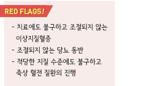
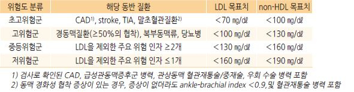
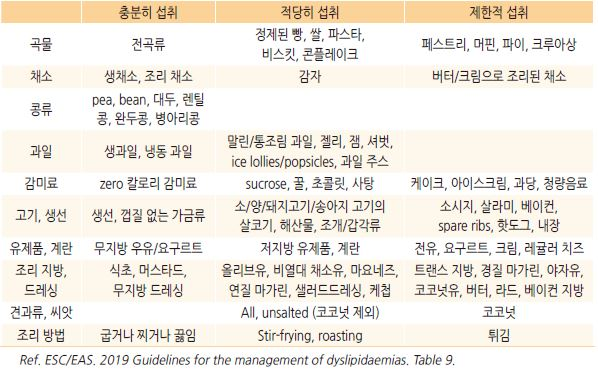
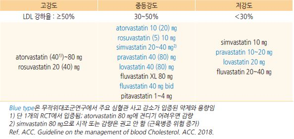
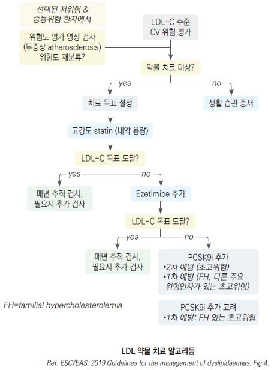
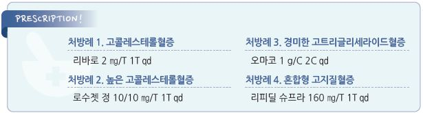

# 이상지질혈증 Dyslipidemia


## 일반 사항
* total-cholesterol(TC) or LDL-cholesterol(LDL) 수준의 증가, 또는 HDL-cholesterol(HDL) 수준의 저하
*   자체로는 증상을 일으키지는 않지만 atherosclerotic cardiovascular disease(ASCVD)의 중요한 위험 인자임;

    연령 증가에 따라 유병률 증가
*   LDL은 ASCVD의 주요 위험 인자이며 LDL이 낮을수록 심혈관 사고의 위험이 줄어 듦

    •적정 LDL 수준에 대한 논란 : LDL의 하한값 또는 ‘J-curve’ 효과는 없다는 보고가 있는 반면, LDL의 높은 수준 뿐 아니라 낮은 수준 역시 모든 원인 사망률의 증가 위험과 관련이 있으며 모든 원인 사망률의 최저 위험은 LDL 140 ㎎/㎗에서 관찰된다는 보고가 있음

    •고령(≥75세)에서는 LDL 수준과 ASCVD 사이에 연관성이 없다는 보고가 있음
* non-HDL 수준이 CVD의 1st event와 강력하게 관련되어 있고 이를 조기에 낮추면 그 위험이 크게 감소한다는 보고가 있음

### 이상지질혈증 기준 (위험 인자 및 위험군을 고려하지 않은 일반적 기준)

```

```

### 심혈관 위험도 분류

#### 초고위험군 (Very-high-risk)

① 임상 또는 영상으로 입증된 ASCVD\*

> ```
> *입증된 ASCVD는 다음을 포함 : 이전 acute coronary syndrome(unstable angina, MI), stable angina,
> ```

```
coronary revascularization, stroke, TIA, 말초동맥질환, 경동맥 &/or 대퇴동맥 plaque
```

② 표적 장기 손상이 있는 당뇨병\*, 최소 3개의 주요 위험 인자, 또는 T1DM의 조기 발병 & ＞20년 지속

> ```
> *표적 장기 손상이 있는 당뇨병의 정의 : microalbuminuria, retinopathy, neuropathy가 발생한 당뇨병
> ```

③ 중증 CKD (eGFR ＜30)

④ ASCVD 또는 다른 주요 위험 인자를 가진 familial hypercholesterolemia(FH)

⑤ 10%≤ SCORE

#### 고위험군 (High-risk)

① 단일 위험 인자의 현저한 상승; 특히 TC ＞310 ㎎/㎗, LDL ＞190 ㎎/㎗, BP ≥180/110 ㎜Hg

② 다른 주요 위험 인자가 없는 FH

③ 표적 장기 손상이 없는 당뇨병, 유병 기간 ≥10년인 당뇨병 또는 다른 추가 위험 인자

④ 중등도 CKD(eGFR 30\~59)

⑤ 5%≤ SCORE ＜10%

#### 중등위험군 (Moderate-risk)

① 다른 위험 인자가 없는, 유병 기간 ＜10년인 ＜35세의 T1DM 또는 ＜50세의 T2DM

② 1%≤ SCORE ＜5%

#### 저위험군 (Low-risk)

* SCORE ＜1%

> ✽SCORE(systematic coronary risk estimation) •first fatal atherosclerotic event의 10년 누적 위험도 평가 도구로서 관리 방법 결정에 이용

```
•CVD, 당뇨병, CKD, FH, 높은 LDL(＞190)이 없는 ＞40세 무증상 성인에 적용

•EU 국가에 대하여 국가, 성별, 흡연, 연령, 총콜레스테롤, SBP에 따른 위험도가 제시되어 있음
```

### LDL을 제외한 ASCVD의 주요 위험 인자

* 흡연
* 고혈압 : SBP ≥140 ㎜Hg 또는 DBP ≥90 ㎜Hg 또는 항고혈압제 복용
*   낮은 HDL : ＜40 ㎎/㎗

    •HDL ≥60 ㎎/㎗ 이상 시 보호 인자로 간주하여 총 위험 인자 개수에서 한 개를 차감함
* 연령 : 남 ≥45세, 여 ≥55세
* 조기 관상동맥병 가족력 : 부모나 형제자매 중 남 ＜55세, 여 ＜65세에서 관상동맥병 발병

### 관상동맥에 영향을 주는 위험 인자 \[ESC/EAS]

* 비만 & 중심 비만
* 신체 비활동
* 정신적 스트레스(활력 고갈 포함)

 - Social deprivation

* 주요 정신 질환
* 심방세동, 좌심실 비대
* 만성 신질환
* 만성 면역 매개 염증 장애
* 폐쇄수면무호흡증
* 비알코올성 지방 간질환
* HIV 감염 치료
* 조기 CVD 가족력(남 ＜55세, 여 ＜60세)

## 원인

* 유전 (✽LDL ＞190 ㎎/dL or TG ＞500 ㎎/dL 시 유전적 원인 고려)
* 육체 활동 부족, 비만, 과음, 흡연, 식이 (✽관련성은 명확하지 않음)
* 갑상선저하증, 당뇨병, 간질환, 신증후군, 만성 신부전
* 약물 : thiazide, cyclosporine, progestin, steroid, protease inhibitor(항바이러스제), isotretinoin

## 진단

### 지질 검사

* 9\~12시간 금식 후 검사
*   대부분의 lipid parameter는 식사에 따른 차이가 임상적으로 유의미할 정도로 크지 않으므로 혈액 채취 시 반드시

    공복일 필요는 없음
* TG는 비공복 측정 시 약 27 ㎎/㎗ 상승함
*   치료 방침 결정 전 혈액 검사를 서로 다른 시점에 최소 2회 반복 시행함. 이들 결과 사이에 현저한 차이가 있는 경우

    추가 측정이 필요할 수 있음

#### 기본 검사

* TC : 심혈관 질환 위험의 포괄적인 추정에 이용
* LDL : 선별, 진단, 관리에 이용
* HDL : 위험 추정을 더욱 구체화하는데 이용
* TG : 일상적인 지질 분석 프로세스로 이용

#### 선택적 검사

*   non-HDL (= 총 콜레스테롤 - HDL) : 모든 죽종 형성 지질단백질(LDL, VLDL, IDL)을 반영

    •높은 TG, 매우 낮은 LDL, 당뇨병, 비만 등에서 위험 평가에 이용
*   ApoB : 높은 TG, 매우 낮은 LDL, 당뇨병, 비만, 대사증후군, 만성콩팥병 등에서 위험 평가에 이용.

    이 경우 non-HDL보다 ApoB를 선호

    •선별, 진단 및 관리에 있어 LDL의 대안으로 사용할 수 있음
*   Lp(a) : 조기 CVD 가족력 및 중등/고위험 경계에 있는 환자의 재분류를 위해 고려

    •LDL이 최적 상태에서도 lipoprotein(a) 상승은 심혈관 위험과 관련됨

    •ASCVD의 매우 높은 유전적 위험과 관련이 있는 높은(＞180 ㎎/㎗) Lp(a)를 지닌 환자를 감별하기 위해 성인기에

    최소 1회 측정을 고려

#### LDL

* 직접 측정 또는 계산
*   Friedewald 계산 공식 : LDL = TC - HDL - TG÷5

    •TG ≥177 ㎎/㎗ 시 낮게 계산됨. TG ＞400 ㎎/㎗ 시 적용할 수 없음
* 다음의 경우에는 직접 측정을 권고 : 공복 TG ＞250 ㎎/㎗, 당뇨병, 혈관 질환, ＜9시간 공복

✽대사증후군, 당뇨병, 고중성지방혈증 환자에서 비-공복 검사 계산에 의한 LDL 값은 직접 측정값과 유의미한 차이가 발생할 수 있음

* TG가 높을 때에는 직접 측정에도 불구하고 LDL 값이 부정확할 수 있음

### 지질 외 검사

*   보다 적극적인 ASCVD 위험 평가 및 교정 목적으로 다음 검사들을 고려 :

    arterial plaque burden 평가(경동맥 &/or 대퇴동맥 초음파 검사), CAC(coronary artery calcium) 점수 평가(CT 검사),

    high sensitivity CRP
* 2차성 이상지질혈증 가능성 및 치료 중 안전성 감별을 위해 다음 검사들을 고려 : 혈압, 혈당, TSH, eGFR

### 선별 검사 대상 및 주기

\*\* 대한의학회 \*\*(2018)

1. 심/뇌혈관 질환, 고혈압, 당뇨병을 진단받은 경우
2.  다음의 심뇌혈관질환 위험 인자를 가진 경우 : 흡연, 비만(특히 복부 비만), 만성콩팥병, 자가면역 만성 염증성

    질환(예: RA), 가족성 고지혈증 가족력, 조기 관상동맥병의 가족력

\*\* AACE \*\*(2017)

* 20~~45세 남성, 20~~55세 여성 : 매 5년마다
* 45~~65세 남성, 55~~65세 여성 : ASCVD의 위험 인자가 없는 경우 매 1\~2년마다, 위험 인자가 있는 경우에는 보다 자주
* ASCVD 위험 인자가 없거나 1개인 ≥65세 또는 당뇨병 환자 : 매년

\*\* USPSTF \*\*(2018)

* 21\~39세 및 CVD 병력이 없는 ≥76세에서는 이상지질혈증 진단 및 치료의 이득이 입증되지 않아 선별 검사를 권고하지 않음

\*\* ESC \*\*(2019)

* ＞40세 남성, ＞50세 (또는 폐경 후) 여성에서 lipid profile을 포함한 위험 인자 선별 검사 고려

***

## Management

### 대한의학회 권고안

#### 관리 목표치

*   1차 관리 대상- LDL; 2차 관리 대상- non-HDL

    
* 다른 지질 목표치 : TC ＜200 ㎎/㎗, TG ＜150 ㎎/㎗, HDL ＞40 ㎎/㎗
*   내약 가능한 최대 용량 투여에도 불구하고 LDL 목표 달성이 어려운 경우 : 초고위험군에서는 기저치보다 50% 이상 감소,

    고위험군에서는 30\~40% 이상 감소를 목표로 함
* LDL ＜70 ㎎/㎗ 달성 후에도 죽상 경화성 심혈관 질환이 진행하는 경우 : 추가 강하 고려
* LDL 높음 & TG 200\~500 ㎎/㎗ : 1차적으로 LDL 조절을 목표로 치료
* LDL 목표치 이하 & TG 200\~500 ㎎/㎗ : 생활 습관 중재를 시행하며 이후에도 TG 상승 시 non--HDL를 목표로 치료
* 1년 이상의 약물 치료에도 불구하고 LDL이 치료 목표에 도달하지 않은 경우 : 의뢰

#### 이상지질혈증의 진단 및 치료

> ```
> (Ref. 대한의학회. 일차의료용 근거기반 이상지질혈증 권고 요약본. Quick reference guide. 2019.)
> ```

```

```

### ACC/AHA 권고안

*   statin 치료에 따른 MI 및 사망 감소는 콜레스테롤 저하 외에도 다른 기전이 관련되어 있으므로 ASCVD 위험도에 따라

    statin 치료를 권고함 (✽LDL을 관리 목표로 정하지 않음)

> ✽ASCVD 10년 위험도 계산 툴

### USPSTF 권고안

• 하나 이상의 CVD 위험 인자(dyslipidemia, diabetes, hypertension, smoking)가 있고 10년 위험이 ≥10%인 40\~75세 인구 :

```
CVD 1차 예방을 위하여 statin 처방을 권고
```

• 하나 이상의 CVD 위험 인자가 있고 10년 위험이 7.5\~＜10%인 40\~75세 인구 :

```
CVD 1차 예방을 위하여 statin 선택적 처방을 권고
```

• CVD 병력이 없는 ≥76세에서는 CVD 1차 예방을 위한 statin 치료 개시는 권고 안 함

### ESC/EAS 권고안

#### LDL 관리 목표

* 초고위험 환자 : 기저치 대비 ≥50% 강하 & ＜55 ㎎/㎗
* 고위험 환자 : 기저치 대비 ≥50% 강하 & ＜70 ㎎/㎗
* 중등위험 환자 : ＜100 ㎎/㎗
* 저위험 환자 : ＜116 ㎎/㎗

#### 기타 목표

* non-HDL : 초고위험/고위험/중등위험 환자의 2차 목표치- 각각 85/100/130 ㎎/㎗ 미만
* ApoB : 초고위험/고위험/중등위험 환자의 2차 목표치- 각각 65/80/100 ㎎/㎗ 미만
* triglyceride : 목표치 없음; ≥150 ㎎/㎗인 경우 다른 위험 인자를 확인
* 혈압 : ＜140/90 ㎜Hg
* 당뇨병 : HbA1c ＜7%

### 심혈관 위험도 및 LDL 수준에 따른 치료 전략

```

```

## 비-약물 치료

* 금연 : 모든 형태의 담배/흡연 금지
* 식이 : 포화지방산 제한; 전곡류, 채소, 과일, 생선 권장
* 신체 활동 : 중등도의 활발한 활동을 매일 30~~60분 또는 주당 3.5~~7시간
* 체중 관리 : 비만 시 현재 체중의 5\~10% 감량 또는 평소보다 500 ㎉/d 감량 섭취 (☞ p.1010)

#### 생활 습관 중재 (Lifestyle interventions) 방법과 효과

```

```

### 식이

*   특정 식이 콜레스테롤 섭취 제한 목표를 제시하지 않으며 지중해식 식단 또는 DASH 다이어트를 권고함 [AHA](../2020/)

    (☞ p.1166)

> ✽계란을 포함한 식이 콜레스테롤과 심혈관 위험 사이에는 유의미한 연관성이 없음. 이를 연관 짓는 증거는 부족하고 종종 모순됨

* 권장 : 과일 및 채소 섭취(8~~10 servings/d), 저지방 유제품(2~~3 servings/d), 생선(2회/wk)
*   제한 : 음주(남 ≤2 SD/d, 여 ≤1 SD/d)(☞ p.995), 소금(＜6 g/d)(☞ p.483), 설탕 등 단순 당, 포화지방, 붉은 고기

    •지나친 지방 섭취 제한은 탄수화물 섭취를 증가시켜 TG 상승을 유발할 수 있음

> ✽우리나라 권고 지방 섭취 비율 : 15\~25% (2015년 평균 지방 섭취 비율은 20%로 조사됨)

*   식이 섬유 : 1일 25~~40 g의 식이 섬유 섭취(최소 7~~13 g의 수용성 식이 섬유를 포함) \[ESC]

    •수용성 식이 섬유 : 성분 예) 실리움, 베타 글루칸, 펙틴, 구아검, 알긴산; 식품 예) 잡곡, 전곡류, 해조류, 채소, 과일

    (☞ p.1170)

    

### 운동

*   지질에 대한 운동의 효과는 크지 않은 것으로 알려져 있으나 심혈관계 질환 및 삶의 질 개선 효과가 있으므로 권고

    (☞ p.1160)
* 유산소 운동의 효과는 LDL 중립, HDL↑, TG↓이며 무산소 운동의 효과는 논란

## 약물 치료

#### 약물 치료 대상

* 생활 습관 중재 3\~6개월 이후에도 목표에 도달하지 않는 경우
* 다음의 경우에는 처음부터 약물 치료 시작 : ① LDL＞190 또는 TG＞500, ② 고위험군

### LDL 조절을 위한 약물 요법

*   목표 수준에 도달하기 위하여 최대 내약 용량의 고강도 statin 투여를 권고

    → 최대 내약 용량의 statin으로 목표 달성 실패 시 ezetimibe 병용을 권고

    → statin & ezetimibe로 목표 달성에 실패한 다음의 경우 PCSK9i 병용을 고려 또는 권고

    ① ASCVD 또는 다른 주요 위험 인자를 가진 초고위험 FH : PCSK9i 병용 권고

    ② FH가 아닌 초고위험군 : 1차 예방을 위하여 PCSK9i 병용 고려

    ③ 초고위험군 : 2차 예방을 위하여 PCSK9i 병용 권고
* statin을 투여할 수 없는 경우 : ezetimibe 고려 또는 ezetimibe에 PCSK9i 추가 고려
* 목표 달성 실패 시 statin과 bile acid sequestrant 병용 고려

### TG 조절을 위한 약물 요법

* TG ≥500 ㎎/㎗ 시 2차 원인 평가 및 췌장염 위험을 줄이기 위한 약물 치료 고려
* TG ＞200 ㎎/㎗ 시 CVD 예방을 위한 1차 약제로 statin 권고 (보험 주의)
*   statin 투여에도 불구하고 TG 135\~499 ㎎/㎗인 고위험군에 대하여 ω-3 PUFAs(icosapent ethyl 22 g/d; Vascepa 4 g/d)

    병용 고려

## 지질 저하제

```
(보험기준 ☞ p.1189)
```

#### 지질 저하제의 효과 비교

```

```

### Statin (HMG-CoA reductase inhibitor)

* 1차 선택제; LDL 감소 효과 가장 우수
* 약제 용량 2배 증량 시 LDL 강하 효과 6% 증가
*   부작용 : 소화 장애, 두통, 피로감, 근육통, 관절통, 간 독성, 근육병증(빈도＜0.1%), 혈당 상승

    •설명할 수 없는 근육통이 있으면 진료 받도록 교육

    •statin과 당뇨병 관계 : statin과 T2DM 발생에 용량 의존 관계가 있으나 statin의 ASCVD 위험 감소 효과에 비하여

    중요하지 않음; pitavastatin, pravastatin에서는 보다 적게 발생
* 주의/금기 : 출혈성 뇌졸중 환자, 활동성 간질환, 임신, 수유
*   심부전 및 투석 환자에서는 statin의 예방 효과가 없어 권고하지 않음. 단 statin 투여 중에 투석을 시작하는 경우 statin은

    중단하지 않을 수 있음
*   약물 상호 작용 : CYP450 3A4 대사 약물. 예) macrolide계 항생제, azole계 항진균제, warfarin, cyclosporine,

    protease inhibitor, verapamil, diltiazem, amlodipine), grapefruit

    •pitavastatin, pravastatin, rosuvastatin은 거의 영향 없음

#### Statin의 작용 강도에 따른 분류



#### Statin의 효과 비교

```

```

#### 약제

* lovastatin : 통상 시작 용량 20 ㎎ \[범위 10\~80 ㎎], 저녁 식사와 함께 복용 \[로바로드]
*   simvastatin : 심장 약물(예: amiodarone, amlodipine, diltiazem, dronedarone, ranolazine, verapamil) 병용 시 용량 제한;

    20 ㎎ \[5\~40 ㎎], 저녁 복용 \[조코]
* pravastatin : 40 ㎎ \[10\~80 ㎎], 저녁 복용 \[메바로친]
* fluvastatin : 40 ㎎ \[20\~80 ㎎], 저녁 복용 \[레스콜]
* atorvastatin : 10~~20 ㎎ \[10~~80 ㎎], 복용 시간 무관 (저녁 권고) \[리피토]
* rosuvastatin : 10 ㎎ \[5\~40 ㎎], 복용 시간 무관 \[크레스토]
* pitavastatin : 2 ㎎ \[1\~4 ㎎], 복용 시간 무관 \[리바로]

\*\* Statin/항고혈압제 복합제\*\*

* rosuva/candesartan \[투게논]
* rosuva/fimasartan \[투베로]
* rosuva/valsartan \[로바티탄]
* rosuva/losartan/amlodipine \[아모잘탄 큐]
* rosuva/telmisartan \[듀오웰]
* rosuva/telmisartan/amlodipine \[텔로스톱 플러스]
* pitava/valsartan \[리바로 브이]

\*\* Statin/항당뇨병제 복합제\*\*

* rosuva/gemigliptin \[제미로우]

### 콜레스테롤 흡수 억제제

* 효과 : LDL↓; statin 복합 시 LDL 34~~61%↓, fenofibrate 복합 시 LDL 20~~22%↓
* statin과 병합 사용(statin에 대한 병용 약제로 우선 고려) 또는 statin 과민 환자에서 단독 사용
* 부작용 : 복통, 설사, 부글거림, 피로감, 근육병증(드묾)
* 금기 : 임신, 수유, 심한 간질환
* ezetimibe : 10 ㎎/d qd, 식사 무관 복용 \[이지트롤]

### Fibrate (fibric acid derivative)

* 효과 : TG↓, LDL↓. ASCVD↓
* hypertriglyceridemia 치료에서 statin과 함께 1차 선택제
* 부작용 : 소화 장애, 담석, 간염, 근육병증
* 주의/금기 : warfarin 병용(항응고작용↑), statin 병용(근육병증↑), 심한 간/신질환, 담석
* fenofibrate : statin 병용에 상대적으로 안전; 120\~160 ㎎ qd 식후 즉시 \[리피딜 슈프라]
* bezafibrate : 200~~600 ㎎ #2~~3 식후 \[베자립]
* ciprofibrate : 100 ㎎ qd \[리파놀]
* gemfibrozil : 근육병증 위험이 보다 많음. statin 병용 회피; 600 ㎎ bid, 식전 30분 \[로피드]

### Bile acid sequestrant (담즙산 분리제)

* 효과 : LDL 감소, HDL 증가
* statin 사용이 어려운 경우 또는 statin과 병용
* 부작용 : 변비, 복부 팽만, 담석증
*   타 약제 흡수 억제 : digitalis, warfarin, propranolol, thiazide, amiodarone, thyroxine, acetaminophen, NSAID, steroid,

    folic acid, Vit A/D/K, PcG, tetracycline
* 금기 : TG ＞400 ㎎/㎗
* cholestyramine : 4~~24 g/d, #2~~3, 식사와 함께 복용 \[퀘스트란 현탁용산]
* colestipol, colesevelam(✽ezetimibe와 비슷한 효과가 있으나 tolerability가 보다 낮다는 보고가 있음)

### Niacin (Nicotinic acid)

* 효과 : TG↓, HDL↑
*   부작용 : 홍조, 복부 불편감, 구역, 소화성 궤양, 심방세동, 간 독성, (고용량 시) 혈당↑, 요산↑

    •홍조는 서방형 제제, 지속 사용, 식사와 함께 복용, 복용 1시간 전 aspirin 투여 시 감소함
* 주의/금기 : warfarin 병용, 당뇨병, 고요산혈증, 소화성 궤양 환자, 간질환, 심한 통풍
* immediate release nicotinic acid (crystalline niacin) : 1.5\~3 g/d #3
* 서방형 nicotinic acid : 저용량 시작, 1주 단위 증량, 1\~2g qd. 식후 취침 전 복용 \[엑스립]
* acipimox : nicotinic acid analog; 250 ㎎ bid\~tid \[올베탐]

### PCSK9 Inhibitor (proprotein convertase subtilisin/kexin type 9 inhibitor)

* monoclonal antibody
*   효과 : LDL 48~~71%↓, non-HDL 49~~58%↓, total-C 36\~42%↓

    •LDL 감소와 무관하게 CVD 위험을 감소시키는 것으로 알려짐
* 가족성 고콜레스테롤혈증에서 statin에 추가 고려
* 부작용 : 주사 부위 반응
* alirocumab : 75~~150 ㎎ 2~~4주마다 피하주사
* evolocumab : 140 ㎎ 격주 또는 420 ㎎ 매월 피하주사 \[레파타 주] (보험기준 ☞ p.1186)

### Omega-3 fatty acid

* hypertriglyceridemia 치료에서 2차 선택제
* 고 TG에 대하여 2\~4 g/d

> ✽[AHA](../2019/) 중성지방 강하를 위하여 4 g/d(＞3 g/d)의 EPA+DHA or EPA 단독 투여 권고

* 부작용 : 관절통, 트림, 소화불량, 변비, 가려움; 출혈 시간 연장(?), (간 장애 환자에서) ALT↑

> ✽1 g 이상의 해양 오메가-3 보충제 복용은 용량에 비례하여 심방세동의 위험 증가와 관련이 있다는 보고가 있음

* omega-3 지방산 : 2 g qd\~bid \[오마코]

### 병용 요법

*   대상 : 콜레스테롤 수치가 현저하게 높음, 단일 제제로 조절되지 않음, 혼합형 이상지질혈증

    •\[ADA] ASCVD 또는 ASCVD 10년 위험도 ＞20%, statin 치료에도 LDL ≥70 ㎎/㎗
* 장점 : 단일 제제를 증량할 때보다 부작용이 적음
* statin/ezetimibe or statin/PCSK9 inhibitor
* statin/ezetimibe : ezetimibe/simvastatin \[바이토린], ezetimibe/rosuvastatin \[로수젯]
* statin/omega-3 : omega-3/rosuvastatin \[로수메가]
* statin + fibrate or niacin : ASCVD를 개선하지 못하며 근육병증, 뇌졸중 위험을 증가시키므로 권고 안 함

### 기타

*   칼슘 : 일부 연구에서 칼슘 보충제가 콜레스테롤을 낮추는 데 기여; 심혈관계 질환 예방 효과는 불확실

    (일부 연구에서는 위험 증가)
*   soy protein : 콩 단백질이 LDL과 중성지방을 약간 낮출 수 있으나 많은 지방을 함유하고 있으므로 콜레스테롤 저하

    목적으로는 사용할 수 없음
* 마늘 : 콜레스테롤 저하 효과 입증 안 됨
*   plant stanol & sterol : 장에서의 콜레스테롤 흡수 방해; 일부 과일, 채소, 견과류, 씨앗, 콩류에 함유;

    과잉 섭취 시의 문제들이 알려져 있음

    

## 특별한 경우의 관리

### 당뇨병 환자의 이상지질혈증 [ADA](../2023/)

#### 1차 예방

* ASCVD가 없는 40\~75세 : 생활 습관 중재에 추가하여 중강도 statin 치료
* ASCVD 위험 인자가 있는 20\~39세 : 생활 습관 중재에 추가하여 statin 치료를 고려
* ASCVD 위험 인자 ≥1개의 40\~75세 : LDL ≥50% 줄임 & LDL ＜70 ㎎/㎗ 목표 statin 치료
* 40\~75세 ASCVD 고위험군(특히 복수의 위험 인자 & LDL ≥70 ㎎/㎗) : statin 최대 내약 용량 & {ezetimibe or PCSK9i}
* ＞75세 : 이미 statin 복용 중인 경우 유지

•새로운 시작은 이익-위해를 비교하여 결정(✽＞75세에서는 stain의 효과가 적음)

#### 2차 예방

* ASCVD와 당뇨병이 있는 모든 연령의 환자 : 생활 습관 중재 및 고강도 statin 치료
*   ASCVD와 당뇨병이 있는 경우 LDL ≥50% 줄임 & LDL ＜55 ㎎/㎗ 목표의 고강도 stating 치료 권고. 최대 내약 용량의

    statin에도 목표를 달성하지 못할 경우 ezetimibe or PCSK9i 추가

### 대사증후군 및 T2DM에서의 non-HDL과 ApoB 관리 목표

* 고위험군 : non-HDL ＜100 ㎎/㎗, ApoB ＜80 ㎎/㎗
* 초고위험군 : non-HDL ＜85 ㎎/㎗, ApoB ＜65 ㎎/㎗
* 재발성 ASCVD가 있는 초고위험군 : non-HDL ＜70 ㎎/㎗, ApoB ＜55 ㎎/㎗

### Acute coronary syndrome 환자

* 모든 ACS 환자에서 LDL 수준에 관계없이, 금기가 아닌 경우 고강도 statin 투여를 권고
* statin을 투여할 수 없는 경우에는 ezetimibe 고려
*   statin 투여 4\~6주 후 지질 재검사

    → 목표(LDL 기저치 대비 ≥50% 강하 & ＜55 ㎎/㎗) 달성 여부 및 안전 문제를 평가하여 statin 용량 조절

    → 4\~6주간의 statin 최대 내약 용량 투여에도 불구하고 목표 달성 실패 시 ezetimibe 병용 권고

    → 4\~6주간의 statin+ezetimibe 최대 용량에도 목표 달성 실패 시 PCSK9i 추가 권고

### 만성 심부전 환자

*   관상동맥병이 없는 aortic valvular stenosis 환자 또는 적응증에 해당되지 않는 심부전 환자에서 지질 저하 치료는

    권고하지 않음

### 신 기능 저하 환자

* stage 3\~5인 CKD 환자는 고위험 또는 초고위험군으로 간주
* 투석을 하지 않는 stage 3\~5 CKD 환자에서 statin±ezetimibe 권고
* ASCVD가 없는 투석 중인 CKD 환자에서는 statin 치료를 권고하지 않음
* 투석 시작 전 이미 statin &/or ezetimibe을 투여 받던 환자(특히 ASCVD가 있는 환자)는 지속 투여를 고려

### 말초동맥 질환

* ASCVD를 예방하기 위하여 지질 저하 치료를 권고
* 선택 약제 : statin, ezetimibe, PCSK9i

### 이형접합 가족성 고콜레스테롤혈증 (Heterozygous FH)

* 1차 예방을 위한 LDL 목표 : 기저치 대비 ≥50% 강하 & ＜55 ㎎/㎗으로 고려
* 초고위험 FH 환자에서 최대 내약 용량의 statin+ezetimibe로 치료 목표 달성 실패 시 PCSK9i 치료를 권고

## 모니터링

#### 지질

*   치료 시작 및 지질 목표 달성까지 약물 조정 8주(±4주) 후 검사, 목표 달성 후 매년 (or 6\~12개월마다) 검사;

    다른 문제가 있거나 필요에 따라 보다 자주 검사
*   빈번한 지질 평가 대상 : 치료 방침 변경, 당뇨병 악화, 지질에 영향을 주는 새로운 약물 투여, 죽상 혈전 질환 진행,

    상당한 체중 증가, 예상 외의 지질 악화, 새로운 CAD 위험 인자 발생
* 감량 : 2회 연속 측정한 LDL이 ≤40 ㎎/㎗이면 감량 고려

#### 간 효소 (AST/ALT)

* 약물 투여 전, 투여 개시 & 증량 4\~12주 후 검사 (✽간 이상은 보통 투여 개시 3개월 내 발생함)
*   모니터링 : 일상적으로 간 효소 수치를 측정해야 하는 것은 아니며 다음의 경우 검사 고려

    ① 간 기능 이상이 발생할 가능성이 높은 경우

    ② statin 치료 중 이유 없는 피로감, 식욕 감소, 복통, 짙은 색 소변, 또는 황달 발생

    ③ fibrate 투여 중에는 ALT 검사를 권고
*   치료 중 상승 시 대처

    •＜3×ULN (정상 상한값의 ＜3배) : 투약을 지속하며 4\~6주 후 재검

    •≥3×ULN : 투약을 중단 또는 감량하고 4\~6주 후 재측정 → ALT 정상 회복 시 주의하며 치료 재개 고려(저용량 또는

    다른 약제 선택), ALT 증가가 지속되는 경우 다른 원인 조사

#### 혈중 근육 효소 (creatine kinase, CK)

* 투여 전 측정 → 기저치가 ＞4×ULN인 경우 지질 저하제 투여를 하지 않고 재측정
*   다음의 경우 근육병증 및 CK 상승 주의 : 고용량, 가족력, 고령, 여성, 작은 체구, 전신 질환(당뇨병콩팥병증,

    간/신질환, 갑상선저하증), 다제약물 투여, 상호 작용 약물 투여, 수술 전후, 운동선수, 심한 운동, 음주,

    fibric acid/nicotinic acid/cytochrome 억제제 투여
*   모니터링 : 투여 중 일률적인 검사는 필요 없음; 근육 관련 증상을 문진하여 근육통, 뭉침, 위약감, 전신 피로감 등이

    발생하면 투여 중지 및 검사 → 증가되어 있으면 재측정
*   ＜4×ULN

    •근육 증상(-) : statin 투여 지속, 증상 발생 주의 관찰, 필요시 CK 검사

    •근육 증상(+) : 증상 관찰 및 규칙적 CK 검사 → 증상 지속 시 statin 중지 및 6주 후 재평가

    → 정상화 시 동일 또는 다른 statin 재투여 고려

    •statin 저용량, 격일 또는 주 1\~2회 투여, 또는 병용 요법 고려
*   ≥4×ULN

    •＜10×ULN, 증상(-) : 투여 지속 및 2\~6주 사이에 CK 검사

    •＜10×ULN, 증상(+) : 투여 중지 및 CK 검사 → 정상화되면 저용량으로 재투여하면서 CK 검사

    •≥10×ULN : 투여 중지, 간 기능 확인, 2주마다 CK 검사

    •힘든 일 등 다른 원인에 의한 일시적 CK 상승 가능성을 고려

    •CK 상승이 지속되면 근육병증 고려

    •병용 요법 또는 대체 약물 고려

#### Creatine

* fibrate 투약 전 및 투약 1\~3개월 후 혈중 Cr 검사, 정기적 추적 관찰

#### HbA1c 또는 혈당

* 당뇨병 발생 위험이 높은 경우 또는 고용량 statin 투여 시 규칙적으로 당 검사
*   statin 투여 중 새롭게 당뇨병이 진단된 경우 심/뇌혈관 질환의 예방을 위해 투여를 중단하기보다 당뇨병에 대한

    생활 습관 중재를 하면서 statin 투여를 지속함

### 치료 종료 또는 중단

* 생활 습관 개선 노력 후 실패하여 약물 치료를 시작한 경우에는 평생 복용이 원칙임
* 단순 이상지질혈증 또는 생활 습관 개선(예: 금연, 체중 감량)과 관련하여 목표에 도달한 경우에는 중단할 수 있음

> **질병코드** E78.0 순수 고콜레스테롤혈증

E78.1 순수 고글리세라이드혈증

E78.2 혼합성 고지질혈증


