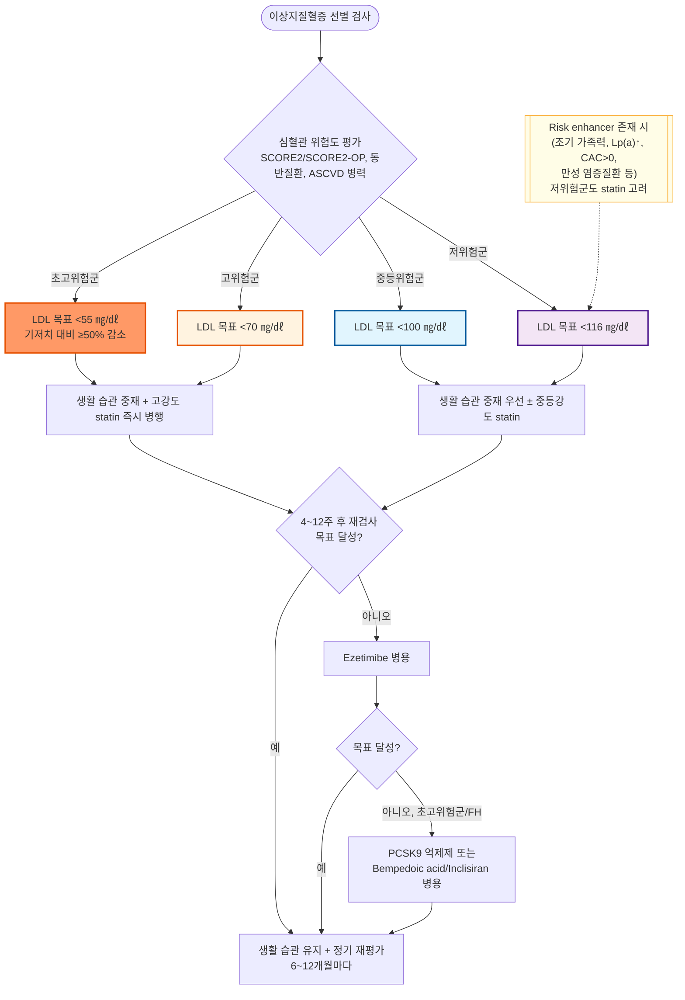

# 이상지질혈증 Dyslipidemia

## <mark style="color:green;">일반 사항</mark>

* LDL-cholesterol(LDL) 증가, 중성지방(TG) 증가, HDL-cholesterol(HDL) 감소, 또는 이들의 복합 이상
* 자체로는 증상을 일으키지 않지만 atherosclerotic cardiovascular disease(ASCVD)의 중요한 위험 인자임; 연령 증가에 따라 유병률 증가

**국내 역학** (19세 이상; 대사증후군 팩트 시트 2026, 심장대사증후군학회)

<table data-search="false"><thead><tr><th width="260">구성 요소</th><th width="120">전체</th><th width="120">남성</th><th>여성</th></tr></thead><tbody><tr><td>대사증후군 (19세 이상)</td><td>21.5%</td><td>28.5%</td><td>14.3%</td></tr><tr><td>대사증후군 (30세 이상)</td><td>25.7%</td><td>34.1%</td><td>17.4%</td></tr><tr><td>대사증후군 (65세 이상)</td><td>39.0%</td><td>39.3%</td><td>38.9%</td></tr><tr><td>복부비만</td><td>33.0%</td><td>41.5%</td><td>24.4%</td></tr><tr><td>고중성지방혈증 (TG ≥150 ㎎/㎗)</td><td>25.8%</td><td>36.3%</td><td>15.0%</td></tr><tr><td>저HDL 콜레스테롤혈증</td><td>17.8%</td><td>17.3%</td><td>18.5%</td></tr><tr><td>고혈압 (≥130/85 ㎜Hg)</td><td>29.1%</td><td>34.9%</td><td>23.3%</td></tr><tr><td>고혈당 (FBS ≥100 ㎎/㎗)</td><td>29.1%</td><td>35.6%</td><td>22.4%</td></tr></tbody></table>

_✽확인 결과 - "한국 대사증후군 팩트시트 2026"은 실제로 존재하며, 심장대사증후군학회(KSCMS)가 2026년 5월 29일 APCMS 2026 기자간담회에서 공개한 자료임(국민건강영양조사 제4~9기, 2007~2024년 자료 기반). 대한비만학회는 별도로 "비만병 팩트시트"(연례) 시리즈를 발간하고 있어 서로 다른 간행물임 - 두 자료를 혼동하지 않도록 주의. 다만 위 표의 개별 수치(대사증후군/고중성지방혈증/저HDL 유병률 등)가 2026년판의 실제 수치와 일치하는지는 원 발표자료(슬라이드/보도자료)와 재대조를 권장함._

**대사증후군과 심혈관 질환 발생 위험** (국내 코호트, KNHANES–NHIS/HIRA 연계)

* 대사증후군이 있는 경우 주요 심혈관 질환 발생 위험이 뚜렷하게 증가함
  * 위험비(HR) : 모든 원인 사망 1.15, 심뇌혈관질환(전체) 1.77, 심근경색 1.78, 협심증 1.75, 허혈성뇌졸중 1.69, 대장암 1.39, 위암 1.31, 신장암 1.89
* LDL은 ASCVD의 주요 위험 인자이며, 현재까지는 매우 낮은 LDL-C 수준에서도 ASCVD 위험 감소가 지속되는 것으로 보고됨
  * 적정 LDL 수준에 대한 논란 : LDL의 하한값 또는 'J-curve' 효과는 없다는 보고가 있는 반면, 일부 코호트 연구에서는 모든 원인 사망률의 최저 위험이 LDL 140 ㎎/㎗ 부근에서 관찰된다는 보고도 있음; 다만 이는 일부 관찰 연구에 국한된 결과이며, RCT를 포함한 전체 근거는 낮은 LDL 수준에서도 ASCVD 위험 감소가 지속됨을 지지함
  * 고령(≥75세)에서는 LDL 수준과 ASCVD 사이에 연관성이 없다는 보고가 있음
* non-HDL 수준이 CVD의 1st event와 강력하게 관련되어 있고 이를 조기에 낮추면 그 위험이 크게 감소한다는 보고가 있음

### <mark style="color:orange;">이상지질혈증 진단 기준 (분류)</mark>&#x20;


아래는 **진단 분류(NCEP ATP III 기준 체계)**이며, 위험도별 **치료 목표치**는 별개 개념임 - 치료 목표치는 [Management 섹션의 관리 목표치 표](#관리-목표치) 참조.


<table><thead><tr><th width="154">항목</th><th>기준 수치 (㎎/㎗)</th></tr></thead><tbody><tr><td><strong>총콜레스테롤(TC)</strong></td><td>&#x3C;200 적정 / 200~239 경계 / ≥240 높음</td></tr><tr><td><strong>LDL 콜레스테롤</strong></td><td>&#x3C;100 적정(optimal) / 100~129 근접 적정(near optimal) / 130~159 경계(borderline high) / 160~189 높음(high) / ≥190 매우 높음(very high)</td></tr><tr><td><strong>중성지방(TG)</strong></td><td>&#x3C;150 적정 / 150~199 경계 / 200~499 높음 / ≥500 매우 높음(췌장염 위험 증가)</td></tr><tr><td><strong>HDL 콜레스테롤</strong></td><td>남성 &#x3C;40 낮음 / 여성 &#x3C;50 낮음 / ≥60 높음(보호 인자)</td></tr></tbody></table>

_<mark style="color:$info;">Ref. NCEP ATP III; 한국지질·동맥경화학회. 이상지질혈증 진료지침 제5판(2022)</mark>_

_✽TC 단독으로는 위험 예측력이 제한적이므로 LDL·HDL·TG를 함께 평가하는 것이 원칙임. "고위험군 목표 &#x3C;70, 초고위험군 목표 &#x3C;55" 등은 진단 분류가 아니라 위험도별 **치료 목표**이므로 이 표와 혼동하지 않도록 주의 - 저자 편집(리뷰어 의견 반영)_

### <mark style="color:orange;">심혈관 위험도 분류</mark>


**가이드라인마다 다른 위험도 산출 도구를 사용함 - 먼저 구분하고 시작**\
한국지질·동맥경화학회 지침(2022, 5판)은 **SCORE** 체계를, ESC/EAS 2025 Focused Update는 **SCORE2/SCORE2-OP**를, ACC/AHA 2026 가이드라인은 **PREVENT-ASCVD**를 사용함. 세 도구는 산출값 자체가 다르므로(예: SCORE2/PREVENT는 SCORE/PCE보다 낮게 나오는 경향) 서로 다른 도구의 수치를 직접 비교하면 안 됨. 아래 4단계 분류(저/중등/고/초고위험군)는 **국내 임상에서 널리 쓰이는 구 SCORE 기반 체계**이며, ESC/EAS의 SCORE2/SCORE2-OP 연령대별 절대 수치나 ACC/AHA의 PREVENT-ASCVD 구간(위쪽 "선별 검사" 섹션 참조)과는 절대치가 다르므로 혼용하지 않도록 주의.


#### <mark style="color:$primary;">저위험군 (Low-risk)</mark>

* SCORE(systematic coronary risk estimation) ＜1%
  * [SCORE](https://www.escardio.org/guidelines/practice-tools/cvd-prevention-toolbox/score-risk-charts/) : first fatal atherosclerotic event의 10년 누적 위험도 평가 도구로서 관리 방법 결정에 이용(한국지침 2022가 채택한 구 버전); CVD, 당뇨병, CKD, FH, 높은 LDL(＞190)이 없는 ＞40세 무증상 성인에 적용; EU 국가에 대하여 국가, 성별, 흡연, 연령, 총콜레스테롤, SBP에 따른 위험도가 제시되어 있음

#### <mark style="color:$primary;">중등위험군 (Moderate-risk)</mark>

1. 다른 위험 인자가 없는, 유병 기간 ＜10년인 ＜35세의 T1DM 또는 ＜50세의 T2DM
2. 1%≤ SCORE ＜5%

#### <mark style="color:$primary;">고위험군 (High-risk)</mark>

1. 단일 위험 인자의 현저한 상승; 특히 TC ＞310 ㎎/㎗, LDL ＞190 ㎎/㎗, BP ≥180/110 ㎜Hg
2. 다른 주요 위험 인자가 없는 FH
3. 표적 장기 손상이 없는 당뇨병, 유병 기간 ≥10년인 당뇨병 또는 다른 추가 위험 인자
4. 중등도 CKD(eGFR 30\~59)
5. 5%≤ SCORE ＜10%

#### <mark style="color:$primary;">초고위험군 (Very-high-risk)</mark>

1. 임상 또는 영상으로 입증된 ASCVD
   * 입증된 ASCVD는 다음을 포함 : 이전 acute coronary syndrome(unstable angina, MI), stable angina, coronary revascularization, stroke, TIA, 말초동맥질환, 경동맥 &/or 대퇴동맥 plaque
2. 표적 장기 손상이 있는 당뇨병, 최소 3개의 주요 위험 인자, 또는 T1DM의 조기 발병 & ＞20년 지속&#x20;
   * 표적 장기 손상이 있는 당뇨병의 정의 : microalbuminuria, retinopathy, neuropathy가 발생한 당뇨병
3. 중증 CKD(eGFR ＜30)
4. ASCVD 또는 다른 주요 위험 인자를 가진 familial hypercholesterolemia(FH)
5. 10%≤ SCORE

### <mark style="color:orange;">LDL을 제외한 ASCVD의 주요 위험 인자</mark>

* 흡연
* 고혈압 : SBP ≥140 ㎜Hg 또는 DBP ≥90 ㎜Hg 또는 항고혈압제 복용
* 낮은 HDL : ＜40 ㎎/㎗
  * HDL ≥60 ㎎/㎗ 이상 시 보호 인자로 간주하여 총 위험 인자 개수에서 한 개를 차감함
* 연령 : 남 ≥45세, 여 ≥55세
* 조기 관상동맥병 가족력 : 부모나 형제자매 중 남 ＜55세, 여 ＜65세에서 관상동맥병 발병

### <mark style="color:orange;">관상동맥에 영향을 주는 위험 인자 \[ESC/EAS]</mark>

* 비만 & 중심 비만
* 신체 비활동
* 정신적 스트레스(활력 고갈 포함), social deprivation
* 주요 정신 질환
* 심방세동, 좌심실 비대
* 만성 신질환
* 만성 면역 매개 염증 장애
* 폐쇄수면무호흡증
* 비알코올성 지방 간질환(MASLD)
* HIV 감염 치료
* 조기 CVD 가족력(남 ＜55세, 여 ＜60세)

## <mark style="color:green;">원인 및 위험 인자</mark>

* 유전 (✽LDL ＞190 ㎎/㎗ or TG ＞500 ㎎/㎗ 시 유전적 원인 고려)
* 육체 활동 부족, 비만, 과음, 흡연, 식이 (✽관련성은 명확하지 않음)
* 갑상선저하증, 당뇨병, 간질환, 신증후군, 만성 신부전
* 약물 : thiazide, cyclosporine, progestin, steroid, protease inhibitor(항바이러스제), isotretinoin

### <mark style="color:orange;">2차성 이상지질혈증 원인별 지질 패턴 (선별 체크리스트)</mark>

<table><thead><tr><th width="180">원인</th><th>특징적 지질 패턴</th></tr></thead><tbody><tr><td>갑상선기능저하증(hypothyroidism)</td><td>LDL↑</td></tr><tr><td>신증후군(nephrotic syndrome)</td><td>LDL↑↑(현저한 상승)</td></tr><tr><td>만성콩팥병(CKD)</td><td>TG↑</td></tr><tr><td>담즙정체(cholestasis)</td><td>TC↑</td></tr><tr><td>과음(alcohol)</td><td>TG↑</td></tr><tr><td>steroid</td><td>LDL↑, TG↑</td></tr><tr><td>HIV 치료제(protease inhibitor 등)</td><td>TG↑</td></tr></tbody></table>

_✽새롭게 발견된 이상지질혈증에서 이 패턴에 맞는 병력·검사 소견이 있으면 2차성 원인을 우선 감별 - 저자 편집(리뷰어 의견 반영)_

## <mark style="color:green;">임상 양상</mark>

* 대부분 무증상 - 건강검진 등 우연한 혈액 검사에서 발견되는 경우가 대부분
* 중증 고중성지방혈증(TG ≥1,000 ㎎/㎗) 시사 소견
  * 급성 췌장염(심와부 통증, 오심, 구토)
  * eruptive xanthoma(발진성 황색종) : 몸통·사지 신전부의 다발성 황색 구진
  * lipemia retinalis(안저 검사 시 혈관이 우유빛으로 관찰됨)
* 가족성 고콜레스테롤혈증(FH) 등 중증·유전성 이상지질혈증 시사 소견
  * tendon xanthoma(건 황색종) : 아킬레스건, 손등 신전건에 호발
  * xanthelasma(눈꺼풀 황색종)
  * corneal arcus(각막환) - 특히 45세 미만에서 관찰되면 시사적
* 상기 소견 없이도 조기 ASCVD(협심증, 간헐성 파행 등)가 이상지질혈증의 첫 임상 발현일 수 있음

### <mark style="color:$danger;">🚩 Red Flags!</mark>

<mark style="color:$danger;">**즉각 조치 또는 의뢰**</mark> <mark style="color:$danger;">- 생명 위협 또는 즉각적 위해 가능성</mark>

* 심와부 통증 + 오심/구토를 동반한 중증 고중성지방혈증(TG ≥1,000 ㎎/㎗) → 급성 췌장염 의심, 응급실 이송
* 급성 관상동맥증후군을 시사하는 흉통 또는 급성 뇌졸중을 시사하는 신경학적 결손 (이상지질혈증 환자의 급성 ASCVD 사건 의심)

<mark style="color:$warning;">**당일 또는 조기 의뢰**</mark>

* Tendon xanthoma, 눈꺼풀 황색종, 조기(45세 미만) 각막환 등 가족성 고콜레스테롤혈증(FH) 시사 소견 → 지질 전문 클리닉/유전 상담 의뢰
* LDL ＞190 ㎎/㎗ 또는 TG ＞500 ㎎/㎗의 현저한 이상지질혈증 (2차성 원인 배제 후 원발성/유전성 원인 평가 필요)
* 2차성 원인(갑상선저하증, 신증후군 등)이 확인되지 않은 상태에서 새롭게 발견된 심한 이상지질혈증

<mark style="color:$info;">**외래 추적 / 추가 평가 계획**</mark> <mark style="color:$info;">- 즉각 위험 낮으나 호전 없으면 의뢰</mark>

* 최대 내약 용량의 statin ± ezetimibe 치료 후에도 LDL 목표 미도달이 1년 이상 지속되는 경우 → 지질 전문의 의뢰
* Statin 관련 근육통 등 부작용으로 순응도가 지속적으로 낮은 경우
* 치료에도 불구하고 조절되지 않는 이상지질혈증이나 조절되지 않는 당뇨병 동반
* 적정 지질 수준 도달에도 불구하고 죽상 혈전 질환이 영상학적으로 진행하는 경우

## <mark style="color:green;">진단</mark>

### <mark style="color:orange;">지질 검사</mark>

* 9\~12시간 금식 후 검사가 원칙이나, 대부분의 lipid parameter는 식사에 따른 차이가 임상적으로 유의미할 정도로 크지 않아 반드시 공복일 필요는 없음
  * TG는 비공복 측정 시 약 27 ㎎/㎗ 상승함
* 치료 방침 결정 전 서로 다른 시점에 최소 2회 반복 시행; 결과 간 현저한 차이가 있으면 추가 측정

#### <mark style="color:$primary;">기본 검사</mark>

* TC : 심혈관 질환 위험의 포괄적인 추정에 이용
* LDL : 선별, 진단, 관리에 이용
* HDL : 위험 추정을 더욱 구체화하는 데 이용
* TG : 일상적인 지질 분석 프로세스로 이용

#### <mark style="color:$primary;">선택적 검사</mark>

* non-HDL(= 총 콜레스테롤 - HDL) : 모든 죽종 형성 지질단백질(LDL, VLDL, IDL)을 반영
  * 높은 TG, 매우 낮은 LDL, 당뇨병, 비만 등에서 위험 평가에 이용
* ApoB : 높은 TG, 매우 낮은 LDL, 당뇨병, 비만, 대사증후군, 만성콩팥병 등에서 위험 평가에 이용; 이 경우 non-HDL보다 ApoB를 선호
  * 선별, 진단 및 관리에 있어 LDL의 대안으로 사용 가능
  * 2026 ACC/AHA 가이드라인은 지질단백질 이상 진단 보조를 위한 ApoB 측정을 명시적으로 권고함

**ApoB가 LDL보다 유용한 임상 상황**

<table><thead><tr><th width="180">상황</th><th width="90" align="center">LDL 유용성</th><th align="center">ApoB 유용성</th></tr></thead><tbody><tr><td>TG 높음(고중성지방혈증)</td><td align="center">△</td><td align="center">◎</td></tr><tr><td>비만</td><td align="center">△</td><td align="center">◎</td></tr><tr><td>당뇨병</td><td align="center">△</td><td align="center">◎</td></tr><tr><td>만성콩팥병(CKD)</td><td align="center">△</td><td align="center">◎</td></tr><tr><td>대사증후군</td><td align="center">△</td><td align="center">◎</td></tr></tbody></table>

_✽위 상황들은 공통적으로 작고 밀도 높은 LDL 입자(small dense LDL)가 많아 LDL-C 수치가 실제 죽상경화 부담을 과소평가할 수 있음 - 이런 경우 입자 수를 직접 반영하는 ApoB가 더 정확함(저자 편집)_


**Lp(a) - 언제, 어떻게 평가하나요**\
2026 ACC/AHA 가이드라인은 성인에서 **평생 1회 보편적 선별 검사**를 권고함(반복 측정 불필요 - 평생 비교적 일정하게 유지되는 유전적 지표이기 때문).

* Risk enhancer 역치 : **≥50 ㎎/㎗ 또는 ≥125 nmol/L** - 경계/중등위험군을 상위 위험군으로 재분류할지 판단하는 데 활용
* 매우 높은 유전적 ASCVD 위험 역치 : **＞180 ㎎/㎗ 또는 ＞425 nmol/L** - 이 수준에서는 초고위험군으로의 재분류를 고려
* LDL이 목표에 도달한 상태에서도 Lp(a) 상승은 독립적인 잔여 위험 인자로 작용함
* 특히 조기 CVD 가족력이 있거나 경계/중등위험군 재분류가 필요한 환자에서 우선 고려


#### <mark style="color:$primary;">LDL</mark>


* 직접 측정 또는 계산
* Friedewald 계산 공식 : LDL = TC − HDL − (TG÷5)
  * TG가 증가할수록 정확도가 떨어지며, TG ＞400 ㎎/㎗에서는 적용 불가
  * Martin-Hopkins equation, Sampson equation 등 TG 수준에 따라 보정 계수를 달리하는 계산식이 Friedewald 공식보다 정확도가 높은 것으로 알려져 있어 최근 임상검사실에서 점차 채택되고 있음
* 고중성지방혈증, 당뇨병, 혈관질환, 비공복 채혈 등 계산값의 신뢰도가 떨어질 수 있는 상황에서는 직접 측정 또는 위 대체 계산식 사용을 고려; 특정 수치를 절대 기준으로 단정하기보다 임상 상황에 따라 판단
* TG가 매우 높을 때는 직접 측정 또한 부정확할 수 있음

### <mark style="color:orange;">지질 외 검사</mark>

* 보다 적극적인 ASCVD 위험 평가 및 교정 목적으로 다음 검사들을 고려
  * arterial plaque burden 평가(경동맥 &/or 대퇴동맥 초음파), CAC(coronary artery calcium) 점수(CT), high sensitivity CRP
* 2차성 이상지질혈증 가능성 및 치료 중 안전성 감별을 위해 다음을 고려 : 혈압, 혈당, TSH, eGFR

### <mark style="color:orange;">가족성 고콜레스테롤혈증(FH) 진단 - Dutch Lipid Clinic Network(DLCN) Score</mark>


LDL ＞190 ㎎/㎗이거나 조기 ASCVD/조기 가족력이 있는 경우 FH를 감별 진단으로 고려; 아래 DLCN 점수는 항목별 점수를 합산하여 진단 확실성을 분류하는 임상 진단 도구로, Simon Broome 기준과 함께 국제적으로 가장 널리 쓰임.


<table><thead><tr><th width="260">항목</th><th align="center">점수</th></tr></thead><tbody><tr><td>1촌 이내 조기 관상동맥질환(남 &#x3C;55세, 여 &#x3C;60세) 가족력</td><td align="center">1</td></tr><tr><td>1촌 이내 LDL ＞95th percentile 가족력</td><td align="center">1</td></tr><tr><td>1촌 이내 건 황색종(tendon xanthoma) 및/또는 각막환(조기) 가족력, 또는 소아 자녀의 LDL ＞95th percentile</td><td align="center">2</td></tr><tr><td>본인의 조기 관상동맥질환(남 &#x3C;55세, 여 &#x3C;60세)</td><td align="center">2</td></tr><tr><td>본인의 조기 뇌혈관/말초혈관질환</td><td align="center">1</td></tr><tr><td>건 황색종(tendon xanthoma)</td><td align="center">6</td></tr><tr><td>각막환(45세 미만)</td><td align="center">4</td></tr><tr><td>LDL ≥330 ㎎/㎗</td><td align="center">8</td></tr><tr><td>LDL 250~329 ㎎/㎗</td><td align="center">5</td></tr><tr><td>LDL 190~249 ㎎/㎗</td><td align="center">3</td></tr><tr><td>LDL 155~189 ㎎/㎗</td><td align="center">1</td></tr><tr><td>LDLR/ApoB/PCSK9 유전자 변이 확인</td><td align="center">8</td></tr></tbody></table>

* **확정(definite) FH** : 8점 이상 &nbsp;|&nbsp; **가능성 높음(probable)** : 6\~7점 &nbsp;|&nbsp; **가능성 있음(possible)** : 3\~5점 &nbsp;|&nbsp; **가능성 낮음(unlikely)** : 0\~2점
* 각 항목 중 해당 범주에서 **가장 높은 점수 1개만 반영**(예: LDL 항목은 4개 구간 중 해당하는 것 하나만 산정)
* **Probable 이상(6점 이상)이면 1촌 이내 가족 캐스케이드 선별검사(지질 검사 ± 유전자 검사)를 강력히 권고**하며, 특히 확정(definite, 8점 이상) FH에서는 필수적으로 시행

_Ref. Dutch Lipid Clinic Network criteria(WHO/Dutch consensus); Simon Broome criteria(영국) - 저자 편집(1페이지 요약, 리뷰어 의견 반영)_

### <mark style="color:orange;">선별 검사 대상 및 주기</mark>

<table><thead><tr><th width="188">가이드라인</th><th width="215">대상</th><th>검사 주기</th></tr></thead><tbody><tr><td><strong>한국지질·동맥경화학회</strong> (2022, 5판)</td><td>≥40세 성인,<br>위험 인자 보유자</td><td>위험 인자 (−) 4~6년 / (+) 1~2년</td></tr><tr><td><strong>ESC/EAS</strong> (2025 Focused Update)</td><td>≥40세 남성, ≥50세 여성 (SCORE2/SCORE2-OP 적용)</td><td>위험 인자 평가 시 포함</td></tr><tr><td><strong>ACC/AHA 등 11개 학회</strong> (2026)</td><td>성인 전체(위험도 기반); 소아 9~11세 1회 선별 권고</td><td>저위험 4~6년 / 고위험 매년</td></tr></tbody></table>


**2026 ACC/AHA/Multisociety 이상지질혈증 가이드라인 - PREVENT-ASCVD 위험도 구간**\
2018년 가이드라인의 Pooled Cohort Equations(PCE)를 대체하여 **PREVENT-ASCVD 방정식**을 1차예방 위험도 산출에 사용하도록 권고함(30\~79세 적용). PCE 대비 위험도가 40\~50% 낮게 산출되는 경향이 있어 위험 구간 자체를 하향 재조정함 - 이는 PCE가 개발 당시(1990년대) 코호트를 기반으로 하여 현재 인구 집단의 위험을 과대평가해온 반면, PREVENT-ASCVD는 보다 최근·다양한 인구 기반 코호트로 재보정(recalibration)되어 실제 위험에 더 가깝게 산출되기 때문임.


<table><thead><tr><th width="140">위험군</th><th width="150">PCE(구 기준)</th><th>PREVENT-ASCVD(신 기준)</th></tr></thead><tbody><tr><td>저위험(Low)</td><td>&#x3C;5%</td><td>&#x3C;3%</td></tr><tr><td>경계(Borderline)</td><td>5\~&#x3C;7.5%</td><td>3\~&#x3C;5%</td></tr><tr><td>중등도(Intermediate)</td><td>7.5\~&#x3C;20%</td><td>5\~&#x3C;10%</td></tr><tr><td>고위험(High)</td><td>≥20%</td><td>≥10%</td></tr></tbody></table>

_Ref. 2026 ACC/AHA/AACVPR/ABC/ACPM/ADA/AGS/APhA/ASPC/NLA/PCNA Guideline, Table 12 - 저자 편집(수치 인용, 표 형식만 재구성)_


**한국지질·동맥경화학회 → 2026년판으로 교체 예정**\
학회는 2026년 4월 춘계학술대회에서 개정 초안 일부를 공개했으며, 2026년 10월 국제지질·동맥경화학술대회(ICoLA 2026)에서 '2026년 이상지질혈증 진료지침(가칭 제6판)' 최종본을 발표할 예정임. 즉 본 챕터가 인용하는 **제5판(2022)은 2026년 하반기 중 신판으로 교체될 예정** - 신판 발표 시 본 챕터의 위험도 분류·LDL 목표치 관련 서술 전면 재검토 필요.\
✽Ref. 메디칼업저버, "2026 ACC/AHA·2025 ESC/EAS 가이드라인 리뷰 및 고찰"(2026.6.18)


***



<p align="center"><strong>이상지질혈증 위험도 평가 및 치료 알고리듬</strong></p>

<p align="center"><em><mark style="color:$info;">Ref. 대한의학회. 일차의료용 근거기반 이상지질혈증 권고 요약본(2019); 한국지질·동맥경화학회 진료지침 제5판(2022); 2025 ESC/EAS Focused Update; 2026 ACC/AHA/Multisociety Guideline - 저자 편집(4개 가이드라인 종합)</mark></em></p>

***

## <mark style="background-color:$warning;">Management</mark>


**가이드라인 적용 우선순위**\
본 섹션은 대한의학회·한국지질·동맥경화학회·ACC/AHA·ESC/EAS·USPSTF의 최신 권고를 비교·병기하였음. 국내 임상 현장에서는 **국내 급여 기준 및 실제 처방 가능 여부를 우선 고려**하되, 임상적 목표 설정의 기본 원칙은 **한국지질·동맥경화학회 진료지침(현재 제5판, 2026년 하반기 신판 예정)**을 우선 참고할 것을 권장함. 해외 가이드라인은 최신 근거의 방향성을 파악하는 참고 자료로 활용.


### <mark style="color:orange;">대한의학회 권고안</mark>

#### <mark style="color:$primary;">관리 목표치</mark>

* 1차 관리 대상 - LDL; 2차 관리 대상 - non-HDL
* ✽초고위험군·고위험군의 목표는 **절대 수치(예: ＜70, ＜55 ㎎/㎗)와 기저치 대비 감소율(초고위험군 ≥50%, 고위험군 30\~40%)을 함께 달성**하는 것이 원칙임 - 절대 목표치에 도달했더라도 기저치 대비 감소율이 부족하면 추가 강화를 고려(저자 편집, 리뷰어 의견 반영)

<table data-header-hidden><thead><tr><th width="114"></th><th width="268"></th><th></th><th></th></tr></thead><tbody><tr><td><strong>위험도 분류</strong></td><td><strong>해당 동반 질환</strong></td><td><strong>LDL 목표치</strong></td><td><strong>non-HDL 목표치</strong></td></tr><tr><td><strong>초고위험군</strong></td><td>CAD, stroke, TIA, 말초혈관질환</td><td>&#x3C;70 ㎎/㎗</td><td>&#x3C;100 ㎎/㎗</td></tr><tr><td><strong>고위험군</strong></td><td>경동맥질환(≥50% 협착), 복부동맥류, 당뇨병</td><td>&#x3C;100 ㎎/㎗</td><td>&#x3C;130 ㎎/㎗</td></tr><tr><td><strong>중등위험군</strong></td><td>LDL을 제외한 주요 위험 인자 ≥2개</td><td>&#x3C;130 ㎎/㎗</td><td>&#x3C;160 ㎎/㎗</td></tr><tr><td><strong>저위험군</strong></td><td>LDL을 제외한 주요 위험 인자 ≤1개</td><td>&#x3C;160 ㎎/㎗</td><td>&#x3C;190 ㎎/㎗</td></tr></tbody></table>

* 다른 지질 목표치 : TC ＜200 ㎎/㎗, TG ＜150 ㎎/㎗, HDL ＞40 ㎎/㎗
* 내약 가능한 최대 용량 투여에도 LDL 목표 달성이 어려운 경우 : 초고위험군은 기저치보다 50% 이상 감소, 고위험군은 30\~40% 이상 감소를 목표로 함
* LDL ＜70 ㎎/㎗ 달성 후에도 죽상 경화성 심혈관 질환이 진행하는 경우 : 추가 강하 고려
* LDL 높음 & TG 200\~500 ㎎/㎗ : 1차적으로 LDL 조절을 목표로 치료
* LDL 목표치 이하 & TG 200\~500 ㎎/㎗ : 생활 습관 중재를 시행하며 이후에도 TG 상승 시 non-HDL을 목표로 치료
* 1년 이상의 약물 치료에도 LDL이 치료 목표에 도달하지 않는 경우 : 의뢰

### <mark style="color:orange;">ACC/AHA 권고안</mark>


**2018년판을 대체하는 완전 개정 가이드라인 (Circulation. 2026;153:e1154–e1276)**\
기존(2018년판) ACC/AHA는 LDL을 명시적 관리 목표로 정하지 않고 statin-benefit group 개념 위주였으나, **2026 ACC/AHA/AACVPR/ABC/ACPM/ADA/AGS/APhA/ASPC/NLA/PCNA 가이드라인**은 위험도 기반 **LDL-C 치료 목표치를 재도입**함. 아래는 원문을 직접 확인하여 반영한 핵심 권고임(괄호 안은 Class of Recommendation, COR).


#### <mark style="color:$primary;">1차 예방 (30~79세, ASCVD 병력 없음)</mark>

* 위험 평가에 PREVENT-ASCVD 방정식 사용(30\~79세 적용); 결과가 애매한 경우(경계위험) risk enhancer(조기 심혈관질환 가족력, 만성 염증질환, Lp(a) ≥125 nmol/L 또는 ≥50 ㎎/㎗, hs-CRP 연속 2회 ≥2 ㎎/L, ApoB ≥120 ㎎/㎗ 등) 또는 CAC score로 재평가
* LDL-C 70\~189 ㎎/㎗ 성인에서 위험도별 권고
  * 저위험(＜3%) : 생활 습관 중재 우선
  * 경계위험(3\~＜5%) : 중강도 statin 고려, ≥30% LDL 감소 & ＜100 ㎎/㎗ 목표
  * 중등도위험(5\~＜10%) : 중강도 statin(≥30\~49% 감소) 권고, ＜100 ㎎/㎗ 목표
  * 고위험(≥10%) : 고강도 statin 권고, ＜70 ㎎/㎗ 목표
* LDL-C ≥190 ㎎/㎗(중증 고콜레스테롤혈증) : 최대 내약 용량 statin 우선 투여 후 ezetimibe(COR 2a), PCSK9 억제제 또는 bempedoic acid 추가 고려; 임상 ASCVD 동반 시 목표 LDL-C ＜55 ㎎/㎗
* 관상동맥석회화점수(CAC score)를 이미 시행한 경우 : CAC ≥1000 AU는 LDL-C ＜55 ㎎/㎗, CAC 300\~999 AU는 ＜70 ㎎/㎗(선택적으로 ＜55), CAC 100\~299 AU(또는 ≥75th percentile)는 ＜70 ㎎/㎗, CAC 1\~99 AU(＜75th percentile)는 중강도 statin으로 ＜100 ㎎/㎗ 목표
* 40\~75세 당뇨병 성인 : 중강도 statin으로 LDL-C ＜100 ㎎/㎗ 목표(대부분 중등도\~고위험으로 간주); 다중 위험인자 동반 시 고강도 statin & ＜70 ㎎/㎗ 고려
* 20\~39세 당뇨병 : 즉시 치료보다는 당뇨병 특이 risk enhancer(2형 유병기간 ≥10년, 1형 ≥20년 등) 평가 후 결정

#### <mark style="color:$primary;">2차 예방 (임상 ASCVD 기왕력)</mark>

* **초고위험군(very high-risk)** 정의 : 주요 ASCVD 사건(최근 12개월 내 ACS, 그 외 심근경색·허혈성 뇌졸중 병력, 증상성 말초동맥질환) ≥2회, 또는 주요 사건 1회 + 고위험 조건(65세 초과, 관상동맥 재관류술 병력, 현재 흡연, 당뇨병, 심부전 병력, 고혈압, 최대 내약 용량 statin+ezetimibe 투여 중에도 LDL-C ＞100 ㎎/㎗) ≥2개 동반
* 초고위험군 : 고강도 statin 우선(COR 1); ezetimibe 및/또는 PCSK9 억제제 병용은 **COR 1**로 강하게 권고; 목표 LDL-C ＜55 ㎎/㎗ & non-HDL-C ＜85 ㎎/㎗
  * Statin+bempedoic acid 또는 statin+inclisiran 병용은 **COR 2a**
  * Inclisiran은 evolocumab/alirocumab 사용이 어렵거나 불내성이거나 투여 빈도가 적은 것을 선호하는 환자에서 선택적으로 고려(COR 2a) - 상대적으로 임상 근거가 아직 충분히 축적되지 않았기 때문
* 초고위험군이 아닌 임상 ASCVD : ezetimibe, PCSK9 억제제, bempedoic acid 중 환자 상황에 맞게 선택하여 statin과 병용; 목표 LDL-C ＜70 ㎎/㎗(유럽 가이드라인보다 다소 완화된 기준)

#### <mark style="color:$primary;">비스타틴계 약제 권고 요약</mark>

* Ezetimibe : statin 1차 병용제로 높은 권고 수준(COR 1)
* PCSK9 억제제(evolocumab, alirocumab) : 초고위험군 COR 1, 그 외 COR 2a
* Bempedoic acid : statin 관련 근육 증상(SAMS) 환자에서 COR 1, 병용요법으로는 COR 2a
* Inclisiran : PCSK9 억제제 사용이 어려운 환자에서 선택적으로 COR 2a

#### <mark style="color:$primary;">신규 지표</mark>

* Lp(a) : 모든 성인에서 ASCVD 위험 평가를 위해 최소 1회 측정 권고; 100 ㎎/㎗에서 상대위험 약 2배, 180 ㎎/㎗에서 약 4배 이상 증가
* ApoB : atherogenic lipid burden을 대표하는 지표로, 특히 고TG혈증·당뇨병·CKD 등 LDL-C와 실제 위험도가 불일치할 수 있는 상황에서 유용
* [PREVENT-ASCVD 계산기](https://professional.heart.org/en/guidelines-and-statements/prevent-calculator) 참고

_Ref. Blumenthal RS, Morris PB, et al. 2026 ACC/AHA/AACVPR/ABC/ACPM/ADA/AGS/APhA/ASPC/NLA/PCNA Guideline on the Management of Dyslipidemia. Circulation. 2026;153:e1154–e1276 - 저자 편집(원문 발췌 요약, 세부 COR/LOE는 원문 표 1 및 관련 섹션 참조)_

### <mark style="color:orange;">USPSTF 권고안</mark>

* 하나 이상의 CVD 위험 인자(dyslipidemia, diabetes, hypertension, smoking)가 있고 10년 위험이 ≥10%인 40\~75세 인구 : CVD 1차 예방을 위하여 statin 처방을 권고
* 하나 이상의 CVD 위험 인자가 있고 10년 위험이 7.5\~＜10%인 40\~75세 인구 : CVD 1차 예방을 위하여 statin 선택적 처방을 권고
* CVD 병력이 없는 ≥76세에서는 CVD 1차 예방을 위한 statin 치료 개시는 권고 안 함
* ✽USPSTF 권고문 개정 여부는 정기적으로 [uspreventiveservicestaskforce.org](https://www.uspreventiveservicestaskforce.org)에서 확인 권장

### <mark style="color:orange;">ESC/EAS 권고안 (2025 Focused Update)</mark>


**2025 Focused Update 핵심 변화**\
LDL 목표치 자체는 2019년판과 동일하게 유지되나, ① 위험 평가 도구를 SCORE에서 **SCORE2/SCORE2-OP**로 전환, ② 목표 도달을 앞당기기 위한 **조기 병용요법**을 강조, ③ Lp(a)·TG·CAC 점수 등을 활용한 위험 재분류 강화, ④ **inclisiran을 statin/ezetimibe 병용 옵션으로 공식 등재**(6개월 간격 투여, LDL ↓50% 이상)하고 **bempedoic acid, evinacumab(HoFH 대상)** 등 신규 기전 약제에 대한 근거를 반영함.


#### <mark style="color:$primary;">LDL 관리 목표</mark>

* 초고위험 환자 : 기저치 대비 ≥50% 강하 & ＜55 ㎎/㎗
* 고위험 환자 : 기저치 대비 ≥50% 강하 & ＜70 ㎎/㎗
* 중등위험 환자 : ＜100 ㎎/㎗
* 저위험 환자 : ＜116 ㎎/㎗

#### <mark style="color:$primary;">기타 목표</mark>

* non-HDL : 초고위험/고위험/중등위험 환자의 2차 목표치 - 각각 85/100/130 ㎎/㎗ 미만
* ApoB : 초고위험/고위험/중등위험 환자의 2차 목표치 - 각각 65/80/100 ㎎/㎗ 미만
* triglyceride : 목표치는 없으나 ≥150 ㎎/㎗인 경우 다른 위험 인자를 확인; TG ≥150 ㎎/㎗ & 고위험군에서는 icosapent ethyl(EPA 단독 제제) 병용을 고려
* 혈압 : ＜140/90 ㎜Hg
* 당뇨병 : HbA1c ＜7%

#### <mark style="color:$primary;">초고위험 ASCVD 정의 확대 (2019 → 2025 Focused Update)</mark>

<table><thead><tr><th width="150">항목</th><th width="260">2019년판</th><th>2025 Focused Update</th></tr></thead><tbody><tr><td>관상동맥 영상</td><td>다혈관 질환(2개 이상 주요 심외막 동맥에서 &#x3E;50% 협착)</td><td>의미 있는 plaque(단일 혈관 &#x3E;50% 협착도 포함)</td></tr><tr><td>말초 영상</td><td>경동맥 초음파만 인정</td><td>경동맥 <strong>또는 대퇴동맥</strong> 초음파(≥50% 협착)</td></tr><tr><td>CAC score</td><td>별도 기준 없음</td><td><strong>CAC &#x3E;300</strong>인 경우 명시</td></tr><tr><td>위험도 점수</td><td>SCORE ≥10%(10년 치명적 심혈관사건)</td><td>SCORE2/SCORE2-OP ≥20%(10년 치명적+비치명적 심혈관사건)</td></tr></tbody></table>

_✽단일 혈관 협착만으로도 초고위험군으로 분류될 수 있어 실제 임상에서 초고위험군으로 재분류되는 환자가 늘어날 수 있음. 위험도 점수 기준이 2배 가까이 상향된 것은 SCORE2가 치명적 사건뿐 아니라 비치명적 사건까지 포함하기 때문이며, 이로 인한 실질적인 위험도 자체의 변화는 아님. Ref. 메디칼업저버, "2026 ACC/AHA·2025 ESC/EAS 가이드라인 리뷰 및 고찰"(2026.6.18)_

### <mark style="color:orange;">가이드라인별 LDL 조절 전략 비교</mark>

<table data-header-hidden data-search="false"><thead><tr><th width="115"></th><th></th><th></th><th></th></tr></thead><tbody><tr><td><strong>구분</strong></td><td><strong>ESC/EAS (2025 Focused Update)</strong></td><td><strong>2026 ACC/AHA/Multisociety</strong></td><td><strong>한국지질·동맥경화학회 (2022, 5판)</strong></td></tr><tr><td><strong>위험도 도구</strong></td><td>SCORE2/SCORE2-OP</td><td>PREVENT-ASCVD(30~79세)</td><td>SCORE(구), 국내 위험인자 기반 4단계</td></tr><tr><td><strong>초고위험군 LDL 목표</strong></td><td>&#x3C;55 ㎎/㎗ (기저치 대비 ≥50% 강하)</td><td>&#x3C;55 ㎎/㎗ (very high-risk: major ASCVD ≥2회 또는 1회+고위험 조건 ≥2개)</td><td>&#x3C;70 ㎎/㎗</td></tr><tr><td><strong>2차예방(비-초고위험)</strong></td><td>&#x3C;55 ㎎/㎗ (ASCVD 전반에 적용)</td><td>&#x3C;70 ㎎/㎗ (유럽보다 완화)</td><td>&#x3C;70~100 ㎎/㎗(동반질환별)</td></tr><tr><td><strong>1차 병용 비스타틴</strong></td><td>Ezetimibe 조기 병용 강조</td><td>Ezetimibe COR 1(2차예방 초고위험군)</td><td>Ezetimibe 병용, 목표 달성률 향상 목적</td></tr><tr><td><strong>PCSK9 억제제</strong></td><td>초고위험군 우선 권고</td><td>초고위험군 COR 1, 그 외 COR 2a</td><td>권고, 초고위험군 우선</td></tr><tr><td><strong>Inclisiran</strong></td><td>근거 반영(6개월 간격 투여)</td><td>COR 2a - PCSK9i 불내성/접근성 문제/저빈도 선호 시</td><td>국내 허가·급여 상태 유동적</td></tr><tr><td><strong>Bempedoic acid</strong></td><td>근거 반영(LDL ↓17~28%)</td><td>SAMS 환자 COR 1, 병용 COR 2a</td><td>국내 미도입</td></tr><tr><td><strong>영상/CAC 활용</strong></td><td>Plaque·CAC를 risk modifier로 사용</td><td>CAC 1~99/100~299/300~999/≥1000 AU별 목표치 세분화(COR 1~2a)</td><td>명시적 기준 없음</td></tr><tr><td><strong>TG 관련 추가 고려</strong></td><td>TG ≥150 ㎎/㎗ 고위험군에서 EPA 단독 제제(icosapent ethyl) 고려</td><td>지속적 TG 상승 시 statin 우선, 이후 icosapent ethyl 등 고려</td><td>TG ≥200 ㎎/㎗ 시 fibrate 또는 omega-3 병용</td></tr></tbody></table>

_✽세 가이드라인은 초고위험군 정의·CAC 활용 기준이 서로 다르므로(예: ESC/EAS 2025는 관상동맥 조영 소견을 폭넓게 인정, ACC/AHA 2026은 major ASCVD 사건 횟수 기준) 개별 환자에게 어느 기준을 적용할지는 임상적 판단이 필요함 - 저자 편집(3개 가이드라인 비교 종합)_

_✽본 표는 저자가 여러 가이드라인 원문을 비교·요약한 것임(저자 편집). 개별 가이드라인의 세부 권고 등급(Class/Level of Evidence)은 원문 확인 필요._

## <mark style="color:green;">비-약물 치료 및 예방</mark>

* 금연 : 모든 형태의 담배/흡연 금지
* 식이 : 포화지방산 제한; 전곡류, 채소, 과일, 생선 권장
* 신체 활동 : 중등도의 활발한 활동을 매일 30\~60분 또는 주당 3.5\~7시간
* 체중 관리 : 비만 시 현재 체중의 5\~10% 감량 또는 평소보다 500 ㎉/d 감량 섭취

### <mark style="color:orange;">생활 습관 중재 방법과 효과</mark>

<table data-header-hidden><thead><tr><th width="126"></th><th width="462"></th><th></th></tr></thead><tbody><tr><td><strong>목표 항목</strong></td><td><strong>방법</strong></td><td><strong>효과</strong></td></tr><tr><td><strong>TC 및 LDL 낮추기</strong></td><td>트랜스지방 섭취 회피, 포화지방 섭취 제한, 식이 섬유 섭취 증가, phytosterol 섭취, 기능성 식품(red yeast rice 등) 사용, 체중 감량, 식이 콜레스테롤 제한, 규칙적 신체활동, 알코올 제한</td><td>++</td></tr><tr><td><strong>TG-rich lipoprotein 낮추기</strong></td><td>규칙적 신체활동, 총 탄수화물 섭취 제한, 오메가-3 PUFA 보충제 사용, 단당류·이당류 섭취 제한, 체중 감량, 포화지방을 불포화지방으로 대체</td><td>++</td></tr><tr><td><strong>HDL 높이기</strong></td><td>규칙적 신체활동, 트랜스지방 섭취 회피, 체중 감량, 탄수화물 섭취 제한, 불포화지방 섭취 증가, 적절한 음주(개인별 고려), 금연</td><td>+</td></tr></tbody></table>

_<mark style="color:$info;">++ = 5\~10%; + = &#x3C;5%</mark>_

### <mark style="color:orange;">식이</mark>

* 특정 식이 콜레스테롤 섭취 제한 목표를 제시하지 않으며 지중해식 식단 또는 DASH 다이어트를 권고함
  * 계란을 포함한 식이 콜레스테롤과 심혈관 위험의 연관성은 일반 인구에서는 명확히 확인되지 않았음; 관련 근거는 제한적이고 연구마다 결과가 엇갈림
* 권장 : 과일 및 채소 섭취(8\~10 servings/d), 저지방 유제품(2\~3 servings/d), 생선(2회/wk)
* 제한 : 음주(남 ≤2 SD/d, 여 ≤1 SD/d), 소금(＜6 g/d), 설탕 등 단순 당, 포화지방, 붉은 고기
  * 지나친 지방 섭취 제한은 탄수화물 섭취를 증가시켜 TG 상승을 유발할 수 있음
  * 우리나라 권고 지방 섭취 비율 : 15\~25%
* 식이 섬유 : 1일 25\~40 g의 식이 섬유 섭취(최소 7\~13 g의 수용성 식이 섬유 포함) \[ESC]
  * 수용성 식이 섬유 : 성분 예) 실리움, 베타 글루칸, 펙틴, 구아검, 알긴산; 식품 예) 잡곡, 전곡류, 해조류, 채소, 과일

<table data-header-hidden data-search="false"><thead><tr><th></th><th></th><th></th><th></th></tr></thead><tbody><tr><td><strong>구분</strong></td><td><strong>충분히 섭취</strong></td><td><strong>적당히 섭취</strong></td><td><strong>제한적 섭취</strong></td></tr><tr><td><strong>곡물</strong></td><td>전곡류(현미, 귀리, 통밀빵 등)</td><td>정제된 빵, 쌀, 파스타, 비스킷, 콘플레이크</td><td>페이스트리, 머핀, 파이, 크루아상</td></tr><tr><td><strong>채소</strong></td><td>생채소, 조리 채소</td><td>감자</td><td>버터·크림으로 조리된 채소</td></tr><tr><td><strong>콩류</strong></td><td>완두콩, 병아리콩, 대두, 렌틸콩</td><td>-</td><td>-</td></tr><tr><td><strong>과일</strong></td><td>생과일, 냉동 과일</td><td>말린·통조림 과일, 젤리, 잼, 셔벗, 아이스롤리·과일주스</td><td>-</td></tr><tr><td><strong>감미료</strong></td><td>제로칼로리 감미료</td><td>설탕, 꿀, 사탕</td><td>케이크, 아이스크림, 과자, 청량음료</td></tr><tr><td><strong>고기·생선</strong></td><td>생선, 껍질 없는 가금류</td><td>저지방 육류, 해산물</td><td>소시지, 베이컨, 핫도그, 햄, 갈비</td></tr><tr><td><strong>유제품·계란</strong></td><td>무지방 우유·요구르트</td><td>저지방 유제품, 계란</td><td>전유, 크림, 고지방 치즈</td></tr><tr><td><strong>조리 지방·드레싱</strong></td><td>식물성 지방, 머스터드, 무지방 드레싱</td><td>올리브유, 견과류유, 마요네즈, 연질 마가린, 샐러드드레싱</td><td>트랜스지방, 경화마가린, 야자유, 코코넛유, 라드</td></tr><tr><td><strong>견과류·씨앗</strong></td><td>모든 종류(무염, 코코넛 제외)</td><td>-</td><td>코코넛</td></tr><tr><td><strong>조리 방법</strong></td><td>굽기, 찌기, 끓이기</td><td>볶기, 오븐 구이</td><td>튀김</td></tr></tbody></table>

### <mark style="color:orange;">운동</mark>

* LDL 감소 효과는 제한적이나 TG 감소와 심혈관 위험 감소 효과는 충분히 입증되어 있어 권고
* 유산소 운동의 효과는 LDL 중립, HDL↑, TG↓이며 무산소 운동의 효과는 논란

### <mark style="color:orange;">한국형 생활습관 중재 실천 로드맵</mark>

_✽저자 편집 - 국내 임상 현장에서 활용하기 쉽도록 위 권고들을 단계별로 재구성한 것으로, 별도의 공식 알고리즘이 아님._

* **평가 단계** : 체중·허리둘레·혈압·혈당·지질 수치 측정, 흡연·음주·식습관·신체활동 수준 평가, 심혈관질환 위험도 분류
* **식이 중재 단계**

<table><thead><tr><th width="103">목표</th><th>주요 전략</th></tr></thead><tbody><tr><td><strong>LDL 저하</strong></td><td>포화지방·트랜스지방 제한, 식이섬유·phytosterol 섭취 증가, 지중해식 식단 적용</td></tr><tr><td><strong>TG 저하</strong></td><td>단당류·이당류 제한, 오메가-3 지방산 섭취, 체중 감량</td></tr><tr><td><strong>HDL 상승</strong></td><td>불포화지방 섭취, 금연, 규칙적 운동</td></tr></tbody></table>

* **신체활동 단계** : 유산소 운동(주 5회 이상, 30\~60분 - 걷기, 자전거, 수영 등), 근력 운동(주 2\~3회 병행), 좌식 생활 감소(1시간 이상 앉아 있을 경우 5분 이상 스트레칭)
* **체중 및 음주 관리 단계** : BMI 목표 ＜25 ㎏/㎡, 허리둘레 목표(남성 ＜90 ㎝, 여성 ＜85 ㎝), 음주는 HDL 상승 효과보다 전체 심혈관 위험을 고려하여 절주 또는 금주 권장
* **추적 및 강화 단계** : 3\~6개월 후 지질 수치 재평가, 개선 미흡 시 영양사·운동 전문가 연계, 필요 시 약물치료 병행

## <mark style="color:green;">약물 치료</mark>

### <mark style="color:orange;">약물 치료 대상</mark>

* 생활 습관 중재 3\~6개월 이후에도 목표에 도달하지 않는 경우
* 다음의 경우에는 처음부터 약물 치료 시작 : ① LDL＞190 또는 TG＞500, ② 고위험군

### <mark style="color:orange;">LDL 조절을 위한 약물 요법 원칙</mark>

* 목표 수준에 도달하기 위하여 최대 내약 용량의 고강도 statin 투여를 권고
  * → 최대 내약 용량의 statin으로 목표 달성 실패 시 ezetimibe 병용을 권고
  * → statin & ezetimibe로 목표 달성에 실패한 다음의 경우 PCSK9i 병용을 고려 또는 권고
    * ① ASCVD 또는 다른 주요 위험 인자를 가진 초고위험 FH : PCSK9i 병용 권고
    * ② FH가 아닌 초고위험군 : 1차 예방을 위하여 PCSK9i 병용 고려
    * ③ 초고위험군 : 2차 예방을 위하여 PCSK9i 병용 권고
* statin을 투여할 수 없는 경우 : ezetimibe 고려 또는 ezetimibe에 PCSK9i 추가 고려
* 목표 달성 실패 시 statin과 bile acid sequestrant 병용 고려

### <mark style="color:orange;">TG 조절을 위한 약물 요법 - 단계별 접근</mark>

* **TG 150\~199 ㎎/㎗(경계)** : 약물 치료 대상 아님 - 생활 습관 중재(체중 감량, 탄수화물·알코올 제한, 운동)로 시작
* **TG 200\~499 ㎎/㎗(높음)** : CVD 예방을 위한 1차 약제로 **statin**을 우선 사용(보험 기준 주의); statin 투여 중에도 고위험군에서 TG가 지속 상승하면 **icosapent ethyl(EPA 단독 제제)** 병용 고려
* **TG ≥500 ㎎/㎗(매우 높음)** : 1차 목표는 **급성 췌장염 예방**으로 전환; 2차 원인(음주, 조절 안 된 당뇨병, 약물 등) 평가와 함께 **fibrate**를 우선 고려, omega-3 병용 및 엄격한 지방 제한 식이 병행
* Statin 투여에도 TG 135\~499 ㎎/㎗인 고위험군에 대하여 **icosapent ethyl(EPA 단독 제제)** 2\~4 g/d 병용 고려 - REDUCE-IT(NEJM 2019) 근거는 EPA 단독 제제에 한정되며, 주요 허혈성 심혈관 사건(복합평가변수)을 위약 대비 약 25% 감소시킴(HR 0.75); 혼합형 EPA/DHA 제제는 STRENGTH 등에서 동일 수준의 심혈관 이득이 확인되지 않았으므로 이 적응증에서는 구분하여 처방

### <mark style="color:orange;">지질 저하제 효과 비교</mark>

<table data-header-hidden data-search="false"><thead><tr><th></th><th></th><th></th><th></th><th></th></tr></thead><tbody><tr><td><strong>약물군</strong></td><td><strong>LDL 변화</strong></td><td><strong>HDL 변화</strong></td><td><strong>TG 변화</strong></td><td><strong>비고</strong></td></tr><tr><td><strong>Statin</strong></td><td>↓ 21–55%</td><td>↑ 2–10%</td><td>↓ 6–30%</td><td>중등강도 ≈30%, 고강도 ≈50%, 고강도+ezetimibe ≈65%</td></tr><tr><td><strong>Ezetimibe</strong></td><td>↓ 10–18%</td><td>-</td><td>-</td><td>단독 시 15%, statin 병용 시 추가 15%</td></tr><tr><td><strong>Fibrate</strong></td><td>↓ 10–25%</td><td>↑ 6–18%</td><td>↓ 20–25%</td><td>TG 중심 개선, LDL은 변동 가능</td></tr><tr><td><strong>Niacin</strong></td><td>↓ 10–25%</td><td>↑ 10–35%</td><td>↓ 20–30%</td><td>HDL 상승 효과 뚜렷하나 부작용으로 사용 제한</td></tr><tr><td><strong>Bile acid sequestrant</strong></td><td>↓ 15–25%</td><td>-</td><td>↑(경향)</td><td>TG 상승 가능성 주의</td></tr><tr><td><strong>PCSK9 억제제(단클론항체)</strong></td><td>↓ 48–71%</td><td>-</td><td>-</td><td>단독 ≈60%, 고강도 statin 병용 ≈75%, +ezetimibe ≈85%</td></tr><tr><td><strong>Inclisiran(siRNA)</strong></td><td>↓ 약 50%</td><td>-</td><td>-</td><td>statin 병용 시 지속적 LDL 감소; 연 2회 투여</td></tr><tr><td><strong>Bempedoic acid</strong></td><td>↓ 17–28%</td><td>-</td><td>-</td><td>Statin 불내성 환자에서 고려; 국내 미도입</td></tr><tr><td><strong>Omega-3 지방산</strong></td><td>↑(경향)</td><td>-</td><td>↓ 27–45%</td><td>TG 저하 중심, LDL은 약간 상승 가능</td></tr></tbody></table>

_Ref. 한국지질·동맥경화학회 제5판(2022) 및 2025 ESC/EAS Focused Update - 저자 편집(수치 범위 종합)_

### <mark style="color:orange;">Statin (HMG-CoA reductase inhibitor)</mark>

* 1차 선택제; LDL 감소 효과 가장 우수
* 약제 용량 2배 증량 시 LDL 강하 효과 약 6%p 추가 감소("rule of 6")
* 부작용 : 소화 장애, 두통, 피로감, 근육통, 관절통, 간 독성, 근육병증(빈도＜0.1%), 혈당 상승
  * 설명할 수 없는 근육통이 있으면 진료 받도록 교육
  * statin과 당뇨병 : 용량 의존적으로 T2DM 발생 위험이 있으나 statin의 ASCVD 위험 감소 효과가 이를 상회함; pitavastatin, pravastatin에서 상대적으로 적게 발생
* 주의/금기 : 활동성 간질환, 임신, 수유
  * 출혈성 뇌졸중 병력은 절대 금기가 아니라 **위험-편익을 고려하여 결정**하는 사안임(SPARCL 이후에도 이 원칙은 유지됨)
* 심부전 자체만을 이유로 statin을 새로 시작하지는 않으나(예방 효과 근거 부족), 다른 적응증(ASCVD 등)으로 이미 투여 중이던 statin은 유지함; 이는 투석 환자에서도 동일한 원칙이 적용됨
* 약물 상호작용 : CYP450 3A4 대사 약물(예: macrolide계 항생제, azole계 항진균제, warfarin, cyclosporine, protease inhibitor, verapamil, diltiazem, amlodipine), 자몽
  * pitavastatin, pravastatin, rosuvastatin은 CYP450 영향이 거의 없음

#### <mark style="color:$primary;">Statin의 작용 강도에 따른 분류</mark>

<table data-header-hidden><thead><tr><th width="130"></th><th width="90"></th><th></th><th width="220"></th></tr></thead><tbody><tr><td><strong>강도 분류</strong></td><td><strong>LDL 강하율</strong></td><td><strong>약제 및 용량</strong></td><td><strong>비고</strong></td></tr><tr><td><strong>고강도</strong></td><td>≥50%</td><td>atorvastatin 40–80 ㎎, rosuvastatin 20–40 ㎎</td><td>심혈관질환 2차 예방에 우선 사용</td></tr><tr><td><strong>중등강도</strong></td><td>30–50%</td><td>atorvastatin 10–20 ㎎, rosuvastatin 5–10 ㎎, simvastatin 20–40 ㎎, pravastatin 40–80 ㎎, lovastatin 40–80 ㎎, fluvastatin XL 80 ㎎(또는 40 ㎎ bid), pitavastatin 1–4 ㎎</td><td>RCT에서 주요 심혈관 사건 감소 입증된 용량대</td></tr><tr><td><strong>저강도</strong></td><td>&#x3C;30%</td><td>simvastatin 10 ㎎, pravastatin 10–20 ㎎, lovastatin 20 ㎎, fluvastatin 20–40 ㎎</td><td>고령·저위험군에서 고려 가능</td></tr></tbody></table>

_Ref. 한국지질·동맥경화학회 제5판(2022) 및 ACC/AHA_

#### <mark style="color:$primary;">Statin의 효과 비교</mark>

<table data-header-hidden data-search="false"><thead><tr><th></th><th width="84"></th><th width="72"></th><th width="81"></th><th width="75"></th><th width="74"></th><th width="87"></th><th width="106"></th></tr></thead><tbody><tr><td><strong>성분명(코드)</strong></td><td><strong>용량(㎎/d)</strong></td><td><strong>섭취 시각</strong></td><td><strong>신 배설(%)</strong></td><td><strong>간 대사(CYP)</strong></td><td><strong>LDL 변화</strong></td><td><strong>TG 변화</strong></td><td><strong>HDL 변화</strong></td></tr><tr><td><strong>Lovastatin(LVS)</strong></td><td>20–40</td><td>저녁</td><td>10</td><td>3A4</td><td>↓24–28%</td><td>↓8%</td><td>↑4%</td></tr><tr><td><strong>Pravastatin(PVS)</strong></td><td>40</td><td>저녁</td><td>20</td><td>-</td><td>↓30–36%</td><td>↓13–20%</td><td>↑6%</td></tr><tr><td><strong>Simvastatin(SVS)</strong></td><td>20–40</td><td>저녁</td><td>13</td><td>3A4</td><td>↓39–45%</td><td>↓13–23%</td><td>↑5–8%</td></tr><tr><td><strong>Fluvastatin(FVS)</strong></td><td>40</td><td>저녁</td><td>10</td><td>2C9</td><td>↓30–36%</td><td>↓13–20%</td><td>↑6%</td></tr><tr><td><strong>Atorvastatin(AVS)</strong></td><td>10–80</td><td>무관</td><td>2</td><td>3A4</td><td>↓46–52%</td><td>↓20–28%</td><td>↑2–10%</td></tr><tr><td><strong>Rosuvastatin(RSVS)</strong></td><td>5–10</td><td>무관</td><td>10</td><td>-</td><td>↓46–52%</td><td>↓20–28%</td><td>↑2–10%</td></tr><tr><td><strong>Pitavastatin(PTVS)</strong></td><td>1–4</td><td>무관</td><td>15</td><td>-</td><td>↓40–47%</td><td>↓20–28%</td><td>↑2–10%</td></tr></tbody></table>

_Ref. 한국지질·동맥경화학회 제5판(2022) 및 ACC/AHA_

#### <mark style="color:$primary;">약제</mark>

* lovastatin : 통상 시작 용량 20 ㎎(범위 10\~80 ㎎), 저녁 식사와 함께 복용 <mark style="color:blue;">\[로바로드]</mark>
* simvastatin : 심장 약물(amiodarone, amlodipine, diltiazem, dronedarone, ranolazine, verapamil) 병용 시 용량 제한; 20 ㎎(5\~40 ㎎), 저녁 복용 <mark style="color:blue;">\[조코]</mark>
* pravastatin : 40 ㎎(10\~80 ㎎), 저녁 복용 <mark style="color:blue;">\[메바로친]</mark>
* fluvastatin : 40 ㎎(20\~80 ㎎), 저녁 복용 <mark style="color:blue;">\[레스콜]</mark>
* atorvastatin : 10\~20 ㎎(10\~80 ㎎), 복용 시간 무관(저녁 권고) <mark style="color:blue;">\[리피토]</mark>
* rosuvastatin : 10 ㎎(5\~40 ㎎), 복용 시간 무관 <mark style="color:blue;">\[크레스토]</mark>
* pitavastatin : 2 ㎎(1\~4 ㎎), 복용 시간 무관 <mark style="color:blue;">\[리바로]</mark>

**Statin/항고혈압제 복합제**

* rosuvastatin/candesartan <mark style="color:blue;">\[투게논]</mark>
* rosuvastatin/fimasartan <mark style="color:blue;">\[투베로]</mark>
* rosuvastatin/valsartan <mark style="color:blue;">\[로바티탄]</mark>
* rosuvastatin/losartan/amlodipine <mark style="color:blue;">\[아모잘탄 큐]</mark>
* rosuvastatin/telmisartan <mark style="color:blue;">\[듀오웰]</mark>
* rosuvastatin/telmisartan/amlodipine <mark style="color:blue;">\[텔로스톱 플러스]</mark>
* pitavastatin/valsartan <mark style="color:blue;">\[리바로 브이]</mark>
* pitavastatin/valsartan/amlodipine <mark style="color:blue;">\[리바로 하이]</mark>
* rosuvastatin/ezetimibe/losartan/amlodipine <mark style="color:blue;">\[아모잘탄엑스큐]</mark>
* rosuvastatin/ezetimibe/telmisartan/amlodipine <mark style="color:blue;">\[누보로젯]</mark>&#x20;

**Statin/항당뇨병제 복합제**

* rosuvastatin/gemigliptin <mark style="color:blue;">\[제미로우]</mark>

### <mark style="color:orange;">콜레스테롤 흡수 억제제</mark>

* 효과 : LDL↓; statin 복합 시 LDL 34\~61%↓, fenofibrate 복합 시 LDL 20\~22%↓
* statin과 병합 사용(statin에 대한 우선 병용 약제) 또는 statin 과민 환자에서 단독 사용
* 부작용 : 복통, 설사, 부글거림, 피로감, 근육병증(드묾)
* 금기 : 임신, 수유, 심한 간질환
* ezetimibe : 10 ㎎/d qd, 식사 무관 복용 <mark style="color:blue;">\[이지트롤]</mark>

### <mark style="color:orange;">Fibrate (fibric acid derivative)</mark>

* 효과 : TG↓, LDL↓; ASCVD 감소 효과는 제한적이며 특정 고TG·저HDL 아형 환자에서만 기대(ACCORD-Lipid, FIELD 등 대규모 RCT는 전체 대상에서는 대체로 중립적 결과)
* hypertriglyceridemia 치료에서 statin과 함께 1차 선택제
* 부작용 : 소화 장애, 담석, 간염, 근육병증
* 주의/금기 : warfarin 병용(항응고작용↑), statin 병용(근육병증↑), 심한 간/신질환, 담석
* fenofibrate : statin 병용에 상대적으로 안전; 120\~160 ㎎ qd 식후 즉시 <mark style="color:blue;">\[리피딜 슈프라]</mark>
* bezafibrate : 200\~600 ㎎ #2\~3 식후 <mark style="color:blue;">\[베자립]</mark>
* ciprofibrate : 100 ㎎ qd <mark style="color:blue;">\[리파놀]</mark>
* gemfibrozil : 근육병증 위험이 상대적으로 높음; statin 병용 회피; 600 ㎎ bid, 식전 30분 <mark style="color:blue;">\[로피드]</mark>

### <mark style="color:orange;">Bile acid sequestrant (담즙산 분리제)</mark>

* 효과 : LDL 감소, HDL 증가
* statin 사용이 어려운 경우 또는 statin과 병용
* 부작용 : 변비, 복부 팽만, 담석증
* 타 약제 흡수 억제 : digitalis, warfarin, propranolol, thiazide, amiodarone, thyroxine, acetaminophen, NSAID, steroid, folic acid, Vit A/D/K, penicillin G, tetracycline
* 금기 : TG ＞400 ㎎/㎗
* cholestyramine : 4\~24 g/d, #2\~3, 식사와 함께 복용 <mark style="color:blue;">\[퀘스트란 현탁용산]</mark>
* colestipol, colesevelam : ezetimibe와 비슷한 효과가 있으나 tolerability가 낮다는 보고가 있음(국내 유통 제한적 - 처방 전 확인 필요)

### <mark style="color:orange;">Niacin (Nicotinic acid)</mark>

* 효과 : TG↓, HDL↑
* 부작용 : 홍조, 복부 불편감, 구역, 소화성 궤양, 심방세동, 간 독성, (고용량 시) 혈당↑, 요산↑
  * 홍조는 서방형 제제, 지속 사용, 식사와 함께 복용, 복용 1시간 전 aspirin 투여 시 감소
* 주의/금기 : warfarin 병용, 당뇨병, 고요산혈증, 소화성 궤양 환자, 간질환, 심한 통풍
* immediate release nicotinic acid(crystalline niacin) : 1.5\~3 g/d #3
* 서방형 nicotinic acid : 저용량 시작, 1주 단위 증량, 1\~2 g qd, 식후 취침 전 복용 <mark style="color:blue;">\[엑스립]</mark>
* acipimox : nicotinic acid analog; 250 ㎎ bid\~tid <mark style="color:blue;">\[올베탐]</mark>

### <mark style="color:orange;">PCSK9 억제제 (단클론항체)</mark>

* proprotein convertase subtilisin/kexin type 9 inhibitor, monoclonal antibody
* 효과 : LDL 48\~71%↓, non-HDL 49\~58%↓, TC 36\~42%↓
  * LDL 감소와 무관하게 CVD 위험을 감소시키는 것으로 알려짐
* 가족성 고콜레스테롤혈증 등에서 statin에 추가 고려
* 부작용 : 주사 부위 반응
* alirocumab : 75\~150 ㎎ 2\~4주마다 피하주사
* evolocumab : 140 ㎎ 격주 또는 420 ㎎ 매월 피하주사 <mark style="color:blue;">\[레파타 주]</mark> (보험기준 : 초고위험군 ASCVD 환자에서 최대 내약 용량의 statin+ezetimibe 병용에도 LDL ≥70 ㎎/㎗이거나 기저치 대비 50% 이상 감소하지 않는 경우 - ☞ 정확한 급여 기준은 HIRA 고시로 재확인)

### <mark style="color:orange;">Inclisiran (siRNA 기반 PCSK9 억제제)</mark>


**국내 도입 현황 (2026.6 기준)**\
evolocumab, alirocumab과 달리 매월 자가주사가 아닌 **연 2회 의료기관 투여** 방식. 국내 식약처 허가(원발성 고콜레스테롤혈증 및 혼합형 이상지질혈증 대상)는 받았으나, 2026년 6월 한국지질·동맥경화학회 김상현 이사장의 발언에 따르면 **"국내에 도입은 되었으나 아직까지 보험급여 적용이 안되는 상황"**임. 처방 시 최신 급여 여부와 비급여 시 환자 부담 비용(연 2회 기준 약 200\~300만원 수준으로 알려짐)을 반드시 확인할 것. 급여 등재 등 상황이 바뀌면 한국지질·동맥경화학회 신판(가칭 제6판, 2026년 하반기 예정)의 병용 순서 권고를 우선 적용할 것.\
✽Ref. 메디칼업저버, "2026 ACC/AHA·2025 ESC/EAS 가이드라인 리뷰 및 고찰"(2026.6.18)


* 기전 : 간세포 ASGPR을 통해 흡수되어 RNA 간섭으로 PCSK9 mRNA를 분해 → PCSK9 단백질 생성 억제 → LDL 수용체 재활용 증가 → LDL-C 감소
* 효과 : statin 병용 시 LDL 약 50% 감소, 1회 투여 후 효과가 수개월 지속
* inclisiran : 첫 투여 후 3개월째 1회 추가, 이후 6개월마다 피하주사(의료기관 투여) <mark style="color:blue;">\[렉비오 주]</mark> (국내 허가/급여 상태 수시 확인 필요)

### <mark style="color:orange;">Bempedoic acid</mark>


**국내 미도입 (2026.6 기준)**\
ATP citrate lyase 억제제로 statin과 다른 기전으로 간 콜레스테롤 합성을 억제하며, statin 불내성 환자에서 statin 유사 효과를 근육 관련 부작용 없이 얻을 수 있어 2025 ESC/EAS Focused Update 및 2026 ACC/AHA 가이드라인(SAMS 환자 COR 1) 모두에서 근거가 강화됨. 2026년 6월 한국지질·동맥경화학회 김상현 이사장의 발언에 따르면 **"국내에 도입조차 안되고 있다"**는 것이 현황이므로, 도입 시점까지는 처방 불가. 향후 도입 시에는 한국지질·동맥경화학회 신판(가칭 제6판, 2026년 하반기 예정)의 병용 순서 권고를 우선 적용할 것.\
✽Ref. 메디칼업저버, "2026 ACC/AHA·2025 ESC/EAS 가이드라인 리뷰 및 고찰"(2026.6.18)


* 효과 : LDL 17\~28%↓; ezetimibe와 복합제(국외)로도 사용됨
* 주 대상 : statin 불내성 환자, statin 병용 시 추가 LDL 강하가 필요한 환자
* **CLEAR Outcomes 시험(NEJM 2023)** : statin 불내성 환자에서 위약 대비 주요 심혈관 사건(4-point MACE)을 약 13% 감소시킴(HR 0.87) - statin 없이도 ASCVD 위험을 낮출 수 있다는 근거를 제공한 핵심 RCT
* 부작용 : 요산 상승/통풍, 건 파열(드묾)

### <mark style="color:orange;">Omega-3 지방산</mark>

* hypertriglyceridemia 치료에서 2차 선택제
* 고 TG에 대하여 2\~4 g/d
  * AHA는 중성지방 강하를 위하여 4 g/d(＞3 g/d)의 EPA+DHA 또는 EPA 단독 투여를 권고
* 부작용 : 관절통, 트림, 소화불량, 변비, 가려움, 출혈 시간 연장(?), (간 장애 환자에서) ALT↑
  * 1 g 이상의 해양 오메가-3 보충제 복용은 용량에 비례하여 심방세동 위험 증가와 관련이 있다는 보고가 있음
* omega-3 지방산 : 2 g qd\~bid <mark style="color:blue;">\[오마코]</mark>

### <mark style="color:orange;">병용 요법</mark>

* 대상 : 콜레스테롤 수치가 현저하게 높음, 단일 제제로 조절되지 않음, 혼합형 이상지질혈증
  * \[ADA] ASCVD 또는 ASCVD 10년 위험도 ＞20%, statin 치료에도 LDL ≥70 ㎎/㎗
* 장점 : 단일 제제를 증량할 때보다 부작용이 적음
* statin/ezetimibe 또는 statin/PCSK9i
* statin/ezetimibe : ezetimibe/simvastatin <mark style="color:blue;">\[바이토린]</mark>, ezetimibe/rosuvastatin <mark style="color:blue;">\[로수젯]</mark>
* statin/omega-3 : omega-3/rosuvastatin <mark style="color:blue;">\[로수메가]</mark>
* statin + fibrate 또는 niacin : ASCVD를 개선하지 못하며 근육병증, 뇌졸중 위험을 증가시키므로 권고 안 함

### <mark style="color:orange;">기타 보완 요법 (근거 제한적)</mark>

* 칼슘 : 일부 연구에서 콜레스테롤 저하에 기여하나 심혈관계 질환 예방 효과는 불확실(일부 연구에서는 위험 증가)
* soy protein : LDL과 중성지방을 약간 낮출 수 있으나 지방 함량이 많아 콜레스테롤 저하 목적으로는 권장되지 않음
* 마늘 : 콜레스테롤 저하 효과 입증 안 됨
* plant stanol & sterol : 장에서의 콜레스테롤 흡수 방해; 일부 과일, 채소, 견과류, 씨앗, 콩류에 함유; 과잉 섭취 시 문제가 알려져 있음

## <mark style="color:green;">특수 상황별 관리</mark>

### <mark style="color:orange;">당뇨병 환자의 이상지질혈증 [ADA]</mark>

#### <mark style="color:$primary;">1차 예방</mark>

* ASCVD가 없는 40\~75세 : 생활 습관 중재에 추가하여 중강도 statin 치료
* ASCVD 위험 인자가 있는 20\~39세 : 생활 습관 중재에 추가하여 statin 치료를 고려
* ASCVD 위험 인자 ≥1개의 40\~75세 : LDL ≥50% 줄임 & LDL ＜70 ㎎/㎗ 목표 statin 치료
* 40\~75세 ASCVD 고위험군(특히 복수의 위험 인자 & LDL ≥70 ㎎/㎗) : statin 최대 내약 용량 & {ezetimibe or PCSK9i}
* ＞75세 : 이미 statin 복용 중인 경우 유지; 새로운 시작은 이익-위해를 비교하여 결정(✽＞75세에서는 statin의 효과가 상대적으로 적음)

#### <mark style="color:$primary;">2차 예방</mark>

* ASCVD와 당뇨병이 있는 모든 연령의 환자 : 생활 습관 중재 및 고강도 statin 치료
* ASCVD와 당뇨병이 있는 경우 LDL ≥50% 줄임 & LDL ＜55 ㎎/㎗ 목표의 고강도 statin 치료 권고; 최대 내약 용량의 statin에도 목표를 달성하지 못할 경우 ezetimibe 또는 PCSK9i 추가

### <mark style="color:orange;">대사증후군 및 T2DM에서의 non-HDL과 ApoB 관리 목표</mark>


국내 30세 이상 성인의 대사증후군 유병률은 25.7%이며, 대사증후군이 있는 경우 심뇌혈관질환 발생 위험이 1.77배 증가한다(Metabolic Syndrome Fact Sheet in Korea 2026 - 출처 확인 권장). 이상지질혈증 치료 시 고중성지방혈증과 저HDL 동반 여부를 함께 평가하는 것이 중요하다.


* 고위험군 : non-HDL ＜100 ㎎/㎗, ApoB ＜80 ㎎/㎗
* 초고위험군 : non-HDL ＜85 ㎎/㎗, ApoB ＜65 ㎎/㎗
* 재발성 ASCVD가 있는 초고위험군 : non-HDL ＜70 ㎎/㎗, ApoB ＜55 ㎎/㎗

### <mark style="color:orange;">Acute coronary syndrome 환자</mark>

* 모든 ACS 환자에서 LDL 수준에 관계없이, 금기가 아닌 경우 고강도 statin 투여를 권고
* statin을 투여할 수 없는 경우에는 ezetimibe 고려
* statin 투여 4\~6주 후 지질 재검사 → 목표(LDL 기저치 대비 ≥50% 강하 & ＜55 ㎎/㎗) 달성 여부 및 안전 문제를 평가하여 statin 용량 조절
  * → 4\~6주간 statin 최대 내약 용량 투여에도 목표 달성 실패 시 ezetimibe 병용 권고
  * → 4\~6주간 statin+ezetimibe 최대 용량에도 목표 달성 실패 시 PCSK9i 추가 권고

### <mark style="color:orange;">만성 심부전 환자</mark>

* 관상동맥병이 없는 aortic valvular stenosis 환자 또는 적응증에 해당되지 않는 심부전 환자에서 지질 저하 치료는 권고하지 않음

### <mark style="color:orange;">신 기능 저하 환자</mark>

* stage 3\~5 CKD 환자는 고위험 또는 초고위험군으로 간주
* 투석을 하지 않는 stage 3\~5 CKD 환자에서 statin±ezetimibe 권고
* ASCVD가 없는 투석 중인 CKD 환자에서는 statin 치료를 권고하지 않음
* 투석 시작 전 이미 statin &/or ezetimibe를 투여받던 환자(특히 ASCVD가 있는 환자)는 지속 투여를 고려

### <mark style="color:orange;">말초동맥 질환</mark>

* ASCVD를 예방하기 위하여 지질 저하 치료를 권고
* 선택 약제 : statin, ezetimibe, PCSK9i

### <mark style="color:orange;">이형접합 가족성 고콜레스테롤혈증 (Heterozygous FH)</mark>

* 1차 예방을 위한 LDL 목표 : 기저치 대비 ≥50% 강하 & ＜55 ㎎/㎗으로 고려
* 초고위험 FH 환자에서 최대 내약 용량의 statin+ezetimibe로 치료 목표 달성 실패 시 PCSK9i 치료를 권고
* 진단 확실성 평가는 (☞ 위 진단 섹션의 Dutch Lipid Clinic Network Score) 참조; probable 이상이면 1차 친척(1st-degree relative) 캐스케이드 선별검사 고려

## <mark style="color:green;">모니터링</mark>

### <mark style="color:orange;">지질</mark>

* 치료 시작 및 지질 목표 달성까지 약물 조정 8주(±4주) 후 검사, 목표 달성 후 매년(또는 6\~12개월마다) 검사; 다른 문제가 있거나 필요에 따라 보다 자주 검사
* 빈번한 지질 평가 대상 : 치료 방침 변경, 당뇨병 악화, 지질에 영향을 주는 새로운 약물 투여, 죽상 혈전 질환 진행, 상당한 체중 증가, 예상 외의 지질 악화, 새로운 CAD 위험 인자 발생
* 감량 : 2회 연속 측정한 LDL이 ≤40 ㎎/㎗이면 감량 고려

### <mark style="color:orange;">간 효소 (AST/ALT)</mark>

* 약물 투여 전, 투여 개시 & 증량 4\~12주 후 검사(✽간 이상은 보통 투여 개시 3개월 내 발생함)
* 모니터링 : 일상적으로 간 효소 수치를 측정해야 하는 것은 아니며 다음의 경우 검사 고려
  1. 간 기능 이상이 발생할 가능성이 높은 경우
  2. statin 치료 중 이유 없는 피로감, 식욕 감소, 복통, 짙은 색 소변, 또는 황달 발생
  3. fibrate 투여 중에는 ALT 검사를 권고
* 치료 중 상승 시 대처
  * ＜3×ULN(정상 상한값의 3배 미만) : 투약을 지속하며 4\~6주 후 재검
  * ≥3×ULN : 투약을 중단 또는 감량하고 4\~6주 후 재측정 → ALT 정상 회복 시 주의하며 치료 재개 고려(저용량 또는 다른 약제 선택), ALT 증가가 지속되는 경우 다른 원인 조사

### <mark style="color:orange;">혈중 근육 효소 (creatine kinase, CK)</mark>

* 투여 전 측정 → 기저치가 ＞4×ULN인 경우 지질 저하제 투여를 하지 않고 재측정
* 다음의 경우 근육병증 및 CK 상승 주의 : 고용량, 가족력, 고령, 여성, 작은 체구, 전신 질환(당뇨병콩팥병증, 간/신질환, 갑상선저하증), 다제약물 투여, 상호작용 약물 투여, 수술 전후, 운동선수, 심한 운동, 음주, fibric acid/nicotinic acid/cytochrome 억제제 투여
* 모니터링 : 투여 중 일률적인 검사는 필요 없음; 근육 관련 증상을 문진하여 근육통, 뭉침, 위약감, 전신 피로감 등이 발생하면 투여 중지 및 검사 → 증가되어 있으면 재측정
* ＜4×ULN
  * 근육 증상(−) : statin 투여 지속, 증상 발생 주의 관찰, 필요시 CK 검사
  * 근육 증상(+) : 증상 관찰 및 규칙적 CK 검사 → 증상 지속 시 statin 중지 및 6주 후 재평가 → 정상화 시 동일 또는 다른 statin 재투여 고려
  * statin 저용량, 격일 또는 주 1\~2회 투여, 또는 병용 요법 고려
* ≥4×ULN
  * ＜10×ULN, 증상(−) : 투여 지속 및 2\~6주 사이에 CK 검사
  * ＜10×ULN, 증상(+) : 투여 중지 및 CK 검사 → 정상화되면 저용량으로 재투여하면서 CK 검사
  * ≥10×ULN : 투여 중지, 간 기능 확인, 2주마다 CK 검사
  * 힘든 일 등 다른 원인에 의한 일시적 CK 상승 가능성 고려
  * CK 상승이 지속되면 근육병증 고려
  * 병용 요법 또는 대체 약물 고려

### <mark style="color:orange;">Statin 불내성(intolerance) 대처 순서</mark>

_✽근육통 등으로 statin 지속이 어려운 경우 아래 순서로 접근 - 저자 편집(단계별 요약, 리뷰어 의견 반영)_

1. 근육통 등 증상 확인 → **CK 측정**으로 근육병증 여부 감별
2. 갑상선기능저하증, 비타민D 결핍, 과도한 운동 등 **다른 원인 확인 및 교정**
3. **저용량**으로 감량하여 재시도
4. **격일 또는 주 1\~2회 투여** 등 간헐적 투여로 전환
5. CYP450 영향이 적은 **다른 statin으로 교체**(pitavastatin, pravastatin, rosuvastatin)
6. 그래도 불내성이 지속되면 **ezetimibe**로 대체 또는 병용
7. 목표 미도달 시 **bempedoic acid** 추가 고려(국내 미도입 - 도입 후 적용)
8. 최종적으로 **PCSK9 억제제**(또는 inclisiran) 병용

### <mark style="color:orange;">Creatinine (fibrate 투여 시)</mark>

* fibrate 투약 전 및 투약 1\~3개월 후 혈중 Cr 검사, 정기적 추적 관찰

### <mark style="color:orange;">HbA1c 또는 혈당</mark>

* 당뇨병 발생 위험이 높은 경우 또는 고용량 statin 투여 시 규칙적으로 당 검사
* statin 투여 중 새롭게 당뇨병이 진단된 경우 심/뇌혈관 질환 예방을 위해 투여를 중단하기보다 당뇨병에 대한 생활 습관 중재를 하면서 statin 투여를 지속함

### <mark style="color:orange;">치료 종료 또는 중단</mark>

* 생활 습관 개선 노력 후 실패하여 약물 치료를 시작한 경우에는 평생 복용이 원칙임
* 단순 이상지질혈증 또는 생활 습관 개선(예: 금연, 체중 감량)과 관련하여 목표에 도달한 경우에는 중단할 수 있음

***

### <mark style="color:red;">질병코드</mark>

E78.0 순수 고콜레스테롤혈증

E78.1 순수 고글리세라이드혈증

E78.2 혼합성 고지질혈증

E78.5 상세불명의 고지질혈증

***

## <mark style="color:purple;">처방례</mark>

> **처방례 1. 경도-중등도 고콜레스테롤혈증 (중등위험군)**
>
> ```
> 리바로 2 ㎎/T  1T  qd
> ```
>
> _✽pitavastatin 2 ㎎으로 시작하는 중등강도 statin 단독요법; CYP450 상호작용이 적어 다제약물 복용 고령자에서 선호됨. 4~12주 후 지질 재검사하여 목표 달성 여부 확인_

> **처방례 2. 초고위험군 고콜레스테롤혈증 (ASCVD 기왕력)**
>
> ```
> 로수젯 정 10/10 ㎎/T  1T  qd
> ```
>
> _✽rosuvastatin/ezetimibe 복합제로 고강도 statin 단독 대비 추가 LDL 강하 효과(약 15%p)를 기대; 초고위험군 목표(LDL <55 ㎎/㎗, 기저치 대비 ≥50% 감소) 달성이 어려운 경우 처음부터 병용요법으로 시작하는 것도 고려_

> **처방례 3. 최대 내약 용량 statin+ezetimibe로 목표 미도달 시 (초고위험군)**
>
> ```
> 크레스토 20 ㎎/T  1T  qd
> 이지트롤 10 ㎎/T  1T  qd
> 레파타 주 140 ㎎  2주마다 피하주사
> ```
>
> _✽고강도 statin+ezetimibe 최대 용량 투여 4~6주 후에도 LDL 목표 미도달 시 PCSK9 억제제 병용; 보험기준 충족 여부(LDL ≥70 ㎎/㎗ 또는 기저치 대비 50% 미만 감소) 사전 확인 필요_

> **처방례 4. 중증 고중성지방혈증 (TG ≥500 ㎎/㎗, 췌장염 위험)**
>
> ```
> 오마코 1 g/C  2C  qd
> ```
>
> _✽급성 췌장염 예방이 1차 목표; TG ≥1,000 ㎎/㎗이거나 반응이 불충분하면 fibrate 병용 또는 fibrate 단독으로 전환 고려. omega-3와 fibrate를 함께 처방할 경우 근육병증 위험 증가 여부를 모니터링_

> **처방례 5. 혼합형 고지질혈증 (LDL 높음 + TG 200~500 ㎎/㎗)**
>
> ```
> 리피토 20 ㎎/T  1T  qd
> 리피딜 슈프라 135 ㎎/T  1T  qd(식후 즉시)
> ```
>
> _✽1차 목표는 LDL 조절이므로 statin을 우선 최적 용량으로 조정한 후 fibrate를 추가; statin+gemfibrozil 조합은 근육병증 위험이 높아 피하고, fenofibrate가 상대적으로 안전한 조합으로 권장됨. 병용 시작 후 CK·간효소 모니터링 강화_

***

### <mark style="color:$success;">핵심 복약 지도</mark>

> **Statin - 언제, 어떻게 복용하나요**
>
> * simvastatin, lovastatin, pravastatin, fluvastatin은 콜레스테롤 합성이 야간에 활발하므로 **저녁 복용**을 권장; atorvastatin, rosuvastatin, pitavastatin은 반감기가 길어 **복용 시간과 무관**
> * 매일 같은 시간에 복용하도록 안내 - 순응도가 LDL 목표 달성률에 직접 영향을 미침
> * 자몽(grapefruit) 및 자몽 주스는 simvastatin, lovastatin, atorvastatin과 상호작용할 수 있어 다량 섭취 회피

> **근육 증상 모니터링**
>
> * 설명되지 않는 근육통, 근력 저하, 진한 갈색뇨가 발생하면 즉시 내원하도록 교육(횡문근융해증 감별)
> * 임의로 용량을 늘리거나 다른 statin과 중복 복용하지 않도록 안내
> * fibrate, cyclosporine, macrolide계 항생제, azole계 항진균제 등 병용 시작 시 반드시 처방의에게 알리도록 교육

> **병용 약물 및 상호작용**
>
> * warfarin 복용 중인 환자에서 fibrate, niacin 병용 시 INR 변동 가능 - 병용 시작·중단 시 INR 재확인
> * bile acid sequestrant는 다른 경구약과 최소 1\~4시간 간격을 두고 복용(흡수 방해 예방)
> * PCSK9 억제제·inclisiran은 자가/의료기관 주사 스케줄을 놓치지 않도록 다음 투여일을 명확히 안내

> **언제 다시 병원을 방문해야 하나요?**
>
> * 설명되지 않는 근육통·근력 저하·진한 갈색뇨가 발생하는 경우 - 즉시 내원
> * 피로감·식욕 부진·복통·황달 등 간 기능 이상이 의심되는 증상이 발생하는 경우 - 즉시 내원
> * 심한 복통(특히 등으로 방사하는 통증)이 발생하는 경우 - 급성 췌장염 감별을 위해 즉시 내원
> * 처방된 약물을 3개월 이상 복용했음에도 지질 수치가 목표에 도달하지 않는 경우 - 예정보다 조기 내원

***

### <mark style="color:blue;">환자 안내서</mark>


**이상지질혈증, 증상이 없어도 관리가 필요합니다**

콜레스테롤이나 중성지방 수치가 높다고 해서 당장 몸에 이상을 느끼지는 않습니다. 하지만 오랜 시간 방치하면 혈관 벽에 콜레스테롤이 쌓여 심근경색, 뇌졸중 같은 심각한 질환으로 이어질 수 있습니다. 꾸준한 관리가 미래의 큰 병을 예방하는 가장 확실한 방법입니다.


#### <mark style="color:$primary;">왜 콜레스테롤 수치가 높아지나요?</mark>

* 유전적인 체질(가족성 고콜레스테롤혈증)이 원인일 수 있습니다.
* 기름진 음식, 운동 부족, 비만, 과음, 흡연이 원인이 될 수 있습니다.
* 갑상선 기능 저하, 당뇨병, 신장·간 질환이 있으면 이상지질혈증이 동반될 수 있습니다.

#### <mark style="color:$primary;">일상생활에서 어떻게 관리하나요?</mark>

* **금연하십시오.** 담배는 나쁜 콜레스테롤(LDL)을 늘리고 좋은 콜레스테롤(HDL)을 줄입니다.
* **포화지방과 트랜스지방을 줄이십시오.** 튀김류, 가공육, 버터·크림 대신 생선, 채소, 통곡물, 올리브유 위주의 식단을 권합니다.
* **매일 30분 이상 걷기 등 유산소 운동을 하십시오.** 주 5회 이상이 이상적입니다.
* **적정 체중을 유지하십시오.** 현재 체중의 5\~10%만 줄여도 지질 수치가 눈에 띄게 좋아집니다.
* **술은 줄이거나 끊으십시오.** 술이 HDL을 올린다는 이야기가 있지만, 전체적인 심혈관 위험을 고려하면 이득보다 해가 큽니다.

#### <mark style="color:$primary;">약은 어떻게 복용해야 하나요?</mark>

* 콜레스테롤 약(statin 등)은 **평생 꾸준히 복용하는 것이 원칙**인 경우가 많습니다. 수치가 좋아졌다고 임의로 중단하지 마십시오.
* 저녁 복용이 권장되는 약과 시간에 상관없이 복용 가능한 약이 있으니, 처방받은 방법대로 매일 같은 시간에 복용하십시오.
* 자몽이나 자몽 주스는 일부 콜레스테롤 약과 상호작용할 수 있으니 많이 섭취하지 않도록 주의하십시오.

#### <mark style="color:$primary;">이럴 때는 즉시 병원을 방문하세요</mark>

* 원인 없이 심한 **근육통이나 힘이 빠지는 느낌**이 들 때, 소변 색이 진해질 때
* 피로감·입맛 저하·복통·눈이나 피부가 노랗게 변하는 증상(황달)이 나타날 때
* 등으로 뻗치는 심한 복통이 있을 때 - 특히 중성지방이 매우 높다고 들으신 경우
* 갑작스러운 가슴 통증, 팔·턱으로 퍼지는 통증, 편측 마비나 언어 장애가 생길 때 - 즉시 119
