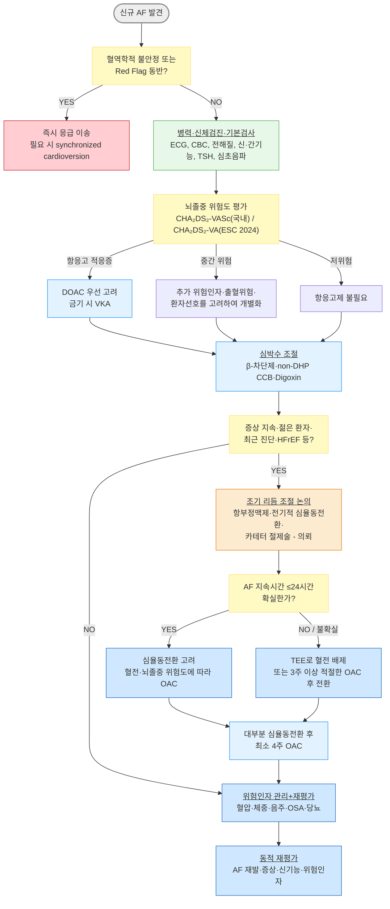

# 심방세동 Atrial Fibrillation

## <mark style="color:green;">일반 사항</mark>

* 심방의 무질서한 전기 활동으로 인해 심방이 효과적으로 수축하지 못하고 심실 박동이 불규칙해지는 부정맥; 가장 흔한 지속성 부정맥
* 유병률 : 성인의 약 1\~2%; 연령이 증가할수록 급격히 증가하며 국내 고령화에 따라 지속적으로 증가하는 추세
* 핵심 위험 : 임상적으로 진단된 AF는 허혈성 뇌졸중 위험을 크게 증가시키며, 위험도는 동반 질환과 위험인자에 따라 달라짐. 기기에서 우연히 발견되는 AHRE/subclinical AF는 임상적 AF와 뇌졸중 위험 및 항응고의 순이득이 다를 수 있으므로 별도로 평가해야 함

#### <mark style="color:$primary;">분류</mark>

<table><thead><tr><th width="228">유형</th><th>정의</th></tr></thead><tbody><tr><td><strong>처음 진단된(First diagnosed)</strong></td><td>이전에 진단된 적이 없는 AF; 지속기간이나 증상 유무와 관계없이 적용</td></tr><tr><td><strong>발작성(Paroxysmal)</strong></td><td>대부분 48시간 이내 자연 종료되며, 최대 7일까지 지속될 수 있음; 7일 이내에 중재 없이 또는 중재 후 동율동으로 회복되는 경우 포함</td></tr><tr><td><strong>지속성(Persistent)</strong></td><td>7일 이상 지속되거나 약물 또는 전기적 심율동전환 등 중재가 필요한 AF</td></tr><tr><td><strong>장기 지속성(Long-standing persistent)</strong></td><td>1년 이상 지속되는 AF에서 동율동 회복을 시도하기로 한 경우</td></tr><tr><td><strong>영구성(Permanent)</strong></td><td>환자와 의료진이 동율동으로 회복하기 위한 추가 시도를 하지 않기로 결정한 AF</td></tr></tbody></table>


**AHRE/subclinical AF는 위 임상적 AF 분류와 별도로 평가**

삽입형 심장기기에서 발견되는 AHRE(atrial high-rate episode) 또는 기기 감지 subclinical AF는 임상적 AF와 동일하게 취급하지 않는다. 심전도에서 임상적 AF가 확진되면 일반적인 AF 관리 원칙을 적용한다. AHRE/subclinical AF에서는 에피소드 지속시간, 뇌졸중 위험인자 및 환자 선호도를 함께 고려하여 추적 또는 선택적 항응고를 결정한다.


## <mark style="color:green;">원인 및 위험 인자</mark>

* 고혈압 : 가장 흔한 동반 위험인자
* 심부전, 관상동맥 질환, 판막 질환(특히 승모판 협착), 비후성 심근병증
* 갑상선 기능 항진증 : 신규 AF의 초기 평가에서 갑상선 기능 검사 시행
* 수면무호흡증(OSA) : 중요한 동반 위험인자; 치료 시 AF 재발 감소와 연관된 관찰 근거가 있음
* 과도한 음주
* 비만, 당뇨병, 만성 신장 질환
* 고령, 흡연, 좌심방 확장 등

## <mark style="color:green;">임상 양상</mark>

* 두근거림(palpitation), 불규칙한 맥박감
* 호흡곤란, 운동 내성 저하, 피로감, 흉부 불편감
* 어지럼, 실신 또는 실신 전구 증상 : 동반 시 혈역학적 불안정, 빈맥, 다른 부정맥 등을 평가
* 상당수는 무증상이며 건강검진 ECG, 웨어러블 ECG 또는 삽입형 기기에서 우연히 발견될 수 있음
* EHRA 증상 점수(1\~4등급)로 AF 관련 증상과 일상생활 제한 정도를 평가

### <mark style="color:$danger;">🚩 Red Flags!</mark>

<mark style="color:$danger;">**즉각 조치 또는 응급 이송**</mark>

* 혈역학적 불안정 : 저혈압, 의식 저하, 쇼크 징후
* 급성 흉통, 급성 심부전 또는 폐부종
* 심한 호흡곤란, 지속적인 매우 빠른 심실 반응과 함께 실신 또는 심한 어지럼
* WPW 증후군을 동반한 pre-excited AF
* 편측 마비, 언어 장애, 시야 장애 등 급성 신경학적 결손 → 급성 뇌졸중 평가

<mark style="color:$warning;">**당일 또는 조기 의뢰**</mark>

* 신규 발생 AF 또는 발병 시점이 불확실한 AF에서 심율동전환 여부 판단이 필요한 경우
* 적절한 심박수 조절에도 빠른 심실 반응이 지속되거나 증상이 지속되는 경우
* 구조적 심장 질환, HFrEF, 비후성 심근병증 또는 유의한 판막 질환이 의심되는 경우
* 조기 리듬 조절 또는 카테터 절제술을 고려하는 증상성 AF
* 항응고 치료가 필요하나 출혈 위험 또는 약물 상호작용이 복잡한 경우

<mark style="color:$info;">**외래 추적 / 추가 평가 계획**</mark> <mark style="color:$info;">- 즉각 위험 낮으나 호전 없으면 의뢰</mark>

* 증상은 경미하나 재발이 반복되거나 AF burden이 증가하는 경우
* 웨어러블·삽입형 기기에서 AHRE/subclinical AF가 반복 발견되는 경우
* 혈압, 체중, 음주, 수면무호흡증 등 교정 가능한 위험인자 관리가 충분하지 않은 경우

## <mark style="color:green;">진단</mark>

### <mark style="color:orange;">진단 기준</mark>

* 12-유도 ECG 전체에서 AF가 확인되거나, 의료진이 판독한 단일 유도 ECG rhythm strip에서 30초 이상 AF가 확인되면 임상적 AF로 진단
  * 전형적으로 뚜렷한 반복성 P파가 없고 RR 간격이 불규칙하게 불규칙(irregularly irregular)함
  * 스마트워치 등 wearable ECG는 진단에 유용한 자료가 될 수 있으나, 자동 알고리즘의 AF 알림만으로 확진하지 않음
  * 삽입형 심장기기의 AHRE는 기기에서 정의된 심방빈맥 에피소드이며 임상적 AF와 동일하게 취급하지 않음. 전문의의 electrogram/ECG 확인과 에피소드 지속시간 및 뇌졸중 위험도 평가가 필요함

### <mark style="color:orange;">초기 평가</mark>

* 병력 : 증상 시작 시점 및 AF 발생 시점, 발작성 여부, 두근거림·흉통·호흡곤란·실신, 음주, 수면무호흡증, 갑상선 질환, 심혈관 질환 및 복용약물
* 신체 검진 : 맥박(불규칙성·맥박 결손), 혈압, 경정맥, 심부전 징후, 심잡음
* 기본 검사
  * 12-유도 ECG
  * CBC, 전해질(K 등), 신기능(Cr/eGFR 또는 CrCl), 간기능
  * 갑상선 기능 검사(TSH ± free T4)
  * 혈당 등 심혈관 위험인자 평가
* 경흉부 심초음파 : 좌심실 수축기능, 심방 크기, 판막 질환 및 기타 구조적 심장 질환 평가; 신규 AF에서 원칙적으로 시행
* 필요 시 Holter 또는 patch ECG : 발작성 AF, 증상-리듬 상관관계 및 AF burden 평가
* EHRA 증상 점수 : AF 관련 증상의 중증도와 일상생활 제한 정도 평가
* 흉부 X선은 호흡곤란, 심부전, 폐질환 등 임상적 적응증이 있을 때 시행하며 모든 AF 환자에서 일률적으로 필요하지는 않음

### <mark style="color:orange;">감별</mark>

* 불규칙한 맥박·두근거림으로 내원 시 아래 부정맥과 감별

<table><thead><tr><th width="140">질환</th><th width="238">AF와의 차이점</th><th>핵심 감별 포인트</th></tr></thead><tbody><tr><td>심방조동<br>(Atrial flutter)</td><td>규칙적 또는 일정한 전도비의 심방조동파(F파)가 보일 수 있음</td><td>II·III·aVF에서 sawtooth pattern이 흔함; 심방조동도 항응고 및 심박수/율동 조절 원칙을 적용하며 전형적 조동은 카테터 절제술 효과가 높음</td></tr><tr><td>발작성 상심실성 빈맥 (PSVT)</td><td>대개 규칙적인 좁은 QRS 빈맥; 역행성 P파가 보이거나 P파가 QRS에 묻힘</td><td>갑작스러운 시작·종료, 규칙적인 RR 간격, 필요 시 adenosine으로 진단·치료에 도움</td></tr><tr><td>빈번한 심실조기수축 (PVC)</td><td>불규칙하게 느껴질 수 있으나 기저 리듬이 존재하고 조기 넓은 QRS가 반복됨</td><td>ECG/Holter에서 PVC 확인 및 burden 평가</td></tr><tr><td>동성빈맥 (Sinus tachycardia)</td><td>정상 P파가 선행하고 RR 간격이 규칙적</td><td>발열·빈혈·갑상선기능항진증·탈수·불안 등 유발 원인 확인</td></tr></tbody></table>

***



<p align="center"><strong>신규 심방세동 초기 평가 및 치료 알고리듬</strong></p>

***

## <mark style="background-color:$warning;">Management</mark>

<mark style="color:cyan;">**AF-CARE**</mark> (2024 ESC/EACTS)

<table><thead><tr><th width="64"></th><th width="154">핵심</th><th>1차 진료 포인트</th></tr></thead><tbody><tr><td><strong>C</strong></td><td>Comorbidity and risk factor management</td><td>고혈압·비만·음주·OSA·당뇨 등 위험인자와 동반질환 관리</td></tr><tr><td><strong>A</strong></td><td>Avoid stroke and thromboembolism</td><td>뇌졸중 위험도 평가 후 적응증에 따라 항응고</td></tr><tr><td><strong>R</strong></td><td>Reduce symptoms by rate and rhythm control</td><td>심박수 조절과 조기·선택적 리듬 조절을 환자 특성에 맞게 시행</td></tr><tr><td><strong>E</strong></td><td>Evaluation and dynamic reassessment</td><td>증상·AF burden·신기능·복약 순응도·위험인자 및 치료 결과를 정기 재평가</td></tr></tbody></table>


**AF burden 개념**

AF를 단순히 "있다/없다"로만 보지 않고, 모니터링 기간 동안 AF가 차지하는 시간 또는 에피소드의 지속시간을 함께 평가하는 개념. AF burden은 혈전색전 위험과 연관될 수 있으나, 임상적 AF에서 항응고 여부를 AF burden만으로 결정하지는 않는다.


### <mark style="color:orange;">C - Comorbidity and risk factor management</mark>

* 고혈압 : 혈압을 현재 고혈압 진료지침에 따라 적절히 조절
* 수면무호흡증 : 의심 환자는 선별 및 진단검사를 고려하고, OSA가 확인되면 적절히 치료; CPAP 치료와 AF 재발 감소의 연관성은 주로 관찰 연구 근거
* 비만 : 체중 감량은 AF 증상·burden 및 재발 감소에 도움이 될 수 있으며, 비만 환자에서는 적극적인 체중 관리 권장
* 음주 : 금주 또는 최소화 권고; 일반 음주자에서 금주가 AF 재발 감소와 연관된 무작위 근거가 있음
* 갑상선 기능 항진증 : 갑상선 기능 정상화 후 AF 지속 여부 및 리듬 조절 필요성을 재평가
* 당뇨, 심부전, 관상동맥 질환, 만성 신장 질환의 최적 관리
* 신체 활동 부족 교정 : 규칙적인 중등도 운동 권장; 만성적인 과도한 지구력 운동은 AF 위험과 연관될 수 있음
* 흡연 중단 및 전반적인 심혈관 위험인자 관리

<table><thead><tr><th width="110">항목</th><th width="180">권장</th><th>비고</th></tr></thead><tbody><tr><td>체중</td><td>비만·과체중이면 적극적 감량</td><td>체중 감소가 AF burden 및 재발 감소와 연관</td></tr><tr><td>혈압</td><td>적절한 혈압 조절</td><td>뇌졸중 및 AF 위험인자 관리의 핵심</td></tr><tr><td>음주</td><td>금주 또는 최소화</td><td>음주량이 많을수록 AF 및 출혈 위험 증가</td></tr><tr><td>운동</td><td>중등도 규칙적 운동</td><td>과도한 장기 지구력 운동은 피하도록 권고</td></tr><tr><td>수면무호흡</td><td>선별 및 적절한 치료</td><td>치료가 AF 재발 감소와 연관될 수 있음</td></tr></tbody></table>

### <mark style="color:orange;">A - Avoid stroke and thromboembolism : 뇌졸중 예방</mark>

#### <mark style="color:$primary;">CHA₂DS₂-VASc 점수 계산</mark>

<table data-header-hidden data-search="false"><thead><tr><th width="214"></th><th width="60"></th><th width="326"></th></tr></thead><tbody><tr><td><strong>항목</strong></td><td><strong>점수</strong></td><td><strong>내용</strong></td></tr><tr><td><strong>C</strong>ongestive Heart Failure</td><td>1</td><td>임상적 심부전 또는 유의한 좌심실 기능 저하; 비후성 심근병증은 국내 지침에서 C 항목에 포함</td></tr><tr><td><strong>H</strong>ypertension</td><td>1</td><td>고혈압</td></tr><tr><td><strong>A₂</strong> (Age ≥75)</td><td>2</td><td>75세 이상</td></tr><tr><td><strong>A</strong> (Age 65–74)</td><td>1</td><td>65~74세</td></tr><tr><td><strong>D</strong>iabetes Mellitus</td><td>1</td><td>당뇨병</td></tr><tr><td><strong>S₂</strong> (Stroke/TIA/TE)</td><td>2</td><td>뇌졸중, TIA 또는 전신 혈전색전증 과거력</td></tr><tr><td><strong>V</strong>ascular disease</td><td>1</td><td>심근경색, 말초동맥질환 또는 대동맥 죽상경화반</td></tr><tr><td><strong>Sc</strong> (Sex category)</td><td>1</td><td>여성; 다른 뇌졸중 위험인자가 없는 여성의 단독 성별 점수는 항응고 적응증이 되지 않음</td></tr></tbody></table>

* 남성 0점, 여성 1점(성별만) : 항응고제 불필요
* 남성 1점, 여성 2점 : 항응고를 고려할 수 있으며 추가 위험인자·출혈위험·환자선호를 함께 평가
* 남성 ≥2점, 여성 ≥3점 : 항응고 권고


**CHA₂DS₂-VA (성별 항목 제외) - 2024 ESC/EACTS**

2024 ESC/EACTS는 성별 항목을 제외한 CHA₂DS₂-VA를 권고합니다. **0점은 항응고를 권고하지 않으며, 1점은 항응고를 고려하고, ≥2점은 항응고를 권고**합니다. 반면 2024 대한부정맥학회 일반 치료 지침은 CHA₂DS₂-VASc를 사용합니다. 따라서 이 책에서는 **국내 실무는 CHA₂DS₂-VASc, ESC 2024는 CHA₂DS₂-VA**로 구분합니다.


#### <mark style="color:$primary;">NOAC 선택 및 처방</mark>


중등도 이상의 승모판 협착 또는 기계판막을 동반한 AF에서는 **NOAC 대신 VKA(와파린)**를 사용합니다.

생체판막(Bioprosthetic valve) 또는 판막성형술(repair)은 기계판막과 동일하게 취급하지 않습니다. 다만 수술 시기, 판막 종류 및 동반 질환에 따라 항응고 전략이 달라질 수 있으므로 순환기내과와 상의합니다.


<table><thead><tr><th width="177">약제</th><th>용량</th><th>비고</th></tr></thead><tbody><tr><td>Dabigatran <mark style="color:blue;">[프라닥사]</mark></td><td>150 ㎎ 1T #2 (표준) / 110 ㎎ 1T #2 (CrCl 30~50, 75세 이상, verapamil 병용 또는 출혈위험 증가 시 고려)</td><td>CrCl을 기준으로 용량 조절; CrCl ＜30 ㎖/min 금기</td></tr><tr><td>Rivaroxaban <mark style="color:blue;">[자렐토]</mark></td><td>20 ㎎ 1T #1 저녁 식사와 함께</td><td>CrCl 15~49 ㎖/min에서는 15 ㎎ #1; CrCl 15 미만은 일반적으로 사용하지 않음</td></tr><tr><td>Apixaban <mark style="color:blue;">[엘리퀴스]</mark></td><td>5 ㎎ 1T #2</td><td>다음 3가지 중 2가지 이상 해당 시 2.5 ㎎ #2 : ① 연령 ≥80세, ② 체중 ≤60 ㎏, ③ 혈청 크레아티닌 ≥1.5 ㎎/㎗</td></tr><tr><td>Edoxaban <mark style="color:blue;">[릭시아나]</mark></td><td>60 ㎎ 1T #1</td><td>CrCl 15~50 ㎖/min 또는 체중 ≤60 ㎏ 또는 특정 P-gp 억제제 병용 시 30 ㎎ #1</td></tr></tbody></table>

* **NOAC 용량은 eGFR이 아니라 각 약제 허가사항과 지침에서 제시하는 CrCl 기준을 우선 사용**하고, Cockcroft-Gault 방식의 CrCl을 확인하여 처방
* 신기능 및 간기능 확인 후 약제 선택; 고령자·저체중·신기능 저하에서는 특히 주의
* 출혈 위험 평가(HAS-BLED)를 참고하되, 출혈 위험이 높다는 이유만으로 항응고 치료를 중단해서는 안 됨. 교정 가능한 출혈 위험인자(혈압 조절, NSAID/항혈소판제 병용, 음주, 약물 상호작용 등)를 먼저 교정
* HAS-BLED는 항응고 여부를 결정하는 점수가 아니라 교정 가능한 출혈 위험인자를 확인하고 추적 빈도를 정하는 데 활용


**무증상(기기 감지) AF/AHRE의 항응고 - 일률적 적용은 곤란**

삽입형 심장기기에서 발견된 AHRE/subclinical AF에서는 일률적인 항응고의 근거가 부족합니다. 2024년 ARTESiA와 NOAH-AFNET 6을 종합한 메타분석에서는 DOAC이 허혈성 뇌졸중을 약 32% 감소시키는 대신 major bleeding을 약 62% 증가시켰습니다. 따라서 특히 짧은 에피소드에서는 뇌졸중 위험도, AHRE 지속시간, 출혈위험 및 환자 선호도를 함께 고려하여 선택적으로 결정합니다. 국내 2024 대한부정맥학회 지침도 24시간 이상 지속되는 AHRE/subclinical AF이면서 뇌졸중 위험이 높은 환자에서 순임상적 이익과 환자 선호도를 고려한 선택적 항응고를 제시합니다.


* 경피적 좌심방이 폐쇄술(LAAO) : 장기간 항응고제 사용에 금기 또는 중대한 출혈 위험으로 장기간 항응고 유지가 어려운 고위험 환자에서 순환기내과 협진을 통해 고려

### <mark style="color:orange;">R - Reduce symptoms by rate and rhythm control</mark>

#### <mark style="color:$primary;">심박수 조절 (Rate Control)</mark>

* 심박수 조절은 많은 AF 환자에서 중요한 초기 치료이며, 리듬 조절을 시행하는 환자에서도 필요할 수 있음
* 목표 : lenient control - 안정 시 맥박수 ＜110회/분을 초기 목표로 하며, 증상이 지속되거나 좌심실 기능이 저하되는 경우 더 엄격한 조절을 고려

<mark style="color:cyan;">**1차 약제**</mark>

<table><thead><tr><th width="146">약제</th><th>처방 예시</th><th>주의</th></tr></thead><tbody><tr><td>β-차단제</td><td>베타록 서방정 47.5 ㎎ #1 또는<br>콩코르(비소프롤롤) 2.5~5 ㎎ #1</td><td>심박수 조절의 대표적 1차 약제; 천식·중증 기관지경련, 급성 비대상성 심부전에서는 주의; HFrEF에서는 적절한 β-차단제 선택</td></tr><tr><td>non-DHP CCB</td><td>헤르벤 서방정 90 ㎎ #2 또는<br>이솦틴 서방정 240 ㎎ #1</td><td>딜티아젬·베라파밀; LVEF ≤40%인 HFrEF에서는 사용하지 않음</td></tr><tr><td>Digoxin</td><td>디곡신 0.0625~0.25 ㎎ #1</td><td>HFrEF 또는 다른 약제의 효과·내약성이 제한적인 경우 고려; 운동 시 심박수 조절 효과가 제한적이며 신기능에 따라 용량 조절 필요</td></tr></tbody></table>

#### <mark style="color:$primary;">리듬 조절 (Rhythm Control)</mark>

* 증상성 AF, 심박수 조절에도 증상이 지속되는 경우, 빈맥유발 심근병증, HFrEF 등에서는 적극적으로 고려
* **조기 리듬 조절** : 진단 후 1년 이내의 AF에서 적절한 환자를 대상으로 조기에 리듬 조절을 시행하면 심혈관 사망·뇌졸중·심부전 또는 급성관동맥증후군 입원 위험을 줄일 수 있음(EAST-AFNET 4)
* 2024 ESC는 적절한 환자에서 리듬 조절을 증상 완화뿐 아니라 질병 진행 및 예후 개선을 위한 전략으로 고려
* 카테터 절제술 : 약물 치료에 실패하거나 불내성이 있는 증상성 AF에서 권고되며, **증상성 발작성 AF에서는 항부정맥제보다 먼저 시행하는 1차 치료 옵션도 가능**; 특히 주요 재발 위험인자가 없는 환자에서 고려. HFrEF 또는 빈맥유발 심근병증이 의심되는 경우에는 더 적극적으로 고려
* 방법 : 항부정맥제, 전기적 심율동전환, 카테터 절제술

<table><thead><tr><th width="150">구조적 심질환/상황</th><th width="220">주요 선택지</th><th>비고</th></tr></thead><tbody><tr><td>구조적 심질환 없음</td><td>플레카이나이드, 프로파페논 등</td><td>Class Ic; 허혈성 심질환 또는 유의한 좌심실 기능 저하에서는 피함. 사용 시 적절한 AV node 차단 병용을 고려</td></tr><tr><td>HFrEF 또는 유의한 구조적 심질환</td><td>아미오다론 등</td><td>장기 사용 시 갑상선·폐·간 독성 및 QT 등을 모니터링; 환자에 따라 카테터 절제술을 적극 고려</td></tr><tr><td>증상성 발작성 AF</td><td>카테터 절제술 또는 항부정맥제</td><td>환자 선호·위험·재발 가능성을 고려하여 1차 카테터 절제술을 선택할 수 있음</td></tr></tbody></table>

* 심율동전환 전 혈전 확인 원칙 : **AF 지속시간이 24시간을 초과하거나 시작 시점을 확실히 알 수 없는 경우**, 경식도 심초음파(TEE)로 좌심방 내 혈전을 배제하거나 3주 이상 적절한 치료 용량의 항응고를 시행한 후 계획된 심율동전환을 시행
* 24시간 이내의 명확한 발병 AF에서도 혈전색전 위험은 환자의 위험도에 따라 달라질 수 있으므로 항응고 필요성을 개별 평가
* 혈역학적 불안정이 AF에 의해 발생한 경우에는 항응고 여부 때문에 심율동전환을 지연하지 않고 즉시 synchronized electrical cardioversion 시행
* 심율동전환 후에는 대부분 최소 4주간 항응고를 유지하며, 이후 장기 항응고 여부는 심율동 회복 여부가 아니라 뇌졸중 위험도에 따라 결정

### <mark style="color:orange;">E - Evaluation and dynamic reassessment</mark>

* NOAC 복용 환자 : 신기능·간기능·혈압·복약 순응도 및 출혈 여부를 정기적으로 확인; 신기능 저하, 고령 또는 임상 상태 변화가 있으면 더 자주 평가
* 심박수 모니터링 : 맥박 측정 또는 ECG; 목표 달성 및 서맥 여부 확인
* 위험인자(C) 관리 목표 달성 여부 정기 평가 - 혈압, 체중, 음주, OSA, 당뇨, 신장질환 등
* 리듬 조절 시행 후에도 증상 및 재발 감시(ECG·Holter·patch·기기 데이터)
* 카테터 절제술 후 항응고는 최소 초기 2개월 유지하고, 이후 지속 여부는 리듬 상태가 아니라 뇌졸중 위험도에 따라 결정
* 새로운 증상(뇌졸중 증상, 중대한 출혈, 심부전 악화) 발생 시 즉시 평가

***

## <mark style="color:red;">질병코드</mark>

I48.0 발작성 심방세동\
I48.1 지속성 심방세동\
I48.2 만성 심방세동\
I48.9 상세불명의 심방세동

***

## <mark style="color:purple;">처방례</mark>

✽처방 전 재확인 : NOAC 용량은 eGFR이 아니라 Cockcroft-Gault 방식의 CrCl 및 각 약제의 국내 허가사항을 기준으로 결정

> **처방례 1. 심방세동 - 심박수 조절 + 뇌졸중 예방(NOAC)**
>
> _(CHA₂DS₂-VASc 고위험군, 신기능 정상, 비판막성 AF)_
>
> ```
> 베타록 서방정 47.5 ㎎/T  1T  #1
> 엘리퀴스 5 ㎎/T  1T  #2
> ```

> **처방례 2. 심방세동 - 심박수 조절 + NOAC**
>
> _(75세 이상, CrCl 30~50 mL/min, 출혈 위험 보통)_
>
> ```
> 콩코르 2.5 ㎎/T  1T  #1
> 프라닥사 110 ㎎/T  1T  #2
> ```
>
> ※ 다비가트란 110 ㎎ #2는 75세 이상 또는 CrCl 30~50 mL/min 등 출혈위험이 증가한 경우 고려할 수 있음. CrCl ＜30 mL/min에서는 금기.

> **처방례 3. 신규 진단 발작성 AF - 조기 리듬 조절 논의를 위한 의뢰 전 처방**
>
> _(60세, 증상성 발작성 AF, 심초음파상 구조적 이상 없음, 진단 후 1년 이내)_
>
> ```
> 자렐토 20 ㎎/T  1T  #1 저녁 식사와 함께
> ```
>
> ※ 항응고 적응증은 뇌졸중 위험도에 따라 결정한다. 젊고 증상성인 조기 AF에서는 항부정맥제 또는 카테터 절제술을 통한 조기 리듬 조절 여부를 순환기내과와 상의한다.


**WPW 증후군 동반 AF - AV node 차단제 금기**

pre-excited AF에서는 β-차단제·non-DHP CCB·Digoxin 등 AV node 차단제를 사용하지 않는다. 부전도로를 통한 심실 전도가 증가하여 VF 위험이 있으므로 **즉시 응급 의뢰 및 필요 시 synchronized electrical cardioversion**이 원칙이다.



**NOAC 처방 전 필수 확인**

* **CrCl** : 각 약제별 감량·금기 기준 상이
* 간기능 : 진행된 간질환에서는 약제별 허가사항 확인; 특히 Child-Pugh C에서는 일반적으로 NOAC 사용을 피함
* 병용 약물 : P-gp 및 CYP3A4 관련 상호작용, 항혈소판제·NSAID 병용 여부 확인
* 판막성 AF 여부 : 기계판막·중등도 이상 승모판 협착에서는 와파린
* 리바록사반은 AF에서 저용량을 사용할 때도 음식과 함께 복용


***

### <mark style="color:$success;">핵심 복약 지도</mark>

> **NOAC (다비가트란·리바록사반·아픽사반·에독사반)**
>
> * 이 약은 혈전이 생기는 것을 억제하여 뇌졸중을 예방합니다. **임의로 중단하면 뇌졸중 위험이 증가할 수 있습니다.** 반드시 의사와 상의 후 중단 여부를 결정하십시오.
> * 출혈이 멈추지 않거나, 소변이 붉거나, 대변이 검고 끈적하거나, 피를 토하거나, 갑작스러운 심한 두통·시야 이상·언어 장애가 생기면 즉시 진료를 받으십시오.
> * 수술·시술·발치가 필요한 경우 항응고제 복용 사실을 미리 알리십시오.
> * 리바록사반(자렐토)은 AF 용량인 15 ㎎ 또는 20 ㎎을 음식과 함께 복용하십시오.

> **베타록(메토프롤롤) / 헤르벤(딜티아젬) - 심박수 조절제**
>
> * 약을 갑자기 중단하지 마십시오. 중단이 필요하면 의사와 상의하십시오.
> * 맥박이 지나치게 느려지거나 심한 어지럼·실신·호흡곤란이 생기면 즉시 진료를 받으십시오.

***

### <mark style="color:blue;">환자 안내서</mark>


**심방세동은 뇌졸중 예방과 위험인자 관리가 중요합니다**

심방세동이 있어도 뇌졸중 위험을 평가하고 적절히 관리하면 합병증 위험을 줄일 수 있습니다.


#### <mark style="color:$primary;">심방세동이란 무엇인가요?</mark>

* 심장 윗부분(심방)이 불규칙하게 움직이는 부정맥입니다
* 불규칙한 두근거림, 숨 가쁨, 어지럼, 피로감이 생길 수 있으며 증상 없이 발견되는 경우도 많습니다
* 중요한 위험 중 하나는 심방 내 혈전이 생겨 뇌로 이동하면서 뇌졸중을 일으키는 것입니다

#### <mark style="color:$primary;">왜 항응고제를 먹어야 하나요?</mark>

* 심방세동이 있으면 심방 안에 혈전이 생길 위험이 증가합니다
* 항응고제는 혈전이 생기는 것을 줄여 뇌졸중 위험을 낮춥니다
* 모든 심방세동 환자가 항응고제를 먹는 것은 아니며, 나이·고혈압·당뇨·심부전·과거 뇌졸중 등의 위험인자를 종합하여 결정합니다
* 스마트워치나 삽입형 기기에서 우연히 발견된 짧은 무증상 AF/AHRE는 일반적인 심방세동과 항응고 결정이 다를 수 있으므로 담당 의사와 상의하십시오


**아스피린은 심방세동의 뇌졸중 예방을 위한 항응고제를 대신할 수 없습니다.**

항응고제가 필요한 심방세동에서 아스피린만 복용하는 것은 적절하지 않을 수 있습니다. 항응고제 복용 여부는 담당 의사와 상의하십시오.


#### <mark style="color:$primary;">생활 속 실천 사항</mark>

* **음주 줄이기** : 술은 심방세동을 유발·악화할 수 있습니다. 가능하면 금주하거나 최소화하십시오
* **고혈압 관리** : 혈압약을 꾸준히 복용하고 적절한 목표 혈압을 유지하십시오
* **체중 조절** : 과체중·비만이라면 체중을 줄이는 것이 심방세동의 증상과 재발을 줄이는 데 도움이 될 수 있습니다
* **수면무호흡증 치료** : 코골이가 심하거나 수면 중 숨이 멎는다는 말을 들으면 진료를 받으십시오
* **규칙적인 운동** : 적당한 강도의 운동은 도움이 되지만, 장기간의 과도한 지구력 운동은 피하십시오
* **금연** : 심방세동뿐 아니라 뇌졸중·심근경색 등 심혈관 위험을 낮추기 위해 금연하십시오

#### <mark style="color:$primary;">이럴 때는 즉시 119를 부르거나 응급실로 가세요</mark>

* 갑작스러운 한쪽 팔다리 마비, 발음 이상, 시야 장애 등 뇌졸중 증상
* 극심한 흉통 또는 심한 호흡 곤란
* 두근거림과 함께 실신 또는 심한 어지럼이 발생할 때
* 대변이 검고 끈적거리거나 피를 토하는 등 심한 출혈이 의심될 때
