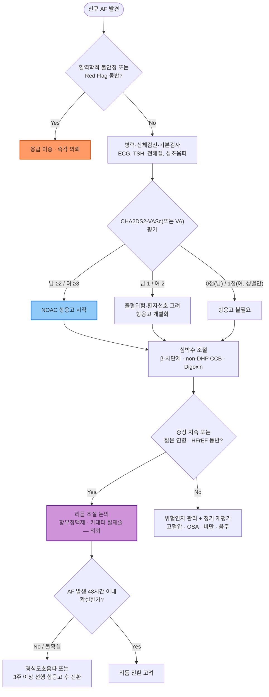

# 심방세동 Atrial Fibrillation

## <mark style="color:green;">일반 사항</mark>

* 심방의 비조직적 전기 활동으로 인한 불규칙한 심방 수축; 가장 흔한 지속성 부정맥
* 유병률 : 성인의 약 1\~2%; 70세 이상에서 5\~10%; 국내 고령화로 유병률 지속 증가 추세
* 핵심 위험 : 임상적으로 진단된 AF는 뇌졸중 위험을 약 5배 증가시킴(Framingham 코호트); 스마트워치·Holter 등으로 우연히 발견되는 기기 감지(무증상) AF는 위험 증가 폭이 상대적으로 작고(약 2.5배, ASSERT 연구) 항응고 여부는 위험도에 따라 개별화해야 함 (☞ 하단 A 섹션 참조)

### <mark style="color:orange;">분류</mark>

| 유형                                   | 정의                                |
| ------------------------------------ | --------------------------------- |
| **발작성(Paroxysmal)**                  | 7일 이내 자연 종료; 재발 가능                |
| **지속성(Persistent)**                  | 7일 초과 지속; 자연 종료되지 않음              |
| **장기 지속성(Long-standing persistent)** | 1년 이상 지속                          |
| **영구성(Permanent)**                   | 리듬 조절 시도를 포기하고 rate control만 유지   |
| **무증상(Subclinical/Silent, 기기 감지)**   | 증상 없이 발견; 스마트워치·Holter·삽입기기에서 우연 발견 증가; 임상적 AF와 뇌졸중 위험 정도가 다를 수 있음 |


**이 챕터의 핵심 로드맵 - AF-CARE (2024 ESC/EACTS)**


<table><thead><tr><th width="70">단계</th><th width="220">핵심</th><th>1차 진료 포인트</th></tr></thead><tbody><tr><td><strong>C</strong></td><td>Comorbidity 관리</td><td>고혈압·비만·음주·OSA·당뇨 등 위험인자 및 AF burden 관리</td></tr><tr><td><strong>A</strong></td><td>Avoid stroke</td><td>CHA₂DS₂-VASc(VA) 평가 후 NOAC 등 항응고</td></tr><tr><td><strong>R</strong></td><td>Rate/Rhythm control</td><td>심박수 조절 우선, 조기/선택적 리듬 조절(항부정맥제·절제술) 고려</td></tr><tr><td><strong>E</strong></td><td>Evaluation</td><td>정기 재평가 — 신기능·순응도·재발·위험인자 목표 달성 여부</td></tr></tbody></table>


**AF burden 개념**

최근에는 AF를 "있다/없다"의 이분법이 아니라, 총 지속 시간의 비율인 **AF burden**(부담) 개념으로 접근하는 경향이 강화되고 있습니다. 위험인자 관리(C)를 통해 AF burden 자체를 줄이는 것이 뇌졸중·심부전 등 합병증 위험 감소와 연관된다는 근거가 축적되고 있습니다.


## <mark style="color:green;">원인 및 위험 인자</mark>

* 고혈압 (가장 흔한 원인; AF 환자의 60\~80%)
* 심부전, 관상동맥 질환, 판막 질환 (특히 승모판 질환)
* 갑상선 기능 항진증 : 신규 AF 발견 시 TSH 필수 확인
* 수면무호흡증(OSA) : 독립적 위험인자; CPAP 치료 시 AF 재발 감소
* 과도한 음주 ("Holiday Heart" syndrome 포함)
* 비만, 당뇨, 만성 신장 질환
* 고령, 남성

## <mark style="color:green;">임상 양상</mark>

* 두근거림(palpitation), 불규칙한 맥박감
* 호흡곤란, 운동 내성 저하, 피로감, 흉부 불편감
* 어지럼, 실신 전구 증상(드묾; 동반 시 Red Flag 평가)
* 상당수(약 1/3 이상)는 무증상이며, 건강검진 심전도나 스마트워치에서 우연히 발견됨
* EHRA 증상 점수(1\~4등급)로 일상생활 제한 정도를 평가 (☞ 진단 섹션)

### <mark style="color:$danger;">🚩 Red Flags!</mark>

<mark style="color:$danger;">**즉각 조치 또는 응급 이송**</mark>

* 혈역학적 불안정 : 저혈압(SBP ＜90 ㎜Hg), 의식 저하, 쇼크 징후
* 급성 흉통 동반 (급성 관상동맥 증후군 감별)
* 심한 호흡 곤란, 급성 폐부종
* 빈맥(＞150회/분) 동반 실신 또는 실신 전구 증상
* WPW 증후군 동반 AF&#x20;
* 급성 허혈성 뇌졸중이 의심되는 AF(편측 마비, 언어 장애, 시야 장애 등 신경학적 결손 동반) → **Stroke Code 활성화** — 혈전용해술/혈전제거술이 가능한 뇌졸중 집중치료팀 보유 병원으로 골든타임 내 이송

<mark style="color:$warning;">**당일 또는 조기 의뢰**</mark>

* 신규 발생 AF (48시간 이내 여부 불확실 포함)
* 심박수 조절 약물에도 맥박 ≥110회/분 지속
* 심초음파가 필요한 경우 (구조적 심장 질환 배제)
* 항응고 요법 시작 전 복잡한 출혈 위험 평가가 필요한 경우
* 젊은 환자에서 리듬 조절(절제술) 고려 시

<mark style="color:$info;">**외래 추적 / 추가 평가 계획**</mark> <mark style="color:$info;">- 즉각 위험 낮으나 호전 없으면 의뢰</mark>

* 심박수 조절 약제 조정 후에도 목표 심박수(＜110회/분) 미달 시 재평가
* 기기·스마트워치에서 우연히 짧은 무증상 AHRE(atrial high-rate episode)가 반복 발견되는 경우 → 항응고 필요성 공유의사결정을 위한 순환기내과 협진
* 리듬 조절(항부정맥제) 시작 후 정기적 QT/간·신기능 모니터링 계획
* 위험인자(체중·혈압·음주·OSA) 관리 목표 미달로 AF 부담이 지속되는 경우

## <mark style="color:green;">진단</mark>

### <mark style="color:orange;">진단 기준</mark>

* 12-유도 ECG 또는 **의료진이 확인한(physician-reviewed)** 30초 이상의 단일 유도 ECG rhythm strip에서 P파 소실 &/or 불규칙한 RR interval
  * 스마트워치 등 wearable ECG로 포착한 데이터도 진단 참고 자료로 활용 가능; 단, 확진은 12-유도 ECG 또는 의료진이 판독한 단일 유도 30초 이상 rhythm strip으로 함
  * 삽입기기에서 감지된 AHRE(atrial high-rate episode)는 기기가 정의한(device-defined) 심방빈맥 에피소드로, 12-유도 ECG로 확진된 임상적 AF와 동일하게 취급하지 않음; 구체적 duration 역치는 연구마다 상이(ASSERT 6분, NOAH ＞6분, ARTESiA 6분\~24시간 등)하므로 특정 분(分) 수를 진단 기준처럼 고정하지 않음(☞ A 섹션 hint 참조)

### <mark style="color:orange;">초기 평가</mark>

* 병력 : 증상 시작 시점(48시간 기준 중요), 발작성 여부, 동반 증상(흉통·실신·호흡 곤란)
* 신체 검진 : 맥박(불규칙성·맥박 결손), 혈압, 경정맥 확장, 폐 청진
* 기본 검사
  * 12-유도 ECG
  * CBC, 전해질(K, Mg), 신기능(BUN/Cr), 간기능
  * TSH (갑상선 기능 항진증 배제 필수)
  * 혈당, 공복 지질
  * 흉부 X선
* 심초음파 : 구조적 심장 질환(판막 질환, 심부전, 비후성 심근병증 등) 평가; 신규 AF에서 원칙적으로 시행&#x20;
* EHRA 증상 점수 : 환자의 일상생활 제한 정도 파악 (1\~4등급)

### <mark style="color:orange;">감별 진단</mark>

* 불규칙한 맥박·두근거림으로 내원 시 아래 부정맥과 감별

<table><thead><tr><th width="140">질환</th><th width="260">AF와의 차이점</th><th>핵심 감별 포인트</th></tr></thead><tbody><tr><td>심방조동(Atrial flutter)</td><td>규칙적인 톱니 모양(sawtooth) F파, RR interval이 대개 규칙적</td><td>ECG상 II·III·aVF 유도에서 sawtooth pattern; 치료 원칙은 AF와 유사하나 절제술 성공률이 더 높음</td></tr><tr><td>발작성 상심실성 빈맥(PSVT)</td><td>P파 소실이 아닌 역행성 P파 또는 P파 묻힘; 리듬 규칙적</td><td>갑작스런 시작·종료, 젊은 연령, adenosine 반응성으로 감별</td></tr><tr><td>빈번한 심실조기수축(PVC)/이단맥</td><td>불규칙하게 느껴지나 기저 리듬은 동율동; ECG에서 넓은 QRS 조기박동</td><td>Holter로 PVC burden 확인; P파 정상 존재</td></tr><tr><td>동성빈맥(Sinus tachycardia)</td><td>규칙적인 리듬, 정상 P파 선행</td><td>발열·빈혈·갑상선기능항진증·불안 등 이차 원인 확인</td></tr></tbody></table>

***



<p align="center"><strong>신규 심방세동 초기 평가 및 치료 알고리듬</strong></p>

<p align="center"><em><mark style="color:$info;">Ref. 2024 ESC/EACTS Guidelines for the management of atrial fibrillation (AF-CARE); 대한부정맥학회</mark></em></p>

***

## <mark style="background-color:$warning;">Management</mark>


**ABC 경로(2020 ESC) → AF-CARE 경로(2024 ESC/EACTS)로 개편**

2024년 ESC/EACTS 가이드라인은 기존 "ABC(Anticoagulation - Better symptom control - Cardiovascular risk)" 경로를 **AF-CARE**로 개편하여, 동반질환·위험인자 관리(Comorbidity)를 관리의 출발점으로 재배치했습니다. 아래는 이 순서(C→A→R→E)를 따릅니다 (☞ 요약표는 상단 일반 사항 참조).


### <mark style="color:orange;">C - Comorbidity and risk factor management : 동반질환·위험인자 관리</mark>

* 고혈압 : 목표 혈압 달성이 AF 재발 및 뇌졸중 위험 감소에 직결
* 수면무호흡증 : CPAP 치료 시 AF 재발 및 부담 감소; STOP-BANG 등으로 선별 (☞ 수면무호흡증)
* 비만 : 체중의 10% 이상 감량 시 AF 부담 유의하게 감소
* 음주 : 완전 금주 또는 최소화 권고; 음주량과 AF 부담은 용량-반응 관계
* 갑상선 기능 항진증 치료 후 AF 호전 여부 재평가
* 당뇨, 심부전, 관상동맥 질환의 최적 관리
* 신체 활동 부족 교정 : 규칙적인 중강도 유산소 운동 권장(과도한 지구력 운동은 오히려 AF 위험 증가 가능)

<table><thead><tr><th width="110">항목</th><th width="180">목표</th><th>비고</th></tr></thead><tbody><tr><td>체중</td><td>10% 이상 감량</td><td>비만 환자에서 AF 부담 유의하게 감소</td></tr><tr><td>혈압</td><td>목표 혈압 유지</td><td>AF 재발·뇌졸중 위험 감소와 직결</td></tr><tr><td>음주</td><td>금주 또는 최소화</td><td>용량-반응 관계</td></tr><tr><td>운동</td><td>중강도 유산소 운동</td><td>과도한 지구력 운동은 오히려 위험 증가 가능</td></tr><tr><td>수면무호흡</td><td>적극 치료(CPAP 등)</td><td>STOP-BANG 등으로 선별</td></tr></tbody></table>

### <mark style="color:orange;">A - Avoid stroke and thromboembolism : 뇌졸중 예방</mark>

#### <mark style="color:$primary;">CHA₂DS₂-VASc 점수 계산</mark>

<table data-header-hidden data-search="false"><thead><tr><th width="214"></th><th width="60"></th><th width="326"></th></tr></thead><tbody><tr><td><strong>항목</strong></td><td><strong>점수</strong></td><td><strong>내용</strong></td></tr><tr><td><strong>C</strong>ongestive Heart Failure</td><td>1</td><td>심부전 또는 좌심실 기능 저하</td></tr><tr><td><strong>H</strong>ypertension</td><td>1</td><td>고혈압</td></tr><tr><td><strong>A₂</strong> (Age ≥75)</td><td>2</td><td>75세 이상</td></tr><tr><td><strong>A</strong> (Age 65–74)</td><td>1</td><td>65~74세</td></tr><tr><td><strong>D</strong>iabetes Mellitus</td><td>1</td><td>당뇨병</td></tr><tr><td><strong>S₂</strong> (Stroke/TIA)</td><td>2</td><td>뇌졸중, TIA, 혈전색전증 과거력</td></tr><tr><td><strong>V</strong>ascular disease</td><td>1</td><td>심근경색, 말초동맥질환, 대동맥 플라크</td></tr><tr><td><strong>Sc</strong> (Sex category)</td><td>1</td><td>여성 (단독으로는 항응고 적응증이 되지 않음)</td></tr></tbody></table>

* 남성 ≥2점, 여성 ≥3점 : 항응고 요법(NOAC) 강력 권고
* 남성 1점, 여성 2점 : 환자 상태에 따라 항응고 요법 고려
* 0점(남성), 1점(여성, 성별 점수만) : 항응고 요법 불필요


**CHA₂DS₂-VA (성별 항목 제외) - 2024 ESC/EACTS**

2024 ESC/EACTS 가이드라인은 여성(Sc) 항목을 제외한 **CHA₂DS₂-VA** 점수 사용을 권고합니다(0점 : 항응고 불필요, 1점 : 개별화하여 고려, ≥2점 : 항응고 권고 — 성별 구분 없이 동일 기준). **국내에서는 현재도 CHA₂DS₂-VASc(성별 포함, 위 표) 기준을 주로 사용**하며, 2023 ACC/AHA/ACCP/HRS(미국) 가이드라인도 기존 VASc를 유지하고 있습니다. 즉 "국내 실무 = VASc, 최신 ESC 권고 = VA"로 구분해 기억하면 혼동을 줄일 수 있습니다.


#### <mark style="color:$primary;">NOAC 선택 및 처방</mark>


판막성 AF(중등도\~중증 승모판 협착, 기계판막) 에서는 **NOAC 사용 불가** → 와파린 사용; 의뢰

**주의 - 생체판막(Bioprosthetic valve)은 다름** : 생체 판막 치환술 후 또는 판막성형술(repair) 후 환자는 기계판막과 달리 NOAC 사용이 가능합니다(단, 수술 직후 초기 3개월 등 특정 시기는 제외하며 순환기내과 상의 필요). "판막 수술 이력 = 무조건 와파린"으로 오인하지 않도록 주의


<table><thead><tr><th width="177">약제</th><th>용량</th><th>비고</th></tr></thead><tbody><tr><td><strong>다비가트란(dabigatran)</strong> <mark style="color:blue;">[프라닥사]</mark></td><td>150 ㎎ 1T #2 (표준) / 110 ㎎ 1T #2 (80세 이상은 필수 감량; 75~79세는 병용 출혈위험인자 동반 시 감량 고려)</td><td>신기능 의존도 높음; eGFR ＜30 금기</td></tr><tr><td><strong>리바록사반(rivaroxaban)</strong> <mark style="color:blue;">[자렐토]</mark></td><td>20 ㎎ 1T #1 저녁 식사와 함께</td><td>eGFR 15~49 시 15 ㎎으로 감량; eGFR ＜15 금기</td></tr><tr><td><strong>아픽사반(apixaban)</strong> <mark style="color:blue;">[엘리퀴스]</mark></td><td>5 ㎎ 1T #2</td><td>다음 3가지 중 <strong>2가지 이상</strong> 해당 시 2.5 ㎎ #2로 감량 : ① 연령 ≥80세 ② 체중 ≤60 ㎏ ③ 혈청 크레아티닌 ≥1.5 ㎎/㎗</td></tr><tr><td><strong>에독사반(edoxaban)</strong> <mark style="color:blue;">[릭시아나]</mark></td><td>60 ㎎ 1T #1</td><td>eGFR 15~50, 체중 ≤60 ㎏, 또는 강력한 P-gp 억제제 병용 시 30 ㎎으로 감량; CrCl ＞95 ㎖/min에서는 효과 감소 가능성이 보고되어(ENGAGE AF-TIMI 48 사후분석, 미국 FDA 라벨 기준) 다른 NOAC을 우선 고려 — 국내 허가사항도 처방 전 확인 필요</td></tr></tbody></table>

* 신기능(eGFR) 및 간기능 확인 후 약제 선택
* 출혈 위험 평가(HAS-BLED) 참고하되, 출혈 위험이 높다는 이유만으로 항응고 치료를 중단해서는 안 됨 - 교정 가능한 출혈 위험인자(고혈압 조절, 약물 상호작용, 음주 중단)를 먼저 교정
* **HAS-BLED는 항응고 여부를 결정하는 점수가 아니라, 교정 가능한 출혈 위험인자를 확인하기 위한 체크리스트**임 - 점수가 높다는 것 자체가 항응고 금기를 의미하지 않음


**무증상(기기 감지) AF/AHRE의 항응고 - 일률적 적용은 곤란**

삽입기기로 발견된 무증상 심방고빈맥(AHRE)·기기 감지 AF에 대한 무작위 연구(NOAH-AFNET 6, ARTESiA, NEJM 2024)에서 항응고는 뇌졸중을 상대적으로 약 32% 감소시켰으나 주요 출혈을 약 62% 증가시켜, 대다수 환자에서 순이득이 불확실합니다. **저위험군에서는 일률적 항응고가 권장되지 않으며**, 뇌졸중 위험이 높은 환자군(CHA₂DS₂-VASc 고득점, 추가 위험인자 동반)에서만 **환자와의 공유의사결정(shared decision-making)**을 통해 개별화하여 결정합니다 → 순환기내과 협진 고려


* 경피적 좌심방이 폐쇄술(Left Atrial Appendage Occlusion, LAAO) : 항응고 절대 금기(NOAC/와파린 모두 불가)인 경우뿐 아니라, **반복적인 major bleeding**이나 **장기간 항응고 유지가 임상적으로 어려운 고위험 환자**에서도 대안으로 고려될 수 있음(2024 ESC 기준 약한 권고, Class IIb 수준) → 순환기내과(구조적 심장 중재) 의뢰

***

### <mark style="color:orange;">R - Reduce symptoms by rate and rhythm control : 심박수·리듬 조절</mark>

#### <mark style="color:$primary;">심박수 조절 (Rate Control)</mark>&#x20;

* 대부분의 경우 우선 선택
* 목표(RACE II) : lenient control - 안정 시 맥박수 ＜110회/분(대부분 우선 선택); 증상 지속 시 **strict control**(안정 시 ＜80회/분, 중등도 운동 시 ＜110회/분) 고려

<mark style="color:cyan;">**1차 약제**</mark>

<table><thead><tr><th width="146">약제</th><th>처방 예시</th><th>주의</th></tr></thead><tbody><tr><td>β-차단제</td><td>베타록 서방정 47.5 ㎎ #1 또는 <br>콩코르(비소프롤롤) 2.5~5 ㎎ #1</td><td>만성 AF rate control에는 비소프롤롤·메토프롤롤·카르베딜롤이 선호됨(인데놀 등 propranolol은 단시간 작용으로 상대적으로 덜 사용); 천식·COPD 주의; 심부전에서 카르베딜롤·비소프롤롤 선호</td></tr><tr><td>non-DHP CCB</td><td>헤르벤 서방정 90 ㎎ #2 또는 <br>이솦틴 서방정 240 ㎎ #1</td><td>심부전(EF 저하) 환자에게 금기</td></tr><tr><td>Digoxin</td><td>디곡신 0.125~0.25 ㎎ #1</td><td>미주신경 긴장도를 높이는 기전상 **좌심실 기능 저하(HFrEF) 또는 좌식 생활 환자**에서 특히 유용; 운동(교감신경 항진) 시에는 심박수 조절 효과가 떨어짐; 혈중 농도 모니터링 필요</td></tr></tbody></table>

#### <mark style="color:$primary;">리듬 조절 (Rhythm Control)</mark>&#x20;

* 심박수 조절 후에도 증상 지속, 젊은 연령, 빈맥 유발성 심근병증 우려 시 고려 - 의뢰
* **리듬 조절의 목표 확장 - 증상 완화를 넘어 예후 개선** : 2024 ESC는 리듬 조절을 단순한 "증상 치료"가 아니라, 선택된 환자군(신규 진단·동반 위험인자 보유)에서는 심혈관 사망·뇌졸중·입원 등 예후 개선(prognosis improvement)까지 기대할 수 있는 전략으로 강조함
* **조기 리듬 조절 근거 강화(EAST-AFNET 4, NEJM 2020; 2024 ESC 권고 등급 상향)** : 진단 후 1년 이내 조기에 리듬 조절을 시행한 군에서 심혈관 사망·뇌졸중·심부전 입원이 유의하게 감소함 — 특히 동반 위험인자가 있는 신규/조기 AF 환자에서는 "치료 실패 후"가 아니라 조기에 리듬 조절 여부를 논의 → 의뢰
* **카테터 절제술의 지위 상향** : HFrEF 동반 AF(CASTLE-AF)나 젊은 발작성 AF 환자(EARLY-AF, CABANA)에서 항부정맥제보다 먼저 고려될 수 있는 1차 리듬조절 옵션으로 자리잡음; 최종 결정은 전기생리학 전문의 협진
* 방법 : 항부정맥제(플레카이나이드·프로파페논·아미오다론 등), 전기적 심율동 전환, 카테터 절제술

<table><thead><tr><th width="150">구조적 심질환/상황</th><th width="220">1차 선택</th><th>비고</th></tr></thead><tbody><tr><td>구조적 심질환 없음, 젊은 환자</td><td>플레카이나이드, 프로파페논</td><td>Class Ic제; 관상동맥질환·심부전에서는 금기(CAST 연구)</td></tr><tr><td>구조적 심질환·심부전(HFrEF) 동반</td><td>아미오다론</td><td>효과적이나 갑상선·폐·간 독성 등 장기 부작용 감시 필요; 장기 사용 시 정기 모니터링(TSH, 흉부 X선, 간기능)</td></tr><tr><td>치료 저항성 또는 재발성</td><td>카테터 절제술 — 의뢰</td><td>항부정맥제보다 먼저 고려되는 경우도 증가(HFrEF, 젊은 발작성 AF)</td></tr></tbody></table>

* 리듬 조절 시도 전 혈전 확인 원칙 : AF 발생 48시간 이내 여부 불확실하거나 48시간 초과 시 → 경식도 초음파(혈전 배제) 또는 3주 이상 선행 항응고 요법 필수
  * 단, **이미 3주 이상 적절한 치료 용량의 항응고가 유지되고 있던 환자**는 48시간 경과 여부와 무관하게 TEE 없이 리듬 전환 가능

***

### <mark style="color:orange;">E - Evaluation and dynamic reassessment : 평가 및 동적 재평가</mark>

* NOAC 복용 환자 : 3\~6개월마다 신기능·간기능·혈압 확인; 복약 순응도 점검
* 심박수 모니터링 : 맥박 측정 또는 ECG; 목표 달성 여부 확인
* 위험인자(C) 관리 목표 달성 여부 정기 평가 — AF는 고정된 진단이 아니라 위험인자 변화에 따라 부담이 변동하는 만성 질환이라는 관점으로 접근
* 리듬 조절 시행 후에도 정기적 재발 감시(증상·ECG·기기 데이터)
* 새로운 증상(뇌졸중 증상, 출혈 증상, 심부전 악화) 발생 시 즉시 평가

***

## <mark style="color:red;">질병코드</mark>

I48.0 발작성 심방세동 \
I48.1 지속성 심방세동\
I48.2 만성(영구성) 심방세동\
I48.9 상세불명의 심방세동

***

## <mark style="color:purple;">처방례</mark>

✽처방 전 재확인 : 에독사반(릭시아나)은 CrCl ＞95 ㎖/min에서는 효과 감소 가능성이 있어 다른 NOAC을 우선 고려

> **처방례 1. 심방세동 - 심박수 조절 + 뇌졸중 예방(NOAC)**
>
> _(CHA₂DS₂-VASc ≥2점, 신기능 정상, 비판막성 AF)_
>
> ```
> 베타록 서방정 47.5 ㎎/T  1T  #1
> 엘리퀴스 5 ㎎/T  1T  #2
> ```

> **처방례 2. 심방세동 - 심박수 조절(심부전 동반 불가 시 CCB 대신 β-차단제) + NOAC**
>
> _(75세 이상, eGFR 35 mL/min/1.73m², 출혈 위험 보통)_
>
> ```
> 콩코르 2.5 ㎎/T  1T  #1
> 프라닥사 110 ㎎/T  1T  #2
> ```
>
> ※ 만성 AF 심박수 조절에는 인데놀(propranolol)보다 비소프롤롤·메토프롤롤·카르베딜롤 등이 실제 처방에서 더 흔히 선호됨
>
> ※ 다비가트란(프라닥사) 75세 이상·eGFR 30\~50에서 110 ㎎ #2 선택; eGFR ＜30 금기

> **처방례 3. 신규 진단 발작성 AF - 조기 리듬 조절 논의를 위한 의뢰 전 처방**
>
> _(60세, 증상성 발작성 AF, 심초음파상 구조적 이상 없음, 진단 후 1년 이내)_
>
> ```
> 자렐토 20 ㎎/T  1T  #1 저녁 식사와 함께
> ```
>
> ※ 심박수 조절과 항응고를 우선 시작하되, 젊은 연령·조기 진단인 점을 고려해 항부정맥제·카테터 절제술을 통한 조기 리듬 조절 여부를 순환기내과와 상의하도록 안내(EAST-AFNET 4 근거)


**WPW 증후군 동반 AF - AV node 차단제 절대 금기**

β-차단제·non-DHP CCB·Digoxin은 부전도로(accessory pathway)로 자극을 집중시켜 심실세동(VF)으로 이행될 위험 → **즉시 응급 의뢰**



**NOAC 처방 전 필수 확인**

* eGFR : 약제별 감량·금기 기준 상이 (위 표 참조)
* 간기능 : 중증 간기능 저하(Child-Pugh C) 시 대부분 금기
* 병용 약물 : P-gp 억제제(아미오다론, 베라파밀 등), CYP3A4 강력 억제제와 상호작용 확인
* 판막성 AF 여부 : 기계판막·중등도↑ 승모판 협착 시 와파린으로
* 에독사반은 CrCl ＞95 ㎖/min에서 효과 감소 가능성이 보고되어 다른 NOAC을 우선 고려(국내 허가사항 확인 필요)


***

### <mark style="color:$success;">핵심 복약 지도</mark>

> **NOAC (다비가트란·리바록사반·아픽사반·에독사반)**
>
> * 이 약은 혈액이 굳는 것을 억제하여 뇌졸중을 예방합니다. **임의로 중단하면 뇌졸중 위험이 급격히 높아집니다.** 반드시 의사와 상의 후 중단 여부를 결정하십시오.
> * 출혈이 평소보다 오래 지속되거나(잇몸·코·상처), 소변이 붉거나, 대변이 검고 끈적하거나, 갑작스러운 두통·시야 이상·언어 장애가 생기면 즉시 응급실을 방문하십시오.
> * 복용 중 수술·시술·발치가 필요한 경우 반드시 사전에 의사에게 알리십시오.
> * 리바록사반(자렐토)은 반드시 저녁 식사와 함께 복용하십시오 (공복 시 흡수율 저하).

> **베타록(메토프롤롤) / 헤르벤(딜티아젬) - 심박수 조절제**
>
> * 약을 갑자기 끊으면 심박수가 급격히 빨라질 수 있습니다. 중단이 필요하면 의사와 상의 후 서서히 줄이십시오.
> * 맥박이 분당 50회 미만으로 느려지거나 심한 어지럼·호흡 곤란이 생기면 즉시 병원을 방문하십시오.

***

### <mark style="color:blue;">환자 안내서</mark>


**심방세동은 뇌졸중 예방이 가장 중요합니다**

심방세동이 있어도 적절히 관리하면 뇌졸중 위험을 크게 줄일 수 있습니다.


#### <mark style="color:$primary;">심방세동이란 무엇인가요?</mark>

* 심장 윗부분(심방)이 불규칙하게 떨리는 부정맥입니다
* 불규칙한 두근거림, 숨 가쁨, 어지럼, 피로감이 생길 수 있으며, 증상 없이 발견되는 경우도 많습니다
* 가장 큰 위험은 **심방 내 혈전이 뇌로 이동하여 뇌졸중을 일으킬 수 있다**는 것입니다

#### <mark style="color:$primary;">왜 혈액 응고 방지제(항응고제)를 먹어야 하나요?</mark>

* 심방이 불규칙하게 수축하면 심방 안에 혈액이 고여 혈전이 생길 수 있습니다
* 이 혈전이 뇌혈관을 막으면 뇌졸중이 됩니다
* 항응고제는 이 혈전이 생기는 것을 막아 뇌졸중 위험을 약 60\~70% 줄여줍니다
* 스마트워치나 건강검진에서 우연히 짧게 발견된 무증상 심방세동은 항응고제가 반드시 필요하지 않을 수 있습니다 - 담당 의사와 상의하여 결정하십시오


**아스피린은 심방세동에서 뇌졸중 예방 목적으로 항응고제를 대체할 수 없습니다.** 아스피린만 복용 중이시라면 반드시 담당 의사와 항응고제 전환을 상의하십시오.


#### <mark style="color:$primary;">생활 속 실천 사항</mark>

* **음주 줄이기** : 술은 심방세동을 유발·악화시키는 가장 흔한 요인 중 하나입니다
* **고혈압 관리** : 혈압약을 꾸준히 복용하고 목표 혈압을 유지하십시오
* **체중 조절** : 10% 이상 감량 시 심방세동 증상과 재발이 줄어든다는 연구 결과가 있습니다
* **수면무호흡증 치료** : 코골이가 심하거나 낮에 졸리면 검사를 받으십시오
* **규칙적인 운동** : 적당한 유산소 운동은 도움이 되나, 과도한 지구력 운동은 오히려 심방세동을 유발할 수 있습니다
* **금연** : 심방세동 자체보다는 심혈관 위험 전반을 낮추기 위한 권고이며, 흡연은 뇌졸중·심근경색 위험도 함께 높입니다

#### <mark style="color:$primary;">이럴 때는 즉시 119를 부르거나 응급실로 가세요</mark>

* 갑작스러운 한쪽 팔다리 마비, 발음 이상, 시야 장애 (뇌졸중 증상)
* 극심한 흉통 또는 심한 호흡 곤란
* 두근거림과 함께 어지럼·실신이 동반될 때
* 대변이 검고 끈적거리거나 구토물에 피가 섞일 때 (심한 소화기 출혈)
