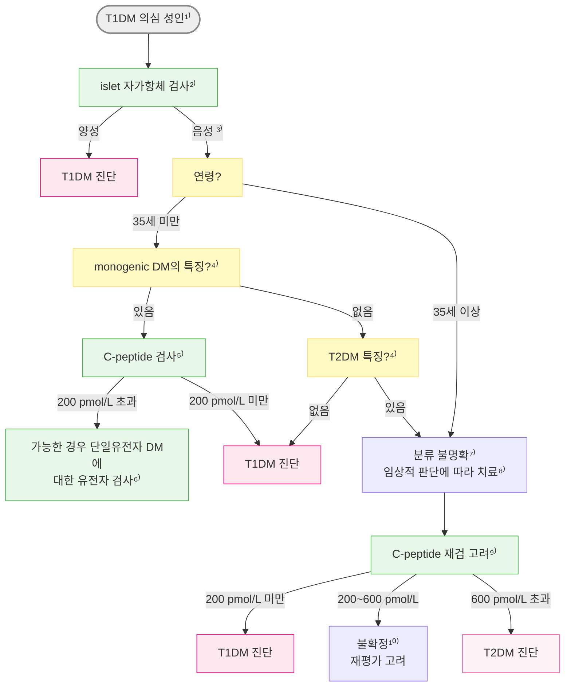
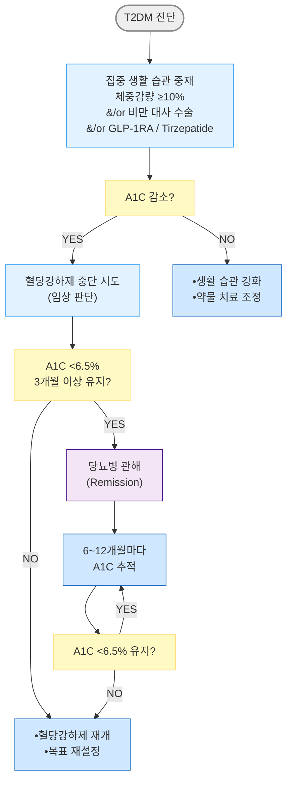
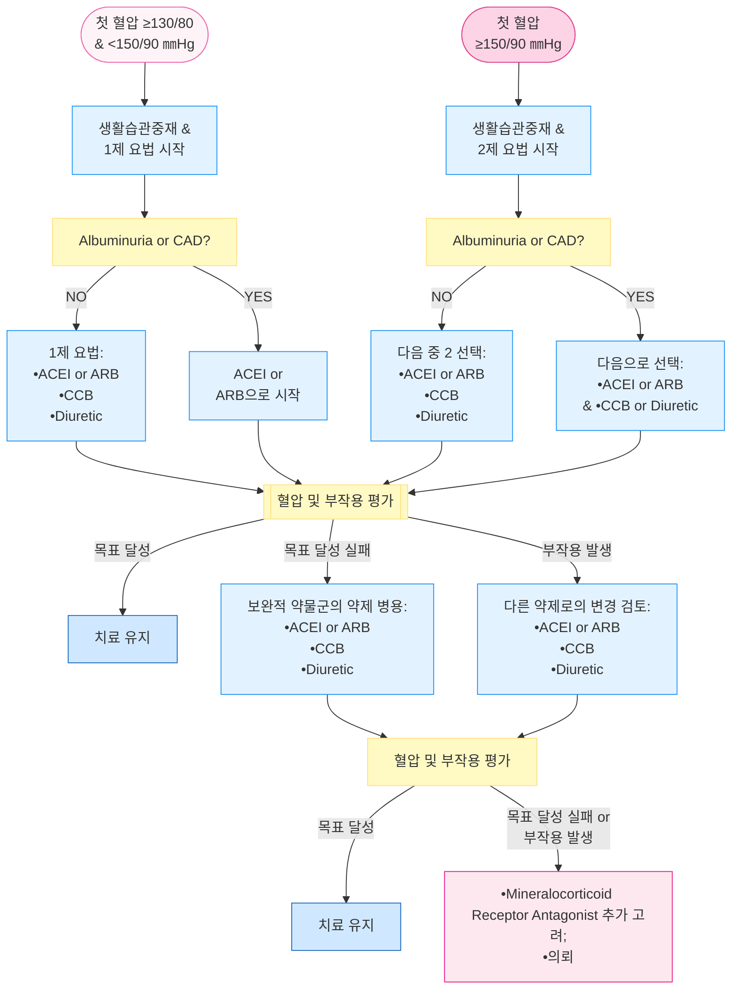
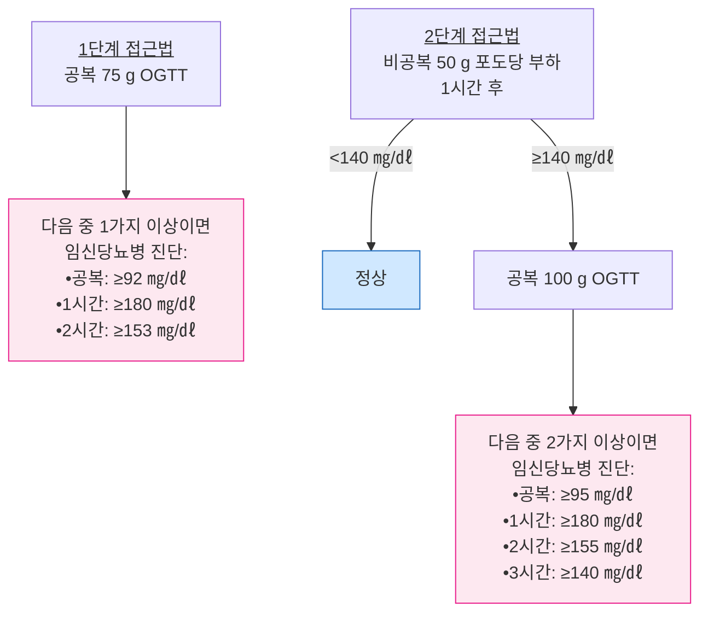

# 당뇨병 Diabetes Mellitus

## <mark style="color:green;">일반 사항</mark>

* 인슐린 분비 결함, 인슐린 작용 이상(인슐린 저항성) 또는 둘 다에 의해 발생하는 만성 고혈당 상태를 특징으로 하는 대사질환군
* 유병률 : 우리나라 ≥30세에서 당뇨병 15.5%(남 18.1%, 여 13.0%), 당뇨병전단계 41.1%(남 43.8%, 여 38.5%) _\[당뇨병 fact sheet 2024]_; T2DM이 전체 당뇨병의 90% 이상 차지 _\[IDF 2025]_
* 호발 연령
  * T1DM : 소아·청소년기(4\~6세, 10\~14세 이중 정점)에 호발하나, 성인 발병도 드물지 않음 - 전체 T1DM 중 상당수가 성인기에 처음 진단된다는 보고가 있음 _\[JAMA 2026 Type 1 Diabetes Review]_
  * T2DM : ＞40세에 호발하나, 비만이 있는 소아·청소년 발병이 증가 추세 (KDA는 10세 이상 또는 사춘기 시작 과체중 소아청소년부터 선별검사를 권고)
* 당뇨병전단계인 ≥65세의 9%가 6.5년 후, ≥60세의 13%가 12년 후 당뇨병으로 발전했다는 보고가 있으나, 진행 위험은 비만도·HbA1c 수준·연령에 따라 크게 달라짐
* T1DM 환자의 기대 여명은 일반 인구 대비 약 8\~10년 짧다는 보고가 있으나 국가·코호트별 편차가 크며(과거보다 격차는 감소 추세), 심혈관 질환이 주요 사인임

### <mark style="color:orange;">분류</mark>

1. 제1형 당뇨병 (T1DM) : 자가면역성 β-cell 파괴에 의해 절대적 인슐린 결핍이 발생하는 당뇨병
   * 자가항체 음성이면서 원인 불명의 절대적 인슐린 결핍을 보이는 특발성(idiopathic) T1DM도 존재(성인 발병의 5\~10%)
2. 제2형 당뇨병 (T2DM) : 인슐린 저항성을 배경으로 β-cell의 적절한 인슐린 분비 기능이 점진적으로 저하되는 당뇨병; 종종 대사증후군을 동반
3. 임신당뇨병 (GDM) : 임신 전 명백한 당뇨병이 없던 여성에서 임신 2\~3분기에 처음 진단된 당뇨병
4. 기타 특이 유형의 당뇨병
   * Monogenic diabetes syndrome : 신생아당뇨병, Maturity onset diabetes of youth(MODY)
   * 췌장질환 관련 당뇨병(Type 3c diabetes, pancreatic diabetes) : chronic pancreatitis, pancreatic cancer, cystic fibrosis, pancreatectomy, hemochromatosis 등 - ADA 2026은 이를 별도의 주요 항목으로 강조함
   * 내분비질환 : Cushing 증후군, acromegaly, glucagonoma, 갈색세포종
   * 약물·화학물질 유발 당뇨병 : glucocorticoid, calcineurin inhibitor, protease inhibitor, 비정형 항정신병제
   * 감염 : congenital rubella, CMV
   * 유전증후군 : Down 증후군, Turner 증후군, Wolfram 증후군

<mark style="color:cyan;">**Latent autoimmune diabetes of adult onset (LADA)**</mark>

* WHO 정의 : 성인에서 발생하는 진행이 느린 자가면역성 당뇨병(slowly progressive autoimmune diabetes) - 초기에는 인슐린 비의존성이나 결국 대부분 인슐린 의존성이 됨
* 초기에는 T2DM으로 오인되는 경우가 많으나 병태생리는 T1DM에 가까움; 일부에서는 비공식적으로 'T1.5DM'이라 부르기도 함
* T1DM의 경한 형태인지, T2DM인지, 독립된 형태인지는 아직 불명확함 - 당뇨병 4대 분류 중 어느 하나에도 공식적으로 속하지 않는 별도 항목임
* 진단에는 \*\*GAD 항체(GAD65 antibody)\*\*가 가장 흔히 이용됨

<mark style="color:cyan;">**Nondiabetic glycosuria (Renal glycosuria)**</mark>

* 소변으로 당분이 배출되지만 혈당은 정상인 양성 무증상 뇨당증
* 원인 : SLC5A2(SGLT2) 유전자 변이, 근위 세뇨관 이상(예: Fanconi 증후군, Dent병, 약물 유발 세뇨관병증), 임신 중(특히 중기 이후 GFR 증가 시)
* SGLT2 억제제 복용 중에는 이 약제의 정상적인 작용 기전으로 인해 혈당이 정상이어도 요당이 검출될 수 있음 - 이 경우는 질환이 아니라 약리 작용의 예상된 결과임
* 당뇨병의 하위 유형이 아니라 정상 혈당에서 요당이 검출되는 경우의 중요한 감별 진단임

<mark style="color:cyan;">**간질환 관련 당뇨병 (hepatogenous diabetes)**</mark>

* ADA 공식 4대 분류에는 포함되지 않으나, 국내 임상에서 흔히 마주치는 diabetes secondary to liver disease(예: 간경변 동반)

## <mark style="color:green;">원인 및 위험 인자</mark>

* **공통** : 유전, 1촌 가족(first-degree relative)
* **T1DM** : 바이러스 감염(enterovirus/Coxsackie B, congenital rubella 등), Vit D 결핍(연관성), 췌도 자가항체(GAD65, IA-2, ZnT8, IAA) 양성, 태아 인자(산모 연령, 자간전증 병력), 조산아, 고출생체중(macrosomia, 출생체중 ≥4 ㎏)
* **T2DM**
  * 체형/대사 : 비만/과체중(BMI ≥23)/복부비만, 인슐린 저항성 관련 질환(예: 다낭난소증후군, 흑색극세포증)
  * 혈당·심혈관 병력 : 공복혈당장애·내당능장애 또는 A1C 기준 당뇨병전단계(5.7\~6.4%) 과거력, 고혈압, 심혈관 질환(예: 뇌졸중, 관상동맥병), 지질 이상(HDL-C ＜35 ㎎/㎗ 또는 TG ≥250 ㎎/㎗)
  * 산과력 : 임신당뇨병, 거대아(≥4 ㎏) 출산력
  * 생활습관·인구학적 요인 : 비활동, 고령
  * 약물 : glucocorticoid, 비정형 항정신병제, thiazide계 이뇨제, 일부 statin(당뇨병 발생 위험은 소폭 증가하나 심혈관 이득이 더 큼)
  * MASLD(대사이상지방간질환)와는 양방향 연관성이 보고되며, KDA는 모든 T2DM 성인에게 MASLD 평가를 권고함

## <mark style="color:green;">임상 양상</mark>

* 전형적 증상 : 다뇨(polyuria, 야뇨 포함), 다음/갈증, 설명되지 않는 체중 감소
* 기타 증상 : 다식, 피로, 무기력, 근육 경련, 복부 불편, 구역, 시력 변화(흐림), 잦은 감염(피부·요로·질 칸디다증 등)
  * [ ] 과거에는 다뇨(polyuria)·다음(polydipsia)·다식(polyphagia)을 '3대 증상(3 Ps)'으로 설명하는 경우가 많았으나, 다식은 일관되게 나타나지 않으며 현재 진단 기준의 대표 증상에는 포함되지 않음

### <mark style="color:$danger;">🚩 Red Flags!</mark>

<mark style="color:$danger;">**즉각 조치 또는 응급 이송**</mark>

* 구역/구토, 복통, 깊고빠른 호흡(Kussmaul), 과일향 호흡, 의식 변화; 혈당 ≥250 ㎎/㎗ + 케톤뇨 → 당뇨병케톤산증(DKA) - 상세 진단·치료·Red Flags 3단계는 (☞ [당뇨병 합병증 - DKA](102_-complications-of-diabetes.md#당뇨병케토산증-diabetic-ketoacidosis-dka))의 기준을 우선 적용
  * 정상혈당 DKA(euglycemic DKA): 혈당이 **200 ㎎/㎗ 미만**이어도 DKA가 가능하며 위 증상이 있으면 반드시 케톤 검사를 시행할 것; SGLT2i 복용 중인 경우 특히 주의(국내에서 SGLT2i는 T1DM 정식 적응증이 아니며 오프라벨·제한적으로만 사용됨) (ADA 2026 지속 강조)
  * 발열을 동반한 혈당 ≥350 ㎎/㎗ + 요중 케톤 강양성도 DKA 가능성이 높은 소견
* 혈당 ≥600 ㎎/㎗, 심한 탈수, 의식 혼탁 → 고삼투압고혈당(HHS) (☞ [당뇨병 합병증 - HHS](102_-complications-of-diabetes.md#고삼투압고혈당상태-hyperosmolar-hyperglycemic-state-hhs))
* 의식 저하, 경련, 자가 처치 불가 → 중증 저혈당 (glucagon 즉시 투여 후 이송; 상세 대처는 ☞ [저혈당, 당뇨병성](103_-hypoglycemia-diabetic.md))

<mark style="color:$warning;">**당일 또는 조기 의뢰**</mark>

* 혈당 >240 ㎎/㎗ + 소변/혈중 케톤 양성이나 위의 응급 기준(구토·호흡곤란·의식변화 등) 미해당 - 자세한 기준은 102번 DKA 챕터 참조
* 원인 불명 혈당 급상승 또는 반복되는 저혈당 (≤54 ㎎/㎗)
* 급성 발적 또는 감각 이상을 동반한 새로운 신경병증 증상
* 당뇨발 : 궤양, 봉와직염, 심한 허혈성 통증
* 신기능 급격 악화 (eGFR 급감, 요소 질소 상승)

<mark style="color:$info;">**외래 추적 / 추가 평가 계획**</mark> <mark style="color:$info;">- 즉각 위험 낮으나 호전 없으면 의뢰</mark>

* 생활 습관 교정 및 2제 이상 혈당 강하제에도 A1C 목표 미달
* 미세알부민뇨 새로 발견 또는 단백뇨 증가
* 비증식성 당뇨망막병증의 진행 또는 새로운 시력 변화
* 발 감각 저하 (10-g monofilament 이상) - 족부 전문의 또는 당뇨발 클리닉 의뢰

## <mark style="color:green;">선별 검사</mark>

### <mark style="color:orange;">선별 검사 대상 및 일정</mark>

<mark style="color:cyan;">**대한당뇨병학회**</mark> (2025)

* 35세 이상의 모든 성인 또는 다음 위험 인자 중 하나 이상이 있는 19세 이상
  1. 과체중 또는 비만(BMI ≥23)
  2. 복부비만(허리둘레 남 ≥90 ㎝, 여 ≥85 ㎝)
  3. 직계가족(부모, 형제자매) 중 당뇨 병력
  4. 공복혈당장애, 내당능장애 또는 당뇨병전단계(A1C 5.7\~6.4%) 과거력
  5. 임신당뇨병 또는 거대아(≥4 ㎏) 출산력
  6. 고혈압(140/90 ㎜Hg 이상 또는 약물 복용)
  7. HDL-C ＜35 ㎎/㎗ 또는 중성지방 ≥250 ㎎/㎗
  8. 인슐린저항성 관련 상태(다낭난소증후군, 흑색가시세포증 등)
  9. 심혈관질환(뇌졸중, 관상동맥질환 등)
  10. 약물(글루코코르티코이드, 비정형 항정신병약 등)
* 하나의 선별검사 결과가 당뇨병전단계에 해당하는 성인이 당뇨병이 의심되는 경우 다른 방법으로 추가 검사 시행
* 선별검사 결과 정상인 성인은 매년 재검사 (\*기존 '3년마다'에서 '매년'으로 강화)
* 임신당뇨병을 진단받았던 임신부는 출산 4\~12주 후 75 g OGTT 시행을 권고함 (\*기존 6\~12주)

<mark style="color:cyan;">**미국당뇨병학회**</mark> (ADA 2026)

1. 다음 중 하나 이상의 위험 인자가 있는 BMI ≥25 (Asian American ≥23) - 연령 무관 검사 시행, 정상 시 최소 매 3년마다 재검사(위험 요인 변화 시 더 자주)
   1. 1세대(부모, 형제) 당뇨병 가족력
   2. 고위험 인종(예: Asian American)
   3. CVD 병력
   4. 고혈압(≥130/80 ㎜Hg or 치료 중)
   5. HDL-C ＜35 ㎎/㎗ or 중성지방 ＞250 ㎎/㎗
   6. 다낭성난소증후군 여성
   7. 비활동적 생활
   8. 인슐린 저항성 관련 상태(예: 심한 비만, acanthosis nigricans)
2. 당뇨병전단계 환자(A1C ≥5.7%) - 매년
3. 임신당뇨병 병력자 - 최소 3년마다
4. 위에 해당하지 않는 모든 사람 - 35세에 검사 시작, 정상 시 최소 매 3년마다 재검사
   * 체중 증가, 새로운 위험 인자 발생(고혈압·이상지질혈증 진단, 심혈관 질환 발생 등)으로 위험도가 높아진 경우에는 3년을 기다리지 않고 더 이른 재검사를 고려 (ADA 2026)
5. HIV 환자
6. 당뇨병 유발 약물(예: steroid, 항정신병제) 투여 중인 환자
7. 급성 췌장염 발생 후 3\~6개월 이내 및 매년; 만성 췌장염 환자 - 매년

### <mark style="color:orange;">당뇨병 위험도 체크 리스트</mark>

* 항목 및 점수 \[대한당뇨병학회. 2025]
  * 나이 : ＜35세(0점), 35\~44세(2점), ≥45세(3점)
  * 가족력(부모·형제 당뇨병력) : 아니오(0점), 예(1점)
  * 고혈압(≥140/90 ㎜Hg 또는 치료 중) : 아니오(0점), 예(1점)
  * 현재 흡연 : 아니오(0점), 예(1점)
  * 허리둘레
    * 남 : ＜84 ㎝(0점), 84\~89.9 ㎝(2점), ≥90 ㎝(3점)
    * 여 : ＜77 ㎝(0점), 77\~83.9 ㎝(2점), ≥84 ㎝(3점)
  * 1일 음주량(주종 무관) : ≤1잔 또는 비음주(0점), 1\~4.9잔(1점), ≥5잔(2점)
* 평가 : 합계 점수가 높을수록 당뇨병 발생 위험 증가; 5\~7점 대비 8\~9점 시 2배, ≥10점 시 ≥3배
  * 총점 ≥5점 시 혈당 검사(공복 혹은 식후 혈당)를 권고

## <mark style="color:green;">진단</mark>

<table><thead><tr><th width="200">판정</th><th width="185">공복 혈당¹⁾</th><th width="191">당부하검사²⁾</th><th>A1C</th></tr></thead><tbody><tr><td><ol><li><strong>정상</strong></li></ol></td><td>&#x3C;100 ㎎/㎗</td><td>&#x3C;140 ㎎/㎗</td><td>&#x3C;5.7%</td></tr><tr><td><ol start="2"><li><strong>당뇨병전단계</strong> (prediabetes)</li></ol></td><td>100~125 ㎎/㎗ [IFG]</td><td>140~199 ㎎/㎗ [IGT]</td><td>5.7~6.4%</td></tr></tbody></table>

3. **당뇨병**²⁾ (다음 어느 한 항목이라도 해당) ⓵ 공복 혈당 ≥126, ⓶ 당부하검사 혈당 ≥200, ⓷ A1C ≥6.5%, ⓸ 고혈당의 전형적인 증상(다뇨, 다음, 설명되지 않는 체중 감소) & 무작위 혈장 포도당 ≥200 ㎎/㎗

_**IFG** = impaired fasting glucose (공복혈당장애), **IGT** = impaired glucose tolerance (내당능장애)_\
\_¹⁾ 최소 8시간 공복(칼로리 섭취 중단)\
\&#xNAN;_\_²⁾ 75 g OGTT 2시간 후 혈당_\
³⁾ _당뇨병의 기준은 고혈당으로 인한 합병증이 발생할 수 있는 수준을 기반으로 정해짐; 공복 혈당 126 ㎎/㎗에 해당하는 식후 2시간 혈당은 200 ㎎/㎗정도이며, 이 수준으로 혈당이 유지될 경우 A1C는 6.5%가 됨_

* 명백한 고혈당 증상이 없는 경우에는 다른 날 검사를 반복해야 하지만, 동시에 시행한 검사들에서 두 가지 이상의 기준에 해당되면 바로 진단
* portable glucose meter로 당뇨병을 진단해서는 안 됨 \[ADA]
* 고혈당 증상이 있는 T1DM의 급성 발병은 A1C보다 혈당으로 판단
* 혈당과 A1C 수준 불일치 원인 : A1C 검사 간섭, 불규칙한 약물 복용/생활 요법

### <mark style="color:orange;">검사 유의 사항</mark>

#### <mark style="color:$primary;">혈당</mark>

* 공복 : 8\~12시간 칼로리 섭취를 하지 않음 (✽ 짧은 공복(＜8시간)은 혈당이 낮아지지 않은 상태에서 측정될 수 있고, 지나친 공복(＞12시간)는 혈당이 단순히 계속 낮아지기만 하는 게 아니라 길항호르몬 반응으로 오히려 반등성 고혈당을 만들 수 있음)
* 식후 2시간은 식사 개시부터 2시간째를 의미(경구 당 부하 검사도 마시기 시작부터)
* 혈당 측정은 정맥 혈장 혈당을 이용하는 것을 원칙으로 함
* 검체에 따른 차이 : 혈장 ＞ 전혈 (✽혈구 성분 영향으로 10\~15% 차이가 남)
  * 동맥혈 ＞ 모세혈관혈 ＞ 정맥혈 (✽동정맥 차이 : 공복 시 ＞10 ㎎/㎗, 식후 20\~50 ㎎/㎗)
  * 일반적으로 손끝 전혈을 측정하는 혈당계는 혈장 혈당 값으로 보정되어 표시됨
* 신속 혈당 검사 영향 요인(실제 혈당보다 높게 측정) : 요산, acetaminophen, L-dopa, xylose, galactose, 비타민C(＞500 ㎎/d), alcohol
* 당 부하 검사 : 검사 전 3일간 탄수화물 150\~200 g/d 섭취 → 전날 밤부터 금식 → 다음날 오전에 정해진 포도당(+물 300 ㎖)을 5분 내에 섭취하고 검사
  * 당 부하 검사 위양성 유발 인자 : 영양실조, 병상 생활, 감염, 심한 정서적 스트레스

#### <mark style="color:$primary;">당화혈색소(A1C)</mark>

* A1C는 최근 2\~3개월의 혈당 상태를 반영; 특히 최근 1개월의 혈당 수준에 50%의 영향을 받음
* **A1C false increase** : 철결핍/Vit B12/folate 결핍 빈혈, 신부전, uremia, 매우 고중성지방혈증(TG ＞1,750 ㎎/㎗), Bil ＞20 ㎎/㎗, 만성 음주, aspirin 과량 복용, 만성 opioid 복용, 납 중독, 고령
* **A1C false decrease** : 급만성 실혈, 용혈성 빈혈, ribavirin/interferon-α(용혈성 빈혈 관련), splenomegaly, Vit E 섭취, 임신 2&3분기/산욕기, 채혈 또는 검사 지연에 의한 RBC 파괴
* **A1C false variation** : 수혈, Hb variants, Vit C 복용

<table data-search="false"><thead><tr><th width="111">A1C (%)</th><th width="191">평균 혈장 혈당 (㎎/㎗)</th></tr></thead><tbody><tr><td>5</td><td>97</td></tr><tr><td>6</td><td>126</td></tr><tr><td>7</td><td>154</td></tr><tr><td>8</td><td>183</td></tr><tr><td>9</td><td>212</td></tr><tr><td>10</td><td>240</td></tr><tr><td>11</td><td>269</td></tr><tr><td>12</td><td>298</td></tr></tbody></table>

_Ref. ADA. Standards of Medical Care in Diabetes. 2024. Table 6-1._

### <mark style="color:orange;">T1DM vs T2DM 감별</mark>

* 감별 검사 : islet auto-Ab(인슐린, glutamic acid decarboxylase(GAD), islet antigen 2(IA-2), zinc transporter 8(ZnT8)), 인슐린, c-peptide
  * 공복 혈청 c-peptide : ＜0.6 ng/㎖(≈200 pmol/L) 시 T1DM, ≥1.0 ng/㎖(≈330 pmol/L) 시 T2DM 가능성(초기 선별용 실용적 기준); 경계 시 추후(5년 후) c-peptide 재검 — 재검 시 판정 기준은 아래 국제 알고리듬(200/600 pmol/L)을 기본으로 함
    * [ ] 단위 환산 참고 : 1 ng/㎖ ≒ 331 pmol/L; 0.6 ng/㎖ ≒ 200 pmol/L; 1.8 ng/㎖ ≒ 600 pmol/L
    * [ ] 경계값 해석 시 인슐린 치료 여부, 유병 기간, 임상 맥락을 함께 고려해야 함; 단일 수치로 확정 진단은 위험
    * [ ] **판정 기준 우선순위(중요)** : 본문에는 T2DM 시사 기준으로 330 pmol/L(초기 실용적 선별)과 600 pmol/L(아래 국제 재검 알고리듬)이 함께 등장하여 혼동될 수 있음. 최초 평가 시에는 330 pmol/L 기준을 실용적 참고치로 사용하되, 5년 후 재검 등 공식적인 재분류 시점에는 아래 국제 알고리듬의 200/600 pmol/L 기준을 우선 적용하고, 한국인 200\~330 pmol/L 자료는 600 pmol/L 미만 "불확정(Uncertain)" 구간 내에서 보조적으로만 참고할 것
  * 자가 항체 : 양성 시 면역 매개성 T1DM 가능성이 높으나 T2DM 진단 환자의 4\~25%에서도 항GAD Ab(+)이며, 이 경우 인슐린 치료를 받아야 할 가능성이 높음; T1DM과 겹치는 phenotype 위험이 있는 성인 당뇨병 환자(예: 진단 시 젊은 연령, 의도하지 않은 체중 감소, 인슐린 치료까지 짧은 시간)에서 분류를 위해 표준화된 islet auto-Ab 검사를 권고
* 대부분의 환자에서 islet autoantibodies, 인슐린, proinsulin, c-peptide의 일률적 검사는 권고하지 않음 \[ADA]



<p align="center"><strong>T1DM 의심 환자의 진단 알고리듬</strong></p>

_¹⁾ T1DM 의심 기준(다음 중 하나 이상) : <35세, BMI<25 또는 의도치 않은 체중감소, DKA 또는 혈당>360 ㎎/㎗, 급속한 인슐린 치료 전환, 당뇨병 유형에 대한 불확실성_\
\_²⁾ GAD 항체를 우선 검사; 음성 시 IA-2, ZnT8 추가 검사(가능한 경우)\
\&#xNAN;_\_✽IAA(인슐린 자가항체)는 외인성 인슐린 치료 시작 전 검사에서만 해석 가능 - 치료 시작 후에는 자가면역 반응과 인슐린 노출에 의한 반응성 항체를 구별할 수 없음_\
\_³⁾ 성인 발병 T1DM의 5\~10%는 자가항체 음성일 수 있음\_\
\_⁴⁾ Monogenic diabetes 특징: 강한 가족력(다세대에 걸친 상염색체 우성 양상), 경미하고 안정적인 고혈당, 젊은 발병 연령, 상대적으로 적은 인슐린 요구량 등\_\
\_✽35세 기준은 절대적 진단 기준이 아니라 알고리듬상의 경험적 분기점임. 비유럽인종에서는 연령·임상양상만으로 T1DM/T2DM 감별이 어려울 수 있으므로 \[ADA], 한국인에게 적용 시 이 분기점을 기계적으로 적용하지 않도록 주의\_\
\_⁵⁾ C-peptide 검사는 monogenic 특징이 있는 경우 초기 진단 워크업의 일부로 바로 시행.\
\&#xNAN;_\_✽검사 조건: 식후 5시간 이내, 혈당 ≥72 ㎎/㎗(4 mmol/L)일 때만 해석, DKA 회복 후 2주 이내 및 저혈당 후 12시간 이내는 검사 회피, 진행된 만성신질환(CKD)에서는 C-peptide 제거 감소로 수치가 실제보다 높게 측정될 수 있음_\
\_✽한국인 기준값(국내연구) : 공복 C-peptide <0.6 ng/_㎖_(200 pmol/L) 시 T1DM, ≥1.0 ng/_㎖_(약 330 pmol/L) 시 T2DM으로 보고됨. 한국인은 서양인 대비 인슐린분비능이 상대적으로 낮은 경향이 있어, 이 값을 참고 기준으로 함께 고려할 수 있음 \[KDA]\
\&#xNAN;_\_⁶⁾ 국내에서 단일유전자 당뇨병(MODY 등) 유전자 검사가 가능한 경우 시행; 접근성이 제한적일 수 있음_\
\_⁷⁾ 분류 불명확(Unclear classification)\
\&#xNAN;_\_⁸⁾ 비인슐린 혈당강하제를 시험적으로 사용할 수 있음_\
\_⁹⁾ 진단 후 >3년 경과 시, 재검 시점에 인슐린 치료 중인 경우 C-peptide 재검 고려 - 진단 초기에는 잔존 베타세포 기능이 일시적으로 보존되는 관해기(honeymoon phase)로 인해 위양성(정상 범위)이 나올 수 있어, 분류가 불확실한 경우 수년 경과 후 재평가가 필요함\_\
\_✽한국인 기준값 적용 시 200\~330 pmol/L을 불확정 구간으로, 330 pmol/L 이상을 T2DM 시사 소견으로 참고할 수 있음(⁵⁾ 참고)\
\&#xNAN;_\_¹⁰⁾ 불확정(Indeterminate) - >5년 경과 후 C-peptide 재검 및 재평가 고려_

***

### <mark style="color:orange;">T1DM 병기(Staging)</mark>

* T1DM은 자가면역 β-cell 파괴가 시작된 시점부터 임상 발병까지 연속적인 병기로 진행하며, 자가항체가 확인된 무증상 단계에서도 조기 분류가 가능함

<table><thead><tr><th width="100">병기</th><th width="304">특징</th><th>비고</th></tr></thead><tbody><tr><td>Stage 1</td><td>islet 자가항체 ≥2개 양성 + 검사 정상</td><td>무증상; 평생 임상적 T1DM 발생 위험 거의 100%</td></tr><tr><td>Stage 2</td><td>islet 자가항체 ≥2개 양성 + 이상 혈당(dysglycemia; 공복 100~125, OGTT 2시간 140~199, A1C 5.7~6.4% 또는 A1C 10% 이상 상승)</td><td>당뇨병전단계에 해당하나 자가항체 양성으로 T1DM 진행 확정적</td></tr><tr><td>Stage 3</td><td>고전적 T1DM - 당뇨병 검사기준 충족 + 증상(다뇨, 다음, 체중 감소) 동반 가능</td><td>외인성 인슐린 치료 필요</td></tr></tbody></table>

_Ref. Jacobsen LM, Schatz DA. Type 1 Diabetes: A Review. JAMA 2026._


**단일 IA-2 자가항체 양성자의 병기 분류 (ADA 2026)** - islet 자가항체 중 IA-2만 단독 양성이고 나머지는 음성인 경우, Stage 2 T1DM(자가항체 ≥2개 양성)과 동등한 수준으로 Stage 3 진행 위험이 높으므로 동일하게 모니터링할 것을 권고. 자가항체 양성이 확인된 무증상 성인·소아는 Stage 3(임상적 발병)로의 진행 여부를 신속히 평가하기 위해 조기 의뢰가 중요함 (ADA 2026 Recommendation 2.8a/2.8b/2.9 신규).



**Teplizumab (anti-CD3 단클론항체)** - 미국 FDA 2022년 승인, Stage 2 T1DM 성인·소아(8\~45세)에서 Stage 3(임상적 발병)로의 진행을 지연시키는 질병 조절 면역치료제. 무작위대조군연구에서 Stage 3 진행까지 평균 48.4개월(위약군 24.4개월)로 지연 효과 확인. 국내 미도입(2026.07)


### <mark style="color:orange;">합병증</mark>

(☞ [당뇨병 합병증](102_-complications-of-diabetes.md))

* **혈관계** : 망막병증, 신경병증, 신장병증, 관상동맥병, 뇌혈관 질환, 말초혈관 질환, 인지기능 저하 및 치매 위험 증가(혈관성 치매, 알츠하이머병 포함)
* **비-혈관계** : 위장관 장애(예: 위마비, 설사), 비뇨생식기 장애(예: 배뇨, 성 기능 장애), 피부 질환, 감염, 백내장, 녹내장, 치주 질환, 청력 장애

***

## <mark style="background-color:yellow;">Management</mark>

### <mark style="color:orange;">치료 방침</mark>

* **모든 치료 목표와 약물 선택은 환자의 동반 질환, 저혈당 위험, 체중, 비용, 선호도를 종합적으로 고려하는 person-centered approach(환자 중심 접근)에 따라 개별화하여 결정** (ADA 2026이 지속적으로 강조하는 핵심 원칙)

1. **동반 질환 및 합병증 위험성 평가** : ASCVD 및 심부전 병력, ASCVD 위험 인자 및 10년 위험도 평가, CKD 단계 평가, 저혈당 위험 평가, 망막병증/신경병증 평가 (☞ [ASCVD 10년 위험도](https://tools.acc.org/ASCVD-Risk-Estimator-Plus/#!/calculate/estimate/))
2. **치료 목표 설정** : A1C/혈당 목표, 혈압, 당뇨병 자가 관리 목표 설정
3. **치료 계획 수립** : 생활 습관 중재, 항당뇨병제, 심혈관/신질환 관리, 혈당 측정 기기/인슐린 투여 기기 사용, (필요시) 의뢰\*

_\*다음의 경우에 교육 및 지원 필요 : ⓵ 진단, ⓶ 매년 &/or 목표 달성 실패, ⓷ 합병증/위험 요소 발생(의료, 신체, 정신 사회적), ⓸ 삶/관리에 변화 발생_

<mark style="color:cyan;">**당뇨병 자기 관리 교육**</mark>

* 당뇨병 진단 후 '매년' 자기 관리 교육; 1년 이내라도 '치료 목표에 도달하지 못하거나 자기 관리에 영향을 주는 문제가 발생했을 때'는 자기 관리 교육의 필요성을 평가하고 반복 재교육
* 환자 중심의 자기 관리 교육을 위해 의료, 간호, 영양, 운동, 약물, 사회복지 각 분야의 자격을 갖춘 교육자가 참여해야 함
* 당뇨병 자기 관리 교육에 디지털 기기 활용을 적극 고려

### <mark style="color:orange;">치료 목표</mark>

**A1C 목표**

<table><thead><tr><th width="213">[대한당뇨병학회] (2025)</th><th width="90"></th><th width="247">[미국당뇨병학회] (ADA 2026)</th><th></th></tr></thead><tbody><tr><td>T2DM의 일반적 목표</td><td>&#x3C;6.5%</td><td>A1C 일반적 목표</td><td>&#x3C;7%</td></tr><tr><td>T2DM - 저혈당 위험 낮고 적극 치료 가능 시</td><td>&#x3C;6.0% 고려</td><td>저혈당 등 부작용이 없는 경우</td><td>&#x3C;6.5%</td></tr><tr><td>T1DM의 일반적 목표</td><td>&#x3C;7.0%</td><td>고령 - 일반적 경우</td><td>7.0~7.5%</td></tr><tr><td>고령(≥65세) 일반적 경우</td><td>&#x3C;7.5%</td><td>고령 - 저혈당 위험, 특별한 경우¹⁾</td><td>&#x3C;8%</td></tr><tr><td>소아청소년 T2DM</td><td>&#x3C;6.5%</td><td></td><td></td></tr></tbody></table>

**혈당 목표** \[KDA·ADA] : 공복 80\~130 ㎎/㎗, 식후²⁾ <180 ㎎/㎗

_¹⁾ 제한된 기대 여명, 진행된 혈관 합병증, 심한 동반 질환, 복수의 만성 질환 동반, 인지 장애, 기능적 의존 상태, 적절한 치료(인슐린 포함)에도 불구하고 목표 도달이 어려운 오래된 당뇨병_\
\_²⁾ 일반적으로 당뇨병 환자에서 peak level인 식후 1\~2시간에 측정\_

* 식전 포도당이 목표에 도달했음에도 A1C 목표가 달성되지 않을 경우 식후 포도당을 목표로 할 수 있음

**연속혈당측정기(CGM) 치료 목표 (Time-in-Range, TIR)**

<table><thead><tr><th width="194">지표</th><th width="200">목표</th><th>의미</th></tr></thead><tbody><tr><td>TIR (70~180 ㎎/㎗)</td><td>>70% (하루 약 17시간)</td><td>목표 혈당 범위 내 시간</td></tr><tr><td>TAR (>180 ㎎/㎗)</td><td>&#x3C;25%</td><td>고혈당 시간 (<em>Time Above Range)</em></td></tr><tr><td>TAR (>250 ㎎/㎗)</td><td>&#x3C;5%</td><td>심한 고혈당 시간</td></tr><tr><td>TBR (&#x3C;70 ㎎/㎗)</td><td>&#x3C;4%</td><td>저혈당 시간 (<em>Time Below Range)</em></td></tr><tr><td>TBR (&#x3C;54 ㎎/㎗)</td><td>&#x3C;1%</td><td>중증 저혈당 시간</td></tr></tbody></table>

### <mark style="color:orange;">당뇨병 환자의 포괄적 관리</mark>

#### <mark style="color:$primary;">첫 방문 시 평가 항목</mark>

1. 당뇨병 진단 확인, 병형 분류, 혈당 상태
2. 당뇨병성 합병증, 동반 질환 및 위험 인자
3. (기존 DM 진단 시) 과거 치료 방법, 위험 인자 조절 방법, 당뇨병 교육 여부
4. 영양 상태
5. 자가 관리 수행 능력
6. 신체검사와 실험실 검사
7. 예방접종 및 정기검진 여부

#### <mark style="color:$primary;">재방문 시 평가 항목</mark>

1. 첫 방문 때 시행한 평가 항목 재검토
2. 지난 방문 이후 병력
3. 약물 복용에 대한 순응도 및 부작용
4. 적절한 주기의 HbA1c, 대사 지표 등 검사
5. 합병증 위험, 자가 관리 실천 여부, 다른 기관으로의 전원 필요성 평가

* T1DM 환자에서 소화기 증상 또는 셀리악병 의심 소견이 있는 경우 셀리악병 선별
* 직계 1대 중 T1DM 환자가 있는 경우에 자가항체 패널 검사 권고; 지속되는 자가항체는 임상적 당뇨병의 위험 인자이며 중재의 지표로 작용할 수 있음
* LFT↑ or 초음파상 지방간이 있는 전단계/당뇨 환자에서 비알코올 간염 및 간섬유화 평가 (☞ [MASLD](../224_/093_-nafld.md))
* 성 기능 저하 등 hypogonadism 징후를 보이는 남성 환자에서 아침 s-testosterone 검사 고려
* 대사이상지방간질환(MASLD) 평가 : 모든 T2DM 성인에게 MASLD 평가를 권고 \[KDA]
  * 선별 검사: ALT + 복부 초음파 시행
  * 간섬유화 평가: MASLD 동반 T2DM 성인에서 간섬유화 확인을 위해 vibration-controlled transient elastography(VCTE, FibroScan)를 고려 (✽KDA 2025는 FIB-4보다 VCTE를 직접 권고)
  * T2DM + MASLD/MASH 동반 시 : GLP-1 RA 또는 GIP/GLP-1 이중작용제(tirzepatide) 사용을 고려; 중등도 이상 섬유화가 있는 경우 thyroid hormone receptor-β agonist(resmetirom) 추가 고려 (☞ [MASLD](../224_/093_-nafld.md))

<table data-search="false"><thead><tr><th width="405">항목</th><th width="80">첫 방문</th><th width="80">매 방문</th><th width="80">매년</th></tr></thead><tbody><tr><td><strong>과거력·가족력: 당뇨병 병력</strong></td><td></td><td></td><td></td></tr><tr><td>• 발병 시 특징 (예: 나이, 증상)</td><td>○</td><td></td><td></td></tr><tr><td>• 이전 치료 방법 및 반응 검토</td><td>○</td><td></td><td></td></tr><tr><td>• 과거 입원 빈도/원인/중증도 평가</td><td>○</td><td></td><td></td></tr><tr><td><strong>과거력·가족력: 가족력</strong></td><td></td><td></td><td></td></tr><tr><td>• 1st-degree 당뇨병 가족력</td><td>○</td><td></td><td></td></tr><tr><td>• 자가면역 질환 가족력</td><td>○</td><td></td><td></td></tr><tr><td><strong>과거력·가족력: 합병증 및 동반 질환 병력</strong></td><td></td><td></td><td></td></tr><tr><td>• 동반 상태 (예: 비만, OSA, MASLD)</td><td>○</td><td></td><td></td></tr><tr><td>• 고혈압 or 이상지질혈증</td><td>○</td><td></td><td>○</td></tr><tr><td>• 대혈관 &#x26; 미세혈관 합병증</td><td>○</td><td></td><td>○</td></tr><tr><td>• 저혈당: 상황, 빈도, 원인, 자각 여부</td><td>○</td><td>○</td><td>○</td></tr><tr><td>• hemoglobinopathies or 빈혈</td><td>○</td><td></td><td>○</td></tr><tr><td>• 마지막 치과 진료</td><td>○</td><td></td><td>○</td></tr><tr><td>• 마지막 동공 확대 안과 검진</td><td></td><td></td><td>○</td></tr><tr><td>• visits to specialists</td><td></td><td></td><td>○</td></tr><tr><td>• 장애 평가 &#x26; 보조 기기 사용¹⁾</td><td>○</td><td>○</td><td>○</td></tr><tr><td>• 자가면역 질환 병력</td><td>○</td><td></td><td></td></tr><tr><td><strong>과거력·가족력: Interval Hx</strong></td><td></td><td></td><td></td></tr><tr><td>• 이전 방문 후 질병/가족 변화</td><td></td><td>○</td><td>○</td></tr><tr><td><strong>생활 습관 인자</strong></td><td></td><td></td><td></td></tr><tr><td>• 식사 습관 &#x26; 체중 변화력</td><td>○</td><td>○</td><td>○</td></tr><tr><td>• 탄수화물 계산 숙련도 평가</td><td>○</td><td></td><td>○</td></tr><tr><td>• 신체 활동, 수면 습관; OSA 평가</td><td>○</td><td>○</td><td>○</td></tr><tr><td>• 흡연, 음주, 약물 남용</td><td>○</td><td></td><td>○</td></tr><tr><td><strong>약물 및 예방접종 병력</strong></td><td></td><td></td><td></td></tr><tr><td>• 현재 투여 약물</td><td>○</td><td>○</td><td>○</td></tr><tr><td>• 약물 투여 행동(순응도)</td><td>○</td><td>○</td><td>○</td></tr><tr><td>• 약물 불내성 or 부작용</td><td>○</td><td>○</td><td>○</td></tr><tr><td>• 민간/대체 요법</td><td>○</td><td>○</td><td>○</td></tr><tr><td>• 예방접종 경력 및 필요성</td><td>○</td><td></td><td>○</td></tr><tr><td><strong>Technology use</strong></td><td></td><td></td><td></td></tr><tr><td>• 건강 앱, 온라인 교육, 환자 포털 이용</td><td>○</td><td></td><td>○</td></tr><tr><td>• 당 모니터링: 결과 및 데이터 활용</td><td>○</td><td>○</td><td>○</td></tr><tr><td>• 인슐린 펌프 셋팅 및 사용 검토</td><td>○</td><td>○</td><td>○</td></tr><tr><td><strong>사회 생활 평가: Social network</strong></td><td></td><td></td><td></td></tr><tr><td>• 사회적 지지 존재 확인</td><td>○</td><td></td><td>○</td></tr><tr><td>• 의사결정 대리인, 추가 관리계획 확인</td><td>○</td><td></td><td>○</td></tr><tr><td>• 건강의 사회적 요인 확인</td><td>○</td><td></td><td>○</td></tr><tr><td>• 일상 및 환경 평가</td><td>○</td><td>○</td><td>○</td></tr><tr><td><strong>신체검사</strong></td><td></td><td></td><td></td></tr><tr><td>• 신장, 체중, BMI; 혈압</td><td>○</td><td>○</td><td>○</td></tr><tr><td>• 기립 혈압(필요시)</td><td>○</td><td></td><td></td></tr><tr><td>• 안저검사(안과 전문의 의뢰)</td><td>○</td><td></td><td>○</td></tr><tr><td>• 갑상선 촉진</td><td>○</td><td></td><td>○</td></tr><tr><td>• 피부 검사(예: 인슐린 주사 부위)</td><td>○</td><td>○</td><td>○</td></tr><tr><td>• 포괄적 발 검사</td><td>○</td><td></td><td>○</td></tr><tr><td>　시진(예: 상처, 굳은살, 변형, 궤양, 발톱)</td><td>○</td><td>○</td><td>○</td></tr><tr><td>　말초동맥질환 선별(pedal pulses)²⁾</td><td>○</td><td></td><td>○</td></tr><tr><td>　감각 검사³⁾</td><td>○</td><td></td><td>○</td></tr><tr><td>• 우울, 불안, 저혈당공포, 식사장애 선별</td><td>○</td><td></td><td>○</td></tr><tr><td>• 인지 장애 평가 고려(≥65세)</td><td>○</td><td></td><td>○</td></tr><tr><td>• 기능 수행 평가 고려(≥65세)</td><td>○</td><td></td><td>○</td></tr><tr><td>• 골 통증 평가 고려</td><td>○</td><td></td><td>○</td></tr><tr><td><strong>검사실 검사</strong></td><td></td><td></td><td></td></tr><tr><td>• A1C (3개월 내 검사하지 않은 경우)</td><td>○</td><td>○</td><td>○</td></tr><tr><td>• 총/LDL/HDL-C, TG; LFT; Cr, eGFR⁴⁾</td><td>○</td><td></td><td>○</td></tr><tr><td>• T1DM에서 TSH; metformin 투여 시 Vit B12; CBC; ACEI/ARB/이뇨제 투여 시 혈청 K; 필요시 Ca, Vit D, P⁵⁾</td><td>○</td><td></td><td>○⁶⁾</td></tr><tr><td>• 소변 Alb/Cr ratio</td><td>○</td><td></td><td>○</td></tr></tbody></table>

_¹⁾ 예: 신체, 인지, 시각, 청각, 골격, 국부 보호 기기_\
\_²⁾ 감소 시 의뢰\_\
\_³⁾ 온도, 진동 or pinprick sense, 10-g monofilament exam\_\
\_⁴⁾ 당뇨, 혈압, 콜레스테롤, 갑상선 약물 등 검사 결과에 영향을 줄 수 있는 약물 투여 개시나 변경 시 검사 고려\_\
\_⁵⁾ 만성 신질환 또는 신경 및 K에 영향을 미치는 약물 투여 시 보다 빈번하게 검사할 수 있음\_\
\_⁶⁾ 이상지질혈증이 없는 환자에서는 지질 패널을 보다 드물게 검사할 수 있음\_

#### <mark style="color:$primary;">예방접종</mark>

* [B형간염](../231_/210_-vaccination.md#b-hepb), [폐렴구균](../231_/210_-vaccination.md#pneumococcal-pneumonia), [독감](../231_/210_-vaccination.md#influenza), COVID-19, RSV 백신 접종

## <mark style="color:green;">비-약물 치료 및 예방</mark>

* **생활 습관 개선** : 체중 감량, 운동, 식이/영양 관리, 금연(전자 담배 포함), 음주 제한, 수면 관리(밤에 6\~8시간 수면, 폐쇄수면무호흡증(OSA) 선별)
* **효과** : 생활 치료로 A1C 1\~2% 개선; 약물 치료 시작을 지연시키거나 약물 필요량 감소

### <mark style="color:orange;">식이/영양</mark>

* 개별화한 목표와 선호에 따라 지중해식, 채식, 저지방, DASH, 저탄수화물식 식이를 권고
  * 과도한 탄수화물 섭취는 제한하되, 치료 목표와 선호에 따라 개별화; 식이섬유가 풍부한 통곡류, 콩류, 채소, 생과일의 섭취를 통해 탄수화물의 질적 섭취를 충족하도록 권고
* [지중해식 식단](../231_/217_-nutritiondiet-guideline.md#undefined-6) : 충분한 양의 식물성 식품(채소, 콩/견과류, 씨앗, 과일, 전곡류), 생선/해산물; 보통의 올리브유(지방 공급원); 보통\~소량의 유제품(요구르트, 치즈); 계란 ＜4개/주; 낮은 빈도의 소량의 붉은 고기; 보통\~소량의 와인; 매우 적은 양의 설탕 또는 꿀 섭취
* 탄수화물, 단백질, 지방의 이상적인 고정 비율은 없으며 개별화가 원칙
  * 참고 수준으로 일반적 구성(탄수화물 50\~60%, 단백질 15\~20%, 지방 25% 이내)을 제시하지만, 치료 목표·선호·동반 질환에 따라 달라짐

#### <mark style="color:$primary;">탄수화물</mark>

* 혈당 조절 및 관리를 위해 과도한 탄수화물 섭취는 제한하되, 치료 목표와 선호에 따라 개별화
* 식이섬유가 풍부한 통곡류, 콩류, 채소, 생과일의 섭취를 통해 탄수화물의 질적 섭취를 충족해야 함
* 첨가당 섭취를 최소화하기 위해 가당 음료 섭취를 줄임
* 낮은 당지수(glycemic index) 및 당부하지수(glycemic load) 식품 권고
* 정해진 용량의 인슐린 주사를 맞는 환자에서는 음식 섭취량과 시간을 일정하게 하도록 교육

#### 당지수(GI) 중심 탄수화물 식이표

<table data-search="false"><thead><tr><th width="141">음식</th><th width="77" align="right">당지수(GI)</th><th width="97" align="right">㎉/100g</th><th>권장 섭취 포인트</th></tr></thead><tbody><tr><td><strong>콘플레이크</strong></td><td align="right">92</td><td align="right">375</td><td>GI가 매우 높아 혈당을 빠르게 올림. 가능한 한 섭취를 제한.</td></tr><tr><td><strong>흰쌀밥</strong></td><td align="right">88~91</td><td align="right">150</td><td>정제 탄수화물로 혈당 상승이 빠름. 현미·보리·잡곡밥으로 대체 권장.</td></tr><tr><td><strong>떡(백설기·가래떡)</strong></td><td align="right">80~90</td><td align="right">230~250</td><td>혈당을 매우 빠르게 올리므로 소량만 섭취.</td></tr><tr><td><strong>통감자구이</strong></td><td align="right">85</td><td align="right">300</td><td>GI가 높아 양 조절이 필요. 삶은 감자가 상대적으로 유리.</td></tr><tr><td><strong>도넛</strong></td><td align="right">76</td><td align="right">450~500</td><td>고당·고지방 식품으로 가능한 한 피한다.</td></tr><tr><td><strong>수박</strong></td><td align="right">72~76</td><td align="right">30</td><td>GI는 높지만 실제 혈당부하(GL)는 낮아 1회 섭취량은 허용 가능.</td></tr><tr><td><strong>식빵(흰빵)</strong></td><td align="right">70~75</td><td align="right">260~280</td><td>혈당 상승이 빨라 통밀빵으로 대체 권장.</td></tr><tr><td><strong>당근(삶은 것)</strong></td><td align="right">70~71</td><td align="right">35</td><td>GI는 높지만 실제 혈당부하(GL)는 낮아 적당량은 제한할 필요 없음.</td></tr><tr><td><strong>잡곡밥</strong></td><td align="right">55~65</td><td align="right">150</td><td>흰쌀밥보다 혈당 상승이 적다.</td></tr><tr><td><strong>호밀·통밀빵</strong></td><td align="right">50~65</td><td align="right">240~260</td><td>식이섬유가 풍부하여 혈당 상승을 완화.</td></tr><tr><td><strong>귀리(오트밀)</strong></td><td align="right">50~55</td><td align="right">380</td><td>β-glucan이 풍부하여 식후 혈당과 LDL-C 감소에 도움.</td></tr><tr><td><strong>보리밥</strong></td><td align="right">50~55</td><td align="right">140</td><td>혈당 조절과 포만감 유지에 도움. ✽쌀 혼합 기준; 도정보리 단독은 GI가 더 낮게 보고됨</td></tr><tr><td><strong>현미밥</strong></td><td align="right">50</td><td align="right">150</td><td>혈당 상승이 완만하여 주식으로 권장.</td></tr><tr><td><strong>고구마</strong></td><td align="right">44~61</td><td align="right">125</td><td>삶거나 찐 형태가 구운 것보다 혈당 상승이 적다.</td></tr><tr><td><strong>바나나</strong></td><td align="right">47~55</td><td align="right">90</td><td>덜 익은 바나나가 완숙 바나나보다 GI가 낮다.</td></tr><tr><td><strong>옥수수</strong></td><td align="right">52~60</td><td align="right">100</td><td>비교적 무난하나 섭취량은 조절한다.</td></tr><tr><td><strong>메밀국수</strong></td><td align="right">50~60</td><td align="right">110~130</td><td>메밀 함량이 높을수록 혈당 상승이 적다.</td></tr><tr><td><strong>국수(소면)</strong></td><td align="right">45~55</td><td align="right">130~150</td><td>삶는 정도에 따라 GI가 달라질 수 있다.</td></tr><tr><td><strong>포도</strong></td><td align="right">43~46</td><td align="right">70</td><td>GI는 낮지만 당 함량이 높아 소량 섭취.</td></tr><tr><td><strong>강낭콩</strong></td><td align="right">45~46</td><td align="right">130</td><td>단백질과 식이섬유가 풍부하여 혈당 조절에 도움.</td></tr><tr><td><strong>스파게티(알덴테)</strong></td><td align="right">40~45</td><td align="right">150</td><td>알덴테로 조리하면 GI가 낮으며 통밀 제품을 권장.</td></tr><tr><td><strong>오렌지</strong></td><td align="right">40~45</td><td align="right">47</td><td>과일째 먹는 것이 주스보다 좋다.</td></tr><tr><td><strong>딸기</strong></td><td align="right">40</td><td align="right">32</td><td>GI와 GL 모두 낮아 좋은 간식.</td></tr><tr><td><strong>배</strong></td><td align="right">38</td><td align="right">50</td><td>적당량은 비교적 안전하다.</td></tr><tr><td><strong>사과</strong></td><td align="right">36</td><td align="right">52</td><td>식이섬유가 풍부하여 간식으로 적합.</td></tr><tr><td><strong>플레인 무가당</strong><br><strong>요구르트</strong></td><td align="right">35~36</td><td align="right">60~70</td><td>무가당 제품을 선택한다.</td></tr><tr><td><strong>우유</strong></td><td align="right">30~35</td><td align="right">64</td><td>GI가 낮고 단백질 공급원이다.</td></tr><tr><td><strong>무가당 두유</strong></td><td align="right">30~35</td><td align="right">45</td><td>단백질 공급원으로 적합.</td></tr><tr><td><strong>귤</strong></td><td align="right">30~35</td><td align="right">39</td><td>GI가 낮아 과일 중 비교적 권장.</td></tr><tr><td><strong>땅콩</strong></td><td align="right">14</td><td align="right">570</td><td>GI가 매우 낮지만 칼로리가 높아 한 줌 정도 권장.</td></tr><tr><td><strong>호두</strong></td><td align="right">15</td><td align="right">650</td><td>불포화지방산이 풍부하며 적당량 섭취를 권장.</td></tr><tr><td><strong>아몬드</strong></td><td align="right">10~15</td><td align="right">580</td><td>불포화지방산과 식이섬유가 풍부하나 과량 섭취는 피한다.</td></tr></tbody></table>

_✽ GI(glycemic index, 당지수)는 동일한 양의 탄수화물을 섭취했을 때 혈당이 상승하는 속도를 나타냄. 실제 식후 혈당은 섭취량(glycemic load, GL), 조리법, 식이섬유 함량, 단백질·지방의 동반 섭취 등에 따라 크게 달라질 수 있으므로 GI만으로 식품을 선택하지 말고 총 탄수화물 섭취량과 균형 잡힌 식사를 함께 고려_\
\&#xNAN;_✽ 표는 GI 내림차순으로 정렬함. GL = GI × 1회 섭취 탄수화물량(g) ÷ 100; 당근·수박처럼 GI는 높으나 1회 섭취 탄수화물량이 적어 GL이 낮은 식품은 예외적으로 허용 가능함으로 표시_

#### [<mark style="color:$primary;">식이 섬유</mark>](../231_/217_-nutritiondiet-guideline.md#undefined-14)

* 효과 : 당뇨병 발생 감소, 혈당 조절 개선, 심혈관 질환 감소
  * 대사에 있어서 수용성 식이 섬유의 효과에 대한 근거가 많으나 권장 섭취량은 일반적으로 수용성과 불용성을 구분하지 않음
* 충분 섭취량 : 20\~25 g/d
* 수용성 섬유 식품 : 가지, 귀리 가공식품, 콩, 보리
* 불용성 섬유 식품 : 전곡류, 짙은 색 채소, 단단한 줄기, 밀기울, 사과/배의 껍질, 감자류

#### <mark style="color:$primary;">단백질</mark>

* 단백질 섭취를 제한할 필요는 없으며, 신장 질환이 있는 경우에 과다 섭취나 엄격한 제한은 피함
  * 단백질 섭취를 <0.8 g/㎏/d로 낮추는 것은 당 조절, 심혈관 질환 위험, GFR에 유의미한 영향을 주지 못하며 영양실조 위험을 높일 수 있음
  - [ ] 기존 '신장 합병증 시 제한'을 '과다·엄격한 제한 모두 피함'으로 변경 \[KDA 2025]
* T2DM 환자에서 단백질 섭취는 혈당 증가 없이 인슐린 반응을 높이므로 저혈당 발생에 대한 주의가 필요한 환자에서는 고단백 식품 섭취를 피함

#### <mark style="color:$primary;">지방</mark>

* 불포화 지방산 풍부 식품(예: 등푸른 생선, 식물성 기름) 권고
* 포화지방 및 트랜스 지방(예: 돼지고기, 쇠고기, 닭 껍질, 버터, 마가린, 생크림, 쇼트닝, 치즈, 햄) 섭취 제한
  * [ ] 베이컨 등 가공육은 포화지방·나트륨 함량이 높아 이상지질혈증·심혈관 위험 관리 차원에서 별도 섭취 제한이 필요
* 지중해식 식단 권고, 오메가-3 풍부 식품(예: 생선, 견과류, 씨앗류) 권고

#### <mark style="color:$primary;">기타 식이</mark>

* [**음주**](../230_/189_-alcohol-use-disorder-aud.md) : 금주 권고(특히 간질환, 고지혈증, 비만인 당뇨병 환자); 혈당 조절이 잘되는 경우에만 여 ≤1 SD/d, 남 ≤2 SD/d로 허용, 음주 후 당 모니터링 권고
  * 음주는 저혈당 위험을 증가시킴(특히 인슐린 or 인슐린 분비 촉진제 투여 환자)
* 항산화제, ω-3, Vit, 무기질 보충 : 혈당 개선 목적의 일상적 보충은 권고 안 함
  * 부족한 상태가 아닌 한 보충이 도움이 된다는 증거 없음; 결핍이나 제한적 식사 시 보충 고려
  * β-carotene 보충제는 이득이 없고 일부에서 해롭다는 증거가 있어 사용하지 않도록 함
  * Vit D ≥1000 IU/d 보충이 T2DM의 위험을 줄인다는 보고가 있음
* Na : ＜2.3 g/d(소금으로 5.75 g)으로 제한 (☞ [저염 식이](../225_/095_-hypertension.md#undefined-28))


대한고혈압학회 "고혈압 진료지침 2026"에서는 **소금 섭취 권고를 6 g에서 5 g**(나트륨 2,000 ㎎)으로 하향 조정함. 고혈압을 동반한 당뇨병 환자에서는 이 강화된 기준을 참고할 수 있음.


### [<mark style="color:orange;">운동</mark>](../231_/216_-physical-activity-guideline.md)

* 효과 : T2DM 발병 위험 감소, 인슐린 감수성 개선; 적은 운동이라도 도움이 됨
* 유산소 운동 : 중등도 이상 강도로 ≥150분/주(가급적 매일 ≥30분), ≥3일/주; 연이어 ＞2일 쉬지 않음
  * 신체적으로 건강한 젊은 사람은 고강도의 짧은 시간(75분/주) 또는 간헐적 운동도 가능
* 저항성 운동 : 금기 사항이 없는 한 연속되지 않은 날로 2\~3 sessions/주 권고
* 유연성/균형 운동 : 고령자에서 2\~3 회/주; 예) 요가, 태극권
* sedentary behavior(예: quiet sitting, lying, leaning) 최소화; 30분을 앉아 있었으면 일어나서 활동
* 운동 전후, 전신 상태나 운동의 강도가 변화, 또는 운동 시간이 길어질 때는 혈당을 측정하여 저혈당 또는 고혈당 여부 확인
* 처음 운동 시작 전 CVD, 고혈압, 미세혈관합병증 유무 평가, 금기사항 유무 확인
* 심한 당뇨망막병증 망막출혈이나 망막박리의 위험이 높으므로 고강도 운동 회피; 심한 말초 신경병증이나 발 질환 - 체중 부하 많은 운동 회피; CVD가 있거나 위험이 높은 경우 - 고강도 운동 회피

#### <mark style="color:$primary;">운동 전 혈당 수준에 따른 대처</mark>

<table><thead><tr><th width="148">혈당 수준</th><th>대처 방법</th></tr></thead><tbody><tr><td>&#x3C;90 ㎎/㎗</td><td>운동 전 빠르게 흡수될 수 있는 15~30 g 탄수화물 섭취(예: 사탕 4~6개, 주스 120~200 ㎖); 중강도 장시간 운동 시 1시간마다 0.5~1 g/체중(㎏) 추가 섭취 *&#x3C;30분의 운동, 웨이트 트레이닝 등의 고강도 운동에서는 불필요할 수 있음</td></tr><tr><td>90~150 ㎎/㎗</td><td>운동 시작 및 1시간마다 0.5~1 g/㎏의 탄수화물 섭취(운동 형태나 인슐린 작용 정도에 따름)</td></tr><tr><td>150~250 ㎎/㎗</td><td>운동 시작 후 &#x3C;150 ㎎/㎗이 될 때까지 탄수화물 섭취 보류</td></tr><tr><td>250~350 ㎎/㎗</td><td>케톤 검사 및 중간~많은 양의 케톤 시 운동 중지; 저~중강도 운동 가능, 고강도 운동은 &#x3C;250 ㎎/㎗이 될 때까지 연기</td></tr><tr><td>≥350 ㎎/㎗</td><td>케톤 검사 및 중간~많은 양의 케톤 시 운동 중지; 케톤 없다면 운동 전 인슐린 용량 조정(일반적으로 약 50% 감량); 저~중강도 운동 시작, 혈당이 내려갈 때까지 고강도 운동 자제</td></tr></tbody></table>

### <mark style="color:orange;">체중 관리</mark>

* **선별 검사** : 모든 당뇨병 성인에서 매년 BMI로 과체중·비만 선별; 가능한 경우 체지방 측정(인체계측 또는 직접 측정)을 추가하여 과다 체지방을 확인 (ADA 2026 Recommendation 8.2a - BMI만으로는 근육량이 많거나 적은 환자에서 체지방 과다를 놓칠 수 있음)
* 효과 : 인슐린 감수성, 혈당, 고혈압, 이상지질혈증 개선 (☞ [비만](../230_/191_-obesity.md))
* 목표 : 비만 또는 과체중 시 처음 체중에서 5\~7% 감량; 최소 5% 감량 후 유지
  * T2DM 환자에서 10% 이상 감량 시 당뇨 관해를 포함하는 질병 경과 변경 효과가 있을 수 있음
* 식이, 정기적 신체 활동/행동(200\~300 분/주) 전략으로 500\~750 ㎉/d의 에너지 손실을 유도
* 과체중/비만인 당뇨병전단계 성인에게 당뇨병 예방을 위해 metformin 사용을 고려할 수 있음 \[제한적권고]
* 비만한 T2DM 환자의 체중 감량을 위해 생활 습관 교정의 보조 요법으로 항비만제 사용을 고려
  * T2DM 환자에서 semaglutide와 tirzepatide가 체중 감량 효과가 큼
* 비만 수술 고려 기준 \[제한적권고] : BMI ≥30 ㎏/㎡인 T2DM 환자가 비수술 치료로 체중 감량, 혈당 조절 또는 대사이상지방간질환 개선에 실패한 경우 비만 수술을 고려

### <mark style="color:orange;">골절 관리</mark>

* 골절 위험 인자 : 골다공증성 골절 병력, ＞65세, 낮은 BMI, 여성, 흡수 장애, 잦은 낙상, steroid 투여, 가족력, 알코올 남용, 흡연, RA (☞ [골다공증](../228_/149_-osteoporosis.md))
* 당뇨 특이 골절 위험 인자 : T-score ≤-2.0, 잦은 저혈당, 당뇨 병력 ＞10년, 당뇨 강하제(인슐린, TZD, SU), A1C ＞8%, neuropathy, retinopathy, nephropathy
* DM 고령자(＞65세)에서 골절 위험 평가를 해야 함
* 고위험 DM 고령자와 DM 및 다중 위험 인자를 가진 젊은층에서 2\~3년마다 DEXA법으로 골밀도 모니터링
* 골절 위험이 높은 환자의 DM 치료 시 혈당 관리 목표를 개별화하고 약물 선택 시 골절 안전성 및 저혈당 위험을 고려
* T-score ≤-2.0 또는 골절 병력이 있는 DM 환자에서 골밀도 향상을 위한 치료 고려

## <mark style="color:green;">약물 치료</mark>

☞ [당뇨병 약물 치료](101_-antidiabetics.md)


**T2DM 약제 선택 패러다임 전환** \[KDA 2025 / ADA 2026]\
⓵ **Metformin 1차 약물 우선 사용 의무 권고 삭제** - 한국인 포함 60개 연구 네트워크 메타분석 결과 metformin이 타 약물 대비 혈당 강하에서 유의한 이점이 없음을 확인\
⓶ **ASCVD, 심부전(HF), CKD 동반 여부**가 초기 약물 선택의 가장 중요한 결정 요소. 이들 고위험 환자에서는 A1C와 무관하게 심혈관·신장 보호 효과가 입증된 SGLT2i 또는 GLP-1 RA를 우선 사용하고 금기·부작용 없는 한 유지\
⓷ **과이화 작용 증상(다뇨·다음·체중 감소)과 동반된 고혈당**의 경우 A1C 수준에 무관하게 인슐린 치료 시행.


### <mark style="color:orange;">T2DM 임상 표현형(Phenotype)별 우선 선택 약제</mark>

<table data-search="false"><thead><tr><th width="220">임상 상황 / Phenotype</th><th>우선 고려 약제</th></tr></thead><tbody><tr><td>비만 우세 (체중 감량 필요)</td><td>GLP-1 RA (semaglutide <mark style="color:blue;">[오젬픽]</mark>, liraglutide <mark style="color:blue;">[빅토자]</mark>), GIP+GLP-1 RA (tirzepatide <mark style="color:blue;">[마운자로]</mark>)</td></tr><tr><td>ASCVD 동반 또는 고위험</td><td>GLP-1 RA (liraglutide, semaglutide, dulaglutide <mark style="color:blue;">[트루리시티]</mark>) 또는 SGLT2i</td></tr><tr><td>심부전(HF) 동반</td><td>SGLT2i (empagliflozin <mark style="color:blue;">[자디앙]</mark>, dapagliflozin <mark style="color:blue;">[포시가]</mark>); A1C 무관하게 우선 사용<br>· 증상성 HFpEF + 비만 동반 시: GLP-1/GIP 이중작용제(tirzepatide <mark style="color:blue;">[마운자로]</mark>) 또는 GLP-1 RA를 혈당 치료 계획에 포함(A1C 무관) - 심부전 증상·이벤트 감소 효과 입증</td></tr><tr><td>CKD 동반 (알부민뇨·eGFR 감소)</td><td>SGLT2i (A1C 무관하게 우선 사용·유지); ± finerenone <mark style="color:blue;">[케렌디아]</mark>; GLP-1 RA 병용 고려</td></tr><tr><td>허혈성 뇌졸중 동반</td><td>GLP-1 RA 또는 TZD (pioglitazone) 고려 (KDA 2025 신규)</td></tr><tr><td>MASLD/MASH 동반</td><td>생검 확인 MASH 또는 간섬유화 고위험군: MASH에 대한 이득이 입증된 GLP-1 RA를 혈당 관리 목적으로 우선 사용; pioglitazone <mark style="color:blue;">[액토스]</mark> 또는 GLP-1/GIP 이중작용제(tirzepatide)도 고려 가능. 중등도 이상 섬유화 시 resmetirom <mark style="color:blue;">[레즈디프라]</mark> 추가 고려</td></tr><tr><td>저혈당 위험 높음</td><td>DPP-4i, GLP-1 RA, SGLT2i (SU/glinide 회피)</td></tr><tr><td>비용 제한</td><td>Metformin, SU (glipizide <mark style="color:blue;">[글루코트롤]</mark> 등 단기 작용제 선호)</td></tr><tr><td>단순 혈당 강하 (합병증 없음)</td><td>Metformin <mark style="color:blue;">[다이아벡스]</mark> 기반 + 필요시 DPP-4i 또는 SGLT2i 추가</td></tr></tbody></table>

## <mark style="color:green;">평가 및 모니터링</mark>

### <mark style="color:orange;">신체검사</mark>

* 매 진료 시 키·몸무게·BMI, 혈압(기립 혈압 포함)
* 갑상선 촉진
* 안저 검사 : 매년 안과 전문의에게 동공 확대 상태로 검사
* 피부 검사(인슐린 주사 부위 포함)
* 발 평가(족부 맥박 포함)
* patellar 및 Achilles 반사 평가
* proprioception, vibration, monofilament sensation 평가

### <mark style="color:orange;">실험실 검사</mark>

* 반복적인 자가 혈당 및 A1C로 혈당 조절 평가
* 처음 진단 시 또는 3개월 내 평가하지 않았다면 A1C 시행
* 지난 1년 내 평가하지 않았으면 다음 검사를 시행 (매년 시행) : 지질, 간 기능, TSH\*, 소변 알부민, u-microalbumin/Cr ratio, eGFR\
  \_\*검사 대상: T1DM, 이상지질혈증, ≥50세 여성\_
* 아침 s-testosterone : hypogonadism 증상(예: 성욕 감퇴, 발기 장애)이 있는 남성 환자에서 고려

#### <mark style="color:$primary;">HbA1c</mark>

* 일반적인 당뇨병 성인은 2\~3개월마다; 혈당 조절이 안정적인 당뇨병 성인은 연 2회까지 줄여서 시행
* 혈당 변화가 심할 때, 약물을 변경했을 때, 철저한 혈당 조절이 필요할 때(예: 임신 시)는 2\~3개월보다 더 자주 시행

#### <mark style="color:$primary;">혈당</mark>

<mark style="color:cyan;">**자가 혈당 모니터링**</mark> <mark style="color:cyan;">(BGM, Blood Glucose Monitoring)</mark>

* 모든 환자에게 자가 혈당 검사 방법을 교육
* 자가 혈당 측정기 관리 : 정확도를 유지하기 위해 연 1회 이상 실험실 측정 혈당치와 비교
* 측정 시간 : 식사 전후, 취침 전, 새벽, 운동 전후, 저혈당 의심, 위험한 일 수행 전, 기타 필요시
* 측정 횟수 및 대상 (환자 상태에 따라 개별화)
  1. 인슐린 사용 환자 : 정기적 BGM 권고; 다회 인슐린 요법 시 매일 3회 이상
  2. 비인슐린 치료 T2DM : 일률적 매일 측정은 권고하지 않으며 혈당 변동이 크거나 치료 변경 시 선택적 시행
  3. 연속 혈당 검사 (CGM) : 혈당 조절 불량(저혈당 or 고혈당), 적극적 인슐린 요법 시행 환자

<mark style="color:cyan;">**연속 혈당 측정기**</mark> <mark style="color:cyan;">(CGM, Continuous Glucose Monitoring)</mark>

* 대상 : 인슐린을 사용하거나, 저혈당을 유발할 수 있는 비인슐린 치료를 받거나, CGM이 관리에 도움이 되는 모든 당뇨병 환자에서 진단 시점부터 그 이후 언제든지 CGM 사용을 권고 - 소아·청소년·성인 모두에 적용되며, 연령·성별·교육 수준·소득·기저 당뇨병 특성과 무관하게 이득이 확인됨
  * \[고려] 비인슐린 치료 중인 T2DM 성인에서도 CGM 사용을 고려할 수 있음; 기저 인슐린만 사용하는 T2DM 환자에서도 CGM 고려 확대 (ADA 2026)
* 저혈당이 문제가 되는 경우(예: 저혈당 무감지, 야간 저혈당)에는 간헐 스캔 연속 혈당 측정보다는 알람 기능이 있는 실시간 연속 혈당 측정을 권고
* 비침습적 포도당 측정 시스템은 정확도가 부족하여 권고할 수 없음 (FDA 미승인)
* 인슐린 치료를 하는 T2DM 성인 환자에서 실시간 연속혈당측정장치 권고
  1. 다회 인슐린 주사 또는 인슐린 펌프를 사용하는 T2DM 환자 - 실시간 CGM 상시적 사용
  2. 기저 인슐린 치료를 하는 T2DM 환자 - 실시간 CGM 상시적 사용 \[제한적권고]

#### <mark style="color:$primary;">Glycated protein (fructosamine) or Glycated albumin</mark>

* 반감기가 짧아 최근 2\~4주간의 혈당 상태를 반영
* 유용성이 명확하게 확립되지 않음; 당뇨병의 만성 합병증과의 관계가 입증되지 않음
* 대상 : A1C 수치의 신뢰성이 떨어지는 경우(예: 혈당과 A1C 검사 결과가 상충, A1C에 영향을 주는 요인 발생), 최근 당 상태를 평가하고자 하는 경우 고려 (보험 주의)

#### <mark style="color:$primary;">지질</mark>

* 검사 빈도 : 당뇨병 진단 시 및 매년 1회 이상 \[KDA 2025]
  * <40세에서 최소 5년마다(소아·청소년기 발병 등 유병 기간이 긴 경우는 더 자주) \[ADA 2026]
* 검사 항목 : 총 콜레스테롤, HDL-콜레스테롤, LDL-콜레스테롤, 중성지방

### <mark style="color:orange;">기타</mark>

* 당뇨 합병증 모니터링 (☞ [당뇨병 합병증](102_-complications-of-diabetes.md))
* 불안, 우울, 섭식 장애 등 환자의 정신적/감정적 문제 모니터링

## <mark style="color:green;">특별한 상황에서의 당뇨병 관리</mark>

### <mark style="color:orange;">Prediabetes (당뇨병전단계)</mark>

* 적극적인 비-약물 치료 시행; 당뇨병 예방을 위해 주 150분 이상 중강도 이상 신체 활동, 과체중/비만 시 체중의 5% 이상 감량·유지
* 당뇨병전단계 환자의 진행 모니터링은 T2DM뿐 아니라 모든 유형의 당뇨병(T1DM 포함)으로의 진행 가능성을 함께 고려
* 과체중/비만인 당뇨병전단계 성인에게 당뇨병 예방을 위해 metformin 사용을 고려할 수 있음 \[제한적권고]
* 고위험 비만 당뇨병전단계 환자에서는 GLP-1 RA 또는 tirzepatide가 체중 감량 및 T2DM 발생 예방 효과를 보임
* 매년 당 상태 검사

#### <mark style="color:$primary;">당뇨병 관해(Diabetes Remission)</mark>

* T2DM 환자에서 10% 이상 체중 감량, 비만 대사 수술, 또는 집중적 생활 습관 중재로 혈당강하제 없이 A1C ＜6.5%가 3개월 이상 지속되는 경우 '관해(remission)'로 정의 \[ADA 2021]. 단, 관해 후에도 재발 위험이 있으므로 6\~12개월마다 A1C를 모니터링
* 장기 경과 : ARMSS-T2D 연구에서 7년 시점 관해율은 대사수술군 18% vs 생활습관/약물치료군 6%였음; 관해를 처음 달성한 환자의 35\~50%는 결국 재발을 경험한다는 보고가 있어, 관해 달성 이후에도 장기적인 추적 관찰이 필요함을 뒷받침함 \[ADA 2026]



<p align="center"><strong>당뇨병 관해(Remission) 경로</strong></p>

<p align="center"><em><mark style="color:$info;">Ref. ADA Consensus Report. Diabetes Care 2021;44:2438–2444</mark></em></p>

***

### <mark style="color:orange;">저혈당</mark>

* 매 진료 시 저혈당 증상이 있었는지 확인
* 중증 저혈당이 반복되는 환자에서 실시간 연속 혈당 측정 장치 권고; 저혈당무감지증 의심 환자에서 검증된 도구(GOLD 또는 Clark 점수표)를 사용하여 저혈당무감지증 평가
  * T1DM 추적 연구에서 중증 저혈당(의식소실/경련/혼수) 1회 이상 경험 시 인지·정신운동 기능 저하가 연령 4.6세 증가에 상응하는 정도로 관찰됨 - 반복 저혈당 예방 교육의 근거로 활용 가능
* **인슐린을 사용하는 모든 환자 또는 저혈당 고위험군**에게 glucagon을 처방(ADA 2026 Recommendation 6.16 - 기존 '고위험군'에서 대상 확대)하고, 가족·간병인·학교 직원 등 주변인들이 글루카곤의 보관 위치와 사용법을 숙지하도록 교육 (상세 용법·제품·처방례 ☞ [저혈당, 당뇨병성](103_-hypoglycemia-diabetic.md))
* 저혈당 위험이 높은 모든 환자 및 인슐린을 사용하는 환자에 대하여 저혈당 예방과 관리에 대한 체계적 교육; 특히 저혈당을 경험한 사람은 지속적으로 저혈당 교육
* 직장·학교·공공시설의 구급함에 포도당(oral glucose)을 비치하도록 권고

#### <mark style="color:$primary;">저혈당 치료</mark>

1. ＜70 ㎎/㎗ 시 포도당 15\~20 g 투여(예: 흰설탕 17\~23g 정도(1.5\~2 큰술), 사탕 4\~5개, 주스 120\~150 ㎖)
2. 포도당 투여 15분 후 저혈당 지속 시 포도당 반복 투여
3. 혈당이 정상으로 회복되면 음식 섭취; 다음 식사까지 1시간 이상 남은 경우 복합탄수화물 + 단백질(예: 크래커 + 치즈, 우유) 추가 섭취


**중증 저혈당(의식 저하, 경련)** : 환자가 스스로 경구 섭취 불가 시 glucagon 주사(1 mg IM/SC) 투여 후 119 이송(✽비강분무형은 해외에서 사용되나 2026년 현재 국내 미도입 - 국내는 분말을 희석하여 사용하는 주사형만 유통). 가족/동거인에게 glucagon 사용법을 미리 교육할 것.


### <mark style="color:orange;">수술</mark>

* 수술 전후 금식 기간 조치 : 혈당 검사 빈도를 늘림, 인슐린 점적 정맥 주사 고려
* 수술 예정 시 A1C 목표 ＜8%, 수술 전후 혈당 목표 100\~180 ㎎/㎗를 권고

### <mark style="color:orange;">아픈 날 대처</mark>

* 투여 중인 인슐린 또는 경구 혈당 강하제는 계속 투여하며 더 자주 혈당 측정
  * 예외 - SGLT2 억제제는 급성 질환·심한 탈수·금식·수술 전후에는 euglycemic DKA 예방을 위해 일시 중단하며, 회복 후 경구 섭취 재개 시 재투여
* 탈수 예방을 위해 적당한 수분 섭취, 적당한 당질(탄수화물) 섭취
* 급성 질환에서 식사량이 감소하거나 고혈당이 발생하면 진료

<mark style="color:cyan;">**입원 치료 고려 대상**</mark>

* 고열 지속, 요중 케톤 강양성, 혈당 ≥350 ㎎/㎗

### <mark style="color:orange;">고혈압 관리</mark>

* T2DM 환자의 40%에서 당뇨병 진단 시 고혈압이 동반되어 있음
* 일상적인 병원 방문 때마다 혈압 측정; 가정혈압 또는 활동혈압 측정을 권고
* 목표 혈압
  * \[대한당뇨병학회 2025, 대한고혈압학회 2026] <130/80 ㎜Hg 미만
  * \[ADA 2026] <130/80 ㎜Hg; 임신 시 110\~135/85 ㎜Hg
    * 심혈관 또는 신장 위험이 높은 환자에서는 안전하게 달성 가능하다면 수축기 혈압 <120 ㎜Hg를 목표로 하도록 권장
* 선택 약제: ACEI/ARB(1차 선택제)를 비롯한 모든 1차 항고혈압제 가능
  * 특히 알부민뇨, 소변 Alb/Cr 비 ≥30 ㎎/g, Cr ≥30\~299 ㎎/g, eGFR <60, 또는 관상동맥질환 동반 시 ACEI 또는 ARB 권고
  * 혈압 ≥160/100 ㎜Hg인 경우 처음부터 2제 이상 병용 요법 고려



<p align="center"><strong>당뇨병 환자에서의 고혈압 치료 알고리듬</strong></p>

<p align="center"><em><mark style="color:$info;">Ref. ADA. Standards of Care in Diabetes. 2026. Fig 10.2.</mark></em></p>

***

### <mark style="color:orange;">지질 관리</mark>

#### <mark style="color:$primary;">T2DM 환자에서의 지질 치료 목표</mark>

* DM 유병 기간 ＜10년 & 주요 심혈관 질환(CVD) 위험 인자 없음 : LDL-C ＜100 ㎎/㎗ (☞ [이상지질혈증](../225_/099_-dyslipidemia.md))
* 심혈관 질환 동반 시 : LDL-C ＜55 ㎎/㎗ & 기저치보다 50% 이상 감소
* 유병 기간 ≥10년 또는 주요 CVD 위험 인자 or 표적 장기 손상 동반 : LDL-C ＜70 ㎎/㎗
* 표적 장기 손상 or 주요 CVD 위험 인자 ≥3개 동반 : LDL-C ＜55 ㎎/㎗
  * 주요 CVD 위험 인자 : 연령, 관상동맥질환 조기발병 가족력, 고혈압, 흡연, HDL-C ＜40 ㎎/㎗
  * 표적 장기 손상 : 알부민뇨, eGFR ＜60, 망막병증, 신경병증, 좌심실비대증

#### <mark style="color:$primary;">모니터링 및 치료</mark>

* 당뇨병 진단 시 및 매년 1회 이상 지질 검사(총콜레스테롤, HDL-C, LDL-C, TG); 약물 치료 4\~12주 후 치료 반응 및 순응도 평가
* 1차 선택 : statin; LDL-C 목표치 도달을 우선으로 치료
* 심혈관 질환 동반 환자에서 최대 내약 statin에도 목표 미달 시 ezetimibe 추가, 이후에도 미달 시 PCSK9i 병용 고려
* Inclisiran : PCSK9을 표적으로 하는 siRNA계 약물; 6개월 간격 투여, LDL-C 49\~52% 감소 효과; 심혈관 질환 위험 감소에 대해서는 추가 근거 필요
* statin 치료 중인 환자에서 fibrate, niacin, 또는 ω-3 지방산 보충제를 추가 심혈관 위험 감소 목적으로 병용하는 것은 권하지 않음 - 추가적인 심혈관 이득이 확인되지 않음 (단, 공복 TG ＞500 ㎎/㎗의 급성 췌장염 예방 목적 사용은 별개의 적응증으로 아래 참조)
* TG ≥500 ㎎/㎗ 시 원인 검사 및 급성 췌장염 위험 감소를 위해 fenofibrate, ω-3 지방산 약물 치료

#### <mark style="color:$primary;">ASCVD 예방 \[ADA]</mark>

<mark style="color:cyan;">**ASCVD가 없는 당뇨병 환자에서의 1차 예방**</mark>

* ASCVD가 없는 40\~75세 : 생활 습관 중재에 추가하여 중강도 statin 치료
* ASCVD 위험 인자가 있는 20\~39세 : 생활 습관 중재에 추가하여 statin 치료를 고려
* ASCVD 위험 인자 ≥1개의 40\~75세 : LDL ≥50% 줄임 & LDL ＜70 ㎎/㎗ 목표 statin 치료
* 40\~75세 ASCVD 고위험군(복수의 위험 인자 & LDL ≥70 ㎎/㎗) : 최대 내약 statin & ezetimibe or PCSK9i
* ＞75세 : 이미 statin 복용 중인 경우 유지; 신규 시작은 이익-위해를 비교하여 결정

<mark style="color:cyan;">**ASCVD 동반 당뇨병 환자에서의 2차 예방**</mark>

* ASCVD와 당뇨병이 있는 모든 연령의 환자 : 생활 습관 중재 및 고강도 statin 치료
* LDL ≥50% 줄임 & LDL ＜55 ㎎/㎗ 목표; 최대 내약 statin에도 목표 미달 시 ezetimibe or PCSK9i 추가

#### <mark style="color:$primary;">항혈소판제</mark>

* 심혈관 질환 동반 환자에서 2차 예방 목적으로 aspirin 100 ㎎/d 사용
* aspirin 알레르기가 있는 경우 clopidogrel 75 ㎎/d 사용을 고려
* 급성관상동맥증후군이 발생한 경우에는 aspirin과 P2Y12수용체대항제를 병용
* 심혈관 위험이 높으나 출혈 위험은 높지 않은 환자에게는 심혈관 질환의 1차 예방을 위해 aspirin 100 ㎎/d 사용을 고려

### <mark style="color:orange;">신장 질환 위험 관리</mark>

* SGLT2i 치료를 시작한 경우 eGFR이 감소하더라도 신대체 요법을 시작하기 전까지 유지 (☞ [당뇨병 합병증](102_-complications-of-diabetes.md))
* 알부민뇨(+), eGFR↓, s-K 정상인 T2DM 환자에서, 당뇨병콩팥병증 진행 억제를 위해 심혈관 및 신장 이익이 입증된 nonsteroidal mineralocorticoid receptor antagonist(finerenone)를 권고
* 심혈관 위험이 높은 T2DM 환자에서, 알부민뇨의 진행 억제를 위해 심혈관 및 신장 이익이 입증된 GLP-1 RA를 권고
* 진행된 CKD(eGFR <30) 환자에서는 저혈당 위험이 낮고 심혈관 이벤트 감소 효과가 있어 GLP-1 RA를 선호; 투석 환자에서도 신장 배설에 의존하지 않는 GLP-1 계열 약물은 안전하게 시작·유지 가능(심혈관 위험·사망률 감소 목적)

### <mark style="color:orange;">행동/정신 건강 상담</mark>

* 다음의 경우가 확인되거나 의심 시 행동/정신 건강 전문가에게 의뢰 고려
  * 당뇨병 고통, 우울, 불안, 저혈당 공포, 인지 장애
  * 문란한 식사 행동 또는 식사 패턴, 섭식 장애
  * 약물 투약의 고의적인 누락
  * 심각한 정신 질환
  * 행동의 자가 관리가 어려움, 당뇨병 케토산증으로 인한 반복적인 입원, 상당한 고통
  * 당뇨병 자가 관리 행동 수행 능력 저하 또는 장애
  * 조절 지원이 지속적으로 필요한 경우; 비만 또는 대사 수술 시행 전 및 수술 후

***

## ■ 임신당뇨병 Gestational Diabetes Mellitus (GDM)

* 임신의 3\~14%에서 발생
* GDM의 영향 : 임신고혈압, 분만 시 손상, 난산, 임산부 당뇨병 발생과 관련; 거대아, 신생아 저혈당, 신생아 골절, 신경 손상 등 주산기 합병증 등 유발; 자녀의 비만 및 당뇨병 위험 증가

### <mark style="color:orange;">선별 검사 및 진단 기준</mark>

#### <mark style="color:$primary;">첫 번째 산전 진찰</mark>

* 모든 임신부를 대상으로 첫 산전 진찰 시 당뇨 검사(공복 혈당, 무작위 혈당, 또는 A1C) 시행
* 당뇨병의 일반 기준 적용

- [ ] 첫 산전 방문 검사에서 당뇨병으로 진단되면 임신 전부터 당뇨병이 있었던 것으로 규정한다.

#### <mark style="color:$primary;">임신 24\~28주 OGTT</mark>

* 당뇨병이나 임신당뇨병이 없었던 임신부는 임신 24\~28주에 아래 방법 중 하나로 검사
* GDM 환자가 출산 후 상담 및 T2DM 예방 관리를 받는다면 1단계 접근법이 비용 효율적임 \[ADA]

***



<p align="center"><strong>임신당뇨병 진단 알고리듬 (임신 24~28주)</strong></p>

<p align="center"><em><mark style="color:$info;">Ref. 대한당뇨병학회. 당뇨병 진료지침 제9판. 2025. 그림 1-3.1</mark></em></p>

***

### <mark style="color:orange;">조절 목표 및 치료</mark>

* 목표 혈당 : 식전 70\~95 ㎎/㎗, 식후 1시간 110\~140 ㎎/㎗, 식후 2시간 100\~120 ㎎/㎗
  * 공복 또는 식전 혈당보다 식후 혈당 조절에 비중을 둠
* 목표 A1C : ＜6% (✽RBC turnover 증가로 비임신 때보다 낮게 측정됨)
* 저혈당 주의 : T1DM 시 임신 중(특히 1분기) 저혈당 위험이 증가하며, 저혈당 인지가 저하됨; 저혈당 예방을 위하여 필요시 ＜7%를 목표로 관리
* 탄수화물 제한 식사 : 탄수화물 50%, 단백질 20%, 지방 30%를 고려; 식후 혈당 개선, 태아의 과도한 성장 예방 목적
* 운동 : 금기 사항이 없는 경우 가벼운 운동 권고; 예) 1일 20\~30분씩 1\~2회 걷기
  * 운동 금기 : 임신고혈압, 조기양막파열, 조기진통, 자궁경관무력증, 자궁출혈, 자궁내 성장 제한
* 안저 검사 : 임신 전, 임신 매 석달, 출산 1년 후 안저 검사 권고
* 항응고제 : 자간전증 예방을 위하여 12\~16주부터 aspirin 100\~150 ㎎/d 투여
* prenatal vitamin(folic acid 400 ㎍), potassium iodide 150 ㎎ 권고

#### <mark style="color:$primary;">항당뇨병제</mark>

* 인슐린 : 생활 요법으로 목표 혈당에 도달하기 어려운 경우 인슐린 치료 시행
  * 출산 직후 인슐린 저항성이 감소하므로 조절이 필요함; 보통 산욕기 첫 수일 동안 50% 감량
* 임신 중 모든 경구 혈당 강하제는 원칙적으로 금기임; 비교적 새로운 인슐린은 연구 부족
* 임신 중 metformin 사용의 안전성을 보여주는 증거들이 있으며, 인슐린과 선천성 기형 발생률의 차이가 없다는 보고들이 있음; 인슐린을 사용할 수 없는 경우 metformin을 고려할 수 있음

#### <mark style="color:$primary;">출산 후 관리</mark>

* 당뇨병 또는 당뇨병전단계 산모는 출산 4\~12주 후 75 g OGTT 시행을 권고 → 정상인 경우 이후 매년 당뇨병 선별 검사 고려 (\[ADA] 1\~3년마다 검사)
  * 소수에서 산후 OGTT를 견디지 못하거나 거부하는 경우, 출산 6\~12개월 시점의 A1C를 보조적 진단 정보로 고려할 수 있음; 단, 산욕기 이후에도 RBC turnover 변화가 남아있을 수 있어 해석에 주의가 필요함
* prediabetes가 있었던 GDM 병력의 여성은 출산 후 당뇨병 예방을 위하여 엄격한 생활 요법 중재 및 필요시 metformin 투여
* GDM이 있었던 산모는 대사 위험 요인을 개선시키기 위해 출산 후 체중 조절 및 수유를 권고

***

## ■ 고령자(≥65세)의 당뇨 관리

### <mark style="color:orange;">고령 당뇨병 환자의 당, 혈압, 지질 목표</mark>

<table><thead><tr><th width="152">건강 상태</th><th width="157">A1C 목표</th><th width="96">공복 혈당 ㎎/㎗</th><th width="100">취침 혈당 ㎎/㎗</th><th width="94">혈압 ㎜Hg</th><th>지질</th></tr></thead><tbody><tr><td><strong>Healthy</strong></td><td>&#x3C;7.0~7.5%</td><td>80~130</td><td>80~180</td><td>&#x3C;130/80</td><td>금기 등이 아니면 Statin 투여</td></tr><tr><td><strong>Complex / Intermediate</strong></td><td>&#x3C;8.0%</td><td>90~150</td><td>100~180</td><td>&#x3C;130/80</td><td>금기 등이 아니면 Statin 투여</td></tr><tr><td><strong>Very complex / Poor health</strong></td><td>A1C 무관; 고혈당 및 저혈당이 발생하지 않는 수준으로 혈당 조절</td><td>100~180</td><td>110~200</td><td>&#x3C;140/90</td><td>이익을 고려하여 statin 결정</td></tr></tbody></table>

_Healthy : 동반 만성 질환 거의 없음, 인지 및 신체 기능 양호_\
\&#xNAN;_Complex / Intermediate : ≥3개의 만성 질환 동반 or 2+ IADL 장애 or 경도 이상의 인지 장애_\
\&#xNAN;_Very complex / Poor health : 장기요양 or 말기 질환 or 중등도 이상의 인지 장애 or 2+ ADL 장애_


1\. 반복/유의미한 저혈당 또는 치료 부담이 높은 경우 더 낮은 목표를 설정할 수 있음

2\. 생활 습관/약물 관리가 필요한 상태 : 관절염, 암, CHF, 우울, 폐기종, 낙상, 고혈압, 요실금, stage 3 이상의 CKD, MI, stroke

3\. ADL(activities of daily living) : 목욕, 옷 입기, 식사, 용변, 이동\
　IADL(instrumental ADL) : 식사 준비, 장보기, 자금 관리, 전화기 사용, 약물 관리

4\. Stage 3\~4 CHF, 산소 의존 폐질환, 투석이 필요한 CKD, 조절되지 않는 전이성 암


### <mark style="color:orange;">당뇨 선별 검사</mark>

* 공복 혈당 &/or A1C : 당뇨병이 없는 경우 2년마다 검사 권고(환자 상태에 따라 조정)
  * 고령에서는 RBC 수명에 영향을 주는 다른 질환 때문에 A1C가 부정확할 수 있음
  * 연령 증가에 따라 당뇨병 환자가 아닌 경우에도 A1C가 증가하므로 과잉 진단 및 치료가 되지 않도록 주의
* prediabetes로 진단된 다음의 경우에 2시간 OGTT 권고 : 고위험군(과체중, 비만, 1세대 내 당뇨병 병력, CVD 질환 병력, 고혈압), HDL-C ＜35 ㎎/㎗, TG ＞250 ㎎/㎗, 수면무호흡증, 비활동적 생활

### <mark style="color:orange;">인지 기능 및 전반적 건강 평가</mark>

* 당뇨병 자가 관리 및 삶의 질에 영향을 미치는 Geriatric syndromes(다제약물 복용, 인지 장애, 우울, 요실금, 낙상, 만성 통증) 평가
* ≥65세에서 '포괄적 평가-첫 방문'을 시행하고, 매년 경도인지장애 or 치매 선별 검사 시행

**전반적인 건강 평가**

1. General health assessment : 기능 상태(ADLs/IADLs), 우울, 인지 기능, 낙상 위험, BMI, 혈압, 흡연, 음주, 복용 약물, 암 선별, 청력, 시력, 동반 질환, frailty/physical performance
2. General health tests : ECG, 지질 패널, BMD, abdominal aortic aneurysm 초음파
3. Diabetes-specific health : retinopathy, nephropathy, neuropathy, medical nutrition therapy, diabetes management, diabetes self-management training

### <mark style="color:orange;">치료 방침</mark>

* 환자의 상태에 따른 조절 목표 설정
* 빈번한 혈당 검사
* **저혈당 발생 주의** : 고령자는 저혈당 위험이 높고, 저혈당을 스스로 잘 인지하지 못하므로 치료 중재 및 목표 혈당 설정에 주의를 요함
  * 저혈당 경고 징후 : 혈당 70\~100 ㎎/㎗, 24시간 이내 2회 이상 ＞250, 연속 2일 이상 ＞300, 측정 한계를 넘음, 구토나 고혈당 증상이 있거나 식사를 못함

### <mark style="color:orange;">생활 습관 교정</mark>

* 적정 영양분 및 단백질 섭취, 규칙적 운동 권고
* 안전한 운동이 가능한 과체중/비만 T2DM 환자에서는 식이 조절, 신체 활동, 적당한 체중 감량(5\~7%)을 고려

#### <mark style="color:$primary;">영양</mark>

* 영양 상태 평가
  * [Mini nutritional assessment](https://www.mna-elderly.com/forms/MNA_korean.pdf)
  * Short nutritional assessment questionnaire (SNAQ) : 입원 환자 대상

<table><thead><tr><th width="494">SNAQ 문항</th><th width="160">점수</th></tr></thead><tbody><tr><td>⓵ 의도하지 않은 체중 감소가 있는가?</td><td></td></tr><tr><td>지난 6개월간 >6 ㎏</td><td>3점</td></tr><tr><td>지난 1개월간 >3 ㎏</td><td>2점</td></tr><tr><td>⓶ 지난 1개월간 식욕 저하를 경험했는가?</td><td>1점</td></tr><tr><td>⓷ 지난 1개월간 supplemental drink 또는 tube feeding을 했는가?</td><td>1점</td></tr></tbody></table>

* 판정 : 1점 = 중재 필요 없음, 2점 = 중등도 영양실조; 영양 중재 필요, 3점 = 중증 영양실조; 영양 중재 및 영양사 치료
* 생활 습관 교정으로 목표 혈당에 도달하지 못한 영양실조의 위험이 있는 환자에 대하여 단순 당의 섭취 제한을 고려
* 식이 변화 시 당의 변화를 세심히 관찰해야 함

#### <mark style="color:$primary;">운동</mark>

* 모든 고령자에게 안전하게 참여할 수 있는 범위에서 유산소 운동, 저항성 운동 등 활동을 권고

### <mark style="color:orange;">약물 치료</mark>

* 가능한 한 단순한 요법 선택; 특히 인지 장애, 말기/중증 질환자의 경우 단순한 관리 전략 수립
* 저혈당 위험이 높은 약제(예: SU, glinides) 사용을 피하며 인슐린은 저용량으로 조절; over-treatment 주의
* ASCVD 고위험, 심부전, CKD 동반 시 이들 위험을 감소시키는 약제 선택(SGLT2i, GLP-1 RA)
* T1DM 고령 환자에서 저혈당을 줄이기 위해 연속 혈당 측정 장치(CGM) 사용을 권고
* 인슐린 치료를 하는 T2DM 고령 환자에서 혈당 조절을 향상시키고 혈당 변동성을 줄이기 위해 CGM을 고려
* 즉시 조치 대상 : 혈당 <70 ㎎/㎗
* 가능한 한 빠른 조치 대상 : 혈당 70\~100 ㎎/㎗, 24시간 내 >250 ㎎/㎗, 2일 연속 >300 ㎎/㎗; 구토, 증상이 있는 고혈당, 구강 섭취 불량

### <mark style="color:orange;">소아청소년 T2DM 스크리닝 및 약물 치료</mark>

* 선별 검사 대상 : 10세 이상이거나 사춘기가 시작된 소아청소년이 과체중(BMI 85백분위수 이상)인 경우 당뇨병 선별 검사 시행
* 혈당 조절 목표 : A1C <6.5%
* 진단 즉시 약물 요법을 적극적으로 고려
  * 케톤증/케톤뇨/케토산증이 있거나 A1C ≥8.5%이면 즉시 인슐린 치료
  * 당뇨병 증상이 없고 A1C <8.5%인 경우 metformin 단독 요법으로 치료; 목표 미달 시 기저 인슐린 병용
* 12세 이상 2형 당뇨병 소아청소년에서 2단계 이상 비만 동반 시 liraglutide 사용 가능

<table data-search="false"><thead><tr><th width="110">종류</th><th width="160">고령 영향</th><th width="260">Stages 3~5 CKD 동반 환자</th><th>CVD 동반 환자</th></tr></thead><tbody><tr><td>Insulin</td><td>저혈당</td><td>clearance↓, 저혈당 위험↑, gastroparesis; 용량 조절, 식후 속효성 인슐린 투여 고려</td><td>TZD 병용 시 체액 저류</td></tr><tr><td>Metformin</td><td>GI 불내성, Vit B12 결핍; 저혈당 없음</td><td>eGFR &#x3C;45 시 시작하지 않으며, 사용 중인 경우 1 g/d로 감량; eGFR &#x3C;30 시 중단; 급성 신 손상 위험 시 중단(조영제, 저혈압, sepsis, shock, hypoxia)</td><td>• 관상동맥질환 환자에서 유익<br>• 중증 CHF에서 회피 (lactic acidosis)</td></tr><tr><td>SU</td><td>저혈당, 체중 증가; glyburide 회피</td><td>• Glyburide: eGFR &#x3C;60 시 회피<br>• Glimepiride: eGFR &#x3C;30 시 회피<br>• Glipizide: eGFR &#x3C;30 시 주의</td><td>• 저혈당, 부정맥, 뇌졸중 유발 위험</td></tr><tr><td>TZD</td><td>골절 증가, 체액 저류, 체중 증가; 저혈당 없음</td><td>체액 저류, 골절 증가; 용량 조절 필요 없음</td><td>• 체액 저류(심부전 악화 위험)<br>• Pioglitazone: CVD mortality↓</td></tr><tr><td>DPP-4i</td><td>저혈당 없음</td><td>• Sitagliptin: eGFR >50 - 100 ㎎/d; eGFR 30~50 - 50 ㎎/d; eGFR &#x3C;30 - 25 ㎎/d<br>• Saxagliptin: eGFR >50 - 2.5~5 ㎎/d; eGFR ≤50 - 2.5 ㎎/d<br>• Alogliptin: eGFR >60 - 25 ㎎/d; eGFR 30~60 - 12.5 ㎎/d; eGFR &#x3C;30 - 6.25 ㎎/d<br>• Linagliptin: 용량 조절 필요 없음</td><td>• Saxagliptin: 심부전 위험↑</td></tr><tr><td>SGLT2i</td><td>탈수; 저혈당 없음; Empagliflozin: 심혈관 사고 및 CKD 진행↓; Canagliflozin: 골절 위험↑</td><td>• Canagliflozin: eGFR 45~60 - 100 ㎎/d; eGFR &#x3C;45 - 새로 시작하지 않음(CREDENCE 근거 기준 보수적 적용)<br>• Dapagliflozin: eGFR &#x3C;45 - CKD/HF 적응증 시 eGFR ≥25까지 유지 가능(DAPA-CKD), 혈당 강하 목적의 신규 투여는 eGFR &#x3C;45 회피<br>• Empagliflozin: eGFR &#x3C;45 - CKD/HF 적응증 시 eGFR ≥20까지 유지 가능(EMPA-KIDNEY, ☞ [당뇨병 약물 치료](101_-antidiabetics.md)), 혈당 강하 목적의 신규 투여는 eGFR &#x3C;45 회피<br>• Canagliflozin, Dapagliflozin: 급성 신 손상 관련<br>• Empagliflozin, Canagliflozin: CKD 진행↓ - 위 eGFR 하한 내에서는 회피 대상이 아니라 지속 유지 대상임에 주의</td><td>• Empagliflozin, Canagliflozin: 심혈관 사고 및 CHF↓</td></tr><tr><td>AGi</td><td>GI 부작용; 저혈당 없음</td><td>s-Cr >2 ㎎/㎗ 시 회피(연구 부족)</td><td>(AGi = α-Glucosidase inhibitors)</td></tr><tr><td>Glinide</td><td>저혈당; 끼니를 거르는 사람에게 유용</td><td>• Nateglinide: eGFR &#x3C;60 - 중단<br>• Repaglinide: eGFR &#x3C;30 - 주의</td><td>• 저혈당, 부정맥, 뇌졸중 유발 위험</td></tr><tr><td>GLP-1 RA</td><td>GI 부작용; 저혈당 없음</td><td>• Exenatide: eGFR &#x3C;30 - 회피<br>• Liraglutide, Dulaglutide, Semaglutide: 용량 조절 불필요<br>• Lixisenatide: eGFR &#x3C;15 - 회피</td><td>• Liraglutide, Semaglutide: CVD 사고↓</td></tr></tbody></table>

### <mark style="color:orange;">CKD 또는 CVD가 있는 고령 당뇨병 환자에서의 약물 특성</mark>

#### <mark style="color:$primary;">고혈압</mark>

* 1차 선택: ACEI, ARB
* 고령 당뇨병 환자 목표 혈압: 130/80 ㎜Hg 미만
* Very complex/Poor health 상태: 혈압 목표 <140/90 ㎜Hg으로 완화 가능; 기립성 저혈압 세심한 모니터링

#### <mark style="color:$primary;">고지혈증</mark>

* 당뇨병 환자에서 매년 지질 검사 권고
* ≥80세 또는 기대 여명이 짧은 환자에서는 LDL-C 목표치를 엄격하게 하지 않음
  * ≥75세에서는 LDL 수준과 CVD 발생 사이에 연관성이 없다는 보고가 있음
* 1차 선택 : statin
* 대체 또는 추가 : ezetimibe 또는 PCSK9 억제제
* 공복 TG ＞500 ㎎/㎗ : 췌장염의 위험을 줄이기 위하여 fish oil(ω-3) &/or fenofibrate 권고
* statin은 T2DM의 위험을 높일 수 있지만 statin 중단은 권고하지 않음; statin을 투여받는 환자는 규칙적인 혈당 모니터링이 필요함

#### <mark style="color:$primary;">기타</mark>

* Congestive heart failure : 심부전을 악화시킬 수 있는 약제 주의(예: glinides, rosiglitazone, pioglitazone, DPP-4i)
* ASCVD : 출혈 위험에 대한 주의깊은 평가 후 CVD 2차 예방을 위한 저용량 aspirin(75\~162 ㎎/d) 투여 권고
* CKD : 매년 eGFR 및 u-Alb/Cr ratio 검사; 약물 사용 주의
* Advanced chronic sensorimotor distal polyneuropathy : 낙상 위험 주의; 진정, 기립성 저혈압, 저혈당 유발 약제 주의
* 균형 및 보행 문제가 있는 peripheral neuropathy 환자 : 물리 치료, 낙상 관리 프로그램 권고
* peripheral neuropathy &/or peripheral vascular disease 환자 : 의뢰
* **눈 검진** : 매년 안과 전문의에 의한 포괄적 눈 검진 권고

***

### <mark style="color:red;">질병코드</mark>

E10 인슐린-의존 당뇨병 (제1형 당뇨병)

E11 비인슐린-의존 당뇨병 (제2형 당뇨병)

E13 기타 명시된 당뇨병

E14 상세불명의 당뇨병

O24 임신 중 당뇨병

R73.0 공복혈당장애 / 내당능장애 (당뇨병전단계)

***

## <mark style="color:purple;">처방례</mark>

> **처방례 1. 당뇨병 진단 후 초기 (T2DM, 생활습관 교정 병행, 합병증 없음)**
>
> ```
> 메트포르민염산염서방정 500 ㎎ (다이아벡스엑스알 서방)  1T  qd (석식 후)
> ```
>
> _✽ 초기 1\~2주간 저용량으로 시작하여 GI 부작용을 최소화; 2주 후 1T bid로 증량 고려. 신기능 확인(eGFR ≥45) 후 처방. KDA 2025에서 metformin 1차 의무 권고를 삭제하였으나 비용·안전성 측면에서 여전히 합리적인 첫 선택이며, 동반 질환에 따라 SGLT2i 또는 GLP-1 RA로 시작 가능._

> **처방례 2. T2DM + 심부전 또는 CKD/알부민뇨 (A1C 수준 무관, SGLT2i 우선)**
>
> ```
> 엠파글리플로진정 10 ㎎ (자디앙 10)               1T  qd  식사 무관
> 메트포르민염산염서방정 1000 ㎎ (다이아벡스엑스알)  1T  qd  조식 후
> ```
>
> _✽ 심부전·CKD·알부민뇨 동반 시 A1C와 무관하게 SGLT2i를 우선 사용하고 금기·부작용 없는 한 유지(KDA 2025). eGFR ≥20에서 유지 가능(심부전·신장 이익 목적); 생식기 진균 감염, 수술·금식 시 중단 교육 필수._

> **처방례 3. T2DM + ASCVD (GLP-1 RA 우선)**
>
> ```
> 둘라글루타이드주 0.75 ㎎ (트루리시티 주)          1회/주  SQ
> 메트포르민염산염서방정 1000 ㎎ (다이아벡스엑스알)  1T  qd  조식 후
> ```
>
> _✽ ASCVD 동반 시 심혈관 이익 입증 GLP-1 RA(dulaglutide, liraglutide, semaglutide) 또는 SGLT2i를 포함한 치료 우선(KDA 2025). 구역은 처음에 흔하며 4주 후 대부분 경감; 0.75 ㎎ qwk 유지 또는 1.5 ㎎ qwk로 증량 가능._

> **처방례 4. 당뇨병전단계 (생활습관 교정 + 선택적 약물)**
>
> ```
> 메트포르민염산염서방정 500 ㎎ (다이아벡스엑스알)  1T  qd (석식 후)
> ```
>
> _✽ KDA 2025: 과체중/비만인 당뇨병전단계 성인에서 metformin 사용을 고려할 수 있음 \[제한적권고] - 기존 연령 제한(30\~70세) 삭제. 매년 혈당 상태 재평가._

***

### <mark style="color:$success;">핵심 복약 지도</mark>


각 약제의 상세 복약 지도는 (☞ [당뇨병 약물 치료](101_-antidiabetics.md))를 참조. 아래는 일차 진료에서 가장 자주 강조해야 할 핵심 사항만 요약한다.


**메트포르민 (Metformin)**

* 식사와 함께 또는 식후에 복용하면 위장 부작용(구역, 설사)을 줄일 수 있습니다.
* 조영제 CT 검사 예정이라면 검사 전 의사 또는 약사에게 반드시 알려 주십시오 (검사 전후 일시적으로 복약을 중단해야 할 수 있습니다).
* 심한 구토, 설사, 고열이 있을 때처럼 탈수가 우려될 경우 처방 의사에게 연락 하십시오.

**SGLT2 억제제 (예: 엠파글리플로진, 다파글리플로진)**

* 매일 같은 시간에, 식사와 관계없이 복용할 수 있습니다.
* 소변 및 생식기 감염(요로감염, 질염)이 잘 생길 수 있으므로 수분을 충분히 섭취하고 청결을 유지하십시오.
* **급성 질환·수술 전후·심한 탈수 시 주치의에게 연락 후 일시 중단 여부를 확인하십시오** (드물지만 euglycemic DKA 위험).
* 발이나 하체에 통증, 발적이 생기면 즉시 내원하십시오.

**DPP-4 억제제 (예: 시타글립틴)**

* 하루 한 번 식사와 관계없이 편한 시간에 복용할 수 있습니다.
* 저혈당 위험이 낮지만, 다른 혈당 약과 함께 복용하면 저혈당이 생길 수 있습니다.

**GLP-1 수용체 작용제 (예: 세마글루타이드 피하주사)**

* 주 1회 배, 허벅지, 팔 뒤쪽에 피하 주사합니다. 부위를 매주 바꿔 주십시오.
* 처음에 구역, 식욕 저하가 있을 수 있으나 보통 몇 주 후 줄어듭니다.
* 담석이나 급성 췌장염 의심 증상(심한 복통, 구역)이 생기면 즉시 내원하십시오.

**인슐린 공통**

* 저혈당 증상(식은 땀, 손 떨림, 어지럼, 공복감)이 생기면 사탕 3\~4개 또는 주스 120\~150 ㎖를 즉시 드십시오.
* 인슐린은 개봉 전에는 냉장 보관, 개봉 후 실온(4주 이내 사용) 보관합니다.

***

### <mark style="color:blue;">환자 안내서</mark>

**당뇨병이란?**

당뇨병은 혈액 속의 포도당(혈당)이 높아지는 질환입니다. 몸이 인슐린을 충분히 만들지 못하거나, 만들어도 제대로 작동하지 않아 혈당이 계속 높게 유지됩니다.

**왜 치료해야 하나요?**

혈당이 오랫동안 높으면 눈(망막병증), 콩팥(신장병증), 신경(신경병증), 심장, 뇌혈관에 합병증이 생깁니다. 꾸준히 혈당을 관리하면 합병증을 예방하거나 늦출 수 있습니다.

**혈당 목표는?**

공복 혈당 80\~130 ㎎/㎗, 식후 2시간 혈당 180 ㎎/㎗ 미만, 당화혈색소(HbA1c) **6.5% 미만**이 T2DM 일반 목표입니다(KDA 2025). 고령이거나 저혈당 위험이 높은 분은 담당 의사와 함께 개인 목표를 정하세요. CGM(연속 혈당 측정기)을 사용하는 경우 목표 범위(70\~180 ㎎/㎗) 내 시간이 70% 이상이 되도록 노력하세요.

**저혈당 주의 (혈당 <70 ㎎/㎗)**

* 증상 : 식은 땀, 손 떨림, 심한 배고픔, 어지럼, 두근거림
* 대처 : 포도당 15 g 즉시 섭취(사탕 4\~5개, 주스 한 컵) → 15분 후 재측정 → 호전 없으면 반복
* 의식이 없으면 음식을 드시게 하지 마시고, 119에 즉시 신고하세요.

**발 관리**

매일 발을 살피세요 - 상처, 물집, 발톱 이상, 감각 이상. 맨발로 다니지 마시고, 꽉 끼는 신발은 피하세요. 발에 상처가 생기면 곧바로 내원하십시오.

**생활 습관 개선**

균형 잡힌 식사(채소, 통곡물, 단백질 위주), 매일 30분 이상 걷기, 정상 체중 유지, 금연, 금주 또는 절주를 실천하세요. 규칙적인 운동은 약 없이도 혈당을 내릴 수 있습니다.

**정기 검진**

3개월마다 당화혈색소 검사, 매년 눈(안저), 콩팥(소변검사, eGFR), 발 신경 검사, 혈압, 지질(콜레스테롤) 검사를 받으세요.
