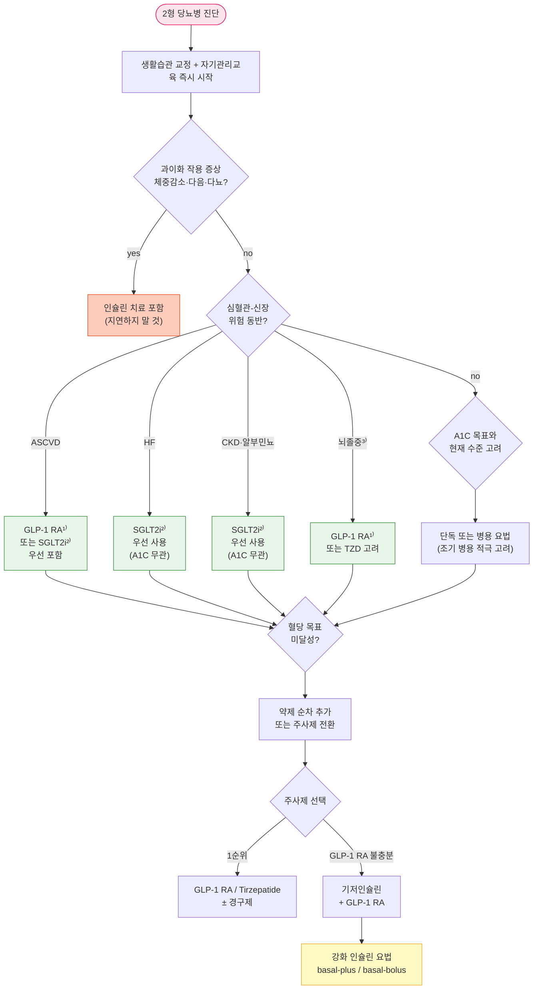

# 당뇨병, 약물 치료 Diabetes Mellitus — Pharmacotherapy

## <mark style="color:green;">치료 방침</mark>

* 약물 선택 시 동반 질환(심부전, 죽상경화심혈관질환, 만성신장질환)에 대한 이득, 혈당 강하 효과, 체중에 대한 효과, 저혈당 위험도, 부작용, 비용 등의 약물 특성과 치료 수용성 및 환자의 특성을 고려 \[전문가의견, 일반적권고]
* 당화혈색소(A1C)를 근거로 약물 치료를 시작하며 A1C를 목표값으로 조절함
  * 식전 포도당이 목표에 도달했음에도 A1C 목표가 달성되지 않을 경우 식후 포도당을 목표로 할 수 있음
  * 환자 상태 및 검사 조건에 따라 A1C 결과 해석에 오류가 있을 수 있음에 유의; 이 경우 **CGM의 TIR(Time In Range, 목표: >70%)** 또는 GMI(Glucose Management Indicator)를 A1C 보조 지표로 활용
* **약물 치료 시작 및 초기부터 A1C의 목표와 현재 수준을 고려하여 치료** \[무작위대조군연구, 일반적권고]
  * 약물 치료 시작 시 단독 또는 병용 요법 모두 가능 \[무작위대조군연구, 일반적권고]
  * 약물 치료 초기 시 병용 요법을 적극적으로 고려 \[무작위대조군연구, 제한적권고]
* 일반적으로 3제 병용 요법으로 혈당 조절 목표에 도달하지 못하는 경우 주사제를 포함한 치료를 고려하지만, 주사제 기반의 치료가 어려운 경우에는 **4제 병용 요법을 고려할 수 있음**
* 약물 치료 시 주기적으로 복약 순응도를 확인하고, 필요한 경우 약물을 조정함 \[전문가의견, 일반적권고]
* 목표 A1C에 도달하지 못한 경우 기존 약물의 증량 또는 다른 계열 약물과의 병용 요법을 조속히 시행 \[무작위대조군연구, 일반적권고]
* 의뢰 대상: 약제 부작용 발생, 혈당 조절 불량, 집중 인슐린 요법 필요, 당뇨병 합병증 발생

### <mark style="color:orange;">당뇨병전단계 (Prediabetes)</mark>

* 생활 습관 중재, 체중 감량 등 예방 조치 우선; 당뇨병 예방을 위해 주 150분 이상 중강도 이상의 신체 활동, 과체중/비만 시 체중의 5% 이상 감량·유지 \[무작위대조군연구, 일반적권고]
* 과체중/비만인 당뇨병전단계 성인에서 T2DM 예방을 위해 metformin 사용을 고려할 수 있음 \[무작위대조군연구, **제한적권고**]
  * ✽KDA 2025: metformin 적응 대상에서 연령 범위(30\~70세) 제한을 삭제하고 '과체중/비만 성인'으로 일반화함

### <mark style="color:orange;">1형 당뇨병 (T1DM)</mark>

* T1DM 성인에게는 인슐린 용량을 스스로 조절하여 유연한 식사가 가능하도록 **체계화된 교육 시행** \[무작위대조군연구, 일반적권고]
* T1DM 성인에게는 다회 인슐린 주사(MDI)나 인슐린 펌프를 이용한 치료를 시행 \[무작위대조군연구, 일반적권고]
* T1DM 성인에서 MDI 또는 인슐린 펌프 치료 시 **연속 혈당 측정기(CGM)를 연동한 치료를 권고** \[무작위대조군연구, 일반적권고]
* MDI 시 **초단기 작용 인슐린 유사체 및 장기 작용 인슐린 유사체를 우선 사용** \[무작위대조군연구, 일반적권고]
* **자동 인슐린 주입기(AID, Automated Insulin Delivery)를 안전하게 사용할 수 있는 모든 T1DM 성인에서 저혈당 위험과 A1C를 모두 낮추기 위해 AID 사용을 권고** \[무작위대조군연구, **일반적권고**] (✽2023 지침 대비 \[제한적→일반적권고]로 상향)
* 저혈당 무감지증이나 중증 저혈당이 발생한 T1DM 성인에게는 저혈당 예방과 저혈당 인지 능력 회복을 위한 전문화·특화된 교육 시행 \[무작위대조군연구, 일반적권고]
* CGM 상시 사용에도 불구하고 저혈당 위험이 높으나 AID를 사용할 수 없는 T1DM 성인에게는 기저 인슐린 주입 중단 알고리듬을 내장한 센서 강화 인슐린 펌프(SAP) 사용을 고려 \[무작위대조군연구, 제한적권고]

### <mark style="color:orange;">2형 당뇨병 (T2DM)</mark>

* 진단 즉시 생활 습관 교정과 자기 관리 방법을 적극적으로 교육하고 지속하도록 모니터링 \[무작위대조군연구, 일반적권고]
* **과이화 작용 증상(체중 감소, 다음, 다뇨 등)과 동반된 고혈당의 경우 인슐린 치료를 시행** \[전문가의견, 일반적권고]
  * ✽KDA 2025: A1C 9%를 기준으로 인슐린 치료 여부를 결정하는 것은 근거가 빈약하고 현실에 맞지 않음. A1C 9% 이하에서도 과이화 작용 증상이 있으면 인슐린 치료가 필요하고, A1C 9% 이상이더라도 반드시 인슐린이 필요한 것은 아닐 수 있음
* **metformin의 '1차 약물 우선 사용' 의무 권고를 삭제** (KDA 2025) — 동반 질환과 환자 특성에 따라 SGLT2i, GLP-1 RA 등으로 시작 가능
* **심부전 동반 시**: 심부전 이익이 입증된 SGLT2i를 A1C 수치와 무관하게 우선 사용하고 금기나 부작용이 없는 한 유지 \[무작위대조군연구, 일반적권고]
* **알부민뇨가 있거나 eGFR 감소 시**: 신장 이익이 입증된 SGLT2i를 A1C 수치와 무관하게 우선 사용하고 금기나 부작용이 없는 한 유지 \[무작위대조군연구, 일반적권고]
* **ASCVD 동반 시**: 심혈관 이익이 입증된 GLP-1 RA 혹은 SGLT2i를 포함한 치료를 우선 시행 \[무작위대조군연구, 일반적권고]
* 강력한 혈당 강하 효과가 필요한 경우 주사제를 포함한 치료 선택 \[무작위대조군연구, 일반적권고]
  * 주사제 기반 병용 요법 고려 시 기저 인슐린보다 GLP-1 RA를 우선 고려 \[무작위대조군연구, 일반적권고]
  * GLP-1 RA 또는 기저 인슐린 단독으로 목표 혈당에 도달하지 못할 경우 두 약제 병용 \[무작위대조군연구, 제한적권고]
  * GLP-1 RA 또는 기저 인슐린 치료에도 목표 혈당에 도달하지 못할 경우 인슐린 강화 요법 시행 \[무작위대조군연구, 제한적권고]
* 매 3\~6개월마다 치료 효과 재평가; 생활 습관 점검, 약제 복용 순응도 평가


**혈당 조절 목표 (KDA 2025)** — 일반적: **A1C <6.5%** (T2DM 성인); T1DM 성인: A1C <7.0%; 고령/노쇠·저혈당 위험 높은 환자: 개별화(A1C <7.5\~8.5%). CGM 사용 시: TIR(70\~180 ㎎/㎗) >70%, TBR(<70 ㎎/㎗) <4%, TAR(>180 ㎎/㎗) <25%


***

### <mark style="color:orange;">2형 당뇨병 약물 치료 알고리듬</mark>



<p align="center"><strong>2형 당뇨병 약물 치료 알고리듬</strong></p>

<p align="center"><em><mark style="color:$info;">Ref. 대한당뇨병학회. 당뇨병 진료지침 제9판. 2025. 그림 6-2.1</mark></em></p>


1. ASCVD에 심혈관 이익이 입증된 GLP-1 RA: dulaglutide, liraglutide, semaglutide\
2. 심부전·CKD에 이익이 입증된 SGLT2i: dapagliflozin, empagliflozin (empagliflozin은 eGFR ≥20인 CKD 및 HFpEF에도 허가 확대)\
3. 허혈성 뇌졸중(TIA 포함, 출혈성 뇌졸중 제외)에서 GLP-1 RA 또는 TZD(pioglitazone) 고려\
※ Metformin을 제외한 **SGLT2i + DPP-4i 2제 병용**은 현재 보험 급여 인정 안 됨 (단, Metformin 포함 3제 병용은 급여 인정); 최신 급여 기준 확인 필수


***

### <mark style="color:orange;">임상 상황별 우선 약제 — 빠른 참조표</mark>

<table><thead><tr><th width="180">임상 상황</th><th width="230">우선 약제</th><th>임상 Pearls</th></tr></thead><tbody><tr><td>심부전(HF)</td><td>SGLT2i</td><td>A1C 무관하게 우선 사용; 삼투성 이뇨 → 전부하 감소; 삼킴 곤란·저혈압 주의</td></tr><tr><td>CKD / 알부민뇨</td><td>SGLT2i</td><td>eGFR ≥20에서 신장 보호 효과; eGFR &lt;45에서 혈당 강하 효과 제한적</td></tr><tr><td>ASCVD 동반</td><td>GLP-1 RA (dulaglutide, liraglutide, semaglutide) 또는 SGLT2i</td><td>심혈관 보호 입증 약제 우선; GLP-1 RA는 체중 감소·뇌졸중 예방에도 유리</td></tr><tr><td>비만 동반</td><td>Tirzepatide 또는 Semaglutide</td><td>강력한 체중 감소(~15~22%); 식욕 억제·대사 개선; 초기 GI 부작용 저용량으로 최소화</td></tr><tr><td>MASLD/MASH 동반</td><td>Pioglitazone 또는 GLP-1 RA</td><td>Pioglitazone은 제한적 권고; 체중 증가·부종·골절 위험 고려하여 개별화</td></tr><tr><td>저혈당 우려 (고령·불규칙 식사)</td><td>DPP-4i / SGLT2i / GLP-1 RA</td><td>SU·Meglitinide 회피; linagliptin은 CKD에서도 용량 조절 불필요</td></tr><tr><td>비용 부담</td><td>Metformin, Sulfonylurea</td><td>저렴·효과 검증; SU는 저혈당 위험 — 고령·신기능 저하 시 glibenclamide 금지</td></tr><tr><td>허혈성 뇌졸중 동반</td><td>GLP-1 RA 또는 Pioglitazone</td><td>출혈성 뇌졸중에는 적용 안 됨; TZD는 심부전(NYHA III/IV) 환자에서 금기</td></tr></tbody></table>


✽복합 질환 동반 시: 단독 인자 기준이 아니라 우선순위를 종합 판단. 예) CKD + ASCVD → SGLT2i 우선, GLP-1 RA 병용 고려\
Ref. KDA 당뇨병 진료지침 제9판. 2025; ADA Standards of Medical Care in Diabetes. 2025


***

### <mark style="color:orange;">주요 치료제의 특성 비교</mark>

<table><thead><tr><th width="130">약제</th><th width="100">A1C 강하(%)</th><th width="80">저혈당</th><th width="90">체중 변화</th><th width="90">GI 증상</th><th width="190">심혈관/심부전 효과</th><th>DKD 진행 지연</th></tr></thead><tbody><tr><td>Metformin</td><td>1.0~2.0</td><td>-</td><td>없음/감소</td><td>중등증</td><td>+ / -</td><td>-</td></tr><tr><td>SGLT2i</td><td>0.5~1.0</td><td>-</td><td>↓</td><td>-</td><td>+(CG, EG) / +(CG, DG, EG, ETG)</td><td>+(CG, DG, EG)</td></tr><tr><td>GLP-1 RA</td><td>0.8~1.5</td><td>-</td><td>↓↓</td><td>중등증</td><td>+(dula-, lira-, sema-glutide) / -</td><td>+(dula-, lira-, sema-glutide)</td></tr><tr><td>GLP-1/GIP (tirzepatide)</td><td>1.6~2.5</td><td>-</td><td>↓↓↓</td><td>중등증</td><td>+(SURPASS-CVOT 2024)</td><td>+</td></tr><tr><td>DPP-4i</td><td>0.5~1.0</td><td>-</td><td>-</td><td>-</td><td>- / 위험(saxagliptin)</td><td>-</td></tr><tr><td>TZD</td><td>0.5~1.4</td><td>-</td><td>↑</td><td>-</td><td>+(pioglitazone) / 악화</td><td>-</td></tr><tr><td>α-Gi</td><td>0.5~1.0</td><td>-</td><td>없음/감소</td><td>중등증</td><td>-</td><td>-</td></tr><tr><td>Meglitinide</td><td>0.5~1.5</td><td>+</td><td>↑</td><td>-</td><td>(자료 없음)</td><td>(자료 없음)</td></tr><tr><td>SU</td><td>1.0~2.0</td><td>+</td><td>↑</td><td>-</td><td>- / -</td><td>-</td></tr><tr><td>Insulin</td><td>매우 큼</td><td>+</td><td>↑</td><td>-</td><td>- / -</td><td>-</td></tr></tbody></table>


α-Gi=α-Glucosidase inhibitor; CG=cana-, DG=dapa-, EG=empa-, ETG=ertu-gliflozin\
Ref. KDA 당뇨병 진료지침 제9판. 2025. 표 6-2.1; ADA Standards of Medical Care in Diabetes 2025


***

## <mark style="color:green;">경구제</mark>

### <mark style="color:orange;">Metformin (MTF)</mark>

* 작용: 간 포도당 합성↓, 말초 인슐린 감수성↑, 공복 혈당↓, 지질 개선, 체중↓
  * ✽당뇨병 환자의 불안/우울증을 약간 개선시킨다는 보고가 있음
* A1C 감소 효과: 1\~2%
* 대사: 신장
* 부작용: 소화 장애(>10%; 설사, 구역, 구토, 복부팽만, 식욕부진, 소화불량, 변비, 복통), Vit B12 결핍, 피부 발진, 젖산증
  * 장기 투여 환자에서 주기적인 Vit B12 측정 고려; 특히 빈혈 또는 말초신경병증 동반 시 적극 권고 (ADA/KDA 2025)
* 주의: 신부전, 고령, 중증 감염, 탈수, 심/폐/간부전
* 금기: 신장 장애(eGFR <30), 급성 및 만성 대사산증
  * eGFR 30\~45 시 주의 사용(≤1,000 ㎎/d) 또는 새로 시작하지 않음; <30 시 투여 금지
* 요오드 조영제 관련 (KDA 2025 그림 6-2.3 기준):
  * **정맥 투여**: eGFR 30\~60인 경우 당일부터 48시간까지 중단 및 신기능 평가 후 재개; eGFR ≥60이면 중단 불필요
  * **동맥 투여**: 신기능과 무관하게 당일부터 48시간까지 중단 및 신기능 평가 후 재개
* 용법: 식사와 함께 복용; 저용량으로 시작 → 2\~3주 간격 증량 (✽효과 발현이 늦음)


※ KDA 2025에서 metformin의 '1차 약물 우선 사용' 의무 권고를 삭제함. 혈당 강하 효과에서 metformin이 다른 약물에 비해 유의한 이점이 없었음(한국인 포함 60개 연구 네트워크 메타분석). 동반 질환에 따라 SGLT2i, GLP-1 RA를 첫 번째 약제로 선택 가능.


<table><thead><tr><th width="160">성분명</th><th width="220">상품명</th><th width="200">1일 용량 (mg)</th><th>작용시간 (hr)</th></tr></thead><tbody><tr><td>metformin</td><td><mark style="color:blue;">[글루엠, 글루코파지]</mark></td><td>500~2,550 #2~3</td><td>6~12</td></tr><tr><td>metformin SR</td><td><mark style="color:blue;">[다이아벡스엑스알 서방]</mark></td><td>500~2,000 #1~2</td><td>24</td></tr></tbody></table>

***

### <mark style="color:orange;">SGLT2i (Sodium–glucose cotransporter-2 Inhibitor)</mark>

* 작용: 신장에서의 포도당 재흡수↓, 소변 당 배설↑; 혈압↓, 체중↓, 심부전/ASCVD 위험↓
  * ✽삼투성 이뇨 효과 → 전부하 감소 → 심부전 증상 개선
* A1C 감소 효과: 0.5\~1.0%; **eGFR <45인 경우 혈당 강하 효과 감소**
* 적응: **심부전 또는 CKD(알부민뇨·eGFR 감소) 동반 시 A1C 수치와 무관하게 우선 사용 및 금기·부작용 없는 한 유지** \[무작위대조군연구, 일반적권고]; ASCVD 동반 시 심혈관 이익 입증 약제 포함 우선
* 대사: 신장
* 부작용: 요로 감염, 생식기 진균 감염, 케톤산증(T2DM에서 드묾, **전신 상태 불량 시 정상 혈당에서도 DKA 가능**), 체액량 감소, 회음 괴사성 근막염(Fournier's Gangrene — 드묾)
* 주의: 신장애, 중증 간장애, 저혈압, 고령
  * 수술 3\~4일 전, 위험한 질환 상태, 지속되는 공복 상태의 경우 SGLT2i 투여 중단
* 금기: 투석
* 용법: 식사와 관계없이 복용


⚠️ **Euglycemic DKA (정상 혈당 케톤산증)** — 혈당이 정상(180~250 ㎎/㎗ 이하)이어도 발생 가능하므로 혈당 정상=안전 으로 판단하지 말 것.

**중단 적응 상황:**
수술 전 3~4일 / 장기간 금식 / 저탄수화물 식이 / 급성 중증 질환(감염, 발열 등) / 과음

**증상:** 구역·구토·복통·호흡 곤란 → 즉시 케톤 측정(소변 또는 혈중) 및 내원 지시


<table><thead><tr><th width="240">성분명 [상품명]</th><th width="140">1일 용량 (mg)</th><th width="100">GFR 59~45</th><th width="100">GFR 44~30</th><th width="100">GFR 29~15</th><th>&lt;15</th></tr></thead><tbody><tr><td>canagliflozin¹⁾</td><td>100~300 qd</td><td>100 qd</td><td>금지</td><td>금지</td><td>금지</td></tr><tr><td>dapagliflozin¹⁾²⁾ <mark style="color:blue;">[포시가†]</mark></td><td>10 qd</td><td>심부전·신장이득(≥25) 가능³⁾</td><td>심부전·신장이득(≥25) 가능³⁾</td><td>새로 시작하지 않음</td><td>새로 시작하지 않음</td></tr><tr><td>empagliflozin¹⁾²⁾ <mark style="color:blue;">[자디앙]</mark></td><td>10~25 qd</td><td>심부전·신장이득(≥20) 가능³⁾⁴⁾</td><td>심부전·신장이득(≥20) 가능³⁾⁴⁾</td><td>새로 시작하지 않음</td><td>새로 시작하지 않음</td></tr><tr><td>ertugliflozin²⁾ <mark style="color:blue;">[스테글라트로]</mark></td><td>5~15 qd</td><td>자료 없음</td><td>자료 없음</td><td>자료 없음</td><td>자료 없음</td></tr><tr><td>ipragliflozin <mark style="color:blue;">[슈글렛]</mark></td><td>50 qd</td><td>자료 없음</td><td>자료 없음</td><td>자료 없음</td><td>자료 없음</td></tr><tr><td>enavogliflozin <mark style="color:blue;">[엔블로]</mark></td><td>0.3 qd</td><td>자료 없음</td><td>자료 없음</td><td>자료 없음</td><td>자료 없음</td></tr></tbody></table>


1. ASCVD, CKD에 심혈관·신장 보호 효과 입증 / 2) 심부전에 적용\
3) 이 eGFR 범위에서는 혈당 강하 효과는 제한적임 / 4) 10 ㎎ 용량 사용\
✽ dapagliflozin: 오리지널 제품(포시가)은 국내 허가 자진 취하로 철수; 현재 국내 임상에서는 국산 제네릭 단일제(트루다파, 다파론, 엑시글루 등) 및 복합제로 처방됨\
✽ enavogliflozin <mark style="color:blue;">[엔블로]</mark> 0.3 ㎎: KDA 2025에 수록된 국산 SGLT2i; 혈당 강하 효과는 확인되었으나 심부전·신장 이득 장기 데이터는 아직 제한적 — 오리지널 SGLT2i와 동등한 장기 이득으로 간주하지 않도록 주의


***

### <mark style="color:orange;">DPP-4i (Dipeptidyl peptidase-4 inhibitor)</mark>

* 작용: incretin 분해 억제(GLP-1↑, GIP↑); 포도당 의존 인슐린 분비↑, 글루카곤 분비↓, 식후 혈당 강하 (✽아시아인에게 더 효과적이라는 보고가 있음)
* A1C 감소 효과: 0.5\~1.0%
* 대사: 신장(linagliptin 제외—담즙/장 배설)
* 부작용: 설사, 복통, 비인두염, 상기도 감염, **췌장염**, **중증 관절통**(sitagliptin), **물집유사물집증**(linagliptin, vildagliptin), 심부전으로 인한 입원 위험 증가(saxagliptin)
* 주의: 신장애(용량 조절; linagliptin 제외), 유당 불내성(saxagliptin, vildagliptin), 췌장염, 심부전(saxagliptin — SAVOR-TIMI: 심부전 입원↑)
* 용법: 식사와 관계없이 복용

<table><thead><tr><th width="210">성분명 [상품명]</th><th width="128">1일 용량 (mg)</th><th width="100">GFR 59~45</th><th width="100">GFR 44~30</th><th width="100">GFR 29~15</th><th>&lt;15</th></tr></thead><tbody><tr><td>alogliptin <mark style="color:blue;">[네시나]</mark></td><td>25 qd</td><td>12.5¹⁾</td><td>12.5¹⁾</td><td>6.25</td><td>6.25</td></tr><tr><td>anagliptin <mark style="color:blue;">[가드렛]</mark></td><td>100 bid</td><td>용량 조절 필요 없음</td><td>(좌동)</td><td>100</td><td>자료 없음</td></tr><tr><td>evogliptin <mark style="color:blue;">[슈가논]</mark></td><td>5 qd</td><td>용량 조절 필요 없음</td><td>(좌동)</td><td>(좌동)</td><td>(좌동)</td></tr><tr><td>gemigliptin <mark style="color:blue;">[제미글로]</mark></td><td>50 qd</td><td>용량 조절 필요 없음</td><td>(좌동)</td><td>(좌동)</td><td>(좌동)</td></tr><tr><td>linagliptin <mark style="color:blue;">[트라젠타]</mark></td><td>5 qd</td><td>용량 조절 필요 없음</td><td>(좌동)</td><td>(좌동)</td><td>(좌동)</td></tr><tr><td>saxagliptin <mark style="color:blue;">[온글라이자]</mark></td><td>2.5~5 qd</td><td>5 mg²⁾</td><td>2.5</td><td>(좌동)</td><td>(좌동)</td></tr><tr><td>sitagliptin <mark style="color:blue;">[자누비아]</mark></td><td>25~100 qd</td><td>100</td><td>50</td><td>25</td><td>(좌동)</td></tr><tr><td>teneligliptin <mark style="color:blue;">[테넬리아]</mark></td><td>20 qd</td><td>용량 조절 필요 없음</td><td>(좌동)</td><td>(좌동)</td><td>(좌동)</td></tr><tr><td>vildagliptin <mark style="color:blue;">[가브스]</mark></td><td>50 bid</td><td>100 mg¹⁾</td><td>50</td><td>(좌동)</td><td>(좌동)</td></tr></tbody></table>


1. eGFR ≥50에서 용량 조절 필요 없음 / 2) eGFR ≥45에서 용량 조절 필요 없음\
※ linagliptin은 신장 배설이 거의 없어 모든 CKD 단계에서 용량 조절 불필요; CKD 환자에서 선호


***

### <mark style="color:orange;">Thiazolidinedione (TZD)</mark>

* 작용: 말초 조직 인슐린 저항성 개선, 간 당 생성↓; 뇌졸중 예방, MASLD/MASH에 유익(pioglitazone)
* A1C 감소 효과: 0.5\~1.4%
* 대사: 간
* 부작용: 심부전 악화, 체중↑, 부종, Hb↓, 골절 위험↑(특히 여성)
* 금기: NYHA Class III/IV 심부전, 활동성 방광암(pioglitazone)
* 주의: 심부전, 간장애, 중증 신장애; 신기능 저하 시 용량 조절은 불필요하나 체액 저류 가능성 때문에 권장하지 않음
* ✽pioglitazone은 MASLD/MASH(대사기능장애 관련 지방간 질환)에서 T2DM 성인의 **일차 약제 후보로 고려할 수 있음** \[무작위대조군연구, **제한적권고**] — 체중 증가·부종·골절 위험을 고려하여 개별화 (KDA 2025 섹션 9-2; ☞ 지방간 질환 챕터)
* 용법: 식사와 관계없이 복용

<table><thead><tr><th width="250">성분명 [상품명]</th><th width="160">1일 용량 (mg)</th><th>반감기 (hr)</th></tr></thead><tbody><tr><td>lobeglitazone <mark style="color:blue;">[듀비에]</mark></td><td>0.5 qd</td><td>9.5(남), 15(여)</td></tr><tr><td>pioglitazone <mark style="color:blue;">[액토스]</mark></td><td>15~30 qd (최대 45 ㎎)</td><td>3~7</td></tr><tr><td>rosiglitazone</td><td>4~8 qd</td><td>3~4</td></tr></tbody></table>

***

### <mark style="color:orange;">α-Glucosidase inhibitor (α-Gi)</mark>

* 작용: 상부 위장관에서의 다당류 소화 및 흡수 억제, 식후 혈당↓
* A1C 감소 효과: 0.5\~1.0%
* 대사: 장
* 부작용: 복부팽만감, 방귀 증가, 묽은 변, 배변 횟수 증가, 급성 간염
* 금기: 소화 흡수 장애를 동반한 만성 장질환(예: IBD)
* 주의: 중증 신/간질환, 고령, 중증 감염; SU 병용 시 저혈당 증가(**저혈당 교정 시 반드시 포도당 정제 또는 포도당 음료 사용 — 설탕·사탕·과자는 흡수 억제로 효과 없음**); resin 또는 제산제와의 병용 회피
* 용법: **식사 직전(첫 숟갈과 함께)** 복용; 저용량으로 시작 → 4주 간격으로 조절

<table><thead><tr><th width="194">성분명 [상품명]</th><th width="126">1일 용량 (mg)</th><th width="100">GFR 59~45</th><th width="100">GFR 44~30</th><th width="100">GFR 29~15</th><th>&lt;15</th></tr></thead><tbody><tr><td>acarbose <mark style="color:blue;">[글루코바이]</mark></td><td>50~100 tid pc</td><td>용량 조절 필요 없음</td><td>(좌동)</td><td>&lt;25에서 금지</td><td>(좌동)</td></tr><tr><td>voglibose <mark style="color:blue;">[베이슨]</mark></td><td>0.2~0.3 tid pc</td><td>용량 조절 필요 없음</td><td>(좌동)</td><td>자료 없음</td><td>자료 없음</td></tr></tbody></table>


※ miglitol <mark style="color:blue;">[미그보스]</mark>: CrCl <25 또는 s-Cr >2 시 금기\
※ α-Gi 복용 중 저혈당 발생 시 설탕(sucrose)은 흡수 억제로 효과가 없으므로 **포도당(glucose) 또는 포도당 함유 음료**를 섭취해야 함


***

### <mark style="color:orange;">Meglitinide</mark>

* 작용: 인슐린 분비↑, 식후 혈당↓; SU에 비해 작용 속도가 빠르고 반감기가 짧아 저혈당 부작용이 적음
* A1C 감소 효과: 0.5\~1.5%
* 대사: 간
* 부작용: 체중 증가, 저혈당, 변비, 상기도 감염
* 금기: gemfibrozil과 병용 투여 금기(repaglinide — 혈중 농도 수십 배 상승, 중증 저혈당 위험)
* 주의: 중증 감염, 중증 간/신 장애, 임신, 수유
  * eGFR ≥15에서 용량 조절 필요 없음; eGFR <15 시 주의(nateglinide는 금기)
  * repaglinide는 CYP3A4 + CYP2C8 이중 대사 — CYP3A4 억제제(클라리스로마이신, 이트라코나졸, 케토코나졸 등) 병용 시 혈중 농도 유의하게 상승; 병용 시 저혈당 모니터링 강화
* 용법: **식사 직전(식사 없으면 투여 생략)** 복용; 저용량으로 시작 → 1\~2주 간격 증량

<table><thead><tr><th width="250">성분명 [상품명]</th><th width="200">1일 용량 (mg)</th><th>작용시간</th></tr></thead><tbody><tr><td>mitiglinide <mark style="color:blue;">[글루파스트]</mark></td><td>10 tid ac</td><td>&lt;4 hr</td></tr><tr><td>nateglinide <mark style="color:blue;">[파스틱]</mark></td><td>60~120 tid ac</td><td>&lt;4 hr</td></tr><tr><td>repaglinide <mark style="color:blue;">[노보넘]</mark></td><td>0.5 tid~4 qid ac</td><td>&lt;4 hr</td></tr></tbody></table>

***

### <mark style="color:orange;">Sulfonylurea (SU)</mark>

* 작용: 췌장 β-cell에서 인슐린 분비 자극, 식전/식후 혈당↓
* A1C 감소 효과: 1\~2%
* 대사: 간, 신장
* 부작용: 체중↑, **저혈당**(특히 식사 불규칙·고령·신기능 저하 시 위험), 구역, 간질환, 용혈성 빈혈(G6PD 결핍 환자)
* 주의: **저혈당 위험이 높은 환자에서 주의해서 사용**; 간질환(정상치의 3배 시 금지), 신질환(eGFR <45), sulfa allergy, 임신, 수유, 수술, 중증 감염, 중증 외상, 설사, 구토
  * **고령 환자에서 장시간 작용 SU(glibenclamide) 회피 권고** — 저혈당 및 저혈당 관련 사망 위험 증가
* 용법: 식사 직전 복용(1일 1회 복용 시 아침 식전); 저용량으로 시작 → 1\~2주 간격 증량

<table><thead><tr><th width="260">성분명 [상품명]</th><th width="200">1일 용량 (mg)</th><th>작용시간</th></tr></thead><tbody><tr><td>glibenclamide <mark style="color:blue;">[유글루콘]</mark></td><td>2.5~20 #1~2</td><td>12~24 hr</td></tr><tr><td>gliclazide <mark style="color:blue;">[다이아미크롱]</mark></td><td>40~320 #1~2</td><td>12~24 hr</td></tr><tr><td>gliclazide SR <mark style="color:blue;">[다이아미크롱서방]</mark></td><td>30~120 qd</td><td>24 hr</td></tr><tr><td>glimepiride <mark style="color:blue;">[아마릴]</mark></td><td>1~8 qd</td><td>24 hr</td></tr><tr><td>glipizide <mark style="color:blue;">[다이그린]</mark></td><td>5~40 #1~3</td><td>12~18 hr</td></tr></tbody></table>


저혈당 위험 때문에 주의해서 시작; 고령·신기능 저하 환자에서 장시간 작용 SU(glibenclamide)는 피할 것. 식사를 거르는 경우 해당 용량을 건너뜀.


***

### <mark style="color:orange;">복합제</mark>

#### <mark style="color:$primary;">DPP-4i 복합제</mark>

* <mark style="color:blue;">[자누메트]</mark> sitagliptin/MTF · <mark style="color:blue;">[자누메트 엑스알 서방]</mark> sitagliptin/MTF XR
* <mark style="color:blue;">[가브스메트]</mark> vildagliptin/MTF
* <mark style="color:blue;">[콤비글라이즈 서방]</mark> saxagliptin/MTF
* <mark style="color:blue;">[트라젠타 듀오]</mark> linagliptin/MTF
* <mark style="color:blue;">[네시나메트]</mark> alogliptin/MTF
* <mark style="color:blue;">[가드메트]</mark> anagliptin/MTF
* <mark style="color:blue;">[제미메트 서방]</mark> gemigliptin/MTF · <mark style="color:blue;">[테넬리아 엠 서방]</mark> teneligliptin/MTF · <mark style="color:blue;">[슈가메트 서방]</mark> evogliptin/MTF

#### <mark style="color:$primary;">SGLT2i 복합제</mark>

* <mark style="color:blue;">[직듀오 서방]</mark> dapagliflozin/MTF · <mark style="color:blue;">[자디앙듀오]</mark> empagliflozin/MTF · <mark style="color:blue;">[엔블로멧 서방]</mark> enavogliflozin/MTF

#### <mark style="color:$primary;">SGLT2i + DPP-4i 복합제</mark>

* <mark style="color:blue;">[에스글리토]</mark> empagliflozin/linagliptin · <mark style="color:blue;">[큐턴]</mark> saxagliptin/dapagliflozin · <mark style="color:blue;">[제미다파]</mark> gemigliptin/dapagliflozin · <mark style="color:blue;">[슈가다파]</mark> evogliptin/dapagliflozin · <mark style="color:blue;">[시다프비아]</mark> dapagliflozin/sitagliptin · <mark style="color:blue;">[스테글루잔]</mark> ertugliflozin/sitagliptin


⚠️ **Metformin을 제외한 SGLT2i + DPP-4i 2제 병용**은 현재 보험 급여 인정 안 됨 (단, Metformin 포함 3제 병용은 급여 인정). 보험 급여 기준은 수시로 변경될 수 있으므로 처방 시 **최신 급여 기준 확인 필수**.


#### <mark style="color:$primary;">Thiazolidinedione 복합제</mark>

* <mark style="color:blue;">[네시나액트]</mark> pioglitazone/alogliptin · <mark style="color:blue;">[액토스메트]</mark> pioglitazone/MTF · <mark style="color:blue;">[듀비메트 서방]</mark> lobeglitazone/MTF

#### <mark style="color:$primary;">Sulfonylurea 복합제</mark>

* <mark style="color:blue;">[아마릴 엠]</mark> glimepiride/MTF · <mark style="color:blue;">[글루코반스]</mark> glibenclamide/MTF · <mark style="color:blue;">[글루파 콤비]</mark> gliclazide/MTF

#### <mark style="color:$primary;">α-Glucosidase inhibitor 복합제</mark>

* <mark style="color:blue;">[보그메트]</mark> voglibose/MTF

#### <mark style="color:$primary;">3제 복합제</mark>

* <mark style="color:blue;">[듀비메트 에스서방]</mark> lobeglitazone/sitagliptin/MTF

***

## <mark style="color:green;">GLP-1 RA (Glucagon-like peptide-1 receptor agonist)</mark>

* 작용: 포도당 의존 인슐린 분비↑, 글루카곤 분비↓ → 위 배출 지연, 식욕 억제, 근육/지방 조직의 당 흡수↑, 간 당 생성↓; ASCVD 위험↓, 뇌졸중 예방, 체중↓
  * 체중 감소 효과: semaglutide > liraglutide > dulaglutide > exenatide > lixisenatide
* A1C 감소 효과: 0.8\~1.5%
* 부작용: 위장 장애(구역, 구토, 설사), 췌장염, 담석증, 급성 신장 손상, 심박수 증가
* 주의: 췌장염 과거력, 급성 신장 손상, 중증 간장애, 신장애, **중증 위마비를 포함한 중증 위장관 질환(권장되지 않음)**, **당뇨병성 망막병증(특히 semaglutide — 급격한 혈당 강하 시 망막병증 악화 보고; 망막병증 병력 있는 환자에서 안과 모니터링 강화 권고)**; **DPP-4i와는 병용하지 않음**
* 금기: 갑상선 수질암 또는 MEN2의 과거력 또는 가족력
* ASCVD 확인 또는 위험 인자가 있는 경우 심혈관 질환 예방 효과가 입증된 GLP-1 RA 추천
* 주사제 기반 병용 고려 시 기저 인슐린보다 GLP-1 RA를 우선 선택

#### <mark style="color:$primary;">경구제</mark>

* semaglutide <mark style="color:blue;">[리벨서스]</mark>: 3 ㎎ qd ×30일 → 7 ㎎ qd (최대 14 ㎎ qd)
  * ✽반드시 공복에 물 120 ㎖ 이하와 복용; 복용 후 30분간 음식·음료·다른 약물 섭취 금지

#### <mark style="color:$primary;">피하주사제</mark>

<table><thead><tr><th width="270">성분명 [상품명]</th><th width="230">용량 (최대)</th><th>GFR에 따른 용량 조절</th></tr></thead><tbody><tr><td>dulaglutide¹⁾²⁾ <mark style="color:blue;">[트루리시티 주]</mark></td><td>0.75 ㎎ qwk → 최대 1.5 ㎎/wk</td><td>용량 조절 필요 없음</td></tr><tr><td>exenatide <mark style="color:blue;">[바이에타 주]</mark></td><td>5 ㎍ bid 식전 60분 내 (최대 10 ㎍ bid)</td><td>CrCl 30~50 시 주의; &lt;30 시 금지</td></tr><tr><td>liraglutide¹⁾³⁾ <mark style="color:blue;">[빅토자 주]</mark></td><td>0.6 ㎎ qd → 최대 1.8 ㎎ qd</td><td>eGFR ≥15에서 조절 불필요</td></tr><tr><td>lixisenatide³⁾ <mark style="color:blue;">[릭수미아 주]</mark></td><td>10 ㎍ qd 식전 1시간 내 (최대 20 ㎍ qd)</td><td>eGFR ≥30에서 조절 불필요</td></tr><tr><td>semaglutide¹⁾ <mark style="color:blue;">[오젬픽 펜]</mark></td><td>0.25 ㎎ qwk → 0.5~1 ㎎ qwk (최대 2 ㎎/wk; 국내 허가 현황 확인)</td><td>조절 불필요</td></tr></tbody></table>


1. 심혈관 질환 예방 효과가 입증된 약제(ASCVD 동반 시 우선 선택) / 2) 보험 급여 적용 / 3) 복합제로 보험 적용 제품 있음\
※ SELECT 연구(2023): semaglutide 2.4 ㎎은 당뇨병 없는 비만 환자에서도 MACE 20% 감소 — 심혈관 고위험 비만에서의 근거 확립


#### <mark style="color:$primary;">GLP-1/GIP dual agonist (Tirzepatide, Twincretin)</mark>

* GLP-1 및 GIP(glucose-dependent insulinotropic polypeptide) receptor에 모두 작용
* 작용: 인슐린 생산↑, 간 당 생성↓, 위장관 통과 지연(포만감 유지), 식욕 억제; 혈당 강하 + 체중 감소
* A1C 감소: \~2.0\~2.5%(GLP-1 RA 대비 우월); 체중 감소: 최대 \~15\~22% (SURMOUNT-1)
* **심혈관 이득**: SURPASS-CVOT(2024)에서 dulaglutide 대비 비열등성 확인; 추가 심혈관 이득 가능성 제시 (✽KDA 2025 ASCVD 우선 약제에는 아직 미포함 — semaglutide, liraglutide, dulaglutide 중심)
* 금기: 갑상선 수질암 또는 MEN2의 과거력 또는 가족력
* 주의: 췌장염, GLP-1 RA에 과민 반응 병력, 중증 위장관 질환, 급성 신장 손상, 중증 간장애, 당뇨병 망막병증, 급성 담낭 질환
* tirzepatide <mark style="color:blue;">[마운자로]</mark>: 2.5 ㎎ qwk SQ → 4주마다 증량(5→7.5→10→12.5→15 ㎎/wk)
  * ✽T2DM 혈당 조절 적응증(2023 국내 허가); 비만 적응증(<mark style="color:blue;">[젭바운드]</mark>)은 별도

#### <mark style="color:$primary;">인슐린/GLP-1 RA 복합제</mark>

* glargine/lixisenatide: 1일 1회 식사 전 1시간 이내 피하주사 <mark style="color:blue;">[솔리쿠아펜]</mark>
* degludec/liraglutide: 1일 1회 피하주사 <mark style="color:blue;">[줄토피 플렉스터치 주]</mark>

***

## <mark style="color:green;">인슐린</mark>

### <mark style="color:orange;">인슐린 요법의 선택</mark>

* 인슐린 & metformin 병용: 인슐린 단독 투여보다 혈당 조절이 향상되고 인슐린 필요량 및 저혈당 위험이 감소하며 체중 증가가 적음
* 인슐린 & acarbose 병용: A1C, 식후 혈당, 식후 중성지방 조절에서 유익
* 과이화 작용 증상이 없으면 **기저 인슐린부터 시작** (경구제 병용 유지 권장)
* 식후 고혈당이 현저하거나 A1C가 매우 높은 경우(참고 기준: ≥8.5%) 혼합형 또는 식사 인슐린 고려
  * ✽A1C cut-off보다 증상·식후 고혈당 패턴을 우선 고려할 것 (KDA 2025 철학; A1C 9% 기준의 일괄 적용은 더 이상 권고하지 않음)
* 식사 또는 운동에 따른 인슐린 용량 조절이 필요하며 특히 식후 당 조절이 필요한 경우에는 식사 시간을 고려하여 주사


⚠️ **Overbasalization 경고** — 다음이 모두 해당되면 기저 인슐린 증량보다 식사 인슐린 또는 GLP-1 RA 추가를 고려:

* 기저 인슐린 용량 > 0.5 U/㎏/d
* 공복 혈당은 목표 범위 내
* A1C는 여전히 높음 (→ **식후 고혈당**이 원인)
* 저혈당 또는 야간 저혈당 발생

→ 기저 인슐린 추가 증량은 효과 없이 저혈당·체중 증가만 초래; **Basal-plus(식사 인슐린 1회 추가) 또는 GLP-1 RA 병용**으로 전환



**주사제 강화 단계 (Injectable Escalation Ladder)**

경구제 최적화 → GLP-1 RA 또는 Tirzepatide → 기저 인슐린 + GLP-1 RA 병용 → Basal-plus(기저 + 식사 1회) → Basal-bolus(기저 + 매 식전 식사 인슐린)

✽ 단계 상향 전 반드시 복약 순응도·식이·운동 점검; Overbasalization 여부 확인 후 식사 인슐린 추가 vs GLP-1 RA 추가 결정



※ 과이화 작용 증상(체중 감소, 다음, 다뇨)이 동반된 고혈당의 경우 인슐린 치료를 시행 \[전문가의견, 일반적권고]; A1C 9%를 기준으로 인슐린 치료 유무를 결정하는 것은 근거가 빈약하고 현실에 맞지 않음. 과이화 작용이 있을 때는 A1C 9% 이하에서도 인슐린을 사용해야 하고, A1C 9% 이상이더라도 인슐린 치료가 반드시 필요한 것은 아닐 수 있음 (KDA 2025)


### <mark style="color:orange;">인슐린 요법의 비교</mark>

<table><thead><tr><th width="100">구분</th><th width="200">기저 인슐린 요법</th><th width="220">혼합형 인슐린유사체 투여법</th><th>식전 인슐린 요법</th></tr></thead><tbody><tr><td>장점</td><td>저혈당 발생 및 체중 증가가 적음</td><td>A1C가 높은 경우 효과적</td><td>식후 고혈당 및 A1C 조절에 효과; 유연성 높음</td></tr><tr><td>단점</td><td>A1C가 높은 경우(>8.5%)에는 목표 달성이 어려움</td><td>저혈당 발생 빈도가 높음; 체중 증가가 많음; 많은 용량이 요구됨</td><td>자주 주사해야 함; 자주 혈당 측정을 해야 함; 저혈당 발생 빈도가 높음</td></tr><tr><td>기타</td><td>식후 혈당 조절을 위해 경구 혈당 강하제 병용 고려</td><td>치료 만족도 및 삶의 질에 대하여 논란</td><td>삶의 질에 대하여 논란</td></tr></tbody></table>

### <mark style="color:orange;">인슐린 종류 및 작용시간</mark>

<table><thead><tr><th width="310">성분명 [상품명]</th><th width="165">시작/최대/지속 (hr)</th><th width="130">투여일정</th><th>비고</th></tr></thead><tbody><tr><td><strong>Rapid-Acting (초단기 작용)</strong></td><td></td><td></td><td></td></tr><tr><td>aspart <mark style="color:blue;">[노보라피드]</mark>, lispro <mark style="color:blue;">[휴마로그]</mark>, glulisine <mark style="color:blue;">[에피드라]</mark></td><td>10~15분/1~2 hr/3~5 hr</td><td>식사 직전(15분 이내) 또는 식사 직후</td><td>식후 혈당 조절; 임신부 투여 가능</td></tr><tr><td><strong>Ultra-Rapid-Acting (초초단기)</strong></td><td></td><td></td><td></td></tr><tr><td>faster aspart <mark style="color:blue;">[피아스프]</mark>, lispro Lyumjev <mark style="color:blue;">[룸제브]</mark></td><td>2~4분/1~1.5 hr/3~5 hr</td><td>식사 시작 2분 이내; 식후 20분 이내도 가능</td><td>식후 혈당 조절 개선; 임신부 투여 가능</td></tr><tr><td><strong>Short-Acting (단기 작용)</strong></td><td></td><td></td><td></td></tr><tr><td>regular <mark style="color:blue;">[휴물린알]</mark></td><td>30분/2~3 hr/6.5 hr</td><td>식사 30분 전</td><td>저렴; 야간 저혈당; 정맥 주사 가능</td></tr><tr><td><strong>Intermediate (중기 작용)</strong></td><td></td><td></td><td></td></tr><tr><td>NPH <mark style="color:blue;">[휴물린엔]</mark></td><td>1~3/5~8 hr/18 hr</td><td>밤 또는 q12h</td><td>저렴; 야간 저혈당</td></tr><tr><td><strong>Long-Acting (장기 작용)</strong></td><td></td><td></td><td></td></tr><tr><td>degludec <mark style="color:blue;">[트레시바]</mark></td><td>1 hr/없음/42 hr~</td><td>매일 같은 시간(±8 hr 여유)</td><td>저혈당 가장 적음; 고가</td></tr><tr><td>glargine U100 <mark style="color:blue;">[란투스]</mark></td><td>1.5 hr/없음/24 hr</td><td>매일 같은 시간</td><td>CVD 안전성 입증</td></tr><tr><td>glargine U300 <mark style="color:blue;">[투제오]</mark></td><td>6 hr/없음/24~36 hr</td><td>(상동)</td><td>glargine U100보다 저혈당 더 적음; 고가</td></tr><tr><td>detemir <mark style="color:blue;">[레버미어]</mark></td><td>3~4/6~8 hr/24 hr</td><td>(상동)</td><td>임신 중 고려 가능</td></tr><tr><td><strong>Premixed</strong></td><td></td><td></td><td></td></tr><tr><td>degludec/aspart 70/30 <mark style="color:blue;">[리조덱]</mark></td><td>2분/이중/~42 hr</td><td>주된 식사 직전(식후 20분 이내 가능), 1~2회</td><td>장기 기저 + 초단기 식사 효과</td></tr><tr><td>lispro protamine 75/25 <mark style="color:blue;">[휴마로그믹스25]</mark></td><td>15분/이중/16 hr</td><td>아침 & 저녁 식사 시</td><td>편리; 야간 저혈당</td></tr><tr><td>aspart protamine 70/30 <mark style="color:blue;">[노보믹스30]</mark></td><td>15분/이중/16 hr</td><td>(상동)</td><td>(상동)</td></tr><tr><td>NPH70/regular30 <mark style="color:blue;">[휴물린70/30]</mark></td><td>30분/이중/16 hr</td><td>(상동)</td><td>(상동)</td></tr></tbody></table>


* 저혈당 위험: degludec/glargine U300 < glargine U100/detemir < NPH insulin
* **faster aspart(피아스프)/Lyumjev(룸제브)**: 식후 즉시 투여도 가능한 초초단기 — 식사 시간이 불규칙한 환자에서 유용
* **리조덱(degludec/aspart)**: 기저와 식사 인슐린 역할을 하나의 주사로 충족 — 혼합형 대안으로 활용

Ref. 대한당뇨병학회. 당뇨병 진료지침 제9판. 2025. 표 6-2.4


### <mark style="color:orange;">T1DM에서의 인슐린 공급 장치 비교</mark>

<table><thead><tr><th width="320">인슐린 주사 regimen</th><th width="100">유연성</th><th width="130">낮은 저혈당 위험</th><th>고비용</th></tr></thead><tbody><tr><td>MDI with LAA + RAA or URAA</td><td>+++</td><td>+++</td><td>+++</td></tr><tr><td>MDI with NPH + RAA or URAA</td><td>++</td><td>++</td><td>++</td></tr><tr><td>MDI with NPH + 속효성(regular) insulin</td><td>++</td><td>+</td><td>+</td></tr><tr><td>NPH + 속효성(regular) insulin or premix bid Inj.</td><td>+</td><td>+</td><td>+</td></tr></tbody></table>

<table><thead><tr><th width="320">연속 인슐린 펌프 regimen</th><th width="100">유연성</th><th width="130">낮은 저혈당 위험</th><th>고비용</th></tr></thead><tbody><tr><td>AID system (Hybrid Closed Loop)</td><td>+++++</td><td>+++++</td><td>++++++</td></tr><tr><td>sensor-augmented pump with predictive low-glucose suspend (PLGS)</td><td>++++</td><td>++++</td><td>++++</td></tr><tr><td>insulin pump therapy without automation</td><td>+++</td><td>+++</td><td>++++</td></tr></tbody></table>


LAA=long-acting insulin analog; MDI=multiple daily injections; RAA=rapid-acting insulin analog; URAA=ultra-rapid-acting insulin analog; AID=Automated Insulin Delivery\
Ref. ADA. Standards of Medical Care in Diabetes. 2025. Fig 9-1; KDA 당뇨병 진료지침 제9판. 2025. 그림 6-1.1


### <mark style="color:orange;">인슐린 치료 시작 용량 및 용량 조절</mark>

<table><thead><tr><th width="130">인슐린 종류</th><th width="230">시작 용량</th><th width="200">용량 조절</th><th>저혈당 발생 시</th></tr></thead><tbody><tr><td>기저 인슐린</td><td>10 U/d 또는 0.1~0.2 U/㎏/d</td><td>목표 공복 혈당 기준으로 3일 간격 2 U씩 증량(입증된 다른 조절 방법 사용 가능)</td><td>원인 분석 후 특별한 원인 없으면 10~20% 감량</td></tr><tr><td>식사 인슐린</td><td>4 U/d 또는 기저 인슐린의 10%; A1C &lt;8%이면 기저 인슐린 4 U/d 또는 10% 감량 고려</td><td>주 2회 1~2 U 또는 10~15% 증량</td><td>(좌동)</td></tr><tr><td>혼합 인슐린</td><td>초치료 시 10~12 U/d 또는 0.3 U/㎏/d; 기저 인슐린의 2/3를 오전, 1/3을 오후 또는 1/2씩 분할</td><td>주 1~2회 1~2 U 또는 10~15% 증량</td><td>원인 분석 후 2~4 U 또는 10~20% 감량</td></tr></tbody></table>


Ref. KDA 당뇨병 진료지침 제9판. 2025. 표 6-2.8; ADA Standards of Medical Care 2025


### <mark style="color:orange;">공복 혈당에 따른 기저 인슐린 용량 조절</mark>

<table><thead><tr><th>최근 3일간 공복 혈당 (㎎/㎗)</th><th width="100">&lt;80</th><th width="100">80~109</th><th width="100">110~139</th><th width="100">140~179</th><th width="100">≥180</th></tr></thead><tbody><tr><td>용량 조절</td><td>-2 U</td><td>유지</td><td>+2 U</td><td>+4 U</td><td>+6 U</td></tr></tbody></table>

### <mark style="color:orange;">주사법</mark>

* 방법: 피하주사; 주입 후 10초 동안 주사 바늘 삽입 상태 유지; 주사 부위를 문지르지 않음
* 주사 부위: 팔 상부 외측, 대퇴부 외측, 복부, 둔부
* 순환 주사: 지방 위축, 반흔, 지방 비대 등 부작용 예방을 위해 가능한 한 장소를 바꿔가면서 주사
  * 인슐린 흡수율: 복부 > 상완부(팔) > 대퇴부(허벅지)
* **주사 바늘 길이**: 대부분 성인 — 4\~5 ㎜ 펜니들, 90° 각도 주사(피부 집어올리기 불필요); 마른 성인(BMI <19)은 피부 집어 올린 후 주사; 8 ㎜ 바늘은 근육 주사 위험·통증으로 권장하지 않음 (KDA 2025 부록 05 업데이트)

✽참고사이트: [대한당뇨병학회-당뇨병교실-치료 및 관리-약물 요법](http://www.diabetes.or.kr/general/class/medical.php?mode=view\&number=324\&idx=1)

### <mark style="color:orange;">강화 인슐린 요법</mark>

* 경구 혈당 강하제 및 기저 인슐린 요법 병용으로 목표 혈당에 도달하지 못하면 → 식전 속효성 인슐린 추가 또는 1일 2회 이상의 인슐린 투여법으로 전환
* 2회 이상의 혼합형 인슐린 투여로 목표 혈당에 도달하지 못하면 → 다회 인슐린 요법(기저+식전 속효성) 또는 인슐린 펌프 치료로 전환하는 것을 고려
* 심한 저혈당 위험이 없이 혈당 조절을 향상시키기 위하여 sensor-augmented pump therapy 또는 AID(Automated Insulin Delivery)를 고려
* 강화 인슐린 요법과 real-time CGM이 목표 달성에 실패한 T1DM 환자에서 AID가 유용함
* 빈번한 혈당 검사가 필요한 환자에서 간헐적 스캔 CGM(isCGM)을 고려

***

### <mark style="color:red;">질병코드</mark>

E10 1형 당뇨병

E10.9 합병증을 동반하지 않은 1형 당뇨병

E11 2형 당뇨병

E11.9 합병증을 동반하지 않은 2형 당뇨병

E14.9 합병증을 동반하지 않은 상세불명의 당뇨병

R73.0 내당능 장애 (당뇨병전단계)

R73.9 상세불명의 고혈당증

***

## <mark style="color:purple;">처방례</mark>

> **처방례 1. T2DM 초기 — 단독 요법**
>
> ```
> Metformin HCl 500 ㎎ (글루코파지)    1T  bid  pc (아침, 저녁)
> ```
>
> _✽저용량으로 시작하여 2\~3주 후 1,000 ㎎ bid로 증량; 위장 장애 시 서방형(SR) 제제로 교체 고려. KDA 2025부터 metformin 1차 의무 권고가 삭제되었으나, 비용·안전성·유효성을 고려하면 여전히 합리적인 첫 번째 선택_

> **처방례 2. T2DM + 심부전 또는 CKD/알부민뇨 — SGLT2i 우선 (A1C 무관)**
>
> ```
> Empagliflozin 10 ㎎ (자디앙)          1T  qd  식사 무관
> Metformin HCl SR 1,000 ㎎ (다이아벡스엑스알)  1T  qd  pc (아침)
> ```
>
> _✽심부전·CKD 동반 시 A1C 수치와 무관하게 SGLT2i를 우선 사용하고 금기·부작용 없는 한 유지(KDA 2025 권고). 생식기 진균 감염 주의 및 위생 교육; 수술·금식·중증 질환 시 중단_

> **처방례 3. T2DM + ASCVD — GLP-1 RA 또는 SGLT2i 우선**
>
> ```
> Dulaglutide 0.75 ㎎ (트루리시티 주)   1회/주  SQ
> Metformin HCl SR 1,000 ㎎ (다이아벡스엑스알)  1T  qd  pc
> ```
>
> _✽ASCVD 동반 시 심혈관 이익 입증 GLP-1 RA(dulaglutide, liraglutide, semaglutide) 또는 SGLT2i를 포함한 치료 우선 선택(KDA 2025). 구역·구토는 처음에 흔하며 서서히 줄어들므로 저용량 유지 후 증량_

> **처방례 4. T2DM + 비만 — GLP-1/GIP dual agonist**
>
> ```
> Tirzepatide 2.5 ㎎ (마운자로)         1회/주  SQ
> Metformin HCl SR 1,000 ㎎ (다이아벡스엑스알)  1T  qd  pc
> ```
>
> _✽4주마다 2.5 ㎎씩 증량(5→7.5→10→12.5→15 ㎎/wk); 체중 감소 최대 ~15\~22% — 비만 동반 T2DM에서 혈당+체중을 동시에 조절할 때 최우선 고려_

> **처방례 5. T2DM 혈당 조절 불량 — 기저 인슐린 추가**
>
> ```
> Metformin HCl SR 1,000 ㎎ (다이아벡스엑스알)  1T  qd  pc
> Empagliflozin 10 ㎎ (자디앙)          1T  qd  식사 무관
> Insulin glargine U100 (란투스)         10 U  취침 전  SQ
> ```
>
> _✽기저 인슐린 10 U로 시작, 3일마다 공복 혈당에 따라 2 U씩 증량(목표 공복 혈당 80\~130 ㎎/㎗); 취침 전 간식 필요 여부 교육; SGLT2i 병용 시 DKA 위험 주의_

> **처방례 6. T1DM — MDI (다회 인슐린 요법)**
>
> ```
> Insulin glargine U100 (란투스)       ○○ U  취침 전  SQ
> Insulin aspart (노보라피드)          ○○ U  식전 즉시  SQ  tid
> ```
>
> _✽기저:식사 인슐린 ≈ 50:50 비율; 총 용량 0.4\~0.5 U/㎏/d로 시작; CGM 연동 치료 권고 — AID 사용 가능한 경우 우선 고려(KDA 2025 일반적권고)_

***

### <mark style="color:$success;">핵심 복약 지도</mark>

**Metformin**

* 식사와 함께 복용해야 위장 장애를 줄일 수 있습니다.
* 구역·설사는 처음에 흔하며 서방형 제제로 교체 시 개선됩니다.
* 요오드 조영제 CT 검사 예정이면 반드시 미리 알려주세요(신기능에 따라 당일 중단 필요).
* 장기 복용 시 비타민 B12 결핍이 생길 수 있으므로 주기적 검사를 받으십시오.

**SGLT2i (다파글리플로진 제네릭·자디앙 등)**

* 소변으로 당을 배출시키는 약으로, 요로 감염·생식기 감염이 생길 수 있습니다 — 위생 관리에 신경 쓰세요.
* 탈수 예방을 위해 충분한 수분 섭취가 중요합니다.
* 수술·금식·중증 질환 시에는 복용을 중단하고 의사에게 알리세요(케톤산증 위험).
* 소변에서 단맛이 나거나 요당 검사지 양성이 나오는 것은 이 약의 정상적인 작용입니다.
* **저혈당 교정 시 α-Gi와 함께 복용 중이라면 설탕은 효과 없으므로 포도당을 섭취하세요.**

**GLP-1 RA / GLP-1/GIP dual agonist (트루리시티, 오젬픽, 마운자로 등)**

* 처음에 구역·구토가 생길 수 있으며 서서히 증량하면서 대부분 줄어듭니다.
* 지방이 많거나 매운 음식, 과식을 피하면 위장 증상이 경감됩니다.
* 음식은 소량씩 꼭꼭 씹어 천천히 드시면 위 배출 지연으로 인한 불편감을 줄일 수 있습니다.
* 초기 체중 감소가 빠를 수 있으므로 탈수 예방을 위해 하루 충분한 수분(6\~8잔)을 섭취하세요.
* 주사는 매주 같은 요일에, 복부·허벅지·팔 상부를 돌아가면서 놓으세요.
* 복통·구토가 심하거나 등 방향으로 퍼지는 통증이 있으면 즉시 내원하세요(췌장염 가능성).

**인슐린**

* 저혈당 증상(손 떨림, 식은땀, 두근거림, 어지럼증)이 나타나면 즉시 빠른 당(포도당 15 g, 주스 150 ㎖, 사탕 3\~4개)을 섭취하고 15분 후 혈당을 재측정하세요.
* 주사 부위를 매번 바꿔 지방 비대를 예방하세요; 지방 비대 부위에 주사하면 흡수가 불규칙해집니다.
* 개봉한 인슐린 펜은 실온(25℃ 이하) 보관; 미개봉 펜은 냉장(2\~8℃) 보관하세요.
* **인슐린을 사용하는 저혈당 고위험 환자에게 글루카곤을 처방하고, 가족·간병인이 보관 위치와 사용법을 숙지하도록 교육하세요.** (KDA 2025 신규 권고)

***

### <mark style="color:blue;">환자 안내서</mark>

**당뇨병 약을 잘 드시는 방법**

**메트포르민(글루코파지, 다이아벡스 등)** — 식사와 함께 드세요. 처음에 속이 불편하거나 설사가 있을 수 있는데 1\~2주 지나면 대부분 괜찮아집니다. 검사 조영제를 맞는 날에는 반드시 선생님께 알려 주세요.

**SGLT2 억제제(다파글리플로진 제네릭·자디앙 등)** — 신장에서 당을 소변으로 배출시키는 약입니다. 속옷이 가렵거나 냄새가 나면 알려 주세요. 물을 하루 6\~8잔 충분히 드시고, 수술이나 심한 구토로 식사를 못 할 때는 약을 잠시 중단하고 연락 주세요.

**GLP-1 유사체 주사(트루리시티, 오젬픽, 마운자로 등)** — 처음에 메슥거림이 있을 수 있으나 보통 2\~4주 후에 가라앉습니다. 지방이 많은 음식이나 과식은 피하고, 음식은 소량씩 천천히 드세요. 초기에 체중이 빠르게 줄 수 있으므로 물을 충분히 드세요. 심한 복통이 생기면 즉시 병원에 오세요.

**인슐린 주사** — 저혈당(손 떨림, 식은땀, 두근거림)이 올 수 있습니다. 언제나 포도당 캔디나 주스를 가지고 다니세요. 주사는 같은 자리에 반복하지 말고 돌아가며 놓으세요. 펜형 인슐린은 개봉 후 실온에 보관하고 정해진 기간(보통 4주) 내에 사용하세요. 저혈당 위험이 있다면 글루카곤 주사제를 처방받아 집에 두고, 가족에게 사용법을 알려두세요.

**공통 주의사항**

* 혈당 수첩이나 앱에 자가 혈당을 기록하고 다음 진료 시 가져오세요.
* 식사를 거르는 경우 SU(예: 아마릴), 메글리티나이드(예: 파스틱)는 건너뛰세요.
* 새로운 약(한약, 건강보조식품 포함)을 시작할 때 반드시 알려 주세요.
* 발 상처나 감각 이상이 생기면 즉시 알려 주세요.
* CGM(연속 혈당 측정기)을 사용하는 경우, 목표 범위 내 시간(TIR)이 70% 이상이 되도록 노력하세요.
