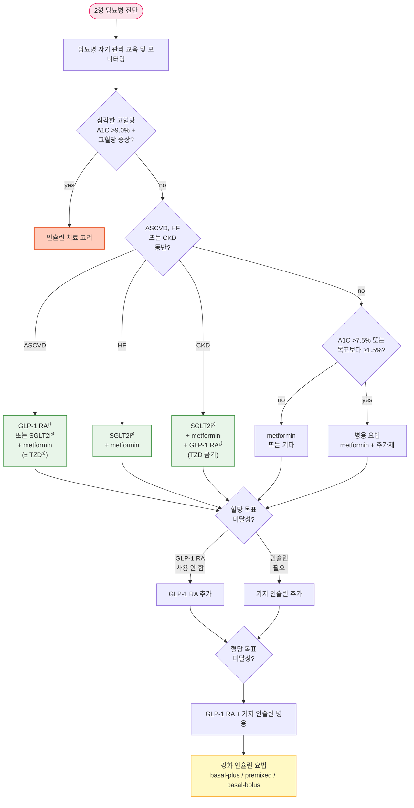

# 당뇨병, 약물 치료

## <mark style="color:green;">치료 방침</mark>

* 약물 선택에 있어서 '환자 개개인의 치료수용성과 환자의 특성'을 고려하여 결정; 약물 치료 시작 시 단독 또는 병용 요법 모두 가능 및 적극 고려
* 당화 혈색소(A1C)를 근거로 약물 치료를 시작하며 A1C를 목표값으로 조절함
  * 식전 포도당이 목표에 도달했음에도 불구하고 A1C 목표가 달성되지 않을 경우 식후 포도당을 목표로 할 수 있음
  * 환자 상태 및 검사 조건에 따라 A1C 결과 해석에 오류가 있을 수 있음에 유의
* 동반 질환(심부전, 죽상경화, 신부전), 혈당 강화 효과, 저혈당 위험도, 체중에 대한 영향, 부작용, 치료 수용성, 비용, 환자의 선호도 등을 고려하여 약제 선택
  * 인지 장애가 있는 경우 최대한 단순하며 저혈당 위험이 최소화되도록 약제 선택
* 일반적으로 3제 병용 요법으로 혈당 조절 목표에 도달하지 못하는 경우 주사제를 포함한 치료를 고려하지만, 주사제 기반의 치료가 어려운 경우에는 4제 병용 요법을 고려할 수 있음
* 의뢰 대상 : 약제 부작용 발생, 혈당 조절 불량, 집중 인슐린 요법 필요, 당뇨병 합병증 발생

### <mark style="color:orange;">당뇨병전단계 (Prediabetes)</mark>

* 생활 습관 중재, 체중 감량 등 예방 조치
* BMI ≥23 성인(30\~70세)에서 T2DM 예방을 위해 metformin 투여를 고려

### <mark style="color:orange;">1형 당뇨병 (T1DM)</mark>

* 대부분 다회 인슐린 주사나 인슐린 펌프를 이용한 치료가 필요함
* 다회 인슐린 주사 요법 시 초단기 작용 및 장기 작용 인슐린 유사체를 우선 사용함
* T1DM 성인에서 다회 인슐린 주사나 인슐린 펌프 치료 시 '연속 혈당 측정 장치를 연동한' 치료를 권고
* T1DM 성인에서 자동 인슐린 주입기 사용을 권고 \[일반적권고]
* 식사 및 신체 활동에 따른 식사 인슐린 용량을 스스로 조절할 수 있도록 체계화된 교육 시행
* 저혈당 무감지증이나 중증 저혈당을 경험한 환자에 대하여 저혈당 예방과 저혈당 인지 능력 회복을 위한 전문화되고 체계화된 교육을 시행
* 반복적인 야간 저혈당 또는 저혈당 무감지증이 있는 경우 연속 혈당 측정 장치와 사전에 저혈당을 예측하여 인슐린 주입이 중단되는 인슐린 펌프 치료를 고려

### <mark style="color:orange;">2형 당뇨병 (T2DM)</mark>

* 생활 습관 개선, 자기 관리 교육 및 지원, 건강의 사회적 결정 요인을 고려
* 동반 질환, 치료 목표 등을 고려하여 환자의 개별적 특성에 따른 약물 요법 시행
* 체중 관리: 항당뇨병제 선택 시 체중 관리 목표를 지원하는 방법을 고려
* 약물 치료 시 metformin을 우선 사용하고 금기나 부작용이 없는 한 유지
* 일부 개인에서는 조기 병용 요법을 고려
  * A1C ≥7.5% 또는 A1C가 목표값보다 ≥1.5% 높은 경우 치료 초기부터 병용 요법 고려
* 확인 or 고위험 ASCVD, 신질환, 심부전 환자는 심혈관 질환 유익성이 입증된 SGLT2i &/or GLP-1 RA 권고
* 심부전 또는 CKD 시 이에 대한 이익이 입증된 SGLT2i를 A1C와 무관하게 우선 선택
* ASCVD 동반 시 심혈관 이익이 입증된 SGLT2i 또는 GLP-1 RA를 포함한 치료를 우선 선택
* 강력한 혈당 강하 효과가 필요한 경우 주사제를 포함한 치료 선택
  * 주사제 기반의 병용 요법 고려 시 기저 인슐린보다 GLP-1 RA를 우선 고려
  * GLP-1 RA 또는 기저 인슐린 단독으로 목표 혈당에 도달하지 못할 경우 두 약제 병용
  * GLP-1 RA 또는 기저 인슐린 치료에도 목표 혈당에 도달하지 못할 경우 인슐린 강화 요법 고려
* 다음의 경우 인슐린 조기 도입 고려 : A1C ＞9% & 고혈당 증상(다음, 다뇨, 체중 감소), 혈당 ≥300 ㎎/㎗; 대사 이상, 급성 MI, 뇌졸중, 급성 질환, 수술, 만성 신질환, 비대상성 간질환 동반; 임신; 경구제로 목표 달성 실패 (✽유병 기간이 길어지면 T2DM 환자에서도 인슐린이 필요하게 됨. 15년 이상 유병 시 환자의 50% 가 해당됨)
* 매 3\~6개월마다 치료 효과 재평가; 생활 습관 점검, 약제 복용 순응도 평가
* 치료 목표 미달성 시 빠른 치료 강화; 증량, 교체, 병용, 인슐린 도입 등 고려
  * 식후 고혈당에 대하여 meglitinide, α-Gi, 속효성 GLP-1 RA, DPP-4i 추가 고려

***

### <mark style="color:orange;">2형 당뇨병 약물 치료 알고리듬</mark>

<strong>2형 당뇨병 약물 치료 알고리듬</strong>

<em><mark style="color:$info;">Ref. 대한당뇨병학회. 당뇨병 진료지침. 2023. 그림 11.1</mark></em>

1. Acute coronary syndrome, MI, stable or unstable angina, 관상동맥병, 뇌졸중, 말초동맥병 병력
2. Current or prior symptoms of heart failure (HF) with documented HF with reduced ejection fraction (HFrEF, LVEF ≤40) or HF with preserved ejection fraction (HFpEF, LVEF >40)
3. eGFR <60 or u-Alb/Cr ratio ≥30 mg/g
4. Dulaglutide, Liraglutide, Semaglutide
5. Dapagliflozin, Empagliflozin
6. Dapagliflozin, Empagliflozin, Ertugliflozin
7. Pioglitazone

***

### <mark style="color:orange;">주요 치료제의 특성 비교</mark>

<table><thead><tr><th width="130">약제</th><th width="100">A1C 강하(%)</th><th width="80">저혈당</th><th width="90">체중 변화</th><th width="90">GI 증상</th><th width="180">ASCVD / CHF 효과</th><th>DKD 진행 지연</th></tr></thead><tbody><tr><td>Metformin</td><td>1.0~2.0</td><td>-</td><td>-</td><td>중등증</td><td>+ / -</td><td>-</td></tr><tr><td>SGLT2i</td><td>0.5~1.0</td><td>-</td><td>↓</td><td>-</td><td>+(CG, EG) / +(CG, DG, EG, ETG)</td><td>+(CG, DG, EG)</td></tr><tr><td>DPP-4i</td><td>0.5~1.0</td><td>-</td><td>-</td><td>-</td><td>- / 위험(saxagliptin)</td><td>-</td></tr><tr><td>TZD</td><td>0.5~1.4</td><td>-</td><td>↑</td><td>-</td><td>+(pioglitazone) / 위험</td><td>-</td></tr><tr><td>α-Gi</td><td>0.5~1.0</td><td>-</td><td>-/↑</td><td>중등증</td><td>-</td><td>-</td></tr><tr><td>Meglitinide</td><td>0.5~1.5</td><td>+</td><td>↑</td><td>-</td><td>(자료 없음)</td><td>(자료 없음)</td></tr><tr><td>SU</td><td>1.0~2.0</td><td>+</td><td>↑</td><td>-</td><td>- / -</td><td>-</td></tr><tr><td>GLP-1 RA</td><td>0.8~1.5</td><td>-</td><td>↓</td><td>중등증</td><td>+(dula-, lira-, sema-glutide) / -</td><td>+(dula-, lira-, sema-glutide)</td></tr><tr><td>Insulin</td><td>매우 큼</td><td>+</td><td>↑</td><td>-</td><td>- / -</td><td>-</td></tr></tbody></table>


α-Gi=α-Glucosidase inhibitor; DKD=diabetic kidney disease; CG=cana-, DG=dapa-, EG=empa-, ETG=ertu-gliflozin \*A1C 강화 효과(%)\
Ref. ADA. Standards of Medical Care in Diabetes. 2023. Table 9-2; AACE/ACE T2D Management, Endocr Pract. 2018;24(1.); 대한당뇨병학회. 당뇨병 진료지침. 2023. Table 11.1


***

## <mark style="color:green;">경구제</mark>

### <mark style="color:orange;">Metformin (MTF)</mark>

* 작용 : 간 포도당 합성↓, 말초 인슐린 감수성↑, 공복 혈당↓, 지질 개선, 체중↓
  * ✽당뇨병 환자의 불안/우울증을 약간 개선 시킨다는 보고가 있음
* A1C 감소 효과 : 1\~2%
* 대사 : 신장
* 부작용 : 소화 장애(＞10%; 설사, 구역, 복통, 식욕 저하), Vit B12 결핍, 피부 발진, 젖산증
  * 장기 투여 시 (특히 빈혈, 말초신경병증 환자에서) 주기적인 Vit B12 측정을 고려
* 주의 : 신부전, 고령, 중증 감염, 탈수, 심/폐/간부전; 요오드 조영제 사용 시 주의 or 중지
  * eGFR 30\~45 시 주의 사용(≤1000 ㎎/d) 또는 새로 시작하지 않음; ＜30 시 투여 금지
  * 요오드 조영제 관련 : 정맥 투여 시 eGFR 30\~60에서, 동맥 투여 시 신기능 무관 당일부터 48시간까지 중단 및 신장 기능 평가 후 재개


※ Metformin을 1차 약물로 우선 사용하도록 한 기존 권고를 삭제함 (KDA 2023)


* 용법 : 식사와 함께 복용; 저용량으로 시작 → 2\~3주 간격 증량 (✽효과 발현이 늦음)

<table><thead><tr><th width="160">성분명</th><th width="220">상품명</th><th width="200">1일 용량 (mg)</th><th>작용시간 (hr)</th></tr></thead><tbody><tr><td>metformin</td><td><mark style="color:blue;">[글루엠, 글루코파지]</mark></td><td>500~2,550 ㎎ #2~3</td><td>6~12</td></tr><tr><td>metformin SR</td><td><mark style="color:blue;">[다이아벡스엑스알 서방]</mark></td><td>500~2,000 ㎎ #1~2</td><td>24</td></tr></tbody></table>

***

### <mark style="color:orange;">SGLT2i (Sodium–glucose cotransporter-2 Inhibitor)</mark>

* 작용 : 신장에서의 포도당 재흡수↓, 소변 당 배설↑; 혈압↓, 체중↓, 심부전/ASCVD 위험↓
* A1C 감소 효과 : 0.5\~1.0%; eGFR ＜45인 경우 혈당 강하 효과 감소
* 다음의 경우에 추천 : ASCVD가 있거나 복수의 ASCVD 위험 인자가 있음; 심부전이나 CKD가 있는 경우 A1C 수준과 무관하게 SGLT2i 우선 사용을 권고
* 대사 : 신장
* 부작용 : 요로 감염, 생식기 감염, 케톤산증(T2DM에서 드묾), LDL-C↑
* 주의 : 신장애, 중증 간장애, 유당 불내성(dapagliflozin, empagliflozin), 저혈압(ertugliflozin), 고령
  * 전신 상태가 불량한 환자에서 DKA 가능성을 고려; 수술 3\~4일 전, 위험한 질환 상태, 지속되는 공복 상태의 경우 SGLT2i 투여 중단; 투석 시 금기
  * ✽UTI로 인하여 약물을 중단해야 하는 경우는 드물며, 심각한 UTI 발생률은 DPP-4i와 비슷함
  * ✽DPP-4i보다 중증 신장 문제 위험이 적다는 보고가 있음
* 용법 : 식사와 관계없이 복용

<table><thead><tr><th width="230">성분명 [상품명]</th><th width="140">1일 용량 (mg)</th><th width="100">GFR 59~45</th><th width="100">GFR 44~30</th><th width="100">GFR 29~15</th><th>&#x3C;15</th></tr></thead><tbody><tr><td>canagliflozin¹⁾</td><td>100~300 qd</td><td>100 qd</td><td>금지</td><td>금지</td><td>금지</td></tr><tr><td>dapagliflozin¹⁾²⁾ <mark style="color:blue;">[포시가]</mark></td><td>5~10 qd</td><td>제한적 사용</td><td>제한적 사용</td><td>자료 없음</td><td>자료 없음</td></tr><tr><td>empagliflozin¹⁾²⁾ <mark style="color:blue;">[자디앙]</mark></td><td>25 qd</td><td>제한적 사용</td><td>제한적 사용</td><td>자료 없음</td><td>자료 없음</td></tr><tr><td>ertugliflozin²⁾ <mark style="color:blue;">[스테글라트로]</mark></td><td>5~15 qd</td><td>자료 없음</td><td>자료 없음</td><td>자료 없음</td><td>자료 없음</td></tr><tr><td>ipragliflozin <mark style="color:blue;">[슈글렛]</mark></td><td>50 qd</td><td>자료 없음</td><td>자료 없음</td><td>자료 없음</td><td>자료 없음</td></tr></tbody></table>


1. ASCVD, CKD에 적용 / 2) 심부전에 적용


***

### <mark style="color:orange;">DPP-4i (Dipeptidyl peptidase-4 inhibitor)</mark>

* 작용 : incretin 분해 억제(GLP-1↑, GIP↑); 포도당 의존 인슐린 분비↑, 글루카곤 분비↓, 식후 혈당 강하 (✽아시아인에게 더 효과적이라는 보고가 있음)
* A1C 감소 효과 : 0.5\~1.0%
* 대사 : 신장
* 부작용 : 설사, 복통, 비인두염, 상기도 감염, 췌장염, 관절통, 박리성 피부 질환, 중증 관절통(sitagliptin), 유사천포창(linagliptin, vildagliptin)
* 주의 : 신장애(용량 조절), 유당 불내성(saxagliptin, vildagliptin), 췌장염, 심부전
* 용법 : 식사와 관계없이 복용

<table><thead><tr><th width="207">성분명 [상품명]</th><th width="128">1일 용량 (mg)</th><th width="100">GFR 59~45</th><th width="100">GFR 44~30</th><th width="100">GFR 29~15</th><th>&#x3C;15</th></tr></thead><tbody><tr><td>alogliptin <mark style="color:blue;">[네시나]</mark></td><td>25 qd</td><td>12.5¹⁾</td><td>12.5¹⁾</td><td>6.5</td><td>6.5</td></tr><tr><td>anagliptin <mark style="color:blue;">[가드렛]</mark></td><td>100 bid</td><td>용량 조절 필요 없음</td><td>(좌동)</td><td>100</td><td>자료 없음</td></tr><tr><td>evogliptin <mark style="color:blue;">[슈가논]</mark></td><td>5 qd</td><td>용량 조절 필요 없음</td><td>(좌동)</td><td>(좌동)</td><td>(좌동)</td></tr><tr><td>gemigliptin <mark style="color:blue;">[제미글로]</mark></td><td>50 qd</td><td>용량 조절 필요 없음</td><td>(좌동)</td><td>(좌동)</td><td>(좌동)</td></tr><tr><td>linagliptin <mark style="color:blue;">[트라젠타]</mark></td><td>5 qd</td><td>용량 조절 필요 없음</td><td>(좌동)</td><td>(좌동)</td><td>(좌동)</td></tr><tr><td>saxagliptin <mark style="color:blue;">[온글라이자]</mark></td><td>2.5~5 qd</td><td>2.5~5²⁾</td><td>2.5</td><td>(좌동)</td><td>(좌동)</td></tr><tr><td>sitagliptin <mark style="color:blue;">[자누비아]</mark></td><td>25~100 qd</td><td>100</td><td>50</td><td>25</td><td>(좌동)</td></tr><tr><td>teneligliptin <mark style="color:blue;">[테넬리아]</mark></td><td>20 qd</td><td>용량 조절 필요 없음</td><td>(좌동)</td><td>(좌동)</td><td>(좌동)</td></tr><tr><td>vildagliptin <mark style="color:blue;">[가브스]</mark></td><td>50 bid</td><td>50~100¹⁾</td><td>50</td><td>(좌동)</td><td>(좌동)</td></tr></tbody></table>


1. eGFR ≥50에서 용량 조절 필요 없음 / 2) eGFR ≥45에서 용량 조절 필요 없음


***

### <mark style="color:orange;">Thiazolidinedione (TZD)</mark>

* 작용 : 말초 조직 인슐린 저항성 개선, 간 당 생성↓; 뇌졸중 예방, NASH에 유익
* A1C 감소 효과 : 0.5\~1.4%
* 대사 : 간
* 부작용 : 심부전, 체중↑, 부종, Hb↓, 골절, 방광암(pioglitazone), LDL-C↑(rosiglitazone)
* 주의 : 심부전, 간장애, 중증 신장애, 유당 불내성; pioglitazone - 활동성 방광암, 원인 불명 육안적 혈뇨; 신기능 저하 시 용량 조절은 필요하지 않으나, 체액 저류 가능성 때문에 권하지 않음
* pioglitazone은 뇌졸중, 심근경색의 위험을 낮출 것으로 보임. 단 이러한 이점은 체중 증가, 부종, 골절 위험 증가와 함께 고려해야 함. 낮은 용량은 부작용의 위험을 줄일 수 있음
* 용법 : 식사와 관계없이 복용

<table><thead><tr><th width="250">성분명 [상품명]</th><th width="160">1일 용량 (mg)</th><th>반감기 (hr)</th></tr></thead><tbody><tr><td>lobeglitazone <mark style="color:blue;">[듀비에]</mark></td><td>0.5 qd</td><td>9.5(남), 15(여)</td></tr><tr><td>pioglitazone <mark style="color:blue;">[액토스]</mark></td><td>15~45 qd</td><td>3~7</td></tr><tr><td>rosiglitazone</td><td>4~8 qd</td><td>3~4</td></tr></tbody></table>

***

### <mark style="color:orange;">α-Glucosidase inhibitor (α-Gi)</mark>

* 작용 : 상부 위장관에서의 다당류 소화 및 흡수 억제, 식후 혈당↓
* A1C 감소 효과 : 0.5\~1.0%
* 대사 : 장
* 부작용 : 위장관 가스, 복부 불편감, 설사, 급성 간염; 체중 증가 또는 저혈당 없음
* 주의 : 중증 신/간질환, 소화 흡수 장애 질환(예: IBD), 고령, 중증 감염; SU 병용 시 저혈당 증가; Resin 또는 제산제와의 병용 회피
* 용법 : 식사 직전 복용; 저용량으로 시작 → 4주 간격으로 조절

<table><thead><tr><th width="194">성분명 [상품명]</th><th width="126">1일 용량 (mg)</th><th width="100">GFR 59~45</th><th width="100">GFR 44~30</th><th width="100">GFR 29~15</th><th>&#x3C;15</th></tr></thead><tbody><tr><td>acarbose <mark style="color:blue;">[글루코바이]</mark></td><td>50~100 tid</td><td>용량 조절 필요 없음</td><td>(좌동)</td><td>&#x3C;25에서 금지</td><td>(좌동)</td></tr><tr><td>miglitol <mark style="color:blue;">[미그보스]</mark></td><td>50~100 tid</td><td>CrCl &#x3C;25, or s-Cr >2 시 금지</td><td>(좌동)</td><td>(좌동)</td><td>(좌동)</td></tr><tr><td>voglibose <mark style="color:blue;">[베이슨]</mark></td><td>0.2~0.3 tid</td><td>용량 조절 필요 없음</td><td>(좌동)</td><td>자료 없음</td><td>자료 없음</td></tr></tbody></table>

***

### <mark style="color:orange;">Meglitinide</mark>

* 작용 : 인슐린 분비↑, 식후 혈당↓; SU에 비해 작용 속도가 빠르고 반감기가 짧아 저혈당 부작용이 적음
* A1C 감소 효과 : 0.5\~1.5%
* 대사 : 간
* 부작용 : 체중 증가, 저혈당, 변비, 상기도 감염
* 주의 : 중증 감염, 중증 간/신 장애, 임신, 수유; repaglinide & gemfibrozil 병용 금기
  * eGFR ≥15에서 용량 조절 필요 없음; eGFR ＜15 시 주의(nateglinide는 금기)
* 용법 : 식사 직전 복용; 저용량으로 시작 → 1\~2주 간격 증량

<table><thead><tr><th width="250">성분명 [상품명]</th><th width="200">1일 용량 (mg)</th><th>작용시간</th></tr></thead><tbody><tr><td>mitiglinide <mark style="color:blue;">[글루파스트]</mark></td><td>10 tid</td><td>&#x3C;4 hr</td></tr><tr><td>nateglinide <mark style="color:blue;">[파스틱]</mark></td><td>60~120 tid</td><td>&#x3C;4 hr</td></tr><tr><td>repaglinide <mark style="color:blue;">[노보넘]</mark></td><td>0.5 tid~4 qid</td><td>&#x3C;4 hr</td></tr></tbody></table>

***

### <mark style="color:orange;">Sulfonylurea (SU)</mark>

* 작용 : 췌장 β-cell에서 인슐린 분비 자극, 식전/식후 혈당↓
* A1C 감소 효과 : 1\~2%
* 대사 : 간, 신장
* 부작용 : 체중↑, 저혈당, 구역, 간질환, 관절통, 요통, 기관지염; 모든 원인의 사망 위험 증가
* 주의 : 간질환(정상치의 3배 시 금지), 신질환(eGFR ＜45), sulfa allergy, 임신, 수유, 수술, 중증 감염, 중증 외상, 설사, 구토
* 용법 : 식사 직전 복용(1일 1회 복용 시 아침 식전); 저용량으로 시작 → 1\~2주 간격 증량

<table><thead><tr><th width="260">성분명 [상품명]</th><th width="200">1일 용량 (mg)</th><th>작용시간</th></tr></thead><tbody><tr><td>glibenclamide <mark style="color:blue;">[유글루콘]</mark></td><td>2.5~20 #1~2</td><td>12~24 hr</td></tr><tr><td>gliclazide <mark style="color:blue;">[다이아미크롱]</mark></td><td>40~320 #1~2</td><td>12~24 hr</td></tr><tr><td>gliclazide SR <mark style="color:blue;">[다이아미크롱서방]</mark></td><td>30~120 qd</td><td>24 hr</td></tr><tr><td>glimepiride* <mark style="color:blue;">[아마릴]</mark></td><td>1~8 qd</td><td>24 hr</td></tr><tr><td>glipizide* <mark style="color:blue;">[다이그린]</mark></td><td>5~40 #1~3</td><td>12~18 hr</td></tr></tbody></table>


\* 저혈당 위험 때문에 주의해서 시작


***

### <mark style="color:orange;">복합제</mark>

#### <mark style="color:$primary;">DPP-4i 복합제</mark>

* <mark style="color:blue;">\[자누메트]</mark> sitagliptin/MTF
* <mark style="color:blue;">\[가브스메트]</mark> vildagliptin/MTF
* <mark style="color:blue;">\[콤비글라이즈 서방]</mark> saxagliptin/MTF
* <mark style="color:blue;">\[트라젠타 듀오]</mark> linagliptin/MTF
* <mark style="color:blue;">\[네시나메트]</mark> alogliptin/MTF
* <mark style="color:blue;">\[가드메트]</mark> anagliptin/MTF
* <mark style="color:blue;">\[제미메트]</mark> gemigliptin/MTF
* <mark style="color:blue;">\[테넬리아 엠]</mark> teneligliptin/MTF
* <mark style="color:blue;">\[슈가메트]</mark> evogliptin/MTF

#### <mark style="color:$primary;">SGLT2i 복합제</mark>

* <mark style="color:blue;">\[직듀오]</mark> dapagliflozin/MTF
* <mark style="color:blue;">\[자디앙듀오]</mark> empagliflozin/MTF

#### <mark style="color:$primary;">Thiazolidinedione 복합제</mark>

* <mark style="color:blue;">\[네시나액트]</mark> pioglitazone/alogliptin
* <mark style="color:blue;">\[액토스메트]</mark> pioglitazone/MTF
* <mark style="color:blue;">\[듀비메트 서방정]</mark> lobeglitazone/MTF

#### <mark style="color:$primary;">Sulfonylurea 복합제</mark>

* <mark style="color:blue;">\[아마릴 엠]</mark> glimepiride/MTF
* <mark style="color:blue;">\[글루코반스]</mark> glibenclamide/MTF
* <mark style="color:blue;">\[글루파 콤비]</mark> gliclazide/MTF

#### <mark style="color:$primary;">α-Glucosidase inhibitor 복합제</mark>

* <mark style="color:blue;">\[보그메트]</mark> voglibose/MTF

#### <mark style="color:$primary;">3제 복합제</mark>

* <mark style="color:blue;">\[듀비메트 에스서방]</mark> lobeglitazone/sitagliptin/MTF

***

## <mark style="color:green;">GLP-1 RA (Glucagon-like peptide-1 receptor agonist)</mark>

* 작용 : 포도당 의존 인슐린 분비↑, 글루카곤 분비↓ → 위 배출 지연, 근육/지방 조직의 당 흡수↑, 간 당 생성↓; ASCVD 위험↓, 뇌졸중 예방, 체중↓
  * 체중 감소 효과 : semaglutide ＞ liraglutide ＞ dulaglutide ＞ exenatide ＞ lixisenatide
* A1C 감소 효과 : 0.8\~1.5%
* 대사 : 간
* 부작용 : 위장 장애(구역, 구토, 설사), 췌장염, 갑상선암; 장기 사용 안전성 미확보
* 주의 : 췌장염, 급성 신장 손상, 중증 간장애, 신장애, 중증 위마비를 포함한 중증 위장관 질환, 당뇨병성 망막증, 급성 담낭 질환; DPP-4i와는 병용하지 않음
* 금기 : 갑상선 수질암 또는 MEN2의 과거력 또는 가족력
* ASCVD 확인 또는 위험 인자가 있는 경우 심혈관 질환 예방 효과가 입증된 GLP-1 RA 추천
* 다른 경구제로 충분히 조절되지 않는 경우 인슐린보다 GLP-1 RA를 선호
* 단독 투여, 다른 경구제 병용(DPP-4i 제외), 또는 기저 인슐린과 병용 가능

#### <mark style="color:$primary;">경구제</mark>

* semaglutide <mark style="color:blue;">\[리벨서스]</mark> : 3 ㎎ qd ×30일 → 7 ㎎ qd

#### <mark style="color:$primary;">피하주사제</mark>

<table><thead><tr><th width="260">성분명 [상품명]</th><th width="230">용량 (최대)</th><th>GFR에 따른 용량 조절</th></tr></thead><tbody><tr><td>albiglutide <mark style="color:blue;">[이페르잔 주]</mark></td><td>30 ㎎ qwk → 30~50 ㎎ qwk</td><td>&#x3C;15 시 주의(사용 경험이 적음)</td></tr><tr><td>dulaglutide¹⁾²⁾ <mark style="color:blue;">[트루리시티 주]</mark></td><td>0.75 ㎎ qwk (1.5 ㎎/wk)</td><td>용량 조절 필요 없음</td></tr><tr><td>exenatide <mark style="color:blue;">[바이에타 주]</mark></td><td>5 ㎍ bid 식전 60분 내 (10 ㎍ bid)</td><td>CrCl 30~50 시 주의; &#x3C;30 시 금지</td></tr><tr><td>liraglutide¹⁾³⁾ <mark style="color:blue;">[빅토자 주]</mark></td><td>0.6 ㎎ qd (1.8 ㎎ qd)</td><td>≥15에서 용량 조절 필요 없음</td></tr><tr><td>lixisenatide³⁾ <mark style="color:blue;">[릭수미아 주]</mark></td><td>10 ㎍ qd 식전 1시간 내 (20 ㎍ qd)</td><td>≥30에서 용량 조절 필요 없음</td></tr><tr><td>semaglutide¹⁾ <mark style="color:blue;">[오젬픽 펜]</mark></td><td>0.25~1 ㎎ qwk</td><td>필요 없음</td></tr></tbody></table>


1. 심혈관 질환 예방 효과가 입증된 약제 / 2) 보험 적용(2023.6 현재) / 3) 복합제로 보험 적용 제품 있음


#### <mark style="color:$primary;">GLP-1/GIP dual agonist</mark>

* GLP-1 및 GIP(glucose-dependent insulinotropic polypeptide) receptor에 모두 작용
* 작용 : 인슐린 생산↑, 간 당 생성↓, 음식물 위장관 통과 지연(포만감 유지); T2DM에서 혈당 강하, 체중 감소
* metformin, SGLT2i, SU 병용 가능
* tirzepatide <mark style="color:blue;">\[마운자로]</mark> : \~15 ㎎ qwk SQ

#### <mark style="color:$primary;">인슐린/GLP-1 RA 복합제</mark>

* glargine/lixisenatide : 1일 1회 식사 전 1시간 이내 피하주사 <mark style="color:blue;">\[솔리쿠아펜]</mark>
* degludec/liraglutide : 1일 1회 피하주사 <mark style="color:blue;">\[줄토피 플렉스터치 주]</mark>

***

## <mark style="color:green;">인슐린</mark>

### <mark style="color:orange;">인슐린 요법의 선택</mark>

* 인슐린 & metformin 병용 요법 : 인슐린 단독 투여보다 혈당 조절이 향상되고 인슐린 필요량 및 저혈당 위험이 감소하며 체중 증가가 적음
* 인슐린 & acarbose 병용 요법 : A1C, 식후 혈당, 식후 중성지방 조절에서 유익
* A1C ＜8.5% 시 : 기저 인슐린 & 경구 혈당 강하제 병용
* A1C ≥8.5% 시 : 1일 2\~3회 혼합형 인슐린, 식전 인슐린 또는 다회 인슐린 요법
* 적극적 인슐린 요법 : 다회 주사, 인슐린 펌프; 저혈당 위험이 높음
  * 식사/취침/운동/위험한 작업(예: 운전) 등을 하기 전에 자가 혈당을 측정하여 필요시 조치
  * 인슐린 펌프는 기기를 안전하게 관리할 수 있는 환자에서 고려
* 식사 또는 운동에 따른 인슐린 용량 조절이 필요하며 특히 식후 당 조절이 필요한 경우에는 식사 시간을 고려하여 주사
* rapid-acting insulin analog : 저혈당 위험을 줄이는데 유효
* 속효성 흡입 인슐린 : 식사 전에 투여; A1C 0.21% 강하 효과
* 다음의 경우 overbasalization 가능성을 고려 : ＞0.5 U/㎏/d의 기저 용량, 저혈당, 높은 변동성, 취침 vs 아침 or 식전 vs 식후 혈당의 큰 차이


※ '과이화 작용 증상(체중 감소, 다음, 다뇨)이 동반된 고혈당의 경우 인슐린 치료를 시행 \[전문가의견, 일반적권고]; A1C 9%를 기준으로 인슐린 치료 유무를 결정하는 것은 근거가 빈약하고 현실에 맞지 않음. 과이화 작용이 있을 때는 A1C 9% 이하에서도 인슐린을 사용해야 하고, A1C 9% 이상이더라도 인슐린 치료가 반드시 필요한 것은 아닐 수 있음


### <mark style="color:orange;">인슐린 요법의 비교</mark>

<table><thead><tr><th width="100">구분</th><th width="200">기저 인슐린 요법</th><th width="220">혼합형 인슐린유사체 투여법</th><th>식전 인슐린 요법</th></tr></thead><tbody><tr><td>장점</td><td>저혈당 발생 및 체중 증가가 적음</td><td>A1C가 높은 경우 효과적</td><td>식후 고혈당 및 A1C 조절에 효과; 유연성 높음</td></tr><tr><td>단점</td><td>A1C가 높은 경우(>8.5%)에는 목표 달성이 어려움</td><td>저혈당 발생 빈도가 높음; 체중 증가가 많음; 많은 용량이 요구됨</td><td>자주 주사해야 함; 자주 혈당 측정을 해야 함; 저혈당 발생 빈도가 높음</td></tr><tr><td>기타</td><td>식후 혈당 조절을 위해 경구 혈당 강하제 병용 고려</td><td>치료 만족도 및 삶의 질에 대하여 논란</td><td>삶의 질에 대하여 논란</td></tr></tbody></table>


Ref. 대한의학회. 일차의료용 당뇨병 권고활용 매뉴얼. 2016.


### <mark style="color:orange;">인슐린 종류</mark>

<table><thead><tr><th width="300">성분명 [상품명] (임신 카테고리 호주/미국)</th><th width="160">시작/최대/지속 (hr)</th><th width="120">투여일정</th><th>장점; 단점</th></tr></thead><tbody><tr><td><strong>Rapid-Acting (초단기 작용 인슐린)</strong></td><td></td><td></td><td></td></tr><tr><td>aspart <mark style="color:blue;">[노보라피드]</mark> (A/B), lispro <mark style="color:blue;">[휴마로그]</mark> (A/B), glulisine <mark style="color:blue;">[에피드라]</mark> (B3/C)</td><td>10~15분/1~2/4</td><td>식사 시, 식사 전후</td><td>식후 혈당 조절; 고가</td></tr><tr><td><strong>Short-Acting (단기 작용 인슐린)</strong></td><td></td><td></td><td></td></tr><tr><td>regular <mark style="color:blue;">[휴물린알]</mark> (Not assigned)</td><td>30분/2~3/6.5</td><td>식사 시</td><td>저렴; 야간 저혈당</td></tr><tr><td><strong>Intermediate (중기 작용 인슐린)</strong></td><td></td><td></td><td></td></tr><tr><td>NPH <mark style="color:blue;">[휴물린엔]</mark> (Not assigned/B)</td><td>1~3/5~8/18</td><td>밤 또는 q12h</td><td>저렴; 야간 저혈당</td></tr><tr><td><strong>Long-Acting (장기 작용 인슐린)</strong></td><td></td><td></td><td></td></tr><tr><td>degludec <mark style="color:blue;">[트레시바]</mark> (B3/Not assigned)</td><td>1/No/42~</td><td>제한 없음</td><td>야간 저혈당 적음; 고가</td></tr><tr><td>glargine <mark style="color:blue;">[란투스]</mark> (B3/Not assigned)</td><td>1.5/No/24</td><td>(상동)</td><td>(상동)</td></tr><tr><td>detemir <mark style="color:blue;">[레버미어]</mark> (B3/B)</td><td>3~4/6~8/24</td><td>(상동)</td><td>(상동)</td></tr><tr><td>Insulin Gla-300 <mark style="color:blue;">[투제오]</mark> (Not assigned/B3)</td><td>6/No/24~36</td><td>(상동)</td><td>(상동)</td></tr><tr><td><strong>Premixed</strong></td><td></td><td></td><td></td></tr><tr><td>insulin lispro protamine 75/lispro25 <mark style="color:blue;">[휴마로그믹스25]</mark></td><td>15분/이중/16</td><td>아침 &#x26; 저녁 식사 시</td><td>편리; 야간 저혈당</td></tr><tr><td>insulin aspart protamine70/aspart30 <mark style="color:blue;">[노보믹스30]</mark></td><td>15분/이중/16</td><td>(상동)</td><td>(상동)</td></tr><tr><td>NPH70/regular30 <mark style="color:blue;">[휴물린70/30]</mark></td><td>30분/이중/16</td><td>(상동)</td><td>(상동)</td></tr></tbody></table>


* inhaled insulin \[Afrezza] : 작용 시간 4.5 hr (✽시판 중지)
* degludec 또는 glargine U100은 CVD 안전성이 입증되어 있음
* 저혈당 위험 : degludec/glargine U300 ＜ glargine U100/detemir ＜ NPH insulin

Ref. 대한당뇨병학회. 당뇨병 진료지침. 2023. Table 11.2


### <mark style="color:orange;">T1DM에서의 인슐린 공급 장치 비교</mark>

<table><thead><tr><th width="320">인슐린 주사 regimen</th><th width="100">유연성</th><th width="130">낮은 저혈당 위험</th><th>고비용</th></tr></thead><tbody><tr><td>MDI with LAA + RAA or URAA</td><td>+++</td><td>+++</td><td>+++</td></tr><tr><td>MDI with NPH + RAA or URAA</td><td>++</td><td>++</td><td>++</td></tr><tr><td>MDI with NPH + 속효성(regular) insulin</td><td>++</td><td>+</td><td>+</td></tr><tr><td>NPH + 속효성(regular) insulin or premix bid Inj.</td><td>+</td><td>+</td><td>+</td></tr></tbody></table>

<table><thead><tr><th width="320">연속 인슐린 펌프 regimen</th><th width="100">유연성</th><th width="130">낮은 저혈당 위험</th><th>고비용</th></tr></thead><tbody><tr><td>automated insulin delivery system</td><td>+++++</td><td>+++++</td><td>++++++</td></tr><tr><td>insulin pump with threshold/predictive low-glucose suspend</td><td>++++</td><td>++++</td><td>++++</td></tr><tr><td>insulin pump therapy without automation</td><td>+++</td><td>+++</td><td>++++</td></tr></tbody></table>


LAA=long-acting insulin analog; MDI=multiple daily injections; RAA=rapid-acting insulin analog; URAA=ultra-rapid-acting insulin analog\
Ref. ADA. Standards of Medical Care in Diabetes. 2024. Fig 9-1.


### <mark style="color:orange;">인슐린 단독 치료 시작 용량</mark>

* 보통 20 U/d
* 50%는 기저, 나머지 50%는 식사 전(0\~15분) 분할 투여

<table><thead><tr><th>대상</th><th width="200">1일 총 인슐린 용량</th></tr></thead><tbody><tr><td>저체중, 고령, 혈액 투석</td><td>0.3 U/kg</td></tr><tr><td>정상 체중</td><td>0.4 U/kg</td></tr><tr><td>과체중</td><td>0.5 U/kg</td></tr><tr><td>인슐린 분비 거의 없음, 인슐린 저항, steroid 투여 중</td><td>0.6~1.0 U/kg</td></tr></tbody></table>

### <mark style="color:orange;">T2DM에서의 경구제-인슐린 병용 요법 시의 인슐린 용량</mark>

* 기저 인슐린으로서 장기 작용 인슐린 0.15(0.1\~0.3) U/㎏/d로 시작. 예: glargine 10 U/d
* 취침 시 투여로 시작, 매일 같은 시간 투여
* 보통 인슐린 저항성이 있으므로 증량이 필요함
* 식전 혈당 목표 도달 & 식후 고혈당인 경우 4U 또는 basal dose의 10%를 단기 작용 인슐린으로 식사 직전에 투여
* 혼합 인슐린
  * 시작 용량 : 인슐린 초치료인 경우 10\~12 U/d 또는 0.3 U/㎏/d; 기저 인슐린 용량의 2/3를 오전 & 1/3을 오후 또는 1/2을 오전 & 1/2을 오후에 분할 투여
  * 용량 조절 : 주 1\~2회 1\~2 U 또는 10\~15% 증량

### <mark style="color:orange;">인슐린 용량 조절 방법</mark>

<table><thead><tr><th>최근 3일간 공복 혈당 (㎎/㎗)</th><th width="100">&#x3C;80</th><th width="100">80~109</th><th width="100">110~139</th><th width="100">140~179</th><th width="100">≥180</th></tr></thead><tbody><tr><td>용량 조절</td><td>-2 U</td><td>유지</td><td>+2 U</td><td>+4 U</td><td>+6 U</td></tr></tbody></table>

### <mark style="color:orange;">주사법</mark>

* 방법 : 피하주사; 주입 후 10\~15초 동안 주사 바늘 삽입 상태 유지. 주사 부위를 문지르지 않음
* 주사 부위 : 팔 상부 외측, 대퇴부 외측, 복부, 둔부
* 순환 주사 : 지방 위축, 반흔, 지방 비대 등 부작용 예방을 위해 가능한 한 장소를 바꿔가면서 주사; 흡수율이 같은 부위를 다 주사한 후에 다른 부위로 이동하며 같은 장소에는 한 달 이상 경과 후 다시 주사
  * 인슐린 흡수율 : 복부 ＞ 상완부(팔) ＞ 대퇴부(허벅지)

✽참고사이트 : [대한당뇨병학회-당뇨병교실-치료 및 관리-약물 요법](http://www.diabetes.or.kr/general/class/medical.php?mode=view\&number=324\&idx=1)

### <mark style="color:orange;">강화 인슐린 요법</mark>

* 경구 혈당 강하제 및 기저 인슐린 요법 병용으로 목표 혈당에 도달하지 못하면 → 식전 속효성 인슐린 추가 또는 1일 2회 이상의 인슐린 투여법으로 전환
* 2회 이상의 혼합형 인슐린 투여로 목표 혈당에 도달하지 못하면 → 다회 인슐린 요법(기저+식전 속효성) 또는 인슐린 펌프 치료로 전환하는 것을 고려
* 심한 저혈당 위험이 없이 혈당 조절을 향상시키기 위하여 sensor-augmented pump therapy 또는 automated insulin delivery system을 고려
* 강화 인슐린 요법과 real-time continuous glucose monitor가 목표 달성에 실패한 T1DM 환자에서 유용함
* 빈번한 혈당 검사가 필요한 환자에서 intermittently scanned continuous glucose monitor를 고려

***

### <mark style="color:red;">질병코드</mark>

E10 1형 당뇨병

E10.9 합병증을 동반하지 않은 1형 당뇨병

E11 2형 당뇨병

E11.9 합병증을 동반하지 않은 2형 당뇨병

E14.9 합병증을 동반하지 않은 상세불명의 당뇨병

R73.9 상세불명의 고혈당증
