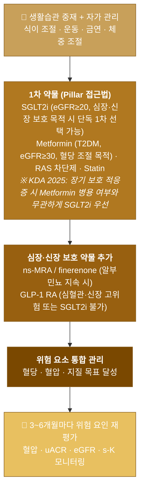
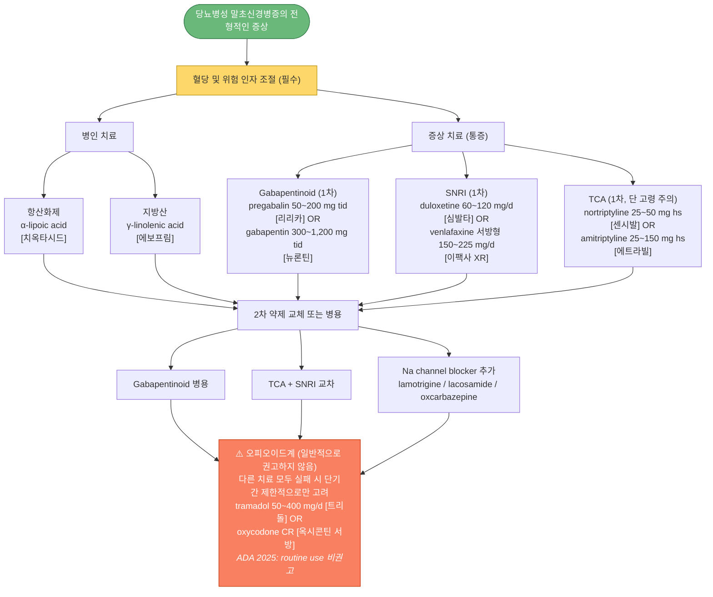

# 당뇨병 합병증 Complications of Diabetes

## <mark style="color:green;">일반 사항</mark>

### <mark style="color:orange;">합병증의 분류</mark>

<table><thead><tr><th width="160">구분</th><th>종류</th></tr></thead><tbody>
<tr><td><strong>미세혈관 합병증</strong></td><td>망막병증, 신경병증, 콩팥병증</td></tr>
<tr><td><strong>대혈관 합병증</strong></td><td>관상동맥병, 뇌혈관 질환, 말초혈관 질환</td></tr>
<tr><td><strong>비혈관계 합병증</strong></td><td>위마비, 설사, 배뇨/성 기능 장애, 피부 질환, 감염, 백내장, 녹내장, 치주 질환, 청력 장애</td></tr>
<tr><td><strong>당뇨 관련 동반 질환</strong></td><td>수면무호흡증, 대사이상지방간질환(MASLD/MASH), testosterone↓, 골절, 인지 장애, 우울, 악성 종양</td></tr>
</tbody></table>

### <mark style="color:orange;">합병증 선별검사 요약</mark>

<table><thead><tr><th width="200">합병증</th><th width="200">T1DM 시작 시기</th><th width="200">T2DM 시작 시기</th><th>추적 주기</th></tr></thead><tbody>
<tr><td>망막병증</td><td>진단 후 5년 이내</td><td>진단 즉시</td><td>1~2년 (이상 소견 시 매년 이상)</td></tr>
<tr><td>DKD (uACR + eGFR)</td><td>진단 후 5년 이내</td><td>진단 즉시</td><td>매년 (중등도 이상 시 연 2회)</td></tr>
<tr><td>신경병증</td><td>진단 후 5년 이내</td><td>진단 즉시</td><td>매년</td></tr>
<tr><td>발 검사</td><td>진단 후 5년 이내</td><td>진단 즉시</td><td>매년 (고위험 시 1~6개월)</td></tr>
<tr><td>PAD (ABI)</td><td>증상 발현 시; 또는 고위험군† 무증상 선별 고려</td><td>증상 발현 시; 또는 고위험군† 무증상 선별 고려</td><td>증상 변화 시; 고위험군은 정기 추적</td></tr>
<tr><td>심혈관자율신경병증</td><td>진단 후 5년 이내</td><td>진단 즉시</td><td>매년</td></tr>
</tbody></table>


T2DM은 진단 시 이미 수년간의 고혈당 노출이 있을 수 있어 진단 즉시 전반적인 합병증 선별검사를 시작함. T1DM은 발병 연령이 낮아 소아 및 청소년기에는 성인에 비해 일부 검사 시작 시기를 조정할 수 있음 [KDA 2025].

† **PAD 무증상 고위험군 (ABI 선별검사 적극 고려, ADA 2025)**: ① 65세 이상 모든 당뇨병 환자 ② 65세 미만이더라도 미세혈관 합병증·당뇨발 합병증·당뇨 관련 말기 장기 손상 동반 ③ 당뇨 유병기간 ≥10년


### <mark style="color:orange;">합병증 발생 시기</mark>

* 고혈당 유병 기간이 길수록 합병증 위험 증가; 통상 20년까지 증상이 명확하지 않을 수 있음
* 일반적으로 당뇨병 발병 10년 후 미세알부민뇨, 15년 후 단백뇨 및 신 기능 저하 발생
* **대혈관 합병증**은 T2DM 진단 시 이미 존재하는 경우도 많음

***

## <mark style="color:green;">말초혈관 질환 Peripheral Artery Disease (PAD)</mark>

### <mark style="color:orange;">임상 양상</mark>

* 간헐적 파행, 사지 허혈
* dependent 부위의 적색 피부 변화, 하지 거상 시 창백한 피부, 털 소실, 발톱 퇴행 위축
* 맥박 약화, 피부 감각 저하

### <mark style="color:$danger;">🚩 Red Flags!</mark>

<mark style="color:$danger;">**즉각 조치 또는 응급 의뢰**</mark>

* 급성 사지 허혈 (acute limb ischemia): 갑자기 발생한 6P — pain, pallor, pulselessness, paresthesia, paralysis, poikilothermia
* 괴저(gangrene) 또는 급속히 진행하는 발 감염

<mark style="color:$warning;">**당일 또는 조기 의뢰**</mark>

* 안정 시 통증(rest pain), 비치유성 궤양
* ABI <0.4 또는 측정 불가(중증 석회화)
* 발목 수축기압 <50 mmHg 또는 족지 수축기압 <30 mmHg

<mark style="color:$info;">**외래 추적 / 추가 평가 계획**</mark>

* 간헐적 파행으로 일상생활 제한 시 혈관외과 협진
* ABI 0.4~0.9: 생활습관 교정 후 호전 없으면 혈관 영상 검사

### <mark style="color:orange;">진단</mark>

* **ABI(ankle-brachial index)** 시행: 정상 1.0~1.4, 경계 0.91~0.99, 비정상 ≤0.9, 중증 <0.4


ABI >1.4는 혈관 석회화에 의한 위음성 가능 → 족지-상완지수(TBI) 또는 맥파 측정 추가 권장


### <mark style="color:orange;">치료</mark>

* **항혈소판제** \[ADA 2025]:
  * 증상성 PAD 또는 ASCVD 동반 시 → aspirin 100 mg qd <mark style="color:blue;">[아스피린 프로텍트]</mark> 또는 clopidogrel 75 mg qd <mark style="color:blue;">[플라빅스]</mark>
  * CVD 병력 있는 aspirin 알레르기 → clopidogrel 75 mg qd
  * 무증상 ABI 감소만 존재하는 경우 → 항혈소판제 일률 권고하지 않음; 개별화
* **혈당·혈압·지질 통합 관리** (☞ 당뇨병콩팥병증 치료 방침 참조)
* **SGLT2i · GLP-1 RA**: MACE 및 MALE(major adverse limb events) 감소 효과 입증 [ADA 2025]
* 생활습관: 금연(필수), DASH 식이
* **감독하 운동치료(supervised exercise therapy)**: 주 3회 이상, 12주 이상, 보행 훈련 중심 — 증상성 PAD에서 Class I 권고 \[AHA/ACC]; 혈관 수술에 준하는 기능 개선 효과

***

## <mark style="color:green;">당뇨병콩팥병증 Diabetic Kidney Disease (DKD)</mark>

* 당뇨병에 의한 만성콩팥병(CKD); 당뇨병 환자에서 가장 흔한 CKD 원인이자 말기신부전(ESRD)의 주된 원인
* **진단 기준**: 미세알부민뇨(uACR ≥30 mg/g) 또는 eGFR <60, 3개월 이상 지속 + 다른 당뇨 합병증 동반 시 (☞ 만성콩팥병 챕터)


**비알부민뇨성 DKD (Non-albuminuric DKD)**: 당뇨병 환자의 일부(T2DM에서 약 30~40%)는 알부민뇨 없이 eGFR 감소만으로 DKD가 발현함. 특히 고령·SGLT2i·ACEI/ARB 사용 환자에서 흔하며, 알부민뇨 정상이더라도 eGFR을 별도로 추적해야 함. 신장 예후는 알부민뇨 동반형보다 양호하나 심혈관 위험은 유사함 [KDA 2025].


* **유병률**: 당뇨병 발병 10년 이상 환자의 약 40%
* **위험 인자**: 조기 발병 T2DM, 남성, 고령, 가족력, 불량한 혈당·혈압 조절, 고지혈증, 비만, 흡연
* 급성 신장 손상(AKI) 위험 증가 → NSAID, 조영제 등 주의

### <mark style="color:orange;">콩팥 생검이 고려되는 상황</mark>

당뇨병 환자에서 아래 소견이 있으면 DKD 외 원인을 감별하기 위해 생검 고려:

① 단백뇨 급격 증가, ② 신증후군, ③ 빠른 eGFR 감소, ④ 혈뇨 또는 활성 요침전물, ⑤ 짧은 당뇨병 유병 기간, ⑥ 당뇨망막병증 부재

## <mark style="color:green;">진단</mark>

#### <mark style="color:$primary;">선별 검사 항목 및 시기</mark>

<table><thead><tr><th width="200">항목</th><th width="220">T1DM</th><th>T2DM</th></tr></thead><tbody>
<tr><td>uACR (u-Alb/Cr ratio)</td><td>진단 후 5년째부터 매년</td><td>진단 즉시, 이후 매년</td></tr>
<tr><td>eGFR (s-Cr 기반)</td><td>동일</td><td>동일</td></tr>
<tr><td>혈압</td><td colspan="2">매 방문마다</td></tr>
<tr><td>지질(TC/LDL/HDL/TG)</td><td colspan="2">매년</td></tr>
</tbody></table>

#### <mark style="color:$primary;">단백뇨 해석 및 추적</mark>

* **임의뇨** 우선(아침 첫 소변 권장); uACR >500 mg/g이면 Prot/Cr ratio 병용 가능
* 3~6개월 간격 3회 검사에서 ≥2회 양성 → '미세알부민뇨' 확진
* uACR ≥300 mg/g &/or eGFR 30~60 → 연 2회 검사

### <mark style="color:orange;">다른 원인 콩팥병 의심 상황</mark>

* 당뇨망막병증 없는 콩팥병증, 빠른 eGFR 감소, 급격한 단백뇨 증가, 혈뇨/활성 요침전물
* 치료 저항성 고혈압, 당뇨 외 전신 질환 징후
* ACEI/ARB 투여 2~3개월 내 eGFR ≥30% 감소

## <mark style="color:green;">치료</mark>

### <mark style="color:orange;">치료 방침 — 4-pillar 접근법 (KDA 2025 · KDIGO 2024 · ADA 2025)</mark>


**KDA 2025 핵심 권고** — 당뇨병콩팥병증 치료의 우선 약물:
1. **알부민뇨가 있거나 eGFR이 감소한 경우** → 신장 이익이 입증된 SGLT2i를 우선 사용하고 금기·부작용 없는 한 유지 \[무작위대조군연구, 일반적권고]
2. **SGLT2i는 신대체 요법을 시작하기 전까지 유지** 가능 \[무작위대조군연구, 일반적권고]
3. **알부민뇨(+), eGFR 감소, 정상 혈청 칼륨**인 T2DM 환자 → **비스테로이드 미네랄코티코이드수용체길항제(finerenone)** 고려 \[무작위대조군연구, 일반적권고]
4. **심혈관 위험이 높은 T2DM 환자** → 알부민뇨 진행 억제를 위해 GLP-1 RA 고려 \[무작위대조군연구, 제한적권고]

KDIGO 2024는 4가지 핵심 약물(SGLT2i, RAS 차단제, statin, finerenone)의 동시·조기 시작을 권장하는 **pillar 접근법**을 제안.


<table><thead><tr><th width="180">Pillar 약물</th><th width="150">조건</th><th>효과</th></tr></thead><tbody>
<tr><td>SGLT2i</td><td>eGFR ≥20</td><td>신장·심혈관 보호, eGFR 감소 억제</td></tr>
<tr><td>ACEI 또는 ARB</td><td>알부민뇨(+) 또는 고혈압</td><td>신장 보호, 혈압 조절</td></tr>
<tr><td>Statin (±ezetimibe)</td><td>모든 CKD 환자</td><td>심혈관 위험 감소</td></tr>
<tr><td>Finerenone (ns-MRA)</td><td>RAS 차단제 사용 중, 알부민뇨 지속, 정상 s-K</td><td>심혈관·신장 복합 위험 감소</td></tr>
</tbody></table>

* **GLP-1 RA 추가**: T2DM 환자에서 심혈관·신장 위험이 높은 경우 또는 SGLT2i 사용 불가 시 \[무작위대조군연구, 제한적권고]
  * **FLOW trial (2024)**: semaglutide 1 mg 주 1회 → T2DM + CKD 환자에서 신장 진행, 신부전, 심혈관 사망 위험 유의하게 감소 → **FDA 2025년 CKD 적응증 승인**
* **Aspirin**: ASCVD 고위험 1차 예방; 확인된 심혈관 질환 2차 예방
* **finerenone** <mark style="color:blue;">[케렌디아]</mark>: 치료 시작 1개월 및 4개월마다 s-K 모니터링; s-K ≥5.5 mEq/L 시 감량 또는 중단


⚠️ ACEI와 ARB 병용(dual RAS blockade)은 고칼륨혈증·AKI 위험으로 **권고되지 않음**


***



<p align="center"><strong>CKD 환자의 신장-심장 위험인자 관리 피라미드 (KDIGO 2024)</strong></p>

<p align="center"><em><mark style="color:$info;">Ref. KDIGO 2024 Clinical Practice Guideline for the Evaluation and Management of CKD; KDA 당뇨병 진료지침 제9판. 2025; ADA Standards of Care 2025</mark></em></p>

***

### <mark style="color:orange;">혈당 관리 (CKD 동반)</mark>

* **목표**: A1C **<6.5%** (T2DM 일반 목표, KDA 2025); 저혈당 고위험 또는 기대 여명 짧은 경우 개별화(최대 <8.0%까지)
* eGFR ≥30 → metformin 유지(금기 없으면)
* eGFR ≥20 → SGLT2i 처방; 첫 투여 후 eGFR 일시적 감소 ≤30%이면 지속; **신대체 요법 시작 전까지 유지 가능** \[무작위대조군연구, 일반적권고]
* 위 약제로 목표 미달 또는 사용 불가 → **GLP-1 RA** 우선 고려 \[제한적권고]
* CKD stage 3 이상 → 저혈당 위험 증가; 인슐린 용량 신중 조절
* 투석 환자 → 저혈당 위험 낮은 약제 우선; 인슐린 용량 조절
* CGM 사용 시: TIR(70\~180 ㎎/㎗) >70%, TBR(<70 ㎎/㎗) <4% 목표 (KDA 2025)

### <mark style="color:orange;">고혈압 관리 (CKD 동반)</mark>

* **목표**: **130/80 mmHg 미만** \[KDA 2025 단일 목표; ESPRIT·BPROAD 연구 근거] (✽이전 단백뇨 유무에 따른 이중 기준에서 단일 목표로 통일)
  * 고령·노쇠 환자는 기립성 저혈압 위험 고려하여 개별화
  * \[ADA 2025] 심혈관·신장 고위험 시 수축기 혈압 **<120 mmHg** 권장 — KDA 2025보다 더 엄격한 기준으로, 뇌졸중·심근경색 위험이 매우 높은 환자에서 적용 고려
* **1차 약물**: ACEI 또는 ARB
  * 중등도 알부민뇨(uACR 30~299 mg/g) → 권고; 심한 알부민뇨(≥300 mg/g) &/or eGFR <60 → 강력 권고
  * **정상 혈압이라도 알부민뇨(uACR ≥30 mg/g)가 있으면 신장 보호 목적으로 ACEI/ARB 사용 고려** [KDA 2025]
  * 예외: 증상 있는 저혈압, 조절 안 되는 고칼륨혈증, Cr >30% 증가
* **추가**: 이뇨제, DHP-CCB, β-차단제(MI 동반 시)
* **모니터링**: ACEI/ARB, 이뇨제 투여 2~4주 후 s-K, Cr 확인; 체액 고갈 없으면 sCr 기저치의 30% 이내 상승은 중단하지 않음

### <mark style="color:orange;">식이 및 생활습관</mark>

* **단백질 섭취** \[KDA 2025]: 일반적 제한 불필요; 과다 섭취(>1.3 g/kg/d)와 엄격한 제한(< 0.6 g/kg/d) 모두 피함 \[무작위대조군연구, 일반적권고]; 투석 중에는 1.0~1.2 g/kg/d 유지
  * ✽ **국제 가이드라인 차이**: KDIGO 2024는 CKD 환자에서 0.8 g/kg/d 권고를 유지함 — KDA 2025가 엄격한 제한을 완화한 것이지, 고단백 식이를 권장하는 것은 아님
* 저염식: Na <2 g/d (소금 5 g)
* BMI <25 목표; 규칙적 운동, 금연 필수
* 영양제·한약·민간요법 복용 전 반드시 주치의 상의


**당뇨병콩팥병증 동반 빈혈 관리**

빈혈 발생 위험은 비당뇨 CKD 대비 2배이며, eGFR <60 mL/min/1.73m²부터 본격적으로 증가(주로 정구성 정색소성 빈혈). 에리스로포이에틴(EPO) 생성 감소가 주된 기전.

* 피로·운동능력 저하·삶의 질 저하 지속 시 정기 전혈구검사(CBC) 및 철분 상태(Ferritin, TSAT) 확인
* 철분 결핍 동반 시 철분 보충 우선
* 필요 시 적혈구생성자극제(ESA) 처방 또는 신장내과 협진 계획


***

## <mark style="color:green;">당뇨망막병증 Diabetic Retinopathy (DR)</mark>

* 당뇨와 관련된 비염증성 망막 미세혈관 이상; **성인 실명의 가장 흔한 원인**
* **기전**: 지속 고혈당 → 망막 모세혈관 기저막 비후 → 혈관 주위 세포 손실 → blood-retina barrier 손상 → 모세혈관 폐쇄·허혈·혈청 누출 → VEGF·cytokine 증가 → 혈관 증식/신생
* **분류**: 비증식성(NPDR) → 전증식성(preproliferative) → 증식성(PDR)
* **유병률**: 유병 6~10년 환자의 20.9%, >15년 환자의 66.7%; T2DM 진단 시 이미 ~20%에서 발생
* **위험 인자**: 유병 기간, 불량한 혈당 조절(A1C 1% 증가 → 위험도 약 1.4배), 고혈압, 이상지질혈증, 흡연, 신질환, 임신

### <mark style="color:orange;">선별 검사</mark>

안과 전문의에 의해 산동(동공 확대) 후 안저검사를 포함한 포괄적 검사 시행

#### <mark style="color:$primary;">검사 시작 시기 및 주기</mark>

<table><thead><tr><th width="180">대상</th><th width="220">검사 시작</th><th>추적 주기</th></tr></thead><tbody>
<tr><td>T1DM</td><td>진단 후 5년 이내</td><td>망막병증(-) + 혈당 양호: <strong>1~2년</strong> [무작위대조군연구, 일반적권고]<br/>망막병증(+): 최소 매년 또는 보다 자주</td></tr>
<tr><td>T2DM</td><td><strong>진단 즉시</strong> [전문가의견, 일반적권고]</td><td>동일</td></tr>
<tr><td>임신 예정/임신 중</td><td>임신 전 또는 임신 1기</td><td>임신 및 산후 1년간 매 3개월</td></tr>
</tbody></table>


✽KDA 2025 확인: T2DM 진단 즉시 안저검사; T1DM은 진단 5년 이내. 망막병증 소견 없고 혈당 조절 잘 되면 1\~2년 간격으로 검사 가능 \[무작위대조군연구, 일반적권고]


## <mark style="color:green;">치료</mark>

* 최적의 **혈당·혈압·지질 통합 관리**; 금연, 규칙적 운동, 건강 식단 \[무작위대조군연구, 일반적권고]
* **anti-VEGF 유리체내 주입** (center-involved 황반부종이 주 적응증) \[무작위대조군연구, 제한적권고]:
  * bevacizumab(off-label), ranibizumab, aflibercept 2 mg/8 mg, brolucizumab, faricimab
  * faricimab <mark style="color:blue;">[바이스모]</mark> · aflibercept 8 mg: VEGF + Ang-2 동시 억제 또는 고용량 설계 → 최장 16주 간격 투여 가능
* **증식당뇨망막병증 → 범망막광응고(Pan-retinal photocoagulation)**: 안과 전문의에게 의뢰 \[전문가의견, 일반적권고]; 항-VEGF 유리체 주입술로 대체 가능 \[무작위대조군연구, 제한적권고]
* **당뇨망막병증이 황반부종을 동반한 경우**: 항혈관내피성장인자 또는 덱사메타손 임플란트의 유리체 주입술 시행 \[무작위대조군연구, 일반적권고]
* **Vitrectomy**: traction 망막박리, 유리체 출혈
* dobesilate: 효과 근거 부족; 250 mg 2T qd\~bid <mark style="color:blue;">[독시움]</mark>


✽ aspirin은 망막출혈 위험을 증가시키지 않으므로 당뇨망막병증은 aspirin 투여의 금기가 아님



⚠️ **Early worsening (초기 악화 현상)**: 혈당이 급격히 개선되면(예: 인슐린 강화 요법 시작, GLP-1 RA 투여 초기) 처음 수개월 동안 망막병증이 일시적으로 악화될 수 있음. SUSTAIN-6, LEADER 시험에서 보고됨. GLP-1 RA 시작 또는 혈당 조절을 급격히 강화하기 전 안과 사전 평가를 권고하며, 시작 후 3~6개월 내 추적 검사 계획 수립 [ADA 2025].


### <mark style="color:$danger;">🚩 Red Flags!</mark>

<mark style="color:$danger;">**즉각 조치 또는 응급 의뢰**</mark>

* 갑작스러운 시력 소실 (유리체 출혈, 망막박리 의심)
* 대량 유리체 출혈

<mark style="color:$warning;">**당일 또는 조기 의뢰**</mark>

* 신생혈관 발견(PDR), 황반부종 의심 시력 저하
* 안압 상승 동반 (신생혈관 녹내장)

<mark style="color:$info;">**외래 추적 / 추가 평가 계획**</mark>

* 증식성 전단계(preproliferative DR) 발견 → 안과 조기 추적
* 혈당·혈압 조절 악화 시 추적 주기 단축

***

## <mark style="color:green;">당뇨병신경병증 Diabetic Neuropathy</mark>

* **당뇨병의 가장 흔한 합병증**; T1DM >20년 환자의 >20%, T2DM 발병 10년 후 50%에서 발생
* 통증·감각 이상, 부상·낙상 위험 증가, **발 궤양의 가장 중요한 원인**
* 여러 아형 중 **원위 대칭성 다발성신경병증(DSPN; 75%)**과 자율신경병증이 가장 흔함; 통상 '당뇨병신경병증'은 DSPN 의미
* 당뇨병 말초신경병증 환자의 ~50%는 **무증상** → 선별 검사와 예방적 발 관리 필수
* **위험 인자**: 불량한 혈당 조절, 긴 유병 기간, 고혈압, 고지혈증, 흡연, 음주, 비만, 다약제

## <mark style="color:green;">임상 양상</mark>

* **소섬유 침범**: 통증(burning, lancinating, tingling, electric shock), 통각과민, 온도 감각 저하 → 특히 밤에 심화; 환자의 25%에서 초기 증상
* **대섬유 침범**: numbness, 진동·고유 수용 감각 저하; "두꺼운 양말을 신고 걷는 것 같다"; 소섬유 증상 이후 발생
* 발에서 시작 → stocking-and-glove 패턴으로 근위부로 수개월~수년에 걸쳐 진행

## <mark style="color:green;">진단</mark>

다음 3단계로 접근; 당뇨병신경병증과 일치하는 특징 확인 + 다른 원인 배제

**① 병력 청취**: MNSI 설문지, 증상 부위·성격·야간 악화 여부 확인

**② 신경계 진찰**
* 소섬유: 온도(냉/온) 감각, pinprick 감각
* 대섬유: ankle reflex, 128 Hz tuning fork 진동 감각, 10-g monofilament, proprioception

**③ 보조 검사 (옵션)**
* 혈액: 혈당/A1C, CBC, 전해질, 간 기능, Vit B9·**B12**, TFT, ANA, RF, HIV, Hepatitis B/C, cryoglobulin


**Metformin 장기 복용과 Vit B12 결핍**: Metformin은 장기 복용 시 회장에서 Vit B12 흡수를 억제하여 결핍을 유발할 수 있음. ADA 2025는 metformin 장기 복용 환자에서 Vit B12 결핍 선별검사를 권고함. 말초신경병증 증상이 있는 경우 반드시 확인; 결핍 시 경구 또는 근육 주사 보충 후 신경병증 증상이 일부 호전될 수 있음.

* 신경전도/근전도: 진폭 감소, 전도 속도 지연 (소섬유만 침범 시 음성 가능)
* 자율신경 기능 검사(안정 빈맥, 기립 저혈압, 위마비, 발한 이상 시), 요역동학 검사; **심혈관자율신경병증 검사, 위장관계자율신경기능검사, 발한 검사** 등 해당 증상 동반 시 시행 \[전문가의견, 제한적권고]

#### <mark style="color:$primary;">선별 검사 시기 및 방법 (KDA 2025)</mark>

* T1DM: 진단 후 5년째부터 매년; T2DM: 진단 즉시 & 이후 매년 \[전문가의견, 일반적권고]
* **선별 방법**: 당뇨병신경병증 설문(MNSIQ)과 신경계 진찰(진동 감각 검사, 발목 반사 검사, 10 g 모노필라멘트 검사 및 바늘찌름 검사, 온도 감각 검사) \[전문가의견, 일반적권고]

#### <mark style="color:$primary;">Michigan Neuropathy Screening Instrument (MNSI)</mark>

**1. 설문지 (Questionnaire)** — 총 13점 만점

<table><thead><tr><th width="40">번호</th><th>문항</th><th width="55">예</th><th width="65">아니오</th></tr></thead><tbody>
<tr><td>①</td><td>발 또는 다리에 저린 느낌이 있습니까?</td><td>예</td><td>아니오</td></tr>
<tr><td>②</td><td>발 또는 다리에 화끈거리는 통증을 느낀 적이 있습니까?</td><td>예</td><td>아니오</td></tr>
<tr><td>③</td><td>발에 무엇이 닿을 때 과민하게 느낍니까?</td><td>예</td><td>아니오</td></tr>
<tr><td>④</td><td>발 또는 다리에 갑자기 쥐가 납니까?</td><td>예</td><td>아니오</td></tr>
<tr><td>⑤</td><td>발 또는 다리에 찌르는 듯한 느낌을 받은 적이 있습니까?</td><td>예</td><td>아니오</td></tr>
<tr><td>⑥</td><td>피부에 이불이 닿을 때 아픔을 느낍니까?</td><td>예</td><td>아니오</td></tr>
<tr><td>⑦</td><td>목욕할 때 뜨거운 물과 차가운 물을 구분할 수 있습니까?</td><td>예</td><td>아니오</td></tr>
<tr><td>⑧</td><td>발에 까진 상처가 생긴 적이 있습니까?</td><td>예</td><td>아니오</td></tr>
<tr><td>⑨</td><td>의사로부터 '당뇨병신경병증'이라는 진단을 받은 적이 있습니까?</td><td>예</td><td>아니오</td></tr>
<tr><td>⑩</td><td>다리나 발에 마비가 있습니까?</td><td>예</td><td>아니오</td></tr>
<tr><td>⑪</td><td>다리나 발의 증상이 밤에 더 심해집니까?</td><td>예</td><td>아니오</td></tr>
<tr><td>⑫</td><td>걸을 때 다리가 아픕니까?</td><td>예</td><td>아니오</td></tr>
<tr><td>⑬</td><td>걸을 때 발의 감각을 느낄 수 있습니까?</td><td>예</td><td>아니오</td></tr>
<tr><td>⑭</td><td>발의 피부가 너무 건조해서 자주 갈라집니까?</td><td>예</td><td>아니오</td></tr>
<tr><td>⑮</td><td>발이나 발가락을 절단하는 수술을 받은 적이 있습니까?</td><td>예</td><td>아니오</td></tr>
</tbody></table>


**채점**: ⑦·⑬번 '아니오'=1점, 나머지 '예'=1점. ④·⑩번은 혈관계 증상에 해당하므로 **총점에서 제외** (실질 13점 만점).

**판정**: ≥2점 → 신경병증 의심 / ≥7점 → 신경병증 시사 *(대한당뇨병학회 2023 진료지침에서는 ≥4점으로 기술)*


**2. 신체검사 (Examination)** — 총 10점 만점

<table><thead><tr><th width="200">검사 항목</th><th width="200">좌측</th><th>우측</th></tr></thead><tbody>
<tr><td>① 발의 외형 (변형/건조 피부/굳은살/감염/열창)</td><td>정상=0 / 비정상=1</td><td>정상=0 / 비정상=1</td></tr>
<tr><td>② 발 궤양</td><td>정상=0 / 비정상=1</td><td>정상=0 / 비정상=1</td></tr>
<tr><td>③ 발목 반사</td><td>있음=0 / 약함=0.5 / 없음=1</td><td>있음=0 / 약함=0.5 / 없음=1</td></tr>
<tr><td>④ 엄지발가락 진동 감각*</td><td>있음=0 / 약함=0.5 / 없음=1</td><td>있음=0 / 약함=0.5 / 없음=1</td></tr>
<tr><td>⑤ 10 g 모노필라멘트**</td><td>있음=0 / 약함=0.5 / 없음=1</td><td>있음=0 / 약함=0.5 / 없음=1</td></tr>
</tbody></table>

**판정**: >2점(10점 만점) 시 신경병증 시사


***엄지발가락 진동 감각**: 128 Hz tuning fork를 DIP 뼈 돌출부에 대고, 환자가 진동 멈췄다 하면 검사자 손가락 관절에 옮겨 대어 ≤10초 → '있음', >10초 → '약함', 처음부터 감지 못하면 '없음'.

****10 g 모노필라멘트**: 눈 감은 상태로 엄지발가락 dorsum nail fold~DIP joint 사이에 수직으로 ≤1초 적용. 10번 시도 중 8번 이상 '예' → 정상; 1~7번 → 감소; 0번 → 없음. 발 온도 >30℃ 상태에서 시행.


### <mark style="color:$danger;">🚩 Red Flags!</mark>

<mark style="color:$danger;">**즉각 조치 또는 응급 의뢰**</mark>

* 갑자기 발생한 비대칭 신경병증 (뇌졸중, 혈관 손상 배제)
* 급격한 체중 감소와 동반된 심한 통증 (당뇨병 신경통증성 악액질 의심)

<mark style="color:$warning;">**당일 또는 조기 의뢰**</mark>

* 발 궤양 또는 감염 동반 (당뇨 발 팀 의뢰)
* 자율신경병증 – 심한 기립 저혈압, 실신, 위마비

<mark style="color:$info;">**외래 추적 / 추가 평가 계획**</mark>

* 통증 조절 안 될 때 → 신경과/통증 전문가 의뢰
* 무증상 신경병증 발견 시 발 관리 집중 교육 및 추적 단축

## <mark style="color:green;">치료</mark>

* 철저한 **혈당 조절** (근본 치료; 신경 손상 진행 억제) — 1형 당뇨병에서 말초신경병증 및 심혈관자율신경병증의 발생을 예방하거나 진행을 지연시킴; 2형 당뇨병에서도 발생과 진행을 지연 \[무작위대조군연구, 일반적권고]
* 금연, 금주, 규칙적 운동, 균형 훈련, 발 보호(패드·양말·적절한 신발)
* **당뇨병신경병증 통증이 있으면 통증을 평가하고 통증 조절 및 삶의 질 향상을 위해 약물 치료 시행** \[무작위대조군연구, 일반적권고]
* 자율신경병증 동반 시 해당 장기별 관리 (위마비 → ☞ 당뇨병위마비)

### <mark style="color:orange;">약물 치료 — 통증 조절</mark>


**ADA 2025 권고**: 통증성 DPN의 1차 치료제는 **pregabalin** 또는 **duloxetine** (둘 다 FDA 승인, 근거 수준 高). Gabapentin은 근거는 있으나 FDA 미승인. TCA(amitriptyline 등)는 효과 있으나 고령·심혈관 환자에서 항콜린 부작용 주의.


***



<p align="center"><strong>당뇨병성 말초신경병증(DPN) 치료 알고리즘</strong></p>

<p align="center"><em><mark style="color:$info;">Ref. 대한당뇨병학회. 당뇨병 진료지침 제9판. 2025. 그림 8-2.2; ADA Standards of Care 2025</mark></em></p>

***

* **gabapentinoid**: 저용량 시작 → 점차 증량; 충분한 효과까지 2개월 이상 소요 가능; pregabalin이 보다 빠른 효과 발현; 부작용 – 어지럼·졸음·도취감 (고령에서 더 현저)
* **duloxetine**: 간 질환 시 주의; 오심 부작용은 저용량 시작으로 경감
* **TCA**: 항콜린 부작용으로 ≥65세, 전립선 비대, 녹내장, 심혈관 질환에서 신중 사용
* **Na channel blocker** <mark style="color:blue;">[라믹탈]</mark> <mark style="color:blue;">[빔스크]</mark> <mark style="color:blue;">[트리렙탈]</mark>: 5개의 중간 질 연구가 효과 지지 [ADA 2025]
* **α-lipoic acid** <mark style="color:blue;">[치옥타시드]</mark>, **γ-linolenic acid** <mark style="color:blue;">[에보프림]</mark>: 보조적 치료 (근거 수준 제한적); 일부 연구에서 산화 스트레스 억제 및 DPN 증상 완화 효과 보고 — 표준 통증 치료제를 대체하지 않음
* **capsaicin 8% 패치**: FDA 승인; 국소 적용 (☞ p.15) <mark style="color:blue;">[다이악센]</mark>
* **Vit B12, folate** 보충: 결핍 가능성이 있는 경우
* **척수 자극술(SCS)**: 약물 난치성 통증성 DPN에 FDA 승인 장치 있음 [2024]

***

## <mark style="color:green;">당뇨병성 발 감염 Diabetes-related Foot Infection (DFI)</mark>

* 당뇨병 환자 입원의 가장 흔한 원인; 감염 환자 6~7명 중 1명이 감염 후 1년 이내 사망
* 발 궤양 유병률 4~10%; 연간 발생률 2.2~5.9%; 평생 발생률 15~25%
* 말초신경병증·외상에 의한 상처에서 발생; 골수염 유발 가능
* **위험 인자**: 당뇨병 기간 >10년, 혈당 조절 불량, 시력 저하, 말초신경병증, PAD, 발 변형·굳은살·corn, 발 궤양 과거력, CKD(특히 투석)

## <mark style="color:green;">임상 양상</mark>

* **국소**: 홍반, 통증, 압통, 온감, 경화, 농성 분비물
* **전신**: 식욕 저하, 오심/구토, 발열, 오한, 정신 상태 변화

#### <mark style="color:$primary;">Wagner 당뇨병성 발 궤양 분류</mark>

<table><thead><tr><th width="60">등급</th><th>소견</th></tr></thead><tbody>
<tr><td>G 0</td><td>궤양 없는 고위험 발 (기형, 굳은살, 감각 저하)</td></tr>
<tr><td>G 1</td><td>Superficial full-thickness ulcer</td></tr>
<tr><td>G 2</td><td>Deep ulcer, 힘줄 이환</td></tr>
<tr><td>G 3</td><td>Deep ulcer, 골 이환</td></tr>
<tr><td>G 4</td><td>Partial gangrene (발가락, 앞발)</td></tr>
<tr><td>G 5</td><td>Whole foot gangrene</td></tr>
</tbody></table>

#### <mark style="color:$primary;">IDSA/IWGDF 발 감염 중증도 분류</mark>

<table><thead><tr><th width="120">등급</th><th>정의</th></tr></thead><tbody>
<tr><td>1 Uninfected</td><td>감염의 전신 또는 국소 징후 없음</td></tr>
<tr><td>2 Mild</td><td>피부/피하 조직 국소 감염*; 홍반 0.5~2 cm; 전신 반응 없음</td></tr>
<tr><td>3 Moderate</td><td>홍반 >2 cm 또는 심부 조직(농양·골수염·관절염·근막염) 이환; 전신 반응 없음</td></tr>
<tr><td>4 Severe</td><td>전신 염증 반응 징후† 동반</td></tr>
</tbody></table>

*국소 감염: 부종/경화, 홍반 >0.5 cm, 압통/통증, 온감, 고름 중 ≥2개
†전신 염증 반응: 체온 ≥38℃ or <36℃, HR >90, RR >20, WBC >12,000/μL or <4,000/μL or ≥10% bands 중 ≥2개

### <mark style="color:$danger;">🚩 Red Flags!</mark>

<mark style="color:$danger;">**즉각 조치 또는 응급 의뢰**</mark>

* 전신 패혈증 징후 (SIRS 기준 충족 + 감염 병소)
* 급속히 진행하는 괴사성 근막염 (crepitus, 빠른 피부 변색)
* 괴저 또는 대량 조직 소실
* 신경병증 환자에서 발적·부종·피부 온도 상승이 있으나 통증이 경미한 경우 → **Charcot 신경관절병증(Charcot neuroarthropathy)** 의심; 즉시 정형외과/족부 전문의 의뢰 (봉와직염과 혼동 주의)

<mark style="color:$warning;">**당일 또는 조기 의뢰**</mark>

* Moderate 이상 감염 (심부 조직 이환 또는 빠른 진행)
* 골수염 의심 (probe-to-bone 양성, X선 이상)
* 심한 PAD 동반 (혈관외과 협진 필요)

<mark style="color:$info;">**외래 추적 / 추가 평가 계획**</mark>

* Mild 감염 외래 항생제 치료 후 48~72시간 내 재평가
* 4주 치료 후 미해결 시 재평가 또는 치료 변경

## <mark style="color:green;">진단</mark>

* WBC, BUN/Cr, 혈당/A1C; prealbumin/albumin(영양 상태); CRP·ESR·procalcitonin(골수염 의심 시)
* 깊은 조직 그람·배양 검사 (표재성 표본은 신뢰도 낮음); 골수염 시 뼈 조직 배양
* X선, probe-to-bone 검사; 골수염 의심 시 **MRI**

## <mark style="color:green;">치료</mark>

### <mark style="color:orange;">치료 방침</mark>

* **상처 관리**: 압박 제거, 괴사 조직 제거(debridement), 드레싱, 전신 항생제 (☞ 항생제 챕터)
* 국소 항생제는 효과 제한적으로 일반적으로 권고하지 않음
* Moderate 이상 → 입원 치료 고려
* 철저한 혈당 관리, 적절한 영양 섭취
* 보조 요법(G-CSF, 고압 산소, 은/꿀 드레싱 등)은 일상적 권고 안 함

#### <mark style="color:$primary;">항생제 선택</mark>

* 감염 징후 없는 발 궤양 → 항생제 불필요
* **경증 (경험적)**: G(+) 균주 중심
  * cephalexin <mark style="color:blue;">[팔렉신]</mark>, clindamycin <mark style="color:blue;">[훌그램]</mark>, levofloxacin <mark style="color:blue;">[크라비트]</mark>, moxifloxacin <mark style="color:blue;">[아벨록스]</mark>, TMP-SMX <mark style="color:blue;">[셉트린]</mark>
* **항생제 사용 과거력**: amoxicillin/clavulanate <mark style="color:blue;">[오구멘틴]</mark>, ampicillin-sulbactam <mark style="color:blue;">[유나신 주]</mark>
* **MRSA 고위험**: linezolid <mark style="color:blue;">[자이복스]</mark>, TMP-SMX, clindamycin, doxycycline
* **투여 기간**: 피부/연조직 1~2주; 광범위/지연 호전/PAD 심한 경우 3~4주; 골 이환 6주

### <mark style="color:orange;">발 관리 교육</mark>

* **모든 당뇨병 환자에게 족부 궤양과 절단의 위험 인자를 확인하기 위해 매년 포괄적인 발 평가를 하고, 발 관리를 교육** \[전문가의견, 일반적권고] (KDA 2025)

* 매일 미지근한 물 + 중성 비누로 세족; 발가락 사이 완전히 건조
* 건조 방지 보습제 도포 (발뒤꿈치 중점); 굳은살·티눈 자가 제거 금지
* 발톱은 일자로 깎기; 맨발 금지 (실내에서도 양말·실내화 착용)
* 꽉 끼거나 솔기가 있는 양말, 굽 높은/앞 좁은 신발 회피
* 새 신발은 하루 1시간 이내로 시작; 매일 신발 내부 이물 확인
* 매일 발 자가 점검; 발 손상·발적·부종·감각 이상 시 즉시 주치의 연락

* **심하게 파행하거나, 발동맥의 맥박이 약하거나, 발목상완지수(ABI)가 0.9 이하인 경우 말초혈관조영검사 시행** \[무작위대조군연구, 제한적권고]
* **당뇨병 족부 궤양은 다학제 접근 치료 시행** \[전문가의견, 일반적권고]

#### <mark style="color:$primary;">발 관리 추적 주기</mark>

<table><thead><tr><th width="280">위험 분류</th><th>추적 주기</th></tr></thead><tbody>
<tr><td>매 방문</td><td>모든 당뇨병 환자 — 발 관찰</td></tr>
<tr><td>LOPS(-) & PAD(-)</td><td>매년</td></tr>
<tr><td>LOPS(+) or PAD(+)</td><td>6~12개월</td></tr>
<tr><td>LOPS+PAD, LOPS+발 변형, PAD+발 변형</td><td>3~6개월</td></tr>
<tr><td>LOPS 또는 PAD + 궤양 과거력/절단/말기 신부전</td><td>1~3개월</td></tr>
<tr><td>Charcot 신경관절병증 과거력</td><td>1~3개월 (급성기 해소 후 정형외과 공동 추적)</td></tr>
</tbody></table>

***

## <mark style="color:green;">당뇨병위마비 Diabetic Gastroparesis</mark>

* 기계적 폐색 없이 위 배출 지연; 자율신경병증의 한 형태
* T1DM 10년 누적 발병률 5.2%, T2DM 1%; 여성, 오래된 당뇨, T1DM에서 많음
* 혈당이 조절되어도 지속됨; GLP-1 RA 투여 후 위마비 증상이 드러날 수 있음
* **임상 양상**: 조기/지속 포만감, 오심, 복부 팽만, (수 시간 후 소화 안 된 음식물) 구토 → 장기 지속 시 저체중·영양실조
* **인슐린 흡수-음식 흡수 불일치** → 식사 직후 심각한 저혈당 가능

## <mark style="color:green;">진단</mark>

* 복부 진찰은 비특이적(복부 팽만, 상복부 압통)
* **위 배출 신티그라피**: 식사 4시간 후 10~15% 저류 → 경증; 16~35% → 중등증; >35% → 중증
* 감별: 기능성 소화불량, gastric outlet obstruction, cyclic vomiting syndrome, IBS (☞ 소화불량)
* 필요시: HbA1c, TSH, albumin, Hb, Vit B12, ANA

## <mark style="color:green;">치료</mark>

* 혈당 조절; 속효성 인슐린 대신 식후 인슐린이 적합할 수 있음
* **식이 조절**: 저지방·저섬유 음식으로 소량·자주(4~5끼); 탄산음료·알코올·흡연 회피
* **회피 약물**: GLP-1 RA, opioid, anticholinergics, TCA, pramlintide
  * ✽ DPP-4 억제제는 위배출 지연 효과가 임상적으로 유의하지 않아 회피 약물에서 제외 [ADA 2025; KDA 2025]
* **Prokinetics** (단기; 식전/취침 전): metoclopramide, domperidone, erythromycin (☞ 위마비)
* **Antiemetics**: ondansetron, aprepitant, promethazine 12.5~25 mg q4~6h, scopolamine patch

***

## <mark style="color:green;">당뇨병케토산증 Diabetic Ketoacidosis (DKA)</mark>

* 인슐린 부족으로 지방 분해 → 케톤 과잉 생성 → 대사성 산증
* 발병률: 100 patient-year 당 2례; T1DM에서 ⅔ 차지
* **원인/유발 인자**: 인슐린 부족·누락, 감염, 심근경색, 췌장염, 이뇨제·steroid, **SGLT2i** 사용


⚠️ **Euglycemic DKA**: SGLT2i 사용 중 전신 상태 불량한 경우 혈당이 정상이더라도 DKA를 반드시 고려. DKA의 약 10%는 혈당 <200 mg/dL로 발현됨 [ADA 2025]. 수술 전 SGLT2i는 3~4일 전 중단 필수.


## <mark style="color:green;">임상 양상</mark>

* 초기: 입마름, 빈뇨 → 다뇨·다식·체중 감소·허약
* 탈수 징후 (빈맥, 저혈압, 점막 건조, 눈 함몰, 피부 긴장도↓)
* 구역/구토, 복부 압통
* 빠르고 깊은 호흡(Kussmaul respiration), 과일향 날숨(아세톤), 혼돈

### <mark style="color:$danger;">🚩 Red Flags!</mark>

<mark style="color:$danger;">**즉각 조치 또는 응급 이송**</mark>

* 혈당 ≥300 mg/dL + 과일향 날숨 + 구토/호흡 곤란/의식 변화 → **즉시 응급실 이송**
* SGLT2i 사용 중 구역·구토·복통 → euglycemic DKA 가능성 배제 필수

<mark style="color:$warning;">**당일 또는 조기 평가**</mark>

* 혈당 >240 mg/dL + 소변 케톤 양성 + 복통
* 구역/구토로 경구 섭취 불가능한 당뇨 환자

<mark style="color:$info;">**외래 추적 / 추가 평가 계획**</mark>

* DKA 회복 후 인슐린 요법 재교육, 유발 요인 분석

## <mark style="color:green;">진단</mark>

* 혈당 >250 mg/dL (euglycemic DKA는 <200 mg/dL도 가능)
* 동맥혈 가스 pH <7.3; β-hydroxybutyrate >3 mmol/L; 소변 케톤 ≥2+
* 전해질: HCO₃⁻ <18 mmol/L; K 정상 또는 고; Na 다양; Anion gap [Na-(Cl+HCO₃)] 상승
* CBC, urinalysis, 혈액/소변 culture, lipase, 간 효소, BUN/Cr, ECG, 흉부/복부 X선

## <mark style="color:green;">치료</mark>

* **수액**: 0.9% NaCl **15~20 mL/kg** (통상 1~1.5 L)을 **첫 1시간** 투여; 이후 혈압·혈청 Na·체액 상태에 따라 속도 조정 [ADA/EASD 2023 Consensus]
  * 심부전·CKD 동반 시 수액 속도 감량 및 면밀한 임상 모니터링 필요
* **혈당 조절**: 인슐린 투여; 순응도 확인 및 유발 원인 교정
* **전해질 교정**: K, P, Mg 모니터링

### <mark style="color:orange;">예방 교육</mark>

* 지시대로 당뇨 치료; 혈당 240 mg/dL 초과 금지 목표
* 급성 질환·스트레스 시 → 소변/혈액 케톤 4~6시간마다 검사, 혈당 1~2시간마다 측정
* 케톤 양성·고혈당 시 운동 금지
* SGLT2i 사용 중 수술·금식·급성 질환 시 **즉시 중단**하고 의사에게 보고하도록 교육


**🤒 Sick Day Rule (급성 질환 시 자가 관리 원칙)**

감기·위장염·발열 등 급성 질환 시 아래 원칙을 따르도록 사전 교육:

1. **인슐린(또는 당뇨약) 절대 중단 금지** — 식사를 못 하더라도 기저 인슐린은 유지
2. **수분 충분히 섭취** — 탈수 예방; 경구 섭취 어려울 경우 의사에게 연락
3. **혈당 2~4시간마다 자가 측정**
4. **케톤 검사 시행** — 혈당 >240 mg/dL이면 소변 또는 혈액 케톤 확인
5. **지속 구토·의식 변화·케톤 양성·혈당 조절 불가 → 즉시 응급실 방문**
6. SGLT2i 복용 중이면 급성 질환 시 **즉시 중단**하고 담당 의사에게 연락


***

## <mark style="color:green;">기타 합병증</mark>

### <mark style="color:orange;">비뇨기계 이상</mark>

* 방광 기능 장애: bethanechol <mark style="color:blue;">[하이네콜]</mark> (☞ 비뇨기)
* 발기 부전: PDE5i <mark style="color:blue;">[비아그라]</mark>, <mark style="color:blue;">[시알리스]</mark> (☞ 발기부전)
* 여성 성 기능 장애: 질 윤활제, 질 감염 치료, estrogen 대체 요법 (☞ 여성 성 기능 장애)

### <mark style="color:orange;">T1DM 동반 자가면역질환</mark>

* T1DM 환자는 다른 자가면역질환 동반 위험이 일반 인구보다 높음

<table><thead><tr><th width="220">동반 질환</th><th width="110">유병률</th><th>선별 검사</th></tr></thead><tbody><tr><td>자가면역 갑상선질환</td><td>≈9.8%</td><td>TSH — 1~2년마다</td></tr><tr><td>셀리악병</td><td>≈5%</td><td>tissue transglutaminase Ab — 진단 시, 이후 2년·5년째</td></tr><tr><td>악성빈혈, 백반증, 부신기능부전, 자가면역간염, 조기난소부전</td><td>일반 인구 대비 ↑</td><td>임상 증상 발생 시 선별</td></tr></tbody></table>

* 자가면역질환 선별로 임상 경과가 개선된다는 근거(RCT)는 부족하나, 관련 증상(피로, 체중 변화, 소화기 증상, 월경 이상 등) 발생 시 낮은 문턱으로 검사 고려 _\[JAMA 2026 Type 1 Diabetes Review]_

### <mark style="color:orange;">췌장 또는 도세포 이식</mark>

* 대상: T1DM + 말기신부전(동시 췌장-신장 이식 또는 신장 이식 후 췌장 이식), 또는 중증·불응성 저혈당·저혈당무감지증이 있는 경우 고려
* 내인성 인슐린 생성을 회복시켜 외인성 인슐린 요구를 없앨 수 있으나, **평생 면역억제에 따른 중증/치명적 부작용 위험 증가**(10년 누적 사망률 약 8\~32%로 보고)를 동반하므로 3차 기관 이식 전문팀과의 협진이 필수
* 1차 진료에서는 반복되는 중증 저혈당·저혈당무감지증이 조절되지 않는 T1DM 환자를 이식 가능 여부 평가를 위해 조기 의뢰하는 역할이 중요함 _\[JAMA 2026 Type 1 Diabetes Review]_

***

### <mark style="color:red;">질병코드</mark>

E10.2~E10.8 합병증을 동반한 1형 당뇨병

E11.2~E11.8 합병증을 동반한 2형 당뇨병

H36.0 당뇨병성 망막병증

L98.4 만성 피부 궤양 (당뇨발 궤양)

***

## <mark style="color:purple;">처방례</mark>

> **처방례 1. 당뇨병성 말초신경병증 — 통증 경증 (초기)**
>
> ```
> Pregabalin(리리카) 75 mg/cap  1cap  bid  (취침 전 75 mg으로 시작 후 bid로 증량)
> ```
>
> _✽초기에는 75 mg hs로 시작하여 1~2주 후 75 mg bid, 목표 150~300 mg/d. 어지럼·졸음 발생 시 증량 속도 조절. 2개월 이상 복용 후 효과 평가._

> **처방례 2. 당뇨병성 말초신경병증 — 통증 중등도 (SNRI 선택)**
>
> ```
> Duloxetine(심발타) 30 mg/cap  1cap  qd  (4주 후 60 mg으로 증량)
> ```
>
> _✽초기 오심 방지를 위해 30 mg qd로 시작. 간 기능 이상 환자는 주의. 우울·불안 동반 시 추가 이점._

> **처방례 3. 당뇨병 콩팥병증 — SGLT2i + finerenone 병용 (KDA 2025 4-pillar)**
>
> ```
> Dapagliflozin(포시가) 10 mg/tab  1tab  qd  (식사 무관)
> Finerenone(케렌디아) 10 mg/tab  1tab  qd  (식사 무관)
> Metformin HCl SR 1,000 mg         1tab  qd  pc
> ```
>
> _✽KDA 2025: 알부민뇨(+) + eGFR 감소 + 정상 s-K 시 SGLT2i + finerenone 조합이 신장-심혈관 복합 위험을 감소시킴. finerenone 시작 전 s-K <5.0 mEq/L, eGFR ≥25 확인. 시작 후 1개월, 4개월째 s-K 측정. eGFR이 일시적으로 감소해도 ≤30% 이내라면 SGLT2i 지속. ACEI/ARB 병용 시 고칼륨혈증 위험 증가에 주의._

> **처방례 4. 당뇨병 콩팥병증 + SGLT2i 사용 불가 — GLP-1 RA (FLOW 연구 근거)**
>
> ```
> Semaglutide 주 0.5 mg (오젬픽 펜)  0.5 mg  주 1회  SQ
> ```
>
> _✽FLOW trial(2024): semaglutide 1 mg/주 → T2DM+CKD에서 신장 복합 결과·심혈관 사망 유의 감소(FDA 2025 CKD 적응증 승인). SGLT2i 금기 또는 eGFR <20인 경우 GLP-1 RA를 우선 고려(KDA 2025 제한적권고). 0.25 ㎎/주→4주 후 0.5 ㎎→최대 1 ㎎ 증량._

> **처방례 5. 당뇨망막병증 — 도베실레이트 보조 치료**
>
> ```
> Calcium dobesilate(독시움) 250 mg/cap  2cap  bid  (식후)
> ```
>
> _✽망막 미세혈관 투과성 개선 목적. 효과 근거는 제한적; 항-VEGF 주사·레이저 치료의 대체가 아닌 보조적 사용._

***

### <mark style="color:$success;">핵심 복약 지도</mark>

**당뇨병신경병증 통증 치료제**

* Pregabalin/gabapentin: 복용 초기 졸음·어지럼이 올 수 있으니 운전·기계 조작 주의. 저용량부터 시작하므로 효과가 나타나는 데 2개월 이상 걸릴 수 있음. 갑자기 끊지 말고 의사와 상담 후 감량
* Duloxetine: 처음에 메스꺼움이 있을 수 있음; 1~2주 내 호전. 급격히 끊으면 금단증상 가능 → 천천히 감량
* Finerenone (케렌디아): 고칼륨혈증 모니터링 필수 — 정기 혈액 검사 빠짐없이 받기. 자몽(그레이프프루트) 주스 피하기(CYP3A4 상호작용)

**SGLT2i 사용 시**

* 복용 중 구역·구토·복통·식욕 감소 → 즉시 병원 내원 (euglycemic DKA 가능)
* 수술, 금식, 급성 발열 질환 발생 시 담당 의사에게 알리고 복용 중단 여부 확인
* 소변량 증가, 성기 주변 감염(캔디다) 주의

***

### <mark style="color:blue;">환자 안내서</mark>

**당뇨 발(발 궤양·발 감염) 예방 수칙**

매일 발을 점검하세요. 거울로 발바닥까지 확인하고, 혼자 보기 어려우면 가족에게 부탁하세요. 상처·물집·발적·부종·감각 변화가 있으면 즉시 담당 의사에게 알리세요.

세족은 미지근한 물(40℃ 이하)로 매일 하고, 발가락 사이를 꼼꼼히 건조시키세요. 피부가 건조하면 보습제를 바르되 발가락 사이에는 바르지 마세요.

발톱은 일자로 깎고, 끝을 둥글게 하지 마세요. 굳은살·티눈을 직접 자르거나 화학 물질로 제거하지 마세요.

맨발로 다니지 마세요. 신경 손상으로 감각이 줄어들 수 있어서 상처를 못 느낄 수 있습니다. 집 안에서도 항상 양말과 실내화를 신으세요. 새 신발은 처음에는 하루 1시간 이내로 착용하고 서서히 늘리세요.

발에 열을 직접 가하지 마세요. 전기방석·핫팩 등은 화상의 위험이 있습니다.

혈당 조절이 최선의 발 예방책입니다. 지시된 약을 빠짐없이 복용하고, 금연·금주를 지키세요.

**당뇨병케토산증(DKA) 경고 증상**

다음 증상이 나타나면 즉시 응급실로 가세요:
심한 구역·구토, 과일향 날숨, 극심한 갈증과 다뇨, 복통, 호흡 곤란, 의식 혼탁.

SGLT2i(예: 포시가, 자디앙)를 복용 중인 경우 혈당이 정상이어도 이런 증상이 나타날 수 있습니다. 수술·금식·급성 질환 시에는 복용을 멈추고 의사에게 알리세요.
